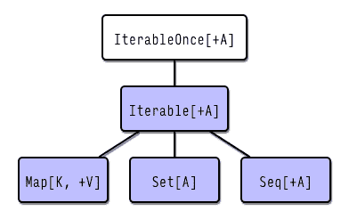
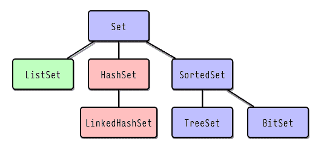
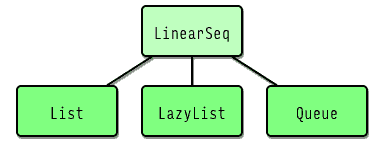
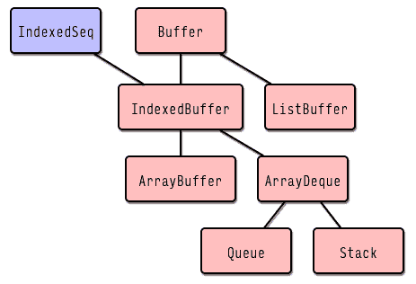

# 第一章：Scala 2.13 简介

在撰写本文时，Scala 2.13 已经达到了五年的里程碑，并接近第一个候选版本。在这个时候，其功能集不太可能发生变化，因此可以安全地查看更新的新特性。

在本章中，我们将讨论发布的范围，将对话的重点放在其核心——新的集合库上。

本章将讨论以下主题：

+   Scala 2.13 简介

+   Scala 2.13 的新特性

+   Scala 2.13 集合库

# 技术要求

+   JDK 1.8+

+   SBT 1.2+

本章的源代码可在[`github.com/PacktPublishing/Learn-Scala-Programming/tree/master/Chapter01`](https://github.com/PacktPublishing/Learn-Scala-Programming/tree/master/Chapter01)找到。

# Scala 2.13 简介

Scala 2.13 是 Scala 编程语言的最新小版本更新。尽管看起来版本号只是一个小小的提升，但这个发布比它可能看起来更重要。

原因在于其主要关注的是经过重新设计的集合库，该库将取代在版本 2.8 中引入的当前版本，并在版本 2.9 中进行了轻微的重新设计。

新的集合框架将在 Scala 2 中保留，并也将成为 Scala 3 的一部分。

由于它主要是一个库发布，与上一个版本相比，语言本身的变化不大。除了集合之外，新版本在三个方面进行了改进：

+   最小化核心库

+   加快编译器速度

+   提高用户友好性

这些细节超出了本书的范围，我们不会进一步讨论。

此外，还增加了字面量和单例类型，我们将在第二章“理解 Scala 中的类型”中详细讨论，以及一些对标准库的微小更改，我们将在深入研究映射和列表之前查看这些更改。

想要展望未来吗？我们将带你前往那里！

# Scala 2.13 的新特性

在本节中，我们将讨论新版本中的一些小改进，这些改进与集合主题无关，也不真正属于某些更大的主题，例如字符串字面量的可选解析、向案例类添加名称报告函数、链式操作的方法以及自动资源管理。

# 字符串字面量的可选解析

在 Scala 2.13 中，`StringOps` 已扩展了返回 `Option` 的方法，用于字符串字面量解析。支持的类型包括所有数值类型和 `Boolean`。

新的方法可以极大地简化处理用户提供的数据，无需将调用用异常处理包装起来，如下面的示例所示：

```java
scala> "10".toIntOption
res3: Option[Int] = Some(10)
scala> "TrUe".toBooleanOption
res4: Option[Boolean] = Some(true)
scala> val bool = "Not True"
bool: String = Not True
scala> bool.toBooleanOption
res5: Option[Boolean] = None
```

可选的 `Boolean` 解析忽略参数的大小写，与抛出异常的 `toBoolean` 方法相同。

# 产品可以报告其元素名称

这个特性可能主要用于案例类，因为它使得在不使用反射或宏的情况下进行一些泛型编程成为可能。

以下示例演示了如何使用新的 `productElementName(idx)` 方法构建一个简单的 JSON 序列化器，用于简单案例类：

```java
case class User(name: String, surname: String, email: String)

def naiveToJsonString(p: Product): String =
  (for { i <- 0 until p.productArity } yield
    s""""${p.productElementName(i)}": "${p.productElement(i)}"""")
    .mkString("{ ", ", ", " }")
```

显然，这个简单的迭代不考虑嵌套和转义，但它已经在基本情况下可以产生有效结果：

```java
scala> val user = User("John", "Doe", "jd@mail.me")
user: User = User(John,Doe,jd@mail.me)
scala> naiveToJsonString(user)
res1: String = { "name": "John", "surname": "Doe", "email": "jd@mail.me" }
```

不幸的是，当索引无效时，取元素索引的方法会抛出异常：

```java
scala> user.productElementName(3)
java.lang.IndexOutOfBoundsException: 3
 at User.productElementName(<console>:1)
 ... 38 elided
```

我们将在第六章“探索内置效果”中讨论为什么抛出异常不是最佳方法，以及可行的替代方案。

# 添加了链式操作的方法

通过 `import scala.util.chaining._`，现在可以将 `tap` 和 `pipe` 方法添加到任何类型的实例中。该功能由对 `ChainingOps` 的隐式转换提供。我们将在第四章“了解隐式和类型类”中详细查看隐式。

`pipe` 方法将给定的函数应用于值并返回结果。在需要将嵌套函数调用转换为类似流式接口的代码的情况下，这可能很有帮助。以下代码片段展示了通过 `pipe` 链接嵌套函数调用的一个虚构用户数据库示例。

考虑以下数据库接口：

```java
object UserDb {
  def getById(id: Long): User = ???
  def update(u: User): User = ???
  def save(u: User): Boolean = ???
}
```

我们可以将所有三个操作一次性应用于用户：

```java
import UserDb._
val userId = 1L
save(update(getById(userId)))
```

`pipe` 允许我们以更可读的格式表示这一点：

```java
getById(userId).pipe(update).pipe(save)
```

可以认为，通过在应用之前组合函数，可以得到相同（或更清晰）的结果：

```java
val doEverything = (getById _).andThen(update).andThen(save)
doEverything(userId)
```

我们将在第三章“深入函数”中查看函数，特别是函数组合。

`tap` 方法仅为了产生副作用而应用作为参数传递的函数，并返回原始值。例如，它可能对日志记录目的和最简单的性能测量很有用。

以下代码片段演示了一个基本的副作用引起性能跟踪实现，该实现利用全局变量：

```java
scala> import scala.util.chaining._
import scala.util.chaining._
scala> val lastTick = new java.util.concurrent.atomic.AtomicLong(0)
lastTick: java.util.concurrent.atomic.AtomicLong = 0
scala> def measureA: Unit = {
     | val now = System.currentTimeMillis()
     | val before = lastTick.getAndSet(now)
     | println(s"$a: ${now-before} ms elapsed")
     | }
measure: AUnit
scala> def start(): Unit = lastTick.set(System.currentTimeMillis())
start: ()Unit
scala> start()
scala> val result = scala.io.StdIn.readLine().pipe(_.toIntOption).tap(measure)
None: 291 ms elapsed
result: Option[Int] = None
scala> val anotherResult = scala.io.StdIn.readLine().pipe(_.toIntOption).tap(measure)
Some(3456): 11356 ms elapsed
anotherResult: Option[Int] = Some(3456)
```

在这里，我们定义了一个全局的 `AtomicLong` 类型的值来存储最后测量的时间戳。然后我们定义了一个多态的 `measure` 方法，它捕获最后测量时刻和现在之间的时间，以及一个 `start` 方法来重置时钟。之后，我们可以使用 `tap` 方法来跟踪我们动作的执行时间。

我们将在第二章在 Scala 中理解类型中讨论类型和多态性，在第八章处理效果中讨论副作用和更一般的概念，并展示全局变量和全局状态存在的缺点，这些内容在第九章熟悉基本 Monads 中。

# 自动资源管理

Scala 2.13 添加了一种自动管理资源的方法。我们将在第九章熟悉基本 Monads 和第十章`scala.util.Using`中讨论其他管理资源的方法和实现依赖注入，它允许我们以熟悉的方式执行副作用。所有对资源的操作都被封装在`Try`中，我们将在第六章探索内置效果中讨论。如果抛出`Exceptions`，则`Try`中返回第一个异常。在某些边缘情况下，异常处理相当复杂，我们邀请读者查阅 ScalaDoc 以获取其详细描述。

`Using`是一个类，它接受一些资源作为 by-name 参数。资源可以是任何具有`scala.util.Resource`类型类实例的对象。标准库中提供了`java.lang.AutoCloseable`的实例。我们将在第四章了解隐式和类型类中研究类型类。`Using`还有一个单调接口，允许我们在 for-comprehensions 中组合多个资源。我们将在第九章熟悉基本 Monads 中讨论单调性。

这里是`Using`的实际应用示例。我们将定义一个实现`AutoCloseable`的资源，并在 for-comprehension 中将这些资源作为数据源：

```java
scala> import scala.util.{Try, Using}
import scala.util.{Try, Using}
scala> final case class Resource(name: String) extends AutoCloseable {
 | override def close(): Unit = println(s"Closing $name")
 | def lines = List(s"$name line 1", s"$name line 2")
 | }
defined class Resource
scala> val List(r1, r2, r3) = List("first", "2", "3").map(Resource)
r1: Resource = Resource(first)
r2: Resource = Resource(2)
r3: Resource = Resource(3)

scala> val lines: Try[Seq[String]] = for {
     | u1 <- Using(r1)
     | u2 <- Using(r2)
     | u3 <- Using(r3)
     | } yield {
     | u1.lines ++ u2.lines ++ u3.lines
     | }
Closing 3
Closing 2
Closing first
lines: scala.util.Try[Seq[String]] = Success(List(first line 1, first line 2, 2 line 1, 2 line 2, 3 line 1, 3 line 2))
```

控制台输出显示结果包含所有资源的行，并且资源本身会按相反的顺序自动关闭。

现在，经过这个小热身，我们准备深入探讨 2.13 版本的基础——新的集合库。

# Scala 2.13 集合库

Scala 2.13 提供了一个新的集合库，由于历史原因，它也被称为“集合 - strawman”。该库的重构追求几个主要目标，例如修复前一个版本中的常见问题，简化其实施和内部结构，以及使用和向后兼容性，实现与懒集合和 Java 流的更好集成，以及可变和不可变集合之间更清晰的 API 分离，提高性能，最后但同样重要的是，最小化从 Scala 2.12 集合迁移的工作量。

因此，我们有一个与上一个版本大部分源代码兼容的库，其中包含许多旧方法和类型（如`Traversable`、`TraversableOnce`和`Stream`）已被弃用，并且内部层次结构更加简单。

本书假设读者对 Scala 集合有基本的理解。基于这个假设，下一节将采取整体方法，重点介绍新集合框架的统一概述。

下一个图表示集合库的顶级层次结构：



从这里开始，我们将假设总是有`import scala.collections._`在作用域内，并在我们的图中使用以下颜色编码：


每个特质描述了结构，即集合的*本质*。正如其名所示，`IterableOnce`只能迭代一次。`Iterable`放宽了这个限制，使得可以多次迭代集合。`Seq`为集合的元素添加了连续性的概念，`Set`为其元素添加了唯一性的约束，而`Map`将集合的类型从单个元素`A`更改为键值对，键为`K`，值为`V`。

如前所述，本着关注点分离的精神，这些特质仅涵盖结构特性。为特定类型定义的操作被放置在带有`Ops`后缀的辅助特质中。这些特质形成一个类似于之前的层次结构，如下所示：


与“正常”特质只有一个类型参数（元素类型）不同，`Ops`有三个类型参数。除了元素类型`A`外，`C`类型描述了此特质混合到的集合的特定*表示*类型，以及此集合上定义的一阶方法的返回类型。`CC`类型指的是可以由高阶方法返回的表示类型或类型构造函数。我们将在本章后面看到这是如何在实际中工作的。

由于继承树的结构如此，`IterableOps`和`IterableOnceOps`实际上被混合到库中的每个集合实现中。底部的三个特质仅添加了一些针对特定集合类型的独特方法，并覆盖了一些定义以提高效率。`Iterable*Ops`特质定义了超过一百个方法，这也是 Scala 集合库非常一致和同质化的原因。

由于`IterableOnceOps`和`IterableOps`的重要性，我们将在下一节详细探讨它们。之后，我们将探索专用集合的独特特性。

# IterableOnceOps

`IterableOnceOps` 代表可以一次或多次遍历的集合的蓝图。它定义了一些必须由每个集合实现的抽象方法，以及一些以 `IterableOnce` 中可用的迭代器为依据的具体方法。具体方法提供默认（如果可能）的懒实现，并分为以下几类：

+   **大小操作：** `isEmpty`、`nonEmpty`、`size`、`knownSize` 和 `isTraversableAgain` 检查集合的（非）空性或返回其大小。`knownSize` 是一种优化，如果无法在不遍历集合的情况下确定大小，则返回 `-1`。`isTraversableAgain` 对于 `IterableOnce` 返回 `false`。

+   **元素测试：** `forall`、`exists` 和 `count` 检查所有、至少一个或某些数量的元素是否满足给定的谓词。

+   **字符串操作：** `mkString` 和 `addString`。这些方法具有不同的参数集，提供了构建替代字符串表示的可能性。

+   **转换为其他集合：** `copyToArray`、`toList`、`toMap`、`to`、`toSet`、`toSeq`、`toIndexedSeq`、`toBuffer` 和 `toArray`。这些方法将 `Iterable` 复制或转换为另一个集合。`to` 方法在这个列表中是特殊的，因为它允许我们返回具有可用 `Factory` 的任何类型的集合。我们很快会详细探讨它。

+   **折叠和归约：** `foldLeft`、`foldRight`、`reduce`、`reduceLeft`、`reduceRight`、`reduceOption`、`reduceLeftOption` 和 `reduceRightOption` 将二元运算应用于集合的元素。`reduce*Option` 方法通过返回 `None` 来优雅地处理空集合的情况。

+   **数值组合：** `sum` 和 `product` 如果存在隐式的 `Numeric[B]` 使得 `B >: A` 可用，则计算元素的求和或乘积。

+   **排序组合：** `min`、`minOption`、`max`、`maxOption`、`maxBy`、`maxByOption`、`minBy` 和 `minByOption` 如果存在隐式的 `Ordering[B]` 使得 `B >: A` 可用，则找到满足给定谓词的集合元素。`*Option` 方法在空集合的情况下返回 `None` 而不是抛出异常。

+   **元素检索：** `collectFirst` 和 `find`。选择满足给定条件的元素。

+   **平等性：** `corresponds` 是比较集合的另一种方式。如果这个集合的每个元素都通过给定的谓词与另一个集合的匹配元素相关联，则满足条件。

抽象方法分为以下几类：

+   **子集合检索：** `filter`、`filterNot`、`take`、`takeWhile`、`drop`、`dropWhile`、`slice` 和 `span`。从整个集合或其开始处取出或丢弃满足给定谓词或范围的元素。

+   **映射：** `map`、`flatMap`、`collect` 和 `scanLeft`。通过应用某个函数并可能过滤结果来转换集合的元素。

+   **Zipper:** `zipWithIndex` 为集合的所有元素添加一个索引。

# IterableOps

`IterableOps` 扩展了 `IterableOnceOps` 并包含了一些不可能在不允许多次遍历集合的情况下实现的方法。

它们分为以下几类：

+   **元素检索:** `head`, `headOption`, `last`, 和 `lastOption` 返回集合的第一个或最后一个元素，对于空集合抛出 `NoSuchElementException` 或返回 `None`。

+   **大小:** `sizeCompare` 是一种优化，允许我们有效地比较集合与给定值的大小。

+   **子集合检索:** `partition`, `partitionWith`, `splitAt`, `takeRight`, `dropRight`, `grouped`, `sliding`, `tail`, `init`, `groupBy`, `groupMap`, `groupMapReduce`, `tails`, 和 `inits`。这些方法根据某些谓词或索引拆分集合，从末尾取或丢弃元素，根据某些标准或谓词对元素进行分组，可能应用转换函数，并丢弃第一个或最后一个元素。

+   **映射:** `scanRight` 生成一个包含从集合末尾开始应用给定函数的累积结果的集合。

+   **添加:** `concat, ++` 返回包含此集合和作为参数提供的集合中所有元素的另一个集合。

+   **Zipper:** `zip`, `zipAll`, `unzip`, 和 `unzip3` 将集合的元素与另一个集合的元素组合成一个产品，或者将它们拆分成单独的集合。

+   **转换:** `transpose` 通过将行转换为列和相反的方式转换集合的集合。

在 `IterableOnceOps` 中定义的以下方法在 `IterableOps` 中得到了具体的默认实现：`filter`, `filterNot`, `take`, `takeWhile`, `span`, `drop`, `dropWile`, `slice`, `scanLeft`, `map`, `flatMap`, `flatten`, `collect`, 和 `zipWithIndex`。`isTraversableAgain` 被覆盖以返回 `true`。

值得注意的是，`Iterable` 和 `IterableOnce` 不支持通用相等操作，它是在特定的集合子类型上定义的。因此，无法使用相等操作直接比较这些类型，如下面的示例所示：

```java
scala> Set(1,2,3) == Seq(1,2,3)
res4: Boolean = false
```

此外，还有三个特别值得注意的方法，因为它们引入了尚未遇到过的类型：

+   `def withFilter(p: A => Boolean): collection.WithFilter[A, CC]`

+   `def iterableFactory: IterableFactory[CC]`

+   `def view: View[A]`

在继续讨论更具体的集合类型之前，让我们快速地讨论一下它们。

# WithFilter

`WithFilter` 是一个模板类，它包含 `Iterable` 的 `map`, `flatMap`, `foreach`, 和 `withFilter` 方法。它允许我们对特殊集合进行映射和过滤操作的专门化。

由于其技术性质，我们在这里不会进一步详细介绍。

# IterableFactory

`trait IterableFactory[+CC[_]]` 是特定集合伴随对象的基特质，它提供了一系列操作来创建由 `CC` 类型构造器指定的特定集合；这有时被称为 *目标类型驱动构建*，因为源集合的类型被忽略。集合库中的大多数伴随对象都扩展了这个特质，这使得它们可以在期望 `IterableFactory` 的地方使用。

作为允许从头开始构建集合的主要抽象，了解它提供的方法是有用的。所有这些方法都返回 `CC[A]`。以下表格包含了一个简要总结：

| `def fromA` | 从现有的 `IterableOnce` 创建目标集合。 |
| --- | --- |
| `def empty[A]: CC[A]` | 一个空集合，通常定义为对象。 |
| `def applyA: CC[A]` | 从给定的 var-arg `elems` 创建集合。 |
| `def iterateA(f: A => A): CC[A]` | 使用对 `start` 的应用结果、然后是生成的值，依此类推，重复 `len` 次来填充集合。 |
| `def rangeA : Integral: CC[A]` | 包含递增整数 `[start, end-1]` 的集合，相邻数字之间的差为 `step`。此方法还有一个默认值 `step = 1` 的版本。 |
| `def fillA(elem: => A): CC[A]` | 使用 `n` 次对 `elem` 的评估来填充集合。此函数有高达五维的变体。 |
| `def tabulateA(f: Int => A): CC[A]` | 与 `fill` 相同，但使用索引作为评估的参数。类似地，此函数有高达五维的变体。 |
| `def concatA: CC[A]` | 将所有参数集合连接成一个单一集合。 |
| `def unfoldA, S(f: S => Option[(A, S)]): CC[A]` | 调用 `f` 来生成集合的元素，使用并修改从 `init` 状态开始的内部状态。 |

诚然，`IterableFactory` 提供了许多创建所需类型集合的不同可能性。

# 视图

`View` 在库的新版本中已被重新实现。现在它代表一个具体化的 `Iterator` 操作。

具体化是将关于计算机程序的概念转化为编程语言中创建的显式数据模型或其他对象的过程 ([`en.wikipedia.org/wiki/Reification_(computer_science)`](https://en.wikipedia.org/wiki/Reification_(computer_science))[)。](https://en.wikipedia.org/wiki/Reification_(computer_science))

这意味着 `Iterator` 方法被表示为 `View` 的子类，并封装了要应用的转换。评估发生在视图转换为严格集合类型或遍历（例如使用 `foreach` 方法）的时刻。视图不 *记住* 源集合的类型。以下示例可以证明这一点。首先，我们定义一个通用的转换，它可能是严格的或懒散的，这取决于作为参数提供的集合类型：

```java
def transform[C <: Iterable[Char]](i: C): Iterable[Char] = i 
map { c => print(s"-$c-"); c.toUpper } 
take { println("\ntake");  6 }
```

接下来，对于每个转换步骤，我们在步骤发生时在控制台打印其结果。现在我们可以比较懒散和严格集合的行为：

```java
val str = "Scala 2.13"
val view: StringView = StringView(str)
val transformed = transform(view)    // A
val strict = transform(str.toList)   // B
print("Lazy view constructed: ") 
transformed.foreach(print) // C
print("\nLazy view forced: ")
println(transformed.to(List)) // D
println(s"Strict: $strict") // E
```

这段代码在 REPL 中产生以下输出：

```java
take
-S--c--a--l--a-- --2--.--1--3-
take
Lazy view constructed: -S-S-c-C-a-A-l-L-a-A- - 
Lazy view forced: -S--c--a--l--a-- -List(S, C, A, L, A, )
Strict: List(S, C, A, L, A, )
```

在第一行中，我们可以看到 `take` 方法始终严格评估，无论底层集合类型如何——这在上面的代码中注释为 `A`。第二行和第三行显示了 `List[Char]` 的严格评估，代码中的 `B` 行。第 4 行和第 5 行演示了 `View[Char]` 被评估两次，每次在强制转换的时刻，一次是通过调用 `foreach`（代码中的 `C` 行），一次是通过将其转换为 `List`（代码中的 `D` 行）。还有一点值得注意的是，即使在链中的第一个转换步骤，`map` 也只应用于 `take` 方法的输出。

# 集合

`Set` 是具有元素唯一概念集合的基特质。它定义为 `trait Set[A] extends Iterable[A] with SetOps[A, Set, Set[A]] with Equals`。我们可以看到它实际上是一个 `Iterable`，在 `SetOps` 中定义了一些额外的操作，并在集合之间添加了等价性的概念。`Set` 的子层次结构在以下图中表示：



之前提到的 `SetOps` 在 `IterableOps` 上添加了一些方法。这些方法在此处显示：

+   **元素检索：** `contains` 和 `apply` 如果这个集合包含一个给定元素，则返回 `true`。

+   **等价性：** `subsetOf` 和 `subsets` 检查这个集合是否是另一个集合的子集，或者返回这个集合的所有子集，可能还有给定的大小。

+   **与另一个集合的组合：** `intersect`、`&`、`diff`、`&~`、`concat`、`++`、`union` 和 `|`。这些方法计算这个集合与另一个集合的交集、差集或并集。

层次结构中很少有类增强了 `Set` 的进一步属性：

+   **SortedSet** 通过 `SortedOps[A, +C]` 扩展了 `Set`，并有两个不可变和两个可变实现——两个 `TreeSets` 和两个 `BitSets`。`SortedOps` 实现了以下依赖于 `Ordering` 概念的方法：

+   **键检索：** `firstKey` 和 `lastKey` 返回这个集合的第一个或最后一个元素。

+   **子集合检索：** `range`、`rangeFrom`、`rangeUntil` 和 `rangeTo` 创建了这个集合的按范围投影，满足给定的标准。

由于重载，`SortedSet` 定义了多次重载方法，包括带排序和不带排序的。如果操作旨在应用于底层的未排序 `Set`，则必须强制转换类型：

```java
scala> import scala.collection.SortedSet
import scala.collection.SortedSet
scala> val set = SortedSet(1,2,3)
set: scala.collection.SortedSet[Int] = TreeSet(1, 2, 3)
scala> val ordered = set.map(math.abs)
ordered: scala.collection.SortedSet[Int] = TreeSet(1, 2, 3)
scala> val unordered = set.to(Set).map(math.abs)
unordered: scala.collection.immutable.Set[Int] = Set(1, 2, 3)
```

请注意，在 `Set` 的情况下，直接类型注解将不起作用，因为其定义是不变的：

```java
scala> val set1: Set[Int] = SortedSet(1,2,3)
                                     ^
       error: type mismatch;
        found : scala.collection.SortedSet[Int]
        required: Set[Int]
```

`Set` 的不变性与其扩展函数 `A => Boolean` 的事实相关，该函数返回 `true` 如果集合包含给定元素。因此，集合可以用于期望此类单参数函数的地方：

```java
scala> ordered.forall(set)
res3: Boolean = true
```

除了 `TreeSet` 和 `BitSet` 之外，还有四个更具体的集合实现：

+   `ListSet` 使用基于列表的数据结构实现不可变集合。

+   不可变的 `HashSet` 使用压缩哈希数组映射前缀树（CHAMP）实现不可变集合。

+   可变的 `HashSet` 和 `LinkedHashSet` 使用哈希表实现可变集合，分别存储无序和有序的数据。

集合与 `Map` 密切相关，它表示一个元素以键值对形式表示的集合。

# Map

`Map` 被定义为 `trait Map[K, +V] extends Iterable[(K, V)] with MapOps[K, V, Map, Map[K, V]] with Equals`，这使得它成为一个键值对 `K` 和 `V` 的 `Iterable`，并定义了映射之间的相等性概念。它还定义了映射的类层次结构，如下面的图中所示：


有三种不同的 `MapOps`，一个适用于可变和不可变，以及一个针对这些形式的每个具体形式。

`MapOps` 通过以下特定操作扩展了 `IterableOps`：

+   **元素检索**：`get`、`getOrElse`、`apply`、`applyOrElse`、`default`、`contains` 和 `isDefinedAt`。这些方法允许我们通过给定的键检索值或检查值是否存在，可选地返回默认值或如果找不到键则抛出异常。

+   **子集合检索**：`keySet`、`keys`、`values`、`keysIterator` 和 `valuesIterator` 允许我们以不同形式获取键或值。

+   **映射**：`map`、`flatMap` 和 `collect` 转换并可选地过滤键值对的配对。

+   **添加**：`concat` 返回一个包含两个映射元素的新集合。

`immutable.MapOps` 在 `MapOps` 的基础上添加了以下方法：

+   **元素移除**：`remove`、`removeAll` 和 `--` 从映射中移除一个或所有给定元素，并返回新的映射。

+   **元素更新**：`updated` 和 `+` 使用给定的键更新元素，并返回新的映射。

+   **映射**：`transform` 将给定的函数应用于所有元素，生成一个新的映射，其返回结果作为值。

`mutable.MapOps` 与可变映射相比，有一组不同的方法：

+   **元素添加**：`put` 添加新值或更新现有值。

+   **元素更新**：`updated`、`+` 和 `getOrElseUpdate` 在原地更新值。

+   **元素移除**：`remove` 和 `clear` 用于从映射中移除一个或所有元素。

+   **过滤：** `filterInPlace` 仅保留满足谓词的映射。

+   **映射：** `mapValuesInPlace` 对映射的值应用转换，并将返回的结果作为值存储。

一般的 `Map` 定义有相当多的专用子类型，如前图所示。我们现在将快速浏览它们。

# SortedMap

`SortedMap` 与 `SortedSet` 类似。它有两种实现，可变和不可变的 `TreeMap`，并提供了一些以 `SortedOps` 为基础的方法定义：

+   **子集合检索：** `iteratorFrom`、`keysIteratorFrom`、`valuesIteratorFrom` 和 `rangeTo` 给我们提供了以迭代器形式获取映射元素的方法。

+   **元素检索：** `firstKey`、`lastKey`、`minAfter` 和 `maxBefore` 允许我们检索满足某些排序条件的元素。

# HashMap

`HashMap` 也有两种形式——不可变和可变。

不可变的 `HashMap` 使用 CHAMP 树实现。

可变的 `HashMap` 使用散列表实现可变映射。散列表将其元素存储在数组中。项目的哈希码用于计算数组中的位置。

# MultiMap

`MultiMap` 是一个用于可变映射的特质，该映射将多个值分配给一个键。

它定义了 `addBinding`、`removeBinding` 和 `entryExists` 方法，可用于查询或操作键的条目。

# SeqMap

`SeqMap` 是有序不可变映射的泛型抽象。`SeqMap` 本身存在可变和不可变两种形式。这些形式有几种不同的实现：

+   不可变的 **ListMap** 使用基于列表的数据结构实现不可变映射。遍历 `ListMap` 的方法按插入顺序访问其元素。

+   可变的 **ListMap** 是一个由列表支持的简单可变映射。它像其不可变兄弟一样保留插入顺序。

+   **VectorMap** 仅存在于不可变形式。它使用基于向量/映射的数据结构实现，并保留插入顺序。它具有常数查找速度，但其他操作较慢。

+   **LinkedHashMap** 是一个基于散列表的可变映射，如果迭代，则保留插入顺序。

# Seq

`Seq` 可能是库中最普遍的集合。像 `Map` 一样，它有元素连续性的概念，元素有索引。它定义为 `trait Seq[+A] extends Iterable[A] with PartialFunction[Int, A] with SeqOps[A, Seq, Seq[A]] with Equals`。与映射类似，`Seq` 也指定了对等关系支持，并扩展了 `PartialFunction`，它接受元素索引作为参数。由于有许多类实现了 `Seq`，我们将采取逐步的方法，逐级查看。`Seq` 的直接子类如下图所示：


`scala.Seq` 在之前的 Scala 版本中已知，现在被 `scala.collection.immutable.Seq` 替换。

与其他集合一样，`SeqOps` 通过添加相当多的方法来扩展 `IterableOps`：

+   **元素检索：** `apply` 通过给定索引检索一个元素。

+   **索引和搜索：** `segmentLength`、`isDefinedAt`、`indexWhere`、`indexOf`、`lastIndexOf`、`lastIndexWhere`、`indexOfSlice`、`lastIndexOfSlice`、`containsSlice`、`contains`、`startsWith`、`endsWith`、`indices` 和 `search`。这些方法允许我们检索有关元素或子序列的存在或索引的信息，给定某些谓词或元素值。

+   **大小：** `length` 和 `lengthCompare` 提供了高效的操作来检索集合的长度。

+   **添加操作：** `prepend`、`+`、`appended`、`:+`、`prependAll`、`++`、`appendedAll`、`:++`、`concat` 和 `union`。可用于向集合中追加或前置一个或多个元素。

+   **过滤：** `distinct` 和 `distinctBy` 移除重复项，可能给定一些谓词。

+   **反转：** `reverse` 和 `reverseIterator` 返回一个新集合，其元素顺序相反。

+   **排序：** `sorted`、`sortWith` 和 `sortBy` 根据某些隐式 `Ordering` 或给定函数或两者进行排序。

+   **等价性：** `sameElements` 和 `corresponds` 检查此集合是否包含与给定顺序相同的元素，使用等价性检查或提供的比较函数。

+   **子集合检索：** `permutations` 和 `combinations`。这些方法允许我们检索满足给定条件的子集合（子集合）。

+   **更新：** `diff`、`intersect`、`patch`、`updated` 和 `update`（可变）。使用另一个集合或元素修改此集合的元素，并返回另一个集合（除了在 `mutable.Seq` 上定义的最后一个方法，它是在原地更新元素）。

每个 `Seq` 的直接子类都有自己的特定属性和实现子树。我们现在将快速浏览它们。

# IndexedSeq

`IndexedSeq` 不引入新的操作，至少在其不可变版本中不是这样，但它覆盖了在 `SeqOps` 中定义的许多方法以提供更有效的实现。有四个类实现了它：


`mutable.`**IndexedSeq** 添加了以下**变异选项**：`mapInPlace`、`sortInPlace`、`sortInPlaceWith` 和 `sortInPlaceBy`。

`mutable.`**ArraySeq** 是表示 `Array` 的集合。它定义了一个返回底层数组的 `array` 方法，以及一个返回所需元素类型的标签的 `elemTag` 方法，以正确支持 JVM 所需的不同类型的数组。由于这个要求，它为所有原始类型（包括数值类型，除了 `ofByte` 之外，还有所有其他数值原始类型的实现，图中未显示）以及 `Boolean`、`AnyRef` 和 `Unit` 提供了单独的实现。

`immutable.`**ArraySeq**是在版本 2.13 中添加的。它实际上是一个包装数组的不可变序列，用于传递可变参数。它与其可变表亲有相同的后代。

**范围**是一个包含整数值的不可变结构。它由`start`、`end`和`step`定义。还有两个额外的方法可用：`isInclusive`，对于`Range.Inclusive`为`true`，对于`Range.Exclusive`为`false`，以及`by`，它使用不同的`step`但相同的`start`和`end`创建新的范围。

**向量**是一个不可变的结构，它提供了常数时间的访问和更新，以及快速的追加和预追加。正因为如此，`Vector`是`IndexedSeq`的默认实现，如下代码片段所示：

```java
scala> IndexedSeq.fill(2)("A")
res6: IndexedSeq[String] = Vector(A, A)
```

`WrappedString`是某些`String`的不可变包装器。它通过`IndexedSeqOps`中定义的所有操作扩展了字符串。

# 线性序列

线性序列有头和尾的概念。定义看起来像`trait LinearSeq[+A] extends Seq[A] with LinearSeqOps[A, LinearSeq, LinearSeq[A]]`，类图如下所示：



`LinearSeq`有三个代表，它们都是不可变的：

+   **列表**定义了三个符号方法，为模式匹配和构建列表提供了良好的语法。`::`将元素追加到列表中，`:::`将给定列表的所有元素追加到列表中，而`reverse_:::`将给定列表的所有元素以相反的顺序追加到列表中。

+   **懒列表**是自 Scala 2.13 以来可用的一种新的不可变集合。它实现了一个带有`head`和`tail`的列表，这些部分只有在需要时才会被评估。由于它在尾部比只有尾部是懒的`Stream`更优越，因此`Stream`现在已被弃用。`LazyList`有两个额外的方法，`force`用于评估它，以及`lazyAppendAll`，它以懒方式将给定的集合追加到这个列表中。

+   在这个层次结构中，**队列**也是不可变的。它允许以先进先出（FIFO）的方式插入和检索元素。为此，它定义了`enqueue`、`enqueueAll`、`dequeue`、`dequeueOption`和`front`方法。

# 缓冲区

`Buffers`总结了我们对集合库的快速浏览。本质上，`Buffer`只是一个可以增长和缩小的`Seq`。这个子层次结构只以不可变的形式存在，尽管`IndexedBuffer`从`Buffer`和`IndexedSeq`继承，如下一图所示：



让我们来看看这些集合定义的方法，以及从`SeqOps`继承的定义：

+   **缓冲区**定义了在原地添加或删除一个或多个元素或返回新缓冲区的方法：`prepend`、`append`、`appendAll`、`+=:`、`prependAll`、`++=`、`insert`、`insertAll`、`remove`、`subtractOne`、`trimStart`、`trimEnd`、`patchInPlace`、`dropInPlace`、`dropRightInPlace`、`takeRightInPlace`、`sliceInPlace`、`dropWhileInPlace`、`takeWhileInPlace`和`padToInPlace`。

+   **ListBuffer**是一个由`List`实现的具体系列缓冲实现。除了其他讨论过的方法外，它还提供了`prependToList`，允许我们将这个集合添加到另一个列表中，以及一个三元组`mapInPlace`、`flatMapInPlace`和`filterInPlace`，这使我们有机会就地修改元素。

+   取一个`Buffer`，添加一个`IndexedSeq`，你将得到一个**IndexedBuffer**。类似于`ListBuffer`，它提供了`flatMapInPlace`和`filterInPlace`方法。

+   **ArrayBuffer**是`IndexedBuffer`的一个具体实现，它使用数组来存储其元素，并且对于追加、更新和随机访问具有常数时间。它有一个`sizeHint`方法，可以用来扩大底层数组。如果创建了`mutable.Seq`，它是一个默认实现。

+   **ArrayDeque**是 2.13 版本中出现的一个高效的集合。它实现了一个双端队列，内部使用可调整大小的环形缓冲区。这允许在追加、预追加、移除第一个元素、移除最后一个元素和随机访问操作上具有常数时间。这个集合上还有许多其他方法，这主要是因为第二端的概念：`removeHeadOption`、`removeHead`、`removeLastOption`、`removeLast`、`removeAll`、`removeAllReverse`、`removeHeadWhile`、`removeLastWhile`、`removeFirst`、`removeAll`、`clearAndShrink`、`copySliceToArray`和`trimToSize`。

+   在这个层次结构中的**队列**是可变的。它基于`ArrayDeque`，并允许我们以 FIFO（先进先出）的方式插入和检索元素。为此提供了以下方法：`enqueue`、`enqueueAll`、`dequeue`、`dequeueFirst`、`dequeueAll`和`dequeueWhile`。

+   **Stack**与`Queue`类似，但它实现的是后进先出（LIFO）顺序而不是 FIFO。它定义的方法是以相应的术语表述的：`push`、`pushAll`、`pop`、`popAll`、`popWhile`和`top`。

# Scala Collection Contrib 库

不言而喻，标准的 Scala 集合库非常丰富，为大多数常见用例提供了集合。但当然，还有一些可能在许多特定情况下有用的结构。Scala 集合`Contrib`模块是 Scala 拥有稳定标准库和一些额外功能的方式。从某种意义上说，这个模块是新集合类型的孵化器；那些被证明对广大用户有用的类型可能会在未来的 Scala 版本中被纳入标准库。

目前，该模块中有四种集合类型可用，每种类型都是可变的和不可变的：

+   `MultiDict`

+   `SortedMultiDict`

+   `MultiSet`

+   `SortedMultiSet`

此外，这个库还提供了一个通过隐式丰富来定义现有集合上额外操作的可能性。以下导入是使其可用的必要条件：

```java
import scala.collection.decorators._
```

它还提供了以下方法：

+   在 Seq 上：`intersperse`和`replaced`

+   关于 Map：`zipByKey`、`join`、`zipByKeyWith`、`mergeByKey`、`mergeByKeyWith`、`fullOuterJoin`、`leftOuterJoin`和`rightOuterJoin`

请查阅[`github.com/scala/scala-collection-contrib`](https://github.com/scala/scala-collection-contrib)模块文档以获取更多详细信息。

# 摘要

Scala 2.13 是 Scala 的一个小更新，主要关注重新设计的集合库。标准库中的一些小增补，如自动资源管理，只是强调了这一点。

新的集合库主要由两个形状相似的混合继承层次结构组成。第一个层次结构的成员描述了集合的结构，而第二个层次结构的成员——在这个集合类型上可用的操作。由于继承关系，位于树中较低位置的集合定义了针对更具体集合的额外方法，并覆盖了父特质定义的方法，以提供更高效的实现。

三个主要的集合类型是`Seq`、`Set`和`Map`。每种类型都有多种实现，适用于特定的情况。Set 也是一个单参数函数；`Seq`和`Map`是`PartialFunctions`。

大多数集合都提供可变和不可变的形式。

除了集合层次结构之外，还有一个概念叫做 View，它是迭代器操作的具体化定义，可以用来对集合进行懒加载的转换。另一个相关的抽象是`IterableFactory`，它实现了一些创建集合实例和在不同集合表示之间进行转换的通用方法。

在下一章中，我们将把我们的重点从 2.13 版本的特性转移到对 Scala 的一般探索，从其类型系统开始。

# 问题

1.  描述两种使某些资源`R`能够与`scala.util.Using`资源管理实用工具一起使用的方法。

1.  如何比较一个`Set`实例和一个`List`实例？

1.  为不可变`Seq`命名默认的具体实现。

1.  为不可变索引`Seq`命名默认的具体实现。

1.  为可变`Seq`命名默认的具体实现。

1.  为可变索引`Seq`命名默认的具体实现。

1.  有时候人们说`List.flatMap`比预期的更强大。你能解释为什么吗？

1.  描述一种方法，使用不同的函数多次映射集合，但又不产生中间集合。

# 进一步阅读

+   Mads Hartmann, Ruslan Shevchenko，专业 Scala：在允许你为 JVM、浏览器等构建环境的条件下，编写简洁且富有表现力的、类型安全的代码。

+   Vikash Sharma，*学习 Scala 编程：**学习如何在 Scala 中编写可扩展和并发程序，这是一种随着你成长的语言*。
