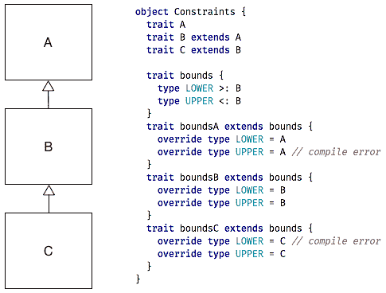
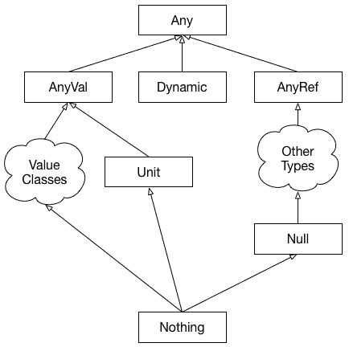

# 第二章：理解 Scala 中的类型

强类型系统是 Scala 语言最重要的部分之一。就像一把双刃剑，它帮助编译器在一侧验证和优化代码，同时也在另一侧引导开发者向可能的正确实现方向前进，并防止他们在编程过程中犯错误。就像任何锋利的工具一样，它需要一些技巧，这样它才能在雕刻美丽源代码的同时，不会伤害用户。

在本章中，我们将通过回顾和总结基本类型相关知识，查看 Scala 2.13 中引入的新类型，并最终查看一些类型的先进用法来提高这项技能。

本章将涵盖以下主题：

+   创建类型的不同方式

+   参数化类型的不同方式

+   类型种类

+   使用类型来表示领域约束

# 技术要求

在我们开始之前，请确保你已经安装了以下内容：

+   JDK 1.8+

+   SBT 1.2+

本章的源代码可在我们的 GitHub 仓库中找到：[`github.com/PacktPublishing/Learn-Scala-Programming/tree/master/Chapter02`](https://github.com/PacktPublishing/Learn-Scala-Programming/tree/master/Chapter02)[.](https://github.com/PacktPublishing/Learn-Scala---Fundamentals-of-Scala-2.13/ch02)

# 理解类型

事物的类型是编译器拥有的关于这个“事物”的信息的总和。在最一般的情况下，我们谈论的是变量的类型；编译器的知识包括这个变量上可用的方法和这个变量扩展的类。Scala 的一个非常方便的特性是它尽可能地使用类型推断，从而让开发者从需要显式定义类型的需要中解放出来。

让我们以结构化的方式审视 Scala 的类型系统，从对其基本知识的简要回顾开始。

# 创建类型的途径

在 Scala 中定义类型有四种方式：

+   通过使用字面量来定义单例类型

+   通过使用类型关键字为抽象或具体类型定义别名

+   通过定义一个类、对象或特质来创建一个具体类型

+   通过定义一个创建方法类型的函数

单例类型是在 Scala 2.13 中引入的，我们将在本章后面详细探讨它们。现在，让我们尝试在 Scala REPL 中定义和引用一些具体的类型：

```java
scala> class SomeClass
defined class SomeClass
scala> object SomeObject
defined object SomeObject
scala> :type SomeObject
SomeObject.type
scala> :type new SomeClass
SomeClass
scala> trait SomeTrait {
     | def usage(a: SomeClass, b: SomeObject.type): SomeTrait
     | }
defined trait SomeTrait
```

类型可以在完全定义之前被引用，正如`SomeTrait`的例子所示。

当注解类型、特性和类时，可以直接使用它们，但对象的类型需要通过使用其`type`运算符来引用。在 Scala 中，`a.type`形式描述了一个*单例类型*。根据`p`是否符合`scala.AnyRef`，它表示一组值`[a, null]`或仅仅是`a`。由于我们通常不在 Scala 程序中使用`null`，我们可以说`a.type`表示一个包含单个元素`a`的类型。通常，它不用于*常规*代码，因为它直接引用对象比将其作为参数传递更简单，但这种风格在一些高级库中用于实现内部 DSL 的部分。

在 Scala 2.13 中，有一个新的标记特质`Singleton`，可以作为类型参数的上界应用，这表示应该为此参数推断单例类型：

```java
scala> def singleInT <: Singleton: T = t
singleIn: T <: SingletonT

scala> final val t = singleIn(42)
t: 42 = 42
```

*方法类型*不表示一个值，也不直接出现在程序中。它是方法定义的内部表示。它表示为参数名称的序列，每个参数都有相应的类型，以及方法的返回类型。了解方法类型很重要，因为如果方法名称用作值，其类型会隐式转换为相应的函数类型。正如我们在`usage`方法中定义的，编译器内部创建了一个名为`(a: SomeClass, b: SomeObject.type)SomeTrait`的方法类型。

# 字面量类型

Scala 2.13 引入了一种特殊类型的单例类型——*字面量类型*。它表示某个字面量的单个值，并代表这个字面量最精确的类型。它对所有可以提供字面量语法的类型都可用（例如，`Boolean`、`Char`、`String`和`Symbol`）。根据规范，无法为`Unit`定义字面量类型，也无法为`Byte`和`Short`定义（因为没有语法来定义此类类型的字面量）。以下是实际的工作方式：

```java
scala> def bool2String(b: true) = "ja"
bool2String: (b: true)String
scala> bool2String(true)
res7: String = ja
scala> bool2String(false)
 ^
 error: type mismatch;
 found : Boolean(false)
 required: true
```

定义字面量类型的变量有两种方式。第一种方式是使用显式的类型注解，第二种方式是将其声明为非懒加载的`final`：

```java
scala> val a1: true = true
a1: true = true

scala> bool2String(a1)
res10: String = ja

scala> final val a2 = true
a2: Boolean(true) = true

scala> bool2String(a2)
res11: String = ja

scala> // but

scala> val a3 = true
a3: Boolean = true

scala> bool2String(a3)
                   ^
       error: type mismatch;
        found : a3.type (with underlying type Boolean)
        required: true
```

字面量类型在编译期间被擦除为普通类型，因此无法使用字面量类型覆盖方法：

```java
scala> object scope {
 | def bool2String(b: true) = "ja"
 | def bool2String(b: false) = "nein"
 | }
 def bool2String(b: false) = "nein"
 ^
On line 3: error: double definition:
 def bool2String(b: true): String at line 2 and
 def bool2String(b: false): String at line 3
 have same type after erasure: (b: Boolean)String
```

在前面的代码片段中，编译器阻止了我们声明两个具有相同名称的方法，因此由于擦除，它采用了具有不同字面量类型的参数。

由`.type`运算符形成的单例类型可以用来说明一个函数应该返回一个字面量类型而不是一个普通类型，正如编译器推断出的`t`的类型所展示的——`42`：

```java
scala> def singleOutT: t.type = t
singleOut: Tt.type

scala> final val t = singleOut(42)
t: 42 = 42
```

自从 Scala 2.13 以来，有一个名为`scala.ValueOf[T]`的类型类和一个名为`scala.Predef.valueOf[T]`的运算符，可以用来为单例类型提供值。这是`valueOf[T]`的定义方式：

```java
def valueOfT: T = vt.value
```

这就是它的用法：

```java
scala> final val a = valueOf[42]
a: 42 = 42
```

对字面量类型的模式匹配也按预期工作，尽管语法不寻常且可能不太有用，如下面的第一个案例所示：

```java
scala> def int2str(i: Int) = i match {
     | case t: 42 => "forty-two"
     | case ii => ii.toString
     | }
int2str: (i: Int)String

scala> int2str(42)
res24: String = forhty-two

scala> int2str(43)
res25: String = 43
```

这些字面类型在日常编程中可能不太有趣，但对于类型级别库的开发来说非常有用。

# 复合（交集）类型

复合类型被定义为零个或多个组件类型与细化的组合。如果没有提供细化，编译器会添加一个隐式的空细化（`{}`）。根据组件的数量，我们可以有以下几种情况：

+   如果只给出细化，复合类型等价于扩展`AnyRef`

+   使用相应的`extends`关键字扩展单个类型

+   两个或多个类型通过使用`with`关键字交错组合

在组合类型和/或细化中发生名称冲突的情况下，适用通常的重写规则。这意味着最右侧的类型或细化具有最高优先级。这种组合还代表了一个继承关系，并且可以使用`super`关键字访问扩展类型的成员。

复合类型可以很容易地想象成一层层的包装器。正因为如此，解决特质中冲突成员的过程被称为**特质线性化**，而装饰者设计模式被称为**可堆叠特质**。以下示例演示了特质层如何访问复合类型子类型上定义的方法，以实现装饰的`toString`表示：

```java
scala> trait A { override def toString = "A" }
defined trait A

scala> trait B { override def toString = super.toString + "B" }
defined trait B

scala> trait C { override def toString = super.toString + "C" }
defined trait C

scala> class E extends A with B with C {
     | override def toString: String = super.toString + "D"
     | }
defined class E

scala> new E().toString
res28: String = ABCD
```

在零个组件被扩展的情况下，类型的定义只包含一个细化。这种方式定义的类型被称为**结构化类型**。在 Scala 中，通常不建议使用结构化类型，因为它可能导致生成使用反射访问结构定义成员的字节码，这会显著减慢速度。尽管如此，定义类型 lambda 是有用的，我们将在本章末尾探讨这一点。

# 类型约束

类型约束是与类型相关联的规则。它们定义了所有类型的一个子集，例如，一个变量可以具有的类型。类型约束的形式是下界（子类型关系）或上界（超类型关系）。可以为单个类型定义多个约束。在这种情况下，类型必须满足这两个约束。约束使用符号 `>:`（下界，不高兴的界限）和 `<:`（上界，高兴的界限）来定义，符号的方向对应于 UML 图上箭头的反向方向，如下面的截图所示：



类型约束是包含性的，这就是为什么类型`B`既代表上界也代表下界。在我们的类型层次结构中，除了`B`之外，只有`A`遵守`LOWER`类型约束，只有`C`遵守`UPPER`约束。

# Scala 的类型层次结构和特殊类型

类型约束与 Scala 的类型层次结构结合，给我们带来了一些有趣且重要的类。为了回顾，类型层次结构在以下图中表示：



在 Scala 中，所有类型都有一个最大上界 **Any** 和一个下界 **Nothing**。

**值类**是 Scala 避免分配运行时对象的一种方式。这是通过包装 JVM 的原始类型来实现的。Scala 已经将数值类型和 `Boolean` 以及 `Char` 表示为 **AnyVal**，并且可以通过扩展 **AnyVal** 并遵守一些限制来实现自定义值类。**AnyVal** 的一个有趣的子类型是 **Unit** 类型，它表示在函数或方法中需要返回不重要的东西的情况。它大致对应于空返回类型，并且有一个成员，`()`。

**AnyRef** 是任何在运行时分配的类型的表现。在 JVM 中，在期望对象引用的地方可以有 `null`；`null` 的类型是 `Null`。`Null` 类型有一个成员，`null`，就像 `Unit` 有一个值 `()` 一样。

`Nothing` 是其他每个类型的特殊子类型，并且没有成员。正因为如此，无法实例化该类型的成员。因此，在表示一个方法或函数终止的唯一可能性是异常终止时，这非常有用，通常是通过抛出异常来实现。

有两个特质在先前的图中没有表示，`Serializable` 和 `Product`。前者标记特质用于告诉 JVM 某个类应该在跨平台上可序列化，并且它只是委托给 Java 的接口，`java.io.Serializable`。

`Product` 保持为笛卡尔积，这基本上只是一个有序的命名类型对的集合。在 Scala 中，`Product` 通过元组和案例类扩展。

`Self` 类型是 Scala 中的另一个特殊概念，用于在不需要声明扩展关系的情况下定义特质之间的依赖关系。此语法允许你引入来自其他特质的特质成员的作用域，如下面的代码所示：

```java
trait A { def a: String }
trait B { def b: String }
trait C { this: A => // override `this`
  def c = this.a
}
trait D { self: A with B => // any alias is allowed; mixed traits
  def d = this.a + this.b
}
```

我们特殊类型动物园中的最后一个成员是 `Dynamic`。这是一个标记特质，允许你使用方法的动态调用（也称为 **鸭子类型**）。

在这里详细讨论 `Dynamic` 可能有点不合适，因为 Scala 的优势正好相反——使用适当的类型静态地表达对系统的了解。对于好奇的读者，官方文档在此处提供：[`www.scala-lang.org/api/current/scala/Dynamic.html`](https://www.scala-lang.org/api/current/scala/Dynamic.html)。

# 类型推断

上述类型层次结构对于理解类型推断的工作方式非常重要。类型推断是编译器用来猜测表达式或方法的类型的一种机制，如果省略了其类型的定义。这同样适用于多态方法的类型参数或泛型类的泛型参数，有时也适用于匿名函数的参数类型。这种推断旨在提供最具体的类型，同时遵守所有现有的约束。编译器通过遍历层次树并找到*最小上界*来实现这一点。让我们看一个例子：

```java
case class C(); class D(); case class E()

def iOrB(i: Int, s: Boolean)(b: Boolean): AnyVal = if (b) i else s
def iOrS(i: Int, s: String)(b: Boolean): Any = if (b) i else s

def sOrC(c: C, s: String)(b: Boolean): java.io.Serializable = if (b) c else s
def cOrD(c: C, d: D)(b: Boolean): AnyRef = if (b) c else d
def cOrE(c: C, e: E)(b: Boolean): Product with Serializable = if (b) c else e
```

在这里，我们指定了返回类型，编译器会推断它们。对于前两种情况，你可以很容易地遵循 Scala 类型的层次结构来理解编译器是如何进行推断的。最后三种情况稍微复杂一些：

+   在`sOrC`中，推断出的类型是`java.io.Serializable`。这是因为 Scala 的`String`只是`java.lang.String`的一个别名，它扩展了`java.io.Serializable`。Scala 中的所有案例类默认都扩展了`Product with Serializable`，而`Serializable`扩展了`java.io.Serializable`。因此，在这种情况下，`java.io.Serializable`是最小上界。

+   在`cOrD`中，`D`不是一个案例类，因此它不扩展任何东西，只是扩展了`AnyRef`，这成为了一个推断出的类型。

+   在`cOrE`中，`C`和`E`都是案例类，因此编译器可以推断出最具体的类型，即`Product with Serializable`。

实际上，编译器的精确度可以相当高，以下示例可以证明：

```java
trait Foo { def foo: Int }
case class F() extends Foo {def foo: Int = 0}
case class G() extends Foo {def foo: Int = 0}

def fOrG(f: F, g: G)(b: Boolean): 
  Product with Serializable with Foo = if (b) f else g
```

在这里，我们可以看到`fOrG`推断出的类型是一个包含三个成员的复合类型。

# 依赖路径的类型

到目前为止，我们避免谈论路径，主要是因为它们本身不是类型。然而，它们可以是命名类型的一部分，因此在 Scala 的类型系统中扮演着重要的角色。

路径可以有以下几种形式：

+   一个空路径，用`ε`表示。它不能直接书写，但隐式地位于任何其他路径之前。

+   `C.this`，其中`C`是一个引用类。这是在类内部使用`this`时构建的路径。

+   `C.super.x.`或`C.super[P].`指的是`C`的超类或指定的父类`P`的成员`x`。它在类中的作用与`this`相同，但指向的是层次结构中更上层的类。

+   `p.x`，其中`p`是一个路径，`x`是`p`的一个稳定成员。稳定成员是一个对象定义或值定义，编译器可以确定它始终是可访问的（与不可访问的类型相对，例如，有一个可以被子类覆盖的抽象类型定义）。

路径内的类型可以通过两个运算符进行引用，`#`（哈希）和`.`（点）。前者被称为**类型投影**，`T#m`指的是类型`T`的成员`m`。我们可以通过构建一个类型安全的锁来展示这两个运算符之间的区别：

```java
case class Lock() {
  final case class Key()
  def open(key: Key): Lock = this
  def close(key: Key): Lock = this
  def openWithMaster(key: Lock#Key): Lock = this
  def makeKey: Key = new Key
  def makeMasterKey: Lock#Key = new Key
}
```

在这里，我们定义了一个类型，`Lock`，它包含一个嵌套类型，`Key`。键可以通过其路径`Lock.Key`或通过投影`Lock#Key`来引用。前者表示与特定实例相关的类型，后者表示不是。键的具体类型由两个不同的构造方法返回。`makeKey`的返回类型是一个`Key`，它是`this.Key`的快捷方式，而`this.Key`又是一个别名，代表`Lock.this.type#Key`，它表示一个*路径相关类型*。后者只是一个类型投影，`Lock#Key`。因为路径相关类型引用了具体的实例，编译器将只允许使用适当类型来调用`open`和`close`方法：

```java
val blue: Lock = Lock()
val red: Lock = Lock()
val blueKey: blue.Key = blue.makeKey
val anotherBlueKey: blue.Key = blue.makeKey
val redKey: red.Key = red.makeKey

blue.open(blueKey)
blue.open(anotherBlueKey)
blue.open(redKey) // compile error
red.open(blueKey) // compile error

```

`masterKey` 不是路径相关的，因此可以以通常的方式在任意实例上调用方法：

```java
val masterKey: Lock#Key = red.makeMasterKey

blue.openWithMaster(masterKey)
red.openWithMaster(masterKey)
```

这些路径相关的类型结束了我们对具体类型的探索，并且可以用来描述值。我们迄今为止所看到的所有类型（除了方法类型）都被命名为*值类型*，以反映这一事实。一个命名的值类型被称为**类型设计器**。所有类型设计器都是类型投影的缩写。

我们现在将转换方向，检查如何使用类型来叙述其他类型的定义。

# 类型 – 贯穿始终

到目前为止，我们只讨论了具体类型。尽管它们相当简单，但它们已经在类型级别上允许表达程序的大量属性，并且这些属性在编译时得到验证。Scala 通过允许开发者在定义方法、类或其他类型时使用类型作为参数，为开发者提供了更多的自由。在下一节中，我们将探讨不同的实现方式，从基本类型参数和类型成员定义开始，继续到类型约束和变异性话题。我们将以高阶类型和类型 lambda 作为讨论的结论。

# 类型参数

类型参数使用方括号 `[]` 定义。如果应用于类和方法，它们必须在正常参数之前声明，其结果称为**参数化类型**：

```java
case class WrapperA {
  def unwrap: A = content
}
def createWrapperA:Wrapper[A] = Wrapper(a)
type ConcreteWrapper[A] = Wrapper[A]

val wInt: Wrapper[Int] = createWrapperInt
val wLong: ConcreteWrapper[Long] = createWrapper(10L)
val int: Int = wInt.unwrap
val long: Long = wLong.unwrap
```

`Wrapper`类通过`A`类型进行参数化。这个类型参数用于在`unwrap`方法中引用内容类型。作用域解析规则以与正常参数相同的方式应用于类型参数，如`unwrap`方法定义所示。

`createWrapper`方法定义展示了类型参数如何传播到实现端——编译器通过`Wrapper(a)`将`A`类型参数化。

`ConcreteWrapper`类型定义展示了类型别名以与类型相同的方式进行参数化。

我们随后使用我们的参数化类型来展示，在调用端提供显式的类型参数，以及依赖类型推断是可能的。

这种类型推断实际上非常强大。编译器总是试图找到最具体的类型，以下示例揭示了这一点（我提供了显式的类型注解，它们反映了编译器推断的类型）：

```java
case class AbcA
val intA: Abc[Int] = Abc(10, 20, 30)
val longA: Abc[Long] = Abc(10L, 20L, 30L)
val whatA: Abc[AnyVal] = Abc(10, 20, true)
val whatB: Abc[io.Serializable] = Abc("10", "20", Wrapper(10))
val whatC: Abc[Any] = Abc(10, "20", Wrapper(10))
```

我们之前讨论了 Scala 的类型层次结构，所以应该很明显编译器是如何在前面的代码片段中得出这些类型的。

可以通过使用类型约束来限制类型参数的可能定义，以下示例展示了这一点：

```java
trait Constraints[A <: AnyVal, B >: Null <: AnyRef] {
  def a: A
  def b: B
}

// compile error - type parameter bounds
// case class AB(a: String, b: Int) extends Constraints[String, Int]

case class AB(a: Int, b: String) extends Constraints[Int, String]
```

编译器将检查具体定义是否符合类型参数的限制。

# 类型成员

一个 *类型成员* 类似于类型参数，但它被定义为抽象类或特质的一个类型别名。然后可以在抽象定义本身被具体化的时刻将其具体化。让我们看看以下几行代码，它将展示这是如何工作的：

```java
trait HolderA {
  type A
  def a: A
}
class A extends HolderA {
  override type A = Int
  override def a = 10
}
```

在这里，我们定义了一个抽象类型成员 `A`，并在具体实现中通过将其绑定到 `Int` 来覆盖它。

当然，可以定义多个类型成员，并对它们进行约束，包括将类型成员本身作为约束的一部分：

```java
trait HolderBC {
  type B
  type C <: B
  def b: B
  def c: C
}
```

在这种情况下不应用类型推断，因此以下代码将无法编译，因为缺少类型定义：

```java
class BC extends HolderBC {
  override def b = "String"
  override def c = true
}

```

这些类型成员可以使用适用于其他类型定义的所有语言特性来定义，包括多个类型约束和路径相关类型。在以下示例中，我们通过在 `HolderDEF` 中声明类型成员并在类 `DEF` 中提供具体定义来展示这一点。不兼容的类型定义被标记为不兼容，并已注释掉：

```java
trait HolderDEF {
  type D >: Null <: AnyRef
  type E <: AnyVal
  type F = this.type
  def d: D
  def e: E
  def f: F
}

class DEF extends HolderDEF {
  override type D = String
  override type E = Boolean

  // incompatible type String
  // override type E = String
  // override def e = true

  override def d = ""
  override def e = true

  // incompatible type DEF
  // override def f: DEF = this

  override def f: this.type = this
}
```

还可以将类型成员和类型参数结合起来，并在以后进一步约束前者的可能定义：

```java
abstract class HolderGH[G,H] {
  type I <: G
  type J >: H
  def apply(j: J): I
}
class GH extends HolderGH[String, Null] {
  override type I = Nothing
  override type J = String
  override def apply(j: J): I = throw new Exception
}
```

类型成员和类型参数在功能上非常相似——这是为了定义可以稍后细化的抽象类型定义。鉴于这种相似性，开发者大多数时候可以使用其中一个。然而，还有一些细微差别，关于在哪些情况下你应该更倾向于使用它们。

这些类型参数通常更直接且更容易正确使用，因此通常应该优先选择。如果你遇到以下情况之一，类型成员是最佳选择：

+   如果具体的类型定义应该保持隐藏

+   如果提供类型具体定义的方式是通过继承（在子类中覆盖或在特质中混合）

还有一条简单易记的规则——类型参数用于定义方法的参数类型和类型成员用于定义此方法的结果类型：

```java
trait Rule[In] {
  type Out
  def method(in: In): Out
}
```

在 Scala 中，还有另一种指定类型参数和类型成员边界的途径。

# 泛化类型约束

在前两节中，我们使用了语言提供的类型约束来精确地定义类型成员和类型参数。标准库中还定义了一些补充的*泛化类型约束*，允许你使用类型类来定义类型之间的关系。我们将在第四章，*了解隐式和类型类*中详细探讨类型类和隐式，但在这里我们将简要介绍泛化类型约束。

`<:<`约束表达了左侧类型是右侧类型的子类型的要求。基本上，拥有`A <:< B`的实例与拥有`A <: B`的定义相同。但为什么需要它呢？因为有时语言的表达能力不足。让我们通过一个例子来看看：

```java
abstract class Wrapper[A] {
  val a: A
  // A in flatten shadows A in the Wrapper
  // def flatten[B, A <: Wrapper[B]]: Wrapper[B] = a
  def flatten(implicit ev: A <:< Wrapper[B]): Wrapper[B] = a
}
```

无法表达`A <: Wrapper[B]`类型约束，因为在这个定义中的`A`将覆盖`Wrapper[A]`定义中的`A`类型约束。隐式类型`ev`可以轻松解决这个问题。如果编译器可以证明子类型关系成立，`ev`将在作用域内可用。

Scala 标准库中可用的另一个泛化类型约束是`=:=`。因此，`A =:= B`允许你要求`A`和`B`相等，就像`A <:< B`允许你表达子类型关系一样。由于子类化的限制，它也证明了`A <:< B`，但不证明`B <:< A`。我们将在本章末尾详细探讨这种等价关系如何用来表达域约束。

`A <:< B` 和 `A =:= B` 的奇怪语法带我们进入下一节，*中缀类型*。

# 中缀类型

与 Scala 有中缀运算符一样，它也有中缀类型。中缀类型，如`A Op B`，只是恰好有两个类型操作数的任何类型。它等价于定义为`Op[A, B]`的类型。`Op`可以是任何有效的标识符。

类型运算符具有与项运算符相同的结合性——它们是左结合的，除非运算符以`:`（冒号）结尾，在这种情况下它是右结合的。连续的中缀运算符必须具有相同的结合性。让我们通过一个例子来理解这意味着什么：

```java
type Or[A, B]
type And[A, B]
type +=[A, B] = Or[A, B]
type =:[A, B] = And[A, B]

type CC = Or[And[A, B], C]
type DA = A =: B =: C
type DB = A And B And C

// type E = A += B =: C // wrong associativity
type F = (A += B) =: C
```

在这里，我们定义了四种类型，它们都具有两个类型参数，因此可以用作中缀类型。然后，我们定义了一个名为`CC`的类型，它表达了`A`、`B`和`C`类型之间的一些关系。`DA`和`DB`类型定义显示了中缀表示法中的类型定义看起来是什么样子。尝试定义与`C`类型相同的某些类型`E`的第一种方法失败了，因为类型的结合性不同，`=+`和`=:`，并且我们已经展示了如何使用括号来绕过这个规则。

如果使用得当，中缀类型可以极大地提高代码的可读性：

```java
type |[A, B] = Or[A, B]
type  [A, B] = And[A, B]
type G = A   B | C

```

在这里，我们可以看到中缀类型如何允许你以类似于布尔操作的方式定义类型关系。

# 可变性

*协变性*是与参数化类型相关的另一个方面。为了理解为什么需要它以及它是如何工作的，让我们喝一杯。首先，我们将定义一个可以（半）满或空的玻璃杯：

```java
sealed trait Glass[Contents]
case class FullContents extends Glass[Contents]
case object Empty extends Glass[Nothing]
```

只能有一个空玻璃杯装满`Nothing`，我们用案例对象来模拟这种情况。一个满的玻璃杯可以装不同的内容。`Nothing`是 Scala 中任何类的子类，所以在这种情况下，它应该能够替代任何内容。我们现在将创建内容，并且希望能够喝掉它。在这个情况下，实现并不重要：

```java
case class Water(purity: Int)
def drink(glass: Glass[Water]): Unit = ???

```

我们现在能够从满的玻璃杯中喝，但不能从空的玻璃杯中喝：

```java
drink(Full(Water(100)))
drink(Empty) // compile error, wrong type of contents
```

但如果我们不想喝，而是想定义`drinkAndRefill`，这个方法应该能够给一个空玻璃杯重新装满？

```java
def drinkAndRefill(glass: Glass[Water]): Unit = ???
drinkAndRefill(Empty) // same compile error
```

我们希望我们的实现不仅接受`Glass[Water]`，还接受`Glass[Nothing]`，或者更一般地，任何`Glass[B]`，如果`B <: Water`。我们可以相应地更改我们的实现：

```java
def drinkAndRefillB <: Water: Unit = ???
```

但如果我们想让我们的`Glass`与任何方法都这样工作，而不仅仅是`drinkAndRefill`？那么我们需要定义参数化类型之间的关系应该如何影响参数化类型的工作方式。这是通过协变来完成的。我们的定义，`sealed trait Glass[Contents]`，被称为**不变**，这意味着参数化`Glass`的类型之间的关系不会影响不同内容玻璃杯之间的关系——它们之间根本没有任何关系。*协变性*意味着，对于编译器来说，如果类型参数处于子类关系，那么主要类型也应该如此。它通过在类型约束之前使用一个`+`（加号）来表示。因此，我们的玻璃定义变成了以下这样：

```java
sealed trait Glass[+Contents]
```

其余的代码保持不变。现在，如果我们有相关的内容，我们可以喝掉它们，而不会遇到之前遇到的问题：

```java
drink(Empty) // compiles fine
```

协变性的典型用法是与不同种类的不可变容器一起，其中在容器中拥有一个更具体的元素是安全的，就像由类型声明的那个元素。

但与可变容器一起这样做是不安全的。编译器不会允许我们这样做，但如果它允许，我们可能会传递一个包含某些子类`B`的容器`C`到方法中，期望得到一个包含超类`A`的容器。这个方法然后将能够用`A`（它甚至不应该知道`B`的存在）替换`C`的内容，从而使得未来对`C[B]`的使用变得不可能。

现在，让我们想象一下，我们的玻璃应该与一个饮酒者互动。我们将为这个目的创建一个`Drinker`类，并且饮酒者应该能够喝掉`Glass`中的内容：

```java
class Drinker[T] { def drink(contents: T): Unit = ??? }

sealed trait Glass[Contents] {
  def contents: Contents
  def knockBack(drinker: Drinker[Contents]): Unit = drinker.drink(contents)
}
case class FullC extends Glass[C]
```

现在，让我们检查一下，如果我们有两种不同的`Water`会发生什么：

```java
class Water(purity: Int)
class PureWater(purity: Int) extends Water(purity) {
  def shine: Unit = ???
}

val glass = Full(new PureWater(100))
glass.knockBack(new Drinker[PureWater])
```

`PureWater`是带有一些额外属性的`Water`，我们可以创建一个装满它的玻璃杯，并让它填满一个饮酒者。显然，如果有人可以喝普通的水，他们也应该能够喝纯水：

```java
glass.knockBack(new Drinker[Water]) // compile error
```

为了解决这个问题，我们需要使用*逆变*，这由类型参数前的`-`（减号）表示。我们这样修复我们的`Drinker`，我们的示例开始编译：

```java
class Drinker[-T] { def drink(contents: T): Unit = ??? }
glass.knockBack(new Drinker[Water]) // compiles
```

重要的是要注意，协变和逆变并不定义类型本身，而只是类型参数。这对于 Scala 中的函数式编程非常重要，因为它允许将函数定义为第一类公民。我们将在下一章更详细地探讨函数定义，但为了给你一些提示，这里是什么意思。

如果我们要传递一个函数给调用者，即`f(water: Water): Water`，那么传递哪种替代函数是安全的呢？传递一个接受`PureWater`的函数是不安全的，因为调用者无法用这样的参数调用它。但是，如果函数接受`Water`及其任何描述逆变性的超类，那么这是安全的。对于结果，如果我们的替代函数返回比`f`更高的层次结构中的任何内容，那么这是不可接受的，因为调用者期望结果至少与`f`一样具体。如果替代函数更具体，那就没问题了。因此，我们最终得到的是协变。因此，我们可以将`f`定义为`f[-Parameter,+Result]`。

# 存在类型

如果我们不再关心类型参数的具体细节，存在类型就会发挥作用。以我们的前一个例子为例，如果我们有一个期望某种东西的玻璃的方法，但在方法内部，我们实际上并不关心这个“某种东西”是什么，那么我们得到以下结果：

```java
def drinkT <: Water: Unit = { g.contents; () }
```

在这个定义中，我们实际上不需要知道`T`是什么，我们只是想确保它是某种`Water`。Scala 允许你使用下划线作为占位符，就像它可以用来表示未使用的变量一样：

```java
def drink_ <: Water: Unit = { g.contents; () }
```

这是*存在类型*的占位符语法。正如我们之前看到的，如果省略了上界，则假定`scala.Any`。在未定义下界的情况下，编译器将隐式添加`scala.Nothing`。

这个语法只是更强大的语法`T forSome { Q }`的简短版本，其中`Q`是一系列类型声明，例如：

```java
import scala.language.existentials
val glass = FullT forSome { type T <: Water })
```

存在类型被认为是高级语言特性，因此需要相应的导入使其在作用域内或作为编译器选项启用。

# 高阶类型

我们的玻璃示例已经变得有点无聊了。为了再次让它变得有趣，我们将添加另一个抽象概念，一个罐子。这样我们的模型将看起来是这样的：

```java
sealed trait Contents
case class Water(purity: Int) extends Contents
case class Whiskey(label: String) extends Contents
sealed trait Container[C <: Contents] { def contents: C }
case class GlassC<: Contents extends Container[C]
case class JarC <: Contents extends Container[C]

```

玻璃和罐子都可以装满任何内容。例如，可以这样操作：

```java
def fillGlassC <: Contents: Glass[C] = Glass(c)
def fillJarC <: Contents: Jar[C] = Jar(c)
```

如我们所见，这两种方法在用于构造结果的类型方面看起来是相同的。用于构造类型的参数化类型被称为**类型构造器**。作为一个一致的语言，Scala 允许你以与通过高阶函数抽象函数相同的方式抽象类型构造器（更多关于这一点将在下一章中讨论）。这种对类型构造器的抽象被称为**高阶类型**。语法要求我们在定义侧使用下划线来表示预期的类型参数。然后实现应该使用没有类型约束的类型构造器。

我们可以使用类型构造器来提供通用的填充功能。当然，我们无法摆脱关于如何填充我们容器的具体知识，但我们可以将其移动到类型级别：

```java
sealed trait Filler[CC[_]] {
  def fillC: CC[C]
}
object GlassFiller extends Filler[Glass] {
  override def fillC: Glass[C] = Glass(c)
}
object JarFiller extends Filler[Jar] {
  override def fillC: Jar[C] = Jar(c)
}
```

在前面的代码中，我们使用类型构造器`CC[_]`在`Filler`特质中表示`Glass`和`Jar`。现在我们可以使用创建的抽象来定义通用的填充功能：

```java
def fill[C, G[_]](c: C)(F: Filler[G]): G[C] = F.fill(c)
```

`G[_]`类型是玻璃和罐子的类型构造器，`Filler[G]`是一个高阶类型，它使用这个类型构造器为任何内容`C`构建完整的`G[C]`。这就是通用填充方法在实际中是如何使用的：

```java
val fullGlass: Glass[Int] = fill(100)(GlassFiller)
val fullJar: Jar[Int] = fill(200)(JarFiller)
```

目前这可能看起来并没有在特定方法上取得巨大的胜利，因为我们已经明确地提供了我们的类型构造器。真正的优势将在我们开始讨论第四章中的隐式内容时变得明显，即*了解隐式和类型类*。

# 类型 lambda

作为下一步，让我们想象一下，我们有一个通用的`Filler`，它能够用不同种类的填充物填充不同的容器，如下面的代码片段所示：

```java
sealed trait Contents
case class Water(purity: Int) extends Contents
case class Whiskey(label: String) extends Contents

sealed trait Container[C] { def contents: C }
case class GlassC extends Container[C]
case class JarC extends Container[C]

sealed trait Filler[C <: Contents, CC <: Container[C]] {
  def fill(c: C): CC
}
```

如果我们有一个需求，需要提供一个只能接受一种容器或内容的方法，我们该如何做？我们需要以类似部分应用函数的方式固定第二个类型参数。类型别名可以在类型级别上用来完成这个操作：

```java
type WaterFiller[CC <: Container[Water]] = Filler[Water, CC]

def fillWithWater[CC <: Container[Water]](container: CC)(filler: WaterFiller[CC]) = ???

```

但是，仅仅为了在函数参数的定义中用一次，就定义一个类型别名，感觉有点冗长。**类型 lambda**是一种语法，允许我们在原地执行这种部分类型应用：

```java
def fillWithWater[CC <: Container[Water], F: ({ type T[C] = Filler[Water, C] })#T[CC]](container: CC)(filler: F) = ???
```

类型 lambda 也可以用来直接定义参数类型：

```java
def fillWithWater[CC <: Container[Water]](container: CC)(filler: ({ type T[C] = Filler[Water, C] })#T) = ???
```

`T[C]`的内部定义与我们之前定义的类型别名类似。增加的部分是类型投影`()`#T[C]`，它允许我们引用刚刚定义的类型。

# 使用类型定义域约束

我们已经看到如何使用简单类型来表示域约束，正如在*路径依赖类型*部分所讨论的。我们实现了一个锁，它在编译时保证了只能使用为这个特定锁创建的钥匙来打开和关闭它。我们将通过两个示例来结束对类型参数和高阶类型的探讨。

第一个示例将演示如何使用幻影类型创建锁的另一个版本，该版本可以在不使用继承的情况下在编译时保证状态转换的安全性。

第二个示例将展示自递归类型如何帮助约束可能的子类型。

# 幻影类型

Scala 中的*幻影类型*是一种在运行时永远不会实例化的类型。正因为如此，它仅在编译时有用，用于表达类似于（泛化）类型约束的领域约束。为了了解它是如何工作的，让我们想象以下情况——我们有一个`Lock`的抽象，它已经通过继承的不同方式实现了：

```java
sealed trait Lock
class PadLock extends Lock
class CombinationLock extends Lock
```

我们希望在类型系统中编码，只有以下状态转换对于任何锁是允许的：

+   open -> closed

+   closed -> open

+   closed -> broken

+   open -> broken

由于我们已经有了一个现有的层次结构，我们无法通过将`ClosedLock`、`OpenLock`和`BrokenLock`扩展到`Lock`上来轻松地用继承来模拟这些状态转换。相反，我们将使用幻影类型`Open`、`Closed`和`Broken`来模拟状态（我们稍后将从零开始定义`Lock`，以避免在示例中添加不必要的细节）：

```java
sealed trait LockState
sealed trait Open extends LockState
sealed trait Closed extends LockState
sealed trait Broken extends LockState
```

现在，我们可以将这个`State`赋值给`Lock`：

```java
case class Lock[State <: LockState]()
```

并使用类型约束定义我们的状态转换方法：

```java
def break: Lock[Broken] = Lock()
def open[_ >: State <: Closed](): Lock[Open] = Lock()
def close[_ >: State <: Open](): Lock[Closed] = Lock()

```

我们可以将任何锁带到 broken 状态，这样`break`方法就不会有任何约束定义。

从`Closed`状态转换到`Open`状态仅从`Closed`状态可用，我们通过存在类型（尽管如此，它应该可用于成功编译）来编码这一事实，它是锁当前`State`的子类，也是`Closed`的超类。满足类型约束的唯一可能性是`State`等于`Closed`。这是通过只有一种可能的方式来调用`close`方法并满足类型约束，即让`Lock`处于`Open`状态来完成的。让我们看看编译器在不同情况下的反应：

```java
scala> val openLock = Lock[Open]
openLock: Lock[Open] = Lock()
scala> val closedLock = openLock.close()
closedLock: Lock[Closed] = Lock()
scala> val broken = closedLock.break
broken: Lock[Broken] = Lock()
scala> closedLock.close()
 ^
 error: inferred type arguments [Closed] do not conform to method close's type parameter bounds [_ >: Closed <: Open]
scala> openLock.open()
 ^
 error: inferred type arguments [Open] do not conform to method open's type parameter bounds [_ >: Open <: Closed]
scala> broken.open()
 ^
 error: inferred type arguments [Broken] do not conform to method open's type parameter bounds [_ >: Broken <: Closed]
```

编译器拒绝接受会导致不适当状态转换的调用。

我们也可以通过使用泛化类型约束来提供一个替代实现：

```java
def open(implicit ev: State =:= Closed): Lock[Open] = Lock()
def close(implicit ev: State =:= Open): Lock[Closed] = Lock()
```

有争议的是，泛化语法更好地传达了意图，因为它在第一种情况下几乎可以读作“状态应等于 Closed”，在第二种情况下则读作“状态应等于 Open”。

让我们看看编译器对我们新实现有何反应：

```java
scala> val openLock = Lock[Open]
openLock: Lock[Open] = Lock()

scala> val closedLock = openLock.close
closedLock: Lock[Closed] = Lock()

scala> val lock = closedLock.open
lock: Lock[Open] = Lock()

scala> val broken = closedLock.break
broken: Lock[Broken] = Lock()

scala> closedLock.close
                  ^
       error: Cannot prove that Closed =:= Open.

scala> openLock.open
                ^
       error: Cannot prove that Open =:= Closed.

scala> broken.open
              ^
       error: Cannot prove that Broken =:= Closed.
```

显然，对于具有泛化类型约束的实现，错误信息也更好。

# 自递归类型

让我们回顾一下之前示例中从单个特质继承的不同实现：

```java
sealed trait Lock
class PadLock extends Lock
class CombinationLock extends Lock
```

我们现在将扩展`Lock`以包含一个`open`方法，该方法应返回与`Lock`相同的类型，并让我们的实现作为类型参数：

```java
sealed trait Secret[E]
sealed trait Lock[E] { def open(key: Secret[E]): E = ??? }
case class PadLock() extends Lock[PadLock]
case class CombinationLock() extends Lock[CombinationLock]
```

目前这个实现并不很有趣——重要的是它返回了与调用实例相同的类型。

现在，有了这个实现，有一个问题是我们可以用它来与根本不是`Lock`的东西一起使用：

```java
case class IntLock() extends Lock[Int]
lazy val unlocked: Int = IntLock().open(new Secret[Int] {})
```

当然，我们不想允许这样做！我们希望约束我们的类型参数，使其成为`Lock`的子类型：

```java
sealed trait Lock[E <: Lock]
```

但不幸的是，这无法编译，因为`Lock`接受了一个在先前定义中不存在的类型参数。我们需要提供那个类型参数。它应该是什么？逻辑上，与用来参数化`Lock`的相同类型——`E`：

```java
sealed trait Lock[E <: Lock[E]] {
  def open(key: Secret[E]): E = ???
}
```

类型参数看起来有点奇怪，因为它以递归的方式引用自身。这种定义类型的方式被称为**自递归类型参数**（有时也称为 F 界限类型多态）。

现在，我们只能通过类型来参数化`Lock`，而这个类型本身也是一个`Lock`：

```java
scala> case class IntLock() extends Lock[Int]
                                      ^
       error: illegal inheritance;
        self-type IntLock does not conform to Lock[Int]'s selftype Int
scala> case class PadLock() extends Lock[PadLock]
defined class PadLock
```

但不幸的是，我们仍然可以通过定义错误的子类型作为类型参数来搞砸事情：

```java
scala> case class CombinationLock() extends Lock[PadLock]
defined class CombinationLock
```

因此，我们需要定义另一个约束，表明类型参数应该引用类型本身，而不仅仅是任何`Lock`。我们已经知道有一个自类型可以用于此：

```java
sealed trait Lock[E <: Lock[E]] { self: E  =>
  def open(key: Secret[E]): E = self
}

scala> case class CombinationLock() extends Lock[PadLock]
                                              ^
       error: illegal inheritance;
        self-type CombinationLock does not conform to Lock[PadLock]'s selftype PadLock
scala> case class CombinationLock() extends Lock[CombinationLock]
defined class CombinationLock
scala> PadLock().open(new Secret[PadLock]{})
res2: PadLock = PadLock()
scala> CombinationLock().open(new Secret[CombinationLock]{})
res3: CombinationLock = CombinationLock()
```

太好了！我们刚刚定义了一个只能用扩展此特质的类以及自身来参数化的`Lock`特质。我们通过使用自递归类型参数和自类型组合实现了这一点。

# 摘要

类型系统是 Scala 语言的关键组件之一。它允许开发者表达对程序行为的期望，这些期望可以在编译时进行检查。这减少了验证解决方案正确性所需的测试数量，以及运行时错误的可能性。

通常，严格类型化的语言与冗长的代码相关联。通常，Scala 并不是这样，因为它拥有强大的类型推断机制。

Scala 允许你定义非常窄的类型，只包含单个值，以及更宽的类型，甚至那些表示为其他类型组合的类型。

通过使用类型约束、类型参数和变异性，可以使类型定义更加精确。

我们还查看了一些如何使用类型系统来表示领域约束的示例。

不言而喻，Scala 的生态系统比我们这里所涵盖的丰富得多。一些开源库提供了以精炼类型、定点类型或标记类型表达的高级类型约束。其他库，如 shapeless，提供了类型级别编程的可能性，这允许你在编译时表达和验证相当复杂的程序逻辑。

# 问题

1.  你能说出哪些类型约束？

1.  如果开发者在类型上没有定义任何类型约束，那么会添加哪些隐式类型约束？

1.  哪些运算符可以用来引用某些类型的嵌套类型？

1.  哪种类型可以用作中缀类型？

1.  为什么在 Scala 中不建议使用结构化类型？

1.  通过变异性表达了什么？

# 进一步阅读

+   Mads Hartmann 和 Ruslan Shevchenko 著，《Professional Scala》：你将学习如何在允许你为 JVM、浏览器等构建的环境下，简洁且富有表现力地编写类型安全的代码。

+   Vikash Sharma 著，《Learning Scala Programming》：**学习如何在 Scala 中编写可扩展和并发程序**，这是一种与你一同成长的编程语言。
