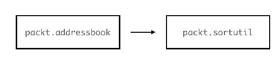
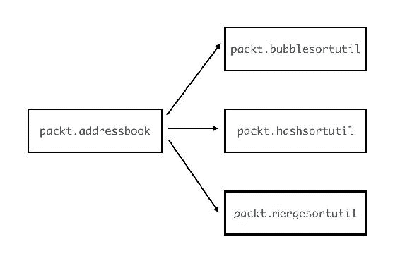
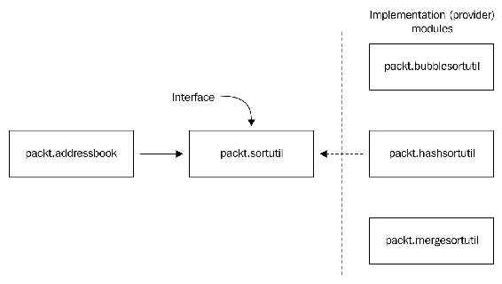
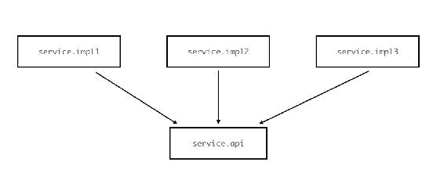
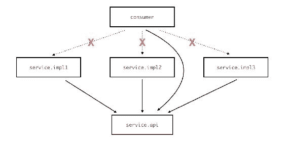
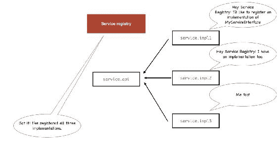
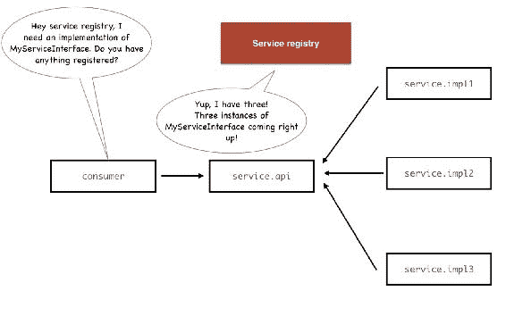
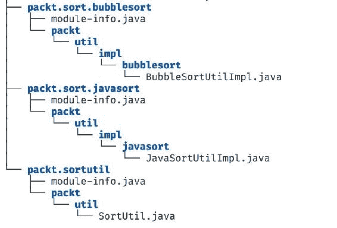
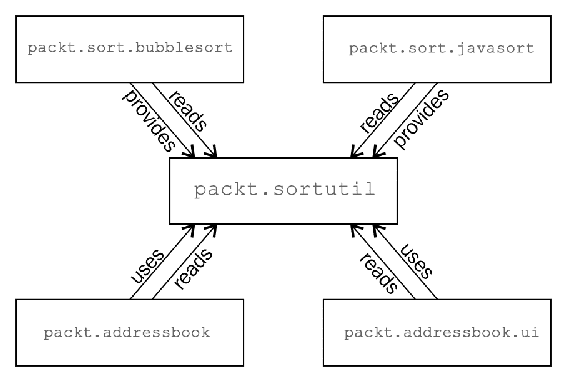
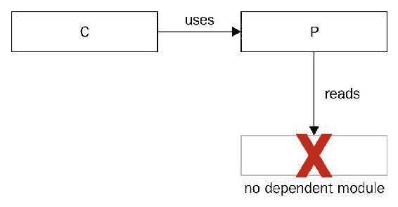

# 第七章：介绍服务

在本章中，我们将学习 Java 模块化中另一个令人兴奋的新特性，称为**服务**。与直接依赖相比，服务在模块之间提供了额外的间接层，我们将看到它们为我们如何使模块协同工作提供了额外的灵活性。在本章中，你将：

+   理解我们迄今为止所做事情中模块依赖的一个限制

+   理解服务是什么以及它们如何解决这个问题

+   学习如何创建和公开服务

+   学习如何使用`ServiceLoader` API 消费服务

在我们学习服务是什么之前，让我们检查并理解它们被创造出来要解决的问题。这是模块之间直接依赖的紧密耦合问题，至少是我们迄今为止连接它们的方式。

# 耦合问题

编程中的短语**紧密耦合**指的是两个实体之间高度依赖的情况，为了改变它们的行为或关系，需要对其中一个（或经常是两个）实体进行实际的代码更改。另一方面，**松散耦合**术语指的是相反的情况——实体之间没有高度依赖。在这种情况下，实体理想上甚至不知道彼此的存在，但仍然可以相互交互。

考虑到这一点，你认为 Java 模块系统中两个模块的耦合可以怎么称呼？当一个模块依赖于另一个模块时，这两个模块是紧密耦合还是松散耦合？答案很明显，它们是紧密耦合的。考虑以下适用于模块关系的事实：

+   模块需要明确声明它们依赖的其他模块。从这个意义上说，每个模块都*意识到*它需要的其他模块的存在。

+   模块还与依赖模块公开的 API 耦合，并且*意识到*这些 API 的存在。如果模块 A 读取模块 B 并调用一个 API，它是通过使用模块 B 中可用并导出的实际 Java 类型来实现的。因此，模块 A 知道模块 B 的内部结构，至少与模块 B 导出并由模块 A 使用的类型一样多。

由于这两个因素，很明显，这种紧密耦合导致模块在运行时表现出非常*严格*和*僵化*的行为。考虑地址簿查看器应用程序。编译的模块集合就是运行时涉及的模块集合。一旦模块被编译，你就无法移除其中的任何一个模块，用其他东西替换它，然后执行它们。涉及的模块必须*完全*相同。尽管我们有一种印象，即 Java 9 模块是构建块，可以组装成多种组合，但这种优势仅适用于开发时间。到目前为止，我们所看到的是，一旦模块被编码并且建立了依赖关系，结果就是一个相当紧密、不可更改的单一实体。

现在你可能会想，“嗯，这不就是我们想要的吗？”*可靠配置*的好处需要严格的检查以确保我们打算拥有的确切模块都存在，不是吗？嗯，是的，但我们仍然可以在不放弃可靠配置的情况下拥有运行时灵活性。一个类似的情况可以在 Java 语言本身中找到。尽管 Java 是严格类型化的，但你可以通过使用多态的概念来实现强大的运行时灵活性和类型之间的松散耦合。想法是类不直接相互依赖。相反，它们依赖于抽象类或接口。在运行时，这些接口的实例可以被动态初始化并在接口被使用的地方使用。我们能否在模块中拥有类似的东西？如果可以，它将如何工作？

让我给你举一个例子。我们有一个名为 `packt.sortutil` 的排序实用模块，它有一个用于排序列表的 API。我们已经配置了该模块以导出接口并封装实现，但在现实中，这种区分目前是无用的。它只有一个实现，现在该模块能做的只是冒泡排序。如果我们想有多个排序模块，并且让消费模块选择使用哪种排序算法呢？

当前：



我们想要的：



我们希望能够在我们的应用程序中使用提供不同排序实现的多个模块。然而，由于紧密耦合，为了一个模块能够使用另一个模块，它必须*要求*它。这意味着消费者`packt.addressbook`模块必须在其可能需要的每个不同实现模块上声明`requires`，即使在任何时候，它可能只使用一个。如果有一种方法可以定义一个接口类型并在运行时仅依赖于该接口，那不是很好吗？然后不同的*提供者*模块提供接口的实现，你可以在运行时插入这些实现，而不需要显式依赖，并且没有实际消费者和各个实现模块之间的耦合？ 

以下图显示了我们的期望。而不是让`packt.addressbook`需要所有提供实现逻辑的模块，它需要的是一个充当接口的单个模块，并且具有某种动态获取实现的机制：



到现在为止，你可能已经猜到，每当我问“*不是很好吗...*”这样的问题时，这通常意味着这样的功能已经存在！至少在这个案例中，这是真的。这就是服务介入的地方。服务和 Service API 的概念一起，在您迄今为止所学的现有模块化概念之上增加了一个全新的间接层。让我们深入了解细节。

# 理解服务

让我们从您作为 Java 开发者应该非常熟悉的概念开始我们的服务理解之旅——多态。它从一个接口和（可能多个）该接口的实现开始。尽管接口对于服务来说不是严格*必需的*，但它们仍然是一个好的起点。假设您定义了一个名为`MyServiceInterface`的服务接口，其外观如下：

```java
    package service.api; 
    public interface MyServiceInterface { 
      public void runService(); 
    } 
```

现在您可以拥有包含实现此接口的类的多个模块。由于所有这些模块都需要访问此接口，让我们将这个接口放入一个名为`service.api`的单独模块中，并公开接口`MyServiceInterface`所在的包。然后每个实现模块都可以要求`service.api`模块并实现`MyServiceInterface`。

假设有三个模块实现了`MyServiceInterface`，分别位于三个相应的模块中。由于它们需要接口来首先实现它，所有三个实现模块*读取*`service.api`模块以访问`MyServiceInterface`。想象一下每个模块都这样做，并且每个模块都包含一个实现了`MyServiceInterface`的类：



现在，消费者模块需要调用这些实现之一来实际运行服务。这里的目的是不希望消费者模块直接*读取*各种实现模块，因为那样会导致紧密耦合。我们希望消费者模块只读取*接口*模块`service.api`，并且只处理接口类型，但仍然能够以某种方式访问该接口实现的实例。记住，我们*不希望*消费者需要单独的实现模块（以下图中所示*Xs*）：



# 服务注册表

为了在消费者和实现之间建立桥梁而不直接紧密耦合，想象一个位于它们之间的层，称为*服务注册表*。服务注册表是模块系统提供的一个层，用于记录和注册给定接口的实现作为*服务*。把它想象成一种电话簿或黄页，但针对服务。任何实现服务的模块都需要在服务注册表中注册自己。一旦完成，服务注册表就拥有了关于接口的不同服务实现的所有信息。以下图表说明了这种交互：



现在当消费者需要实现时，它使用服务 API 与服务注册表通信，并获取可用实现的实例。以下图表说明了这种交互：



消费者模块得到的是所有可用实现实例的`Iterable`。当然，不一定需要多个实例。可能只有一个实现！无论如何，服务 API 在访问时将可用的实例交给消费者。

如您所见，我们打破了*提供者*和*消费者*之间的耦合。这个图中的每个模块只读取一个共同的模块——包含接口的模块。接口是所有这些不同模块唯一**共同**的实体，因为那是它们之间交互的手段。由于其他模块对彼此一无所知，您可以几乎移除一个实现模块并替换另一个。只要它做正确的事情——也就是说，实现正确的接口并在服务注册表中注册——它就可以供消费者使用。

现在您已经从高层次上理解了服务的概念，让我们深入了解具体细节。模块如何*注册*它们的实现？消费者模块如何从注册表中访问实例？让我们看看实现细节。

# 创建和使用服务

这里是创建、注册和实现服务的端到端步骤：

1.  **创建定义服务的 Java 类型**：每个服务都基于一个单一的 Java 类型，该类型定义了服务 API。这个类型可以是接口、抽象类，甚至是普通的 Java 类。大多数情况下，服务类型将是接口。拥有一个接口是理想的，因为这样你可以为它提供多个实现类型。

服务类型是提供者和消费者之间交流的手段。这引发了一个问题：服务类型应该在哪个模块中？由于它被多个模块共享，而且我们不希望提供者和消费者紧密耦合，理想的解决方案是在一个单独的模块中创建服务类型。这个模块导出服务类型，并由提供者和消费者模块读取。

在我们的例子中，这将是模块`service.api`。它导出`service.api`包，从而导出接口：

```java
        module service.api { 
          exports service.api; 
        } 
```

该模块包含之前显示的`service.api.MyServiceInterface`接口。这个完全限定的接口类型名称本身是服务类型。在 Java 模块系统中，服务没有特殊名称。它们只是通过充当服务的 Java 类型的名称来引用。

1.  **创建一个或多个实现模块，这些模块读取接口模块并实现接口**：例如，如果您需要有两个模块`service.implA`和`service.implB`，它们提供`MyServiceInterface`的两个实现，那么这两个模块都将*需要*`service.api`模块来访问接口。它们各自都有一个`MyServiceInterface`接口的实现。每个服务接口的实现被称为*服务提供者*。

1.  **让实现模块注册自己作为服务提供者**：这是实现模块告诉服务注册它们希望注册其接口实现的那个部分。这是通过在模块描述符中使用一个新的关键字`provides`并指定接口和实现类型信息来完成的。其语法如下：

```java
        provides <interface-type> with <implementation-type>; 
```

例如，如果模块`service.implA`有一个实现类`packt.service.impla.MyServiceImplA`，它实现了`MyServiceInterface`，那么模块定义应该如下所示：

```java
        module service.implA { 
          requires service.api;  
          provides service.api.MyServiceInterface with 
           packt.service.impla.MyServiceImplA; 
        } 
```

这对于模块系统来说足够了，它知道这个模块希望注册`MyServiceImplA`类作为为`MyServiceInterface`接口提供服务的服务。

这里有一些观察结果：

+   注意接口和实现类型的完全限定名称。这对于避免名称冲突并确保 Java 平台确切知道您所引用的类型非常重要。

+   注意在`provides`子句中引用的接口类型不属于该模块本身。它位于一个完全不同的模块中，该模块通过`requires`子句读取！但是，这没关系；它仍然可以工作。然而，对于实现类位于模块描述符所属的模块中这一点很重要。当你考虑到使用`provides`代码行时，模块实际上是在声明提供所提到的实现这一事实时，这一点就变得有意义了。因此，它最好拥有它！

+   这是对前一个模块描述符中未包含的内容的观察。请注意，我们没有在这里添加`exports`子句，以便使`MyServiceImplA`类对其他模块可访问。在提供服务时，您不必公开实现类并使其可访问。这是因为这个类不是通过我们迄今为止一直在使用的常规模块*可读性*和*可访问性*关系来访问的。消费者模块将通过服务 API 获取实现类的实例，而不是直接读取模块。这正是服务的作用所在，避免这种紧密耦合。

通过这一步，我们现在已成功将服务提供者注册到模块系统中。现在，所有执行此操作的实现都映射到服务*名称*上，这在所有实际目的上相当于完全限定的接口名称--`service.api.MyServiceInterface`。

现在，让我们将注意力转向消费者模块。让消费者模块能够访问服务实现实例是一个两步的过程：

1.  **让消费者模块将自己注册为服务的消费者**：就像服务提供者*注册*他们提供实现的意图一样，服务消费者需要*注册*他们需要*使用*服务的事实。需要实例的模块必须在模块描述符中正式声明这种需求。这是使用`uses`关键字完成的。语法如下：

```java
        uses <interface-type>; 
```

在我们的例子中，如果我们有一个名为 consumer 的模块需要`MyServiceInterface`的实例，该模块的定义将如下所示：

```java
        module consumer { 
          requires service.api; 
          uses service.api.MyServiceInterface; 
        } 
```

这对于模块系统来说足够了，它知道这是一个将使用指定接口的服务实现实例的模块。

一些观察结果：

+   消费者模块也需要`requires`暴露接口的模块。它必须这样做，因为当模块从服务 API 请求服务实例时，它将得到与接口相同类型的实例。

+   这里，`uses`子句指的是模块中不可用的类型。

+   如您所料，对任何实现模块都没有直接依赖。松散耦合获胜！

在这一步之后，一方面，提供者模块将它们的实现注册到服务注册表中。另一方面，消费者模块注册它自己是服务的消费者。现在，消费者模块中的代码如何获取提供者实现实例的访问权限？这是最后一步，这涉及到调用`ServiceLoader` API。

1.  **在消费者模块的代码中调用** **ServiceLoader** **API 以访问提供者实例**：由于没有直接依赖，服务实现类型对消费者来说是完全未知的。它所拥有的只是接口类型。因此，它无法使用`new`来实例化类型。

为了访问所有注册的服务实现，你需要在消费者模块的代码中调用 Java 平台 API `ServiceLoader.load()`方法。以下是获取接口`MyServiceInterface`的所有注册服务提供者实例的代码：

```java
        Iterable<MyServiceInterface> sortUtils =
         ServiceLoader.load(MyServiceInterface.class);
```

API 返回的是在服务注册表中注册的所有可用服务实现的`Iterable`。由于返回类型是`Iterable`，你可以遍历实例并从中选择一个。或者，你甚至可以使用所有！这完全取决于应用程序的需求和它试图做什么。重要的是要注意，这个`Iterable`中的每个对象都是之前在创建服务的步骤 3 中注册的提供者实现类型的实例。可能有其他几个实现该接口的类，但如果它们没有使用`provides`语法进行注册，则不会在这个过程中被考虑。

在许多企业 Java 框架中存在一个常见的模式，用于处理服务的各种实现，并通过接口访问。它被称为*依赖注入*。这种模式在 Spring 等框架以及 EJB 等 Java EE 技术中都是可用的。这种模式要求消费者类简单地*声明*对服务的依赖。然后框架执行创建实例并自动*注入*到消费者类的任务。

我们在这里所做的***不是***这样。没有自动将实例注入到消费者代码中。正如你所注意到的，你必须编写使用`ServiceLoader`来*查找*提供者实例的代码。这是设计的一部分，并且与那些其他模式相比，这是一个重要的区别。这是一个*依赖查找*，而不是*依赖注入*。

# 实现排序服务

现在我们已经了解了如何创建和消费服务，让我们在地址簿查看器应用程序中将其付诸实践。我们将创建多个排序实现模块，并将这些实现注册为服务。然后，我们将更新`packt.addressbook`模块以使用`ServiceLoader` API 获取排序实例，然后使用这些实例之一对联系人列表进行排序。让我们回顾一下我们刚刚学到的五个步骤来实现这一点：

1.  **创建定义服务的 Java 类型**：我们将保留接口`SortUtil`作为各种实现类型将使用的通用接口。`packt.sortutil`模块现在包含接口和实现类型。我们将移除实现类型，只保留接口。我们还将移除对`BubbleSortUtilImpl`的默认静态依赖，使其成为一个纯净的抽象接口：

```java
        package packt.util; 
        import java.util.List; 
        public interface SortUtil { 
          public <T extends Comparable> List<T> sortList(List<T> list); 
        } 
```

这将是`packt.sortutil`模块中唯一的类型。该模块导出`packt.util`包，以便提供者和消费者都可以使用该接口。以下是`module-info.java`文件：

```java
        module packt.sortutil { 
          exports packt.util; 
        } 
```

1.  **创建一个或多个实现模块，该模块读取接口模块并实现接口**：让我们创建几个实现模块--`packt.sort.bubblesort`，它提供了冒泡排序的实现，以及`packt.sort.javasort`，它使用 Java 集合的默认排序 API 提供实现：



确保你不会在两个模块中将实现类放在同一个包中。例如，实现类不能都在`packt.util.impl`包中，因为这样会导致包分割问题，两个模块都包含相同的包，运行时会抛出错误。我们已经在第六章，“模块解析、可访问性和可读性”中讨论了包分割问题。

两个模块`requires`模块`packt.sortutil`以访问`packt.util.SortUtil`接口。每个模块都有一个接口的实现。

这是`BubbleSortUtilImpl`，这是我们之前已经看到的一个类，所以这里提供的是截断版本：

```java
        public class BubbleSortUtilImpl implements SortUtil { 

          public <T extends Comparable> List<T> sortList(
           List<T> list) { 
             ...  
             return list; 
          }''  
        } 
```

这是`JavaSortUtilImpl`，它简单地使用了`Collections.sort` API：

```java
        public class JavaSortUtilImpl implements SortUtil { 
          public <T extends Comparable> List<T> sortList(
           List<T> list) { 
             Collections.sort(list); 
             return list; 
          } 
        } 
```

1.  **让实现模块将自己注册为服务提供者**：让我们使用`provides`关键字将两个实现模块都注册为提供者。服务类型是接口`packt.util.SortUtil`，而实现类型分别是两个模块中的两个实现类。

这是`packt.sort.bubblesort`模块的`module-info.java`文件：

```java
        module packt.sort.bubblesort { 
          requires packt.sortutil; 
          provides packt.util.SortUtil  
           with packt.util.impl.bubblesort.BubbleSortUtilImpl; 
        } 
```

这是`packt.sort.javasort`模块的`module-info.java`文件：

```java
        module packt.sort.javasort { 
          requires packt.sortutil; 
          provides packt.util.SortUtil  
           with packt.util.impl.javasort.JavaSortUtilImpl; 
        }
```

1.  **让消费者模块将自己注册为服务的消费者**：在`packt.addressbook`和`packt.addressbook.ui`中，我们需要`SortUtil`的实例。在这里，我将仅展示`packt.addressbook`模块中的步骤，因为它涉及的内容相对较少。但步骤是相同的，并且需要应用到两个模块中。

这是`packt.addressbook`模块的模块描述符，其中包含`uses`子句：

```java
        module packt.addressbook { 
          requires java.logging; 
          requires packt.addressbook.lib; 
          uses packt.util.SortUtil; 
        } 
```

1.  **在消费者模块的代码中调用** **ServiceLoader** **API 以访问提供者实例**：在`Main.java`中，使用`ServiceLoader` API 获取所有`SortUtil`的提供者实例：

```java
        Iterable<SortUtil> sortUtils =
          ServiceLoader.load(SortUtil.class); 
```

现在，迭代遍历，你可以访问每个实例。我将通过循环使用两种排序实现来对列表进行排序。这显然是不必要的，但只是为了说明：

```java
        for (SortUtil sortUtil : sortUtils) { 
          System.out.println("Found an instance of SortUtil"); 
          sortUtil.sortList(contacts); 
        } 
```

我们已经完成了！你已经使用了服务机制来创建、注册和使用排序服务实现。

确保你也将相同的更改应用到`packt.addressbook.ui`模块中！如果不这样做，该模块的编译步骤将因明显的原因而失败。

现在编译并运行代码应该不会出现任何错误：

```java
$ javac --module-source-path src -d out $(find . -name '*.java') 
$ java --module-path out -m packt.addressbook/packt.addressbook.Main 
Apr 09, 2017 12:03:18 AM packt.addressbook.Main main 
INFO: Address book viewer application: Started 
Found an instance of SortUtil 
Found an instance of SortUtil 
[Charles Babbage, Tim Berners-Lee, Edsger Dijkstra, Ada Lovelace, Alan Turing] 
Apr 09, 2017 12:03:19 AM packt.addressbook.Main main 
INFO: Address book viewer application: Completed 
```

如您从输出中可以看到，`ServiceLoader` 返回了两个 `SortUtil` 实例，对应于我们已注册的两个实现。

# 绘制模块图

让我们绘制表示服务提供者和消费者模块之间交互的模块图。我们知道如何表示 *可读性* 关系。那么服务消费者和提供者依赖关系呢？以下图表使用箭头表示 **使用** 和 **提供** 依赖关系，并使用标签来识别它们：



消费者模块和提供者模块之间没有依赖关系是使用服务实现松耦合的关键。

# 高级服务

到目前为止所涵盖的服务概念应该可以解决很多典型用例，但还有一些额外的功能和概念可能在某些特殊场景中很有用。在本节中，我们将探讨几个这样的概念。

# 支持单例和工厂提供者

假设您的服务实例不能简单地通过构造函数创建。如果需要重用实例，比如拥有一个单例提供者实例？或者每当创建一个新的服务实例时执行一些逻辑？服务有一个方便的特性，允许您创建工厂方法来获取服务实例。您需要做的只是在其提供者类中添加一个名为 `provide()` 的方法。该方法需要是一个公共静态方法，并且不应该接受任何参数。此外，返回类型应与提供的服务类型相同。如果 `ServiceLoader` 看到了这个方法，它会调用它，并使用方法的返回值作为服务实例。如果没有找到这样的方法，它会调用我们之前看到的公共无参构造函数。这允许您在提供者实例创建步骤中挂钩，在这里您可以执行任何必要的代码，同时有机会创建 `ServiceLoader` 将用作提供者实例的对象。

# 实现服务优先级

在最后一个例子中，我们得到了两个 `SortUtil` 实例，并且对它们做了些荒谬的事情--我们对列表进行了两次排序，一次对应于每个实现！您通常不会这样做。当您在应用程序中接收到多个服务实现时，您最可能需要做的是一件更复杂的事情。您需要选择一个！

很遗憾，您无法为服务实现指定不同的优先级。因此，您无法说像`BubbleSortUtilImpl`这样的排序实现是您最喜欢的，并且当它可用时，无论找到其他什么实现，都应该使用这个实现。根据设计，指定优先级不是服务实现的职责。决定如何处理从`ServiceLoader`接收到的多个实现是消费者的工作，因为最适合这项工作的服务实现通常取决于消费应用程序本身。对某个消费者来说最好的服务实现可能对另一个消费者来说并不理想。

现在，消费者如何在所有可用的提供者中选择一个？他们看到的是同一接口的一堆实例！因此，我们增强接口以包含消费者可以使用的方法来查询提供者实例。消费者调用这些方法来了解更多关于提供者类的信息，从而做出明智的决定，选择它想要的提供者实例。

以`SortUtil`实现为例。假设我们想根据列表的大小来使用排序算法。例如，假设我们只想在列表非常小的情况下使用冒泡排序，而对于较大的列表则使用`Collections` API 排序。

我们可以做的就是在`SortUtil`接口中添加一个名为`getIdealInputLength()`的方法。然后，每个实现都提供一个整数长度，表示它可以理想地处理的长度。

冒泡排序绝不是您能使用的最佳排序算法。它是许多编程课程用来教授排序的算法，但在现实中它效率极低。为了我们简单的示例，让我们说我们只在列表有四个或更少的元素时使用冒泡排序，而对于其他情况则使用`Collections`排序。我必须承认这是一个人为的例子，但它将使我们能够实现选择提供者的基本策略。在现实中，您几乎总是想使用`Collections` API 来排序列表。

下面是带有新方法声明的`SortUtil`：

```java
    public interface SortUtil { 
      public <T extends Comparable> List<T> sortList(List<T> list); 
      public int getIdealMaxInputLength(); 
    } 
```

下面是`BubbleSortUtilImpl`实现此方法，返回`4`作为输入列表的理想最大大小：

```java
    public class BubbleSortUtilImpl implements SortUtil { 
      ... 
      public int getIdealMaxInputLength() { 
        return 4; 
      } 
```

`JavaSortUtilImpl`对任何列表大小都无所谓，所以对于理想的最大值，我们只需返回最大整数值：

```java
    public class JavaSortUtilImpl implements SortUtil { 
      ... 
      public int getIdealMaxInputLength() { 
        return Integer.MAX_VALUE; 
      } 
```

现在每个提供者都有一个可以用来选择一个实现而不是另一个的方法，消费者可以使用这个方法来识别它想使用的实现。

下面是`Main.java`（在`pack.addressbook`和`packt.addressbook.ui`模块中）的章节，它遍历提供者以选择一个：

```java
    Iterable<SortUtil> sortUtils =
      ServiceLoader.load(SortUtil.class); 
    for (SortUtil sortUtil : sortUtils) { 
      logger.info("Found an instance of SortUtil with ideal
       max input: " + sortUtil.getIdealMaxInputLength()); 
      if (contacts.size() < sortUtil.getIdealMaxInputLength()) { 
        sortUtil.sortList(contacts); 
        break; 
      } 
    } 
```

给定我们想要排序的`contacts`列表的大小，我们将检查每个提供者，看列表大小是否大于提供者理想情况下希望处理的最大的大小。然后我们选择第一个通过这个检查的提供者，使用该实例来排序列表，并`break`出循环。

运行代码并观察输出。如果`BubbleSortUtilImpl`是迭代器中的第一个实例，逻辑会跳过它并移动到`JavaSortUtilImpl`并使用它进行排序：

```java
$ java --module-path out -m packt.addressbook/packt.addressbook.Main 
Apr 09, 2017 8:01:20 PM packt.addressbook.Main main 
INFO: Address book viewer application: Started 
Apr 09, 2017 8:01:20 PM packt.addressbook.Main main 
INFO: Found an instance of SortUtil with ideal max input: 4 
Apr 09, 2017 8:01:20 PM packt.addressbook.Main main 
INFO: Found an instance of SortUtil with ideal max input: 2147483647 
[Charles Babbage, Tim Berners-Lee, Edsger Dijkstra, Ada Lovelace, Alan Turing] 
Apr 09, 2017 8:01:20 PM packt.addressbook.Main main 
INFO: Address book viewer application: Completed 
```

这是一个简单的例子，说明了提供者实现如何向任何消费者提供*线索*关于实现的信息。不同的消费者可以根据他们独特的需求和业务问题选择不同的实现。

# 服务接口提供者查找

获取服务实例的查找逻辑现在在`packt.addressbook`和`packt.addressbook.ui`模块的`Main`类中。这并不理想。我们不希望在多个地方重复查找逻辑。解决这个问题的方法之一是将逻辑移动到一个所有服务消费者都可以访问的通用位置。现在，共享每个服务消费者的模块是什么？是导出接口的模块。将依赖查找逻辑移动到接口中并作为一个默认方法隐藏起来，这不是一个好主意吗？这样，就没有消费者模块需要直接与`ServiceLoader` API 打交道。他们只需要调用正确的接口方法来查找实例。

让我们在`SortUtil`接口上创建两个新方法。一个用于获取所有服务提供者实例，另一个根据列表的大小（这是一个影响选择哪个实例的标准，就像我们已经看到的）获取单个实例。

这里是`SortUtil`上的两个新静态方法：

```java
    public static Iterable<SortUtil> getAllProviders() { 
      return ServiceLoader.load(SortUtil.class); 
    } 

    public static SortUtil getProviderInstance(int listSize) { 
      Iterable<SortUtil> sortUtils =
        ServiceLoader.load(SortUtil.class); 
      for (SortUtil sortUtil : sortUtils) { 
        if (listSize < sortUtil.getIdealMaxInputLength()) { 
          return sortUtil; 
        } 
      } 
      return null; 
    } 
```

如果没有找到符合我们要求的服务实例，我们将返回`null`。这可以很容易地增强以提供默认服务，以防找不到合适的实例。

现在，`Main`不需要再与`ServiceLoader`通信并遍历实例了：

```java
    SortUtil sortUtil = SortUtil.getProviderInstance(contacts.size()); 
    sortUtil.sortList(contacts); 
```

我希望你会同意，现在服务的消费已经变得简单多了。

你还需要做的另一件事是将`uses`子句从`packt.addressbook`和`packt.addressbook.ui`模块移动到`packt.sortutil`模块。这是因为服务现在是从`packt.sortutil`模块消费的，并且`ServiceLoader` API 也是从该模块调用的：

```java
    module packt.sortutil { 
      exports packt.util; 
      uses packt.util.SortUtil; 
    } 
```

编译和运行代码应该会给出与之前相同的输出。但这次，服务查找逻辑已经被重构为一个所有消费者都可以使用的通用模块。

# 选择性服务实例化

在前面的示例中，我们已经查询了`ServiceLoader` API 以获取所有提供者实例的`Iterable`。然后我们遍历它们并选择一个。这在这里不是问题，因为我们的服务是简单且轻量级的 Java 类。但这并不总是理想的。想象一下，如果服务更复杂且需要时间和资源来实例化。在这种情况下，当你知道你不会使用所有服务时，你不想实例化每个服务提供者。

Java 模块系统在管理应用程序中的服务实例方面非常智能。首先，所有服务实例都是**延迟加载**的。换句话说，服务提供者实例在应用程序启动时不会自动实例化。运行时仅在需要类型时创建服务实例，例如，当某些消费者使用`ServiceProvider.load()`请求服务实例时。

其次，在应用程序的生命周期内创建的任何服务实例都始终被缓存。服务加载器维护这个缓存并跟踪所有已创建的服务实例。当第二个消费者请求服务时，实例直接从缓存中获取。它还智能地确保返回的服务实例顺序始终包括缓存实例。

服务实例的缓存是自动的。如果你想在应用程序执行期间清除整个服务提供者缓存，可以使用`ServiceProvider.reload()` API。

`ServiceLoader` API 有一个选项可以流式传输一个称为`Provider`的中间类型实例，然后可以使用它来创建服务提供者实例。你不会直接获取所有服务实例，而是获取`Provider`实例——每个找到的服务实现都有一个实例。然后，你可以通过在这些实例上使用`Provider.get()`方法来实例化你想要的服务提供者。

以`SortUtil`上的`getProviderInstanceLazy()`方法为例。我们不是直接使用`ServiceLoader.load(SortUtil.class)`，而是可以使用`ServiceLoader.load(SortUtil.class).stream()`，它返回一个`Provider`实例的`Stream`：

```java
    Stream<Provider<SortUtil>> providers =
      ServiceLoader.load(SortUtil.class).stream();
```

然后，可以检查`Provider`实例以获取诸如注解和其他类型信息等。在这里，我们只是按类型名称对它们进行排序，这很愚蠢，但作为一个最小示例它是有效的：

```java
    Stream<Provider<SortUtil>> providers = 
      ServiceLoader.load(SortUtil.class).stream() 
       .sorted(Comparator.comparing(p -> p.type().getName()));
```

在此时刻，尚未创建任何服务实例。服务提供者类型的实际实例化发生在调用`Provider.get`时：

```java
    SortUtil util = providers.map(Provider::get)
                             .findAny() 
                             .orElse(null);
```

在前面的代码中，我们通过 map 函数对每个提供者实例调用`Provider.get()`并选择一个。这样，我们可以延迟实例的创建，并通过仅在需要的实例上调用`Provider.get`来选择性地实例化提供者类型。

# 服务和模块系统目标

由于服务是 Java 模块系统的一部分，它们如何与模块系统的两个目标——强封装和可靠配置——相一致？

让我们从强封装开始。服务提供了一种模块中类型之间交互的替代方式，这种方式不需要将类型暴露给所有消费模块。服务提供者包不需要被`导出`，因此它们甚至被封装在包含服务的模块*读取*者之外！同时，它们作为服务类型的实现被发布，因此可以被那些甚至*不读取*服务实现模块的模块使用。所以，从某种意义上说，类型仍然被封装，尽管不是我们之前看到的那种方式。

那可靠配置呢？由于服务提供者和服务消费者*声明*了他们分别提供和消费服务的事实，运行时和`ServiceProvider` API 可以很容易地确保正确的消费者获得正确的服务。然而，你可以轻松地编译一大堆模块，而模块路径中没有任何服务实现可用。

例如，你可以从你的源代码中删除`packt.sort.bubblesort`和`packt.sort.javasort`模块，并编译其余的模块。它工作得很好！你可以执行`Main`模块。尽管`ServiceProvider` API 没有找到任何服务实例，它仍然可以工作。在我们的例子中，我们返回`null`，但我们可以很容易地通过提供默认服务实现（假设有一个名为`DefaultSortImpl`的默认实现）来处理这种情况，以防找不到任何实现：

```java
    SortUtil util = providers.map(Provider::get)
                             .findAny() 
                             .orElse(new DefaultSortImpl()); 
```

为什么会这样呢？当一个模块明确声明自己是服务消费者时，为什么编译器和运行时不会检查是否至少有一个服务实现可用？原因是，这是设计上的考虑。服务依赖关系*旨在*是可选的。记住我们在本章开头提到的松耦合概念。我们希望能够在运行时插拔服务消费者和提供者。这对于服务来说工作得非常好。

然而，当服务模块没有满足其某些依赖关系时，平台的可靠配置检查确实会发挥作用。例如，假设我们有一个服务消费者模块**C**。你可以编译并执行这个模块，而不需要服务提供者的存在。在下面的图片中，Java 平台不会抱怨：


然而，如果你确实添加了一个提供者模块，你需要确保它满足了所有依赖关系。例如，假设你添加了一个提供者模块**P**，它为**C**所需的服务提供了实现。现在这个提供者模块需要遵循所有可靠的配置规则。如果这个模块读取模块**D**，而模块**D**作为一个可观察的模块不存在，平台会抱怨：



看起来很奇怪，当没有提供者模块可用时，平台运行良好，但当存在提供者模块但未满足依赖关系时，它却会抱怨。为什么它不能忽略模块 **P** 呢？答案是，又是可靠的配置。没有提供者模块可能是故意的。但如果平台发现了一个它技术上可以使用但无法使用（因为未满足依赖关系）的模块，这表明是一个 *损坏* 的状态，因此它会相应地出错。即使通过服务允许松耦合，平台也在尽其所能为我们提供可靠的配置。

# 摘要

在本章中，我们详细探讨了 Java 模块系统中的服务功能。我们学习了模块紧密耦合的缺点，以及松耦合如何提供更多灵活性。然后我们深入研究了创建和使用服务的语法，并实现了具有两个提供者实现的排序服务。接着，我们探讨了与服务相关的一些高级概念，例如优先级服务实例的机制、使用服务接口本身来处理服务查找，以及在重量级服务的情况下使用 `Provider` 类型来延迟服务实例的创建。

然后，我们回顾了模块化的两个目标——强封装和依赖注入——并评估了服务功能对这些目标的影响。

在下一章中，我们将了解由于模块化特性而新应用于 Java 开发的 *链接* 阶段。我们还将回顾在 第一章 中讨论的单一 JDK 的问题，*介绍 Java 9 模块化*，我们如何能做得更好？我们如何利用模块化的概念来创建更精简、性能更优的运行时？这些问题的答案以及更多内容将在下一章中找到！
