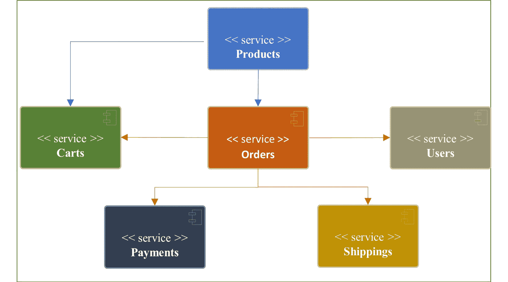

# 第一章：RESTful Web 服务基础

在本章中，我们将探讨 RESTful API（或简称为 REST API）的基本原理及其设计范式。在继续探讨**超媒体作为应用程序状态引擎**（**HATEOAS**）之前，我们将简要回顾 REST 的历史，了解资源是如何形成的，并理解方法和状态码。这些基础知识应该为您提供一个坚实的基础，以使您能够开发 RESTful Web 服务。您还将学习设计**应用程序编程****接口**（**APIs**）的最佳实践。

本章还将介绍一个示例电子商务应用程序，该应用程序将在本书中作为您学习 API 开发不同方面的示例使用。

在本章中，我们将涵盖以下主题：

+   介绍 REST API

+   处理资源和**统一资源标识符**（**URIs**）

+   探索**超文本传输协议**（**HTTP**）方法和状态码

+   HATEOAS 是什么？

+   设计 REST API 的最佳实践

+   电子商务应用程序概述（我们的示例应用程序）

# 技术要求

本章不需要任何特定的软件。然而，了解 HTTP 是必要的。

# 介绍 REST API

API 是代码与代码之间通信的方式。您可能已经为您的程序编写和消费过 API；例如，Java 通过不同模块中的类提供 API，例如集合、输入/输出和流。

Java 的 SDK API 允许程序的一部分与程序的另一部分进行通信。您可以编写一个函数，然后通过公共访问修饰符公开它，以便其他类可以使用它。该函数签名是该类的 API。然而，使用这些类或库公开的 API 仅允许单个应用程序或单个服务内部的内部通信。那么，当两个或多个应用程序（或服务）想要相互通信时，或者换句话说，您想要集成两个或多个服务时，会发生什么呢？这就是系统级 API 帮助我们的时候。

从历史上看，有几种不同的方法可以将一个应用程序与另一个应用程序集成——RPC、基于**简单对象访问协议**（**SOAP**）的服务等等。应用程序的集成已成为软件架构的一个基本组成部分，尤其是在云计算和移动电话的繁荣之后。现在您有了社交登录，如 Facebook、Google 和 GitHub，这意味着您可以在不编写独立的登录模块的情况下开发您的应用程序，并绕过诸如安全存储密码等问题。

这些社交登录提供了使用 REST 和 GraphQL 的 API。目前，REST 是最受欢迎的，并且已经成为编写集成和 Web 应用消费 API 的标准。我们还将详细讨论 GraphQL，这将在本书的最后一章（第十三章，*开始使用 GraphQL*）和第十四章，*GraphQL API 开发和测试*）中进行讨论。

**REST**代表**表征状态转移**，这是一种软件架构风格。遵循 REST 风格的 Web 服务被称为 RESTful Web 服务。在接下来的章节中，我们将简要回顾 REST 的历史，以了解其基本原理。

## REST 的历史

在采用 REST 之前，当互联网刚开始广为人知，Yahoo 和 Hotmail 是流行的邮件和社交消息应用时，没有一种标准的软件架构能够提供一种统一的方式来与 Web 应用集成。人们使用基于 SOAP 的 Web 服务，讽刺的是，它们并不简单。

随后出现了曙光。Roy Fielding 在他的博士研究中，《网络软件架构的风格及其设计》（[`www.ics.uci.edu/~fielding/pubs/dissertation/top.htm`](https://www.ics.uci.edu/~fielding/pubs/dissertation/top.htm)），在 2000 年提出了 REST。REST 的架构风格允许任何服务器通过网络与任何其他服务器进行通信。它简化了通信，使集成更容易。REST 被设计在 HTTP 之上工作，这使得它可以在整个 Web 和内部网络上使用。

eBay 是第一个利用基于 REST 的 API 的公司。它在 2000 年 11 月与选定的合作伙伴推出了 REST API。后来，Amazon、Delicious（一个网站书签应用）和 Flickr（照片分享应用）开始提供基于 REST 的 API。然后，**亚马逊网络服务**（**AWS**）利用 Web 2.0（随着 REST 的发明）在 2006 年为开发者提供了 AWS 云消费的 REST API。

之后，Facebook、Twitter、Google 和其他公司开始使用它。如今（2023 年），你几乎找不到没有开发 REST API 的 Web 应用。然而，基于 GraphQL 的移动应用 API 在受欢迎程度上正在接近。

## REST 基本原理

REST 在 HTTP 协议之上工作。每个 URI 都作为一个 API 资源。因此，我们应该使用名词作为端点而不是动词。RPC 风格的端点使用动词，例如，`/api/v1/getPersons`。相比之下，在 REST 中，这个端点可以简单地写成 `/api/v1/persons`。你可能想知道，那么我们如何区分在 REST 资源上执行的不同操作。这就是 HTTP 方法帮我们的地方。我们可以让我们的 HTTP 方法充当动词，例如，`GET`、`DELETE`、`POST`（用于创建）、`PUT`（用于修改）和 `PATCH`（用于部分更新）。我们将在稍后详细讨论这个问题。现在，`getPerson` RPC 风格的端点在 REST 中被翻译成 `GET /api/v1/persons`。

注意

REST 端点是表示 REST 资源的唯一的 URI。例如，`https://demo.app/api/v1/persons` 是一个 REST 端点。此外，`/api/v1/persons` 是端点路径，`persons` 是 REST 资源。

这里存在客户端和服务器之间的通信。因此，REST 基于 *客户端-服务器* 概念。客户端调用 REST API，服务器响应。REST 允许客户端（即程序、Web 服务或 UI 应用程序）通过 HTTP 请求和响应与远程（或本地）运行的服务器（或 Web 服务）进行通信。客户端将 API 命令封装在 HTTP 请求中发送到 Web 服务。这个 HTTP 请求可能包含以查询参数、头或请求体形式的数据负载（或输入）。被调用的 Web 服务以成功/失败指示器和封装在 HTTP 响应中的响应数据作为响应。HTTP 状态码通常表示状态，响应体包含响应数据。例如，HTTP 状态码 `200 OK` 通常表示成功。

从 REST 的角度来看，HTTP 请求是自描述的，并且有足够的信息供服务器处理。因此，REST 调用是无状态的。状态要么在客户端管理，要么在服务器端管理。REST API 不维护其状态。它只从服务器传输状态到客户端或反之亦然。这就是为什么它被称为 *REpresentational State Transfer*，或简称 REST。

REST 还使用了 HTTP 缓存控制，这使得 REST API 可**缓存**。因此，客户端也可以缓存表示（即 HTTP 响应），因为每个表示都是自描述的。

REST 使用三个关键组件进行操作：

+   资源和统一资源标识符（URIs）

+   HTTP 方法

+   HATEOAS

一个简单的 REST 调用以纯文本形式看起来如下所示：

```java
GET /licenses HTTP/2Host: api.github.com
```

这里，`/licenses` 路径表示许可证资源。`GET` 是一个 HTTP 方法。第一行末尾的 `2` 表示 HTTP 协议版本。第二行共享了要调用的主机。

GitHub 以 JSON 对象的形式响应。状态是 `200 OK`，JSON 对象被封装在响应体中，如下所示：

```java
HTTP/2 200 OKdate: Mon, 10 Jul 2023 17:44:04 GMT
content-type: application/json; charset=utf-8
server: GitHub.com
status: 200 OK
cache-control: public, max-age=60, s-maxage=60
vary: Accept, Accept-Encoding, Accept, X-Requested-With,
      Accept-Encoding  etag:W/"3cbb5a2e38ac6fc92b3d798667e
          828c7e3584af278aa314f6eb1857bbf2593ba"
… <bunch of other headers>
Accept-Ranges: bytes
Content-Length: 2037
X-GitHub-Request-Id: 1C03:5C22:640347:81F9C5:5F70D372
[
  {
    "key": "agpl-3.0",
    "name": "GNU Affero General Public License v3.0",
    "spdx_id": "AGPL-3.0",
    "url": "https://api.github.com/licenses/agpl-3.0",
    "node_id": "MDc6TGljZW5zZTE="
  },
  {
    "key": "apache-2.0",
    "name": "Apache License 2.0",
    "spdx_id": "Apache-2.0",
    "url": "https://api.github.com/licenses/apache-2.0",
    "node_id": "MDc6TGljZW5zZTI="
  },
  …
]
```

如果你注意这个响应的第三行，它告诉你内容类型的值。对于请求和响应，将 JSON 作为内容类型是一个好习惯。

现在我们已经熟悉了 REST 的基础知识，我们将更深入地探讨 REST 的第一个概念，资源和 URI，并了解它们是什么以及它们通常是如何使用的。

# 处理资源和 URI

在**万维网**（**WWW**）上的每个文档都作为 HTTP 术语下的资源表示。这个资源被表示为一个 URI，它是一个代表服务器上唯一资源的端点。

罗伊·菲尔丁在他的博士研究中指出，URI 有多个名称——WWW 地址、**通用文档标识符**（**UDI**）、URI、**统一资源定位符**（**URL**）和**统一资源名称**（**URN**）。

那么，什么是 URI？URI 是一个字符串（即字符序列），通过其位置、名称或两者（在 WWW 世界中）来标识资源。URI 有两种类型：URL 和 URN。

URL 被广泛使用，甚至非开发用户也知道。URL 不仅限于 HTTP，还用于许多其他协议，如 FTP、JDBC 和 MAILTO。URL 是一个标识符，用于标识资源的网络位置。我们将在后面的章节中详细介绍。

## URI 语法

URI 语法如下：

```java
 scheme:[//authority]path[?query][#fragment]
```

根据语法，以下是一个 URI 组件的列表：

+   `:`)。`scheme`以字母开头，后跟任何组合的数字、字母、点（`.`）、连字符（`-`）或加号（`+`）。

方案示例包括 HTTP、HTTPS、MAILTO、FILE 和 FTP。URI 方案必须向**互联网数字分配机构**（**IANA**）注册。

+   `//`)。它由以下可选子字段组成：

    +   `:`)。

+   `/`)。在上面的 GitHub REST API 示例中，`/licenses`是路径。

+   `?`)。查询组件包含非分层数据的查询字符串。查询组件中的每个参数由一个与号（`&`）分隔，参数值使用等号（`=`）运算符分配。

+   `#`)。片段组件包含一个片段标识符，为次要资源提供方向。

下面的列表包含了一些 URI 的示例：

+   [www.packt.com](http://www.packt.com): 这不包含方案。它只包含域名。也没有端口，这意味着它指向默认端口。

+   `index.html`: 这不包含方案和授权信息。它只包含路径。

+   [`www.packt.com/index.html`](https://www.packt.com/index.html): 这包含方案、授权信息和路径。

这里有一些不同方案 URI 的示例：

+   mailto:support@packt.com

+   telnet://192.168.0.1:23/

+   [ldap://[2020:ab9::9]/c=AB?objectClass?obj](ldap://[2020:ab9::9]/c=AB?objectClass?obj)

注意

从 REST 的角度来看，URI 的路径组件非常重要，因为它代表了资源路径，你的 API 端点路径就是基于它形成的。例如，看看以下内容：

`GET https://www.domain.com/api/v1/order/1`

这里，`/api/v1/order/1`代表路径，`GET`代表 HTTP 方法。

## 什么是 URL？

如果你仔细观察，前面提到的许多 URI 示例也可以称为 URL。URI 是一个标识符；另一方面，URL 不仅是一个标识符，它还告诉你如何到达它。

请求评论（RFC）

根据 RFC-3986 关于 URI 的说明（[`datatracker.ietf.org/doc/html/rfc3986`](https://datatracker.ietf.org/doc/html/rfc3986)），术语 URL 指的是 URI 的子集，除了标识资源外，还提供了一种通过描述其主要访问机制（例如，其网络*位置*）来定位资源的方法。

URL 代表资源的完整网络地址，包括协议名称（方案）、主机名端口（如果 HTTP 端口不是`80`；对于 HTTPS，默认端口是`443`）、授权组件的一部分、路径以及可选的查询和片段子组件。

## 什么是 URN？

URN 并不常用。它们也是一种以方案`urn`开头的 URI。以下 URN 示例直接取自 RFC-3986 关于 URI 的文档（[`www.ietf.org/rfc/rfc3986.txt`](https://www.ietf.org/rfc/rfc3986.txt)）：

```java
 urn:oasis:names:specification:docbook:dtd:xml:4.1.2
```

此示例遵循`"urn:" <NID> ":" <NSS>`语法，其中`<NID>`是命名空间标识符，`<NSS>`是命名空间特定字符串。我们不会在我们的 REST 实现中使用 URN。然而，你可以在 RFC-2141 中了解更多关于它们的信息（[`tools.ietf.org/html/rfc2141`](https://tools.ietf.org/html/rfc2141)）。

注意

根据 RFC-3986 关于 URI 的说明（[`datatracker.ietf.org/doc/html/rfc3986`](https://datatracker.ietf.org/doc/html/rfc3986)），术语 URN 在历史上被用来指代“*urn*”方案 RFC-2141 下的 URI，这些 URI 即使在资源不再存在或不可用的情况下也必须保持全球唯一性和持久性，以及任何具有名称属性的其他 URI。

现在你已经了解了 URI 和 URN 之间的区别以及它们如何构成 URI，让我们学习 REST 的第二个概念：HTTP 方法和状态码。

# 探索 HTTP 方法和状态码

HTTP 提供了各种 HTTP 方法。然而，你主要将只使用其中的五个。首先，你希望将**创建**、**读取**、**更新**和**删除**（**CRUD**）操作与 HTTP 方法相关联：

+   `POST`: 创建或搜索

+   `GET`: 读取

+   `PUT`: 更新

+   `DELETE`: 删除

+   `PATCH`: 部分更新

一些组织也提供了`HEAD`方法，用于仅想从 REST 端点检索头部响应的场景。你可以使用`HEAD`操作对任何 GitHub API 进行操作以仅检索头部；例如，`curl --head https://api.github.com/users`。

注意

REST 没有规定应该使用哪种方法来进行哪种操作。然而，广泛使用的行业指南和实践建议遵循某些规则。

让我们详细讨论每种方法。

## POST

HTTP `POST` 方法通常与创建资源操作相关联。然而，在某些情况下，你可能希望使用 `POST` 方法进行读取操作。但是，这应该在经过深思熟虑的过程后实施。一个这样的例外是搜索操作，其中过滤条件有太多参数，可能会超过 `GET` 调用的长度限制。

`GET` 查询字符串的长度限制为 256 个字符。此外，HTTP `GET` 方法在提交名称和值对时，其长度限制为最多 2,048 个字符减去实际路径中的字符数。另一方面，`POST` 方法在提交名称和值对时不受 URL 大小的限制。

如果提交的输入参数包含任何私有或安全信息，你也可以使用 HTTPS 与 `POST` 方法进行读取调用。

对于成功的创建操作，你可以响应 `201 Created` 状态码，而对于成功的搜索或读取操作，你应该使用 `200 OK` 或 `204 No Content` 状态码，尽管调用是使用 HTTP `POST` 方法进行的。

对于失败的操作，REST 响应可能根据错误类型具有不同的错误状态码，我们将在本节稍后讨论。

## GET

HTTP `GET` 方法通常与读取资源操作相关联。同样，你可能已经观察到 GitHub `GET /licenses` 调用，该调用返回 GitHub 系统中可用的许可证。此外，如果响应包含数据，成功的 `GET` 操作应与 `200 OK` 状态码相关联；如果响应不包含数据，则应与 `204 No Content` 状态码相关联。

## PUT

HTTP `PUT` 方法通常与更新资源操作相关联。此外，如果响应包含数据，成功的更新操作应与 `200 OK` 状态码相关联；如果响应不包含数据，则应与 `204 No Content` 状态码相关联。一些开发者使用 `PUT` HTTP 方法来替换现有资源。例如，GitHub API v3 使用 `PUT` 来替换现有资源。

## DELETE

HTTP `DELETE` 方法通常与资源删除操作相关联。GitHub 不在 `licenses` 资源上提供 `DELETE` 操作。然而，如果你假设它存在，它肯定会看起来非常类似于 `DELETE / licenses/agpl-3.0`。一个成功的 `DELETE` 调用应该删除与 `agpl-3.0` 键关联的资源。此外，成功的 `DELETE` 操作应与 `204 No Content` 状态码相关联。

## PATCH

HTTP `PATCH` 方法是您想要与部分更新资源操作相关联的方法。此外，成功的`PATCH`操作应与`200 OK`状态代码相关联。与其它 HTTP 操作相比，`PATCH`相对较新。实际上，几年前，由于旧的 Java HTTP 库，Spring 在 REST 实现中并没有对这种方法提供最先进的支持。然而，目前，Spring 在 REST 实现中为`PATCH`方法提供了内置支持。

## HTTP 状态码

HTTP 状态代码有五个类别，如下所示：

+   信息性响应 (`100`–`199`)

+   成功响应 (`200`–`299`)

+   重定向 (`300`–`399`)

+   客户端错误 (`400`–`499`)

+   服务器错误 (`500`–`599`)

您可以在 MDN Web Docs（[`developer.mozilla.org/en-US/docs/Web/HTTP/Status`](https://developer.mozilla.org/en-US/docs/Web/HTTP/Status)）或 RFC-7231（[`tools.ietf.org/html/rfc7231`](https://tools.ietf.org/html/rfc7231)）中查看状态代码的完整列表。然而，您可以在以下表格中找到最常用的 REST 响应状态代码：

| **HTTP** **状态码** | **描述** |
| --- | --- |
| `200 OK` | 对于除已创建之外的成功请求。 |
| `201 已创建` | 用于成功创建请求。 |
| `202 已接受` | 请求已接收但尚未处理。当服务器接受请求但不能立即发送响应时使用，例如在批量处理中。 |
| `204` `无内容` | 用于响应中不包含数据的成功操作。 |
| `304` `未修改` | 用于缓存。服务器向客户端响应资源未修改；因此，可以使用相同的缓存资源。 |
| `400` `错误请求` | 当输入参数不正确或缺失或请求本身不完整时操作失败的错误。 |
| `401 未授权` | 由于未认证请求而失败的错误。规范称其为未授权，但从语义上讲，它表示未认证。 |
| `403 禁止` | 当调用者未授权执行操作时操作失败的错误。 |
| `404` `未找到` | 当请求的资源不存在时操作失败的错误。 |
| `405 方法不允许` | 当请求的资源不允许使用该方法时操作失败的错误。 |
| `409 冲突` | 当尝试重复创建操作时，操作失败的错误。 |
| `429 请求过多` | 当用户在给定时间内发送过多请求时（速率限制）操作失败的错误。 |
| `500 内部服务器错误` | 由于服务器错误导致的操作失败。这是一个通用错误。 |
| `502` `错误网关` | 当上游服务器调用失败时操作失败的错误，例如，当应用程序调用第三方支付服务但调用失败时。 |
| `503` `Service Unavailable` | 这是在服务器发生意外情况时失败的操作，例如过载或服务失败。 |

我们已经讨论了 REST 的关键组件，例如以 URI 形式表示的端点、方法和状态码。让我们探索 HATEOAS，这是 REST 概念的核心，它将 REST 与 RPC 风格区分开来。

# 什么是 HATEOAS？

使用 HATEOAS，RESTful 网络服务通过超媒体动态提供信息。超媒体是您从 REST 调用响应中接收到的内容的一部分。此超媒体内容包含指向不同类型媒体的链接，例如文本、图像和视频。

超媒体链接可以包含在 HTTP 头或响应体中。如果您查看 GitHub API，您会发现 GitHub API 在头和响应体中都提供了超媒体链接。GitHub 使用名为`Link`的头部来包含分页相关的链接。此外，如果您查看 GitHub API 的响应，您还会找到其他与资源相关的链接，其键具有`url`后缀。让我们看一个例子。我们将调用`GET` `/users`资源并分析响应：

```java
$ curl -v https://api.github.com/users
```

此命令执行会输出类似于以下内容：

```java
*   Trying 20.207.73.85:443...* Connected to api.github.com (20.207.73.85) port 443 (#0)… < more info>
…
> GET /users HTTP/2
> Host: api.github.com
> user-agent: curl/7.78.0
… < more info >
< HTTP/2 200
< server: GitHub.com
< date: Sun, 28 Aug 2022 04:31:50 GMT status: 200 OK
< content-type: application/json; charset=utf-8
…
< link: <https://api.github.com/users?since=46>; rel="next", <https://api.github.com/users{?since}>; rel="first"
…
[
  {
    "login": "mojombo",
    "id": 1,
    "node_id": "MDQ6VXNlcjE=",
    "avatar_url":
        "https://avatars.githubusercontent.com/u/1?v=4",
    "gravatar_id": "",
    "url": "https://api.github.com/users/mojombo",
    "html_url": "https://github.com/mojombo",
    "followers_url":
        "https://api.github.com/users/mojombo/followers",
    "following_url":
"https://api.github.com/users
/mojombo/following{/other_user}",
    "gists_url": "https://api.github.com/users/mojombo/gists{/gist_        id}",
    "starred_url":
"https://api.github.com/users/mojombo/starred{/owner}{/repo}",
    "subscriptions_url":
        "https://api.github.com/users/mojombo/subscriptions",
    "organizations_url":
        "https://api.github.com/users/mojombo/orgs",
    "repos_url":
        "https://api.github.com/users/mojombo/repos",
    "events_url":    "https://api.github.com/users/mojombo/events{/        privacy}",
    "received_events_url":
       "https://api.github.com/users/mojombo/received_events",
    "type": "User",
    "site_admin": false
  },
  …
  … < more data >
]
```

在前面的输出中，您会发现`Link`头包含分页信息。`next`页和`first`页的链接作为响应的一部分给出。此外，您还可以在响应体中找到许多 URL，例如`avatar_url`或`followers_url`，它们提供了指向其他超媒体的链接。

REST 客户端应该具备对超媒体的一般理解，这样他们就可以与 RESTful 网络服务交互，而无需了解如何与服务器交互的任何特定知识。您只需调用任何静态 REST API 端点，就会收到作为响应一部分的动态链接，以便进一步交互。REST 允许客户端通过遍历链接动态导航到适当的资源。它赋予机器能力，因为 REST 客户端可以以类似于人类查看网页并点击任何链接的方式导航到不同的资源。简单来说，REST 客户端使用这些链接进行导航。

HATEOAS 是 REST 的一个非常重要的概念。它是将 REST 与 RPC 区分开来的概念之一。甚至 Roy Fielding 对某些 REST API 实现如此关注，以至于他在 2008 年在他的网站上发布了以下博客：*REST API 必须是* *超文本驱动的* ([`roy.gbiv.com/untangled/2008/rest-apis-must-be-hypertext-driven`](https://roy.gbiv.com/untangled/2008/rest-apis-must-be-hypertext-driven))。

您一定想知道超文本和超媒体之间的区别。本质上，超媒体只是超文本的扩展版本。

超媒体和超文本之间的区别是什么？

正如 Roy Fielding 所说：“当我提到超文本时，我指的是信息与控制的同步呈现，使得信息成为用户（或自动机）获得选择和选择行动的便利性。超媒体只是对文本含义的扩展，包括在媒体流中的时间锚点；大多数研究人员已经放弃了这种区别。超文本不需要在浏览器上使用 HTML。当机器理解数据格式和关系类型时，它们可以跟随链接。”

既然你已经熟悉了 REST，那么让我们在下一节中探讨 REST 的最佳实践。

# 设计 REST API 的最佳实践

讨论实施 API 的最佳实践还为时尚早。API 首先被设计，然后才被实施。因此，你将在下一节中找到与设计相关的最佳实践。你也会找到在 REST API 实施过程中的前进最佳实践。

## 在端点路径中命名资源时使用名词而不是动词

我们之前讨论了 HTTP 方法。HTTP 方法使用动词。因此，自己使用动词将是多余的，并且会使你的调用看起来像 RPC 端点，例如，`GET /getlicenses`。在 REST 中，我们应该始终使用资源名称，因为根据 REST，你传递的是状态而不是指令。例如，让我们再次看看 GitHub 许可证 API，它检索许可证。它是`GET /licenses`。这是完美的。假设如果你为这个端点使用动词，那么它将是`GET /getlicenses`。它仍然可以工作，但从语义上讲，它不遵循 REST，因为它传达的是处理指令而不是状态传输。因此，只使用资源名称。

然而，GitHub 的公共 API 只提供了对`licenses`资源的`read`操作，在所有 CRUD 操作中。如果我们需要设计其余的操作，它们的路径应该看起来像以下这样：

+   `POST /licenses`：这是用于创建一个新的许可证。

+   `PATCH /licenses/{license_key}`：这是用于部分更新。在这里，路径有一个参数（即标识符），这使得路径是动态的。在这里，许可证密钥是许可证集合中的一个唯一值，并被用作标识符。每个许可证都将有一个唯一的密钥。这个调用应该在给定的许可证中进行更新。请记住，GitHub 使用`PUT`来替换资源。

+   `DELETE /licenses/{license_key}`：这是用于检索许可证信息。你可以尝试使用`GET /licenses`调用响应中收到的任何许可证。一个例子是`GET /licenses/agpl-3.0`。

你可以看到在资源路径中包含名词以及 HTTP 方法是如何消除任何歧义的。

## 在端点路径中使用复数形式来命名集合资源

如果您观察 GitHub 许可证 API，您可能会发现资源名称以复数形式给出。如果资源表示一个集合，使用复数形式是一个好习惯。因此，我们可以使用`/licenses`而不是`/license`。一个`GET`调用返回许可证集合。GitHub 不允许在受许可的资源上执行创建、更新或删除公共操作。假设它允许这样做，那么一个`POST`调用将在现有的许可证集合中创建一个新的许可证。同样，对于`DELETE`和`PATCH`调用，使用许可证密钥来识别执行删除和轻微更新操作的具体许可证。

## 使用超媒体（HATEOAS）

超媒体（即，指向其他资源的链接）使 REST 客户端的工作变得更简单。如果您在响应中提供显式的 URL 链接，有两个优点。首先，REST 客户端不需要自己构建 REST URL。其次，端点路径的任何升级都将自动处理，这使得客户端和开发者的升级更容易。

## 为您的 API 进行版本控制

API 的版本控制对于未来的升级至关重要。随着时间的推移，API 会不断变化，您可能会有仍在使用旧版本的客户。因此，您需要支持 API 的多个版本。

您可以使用不同的方式对 API 进行版本控制：

+   *使用头部*：GitHub API 使用这种方法。您可以添加一个`Accept`头部，告诉您应该使用哪个 API 版本来处理请求；例如，考虑以下内容：

    ```java
    Accept: application/vnd.github.v3+json
    ```

这种方法让您有设置默认版本的优点。如果没有`Accept`头部，它应该指向默认版本。然而，如果使用版本控制头部的 REST 客户端在 API 最近升级后没有更改，它可能会破坏功能。因此，建议您使用版本控制头部。

+   *使用端点路径*：在这种方法中，您在端点路径本身中添加一个版本；例如，`https://demo.app/api/v1/persons`。在这里，`v1`表示正在将版本`1`添加到路径本身。

您无法直接设置默认版本控制。但是，您可以通过使用其他方法，例如请求转发，来克服这一限制。在这种方法中，客户端始终使用 API 的预期版本。

根据您的偏好和观点，您可以选择上述任何一种方法进行版本控制。然而，重要的是您应该始终使用版本控制。

## 资源嵌套

考虑这个非常有趣的问题：您将如何构建嵌套或具有特定关系的资源的端点？让我们从电子商务的角度来看一些客户资源的示例：

+   `GET /customers/1/addresses`：这返回客户`1`的地址集合

+   `GET /customers/1/addresses/2`：这返回客户`1`的第二个地址

+   `POST /customers/1/addresses`：这为客户`1`的地址添加一个新的地址

+   `PUT /customers/1/addresses/2`: 这将替换客户 `1` 的第二个地址

+   `PATCH /customers/1/addresses/2`: 这将部分更新客户 `1` 的第二个地址

+   `DELETE /customers/1/addresses/2`: 这将删除客户 `1` 的第二个地址

到目前为止一切顺利。现在，我们可以有一个完全独立的地址资源端点（`GET /addresses/2`）吗？这很有意义，如果您有需要这种关系的场景，您就可以这样做；例如，订单和支付。您可能会更喜欢一个单独的 `/payments/1` 端点，而不是 `/orders/1/payments/1`。在微服务世界中，这更有意义；例如，您将有两个独立的 RESTful 网络服务，分别用于订单和支付。

现在，如果您将这种方法与超媒体结合使用，会使事情变得更容易。当您向客户 `1` 发送 REST API 请求时，它将提供客户 1 的数据和地址链接作为超媒体（即链接）。对订单也是如此。对于订单，支付链接将以超媒体的形式提供。

然而，在某些情况下，您可能希望在一个请求中有一个完整的响应，而不是使用超媒体提供的 URL 来获取相关资源。这减少了您的网络请求。但是，没有固定的规则。对于标志操作，使用嵌套端点方法是有意义的；例如，GitHub API 中的 `PUT /gist/2/star`（添加星标）和 `DELETE /gist/2/star`（撤销星标）。

此外，在某些场景中，当涉及多个资源时，您可能找不到合适的资源名称，例如在搜索操作中。在这种情况下，您应使用 `direct/search` 端点。这是一个例外。

## 保护 API

保护您的 API 是另一个需要仔细注意的期望。以下是一些建议：

+   总是使用 HTTPS 进行加密通信。

+   总是寻找 OWASP 的顶级 API 安全威胁和漏洞。这些可以在他们的网站上找到（`https://owasp.org/www-project-api-security/`）或他们的 GitHub 仓库（`https://github.com/OWASP/API-Security`）。

+   安全的 REST API 应该有身份验证。REST API 是无状态的；因此，REST API 不应使用 cookies 或会话。相反，它们应使用 JWT 或 OAuth 2.0 基于的令牌进行保护。

## 维护文档

文档应易于访问，并与其相应的版本保持最新。提供示例代码和示例总是很好的，这可以使开发者的集成工作更容易。

变更日志或发布日志应列出所有受影响的库，如果某些 API 已弃用，则应在文档中详细说明替代 API 或解决方案。

## 遵守推荐的 HTTP 状态码

我们已经在 *探索 HTTP 方法与状态码* 部分学习了状态码。请遵循那里讨论的相同指南。

## 确保缓存

HTTP 已经提供了一个缓存机制。你只需要在 REST API 响应中提供额外的头。然后，REST 客户端利用验证来确保是否进行调用或使用缓存响应。有两种方法可以做到这一点：

+   `If-None-Match`，其中包含`ETag`值。当服务器接收到这个请求并发现资源表示值的哈希或校验和与`If-None-Match`不同时，只有在这种情况下，它才应该返回带有新表示和此哈希值在`ETag`头中的响应。如果它发现它们相等，那么服务器应该简单地以`304 (Not Modified)`状态码响应。

+   `ETag`方式。然而，它不使用哈希或校验和，而是使用 RFC-1123 中的时间戳值（[`www.ietf.org/rfc/rfc1123.txt`](http://www.ietf.org/rfc/rfc1123.txt)），格式为：`Last-Modified: Wed, 21 Oct 2015 07:28:00 GMT`。它比`ETag`不准确，应该仅作为后备使用。

在`Last-Modified`方法中，客户端发送包含在`Last-Modified`响应头中的值的`If-Modified-Since`头。服务器将资源修改时间戳值与`If-Modified-Since`头值进行比较，如果匹配，则发送`304`状态码；否则，它发送带有新`Last-Modified`头的响应。

## 维持速率限制

维持速率限制对于防止 API 过度使用非常重要。当速率限制被违反时，使用 HTTP 状态码`429 Too Many Requests`。目前，没有标准在速率限制超过之前向客户端发出任何警告。然而，有一种流行的使用响应头来沟通的方式。以下是一些响应头：

+   `X-Ratelimit-Limit`：当前周期内允许的请求数量，例如，`X-Ratelimit-Limit: 60`。

+   `X-Ratelimit-Remaining`：当前周期内剩余的请求数量，例如，`X-Ratelimit-Remaining: 55`。

+   `X-Ratelimit-Reset`：当前周期内剩余的秒数，例如，`X-Ratelimit-Reset: 1601299930`。

+   `X-Ratelimit-Used`：当前周期内使用的请求数量，例如，`X-Ratelimit-Used: 5`。然后，客户端可能会使用此信息来跟踪给定周期内可用的总 API 调用数。

到目前为止，我们已经讨论了与 REST 相关的各种概念。接下来，让我向您介绍本书中将使用这些概念构建的应用程序。

# 介绍我们的电子商务应用

我们将要构建的电子商务应用将是一个简单的在线购物应用程序，具有以下用户功能：

+   浏览产品

+   添加/删除/更新购物车中的产品

+   下订单

+   修改送货地址

+   支持单一货币

电子商务是一个非常受欢迎的领域。如果我们看看功能，我们可以使用边界上下文将应用程序划分为以下子域：

+   `users` RESTful 网络服务，它为用户管理提供 REST API。

+   `carts` RESTful 网络服务，它为购物车管理提供 REST API。用户可以对购物车项目执行 CRUD 操作。

+   `products` RESTful 网络服务，它提供用于搜索和检索产品的 REST API。

+   `orders` RESTful 网络服务，它为用户下订单提供 REST API。

+   `payments` RESTful 网络服务，它提供用于支付处理的 REST API。

+   `shippings` RESTful 网络服务，它为订单跟踪和运输提供 REST API。

下面是我们应用程序架构的视觉表示：



图 1.1 – 电子商务应用程序架构

我们将为每个子域实现一个 RESTful 网络服务。我们将保持实现简单，并在整本书中专注于学习这些概念。

# 摘要

在本章中，您学习了 REST 架构风格的基本概念及其关键概念——资源、URI、HTTP 方法和 HATEOAS。现在，您知道了基于 HTTP 的 REST 如何简化并使不同应用程序和服务的集成更容易。

我们还探讨了不同的 HTTP 概念，这些概念允许您以有意义的方式编写 REST API。我们还学习了为什么 HATEOAS 是 REST 实现的一个基本组成部分。此外，我们还学习了设计 REST API 的最佳实践。我们还概述了我们的电子商务应用程序。这个示例应用程序将在整本书中使用。

本章中学习的 REST 概念将为 REST 实现提供基础。现在，您可以使用本章学到的最佳实践来设计和实现最先进的 REST API。

在下一章中，您将学习 Spring 框架的基本知识。

# 问题

1.  为什么 RESTful 网络服务变得如此流行，并且可以说是行业标准？

1.  RPC 和 REST 之间的区别是什么？

1.  你会如何解释 HATEOAS？

1.  应该使用哪些错误代码来处理与服务器相关的问题？

1.  应该使用动词来形成 REST 端点，为什么？

# 答案

1.  RESTful 服务之所以流行，是因为它们建立在 HTTP 之上，而 HTTP 是互联网的骨干。您不需要单独的协议实现，如 SOAP。您可以使用现有的网络技术，与其他技术相比，通过简单的应用程序集成来实现 REST API。REST API 使应用程序集成比当时可用的其他技术更简单。

RESTful 服务基于 REST 架构，而 REST 架构又基于网络资源。资源代表领域模型。操作通过 HTTP 方法定义，并在网络资源上执行。REST 还允许客户端根据通过 HATEOAS 实现提供的链接执行操作，就像人类可以在浏览器中导航一样。

1.  RPC 更像是执行动作的函数。RPC 端点是直接基于动词形成的，每个动作都有自己的 URL。而 REST URL 代表名词，可能对不同操作相同，例如：

    ```java
    RPC: GET localhost/orders/getAllOrdersREST: GET localhost/ordersRPC: POST localhost/orders/createOrderREST: POST localhost/orders
    ```

1.  使用 HATEOAS，RESTful 网络服务通过超媒体动态提供信息。超媒体是你从 REST 调用响应中接收到的内容的一部分。这种超媒体内容包含指向不同类型媒体（如文本、图像和视频）的链接。机器，即 REST 客户端/浏览器，在理解数据格式和关系类型时可以跟随链接。

1.  应使用状态码`500`表示通用服务器错误。当上游服务器失败时，应使用状态码`502`。状态码`503`用于意外的服务器事件，例如过载。

1.  动词不应用于形成 REST 端点。相反，你应该使用代表领域模型的名词作为资源。HTTP 方法用于定义对资源执行的操作，例如`POST`用于创建和`GET`用于检索。

# 进一步阅读

+   *网络软件架构的设计与架构风格*：[`www.ics.uci.edu/~fielding/pubs/dissertation/top.htm`](https://www.ics.uci.edu/~fielding/pubs/dissertation/top.htm)

+   URI 通用语法（*RFC-3986*）：[`tools.ietf.org/html/rfc3986`](https://tools.ietf.org/html/rfc3986)

+   URN 语法（*RFC-2141*）：[`tools.ietf.org/html/rfc2141`](https://tools.ietf.org/html/rfc2141)

+   HTTP 响应状态码 – *RFC* *7231*：[`tools.ietf.org/html/rfc7231`](https://tools.ietf.org/html/rfc7231)

+   HTTP 响应状态码 – Mozilla 开发者网络：[`developer.mozilla.org/en-US/docs/Web/HTTP/Status`](https://developer.mozilla.org/en-US/docs/Web/HTTP/Status)

+   *REST API*必须*由超文本驱动*：[`roy.gbiv.com/untangled/2008/rest-apis-must-be-hypertext-driven`](https://roy.gbiv.com/untangled/2008/rest-apis-must-be-hypertext-driven)

+   URI 模板的 RFC：[`tools.ietf.org/html/rfc6570`](https://tools.ietf.org/html/rfc6570)

+   OWASP API 安全项目：[`owasp.org/www-project-api-security/`](https://owasp.org/www-project-api-security/) 和 [`github.com/OWASP/API-Security`](https://github.com/OWASP/API-Security)
