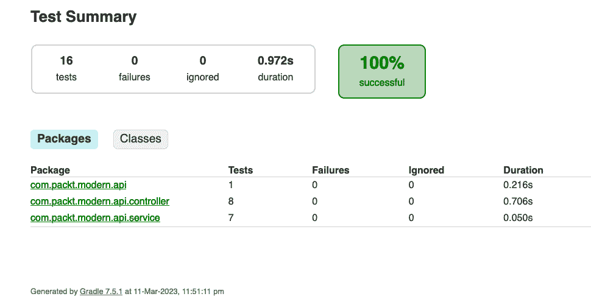
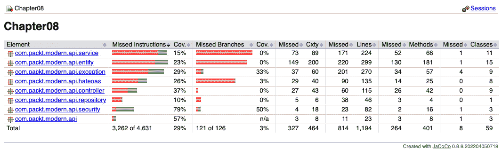
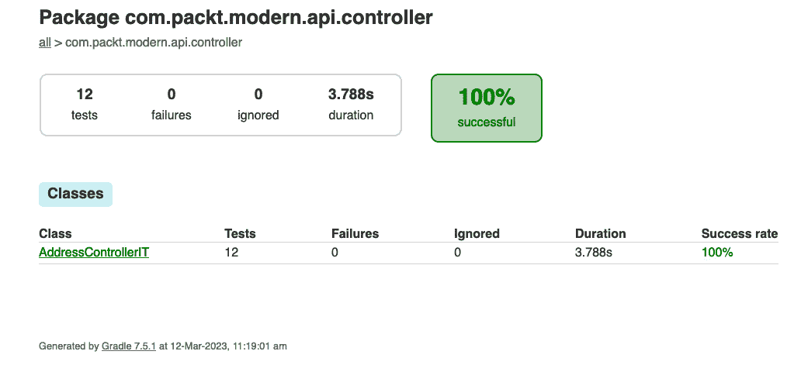

# 第七章：测试 API

正确的自动化测试可以帮助您减少回归错误并保持应用程序稳定。它确保您所做的每个更改在构建或测试阶段都会失败，如果更改对现有代码有任何副作用。投资于测试自动化套件可以给您带来安心，并防止在生产中出现任何意外。

本章将通过向您展示如何实现单元和集成测试自动化来帮助您了解测试自动化。您将学习如何手动和自动测试 API。首先，您将学习如何自动化单元和集成测试。在了解这些自动化形式之后，您将能够使这两种类型的测试成为任何构建的组成部分。您还将学习如何设置**Java 代码覆盖率**（**JaCoCo**）工具来计算不同的代码覆盖率指标。

在本章中，我们将涵盖以下主题：

+   手动测试 API 和代码

+   测试自动化

让我们开始吧！

# 技术要求

本章的代码可在[`github.com/PacktPublishing/Modern-API-Development-with-Spring-6-and-Spring-Boot-3/tree/dev/Chapter08`](https://github.com/PacktPublishing/Modern-API-Development-with-Spring-6-and-Spring-Boot-3/tree/dev/Chapter08)找到。

# 手动测试 API 和代码

测试是软件开发和维护周期中的持续过程。您需要对每个更改的所有可能用例及其相应的代码进行全面测试。可以对 API 执行不同类型的测试，包括以下内容：

+   **单元测试**：单元测试由开发者执行，以测试代码的最小单元（例如类方法）。

+   **集成测试**：集成测试由开发者执行，以测试不同层组件的集成。

+   **契约测试**：契约测试由开发者执行，以确保对 API 所做的任何更改都不会破坏消费者代码。消费者代码应始终符合生产者的契约（API）。这在基于微服务开发中是主要要求的。

+   **端到端**（**E2E**）**测试**：端到端测试由**质量保证**（**QA**）团队执行，以测试端到端场景，例如从 UI（消费者）到后端。

+   **用户验收测试**（**UAT**）：UAT 由业务用户从业务角度进行，可能与端到端测试重叠。

您在本书早期使用 cURL 和 Postman 工具进行了手动 API 测试。每次更改都需要对 API 进行完全测试——不仅仅是受影响的 API。这有原因。您可能认为这只会影响某些 API，但您的潜在假设如果错了怎么办？它可能会影响您跳过的其他 API，这可能导致生产问题。这可能会引起恐慌，可能需要回滚发布或发布带有修复补丁的补丁。

您不希望处于这种情况下，因此产品有一个单独的 QA 团队，确保以最佳可能的质量交付发布。QA 团队执行单独的端到端和验收测试（包括业务/领域用户），除了开发团队进行的测试之外。

这种对高质量交付成果的额外保证需要更多的时间和精力。由于自动化测试，现在所需的时间要短得多。之前因为进行了手动测试，所以时间更长；因此，与今天相比，软件开发周期曾经非常庞大。"上市时间"（**TTM**）是当今竞争激烈的软件行业中的一个重要因素。今天，您需要更快的发布周期。此外，质量检查，也称为测试，是发布周期中的重要和主要部分。

您可以通过自动化测试流程并将其作为 CI/CD 管道的组成部分来减少测试时间。"CI"代表**持续集成**，意味着在代码仓库中的*构建 > 测试 > 合并*。**CD**代表**持续交付**和/或**持续部署**，两者可以互换使用。持续交付是一个过程，其中代码会自动测试并发布（读取和上传）到工件存储库或容器注册库。然后，在手动批准后，它可以被选中并部署到生产环境。持续部署比持续交付更进一步，并自动化所有步骤。持续部署在所有测试通过后也会执行自动部署到生产环境。不向公众开放代码的产品，如 Facebook 和 Twitter，使用这种方法。另一方面，公开可用的产品/服务，如 Spring 框架和 Java，使用持续交付管道。

我们将在下一节中自动化到目前为止所进行的手动测试。

# 测试自动化

无论您正在手动执行什么测试，都可以自动化并将其作为构建的一部分。这意味着任何更改或代码提交都将作为构建的一部分运行测试套件。只有当所有测试都通过时，构建才会成功。

您可以为所有 API 添加自动化集成测试。因此，您不需要使用 cURL 或 Insomnia 手动触发每个 API，构建将触发它们，测试结果将在构建结束时可用。

在本节中，您将编写一个集成测试，该测试将复制 REST 客户端调用并测试所有应用程序层，从控制器开始，一直到底层的持久化层，包括数据库（H2）。

但在之前，您将添加必要的单元测试。理想情况下，这些单元测试应该在开发过程中添加，或者在**测试驱动开发**（**TDD**）的情况下在开发过程之前添加。

单元测试是验证小代码单元（如类的方法）预期结果的测试。如果你有良好的代码（90% 或以上）和分支覆盖率（80% 和以上）的适当测试，你可以避免大多数错误。代码覆盖率是指测试执行时验证的指标，如行数和分支（如 `if-else`）。

一些类或方法依赖于其他类或基础设施服务。例如，控制器类依赖于服务和组装类，而仓库类依赖于 Hibernate API。你可以创建模拟来复制依赖行为，并假设它们按预期或按定义的测试行为工作。这种方法将允许你测试实际的代码单元（如方法）并验证其行为。

在下一节中，我们将探讨在编写集成测试之前如何添加单元测试。

## 单元测试

我建议你回到 *第六章* 作为本章代码的基础。你不需要为单元测试添加任何额外的依赖项。你已经在 `build.gradle` 中有了以下依赖项 ([`github.com/PacktPublishing/Modern-API-Development-with-Spring-6-and-Spring-Boot-3/tree/dev/Chapter08/build.gradle`](https://github.com/PacktPublishing/Modern-API-Development-with-Spring-6-and-Spring-Boot-3/tree/dev/Chapter08/build.gradle))：

```java
testImplementation('org.springframework.boot:spring-boot-starter-test')
```

在这里，`spring-boot-starter-test` 添加了所有必需的测试依赖项，不仅用于单元测试，还用于集成测试。你将主要使用以下库进行测试：

+   `junit-platform-commons`.

+   `junit-jupiter-engine` 允许你在 JUnit 平台上运行基于 Jupiter 的测试。它还提供了 `junit-jupiter`、`junit-jupiter-api` 和 `junit-jupiter-params` 库。

+   **JUnit Vintage** 支持 JUnit 的旧版本，如 3 和 4 版本。在这本书中，你将使用最新版本，即 5，因此你不需要这个包。

你可以在 [`junit.org/`](https://junit.org/) 上了解更多关于 JUnit 的信息。

+   **AssertJ**: AssertJ 是一个测试断言库，通过提供流畅的 API 简化了断言的编写。它也是可扩展的。你可以为你的领域对象编写自定义断言。你可以在 [`assertj.github.io/doc/`](https://assertj.github.io/doc/) 上了解更多信息。

+   **Hamcrest**: Hamcrest 是另一个基于匹配器的断言库，它还允许你编写自定义匹配器。你将在本章中找到这两个示例，尽管 AssertJ 更受欢迎，因为它具有流畅的 API。链式方法帮助 IDE 根据给定的对象建议适当的断言。你可以根据你的用例和喜好选择其中一个断言库或两者都使用。你可以在 [`hamcrest.org/`](http://hamcrest.org/) 上了解更多信息。

+   **Mockito**：Mockito 是一个允许你模拟对象（读取依赖项）和存根方法调用的模拟框架。你可以在[`site.mockito.org/`](https://site.mockito.org/)了解更多信息。

你已经知道单元测试测试的是最小的可测试代码单元。但我们是怎样为控制器方法编写单元测试的呢？控制器在 Web 服务器上运行，并且拥有 Spring Web 应用上下文。如果你编写了一个使用`WebApplicationContext`并且运行在 Web 服务器之上的测试，那么你可以称它为集成测试而不是单元测试。

单元测试应该是轻量级的，并且必须快速执行。因此，你必须使用 Spring 测试库提供的特殊类`MockMvc`来测试控制器。你可以为单元测试使用`MockMvc`的独立设置。你也可以使用`MockitoExtension`在 JUnit 平台（JUnit 5 为运行器提供了扩展）上运行单元测试，它支持对象模拟和方法存根。你还将使用 Mockito 库来模拟所需的依赖项。这些测试速度快，有助于开发者更快地构建。

让我们使用 AssertJ 断言来编写我们的测试。

### 使用 AssertJ 断言进行测试

让我们编写第一个针对`ShipmentController`的单元测试。以下代码可以在`src/test/java/com/packt/modern/api/controller/ShipmentControllerTest.java`文件中找到：

```java
@ExtendWith(MockitoExtension.class)public class ShipmentControllerTest {
  private static final String id =
      "a1b9b31d-e73c-4112-af7c-b68530f38222";
  private MockMvc mockMvc;
  @Mock
  private ShipmentService service;
  @Mock
  private ShipmentRepresentationModelAssembler assembler;
  @Mock
  private MessageSource msgSource;
  @InjectMocks
  private ShipmentController controller;
  private ShipmentEntity entity;
  private Shipment model = new Shipment();
  private JacksonTester<List<Shipment>> shipmentTester;
  // continue …
```

[`github.com/PacktPublishing/Modern-API-Development-with-Spring-6-and-Spring-Boot-3/tree/dev/Chapter08/src/test/java/com/packt/modern/api/controller/ShipmentControllerTest.java`](https://github.com/PacktPublishing/Modern-API-Development-with-Spring-6-and-Spring-Boot-3/tree/dev/Chapter08/src/test/java/com/packt/modern/api/controller/ShipmentControllerTest.java)

在这里，我们的测试使用了一个基于 Jupiter 的注解（`ExtendWith`），它注册了用于运行测试和支持基于 Mockito 的模拟和存根的扩展（`MockitoExtension`）。

Spring 测试库提供了`MockMvc`类，它允许你模拟 Spring MVC。因此，你可以通过调用相关 API 端点的 URI 来执行控制器方法。`ShipmentController`控制器类的依赖项，如服务和组装器，被标记为`@Mock`注解以创建其依赖项的模拟实例。你也可以使用`Mockito.mock(classOrInterface)`来创建模拟对象。

另一个值得注意的注解是控制器声明上的`@InjectMocks`。它会找出测试类所需的全部已声明模拟对象，并自动注入它们。`ShipmentController`使用`ShipmentService`和`ShipmentRepresentation`模型组装器实例，这些实例通过其构造函数注入。基于 Mockito 的`InjectMocks`注解在`ShipmentController`类中查找依赖（服务和组装器）。然后，它在测试类中寻找服务和组装器的模拟对象。一旦找到，它将这些模拟对象注入到`ShipmentController`类中。如果需要，你也可以使用构造函数创建测试类的实例，而不是使用`@InjectMocks`，如下所示：

```java
controller = new ShipmentController(service, assembler);
```

为`RestApiHandler`创建了一个`MessageSource`的模拟对象，该对象在设置方法中使用。你将在下面的代码块中进一步探索它。

声明书的最后一部分是`JacksonTester`，它是 Spring 测试库的一部分。`JacksonTester`是一个使用 AssertJ 和 Jackson 库创建的自定义 JSON 断言类。

JUnit Jupiter API 提供了`@BeforeAll`和`@BeforeEach`方法注解，可以用来设置先决条件。正如它们的名称所暗示的，`@BeforeAll`在每个测试类中只运行一次，而`@BeforeEach`在每个测试执行前执行。`@BeforeEach`可以放置在公共非静态方法上，而`@BeforeAll`应该用来注解公共静态方法。

类似地，JUnit 提供了`@AfterAll`和`@AfterEach`注解，分别用于在每个测试执行后和每个测试执行后执行相关的方法。

让我们使用`@BeforeEach`注解来设置`ShipmentControllerTest`类的先决条件，如下所示：

```java
// continue ShipmentControllerTest.java@BeforeEach
public void setup() {
  ObjectMapper mapper = new AppConfig().objectMapper();
  JacksonTester.initFields(this, mapper);
  MappingJackson2HttpMessageConverter mappingConverter =
    new MappingJackson2HttpMessageConverter();
  mappingConverter.setObjectMapper(mapper);
  mockMvc = MockMvcBuilders.standaloneSetup(controller)
      .setControllerAdvice(new RestApiErrorHandler
        (msgSource))
      .setMessageConverters(mappingConverter).build();
  final Instant now = Instant.now();
  entity = // entity initialization code
  BeanUtils.copyProperties(entity, model);
  // extra model property initialization
}
```

首先，我们使用从`AppConfig`接收到的对象映射器实例初始化`JacksonTester`字段。这创建了一个自定义消息转换器实例（`MappingJackson2HttpMessageConverter`）。

接下来，你可以使用独立设置创建一个`mockMvc`实例，并使用其 setter 方法初始化控制器建议。`RestApiErrorHandler`实例使用`MessageResource`类的模拟对象。在构建之前，你也可以将消息转换器设置为`mockMvc`。

最后，你初始化`ShipmentEntity`和`Shipment`（模型）的实例。

接下来，你将要编写针对`GET /api/v1/shipping/{id}`调用的测试，该调用使用`ShipmentController`类的`getShipmentByOrderId()`方法。测试用`@Test`标记。你也可以使用`@DisplayName`来自定义测试报告中的测试名称：

```java
@Test@DisplayName("returns shipments by given order ID")
public void testGetShipmentByOrderId() throws Exception {
  // given
  given(service.getShipmentByOrderId(id))
      .willReturn(List.of(entity));
  given(assembler.toListModel(List.of(entity)))
      .willReturn(List.of(model));
  // when
  MockHttpServletResponse response = mockMvc.perform(
      get("/api/v1/shipping/" + id)
          .contentType(MediaType.APPLICATION_JSON)
          .accept(MediaType.APPLICATION_JSON))
      .andDo(print())
      .andReturn().getResponse();
  // then
  assertThat(response.getStatus())
       .isEqualTo(HttpStatus.OK.value());
  assertThat(response.getContentAsString())
      .isEqualTo(shipmentTester.write(
          List.of(model)).getJson());
}
```

在这里，你正在使用`Given > When > Then`语言（[`cucumber.io/docs/gherkin/`](https://cucumber.io/docs/gherkin/)），它可以定义为如下：

+   `Given`: 测试的上下文

+   `When`: 测试动作

+   `Then`: 测试结果，随后进行验证

让我们从 BDD（行为驱动开发）的角度来阅读这个测试：

+   `Given`: 服务可用，并根据提供的订单 ID 和一个将实体列表转换为模型列表的组装器返回运输列表。它还添加了 HATEOAS 链接。

+   `When`: 用户通过 `GET /api/shipping/a1b9b31d-e73c-4112-af7c-b68530f38222` 调用 API。

+   `Then`: 测试验证了与给定订单 ID 相关的接收到的运输。

Mockito 的 `MockitoBDD` 类提供了 `given()` 流畅 API 来存根模拟对象的方法。当调用 `mockMvc.perform()` 时，内部它会调用相应的服务和组装器模拟，这些模拟反过来调用存根方法并返回在存根中定义的值（使用 `given()`）。

`andDo(MockMvcResultHandlers.print())` 方法记录请求和响应跟踪，包括有效载荷和响应体。如果你想在测试类中跟踪所有的 `mockMvc` 日志，那么你可以在初始化 `mockMvc` 时直接配置它们，而不是在 `mockMvc.perform()` 调用中单独定义，如下所示（高亮代码）：

```java
mockMvc = MockMvcBuilders.standaloneSetup(controller)    .setControllerAdvice(new RestApiErrorHandler
      (msgSource))
    .setMessageConverters(mappingJackson2HttpMessageConverter)
    .alwaysDo(print())
    .build();
```

最后，你使用 AssertJ 流畅 API 执行断言（状态是否为 `200 OK` 以及返回的 JSON 对象是否与预期对象匹配）。首先，你使用 `Asserts.assertThat()` 函数，它接受实际对象并使用 `isEqualTo()` 方法将其与预期对象进行比较。

到目前为止，你已经使用了 AssertJ 断言。同样，你也可以使用 Spring 和 Hamcrest 断言。

### 使用 Spring 和 Hamcrest 断言进行测试

到这一点，你知道如何使用 `MockitoExtension` 编写 JUnit 5 测试。你将使用相同的方法编写单元测试，除了使用断言。这次，你将使用 Hamcrest 断言编写一个断言，如下所示：

```java
@Test@DisplayName("returns address by given existing ID")
public void getAddressByOrderIdWhenExists() throws Exception {
  given(service.getAddressesById(id))
     .willReturn(Optional.of(entity));
  // when
  ResultActions result = mockMvc.perform(
      get("/api/v1/addresses/a1b9b31d-e73c-4112-af7c-
            b68530f38222")
          .contentType(MediaType.APPLICATION_JSON)
          .accept(MediaType.APPLICATION_JSON));
  // then
  result.andExpect(status().isOk());
  verifyJson(result);
}
```

[`github.com/PacktPublishing/Modern-API-Development-with-Spring-6-and-Spring-Boot-3/tree/dev/Chapter08/src/test/java/com/packt/modern/api/controller/AddressControllerTest.java`](https://github.com/PacktPublishing/Modern-API-Development-with-Spring-6-and-Spring-Boot-3/tree/dev/Chapter08/src/test/java/com/packt/modern/api/controller/AddressControllerTest.java)

你已经从之前的测试示例中的 `mockMvc.perform()` 调用中捕获了 `MockHttpResponse` 实例——即 `testGetShipmentByOrderId()`。这次，你将直接使用 `mockMvc.perform()` 调用的返回值，而不是在它上面调用额外的 `andReturn().getResponse()`。

`ResultAction` 类提供了 `andExpect()` 断言方法，它接受 `ResultMatcher` 作为参数。`StatusResultMatchers.status().isOk()` 结果匹配器评估 `perform()` 调用返回的 HTTP 状态。`VerifyJson()` 方法评估 JSON 响应对象，如下面的代码所示：

```java
// AddressControllerTest.javaprivate void verifyJson(final ResultActions result)
    throws Exception {
  final String BASE_PATH = "http://localhost";
  result
      .andExpect(jsonPath("id",
          is(entity.getId().toString())))
      .andExpect(jsonPath("number", is
          (entity.getNumber())))
      .andExpect(jsonPath("residency",
          is(entity.getResidency())))
      .andExpect(jsonPath("street", is
          (entity.getStreet())))
      .andExpect(jsonPath("city", is(entity.getCity())))
      .andExpect(jsonPath("state", is(entity.getState())))
      .andExpect(jsonPath("country", is
          (entity.getCountry())))
      .andExpect(jsonPath("pincode", is
           (entity.getPincode())))
      .andExpect(jsonPath("links[0].rel", is("self")))
      .andExpect(jsonPath("links[0].href",
          is(BASE_PATH + "/" + entity.getId())))
      .andExpect(jsonPath("links[1].rel", is("self")))
      .andExpect(jsonPath("links[1].href",
          is(BASE_PATH + URI + "/" + entity.getId())));
}
```

在这里，`MockMvcResultMatchers.jsonPath()`结果匹配器接受两个参数——一个 JSON 路径表达式和一个匹配器。因此，首先，你必须传递 JSON 字段名，然后是称为`Is.is()`的 Hamcrest 匹配器，它是`Is.is(equalsTo(entity.getCity()))`的快捷方式。

与编写控制器的单元测试相比，编写服务的单元测试要容易得多，因为你不需要处理`MockMvc`。

你将在下一小节中学习如何测试私有方法。

### 测试私有方法

单元测试私有方法是一个挑战。Spring 测试库提供了`ReflectionTestUtils`类，它提供了一个名为`invokeMethod`的方法。这个方法允许你调用私有方法。`invokeMethod`方法接受三个参数——目标类、方法名称和方法参数（使用可变参数）。让我们使用它来测试`AddressServiceImpl.toEntity()`私有方法，如下面的代码块所示：

```java
@Test@DisplayName("returns an AddressEntity when private method
    toEntity() is called with Address model")
public void convertModelToEntity() {
 // given
 AddressServiceImpl srvc = new AddressServiceImpl
    (repository);
 // when
 AddressEntity e = ReflectionTestUtils.invokeMethod(
    srvc, "toEntity", addAddressReq);
 // then
 then(e).as("Check address entity is returned & not null")
     .isNotNull();
 then(e.getNumber()).as("Check house/flat number is set")
     .isEqualTo(entity.getNumber());
 then(e.getResidency()).as("Check residency is set")
     .isEqualTo(entity.getResidency());
 then(e.getStreet()).as("Check street is set")
     .isEqualTo(entity.getStreet());
 then(e.getCity()).as("Check city is set")
     .isEqualTo(entity.getCity());
 then(e.getState()).as("Check state is set")
     .isEqualTo(entity.getState());
 then(e.getCountry()).as("Check country is set")
     .isEqualTo(entity.getCountry());
 then(e.getPincode()).as("Check pincode is set")
     .isEqualTo(entity.getPincode());
}
```

[`github.com/PacktPublishing/Modern-API-Development-with-Spring-6-and-Spring-Boot-3/tree/dev/Chapter08/src/test/java/com/packt/modern/api/service/AddressServiceTest.java`](https://github.com/PacktPublishing/Modern-API-Development-with-Spring-6-and-Spring-Boot-3/tree/dev/Chapter08/src/test/java/com/packt/modern/api/service/AddressServiceTest.java)

在前面的代码中，你可以看到当你使用给定的参数调用`ReflectionTestUtils.invokeMethod()`时，它返回一个`AddressEntity`实例，该实例已经使用给定的参数的`AddAddressReq`模型实例进行了转换。

在这里，你正在使用 AssertJ 的`BDDAssertions`类提供的第三种断言方式。`BDDAssertions.then()`接受你想要验证的实际值。`as()`方法描述了断言，应该在执行断言之前添加。最后，你使用 AssertJ 的断言方法，如`isEqualTo()`，来执行验证。

你将在下一小节中学习如何测试无返回值的方法。

### 测试无返回值的方法

返回值的函数很容易模拟，但如何模拟一个不返回任何值的函数呢？Mockito 提供了`doNothing()`方法来处理这种情况。在`BDDMockito`类中有一个包装器`willDoNothing()`方法，它内部使用`doNothing()`。

这非常方便，尤其是在你想要在监视时让这些方法什么都不做的时候，就像这里所示：

```java
List linkedList = new LinkedList();List spyLinkedList = spy(linkedList);
doNothing().when(spyLinkedList).clear();
```

在这里，`linkedList`是一个真实对象，而不是模拟对象。然而，如果你想模拟一个特定的方法，那么你可以使用`spy()`。在这里，当在`spyLinkedList`上调用`clear()`方法时，它将不会做任何事情。

让我们使用`willDoNothing`来模拟无返回值的方法，看看它如何帮助测试无返回值的方法：

```java
// AddressServiceTest.java@Test
@DisplayName("delete address by given existing id")
public void deleteAddressesByIdWhenExists() {
  given(repository.findById(UUID.fromString(nonExistId)))
     .willReturn(Optional.of(entity));
  willDoNothing().given(repository)
     .deleteById(UUID.fromString(nonExistId));
  // when
  service.deleteAddressesById(nonExistId);
  // then
  verify(repository, times(1))
     .findById(UUID.fromString(nonExistId));
  verify(repository, times(1))
     .deleteById(UUID.fromString(nonExistId));
}
```

在前面的代码中，`AddressRepository.deleteById()` 正在使用 Mockito 的 `willDoNothing()` 方法进行模拟。现在，你可以使用 Mockito 的 `verify()` 方法，它接受两个参数——模拟对象和其验证模式。在这里，使用的是 `times()` 验证模式，它确定一个方法被调用的次数。

在下一小节中，我们将学习如何对异常场景进行单元测试。

## 测试异常

Mockito 提供了 `thenThrow()` 用于模拟带有异常的方法。BDDMockito 的 `willThrow()` 是一个包装器，它内部使用它。你可以传递 `Throwable` 参数并像这样进行测试：

```java
// AddressServiceTest.java@Test
@DisplayName("delete address by given non-existing id,
    should throw ResourceNotFoundException")
public void deleteAddressesByNonExistId() throws Exception {
  given(repository.findById(UUID.fromString(nonExistId)))
      .willReturn(Optional.empty())
      .willThrow(new ResourceNotFoundException(String.format(
  "No Address found with id %s.", nonExistId)));
  // when
  try { service.deleteAddressesById(nonExistId);
  } catch (Exception ex) {
  // then
    assertThat(ex)
      .isInstanceOf(ResourceNotFoundException.class);
    assertThat(ex.getMessage())
      .contains("No Address found with id " + nonExistId);
  }
  // then
  verify(repository, times(1))
      .findById(UUID.fromString(nonExistId));
  verify(repository, times(0))
      .deleteById(UUID.fromString(nonExistId));
}
```

在这里，你基本上是捕获异常并对它进行断言。

通过这样，你已经探索了可以对控制器和服务执行的单元测试。你可以使用这些示例并为其他类编写单元测试。

## 执行单元测试

你可以运行以下命令来执行单元测试：

```java
$ ./gradlew clean test
```

这将在 `Chapter08/build/reports/tests/test/index.html` 生成单元测试报告。

生成的测试报告看起来像这样：



图 8.1 – 单元测试报告

你可以点击链接进行进一步深入。如果测试失败，它也会显示错误的原因。

让我们继续到下一节，学习如何为单元测试配置代码覆盖率。

## 代码覆盖率

代码覆盖率提供了重要的指标，包括行和分支覆盖率。你将使用 **JaCoCo** 工具来执行和报告代码覆盖率。

首先，你需要将 `jacoco` Gradle 插件添加到 `build.gradle` 文件中，如下面的代码所示：

```java
plugins {    id 'org.springframework.boot' version '3.0.4'
    id 'io.spring.dependency-management' version '1.1.0'
    id 'java'
    id 'org.hidetake.swagger.generator' version '2.19.2'
    id 'jacoco'
}
```

[`github.com/PacktPublishing/Modern-API-Development-with-Spring-6-and-Spring-Boot-3/tree/dev/Chapter08/build.gradle`](https://github.com/PacktPublishing/Modern-API-Development-with-Spring-6-and-Spring-Boot-3/tree/dev/Chapter08/build.gradle)

接下来，通过提供其版本和报告目录来配置 `jacoco` 插件：

```java
// build.gradlejacoco {
    toolVersion = "0.8.8"
    reportsDirectory = layout.buildDirectory.dir(
        "$buildDir/jacoco")
}
```

接下来，创建一个名为 `jacocoTestReport` 的新任务，它依赖于 `test` 任务，因为只有在测试执行之后才能评估代码覆盖率。你不想为自动生成的代码计算覆盖率，所以添加 `exclude` 块。可以通过配置 `afterEvaluate` 来添加排除，如下面的代码块所示：

```java
// build.gradlejacocoTestReport {
    dependsOn test
    afterEvaluate {
        classDirectories.setFrom(
          files(classDirectories.files.collect {
            fileTree(
                dir: it,
                exclude: [
                    'com/packt/modern/api/model/*',
                    'com/packt/modern/api/*Api.*',
                    'com/packt/modern/api/security
                        /UNUSED/*',
                ])
        }))
    }
}
```

接下来，你需要配置 `jacocoTestCoverageVerification`，它定义了违规规则。我们在下面的代码块中添加了关于覆盖率比率的说明。这将设置期望的比率至少为 90%。如果比率低于 0.9，则构建将失败。你可以在 https://docs.gradle.org/current/userguide/jacoco_plugin.html#sec:jacoco_report_violation_rules 了解更多此类规则：

```java
// build.gradlejacocoTestCoverageVerification {
    violationRules {
        rule {
            limit { minimum = 0.9 }
        }
    }
}
```

接下来，将 `finalizedBy(jacocoTestReport)` 添加到测试任务中，这确保了 `jacocoTestReport` 任务将在执行测试后执行：

```java
test {    useJUnitPlatform()
    finalizedBy(jacocoTestReport)
}
```

让我们运行以下命令来生成代码覆盖率报告：

```java
$ ./gradlew clean build
```

之前的命令不仅会运行测试，还会生成代码覆盖率报告以及测试报告。代码覆盖率报告可在`Chapter08/build/jacoco/test/html/index.html`找到，如下所示：



图 8.2 – 代码覆盖率报告

在这里，你可以看到我们的指令覆盖率只有 29%，而我们的分支覆盖率只有 3%。你可以添加更多测试来提高这些百分比。

你将在下一节中了解集成测试。

## 集成测试

一旦你设置了自动化的集成测试，你可以确保你做的任何更改都不会产生错误，前提是你覆盖了所有测试场景。你不需要添加任何额外的插件或库来支持本章中的集成测试。Spring 测试库提供了编写和执行集成测试所需的所有库。

让我们在下一小节中添加集成测试的配置。

### 配置集成测试

首先，你需要为你的集成测试提供一个单独的位置。这可以在`build.gradle`中配置，如下面的代码块所示：

```java
sourceSets {    integrationTest {
        java {
            compileClasspath += main.output + test.output
            runtimeClasspath += main.output + test.output
            srcDir file('src/integration/java')
        }
        resources.srcDir file('src/integration/resources')
    }
}
```

在这里，你可以将集成测试及其资源添加到源集中。当执行相关的 Gradle 命令（`integrationTest`、`build`）时，Gradle 会选择这些测试。

接下来，你可以配置集成测试的实现和运行时，使其扩展自测试的实现和运行时，如下面的代码块所示：

```java
configurations {    integrationTestImplementation.extendsFrom
         testImplementation
    integrationTestRuntime.extendsFrom testRuntime
}
```

最后，创建一个名为`integrationTest`的任务，该任务不仅将使用 JUnit 平台，还将使用我们的`classpath`和`sourceSets`中的测试`classpath`。`integrationTest`。

最后，配置检查任务，使其依赖于`integrationTest`任务，并在测试任务之后运行`integrationTest`。如果你想单独运行`integrationTest`，可以删除以下代码块中的最后一行：

```java
tasks.register('integrationTest', Test) {    useJUnitPlatform()
    description = 'Runs the integration tests.'
    group = 'verification'
    testClassesDirs = sourceSets.integrationTest
         .output.classesDirs
    classpath = sourceSets.integrationTest.runtimeClasspath
}
check.dependsOn integrationTest
integrationTest.mustRunAfter test
```

现在，我们可以开始编写集成测试。在编写集成测试之前，首先，让我们在下一小节中编写支持 Java 类。首先，让我们创建`TestUtils`类。这个类将包含一个返回`ObjectMapper`实例的方法。它将包含一个检查 JWT 是否已过期的方法。

### 为集成测试编写支持类

从`AppConfig`类中检索到的`ObjectMapper`实例添加了额外的配置，以便我们可以将单个值作为数组接受。例如，一个 JSON 字符串字段值可能是`{[{…}, {…}]}`。如果你仔细观察，你会发现它是一个被单个值包裹的数组。当你将此值转换为对象时，`ObjectMapper`将其视为数组。此类的完整代码如下：

```java
public class TestUtils {  private static ObjectMapper objectMapper;
  public static boolean isTokenExpired(String jwt)
      throws JsonProcessingException {
    var encodedPayload = jwt.split("\\.")[1];
    var payload = new String(Base64.getDecoder()
        .decode(encodedPayload));
    JsonNode parent = new ObjectMapper().readTree(payload);
    String expiration = parent.path("exp").asText();
    Instant expTime = Instant.ofEpochMilli(
        Long.valueOf(expiration) * 1000);
    return Instant.now().compareTo(expTime) < 0;
  }
  public static ObjectMapper objectMapper() {
    if (Objects.isNull(objectMapper)) {
      objectMapper = new AppConfig().objectMapper();
      objectMapper.configure(DeserializationFeature
          .ACCEPT_SINGLE_VALUE_AS_ARRAY, true);
    }
    return objectMapper;
  }
}
```

[`github.com/PacktPublishing/Modern-API-Development-with-Spring-6-and-Spring-Boot-3/tree/dev/Chapter08/src/integration/java/com/packt/modern/api/TestUtils.java`](https://github.com/PacktPublishing/Modern-API-Development-with-Spring-6-and-Spring-Boot-3/tree/dev/Chapter08/src/integration/java/com/packt/modern/api/TestUtils.java)

接下来，你需要一个客户端，允许你登录以便检索 JWT。`RestTemplate`是 Spring 中的一个 HTTP 客户端，它提供了发起 HTTP 调用的支持。`AuthClient`类利用`TestRestTemplate`，从测试的角度来看，它是`RestTemplate`的一个副本。

让我们按照以下方式编写这个`AuthClient`类：

```java
public class AuthClient { private final TestRestTemplate restTemplate;
 private final ObjectMapper objectMapper;
 public AuthClient(TestRestTemplate restTemplate,
     ObjectMapper objectMapper) {
   this.restTemplate = restTemplate;
   this.objectMapper = objectMapper;
 }
 public SignedInUser login(String username,
     String password) {
   SignInReq signInReq = new SignInReq()
                     .username(username).password(password);
   return restTemplate
      .execute("/api/v1/auth/token",HttpMethod.POST,
        req -> {
          objectMapper.writeValue(req.getBody(),
              signInReq);
          req.getHeaders().add(HttpHeaders.CONTENT_TYPE,
                 MediaType.APPLICATION_JSON_VALUE);
          req.getHeaders().add(HttpHeaders.ACCEPT,
                 MediaType.APPLICATION_JSON_VALUE);
        },
        res -> objectMapper.readValue(res.getBody(),
            SignedInUser.class)
      );
   }
}
```

[`github.com/PacktPublishing/Modern-API-Development-with-Spring-6-and-Spring-Boot-3/tree/dev/Chapter08/src/integration/java/com/packt/modern/api/AuthClient.java`](https://github.com/PacktPublishing/Modern-API-Development-with-Spring-6-and-Spring-Boot-3/tree/dev/Chapter08/src/integration/java/com/packt/modern/api/AuthClient.java)

Spring 测试库提供了`MockMvc`、`WebTestClient`和`TestRestTemplate`来执行集成测试。你已经在单元测试中使用了`MockMvc`。同样的方法也可以用于集成测试。然而，而不是使用模拟，你可以通过在测试类中添加`@SpringBootTest`注解来使用实际的对象。`@SpringBootTest`，连同`SpringExtension`一起，提供了所有必要的 Spring 上下文，例如实际的应用程序。

`@TestPropertySource`提供了测试属性文件的位置。

`WebTestClient`用于测试响应式应用程序。然而，为了测试 REST 服务，你必须使用`TestRestTemplate`，它是`RestTemplate`的一个副本。

你将要编写的集成测试是一个完整的测试，不包含任何模拟。它将使用与实际应用程序相同的 Flyway 脚本，我们将它们添加到了`src/integration/resources/db/migration`。集成测试还将拥有自己的`application.properties`文件，位于`src/integration/resources`。

因此，集成测试将和直接从 REST 客户端（如 cURL 或 Postman）调用 REST 端点一样好。这些 Flyway 脚本在 H2 内存数据库中创建了所需的表和数据。然后，这些数据将被 RESTful Web 服务使用。你也可以使用其他数据库，如 Postgres 或 MySQL，使用它们的测试容器。

让我们在`src/integration/java`目录下的一个合适的包中创建一个新的集成测试，名为`AddressControllerIT`，并添加以下代码：

```java
@ExtendWith(SpringExtension.class)@SpringBootTest( webEnvironment = WebEnvironment.RANDOM_PORT,
    properties = "spring.flyway.clean-disabled=false")
@TestPropertySource(locations =
    "classpath:application-it.properties")
@TestMethodOrder(OrderAnnotation.class)
@TestInstance(TestInstance.Lifecycle.PER_CLASS)
public class AddressControllerIT {
  private static ObjectMapper objectMapper;
  private static AuthClient authClient;
  private static SignedInUser signedInUser;
  private static Address address;
  private static String idOfAddressToBeRemoved;
  @Autowired
  private AddressRepository repository;
  @Autowired
  private TestRestTemplate restTemplate;
  @BeforeAll
  public static void init(@Autowired Flyway flyway) {
    objectMapper = TestUtils.objectMapper();
    address = new Address().id(
     "a731fda1-aaad-42ea-bdbc-a27eeebe2cc0").
       number("9I-999")
     .residency("Fraser Suites Le Claridge")
     .street("Champs-Elysees").city("Paris").state(
       "Île-de-France").country("France").pincode("75008");
    flyway.clean();
    flyway.migrate();
  }
  @BeforeEach
  public void setup(TestInfo info)
      throws JsonProcessingException {
    if (Objects.isNull(signedInUser) ||
        Strings.isNullOrEmpty(signedInUser.getAccessToken())
        || isTokenExpired(signedInUser.getAccessToken())) {
      authClient = new AuthClient
        (restTemplate, objectMapper);
      if (if (info.getTags().contains("NonAdminUser")) {
        signedInUser = authClient.login("scott", "tiger");
      } else {
        signedInUser = authClient.login("scott2", "tiger");
      }
    }
  }
```

[`github.com/PacktPublishing/Modern-API-Development-with-Spring-6-and-Spring-Boot-3/blob/main/Chapter08/src/integration/java/com/packt/modern/api/controller/AddressControllerIT.java`](https://github.com/PacktPublishing/Modern-API-Development-with-Spring-6-and-Spring-Boot-3/blob/main/Chapter08/src/integration/java/com/packt/modern/api/controller/AddressControllerIT.java)

在这里，`SpringExtension`现在被用来在 JUnit 平台上运行单元测试。`SpringBootTest`注解为测试类提供了所有依赖项和上下文。测试服务器正在使用随机端口运行。你还在使用`@TestMethodOrder`，结合`@Order`注解，以特定的顺序运行测试。你将按照特定的顺序执行测试，以确保在`addresses`资源上的`POST` HTTP 方法仅在`addresses`资源上的`DELETE` HTTP 方法之前调用。这是因为你在`DELETE`调用中传递了新创建的地址 ID。通常，测试以随机顺序运行。如果`DELETE`调用在`POST`调用之前进行，则构建将失败，而不会测试适当的场景。

`@TestInstance`将测试实例的生命周期设置为每个类（`TestInstance.Lifecycle.PER_CLASS`），因为我们希望在集成测试执行之前清理和迁移数据库。

静态的`init()`方法被注解为`@BeforeAll`，将在所有测试之前运行。在这个方法中，你设置了`objectMapper`和`address`模型。你还在这个方法中使用了 Flyway 实例来清理数据库模式，并使用`migrate`命令重新创建模式。

该方法的设置将在每个测试执行之前运行，因为它被标记为`@BeforeEach`注解。在这里，你确保只有在`signedInUser`为 null 或令牌已过期时才会进行登录调用。`TestInfo`实例帮助我们为不同的测试分配不同的用户 – `scott2`（管理员）和`scott`（非管理员）。

让我们添加一个集成测试，该测试将验证`GET /api/v1/addresses` REST 端点，如下面的代码所示：

```java
@Test@DisplayName("returns all addresses")
@Order(6)
public void getAllAddress() throws IOException {
  // given
  MultiValueMap<String, String> headers =
       new LinkedMultiValueMap<>();
  headers.add(HttpHeaders.CONTENT_TYPE,
                           MediaType.APPLICATION_JSON_VALUE);
  headers.add(HttpHeaders.ACCEPT,
                           MediaType.APPLICATION_JSON_VALUE);
  headers.add("Authorization", "Bearer " +
      signedInUser.getAccessToken());
  // when
  ResponseEntity<JsonNode> addressResponseEntity =
    restTemplate.exchange("/api/v1/addresses",
       HttpMethod.GET,
          new HttpEntity<>(headers), JsonNode.class);
  // then
  assertThat(addressResponseEntity.getStatusCode())
    .isEqualTo(HttpStatus.OK);
  JsonNode n = addressResponseEntity.getBody();
  List<Address> addressFromResponse = objectMapper
   .convertValue(n,new TypeReference
      <ArrayList<Address>>(){});
  assertThat(addressFromResponse).hasSizeGreaterThan(0);
  assertThat(addressFromResponse.get(0))
    .hasFieldOrProperty("links");
  assertThat(addressFromResponse.get(0))
    .isInstanceOf(Address.class);
}
```

[`github.com/PacktPublishing/Modern-API-Development-with-Spring-6-and-Spring-Boot-3/blob/main/Chapter08/src/integration/java/com/packt/modern/api/controller/AddressControllerIT.java`](https://github.com/PacktPublishing/Modern-API-Development-with-Spring-6-and-Spring-Boot-3/blob/main/Chapter08/src/integration/java/com/packt/modern/api/controller/AddressControllerIT.java)

首先，你必须设置给定部分的标题。在这里，你使用`signedInUser`实例来设置 bearer 令牌。接下来，你必须调用`TestRestTemplate`的 exchange 方法，该方法接受四个参数 – URI、`HTTP`方法、`HttpEntity`（如果需要，包含标题和有效负载），以及返回值的类型。你也可以使用可选的第五个参数，如果模板被用来设置`urlVariables`，这将扩展模板。

然后，你必须使用断言来执行验证过程。在这里，你可以看到它复制了实际的调用。

使用以下命令运行测试：

```java
 $ gradlew clean integrationTest # or
 $ gradlew clean build
```

然后，你可以在`Chapter08/build/reports/tests/integrationTest`中找到测试报告。测试报告应该看起来像这样：



图 8.3 – 集成测试报告

你可以在`AddressControllerIT.java`中找到所有的测试地址资源，它包含了成功、错误、认证和授权的测试。它对所有的操作类型都有测试，包括`创建`、`读取`和`删除`操作。

现在，你已经学会了如何编写集成测试。你可以利用这项技能为其他 REST 资源编写集成测试。

# 摘要

在本章中，你探索了手动和自动测试。你学习了如何使用 JUnit、Spring 测试库、AssertJ 和 Hamcrest 编写单元和集成测试。你还学习了如何使用 Gherkin 的`Given > When > Then`语言使测试更易读。然后你学习了如何分离单元和集成测试。

最后，你通过自动化单元和集成测试学习了各种测试自动化技能。这将帮助你自动化测试，并在将代码交付给质量分析师或客户之前捕捉到错误和漏洞。

在下一章中，你将学习如何将应用程序容器化并在 Kubernetes 中部署。

# 问题

1.  单元测试和集成测试之间的区别是什么？

1.  分离单元和集成测试有什么优势？

1.  对象模拟和间谍行为之间的区别是什么？

# 答案

1.  单元测试是为了测试最小的代码单元，例如一个方法，而集成测试是在涉及不同层或多个模块的地方进行的。在本章中，对整个应用程序进行了集成测试，涉及应用程序的所有层，包括数据库，而单元测试是按类对每个方法进行的。在本章的上下文中，单元测试是白盒测试，而 API 集成测试是一种黑盒测试，因为你要验证 API 的功能需求。

1.  将单元和集成测试（包括它们的源位置）分开，可以让你轻松地管理测试。你也可以有一个可配置的构建设置，在开发期间或按需执行单元测试，因为单元测试更快。你可以使用`gradlew clean build –x integrationTest`命令仅运行单元测试，而在合并请求构建中，你可以执行集成测试以验证合并请求。默认的构建（`gradlew clean build`）将执行单元和集成测试。

1.  当你使用`Mockito.mock()`或`@Mock`时，它创建了一个给定类的完整伪造对象，然后你可以根据测试需求对该方法进行存根，而`Mockito.spy()`或`@Spy`创建了一个真实对象，你可以对其所需的方法进行存根。如果没有在`spy`对象上执行存根，那么在测试期间将调用其实际方法。

# 进一步阅读

+   JUnit: [`junit.org/`](https://junit.org/)

+   AssertJ: [`assertj.github.io/doc/`](https://assertj.github.io/doc/)

+   Hamcrest: [`hamcrest.org/`](http://hamcrest.org/)

+   Mockito: [`site.mockito.org/`](https://site.mockito.org/)

+   *测试自动化工程* *手册*: [`www.packtpub.com/product/test-automation-engineering-handbook/9781804615492`](https://www.packtpub.com/product/test-automation-engineering-handbook/9781804615492)
