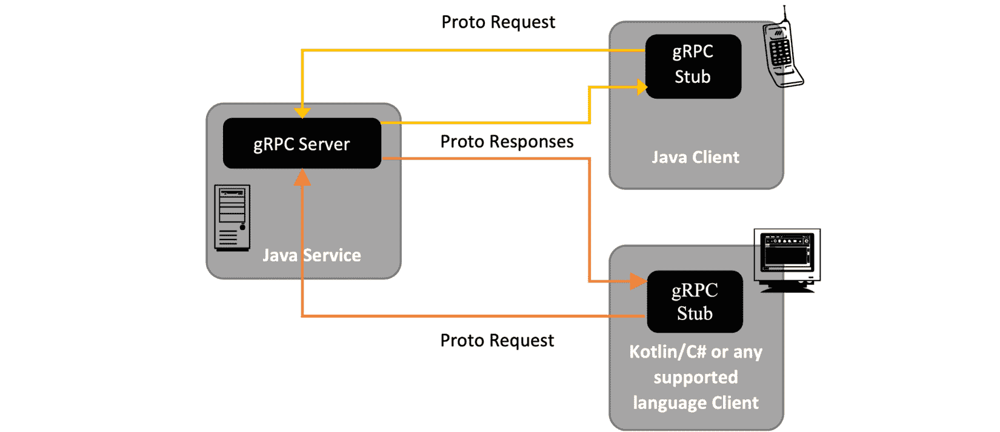
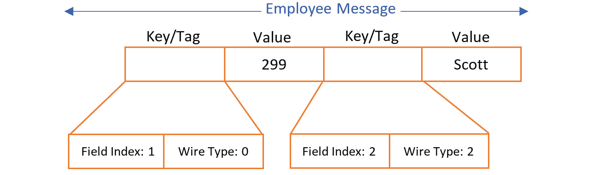

# 第九章：开始使用 gRPC

gRPC 是一个用于网络中通用远程过程调用（RPC）的开源框架。RPC 允许远程过程（托管在不同的机器上）像调用本地过程一样调用，而无需编写远程交互的详细信息。RPC 在*gRPC*缩写中具有恒定的意义。看起来很合理，gRPC 中的*g*代表*Google*，因为它最初是在那里开发的。但是，*g*的含义随着每个版本的发布而改变。对于其第一个版本 1.0，gRPC 中的*g*代表 gRPC 本身。也就是说，在版本 1.0 中，它代表**gRPC** **远程过程调用**。在本章中，你将使用 gRPC 版本 1.54，其中*g*代表**优雅**。因此，你可以将 gRPC 称为**优雅的远程过程调用**（针对版本 1.54）。你可以在[`github.com/grpc/grpc/blob/master/doc/g_stands_for.md`](https://github.com/grpc/grpc/blob/master/doc/g_stands_for.md)找到不同版本中*g*的所有含义。

在本章中，你将学习 gRPC 的基础知识，例如其架构、服务定义、生命周期、服务器和客户端。本章将为你提供一个基础，你可以用它来实现基于 gRPC 的 API。这些基础知识将帮助你在一个示例电子商务应用中实现服务间通信。

你将在下一章使用基于 gRPC 的 API 来开发一个基本的支付网关，用于处理电子商务应用中的支付。

注意

gRPC 发音为*Jee-Arr-Pee-See*。

你将在本章中探索以下主题：

+   介绍和 gRPC 架构

+   理解服务定义

+   探索 gRPC 生命周期

+   理解 gRPC 服务器和 gRPC 存根

+   处理错误

完成本章后，你将理解 gRPC 的基础知识，这将有助于你在下一章实现基于 gRPC 的 Web 服务。

# 技术要求

本章仅包含 gRPC 的理论。然而，在开发和使用基于 gRPC 的 Web 服务时，你通常需要一个 gRPC API 客户端，如 Insomnia。

你将在本章学习 gRPC 的基础知识，因此本章没有自己的代码仓库。然而，对于实际代码，你可以参考第十一章的代码，位于[`github.com/PacktPublishing/Modern-API-Development-with-Spring-6-and-Spring-Boot-3/tree/dev/Chapter11`](https://github.com/PacktPublishing/Modern-API-Development-with-Spring-6-and-Spring-Boot-3/tree/dev/Chapter11)。

# gRPC 是如何工作的？

gRPC 是一个用于网络中通用 RPC 的开源框架。gRPC 支持全双工流式传输，并且与 HTTP/2 语义大致一致。它支持不同的媒体格式，如**协议缓冲区**（**Protobuf**）、JSON、XML 和 Thrift。Protobuf 是默认的媒体格式。由于性能更高，使用 Protobuf 优于其他格式。

gRPC 将**REST**（表示状态传输）和 RPC 的最佳之处带到了桌面上，非常适合通过 API 进行分布式网络通信。它提供了一些显著的功能，如下所示：

+   它是为高度可扩展的分布式系统设计的，并提供了*低延迟*。

+   它提供了负载均衡和故障转移。

+   由于其分层设计，它可以在应用层轻松集成，以进行与流控制的交互。

+   它支持级联调用取消。

+   它提供了广泛的通信——移动应用到服务器、Web 应用到服务器以及不同机器上的任何 gRPC 客户端应用到 gRPC 服务器应用。

你已经了解了 REST 及其实现。让我们在下一小节中找出 REST 和 gRPC 之间的差异，这为你提供了不同的视角，并允许你根据你的需求和用例在 REST 或 gRPC 之间进行选择。

## REST 与 gRPC

gRPC 基于客户端-服务器架构，而 REST 则不是。

与 REST 相比，gRPC 和 REST 都利用了 HTTP 协议。gRPC 支持 HTTP/2 规范和全双工流通信，而 REST 在语音或视频通话等场景中表现良好。

在 REST 中，你可以通过查询参数、路径参数和请求体传递有效载荷。这意味着请求有效载荷/数据可以通过不同的来源传递，从而导致从不同来源解析有效载荷/数据，这增加了延迟和复杂性。另一方面，gRPC 由于使用静态路径和请求有效载荷的单个来源，在性能上优于 REST。

如你所知，REST 响应错误依赖于 HTTP 状态码，而 gRPC 已经将错误集合形式化，使其与 API 良好对齐。

由于 REST API 完全依赖于 HTTP，其实现更加灵活。这给了你灵活性，但你需要标准和规范来进行严格的验证和验证。但你是否知道为什么你需要这些严格的验证和验证？这是因为你可以以不同的方式实现 API。例如，你可以使用任何 HTTP 方法而不是仅使用`HTTP DELETE`方法来删除资源，这听起来很简单。

在所有这些之上，gRPC 还旨在支持和处理调用取消、负载均衡和故障转移。

REST 成熟且被广泛采用，但 gRPC 带来了其优势。因此，你可以根据它们的优缺点来选择它们。（请注意，我们尚未讨论 GraphQL，它带来了自己的特色。你将在*第十三章*“开始使用 GraphQL”和*第十四章*“GraphQL API 开发和测试”中了解 GraphQL。）

让我们在下一小节中找出我们是否可以使用 gRPC 像 REST 一样进行 Web 通信。

## 我能否从 Web 浏览器和移动应用中调用 gRPC 服务器？

当然可以。gRPC 框架是为分布式系统中的通信而设计的，并且主要与 HTTP/2 语义一致。您可以从移动应用程序中调用 gRPC API，就像调用任何本地对象一样。这就是 gRPC 的美妙之处！它支持互联网和内网中的跨服务通信，以及从移动应用程序和网页浏览器到 gRPC 服务器的调用。因此，您可以利用它进行各种通信。

gRPC for web（即 `gRPC-web`）在 2018 年相当新颖，但现在（在 2023 年），它获得了更多的认可，并且特别用于 **物联网**（**IoT**）应用。理想情况下，您应该首先将其用于您的内部服务间通信，然后用于 Web/移动服务器通信。

让我们在下一小节中了解更多关于其架构的信息。

## 了解 gRPC 架构

gRPC 是一个通用的基于 RPC 的框架。它在 RPC 风格中工作得非常好，涉及以下步骤：

1.  首先，您定义服务接口，包括方法签名，以及它们的参数和返回类型。

1.  然后，您将定义的服务接口作为 gRPC 服务器的一部分进行实现。现在您已准备好提供远程调用服务。

1.  接下来，您需要客户端的存根，您可以使用服务接口生成它。客户端应用程序调用存根，这是一个本地调用。然后，存根与 gRPC 服务器通信，并将返回值传递给 gRPC 客户端。这如图所示：



图 10.1 – gRPC 客户端-服务器架构

对于客户端应用程序，它只是对存根的本地调用以获取响应。您可以在同一台机器或不同机器上有一个服务器。这使得编写分布式服务变得更容易。它是编写微服务的理想工具。gRPC 是语言无关的。您可以使用不同的语言编写服务器和客户端。这为开发提供了很大的灵活性。

gRPC 是一种分层架构，具有以下层以实现远程调用：

+   如果接口使用 Protobuf 定义，则为 `.proto` 扩展。

+   `connected` 或 `idle`。

+   **传输层**：这是最低层，使用 HTTP/2 作为其协议。因此，gRPC 提供了全双工通信和在同一网络连接上并行调用复用。 

您可以通过以下步骤开发基于 gRPC 的服务：

1.  使用 `.proto` 文件（Protobuf）定义服务接口。

1.  编写在 *步骤 1* 中定义的服务接口的实现。

1.  创建一个 gRPC 服务器并将其服务注册到其中。

1.  生成服务存根并将其与 gRPC 客户端一起使用。

您将在下一章中实现实际的 gRPC 服务，*第十一章*，*gRPC API 开发*和*测试*。

gRPC 存根

存根是一个暴露服务接口的对象。gRPC 客户端调用存根方法，将调用钩到服务器，并获取响应。

你需要了解 Protobuf 来定义服务接口。让我们在下一个小节中探讨它。

## gRPC 如何使用 Protobuf

Protobuf 创建于 2001 年，并于 2008 年公开提供。它也被 Google 的基于微服务的系统 Stubby 所使用。

gRPC 也很好地与 JSON 和其他媒体类型协同工作。然而，你将使用 Protobuf 定义服务接口，因为它以其性能而闻名。它允许正式的合约、更好的带宽优化和代码生成。Protobuf 也是 gRPC 的默认格式。gRPC 不仅使用 Protobuf 进行数据序列化，还用于代码生成。Protobuf 序列化数据，与 JSON 不同，YAML 不可读。让我们看看它是如何构建的。

Protobuf 消息包含一系列键值对。键指定 `message` 字段及其类型。让我们检查以下 `Employee` 消息：

```java
message Employee {  int64 id = 1;
  string firstName = 2;
}
```

让我们使用 Protobuf（`id` 值为 `299` 和 `firstName` 值为 `Scott`）表示此消息，如下所示图所示：



图 10.2 – 使用 Protobuf 表示的员工消息

`Id` 和 `firstName` 字段分别标记为数字，序列 `1` 和 `2`，这是序列化所必需的。线类型是另一个方面，它提供了查找值长度的信息。

下表包含线类型及其相应的含义：

| **线类型** | **含义** | **用途** |
| --- | --- | --- |
| 0 | 可变长整数 | `int32`、`int64`、`uint32`、`uint64`、`sint32`、`sint64`、`bool`、`enum` |
| 1 | 64 位 | `fixed64`、`sfixed64`、`double` |
| 2 | 长度分隔 | `string`、`bytes`、嵌入的消息、打包的重复字段 |
| 3 | 开始组 | `groups`（已弃用） |
| 4 | 结束组 | `groups`（已弃用） |
| 5 | 32 位 | `fixed32`、`sfixed32`、`float` |

Protobuf 文件以 `.proto` 扩展名创建。你以方法签名和消息（对象）的形式定义服务接口，这些消息在方法签名中引用。这些消息可以是方法参数或返回类型。你可以使用 `protoc` 编译器编译定义的服务接口，它为接口和给定消息生成类。同样，你也可以为 gRPC 客户端生成存根。

让我们看看以下示例 `.proto` 文件：

员工的示例服务接口

```java
syntax = "proto3";package com.packtpub;
option java_package = "com.packt.modern.api.proto";
option java_multiple_files = true;
message Employee {
  int64 id = 1;
  string firstName = 2;
  string lastName = 3;
  int64 deptId = 4;
  double salary = 5;
  message Address {
    string houseNo = 1;
    string street1 = 2;
    string street2 = 3;
    string city = 4;
    string state = 5;
    string country = 6;
    string pincode = 7;
  }
}
message EmployeeCreateResponse {
  int64 id = 1;
}
service EmployeeService {
  rpc Create(Employee) returns (EmployeeCreateResponse);
}
```

让我们逐行理解这段代码：

1.  第一行表示由 `syntax` 关键字表示的 Protobuf 版本。`syntax` 的值（`proto3`）告诉编译器使用 Protobuf 的第 3 版。默认版本是 `proto2`。Protobuf 版本 3 提供了更多功能，语法简化，并支持更多语言。gRPC 推荐使用 Protobuf 版本 3。

1.  接下来，您使用 `package` 关键字定义 `proto` 包名，后跟包名。它防止消息类型之间的名称冲突。

1.  接下来，您使用 `option` 关键字通过 `java_package` 参数定义 Java 包名。

1.  然后，您再次使用 `option` 关键字，通过 `java_multiple_files` 参数为每个根级消息类型生成一个单独的文件。

1.  然后，您使用 `messages` 关键字定义消息，这些消息不过是对象。消息及其字段使用强类型定义，这些类型定义了具有精确规格的对象。您可以像在 Java 中定义嵌套类一样定义嵌套消息。最后一点包含了您可以使用来定义 `message` 字段类型的 Protobuf 类型表。

1.  您可以使用 `Employee.Address` 在其他消息中定义 `address` 字段。

1.  标记带有序列号的字段的标记是必需的，因为它用于序列化和解析二进制消息。

请注意，一旦消息结构被序列化，您就不能更改它。

1.  服务定义使用 `service` 关键字进行定义。服务定义包含方法。您可以使用 `rpc` 关键字定义方法。请参考 `EmployeeService` 服务定义以获取示例。您将在下一小节中了解更多关于服务定义的内容。

1.  Protobuf 有预定义的类型（标量类型）。`message` 字段可以具有 Protobuf 标量类型之一。当我们编译 `.proto` 文件时，它将 `message` 字段转换为相应的语言类型。以下表格定义了 Protobuf 类型与 Java 类型之间的映射：

| **Protobuf types** | **Java types** | **备注** |
| --- | --- | --- |
| `Double` | `Double` | 类似于 Java 类型 `double`。 |
| `Float` | `Float` | 类似于 Java 类型 `float`。 |
| `int32` | `Int` | 如果字段包含负值，请使用 `sint32`，因为它使用可变长度编码，对于编码负数效率较低。 |
| `int64` | `Long` | 如果字段包含负值，请使用 `sint64`，因为它使用可变长度编码，对于编码负数效率较低。 |
| `uint32` | `Int` | 使用可变长度编码。如果值大于 228，请使用 `fixed32`。 |
| `uint64` | `Long` | 使用可变长度编码。如果值大于 256，请使用 `fixed64`。 |
| `sint32` | `Int` | 对于编码负数更有效，因为它包含一个有符号的 `int` 值。它使用可变长度编码。 |
| `sint64` | `Long` | 对于编码负数更有效，因为它包含一个有符号的 `int` 值。它使用可变长度编码。 |
| `fixed32` | `int` | 总共 4 字节。 |
| `fixed64` | `long` | 总共 8 字节。 |
| `sfixed32` | `int` | 总共 4 字节。对于编码大于 228 的值更有效。 |
| `sfixed64` | `long` | 总共 8 字节。对于编码大于 256 的值更有效。 |
| `Bool` | `boolean` | `true` 或 `false`。 |
| `String` | `String` | 包含 UTF-8 编码的字符串或 7 位 ASCII 文本，长度不应超过 232。 |
| `Bytes` | `ByteString` | 包含任意字节序列，长度不应超过 232。 |

Protobuf 还允许您定义枚举类型（使用`enum`关键字）和映射（使用`map<keytype, valuetype>`关键字）。请参考以下代码以获取枚举和映射类型的示例：

```java
… omittedmessage Employee {
  … omitted
  enum Grade {
    I_GRADE = 1;
    II_GRADE = 2;
    III_GRADE = 3;
    IV_GRADE = 4;
  }
  map<string, int32> nominees = 1;
  … omitted
}
```

以下示例代码创建了`Employee`消息，其中包含具有`I_GRADE`等值的`Grade`枚举字段。`nominees`字段是一个具有`string`类型键和`int32`类型值的映射。

在下一节中，我们将进一步探讨服务定义。

# 理解服务定义

您可以通过指定方法及其相应的参数和返回类型来定义一个服务。这些方法由服务器暴露，可以远程调用。您在上一小节中定义了`EmployeeService`定义，如下面的代码块所示：

```java
service EmployeeService {  rpc Create(Employee) returns (EmployeeCreateResponse);
}
```

在这里，`Create`是`EmployeeService`服务定义中暴露的方法。在`Create`服务中使用的消息也应作为服务定义的一部分进行定义。`Create`服务方法是一个一元服务方法，因为客户端发送单个请求对象，并从服务器接收单个响应对象。

让我们进一步探讨 gRPC 提供的服务方法类型：

+   **一元**：我们已经在之前的示例中讨论了一元服务方法。这将针对单个请求有一个单向响应。

+   **服务器流式传输**：在这些类型的服务方法中，客户端向服务器发送单个对象，并接收流式响应。此流包含消息序列。流保持打开状态，直到客户端接收所有消息。gRPC 保证了消息序列的顺序。在以下示例中，客户端将一直接收实时比分消息，直到比赛结束：

    ```java
    rpc LiveMatchScore(MatchId) returns (stream MatchScore);
    ```

+   **客户端流式传输**：在这些类型的服务方法中，客户端向服务器发送一系列消息，并接收一个响应对象。流保持打开状态，直到客户端发送所有消息。gRPC 保证了消息序列的顺序。一旦客户端发送所有消息，它将等待服务器的响应。在以下示例中，客户端将发送数据消息到服务器，直到所有数据记录发送完毕，然后等待报告：

    ```java
    rpc AnalyzeData(stream DataInput) returns (Report);
    ```

+   **双向流式**：这是客户端和服务器流式同时执行。这意味着服务器和客户端都使用读写流发送一系列消息。在这里，序列的顺序被保留。然而，这两个流独立操作。因此，每个都可以按它们喜欢的顺序读取和写入。服务器可以逐个读取和回复消息，或者一次性回复，或者有任意组合。在以下示例中，处理过的记录可以立即逐个发送，也可以稍后以不同的批次发送：

    ```java
    rpc BatchProcessing(stream InputRecords)    returns (stream Response);
    ```

现在你已经了解了 gRPC 服务定义，让我们在下一节中探索 RPC 的生命周期。

# 探索 RPC 生命周期

在上一节中，你了解了四种类型的服务定义。每种类型的服务定义都有自己的生命周期。让我们在本节中了解更多关于每种服务定义生命周期的信息：

+   `存根`还提供了服务器客户端的元数据、方法名称以及如果适用的话，指定的截止日期，并带有通知。

**元数据**是以键值对形式存在的关于 RPC 的数据，例如超时和认证细节。

接下来，作为回应，服务器发送其初始元数据。服务器是立即发送初始元数据还是收到客户端请求消息后发送，取决于应用程序。但服务器必须在任何响应之前发送它。

服务器在收到客户端请求消息后处理请求并准备响应。服务器发送带有状态（代码和可选消息）以及可选尾部元数据的响应，对于成功的调用。

客户端收到响应并完成调用（对于`OK`状态，例如`HTTP`状态 200）。

+   *服务器流式 RPC 的生命周期*：服务器流式 RPC 的生命周期几乎与单一 RPC 相同。它遵循相同的步骤。唯一的区别是由于流式响应，响应的发送方式不同。服务器以流的形式发送消息，直到所有消息都发送完毕。最后，服务器发送带有状态（代码和可选消息）以及可选的尾部元数据的响应，并完成服务器端处理。客户端在收到所有服务器的消息后完成生命周期。

+   *客户端流式 RPC 的生命周期*：客户端流式 RPC 的生命周期几乎与单一 RPC 相同。它遵循相同的步骤。唯一的区别是由于流式请求，请求的发送方式不同。客户端以流的形式发送消息，直到所有消息都发送到服务器。服务器发送带有状态（代码和可选消息）以及可选尾部元数据的单个消息响应，对于成功的调用。在空闲场景下，服务器在收到所有客户端的消息后发送响应。客户端在收到服务器消息后完成生命周期。

+   *双向流式 RPC 的生命周期*：双向流式 RPC 生命周期的前两个步骤与单一 RPC 相同。流式处理由双方的应用程序特定。服务器和客户端都可以按任何顺序读取和写入消息，因为这两个流相互独立。

服务器可以按任何顺序处理客户端发送的请求消息流。例如，服务器和客户端可以玩乒乓球：客户端发送请求消息，服务器处理它。再次，客户端发送请求消息，服务器处理它，这个过程，正如你所知，会继续进行。或者服务器等待接收到客户端的所有消息后，再发送自己的消息。

客户端在接收到所有服务器消息后完成生命周期。

## 影响生命周期的事件

以下事件可能会影响 RPC 的生命周期：

+   `DEADLINE_EXCEEDED` 错误。同样，服务器可以查询以确定特定的 RPC 是否超时，或者完成 RPC 剩余多少时间。

超时配置是语言特定的。一些语言 API 支持超时（时间长度），而一些支持截止日期（固定的时间点）。API 可能有一个默认的截止日期/超时值，而一些可能没有。

+   **RPC 终止**：有一些场景中，RPC 被终止是因为客户端和服务器各自独立且本地地确定调用的成功，他们的结论可能不匹配。例如，服务器可能通过发送所有消息来完成其部分，但它可能因为客户端超时而失败，因为响应在超时后到达。另一个场景是当服务器决定在客户端发送所有消息之前完成 RPC。

+   **取消 RPC**：gRPC 提供了一种由服务器或客户端在任何时候取消 RPC 的规定。这会立即终止 RPC。然而，在取消之前所做的更改不会被回滚。

让我们在下一节中更深入地探讨 gRPC 服务器和模拟器。

## 理解 gRPC 服务器和 gRPC 模拟器

如果你仔细观察 *图 10**.1*，你会发现 gRPC 服务器和 gRPC 模拟器是实现的核心部分，因为 gRPC 基于客户端-服务器架构。一旦你定义了服务，你就可以使用带有 gRPC Java 插件的 Protobuf 编译器 `protoc` 生成服务接口和模拟器。你将在 *第十一章* 中找到一个实际示例。

编译器生成的以下类型的文件：

+   **模型**：它生成在服务定义文件中定义的所有消息（即模型），该文件包含用于序列化、反序列化和获取请求和响应消息类型的 Protobuf 代码。

+   **gRPC Java 文件**：它包含服务基接口和存根。基接口被实现并用作 gRPC 服务器的一部分。存根被客户端用于与服务器通信。

首先，你需要实现接口，如下面的代码所示，这是 `EmployeeService` 的实现：

```java
public class EmployeeService extends EmployeeServiceImplBase {  // some code
  @Override
  public void create(Employee request,
     io.grpc.stub.StreamObserver<Response> responseObserver) {
    // implementation
  }
}
```

一旦实现了接口，你就可以运行 gRPC 服务器来处理来自 gRPC 客户端的请求：

```java
public class GrpcServer { public static void main(String[] arg) {
  try {
    Server server = ServerBuilder.forPort(8080)
        .addService(new EmployeeService()).build();
    System.out.println("Starting gRPC Server Service...");
    server.start();
    System.out.println("Server has started at port: 8080");
    System.out.println("Following services are
        available: ");
    server.getServices().stream().forEach( s ->
      System.out.println("Service Name: " +
      s.getServiceDescriptor().getName())
    );
    server.awaitTermination();
  } catch (Exception e) {
    // error handling
  }
 }
}
```

对于客户端，首先，你需要使用 `ChannelBuilder` 创建通道，然后你可以使用创建的通道来创建存根，如下面的代码所示：

```java
public EmployeeServiceClient(ManagedChannelBuilder<?>  channelBuilder) {  channel = channelBuilder.build();
  blockingStub = EmployeeServiceGrpc.
      newBlockingStub(channel);
  asyncStub = EmployeeServiceGrpc.newStub(channel);
}
```

在这里，已经使用 `ManageChannelBuilder` 类构建的通道创建了阻塞和异步存根。

让我们在下一节中探索错误处理。

# 处理错误和错误状态码

与使用 HTTP 状态码的 REST 不同，gRPC 使用一个 `Status` 模型，它包含其错误代码和可选的错误消息（字符串）。

如果你还记得，你曾经使用了一个名为 `Error` 的特殊类来包含错误详情，因为 HTTP 错误代码包含有限的信息。同样，gRPC 错误 `Status` 模型仅限于代码和一个可选的消息（字符串）。你没有足够的错误详情供客户端用来处理错误或重试。你可以使用更丰富的错误模型，如[`cloud.google.com/apis/design/errors#error_model`](https://cloud.google.com/apis/design/errors#error_model)中所述，这允许你将详细的错误信息传回客户端。你还可以在下一个代码块中找到错误模型，以便快速参考：

```java
package google.rpc;message Status {
  // actual error code is defined by `google.rpc.Code`.
  int32 code = 1;
  // A developer-facing human-readable error message
  string message = 2;
  // Additional error information that the client
     code can use
  // to handle the error, such as retry info or a
     help link.
  repeated google.protobuf.Any details = 3;
}
```

`details` 字段包含额外的信息，你可以使用它来传递相关信息，例如 `RetryInfo`、`DebugInfo`、`QuotaFailure`、`ErrorInfo`、`PreconditionFailure`、`BadRequest`、`RequestInfo`、`ResourceInfo`、`Help` 和 `LocalizedMethod`。所有这些消息类型都可以在[`github.com/googleapis/googleapis/blob/master/google/rpc/error_details.proto`](https://github.com/googleapis/googleapis/blob/master/google/rpc/error_details.proto)找到。

这些更丰富的错误模型使用 Protobuf 描述。如果你想使用更丰富的错误模型，你必须确保支持库与 API 的实际使用相匹配，如 Protobuf 中所述。

与 REST 类似，RPC 可以因各种原因引发错误，例如网络故障或数据验证。让我们看看以下 REST 错误代码及其相应的 gRPC 对应代码：

| **HTTP** **状态码** | **gRPC** **状态码** | **说明** |
| --- | --- | --- |
| `400` | `INVALID_ARGUMENT` | 对于无效的参数。 |
| `400` | `FAILED_PRECONDITION` | 由于预条件失败，操作无法执行。 |
| `400` | `OUT_OF_RANGE` | 如果客户端指定了无效的范围。 |
| `401` | `UNAUTHENTICATED` | 如果客户端的请求未认证，例如缺少或过期的令牌。 |
| `403` | `PERMISSION_DENIED` | 客户端没有足够的权限。 |
| `404` | `NOT_FOUND` | 请求的资源未找到。 |
| `409` | `ABORTED` | 读写操作或任何并发冲突的冲突。 |
| `409` | `ALREADY_EXISTS` | 如果请求是创建已存在的资源。 |
| `429` | `RESOURCE_EXHAUSTED` | 如果请求达到 API 速率限制。 |
| `499` | `CANCELLED` | 如果请求被客户端取消。 |
| `500` | `DATA_LOSS` | 对于不可恢复的数据丢失或损坏。 |
| `500` | `UNKNOWN` | 对于服务器上的未知错误。 |
| `500` | `INTERNAL` | 对于内部服务器错误。 |
| `501` | `NOT_IMPLEMENTED` | 服务器未实现 API。 |
| `502` | `N/A` | 由于网络不可达或网络配置错误而导致的错误。 |
| `503` | `UNAVAILABLE` | 服务器因任何原因关闭或不可用。客户端可以在这些错误上执行重试。 |
| `504` | `DEADLINE_EXCEEDED` | 请求未在截止日期内完成。 |

gRPC 错误代码更易于阅读，因为您不需要映射来理解数字代码。

# 摘要

在本章中，您探讨了 Protobuf、IDL 和序列化实用工具。您还探讨了 gRPC 基础知识，如服务定义、消息、服务器接口和方法。您比较了 gRPC 与 REST。我希望这已经为您提供了足够的视角来理解 gRPC。

您还学习了 gRPC 的生命周期、带有存根的服务器和客户端。您还涵盖了 Protobuf、gRPC 架构和 gRPC 基础知识，这将使您能够开发基于 gRPC 的 API 和服务。

您将在下一章中使用本章学到的基本知识来实现 gRPC 服务器和客户端。

# 问题

1.  RPC 是什么？

1.  与 REST 相比，gRPC 有何不同？应该使用哪一个？

1.  当您想查看最新推文或执行类似类型的工作时，哪种类型的服务方法是有用的？

# Answers

1.  RPC 代表远程过程调用。客户端可以调用远程服务器上公开的进程，这就像调用本地进程一样，但它是在远程服务器上执行的。RPC 非常适合连接系统中的跨服务通信。

1.  gRPC 基于客户端-服务器架构，而 REST 并非如此。与 REST 相比，gRPC 还支持全双工流式通信。由于使用静态路径和请求有效负载的单个来源，gRPC 的性能优于 REST。

REST 响应错误取决于 HTTP 状态码，而 gRPC 已经正式化了错误集，使其与 API 良好对齐。gRPC 还构建了支持和处理调用取消、负载均衡和故障转移的功能。有关更多信息，请参阅*REST 与 gRPC*子节。

1.  您应该使用服务器流式 RPC 方法，因为您想接收来自服务器的最新消息，例如推文。

# 进一步阅读

您可以在以下链接中找到更多信息：

+   gRPC 文档：[`grpc.io/`](https://grpc.io/)

+   *实用* *gRPC*：[`www.packtpub.com/in/web-development/practical-grpc`](https://www.packtpub.com/in/web-development/practical-grpc)
