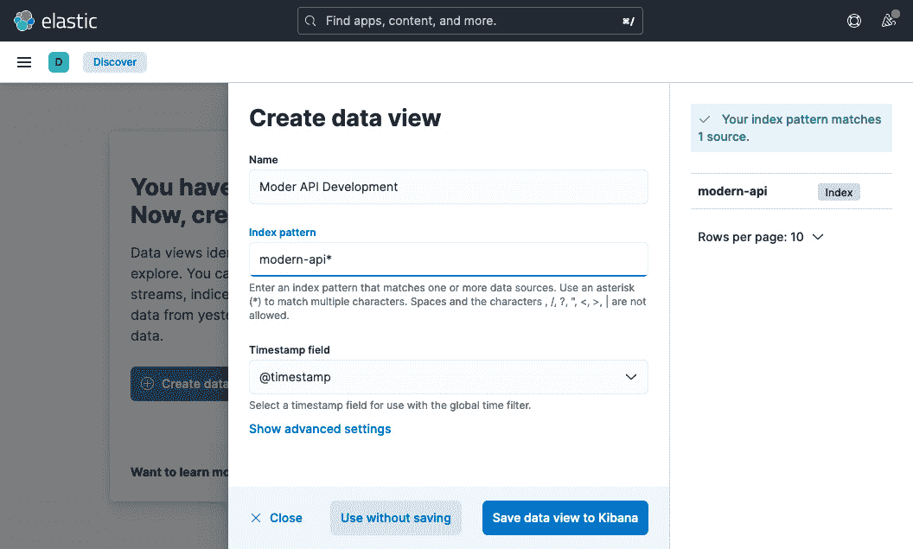

# 第十一章：将日志和跟踪添加到服务中

在本章中，你将学习关于日志和跟踪工具的内容。我们将使用 Spring Micrometer、Brave、**Elasticsearch、Logstash 和 Kibana**（**ELK**）堆栈以及 Zipkin。ELK 和 Zipkin 将用于实现 API 调用的请求/响应的分布式日志和跟踪。**Spring Micrometer** 与 **Actuator** 将用于将跟踪信息注入 API 调用中。你将学习如何发布和分析不同请求的日志以及与响应相关的日志。

这些聚合日志将帮助你排查网络服务问题。你将调用一个服务（例如 gRPC 客户端），然后该服务将调用另一个服务（例如 gRPC 服务器），并通过跟踪标识符将它们链接起来。然后，使用这个跟踪标识符，你可以搜索集中式日志并调试请求流程。在本章中，我们将使用这个示例流程。然而，当服务调用需要更多内部调用时，也可以使用相同的跟踪。你还将使用 **Zipkin** 来确认每个 API 调用的性能。

然后，我们将使用 Spring Micrometer 探索日志和监控工具，包括 ELK 堆栈和 Zipkin。这些工具（ELK 和 Zipkin）随后将用于实现 API 请求和响应的分布式日志和跟踪。Spring Micrometer 将用于将跟踪信息注入 API 调用中。你将学习如何发布和分析不同请求的日志以及与响应相关的日志。

你将在本章中探索以下主题：

+   使用 ELK 堆栈进行日志和跟踪

+   在 gRPC 代码中实现日志和跟踪

+   使用 Zipkin 和 Micrometer 进行分布式跟踪

# 技术要求

为了在本章中开发和执行代码，你需要以下内容：

+   任何 Java 集成开发环境（IDE），例如 NetBeans、IntelliJ 或 Eclipse

+   **Java 开发工具包**（**JDK**）**17**

+   一个互联网连接来克隆代码和下载依赖项以及 Gradle

+   Insomnia/cURL（用于 API 测试）

+   Docker 和 Docker Compose

你可以在[`github.com/PacktPublishing/Modern-API-Development-with-Spring-6-and-Spring-Boot-3/tree/dev/Chapter12`](https://github.com/PacktPublishing/Modern-API-Development-with-Spring-6-and-Spring-Boot-3/tree/dev/Chapter12)找到本章中使用的代码。

那么，让我们开始吧！

# 使用 ELK 堆栈进行日志和跟踪

今天，产品和服务的划分已经变成了多个小部分，作为单独的过程执行或作为独立的服务部署，而不是作为一个单体系统。一个 API 调用可能会触发其他几个内部 API 调用。因此，您需要分布式和集中式日志来追踪跨越多个 Web 服务的请求。这种追踪可以使用跟踪标识符（`traceId`）来完成，这也可以被称为关联标识符（`correlationId`）。这个标识符是一组字符，形成一个唯一的字符串，它被填充并分配给需要多个服务间调用的 API 调用。然后，相同的跟踪标识符被传播到后续的 API 调用以进行跟踪。

在生产系统中，错误和问题随时可能发生。您需要执行调试以确定根本原因。与调试相关的一个关键工具是日志。如果系统设计为这样做，日志还可以提供与系统相关的警告。日志还提供吞吐量、容量和系统健康状况的监控。因此，您需要一个优秀的日志平台和策略，以实现有效的调试。

市场上提供了不同的开源和商业日志工具，包括 Splunk、Graylog 和 ELK 堆栈。ELK 堆栈是其中最受欢迎的，如果您不打算提供基于 ELK 的服务作为 SaaS，您可以使用它。我们将在本章中使用 ELK 堆栈进行日志记录。

让我们在下一小节中了解 ELK 堆栈。

## 理解 ELK 堆栈

ELK 堆栈由三个组件组成 – Elasticsearch、Logstash 和 Kibana。这三个产品都是 Elasticsearch B.V.的一部分([`www.elastic.co/`](https://www.elastic.co/))。ELK 堆栈执行日志的聚合、分析、可视化和监控。ELK 堆栈提供了一个完整的日志平台，允许您分析、可视化和监控所有类型的日志，包括产品和系统日志。

您将使用以下工作流程来发布日志：


图 12.1 – ELK 堆栈中的日志流程

让我们了解这个图：

+   服务/系统日志被推送到 Logstash 的 TCP 端口

+   Logstash 将日志推送到 Elasticsearch 进行索引

+   Kibana 随后使用 Elasticsearch 索引来查询和可视化日志

在一个理想的生产系统中，您应该使用一个额外的层。例如 Redis、Kafka 或 RabbitMQ 这样的代理层应该放在服务日志和 Logstash 之间。这可以防止数据丢失，并能够处理输入负载的突然增加。

ELK 堆栈配置的技巧

ELK 堆栈是完全可定制的，并附带默认配置。然而，如果您正在使用 Elasticsearch 集群（部署了多个 Elasticsearch 实例），最好使用奇数个 Elasticsearch 节点（实例）以避免脑裂问题。

建议为所有字段使用适当的数据类型（日志的输入以 JSON 格式）。这将允许你在查询日志数据时执行逻辑检查和比较。例如，`http_status < 400` 检查只有在 `http_status` 字段类型是数字时才会工作，如果 `http_status` 字段类型是字符串，可能会失败。

如果你已经熟悉 ELK 堆栈，你可以跳过这个介绍，直接进入下一节。在这里，你可以找到 ELK 堆栈中每个工具的简要介绍。

### Elasticsearch

Elasticsearch 是最受欢迎的企业级全文搜索引擎之一。它基于 Apache Lucene，并使用 Java 开发。Elasticsearch 还是一个高性能、功能齐全的文本搜索引擎库。最近在许可条款中的变化使其成为受限制的开源软件，这阻止了你将 Elasticsearch 或 ELK 堆栈作为 SaaS 提供。它是可分发的，并支持多租户。单个 Elasticsearch 服务器可以存储多个索引（每个索引代表一个数据库），单个查询可以搜索多个索引中的数据。它是一个分布式搜索引擎，并支持集群。

它易于扩展，可以提供近实时的搜索，延迟为一秒。Elasticsearch API 非常广泛且非常详尽。Elasticsearch 提供基于 JSON 的无模式存储，并以 JSON 表示数据模型。Elasticsearch API 使用 JSON 文档进行 HTTP 请求和响应。

### Logstash

Logstash 是一个开源的数据收集引擎，具有实时管道功能。它执行三个主要操作——收集数据、过滤信息，并将处理后的信息输出到数据存储，就像 Elasticsearch 所做的那样。由于其数据管道功能，它允许你处理任何事件数据，例如来自各种系统的日志。

Logstash 以代理的形式运行，收集数据、解析数据、过滤数据，并将输出发送到指定的数据存储，如 Elasticsearch，或作为控制台上的简单标准输出。

此外，它还拥有丰富的插件集。

### Kibana

Kibana 是一个开源的 Web 应用程序，用于可视化执行信息分析。它与 Elasticsearch 交互，并提供与它的简单集成。你可以执行搜索、显示和与存储在 Elasticsearch 索引中的信息进行交互。

它是一个基于浏览器的 Web 应用程序，让你能够执行高级数据分析，并以各种图表、表格和地图的形式可视化你的数据。此外，它是一个零配置应用程序。因此，安装后不需要任何编码或额外的基础设施。

接下来，让我们学习如何安装 ELK 堆栈。

# 安装 ELK 堆栈

你可以使用各种方法来安装 ELK 堆栈，例如根据操作系统安装单个组件，下载 Docker 镜像并单独运行它们，或者使用 Docker Compose、Docker Swarm 或 Kubernetes 执行 Docker 镜像。你将在本章中使用 Docker Compose。

在我们创建 ELK 堆栈 Docker Compose 文件之前，让我们先了解 Docker Compose 文件的语法。Docker Compose 文件使用 YAML 定义。该文件包含四个重要的顶级键：

+   `version`：这表示 Docker Compose 文件格式的版本。你可以根据安装的 Docker Engine 使用适当的版本。你可以检查[`docs.docker.com/compose/compose-file/`](https://docs.docker.com/compose/compose-file/)以确定 Docker Compose 文件版本和 Docker Engine 版本之间的映射关系。

+   `services`：这包含一个或多个服务定义。服务定义表示由容器执行的服务，并包含容器名称（`container_name`）、Docker 镜像（`image`）、环境变量（`environment`）、外部和内部端口（`port`）、运行容器时要执行的命令（`command`）、用于与其他服务通信的网络（`networks`）、将主机文件系统映射到运行容器的映射（`volume`），以及一旦依赖服务启动后要执行容器（`depends_on`）。

+   `networks`：这代表需要创建的（顶级）命名网络，用于在定义的服务之间建立通信通道。然后，该网络根据定义服务的`networks`键由服务用于通信。顶级网络键包含驱动器字段，对于单个主机可以是`bridge`，当在 Docker Swarm 中使用时可以是`overlay`。我们将使用`bridge`。

+   `volumes`：顶级`volumes`键用于创建挂载主机路径的命名卷。确保仅在需要时使用它；否则，你可以在服务定义内部使用`volumes`键，这将使卷特定于服务。

现在，让我们在`Chapter12`目录中创建 Docker Compose 文件，名为`docker-compose.yaml`，以定义 ELK 堆栈。然后，你可以将以下代码添加到该文件中：

```java
version: "3.2"services:
  elasticsearch:
    container_name: es-container
    image: docker.elastic.co/elasticsearch/
        elasticsearch:8.7.0
    environment:
      - xpack.security.enabled=false
      - "discovery.type=single-node"
    networks:
      - elk-net
    ports:
      - 19200:9200
```

[`github.com/PacktPublishing/Modern-API-Development-with-Spring-6-and-Spring-Boot-3/tree/dev/Chapter12/docker-compose.yaml`](https://github.com/PacktPublishing/Modern-API-Development-with-Spring-6-and-Spring-Boot-3/tree/dev/Chapter12/docker-compose.yaml)

首先，我们定义了 Docker Compose 文件的版本。然后，我们创建了`services`键部分，其中包含`elasticsearch`服务。该服务包含容器名称、Docker 镜像、环境变量和网络（因为你希望 ELK 组件相互通信）。最后，以`external:internal`格式定义端口。你将使用浏览器中的端口`19200`来访问它。然而，其他服务将使用端口`9200`与 Elasticsearch 通信。

类似地，你可以定义下一个`logstash`服务，如下面的代码块所示：

```java
  logstash:    container_name: ls-container
    image: docker.elastic.co/logstash/logstash:8.7.0
    environment:
      - xpack.security.enabled=false
    command: logstash -e 'input { tcp { port => 5001 codec
     => "json" }} output { elasticsearch { hosts =>
    "elasticsearch:9200" index => "modern-api" }}'
    networks:
      - elk-net
    depends_on:
      - elasticsearch
    ports:
      - 5002:5001
```

Logstash 配置包含两个额外的服务键：

+   首先，一个包含给定配置（使用`-e`）的`logstash`命令的命令键。Logstash 配置通常包含三个重要部分：

    +   `input`：Logstash 输入通道，如`tcp`或`File`。我们将使用 TCP 输入通道。这意味着 gRPC 服务器和客户端服务将以 JSON 格式（使用 JSON 编码的插件）将日志推送到端口`5001`上的`logstash`。

    +   `filter`：`filter`键包含使用不同方式（如`grok`）的各种过滤器表达式。你不想从日志中过滤任何内容，因此应该选择不使用此键。

    +   `output`：在过滤信息后，将输入数据发送到何处。在这里，我们使用 Elasticsearch。Logstash 将接收到的日志信息推送到端口`9200`上的 Elasticsearch，并使用`modern-api` Elasticsearch 索引。此索引随后在 Kibana 上用于查询、分析和可视化日志。

+   第二个键`depends_on`告诉 Docker Compose 在执行`logstash`服务之前启动 Elasticsearch。

接下来，让我们添加最后一个服务`kibana`，如下面的代码块所示：

```java
    kibana:      container_name: kb-container
      image: docker.elastic.co/kibana/kibana:8.7.0
      environment:
        - ELASTICSEARCH_HOSTS=http://es-container:9200
      networks:
        - elk-net
      depends_on:
        - elasticsearch
     ports:
        - 5600:5601
networks:
  elk-net:
    driver: bridge
```

该服务的`kibana`定义与其他定义的服务一致。它使用`ELASTICSEARCH_HOSTS`环境变量连接到 Elasticsearch。

在 Docker Compose 文件的末尾，你定义了`elk-net`网络，该网络使用`bridge`驱动程序。

你已经完成了 ELK 堆栈 Docker Compose 文件的配置。现在，让我们使用以下命令启动 Docker Compose。如果你是第一次运行此命令，Elasticsearch、Logstash 和 Kibana 的本地镜像也将被检索。如果你在以下命令中使用了除`docker-compose.yaml`或`docker-compose.yml`之外的其他文件名，可以使用`-f`标志：

```java
$ docker-compose up –dCreating network "chapter12_elk-net" with driver "bridge"
Creating es-container ... done
Creating ls-container ... done
Creating kb-container ... done
```

这里使用`-d`选项，这将使 Docker Compose 在后台运行。它首先根据依赖关系（`depends_on`键）启动`es-container` Elasticsearch 容器。

注意

Elasticsearch 默认使用 2 GB 的堆大小。在某些系统（如 Mac）中，Docker 也默认使用 2 GB 的内存。

这可能会导致如`error-137`之类的错误。因此，你应该将默认的 Docker 内存增加到至少 8 GB（越多越好），并将交换内存增加到至少 2 GB 以避免此类问题。

请参考 [`docs.docker.com/config/containers/resource_constraints/#memory`](https://docs.docker.com/config/containers/resource_constraints/#memory) 了解 Docker 内存配置。

你可以看到 Docker Compose 首先创建网络，然后创建服务容器并启动它们。一旦所有容器都启动，你可以在浏览器中访问 URL `http://localhost:19200/`（其中包含为 `Elasticsearch` 服务定义的外部端口）来检查 Elasticsearch 实例是否已启动。

一旦你访问了 URL，如果 Elasticsearch 服务已启动，你可能会看到以下类型的 JSON 响应：

```java
{  "name" : "1bfa291e20b2",
  "cluster_name" : "docker-cluster",
  "cluster_uuid" : "Lua_MmozTS-grM0ZeJ5EBA",
  "version" : {
    "number" : "8.7.0",
    "build_flavor" : "default",
    "build_type" : "docker",
    "build_hash" :
        "09520b59b6bc1057340b55750186466ea715e30e",
    "build_date" : "2023-03-27T16:31:09.816451435Z",
    "build_snapshot" : false,
    "lucene_version" : "9.5.0",
    "minimum_wire_compatibility_version" : "7.17.0",
    "minimum_index_compatibility_version" : "7.0.0"
  },
  "tagline" : "You Know, for Search"
}
```

接下来，让我们通过在浏览器中访问 URL `http://localhost:5600`（其中包含为 `kibana` 服务定义的外部端口）来检查 Kibana 仪表板。这应该会加载 Kibana 的主页，如下面的截图所示：


图 12.2 – Kibana 主页

你可能想知道如何查看日志，因为你使用了 `-d` 选项。你可以使用 `docker-compose logs [服务名称]` 命令。如果你不提供服务名称，它将显示所有服务的日志。你可以使用 `--tail` 标志来过滤行数。`--tail="all"` 标志将显示所有行：

```java
// Don't use flag –t as it is a switch that turns on the timestamp$ docker-compose logs --tail="10" elasticsearch
$ docker-compose logs --tail="10" kibana
```

你可以使用以下命令停止 Docker Compose：

```java
$ docker-compose downStopping ls-container ... done
Stopping kb-container ... done
Stopping es-container ... done
Removing ls-container ... done
Removing kb-container ... done
Removing es-container ... done
Removing network chapter12_elk-net
```

输出可能略有不同。然而，它应该停止并删除所有正在运行的容器。该命令根据 `docker-compose.yaml` 文件中提供的依赖关系，基于 `depends_on` 属性停止容器，然后删除它们。最后，它删除网络。

接下来，让我们对代码进行更改，以将应用程序集成到 ELK 堆栈中。

# 在 gRPC 代码中实现记录和跟踪

记录和跟踪是相辅相成的。在应用程序代码中，记录默认已经处理。你使用 Logback 进行记录。日志要么配置为在控制台上显示，要么推送到文件系统。然而，你还需要将日志推送到 ELK 堆栈以进行索引和分析。为此，你将对 Logback 配置文件 `logback-spring.xml` 进行一些更改，以将日志推送到 Logstash。此外，这些日志还应包含跟踪信息。

为了跟踪目的，相关/跟踪标识符应在分布式事务中填充和传播。分布式事务指的是内部调用其他服务以处理请求的主要 API 调用。在 Spring Boot 3 之前，Spring 通过 **Spring Cloud Sleuth** 库提供分布式跟踪支持；现在，跟踪支持由 Spring Micrometer 提供。它生成跟踪 ID 和跨度标识符。跟踪 ID 在分布式事务期间传播到所有参与服务。跨度 ID 也参与分布式事务。然而，跨度标识符的作用域属于其服务（即它填充的那个服务）。

如前所述，您将使用 Zipkin；因此，您将使用 Zipkin 的分布式跟踪仪表库 Brave。

您可以复制并增强来自*第十一章*的代码，即*gRPC API 开发和测试*，该章节位于[`github.com/PacktPublishing/Modern-API-Development-with-Spring-6-and-Spring-Boot-3/tree/dev/Chapter11`](https://github.com/PacktPublishing/Modern-API-Development-with-Spring-6-and-Spring-Boot-3/tree/dev/Chapter11)，以实现日志记录和跟踪，或者参考该章节的代码在[`github.com/PacktPublishing/Modern-API-Development-with-Spring-6-and-Spring-Boot-3/tree/dev/Chapter12`](https://github.com/PacktPublishing/Modern-API-Development-with-Spring-6-and-Spring-Boot-3/tree/dev/Chapter12)中的变更。

首先，您将在以下子节中对 gRPC 服务器代码进行修改。

## 修改 gRPC 服务器代码

要启用跟踪并将日志发布到 ELK 堆栈，您需要按照以下步骤进行以下代码更改：

1.  将以下依赖项添加到 `build.gradle` 文件中：

    ```java
    implementation 'net.logstash.logback:    logstash-logback-encoder:7.3'implementation 'io.micrometer:    micrometer-tracing-bridge-brave'implementation 'org.springframework.boot:    spring-boot-starter-actuator'
    ```

[`github.com/PacktPublishing/Modern-API-Development-with-Spring-6-and-Spring-Boot-3/tree/dev/Chapter12/server/build.gradle`](https://github.com/PacktPublishing/Modern-API-Development-with-Spring-6-and-Spring-Boot-3/tree/dev/Chapter12/server/build.gradle%20)

在这里，您正在添加以下四个依赖项：

+   `spring-logback.xml` 文件。

+   **micrometer-tracing-bridge-brave**：这个依赖项负责管理跟踪和跨度 ID。Micrometer Tracing Bridge Brave 是一个抽象库，用于 Zipkin Brave，它使用 Brave 将收集到的跟踪信息发布到 Zipkin。

+   **spring-boot-starter-actuator**：您在*第九章*的*Web 服务部署*中使用了这个库来提供健康端点。它还提供了度量端点。除此之外，它还执行了度量跟踪的自动配置。

1.  接下来，添加/修改 `spring-logback.xml` 文件，内容如下：

    ```java
    <?xml version="1.0" encoding="UTF-8"?><configuration>  <springProperty scope="context"     name="applicationName" source="spring.application         .name"/>  <springProperty scope="context"     name="logstashDestination"     source="logstash.destination" />  <property name="LOG_PATTERN"    value="%d{yyyy-MM-dd HH:mm:ss.SSS}    %5p [${applicationName},%X{traceId:-},%X{spanId:-}]    ${PID:-} --- [%15.15t] %-40.40logger{39} :       %msg%n"/>  <property name="LOG_FILE" value="${chapter12-grpc-   server.service.logging.file:-chapter12-grpc-server-   logs}"/>  <property name="LOG_DIR" value="${chapter12-grpc-   server.service.logging.path:-chapter12-grpc-server-   logs}"/>  <property name="SERVICE_ENV" value="${service.env:-   dev}"/>  <property name="LOG_BASE_PATH"   value="${LOG_DIR}/${SERVICE_ENV}"/>  <property name="MAX_FILE_SIZE" value="${chapter12.service.   logging.rolling.maxFileSize:-  100MB}"/><!-- other configuration has been removed for brevity -->
    ```

[`github.com/PacktPublishing/Modern-API-Development-with-Spring-6-and-Spring-Boot-3/tree/dev/Chapter12/server/src/main/resources/logback-spring.xml`](https://github.com/PacktPublishing/Modern-API-Development-with-Spring-6-and-Spring-Boot-3/blob/dev/Chapter12/server/src/main/resources/logback-spring.xml)

在这里，您已经定义了属性。其中两个属性的值取自 Spring 配置文件（`application.properties` 或 `application.yaml`）。

现在让我们添加 Logstash 编码器，如下所示代码块：

```java
<appender name="STASH"   class="net.logstash.logback.appender
       .LogstashTcpSocketAppender">
  <destination>${logstashDestination}</destination>
  <encoder
  class="net.logstash.logback.encoder.LogstashEncoder" />
</appender>
<!-- other configuration has been removed for brevity -->
```

在这里，`STASH` 追加器被定义并使用 TCP 套接字将日志推送到 Logstash。它包含一个 `destination` 元素，用于分配 Logstash 的 `<HOST>:<TCP Port>` 值。另一个元素编码器包含完全限定的类名，`LogstashEncoder`。

最后，您将向根元素添加 `STASH` 追加器，如下所示：

```java
<!-- other configuration has been removed for brevity --><root level="INFO">
  <appender-ref ref="STDOUT"/>
  <appender-ref ref="STASH"/>
  <appender-ref ref="FILE"/>
</root>
```

根级别设置为 `INFO`，因为您只想简单地打印信息日志。

Logstash 配置测试

要禁用将日志发送到 Logstash 实例的 LOGSTASH (STASH) 追加器，请执行以下操作：

1. 您可以将 `logback-spring.xml` 复制到 `test/resources` 目录。

2. 将其重命名为 `test/resources/logback-test.xml`。

3. 从 `<ROOT>` 中移除 LOGSTASH (STASH) 追加器和其条目。

1.  接下来，让我们将在此 `logback-spring.xml` 文件中使用的 Spring 属性添加到 `application.properties` 中，如下所示代码块：

    ```java
    spring.application.name=grpc-serverspring.main.web-application-type=nonegrpc.port=8080logstash.destination=localhost:5002management.tracing.sampling.probability=1.0
    ```

[`github.com/PacktPublishing/Modern-API-Development-with-Spring-6-and-Spring-Boot-3/tree/dev/Chapter12/server/src/main/resources/application.properties`](https://github.com/PacktPublishing/Modern-API-Development-with-Spring-6-and-Spring-Boot-3/tree/dev/Chapter12/server/src/main/resources/application.properties)

在这里，Logstash 目标主机设置为 `localhost`。如果您在远程机器上运行，请相应地更改主机。Logstash TCP 端口设置为与 Docker Composer 文件中设置的 Logstash 外部端口相同。

跟踪的默认概率采样仅为实际请求的 10%。因此，我们将 `management.tracing.sampling.probability` 属性设置为 `1.0`。现在，它收集 100% 请求的跟踪信息。因此，每个请求都将被跟踪。

1.  所需的依赖项和配置现已设置。您可以将跟踪服务器拦截器添加到 gRPC 服务器。（注意：如果您使用的是 RESTful Web 服务，则不需要跟踪拦截器，因为 Spring 的自动配置机制会处理这一点。）

首先，让我们在一个配置文件中定义一个新的 bean，如下所示：

```java
@Configurationpublic class Config {
  @Bean
  public ObservationGrpcServerInterceptor
         interceptor(ObservationRegistry registry) {
    return new
           ObservationGrpcServerInterceptor(registry);
  }
}
```

[`github.com/PacktPublishing/Modern-API-Development-with-Spring-6-and-Spring-Boot-3/blob/dev/Chapter12/server/src/main/java/com/packt/modern/api/server/Config.java`](https://github.com/PacktPublishing/Modern-API-Development-with-Spring-6-and-Spring-Boot-3/blob/dev/Chapter12/server/src/main/java/com/packt/modern/api/server/Config.java)

在这里，您正在创建一个 `ObservationGrpcServerInterceptor` bean，这是创建跟踪服务器拦截器所必需的。在 Spring Boot 3 之前，`RpcTracing` bean 由 Spring Sleuth 提供。现在，由于 Spring Boot 3 支持 Spring Micrometer 而不是 Sleuth，因此 `RpcTracing` bean 的自动配置不可用。您将在 gRPC 服务器中添加此 bean 作为拦截器。

1.  让我们修改 gRPC 服务器 Java 文件（`GrpcServer.java`），向 gRPC 服务器添加跟踪服务器拦截器，如下代码块所示：

    ```java
    @Componentpublic class GrpcServer {  // code truncated for brevity  private final ObservationGrpcServerInterceptor         oInterceptor;  public GrpcServer(SourceService sourceService,      ChargeService chargeService,      ExceptionInterceptor      exceptionInterceptor,      ObservationGrpcServerInterceptor oInterceptor) {    this.sourceService = sourceService;    this.chargeService = chargeService;    this.exceptionInterceptor = exceptionInterceptor;    this.oInterceptor = oInterceptor;  }  public void start()throws IOException,      InterruptedException {    server = ServerBuilder.forPort(port)        .addService(sourceService)        .addService(chargeService)        .intercept(exceptionInterceptor)        .intercept(oInterceptor)        .build().start();  // code truncated for brevity
    ```

[`github.com/PacktPublishing/Modern-API-Development-with-Spring-6-and-Spring-Boot-3/tree/dev/Chapter12/server/src/main/java/com/packt/modern/api/server/GrpcServer.java`](https://github.com/PacktPublishing/Modern-API-Development-with-Spring-6-and-Spring-Boot-3/tree/dev/Chapter12/server/src/main/java/com/packt/modern/api/server/GrpcServer.java)

在这里，您可以看到在上一步骤中配置文件中创建的 bean 是通过构造函数注入的。之后，`oInterceptor` bean 已被用于创建 gRPC 服务器拦截器。

要启用将日志发布到 ELK 堆栈和跟踪，所需的更改是对 gRPC 服务器的修改。您可以重新构建 gRPC 服务器并运行其 `JAR` 文件以查看更改效果。以下命令行输出仅供参考：

```java
// Commands from Chapter12/server directory$ ./gradlew clean build
// You may want to up docker-compose before running the server
// to avoid Logstash connect errors.
$ java -jar build/libs/chapter12-server-0.0.1-SNAPSHOT.jar
// Logs truncated for brevity
2023-04-23 21:30:42.120      INFO [grpc-server,,]     49296 --- [           main] com.packt.modern.api.server.GrpcServer   : gRPC server is starting on port: 8080.
```

您可以看到日志遵循 `logback-spring.xml` 中配置的模式。在 `INFO` 之后打印的日志块包含应用程序/服务名称，以及跟踪和跨度 ID。高亮显示的行显示一个 *空白* 的跟踪 ID 和跨度 ID，因为没有进行涉及分布式事务的外部调用。只有在调用分布式事务（服务间通信）时，跟踪和跨度 ID 才会添加到日志中。

同样，您可以在 gRPC 客户端中添加日志和跟踪实现。

## 修改 gRPC 客户端代码

要启用跟踪并将日志发布到 ELK 堆栈，您还需要在 gRPC 客户端进行代码更改，这些更改与 gRPC 服务器代码中实现的更改非常相似。有关更多信息，请参考以下步骤：

1.  将以下依赖项添加到 `build.gradle` 文件中：

    ```java
    implementation 'net.logstash.logback:    logstash-logback-encoder:7.3'implementation 'io.micrometer:micrometer-tracing-bridge-brave'implementation 'org.springframework.boot:spring-boot-starter-actuator'
    ```

[`github.com/PacktPublishing/Modern-API-Development-with-Spring-6-and-Spring-Boot-3/tree/dev/Chapter12/client/build.gradle`](https://github.com/PacktPublishing/Modern-API-Development-with-Spring-6-and-Spring-Boot-3/tree/dev/Chapter12/client/build.gradle)

这些是与您添加到 gRPC 服务器的相同依赖项。

1.  接下来，您可以像添加到 gRPC 服务器代码中一样添加 `logback-spring.xml` 文件以配置日志。请确保在 XML 文件中使用 `chapter12-grpc-client` 替换 `chapter12-grpc-server`。

1.  接下来，让我们将以下 Spring 属性添加到 `application.properties` 中。其中一些属性也在 `logback-spring.xml` 文件中引用：

    ```java
    spring.application.name=grpc-clientserver.port=8081grpc.server.host=localhostgrpc.server.port=8080logstash.destination=localhost:5002management.tracing.sampling.probability=1.0
    ```

[`github.com/PacktPublishing/Modern-API-Development-with-Spring-6-and-Spring-Boot-3/tree/dev/Chapter12/client/src/main/resources/application.properties`](https://github.com/PacktPublishing/Modern-API-Development-with-Spring-6-and-Spring-Boot-3/tree/dev/Chapter12/client/src/main/resources/application.properties)

1.  所需的依赖项和配置现已设置。现在，你可以向 gRPC 客户端添加跟踪。由 Micrometer 库提供的`ObservationGrpcClientInterceptor`为 gRPC 客户端提供了拦截器。

注意

如果你使用的是 RESTful Web 服务，则不需要额外的跟踪更改；Spring 自动配置会处理这一点。

首先，让我们在一个配置文件中定义一个新的 bean，`ObservationGrpcClientInterceptor`，如下所示：

```java
@Configurationpublic class Config {
 @Bean
 public ObservationGrpcClientInterceptor interceptor
      (ObservationRegistry registry) {
   return new ObservationGrpcClientInterceptor
      (registry);
 }
}
```

[`github.com/PacktPublishing/Modern-API-Development-with-Spring-6-and-Spring-Boot-3/tree/dev/Chapter12/client/src/main/java/com/packt/modern/api/Config.java`](https://github.com/PacktPublishing/Modern-API-Development-with-Spring-6-and-Spring-Boot-3/tree/dev/Chapter12/client/src/main/java/com/packt/modern/api/Config.java)

1.  现在，你可以修改 gRPC 客户端 Java 文件，向 gRPC 客户端添加`ObservationGrpcClientInterceptor`拦截器：

    ```java
    @Componentpublic class GrpcClient {  @Autowired  private ObservationGrpcClientInterceptor      observationGrpcClientInterceptor;  // code truncated for brevity  public void start() {   channel = ManagedChannelBuilder.forAddress       (host, port)             .intercept(observationGrpcClientInterceptor)    .usePlaintext().build();   sourceServiceStub = SourceServiceGrpc       .newBlockingStub(channel);   chargeServiceStub = ChargeServiceGrpc       .newBlockingStub(channel);  }  // code truncated for brevity
    ```

[`github.com/PacktPublishing/Modern-API-Development-with-Spring-6-and-Spring-Boot-3/tree/dev/Chapter12/client/src/main/java/com/packt/modern/api/client/GrpcClient.java`](https://github.com/PacktPublishing/Modern-API-Development-with-Spring-6-and-Spring-Boot-3/tree/dev/Chapter12/client/src/main/java/com/packt/modern/api/client/GrpcClient.java)

在这里，你可以看到在前面步骤中配置文件中创建的 bean 已自动装配。稍后，将`observationGrpcClientInterceptor`拦截器添加到客户端。

为了便于将日志发布到 ELK 堆栈和跟踪所做的更改也已应用于 gRPC 客户端。你现在可以重新构建 gRPC 客户端并运行其 JAR 文件以查看更改的效果。以下命令行输出仅供参考：

```java
// Commands from Chapter12/client directory$ ./gradlew clean build
// You may want to up docker-compose before running the server
// to avoid Logstash connect errors.
$ java -jar build/libs/chapter12-client-0.0.1-SNAPSHOT.jar
// log truncated for brevity
2023-04-23 23:02:35.297      INFO [grpc-client,,]     51746 --- [           main] com.packt.modern.api.ClientApp           : Started ClientApp in 3.955 seconds (process running for 4.611)
2023-04-23 23:02:35.674      INFO [grpc-client,,]     51746 --- [           main] com.packt.modern.api.client.GrpcClient   : gRPC client connected to localhost:8080
```

你可以看到日志遵循在`logback-spring.xml`中配置的模式。在`INFO`之后打印的日志块包含应用程序/服务名称、跟踪 ID 和跨度 ID。跟踪和跨度 ID 为空，因为只有在调用分布式事务（服务间通信）时才会将它们添加到日志中。

启用 gRPC 服务器和客户端服务中的日志聚合和分布式跟踪所需的更改现已完成。

接下来，你将测试更改并在 Kibana 中查看日志。

## 测试日志和跟踪更改

在开始测试之前，请确保 ELK 堆栈正在运行。此外，请确保首先启动 gRPC 服务器，然后启动 gRPC 客户端服务。

你可以为你的服务添加适当的日志语句以生成详细日志。

在新的终端窗口中运行以下命令。这将调用 gRPC 客户端服务中的`/charges` REST 端点：

```java
$ curl http://localhost:8081/charges
```

应该返回以下 JSON 输出：

```java
{  "charge": [{
    "id": "aibn4f45m49bojd3u0p16erbi5lnelui",
    "amount": 1000,
    "amountCaptured": 0,
    "amountRefunded": 0,
    "balanceTransactionId": "",
    "calculatedStatementDescriptor": "",
    "receiptEmail": "receipt@email.com",
output truncated for brevity
    "refunded": false,
    "refunds": [],
    "statementDescriptor": "Statement Descriptor",
    "status": "SUCCEEDED",
    "sourceId": "inccsjg6gogsvi4rlprdbvvfq2ft2e6c"
  }]
}
```

之前的`curl`命令应该在 gRPC 客户端生成如下日志：

```java
2023-04-23 23:10:37.882      INFO [grpc-client,64456d940c51e3e2baec07f 7448beee6,baec07f7448beee6]     51746 --- [nio-8081-exec-1] brave.Trac er                             : {"traceId":"64456d940c51e3e2baec07f 7448beee6","parentId":"baec07f7448beee6","id":"0645e686d86968b6","kind":"CLIENT","name":"com.packtpub.v1.ChargeService/RetrieveAll","timestamp":1682271636300866,"duration":1578184,"localEndpoint":{"serviceName":"unknown","ipv4":"192.168.1.2"},"tags":{"rpc.service":"com.packtpub.v1.ChargeService","rpc.method":"RetrieveAll"}}2023-04-23 23:10:37.886      INFO [grpc-client,64456d940c51e3e2baec07f 7448beee6,baec07f7448beee6]     51746 --- [nio-8081-exec-1] c.p.m.api.controller.ChargeController    : Server response received in Json Format: charge {
  id: "iivpc3i9el2dso9s2s2rqf9j3s2pomlm"
  amount: 1000
  created: 1682265641
  currency: "USD"
  customerId: "ab1ab2ab3ab4ab5"
  description: "Charge Description"
  receiptEmail: receipt@email.com
  statementDescriptor: "Statement Descriptor"
  sourceId: "6ufgh93stkjod1ih2vhkmamj9l1m0hvv"
}
```

在这里，高亮显示的块包括了应用名称（`grpc-client`）、跟踪 ID（`64456d940c51e3e2baec07f7448beee6`）和跨度 ID（`baec07f7448beee6`）。

命令还应在 gRPC 服务器生成以下日志：

```java
2023-04-23 23:10:37.821      INFO [grpc-server), trace ID (64456d940c51e3e2baec07f7448beee6), and span ID (182159d509ce0714). The trace ID is the same as what is displayed in the gRPC client logs. The span IDs are different from the gRPC client service because span IDs belong to their respective individual services. This is how the trace/correlational ID helps you trace the call for requests across different services because it will be propagated to all the services it involves.
Tracing this request was simple as the logs contain just a few lines and are scattered across only two services. What if you have a few gigabytes of logs scattered across various services? Then, you can make use of the ELK stack to search the log index using different query criteria. However, we are going to use the trace ID for this purpose.
First, open the Kibana home page in the browser ([`localhost:5600/`](http://localhost:5600/)). Then, click on the hamburger menu in the top-left corner, as shown in the following screenshot. After that, click on the **Discover** option in the menu that appears:


Figure 12.3 – Kibana hamburger menu
This should open the **Discover** page, as shown in the following screenshot. If this your first time opening the page, you must create an index pattern that will filter out the indexes available in Elasticsearch:


Figure 12.4 – Kibana’s Discover page
Next, click on the `modern-api`) given in the Logstash configuration in the ELK stack’s Docker Compose file:


Figure 12.5 – Kibana’s Create data view page
Here, you can also provide a name for the data view and an index pattern. You can keep the default value of `@timestamp` for **Timestamp field**.
Then, click on the **Save data view to Kibana** button. This action will create the data view and may show the following view (if you have called the client’s REST APIs recently; otherwise, it will show no data view):


Figure 12.6 – Kibana’s saved data view page
You can add the filter query to the **Search** textbox and the **Date/Duration** menu at the top right of the **Discover** page.
Query criteria can be input using the **Kibana Query Language** (**KQL**), which allows you to add different comparator and logical operators. For more information, refer to [`www.elastic.co/guide/en/kibana/master/kuery-query.html`](https://www.elastic.co/guide/en/kibana/master/kuery-query.html).


Figure 12.7 – Kibana’s Discover page – filtering
As shown in the preceding figure, we have entered criteria (`traceId: 64457832c37c7ac9f957869d819bc0c6`) (*1*) and kept the **Duration** field as its default (the last 15 minutes) (*2*). The left-hand side also shows you how to select the Elasticsearch index and all the fields available in it (*3*).
Once you press the *Enter* key or click on the refresh button after entering the criteria, the search displays the available logs from all the services. The searched values are highlighted in yellow (*4*).
You can also observe that the searched trace ID shows logs from both server and client services (*5*).
The searched **Discovery** page also shows the graph that shows the number of calls made during a particular period. You can generate more logs and reveal any errors, and then you can use different criteria to filter the results and explore further.
You can also save the searches and perform more operations, such as customizing the dashboard. Please refer to [`www.elastic.co/guide/en/kibana/master/index.html`](https://www.elastic.co/guide/en/kibana/master/index.html) for more information.
The ELK stack is good for log aggregation, filtering, and debugging using the trace ID and other fields. However, it can’t check the performance of API calls – the time taken by the call. This is especially important when you have a microservice-based application.
This is where **Zipkin** (also known as **OpenZipkin**), along with Micrometer, comes in.
Distributed tracing with Zipkin and Micrometer
**Spring Micrometer** is a utility library that collects the metrics generated by the Spring Boot application. It provides vendor-neutral APIs that allow you to export the collected metrics to different systems, such as ELK. It collects different types of metrics. A few of them are the following:

*   Metrics related to the JVM, CPU, and cache
*   Latencies in Spring MVC, WebFlux, and the REST client
*   Metrics related to Datasource and HikariCP
*   Uptime and Tomcat usage
*   Events logged to Logback

Zipkin, along with Micrometer, helps you not only to trace transactions across multiple service invocations but also to capture the response time taken by each service involved in the distributed transaction. Zipkin also shows this information using nice graphs. It helps you to locate the performance bottlenecks and drill down into the specific API call that creates the latency issue. You can find out the total time taken by the main API call as well as its internal API call time.
Services developed with Spring Boot facilitate their integration with Zipkin. You just need to make two code changes – the addition of the `zipkin-reporter-brave` dependency and the addition of the Zipkin endpoint property.
You can make these two changes to both the gRPC server and client, as shown next:

1.  First, add the highlighted dependency to `build.gradle` (both the gRPC server and client projects):

    ```

    implementation 'net.logstash.logback:logstash-logback-encoder:7.3'

    ```java
    management.zipkin.tracing.endpoint=                      http://localhost:9411/api/v2/spansmanagement.tracing.sampling.probability=1.0
    ```

    ```java

The Zipkin `tracing.endpoint` property points to the Zipkin API endpoint.
You are done with the changes required in the code for publishing the tracing information to Zipkin. Rebuild both the server and client services after making these changes.
Now, let’s install and start Zipkin.
There are various ways to install and run Zipkin. Please refer to [`zipkin.io/pages/quickstart`](https://zipkin.io/pages/quickstart) to find out about these options. You can add it in `docker-compose` too. However, for development purposes, we are going to fetch the latest release as a self-contained executable JAR from [`search.maven.org/remote_content?g=io.zipkin&a=zipkin-server&v=LATEST&c=exec`](https://search.maven.org/remote_content?g=io.zipkin&a=zipkin-server&v=LATEST&c=exec) and then start it using the following command (make sure to change the version in the `JAR` file based on the downloaded file):

```

$ java -jar zipkin-server-2.24.0-exec.jar

```java

 The previous command, when executed, will start Zipkin with an in-memory database. For production purposes, it is recommended to use a persistence store, such as Elasticsearch.
It should start with the default port `9411` at `http://127.0.0.1:9411/` if executed on `localhost`.
Once the Zipkin server and the ELK stack are up and running, you can start both the gRPC server and client services and execute the following command:

```

$ curl http://localhost:8081/charges

```java

 This command should print a log like the following log statement in the gRPC client service:

```

2023-04-24 11:35:10.313      INFO [grpc-client,64461c16391707ee95478f957f3ccb1d,95478f957f3ccb1d]     62484 --- [nio-8081-exec-2] c.p.m.api.controller.ChargeController    : 客户端 ID : ab1ab2ab3ab4ab5

```java

 Keep the trace ID (`64461c16391707ee95478f957f3ccb1d` in the previous output) handy as you are going to use it in the Zipkin UI. Open the Zipkin home page by accessing `http://localhost:9411`. It will look as follows:


Figure 12.8 – Zipkin home page
You can observe that Zipkin also allows you to run queries. However, we’ll make use of the trace ID. Paste the copied trace ID in the **Search by trace ID** textbox in the top-right corner (highlighted in green) and then press *Enter*:


Figure 12.9 – Zipkin search result page
In the preceding figure, the Zipkin trace ID shows complete API call information at the top (*1* and *2*) if the trace ID is available. In the left-hand side section, it shows all the corresponding API calls with a hierarchy, which shows the individual call times in a graphical way (*3*). These API call rows are selectable. Selected call details are displayed on the right-hand side (*4*).
The `grpc-server` call:


Figure 12.10 – Annotation details
Time tracking at a granular level for each distributed API call allows you to identify the latency issues and relative time tracking for performance tuning.
Summary
In this chapter, you learned how the trace/correlation ID is important and how it can be set up using Micrometer with Brave. You can use these generated IDs to find the relevant logs and API call durations. You integrated the Spring Boot services with the ELK stack and Zipkin.
You also implemented extra code and configurations, which are required for enabling distributed tracing for gRPC-based services.
You acquired log aggregation and distributed tracing skills using Micrometer, Brave, the ELK stack, and Zipkin.
In the next chapter, you are going to learn about the fundamentals of GraphQL APIs.
Questions

1.  What is the difference between the trace ID and span ID?
2.  Should you use a broker between services that generate the logs and the ELK stack? If yes, why?
3.  How does Zipkin work?

Answers

1.  Trace IDs and span IDs are created when the distributed transaction is initiated. A trace ID is generated for the main API call by the receiving service using Spring Cloud Sleuth. A trace ID is generated only once for each distributed call. Span IDs are generated by all the services participating in the distributed transaction. A trace ID is a correlation ID that will be common across the service for a call that requires a distributed transaction. Each service will have its own span ID for each of the API calls.
2.  Yes, a broker such as Kafka, RabbitMQ, or Redis allows robust persistence of logs and removes the risk of losing log data in unavoidable circumstances. It also performs better and can handle sudden spikes of data.
3.  A tracer such as Micrometer with Brave or Spring Cloud Sleuth (*which performs instrumentation*) does two jobs – records the time and metadata of the call being performed, and propagates the trace IDs to other services participating in the distributed transaction. Then, it pushes the tracing information to Zipkin using a *reporter* once the scan completes. The reporter uses *transport* such as HTTP and Kafka to publish the data in Zipkin.

The *collector* in Zipkin collects the data sent by the transporters from the running services and passes it to the storage layer. The storage persists the data. Persisted data is exposed by the Zipkin APIs. The Zipkin UI calls these APIs to show the information graphically:


Further reading

*   Elasticsearch documentation: [`www.elastic.co/guide/en/elasticsearch/reference/current/index.html`](https://www.elastic.co/guide/en/elasticsearch/reference/current/index.html)
*   Kibana documentation: [`www.elastic.co/guide/en/kibana/master/index.html`](https://www.elastic.co/guide/en/kibana/master/index.html)
*   Kibana Query Language: [`www.elastic.co/guide/en/kibana/master/kuery-query.html`](https://www.elastic.co/guide/en/kibana/master/kuery-query.html)
*   Logstash documentation: [`www.elastic.co/guide/en/logstash/master/index.html`](https://www.elastic.co/guide/en/logstash/master/index.html)
*   *Elasticsearch 8.x Cookbook – Fifth* *Edition*: [`www.packtpub.com/product/elasticsearch-8x-cookbook-fifth-edition/9781801079815`](https://www.packtpub.com/product/elasticsearch-8x-cookbook-fifth-edition/9781801079815)
*   Zipkin documentation: [`zipkin.io/pages/quickstart`](https://zipkin.io/pages/quickstart)

```

# 第四部分 – GraphQL

在这部分，你将学习基于 GraphQL 的 API 开发。完成本节后，你将了解 GraphQL 的深入基础知识，能够区分 REST、响应式和 gRPC API，在 GraphQL 的背景下进行深入理解，并了解何时使用哪种 API 风格。你还将学习如何设计 GraphQL 模式，该模式将用于生成 Java 代码。最后，你将学习如何编写数据检索器和加载器，以解析查询字段以服务 GraphQL API 请求。

这一部分包含以下章节：

+   *第十三章*，*开始使用 GraphQL*

+   *第十四章*，*GraphQL API 开发和测试*
