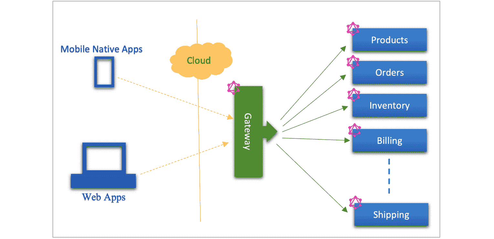
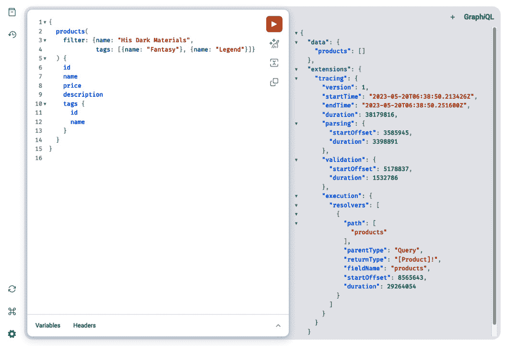
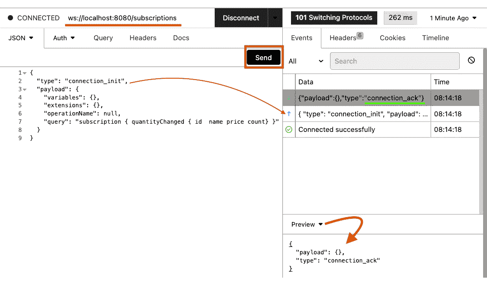
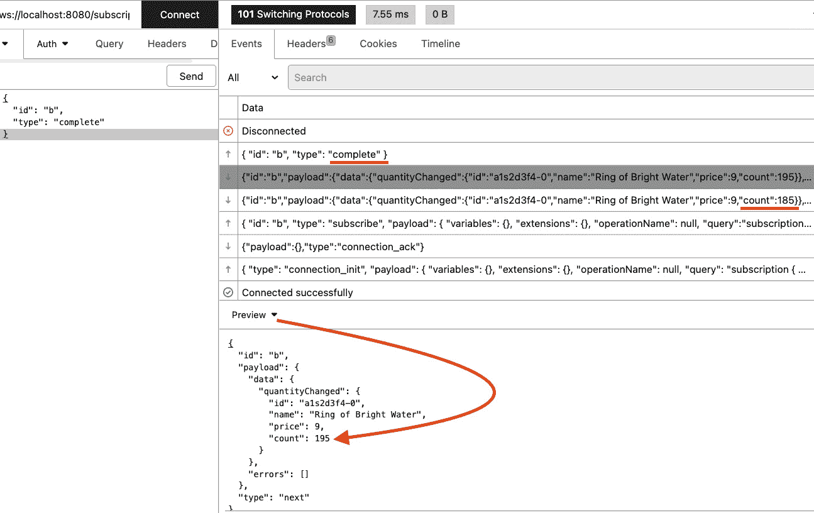

# 第十三章：GraphQL API 开发和测试

在上一章中，我们学习了 GraphQL 的基本概念。您将利用这些知识在本章中开发和测试基于 GraphQL 的 API。您将在本章中为示例应用程序实现基于 GraphQL 的 API。GraphQL 服务器的实现将基于**设计优先**的方法，这与您在*第三章*中定义的 OpenAPI 规范的方式相同，在*第十一章*中设计了模式，*gRPC API 开发和测试*。

完成本章学习后，您将学会如何实际应用在前一章中学到的 GraphQL 概念，以及使用 Java 和 Spring 实现 GraphQL 服务器及其测试。

本章将涵盖以下主要主题：

+   GraphQL 的工作流程和工具

+   实现 GraphQL 服务器

+   记录 API 文档

+   测试自动化

# 技术要求

本章的代码可在以下位置找到

[`github.com/PacktPublishing/Modern-API-Development-with-Spring-6-and-Spring-Boot-3/tree/dev/Chapter14`](https://github.com/PacktPublishing/Modern-API-Development-with-Spring-6-and-Spring-Boot-3/tree/dev/Chapter14)

# GraphQL 的工作流程和工具

根据 GraphQL 中数据图（数据结构）的思维方式，数据通过由对象图组成的 API 进行暴露。这些对象通过关系相互连接。GraphQL 仅暴露一个 API 端点。客户端查询此端点，它使用一个*单一数据图*。在此基础上，数据图可以通过遵循 GraphQL 的**OneGraph 原则**从单一来源或多个来源解析数据。这些来源可以是数据库、遗留系统或使用 REST/gRPC/SOAP 暴露数据的服务。

GraphQL 服务器可以通过以下两种方式实现：

+   **独立 GraphQL 服务**：一个独立的 GraphQL 服务包含一个单一的数据图。它可能是一个单体应用程序，或者基于微服务架构，从单一或多个来源（没有 GraphQL API）获取数据。

+   **联邦 GraphQL 服务**：查询单一数据图以获取综合数据非常容易。然而，企业应用程序是由多个服务构建的；因此，除非构建一个单体系统，否则您无法拥有单一的数据图。如果您不构建单体系统，那么您将拥有多个特定于服务的独立数据图。

这就是您使用联邦 GraphQL 服务的地方。一个联邦 GraphQL 服务包含一个**单个分布式图**，通过网关暴露。客户端调用网关，它是进入系统的入口点。数据图分布在多个服务中，每个服务可以独立维护其自身的开发和发布周期。话虽如此，联邦 GraphQL 服务仍然遵循 OneGraph 原则。因此，客户端查询单个端点以获取图的任何部分。

假设一个示例电子商务应用是使用 GraphQL 联邦服务开发的。它有产品、订单、运输、库存、客户和其他服务，这些服务使用 GraphQL API 公开了特定领域的图数据。

让我们看一下 GraphQL 联邦电子商务服务的高级图示，如下所示：



图 14.1 – 联邦 GraphQL 服务

假设 GraphQL 客户端通过调用`Gateway`端点查询最常订购且库存最少的产品的列表。此查询可能包含来自`Orders`、`Products`和`Inventory`的字段。每个服务只负责解决数据图的相关部分。`Orders`将解决订单相关数据，`Products`将解决产品相关数据，`Inventory`将解决库存相关数据，等等。然后`Gateway`整合图数据并将其发送回客户端。

`graphql-java`库([`www.graphql-java.com`](https://www.graphql-java.com))提供了 GraphQL 规范的 Java 实现。其源代码可在[`github.com/graphql-java/graphql-java`](https://github.com/graphql-java/graphql-java)找到。

Spring 提供了一个基于`graphql-java`的 GraphQL Spring Boot Starter 项目，可在[`github.com/spring-projects/spring-graphql`](https://github.com/spring-projects/spring-graphql)找到。然而，我们将使用基于 Spring 的 Netflix `graphql-java`库。

Netflix 在 2021 年 2 月将其在生产环境中使用的 DGS 框架开源。它正在由社区持续增强和支持。Netflix 在生产环境中使用相同的开源 DGS 框架代码库，这保证了代码的质量和未来的维护。OTT Disney+平台也是使用 Netflix DGS 框架构建的([`webcache.googleusercontent.com/search?q=cache:ec4kC7jBjMQJ:https://help.apps.disneyplus.com/3rd-party-libs.html&cd=14&hl=en&ct=clnk&gl=in&client=firefox-b-d`](https://webcache.googleusercontent.com/search?q=cache:ec4kC7jBjMQJ:https://help.apps.disneyplus.com/3rd-party-libs.html&cd=14&hl=en&ct=clnk&gl=in&client=firefox-b-d))).

它提供了以下功能：

+   Spring Boot 启动器和与 Spring Security 的集成

+   全面的 WebFlux 支持

+   用于从 GraphQL 模式生成代码的 Gradle 插件

+   支持接口和联合类型，并提供自定义标量类型

+   支持 WebSocket 和服务器发送事件使用 GraphQL 订阅

+   错误处理

+   可插拔的仪器和 Micrometer 集成

+   使用 GraphQL 联邦与 GraphQL 联邦轻松集成的 GraphQL 联邦服务

+   带有热加载模式的动态模式

+   操作缓存

+   文件上传

+   GraphQL Java 客户端

+   GraphQL 测试框架

在下一节中，我们将使用 Netflix 的 DGS 框架编写一个 GraphQL 服务器。

# 实现 GraphQL 服务器

在本章中，您将开发一个独立的 GraphQL 服务器。在开发独立 GraphQL 服务器时获得的知识可以用于实现联邦 GraphQL 服务。

在下一小节中，让我们首先创建 Gradle 项目。

## 创建 gRPC 服务器项目

您可以选择克隆 Git 仓库中的 *第十四章* 代码（[`github.com/PacktPublishing/Modern-API-Development-with-Spring-6-and-Spring-Boot-3/tree/dev/Chapter14`](https://github.com/PacktPublishing/Modern-API-Development-with-Spring-6-and-Spring-Boot-3/tree/dev/Chapter14)）或从零开始使用 Spring Initializr 创建服务器和客户端项目，以下为选项：

+   `Gradle -` `Groovy`

+   `Java`

+   `3.0.8`

推荐的版本是 3.0+；如果不可用，您可以在稍后的 `build.gradle` 文件中手动修改。

+   `com.packt.modern.api`

+   `第十四章`

+   `第十四章`

+   《使用 Spring 和 Spring Boot 开发现代 API》第十四章代码 第 2 版

+   `com.packt.modern.api`

+   `JAR`

+   `17`

您可以在 `build.gradle` 文件中将其更改为其他版本，例如 17/20/21，如下面的代码块所示：

```java
// update following build.gradle filesourceCompatibility = JavaVersion.VERSION_17
// or for Java 20
// sourceCompatibility = JavaVersion.VERSION_20
// or for Java 21
// sourceCompatibility = JavaVersion.VERSION_20
```

+   `org.springframework.boot:spring-boot-starter-web`

然后，您可以点击**生成**按钮并下载项目。下载的项目将用于创建 GraphQL 服务器。

接下来，让我们将 GraphQL DGS 依赖项添加到新创建的项目中。

## 添加 GraphQL DGS 依赖项

一旦 Gradle 项目可用，您就可以修改 `build.gradle` 文件以包含 GDS 依赖项和插件，如下面的代码所示：

```java
 plugins {    id 'org.springframework.boot' version '3.0.6'
    id 'io.spring.dependency-management' version '1.1.0'
    id 'java'
    id 'com.netflix.dgs.codegen' version '5.7.1'
 }
 // code truncated for brevity
 def dgsVersion = '6.0.5'
 dependencies {
    implementation platform("com.netflix.graphql.
        dgs:graphql-dgs-platform-dependencies:${
        dgsVersion}")
    implementation 'com.netflix.graphql.dgs:graphql-dgs-
        spring-boot-starter'
    implementation 'com.netflix.graphql.dgs:graphql-dgs-
        extended-scalars'
    implementation 'com.netflix.graphql.dgs:graphql-dgs-
        spring-boot-micrometer'
    runtimeOnly 'com.netflix.graphql.dgs:graphql-dgs-
        subscriptions-websockets-autoconfigure'
    implementation 'org.springframework.boot:spring-boot-
        starter-web'
    implementation 'org.springframework.boot:spring-boot-
        starter-actuator'
    testImplementation 'org.springframework.boot:
        spring-boot-starter-test'
    implementation 'net.datafaker:datafaker:1.9.0'
 }
```

[`github.com/PacktPublishing/Modern-API-Development-with-Spring-6-and-Spring-Boot-3/tree/dev/Chapter14/build.gradle`](https://github.com/PacktPublishing/Modern-API-Development-with-Spring-6-and-Spring-Boot-3/tree/dev/Chapter14/build.gradle)

在这里，首先添加了 DGS Codegen 插件，它将从 GraphQL 模式文件生成代码。接下来，添加以下五个依赖项：

+   `graphql-dgs-platform-dependencies`: 用于 DGS 材料清单 (BOM) 的 DGS 平台依赖项

+   `graphql-dgs-spring-boot-starter`: 用于 DGS Spring 支持的 DGS Spring Boot Starter 库

+   `graphql-dgs-extended-scalars`: 用于自定义标量类型的 DGS 扩展标量库

+   `graphql-dgs-spring-boot-micrometer`: 提供与 Micrometer 集成的 DGS 库，以提供对指标和仪表化的支持，以及 Spring Actuator

+   `graphql-dgs-subscriptions-websockets-autoconfigure`: 提供对 GraphQL WebSocket 支持的自动配置

请注意，这里使用了 `datafaker` 库来生成领域种子数据。

接下来，让我们在相同的 `build.gradle` 文件中配置 DGS Codegen 插件，如下面的代码块所示：

```java
 generateJava {     generateClient = true
     packageName = "com.packt.modern.api.generated"
 }
```

你已经使用 `generateJava` 任务配置了 DGS Codegen 的以下两个属性，该任务使用 Gradle 插件 `com.netflix.graphql.dgs.codegen.GenerateJavaTask` 类：

+   `generateClient`: 这确定你是否想要生成客户端

+   `packageName`: 生成的 Java 类的 Java 包名

DGS Codegen 插件默认从 `src/main/resources/schema` 目录中选取 GraphQL 模式文件。然而，你可以使用 `schemaPaths` 属性来修改它，该属性接受一个数组。如果你想更改默认的模式位置，可以将此属性添加到之前的 `generateTask` 代码中，包括 `packageName` 和 `generateClient`，如下所示：

```java
org.hidetake.swagger. generator Gradle plugin while generating the Java code from OpenAPI specs in *step 4* of the *Converting OAS to Spring code* section in *Chapter 3*, *API Specifications and Implementation*. To add a custom type mapping, you can add the typeMapping property to the plugin task, as shown next:

```

typeMapping = ["GraphQLType": "mypackage.JavaType"]

```java

 This property accepts an array; you can add one or more type mappings here. You can refer to the plugin documentation at [`netflix.github.io/dgs/generating-code-from-schema/`](https://netflix.github.io/dgs/generating-code-from-schema/) for more information.
Let’s add the GraphQL schema next.
Adding the GraphQL schema
Netflix’s DGS supports both the code-first and design-first approaches. However, we are going to use the design-first approach in this chapter as we have done throughout this book. Therefore, first, we’ll design the schema using the GraphQL schema language and then use the generated code to implement the GraphQL APIs.
We are going to keep the domain objects minimal to reduce the complexity of business logic and keep the focus on the GraphQL server implementation. Therefore, you’ll have just two domain objects – `Product` and `Tag`. The GraphQL schema allows the following operation using its endpoint as shown in the following schema definition:

```

type Query {    products(filter: ProductCriteria): [Product]!

product(id: ID!): Product

}

type Mutation {

addTag(productId: ID!, tags: [TagInput!]!): Product

addQuantity(productId: ID!, quantity: Int!): Product

}

type Subscription {

quantityChanged: Product

}

```java

[`github.com/PacktPublishing/Modern-API-Development-with-Spring-6-and-Spring-Boot-3/tree/dev/Chapter14/src/main/resources/schema/schema.graphqls`](https://github.com/PacktPublishing/Modern-API-Development-with-Spring-6-and-Spring-Boot-3/tree/dev/Chapter14/src/main/resources/schema/schema.graphqls)
You need to add the `schema.graphqls` GraphQL schema file at the `src/main/ resources/schema` location. You can have multiple schema files there to create the schema module-wise.
Here, the following root types have been exposed:

*   `Query`: The product and product queries to fetch a product by its ID, and a collection of products matched by the given criteria.
*   `Mutation`: The `addTag` mutation adds a tag to the product that matches the given ID. Another mutation, `addQuantity`, increases the product quantity. The `addQuantity` mutation can also be used as an event that triggers the subscription publication.
*   `Subscription`: The `quantityChanged` subscription publishes the product where the quantity has been updated. The event quantity change is captured through the `addQuantity` mutation.

Let’s add the object types and input types being used in these root types to `schema. graphqls` as shown in the next code block:

```

type Product {     id: 字符串

name: 字符串

description: 字符串

imageUrl: 字符串

price: BigDecimal

count: 整数

tags: [Tag]

}

input ProductCriteria {

tags: [TagInput] = []

name: 字符串 = ""

page: 整数 = 1

size: 整数 = 10

}

input TagInput {

name: 字符串

}

type Tag {

id: 字符串

name: 字符串

}

```java

These are straightforward object and input types. All fields of the `ProductCriteria` input type have been kept optional.
We have also used a `BigDecimal` custom scalar type. Therefore, we need to first declare it in the schema. We can do that by adding `BigDecimal` to the end of the schema file, as shown next:

```

java.math.BigDecimal 在代码生成插件中。让我们将其添加到下一个 build.gradle 文件中，如下所示（检查高亮行）：

```java
generateJava {    generateClient = true
    packageName = "com.packt.modern.api.generated"
    typeMapping = ["BigDecimal": "java.math.BigDecimal"]
}
```

在这些更改之后，你的项目已准备好生成 GraphQL 对象和客户端。你可以从项目根目录运行以下命令来构建项目：

```java
 $ ./gradlew clean build
```

此命令将在 `build/generated` 目录中生成 Java 类。

在你开始实现 GraphQL 根类型之前，让我们在下一小节中讨论自定义标量类型。

添加自定义标量类型

你将使用 `BigDecimal` 来捕获货币值。这是一个自定义标量类型；因此，你需要将此自定义标量添加到代码中，以便 DGS 框架可以将其用于序列化和反序列化。（你还需要将映射添加到 Gradle 代码生成插件中。）

添加自定义标量类型有两种方式——通过实现 `Coercing` 接口和利用 `graphql-dgs-extended-scalars` 库。我们将使用后者，因为它行数更少，并且实际的实现由 Netflix DGS 框架提供。

第一种，最原始的添加标量类型的方法是实现 `graphql.schema.Coercing` 接口，并用 `@DgsScalar` 注解进行标注。在这里，你需要自己编写样板代码。

相反，我们将选择第二种方法，该方法涉及使用 DGS 框架提供的标量类型，该类型已在生产系统上经过良好测试。`graphql.schema.Coercing` 接口由 `graphql-java` 库提供。`DateTimeScalar` 标量类型使用 `Coercing` 实现，如下面的代码所示：

```java
@DgsScalar(name="DateTime")public class DateTimeScalar
               implements Coercing<LocalDateTime, String> {
  @Override
  public String serialize(Object dataFetcherResult)
                throws CoercingSerializeException {
    if (dataFetcherResult instanceof LocalDateTime) {
      return ((LocalDateTime) dataFetcherResult)
            .format(DateTimeFormatter.ISO_DATE_TIME);
    } else {
      throw new CoercingSerializeException
          ("Invalid Dt Tm");
    }
  }
  @Override
  public LocalDateTime parseValue(Object input)
        throws CoercingParseValueException {
    return LocalDateTime.parse(input.toString(),
        DateTimeFormatter.ISO_DATE_TIME);
  }
  @Override
  public LocalDateTime parseLiteral(Object input)
       throws CoercingParseLiteralException {
    if (input instanceof StringValue) {
      return LocalDateTime.parse(((StringValue) input)
          .getValue(), DateTimeFormatter.ISO_DATE_TIME);
    }
    throw new CoercingParseLiteralException
        ("Invalid Dt Tm");
  }
}
```

在这里，你重写了 `Coercing` 接口的三个方法——`serialize()`、`parseValue()` 和 `parseLiteral()`——以实现 `DateTimeScalar` 自定义标量类型的序列化和解析。

然而，你将使用第二种方法——`graphql-dgs-extended-scalars` 库——来注册新的标量类型。这个库已经在 `build.gradle` 文件中添加了。让我们利用 `graphql-dgs-extended-scalars` 库来注册 `BigDecimalScaler` 类型。

创建一个名为 `BigDecimalScaler.java` 的新 Java 文件，并将以下代码添加到其中：

```java
@DgsComponentpublic class BigDecimalScalar {
  @DgsRuntimeWiring
  public RuntimeWiring.Builder addScalar(
      RuntimeWiring.Builder builder) {
    return builder.scalar(GraphQLBigDecimal);
  }
}
```

[`github.com/PacktPublishing/Modern-API-Development-with-Spring-6-and-Spring-Boot-3/blob/dev/Chapter14/src/main/java/com/packt/modern/api/scalar/BigDecimalScalar.java`](https://github.com/PacktPublishing/Modern-API-Development-with-Spring-6-and-Spring-Boot-3/blob/dev/Chapter14/src/main/java/com/packt/modern/api/scalar/BigDecimalScalar.java)

在这里，你正在使用 `DgsRuntimeWiring` 来添加由 `graphql-dgs-extended-scalars` 库提供的自定义 `GraphQLBigDecimal` 标量。`RuntimeWiring` 类包含数据获取器、类型解析器和自定义标量，这些是连接一个功能性的 `GraphQLSchema` 类所必需的。`DgsRuntimeWiring` 注解将方法标记为运行时连接。因此，你可以在 `RuntimeWiring` 类执行之前进行自定义。基本上，你正在将 `GraphQLBigDecimal` 标量类型添加到 `RuntimeWiring.Builder` 以进行运行时连接执行。

`BigDecimalScalar` 类被标记为 `@DgsComponent` 注解。DGS 框架是一个基于注解的 Spring Boot 编程模型。DGS 框架为 Spring Boot 提供了这些类型的注解（如 `@DgsComponent`）。被 `@DgsComponent` 标记的类既是 DGS 组件也是常规的 Spring 组件。

同样，你已经添加了 `DateTimeScalar` 类型。`DateTimeScalar` 标量类型的代码可以在 [`github.com/PacktPublishing/Modern-API-Development-with-Spring-6-and-Spring-Boot-3/tree/dev/Chapter14/src/main/java/com/packt/modern/api/scalar/DateTimeScalar.java`](https://github.com/PacktPublishing/Modern-API-Development-with-Spring-6-and-Spring-Boot-3/tree/dev/Chapter14/src/main/java/com/packt/modern/api/scalar/DateTimeScalar.java) 找到。

所有模式细节及其文档都可以通过 GraphiQL 或类似工具中可用的 GraphQL 文档进行探索。让我们找出如何找到自动生成的文档。

记录 API

您可以使用 GraphiQL 或提供图形界面的 playground 工具来探索 GraphQL 模式和文档。

在 GraphiQL（`http://localhost:8080/graphiql`，可以通过运行本章代码构建的`jar`启动），您可以通过点击页面左上角的书本图标打开文档浏览器。一旦点击，它将显示文档。

然而，如果您正在寻找一个静态页面，那么您可以使用诸如`graphdoc`（[`github.com/2fd/graphdoc`](https://github.com/2fd/graphdoc)）之类的工具来生成 GraphQL API 的静态文档。

接下来，让我们开始实现 GraphQL 根类型。首先，您将实现 GraphQL 查询。

实现 GraphQL 查询

我们在上一节模式中引入的查询都很简单。您传递一个产品 ID 以找到由该 ID 标识的产品——这就是您的产品查询。接下来，您传递可选的产品标准以根据给定标准查找产品；否则，将根据产品标准字段默认值返回产品。

在 REST 中，您在*第三章*的*实现 OAS 代码接口*部分实现了控制器类，*API 规范和实现*。您创建了一个控制器，将调用传递给服务，然后服务调用存储库从数据库中获取数据。您将使用相同的设计。但是，您将使用`ConcurrentHashMap`代替数据库以简化代码。这也可以用于您的自动化测试。

让我们创建一个存储库类，如下一个代码块所示：

```java
public interface Repository {  Product getProduct(String id);
  List<Product> getProducts();
}
```

[`github.com/PacktPublishing/Modern-API-Development-with-Spring-6-and-Spring-Boot-3/tree/dev/Chapter14/src/main/java/com/packt/modern/api/repository/Repository.java`](https://github.com/PacktPublishing/Modern-API-Development-with-Spring-6-and-Spring-Boot-3/tree/dev/Chapter14/src/main/java/com/packt/modern/api/repository/Repository.java)

这些是用于获取产品和产品集合的简单签名。

让我们使用`ConcurrentHashMap`实现新创建的存储库接口，如下一个代码块所示：

```java
@org.springframework.stereotype.Repositorypublic class InMemRepository implements Repository {
  private static final Map<String, Product>
productEntities = new ConcurrentHashMap<>();
  private static final Map<String, Tag> tagEntities =
      new ConcurrentHashMap<>();
  // rest of the code is truncated
```

[`github.com/PacktPublishing/Modern-API-Development-with-Spring-6-and-Spring-Boot-3/tree/dev/Chapter14/src/main/java/com/packt/modern/api/repository/InMemRepository.java`](https://github.com/PacktPublishing/Modern-API-Development-with-Spring-6-and-Spring-Boot-3/tree/dev/Chapter14/src/main/java/com/packt/modern/api/repository/InMemRepository.java)

在这里，您已经创建了两个`ConcurrentHashMap`实例来存储产品和标签。让我们使用构造函数将这些种子数据添加到这些映射中：

```java
public InMemRepository() {  Faker faker = new Faker();
  IntStream.range(0, faker.number()
      .numberBetween(20, 50)).forEach(number -> {
    String tag = faker.book().genre();
    tagEntities.putIfAbsent(tag,
       Tag.newBuilder().id(UUID.randomUUID().toString())
         .name(tag).build());
  });
  IntStream.range(0, faker.number().numberBetween(4, 20))
    .forEach(number -> {
      String id = String.format("a1s2d3f4-%d", number);
      String title = faker.book().title();
      List<Tag> tags = tagEntities.entrySet().stream()
        .filter(t -> t.getKey().startsWith(
          faker.book().genre().substring(0, 1)))
        .map(Entry::getValue).collect(toList());
    if (tags.isEmpty()) {
     tags.add(tagEntities.entrySet().stream()
       .findAny().get().getValue());
    }
    Product product = Product.newBuilder().id(id).
        name(title)
      .description(faker.lorem().sentence())
      .count(faker.number().numberBetween(10, 100))
      .price(BigDecimal.valueOf(faker.number()
         .randomDigitNotZero()))
      .imageUrl(String.format("/images/%s.jpeg",
         title.replace(" ", "")))
      .tags(tags).build();
    productEntities.put(id, product);
  });
  // rest of the code is truncated
```

此代码首先生成标签，然后将其存储在`tagEntities`映射中。代码还在将产品存储在`productEntities`映射之前将标签附加到新产品上。这只是为了开发目的而做的。在生产应用程序中，您应该使用数据库。

现在，`getProduct`和`getProducts`方法很简单，如下一个代码块所示：

```java
@Overridepublic Product getProduct(String id) {
  if (Strings.isBlank(id)) {
    throw new RuntimeException("Invalid Product ID.");
  }
  Product product = productEntities.get(id);
  if (Objects.isNull(product)) {
    throw new RuntimeException("Product not found.");
  }
  return product;
}
@Override
public List<Product> getProducts() {
  return productEntities.entrySet().stream()
    .map(e -> e.getValue()).collect(toList());
}
```

`getProduct`方法执行基本验证并返回产品。`getProducts`方法简单地返回从映射转换的产品集合。

现在，您可以添加服务和其实现。让我们添加下一个代码块中显示的服务接口：

```java
public interface ProductService {  Product getProduct(String id);
  List<Product> getProducts(ProductCriteria criteria);
  Product addQuantity(String productId, int qty);
  Publisher<Product> gerProductPublisher();
}
```

[`github.com/PacktPublishing/Modern-API-Development-with-Spring-6-and-Spring-Boot-3/tree/dev/Chapter14/src/main/java/com/packt/modern/api/services/ProductService.java`](https://github.com/PacktPublishing/Modern-API-Development-with-Spring-6-and-Spring-Boot-3/tree/dev/Chapter14/src/main/java/com/packt/modern/api/services/ProductService.java)

这些服务方法实现只是简单地调用存储库来获取数据。让我们添加下一个代码块中显示的实现：

```java
@Servicepublic class ProductServiceImpl implements ProductService {
  private final Repository repository;
  public ProductServiceImpl(Repository repository) {
    this.repository = repository;
  }
  @Override
  public Product getProduct(String id) {
    return repository.getProduct(id);
  }
  // continue …
```

[`github.com/PacktPublishing/Modern-API-Development-with-Spring-6-and-Spring-Boot-3/tree/dev/Chapter14/src/main/java/com/packt/modern/api/services/ProductServiceImpl.java`](https://github.com/PacktPublishing/Modern-API-Development-with-Spring-6-and-Spring-Boot-3/tree/dev/Chapter14/src/main/java/com/packt/modern/api/services/ProductServiceImpl.java)

在这里，使用构造函数注入将存储库注入。

让我们添加`getProducts()`方法，它根据给定的过滤条件执行过滤，如下一个代码块所示：

```java
@Overridepublic List<Product> getProducts(ProductCriteria criteria) {
  List<Predicate<Product>> predicates = new ArrayList<>(2);
  if (!Objects.isNull(criteria)) {
    if (Strings.isNotBlank(criteria.getName())) {
      Predicate<Product> namePredicate =
        p -> p.getName().contains(criteria.getName());
      predicates.add(namePredicate);
    }
    if (!Objects.isNull(criteria.getTags()) &&
        !criteria.getTags().isEmpty()) {
      List<String> tags = criteria.getTags().stream()
        .map(ti -> ti.getName()).collect(toList());
      Predicate<Product> tagsPredicate =
        p -> p.getTags().stream().filter(
          t -> tags.contains(t.getName())).count() > 0;
      predicates.add(tagsPredicate);
    }
  }
  if (predicates.isEmpty()) {
    return repository.getProducts();
  }
  return repository.getProducts().stream()
    .filter(p -> predicates.stream().allMatch(
      pre -> pre.test(p))).collect(toList());
}
```

此方法首先检查是否提供了条件。如果没有提供条件，则调用存储库并返回所有产品。

如果提供了条件，它将创建`predicates`列表。然后，这些`predicates`被用来过滤匹配的产品并返回给调用函数。

接下来是 GraphQL 查询实现中最关键的部分：编写数据检索器。首先，让我们编写`product`查询的数据检索器。

编写 GraphQL 查询的检索器

您将在本节中编写数据检索器。数据检索器，如名称所示，从持久存储源检索信息，例如数据库或第三方 API/文档存储。您将学习如何编写数据检索器以检索单个字段的数据、单个对象和对象集合。

编写产品的数据检索器

数据获取器是服务 GraphQL 请求的关键 DSG 组件，它获取数据，DSG 内部解析每个字段。您使用特殊的 `@DgsComponent` DGS 注解标记它们。这些是 DGS 框架扫描并用于服务请求的 Spring 组件类型。

让我们在 `datafetchers` 包中创建一个名为 `ProductDatafetcher.java` 的新文件，以表示 DGS 数据获取器组件。它将有一个用于服务 `product` 查询的数据获取器方法。您可以将以下代码添加到其中：

```java
@DgsComponentpublic class ProductDatafetcher {
  private final ProductService productService;
  public ProductDatafetcher(
      ProductService productService) {
    this.productService = productService;
  }
  @DgsData(parentType = DgsConstants.QUERY_TYPE,
           field = QUERY.Product)
  public Product getProduct(@InputArgument("id") String id) {
    if (Strings.isBlank(id)) {
      new RuntimeException("Invalid Product ID.");
    }
    return productService.getProduct(id);
  }
  // continue …
```

[`github.com/PacktPublishing/Modern-API-Development-with-Spring-6-and-Spring-Boot-3/tree/dev/Chapter14/src/main/java/com/packt/modern/api/datafetchers/ProductDatafetcher.java`](https://github.com/PacktPublishing/Modern-API-Development-with-Spring-6-and-Spring-Boot-3/tree/dev/Chapter14/src/main/java/com/packt/modern/api/datafetchers/ProductDatafetcher.java)

在这里，您使用构造函数创建了一个产品服务 bean 注入。此服务 bean 帮助您根据给定的产品 ID 查找产品。

在 `getProduct` 方法中使用了两个其他重要的 DGS 框架注解。让我们了解它们的作用：

+   `@DgsData`：这是一个数据获取器注解，将方法标记为数据获取器。`parentType` 属性表示类型，`field` 属性表示类型（`parentType`）的字段。因此，可以说该方法将获取给定类型的字段。

您已将 `Query` 设置为 `parentType`。`field` 属性被设置为 `product` 查询。因此，此方法作为 GraphQL 查询产品调用的入口点。`@DsgData` 注解属性使用 `DgsConstants` 常量类设置。

`DgsConstants` 由 DGS Gradle 插件生成，它包含模式的所有常量部分。

+   `@InputArgument`：此注解允许您捕获 GraphQL 请求传递的参数。在此，`id` 参数的值被捕获并分配给 `id` 字符串变量。

您可以在 *测试* *自动化* 部分找到与此数据获取器方法相关的测试用例。

同样，您可以编写 `products` 查询的数据获取器方法。让我们在下一个小节中编写它。

编写产品集合的数据获取器

让我们在 `datafetchers` 包中创建一个名为 `ProductsDatafetcher.java` 的新文件，以表示 DGS 数据获取器组件。它将有一个用于服务 `products` 查询的数据获取器方法。您可以将以下代码添加到其中：

```java
@DgsComponentpublic class ProductsDatafetcher {
  private ProductService service;
  public ProductsDatafetcher(ProductService service) {
    this.service = service;
  }
  @DgsData(
    parentType = DgsConstants.QUERY_TYPE,
    field = QUERY.Products
  )
  public List<Product> getProducts(@InputArgument("filter")
      ProductCriteria criteria) {
    return service.getProducts(criteria);
  }
 // continue …
```

[`github.com/PacktPublishing/Modern-API-Development-with-Spring-6-and-Spring-Boot-3/tree/dev/Chapter14/src/main/java/com/packt/modern/api/datafetchers/ProductsDatafetcher.java`](https://github.com/PacktPublishing/Modern-API-Development-with-Spring-6-and-Spring-Boot-3/tree/dev/Chapter14/src/main/java/com/packt/modern/api/datafetchers/ProductsDatafetcher.java)

这个 `getProducts()` 方法看起来与为 `getProduct()` 返回的数据获取方法没有区别，它在倒数第二个代码块中。在这里，`@DsgData` 的 `parentType` 和 `field` 属性表明这个方法将用于获取 `products` 查询的产品集合（注意我们在这里使用的是复数形式）。

您已经完成了 GraphQL 查询的实现。现在您可以测试您的更改了。在运行测试之前，您需要构建应用程序。让我们使用以下命令来构建应用程序：

```java
 $ gradlew clean build
```

一旦构建成功，您可以使用以下命令来运行应用程序：

```java
 $ java –jar build/libs/chapter14-0.0.1-SNAPSHOT.jar
```

如果您没有对端口号进行任何更改，应用程序应该运行在默认端口 `8080`。

现在，您可以在浏览器窗口中打开 GraphiQL，使用以下 URL：`http://localhost:8080/graphiql`（DGS 框架的一部分）。如有必要，请相应地更改主机/端口。

您可以使用以下查询来获取产品集合：

```java
{  products(
    filter: {name: "His Dark Materials",
       tags: [{name: "Fantasy"}, {name: "Legend"}]}
  ) {
    id
    name
    price
    description
    tags {
      id
      name
    }
  }
}
```

一旦运行前面的查询，它将获取与过滤器中给定标准匹配的产品。



图 14.2 – 在 GraphiQL 工具中执行 GraphQL 查询

这将工作得很好。但是，如果您想单独获取标签呢？对象中可能存在关系（例如带有账单信息的订单），这些关系可能来自不同的数据库或服务，或者来自两个不同的表。在这种情况下，您可能想添加一个字段解析器，使用数据获取方法。

让我们在下一小节中添加一个字段解析器，使用数据获取方法。

使用数据获取方法编写字段解析器

到目前为止，您还没有为获取标签单独的数据获取器。您获取产品，它也会为您获取标签，因为我们使用了一个并发映射，它一起存储了两个查询的数据。因此，首先，您需要为给定产品编写一个新的数据获取方法来获取标签。

让我们在 `ProductsDatafetcher` 类中添加 `tags()` 方法来获取标签，如下一个代码块所示：

```java
@DgsData(    parentType = PRODUCT.TYPE_NAME,
    field = PRODUCT.Tags
)
public List<Tags> tags(String productId) {
  return tagService.fetch(productId);
}
```

[`github.com/PacktPublishing/Modern-API-Development-with-Spring-6-and-Spring-Boot-3/tree/dev/Chapter14/src/main/java/com/packt/modern/api/datafetchers/ProductsDatafetcher.java`](https://github.com/PacktPublishing/Modern-API-Development-with-Spring-6-and-Spring-Boot-3/tree/dev/Chapter14/src/main/java/com/packt/modern/api/datafetchers/ProductsDatafetcher.java)

在这里，`tags()` 方法对于 `@DsgData` 属性有一组不同的值。`parentType` 属性没有设置为像早期数据获取方法中那样的根类型，例如设置为 `Query`。相反，它被设置为对象类型 – `Product`。`field` 属性被设置为 `tags`。

这个方法将被调用以获取每个单独产品的标签，因为它是 `Product` 对象的 `tags` 字段的字段解析器。因此，如果你有 20 个产品，这个方法将被调用 20 次以获取 20 个产品的标签。这是一个 *N+1* 问题，我们在 *第十三章* 的 *Solving the N+1 problem* 节中学习了，*GraphQL 入门*。

在 N+1 问题中，为了获取关系数据，会进行额外的数据库调用。因此，给定一个产品集合，它可能需要单独为每个产品查询标签而访问数据库。

你知道你必须使用数据加载器来避免 N+1 问题。数据加载器在执行单个查询之前会缓存所有产品的 ID，然后获取它们对应的标签。

接下来，让我们学习如何实现一个数据加载器来解决此情况中的 N+1 问题。

编写数据加载器以解决 N+1 问题

你将使用 `DataFetchingEnvironment` 类作为数据获取方法中的参数。它由 `graphql-java` 库注入到数据获取方法中，以提供执行上下文。这个执行上下文包含有关解析器的信息，例如对象及其字段。你还可以在特殊用例中使用它们，例如加载数据加载器类。

让我们修改前面代码块中提到的 `ProductsDatafetcher` 类中的 `tags()` 方法，以无 N+1 问题地获取标签，如下一个代码块所示：

```java
 @DgsData(   parentType = PRODUCT.TYPE_NAME,
   field = PRODUCT.Tags
 )
 public CompletableFuture<List<Tags>> tags(
     DgsDataFetchingEnvironment env) {
   DataLoader<String, List<Tags>> tagsDataLoader =
       env.getDataLoader(TagsDataloaderWithContext.class);
   Product product = env.getSource();
   return tagsDataLoader.load(product.getId());
 }
```

[`github.com/PacktPublishing/Modern-API-Development-with-Spring-6-and-Spring-Boot-3/tree/dev/Chapter14/src/main/java/com/packt/modern/api/datafetchers/ProductsDatafetcher.java`](https://github.com/PacktPublishing/Modern-API-Development-with-Spring-6-and-Spring-Boot-3/tree/dev/Chapter14/src/main/java/com/packt/modern/api/datafetchers/ProductsDatafetcher.java)

在这里，修改后的 `tags()` 数据获取方法使用数据加载器执行 `fetch` 方法，并返回包含在 `CompletableFuture` 中的标签集合。即使产品数量超过 *1*，它也只会被调用一次。

什么是 CompletableFuture？

`CompletableFuture` 是一个表示异步计算结果的 Java 并发类，其完成状态是显式标记的。它可以异步地链式执行多个依赖任务，当当前任务的结果可用时，下一个任务将被触发。

你正在使用 `DsgDataFetchingEnvironment` 作为参数。它实现了 `DataFetchingEnvironment` 接口，并提供通过其类和名称加载数据加载器类的方法。在这里，你正在使用数据加载器类来加载数据加载器。

`DsgDataFetchingEnvironment` 的 `getSource()` 方法返回 `@DsgData` 的 `parentType` 属性的值。因此，`getSource()` 返回 `Product`。

此修改后的数据获取方法将单次调用中获取给定产品列表的标签。此方法将获取产品列表的标签，因为数据加载器类实现了`MappedBatchLoader`，它使用批处理执行操作。

数据加载器类使用批处理方式获取给定产品（通过 ID）的标签。这里的魔法在于返回`CompletableFuture`。因此，尽管你只传递了一个产品 ID 作为参数，但数据加载器以批量方式处理它。让我们接下来实现这个数据加载器类（`TagsDataloaderWithContext`），以便更深入地了解它。

你可以通过两种方式创建数据加载器类——带有上下文或不带有上下文。没有上下文的数据加载器实现了`MappedBatchLoader`，它具有以下方法签名：

```java
 CompletionStage<Map<K, V>> load(Set<K> keys);
```

另一方面，具有上下文的数据加载器实现了`MappedBatchLoaderWithContext`接口，该接口具有以下方法签名：

```java
 CompletionStage<Map<K, V>> load(Set<K> keys,                         BatchLoaderEnvironment environment);
```

在数据加载方面，两者是相同的。然而，具有上下文的数据加载器为你提供了额外的信息（通过`BatchLoaderEnvironment`），这些信息可用于各种附加功能，如身份验证、授权或传递数据库详细信息。

在`dataloaders`包中创建一个名为`TagsDataloaderWithContext.java`的新 Java 文件，并包含以下代码：

```java
@DgsDataLoader(name = "tagsWithContext")public class TagsDataloaderWithContext implements
          MappedBatchLoaderWithContext<String, List<Tag>> {
  private final TagService tagService;
  public TagsDataloaderWithContext(TagService tagService) {
    this.tagService = tagService;
  }
  @Override
  public CompletionStage<Map<String, List<Tag>>> load(
    Set<String> keys, BatchLoaderEnvironment environment) {
    return CompletableFuture.supplyAsync(() ->
        tagService.getTags(new ArrayList<>(keys)));
  }
}
```

[`github.com/PacktPublishing/Modern-API-Development-with-Spring-6-and-Spring-Boot-3/tree/dev/Chapter14/src/main/java/com/packt/modern/api/dataloaders/TagsDataloaderWithContext.java`](https://github.com/PacktPublishing/Modern-API-Development-with-Spring-6-and-Spring-Boot-3/tree/dev/Chapter14/src/main/java/com/packt/modern/api/dataloaders/TagsDataloaderWithContext.java)

在这里，它实现了`MappedBatchLoaderWithContext`接口的`load()`方法。它包含`BatchLoaderEnvironment`参数，该参数提供环境上下文，可以包含用户身份验证和授权信息或数据库信息。然而，我们没有使用它，因为我们没有与身份验证、授权或数据库相关的任何附加信息要传递给存储库或底层数据访问层。如果你有，你可以使用`environment`参数。

你也可以在[`github.com/PacktPublishing/Modern-API-Development-with-Spring-6-and-Spring-Boot-3/tree/dev/Chapter14/src/main/java/com/packt/modern/api/dataloaders/TagDataloader.java`](https://github.com/PacktPublishing/Modern-API-Development-with-Spring-6-and-Spring-Boot-3/tree/dev/Chapter14/src/main/java/com/packt/modern/api/dataloaders/TagDataloader.java)中找到没有上下文的数据加载器。其代码与我们所写的具有上下文的数据加载器代码大致相同。唯一的区别是我们没有使用上下文。

你可以看到它使用了标签服务来获取标签。然后，它简单地通过提供从标签服务收到的标签来返回完成阶段。此操作由数据加载器批量执行。

你可以创建一个新的标签服务及其实现，如下所示：

```java
public interface TagService {  Map<String, List<Tag>> getTags(List<String> productIds);
}
```

[`github.com/PacktPublishing/Modern-API-Development-with-Spring-6-and-Spring-Boot-3/tree/dev/Chapter14/src/main/java/com/packt/modern/api/repository/Repository.java`](https://github.com/PacktPublishing/Modern-API-Development-with-Spring-6-and-Spring-Boot-3/tree/dev/Chapter14/src/main/java/com/packt/modern/api/repository/Repository.java)

这是`getTags`方法的签名，它返回产品 ID 与对应标签的映射。

让我们按照以下代码块实现此接口：

```java
@Servicepublic class TagServiceImpl implements TagService {
  private final Repository repository;
  public TagServiceImpl(Repository repository) {
    this.repository = repository;
  }
  @Override
  public Map<String, List<Tag>> getTags(
       List<String> productIds) {
    return repository.getProductTagMappings(productIds);
  }
  @Override
  public Product addTags(
       String productId, List<TagInput> tags) {
    return repository.addTags(productId, tags);
  }
}
```

[`github.com/PacktPublishing/Modern-API-Development-with-Spring-6-and-Spring-Boot-3/tree/dev/Chapter14/src/main/java/com/packt/modern/api/repository/InMemRepository.java`](https://github.com/PacktPublishing/Modern-API-Development-with-Spring-6-and-Spring-Boot-3/tree/dev/Chapter14/src/main/java/com/packt/modern/api/repository/InMemRepository.java)

在这里，实现的方法很简单。它将调用传递给存储库的调用，根据传递的产品 ID 集合获取标签。

你可以将`getProductTagMappings`添加到`src/main/java/com/packt/modern/api/repository/Repository.java`接口中，如下所示：

```java
Map<String, List<Tag>> getProductTagMappings(     List<String> productIds);
```

然后，你可以在`src/main/java/com/packt/modern/api/repository/InMemRepository.java`类中实现此方法，如下所示：

```java
@Overridepublic Map<String, List<Tag>> getProductTagMappings(
     List<String> productIds) {
  return productEntities.entrySet().stream()
    .filter(e -> productIds.contains(e.getKey()))
    .collect(toMap(e -> e.getKey(),
       e -> e.getValue().getTags()));
}
```

在这里，代码首先创建了产品映射集合的流，然后过滤出与通过此方法传入的产品匹配的产品。最后，它将过滤后的产品转换为以`Key`和`Tags`值为键的产品 ID 映射，然后返回`map`。

现在，如果你调用`product` GraphQL 查询，即使产品是通过正确归一化的数据库获取的，它也会批量加载产品标签，而不存在*N+1*问题。

你已经完成了 GraphQL 查询的实现，并且应该能够独立实现查询。

接下来，你将实现 GraphQL 变异操作。

实现 GraphQL 变异操作

根据 GraphQL 模式，你将实现两个变异操作 - `addTag`和`addQuantity`。

`addTag`变异操作接受`productId`和一组标签作为参数，并返回`Product`对象。`addQuantity`变异操作接受`productId`和要添加的数量，并返回`Product`。

让我们将此实现添加到现有的`ProductDatafetcher`类中，如下所示：

```java
// rest of the ProductDatafetcher class code@DgsMutation(field = MUTATION.AddTag)
public Product addTags(
    @InputArgument("productId") String productId,
    @InputArgument(value = "tags", collectionType =
         TagInput.class) List<TagInput> tags) {
  return tagService.addTags(productId, tags);
}
@DgsMutation(field = MUTATION.AddQuantity)
public Product addQuantity(
      @InputArgument("productId") String productId,
      @InputArgument(value = "quantity") int qty) {
  return productService.addQuantity(productId, qty);
}
// rest of the ProductDatafetcher class code
```

[`github.com/PacktPublishing/Modern-API-Development-with-Spring-6-and-Spring-Boot-3/tree/dev/Chapter14/src/main/java/com/packt/modern/api/datafetchers/ProductsDatafetcher.java`](https://github.com/PacktPublishing/Modern-API-Development-with-Spring-6-and-Spring-Boot-3/tree/dev/Chapter14/src/main/java/com/packt/modern/api/datafetchers/ProductsDatafetcher.java)

在这里，这些签名遵循 GraphQL 模式中编写的相应突变（mutations）。您正在使用另一个 DGS 框架`@DgsMutation`注解，这是一种标记在方法上以表示它们为数据获取方法（data fetcher method）的`@DgsData`注解。默认情况下，`@DgsMutation`注解将`Mutation`值设置为`parentType`属性。您只需在此注解中设置`field`属性。两个方法都有其各自的值设置为`@DgsMutation`注解中的`field`属性。

注意，用于标签的`@InputArgument`注解使用另一个`collectionType`属性，该属性用于设置输入类型。当输入类型不是标量（scalar）时，它是必需的。如果不使用它，您将得到一个错误。因此，确保在具有非标量类型输入时始终使用`collectionType`属性。

这些方法使用标签和产品服务来执行请求的操作。到目前为止，您还没有将标签服务添加到`ProductDatafetcher`类中。因此，您需要首先添加`TagService`，如下面的代码块所示：

```java
// rest of the ProductDatafetcher class codeprivate final TagService tagService;
public ProductDatafetcher(ProductService productService,
     TagService tagService) {
  this.productService = productService;
  this.tagService = tagService;
}
// rest of the ProductDatafetcher class code
```

在这里，`TagService`豆（bean）已经通过构造函数注入。

现在，您需要在`TagService`中实现`addTag()`方法，在`ProductService`中实现`addQuantity`方法。这两个接口及其实现都很直接，将调用传递给仓库以执行操作。您可以在 GitHub 代码仓库中找到`TagService`和`ProductService`类的完整源代码（[`github.com/PacktPublishing/Modern-API-Development-with-Spring-6-and-Spring-Boot-3/tree/dev/Chapter14/src/main/java/com/packt/modern/api/services`](https://github.com/PacktPublishing/Modern-API-Development-with-Spring-6-and-Spring-Boot-3/tree/dev/Chapter14/src/main/java/com/packt/modern/api/services)）。

让我们也将这两个方法添加到`Repository`接口中，如下面的代码块所示：

```java
 // rest of the Repository class code Product addTags(String productId, List<TagInput> tags);
 Product addQuantity(String productId, int qty);
 // rest of the Repository class code
```

`src/main/java/com/packt/modern/api/repository/Repository.java`接口中的这些签名也遵循 GraphQL 模式中编写的相应突变。

让我们首先在`src/main/java/com/packt/modern/api/repository/InMemRepository.java`类中实现`addTags()`方法，如下面的代码块所示：

```java
@Overridepublic Product addTags(String productId, List<TagInput> tags) {
  if (Strings.isBlank(productId)) {
    throw new RuntimeException("Invalid Product ID.");
  }
  Product product = productEntities.get(productId);
  if (Objects.isNull(product)) {
    throw new RuntimeException("Product not found.");
  }
  if (tags != null && !tags.isEmpty()) {
    List<String> newTags = tags.stream().map(
         t -> t.getName()).collect(toList());
    List<String> existingTags = product.getTags().stream()
         .map(t -> t.getName())
         .collect(toList());
    newTags.stream().forEach(nt -> {
      if (!existingTags.contains(nt)) {
        product.getTags().add(Tag.newBuilder()
          .id(UUID.randomUUID().toString())
        .name(nt).build());
      }
    });
    productEntities.put(product.getId(), product);
  }
  return product;
}
```

[`github.com/PacktPublishing/Modern-API-Development-with-Spring-6-and-Spring-Boot-3/tree/dev/Chapter14/src/main/java/com/packt/modern/api/repository/InMemRepository.java`](https://github.com/PacktPublishing/Modern-API-Development-with-Spring-6-and-Spring-Boot-3/tree/dev/Chapter14/src/main/java/com/packt/modern/api/repository/InMemRepository.java)

在这里，你首先对`productId`和`tags`参数进行验证。如果一切顺利，那么你将标签添加到产品中，更新并发映射，并返回更新后的产品。

你已经完成了 GraphQL 突变的实现。你现在可以测试你的更改了。在运行测试之前，你需要构建应用程序。让我们使用以下命令来构建应用程序：

```java
 $ gradlew clean build
```

一旦构建成功，你可以运行以下命令来运行应用程序：

```java
 $ java –jar build/libs/chapter14-0.0.1-SNAPSHOT.jar
```

如果你没有对端口号进行任何更改，应用程序应该运行在默认端口`8080`。

现在，你可以打开一个浏览器窗口，使用以下 URL 打开*GraphiQL*：[`localhost:8080/graphiql`](http://localhost:8080/graphiql)（DGS 框架的一部分）。如果需要，相应地更改主机/端口。

你可以使用以下 GraphQL 请求来执行`addTag`突变：

```java
mutation {   addTag(productId: "a1s2d3f4-0",
          tags: [{name: "new Tags..."}]) {
     id
     name
     price
     description
     tags {
       id
       name
     }
   }
 }
```

在这里，你正在给给定的`productId`添加标签；因此，你需要将`productId`和`tags`作为参数传递。你可以使用以下 GraphQL 请求来执行`addQuantity`突变：

```java
mutation {   addQuantity(productId: "a1s2d3f4-0", quantity: 10) {
     id
     name
     description
     price
     count
     tags {
       id
       name
     }
   }
 }
```

在这里，你将`productId`和`quantity`作为参数传递。你已经学会了如何在 GraphQL 服务器中实现 GraphQL 突变。让我们在下一节中实现 GraphQL 订阅。

实现和测试 GraphQL 订阅

订阅是另一个 GraphQL 根类型，当特定事件发生时，它会向订阅者（客户端）发送对象。

假设一个在线商店在产品的库存达到一定水平时对产品提供折扣。你不能手动跟踪每个产品的数量，然后进行计算并触发折扣。为了更快地完成这些事情（或减少人工干预），这就是你可以使用订阅的地方。

通过`addQuantity()`突变对产品库存（数量）的每次更改都应触发事件，并且订阅者应接收到更新后的产品以及数量。然后，订阅者可以放置逻辑并自动化这个过程。

让我们编写一个订阅，它将发送更新后的产品对象给订阅者。你将使用响应式流和 WebSocket 来实现这个功能。

你需要启用 CORS。让我们通过在`application.properties`文件中添加以下属性来启用它：

```java
management.endpoints.web.exposure.include=health,metricsgraphql.servlet.actuator-metrics=true
graphql.servlet.tracing-enabled=false
graphql.servlet.corsEnabled=true
```

[`github.com/PacktPublishing/Modern-API-Development-with-Spring-6-and-Spring-Boot-3/tree/dev/Chapter14/src/main/resources/application.properties`](https://github.com/PacktPublishing/Modern-API-Development-with-Spring-6-and-Spring-Boot-3/tree/dev/Chapter14/src/main/resources/application.properties)

在这里，你还将 GraphQL 的 actuator 指标和跟踪启用，并公开健康和指标 actuator 端点。

在`build.gradle`中，你有`graphql-dgs-subscriptions-websockets-autoconfigure`来自动配置 WebSocket，这对于基于 WebSocket 的 GraphQL 订阅是必需的。

你可以将以下订阅数据获取器添加到`ProductDatafetcher`类中，如下面的代码所示：

```java
// rest of the ProductDatafetcher class code @DgsSubscription(field = SUBSCRIPTION.QuantityChanged)public Publisher<Product> quantityChanged(
    @InputArgument("productId") String productId) {
  return productService.gerProductPublisher();
}
// rest of the ProductDatafetcher class code
```

[`github.com/PacktPublishing/Modern-API-Development-with-Spring-6-and-Spring-Boot-3/tree/dev/Chapter14/src/main/java/com/packt/modern/api/datafetchers/ProductDatafetcher.java`](https://github.com/PacktPublishing/Modern-API-Development-with-Spring-6-and-Spring-Boot-3/tree/dev/Chapter14/src/main/java/com/packt/modern/api/datafetchers/ProductDatafetcher.java)

这里，你正在使用另一个 DGS 框架注解`@DgsSubscription`，它是一种标记在方法上的`@DgsData`注解，表示它是一个数据获取方法。默认情况下，`@DgsSubscription`注解将`Subscription`值设置为`parentType`属性。你只需在此注解中设置`field`属性。通过将`field`设置为`quantityChanged`，你正在指示 DGS 框架在调用`quantityChanged`订阅请求时使用此方法。

`Subscription`方法返回`Publisher`实例，它可以向多个订阅者发送未绑定数量的对象（在这种情况下，`Product`实例）。因此，客户端只需订阅产品发布者。

你需要在`ProductService`接口中添加一个新的方法，并在`ProductServiceImpl`类中实现它。`ProductService`接口及其实现的方法签名很简单。它将调用传递给仓库以执行操作。你可以在书中 GitHub 代码仓库中查看源代码。

实际工作是由仓库执行的。因此，你需要在仓库中进行一些更改，如下面的步骤所示：

1.  首先，将以下方法签名添加到仓库接口中：

    ```java
    Publisher<Product> getProductPublisher();
    ```

    2.  接下来，你必须在`InMemRepository`类中实现`getProductPublisher()`方法。此方法返回产品发布者，如下面的代码所示：

    ```java
    public Publisher<Product> getProductPublisher() {  return productPublisher;}
    ```

    3.  现在，我们需要 Reactive Streams 来完成所有魔法。首先，让我们声明`FluxSink<Product>`和`ConnectableFlux<Product>`（由仓库返回）变量：

    ```java
    private InMemRepository constructor, as shown in the following code:

    ```

    `Flux<Product>`是一个产品流发布者，它将接力棒传递给`productsStream`（`FluxSink`）以发射下一个信号，随后是`onError()`或`onComplete()`事件。这意味着`productsStream`应该在产品数量发生变化时发射信号。当`Flux<Product>`调用`publish()`方法时，它返回一个`connectableFlux`实例，该实例被分配给`productPublisher`（由订阅返回的那个）。

    ```java

    ```

1.  你几乎完成了设置。你只需在产品发生变化时发射信号（产品）。让我们在`addQuantity()`方法返回产品之前添加以下突出显示的行，如下面的代码所示：

    ```java
    product.setCount(product.getCount() + qty);productEntities.put(product.getId(), product);productsStream.next(product);return product;
    ```

你已经完成了`quantityChanged`订阅的实现。你可以接下来进行测试。

在运行测试之前，您需要构建应用程序。让我们使用以下命令来构建应用程序：

```java
 $ gradlew clean build
```

一旦构建成功，您可以使用以下命令来运行应用程序：

```java
 $ java –jar build/libs/chapter14-0.0.1-SNAPSHOT.jar
```

如果您没有更改端口号设置，应用程序应该运行在默认端口 `8080`。

在测试 GraphQL 订阅之前，您需要了解 GraphQL 通过 WebSocket 的订阅协议。

理解 GraphQL 的 WebSocket 子协议

您在本章中实现了 GraphQL 通过 WebSocket 的订阅。在基于 WebSocket 的订阅实现中，网络套接字是 GraphQL 服务器和客户端之间的主要通信通道。

`graphql-dgs-subscriptions-websockets-autoconfigure` 依赖项的当前实现（*版本 6.0.5*）使用了 `graphql-transport-ws` 子协议规范。在这个子协议中，消息使用 JSON 格式表示，并且在网络中，这些 JSON 消息被 *stringified*。服务器和客户端都应该符合这种消息结构。

存在以下类型的消息（以下代码来自 DGS 框架的 Kotlin）：

```java
object MessageType {    const val CONNECTION_INIT = "connection_init"
    const val CONNECTION_ACK = "connection_ack"
    const val PING = "ping"
    const val PONG = "pong"
    const val SUBSCRIBE = "subscribe"
    const val NEXT = "next"
    const val ERROR = "error"
    const val COMPLETE = "complete"
}
```

通过查看消息类型，您可能已经对 GraphQL 通过 WebSocket 的订阅生命周期有了了解。让我们详细理解订阅的生命周期：

1.  `CONNECTION_INIT`）：客户端通过发送此类消息来启动通信。连接初始化消息包含两个字段 – `type` （`'connection_init'`）和 `payload`。`payload` 字段是可选字段。其结构（`ConnectionInitMessage`）表示如下：

    ```java
    {  type: 'connection_init';  payload: Map<String, Object>; // optional}
    ```

    2.  `CONNECTION_ACK`）：服务器在成功初始化连接请求后发送连接确认。这意味着服务器已准备好进行订阅。其结构（`ConnectionAckMessage`）表示如下：

    ```java
    {  type: 'connection_ack';  payload: Map<String, Any>; // optional}
    ```

    3.  `SUBSCRIBE`）：客户端现在可以发送 `subscribe` 请求。如果客户端在没有从服务器获得连接确认的情况下发送 `subscribe` 请求，客户端可能会收到错误 `4401: Unauthorized`。

这个请求包含三个字段 – `id`、`type` 和 `payload`。在这里，每个新的订阅请求都应该包含一个唯一的 `id`；否则，服务器可能会抛出 `4409: Subscriber for <unique-operation-id> already exists`。服务器会跟踪 `id`，直到订阅处于活动状态。一旦订阅完成，客户端可以重新使用 `id`。此消息类型（`SubscribeMessage`）的结构如下：

```java
{  id: '<unique-id>';
  type: 'subscribe';
  payload: {
    operationName: ''; // optional operation name
    query: '';  // Mandatory GraphQL subscription
    query
    variables?: Map<String, Any>; // optional
    variables
    extensions?: Map<String, Any>; // optional
  };
}
```

1.  `NEXT`）：在成功的订阅操作之后，客户端从服务器接收类型为 `NEXT` 的消息，这些消息包含客户端订阅的操作相关的数据。数据是 `payload` 字段的一部分。服务器会持续向客户端发送这些消息类型，直到 GraphQL 订阅事件发生。一旦操作完成，服务器会将完整消息发送给客户端。其消息类型（`NextMessage`）由以下结构表示：

    ```java
    {  id: '<unique-id>'; // one sent with subscribe  type: 'next';  payload: ExecutionResult;}
    ```

    2. `COMPLETE`）：`Complete` 是一种双向消息，可以由服务器和客户端发送：

    +   *客户端到服务器*：当客户端想要停止监听服务器发送的消息时，客户端可以将完整消息发送给服务器。由于这是一个双向调用，当客户端发送完整请求时，客户端应该忽略正在传输中的消息。

    +   *服务器到客户端*：当服务器完成请求的操作时，服务器会将完整消息发送给客户端。当服务器为客户端的订阅请求发送错误消息时，服务器不会发送完整消息。

消息类型（`CompleteMessage`）由以下结构表示：

```java
{  id: '<unique-id>'; // one sent with subscribe
  type: 'complete';
}
```

1.  `ERROR`）：当服务器遇到任何操作执行错误时，服务器会发送错误消息。其类型（`ErrorMessage`）由以下结构表示：

    ```java
    {  id: '<unique-id>';  type: 'error';  payload: GraphQLError[];}
    ```

    2. `PING` 和 `PONG`：这些是双向消息类型，由服务器和客户端发送。如果客户端发送 `ping` 消息，服务器应立即发送 `pong` 消息，反之亦然。这些消息对于检测网络问题和网络延迟很有用。`ping` (`PingMessage`) 和 `pong` (`PongMessage`) 都包含以下结构：

    ```java
    {  type: String; // either 'ping' or 'pong'  payload: Map<String, Object>; // optional}
    ```

理解订阅生命周期将帮助您彻底测试订阅。

您可以使用任何支持 GraphQL 订阅测试的工具。我们将使用 Insomnia WebSocket 请求客户端进行测试 – 这是一种比较原始的方法，以便您理解 GraphQL 订阅的完整生命周期。



图 14.3 – Insomnia 客户端中的 GraphQL 订阅 connection_init 调用

使用 Insomnia WebSocket 测试 GraphQL 订阅

让我们执行以下步骤以手动测试订阅：

1.  首先，通过使用位于左上角顶部的（**+**）下拉菜单，使用 *WebSocket 请求* 添加一个新的请求。

1.  然后在 **URL** 框中添加以下 URL：

    ```java
    ws://localhost:8080/subscriptions
    ```

    3. 然后，在 **Headers** 选项卡中添加以下头部信息：

    ```java
    Connection: UpgradeUpgrade: websocketdnt: 1accept: */*accept-encoding: gzip, deflate, brhost: localhost:8080origin: http://localhost:8080sec-fetch-dest: websocketsec-fetch-mode: websocketsec-fetch-site: same-originSec-WebSocket-Protocol: graphql-transport-wsSec-WebSocket-Version: 13Sec-WebSocket-Key: 3dcYr9va5icM8VcKuCr/KA==Sec-WebSocket-Extensions: permessage-deflate
    ```

在这里，通过头部信息，您将连接升级为 WebSocket；因此，服务器会发送 `101 Switching Protocol` 响应。您还可以看到您正在使用 `graphql-transport-ws` GraphQL 子协议。

1.  然后，在 **JSON** 选项卡中添加以下用于连接初始化的负载（参见 *图 14**.3*）：

    ```java
    {  "type": "connection_init",  "payload": {     "variables": {},  "extensions": {},  "operationName": null,  "query":"subscription { quantityChanged { id name price count} }"}}
    ```

    2.  然后，点击**发送**按钮（不要点击**连接**按钮 – 如果你点击了，那么它需要随后再点击一次**发送**）。

1.  在成功连接后，你将收到服务器发送的以下确认消息。这意味着服务器已准备好服务订阅请求（如图*14.3*所示）：

    ```java
    {  "payload": {},  "type": "connection_ack"}
    ```

    4.  然后，在**JSON**选项卡中使用以下有效载荷：

    ```java
    {  "id": "b",  "type": "subscribe",  "payload": {     "variables": {},  "extensions": {},  "operationName": null,      "operationName": null,"query":"subscription { quantityChanged { id name price count} }"}}
    ```

在这里，你正在向消息添加一个唯一 ID。消息类型设置为`subscribe`。你可以发送一个`subscribe`消息，因为客户端收到了连接确认。`query`字段包含 GraphQL 订阅查询。

1.  然后，再次点击**发送**按钮（不要点击**连接**按钮 – 如果你点击了，那么它需要随后再点击一次**发送**）。

1.  在点击`addQuantity`突变以使用以下有效载荷触发事件的发布后：

    ```java
    mutation {  addQuantity(productId: "a1s2d3f4-0", quantity: 10) {    id    name    price    count  }}
    ```

    3.  在成功调用突变后，你可以在 Insomnia 客户端中检查订阅输出。你将找到一个显示增加数量的传入 JSON 消息，如图*14.4*所示。

1.  你可以重复*步骤 9 和 10*以获取（`NEXT`类型）消息。

1.  一旦完成，你可以发送以下 JSON 有效载荷以完成调用，如图*14.4*所示：

    ```java
    {  "id": "b",  "type": "complete"}
    ```



图 14.4 – 在 Insomnia 客户端中 GraphQL 订阅的下一个和完成调用

这就是你可以实现和测试 GraphQL WebSocket 订阅的方式。你将在本章的“使用自动化测试代码测试 GraphQL 订阅”小节中自动化测试 GraphQL 订阅。

接下来，你应该了解有助于实现跟踪、日志记录和指标收集的仪表。让我们在下一个小节中讨论这个问题。

仪表化 GraphQL API

GraphQL Java 库支持 GraphQL API 的仪表化。这可以用于支持指标、跟踪和日志记录。DGS 框架也使用它。你只需将仪表化类标记为 Spring 的`@Component`注解即可。

仪表化 Bean 可以使用`graphql.execution.instrumentation.Instumentation`接口实现。在这里，你必须编写样板代码，这可能会增加你的单元测试自动化代码。另一种更简单的方法是扩展`SimpleInstrumentation`类，它为你做了简单的实现。然而，你可以覆盖方法以进行自定义实现。

让我们添加记录数据获取器和完成 GraphQL 请求处理的耗时情况的仪表。这个指标可能有助于你微调性能并识别耗时较长的字段。

在添加跟踪之前，让我们在响应中添加自定义标题。

添加自定义标题

让我们在`instrumentation`包中创建`DemoInstrumentation.java`文件，并添加以下代码：

```java
@Componentpublic class DemoInstrumentation
               extends SimpleInstrumentation {
  @NotNull
  @Override
  public CompletableFuture<ExecutionResult>
     instrumentExecutionResult(ExecutionResult exeResult,
               InstrumentationExecutionParameters params,
               InstrumentationState state) {
    HttpHeaders responseHeaders = new HttpHeaders();
    responseHeaders.add("myHeader", "hello");
    return super.instrumentExecutionResult(DgsExecutionResult
        .builder().executionResult(execResult)
        .headers(responseHeaders).build(),
        params,
        state
    );
  }
}
```

[`github.com/PacktPublishing/Modern-API-Development-with-Spring-6-and-Spring-Boot-3/tree/dev/Chapter14/src/main/java/com/packt/modern/api/instrumentation/DemoInstrumentation.java`](https://github.com/PacktPublishing/Modern-API-Development-with-Spring-6-and-Spring-Boot-3/tree/dev/Chapter14/src/main/java/com/packt/modern/api/instrumentation/DemoInstrumentation.java)

这里，这个类扩展了`SimpleInstrumentation`，并通过标记为`@Component`创建为 Spring bean。`SimpleInstrumentation`类允许你仪表化执行结果。在这里，你可以看到你已经在响应中添加了自定义头。让我们测试它。

在添加了之前的代码后，你可以构建并执行项目，然后执行以下突变：

```java
mutation {  addQuantity(productId: "a1s2d3f4-0", quantity: 10) {
    id
    name
    price
    count
  }
}
```

你将在响应头中找到仪表化的`myHeader`头及其值。

现在，你可以通过向你的项目中添加以下 bean 来在你的响应中仪表化跟踪信息：

```java
@Configurationpublic class InstrumentationConfig {
  @Bean
  @ConditionalOnProperty( prefix = "graphql.tracing",
        name = "enabled", matchIfMissing = true)
  public Instrumentation tracingInstrumentation(){
    return new TracingInstrumentation();
  }
}
```

[`github.com/PacktPublishing/Modern-API-Development-with-Spring-6-and-Spring-Boot-3/tree/dev/Chapter14/src/main/java/com/packt/modern/api/instrumentation/InstrumentationConfig.java`](https://github.com/PacktPublishing/Modern-API-Development-with-Spring-6-and-Spring-Boot-3/tree/dev/Chapter14/src/main/java/com/packt/modern/api/instrumentation/InstrumentationConfig.java)

此配置完成了魔法。你必须记住，你需要在`build.gradle`文件中添加`com.netflix.graphql.dgs:graphql-dgs-spring-boot-micrometer`以及 Spring Actuator 依赖项才能使其工作。

之前的代码将 DGS 框架提供的执行结果指标添加到 GraphQL API 响应中。此指标包括跟踪时间和持续时间、验证时间和持续时间、解析器的信息等。

一旦你设置了这种仪器并执行任何查询或突变，结果将包括由之前代码中创建的`Instrumentation` bean（GraphQL Tracing）仪表化的扩展字段，即结果指标。

让我们在 GraphiQL（`http://localhost:8080/graphiql`）中执行以下突变：

```java
mutation {  addQuantity(productId: "a1s2d3f4-0", quantity: 10) {
    id
    name
    price
    count
  }
}
```

之前的突变将提供以下带有仪表化指标的响应：

```java
{  "data": {
    "addQuantity": {
      "id": "a1s2d3f4-0",
      // output truncated for brevity
    }
  },
  "extensions": {
    "tracing": {
      "version": 1,
      "startTime": "2023-05-07T19:04:42.032422Z",
      "endTime": "2023-05-07T19:04:42.170516Z",
      "duration": 138103974,
      "parsing": {
        "startOffset": 11023640,
        "duration": 7465319
      },
      "validation": {
        "startOffset": 31688145,
        "duration": 20146090
      },
      "execution": {
        "resolvers": [
          {
            "path": [
              "addQuantity"
            ],
            "parentType": "Mutation",
            "returnType": "Product",
            "fieldName": "addQuantity",
            "startOffset": 92045595,
            "duration": 24507328
          },
          // output truncated for brevity
        ]
     }
    }
  }
}
```

在这里，你可以看到它不仅返回`data`，还在`extensions`字段中提供了仪表化的指标。请注意，你应该只在开发环境中启用此仪表化，以微调 GraphQL 实现和基准测试，而在生产环境中应禁用。

让我们了解下一小节中关于仪表化指标的相关内容。

与 Micrometer 的集成

你已经在`build.gradle`中将`graphql-dgs-spring-boot-micrometer`作为依赖项之一添加。这个库提供了开箱即用的 GraphQL 指标，如`gql.query`、`gql-resolver`等。

您可以通过在`application.properties`文件中添加以下行来暴露`metrics`端点：

```java
management.endpoints.web.gql.error:

```

http://localhost:8080/actuator/metrics

```java

 This endpoint displays the list of available metrics in your application, including GraphQL metrics.
The following four types of GraphQL metrics are provided by the DGS framework, which may help you to find out the code responsible for poor performance:

*   `gql.query`: This captures the time taken by the GraphQL query or mutation.
*   `gql.resolver`: This captures the time taken by each data fetcher invocation.
*   `gql.error`: A single GraphQL request can have multiple errors. This metric captures the number of errors encountered during the GraphQL request execution. It will only be available when there are errors in execution.
*   `gql.dataLoader`: This captures the time taken by the data loader invocation for the batch of queries.

The available GraphQL metrics from the actuator metrics endpoint output can be accessed using the following endpoint call:

```

http://localhost:8080/actuator/metrics/gql.query

```java

 It may provide output as shown here:

```

{  "name": "gql.query",

"baseUnit": "seconds",

"measurements": [{

"statistic": "COUNT",  "value": 4.0

};

"statistic": "TOTAL_TIME", "value": 1.403888175

}, {

"statistic": "MAX", "value": 0.0

}];

"availableTags": [{

"tag": "gql.query.sig.hash",

"values": ["10e750742768cb7c428699…",

"a750f4b9bb5d40f2d23b01…"]

}, {

"tag": "gql.operation",

"values": ["SUBSCRIPTION", "MUTATION"]

}, {

"tag": "gql.query.complexity", "values": ["10"]

}, {

"tag": "gql.operation.name", "values": ["anonymous"]

}, {

"tag": "outcome", "values": ["success", "failure"]

}]

}

```java

You can see that it provides the total elapsed time, a number of requests count, and the max time taken by the query/mutation. It also provides tags. These tags can be customized if required by implementing the following interfaces – `DgsContextualTagCustomizer` (to customize common tags such as application profile and version or deployment environment), `DgsExecutionTagCustomizer` (to customize the tags related to execution results), and `DgsFieldFetchTagCustomizer` (to customize the tags related to data fetchers).
You have learned how to instrument the GraphQL APIs in this section. Let’s explore automating the testing of GraphQL code in the next section.
Test automation
The DGS framework provides classes and utilities that facilitate the automation of GraphQL API tests.
Create a new file called `ProductDatafetcherTest.java` inside the `datafetchers` package in the `test` directory and add the following code:

```

@SpringBootTest(classes = { DgsAutoConfiguration.class,     ProductDatafetcher.class,BigDecimalScalar.class })

public class ProductDatafetcherTest {

private final InMemRepository repo = new InMemRepository();

private final int TEN = 10;

@Autowired

private DgsQueryExecutor dgsQueryExecutor;

@MockBean

private ProductService productService;

@MockBean

private TagService tagService;

// continue …

```java

[`github.com/PacktPublishing/Modern-API-Development-with-Spring-6-and-Spring-Boot-3/tree/dev/Chapter14/src/test/java/com/packt/modern/api/datafetchers/ProductDatafetcherTest.java`](https://github.com/PacktPublishing/Modern-API-Development-with-Spring-6-and-Spring-Boot-3/tree/dev/Chapter14/src/test/java/com/packt/modern/api/datafetchers/ProductDatafetcherTest.java)
Here, you are using the `@SpringBootTest` annotation to auto-configure a Spring Boot based test. You are limiting the Spring context by providing specific classes such as `DgsAutoConfiguration`, `ProductDatafetcher`, and `BigDecimalScalar`. You should add only those classes here that are required to perform the test.
Then, you are auto-wiring the `DgsQueryExecutor` class, which provides the query execution capability to your test. After that, you add two Spring-injected mock beans for the `Product` and `Tag` services.
You are ready with the configuration and instances you need to run the tests.
Let’s add the setup method that is required before running the tests. You can add the following method for this purpose in `ProductDatafetcherTest.java`:

```

@BeforeEachpublic void beforeEach() {

List<Tag> tags = new ArrayList<>();

tags.add(Tag.newBuilder().id("tag1").name("Tag 1").build());

Product product = Product.newBuilder().id("any")

.name("mock title").description("mock description")

.price(BigDecimal.valueOf(20.20)).count(100)

.tags(tags).build();

given(productService.getProduct

("any")).willReturn(product);

tags.add(Tag.newBuilder().id("tag2")

.name("addTags").build());

product.setTags(tags);

given(tagService.addTags("any",

List.of(TagInput.newBuilder().name("addTags").build())))

.willAnswer(invocation -> product);

}

```java

Here, you are using Mockito to stub the `productService.getProduct()` and `tagService.addTags()` calls.
You are done with the setup. Let’s run our first test, which will fetch the JSON object after running the GraphQL `product` query next.
Testing GraphQL queries
Let’s add the following code to `ProductDatafetcherTest.java` to test the `product` query:

```

@Test@DisplayName("验证查询'product'返回的 JSON")

public void product() {

String name = dgsQueryExecutor.executeAndExtractJsonPath(

"{product(id: \"any\"){ name }}",

"data.product.name");

assertThat(name).contains("mock title");

}

```java

Here, the code is using the `DgsQueryExecutor` instance to execute the `product` query and extract the JSON property. Then, it validates the name extracted from the JSON and compares it with the value set in the `beforeEach()` method.
Next, you’ll test the `product` query again, but this time, to test the exception.
You can add the following code to `ProductDatafetcherTest.java` to test the exception thrown by the `product` query:

```

@Test@DisplayName("验证查询产品时的异常 - 无效 ID")

public void productWithException() {

given(productService.getProduct("any"))

.willThrow(new RuntimeException

("无效的产品 ID。"));

ExecutionResult res = dgsQueryExecutor.execute(

"{ product (id: \"any\") { name }}");

verify(productService, times(1)).getProduct("any");

assertThat(res.getErrors()).isNotEmpty();

assertThat(res.getErrors().get(0).getMessage()).isEqualTo(

"java.lang.RuntimeException:

"无效的产品 ID。");

}

```java

Here, the `productService` method is stubbed to throw the exception. When `DgsQueryExecutor` runs, the Spring-injected mock bean uses the stubbed method to throw the exception that is being asserted here.
Next, let’s query `product` again, this time to explore `GraphQLQueryRequest`, which allows you to form the GraphQL query in a fluent way. The `GraphQLQueryRequest` construction takes two arguments – first, the instance of `GraphVQLQuery`, which can be a query/mutation or subscription, and second, the projection root type of `BaseProjectionNode`, which allows you to select the fields.
Let’s add the following code to `ProductDatafetcherTest.java` to test the `product` query using `GraphQLQueryRequest`:

```

@Test@DisplayName("验证使用 GraphQLQueryRequest 的 JSON")

void productsWithQueryApi() {

GraphQLQueryRequest gqlRequest = new GraphQLQueryRequest(

ProductGraphQLQuery.newRequest().id("any").build(),

new ProductProjectionRoot().id().name());

String name = dgsQueryExecutor.executeAndExtractJsonPath(

gqlRequest.serialize(), "data.product.name");

assertThat(name).contains("mock title");

}

```java

Here, the `ProductGraphQLQuery` class is part of the auto-generated code by the DGS GraphQL Gradle plugin.
One thing we have not yet tested in previous tests is verifying the subfields in the `tags` field of `product`.
Let’s verify it in the next test case. Add the following code in `ProductDatafetcherTest.java` to verify the tags:

```

@Test@DisplayName("验证查询'product'返回的标签")

void productsWithTags() {

GraphQLQueryRequest gqlRequest = new GraphQLQueryRequest(

ProductGraphQLQuery.newRequest().id("任何").build(),

new ProductProjectionRoot().id().name().tags()

.id().name());

Product product = dgsQueryExecutor

.executeAndExtractJsonPathAsObject(gqlRequest.serialize(),

"data.product", new TypeRef<>() {});

断言 product.getId()等于"任何";

断言 product.getName())等于"模拟标题";

断言 product.getTags().的大小等于 2；

断言 product.getTags().get(0).getName())

.isEqualTo("标签 1");

}

```java

Here, you can see that you have to use a third argument (`TypeRef`) in the `executeAndExtractJsonPathAsObject()` method if you want to query the subfields. If you don’t use it, you will get an error.
You are done with GraphQL query testing. Let’s move on to testing the mutations in the next subsection.
Testing GraphQL mutations
Testing a GraphQL mutation is no different from testing GraphQL queries.
Let’s test the `addTag` mutation to `ProductDatafetcherTest.java` as shown in the following code:

```

@Test@DisplayName("验证突变 'addTags'")

void addTagsMutation() {

GraphQLQueryRequest gqlRequest = new GraphQLQueryRequest(

AddTagGraphQLQuery.newRequest().productId("任何")

.tags(List.of(TagInput.newBuilder()

.name("addTags").build())).build(),

new AddTagProjectionRoot().name().count());

ExecutionResult exeResult = dgsQueryExecutor.execute(

gqlRequest.serialize());

断言 exeResult.getErrors()为空；

verify(tagService).addTags("任何", List.of(

TagInput.newBuilder().name("addTags").build()));

}

```java

Here, the `AddTagGraphQLQuery` class is part of the code auto-generated by the DGS GraphQL Gradle plugin. You fire the request and then validate the results based on the existing configuration and setup.
Similarly, you can test the `addQuantity` mutation. Only the arguments and assertions will change; the core logic and classes will remain the same.
You can add the test to `ProductDatafetcherTest.java` as shown in the next code block to test the `addQuantity` mutation:

```

@Test@DisplayName("验证突变 'addQuantity'")

void addQuantityMutation() {

given(productService.addQuantity("a1s2d3f4-1", 十))

.willReturn(repo.addQuantity("a1s2d3f4-1", 十));

GraphQLQueryRequest gqlRequest = new GraphQLQueryRequest(

AddQuantityGraphQLQuery.newRequest()

.productId("a1s2d3f4-1").quantity(十).build(),

new AddQuantityProjectionRoot().name().count());

ExecutionResult exeResult = dgsQueryExecutor

.execute(gqlRequest.serialize());

断言 executionResult.getErrors()为空；

Object obj = executionResult.getData();

断言 obj 不为 null；

Map<String, Object> data = (Map)((Map

)exeResult.getData()).get(MUTATION.AddQuantity);

org.hamcrest.MatcherAssert.assertThat(

(Integer) data.get("count"), 大于(十));

}

```java

You are done with GraphQL mutation testing. Let’s move on to testing subscriptions in the next subsection.
Testing GraphQL subscriptions using automated test code
Testing a subscription needs extra effort and care, as you can see in the following code, which performs the test for the `quantityChanged` subscription. It uses the existing `addQuantity` mutation to trigger the subscription publisher that sends a `product` object on each call. You capture the product of the first call and store the value of the `count` field. Then, use it to perform the assertion as shown in the following code:

```

@Test@DisplayName("验证订阅 'quantityChanged'")

void reviewSubscription() {

given(productService.gerProductPublisher())

.willReturn(repo.getProductPublisher());

ExecutionResult exeResult = dgsQueryExecutor.execute(

"订阅 {quantityChanged

{id name price count}}");

Publisher<ExecutionResult> pub = exeResult.getData();

List<Product> products = new CopyOnWriteArrayList<>();

pub.subscribe(new Subscriber<>() {

@Override

public void onSubscribe(Subscription s) {s.request(2);}

@Override

public void onNext(ExecutionResult result) {

如果 result.getErrors().的大小大于 0 {

System.out.println(result.getErrors());

}

Map<String, Object> data = result.getData();

products.add(

new ObjectMapper().convertValue(data.get(

SUBSCRIPTION.QuantityChanged), Product.class));

}

@Override

public void onError(Throwable t) {}

@Override

public void onComplete() {}

});

addQuantityMutation();

Integer count = products.get(0).getCount();

addQuantityMutation();

断言 products.get(0).getId()

.isEqualTo(products.get(1).getId());

断言 products.get(1).getCount())

.isEqualTo(count + 十);

}

}

```java

Here, the core logic lies in the subscription that is done by calling the `publisher.subscribe()` method (check the highlighted line). You know that the GraphQL `quantityChanged` subscription returns the publisher. This publisher is received from the `data` field of the execution result.
The publisher subscribes to the stream by passing a `Subscriber` object, which is created on the fly. The subscriber’s `onNext()` method is used to receive the product sent by the GraphQL server. These objects are pushed into the list. Then, you use this list to perform the assertion.
Summary
In this chapter, you learned about the different ways of implementing the GraphQL server, including federated GraphQL services. You have also explored the complete standalone GraphQL server implementation, which performs the following operations:

*   Writing the GraphQL schema
*   Implementing the GraphQL query APIs
*   Implementing the GraphQL mutation APIs
*   Implementing the GraphQL subscription APIs
*   Writing the data loaders to solve the N+1 problem
*   Adding custom scalar types
*   Adding the GraphQL API’s instrumentation
*   Writing the GraphQL API’s test automation using Netflix’s DGS framework

You learned about GraphQL API implementation using Spring and Spring Boot skills that will help you implement GraphQL APIs for your work assignments and personal projects.
Questions

1.  Why should you prefer frameworks such as Netflix’s DGS in place of the `graphql-java` library to implement GraphQL APIs?
2.  What are federated GraphQL services?

Answers

1.  You should prefer a framework such as Netflix DGS in place of the `graphql-java` library to implement GraphQL APIs because it bootstraps the development and avoids writing boilerplate code.

Apart from the ease of development, the framework uses `graphql-java` internally; therefore, it keeps itself in sync with the GraphQL specification’s Java implementation. It also supports developing federated GraphQL services.
It also provides plugins, the Java client, and testing utilities that help you to automate the development. The Netflix DGS framework is well tested and has been used by Netflix in production for quite some time.

1.  A federated GraphQL service contains a single distributed graph exposed using a gateway. Clients call the gateway, which is an entry point to the system. A data graph will be distributed among multiple services and each service can maintain its own development and release cycle independently. Having said that, federated GraphQL services still follow the OneGraph principle. Therefore, the client would query a single endpoint for fetching any part of the graph.

Further reading

*   GraphQL Java implementation: [`www.graphql-java.com/`](https://www.graphql-java.com/) and [`github.com/graphql-java/graphql-java`](https://github.com/graphql-java/graphql-java)
*   Netflix DGS documentation: [`netflix.github.io/dgs/getting-started/`](https://netflix.github.io/dgs/getting-started/)
*   *Full-Stack Web Development with GraphQL and* *React*: [`www.packtpub.com/product/full-stack-web-development-with-graphql-and-react-second-edition/9781801077880`](https://www.packtpub.com/product/full-stack-web-development-with-graphql-and-react-second-edition/9781801077880)

```

```java

```
