# 第四章：构建垃圾邮件分类管道

谷歌 Gmail 服务的两大支柱尤为突出。这些是收件箱文件夹，接收良性或期望收到的电子邮件消息，以及垃圾邮件文件夹，接收未经请求的垃圾邮件，或者简单地说是垃圾邮件。

本章的重点是识别垃圾邮件并将其分类。它探讨了以下关于垃圾检测的主题：

+   如何区分垃圾邮件和正常邮件的技术是什么？

+   如果垃圾邮件过滤是一种合适的技巧，它如何被形式化为一个监督学习分类任务？

+   为什么某种算法在垃圾邮件过滤方面比另一种算法更好，以及它在哪些方面更好？

+   有效的垃圾邮件过滤带来的实际好处在哪里最明显？

本章实现了垃圾邮件过滤数据分析管道。

使用 Scala 和**机器学习**（**ML**）实现垃圾邮件分类是本章的整体学习目标。从为您创建的数据集开始，我们将依赖 Spark ML 库的机器学习 API 及其支持库来构建垃圾邮件分类管道。

以下列表是按章节划分的个别学习成果的分解：

+   垃圾邮件分类问题简介

+   项目的定义问题

+   使用各种算法实现垃圾邮件的二分类管道

+   目标是从`DataFrame`开始，然后进行数据分析

# 垃圾邮件分类问题

任何电子邮件服务都应该智能地处理收到的邮件。这可能包括产生两个不同、排序的邮件流，即正常邮件和垃圾邮件。在哨兵级别的邮件处理涉及一个智能的审查过程——一个产生两个不同、排序的邮件流的分类任务——正常邮件和垃圾邮件。Gmail 的复杂垃圾邮件过滤引擎通过分类过程过滤掉垃圾邮件，在比喻意义上实现了“去粗取精”。

垃圾邮件在我们的日常生活中可能是一种有害现象，它与日益紧密相连的世界密切相关。例如，二元分类是到看似无辜的网站（这些网站托管恶意软件）的持续欺骗性链接。读者可以了解为什么垃圾邮件过滤器可以最大限度地减少垃圾邮件可能引起的问题。以下是一些总结：

+   不道德的公司从网络上收集电子邮件地址，并向人们发送大量的垃圾邮件。例如，一个 Gmail 用户，比如`gmailUser@gmail.com`，被诱使点击一个看似无辜的网站，该网站伪装成人们普遍认为是值得信赖的知名网站。一种卑鄙的意图是将用户诱骗在进入一个所谓的流行值得信赖的网站时放弃个人信息。

+   另一封类似于一封由可疑网站运营商发送的垃圾邮件，`frz7yblahblah.viral.sparedays.net`，正在利用人们渴望轻松赚钱的倾向。例如，看起来无害的链接包含了一个欺骗性的链接，指向一些可疑网站，该网站托管恶意软件，例如 rootkit 病毒。rootkit 非常难以删除。它是一种将自己嵌入到操作系统内核的病毒。它可以非常难以追踪和具有潜在的破坏性，以至于远程黑客可以控制您的系统，而您可能还没有意识到，您的网络可能突然停止工作。您将损失数小时的工作时间，如果您是一家公司，您还会损失收入。

以下是一张位于 Gmail 垃圾邮件文件夹中的垃圾邮件截图，表明了钓鱼行为。**钓鱼**是指通过欺骗手段故意恶意获取欺诈性访问个人信息的行为，如下面的截图所示：

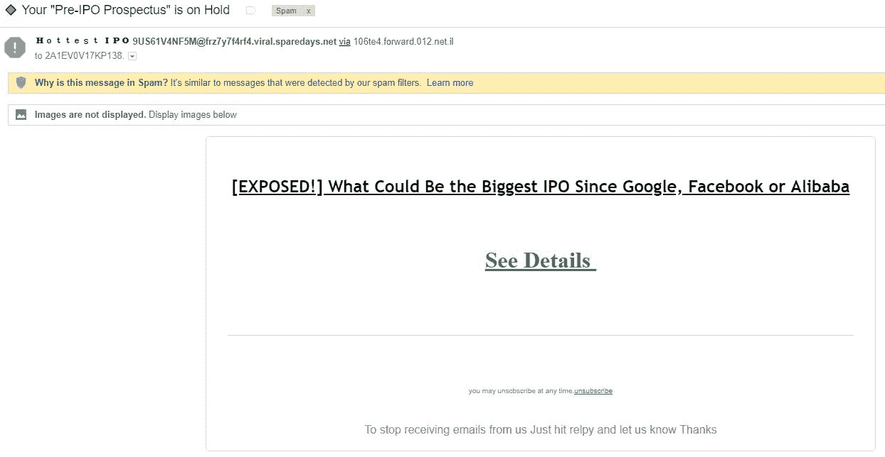

一封垃圾邮件的例子

在下一节中，我们将探讨一些与垃圾邮件分类管道开发相关的话题。

# 相关背景话题

在开发垃圾邮件分类器之前，本节回顾了以下主题：

+   多维数据

+   特征的重要性

+   分类任务

+   与另一个特征相关的单个特征重要性

+   词频-逆文档频率（TF-IDF）

+   哈希技巧

+   停用词去除

+   归一化

在下一节中，我们将更详细地讨论每个主题。

# 多维数据

多维数据是包含多个特征的数据。在前面的章节中，我们已经处理了许多特征。话虽如此，让我们用一个例子来重申这一点，解释特征的含义以及为什么特征如此重要。

# 特征及其重要性

在多维数据集中，每个特征都是影响预测的一个因素：

+   需要对一个新样本进行预测；例如，属于某个个体的新的乳腺癌肿块样本

+   每个影响因素都有一个特定的特征重要性数字或特征权重

在影响最终预测方面，一些特征比其他特征更重要。换句话说，预测是根据新样本属于哪个类别进行的。例如，在第二章“使用 Spark 和 Scala 构建乳腺癌预后管道”中的乳腺癌数据集中，可以使用随机森林算法来估计特征的重要性。在以下列表中，最上面的特征权重最高；列表底部的特征权重最低（按重要性递减顺序）：

1.  **Uniformity_of_Cell_Size**

1.  **Uniformity_of_Cell_Shape**

1.  **Bare_Nuclei**

1.  **Bland_Chromatin**

1.  **Single_Epithelial_Cell_Size**

1.  **Normal_Nucleoli**

1.  **Clump_Thickness**

1.  **Marginal_Adhesion**

1.  **Mitosis**

这意味着第一个特征对最终预测结果的影响最大，第二个特征有第二大影响，依此类推。

我们刚刚讨论了特征、特征重要性、权重等。这个练习为本章奠定了基础。

在下一节中，我们将探讨分类。

# 分类任务

**分类**意味着一个分类动作，一个涉及类别的任务。因此，分类任务通常表示一种监督学习技术，它使我们能够对之前未见过的样本（例如，我们尚不知道其物种的鸢尾花）进行分类。通过分类，我们暗示分类任务是在用训练数据集中的预测标签之一标记未见样本。

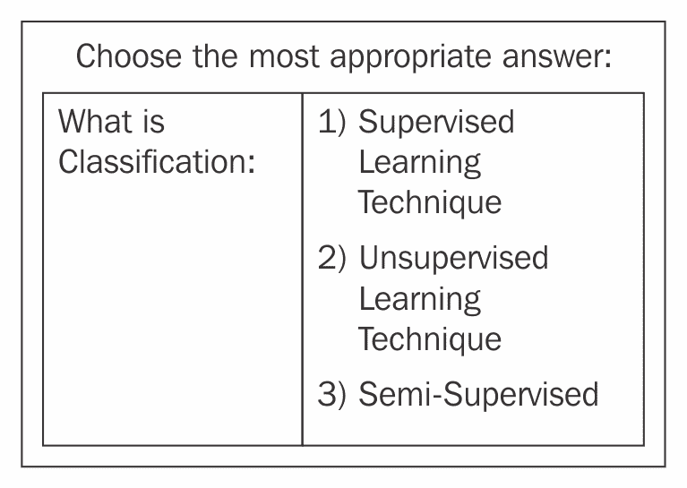

什么是分类？

在我们继续下一个问题之前，我们将把您的注意力引向术语**训练数据集**。在分类结果的主题中，我们将讨论分类结果作为二元或分类的，并解释支持概念如**目标**变量。

# 分类结果

直到第三章“股票价格预测”，我们一直在处理与分类作为监督学习技术相关的机器学习问题。分类任务是以数据为中心的（数据在这里指样本、观察或测量），对于这些数据，你已经知道目标答案。这引出了术语**目标变量**。这是**响应变量**（统计学中的一个术语）的另一个常用名称。在机器学习背景下，目标变量通常是输出或结果。例如，它可能是一个只有两个分类结果——`0`或`1`的二进制结果变量。有了这一点，我们知道目标答案已知或预先确定的数据被称为**标记数据**。

本章开发的分类任务完全是关于监督学习，其中算法通过我们从标记样本中学习来自我教学。前一章的一个显著例子是乳腺癌数据集，它也是一个监督学习分类任务。在前一章中，我们将乳腺癌样本分为两类——良性肿瘤和恶性肿瘤。这些都是两个分类结果，是我们可以用作标记或标记所谓的训练数据的值。另一方面，未标记数据是等待诊断的新乳腺癌样本数据。更有意义的是，一个可能包含垃圾邮件和正常邮件的新到达语料库包含未标记数据。基于训练集中的标记样本，你可以尝试对未标记样本进行分类。

# 两种可能的分类结果

垃圾邮件过滤是一个二元分类任务，一个生成只包含两种可能分类结果的预测值的机器学习任务。在本章中，我们将着手构建一个垃圾邮件分类器。垃圾邮件分类集中的标签属于一个有限集合，包括两种类型电子邮件的文本，即垃圾邮件和正常邮件。因此，二元分类任务变成了从先前未见数据中预测（输出）标签的问题。因此，判断一封邮件是否为垃圾邮件成为一个二元分类问题。按照惯例，我们将正常邮件的互斥状态赋值为`1`，而将另一种状态垃圾邮件赋值为`0`。在下一节中，我们将对当前的垃圾邮件分类问题进行公式化。这将给我们一个项目的概述。

# 项目概述——问题公式化

在本章中，我们设定的目标是构建一个垃圾邮件分类器，它能够区分电子邮件中的垃圾邮件术语，这些术语与常规或预期的电子邮件内容混合在一起。重要的是要知道，垃圾邮件是指发送给多个收件人的具有相同内容的电子邮件，与常规邮件相反。我们开始使用两个电子邮件数据集，一个代表正常邮件，另一个代表垃圾邮件。经过预处理阶段后，我们在训练集上拟合模型，比如说整个数据集的 70%。

从这个意义上说，这个应用程序是一个典型的基于文本的垃圾邮件过滤应用程序。然后我们使用算法来帮助机器学习过程检测在垃圾邮件中最可能出现的单词、短语和术语。接下来，我们将从高层次上概述与垃圾邮件过滤相关的机器学习工作流程。

机器学习工作流程如下：

+   我们将开发一个使用数据框的管道。

+   一个数据框包含一个`predictions`列和另一个包含预处理文本的列

+   分类过程涉及转换操作——一个`DataFrame`被转换成另一个

+   我们的管道运行一系列阶段，包括 TF-IDF、哈希技巧、停用词去除和朴素贝叶斯算法

从本质上讲，垃圾邮件过滤或分类问题是一个监督学习任务，我们向管道提供标记数据。在这个任务中，自然语言处理步骤包括将标记特征数据转换为特征向量集合。

到目前为止，我们可以列出构建垃圾邮件分类器所需的步骤：

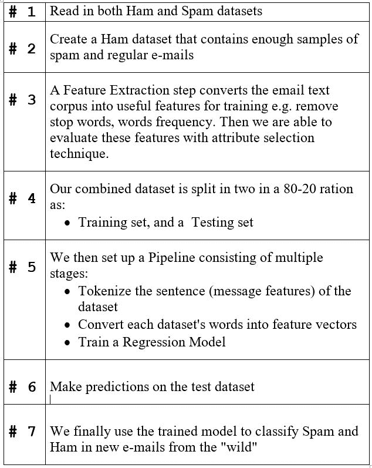

构建垃圾邮件分类器所需的步骤

上列步骤描述的步骤是有用的，并帮助我们制定垃圾邮件分类器的概要。

下面的图表示了垃圾邮件分类问题的公式化：

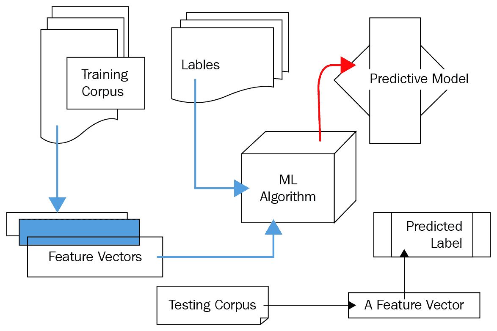

垃圾邮件分类器概要

这里是以下主题的复习：

+   停用词

+   标点符号

+   正则表达式

我们希望在垃圾邮件和正常邮件数据集中消除两类文本。具体如下：

+   标点符号可以分为三类：

    +   终止点或标记

    +   破折号和连字符

    +   暂停点或标记

+   停用词。

以下是一个代表性标点符号列表：

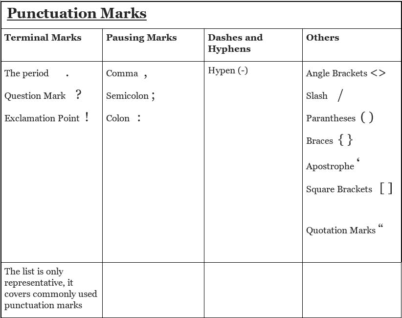

标点符号

我们在文本语料库中覆盖了想要从我们的垃圾邮件和火腿数据集中移除的常见标点符号列表。

我们还需要移除停用词——即常见的词。我们的垃圾邮件分类器将在初步预处理步骤中移除这些词。

下面是一个停用词的代表性列表：

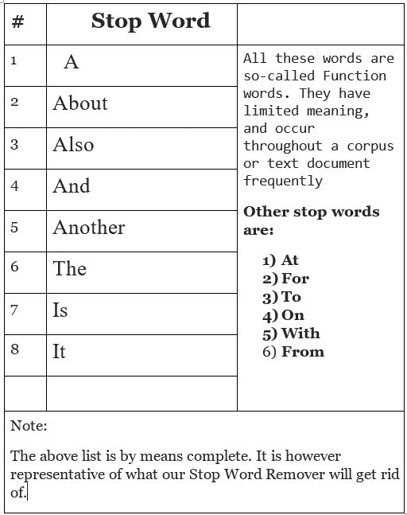

停用词的代表性列表

以下是一个帮助删除标点符号的代表性正则表达式列表。垃圾邮件语料库可能令人望而生畏。正则表达式可以变得非常复杂，以便应对垃圾邮件：

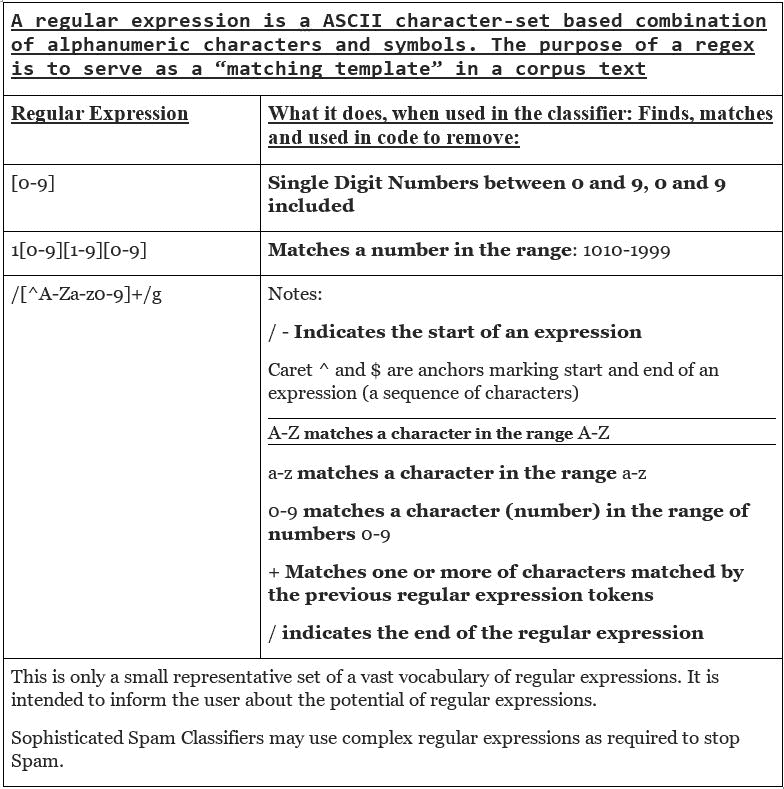

一些相关的正则表达式

在*入门*部分，我们将开始实施项目。

# 入门

为了开始，请从`ModernScalaProjects_Code`文件夹下载数据集，并将其放入您项目的根目录。

# 设置先决软件

您可以使用之前章节中现有的软件设置。Apache Log4j 2 Scala API 是一个值得注意的例外。这是一个 Log4j 2 的 Scala 包装器，它是 Log4j 1.x 版本（Spark 提供的版本）的`Logger`实现的一个升级版。

简单地通过在`build.sbt`文件中添加适当的条目，用 Log4j 2 Scala 覆盖 Spark 中现有的 Log4j（版本 1.6）。

以下表格列出了两种先决软件的选择：

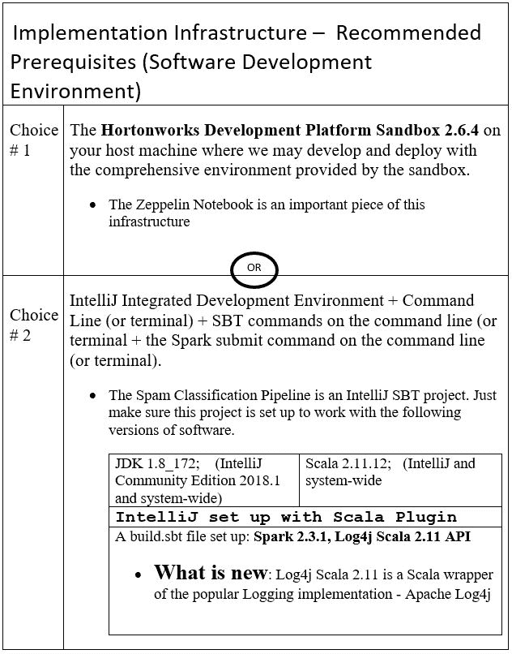

实施基础设施

从`ModernScalaProjects_Code`文件夹下载数据集，并将其放入您项目的根目录。

# 垃圾邮件分类管道

本章最重要的开发目标是使用以下算法执行垃圾邮件分类任务：

+   停用词移除器

+   朴素贝叶斯

+   逆文档频率

+   哈希技巧转换器

+   规范化器

我们垃圾邮件分类任务的实用目标是这样的：给定一个新的传入文档，比如，来自收件箱或垃圾邮件的随机电子邮件集合，分类器必须能够识别语料库中的垃圾邮件。毕竟，这是有效分类的基础。开发这个分类器的现实世界好处在于给读者提供开发他们自己的垃圾邮件过滤器体验。在学习如何组装分类器之后，我们将开发它。

实施步骤将在下一节中介绍。这将直接带我们进入在 Spark 环境中开发 Scala 代码。鉴于 Spark 允许我们编写强大的分布式 ML 程序，如管道，这正是我们将着手去做的事情。我们将从理解达到目标所需的单个实施步骤开始。

# 实施步骤

垃圾邮件检测（或分类）管道涉及五个实施阶段，这些阶段按典型的 ML 步骤分组。具体如下：

1.  加载数据

1.  预处理数据

1.  提取特征

1.  训练垃圾邮件分类器

1.  生成预测

在下一步中，我们将在 IntelliJ 中设置一个 Scala 项目。

# 第 1 步 – 设置你的项目文件夹

这里是 IntelliJ 中项目的样子：

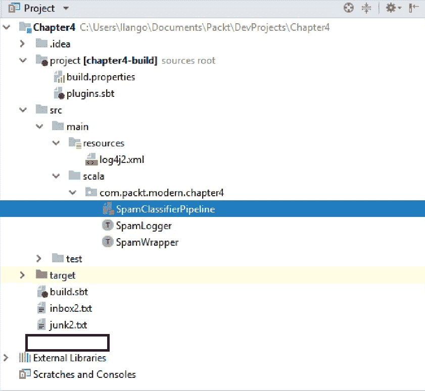

IntelliJ 中的项目大纲

在下一节中，我们将升级`build.sbt`文件。

# 第 2 步 – 升级你的 build.sbt 文件

这里是升级后的`build.sbt`文件。这里有什么新内容？记住，之前我们谈到了一个新的`Logging`库。以下截图中的新条目是你需要从 Log4j 1.6 迁移到新的 Scala 包装器 Log4j 2 的新依赖项：

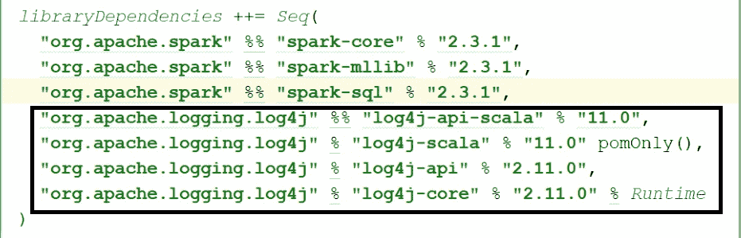

build.sbt 文件中的新条目

在下一节中，我们将从 Scala 代码开始，从 trait 开始。

# 第 3 步 – 创建名为 SpamWrapper 的 trait

在 IntelliJ 中，使用文件 | 新建 | Scala 类，在名为`SpamWrapper.scala`的文件中创建一个名为`SpamWrapper`的空 Scala trait。

首先，在文件顶部，我们将设置以下导入以实现利用此 trait 的类：

+   `SparkSession`——使用 Spark 编程的入口点

+   适当的 Log4J 库导入，以便我们可以降低 Spark 的日志消息：

这些是最基本的导入。接下来，创建一个空的`trait`。以下是一个更新的`trait`：

```java
trait SpamWrapper {  }
```

在`SpamWrapper` trait 内部，创建一个名为`session`的`SparkSession`实例。在此阶段，这里是一个关于 Spark 的复习：

+   我们需要一个`SparkSession`对象实例作为使用 Spark 编程的入口点。

+   我们不需要单独的`SparkContext`。这由`SparkSession`提供。底层上下文可以很容易地作为`session.sparkContext`提供给我们。

+   要创建`SparkSession`对象实例或获取现有的`SparkSession`，使用构建者模式。

+   `SparkSession`实例在整个 Spark 作业的时间范围内都可用。

这里是更新的`SpamWrapper` trait：

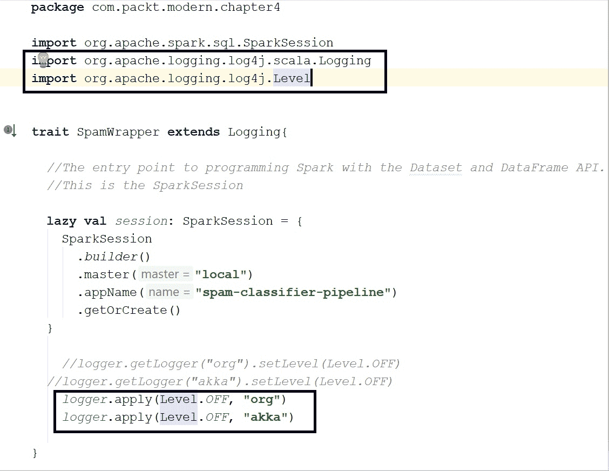

带有 SparkSession 值的 SpamWrapper trait

回顾一下，我们创建了一个名为`session`的`val`，我们的管道类将使用它。当然，这将是我们使用 Spark 编程构建这个垃圾邮件分类器的入口点。

# 第 4 步 – 描述数据集

从`ModernScalaProjects_Code`文件夹下载数据集。它由两个文本文件组成：

+   `inbox.txt`：正常邮件（我从我的 Gmail 收件箱文件夹中创建了此文件）

+   `junk.txt`：垃圾邮件（我从我的 Gmail 垃圾邮件文件夹中创建了这些）

将这些文件放入你的项目文件夹的根目录。在下一节中，我们将描述数据集。

# SpamHam 数据集的描述

在我们展示实际数据集之前，这里有一些现实世界的垃圾邮件样本：

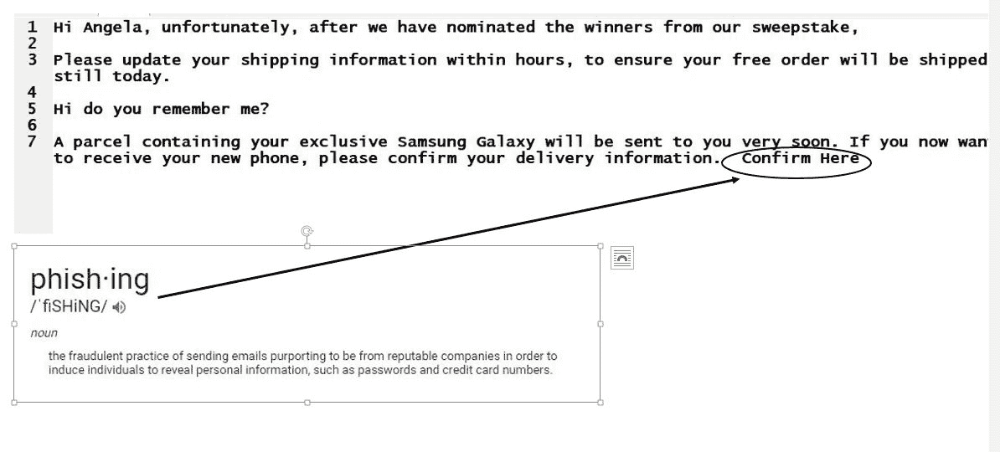

带有钓鱼示例的垃圾邮件

这里是常规或所需邮件的示例，也称为 ham：

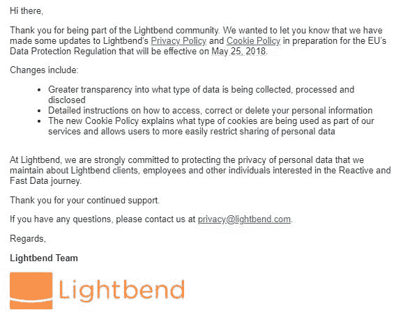

来自 Lightbend 的一个完全正常的电子邮件

以下是我们用于垃圾邮件-ham 分类任务的实际数据集的预览。有两个数据集：

+   `inbox.txt`：从我的收件箱文件夹中收集的一小批常规电子邮件组成的 ham 数据集

+   `junk.txt`：从我的垃圾邮件/垃圾文件夹中收集的一小批垃圾邮件组成的垃圾邮件数据集

这里是常规数据集：

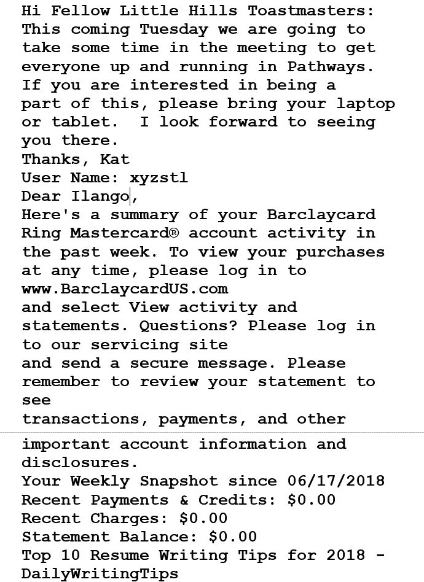

常规电子邮件数据集的一部分

这里是垃圾邮件数据集：

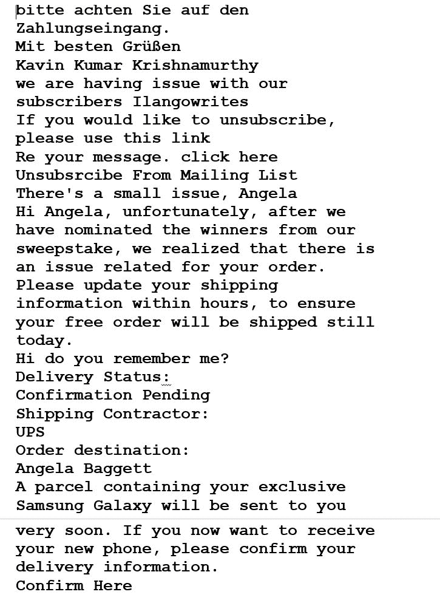

垃圾邮件数据集的一部分

前面的邮件要求你在这里确认。这是一个钓鱼尝试。这完成了我们对数据集的描述。在下一步，我们将进行数据预处理。我们需要一个新的 Scala 对象，名为`SpamClassifierPipeline`。

# 第 5 步 – 创建一个新的垃圾邮件分类器类

我们将创建一个名为`SpamClassifierPipeline.scala`的新 Scala 文件。首先，我们需要以下导入：

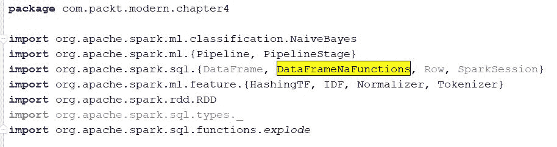

必需的导入

现在已经创建了导入，让我们在`SpamWrapper`特质相同的包中创建一个空的`SpamClassifierPipeline`对象，如下所示：

```java
object SpamClassifierPipeline extends App with SpamWrapper {  }
```

一个原型垃圾邮件分类器已经准备好了。我们需要在其中编写代码来做诸如数据预处理等事情，当然还有更多。在下一步，我们将列出必要的预处理步骤。

# 第 6 步 – 列出数据预处理步骤

预处理有一个目的。在大多数数据分析任务中，迫切需要问的问题是——我们的数据是否必然可用？答案在于，大多数现实世界的数据集都需要预处理，这是一个按摩步骤，旨在给数据一个新的可用形式。

使用垃圾邮件和 ham 数据集，我们确定了两个重要的预处理步骤：

1.  移除标点符号：

+   使用正则表达式处理标点符号

1.  移除停用词

在下一步，我们将编写 Scala 代码来编写两个正则表达式，这些表达式相当简单，仅针对一小部分垃圾邮件。但这是一个开始。

在下一步，我们将把我们的数据集加载到 Spark 中。自然地，我们想要一个 ham 数据框和一个 spam 数据框。我们首先承担创建 ham 数据框的任务。我们的 ham 和 spam 数据集都准备好了，可以进行预处理。这带我们到了下一步。

# 第 7 步 – 移除标点符号和空白的正则表达式

这里是我们当前需要的正则表达式：

```java
val punctRegex = raw"[^A-Za-z0-9]+"
```

`raw`是标准 Scala 库中`StringContext`类的内联代码方法。

我们的语料库可能包含尾随和前导空格，有时格式不正确。例如，我们会在行缩进过多的地方遇到空格。为了去除空格，我们将使用正则表达式。这将使用锚点，帽子`^`和美元符号`$`来提取不带空格的文本。更新后的正则表达式现在看起来是这样的：

```java
//matches whitespaces and punctuation marks
val regex2 = raw"[^A-Za-z0-9\s]+" 
```

我们刚刚创建了一个正则表达式`regex2`，一个空格和一个标点符号去除器。很快，我们就需要这个`regex2`。在下一节中，我们将创建一个新的 ham 数据框，在应用几个基本预处理步骤之一——移除标点符号后。

# 第 8 步 – 创建一个移除标点的 ham 数据框

我们将对 ham 的**弹性分布式数据集**（**RDD**）的每一行应用正则表达式，然后使用`replaceAll`方法。底层的正则表达式引擎将使用正则表达式在我们的 ham 语料库中进行搜索和匹配，以找到匹配的实例，如下所示：

```java
val hamRDD2 = hamRDD.map(_.replaceAll(regex2, "").trim)
hamRDD2: org.apache.spark.rdd.RDD[String] = inbox.txt MapPartitionsRDD[1] at textFile at <console>:23
```

`replaceAll`方法启动并替换了所有空格和标点的出现。在下一步中，我们将把这个 RDD 转换成数据框。

我们创建了一个新的 ham RDD，其中包含首尾空格，并且移除了标点符号。让我们显示这个新的 ham 数据框：

```java
hamRDD3.take(10)
println("The HAM RDD looks like: " + hamRDD3.collect())
```

我们创建了一个新的 ham 数据框。我们需要通过将每个 ham 句子分配`0.0`标签来转换这个数据框。我们将在下一步中这样做：

```java
case class LabeledHamSpam(label: Double, mailSentence: String)
```

因此，我们将创建一个名为`LabeledHamSpam`的案例来模拟一个句子作为一个带有`Double`标签的特征。接下来，创建一个新的 ham RDD，它恰好有四个分区。

# 创建标记的 ham 数据框

我们将重新分区我们的 ham 数据框，并对 ham 数据框中的每个`"Ham sentence"`应用`transform`操作，如下所示：

```java
val hamRDD3: RDD[LabeledHamSpam] = hamRDD2.repartition(4).map(w => LabeledHamSpam(0.0,w))
```

我们重新分区并创建了一个新的 RDD，它以带有`0.0`标签的 ham 句子行结构化。现在，显示新的 ham RDD 的前`10`行：

```java
hamRDD3.take(10)
println("The HAM RDD looks like: " + hamRDD3.collect())
```

因此，我们为所有 ham 句子分配了`0.0`。现在是创建垃圾邮件 RDD 的时候了：

```java
val spamRDD = session.sparkContext.textFile(spamFileName)
spamRDisDset: org.apache.spark.rdd.RDD[String] = junk2.txt MapPartitionsRDD[3] at textFile at <console>:23
```

同样为垃圾邮件数据集重复相同的预处理步骤。

# 第 9 步 – 创建一个不带标点的垃圾邮件数据框

我们将使用相同的`LabeledHamSpam`案例类来为垃圾邮件句子分配`Double`类型的`value`值为`1.0`，如下所示：

```java
/*
Replace all occurrences of punctuation and whitespace
*/
val spamRDD2 = spamRDD.map(_.replaceAll(regex2, "").trim.toLowerCase)
/*
Repartition the above RDD and transform it into a labeled RDD
*/
val spamRDD3 = spamRDD2.repartition(4).map(w => LabeledHamSpam(0.0,w))
```

在下一步中，我们想要一个包含垃圾邮件和 ham 数据框的合并数据框。

# 第 10 步 – 合并垃圾邮件和 ham 数据集

在这一步中，我们将使用`++`方法在`Union`操作中连接两个数据框：

```java
val hamAndSpamNoCache: org.apache.spark.rdd.RDD[LabeledHamSpam] = (hamRDD3 ++ spamRDD3)
hamAndSpam: org.apache.spark.rdd.RDD[LabeledHamSpam] = UnionRDD[20] at
$plus$plus at <console>:34
```

在下一节中，让我们创建一个包含两列的数据框：

+   包含已移除标点的`feature sentences`的行

+   预设的`label`列

检查以下代码片段以获得更好的理解：

```java
val hamAndSpamDFrame" = hamAndSpam.select(hamAndSpam("punctLessSentences"), hamAndSpam("label"))
dataFrame2: org.apache.spark.sql.DataFrame = [features: string, label: double]
```

我们创建了新的数据框。让我们显示这个：

```java
hamAndSpamDFrame.show
+--------------------+-----+
| lowerCasedSentences|label|
+--------------------+-----+
|this coming tuesd...| 0.0|
|pin free dialing ...| 0.0|
|regards support team| 0.0|
| thankskat| 0.0|
|speed dialing let...| 0.0|
|keep your user in...| 0.0|
| user name ilangostl| 0.0|
|now your family m...| 0.0|

```

接下来，让我们运行以下可选的检查：

+   数据框的模式

+   数据框中存在的列

这是打印模式的方法：

```java
hamAndSpamDFrame.printSchema
 root
  |-- features: string (nullable = true)
  |-- label: double (nullable = false)
```

它们看起来不错！现在让我们读取`columns`：

```java
hamAndSpamDFrame.columns
res23: Array[String] = Array(features, label)
```

到目前为止，我们已经创建了一个没有标点符号的 dataframe，但并不一定没有包含 null 值的行。因此，为了删除包含 null 值的任何行，我们需要导入`DataFrameNaFunctions`类，如果您还没有导入它的话：

```java
import org.apache.spark.sql.DataFrameNaFunctions

val naFunctions: DataFrameNaFunctions = hamAndSpamDFrame.na
```

为了从无标点符号的 dataframe 中删除 null 值，有一个名为`punctFreeSentences`的列。我们将按照以下代码调用`drop()`方法：

```java
val nonNullBagOfWordsDataFrame = naFunctions.drop(Array("punctFreeSentences"))
```

在前面的代码中调用`drop`方法会导致包含 null 值的句子行被删除。如果您愿意，可以显示 dataframe 的前 20 行：

```java
println("Non-Null Bag Of punctuation-free DataFrame looks like this:")
```

显示 dataframe。以下代码将帮助您做到这一点：

```java
nonNullBagOfWordsDataFrame.show()
```

到目前为止，一个很好的下一步是与分词无标点符号的行相关，这些行也包含我们想要分词的内容。分词是下一节的重点。分词使我们更接近下一个预处理步骤——移除停用词。

# 第 11 步 – 对我们的特征进行分词

分词只是由算法执行的操作。它导致每行的分词。所有以下术语都定义了分词：

+   分割

+   分割

似乎适当的术语是前面列表中的第二个术语。对于当前 dataframe 中的每一行，一个分词器通过在分隔空格处分割将其`feature`行分割成其构成标记。每个结果 Spark 提供了两个分词器：

+   来自`org.apache.spark.ml`包的`Tokenizer`

+   来自同一包的`RegexTokenizer`

这两个分词器都是转换器。在 Spark 中，转换器是一个接受输入列作为（超）参数的算法，并输出一个具有转换输出列的新`DataFrame`，如下所示：

```java
import org.apache.spark.ml.feature.Tokenizer

val mailTokenizer = new Tokenizer().setInputCol("lowerCasedSentences").setOutputCol("mailFeatureWords")
mailTokenizer: org.apache.spark.ml.feature.Tokenizer = tok_0b4186779a55

```

在`mailTokenizer`上调用`transform`方法将给我们一个新的转换后的 dataframe：

```java
val tokenizedBagOfWordsDataFrame: DataFrame = mailTokenizer2.transform(nonNullBagOfWordsDataFrame)

```

结果 dataframe，`tokenizedBagOfWordsDataFrame`，是一个分词的非空单词包，全部为小写。它看起来像这样：

```java
+--------------------+-----+--------------------+
| lowerCasedSentences|label| mailFeatureWords|
+--------------------+-----+--------------------+
|This coming tuesd...| 0.0|[this, coming, tu...|
|Pin free dialing ...| 0.0|[pin, free, diali...|
|Regards support team| 0.0|[regards, support...|
| Thanks kat| 0.0| [thankskat]|
|Speed dialing let...| 0.0|speed, dialing, ...|
|Keep your user in...| 0.0|[keep, your, user...|
| User name ilangostl| 0.0|[user, name, ilan...|
|Now your family m...| 0.0|[now, your, famil...|
```

这里需要注意的重要一点是，转换列中的行`mailFeatureWords`类似于一个单词数组。读者不会错过注意到`mailFeatureWords`中有一些被称为停用词的单词。这些单词对我们的垃圾邮件分类任务没有显著贡献。这些单词可以通过 Spark 的`StopWordRemover`算法安全地删除。在下一步中，我们将看到如何使用`StopWordRemover`。

# 第 12 步 – 移除停用词

首先，确保您在`SpamClassifierPipeline`类中导入了`StopWordRemover`。接下来，我们将创建一个`StopWordRemover`的实例，并将其传递给一个（超）参数列，`mailFeatureWords`。我们希望输出列中没有停用词：

```java
val stopWordRemover = new StopWordsRemover().setInputCol("mailFeatureWords").setOutputCol("noStopWordsMailFeatures") 
```

就像使用`mailTokenizer`一样，我们调用`transform`方法来获取一个新的`noStopWordsDataFrame`：

```java
val noStopWordsDataFrame = stopWordRemover.transform(tokenizedBagOfWordsDataFrame)
```

结果 dataframe，一个分词的、非空的、无停用词的小写单词包，看起来像这样：

```java
noStopWordsDataFrame.show()
+-----------------------+-----+
|noStopWordsMailFeatures|label|
+-----------------------+-----+
| coming| 0.0|
| tuesday| 0.0|
| going| 0.0|
| take| 0.0|
| time| 0.0|
| meeting| 0.0|
| get| 0.0|
| everyone| 0.0|
| running| 0.0|
| pathways| 0.0|

```

在下一步中，我们将对我们当前的数据帧进行第二次转换：

```java
import session.implicits._

val noStopWordsDataFrame2 = noStopWordsDataFrame.select(explode($"noStopWordsMailFeatures").alias("noStopWordsMailFeatures"),noStopWordsDataFrame("label"))
```

分解、标记、非空、小写且无停用词的词袋看起来如下：

```java
noStopWordsDataFrame2.show()
```

这完成了数据预处理。这为特征提取，一个极其重要的机器学习步骤做好了准备。

# 第 13 步 – 特征提取

在这一步，我们将提取这个数据集的特征。我们将执行以下操作：

+   创建特征向量

+   创建特征涉及使用 n-gram 模型将文本转换为字符的二元组

+   这些字符的二元组将被哈希到一个长度为`10000`的特征向量

+   最终的特征向量将被传递到 Spark ML

查看以下代码片段：

```java
import org.apache.spark.ml.feature.HashingTF

val hashMapper = new HashingTF().setInputCol("words").
setOutputCol("noStopWordsMailFeatures").setOutputCol("mailFeatureHashes").setNumFeatures(10000)
hashFeatures: org.apache.spark.ml.feature.HashingTF = hashingTF_5ff221eac4b4
```

接下来，我们将对`noStopWordsDataFrame`的特征版本进行`transform`操作：

```java
val featurizedDF = hashMapper.transform(noStopWordsDataFrame)

//Display the featurized dataframe
featurizedDF1.show()
```

使用哈希特征和标记、非空、小写且无停用词的词袋，这个`DataFrame`看起来如下：

![图片

哈希特征和标记、非空、小写且无停用词的数据帧

到目前为止，我们已经准备好创建训练集和测试集。

# 第 14 步 – 创建训练集和测试集

这一步很重要，因为我们将要创建一个我们想要用训练集训练的模型。创建训练集的一种方法是将当前的数据帧分区，并将其中 80%分配给新的训练集：

```java
val splitFeaturizedDF = featurizedDF.randomSplit(Array(0.80, 0.20), 98765L)
splitFeaturizedDF1: Array[org.apache.spark.sql.Dataset[org.apache.spark.sql.Row]] = Array([filteredMailFeatures: string, label: double ... 2 more fields],    [filteredMailFeatures: string, label: double ... 2 more fields])
```

现在，让我们检索训练集：

```java
val trainFeaturizedDF = splitFeaturizedDF(0)
```

测试数据集如下。这是我们创建它的方法：

```java
val testFeaturizedDF = splitFeaturizedDF(1)
```

我们需要更进一步。需要一个修改过的训练集版本，以下列被移除：

+   `mailFeatureWords`

+   `noStopWordsMailFeatures`

+   `mailFeatureHashes`

这里是经过`drop`操作前几列后的新训练集：

```java
val trainFeaturizedDFNew = trainFeaturizedDF1.drop("mailFeatureWords","noStopWordsMailFeatures","mailFeatureHashes")

trainFeaturizedDFNew.show()
```

调用`show()`方法会导致以下新训练集的显示：

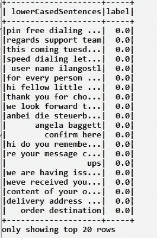

训练数据帧

在训练（拟合）模型之前的重要一步是所谓的**逆文档频率**（**IDF**）。Spark 提供了一个名为 IDF 的估计器，将为我们计算 IDF。IDF 是一种算法，将在我们的当前数据帧上训练（拟合）模型：

```java
val mailIDF = new IDF().setInputCol("mailFeatureHashes").setOutputCol("mailIDF")
```

现在，我们将`featurizedDF`数据帧传递到 IDF 算法的`fit`方法上。这将产生我们的模型：

```java
val mailIDFFunction = mailIDF.fit(featurizedDF)
```

下一个步骤是一个归一化步骤。`normalizer`将不同`特征`的尺度进行归一化，这样不同大小的文章不会被不同地加权：

```java
val normalizer = new Normalizer().setInputCol("mailIDF").setOutputCol("features")
```

让我们现在使用朴素贝叶斯算法。初始化它，并传递给它所需的超参数：

```java
val naiveBayes = new NaiveBayes().setFeaturesCol("features").setPredictionCol("prediction")
```

现在是时候创建管道并设置其中的所有阶段了。这些如下：

+   `StopWordRemover`

+   `HashingTF`

+   `mailIDF`

+   `normalizer`

+   `naiveBayes`

代码片段设置了以下阶段：

```java
val spamPipeline = new Pipeline().setStages(ArrayPipelineStage ++
                                                                                            ArrayPipelineStage ++
                                                                                           ArrayPipelineStage ++
                                                                                          ArrayPipelineStage ++
                                                                                          ArrayPipelineStage ++
                                                                                          ArrayPipelineStage
```

将管道拟合到训练文档中：

```java
val mailModel1 = spamPipeline1.fit(trainFeaturizedDFNew)
```

在测试集上做出预测：

```java
val rawPredictions = mailModel1.transform(testFeaturizedDF.drop("mailFeatureWords","noStopWordsMailFeatures","mailFeatureHashes"))

```

现在我们将显示生成的原始预测：

```java
rawPredictions.show(20))
```

注意，它们不是两张表。为了视觉清晰，这是一张被分成两部分的表：

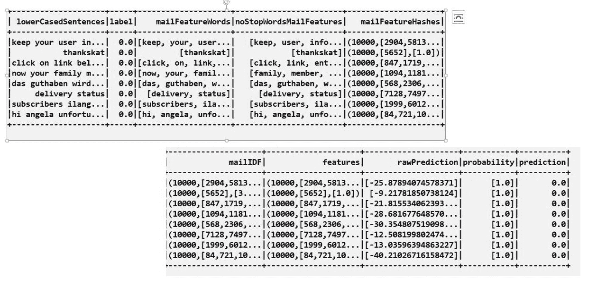

原始预测表

这是最后一步，我们只想在预测表中显示相关列。以下代码行将删除那些不需要的列：

```java
val predictions = rawPredictions.select($"lowerCasedSentences", $"prediction").cache
```

显示最终的`预测`表。我们只需要第一列和最后一列。`标签`列是模型生成的预测：

```java
predictions.show(50)
```

它如下显示预测：

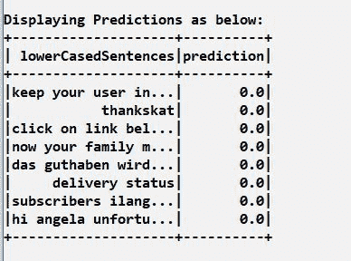

预测

我们已经完成了，所以`停止``会话`：

```java
session.stop()
```

# 摘要

在本章中，我们创建了一个垃圾邮件分类器。我们开始时使用了两个数据集，一个代表正常邮件，另一个代表垃圾邮件。我们将这两个数据集合并成一个综合语料库，然后按照*实现步骤*部分中提到的预处理步骤进行处理。

在下一章中，我们将基于到目前为止学到的某些技术来创建一个欺诈检测机器学习应用。

# 问题

这里有一些问题，将有助于加强本章中展示的所有学习材料：

1.  垃圾邮件分类任务是一个二元分类任务吗？

1.  在垃圾邮件分类任务中，哈希技巧的意义是什么？

1.  哈希冲突是什么，以及它是如何被最小化的？

1.  我们所说的逆文档频率是什么意思？

1.  停用词是什么，为什么它们很重要？

1.  在垃圾邮件分类中，朴素贝叶斯算法扮演了什么角色？

1.  你如何在 Spark 中使用`HashingTF`类来实现垃圾邮件分类过程中的哈希技巧？

1.  我们所说的特征向量化是什么意思？

1.  你能想到一个更好的算法来实现垃圾邮件分类过程吗？

1.  什么是垃圾邮件过滤的好处，为什么从商业角度来说它们很重要？

# 进一步阅读

以下论文是一项全面的工作，值得阅读：

[`www.sciencedirect.com/science/article/pii/S2405882316300412`](https://www.sciencedirect.com/science/article/pii/S2405882316300412)
