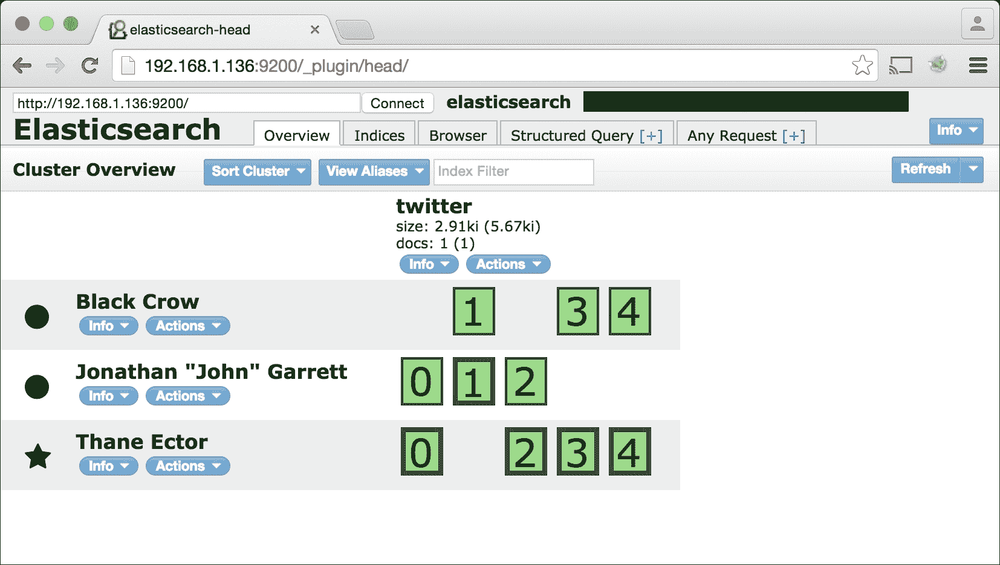
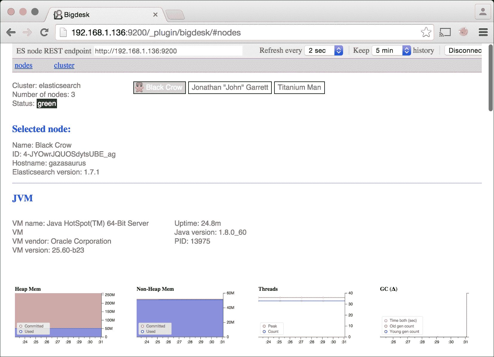
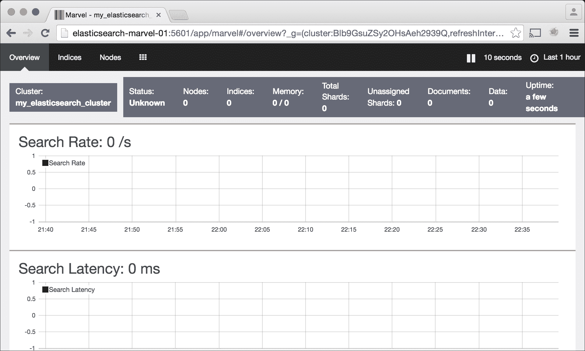

# 第二章：Elasticsearch 的安装和需求

**Java 运行时环境**（**JRE**）是运行 Elasticsearch 的唯一要求。

官方 Elasticsearch 文档建议您使用 Oracle Java 8（更新 20 或更高版本），或 Oracle Java 7（更新 55 或更高版本）。一旦您选择了 JRE 的版本，我们建议您的所有节点使用相同的版本以保持兼容性。在集群中使用不同版本的 Java 或使用比此处指定的版本更早的 Java 版本可能会导致数据损坏。一旦您选择了 Elasticsearch 的版本，您的集群中的所有节点都应使用相同的版本。

虽然可以在 Windows 和 Linux 上运行 Elasticsearch，但本书专注于在 Linux 环境中单独使用它。Elasticsearch 文档以 Linux 为中心，Elasticsearch 社区的大部分人都在 Linux 上运行该软件。然而，没有理由生产集群的 Elasticsearch 不能在 Windows 上运行。

本章将特别介绍 Ubuntu、CentOS 和 Red Hat Enterprise Linux (RHEL) 的安装说明，但任何 Linux 发行版都适用。读者应使用 64 位操作系统而不是 32 位操作系统，因为前者允许为 JRE 分配更多内存。

本章涵盖以下主题：

+   安装 Elasticsearch

+   配置 Elasticsearch

+   安装监控工具（Elasticsearch-head、Bigdesk 和 Marvel）

+   集群需求

# 安装 Elasticsearch

在撰写本书时，Elasticsearch 2.3.2 是当前的稳定版本，Elasticsearch 5 正在 alpha 测试中。对于生产集群，我们建议使用 2.3.2 版本，一旦可用，应迅速更新到 5 通用可用（GA）版本。请注意，虽然 Elasticsearch 5 与在 Elasticsearch 2.x 中创建的索引兼容，但在 1.x 版本发布后也进行了一些 API 变更和功能弃用。在升级之前，读者应考虑到这些重要变更。有关从 2.x 升级到 5 的更多详细信息，可以在 Elastic 网站上的以下 URL 找到：

+   [`www.elastic.co/blog/elasticsearch-5-0-0-alpha1-released`](https://www.elastic.co/blog/elasticsearch-5-0-0-alpha1-released)

+   [`www.elastic.co/blog/elasticsearch-5-0-0-alpha2-released`](https://www.elastic.co/blog/elasticsearch-5-0-0-alpha2-released)

以下是一些显著的 API 变更：

+   Elasticsearch 1.x 的索引必须首先升级到 2.x，然后才能最终迁移到版本 5

+   已弃用的 `filtered`、`or` 和 `and` 查询已被 `bool`、`must` 和 `should` 查询所取代

+   `string` 映射已被 `text` 和 `keyword` 字段所取代

+   `index` 映射属性现在设置为 `true` / `false` 而不是 `analyzed` / `not_analyzed` / `no`

+   Percolate API 的重大变更

+   `_id` 值限制为 512 字节

虽然本书中的示例使用的是 2.3.2 版本的 Elasticsearch，但所有示例都应与即将推出的 5.0 版本兼容。

最新版本的 Elasticsearch 可在 [`www.elastic.co/downloads/elasticsearch`](https://www.elastic.co/downloads/elasticsearch) 以 `.zip`、`.tar.gz`、`.rpm` 和 `.deb` 格式获取。Elasticsearch 的安装方式无关紧要，但我们推荐 Ubuntu 用户使用 `.deb` 安装程序，CentOS 或 RHEL 用户使用 `.rpm` 安装程序，其他 Linux 发行版用户或需要更定制化设置的用户使用 `.tar.gz` 或 `.zip` 版本，Elasticsearch 还提供官方的 `yum` 和 `apt-get` 仓库。

本章中的示例假设用户使用 `.rpm` 或 `.deb` 安装程序或通过官方的 `yum` 或 `apt-get` 仓库安装了 Elasticsearch。对于使用 `.zip` 和 `.tar.gz` 安装程序的用户也应类似。

## DEB/RPM 安装

首先，从 [`elastic.co`](https://elastic.co) 下载最新版本的包：

1.  在 Ubuntu 或 Debian 兼容系统上运行以下命令以安装 DEB 包：

    ```java
    wget https://download.elastic.co/elasticsearch/elasticsearch/elasticsearch-2.3
    .2.deb
    sudo dpkg -i elasticsearch-2.3.2.deb 

    ```

1.  在 CentOS、RHEL 或其他兼容系统上运行以下命令以安装 RPM 包：

    ```java
    wget https://download.elastic.co/elasticsearch/elasticsearch/elasticsearch-2.3.2.noar
    ch.rpm
    sudo rpm -i elasticsearch-2.3.2.noar
    ch.rpm

    ```

## yum 和 apt-get 仓库

官方的 `yum` 和 `apt-get` 仓库是安装 Elasticsearch 的好方法。然而，请确保您使用的是 *官方* 仓库。许多第三方 `yum` 和 `apt-get` Elasticsearch 仓库可供选择，但它们可能没有最新的稳定版本。

## Ubuntu/Debian 和 apt-get

使用 `apt-get` 安装 Elasticsearch 的步骤如下：

1.  要通过 `apt-get` 启用仓库，首先添加 `gpg` 密钥：

    ```java
    wget -qO - https://packages.elastic.co/GPG-KEY-elasticsearch | sudo apt-key add -

    ```

1.  然后，通过以下方式添加仓库：

    ```java
    echo "deb http://packages.elastic.co/elasticsearch/2.3/debian stab
    le
     main" | sudo tee -a /etc/apt/sources.list.d/elasticsearch-2.3.list

    ```

1.  最后，使用您的包管理器安装以下内容：

    ```java
    sudo apt-get install elast
    icsearch

    ```

## CentOS/RHEL 和 yum

对于 `yum`，请按照以下步骤操作：

1.  添加 `gpg` 密钥：

    ```java
    rpm --import https://packages.elastic.co/GPG-KEY-elasticsearch

    ```

1.  然后，在 `/etc/yum.repos.d/elasticsearch.repo` 创建一个新的 yum 仓库，内容如下：

    ```java
    [elasticsearch-2.3]
    name=Elasticsearch 2.3.X repository
    baseurl=http://packages.elastic.co/elasticsearch/2.3/centos
    gpgcheck=1
    gpgkey=http://packages.elastic.co/GPG-KEY-elasticsearch
    enabled=1

    ```

1.  使用以下命令安装软件包：

    ```java
    sudo yum install e
    lasticsearch

    ```

## 验证

使用以下命令启动 Elasticsearch：

```java
sudo /etc/init.d/elasticsearch start

```

然后，验证安装，通过以下方式测试 Elasticsearch 是否正在运行并加载：

```java
curl localhost:9200

```

您应该得到以下响应：

```java
{
 "status" : 200,
 "name" : "Inertia",
 "cluster_name" : "Elasticsearch",
 "version" : {
 "number" : "2.3.2",
 "build_hash" : " b9e4a6acad4008027e4038f6abed7f7dba346f94",
 "build_timestamp" : "2016-04-21T16:03:47Z ",
 "build_snapshot" : false,
 "lucene_version" : "5.5.0"
 },
 "tagline" : "You Know, for Search"
}

```

要验证我们能否将数据写入 Elasticsearch，请使用以下命令：

```java
curl -XPUT 'http://localhost:9200/twitter/user/lababidi' -d '{ "name" : "Mahmoud Lababidi" }'

```

这将返回以下内容：

```java
{"_index":"twitter","_type":"user","_id":"lababidi","_version":1,"created":true}

```

我们获取数据，如下所示：

```java
curl -XGET 'http://localhost:9200/twitter/user/lababidi?pretty=true'

```

这将返回以下输出：

```java
{
 "_index" : "twitter",
 "_type" : "user",
 "_id" : "lababidi",
 "_version" : 1,
 "found" : true,
 "_source":{ "name" : "Mahmoud Lababidi" }
}

```

作为合理性检查，尝试一个不存在的记录：

```java
curl -XGET 'http://localhost:9200/twitter/user/kimchy?pretty=true'

```

这应该返回预期的 `false` 对于 `found`：

```java
{
 "_index" : "twitter",
 "_type" : "user",
 "_id" : "kimchy",
 "fo
und" : false
}

```

## 配置文件

值得注意的是 Elasticsearch 的安装位置，特别是配置文件和日志文件。例如，在 Ubuntu 上，运行以下命令：

```java
dpkg -L Elasticsearch

```

这将显示安装将日志放在 `/var/log/elasticsearch`，配置文件放在 `/etc/elasticsearch`。Elasticsearch 的任何设置（与日志无关）都在 `elasticsearch.yml` 中，而 `logging.yml` 负责日志处理。

我们将在本书的后续部分进一步探讨这些文件及其相应的设置。

# 配置 Elasticsearch 集群

本节将涵盖一些基本的 Elasticsearch 配置，以及一些将对您的集群性能产生积极影响的更改。

大多数 Elasticsearch 配置更改都将应用于 `elasticsearch.yml`。对于我们在 Ubuntu 上的 Elasticsearch 安装，此文件位于 `/etc/elasticsearch/elasticsearch.yml`。Elasticsearch 内部配置更改应用于 `elasticsearch.yml`。环境变量可以在应用程序的启动脚本中设置。对于我们在 Ubuntu 上的 Elasticsearch 2.3.2 安装，这些文件位于以下位置：

+   内部配置位于

    `/etc/elasticsearch/elasticsearch.yml`

+   环境变量配置位于

    `/etc/default/elasticsearch`

## 集群名称

关于 Elasticsearch 的一个美妙之处在于构建集群的简便性。如果同一局域网（LAN）上的 Elasticsearch 节点将配置变量 `cluster.name` 设置为相同的值，它们将自动相互形成集群。

例如，如果我们将在我们的集群中存储来自 Twitter 的推文，我们可能希望将 `cluster.name` 设置为 `twitter_development`。稍后，我们可能希望创建另一个名为 `twitter_production` 的集群来存储所有生产数据。

要修改此设置，编辑 `Elasticsearch.yml` 文件并查找 `cluster.name` 设置。将此值更改为：`cluster.name: twitter_development`。

`cluster.name` 的默认值是 `elasticsearch`。在独立开发中使用它是可以的，但如果你在局域网（LAN）上与其他开发者一起使用，请小心使用。如果你使用默认的 `cluster.name` 值启动一个新的 Elasticsearch，而你的网络上的其他人也在使用默认配置运行 Elasticsearch，你将注意到他们的 Elasticsearch 实例中的数据将开始在你的机器上复制。

## 内存配置

Elasticsearch 建议将堆大小设置为机器可用 RAM 的一半，但不超过 30.5 GB。我们使用的是 16 GB RAM 的机器，因此我们将堆大小设置为 8 GB。此配置更改是在 `/etc/default/elasticsearch` 中的 `ES_HEAP_SIZE` 环境变量中进行的：

```java
ES_HEAP_SIZE=8g
```

## 打开文件限制

Linux 限制了进程一次可以打开的文件描述符数量。这个限制存在是因为每次进程打开一个文件描述符时，都会使用一点内存。如果没有对打开文件数量的限制，一个进程可能会打开足够的文件，导致整个系统内存耗尽并崩溃。

默认情况下，此限制设置为 `1024`，这对于 Elasticsearch 来说太低了。官方 Elasticsearch 文档建议将此值提高到 `32k` 或 `64k` 以增加打开文件的数量。

## 最大文件限制

最新的`.rpm`和`.deb`安装程序将自动将 Elasticsearch 的最大打开文件限制增加到`65535`。然而，如果您使用较旧的`.deb`或`.rpm`版本，或者从 tarball 运行 Elasticsearch，您将必须手动增加限制。

要检查分配给当前用户的最大打开文件数，请运行以下命令：

```java
$ ulimit -n 
65535

```

用户最多有`65535`个文件。然而，这并不意味着 Elasticsearch 被分配了这么多文件。这可能意味着 Elasticsearch 以不同的用户身份运行，或者是以不同的环境设置启动的。

要检查分配给 Elasticsearch 的最大打开文件数，请运行以下命令：

```java
curl -XGET 'http://localhost:9200/_nodes?os=true&process=true&pretty=true'

```

结果应该看起来像这样：

```java
{
 "ok" : true,
 "cluster_name" : "Elasticsearch",
 "nodes" : {
 "-P1cQt9lThejPG_rj-reKw" : {
 "name" : "Korg",
 ...
 "process" : {
 "refresh_interval" : 1000,
 "id" : 1407,
 "max_file_descriptors" : 1024
 }
 }
 }

```

我们看到`max_file_descriptors`被设置为`1024`，因此我们需要将其增加。如果您的输出显示`65535`，请跳到下一节。

确保这是针对适当的节点；这个`curl`命令将显示您集群中所有节点的`max_file`描述符。

## 在 Ubuntu Linux 上更新最大文件描述符

编辑`/etc/security/limits.conf`文件，并在文件末尾添加以下行：

```java
*  soft  nofile 65536
*  hard  nofile 65536

```

### 小贴士

`*`符号表示`所有用户`。您也可以将其设置为仅运行 Elasticsearch 进程的用户。

## 启用可插拔认证模块

如果我们通过 SSH 连接到 Linux 服务器，我们必须确保 PAM 认证已启用。如果您使用 Ubuntu 或 CentOS/RHEL，这些说明是相同的。要做出此配置更改，编辑`sshd_config`文件：

```java
sudo vim /etc/ssh/sshd_config

```

确保这一行存在：

```java
UsePAM yes

```

然后，重新启动您的 SSH 服务器：

```java
sudo service ssh restart

```

## 验证打开文件限制

注销并重新登录以使这些更改生效，然后重新启动 Elasticsearch 服务器：

```java
exit
ssh <yo
ur_username>@<your_server>
sudo service elasticsearch restart

```

最后，务必验证这些更改是否生效。仅验证`ulimit -n`返回`65536`是不够的。还必须确保 Elasticsearch 用户已正确启动，并具有增加的最大打开文件限制：

```java
curl -XGET 'http://localhost:9200/_nodes?os=true&process=true&pretty=true'

```

这应该导致以下结果：

```java
{
 "ok" : true,
 "cluster_name" : "Elasticsearch",
 "nodes" : {
 "-P1cQt9lThejPG_rj-reKw" : {
 "name" : "Korg",
 ...
 "process" : {
 "refresh_interval" : 1000,
 "id" : 1407,
 "max_file_descriptors" : 65536
 }
 }
 }

```

这次我们看到`max_file_d` `escriptors`被设置为`65536`。

## 禁用交换

在您的操作系统或 Elasticsearch 进程中禁用内存交换是很重要的。

要在系统重新启动之前禁用交换，请运行以下命令：

```java
sudo swapoff -a

```

要在系统重新启动后禁用交换，编辑`/etc/fstab`文件，并注释掉包含`swap`一词的任何行。对我们来说，这看起来像以下这样：

```java
# /dev/xvdb   none         swap    sw 
 0 0

```

要仅禁用 Elasticsearch 的交换，您首先必须使用`ES_HEAP_SIZE`设置 Elasticsearch 堆大小，并以 root 用户将进程的最大锁定内存设置为`ulimited`。如果您使用`.rpm`或`.deb`安装程序，这两个设置都可以在`/etc/init.d/elasticsearch`启动脚本中更改。具体来说，取消注释并更新以下行，如下所示：

（我的机器有 512MB 的内存，所以我将`ES_HEAP_SIZE`设置为`256m`。）

```java
# Set ES_HEAP_SIZE to 50% of available RAM, but no more than 31gES_HEAP_SIZE=256m

```

有一点更远：

```java
# Maximum amount of locked memory
MAX_LOCKED_MEMORY=unlimited

```

接下来，编辑您的 `elasticsearch.yml` 文件，并添加以下行：

```java
bootstrap.mlockall: true

```

然后，重启您的 Elasticsearch 节点：

```java
sudo service elasticsearch restart

```

最后，通过运行以下命令来验证此设置是否成功：

```java
curl http://localhost:9200/_nodes/process?pretty

```

您应该看到以下内容：

```java
"mlockall"
 : true

```

这是响应。

# 了解您的集群

Elasticsearch 有许多不同的组件，确保所有组件正常运行可能会变得有些复杂。幸运的是，有一些优秀的开源监控工具可供您使用，以帮助您监控您的集群。本节将介绍如何在您的集群上安装一些最受欢迎和最有用的监控工具，接下来的两个章节将更详细地介绍这些工具。

## 安装 Elasticsearch-head

Elasticsearch-head 是一个简单、免费、开源的工具，它提供了对您的集群的高级检查。它是管理集群和监控集群健康状况时最常用的工具之一。Elasticsearch-head 只需要在您的集群中的一个节点上安装。然而，我们建议在所有节点上安装它以提高冗余性。它作为 Elasticsearch 插件安装。

如果您有互联网连接，您可以使用 Elasticsearch 的 `plugin` 工具安装 Elasticsearch-head，如下所示：

```java
sudo /usr/share/elasticsearch/bin/plugin install mobz/elasticsearch-head

```

`plugin` 脚本的位置可能会有所不同。

下一个命令假设您使用 `.rpm` 或 `.deb` 文件安装了 Elasticsearch，但如果您不确定插件脚本在您的安装中的位置，请尝试运行以下命令：

```java
sudo updatedb
locate elasticsearch | grep plugin$

```

对于我来说，这返回以下内容：

```java
/usr/share/elasticsearch/bin/plugin

```

如果您的 Elasticsearch 实例没有互联网连接，您可以下载 Elasticsearch-head 插件，将其传输到您的服务器，并使用以下方法进行安装。

从一个有互联网连接的机器上，我们使用以下方法：

```java
wget https://github.com/mobz/elasticsearch-head/archive/ma
ster.zip -O Elasticsearch-head.zip
scp Elasticsearch-head.zip your_server:~/

```

从 Elasticsearch 服务器，我们使用以下方法：

```java
sudo /usr/share/elasticsearch/bin/plugin install file:///path/to/Elasticsearch-head.zip

```

如果您运行的是旧版本的 Elasticsearch，您可能需要在打开 Elasticsearch-head 之前重启您的节点：

```java
sudo service elasticsearch restart

```

通过访问 `http://elasticsearch-server:9200/_plugin/head/`（对于测试环境，`elasticsearch-server` 可能是 `localhost`）来试用此插件。您应该看到以下内容：



## 安装 Bigdesk

Bigdesk 是一个免费的开源 Elasticsearch 插件，它允许您查看您集群的 CPU、内存和磁盘使用情况。这是一个很好的工具，可以深入挖掘集群的性能问题，并且与 Elasticsearch-head 类似，它只需要在您的集群中的一个节点上安装。我们仍然建议在所有节点上安装它以提高冗余性。

这是安装 Bigdesk 的方法。

在线安装如下：

```java
sudo /usr/share/elasticsearch/bin
/plugin install AIsaac08/bigdesk

```

离线安装有多个方法。

从一个有互联网连接的机器上，使用以下方法：

```java
wget https://github.com/AIsaac08/bigdesk/zipball/master -O bigdesk.zip
scp bigdesk.zip your_server:~/

```

从 Elasticsearch 服务器，使用以下方法：

```java
sudo /usr/share/elasticsearch/bin/plugin install file:///path/to/bigdesk.zip 

```

与 Elasticsearch-head 类似，如果您运行的是旧版本的 Elasticsearch，您可能需要在打开 Bigdesk 之前重启您的节点：

```java
sudo service elasticsearch restart

```

通过访问`http://elasticsearch-server:9200/_plugin/bigdesk/`（对于测试环境，elasticsearch-server 可能是 localhost）尝试插件。你应该会看到以下内容：



## Marvel

Marvel 是由 Elasticsearch 制作者创建的一个强大的监控工具。在开发中使用它是免费的，但在生产中使用则需要订阅费用。Marvel 由以下两个组件组成：

1.  Marvel 代理（需要 Marvel 许可证）。

1.  Marvel 仪表板（需要 Kibana）。

要安装 Marvel 代理：

+   在线安装如下：

    ```java
    sudo /usr/share/elasticsearch/bin/plugin install license
    sudo /usr/share/elasticsearch/bin/plugin install marvel-agent
    ```

+   离线安装如下：

    ```java
    wget https://download.elastic.co/elasticsearch/release/org/elasticsearch/plugin/license/2.3.3/license-2.3.3.zip
    wget https://download.elastic.co/elasticsearch/release/org/elasticsearch/plugin/marvel-agent/2.3.3/marvel-agent-2.3.3.zip

    sudo bin/plugin install file:///absolute/path/to /license-2.3.3.zip
    sudo bin/plugin install file:///absolute/path/to/marvel-agent-2.3.3.zip 

    ```

安装 Marvel 代理后重启 Elasticsearch：

```java
sudo service elasticsearch restart

```

要安装 Marvel 仪表板，请按照以下步骤操作：

1.  首先，安装 Kibana：

    ```java
    wget https://download.elastic.co/kibana/kibana/kibana-4.5.1-linux-x64.tar.gz
    tar xzvf kibana-4.5.1-linux-x64.tar.gz

    ```

1.  接下来，将 Marvel 仪表板作为 Kibana 插件安装：

    ```java
    cd kibana-4.5.1
    wget https://download.elasticsearch.org/elasticsearch/marvel/marvel-2.3.3.tar.gz
    bin/kibana plugin --install marvel --url file:///tmp/marvel-2.3.3.tar.gz

    ```

1.  启动 Kibana：

    ```java
    ./bin/kibana

    ```

1.  通过访问`http://server-name:5601/`（对于测试环境，`server-name`可能是`localhost`）打开 Marvel 仪表板。你应该会看到以下内容：



# 集群要求

你集群的要求——节点的数量以及每个节点的硬件规格——取决于以下几个因素：

+   数据总量

+   数据摄取率

+   平均记录大小

+   数据映射

+   正在运行的查询类型

+   系统性能要求

没有一个通用的公式可以确定特定 Elasticsearch 用例的集群要求。最佳方法是仔细测试性能，同时改变变量，如分片大小、集群中的节点数量和硬件配置，直到找到最佳解决方案。本节重点介绍在配置你的集群时应考虑的高级指南。

在生产环境中运行至少三个节点是一个好主意，并将数据复制设置为*1*，这将要求 Elasticsearch 在集群中维护每个分片的一个副本。这种配置将确保如果一个节点宕机，你的集群不会丢失任何数据。

Elasticsearch 通常比 CPU 密集型更注重内存。任何现代 64 位处理器都可能是运行 Elasticsearch 的足够选择。一般来说，这更倾向于更多的处理器核心而不是更快的时钟速度。

集群中的每个节点应至少有 512 MB 的 RAM，其中一半应分配给 Elasticsearch。Elasticsearch 文档建议不要将超过 30.5 GB 的内存分配给 Elasticsearch 节点，因为当堆大小小于 30.5 GB 时，JVM 会压缩内部存储的内存地址，但当分配的堆大小超过 30.5 GB 时，就不再能这样做。一个很好的经验法则是每个节点总内存不超过 64 GB。此外，在确定集群的总内存需求时，你可能会需要的总系统内存比总索引大小少得多，但具体数量将取决于你的使用情况。

当考虑为 Elasticsearch 集群选择存储时，优先选择内部硬盘而非**网络附加存储**（**NAS**）解决方案。使用固态硬盘代替传统硬盘将大大提升整体系统性能。

# 摘要

本章涵盖了 Elasticsearch 的安装、配置、监控工具和集群需求。例如 Elasticsearch-head、Bigdesk 和 Marvel 等工具都为监控您的集群和分析其性能奠定了基础。然而，您仍然需要知道要关注哪些方面以及如何找到它们。在下一章中，我们将进一步探讨 Elasticsearch-head 和 Bigdesk，并讨论在监控 Elasticsearch 集群时这些工具中需要关注的重要事项。
