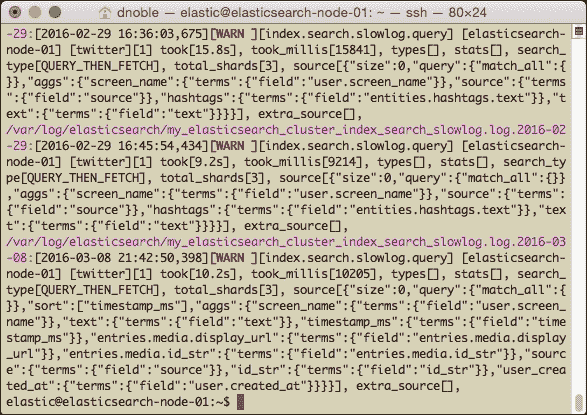
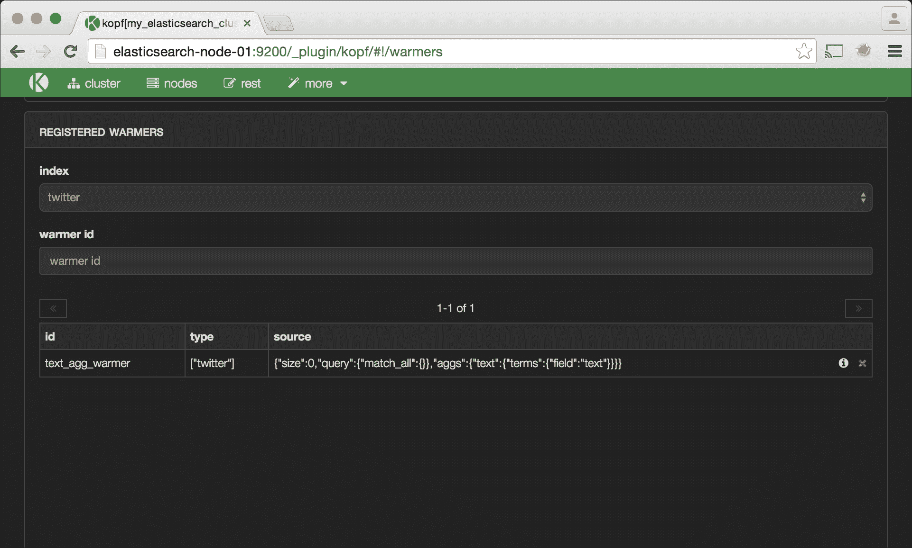
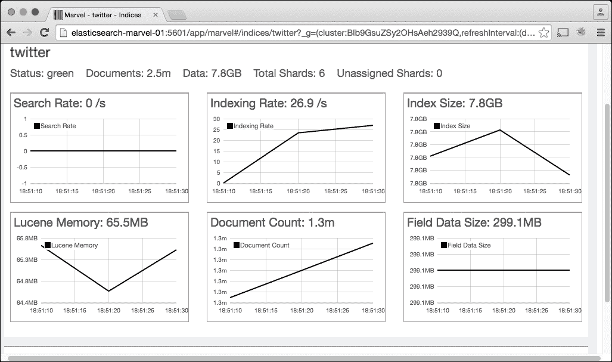
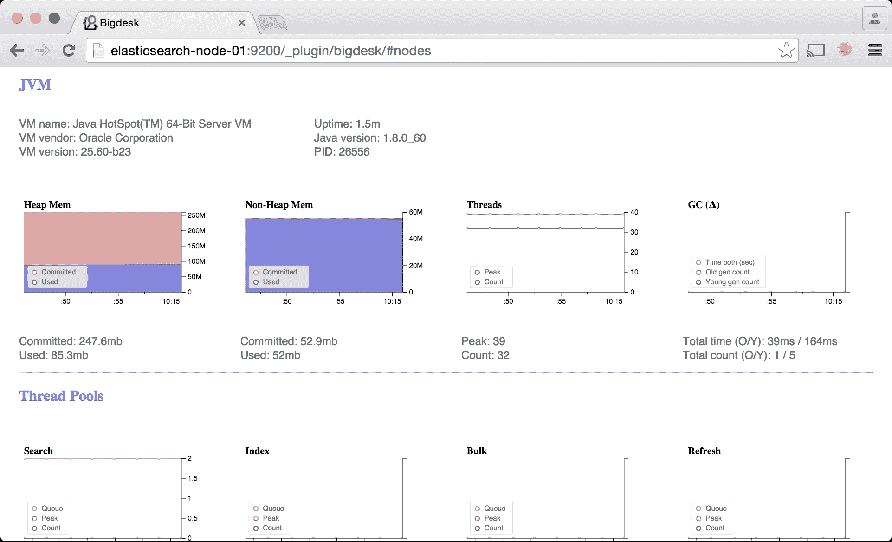

# 第六章。性能和可靠性问题的故障排除

本章通过使用真实世界案例研究的案例研究，重点介绍 Elasticsearch 常见的性能和可靠性问题的故障排除。

本章将帮助回答以下问题：

+   我该如何配置我的 Elasticsearch 集群以优化性能？

+   我该如何防止`OutOfMemoryError`异常？

+   我的数据索引策略如何影响集群资源？

+   为什么我的查询运行得慢？

+   在索引大量数据时，我该如何保持查询性能？

+   我该如何配置索引以使用更少的磁盘空间？

# 系统配置

如第二章所述，Elasticsearch 配置可能导致许多性能和可靠性问题。快速提醒：您需要为您的集群进行的最重要的配置更改如下：

+   确保 Elasticsearch 堆大小（`ES_HEAP`）设置为可用系统内存的 1/2，但不超过 31 GB。请在`/etc/defaults/elasticsearch`中设置此值。

+   禁用内存交换。

+   通过在`elasticsearch.yml`中设置`bootstrap.mlockall: true`将 Elasticsearch 地址空间锁定到内存中。

请参阅第二章，*Elasticsearch 的安装和需求*，以获取如何设置这些值的更详细说明。

# 字段数据缓存

配置不当的 Elasticsearch 字段数据缓存通常是`OutOfMemoryError`异常的原因。

当运行`sort`或`aggregation`（或`facet`）查询时，Elasticsearch 会使用查询中所有不同的字段值填充缓存。这允许类似的后续查询执行得更快。然而，默认情况下，Elasticsearch 不会对缓存大小设置上限；因此，数据不会自动被驱逐。如果缓存导致总 JVM 内存填满超过`ES_HEAP`大小，节点将抛出`OutOfMemoryError`异常，并需要重新启动 Elasticsearch。

要限制字段数据缓存大小，请设置`indices.fielddata.cache.size`值：

```java
indices.fielddata.cache.size: 30%
```

这将限制字段数据缓存大小为可用 JVM 堆空间的`30%`。

您也可以将此值设置为固定值。例如，将其设置为`10gb`将限制缓存大小不超过 10 千兆字节。您选择的价值将取决于集群和用例，但如果您看到由字段数据缓存溢出引起的`OutOfMemoryError`，设置此字段是个好主意。限制字段数据缓存的缺点是，如果查询需要重新填充被驱逐的字段数据缓存项，这可能会影响查询性能。

如果您在`/var/log/elasticsearch/`中看到`OutOfMemoryError`日志，您可以通过检查 Bigdesk 或 Marvel 来确认字段数据缓存是否是问题。


Bigdesk 中的字段数据缓存

Marvel Kibana 仪表板中的字段数据缓存看起来像这样：


Marvel 中的字段数据缓存

### 小贴士

不要更改`indices.fielddata.cache.expire`设置。这是一个过时的设置，用于使旧缓存值过期，并且它不会提供任何性能提升。Elasticsearch 开发人员表示，它将在未来的版本中弃用。

你还可以通过优化使用缓存的查询来减少字段数据缓存的影响。

例如，在我们的 Twitter 数据中，我们有一个`timestamp_ms`字段，它以毫秒精度存储推文的日期时间戳。因为一天中有`86,400,000`毫秒，如果我们收集了 24 小时内的`5,000,000`条推文，那么其中大部分推文很可能具有唯一的时间戳。如果我们运行一个按此字段排序的查询，它将用多达`5,000,000`个不同的时间戳填满字段数据缓存。这将迅速填满缓存。

更功能性的方法是将时间戳字段存储在秒或分钟精度。使用秒精度，字段数据缓存将减少从存储`5,000,000`个唯一时间戳到大约`86,400`个时间戳。使用分钟精度将减少到只有`1,440`个唯一时间戳。

即使将字段数据缓存大小限制为固定值，你也可能仍然会遇到与字段缓存相关的`OutOfMemoryError`异常。这可能是由于单个查询加载的字段数据缓存比分配的更多数据所致。

例如，如果字段数据缓存设置为 2 GB，但我们运行一个尝试将 2.5 GB 数据加载到缓存中的单个查询，可能会发生这种情况。可以通过编辑`elasticsearch.yml`中的字段数据断路器来解决这个问题。

字段数据断路器默认设置为总 JVM 堆大小的`60%`：

```java
indices.breaker.fielddata.limit: 60%
```

这样，如果单个查询的字段数据超过堆的`60%`，断路器将会触发，导致查询抛出异常，而不是引发`OutOfMemoryError`。使用低于默认`60%`的百分比可能有助于解决即使字段数据缓存大小有限时出现的`OutOfMemoryError`异常。

# 分析查询

分析慢查询并提高其性能可能非常具有挑战性。本节探讨了如何寻找查询性能不佳的根本原因，并提供了一些不同的解决方案。

## 慢查询日志

如果你注意到查询性能不佳，请从慢查询日志开始。要启用慢查询日志，请编辑`elasticsearch.yml`文件，并将以下配置选项添加到集群中的所有节点：

```java
index.search.slowlog.threshold.query.warn: 8s
index.search.slowlog.threshold.query.info: 4s
index.search.slowlog.threshold.query.debug: 2s
index.search.slowlog.threshold.query.trace: 500ms

index.search.slowlog.threshold.fetch.warn: 1s
index.search.slowlog.threshold.fetch.info: 750ms
index.search.slowlog.threshold.fetch.debug: 500ms
index.search.slowlog.threshold.fetch.trace: 250ms

index.indexing.slowlog.threshold.index.warn: 8s 
index.indexing.slowlog.threshold.index.info: 4s 
index.indexing.slowlog.threshold.index.debug: 2s 
index.indexing.slowlog.threshold.index.trace: 500ms
index.indexing.slowlog.level: info
index.indexing.slowlog.source: 5000
```

在所有节点上更新`elasticsearch.yml`后，重启集群。

此配置为三个操作启用了慢查询日志：

+   **查询操作**：这是 Elasticsearch 正在执行实际搜索以匹配查询的文档时的情况

+   **获取操作**：这是在 Elasticsearch 找到感兴趣的文档后从索引中获取相关文档时的情况

+   **索引操作**：这是在 Elasticsearch 中索引新文档时的情况

我们还为每个点设置了一个阈值级别：`warn`、`info`、`debug`和`trace`。这些级别标识了 Elasticsearch 将写入慢日志的点。例如，如果一个查询耗时六秒，根据我们之前的配置，该查询将以`info`级别记录。这些级别使得搜索特定阈值的查询成为可能。

以下是一个搜索慢日志中所有耗时超过八秒且以`warn`级别记录的查询的示例：

```java
grep "\[WARN \]"  /var/log/elasticsearch/my_elasticsearch_cluster_*_slowlog.log*
```



耗时超过八秒的 Elasticsearch 慢日志

下一个部分将介绍一些额外的改进查询性能的方法。

# 提高查询性能

本节突出了 Elasticsearch 上某些查询缓慢的常见原因，并提供了提高性能的指导。

## 高基数字段

如前所述，对高基数字段（例如，精确到毫秒的日期）运行聚合或排序可能会填满 fielddata 缓存，导致`OutOfMemoryError`异常。然而，即使没有这些错误，运行聚合和排序也可能对性能产生不利影响。当涉及到日期时，通常存储和使用不太精确的日期以加快查询执行时间是一个好主意。

## 查询较小的索引

随着 Elasticsearch 索引的增大，查询性能将受到影响。提高性能的另一种方法是针对小索引运行查询。你可以通过将我们的数据存储在几个较小的索引中而不是一个大的索引中来实现这一点。

例如，对于 Twitter 数据，你可以更改摄取过程，每天创建一个新的索引来存储推文。这样，在运行时间限制查询时，我们只查询总索引的一个子集。

在这种情况下，索引模板很有帮助，因为它们会自动将数据映射应用到遵循特定命名约定的新索引上。

让我们使用`twitter-YYmmdd`命名约定为我们的日常 Twitter 索引创建一个新的索引模板。使用此模板，`twitter-20160101`索引将包含 2016 年 1 月 1 日所有的推文。使用以下`cur` `l`命令创建此模板：

```java
curl -XPUT elasticsearch-node-01:9200/_template/templ
ate_1 -d '
{
 "template" : "twitter-*",
 "settings" : {
 "number_of_shards" : 5
 },
 "mappings" : {
 "twitter" : {
 "status" : { 
 ...
 }
 ...
 }
 }
}'

```

### 小贴士

注意`twitter-*`模板名称中使用的`*`星号通配符。这个通配符匹配 0 个或多个字符，因此它将匹配索引名称，例如`twitter-20160101`。

我们还可以创建一个索引别名，允许我们一次性查询多个或所有索引。

以下示例使用`*`通配符创建一个别名，以查询所有可用的 Twitter 数据：

```java
curl -XPOST elasticsearch-node-01:9200/_aliases -d '{
 "actions" : [
 { "add" : { "index" : "twitter-*", "alias" : "all_twitter" } }
 ]
}'

```

通过尝试不同的索引大小来找到最适合您数据和设置的方案。在确定特定的索引大小之前，测试它们对性能的影响是很重要的，因为稍后更改索引策略将涉及重新索引所有数据。

如果您有一个五节点集群并且每天收集 10,000 条记录，那么按月而不是按日创建新索引是有意义的，这样可以减少索引数量并确保每个单独的索引不会太小。然而，在确定索引策略之前测试所有假设是很重要的。在做出这个决定之前，使用 Logstash 和 Kibana 等工具监控不同索引大小下的平均查询性能。

## 冷索引

有时，Elasticsearch 查询在第一次运行时速度较慢，但之后会显著加快。延迟发生是因为索引是“冷”的，并且 Elasticsearch 缓存中没有填充相关数据。运行查询几次后，Elasticsearch 会根据查询标准填充 fielddata 缓存和其他缓存。具有相似标准的后续查询将利用这些缓存值并因此运行得更快。

Elasticsearch 的“预热器”和“急切字段数据加载”通过确保用户第一次运行查询时，所需数据已经加载到内存中，从而解决了冷索引的问题。

索引可能因为多种原因而变冷：

+   新数据被索引

+   自动分片平衡和移动

+   Elasticsearch 节点重启

+   缓存已被手动清除

要展示慢聚合查询的性能提升，请使用以下命令：

```java
curl -XPOST 'http://elasticsearch-node-01:9200/twitter/_cache/clear'

curl -XGET 'http://elasticsearch-node-01:9200/twitter/_search' -d '{
 "size" : 0,
 "query" : {
 "match_all" : {}
 },
 "aggs" : {
 "text" : {
 "terms" : {
 "field" : "text"
 }
 } 
 }
}' | python -m json.tool

```

结果如下：

```java
{
 ...
 "took": 5864
 ...
}

```

如果我们再运行几次查询，我们将开始看到以下结果：

```java
{
 ...
 "took": 529
 ...
}

```

这个查询最初花费了 `5.8` 秒来完成，但经过几次运行后，它只用了 `0.529` 秒。通过将常见查询添加到 Elasticsearch 预热器中，可以避免初始的慢查询，并且性能可以变得更加可预测。我们将通过再次清除索引缓存，然后使用 Elasticsearch 预热器 API 将我们的查询添加到 `twitter` 索引中，来展示这一点：

```java
curl -XPOST 'http://elasticsearch-node-01:9200/twitter/_cache/clear'

curl -XPUT http://elasticsearch-node-01:9200/twitter/twitter/_warmer/text_agg_warmer?pretty -d '{
 "size" : 0,
 "query" : {
 "match_all" : {}
 },
 "aggs" : {
 "text" : {
 "terms" : {
 "field" : "text"
 }
 } 
 }
}'

```

我们可以通过检查 Kopf 的 `http://elasticsearch-node-01:9200/_plugin/kopf` 上的 **REGISTERED WARMERS** 页面并导航到 **更多** | **预热器** 来验证预热查询是否已进入我们的索引。

这张截图显示了 Kopf 预热器页面上的预热查询：



在 Kopf 中查看查询预热器

预热器将在重启 Elasticsearch 后生效。再次运行查询以查看性能提升：

```java
{
 ...
 "took": 418
 ...
}

```

这导致了超过 10 倍的速度提升，从 `5.8` 秒到 `0.41` 秒。我们在手动运行查询几次以填充来自 `text` 字段的数据的 fielddata 缓存后，看到了类似的增长。

我们还可以为特定的 Elasticsearch 字段启用急切字段数据加载：

```java
curl -XPUT http://elasticsearch-node-01:9200/twitter/_mapping/twitter -d '{
 "text": {
 "type" : "string",
 "doc_values" : true,
 "fielddata" : {
 "loading" : "eager" 
 }
 }
}'

```

如果我们的 fielddata 缓存只有少数几个不同的值，将`loading`值设置为`eager_global_ordinals`以进行更多的内存优化。在启用预热查询或急切 fielddata 加载后，通过检查 Marvel 的节点或索引统计页面或 Bigdesk 的 fielddata 图表来验证 fielddata（在预热查询的情况下还包括过滤器缓存）是否已填充。

### 注意

你可以在[`www.elastic.co/guide/en/elasticsearch/reference/current/indices-warmers.htmlload-fielddata.html`](https://www.elastic.co/guide/en/elasticsearch/reference/current/indices-warmers.html)和[`www.elastic.co/guide/en/elasticsearch/guide/current/preload-fielddata.html`](https://www.elastic.co/guide/en/elasticsearch/guide/current/preload-fielddata.html)了解更多关于预热器和急切字段数据加载的信息。

## 分片查询缓存

分片查询缓存为特定查询保存结果。与 fielddata 缓存不同，任何需要 fielddata 的查询都会加速，使用缓存的查询，我们必须运行完全相同的查询多次才能产生缓存命中。此外，整个查询结果都存储在查询缓存中。这与 fielddata 缓存不同，其中只存储查询结果的一部分。这意味着查询缓存将返回极快的结果。

分片查询缓存目前仅存储命中次数、聚合和搜索建议。它不存储实际的搜索结果或命中。此外，当运行缓存的查询时，需要`search_type=count`查询参数。这可能在未来的 Elasticsearch 版本中更新。

查询缓存默认为 JVM 堆的`1%`，但可以在`elasticsearch.yml`中更改：

```java
indices.cache.query.size: 2%
```

缓存键是搜索请求的 JSON 正文。即使查询在逻辑上与缓存中已有的查询相同，如果存在空白或键顺序的差异，缓存也会将这些存储为两个不同的条目。

默认情况下禁用分片查询缓存。要在现有索引上启用它，请运行以下命令：

```java
curl -XPUT elasticsearch-node-01:9200/twitter/_settings?pretty -d'{
 "index.cache.query.enable": true 
}'

```

或者当创建一个新的索引时，将相同的参数添加到`settings`部分：

```java
curl -XPUT elasticsearch-node-01:9200/twitter -d'
{
 ...
 "settings": {
 "index.cache.query.enable": true
 },
 ...
}'

```

当使用查询缓存时，你将始终收到与运行非缓存的查询时相同的最新查询结果。这是因为当分片刷新并加载新数据时，缓存条目会自动失效。

再次运行文本聚合查询几次，这次使用查询缓存：

```java
curl -XGET 'elasticsearch-node-01:9200/twitter/_search?search_type=count&query_cache=true' -d '{
 "size" : 2,
 "query" : {
 "match_all" : {}
 },
 "aggs" : {
 "text" : {
 "terms" : {
 "field" : "text"
 }
 } 
 }
}' | python -m json.tool

```

在运行几次此查询后，应出现如下性能结果：

```java
{
 ...
 "took": 4
 ...
}

```

`4ms`的响应时间比仅使用 fielddata 缓存的`418ms`响应时间有所改进，并且与原始的`5.8`秒相比，对冷 Elasticsearch 索引的响应时间有巨大的改进。

### 注意

在[`www.elastic.co/guide/en/elasticsearch/reference/current/shard-request-cache.html`](https://www.elastic.co/guide/en/elasticsearch/reference/current/shard-request-cache.html)了解更多关于分片查询缓存的信息。

## 脚本查询

脚本查询是通过运行任意代码来操作或过滤查询遇到的每个命中项，从而查询索引的一种强大方式。然而，它们也非常昂贵，并且可能会损害大型索引的性能。

在可能的情况下，最好避免在需要及时返回结果的 Elasticsearch 查询中使用脚本。如果你发现自己正在使用它们，尝试思考如何重新结构你的数据，使它们不再必要。

### 注意

如果你在应用程序中使用脚本，请确保使用 `doc["text"]` 而不是 `_source.text` 来访问源文档字段；后者将访问磁盘上的记录，而前者从内存中访问。

## 仔细测试

仔细测试每个优化策略非常重要，以了解哪种策略最有效。如果你遇到慢查询，尝试在小规模上重现问题并测试不同的优化，直到找到一种有效的方法。确保你一次只测试配置或查询参数中的一个更改。此外，运行测试脚本足够长的时间，以考虑到垃圾收集、缓存驱逐等因素引起的性能的正常波动。

这种测试方法可能感觉繁琐，但它最终将提供对集群的更深入了解，并有助于长期避免对系统进行不必要的更改。

# 系统和数据架构

本节涵盖了提高整体系统性能、数据索引性能以及最大化存储空间的策略。

## 热温架构

对于时间序列数据，包括 Twitter 和其他社交媒体数据以及来自 Logstash 的数据，Elastic.co 建议设置他们称之为**热-温**架构。这种设置将节点分为三组。

### 主节点

理想情况下，分配三个节点作为主节点，这些节点不存储数据或执行查询。这些机器不需要非常强大；它们只是执行集群管理操作。

### 热节点

热节点持有最新的数据索引。所有数据写入都指向这些机器，它们可能是查询最频繁的节点。Elastic.co 建议为热节点配备固态硬盘（SSD）以获得更好的 I/O 性能。

### 热节点

在这种架构中，数据不会被写入热节点；相反，它们包含基于历史时间的数据。例如，如果我们每天创建一个新的 Twitter 索引，我们可以在七天后将索引从“热”移动到“温”。

要配置热节点，请将以下内容添加到 `elasticsearch.yml`：

```java
node.box_type: hot
```

同样，对于温节点，添加以下内容：

```java
node.box_type: warm
```

要确保新创建的索引分配给热节点，请在创建索引时使用以下配置：

```java
curl -XPUT elasticsearch-node-01:9200/twitter-2016-03-06
{
 ...
 "settings": {
 "index.routing.allocation.require.box_type" : "hot"
 }
 ...
}

```

在七天后将它移动到温节点后，使用以下内容：

```java
curl -XPOST elasticsearch-node-01:9200/twitter-2016-03-06/_settings -d '{
 "settings": {
 "index.routing.allocation.require.box_type" : "warm"
 }
}'

```

在[`www.elastic.co/blog/hot-warm-architecture`](https://www.elastic.co/blog/hot-warm-architecture)上了解更多关于“热-温”架构的信息。

## 减少磁盘大小

本节介绍了如何在你的集群上节省磁盘空间。

### 压缩

在 Elasticsearch 2.0 及以上版本中，你可以提高索引的压缩级别以减少其在磁盘上的占用。遗憾的是，这也使得索引新数据变得更慢。

对于如前所述的 Hot-Warm 架构用例，在 Warm 节点上提高压缩级别是有意义的，因为它们比 Hot 节点承受的压力小。

要在 Elasticsearch 2.0+节点上提高压缩级别，请执行以下操作：

1.  关闭索引。

1.  将`index.codec`设置配置为`best_compression`。

1.  重新打开索引。

```java
curl -XPOST elasticsearch-node-01:9200/twitter/_close
curl -XPUT elasticsearch-node-01:9200/twitter/_settings -d '{
 "settings": {
 "index.codec": "best_compression"
 }
}'
curl -XP
OST elasticsearch-node-01:9200/twitter/_open

```

### 存储`_source`和已分析字段

默认情况下，Elasticesarch 将所有传递给它的文档存储在`_source`字段中，并将所有字段设置为`analyzed`。这意味着一些基本的分词器会在字段上运行。如果我们决定在我们的系统中将文档存储在其他地方，或者我们可以禁用`_source`字段并将我们想要检索的各个字段设置为`store: true`，这样可以节省一些磁盘空间。

对于`分析`字段，仔细考虑你将如何使用你的数据，如果你不需要对其进行分词，请将字段设置为`index: not_analyzed`。电子邮件地址、IP 地址、社交媒体用户名或其他我们不希望拆分的字段应设置为`not_analyzed`。

创建一个新的索引，禁用`_source`，并将一些字段设置为`not_analyzed`：

```java
curl -XPOST elasticsearch-node-01:9200/newindex -d '{
 "mappings" : {
 "newtype" : {
 "_source" : {
 "enabled" : false
 },
 "properties" : {
 "username" : { 
 "type" : "string", 
 "index" : "not_analyzed",
 "store" : true
 },
 "text" : { 
 "type" : "string"
 }
 }
 }
 }
}'

```

很遗憾，禁用`_source`字段有一些相当大的缺点。除了在查询期间无法检索完整源之外，以下功能仅在启用`_source`时才受支持：

+   Elasticsearch 更新 API

+   Elasticsearch 高亮显示

+   许多重新索引数据的工具和策略

如果磁盘空间是一个主要问题，首先检查启用数据压缩是否能够满足你的存储需求，然后再禁用`_source`字段。

## 优化数据摄取

本节介绍了提高数据摄取的一些额外方法。在这些方法中，监控数据摄取速率非常重要，以确保变化对性能产生预期的效果。

如前所述，一次测试一个变化，并运行足够长的时间以获得有意义的成果。监控摄取性能的最佳位置是在 Marvel 的*索引*仪表板中选择感兴趣的索引。

以下截图显示了我们的`twitter`数据索引的 Marvel 索引仪表板：



Marvel 索引请求

在你对数据摄取操作进行更改时，监控此页面。这将允许你实时查看变化如何影响索引速率，并且你可以参考过去的索引速率指标。

### 批量索引操作

对于批量索引操作，测试不同的摄取大小，并在 Marvel 中监控它们，直到找到最佳大小。例如，在`1MB`、`5MB`、`10MB`、`15MB`和`20MB`上运行测试，直到找到最佳值。如果您运行每日摄取作业，考虑在非高峰时段运行它们，以便结果放缓影响较少的用户。

在将数据插入 Elasticsearch 后，用户能看到数据之前，索引必须刷新。默认情况下，刷新间隔设置为每秒一次。这意味着在索引一个文档后，它将在一秒内出现在搜索结果中。

在大规模索引操作期间，每秒刷新一次可能会损害性能。如果您的系统不需要在索引后立即显示新结果，将刷新率降低到`10s`或`30s`是有价值的。

将刷新率设置为`-1`将完全禁用刷新。这对于非常大的、一次性的或不太频繁的周期性索引操作非常有用。记住，之后要启用索引刷新。

要禁用索引刷新，请使用以下命令：

```java
curl -XPUT elasticsearch-node-01:9200/twitter/_settings -d '{
 "index" : {
 "refresh_interval" : "-1"
 }
}'

```

之后启用索引刷新：

```java
curl -XPUT elasticsearch-node-01:9200/twitter/_settings -d '{
 "index" : {
 "refresh_interval" : "5s"
 }
}'

```

每次索引刷新时都会运行预热查询。另一个选项是保持索引刷新开启，在大规模索引操作期间禁用预热查询，然后在索引作业完成后重新启用预热。

禁用索引预热：

```java
curl -XPUT elasticsearch-node-01:9200/twitter/_settings -d '{
 "settings" : {
 "index.warmer.enabled" : "false"
 }
}'

```

重新启用索引预热：

```java
curl -XPUT elasticsearch-node-01:9200/twitter/_settings -d '{
 "settings"
 : {
 "index.warmer.enabled" : "true"
 }
}'

```

### 驱动器配置

在“热-温”架构部分中，我们提到 SSD 非常适合数据索引性能。即使您不使用“热-温”架构，也考虑在您的 Elasticsearch 集群的数据节点上使用 SSD。

如果 SSD 不是选项之一，考虑使用配置为**RAID 0**的快速硬盘（10,000+ RPM）。记住，RAID 0 是为了性能而不是可靠性，但 Elasticsearch 的数据副本足以保证数据可靠性。

最好避免在网络上存储数据。如果您在虚拟机上运行 Elasticsearch 集群，请确保它们使用本地磁盘进行存储。

# 案例研究

本节提供了一些实际的问题场景和解决方案，以使用 Elasticsearch。

## 节点配置

您有一个五节点生产集群，每个节点总共有`32GB`的内存，其中`16GB`分配给了 Elasticsearch。最近，您注意到一个问题：每隔几天，`node-05`会无预警地离开集群。在这个节点上重启 Elasticsearch 可以暂时解决问题，但几天后节点会再次从集群中掉出。我们如何着手调查这个问题？

下次出现此错误时，在重启节点之前检查 Elasticsearch 日志：

```java
tail -n 500  /var/log/elasticsearch/*.log
```

您在日志文件中注意到 Elasticsearch 正在抛出`OutOfMemoryError`异常，如下所示：

```java
Caused by: java.lang.OutOfMemoryError: Java heap space
        at org.apache.lucene.store.DataOutput.copyBytes(DataOutput.java:273)
        at org.apache.lucene.util.fst.FST.<init>(FST.java:342)
        at org.apache.lucene.util.fst.FST.<init>(FST.java:321)
```

您知道耗尽 fielddata 可能会导致`OutOfMemoryError`异常，因此检查`elasticsearch.yml`文件后，您发现以下内容：

```java
# indices.fielddata.cache.size: 30%
```

缓存设置被注释掉了。取消注释这一行并重启 Elasticsearch 节点。这看起来似乎解决了问题。然而，两周后，`node-05`又出现了另一个`OutOfMemoryError`。在重启节点后，登录 Bigdesk 以获取洞察。点击`node-05`，你将看到以下情况：



Bigdesk 中的 JVM 内存

看起来 Elasticsearch 并没有使用太多可用内存，但这可能是因为节点刚刚重启。

注意，`node-05`可用的最大堆内存只有大约`250MB`。考虑到主机有`32GB`的系统内存，这很奇怪。在这个时候，你想要确保`ES_HEAP`变量被正确设置。打开以下文件：

```java
/etc/default/elasticsearch
```

你将看到以下情况：

```java
# ES_HEAP_SIZE=16g
```

看起来这个配置，比如`indices.fielddata.cache.size`，也被注释掉了。取消注释这一行并重启 Elasticsearch 将节点的总可用内存提升到`16GB`，并消除了`OutOfMemoryError`异常。

如前所述，节点配置错误是导致 Elasticsearch 性能不佳或崩溃的最常见原因之一。在做出配置更改后，验证每个配置更改是很重要的。

## 查询优化

你在公司的一个内部企业级 Elasticsearch Web 应用程序中发现了问题。一大早，Web 应用程序加载查询结果需要很长时间。只有在运行几个查询后，性能才开始提升。

为了解决这个问题，查看慢日志。在某个节点中，你看到一条运行时间为`4.7`秒的查询，作为日志中的`INFO`事件：

```java
[2016-02-29 16:52:43,569][INFO ][index.search.slowlog.query] [elasticsearch-node-03] [twitter][1] took[4.7s], took_millis[4709], types[], stats[], search_type[QUERY_THEN_FETCH], total_shards[3], source[{"size":0,"query":{"match_all":{}},"aggs":{"screen_name":{"terms":{"field":"user.screen_name"}},"text":{"terms":{"field":"text"}}}}], extra_source[],
```

### 注意

慢日志不一定会在所有节点上写入条目，所以请检查每个主机的日志。

使用`python -m json.tool`来美化打印查询：

```java
echo '{"size":0,"query":{"match_all":{}},"aggs":{"screen_name":{"terms":{"field":"user.screen_name"}},"text":{"terms":{"field":"text"}}}}' | python -m json.tool

```

你将看到以下内容：

```java
{
 "aggs": {
 "screen_name": {
 "terms": {
 "field": "user.screen_name"
 }
 },
 "text": {
 "terms": {
 "field": "text"
 }
 }
 },
 "query": {
 "match_all": {}
 },
 "size": 0
}

```

这个`aggs`参数可能意味着这个查询大量使用了字段数据缓存。诊断这个查询并找出导致性能问题的原因。

首先，清除字段数据缓存以确保结果一致：

```java
curl -XPOST 'http://elasticsearch-node-01:9200/twitter/_cache/clear'

```

现在，按照以下方式运行查询：

```java
curl -XGET 'http://elasticsearch-node-01:9200/twitter/_search' -d '{
 "size" : 0,
 "query" : {
 "match_all" : {}
 },
 "aggs" : {
 "screen_name" : {
 "terms" : {
 "field" : "user.screen_name"
 }
 },
 "text" : {
 "terms" : {
 "field" : "text"
 }
 } 
 }
}' | python -m json.tool

```

结果将如下：

```java
{
 ...
 "took": 4183
 ...
}

```

在运行查询几次以确保所需值在字段数据缓存中后，查询大约在`.6`秒内完成。这是一个相当好的改进。请使用 Bigdesk 或 Marvel（参考图像中的 Bigdesk 和 Marvel 的字段数据缓存）验证字段数据缓存现在是否已填充。

字段数据缓存可能因为新数据的摄入或分片夜间迁移而被清空。为了解决这个问题，在 Elasticsearch 映射中启用`user.screen_name`和`text`字段的急切字段数据加载。

然而，这个查询的性能仍然不佳。再次检查慢日志，我们注意到它仍然触发一个`TRACE`事件：

```java
[2016-02-29 16:54:20,069][TRACE][index.search.slowlog.query] [elasticsearch-node-03] [twitter][1] took[680ms], took_millis[680], types[], stats[], search_type[QUERY_THEN_FETCH], total_shards[3], source[{"size":0,"query":{"match_all":{}},"aggs":{"screen_name":{"terms":{"field":"user.screen_name"}},"text":{"terms":{"field":"text"}}}}], extra_source[],
```

为了找出为什么即使 fielddata 缓存已填充，这个查询仍然需要超过 0.5 秒来运行，将查询分解为单独的查询——一个运行`text`聚合，另一个运行`screen_name`聚合：

```java
curl -XGET 'http://elasticsearch-node-01:9200/twitter/_search' -d '{
 "size" : 0,
 "query" : {
 "match_all" : {}
 },
 "aggs" : {
 "text" : {
 "terms" : {
 "field" : "text"
 }
 } 
 }
}' | python -m json.tool

```

这个查询运行大约需要`.4`秒：

```java
curl -XGET 'http://elasticsearch-node-01:9200/twitter/_search' -d '{
 "size" : 0,
 "query" : {
 "match_all" : {}
 },
 "aggs" : {
 "screen_name" : {
 "terms" : {
 "field" : "user.screen_name"
 }
 } 
 }
}' | python -m json.tool

```

这个查询运行时间为`.08`秒；这比`text`聚合查询有巨大的改进。

既然我们已经确定`text`聚合是查询中的慢速部分，考虑移除该操作并寻找另一个能产生类似结果的解决方案。尽管这取决于聚合的使用目的，但在低基数字段上进行聚合可能是一个合适的解决方案。例如，如果`text`聚合用于构建词云，可以考虑使用`entities.hashtags.text`标签字段来获取类似的结果。

另一个选项是保留`text`聚合，但定期在后台运行并缓存结果。

最后，考虑在这个查询上使用分片查询缓存。由于没有返回查询（`size=0`），我们可以启用`search_type=count`和`query_cache=true`参数来缓存聚合结果。

## 网络应用程序性能

你正在开发一个网络应用程序，该应用程序在 Elasticsearch 索引中搜索 Twitter 数据。除了在搜索结果页面上显示推文外，你还想显示：

+   随时间推移的推文活动

+   结果中的顶级用户

+   结果中的顶级标签

+   顶级用户提及

我们可以使用 Elasticsearch 聚合来实现所有这些项目，但这些操作的成本远高于简单地运行一个搜索查询。

为了加快页面加载时间，我们将它分为两个 AJAX 请求：一个用于结果查询，另一个用于所有聚合查询。这两个查询都是 AJAX 请求，这意味着页面将立即加载。查询结果将随后出现，聚合结果将最后加载。因为聚合查询不返回任何命中项，我们可以设置参数`search_type=count`和`query_cache=true`来缓存聚合以供未来查询使用。

在翻页结果时，确保只查询命中项，而不是聚合结果。聚合结果将保持不变，无论查看的是哪一页数据。

# 摘要

本章讨论了在使用 Elasticsearch 时出现的一些常见性能和可靠性问题。为了重申本章的一些主要观点：

+   总是仔细检查 Elasticsearch 集群的配置以查找错误

+   设置 fielddata 缓存大小，特别是如果你看到`OutOfMemoryError`异常

+   使用慢日志来查找在您的集群上运行缓慢的查询

+   避免在高基数字段（如毫秒级时间戳）上进行聚合

+   注意你的数据索引策略，以确保没有索引变得过大

+   使用索引预热器或启用`eager_global_ordinals`以确保首次运行使用 fielddata 缓存的查询速度快

+   如果可能的话，在索引数据的节点上使用 SSD，并避免在网络上存储 Elasticsearch 索引。

最重要的是，在诊断 Elasticsearch 问题时，要仔细在每个阶段进行测试。例如，在再次运行查询之前，不要试图通过修改`elasticsearch.yml`、修改查询条件以及启用索引`warmers`来同时优化查询。一次测试一个变量，以便在决定如何修复问题之前精确地找出问题所在。

下一章讨论了如何在节点故障发生后如何理解和修复它们。
