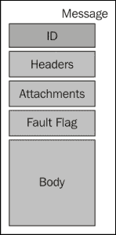
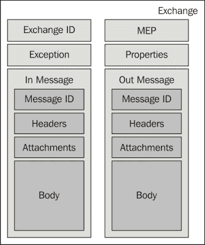
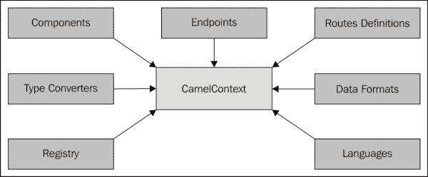
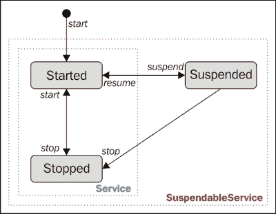
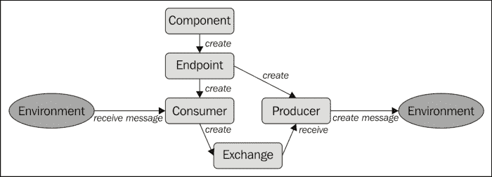

# 第二章：核心概念

本章介绍了 Camel 的核心概念。这些概念是 Camel 提供所有功能的关键基础。我们将在下一章中使用它们。正如我们在上一章中看到的，Camel 是一个集成框架。这意味着它提供了实现您的中介逻辑所需的一切：消息传递、路由、转换和连接性。

我们将探讨以下概念：

+   消息

+   交换

+   Camel 上下文

# 消息

消息在中介逻辑的不同部分之间传输数据。您的中介逻辑将定义不同节点之间消息的流动。

消息单向流动，从发送者到接收者。不可能使用同一个消息来回答发送者，我们不得不使用另一个消息。消息由`org.apache.camel.Message`接口描述。

javadoc 可在[`camel.apache.org/maven/camel-2.13.0/camel-core/apidocs/org/apache/camel/Message.html`](http://camel.apache.org/maven/camel-2.13.0/camel-core/apidocs/org/apache/camel/Message.html)找到。

一个消息包含以下内容：

+   ID：一个类型为`String`的消息 ID。Camel 为您创建一个 ID。此 ID 标识消息，可用于关联或存储。例如，我们将看到消息 ID 在幂等消费者模式中用于在存储中标识消息。

+   标题：一组标题，允许您存储与消息相关联的任何类型的数据。默认情况下，标题存储为`org.apache.camel.util.CaseInsensitiveMap`。`CaseInsensitiveMap`([`camel.apache.org/maven/camel-2.13.0/camel-core/apidocs/org/apache/camel/util/CaseInsensitiveMap.html`](http://camel.apache.org/maven/camel-2.13.0/camel-core/apidocs/org/apache/camel/util/CaseInsensitiveMap.html))扩展了`HashMap<String,Object>`。这意味着您可以在标题中存储任何类型的对象（包括非常大的对象）。要访问该映射，请使用一个`String`键，它是不区分大小写的。标题的寿命与消息相同（因为标题本身就是消息的一部分）。标题的目的是添加有关内容编码、认证信息等内容的信息。正如我们将在下一章中看到的，Camel 本身会使用并填充标题以满足其自身的需求和配置。

+   附件：一组附件主要用于满足某些协议和组件的需求：WebService 组件（提供 SOAP 消息传输优化机制（MTOM）支持）或电子邮件组件（提供对电子邮件附件的支持）。附件仅由一些专用组件使用，它们不像标题那样被广泛使用。附件以`Map<String,DataHandler>`的形式存储在消息中。附件名称是一个`String`，它是区分大小写的。附件使用`DataHandler`存储，它提供对 MIME 类型和数据的统一访问。

+   故障标志：一个允许您区分消息是正常消息还是故障消息的布尔值。它允许某些组件或模式以不同的方式处理消息。例如，消息可能包含一个 SOAP 错误，而不是 SOAP 响应。在这种情况下，我们必须通知组件，包含 SOAP 错误的消息不是正常消息。

+   主体：主体是消息的实际有效负载。主体存储为消息中的`Object`，允许您存储任何类型的数据。在第一章中，我们看到了 Camel 的一个关键特性是负载无关性。主体直接是`Object`的事实是负载无关性特性的实现。

# Exchange

骆驼不直接传输消息。主要原因是一个消息只能单向流动。在处理消息时，我们可以使用许多消息交换模式（MEP）。

根据用例，我们可以发送消息而不期望从目的地得到任何返回：这种模式被称为事件消息，并使用 InOnlyMEP。例如，当您从文件系统中读取文件时，您只需处理文件内容，而不向读取文件的端点返回任何内容。在这种情况下，负责读取文件系统的组件将定义一个 InOnlyMEP。

另一方面，您可能想实现一个请求回复模式：响应消息应该返回给请求消息的发送者，因此它使用 InOutMEP。例如，您从 WebService 组件接收一个 SOAP 请求，因此您应该向消息发送者返回一个 SOAP 响应（或 SOAP 错误）。

在 Camel 中，MEP 在`org.apache.camel.ExchangePattern`枚举中描述（[`camel.apache.org/maven/current/camel-core/apidocs/org/apache/camel/ExchangePattern.html`](http://camel.apache.org/maven/current/camel-core/apidocs/org/apache/camel/ExchangePattern.html)）。我们可以看到 Camel 支持以下 MEP：

+   InOnly

+   InOptionalOut

+   InOut

+   OutIn

+   OutOptionalIn

+   RobustInOnly

+   RobustOutOnly

由于消息只在一个方向上流动，为了支持不同的 MEP，我们需要两个消息：

+   第一条消息是强制性的，因为它是`in`消息

+   第二条消息是可选的（取决于 MEP），因为它是`out`消息

因此，Camel 将消息包装到一个交换对象中：实际传输的对象是交换，它作为一个包含所有路由逻辑所需元数据的消息容器。

此交换对象用于完整的介调过程执行。

`org.apache.camel.Exchange`接口描述了一个交换。

基本上，一个交换包含以下内容：

+   交换 ID：一个作为`String`的交换 ID。这是交换的唯一标识符。Camel 会为您创建它。

+   MEP：消息交换模式（MEP）定义了交换模式。

+   异常：`Exception`由错误处理器使用，正如我们稍后将要看到的。它存储交换失败的当前原因。如果在路由过程中任何时候发生错误，它将在异常字段中设置。

+   属性：属性是一个`Map<String, Object>`，可能看起来像消息头。主要区别是它们的生命周期：属性在整个交换执行期间存在，而头信息仅限于消息的持续时间（并且消息在路由过程中可能会发生变化，因此在交换执行期间）。Camel 本身可能为某些用例添加一些属性。

+   最后，我们有`in`和`out`消息。

    +   输入消息：`in`消息是必需的，并且总是被设置。它是唯一在交换中使用 InOnlyMEP 填充的消息。

    +   输出消息：`out`消息是可选的，并且仅与 InOutMEP 一起使用。

    使用 InOutMEP，在交换处理结束时，将使用并返回`out`消息到中介开始者（创建交换的路由的第一个端点）。



# Camel 上下文

Camel 上下文是路由执行所需的所有资源的运行时系统和加载容器。它将所有内容组合在一起，使用户能够执行路由逻辑。当上下文启动时，它也会启动各种组件和端点，并激活路由规则。

Camel 上下文由`org.apache.camel.CamelContext`接口描述 ([`camel.apache.org/maven/current/camel-core/apidocs/org/apache/camel/CamelContext.html`](http://camel.apache.org/maven/current/camel-core/apidocs/org/apache/camel/CamelContext.html))。



Camel 上下文包含以下内容：

+   在路由中使用的组件和端点（稍后详细介绍组件和端点）

+   用于将一种类型的消息转换为另一种类型的类型转换器

+   用于定义消息体格式的数据格式

+   Camel 将查找用于路由的 bean 的注册表

+   描述路由中使用的表达式和谓词的语言（如 xpath、xquery、PHP 等）

+   路由定义本身，允许您设计您的中介逻辑

这些资源中的大部分都是由 Camel 自动为您加载的；大多数情况下，作为最终用户，您指定路由定义。然而，我们将在下一章中看到，我们可以调整 Camel 上下文。

Camel 上下文也有自己的生命周期。作为你的路由的运行时系统，你可以控制这个生命周期。

Camel 上下文可以被启动，加载所需的所有资源并激活路由逻辑。



一旦启动，上下文可以被停止：这是一个冷启动。这意味着所有由该上下文加载的路由、组件、端点和其它资源都将停止，并且所有内部缓存、指标和状态都将丢失。

而不是停止，从启动状态，上下文可以被挂起。挂起停止消息的路由，但保持上下文资源加载和内部数据（指标、缓存、状态等）。这就是为什么挂起的上下文可以非常快速地使用恢复回到启动状态：它只是恢复了消息的处理。

最终用户应仅使用挂起和恢复操作。

要重启上下文，你可以执行以下操作：

+   首先使用挂起操作进行热重启，然后进行恢复操作。这是一个快速重启，保持上下文的所有内部数据。

+   使用停止操作首先进行冷重启，然后进行启动操作。在这种情况下，所有内部数据（缓存、状态和指标）都会丢失。

停止和恢复操作都将确保所有正在处理的交换（当前正在处理的消息）被完全处理。

停止或挂起上下文将停止或挂起在此上下文中定义的所有路由。为了确保路由的优雅和可靠关闭，你可以定义一个关闭策略。

关闭策略是通过`org.apache.camel.spi.ShutdownStrategy`接口来描述的。

Camel 提供了`org.apache.camel.impl.DefaultShutdownStrategy`接口。

此默认关闭策略分为两个阶段：

1.  首先，它通过挂起或停止所有消费者（第一个创建交换的端点）并等待所有未完成消息的完成来进行优雅关闭。

1.  在超时（默认为 5 分钟）后，如果仍有未完成的交换，策略将终止交换，强制挂起或停止。

我们将在下一章中看到如何创建和使用自己的关闭策略。

# 处理器

处理器是路由中的一个节点，能够使用、创建或修改传入的交换。在路由过程中，交换从一台处理器流向另一台处理器。这意味着所有企业集成模式（EIP）都是通过 Camel 中的处理器实现的。交换通过使用组件和端点进入和离开处理器，正如我们将在本章后面看到的。

处理器是通过`org.apache.camel.Processor`接口来描述的。要创建自己的处理器，你只需实现`Processor`接口并重写`process()`方法：

### 小贴士

**下载示例代码**

你可以从你购买的所有 Packt 出版物的账户中下载示例代码文件[`www.packtpub.com`](http://www.packtpub.com)。如果你在其他地方购买了这本书，你可以访问[`www.packtpub.com/support`](http://www.packtpub.com/support)并注册，以便将文件直接通过电子邮件发送给你。

```java
public class MyProcessor implements Processor {

  public void process(Exchange exchange) {
System.out.println("Hello " + exchange.getIn().getBody(String.class));
  }

}
```

由于`process()`方法的`Exchange`参数，你可以完全访问交换：输入和输出消息、属性等。

`exchange.getIn()`获取当前交换的`in`消息。由于我们想要获取此消息的主体，我们使用`getBody()`方法。此方法接受一个类型参数，将主体转换为目的地类（在我们的例子中是一个字符串）。

# 路由

Camel 路由是路由定义。它是一个处理器图。路由（路由定义）在 Camel 上下文中加载。路由中交换的执行和流程由路由引擎执行。路由用于解耦客户端和服务器，以及生产者和消费者：一个交换消费者不知道交换来自哪里，另一方面，一个交换生产者不知道交换的目的地。正因为如此，它提供了一种灵活的方式来添加额外的处理或更改路由，对逻辑的影响最小。

每个路由都有一个唯一的标识符，您可以指定（或者 Camel 会为您创建一个）。这个标识符用于轻松找到路由，尤其是在您想要记录、调试、监控或管理路由（启动或停止）时。

一个路由恰好有一个输入源（输入端点）。一个路由有一个类似于 Camel 上下文的生命周期，具有相同的状态：启动、停止和挂起。对 Camel 来说，上下文控制其包含的路由的生命周期。

# 通道

在每个 Camel 路由中，都有一个通道位于路由图中的每个处理器之间。它负责将交换路由到图中的下一个处理器。通道充当控制器，在运行时监控和控制路由。它允许 Camel 通过通道上的拦截器丰富路由。例如，Camel 跟踪器或错误处理都是使用通道上的拦截器实现的函数。

通道由`org.apache.camel.Channel`接口描述。您可以通过在 Camel 上下文中描述它来在通道上配置自己的拦截器。

Camel 支持在通道上使用三种类型的拦截器：

+   全局拦截器：这拦截了通道上的所有交换

+   在传入交换上的拦截器：这限制了拦截器的范围仅限于第一个通道（第一个端点之后的那个）

+   在前往特定端点的交换上的拦截器：这限制了拦截器仅限于给定端点之前的通道

# 领域特定语言（DSL）

直接使用 Camel API 将需要您编写大量的管道代码。您需要创建所有对象并将许多对象加载到不同的对象中。

因此，直接使用 API 将非常耗时。此外，作为一个灵活且易于使用的集成框架，Camel 不需要强制使用一种语言（Java）来编写路由逻辑。用户可能不熟悉 Java，可能更喜欢使用其他语言来编写他们的路由逻辑。

正因如此，Camel 提供了一套语言，可以直接编写路由：Camel 领域特定语言（DSL）。

使用 DSL，用户可以直接编写他们的路由，并使用 DSL 描述 Camel 上下文。Camel 将加载并解释 DSL 以创建和实例化所有对象。

DSL 用于将处理器和端点连接起来，以定义和形成路由。

使用 DSL，您主要定义以下内容：

+   包含路由规则库和资源的 Camel 上下文

+   路由定义

Camel 支持以下 DSL：

+   Java DSL，允许您使用流畅的 Java API 定义路由

+   Spring XML，允许您使用 XML 和 Spring 框架定义路由

+   Blueprint XML 与 Spring XML 类似，但使用 OSGi Blueprint 而不是 Spring 框架

+   REST DSL，允许您使用 REST 风格的 API（在 Java 或 XML 中）定义路由

+   Groovy DSL，允许您使用 Groovy 语言定义路由

+   Scala DSL，允许您使用 Scala 语言定义路由

+   注解 DSL，允许您直接使用 Bean 上的注解定义路由

以下路由完全相同，但使用了两种不同的 DSL 编写。

使用 Java DSL：

```java
from("file:/inbox").to("jms:queue:orders")
```

使用 Spring 或 Blueprint DSL：

```java
<route>
<from uri="file:/inbox"/>
<to uri="jms:queue:orders"/>
</route>
```

# 组件、端点、生产者和消费者

组件是 Camel 的主要扩展点。我们不在路由中直接使用组件，而是从组件中定义一个端点。这意味着组件充当端点的工厂，如下所示：

+   首先，您在 Camel 上下文中加载组件

+   然后，在路由定义中，你定义了一个在 Camel 上下文中加载的组件上的端点

您可以显式实例化一个组件并将其加载到 Camel 上下文中（使用代码），或者 Camel 将根据端点定义尝试为您创建和加载组件（发现）。

Camel 提供了大约 100 个组件（文件、ftp、http、CXF、JMS 等），如[`camel.apache.org/components.html`](http://camel.apache.org/components.html)所示。您可以根据下一章的内容创建自己的组件。

使用组件，我们创建端点。端点代表外部系统可以通过其发送或接收消息的通道的末端。它允许您的 Camel 路由与外部环境进行通信。



根据路由中的位置，端点可以如下操作：

+   生产者接收 Camel 交换，将其转换为外部消息，并与外部系统（环境）进行通信（发送消息）

+   消费者从外部系统（环境）接收消息，将其包装为 Camel 交换，并发送到路由

我们识别两种类型的消费者：

+   事件驱动的消费者将监听传入的消息，并在此时创建一个 Camel 交换。例如，使用 CXF 组件的消费者端点在接收到 SOAP 请求时会**响应**。

+   轮询消费者定期检查新资源，并在此时创建 Camel 交换。例如，使用文件组件的消费者端点将定期轮询文件系统，并为新文件创建 Camel 交换。

端点使用以下格式的 URI 进行描述：

```java
component:option?option=value&option=value
```

例如，我们可以使用以下代码定义文件组件的端点：

```java
file:data/inbox?delay=5000&noop=true
```

在运行时，Camel 将根据 URI 查找端点，检查作为前缀定义的组件是否在 Camel 上下文中（如果不在，最终加载它），并使用此组件实际创建端点。

# 数据格式

Camel 支持可插拔的数据格式，允许您 marshalling 和 unmarshalling 消息。

例如，如果您从一个端点接收 XML 消息，您可以：

+   直接在路由中操作和传输 XML 消息

+   使用 JAXB 将 XML 转换为 POJO，例如，JAXB 是一种数据格式

解析允许您使用数据格式将原始格式（如前例中的 XML）转换为 Java 对象。另一方面，当您向端点发送交换时，您可以 marshalling 传输的对象到另一种格式。您指定要解解析或 marshalling 的位置以及要使用的数据格式。

例如，您可以从 JMS 队列中消费 XML 消息，使用 JAXB 解析，然后将结果对象发送到另一个 JMS 队列：

```java
from("jms:queue:orders").unmarshal("jaxb").to("jms:queue:other")
```

您还可以解析包含序列化对象的文件，然后使用 JAXB marshalling，将结果 XML 消息发送到 JMS 队列：

```java
from("file:data/inbox").unmarshal().serialization().marshall("jaxb").to("jms:queue:orders")
```

Camel 提供了许多现成的数据格式：

+   对于 JVM 原生序列化 marshalling，您可以使用序列化或 Stringdata 格式

+   对于对象 marshalling，您可以使用 Avro、JSON 或 Protobuf 数据格式

+   对于 XML 数据格式（marshalling 和 unmarshalling），您可以使用 JAXB、XmlBeans、XStream、JiBX 或 Castor 库

+   对于 XML 或 WebService marshalling，您可以使用 SOAP 数据格式

+   对于 XML 或 JSON marshalling，您可以使用 XmlJson 数据格式

+   对于平面数据结构 marshalling（CSV、DelimitedLength 等），您可以使用 BeanIO、Bindy、CSV、EDI 或 Flatpack 数据格式

+   对于压缩 marshalling，您可以使用 GZip 或 Zip 数据格式

+   对于安全 marshalling，您可以使用 PGP、Crypto 或 XML Sec 数据格式

+   对于其他 marshalling，您可以使用 Base64、RSS、TidyMarkup（例如，带有 HTML）或 Syslog 数据格式

您也可以创建自己的数据格式，提供自定义的 marshalling 和 unmarshalling 机制。

# 类型转换器

即使没有数据格式，当您从一个端点路由消息到另一个端点时，通常需要将消息体从一种类型转换为另一种类型。例如，在一个由文件端点创建的交换中，输入消息的体将是一个 InputStream。根据目标端点或处理器，我们可能需要将这个 InputStream 转换为 String。

当您在消息上使用 `getBody()` 方法时，您可以指定期望的类型。Camel 将使用类型转换器尝试将消息的实际体转换为指定的类型。

例如，在一个处理器中，如果您执行以下操作：

```java
Message in = exchange.getIn();
Document document = in.getBody(Document.class);
```

Camel 将尝试将输入消息的体转换为 DOM 文档。类型转换器由 `org.apache.camel.TypeConverter` 接口定义。类型转换器被加载到 Camel 上下文中，在类型转换器注册表中。

类型转换器注册表包含支持类型的类型转换器。在这个注册表中，对于每个类型转换器，我们都有：

+   **源**类型

+   **目标**类型

+   实际类型转换器实例

例如，我们可以在 Camel 上下文中添加自己的类型转换器，如下所示：

```java
context.getTypeConverterRegistry().addTypeConverter(MyOrder.class, String.class, new MyOrderTypeConverter());
```

我们可以看到源类型是 `MyOrder`，目标类型是 `String`，要将类型 `MyOrder` 转换为 `String`，我将使用 `MyOrderTypeConverter()` 方法。

# 概述

我们可以看到，即使 Camel 核心很轻，提供的功能却很丰富，它提供了所有基本功能以扩展 Camel 来满足您的需求。

这章是 Camel 核心概念的介绍。它使您能够轻松理解下一章，我们将深入探讨 Camel 的细节。
