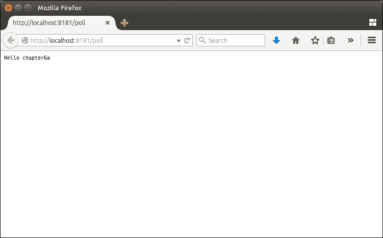

# 第六章。组件和端点

在前面的章节中，我们看到了如何使用处理器或 beans 实现中介逻辑和路由。然而，两者都期望有一个传入的 Exchange。这是组件和端点的一个关键目的——组件创建端点。我们有两种端点——负责创建 Exchanges 的生产者和消费传入 Exchanges 的消费者。

组件和端点负责：

+   与外部系统和 Exchanges 交互

+   提供和处理特定数据格式或转换

要理解这些概念，我们将涵盖以下主题：

+   组件和端点是什么？

+   现有组件及其使用方法

+   如何创建我们自己的组件和端点

# 组件

组件是 Camel 的主要扩展点。基本上，一个组件是一个端点工厂，您可以在路由中使用它。如果您查看 `Component` 接口，您可以看到以下代码：

```java
public interface Component extends CamelContextAware {

   Endpoint createEndpoint(String uri) throws Exception;

   EndpointConfiguration createConfiguration(String uri) throws Exception;

   ComponentConfiguration createComponentConfiguration();

   boolean useRawUri();

}
```

您可以看到 `Component` *存在于* `CamelContext` 中（因为它扩展了 `CamelContextAware` 接口）。这意味着我们实例化一个 `Component` 并将其实例添加到 `CamelContext`。

`Component` 使用唯一的标识符——`scheme` 存储在 `CamelContext` 中。在章节的后面，我们将看到该模式用于在路由定义中引用 `Component`。

## 组件引导

组件可以通过两种方式引导。

第一种方式是显式实例化 `Component`。您可以使用代码来完成此操作。

例如，我们可以显式实例化 `MockComponent` 并使用两种方案将其添加到 `CamelContext` 中（预期的 `mock` 方案和自定义的 `my` 方案）：

```java
MockComponent mockComponent = new MockComponent();
camelContext.addComponent("mock", mockComponent);
camelContext.addComponent("my", mockComponent);
```

第二种方式是隐式的。Camel 提供了一种发现机制，可以利用 `classloader` 或 IoC 框架（如 Spring）。Camel 在 `classloader` 中搜索类似这样的文件：

`/META-INF/services/org/apache/camel/component/my`

`my` 路径是组件方案名称。该文件包含具有组件实现的实际类。例如：

```java
class=com.packt.camel.MyComponent
```

如果 Camel 发现类属性，它将实例化组件并将其添加到 `CamelContext` 中。例如，仅使用 `blueprint`（或 Spring）创建组件 `bean` 就足以让 Camel 在上下文中发现负载：

```java
<?xml version="1.0" encoding="UTF-8"?>
<blueprint >

  <bean class="com.packt.camel.MyComponent">
  </bean>

  <camelContext >
  </camelContext>

</blueprint>
```

当在 OSGi 环境中（如 Karaf OSGi 容器中）使用时，Camel 还会查找使用 OSGi 服务提供的组件。这意味着在 OSGi 中，组件公开一个 OSGi 服务。

目前，Camel 提供了超过 150 个现成的组件：

+   一些组件直接由 `camel-core`（低级 Camel 库）提供。例如，`file`、`mock`、`bean`、`properties`、`direct`、`direct-vm`、`seda`、`vm`、`rest`、`ref`、`timer`、`xslt`、`controlbus`、`language` 和 `log` 组件都是直接提供的（无需安装其他组件）。

+   `camel-ahc` 允许您使用 Sonatype 的 Async HTTP Client 库与 HTTP 服务进行通信。

+   `camel-ahc-ws` 允许您使用 Sonatype 的 Async Http Client 库与 WebSocket 服务进行通信。

+   `camel-amqp` 允许您使用 AMQP 消息协议。

+   `camel-apns` 允许您在 Apple iOS 设备上发送通知。

+   `camel-atmosphere-websocket` 允许您使用 Atmosphere 库与 WebSocket 服务进行通信。

+   `camel-atom` 允许您使用 Atom 源（内部使用 Apache Abdera 库）进行工作。

+   `camel-avro` 允许您使用 Apache Avro 序列化数据和消息。

+   `camel-aws` 允许您使用 Amazon WebService 服务。

+   `camel-beanstalk` 允许您使用 Amazon Beanstalk 服务。

+   `camel-bean-validator` 允许您使用 Java 验证 API（JSR-303 或 JAXP 验证和相应的 Hibernate Validator 实现）验证消息有效负载。

+   `camel-box` 允许您管理位于 [`www.box.com/`](https://www.box.com/) 账户上的文件。

+   `camel-cache` 允许您在 Camel 路由中使用缓存机制。

+   `camel-chunk` 允许您使用 Chunk 模板创建消息。

+   `camel-cmis` 允许您使用 Apache Chemistry 客户端 API 与 CMIS 一起使用。

+   `camel-cometd` 允许您使用 `bayeux` 协议（使用 Jetty cometd 实现）发送消息。

+   `camel-couchdb` 允许您与 Apache CouchDB 数据库进行交互。

+   `camel-crypto` 允许您使用 Java 密码学扩展对消息有效负载进行签名和验证。

+   `camel-cxf` 允许您使用 Apache CXF 使用 SOAP 和 REST Web 服务。

+   `camel-dns` 允许您使用 DNSJava 操作 DNS。

+   `camel-disruptor` 允许您使用 disruptor 库来使用类似 SEDA 的组件（一个异步队列）。

+   `camel-docker` 允许您处理 `docker.io`。

+   `camel-dropbox` 允许您操作 Dropbox 账户上的文件。

+   `camel-ejb` 允许您在路由定义中使用 EJB3 作为常规豆。

+   `camel-elasticsearch` 允许您与 Elasticsearch 数据库进行交互。

+   `camel-spring` 允许您在路由中集成 Spring 应用程序。

+   `camel-eventadmin` 允许您与 OSGi EventAdmin 层进行交互。

+   `camel-exec` 允许您从路由中执行系统命令。

+   `camel-facebook` 允许您通过 `facebook4j` 库与 Facebook API 进行接口。

+   `camel-flatpack` 允许您使用 Flatpack 库处理固定宽度和分隔符文件。

+   `camel-fop` 允许您使用 Apache FOP 渲染消息（以 PDF 等不同格式）。

+   `camel-freemarker` 允许您使用 FreeMarker 模板创建消息。

+   `camel-ftp` 允许您通过 FTP 服务器消费或发送文件。

+   `camel-gae` 允许您与 Google App Engine 服务进行交互。

+   `camel-google-calendar` 允许您与 Google Calendar（使用 REST API）进行交互。

+   `camel-google-drive` 允许您通过 REST API 在 Google Drive 上检索或上传文件。

+   `camel-google-mail` 允许您通过 Gmail（使用 REST API）检索或发送电子邮件。

+   `camel-gora` 允许您使用 Apache Gora 库访问 NoSQL 数据库。

+   `camel-geocoder` 允许您使用地理定位查找地址。

+   `camel-github` 允许您与 GitHub 进行接口。

+   `camel-hazelcast` 允许您使用 Hazelcast 分布式队列（如 SEDA）。

+   `camel-hbase` 允许您与 Apache HBase 数据库进行交互。

+   `camel-hdfs` 允许您与 Apache Hadoop 分布式文件系统（HDFS）进行交互。

+   `camel-hl7` 允许您处理 HL7 MLLP 协议。

+   `camel-infinispan` 允许您在 Infinispan 上读取和写入分布式键/值对。

+   `camel-http` 允许您使用 Apache HTTP 客户端与 HTTP 服务进行交互。

+   `camel-ibatis` 允许您使用 Apache iBatis 数据库框架进行查询、插入和更新。

+   `camel-mail` 允许您检索（使用 imap 或 pop）或发送电子邮件。

+   `camel-irc` 允许您与 IRC 服务器和频道进行交互。

+   `camel-javaspace` 允许您使用 JavaSpace 接收或发送消息。

+   `camel-jclouds` 允许您与 jclouds 进行云计算和 Blobstore 交互。

+   `camel-jcr` 允许您使用内容管理系统，如 Apache Jackrabbit。

+   `camel-jdbc` 允许您使用 JDBC 执行数据库查询。

+   `camel-jetty` 允许您使用 Jetty 库和服务器公开或使用 HTTP 服务。

+   `camel-jgroups` 允许您与 JGroups 集群进行交互。

+   `camel-jira` 允许您与 JIRA 缺陷跟踪器进行交互。

+   `camel-jms` 允许您使用代理（如 Apache ActiveMQ 或 IBM MQ）从 JMS 队列或主题消费或生产消息。

+   `camel-jmx` 允许您处理 JMX 通知。

+   `camel-jpa` 允许您使用 JPA 框架（如 Hibernate 或 Apache OpenJPA）与数据库进行交互。

+   `camel-jsch` 允许您使用会话控制协议（SCP）下载或上传文件。

+   `camel-jt400` 允许您使用 AS/400 系统的数据队列（如 System i、IBM i、i5 等）。

+   `camel-kafka` 允许您在 Apache Kafka 消息代理上消费或生产消息。

+   `camel-kestrel` 允许您在 Kestrel 队列上消费或生产消息。

+   `camel-krati` 允许您与 Krati 数据存储进行接口。

+   `camel-ldap` 允许您查询 LDAP 目录。

+   `camel-linkedin` 允许您使用 REST API 与 LinkedIn 网站进行交互。

+   `camel-lucene` 允许您使用 Apache Lucene 搜索查询。

+   `camel-metrics` 允许您使用 Metrics 库收集活动指标。

+   `camel-mina` 允许您使用 Apache MINA 库与不同的网络协议（如 Telnet 等）进行交互。

+   `camel-mongodb` 允许您使用 MongoDB。

+   `camel-mqtt` 允许您通过 MQTT M2M 代理消费或生产消息。

+   `camel-msv` 允许您使用 MSV 库验证消息有效负载。

+   `camel-mustache` 允许您使用 Mustache 模板创建或渲染消息。

+   `camel-mvel` 允许您使用 MVEL 模板创建或渲染消息。

+   `camel-mybatis` 允许您使用 MyBatis 库与数据库接口。

+   `camel-nagios` 允许您使用 JSendNCSA 库向 Nagios 发送检查。

+   `camel-netty` 允许您使用 Java NIO 使用 TCP/UDP 协议（使用 Netty 库）。

+   `camel-olingo` 允许您使用 Apache Olingo 库与 OData 2.0 服务通信。

+   `camel-openshift` 允许您与 Openshift 应用程序交互。

+   `camel-optaplanner` 允许您使用 OptaPlanner 库解决消息中描述的规划问题。

+   `camel-paxlogging` 允许您接收来自 Pax Logging（Apache Karaf 中使用的日志框架）的日志消息。

+   `camel-printer` 允许您与打印机接口。

+   `camel-quartz` 使用 Quartz 库提供高级触发端点（如计时器端点）。

+   `camel-quickfix` 允许您使用 QuickFIX for Java 库接收和生成 FIX 消息。

+   `camel-rabbitmq` 允许您使用 RabbitMQ 代理消费和生成消息。

+   `camel-restlet` 允许您使用 RESTlet 库公开 REST 服务。

+   `camel-rmi` 允许您使用 Java RMI 服务。

+   `camel-jing` 允许您使用 RelaxNG 紧凑语法验证消息有效负载。

+   `camel-rss` 允许您使用 ROME 库消费 RSS 源。

+   `camel-salesforce` 允许您与 Salesforce 交互。

+   `camel-sap-netweaver` 允许您与 SAP NetWeaver 网关交互。

+   `camel-schematron` 允许您验证包含 XML 文档的消息。

+   `camel-sip` 允许您使用电信 SIP 协议发布或订阅。

+   `camel-smpp` 允许您使用 JSMPP 库接收或发送 SMS 消息。

+   `camel-snmp` 允许您使用 SNMP4J 库接收 SNMP 事件。

+   `camel-solr` 允许您通过 Solrj API 使用 Apache Lucene Solr 服务器。

+   `camel-spark-rest` 允许您轻松创建 REST 服务。

+   `camel-splunk` 允许您与 Splunk 上托管的应用程序交互。

+   `camel-sql` 允许您使用 JDBC 执行 SQL 查询。

+   `camel-ssh` 允许您向 SSH 服务器发送命令。

+   `camel-stax` 允许您使用 SAX ContentHandler 处理 XML 消息。

+   `camel-stream` 允许您与标准输入、输出和错误流交互。

+   `camel-stomp` 允许您与支持 STOMP 协议的代理（如 Apache ActiveMQ）交互。

+   `camel-twitter` 允许您与 Twitter 服务交互。

+   `camel-velocity` 允许您使用 Velocity 模板创建/渲染消息。

+   `camel-vertx` 允许您与 Vertx 事件总线交互。

+   `camel-weather` 允许您从 Open Weather Map 获取天气信息。

+   `camel-websocket` 允许您与 WebSocket 客户端通信。

+   `camel-xmlsecurity` 允许您使用 XML 签名规范对消息有效负载进行签名和验证。

+   `camel-xmpp` 允许您使用 XMPP 协议工作，允许您处理即时消息，如 Jabber。

+   `camel-saxon` 允许您在消息有效负载上使用 XQuery（使用 Saxon）。

+   `camel-yammer`允许您与 Yammer 企业社交网络交互。

+   `camel-zookeeper`允许您与 Apache Zookeeper 服务器接口。

Camel 组件的更新和完整列表可在网上找到：[`camel.apache.org/components.html`](http://camel.apache.org/components.html)。

# 端点

正如我们在`Component`接口中看到的，`Component`的主要功能是创建一个`Endpoint`。这是`createEndpoint()`方法的目的。此方法返回一个`Endpoint`。您不需要显式调用此方法。Camel 路由引擎为您调用此方法。

当在路由定义中使用以下语法时：

```java
from("my:options")
```

在路由引导过程中，路由引擎正在`CamelContext`中寻找我的组件（如前所述加载）。

如果找不到组件，我们将有一个没有找到针对方案 my 的消息的组件（封装在`CamelRuntimeException`中）。

如果找到组件，路由引擎将使用`createEndpoint()`方法实例化端点。

让我们看看`Endpoint`接口：

```java
public interface Endpoint extends IsSingleton, Service {

String getEndpointUri();

EndpointConfiguration getEndpointConfiguration();

Producer createProducer() throws Exception;

Consumer createConsumer(Processor processor) throws Exception;

PollingConsumer createPollingConsumer() throws Exception;

}
```

在这个`Endpoint`接口片段中，我们可以注意以下要点：

+   我们可以使用`getEndpointUri()`方法检索端点 URI

+   我们可以使用`getEndpointConfiguration()`方法检索端点配置

最重要的是，我们有不同类型的端点。根据端点在路由定义中的位置，Camel 创建不同类型的端点。

如果端点在`to`中定义，如下所示：

```java
<to uri="my:option"/>
```

Camel 路由引擎调用`createProducer()`方法。端点将充当生产者，这意味着交换将被转换为外部格式并发送到 Camel 路由之外。

如果端点在`from`中定义，如下所示：

```java
<from uri="my:option"/>
```

Camel 路由引擎调用`createConsumer()`或`createPollingConsumer()`方法（取决于端点提供的那个）。

我们区分两种消费者类型：

+   事件驱动消费者（由`createConsumer()`方法创建）是一种企业集成模式。基本上，这意味着端点充当服务器；它等待传入的事件或消息，并为每个事件实例化一个交换。例如，CXF、Restlet 和 Jetty 消费者端点是事件驱动的。Camel 使用线程池——每个事件都在自己的线程中处理。

+   另一方面，轮询消费者（由`createPollingConsumer()`方法创建）也是一种企业集成模式。基本上，端点定期检查资源，并为每个新资源实例化一个交换。例如，文件、FTP、IMAP 消费者端点是轮询消费者。

我们还可以设计第三种消费者类型，按需。基本上，我们不是定期轮询资源，而是希望在需要时触发轮询。例如，当我们收到 HTTP 请求时，我们希望从文件系统中消费文件。

要这样做，我们启动我们的 Karaf 容器：

```java
$ bin/karaf

```

我们在 Karaf 中使用以下代码安装 camel-blueprint 和 camel-jetty 功能：

```java
karaf@root()> feature:repo-add camel 2.12.4
karaf@root()> feature:install camel-blueprint
karaf@root()> feature:install camel-jetty

```

camel-jetty 功能提供了我们将用于路由的 camel-jetty 组件。

在 `Karaf deploy` 文件夹中，我们创建了以下 `route.xml` Camel Blueprint 路由定义文件：

```java
<?xml version="1.0" encoding="UTF-8"?>
<blueprint >

  <camelContext >
      <route>
          <from uri="jetty:http://0.0.0.0:8181/poll"/>
          <pollEnrich uri="file:/tmp/in"/>
          <to uri="log:poller"/>
      </route>
  </camelContext>

</blueprint>
```

此路由创建了一个 Jetty 事件驱动的消费者，等待传入的 HTTP 请求。我们通过 `pollEnrich` 语法使用内容 enricher EIP。这意味着，当 Exchange 由 Jetty 端点创建时，Camel 路由引擎调用文件端点，并用消耗的文件填充 Exchange。

为了测试此路由，我们在 `/tmp/in` 文件夹中创建了以下 `test.txt` 文件：

```java
Hello chapter6a
```

接下来，我们只需使用网络浏览器访问 `http://localhost:8181/poll` URL：



在 Karaf 日志中，我们可以看到以下代码：

```java
2015-01-06 15:00:16,291 | INFO  | qtp827039346-71  | poller | 70 - org.apache.camel.camel-core - 2.12.4 | Exchange[ExchangePattern: InOut, BodyType: org.apache.camel.component.file.GenericFile, Body: [Body is file based: GenericFile[/tmp/in/test.txt]]]

```

文件端点已被 `pollEnrich` 语法按需调用。

# 自定义组件示例

即使 Camel 提供了大量的现成组件，你也可能想创建自己的，例如，以支持专有协议。

创建我们自己的 Camel 组件相当简单。

在本节中，我们将创建一个名为 Packt 的组件，实现简单的套接字通信。

首先，我们创建了以下 Maven `pom.xml` 文件：

```java
<?xml version="1.0" encoding="UTF-8"?>
<project  
xsi:schemaLocation="http://maven.apache.org/POM/4.0.0 http://maven.apache.org/xsd/maven-4.0.0.xsd">

  <modelVersion>4.0.0</modelVersion>

  <groupId>com.packt.camel.component</groupId>
  <artifactId>camel-packt</artifactId>
  <version>1.0-SNAPSHOT</version>
  <packaging>bundle</packaging>

  <properties>
      <camel.version>2.12.4</camel.version>
  </properties>

  <dependencies>
      <dependency>
          <groupId>org.apache.camel</groupId>
          <artifactId>camel-core</artifactId>
          <version>${camel.version}</version>
      </dependency>
      <dependency>
          <groupId>org.slf4j</groupId>
          <artifactId>slf4j-api</artifactId>
          <version>1.7.7</version>
      </dependency>
  </dependencies>

  <build>
      <plugins>
          <plugin>
              <groupId>org.apache.felix</groupId>
              <artifactId>maven-bundle-plugin</artifactId>
              <extensions>true</extensions>
              <version>2.3.7</version>
              <configuration>
                  <instructions>
                      <Import-Package>
                          org.slf4j;resolution:=optional,
                          *
                      </Import-Package>
                      <Export-Package>
                          com.packt.camel.component*
                      </Export-Package>
                      <Export-Service>
                          org.apache.camel.spi.ComponentResolver;component=packt
                      </Export-Service>
                  </instructions>
              </configuration>
          </plugin>
      </plugins>
  </build>

</project>
```

在此 `pom.xml` 文件中，我们注意到以下要点：

+   在依赖关系方面，我们依赖于 `camel-core`，它提供了实现组件和端点的核心接口和类。我们还依赖于 `slf4j-api` 以便能够记录消息。

+   我们使用 maven-bundle-plugin 为我们的组件创建 OSGi 服务。这将使我们能够轻松地将组件部署到 Apache Karaf 等 OSGi 容器中，并利用 Camel OSGi 服务发现。为此，我们使用 `Packt` 方案导出 `org.apache.camel.spi.ComponentResolver` 服务。

除了使用 OSGi 服务进行组件发现之外，我们还创建了包含以下内容的 `META-INF/services/org/apache/camel/component/packt` 文件：

```java
class=com.packt.camel.component.PacktComponent
```

类属性包含 `component` 类的完全限定名。

因此，现在我们必须创建 `PacktComponent` 类：

```java
package com.packt.camel.component;

import org.apache.camel.CamelContext;
import org.apache.camel.Endpoint;
import org.apache.camel.impl.DefaultComponent;
import org.slf4j.Logger;
import org.slf4j.LoggerFactory;

import java.util.Map;

public class PacktComponent extends DefaultComponent {

  private final static Logger LOGGER = LoggerFactory.getLogger(PacktComponent.class);

  public PacktComponent() {
      LOGGER.debug("Creating Packt Camel Component");
  }

  public PacktComponent(CamelContext camelContext) {
      super(camelContext);
      LOGGER.debug("Creating Packt Camel Component");
  }

  @Override
  protected Endpoint createEndpoint(String uri, String remaining, Map<String, Object> parameters) throws Exception {
      LOGGER.debug("Creating Packt Camel Endpoint");
      PacktEndpoint packtEndpoint = new PacktEndpoint(uri, this);
      setProperties(packtEndpoint, parameters);
      return packtEndpoint;
  }

}
```

我们组件相当简单——它扩展了 Camel 的 `DefaultComponent`。我们只是重写了 `createEndpoint()` 方法。

此方法创建 `PacktEndpoint`。因此，我们必须创建此 `PacktEndpoint`：

```java
package com.packt.camel.component;

import org.apache.camel.Component;
import org.apache.camel.Processor;
import org.apache.camel.impl.DefaultEndpoint;

public class PacktEndpoint extends DefaultEndpoint {

  public PacktEndpoint(String uri, Component component) {
      super(uri, component);
  }

  public PacktProducer createProducer() {return new PacktProducer(this);
  }

  public PacktConsumer createConsumer(Processor processor) throws Exception {
      return new PacktConsumer(this, processor);
  }

  public boolean isSingleton() {
      return false;
  }

}
```

我们的 `PacktEndpoint` 是实际的端点工厂。在我们的组件中，我们希望能够创建两种类型的端点：

+   `createProducer()` 方法创建了一个 `PacktProducer` 生产者，我们可以在路由定义中使用 `to` 语法来使用它。

+   `createConsumer()` 方法创建了一个 `PacktConsumer` 事件驱动的消费者，我们可以在路由定义中使用 `from` 语法来使用它。

让我们从 `PacktConsumer` 开始。`PacktConsumer` 扩展了 Camel 的 `DefaultConsumer`。

`PacktConsumer` 在启动时创建一个服务器套接字。在启动时，它还创建一个新的线程来监听传入的客户端连接。

对于每个传入连接（意味着客户端套接字连接），我们创建一个`InOut`交换，并将其发送到路由定义中的下一个处理器。为此，我们使用`PacktEndpoint`和`InOut`交换模式创建一个 Camel `DefaultExchange`。

下一个处理器由 Camel 路由引擎提供（通过`getProcessor()`方法）。

由于我们使用`InOut`消息交换模式，一旦转发到下一个跳转点，我们就使用输出消息（并回退到输入消息）来回复客户端。

```java
package com.packt.camel.component;

import org.apache.camel.Endpoint;
import org.apache.camel.Exchange;
import org.apache.camel.ExchangePattern;
import org.apache.camel.Processor;
import org.apache.camel.impl.DefaultConsumer;
import org.apache.camel.impl.DefaultExchange;
import org.slf4j.Logger;
import org.slf4j.LoggerFactory;

import java.io.BufferedReader;
import java.io.InputStreamReader;
import java.io.PrintWriter;
import java.net.ServerSocket;
import java.net.Socket;

public class PacktConsumer extends DefaultConsumer {

  private final static Logger LOGGER = LoggerFactory.getLogger(PacktConsumer.class);

  private ServerSocket serverSocket;

  public PacktConsumer(Endpoint endpoint, Processor processor) throws Exception {
      super(endpoint, processor);
      serverSocket = new ServerSocket(4444);
      LOGGER.debug("Creating Packt Consumer ...");
  }

  @Override
  protected void doStart() throws Exception {
      LOGGER.debug("Starting Packt Consumer ...");
      new Thread(new AcceptThread()).start();
      super.doStart();
  }

  @Override
  protected void doStop() throws Exception {
      super.doStop();
      LOGGER.debug("Stopping Packt Consumer ...");
      if (serverSocket != null) {
          serverSocket.close();
      }
  }

  class AcceptThread implements Runnable {

      public void run() {
          while (true) {
            // create the exchange
            Exchange exchange = new DefaultExchange(getEndpoint(), ExchangePattern.InOut);
            Socket clientSocket = null;
            try {
                clientSocket = serverSocket.accept();
                PrintWriter out = new PrintWriter(clientSocket.getOutputStream(), true);
                BufferedReader in = new BufferedReader(new InputStreamReader(clientSocket.getInputStream()));
                String inputLine = in.readLine();
                if (inputLine != null) {
                    LOGGER.debug("Get input line: {}", inputLine);
                    exchange.getIn().setBody(inputLine, String.class);
                    // send the exchange to the next processor
                    getProcessor().process(exchange);
                    // get out message
                    String response = exchange.getOut().getBody(String.class);
                    if (response == null) {
                        response = exchange.getIn().getBody(String.class);
                    }
                    if (response != null) {
                        out.println(response);
                    }
                }
            } catch (Exception e) {
                exchange.setException(e);
            } finally {
                if (clientSocket != null) {
                    try {
                        clientSocket.close();
                    } catch (Exception e) {
                        // nothing to do
                    }
                }
            }
        }
    }

  }

}
```

我们的事件驱动消费者现在已准备好。我们现在实现`PacktProducer`，它扩展了 Camel `DefaultProducer`。生产者相当简单，它只是重写了`process()`方法。

`process()`方法只有一个参数——Camel 交换。

由于它是一个生产者，交换来自前一个处理器或端点。多亏了交换，我们能够访问输入消息。

以下是在处理器中我们执行的操作：

+   我们获取输入消息的主体（多亏了交换）。

+   我们创建一个连接到服务器套接字，并将输入消息主体发送到该套接字。

+   我们正在等待套接字服务器响应。此输入消息主体被服务器响应覆盖。

```java
package com.packt.camel.component;

import org.apache.camel.Endpoint;
import org.apache.camel.Exchange;
import org.apache.camel.impl.DefaultProducer;
import org.slf4j.Logger;
import org.slf4j.LoggerFactory;

import java.io.BufferedReader;
import java.io.InputStreamReader;
import java.io.PrintWriter;
import java.net.Socket;

public class PacktProducer extends DefaultProducer {

  private final static Logger LOGGER = LoggerFactory.getLogger(PacktProducer.class);

  public PacktProducer(Endpoint endpoint) {
    super(endpoint);
    LOGGER.debug("Creating Packt Producer ...");
}

  public void process(Exchange exchange) throws Exception {
      LOGGER.debug("Processing exchange");
      String input = exchange.getIn().getBody(String.class);
      LOGGER.debug("Get input: {}", input);
      LOGGER.debug("Connecting to socket on localhost:4444");
      Socket socket = new Socket("localhost", 4444);
      PrintWriter out = new PrintWriter(socket.getOutputStream(), true);
      BufferedReader in = new BufferedReader(new InputStreamReader(socket.getInputStream()));
      out.println(input);
      String fromServer = in.readLine();
      LOGGER.debug("Get reply from server: {}", fromServer);
      LOGGER.debug("Populating the exchange");
      exchange.getIn().setBody(fromServer, String.class);
  }

}
```

我们现在可以使用 Maven 构建我们的组件：

```java
$ mvn clean install
[INFO] Scanning for projects...
[INFO] 
[INFO] --------------------------------------------------------------
[INFO] Building camel-packt 1.0-SNAPSHOT
[INFO] --------------------------------------------------------------
[INFO]
[INFO] --- maven-clean-plugin:2.4.1:clean (default-clean) @ camel-packt ---
[INFO]
[INFO] --- maven-resources-plugin:2.6:resources (default-resources) @ camel-packt ---
[WARNING] Using platform encoding (UTF-8 actually) to copy filtered resources, i.e. build is platform dependent!
[INFO] Copying 1 resource
[INFO]
[INFO] --- maven-compiler-plugin:3.2:compile (default-compile) @ camel-packt ---
[INFO] Changes detected - recompiling the module!
[WARNING] File encoding has not been set, using platform encoding UTF-8, i.e. build is platform dependent!
[INFO] Compiling 4 source files to /home/jbonofre/Workspace/sample/chapter6b/target/classes
[INFO]
[INFO] --- maven-resources-plugin:2.6:testResources (default-testResources) @ camel-packt ---
[WARNING] Using platform encoding (UTF-8 actually) to copy filtered resources, i.e. build is platform dependent!
[INFO] skip non existing resourceDirectory /home/jbonofre/Workspace/sample/chapter6b/src/test/resources
[INFO]
[INFO] --- maven-compiler-plugin:3.2:testCompile (default-testCompile) @ camel-packt ---
[INFO] No sources to compile
[INFO]
[INFO] --- maven-surefire-plugin:2.17:test (default-test) @ camel-packt ---
[INFO] No tests to run.
[INFO]
[INFO] --- maven-bundle-plugin:2.3.7:bundle (default-bundle) @ camel-packt ---
[INFO]
[INFO] --- maven-install-plugin:2.5.1:install (default-install) @ camel-packt ---
[INFO] Installing /home/jbonofre/Workspace/sample/chapter6b/target/camel-packt-1.0-SNAPSHOT.jar to /home/jbonofre/.m2/repository/com/packt/camel/component/camel-packt/1.0-SNAPSHOT/camel-packt-1.0-SNAPSHOT.jar
[INFO] Installing /home/jbonofre/Workspace/sample/chapter6b/pom.xml to /home/jbonofre/.m2/repository/com/packt/camel/component/camel-packt/1.0-SNAPSHOT/camel-packt-1.0-SNAPSHOT.pom
[INFO]
[INFO] --- maven-bundle-plugin:2.3.7:install (default-install) @ camel-packt ---
[INFO] Installing com/packt/camel/component/camel-packt/1.0-SNAPSHOT/camel-packt-1.0-SNAPSHOT.jar
[INFO] Writing OBR metadata
[INFO] --------------------------------------------------------------
[INFO] BUILD SUCCESS
[INFO] --------------------------------------------------------------
[INFO] Total time: 2.105s
[INFO] Finished at: Fri Jan 09 10:59:35 CET 2015
[INFO] Final Memory: 15M/303M
[INFO] --------------------------------------------------------------

```

我们组件现在已准备好在 Apache Karaf 中部署。

我们启动 Karaf 并安装`camel-blueprint`功能：

```java
$ bin/karaf
karaf@root()> feature:repo-add camel 2.12.4
Adding feature url mvn:org.apache.camel.karaf/apache-camel/2.12.4/xml/features
karaf@root()> feature:install camel-blueprint

```

我们现在可以安装我们的组件：

```java
karaf@root()> bundle:install mvn:com.packt.camel.component/camel-packt/1.0-SNAPSHOT
Bundle ID: 73
karaf@root()> bundle:start 73

```

我们可以看到我们的组件现在已准备好：

```java
karaf@root()> la|grep -i packt
73 | Active   |  80 | 1.0.0.SNAPSHOT  | camel-packt

```

如果我们查看我们的组件提供的 OSGi 服务，我们可以看到`Component`服务：

```java
karaf@root()> bundle:services 73

camel-packt (73) provides:
--------------------------
[org.apache.camel.spi.ComponentResolver]

```

Camel 将使用此服务来解决与 Packt 方案关联的组件。为了测试我们的组件，我们可以创建以下`route.xml`蓝图：

```java
<?xml version="1.0" encoding="UTF-8"?>
<blueprint >

      <camelContext >
              <route id="server">
                      <from uri="packt:server"/>
                      <to uri="log:server"/>
                      <setBody><simple>Echo ${body}</simple></setBody>
              </route>
              <route id="client">
                      <from uri="timer:fire?period=5000"/>
                      <setBody><constant>chapter6b</constant></setBody>
                      <to uri="packt:client"/>
                      <to uri="log:client"/>
              </route>
      </camelContext>

</blueprint>
```

服务器路由在等待传入连接（使用`packt:server`）时使用 Packt 组件创建消费者端点。

我们现在可以看到 Packt 方案（在 OSGi 服务和 META-INF 服务中定义）。我们记录接收到的消息，并返回以`Echo`前缀的接收到的消息（使用简单的 Camel 语言）。

另一方面，客户端路由定期创建一个交换（使用定时器），我们将`chapter6b`定义为输入消息的主体（使用`setBody`）。

此消息发送到由我们的`server route`绑定的服务器套接字，使用 Packt 组件创建生产者端点（使用`to`与`packt:client`）。为了部署这些路由，我们只需将`route.xml`文件放入`Karaf deploy`文件夹。在日志中，我们可以看到以下代码：

```java
2015-01-09 11:58:25,758 | INFO  | Thread-16      | server | 70 - org.apache.camel.camel-core - 2.12.4 | Exchange[ExchangePattern: InOut, BodyType: String, Body: chapter6b]
2015-01-09 11:58:25,771 | INFO  | 1 - timer://fire | client | 70 - org.apache.camel.camel-core - 2.12.4 | Exchange[ExchangePattern: InOnly, BodyType: String, Body: Echo chapter6b]
2015-01-09 11:58:30,741 | INFO  | Thread-16 | server | 70 - org.apache.camel.camel-core - 2.12.4 | Exchange[ExchangePattern: InOut, BodyType: String, Body: chapter6b]
2015-01-09 11:58:30,742 | INFO  | 1 - timer://fire | client | 70 - org.apache.camel.camel-core - 2.12.4 | Exchange[ExchangePattern: InOnly, BodyType: String, Body: Echo chapter6b]

```

我们可以注意到：

+   服务器路由已被客户端路由调用

+   消费者将消息主体（使用`Echo`）前缀定义为简单表达式。

# 摘要

在前几章中，我们使用了豆子（POJO）和处理器来实现中介逻辑并充当生产者。然而，为了实现和简化对某些协议、系统、数据转换等的支持，Camel 组件非常方便，并提供易于扩展的点，这些点在 Camel 路由中即可使用。这允许您将连接性的实现与中介逻辑解耦。

利用组件（提供的或自定义的）、处理器、豆子和路由定义的组合提供了一个完整且强大的中介框架。然而，集成和中介要求我们面对一个新的挑战——如何在中介过程中处理和错误处理。这就是我们将在下一章中看到的内容。
