# 第四章：操作管理

本章将通过以下主题（重点关注 jBPM KIE 工作台和相关工具）向您展示执行 jBPM 操作所需的所有任务：

+   jBPM 环境配置：Git 和 Maven 仓库、组织单元以及通过基于角色的访问控制（**RBAC**）进行的基本管理和权限管理

+   新的 jBPM 资产管理功能和模块部署

+   流程和任务管理

+   使用 BAM 的工作示例进行 jBPM 审计和历史日志分析

+   使用 jBPM Executor 进行作业和命令调度

本章要求您对 Git 和 Maven 都有实际了解，它们在 KIE 工作台架构中扮演着核心角色。您将被要求使用 Git 并将工件部署到 Maven。让我们首先回顾 jBPM 6.2 开发系统的典型软件架构，目的是阐明新系统组件及其交互方式。

# KIE 工作台、Git 和 Maven 的概述

首先，jBPM 6.2 架构可能看起来有点难以理解，因为已经集成了几个新组件，为开发者提供了行业标准工具，以简化源代码管理、构建/部署。jBPM 平台与 Git 和 Maven 仓库集成，以便您可以共享 Kie 业务资产并将 Kie 模块发布到远程团队。让我们看看 Git 和 Maven 如何融入 Kie 平台（如下所示图像）。

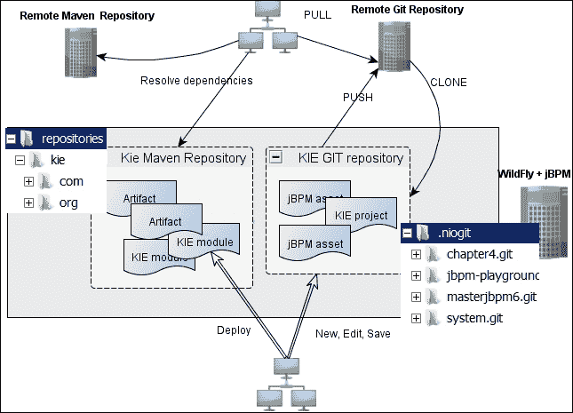

KIE 工作台管理来自其 Kie Git 仓库（无论是全新的还是从远程仓库克隆而来）的资产。所有 Kie Git 仓库都可以在 `.niogit` 文件夹中找到。Kie 部署过程将模块安装到 Kie Maven 仓库中（位于 `repositories/kie` 文件夹）。此仓库可以通过 Git 或 SSH 协议公开访问。

## 使用 Git

KIE 工作台使我们能够创建一个新的空 Git 裸仓库，或者将远程 Git 仓库克隆到一个全新的 Kie 裸仓库中。然而，工作台不允许我们将资产导入到 Kie 仓库的现有分支中。

### 注意

“裸”仓库在 Git 中作为拥有一个中心（主要是远程）仓库的方式存在，许多人可以向其推送内容。有关裸 Git 仓库的详细信息，请参阅官方 Git 文档。

我们可以从 **创作** | **管理** 菜单（**仓库** 项）管理仓库。现在让我们让 Kie 仓库发挥作用。

### 克隆远程仓库

我们将克隆来自 GitHub 的 `chapter 4-pizza` 示例仓库。它托管了两个项目，我们将在本章后面使用这些项目来实验部署过程。要克隆远程仓库，请打开 **仓库** | **克隆仓库** 对话框（参见以下截图）并按以下配置参数进行设置：

+   **仓库名称**：`chapter4-pizza`

+   **组织单位**：使用 jBPM 提供的默认设置或创建一个新的（在此阶段这不相关；让我们将其值设置为 `demo`）

+   **Git URL**：`https://github.com/masteringjbpm6/chapter4-pizza.git`

我们已经说过，克隆的和新的仓库都放在你可以在 KIE 安装文件夹中找到的 `.niogit` 文件夹中。此外，所有 KIE 仓库默认共享以下 URL：

`git://localhost:9418/{reposname}` 或 `ssh://localhost:8001/{reposname}`

其中 `{reposname}` 是你在对话框窗口中提供的**存储库名称**（例如，`chapter4-pizza`）。

### 小贴士

从不直接从 KIE `.niogit` 文件夹克隆仓库；始终使用仓库 URL。

`.niogit` 文件夹还包含用于存储元数据和设置的 `system.git` Kie 仓库；我们将在下一节中查看它。

### 修改并提交

从 KIE 工作台修改项目资产意味着你的更改将被提交到 KIE Git 仓库。让我们编辑 jBPM 流程定义，看看保存资产时会发生什么。打开**作者** | **项目作者**菜单（**项目资源管理器**），将路径更改为 `demo/chapter4-pizza/pizzadelivery`；你应该在**业务流程**组下看到**pizzadelivery**流程（见以下截图）。

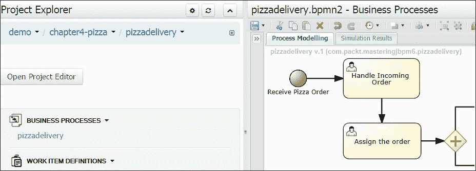

只需拖动并移动，例如，流程开始节点，然后选择**保存**菜单项。系统会提示你输入**提交**注释；输入 `workbench editing` 并按**确定**。现在，如果我们去检查 `.niogit/chapter4-pizza.git` 仓库并执行以下命令：

```java
git log

```

我们可以看到以下两个提交（较旧的提交是在 GitHub 仓库初始创建时执行的，另一个是你的最后一个提交）：

```java
commit 165a0b07f1b50962696640bcb79072458f4c82d4
Author: admin <>
Date:   Sun Mar 22 11:33:16 2015 +0100
 workbench editing {/pizzadelivery/src/main/resources/pizzadelivery.bpmn2}
commit a32f9a2a9bc835e74abcb78348878d8d2fc96140
Author: admin <fiorini.s@gmail.com>
Date:   Mon Mar 23 07:48:50 2015 +0100
 pizza commit

```

我们可以通过指定提交 ID 来获取第一个提交文件：

```java
git show --name-status -r a32f9a2a9bc835e74abcb78348878d8d2fc96140
Date:   Mon Mar 23 07:48:50 2015 +0100
 pizza commit
A       pizzadelivery/.classpath
A       pizzadelivery/.project
A       pizzadelivery/.settings/org.eclipse.bpmn2.modeler.core.prefs

```

### 推送到远程仓库

现在我们首先使用以下命令检查 `chapter4` 仓库的远程源设置：

```java
git remote -v

```

以下信息将被打印：

```java
origin  https://github.com/masteringjbpm6/chapter4-pizza.git (fetch)
origin  https://github.com/masteringjbpm6/chapter4-pizza.git (push)

```

为了更新远程源 GitHub 分支（master），我们执行以下推送：

```java
git push origin master

```

由于仓库受保护，你将需要输入仓库用户名和密码（我们在这里使用我们的账户）：

```java
Username for 'https://github.com': masteringjbpm6
Password for 'https://masteringjbpm6@github.com': *****

```

为了清晰起见，已移除...

```java
To https://github.com/masteringjbpm6/chapter4-pizza.git
79bcf3a..36b57c1  master -> master

```

最终更新了远程分支。

### 注意

对于修复和增强，我们鼓励你为我们示例 GitHub 仓库做出贡献；如果你想在本地实验示例项目，请遵循下一节。

### 新建仓库

通过将我们的 GitHub 仓库克隆到 KIE 仓库中，你无法（因为你不是贡献者）将更改推送到上游。除了在 GitHub 上进行分支操作外，如果你想让 KIE 集中管理你的项目，创建一个新的空 Kie 仓库是正确的选择。为此，请按照以下步骤操作：

1.  创建一个新的 KIE Git 仓库；请记住，目前不要勾选**管理仓库**选项，因为这会将您的仓库变成一个 Maven 感知的仓库，使得从外部源添加项目时难以调整（我们将在*资产管理示例*段落中解决它）。

1.  使用您首选的 Git 客户端从命令行克隆远程 GitHub 仓库。

1.  将您的 Git 工作副本远程 origin 更改为新的 Kie 仓库。

1.  提交并推送到 Kie 仓库的`master`分支。

### 备注

请参阅*Git 克隆和管理仓库*部分，以获取从 GitHub 创建仓库和项目设置的完整示例。

jBPM 6.2 引入了普通 Git 仓库（未管理）和一种新的“智能”仓库（管理）之间的区别，我们可以通过在**新建仓库**对话框窗口中设置**管理仓库**选项来创建这种类型的仓库。

### 管理资产 - 管理仓库

正如我们所见，使用 KIE 管理 Git 项目源和 Maven 可能具有挑战性：克隆、提交、设置仓库远程、推送到上游等等，我们甚至没有在我们的示例中考虑 Git 分支。jBPM 6.2 通过引入一个新功能（资产管理）简化了仓库和项目源代码的管理，该功能旨在通过一系列 jBPM 工作流程在各个阶段推动开发、构建和发布过程。简而言之，管理仓库提供项目 Maven 版本控制和 Git 分支管理。

#### 管理工作流程

资产管理工作流程不是完全自动的；它们还需要一个管理演员（必须是`kiemgmt`角色；参见 KIE 工作台`roles.properties`文件）来完成特定任务，以便使工作流程进展（选择要发布和/或审查的资产）或向用户提供信息数据（例如错误数据）。工作流程仅在以下预定义操作发生时触发（请记住，这仅适用于管理仓库）：

+   **创建或配置仓库**：在创建 Git 仓库或选择仓库**配置**按钮后，工作流程可以自动为您添加一个`dev`分支和一个`release`分支（`master`分支始终是默认分支）。

+   **资产提升**：当用户认为他的/她的资产准备好发布时，他/她可以通过选择**提升**按钮提交它们进行所谓的**提升**。提升需要管理用户选择（Git cherry picking）并批准提交的更改，通过将它们提升到 Git 发布分支，或者延迟过程以供稍后审查。

+   **项目构建**：用户执行**构建**，选择特定的仓库分支。构建涉及将项目作为一个 Maven 模块编译并安装到内部 Kie 仓库中。

+   **发布**：用户执行 **发布**。发布功能涉及在仓库级别的构建和部署过程。所有仓库项目都会构建，然后发布到 Kie 运行时（**部署到运行时**选项），以便可以使用业务资产。我们只能从以 **release** 标签开头的分支发布（例如，release-1.0.1）。

### 注意

请查阅 jBPM 6.2 用户指南的第九章，以获取有关资产管理工作流的更多详细信息。

#### Git 克隆和管理仓库

jBPM 6.2 不支持导入到管理仓库；简单的解决方案模仿了我们在（未管理的）*新建仓库* 段落中看到的方法，略有不同；让我们看看如何导入我们的 GitHub `chapter4-managed` 仓库项目：

让我们创建一个多模块仓库；每一步的设置如下：

1.  **仓库名称**: `ManagedVesuvio`，和 **组织单元**: `demo`（目前不相关）。

1.  **多项目仓库**（勾选），**自动配置分支**（勾选），和 **项目设置**（保留默认设置）。

    ### 注意

    在步骤 2 中，指定的 Maven GAV 将是 Maven 父模块 GAV `(demo:ManagedVesuvio:1.0.0-SNAPSHOT)`。创建了两个额外的分支：`dev-1.0.0` 和 `release-1.0.0`。如果我们没有选择自动分支管理，则只有默认的 `master` 分支可用，整个仓库无法发布（有关更多信息，请参阅 *发布* 部分）。

1.  克隆 `chapter4-managed` 示例项目：

    ```java
    git clone https://github.com/masteringjbpm6/chapter4-managed.git

    ```

1.  添加一个名为 `kievesuvio` 的新远程仓库（或者如果您愿意，替换 origin）：

    ```java
    git remote add kievesuvio ssh://admin@localhost:8001/ManagedVesuvio

    ```

1.  切换到 `chapter4-managed` 文件夹，并添加文件和提交：

    ```java
    git add .
    git commit -m "first Kie managed commit"

    ```

1.  从 `master` 分支获取更新并推送到 KIE `ManagedVesuvio` `dev-1.0.0` 分支：

    ```java
    git pull kievesuvio master
    git push kievesuvio master:dev-1.0.0

    ```

    1.  在此阶段，`dev-1.0.0` 分支已更新，但 KIE 项目 **资源管理器** 并未意识到仓库结构中的分支变化。这是由于仓库结构显示了 Maven 多模块配置（更多详情请见 *管理仓库和 Maven* 部分），并且其 `pom.xml` 文件已过时。我们必须手动将 `napoli` 和 `vesuvio` 项目添加到其中。

1.  在文件资源管理器（**创建** | **管理**）中，点击 `pom.xml` 并添加以下 `<modules>` 元素：

    ```java
    <modules>
      <module>napoli</module>
      <module>vesuvio</module>
    </modules>
    ```

保存文件后，KIE 应该会识别项目，并且仓库结构应该显示我们的模块。

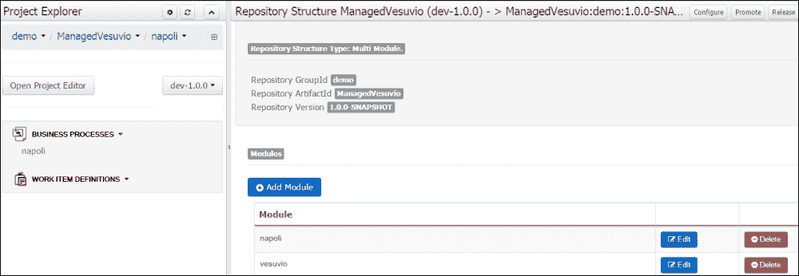

仓库现在已正确配置，我们准备处理资产管理功能。

#### 资产管理示例

`napoli`和`vesuvio`项目各包含一个基本流程定义。`napoli`流程（`napoli.bpmn2`）包括`vesuvio`流程（`vesuvio.bpmn2`）作为一个可重用的子流程（更多关于 BPMN2 元素的内容请见第五章，*BPMN 结构*）。用户通过在**仓库** | **仓库结构**视图中选择适当的按钮（见以下截图）以及在**任务** | **任务列表**窗口中完成人工任务来执行资产管理任务。


资产管理任务仅分配给拥有`kiemgmt`角色的用户；因此，请确保您使用`admin`用户登录到 KIE 工作台，因为这是唯一预设的拥有此角色的用户。

##### 提升资产

我们将资产（napoli 和 vesuvio 模块）提交到发布分支进行提升：

1.  选择**项目** | **编写和仓库** | **仓库结构**；选择**提升**按钮，并输入目标分支：`release-1.0.0`。

1.  在**任务** | **任务列表**窗口中，你现在应该被分配了一个**选择资产提升**的任务；点击它，**认领**任务，**提升所有**资产，并**完成**任务，如图所示：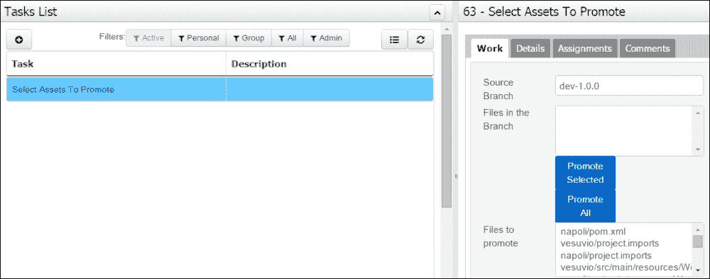

1.  返回到**仓库结构**，通过选择`release-1.0.0`分支，你应该能看到两个提升的项目。

    ### 注意

    资产现在已合并到 Git 仓库`release-1.0.0`分支。

##### 发布

在**仓库结构**中，选择`release-1.0.0`分支并按下**发布**按钮。可选地，提高模块的发布版本，切换**部署到运行时**（用户：`admin`，密码：`admin`，服务器 URL：`default`），然后继续。

### 注意

`napoli`和`vesuvio`现在已安装到 KIE Maven 仓库，你可以在**编写** | **工件仓库**工件中找到它们。如果你选择了**部署到运行时**，包含的流程定义将在**流程管理** | **流程定义**中可用。

##### 构建（单个项目）

发布流程始终通过构建过程运行所有管理的仓库项目；构建/发布过程也可以通过**构建**菜单在单个项目上对所有类型的仓库（管理/非管理）执行：

+   **构建与安装**：将工件部署到 Kie 仓库和系统 Maven 仓库（如果有）

+   **构建与部署**：执行安装步骤（见前文），然后，将模块部署到 Kie 运行时：业务工件可用于运行时使用

+   我们将在*KIE 部署*部分讨论更多关于部署的内容

#### 资产版本历史

所有资产的 Git 版本信息都可在**概览**选项卡中找到。例如，通过点击**napoli**流程，我们可以看到所有的提交日志，并且可以使用**选择**和**当前**按钮加载资产的先前 Git 版本（见以下截图；注释可能有所不同）。

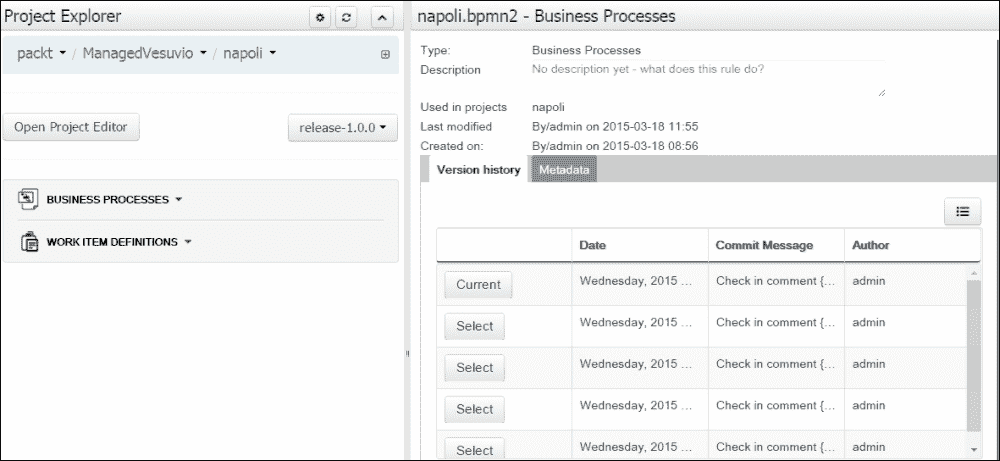

#### 管理仓库和 Maven

管理的 Git 仓库本身存储在`repositories/kie`仓库中的 Maven 模块中。它们可以是单一项目或多个项目的仓库；这会影响 Maven 化 Kie 项目的配置方式。

+   单一项目仓库包含一个 Kie Maven 项目

+   多项目仓库包含一个 Maven 多模块项目

父模块`pom.xml`文件显示它是一个`pom`（多）模块，包含`napoli`和`vesuvio`模块：

```java
<groupId>packt</groupId>
<artifactId>ManagedVesuvio</artifactId>
<version>1.0.0-SNAPSHOT</version>
<packaging>pom</packaging>
<name>ManagedVesuvio</name>
<modules>
 <module>napoli</module>
 <module>vesuvio</module>
</modules>

```

`napoli`模块的`pom.xml`文件显示它依赖于`vesuvio`模块：

```java
<parent>
 <groupId>packt</groupId>
 <artifactId>ManagedVesuvio</artifactId>
 <version>1.0.0-SNAPSHOT</version>
</parent>
<groupId>packt</groupId>
<artifactId>napoli</artifactId>
<version>1.0.0-SNAPSHOT</version>
<name>napoli</name> 
<dependencies>
  <dependency>
 <groupId>packt</groupId>
 <artifactId>vesuvio</artifactId>
 <version>1.0.0-SNAPSHOT</version>
 </dependency>
</dependencies>
```

### 注意

请参阅[`maven.apache.org/guides/mini/guide-multiple-modules.html`](http://maven.apache.org/guides/mini/guide-multiple-modules.html)以了解 Maven 多模块管理的介绍。

#### 管理流程定义

jBPM 资产管理流程定义及其相关业务逻辑可以在名为`guvnor-asset-mgmt`的 Drools 项目中找到。此模块是预部署的，并由 KIE 工作台加载；它通常列在**工件仓库**中，您可以在**部署** | **流程部署**窗口中找到其流程定义，并在**流程实例**窗口中找到其运行实例。

### 最后的注意事项

KIE 工作台项目编辑器只允许您编辑、构建和发布适当的 Kie 模块，而不是普通的 Maven 模块（这些模块缺少`kmodule.xml`文件）。因此，如果您只有一个 Kie 模块，将大量模块克隆到 Kie 多项目管理的仓库中并没有太多意义；请尝试用一点盐来设计您的仓库内容，以确保您的 Kie 运行时和开发环境始终保持清洁和健康。现在，我们不再使用 KIE 工作台来完成下一个示例（留给读者作为练习），而是切换到另一个工具，即 KIE CLI（代表命令行界面），并查看执行常见操作任务的不同方法。

# kie-config-cli 工具概述

第二章，*构建您的第一个 BPM 应用程序*（见*创建您的第一个 jBPM 项目*部分）介绍了几个 KIE 控制台功能（仓库和组织管理、模块部署等）。KIE CLI 实用程序为管理员/用户提供在控制台/shell 级别执行与组织单元、仓库、用户权限和部署管理相关的常见任务的工具。

### 注意

工具项目托管在 GitHub 上：[`github.com/droolsjbpm/kie-wb-distributions/tree/master/kie-config-cli`](https://github.com/droolsjbpm/kie-wb-distributions/tree/master/kie-config-cli)。

您可以从 JBoss 快照 Maven 仓库下载工具发行版：

[`snapshots.jboss.org/maven2/org/kie/kie-config-cli`](http://snapshots.jboss.org/maven2/org/kie/kie-config-cli).

上一节详细解释了 KIE 如何处理源项目的 Git 仓库，并预览了 KIE 系统 Git 仓库的存在；KIE CLI 工具与之接口，并在两种模式下操作：

+   **在线（默认和推荐）**：启动时，它通过 `kie-wb` 中嵌入的 Git 服务连接到系统仓库。所有更改都是本地的，并且仅在显式执行 `push-changes` CLI 命令时才发布到上游。`exit` 命令将发布所有本地更改；要在退出 CLI 时丢弃本地更改，应使用 `discard` 命令

+   **离线**：直接在服务器上创建和操作 Kie 系统仓库（不可用 discard 选项）

系统仓库存储 KIE 工作台的私有配置/设置数据：编辑器的行为、组织组、安全等。

系统仓库位于 KIE `.niogit` 文件夹中（`.niogit/system.git`）。

### 注意

核心 Git 后端功能由 Red Hat Uberfire 框架提供。[`www.uberfireframework.org`](http://www.uberfireframework.org)。

默认情况下，KIE 工作台通过其后端服务监控 `system.git` 仓库的更改，并相应地更新其用户界面。在设置完下一个示例环境之后，我们将继续在下一节中描述系统仓库。我们本可以通过 KIE 工作台的功能来完成这项工作，但我们希望您亲自动手，让 KIE 控制台发挥作用，熟悉幕后发生的事情。

## 连接（在线模式）

启动工具（通过安装文件夹中的 `kie-config-cli` 脚本）后，让我们首先连接到本地主机上的 KIE 系统仓库。

### 小贴士

由于安全原因，应优先考虑 SSH 协议而不是 Git 协议。

```java
************* Welcome to Kie config CLI ****************
>>Please specify location of remote Git system repository [ssh://localhost:8001/system]
ssh://localhost:8001/system
>>Please enter username:
admin
>>Please enter password:
admin

```

## 创建组织单元

KIE 工作台需要组织单元来创建仓库和用户，并实施 RBAC 规则控制，以执行某些任务。

```java
create-org-unit
>>Organizational Unit name:packt
>>Organizational Unit owner:admin@packt.org
>>Default Group Id for this Organizational Unit:com.packt
>>Repositories (comma separated list):
Result:
Organizational Unit packt successfully created

```

## 创建仓库

我们已经看到如何从 KIE 工作台克隆 Git 仓库。现在让我们创建一个新的 Git 仓库（本地、裸、未管理；无需用户名/密码），我们可以在此存储我们的新项目。

```java
create-repo
>>Repository alias:masteringjbpm6
>>User:
>>Password:
>>Remote origin:
Result:
Repository with alias masterjbpm6 has been successfully created

```

## 定义基于角色的访问控制规则

为了完成示例设置过程，我们在 masterjbm6 仓库中设置了一些 RBAC 规则；该组织未设置任何角色，因此为了限制对仓库的访问，我们向仓库对象添加角色：

```java
add-role-repo
>>Repository alias:masteringjbpm6
>>Security roles (comma separated list):user, analyst
Result:
Role user added successfully to repository masterjbpm6
Role analyst added successfully to repository masterjbpm6

```

## 添加 jBPM 控制台用户

`users.properties` 和 `roles.properties` 定义了可以登录 jBPM 控制台的用户（及其角色）。

让我们编辑 `users.properties` 并添加两个新用户：

```java
simone=simone
arun=arun
```

编辑 `roles.properties` 并将用户与我们之前创建的角色关联起来：

```java
simone=admin
arun=admin
```

## 将仓库添加到组织中

每个 KIE Git 仓库都必须绑定到一个组织；组织负责控制对其的访问并给予组织用户操作权限。

```java
add-repo-org-unit
>>Organizational Unit name:packt
>>Repository alias:masteringjbpm6
Result:
Repository masteringjbpm6 was successfully added to Organizational Unit packt

```

## 推送到 system.git

`push-changes` 命令将更改发送到 KIE `system.git` 仓库：

```java
push-changes
>>Result:
>>Pushed successfully

```

因此，你的 KIE 工作台会得到更新，显示你 UI 上的更新设置。

## 更多关于系统.git 仓库的信息

到目前为止，你应该对 `system.git` 仓库的作用有所了解；作为一个最后的练习，让我们克隆它并查看其内部结构：

```java
git clone file:///$JBPM_HOME/.niogit/system.git
```

### 注意

记住，永远不要从 KIE CLI 工具外部向系统仓库推送更改；这可能会搞乱整个 KIE 工作台安装！

系统仓库包含一些实体（组织单元和仓库）以及内部配置文件；在这里，我们可以找到我们全新的组织和仓库描述文件：

+   `masteringjbpm6.repository`

+   `packt.organizationalunit`

`masteringjbpm6.repository` 文件内容如下（请注意 `security:role` 设置）：

```java
<group>
  <name>masteringjbpm6</name>
  <description></description>
  <type>REPOSITORY</type>
  <enabled>true</enabled>
  <items>
    <entry>
      <string>scheme</string>
      <item>
        <name>scheme</name>
        <value class="string">Git</value>
      </item>
    </entry>
    <entry>
      <string>security:roles</string>
      <item>
        <name>security:roles</name>
        <value class="list">
          <string>user</string>
          <string>analyst</string>
        </value>
      </item>
    </entry>
    <entry>
      <string>branch</string>
      <item>
        <name>branch</name>
        <value class="string">master</value>
      </item>
    </entry>
  </items>
</group>
```

现在我们已经完成了我们的新 KIE Git 仓库和环境配置，我们准备好处理新的部署功能和 Kie-Maven 集成，这是我们下一个示例的主题。

# KIE 部署

jBPM 6 平台引入了一个全新的部署流程；之前利用 Guvnor 包（由**Java 内容仓库**（**JCR**）和 Drools `KnowledgeAgent` (`changeset.xml`) 支持的专有机制）被广泛采用的 Apache Maven 工具所取代。这在工具配置（更倾向于约定/配置）以及支持、标准化和部署灵活性方面都大大提高了开发过程。

当你部署你的项目时，你实际上创建了一个 KIE 部署单元（KJAR）；这个模块是一个 Maven 启用的项目，是一个包含所有项目业务资产（流程、工作项处理器、业务规则、表单等）以及其知识会话和运行时声明性元数据描述符（`META-INF/kmodule.xml`）的压缩标准 Java 归档。

### 注意

`kmodule.xml` 文件在官方 jBPM 和 Drools 文档中有详细说明。

KIE 模块的唯一 ID 是从其 Maven GAV（分组 ID，工件 ID，版本）开始构建的，并添加了知识库名称（默认知识库名称是空的；我们将在第六章，*核心架构*中回到这一点），例如：

```java
groupID:artifactID:version{:kbasename}
```

jBPM 运行时使用 Drools KIE-CI 组件在配置的 Maven 仓库中自动搜索其他 Maven 模块（通过嵌入在 KIE JAR 中的项目 `pom.xml` 文件或通过 Maven `settings.xml` 文件）来解决 KJAR 依赖项。您还可以使用 `kie.maven.settings.custom` 系统属性并指向任何 Maven `settings.xml` 文件。

### 注意

请参阅第六章，*核心架构*，特别是关于*仓库和扫描器*部分，以获取有关运行时类加载和解决模块依赖项的详细信息。

默认的 KIE Maven 仓库工件（`repositories/kie` 文件夹）可通过以下 URL 远程访问：`http://{jbpmconsole-host}:{port}/jbpm-console/maven2wb/`。

现在我们来总结在部署过程中执行的核心操作：

+   将模块安装到 KIE Maven 仓库的 Maven 安装

+   将模块部署到您的系统 Maven 仓库（使用 Maven 主目录中的 Maven `settings.xml` 文件，或者检查 `kie.maven.settings.custom` 系统属性）。

+   被称为 `DeploymentStore` 的 jBPM 数据库表通过部署描述符（XML 格式）进行更新。此更改是在 jBPM 6.2 版本中引入的；在此之前，部署信息存储在 `system.git` 仓库内。

### 提示

发布/部署操作永远不会部署 Kie 模块的依赖项；为了避免运行时错误中缺少依赖项，您必须在将 Kie 模块资产投入使用之前，通过将它们安装到 Maven 仓库中提供正确的依赖项工件。

以下图显示了与 KIE 控制台一起工作时标准的 Maven 仓库配置；KIE 项目首先部署到内部 KIE Maven 仓库，然后与远程**Maven 仓库**同步，然后为任何应用程序提供远程公共访问（HTTP），以便解决其依赖项。

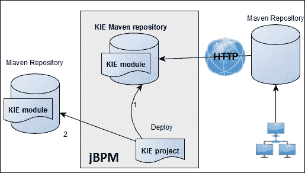

## 工件和 KIE 模块

一个 KIE 模块可能依赖于多个额外的 Maven 工件。KIE 工作台通过选择**创作** | **工件仓库**菜单项为您提供对您的 KIE Maven 仓库的视图。**路径**列显示工件的 Maven 仓库 URL；为了澄清，让我们看一下我们从 `ManagedVesuvio` 仓库发布的 `napoli` Kie 模块：

**工件名称**：`napoli-1.0.0.jar`

**路径**：`packt/napoli/1.0.0-SNAPSHOT/napoli-1.0.0.jar`

此工件可在以下 Maven 工件 URL 获取：

```java
http://{jbpmconsole-host}:{port}/jbpm-console/maven2wb/packt/napoli/1.0.0-SNAPSHOT/napoli-1.0.0.jar
```

请记住，虽然**工件仓库**是 KIE Maven 仓库内容的快照，但 KIE **部署** | **部署**菜单项仅显示有效的 KIE 模块（KJARs），这些模块是从 KIE 控制台运行时加载和验证的。

### 提示

`org.guvnor.m2repo.dir`：系统属性设置 Maven 仓库文件夹的路径；默认是 `${jBPM-install-directory}/repositories/kie`。

## 部署选项

KJAR 艺术品必须始终部署到 KIE 控制台的 Maven 仓库，以便我们可以集中管理它们，并使控制台的行为保持一致。鉴于这一点，多亏了 Maven 仓库风格的引入和新一代工具（KIE 控制台和 Eclipse BPMN 工具），你可以以相当灵活的程度定制部署过程以适应你的开发环境。

这里有一些可行的部署选项：

+   从 KIE 控制台创建一个项目（默认为 Maven 化），到一个配置好的 KIE Git 仓库；从 Eclipse 克隆并拉取，从 Eclipse 继续开发（添加业务模型等），推送到 KIE（KIE 控制台自动刷新其仓库视图）；从 KIE 构建和部署。

+   从 Eclipse 创建一个 Maven 项目（请记住添加 `kmodule.xml` 文件和 `pom.xml` 中的 jBPM 依赖项）；创建所有你的业务资产，并从 Eclipse 开发一个单元测试；推送到 KIE；也许在 KIE 中做一些修复，然后构建和部署。

+   如前所述，从 Eclipse 创建一个 Maven 项目；使用 Maven 安装（无论是从 Eclipse 还是命令行）；让 KIE 控制台通过上传控制台中的新工件来宣传新的 KIE 部署模块（**部署** | **部署**）。

+   从 Kie 控制台，从远程 Git 仓库创建一个仓库克隆；创建一个项目，添加资产，然后保存和提交。部署到 Maven 并将更改推送到远程 Git 仓库。

+   多亏了其 Maven 和 Git 集成，KIE 平台可以非常灵活地适应复杂开发环境。

## 以示例方式部署 – 披萨项目

我们预览了使用 `ManagedVesuvio` 仓库发布流程安装和部署的过程，其中两个 KIE 模块（一个依赖于另一个）被发布。让我们通过一个不同的模块示例来亲自动手：一个 KIE 模块（主项目）和一个普通模块（依赖项）。以下是一些披萨示例项目：

+   `Pizzadelivery`：KJAR 模块（它包含流程定义）

+   `Pizzamodel`：一个实用项目，包含用 Java 类建模我们的业务对象（订单、披萨等）的类。

`Pizzadelivery` 项目依赖于 `Pizzamodel` 项目。让我们首先回顾一下示例流程定义（我们将在后面的段落中使用相同的流程作为我们的 BAM 示例解决方案）。

### 流程定义 – pizzadelivery

示例流程定义捕捉了一个典型的外卖披萨流程：

1.  下单后，Nino 通过电话管理收到的订单（**处理收到的订单**任务）。

1.  Maria 从 Nino 那里获取订单详情，并将一个粘性便条交给披萨制作人员（**订单分配**任务）。

1.  一个披萨制作师（马里奥或路易吉）开始准备披萨（**制作披萨**任务），同时，玛丽亚将订单配送分配给一个披萨男孩（**分配配送**任务）。交付分配任务和制作披萨任务的完成（并行任务，更多内容请参阅 第五章，*BPMN 构造*)意味着披萨已经准备好交付。

1.  萨尔瓦托雷交付披萨（**披萨配送**任务）。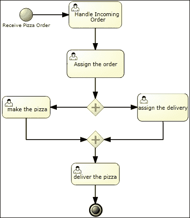

### 部署披萨

首先，我们通过 Maven 使依赖项可用，然后，通过 KIE 工作台部署模块。让我们将源代码导入到我们的新 KIE 仓库（在 *创建仓库* 部分中设置的仓库）。

### Git 和项目配置

到目前为止，你应该已经非常熟悉将源项目导入到 KIE 仓库中：

1.  从我们的示例 GitHub 仓库克隆示例仓库：

    ```java
    git clone https://github.com/masteringjbpm6/chapter4-pizza.git

    ```

1.  将克隆的仓库项目添加到本地（未管理）的 `masteringjbpm6` 仓库部分：

    ```java
    git remote remove origin
    git remote add origin ssh://localhost:8001/masteringjbpm6/

    ```

1.  通过执行 `git remote` 命令，我们可以看到以下内容：

    ```java
    $ git remote -v
    origin ssh://admin@localhost:8001/masteringjbpm6 (fetch)
    origin ssh://admin@localhost:8001/masteringjbpm6 (push)

    ```

1.  现在我们只将样本 KIE 模块项目推送到新的远程仓库（origin）：

    ```java
    git add pizzadelivery
    git commit –m "pizzadelivery: first kjar"
    git push -u origin master

    ```

此处的目的是通过 Git 只发送 KIE 控制台（KIE 项目），而不是创建额外的问题来源。我们现在将通过我们的 Maven 仓库提供 KIE `pizzadelivery` 项目的 Maven 依赖项（`pizzamodel.jar`）。

### 部署依赖项

通过切换到 **项目创作** | **项目资源管理器**，我们可以找到 PizzaDelivery 项目（通过 **packt/masteringjbpm6** 仓库面包屑导航）。按下 **打开项目编辑器** 按钮，从下拉列表中选择 **项目设置** | **依赖项** 项，我们可以看到 `pizzadelivery` 模块依赖于 `pizzamodel` 工件（见下图），而这个工件尚未存在于 Maven 仓库中。

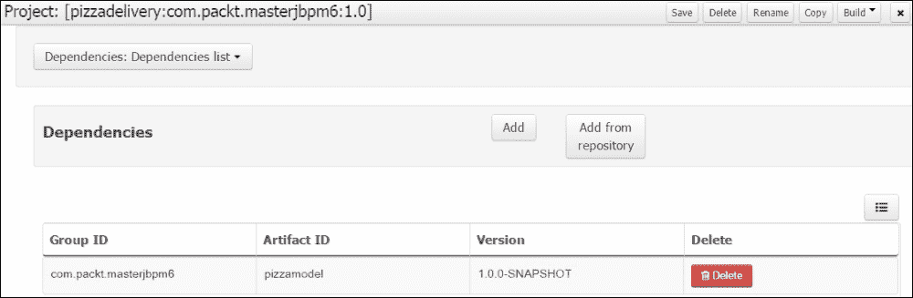

**消息**选项卡报告了这个问题，相应地：

**未解决的依赖项 com.packt.masterjbpm6:pizzamodel:1.0.0-SNAPSHOT**

### 提供工件

现在发生的事情应该是清晰的：KIE 依赖项机制（我们将在 第六章中讨论的“扫描器”，*核心架构*）在扫描可用的 Maven 仓库时无法解决 `pizzadelivery` 项目的依赖项（从其 `pom.xml` 文件加载）；为了解决这个问题，我们将通过以下两个步骤提供缺失的工件：

1.  Maven 安装：在 `pizzamodel` 项目根目录下执行 `mvn clean install`（或使用 Eclipse **运行 Maven 构建** 集成功能）将构建和安装的工件放入我们的 Maven 仓库，以便在运行时解决依赖项。

1.  艺术品仓库上传：转到 Kie 控制台 **创作** | **艺术品仓库** 页面，并点击 **上传** 按钮；从你的 Maven 仓库文件夹（`com/packt/masterjbpm6`）中选择 `pizzamodel` JAR 文件。KIE 控制台将把工件复制到其内部 Maven 仓库。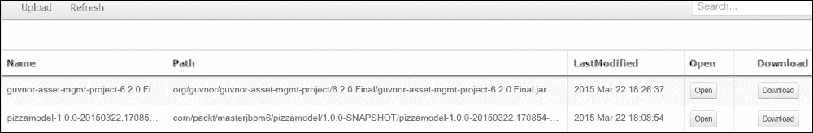

现在工件已经可用，如果你在 **消息** 面板的 **刷新** 按钮上点击，问题应该会得到解决。

### 部署

现在我们已经准备好部署。在 **项目资源管理器** 选项卡中，选择 **工具** | **项目编辑器** 菜单项。检查 `PizzaDelivery` 模块的 Maven GAV 属性是否正确，然后点击 **构建 & 部署** 按钮。

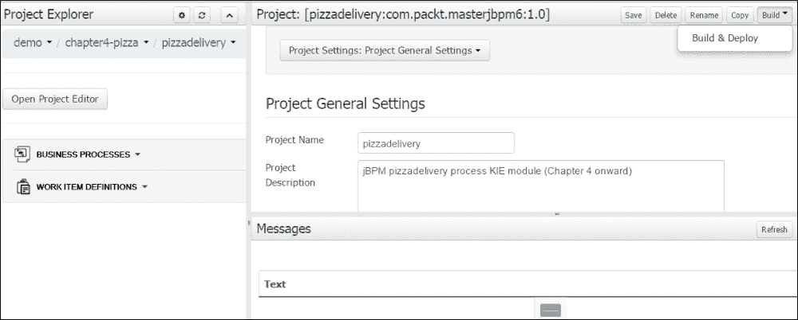

请注意，在部署过程中，KIE 控制台将尝试解决和验证你的所有项目依赖项，可能会访问多个远程 Maven 仓库（取决于你的配置），并花费一些时间来完成。确保你的互联网连接是活跃的，或者设置一个 Maven 代理仓库（强烈推荐）。

应用服务器控制台跟踪以下信息：

```java
18:32:33,517 INFO  [org.drools.compiler.kie.builder.impl.KieRepositoryImpl] (default task-106) KieModule was added: MemoryKieModule[releaseId=com.packt.masterjbpm6:pizzadelivery:1.0]
18:32:34,547 INFO  [org.jbpm.console.ng.bd.backend.server.DeploymentManagerEntryPointImpl] (default task-106) Deploying unit com.packt.masterjbpm6:pizzadelivery:1.0
18:32:35,969 INFO  [org.jbpm.kie.services.impl.store.DeploymentSynchronizer] (default task-106) Deployment unit com.packt.masterjbpm6:pizzadelivery:1.0 stored successfully

```

### 小贴士

请记住，无论是否有活动（运行）的流程实例，你都不能部署具有相同 ID 的部署单元（覆盖它）；需要执行卸载操作（参见下一节）。

日志确认部署已成功完成；我们可以在 **部署** | **部署** 选项卡中看到我们的 KJAR 模块。记住，为了部署过程成功（至少对于 6.2 版本的 jBPM 来说），你的 `kmodule.xml` 必须要么：

+   声明一个空的 `<kmodule>` 元素

+   声明一个具有以下属性的 `<ksession>` 元素：`type="stateful" default="true"`

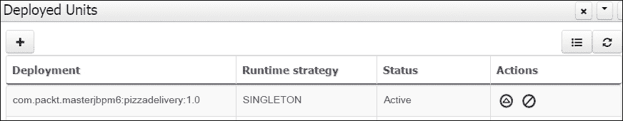

为了彻底起见，检查 jBPM 数据存储中的 `DEPLOYMENTSTORE` 表中的部署条目；我们应该看到已经添加了一个新行。

表行有一个 DEPLOYMENTID 列：`com.packt.masterjbpm6:pizzadelivery:1.0.0` 和一个 DEPLOYMENTUNIT 列，其中包含实际的部署描述符：

```java
<org.jbpm.kie.services.impl.KModuleDeploymentUnit>
  <artifactId>pizzadelivery</artifactId>
  <groupId>com.packt.masterjbpm6</groupId>
  <version>1.0.0</version>
  <strategy>SINGLETON</strategy>

</org.jbpm.kie.services.impl.KModuleDeploymentUnit>
```

这实际上是部署过程的第三步（参见 *KIE 部署* 部分）。

## 手动添加 KIE 模块

即使你已经在 KIE 工作台外部（仅在你的系统 Maven 仓库中，可能使用 Eclipse IDE 和 Maven 安装目标）构建和安装了你的 KIE 模块，你仍然可以在以后将其部署到 KIE。手动添加部署单元意味着你正在使这个（Maven 安装的）模块对 KIE 运行时可用。从 **部署** | **部署** 视图，你可以添加新的部署单元（**新建部署** 按钮）；只需提供你想要部署的项目 Maven GAV 即可，可选地提供知识库和知识会话名称。

### 小贴士

此外，您可以选择符合您要求的`ksession`运行时策略：单例、按请求或按流程实例（有关运行时策略，请参阅第六章，*核心架构*）。

KIE 工作台将提供一个新的`kmodule.xml`文件和元信息，将您的普通 JAR 模块转换为新的 KIE 模块。如果匹配的 Maven 工件不在 KIE Maven 存储库中，则无法创建新的部署单元。

## 应用了流程和任务管理 - 披萨配送流程

KIE 工作台允许您管理流程实例并与流程任务交互。您可以执行以下操作：

+   向特定流程实例或批量信号（广播到所有流程实例）发送信号。

+   中断特定流程实例或执行批量中断 - 中断将终止实例（们）和所有挂起的任务。与流程及其任务相关的所有数据都将从 jBPM 数据库表中删除。

+   获取流程详细信息 - 详细信息页面包括从默认 jBPM 数据库审计表中获取的审计日志（我们将在最后一节和第六章，*核心架构*）中讨论审计）。

+   开始、释放和完成任务。

### 启动流程

打开**流程管理** | **流程定义**选项卡，并单击我们新部署的 PizzaDelivery 流程定义旁边的**启动**图标按钮；一个新的流程实例开始。

## 取消部署

取消部署操作仅从 jBPM 数据库表中删除部署单元的配置文件，而将 Maven 工件保留在原位。

## 用户管理

我们在示例设置部分介绍了 PizzaDelivery 流程；该流程需要五个不同的真人演员：

+   **订单管理**：Nino

+   **订单分配**：Maria

+   **披萨烹饪**：马里奥或路易吉

+   **配送分配**：Maria

+   **披萨配送**：Salvatore

为了使用 KIE 控制台来练习我们的第一个流程实例，我们需要将这些流程参与者（演员）添加到 KIE 运行时。编辑`$JBOSS_HOME\standalone\configuration`文件夹中的`user.properties`和`roles.properties`文件；这些用户将由 KIE 工作台自动添加到任务服务数据库表（`ORGANIZATIONALENTITY`，更多内容请参阅第六章，*核心架构*）。

将演员（指定认证密码）添加到`user.properties`文件中：

```java
nino=nino
maria=maria
salvatore=salvatore
mario=mario
luigi=luigi
```

在`roles.properties`文件中指定用户的角色（默认角色`user`足以执行任务）：

```java
nino=user
salvatore=user
mario=user
luigi=user
maria=user
```

### 小贴士

无需重新启动应用程序服务器即可使其获取新设置。

## 任务管理

要完成流程实例，请按照以下顺序执行步骤：

+   **以 Nino 身份登录**：**启动**和**完成****处理 incoming 订单**任务

+   **以 Maria 身份登录**：**认领**和**完成****分配订单**任务

+   **以马里奥（或路易吉）身份登录**：**认领**并**完成**制作披萨的任务

+   **以玛丽亚身份登录**：**认领**并**完成**分配递送的任务

+   **以萨尔瓦托雷身份登录**：**认领**并**完成**递送披萨的任务

所有任务已完成。流程实例结束，查看流程实例详情标签页，我们可以看到实例日志跟踪（事件按逆时间顺序显示）：

实例日志：

```java
22/nov/14 23:35:53: 8 – EndNode
22/nov/14 23:29:54: 7 - deliver the pizza (HumanTaskNode)
22/nov/14 23:29:54: 6 - Join
22/nov/14 23:27:50: 6 - Join
22/nov/14 23:26:56: 4 - make the pizza (HumanTaskNode)
22/nov/14 23:26:56: 5 - assign the delivery (HumanTaskNode)
22/nov/14 23:26:56: 3 – Split
22/nov/14 22:41:56: 2 - Assign the order (HumanTaskNode)
22/nov/14 18:10:05: 1 - Handle Incoming Order (HumanTaskNode)
22/nov/14 18:10:05: 0 - Receive Pizza Order (StartNode)
```

`Split` 日志记录并行分叉网关的激活。`Join` 日志记录并行汇聚网关的传入连接的激活。跟踪日志是从 `NODEINSTANCELOG` 表中加载的。

正如你可能意识到的，从 KIE 工作台中完全测试流程定义并不容易；在演员之间切换是一个繁琐且耗时的任务……想想一个包含大量人工任务和演员或群体的复杂流程。我们将通过使用 BAM 示例和下一章中的测试自动化来了解如何克服这些问题。

# 管理作业和异步命令执行

从 jBPM 6 开始，平台提供了一种新的调度服务（称为 `Executor`），它允许你安排、执行和管理异步作业任务。Executor 可以用作通用 Java 批处理调度设施，也可以用作能够执行异步流程任务的服务（有关更多详细信息，请参阅第五章，*BPMN 构造*，*异步任务*部分）。例如，资产管理功能内部安排不同类型的命令（为了获得一些想法，请打开**部署**|**作业**窗口，如图所示）：`CreateBranchCommand`、`ListCommitsCommand`、`BuildProjectCommand`、`MavenDeployProjectCommand` 等。

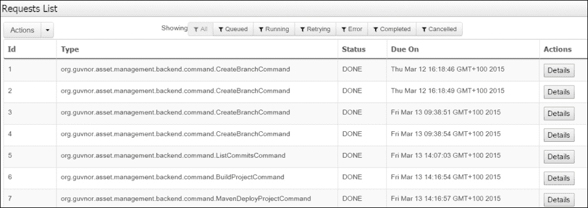

Executor 服务执行预先配置的 `Command` 类；`Command` 是一个 Java 类，它执行一组在 jBPM 流程上下文之外运行的业务语句，并通过一系列接口（`CommandContext` 和 `ExecutionResults`）与 Executor 通信，这些接口强制执行参数传递。

`Job` 类持久化存储在 `REQUESTINFO` jBPM 数据库表中，而结果错误问题则持久化存储在 `ERRORINFO` 表中。

## 创建、安排和启动新的作业

简单明了的通用 `Job` 定义（没有 jBPM 上下文可用）需要你提供要安排的类的类名（请参阅以下截图）。

1.  在**类型**字段中输入类名`com.packt.masterjbpm6.command.SimpleCommand`，在**名称**字段中输入`SimpleCommand`。`Job`类必须包含在 KIE 工作台应用程序（`jbpm-console.war`）的类路径中，因此可以将`pizzamodel.jar`文件复制到`WEB-INF/lib`中的 exploded WAR，或者将其复制到 jBPM 设置文件夹的`dependencies`文件夹中，并使用在 jBPM `build.xml`文件中可找到的 Ant 目标`install.jBPM-console.into.jboss`重新构建控制台应用程序。

1.  设置**到期时间**（调度）和可选的**重试次数**（`Job`类在失败后可以重新启动的次数），以及参数。

1.  参数（上下文数据）通过`CommandContext`类在执行时传递给`Job`实例。参数必须是可序列化的。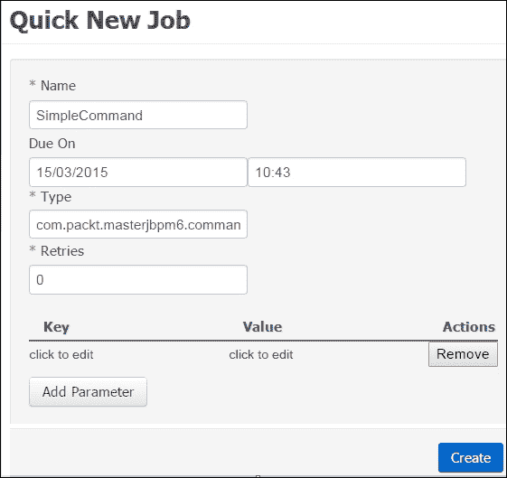

创建后，任务变为**队列**状态（如下面的截图所示），将在预定时间执行。不同的 Job 状态如下：**队列**、**完成**、**取消**、**错误**、**重试**和**运行**。

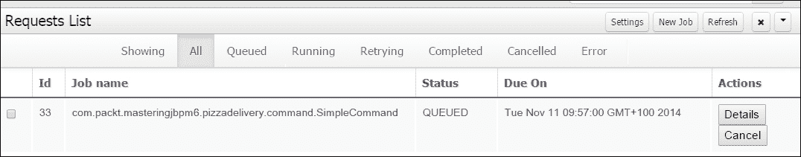

# 流程定义转换

转换涉及将流程定义从旧版本格式移动到新版本格式。当将较旧的流程定义升级到新的 jBPM 发布格式时，jBPM 6 为我们提供了一些（相当实验性的）选项：

+   使用 jBPM Web 流程设计器的菜单功能从旧的专有 jBPM JPDL 3/4 导入到 BPMN2

+   使用`jBPM5migrationtoolproject`和`jbpmmigration-0.13.jar`或更新的版本进行即席迁移（也支持 API 映射）

`jBPM5migrationtoolproject`项目的目标是向现有的 jBPM 用户提供一些迁移工具，以便从 jBPM5 迁移。

### 注意

项目主页和 Wiki 页面在此处可用：[`developer.jboss.org/wiki/jBPM5migrationtoolproject`](https://developer.jboss.org/wiki/jBPM5migrationtoolproject)。该项目托管在 GitHub 上：[`github.com/droolsjbpm/jbpmmigration`](https://github.com/droolsjbpm/jbpmmigration)。

## 流程定义版本控制和实例升级

根据企业业务需求和业务组织，流程可能会随着时间的推移以非常不同的速度发生变化；需要解决几个业务迁移案例：

+   一个复杂的业务流程可能需要数月才能完成（可能由于手动任务），然而，业务人员需要尽快提供更新的流程定义，因为一些旧的遗留系统必须集成到流程中。

+   流程定义需要修复，但该流程定义的多个实例正在运行，我们不希望终止它们并让用户从工作流开始处重新启动。

除了增加过程定义版本属性（数字）之外，这只是一个助记符，不会影响流程实例的行为，因此，为了反映版本号，命名您的流程 ID（字符串）是一个好的做法，因为引擎本身不提供任何版本跟踪机制，例如：

```java
com.packt.masteringjbpm6.pizzadelivery_v1_0,
com.packt.masteringjbpm6.pizzadelivery_v1_1
```

这样，你就可以在保留审计数据并保持分离的同时，灵活地在不同版本的过程定义之间切换实例化。实际上，每个实例都与其过程定义（通过 ID）绑定，并且在实例完成之前不得覆盖。

为了支持用户在不同过程定义之间迁移流程实例，jBPM 6 引入了`WorkflowProcessInstanceUpgrader`类。

`WorkflowProcessInstanceUpgrader`.`upgradeProcessInstance` 方法首先将流程实例从信号中断开连接，然后事件处理管理器逐个遍历流程实例节点，尝试通过从您提供的映射数据中获取 `uniqueID` 来将节点映射到目标流程定义节点。

`uniqueID` 是由引擎通过连接节点父（容器）元素的 ID 生成的内部标识符，例如：

```java
// create the node mapping data
Map<String, Long> mapping = new HashMap<String, Long>(); 
// top level node 1 must be mapped to a new node with id 2
mapping.put("1", 2L);
// node 3, which is inside a composite node 4, must be mapped to a new node with id 5
mapping.put("4.3", 5L); 
// upgrade old processInstance to a new process instance definition with id= com.packt.masteringjbpm6.pizzadelivery_v1_1
WorkflowProcessInstanceUpgrader.upgradeProcessInstance( ksession, processInstance.getId(),"com.packt.masteringjbpm6.pizzadelivery_v1_1", mapping);
```

对于复杂的过程定义，这种解决方案总体上还远未完善；建议在可能的情况下实施自己的过程迁移。

# BAM

业务活动监控器（BAM）提供了构建系统外可定制的 KPI 的工具，这对于管理层在采取主动决策时非常有用。该术语由 Gartner Inc. 定义（[`www.gartner.com/it-glossary/bam-business-activity-monitoring`](http://www.gartner.com/it-glossary/bam-business-activity-monitoring)），指的是企业数据的实时聚合、分析和表示（可能将其与系统利益相关者和客户相关联）。

BAM 的目标是产生（近）实时信息，关于 jBPM 业务系统的操作、流程和交易的状态和结果；这支持企业管理层采取反应性决策（**决策支持系统**（**DSS**）），并帮助员工识别关键区域（可能的问题来源）。

以下是一些示例：

+   采用 JIT 生产业务模式的企业必须持续监控其生产和采购流程，并将它们与 incoming orders 和 business providers 相关联

+   电信公司需要概述其服务，提供操作以便能够及时了解其客户

BAM 通常需要与 BI/数据仓库工具集成；第一类工具是实时（面向数据的多源异构），而第二类是历史业务数据。随着 NoSQL 数据库引擎、大数据和基于云的平台的出现，这一趋势今天正在迅速转变，转向处理流处理（实时）以及批量处理（**复杂事件处理**（**CEP**））的新一代工具。

## BPM 和 BAM

BAM 的主要 jBPM 数据来源是引擎审计服务和 jBPM 数据库表。

审计数据可能对某些业务系统很重要，而对其他系统则无足轻重。审计和日志历史数据可能对您的系统/平台软件是一项繁重的任务，并且在 I/O 和/或分配的资源（磁盘空间、数据库资源等）方面可能非常昂贵。jBPM 审计日志服务数据库模式只是一个默认实现；默认审计数据的类型和数量可能不符合您的需求，您的业务应用程序可能需要捕获更精细（或只是不同）的信息级别。

jBPM 审计服务模块（`jbpm-audit-6.2.0.jar`）为实施者提供了两种通过收集引擎事件来生成审计数据的方法：

+   **JPA**：同步记录器，绑定到引擎事务，并将审计事件作为运行时引擎事务的一部分进行持久化

+   **JMS**：异步记录器，可以配置为将消息放置在队列中，要么与活动事务相关（仅在事务提交后），要么直接生成

### 注意

请参阅第六章，*核心架构*，以获得对 jBPM 审计和日志服务的全面解释。

仔细评估所需审计服务粒度对引擎性能的影响，并据此规划您的实施；对于生产环境，请考虑以下方面：

+   使用与引擎数据库不同的数据库来存储您的审计数据；这有助于简化数据库管理任务（例如，没有外键问题）

+   使用异步事件处理以获得更好的吞吐量

在审计数据真正重要的地方，一些系统通常需要保留流程历史日志相当长的时间（数年）；规划一个可靠的数据库策略（备份/恢复）是必须的。以下列表为您提供了一些实用的建议：

+   **无需审计数据**：关闭 JPA 审计持久化选项（配置 jBPM 的`persistence.xml`文件）

+   **默认审计数据**：启用 JPA 审计持久化

+   **自定义/更精细的级别但无需额外处理**：关闭 JPA 审计选项，并遵循第六章中的自定义审计实现说明，*核心架构*

+   **定制/更细粒度级别和额外处理需要（BI）**：关闭 JPA 审计选项，并遵循第六章中的自定义审计实现说明，*核心架构*；建议写入不同的数据库

请查阅第六章，*核心架构*，以获取实现细节和示例。

## 默认历史日志

引擎审计日志/历史信息存储在`PROCESSINSTANCELOG`、`NODEINSTANCELOG`和`VARIABLEINSTANCELOG`表中。

### 注意

请查阅 jBPM 6.1 用户指南的第八章，以获取有关 jBPM 数据库模式的详细信息。

对于我们的 BAM 目的而言，一些不太为人所知但非常实用的表是`TASKEVENT`和`AUDITTAASKIMPL`表。

`TASKEVENT`和`AUDITTAASKIMPL`表由`org.jbpm.services.task.audit.JPATaskLifeCycleEventListener`管理，这是一个在运行时创建并附加到`TaskService`实例的任务生命周期监听器，当时设置了 JPA `EntityManager`。

`TASKEVENT`表记录任务事件转换：

```java
STARTED, ACTIVATED, COMPLETED, STOPPED, EXITED, FAILED, ADDED, CLAIMED, SKIPPED, SUSPENDED, CREATED,FORWARDED, RELEASED, RESUMED, DELEGATED, NOMINATED
```

每一行都包含父任务的键（**TASKID**列）；您可以查看放置在`pizzadelivery` Eclipse 项目中的示例完整表转储文件（`taskevent_dump.txt`）。在以下段落中，我们将介绍 BAM 仪表板，并通过使用我们的 PizzaDelivery 业务流程审计数据构建一个定制示例。

## BAM 和 Dashbuilder – 比萨饼制作者的性能指标

jBPM 6 附带一个使用 Dashbuilder 构建的预配置 Web 应用程序。

### 小贴士

Dashbuilder 是 Red Hat 开源平台，用于构建业务仪表板和报告；在撰写本书时，最新的仪表板版本是 6.2.0；请参阅以下产品主页：

[`www.dashbuilder.org`](http://www.dashbuilder.org).

流程和任务仪表板绝不是生产就绪的 BAM 平台，但它有助于 jBPM 系统利益相关者（以及 jBPM 管理员）几乎无需成本地获得底层审计默认数据的持续预览。

### 小贴士

请查阅 jBPM 6.2 用户指南的第十六章，了解 jBPM 仪表板的介绍。

为了说明一个实际案例，我们现在将生成一些审计数据，并在我们的 jBPM 仪表板上添加一个新的图表（由新的数据提供者支持）；该图表将显示所有流程参与者相对于分配任务的性能指标。

### 示例项目

该书附带几个示例 Java 项目；从本段开始，我们将使用 Maven 项目，您可以在 Eclipse 中加载和运行这些项目，而无需通过 KIE 工作台部署。示例是 jUnit 基础的测试类，每个类包含单个或多个测试方法。要解决所有必需的 jBPM 库依赖项，您可以将 `org.jbpm:jbpm-test:6.2.0.Final` 依赖项添加到由您的 Eclipse 项目生成的 `pom.xml` 文件中。

#### 配置持久化

示例使用 Bitronix 和 H2 数据库进行持久化；数据库连接设置可以在 `localJBPM.properties` 文件中为所有项目进行配置。此文件位于 第五章 的 `test-common` 项目中，从 *BPMN 构造* 示例开始，以及本章的 `Pizza` 项目中的 `examples` 文件夹。主要设置如下：

```java
persistence.datasource.user=sa
persistence.datasource.password=
persistence.datasource.url= jdbc:h2:tcp://localhost/~/jbpm-62
persistence.datasource.name=jdbc/localjbpm-ds
```

请注意，`persistence.datasource.name` 必须等于项目 `persistence.xml` 文件中的持久化单元 `jta-data-source` 元素：

```java
<jta-data-source>jdbc/localjbpm-ds</jta-data-source
```

## 生成审计数据 – ProcessBAM 单元测试

我们利用默认的 jBPM JPA 审计监听器，通过我们的 `PizzaDelivery` 流程生成一些审计数据。将 Maven `Pizza` 项目导入 Eclipse 并运行 `ProcessBAM` 单元测试；此类管理五个线程，模拟五个流程角色的操作。它引入了一些任务完成的延迟，以便获得真实的审计数据（时间以毫秒表示；测试运行需要几分钟）。

测试还使路易吉在制作披萨时比马里奥略慢，因此在评估 KPI 时我们可以注意到这种差异。

```java
salvatore is executing task 'deliver the pizza'
salvatore is waiting for 2000 before completing task 'deliver the pizza'
mario is done with work for now.
salvatore is done with work for now.
...all tasks completed.
```

应创建 10 个 `pizzadelivery` 流程，并完成所有相关任务：

+   Nino 管理的 10 个订单

+   Maria 执行的 10 个订单分配

+   Mario 或路易吉共享的 10 个披萨烹饪（随机）

+   Maria 执行的 10 个配送分配

+   Salvatore 完成的 10 个披萨配送

让我们看看从审计数据开始配置和创建仪表板图表所需的步骤。

## 编写业务查询

查询（H2 SQL 语法和函数）计算每个任务从 STARTED 到 COMPLETED 任务事件转换的持续时间（以毫秒为单位）。

```java
SELECT te.id,te.type as taskevent, te.logtime as startdate, te2.type as taskevent, te2.logtime as enddate,
TIMESTAMPDIFF ('MILLISECOND',te.logtime,te2.logtime) as elapsed, te.userid, t.name as taskname
FROM TASK as  t
INNER JOIN TASKEVENT as te on te.taskid=t.id
INNER JOIN TASKEVENT te2 on te2.taskid=te.taskid and te2.logtime in

(select tetmp.logtime from taskevent as tetmp where tetmp.logtime>te.logtime and te.taskid=tetmp.taskid)

where te.userid is not null and te.userid  <>''
```

从此数据提供者查询开始，我们将定义两个 KPI：

+   用户在任务上花费的总时间

+   用户执行的任务总数

## 添加数据提供者

登录到 KIE 工作台（用户名：admin，密码：admin）并前往 **业务仪表板**（在 **仪表板** 菜单中）：

1.  从左侧导航菜单面板中选择 **管理** | **数据提供者** 链接。

1.  创建一个新的数据提供者：**名称**=`pizzerianapoli`，**类型**=`SQL 查询`，并在 **查询** 字段中粘贴前面的 SQL 查询；按下 **尝试数据加载** 按钮，应出现以下消息：

    ```java
    SQL provider data load configuration is correct!
    Elapsed time to execute query: 5189 ms
    Number of entries: 50
    ```

“**条目数：50**”的消息确认了查询结果是正确的：10 个进程，每个进程有 5 个任务，总共 50 个任务。点击**保存**以确认数据提供者设置。点击**编辑数据提供者**按钮将打开定义的列的数据提供者列表：

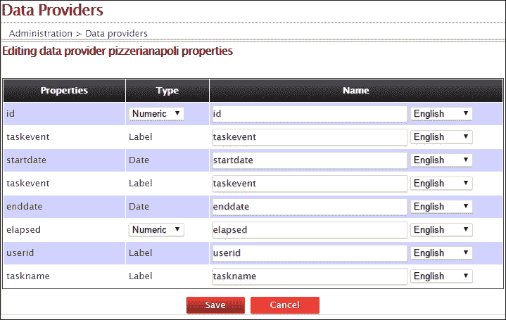

我们现在准备定义 KPI，但在那之前，我们需要在仪表板上创建一个新的空白页面，我们将在这个页面上放置图表。

## 创建新的仪表板页面和 KPI 面板

让我们创建一个将要托管图表的仪表板页面。

1.  通过点击仪表板顶部工具栏中**页面**列表旁边的**空白页面**图标来创建新页面（参见以下截图）：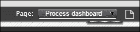

1.  设置页面设置（查看以下截图），然后点击**创建新页面**按钮：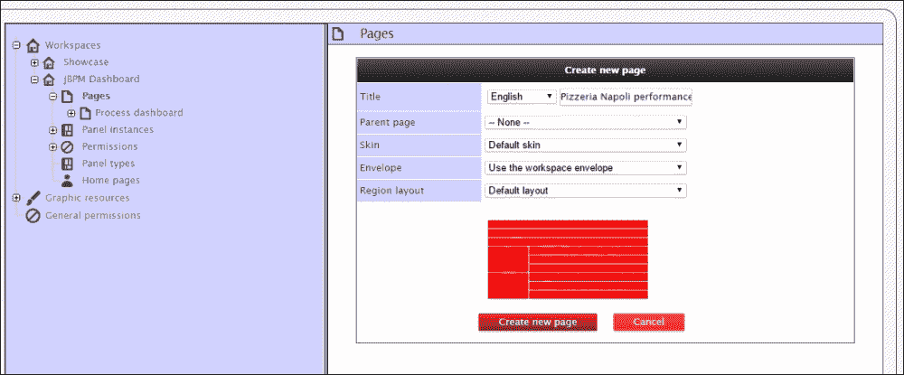

1.  在左侧导航菜单中点击新页面，将页面 URL 插入**页面属性**中，并保存更改。

1.  返回工作区，从顶部页面下拉列表中选择新页面；然后，选择**在当前页面创建新面板**项；将弹出一个包含所有可用面板的列表。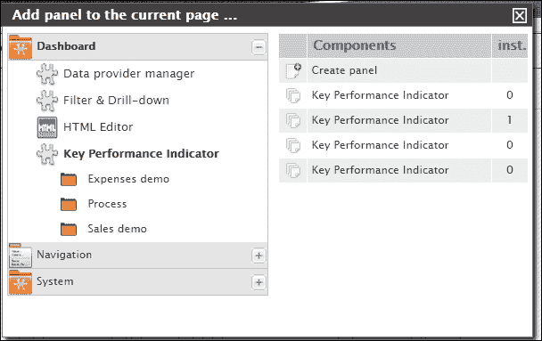

1.  将**创建面板**项（位于**组件**列表顶部）拖放到你希望 KPI 显示的突出显示的目标页面面板上；放置的项会提示你选择数据源提供者。选择我们的`pizzerianapoli`数据提供者会将 KPI 配置面板带到前台。

KPI 的相关设置细节如下：

**用户在任务上花费的总时间** KPI 配置：

+   **数据提供者**：pizzerianapoli

+   **KPI 名称**：用户在任务上花费的总时间（毫秒）

+   **柱状图**

+   **范围（X 轴）**：userid

+   **范围（Y 轴）**：经过时间；编辑范围（标量函数：求和）

+   **渲染器**：打开 Flash

+   **图表类型**：带边界的箱形图

**用户执行的任务数** KPI 配置：

+   **数据提供者**：pizzerianapoli

+   **KPI 名称**：按用户划分的任务

+   **柱状图**

+   **范围（X 轴）**：userid

+   **范围（Y 轴）**：taskname；编辑范围（标量函数：计数）

+   **渲染器**：NVD3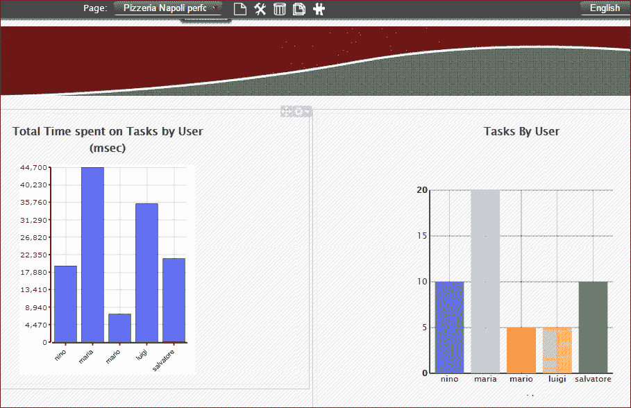

## 备注

正如我们之前强调的，审计数据的经过时间以毫秒为单位表示；这使得模拟随机延迟成为可能，并避免了测试运行时间过长。

由于延迟的随机性和“制作披萨”任务分配（马里奥和路易吉都可能成为相同任务的拥有者），你可能会有不同的审计数据；马里奥和路易吉的经过时间和总任务数在每个测试执行中都会变化。

然而，单元测试总是使路易吉比马里奥慢，因此整体 KPI 值从未改变。

在两个 KPI 中特别值得注意的是以下内容：

+   马里奥是制作披萨最快的人

+   玛丽亚是员工中最忙碌的（20 项任务：10 项订单分配 + 10 项配送分配）；她必须肯定提高她的效率，以免拖慢两位披萨制作师（等待她的订单分配）和送披萨的男孩（等待配送订单）

# 摘要

在本章中，我们探讨了 jBPM 管理功能，分别讨论了项目开发和 Kie 模块部署的新 Git 和 Maven 集成。你应该对 jBPM 模块管理有更好的理解，并且应该能够利用现成的 Red Hat 仪表板工具从 jBPM 审计数据开始创建和配置 BAM 图表。下一章将深入探讨 BPMN 结构，并提供实际的过程定义示例。
