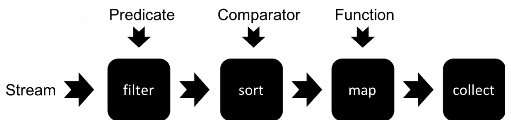

# 第三章：使用 Java 8 特性与 Selenium

随着 Selenium 3.0 迁移到 Java 8，我们可以使用 Java 8 的一些新特性，例如 Stream API 和 Lambda 或匿名函数，以函数式编程风格创建脚本。我们这样做是通过减少代码行数以及利用语言的新特性来实现的。在本章中，我们将涵盖以下主题：

+   介绍 Java 8 Stream API

+   使用 Stream API 收集和过滤数据

+   使用 Selenium WebDriver 与 Stream API

# 介绍 Java 8 Stream API

Stream API 是 Java 8 中 Collections API 的新增功能。Stream API 带来了处理对象集合的新方法。一个流代表了一序列的元素，并支持从集合中进行不同类型的操作（过滤、排序、映射和收集）。我们可以将这些操作链接在一起形成一个管道来查询数据，如图所示：



我们可以使用 `.stream()` 方法从集合中获取数据流。例如，我们有一个在标题部分显示的示例网络应用程序支持的编程语言下拉列表。让我们将其捕获到一个 `Array list` 中，如下所示：

```java
List<String> languages = new ArrayList<String>();
languages.add("English");
languages.add("German");
languages.add("French");
```

如果我们需要打印列表成员，我们将使用以下方式的 `for` 循环：

```java
for(String language : languages) {
    System.out.println(language);
}
```

使用 streams **API**，我们可以通过在 `languages` 数组列表上调用 `.stream()` 方法来获取数据流，并按以下方式打印成员：

```java
languages.stream().forEach(System.out::println);
```

获取数据流后，我们调用了 `forEach()` 方法，传递了对每个元素想要执行的操作，即使用 `System.out.println` 方法在控制台上输出成员值。

一旦从集合中获取了数据流，我们就可以使用该数据流来处理集合的元素或成员。

# Stream.filter()

我们可以使用 `filter()` 方法来过滤数据流。以下代码展示了如何从 `languages` 列表中获取的数据流中过滤以 **E** 开头的项目：

```java
stream.filter( item -> item.startsWith("E") ); 
```

`filter()` 方法接受一个谓词（Predicate）作为参数。谓词接口包含一个名为 `boolean test(T t)` 的函数，它接受一个参数并返回一个布尔值。在先前的示例中，我们将 lambda 表达式 `item -> item.startsWith("E")` 传递给了 `test()` 函数。

当在数据流上调用 `filter()` 方法时，传递给 `filter()` 函数的过滤条件将被内部存储。项目不会立即被过滤。

传递给 `filter()` 函数的参数决定了数据流中哪些项目应该被处理以及哪些应该被排除。如果 `Predicate.test()` 函数对一个项目返回 `true`，则意味着它应该被处理。如果返回 `false`，则该项目不会被处理。在先前的示例中，`test()` 函数将对所有以字符 `E` 开头的项目返回 `true`。

# Stream.sort()

我们可以通过调用 `sort()` 函数来对数据流进行排序。以下代码展示了如何使用 `sort()` 函数对 `languages` 列表进行排序：

```java
languages.stream().sorted();
```

这将按字母顺序对元素进行排序。我们可以提供一个 lambda 表达式来使用自定义比较逻辑对元素进行排序。

# Stream.map()

Streams 提供了一个 map() 方法，将流中的元素映射到另一种形式。让我们拿之前的例子，将语言列表的元素转换为大写，如下所示：

```java
languages.stream().map(item -> item.toUpperCase());
```

这将把语言集合中所有的字符串元素映射到它们的 uppercase 等效值。同样，这实际上并没有执行映射；它只是为映射配置了流。一旦调用了其中一个流处理方法，映射（和过滤）将会被执行。

# Stream.collect()

Streams 提供了 collect() 方法，作为 Stream 接口上的其他方法之一，用于流处理。当调用 collect() 方法时，将执行过滤和映射，并且那些操作的结果对象将被收集。让我们拿之前的例子，获取一个新的语言 uppercase 列表，如下面的代码所示：

```java
List<String> upperCaseLanguages = languages.stream()
        .map(item -> item.toUpperCase())
        .collect(Collectors.toList());

System.out.println(upperCaseLanguages);
```

此示例创建了一个流，添加了一个映射来将字符串转换为 uppercase，并收集所有对象到一个新的列表中。我们也可以使用过滤或排序方法，并根据过滤方法中应用的条件收集结果列表。

# Stream.min() 和 Stream.max()

Streams API 提供了 min() 和 max() 方法——分别用于在流中查找最小或最大值。

让我们在测试的示例应用程序的上下文中举一个例子。我们将创建一个简单的 Java 类，名为 `Product`，它存储由搜索返回的产品名称和价格。我们想要找到价格最低和最高的产品。我们的产品类将有两个成员，如下面的代码所示：

```java
class Product {
    String name;
    Double price;

    public Product(String name, double price) {
        this.name = name;
        this.price = price;
    }

    public String getName() {
        return name;
    }

    public Double getPrice() {
        return price;
    }
}
```

让我们创建一个包含搜索结果的产品列表，如下所示：

```java
List<Product> searchResult = new ArrayList<>();
searchResult.add(new Product("MADISON OVEREAR HEADPHONES", 125.00));
searchResult.add(new Product("MADISON EARBUDS", 35.00));
searchResult.add(new Product("MP3 PLAYER WITH AUDIO", 185.00));
```

我们可以通过传递比较属性（在这种情况下，是价格），使用 `.getPrice()` 方法来调用 `.min()` 函数。`.min()` 函数将使用价格属性并返回价格最低的元素，如下面的代码所示：

```java
Product product = searchResult.stream()
        .min(Comparator.comparing(item -> item.getPrice()))
        .get();

System.out.println("The product with lowest price is " + product.getName());
```

`get()` 方法将返回 `min()` 函数返回的对象。我们将将其存储在 Product 实例中。`min()` 函数找到 MADISON EARBUDS 作为价格最低的产品，如下面的控制台输出所示：

```java
The product with lowest price is MADISON EARBUDS
```

与 `min()` 函数相反，`max()` 函数将返回价格最高的产品，如下面的代码所示：

```java
product = searchResult.stream()
        .max(Comparator.comparing(item -> item.getPrice()))
        .get();
System.out.println("The product with highest price is " + product.getName());
```

`max()` 函数找到价格最高的产品：MP3 PLAYER WITH AUDIO。

```java
 The product with highest price is MP3 PLAYER WITH AUDIO
```

`min()` 和 `max()` 函数返回一个可选实例，该实例有一个 `get()` 方法来获取对象。如果流中没有元素，`get()` 方法将返回 null。

两个函数都接受一个比较器作为参数。`Comparator.comparing()` 方法根据传递给它的 lambda 表达式创建一个比较器。

# Stream.count()

Streams API 提供了一个返回在过滤后流中元素数量的`count`方法。让我们用之前的例子来获取 MADISON 品牌产品的数量：

```java
long count = searchResult.stream()
        .filter(item -> item.getName().startsWith("MADISON"))
        .count();
System.out.println("The number of products from MADISON are: " + count);
```

`count()`方法返回一个`long`类型，这是与过滤标准匹配的元素数量。在这个例子中，以下输出将在控制台上显示：

```java
The number of products from MADISON are: 2
```

# 使用 Stream API 与 Selenium WebDriver

现在我们已经介绍了 Streams API 及其各种函数，让我们看看我们如何在测试中使用它们。

# 过滤和计数 Web 元素

让我们从对示例应用程序主页上显示的链接进行的一个简单测试开始。我们获取主页上的所有链接，并打印它们的数量，然后是页面上可见链接的数量，如下面的代码所示：

```java
@Test
public void linksTest() {

    List<WebElement> links = driver.findElements(By.tagName("a"));
    System.out.println("Total Links : " + links.size());

    long count = links.stream().filter(item -> item.isDisplayed()).count();
    System.out.println("Total Link visible " + count);
}
```

在前面的代码中，我们使用了`findElements()`方法和`By.tagName`来获取主页上的所有链接。然而，为了找出其中的可见链接，我们使用了带有谓词的`filter()`函数来测试链接是否显示。这是通过调用`WebElement`接口的`isDisplayed()`方法来完成的。如果链接显示，`isDisplayed`方法将返回`true`；否则，它将返回`false`。最后，我们调用`count()`方法来获取由`filter()`函数返回的链接数量。这将在控制台上显示以下输出：

```java
Total Links : 88
Total Link visible 37
```

# 过滤元素属性

在示例代码中，我们将过滤一个具有空`alt`属性定义的图像列表。如果你想要检查页面上显示的图像的可访问性，这很有用。根据可访问性指南，所有图像都应该定义`alt`属性。这是通过过滤图像，通过测试`getAttribute("alt")`方法来完成的；它返回一个空字符串，如下面的代码所示：

```java
@Test
public void imgAltTest() {

    List<WebElement> images = driver.findElements(By.tagName("img"));

    System.out.println("Total Images : " + images.size());

    List<WebElement> imagesWithOutAlt = images.stream()
 .filter(item -> item.getAttribute("alt") == "")
 .collect(Collectors.toList());

    System.out.println("Total images without alt attribute " + imagesWithOutAlt);
}
```

`filter()`函数将返回所有具有空`alt`属性定义的图像元素的列表。

# 使用 Map 函数从元素中获取文本值

在这个例子中，我们将修改我们在早期章节中创建的搜索测试，以测试包含预期产品列表的结果，如下面的代码所示：

```java
@Test
public void searchProduct() {

    // find search box and enter search string
    WebElement searchBox = driver.findElement(By.name("q"));

    searchBox.sendKeys("Phones");

    WebElement searchButton =
            driver.findElement(By.className("search-button"));

    searchButton.click();

    assertThat(driver.getTitle())
            .isEqualTo("Search results for: 'Phones'");

    List<WebElement> searchItems = driver
            .findElements(By.cssSelector("h2.product-name a"));

    List<String> expectedProductNames =
            Arrays.asList("MADISON EARBUDS",
                    "MADISON OVEREAR HEADPHONES",
                    "MP3 PLAYER WITH AUDIO");

    List<String> productNames = searchItems.stream()
 .map(WebElement::getText)
 .collect(Collectors.toList());

    assertThat(productNames).
            isEqualTo(expectedProductNames);

}
```

在前面的代码中，我们创建了一个包含所有由`findElements()`方法返回的匹配产品的列表。然后我们通过调用`map()`函数检索每个元素的文本，并将返回值映射到一个字符串列表中。这与`expectedProductNames`列表进行比较。

# 过滤并在 Web 元素上执行操作

让我们进一步修改搜索测试，找到与给定名称匹配的产品。然后我们将点击该产品以打开产品详情页面，如下面的代码所示：

```java
@Test
 public void searchAndViewProduct() {

     // find search box and enter search string
     WebElement searchBox = driver.findElement(By.name("q"));

     searchBox.sendKeys("Phones");

     WebElement searchButton =
             driver.findElement(By.className("search-button"));

     searchButton.click();

     assertThat(driver.getTitle())
             .isEqualTo("Search results for: 'Phones'");

     List<WebElement> searchItems = driver
             .findElements(By.cssSelector("h2.product-name a"));

     WebElement product = searchItems.stream()
             .filter(item -> item.getText().equalsIgnoreCase("MADISON EARBUDS"))
             .findFirst()
             .get();

     product.click();

     assertThat(driver.getTitle())
             .isEqualTo("Madison Earbuds");
}
```

在前面的代码中，我们使用了`filter()`函数从 WebElements 列表中查找特定的产品。我们使用`findFirst()`函数检索第一个匹配的产品。这将返回一个代表链接元素的`WebElement`。然后我们点击该元素以在浏览器中打开产品详情页面。

因此，我们可以用多种方式使用 Streams API，用几行代码就创建出功能性强、易读的代码。

# 摘要

在本章简短的介绍中，我们学习了如何使用 Selenium 8 Stream API 和 Lambda 函数来简化 Selenium WebDriver 的代码。这有助于你以函数式编程风格编写代码，使其更加流畅和易读。Stream 对于处理 WebElements 列表非常有用。我们可以通过 Stream 轻松地收集和过滤数据。

在下一章中，我们将探讨 WebDriver 的截图、窗口和框架处理、同步以及管理 cookie 的功能。

# 问题

1.  哪个版本的 Java Streams API 被引入？

1.  解释 Streams API 中的 filter 函数。

1.  Streams API 中的哪种方法会从 filter()函数返回匹配元素的数量？

1.  我们可以使用`map()`函数通过属性值过滤 WebElements 列表：对还是错？

# 更多信息

你可以查看以下链接，了解更多关于本章所涵盖主题的信息：

+   +   在[`www.oracle.com/technetwork/articles/java/ma14-java-se-8-streams-2177646.html`](https://www.oracle.com/technetwork/articles/java/ma14-java-se-8-streams-2177646.html)和[`docs.oracle.com/javase/8/docs/api/java/util/stream/Stream.html`](https://docs.oracle.com/javase/8/docs/api/java/util/stream/Stream.html)了解更多关于 Stream API 的信息

    +   在[`docs.oracle.com/javase/tutorial/java/javaOO/lambdaexpressions.html`](https://docs.oracle.com/javase/tutorial/java/javaOO/lambdaexpressions.html)了解更多关于 Lambda 表达式的信息
