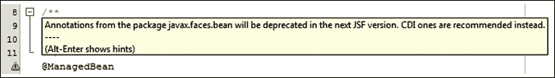
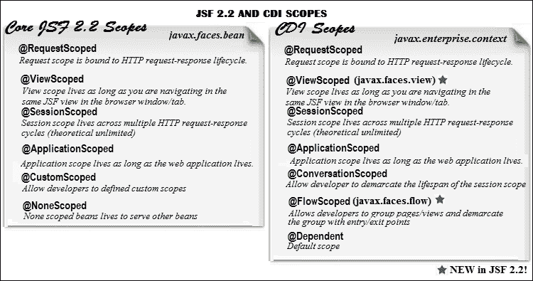
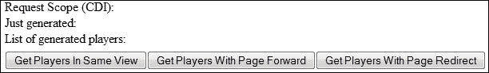
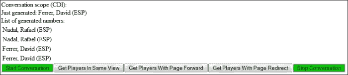
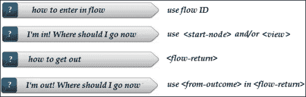
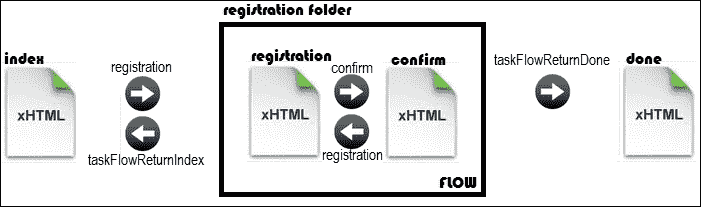
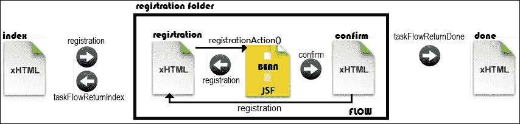
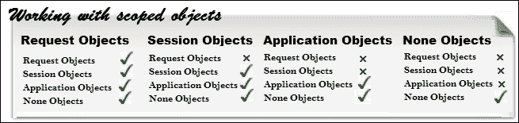
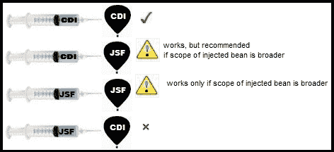

# 第三章. JSF 作用域 – 在管理 Bean 通信中的生命周期和使用

如果编程是一种艺术，那么正确地使用作用域就是其中的一部分！

这个断言通常是正确的，不仅适用于 JSF。我现在应该使用会话作用域，还是请求作用域？我是否有太多的会话 Bean？我能将这个作用域注入到那个作用域中吗？这个会话对象是否太大？你问过自己这类问题有多少次了？我知道……很多次！也许在这一章中，你将找到一些问题的答案，并加强你对使用 JSF 作用域的知识。

我们有很多事情要做；因此，让我们简要概述一下你将在本章中看到的内容：

+   JSF 作用域与 CDI 作用域

+   请求作用域、会话作用域、视图作用域、应用作用域、会话作用域、流程作用域、无作用域、依赖作用域和自定义作用域

+   Bean 注入

# JSF 作用域与 CDI 作用域

即使是 JSF 初学者也可能听说过 JSF 管理 Bean（由 JSF 管理的常规 JavaBean 类）和 CDI Bean（由 CDI 管理的常规 JavaBean 类），并且知道 JSF 支持 JSF 作用域和 CDI 作用域。从 Java EE 6 开始，CDI 被认可为管理 Bean 框架，除了 EJBs 之外。这导致程序员之间产生混淆，因为 EJBs、CDIs 和 JSF 管理 Bean 提出了一个关键问题：何时使用哪一个？

专注于 JSF，普遍的答案是 CDI Bean 比 JSF Bean 更强大。但是，当你从一开始就知道 CDI 不会成为你应用程序的一部分，或者你在一个没有默认 CDI 支持的服务器容器（如 Apache Tomcat）中运行应用程序时，那么 JSF Bean 就是正确的选择。换句话说，当你需要一个简单的方式来定义 Bean 和一个整洁的依赖注入机制时，JSF Bean 可以完成这项工作，但是当你需要重型武器，如事件、类型安全注入、自动注入、生产者方法和拦截器时，CDI 将代表完整的解决方案。

此外，NetBeans IDE 8.0 警告我们，在下一个 JSF 版本中，JSF Bean 的注解将被弃用，而 CDI Bean 被推荐使用（如以下截图所示）。这个警告和作为 CDI 依赖项引入的新 JSF 2.2 流程作用域，是 JSF 和 CDI 越来越接近的强大信号：



### 注意

CDI Bean 比 JSF Bean 更强大；因此，尽可能使用 CDI Bean。

因此，强有力的论据表明 CDI 通常是正确的选择，但仍然有一些情况下使用 JSF Bean 是有效的，正如你很快就会发现的。

JSF Bean 的主要注解（如`@ManagedBean`和作用域注解）定义在`javax.faces.bean`包中，而 CDI 的主要注解定义在`javax.inject`（如`@Named`）和`javax.enterprise.context`（如作用域）包中。

JSF 管理 bean 使用`@ManagedBean`注解，这允许我们将它注入到另一个 bean（不是 CDI bean！）中，并使用 EL 表达式从 JSF 页面访问 bean 属性和方法。CDI bean 使用`@Named`注解，这为视图技术（如 JSP 或 Facelets）提供了一个 EL 名称。

通常，JSF bean 的声明如下所示：

```java
package *package_name*;

import javax.faces.bean.ManagedBean;
import javax.faces.bean.jsfScoped;

@ManagedBean
@*jsf*Scoped
public class JSFBeanName {
...
}
```

JSF bean 的`@ManagedBean`支持一个可选参数`name`。提供的名称可以用于以下方式从 JSF 页面引用 bean：

```java
@ManagedBean(name="*custom name*")
```

CDI bean 具有相同的形状，但具有不同的注解，如下面的代码所示：

```java
package *package_name*;

import javax.inject.Named;
import javax.enterprise.context.cdiScoped;

@Named
@*cdi*Scoped
public class CDIBeanName {
...
}
```

CDI bean 的`@Named`注解支持一个可选参数`value`。提供的名称可以用于以下方式从 JSF 页面引用 bean：

```java
@Named(value="*custom name*")
```

### 注意

注意，CDI 注解不能与 JSF 注解在同一个 bean 中混合，只能在同一个应用程序中。例如，您不能使用`@ManagedBean`和 CDI 作用域（或它们之间的任何其他组合）来定义一个 bean，但您可以在同一个应用程序中有一个管理 bean（或更多）和一个 CDI bean（或更多）。

在下面的图中，您可以看到 JSF 2.2 作用域的简要概述：



在下一节中，您将看到每个 JSF/CDI 作用域是如何工作的。

# 请求作用域

**请求作用域**绑定到 HTTP 请求-响应生命周期。

请求作用域在任何 Web 应用程序中都非常有用，定义在请求作用域中的对象通常具有较短的生存期；bean 的生存期与 HTTP 请求-响应相同。当容器从客户端接受 HTTP 请求时，指定的对象附加到请求作用域，并在容器完成向该请求发送响应后释放。每个新的 HTTP 请求都会带来一个新的请求作用域对象。简而言之，请求作用域代表用户在单个 HTTP 请求中与 Web 应用程序的交互。通常，请求作用域对于简单的 GET 请求很有用，这些请求向用户公开一些数据，而无需存储数据。

### 注意

请求作用域存在于 JSF 和 CDI 中，并且以相同的方式工作。它可以用于非富 AJAX 和非 AJAX 请求。对于 JSF 管理 bean（`@ManagedBean`），这是默认的作用域，如果没有指定。

例如，假设我们有一个预定义的网球运动员列表，并且我们从这个列表中随机提取他们，并将他们存储在另一个列表中。当前生成的球员和提取的球员列表是管理 bean 的属性，它们的值在 JSF 页面中显示。

### 注意

请求作用域注解是`@RequestScoped`，在 CDI 中定义在`javax.enterprise.context`包中，在 JSF 中定义在`javax.faces.bean`包中。

CDI bean 的代码可以写成如下：

```java
@Named
@RequestScoped
public class PlayersBean {

  final String[] players_list = {"Nadal, Rafael (ESP)","Djokovic, Novak (SRB)", "Ferrer, David (ESP)", "Murray, Andy (GBR)", "Del Potro, Juan Martin (ARG)"};

  private ArrayList players = new ArrayList();
  private String player;

  //getters and setters

  public void newPlayer() {
    int nr = new Random().nextInt(4);
    player = players_list[nr];
    players.add(player);
  }
}
```

JSF 页面的相关部分如下：

```java
<h:body>
  Just generated:
  <h:outputText value="#{playersBean.player}"/><br/>

  List of generated players:
  <h:dataTable var="t" value="#{playersBean.players}">
    <h:column>
      <h:outputText value="#{t}"/>
    </h:column>
  </h:dataTable>       
  <h:form>
    <h:commandButton value="Get Players In Same View" actionListener="#{playersBean.newPlayer()}"/>
    <h:commandButton value="Get Players With Page Forward" actionListener="#{playersBean.newPlayer()}" action="index.xhtml"/>
    <h:commandButton value="Get Players With Page Redirect" actionListener="#{playersBean.newPlayer()}" action="index.xhtml?faces-redirect=true;"/>
  </h:form>
</h:body>
```

当您点击标记为**使用页面前进获取玩家**或**获取同一视图中的玩家**的按钮时，您将看到以下截图所示的内容：


由于请求作用域的生命周期与 HTTP 请求-响应的生命周期相同，而页面前进意味着一个单独的 HTTP 请求-响应，因此您将看到在当前请求中提取的播放器和提取的播放器列表，该列表将始终只包含此播放器。列表为每个请求创建，并用当前播放器填充，这使得列表变得无用。

### 注意

请求作用域在转发时不会丢失对象的状态，因为源页面和目标页面（转发页面）是同一请求-响应周期的一部分。这并不适用于重定向操作。

当您点击标记为**使用页面重定向获取玩家**的按钮时，您将看到以下截图所示的内容：



在这种情况下，当前提取的玩家和列表内容不可用，因为 JSF 重定向意味着两个请求，而不是像前进情况那样只有一个。

可以使用以下代码以编程方式访问请求映射：

```java
FacesContext context = FacesContext.getCurrentInstance();
Map<String, Object> requestMap = context.getExternalContext().getRequestMap();
```

将页面 1 中定义的表单通过豆提交到页面 2，然后您有以下情况：

+   如果使用相同的视图或前进，则数据将在页面 2 上可用以显示

+   如果使用重定向，则数据将丢失，无法在页面 2 上显示

CDI 豆的 JSF 版本如下：

```java
import javax.faces.bean.ManagedBean;
import javax.faces.bean.RequestScoped;

@ManagedBean
@RequestScoped
public class PlayersBean {
  ...
}
```

它与 CDI 豆的功能相同！

### 注意

带有`@PostConstruct`注解的方法将为每个请求调用，因为每个请求都需要请求作用域的独立实例。

CDI 豆的情况被封装在名为`ch3_1_1`的应用程序中，而 JSF 豆的情况被封装在名为`ch3_1_2`的应用程序中。

# 会话作用域

**会话作用域**跨越多个 HTTP 请求-响应周期（理论上无限）。

请求作用域在任何需要每个 HTTP 请求-响应周期中只有一个交互的 Web 应用程序中非常有用。然而，当您需要用户会话中属于任何 HTTP 请求-响应周期的可见对象时，则需要会话作用域；在这种情况下，该豆的生命周期与 HTTP 会话的生命周期相同。会话作用域允许您创建并将对象绑定到会话。它会在会话中涉及此豆的第一个 HTTP 请求时创建，并在 HTTP 会话无效时销毁。

### 注意

会话作用域存在于 JSF 和 CDI 中，并且在两者中功能相同。通常，它用于处理用户特定数据（如凭证、购物车等）的 AJAX 和非 AJAX 请求。

因此，第一个 HTTP 请求初始化会话并存储对象，而后续请求可以访问这些对象以执行进一步的任务。当浏览器关闭、超时触发、点击注销或程序性子例程强制执行时发生会话失效。通常，每次需要在整个会话（多个请求和页面）中保留数据时，会话作用域是正确的选择。

例如，你可以将会话作用域添加到本章之前的应用程序中，以存储跨多个请求随机提取的玩家列表。

### 注意

会话作用域注解是`@SessionScoped`，在 CDI 中定义在`javax.enterprise.context`包中，在 JSF 中定义在`javax.faces.bean`包中。

CDI bean 修改如下：

```java
import java.io.Serializable;
import javax.enterprise.context.SessionScoped;
import javax.inject.Named;

@Named
@SessionScoped
public class PlayersBean implements Serializable{
  ...
}
```

或者，JSF 版本如下：

```java
import java.io.Serializable;
import javax.faces.bean.ManagedBean;
import javax.faces.bean.SessionScoped;

@ManagedBean
@SessionScoped
public class PlayersBean implements Serializable{
  ...
}
```

### 注意

注意到会话作用域 bean 可能会被容器钝化，并且应该能够通过实现`java.io.Serializable`接口来钝化；参考将会话数据从硬盘上持久化/恢复的能力。

会话对象在转发和重定向机制中保持有效。在下面的屏幕截图中，你可以看到当前提取的玩家和属于同一会话的几个请求后的提取玩家列表：


现在列表不再是无用的了！你可以添加操作其内容的方法，例如排序或删除。

可以按以下方式编程访问会话映射：

```java
FacesContext context = FacesContext.getCurrentInstance();
Map<String, Object> sessionMap = context.getExternalContext().getSessionMap();
```

此外，你可以按以下方式使会话无效：

```java
FacesContext.getCurrentInstance().getExternalContext().invalidateSession();
```

显然，通过会话作用域提交的数据将在后续请求中可用。

### 注意

带有`@PostConstruct`注解的方法将在会话期间仅调用一次，当会话 bean 实例化时。后续请求将使用此实例，因此它是一个添加初始化内容的好地方。

CDI bean 的情况被封装在名为`ch3_2_1`的应用中，而 JSF bean 的情况被封装在名为`ch3_2_2`的应用中。

# 视图作用域

**视图作用域**在你在浏览器窗口/标签中导航同一 JSF 视图时保持有效。

当你需要在不点击链接、返回不同的操作结果或任何其他导致当前视图被丢弃的交互中保留数据时，视图作用域非常有用。它在 HTTP 请求时创建，在你回发到不同的视图时销毁；只要回发到相同的视图，视图作用域就保持活跃。

### 注意

注意到视图作用域 bean 可能会被容器钝化，并且应该通过实现`java.io.Serializable`接口来钝化。

由于视图作用域在您在相同视图中编辑某些对象时特别有用，因此它对于丰富的 AJAX 请求来说是一个完美的选择。此外，由于视图作用域绑定到当前视图，它不会反映浏览器中另一个窗口或标签页中存储的信息；这是一个特定于会话作用域的问题！

### 注意

为了保持视图活跃，bean 方法（动作/监听器）必须返回 `null` 或 `void`。

在 CDI 中不可用视图作用域，但 JSF 2.2 通过新的注解 `@ViewScoped` 引入了它。这定义在 `javax.faces.view.ViewScoped` 包中，并且它与 CDI 兼容。不要将此 `@ViewScoped` 与定义在 `javax.faces.bean` 包中的那个混淆，后者是 JSF 兼容的！

### 注意

视图作用域注解是 `@ViewScoped`，它定义在 `javax.faces.view` 包中用于 CDI，以及定义在 `javax.faces.bean` 包中用于 JSF。

您可以通过修改 `PlayersBean` 的作用域来查看视图作用域的实际效果，如下所示：

```java
import java.io.Serializable;
import javax.faces.view.ViewScoped;
import javax.inject.Named;

@Named
@ViewScoped
public class PlayersBean implements Serializable{
  ...
}
```

通过点击标记为 **Get Players In Same View** 的按钮来触发多个 HTTP 请求将揭示如下截图所示的内容。注意，动作方法 (`newPlayer`) 返回 void，并且按钮不包含 `action` 属性，这意味着在执行这些请求期间，您处于相同的 JSF 视图中。


其他两个按钮包含 `action` 属性，并指示显式导航，这意味着在每次请求时都会更改当前视图，并且数据会丢失。

您可以轻松地将 `PlayersBean`（以及任何其他 bean）适配以使用 `@ViewScoped` 的 JSF 版本，如下所示：

```java
import java.io.Serializable;
import javax.faces.bean.ManagedBean;
import javax.faces.bean.ViewScoped;

@ManagedBean
@ViewScoped
public class PlayersBean implements Serializable{
  ...
}
```

通过视图作用域提交的表单数据，只要您处于同一视图，就会在后续请求中可用。

### 注意

带有 `@PostConstruct` 注解的方法仅在视图作用域的 bean 实例化时被调用。后续从这个视图发出的请求将使用此实例。只要您处于同一视图，此方法就不会再次被调用；因此，它是一个添加特定于当前视图的初始化内容的良好位置。

CDI bean 的案例被封装在名为 `ch3_6_1` 的应用程序中，而 JSF bean 的案例被封装在名为 `ch3_6_2` 的应用程序中。

### 注意

从 JSF 2.2 版本开始，我们可以使用 `UIViewRoot.restoreViewScopeState(FacesContext context, Object state)` 方法来恢复不可用的视图作用域。这将在第十二章 *Facelets 模板*中举例说明。

# 应用程序作用域

**应用程序作用域**与 Web 应用程序的生命周期一样长。

应用范围通过所有用户与 Web 应用程序交互的共享状态扩展了会话范围；此范围与 Web 应用程序的生命周期相同。由于应用范围的 bean 在应用程序关闭（或它们被编程删除）之前一直存在，因此我们可以说这个范围存在时间最长。更精确地说，位于应用范围的对象可以从应用程序的任何页面访问（例如，JSF、JSP 和 XHTML）。

### 注意

应仅将应用范围用于可以安全共享的数据。由于应用范围的 bean 被所有用户共享，您需要确保该 bean 具有不可变状态，或者您需要同步访问。

通常，应用范围对象用作计数器，但它们可以用于许多其他任务，例如初始化和导航。例如，应用范围可以用来统计在线用户数量，或者将此信息与所有用户共享。实际上，它可以用于在所有会话之间共享数据，例如常量、通用设置和跟踪变量。

### 注意

应用范围注解是`@ApplicationScoped`，在 CDI 中定义在`javax.enterprise.context`包中，在 JSF 中定义在`javax.faces.bean`包中。

如果将`PlayersBean`托管 bean 放入应用范围，那么随机抽取的玩家列表将在所有会话中可用。您可以通过以下代码实现：

```java
import javax.enterprise.context.ApplicationScoped;
import javax.inject.Named;

@Named
@ApplicationScoped
public class PlayersBean {
  ...
}
```

JSF 版本在以下代码中显示：

```java
import javax.faces.bean.ApplicationScoped;
import javax.faces.bean.ManagedBean;

@ManagedBean
@ApplicationScoped
public class PlayersBean {
  ...
}
```

为了测试应用范围，您需要打开多个浏览器或使用多台机器。

在从应用范围的 bean 向多个会话 bean（例如，使用注入）提供数据时，请务必小心，因为所有会话共享的数据可以由每个会话单独修改。这可能导致多个用户之间的数据不一致；因此，请确保暴露的应用数据在会话中不会被修改。

### 注意

CDI bean 的案例被包裹在名为`ch3_3_1`的应用中，而 JSF bean 的案例被包裹在名为`ch3_3_2`的应用中。

可以使用以下代码以编程方式访问应用映射：

```java
FacesContext context = FacesContext.getCurrentInstance();
Map<String, Object> applicationMap = context.getExternalContext().getApplicationMap();
```

带有`@PostConstruct`注解的方法仅在应用范围的 bean 实例化时调用。后续请求将使用此实例。通常，这发生在应用程序启动时；因此，请将此 bean 上下文中的应用特定初始化任务放在此方法内部。

# 会话范围

**会话范围**允许开发者界定会话范围的生命周期。

对话作用域致力于用户与 JSF 应用程序的交互，并代表用户视角上的工作单元；在这个作用域中的 Bean 能够跟踪与用户的对话。我们可以将对话作用域视为开发者控制的会话作用域，跨越 JSF 生命周期的多次调用；而会话作用域跨越无限请求，对话作用域仅跨越有限数量的请求。

### 注意

对话作用域 Bean 可能会被容器钝化，并且应该通过实现 `java.io.Serializable` 接口来具备钝化能力。

开发者可以显式设置对话作用域的边界，并且可以根据业务逻辑流程启动、停止或传播对话作用域。所有长时间运行的对话都作用域于特定的 HTTP 服务器会话，并且可能不会跨越会话边界。此外，对话作用域在 JSF 应用程序中保持与特定 Web 浏览器窗口/标签页相关的状态。

### 注意

对话作用域注解是 `@ConversationScoped`，它定义在 `javax.enterprise.context` 包中用于 CDI。这个作用域在 JSF 中不可用！

处理对话作用域与其他作用域略有不同。首先，您使用 `@ConversationScope` 标记 Bean，由 `javax.enterprise.context.ConversationScoped` 类表示。其次，CDI 提供了一个内置的 Bean（`javax.enterprise.context.Conversation`），用于控制 JSF 应用程序中对话的生命周期——其主要职责是管理对话上下文。此 Bean 可以通过注入获得，如下面的代码所示：

```java
private @Inject Conversation conversation;
```

默认情况下，`Conversation` 对象处于短暂状态，应该通过调用 `begin` 方法将其转换为长时间运行的对话。您还需要通过调用 `end` 方法为对话的销毁做好准备。

### 注意

如果在对话处于活动状态时尝试调用 `begin` 方法，或者在对话处于非活动状态时调用 `end` 方法，将会抛出 `IllegalStateException`。我们可以通过使用名为 `isTransient` 的方法来避免这种情况，该方法返回一个布尔值，用于测试 `Conversation` 对象的传递性状态。

现在，将 `begin`、`end` 和 `isTransient` 方法一起添加到以下对话中：

+   要开始对话，代码如下：

    ```java
    if (conversation.isTransient()) {
      conversation.begin();
    }
    ```

+   要停止对话，代码如下：

    ```java
    if (!conversation.isTransient()) {
      conversation.end();
    }
    ```

例如，您可以在 `PlayersBean` 中添加对话作用域如下：

```java
@Named
@ConversationScoped
public class PlayersBean implements Serializable {

 private @Inject
 Conversation conversation;

  final String[] players_list = {"Nadal, Rafael (ESP)","Djokovic, Novak (SRB)", "Ferrer, David (ESP)", "Murray, Andy (GBR)", "Del Potro, Juan Martin (ARG)"};
  private ArrayList players = new ArrayList();
  private String player;

  public PlayersBean() {
  }

  //getters and setters

  public void newPlayer() {
    int nr = new Random().nextInt(4);
    player = players_list[nr];
    players.add(player);
  }   

 public void startPlayerRnd() {
 if (conversation.isTransient()) {
 conversation.begin();
 }
 }

 public void stopPlayerRnd() {
 if (!conversation.isTransient()) {
 conversation.end();
 }
 }
}
```

除了注入内置的 CDI Bean，请注意您已经定义了一个方法（`startPlayerRnd`）用于标记对话的起始点，以及另一个方法（`stopPlayerRnd`）用于标记对话的结束点。在这个例子中，这两个方法都通过两个按钮暴露给用户，但您也可以通过有条件地调用它们来程序化地控制对话。

在对话中运行示例将揭示如下截图所示的内容：



随机抽取的玩家列表将保持为空或仅包含当前抽取的玩家，直到点击标记为**开始对话**的按钮。在此刻，列表将被存储在会话中，直到点击标记为**停止对话**的按钮。

### 注意

在对话过程中，用户可以对 bean 执行 AJAX/非 AJAX 请求或导航到其他仍引用此相同管理 bean 的页面。bean 将使用容器生成的**对话标识符**在用户交互中保持其状态，这就是为什么在需要实现向导时，对话范围可能是正确的选择。但是，考虑新的 JSF 2.2 流程范围也是一个好主意，因为它解决了对话范围的几个缺陷。请参阅即将到来的部分！

在此示例中，对话上下文会自动与任何 JSF faces 请求或重定向一起传播（这有助于实现常见的 POST-then-redirect 模式），但它不会自动与非 faces 请求（如链接）一起传播。在这种情况下，您需要将对话的唯一标识符作为请求参数包含在内。CDI 规范为这种用途保留了请求参数`cid`。以下代码将通过链接传播对话上下文：

```java
<h:link outcome="/link.xhtml" value="Conversation Propagation">
  <f:param name="cid" value="#{conversation.id}"/>
</h:link>
```

### 注意

带有`@PostConstruct`注解的方法将在每次请求中调用，只要 bean 不参与对话。当对话开始时，该方法会为该实例调用，后续请求将使用此实例，直到对话结束。因此，请小心管理此方法的内容。

此示例被封装在名为`ch3_4`的应用程序中，并可在本章的代码包中找到。

# 流程范围

**流程范围**允许开发者对页面/视图进行分组，并通过入口/出口点来划分该组。

在请求范围和会话范围之间，我们有 CDI 流程范围。这个范围在 Spring Web Flow 或 ADF 流程中存在一段时间，现在在 JSF 2.2 中也可用。基本上，流程范围允许我们通过一个入口点（称为**起始节点**）和一个出口点（称为**返回节点**）来划分一组相关的页面/视图（通常，逻辑相关）。

### 注意

流程范围是包含向导的应用程序的好选择，例如多屏幕订阅/注册、预订和购物车。一般来说，任何具有逻辑起点和终点的应用程序块都可以封装到流程范围中。

在同一应用程序中，我们可以定义多个流，这些流可以被视为可重用且能够通信的模块。它们可以按顺序调用，可以封装成玛莉亚莎娃娃或创建任何自定义设计。此外，通过仅插入/拔出入口和出口点，就可以非常容易地将流移动、删除或添加到这样的应用程序中。

要了解使用流作用域的好处，您必须识别一些不使用它的应用程序的缺点。如下列所示：

+   每个应用程序都是一个大型流，但通常页面并不遵循任何直观的逻辑设计。显然，即使页面在逻辑上相关，如向导或购物车页面，也由无序的顺序来管理。

    ### 注意

    流作用域允许我们定义逻辑工作单元。

+   重复使用页面可能是一项艰巨的任务，因为页面与 UI 组件和用户交互紧密相连。

    ### 注意

    流作用域提供了可重用性。

+   CDI 提供了能够跨越多个页面的会话作用域，但流作用域更适合 JSF。

+   作为会话作用域，流作用域覆盖了一组页面/视图，但它有几个主要优点，例如它更加灵活，不需要笨拙的开始/结束操作，流作用域的 bean 在用户进入或退出流时自动创建和销毁，提供了易于使用的对入站/出站参数、预处理程序和后处理程序的支持，并且预处理器和后处理器。由于信息在页面之间通过会话作用域传输，因此普通的流不能在多个窗口/标签页中打开。

    ### 注意

    流中的数据仅限于该流本身；因此，可以在多个窗口/标签页中打开流。

+   **节点**定义了流的入口和出口点，并且有五种类型的节点，如下列所示：

    +   **视图**：这代表应用程序中参与流的任何 JSF 页面。它被称为流的**视图节点**。

    +   **方法调用**：这表示使用 EL 调用方法。被调用的方法可能返回一个结果，指示下一个应导航的节点。

    +   **切换**：`switch`情况语句是长`if`语句的替代品。情况由 EL 表达式表示，并评估为布尔值。每个情况都伴随着一个结果，当条件评估为`true`时将使用该结果。还有一个默认结果，当所有情况都评估为`false`时将使用。

    +   **流调用**：这用于在当前流中调用另一个流——这些是流之间的转换点。被调用的流（称为内部或嵌套流）嵌套在调用它的流中（称为调用流或外部流）。当嵌套流完成其任务后，它将从调用流返回一个视图节点，这意味着调用流只有在嵌套流的生存周期结束时才会获得控制权。

    +   **流返回**：这可以用于将结果返回给调用流。

流可以传递参数从一个传递到另一个。一个流发送给另一个流的参数被称为**出站参数**，而一个流从另一个流接收到的参数被称为**入站参数**。

嗯，在这个时候，你应该已经拥有了足够的信息来开发一些示例。但在这样做之前，你需要注意一些标签、注解和约定。

流定义基于配置的一组约定。一个流有一个名称，一个在应用程序 Web 根目录中反映流名称的文件夹，以及一个表示起始节点且也反映流名称的视图。此文件夹将属于同一流的页面/视图分组。

为了使用一个流，你需要完成一些配置任务。这些任务可以通过配置文件或编程方式完成。如果你选择第一种方法，那么配置文件可以限制为一个流，这意味着它存储在流文件夹中，并以*flowname*`-flow.xml`的格式命名，或者你可以使用`faces-config.xml`文件将所有流放在一个地方。

由于我们的第一个示例使用配置文件，我们需要使用标签。用于配置流的标签如下：

+   `< flow-definition>`：此标签包含一个`id`属性，该属性唯一标识流。此 ID 的值是用于从 JSF 页面或 bean 引用流的流名称。

+   `<view>`：它嵌套在`<flow-definition>`标签中，表示代表流节点的 JSF 页面；它为每个页面（Facelet）路径关联一个显式 ID（进一步，你可以通过其 ID 引用每个页面）。页面路径在`<view>`标签中映射，该标签嵌套在`<view>`标签内。此标签的存在是可选的，但按照惯例，至少应该有一个`<view>`标签表示起始节点（起始页面），特别是如果你想设置除了默认的起始节点之外的另一个起始节点，该节点由与流具有相同名称（ID）的页面表示。此外，你可以使用可选的`<start-node>`*ID*`</start-node>`标签来指示映射自定义起始页面的`<view>`标签的 ID。作为替代，流起始节点可以通过将`<view>`标签的`id`属性值设置为流 ID，并将封装的`<vdl-document>`标签的内容作为自定义起始页面的路径来指示。当你引用流 ID 时，JSF 将转到该页面并自动将你放入流中。

+   `<flow-return>`：它嵌套在`<flow-definition>`标签中，并将结果返回给调用流。你可以通过`id`属性的值来引用它。至少有三种退出流的方法：使用`<flow-return>`，使用稍后介绍的`<flow-call>`，或者放弃流。

### 注意

我们刚才说过，一个流程通过一个 ID（一个名称）来识别。但是，当相同的流程名称在多个文档中定义（如在大型项目中使用来自不同供应商的多个打包流程），还需要一个额外的 ID。这个 ID 被称为**文档 ID**。因此，当你需要识别一个名称在不同文档中出现的流程时，我们需要流程 ID 和定义文档 ID。大多数情况下，文档 ID 被省略；因此，本节中没有演示。在本节中，你将看到关于它的几个提示。

为了定义最简单的流程，你需要了解以下图表：



## 简单的流程

使用这三个标签，`<start-node>`和/或`<view>`，`<flow-return>`，和`<from-outcome>`，你可以配置一个简单的流程，比如一个跑步注册表单。假设一个网球运动员通过由两个 JSF 页面组成的流程在线注册一个锦标赛（流程名称将为`registration`）：一个用于收集数据的表单页面和一个确认页面。此外，还将有两个页面在流程之外，一个用于进入流程（如网站的第一个页面），另一个在确认后调用。

在下面的图中，你可以看到我们流程的图像：



让我们看看流程之外、注册文件夹之外的第一页的代码（`index.xhtml`）如下：

```java
<h:body>
  <h1><b>In flow ? 
  #{null != facesContext.application.flowHandler.currentFlow}
  </b></h1><br/><br/>   
  Flow Id: #{facesContext.application.flowHandler.currentFlow.id}
  REGISTER NEW PLAYER
  <h:form>
    <h:commandButton value="Start Registration" action="registration" immediate="true"/>
  </h:form>
</h:body>
```

这里可以观察到两个重要的事情。首先，以下几行：

```java
  #{null != facesContext.application.flowHandler.currentFlow}
  #{facesContext.application.flowHandler.currentFlow.id}
```

第一行返回一个布尔值，指示当前页面是否在流程中。显然，`index.xhtml`页面不在流程中；因此，将返回`false`。你可以用它进行测试。第二行显示当前流程的 ID。

此外，你需要查看`<h:commandButton>`标签的`action`属性的值。这个值是我们流程的名称（ID）；在窗口上下文启用后，JSF 将搜索指定的流程并导航到流程的起始节点。默认情况下，窗口上下文是禁用的。

因此，当点击标记为**开始注册**的按钮时，应用程序进入注册流程并加载由`registration.xhtml`页面表示的起始节点页面。此页面的代码如下：

```java
<h:body>
  <h1><b>First page in the 'registration' flow</b></h1>
  <h1><b>In flow ? 
  #{null != facesContext.application.flowHandler.currentFlow}
  </b></h1><br/><br/> 

  You are registered as:#{flowScope.value}
  <h:form prependId="false">
    Name &amp; Surname: 
    <h:inputText id="nameSurnameId" value="#{flowScope.value}" />
    <h:commandButton value="Register To Tournament" action="confirm"/>           
    <h:commandButton value="Back(exit flow)" action="taskFlowReturnIndex"/>  
  </h:form>
</h:body>
```

由于我们处于流程中，`currentFlow`将返回`true`。

更重要的是关注隐式对象`flowScope`；然而，正如您从第一章动态访问 JSF 应用程序数据")中了解到的，*通过表达式语言(EL 3.0)动态访问 JSF 应用程序数据*，`flowScope`隐式对象（表示当前流程）用于在整个流程中共享数据，并映射到`facesContext.getApplication().getFlowHandler().getCurrentFlowScope()`。例如，`<h:inputText>`标签的值可以放入`flowScope`对象中，并且可以在下一页的流程作用域中读取，如下所示：

```java
#{flowScope.value}
```

标有**注册到锦标赛**的按钮导航到流程中的第二页`confirm.xhtml`；这是一个常见的导航情况，这里没有太多可说的。但另一个按钮通过指示流程返回的 ID 导航到流程外部（到`index.xhtml`）。在配置文件中，此流程返回的代码如下：

```java
<flow-return id="taskFlowReturnIndex">
  <from-outcome>/index</from-outcome>
</flow-return>
```

`confirm.xhtml`页面的代码如下：

```java
<h:body>
  <h1><b>Second page in the 'registration' flow</b></h1>
  <h1><b>In flow ? 
  #{null != facesContext.application.flowHandler.currentFlow}
  </b></h1><br/><br/> 
  You are registered as:#{flowScope.value}
  <h:form prependId="false">           
    <h:commandButton value="Back (still in flow)" action="registration"/>
    <h:commandButton value="Next (exit flow)" action="taskFlowReturnDone"/>
  </h:form>
</h:body>
```

此页面显示已输入并存储在流程作用域中的数据，以及两个按钮。第一个按钮导航回`registration.xhtml`页面，而另一个按钮导航到流程外部的`done.xhtml`页面。流程返回通过 ID 识别，如下面的代码所示：

```java
<flow-return id="taskFlowReturnDone">
  <from-outcome>/done</from-outcome>
</flow-return>
```

`done.xhtml`页面只是检查页面是否在流程中，并显示一条简单消息，如下面的代码所示：

```java
<h:body>
  <h1><b>In flow ? 
  #{null != facesContext.application.flowHandler.currentFlow}
  </b></h1><br/><br/>        
  REGISTER NEW PLAYER ENDED        
</h:body>
```

最后一步是在配置文件中定义流程。由于您只有一个流程，您可以在`registration`文件夹中创建一个名为`registration-flow.xml`的文件。以下为`registration-flow.xml`文件的代码：

```java
<faces-config version="2.2" 

  xsi:schemaLocation="http://xmlns.jcp.org/xml/ns/javaee
  http://xmlns.jcp.org/xml/ns/javaee/web-facesconfig_2_2.xsd">

  <flow-definition id="registration">
    <view id="registration">
      <vdl-document>/registration/registration.xhtml</vdl-document>
    </view>
    <flow-return id="taskFlowReturnIndex">
      <from-outcome>/index</from-outcome>
    </flow-return>
    <flow-return id="taskFlowReturnDone">
      <from-outcome>/done</from-outcome>
    </flow-return>
  </flow-definition>    
</faces-config>
```

您也可以将以下代码放置在`faces-config.xml`文件中的`<faces-flow-definition>`标签内：

```java
<faces-flow-definition>
  <flow-definition id="registration">
  ...
</faces-flow-definition>
```

此示例被封装在名为`ch3_7_1`的应用程序中，该应用程序位于本章代码包中。

## 带有 Bean 的流程

除了页面外，一个流程还可以包含 Bean。在流程中定义的 Bean 被注解为`@FlowScoped`；这是一个 CDI 注解，它允许自动激活（当作用域进入时）和钝化（当作用域退出时）。`@FlowScoped` Bean 需要一个名为`value`的属性，它包含流程 ID。存储在这样的 Bean 中的数据可以在属于该流程的所有页面上访问。

### 注意

流程作用域 Bean 可能会被容器钝化，并且应该能够通过实现`java.io.Serializable`接口来支持钝化。

在注册流程中添加 Bean 可以修改初始图，如下面的图所示：



如您所见，该 Bean 会将从注册表单收集的数据存储在流程作用域中（在先前的示例中，这些数据是通过`flowScope`隐式对象传递的）。标有“**注册参加锦标赛**”的按钮将调用`registrationAction` Bean 方法，该方法将决定数据是否有效，并将流程返回到`registration.xhtml`页面或`confirm.xhtml`页面。

`registration.xhtml` 页面的代码修改如下：

```java
<h:body>
  <h1><b>First page in the 'registration' flow</b></h1>
  <h1><b>In flow ? 
  #{null != facesContext.application.flowHandler.currentFlow}
  </b></h1><br/><br/> 
  Your registration last credentials:
  #{registrationBean.playerName} #{registrationBean.playerSurname}
  <h:form prependId="false">
    Name: <h:inputText value="#{registrationBean.playerName}"/>
    Surname: <h:inputText value="#{registrationBean.playerSurname}"/>
    <h:commandButton value="Register To Tournament" action="#{registrationBean.registrationAction()}"/> 
    <h:commandButton value="Back (exit flow)" action="taskFlowReturnIndex"/>  
  </h:form>
</h:body>
```

`RegistrationBean`的代码如下：

```java
@Named
@FlowScoped(value="registration")
public class RegistrationBean implements Serializable {

  private String playerName;
  private String playerSurname;

  ...
  //getters and setters
  ...

  public String getReturnValue() {
    return "/done";
  }

  public String registrationAction(){

    //simulate some registration conditions
    Random r= new Random();
    int nr = r.nextInt(10);

    if(nr < 5){
      playerName="";
      playerSurname="";
      FacesContext.getCurrentInstance().addMessage("password",
      new FacesMessage(FacesMessage.SEVERITY_ERROR, "Registration failed!",""));
      return "registration";
    } else {
      return "confirm";
    }
  }
}
```

代码是自我解释的，但关于`getReturnValue`方法呢？这是一个流程作用域 Bean 如何指示流程返回结果的示例。而不是使用以下代码：

```java
<flow-return id="taskFlowReturnDone">
  <from-outcome>/done</from-outcome>
</flow-return>
```

您可以使用以下代码：

```java
<flow-return id="taskFlowReturnDone">
  <from-outcome>#{registrationBean.returnValue}</from-outcome>
</flow-return>
```

此示例被封装在名为`ch3_7_2`的应用程序中，该应用程序可在本章的代码包中找到。

## 嵌套流程

好吧，现在让我们通过在现有流程下添加另一个流程来使事情变得复杂。假设在注册后，玩家必须指出他可以参加第一场比赛的日期和时间。这可以通过一个名为`schedule`的新流程来完成。`registration`流程将调用`schedule`流程，并向其传递一些参数。`schedule`流程将返回到`registration`流程，该流程将提供一个简单的按钮用于导航出`registration`流程。

### 注意

嵌套流程只返回到调用流程。您必须在嵌套流程的`<flow-return>`标签中引用调用流程的页面，包括调用流程返回的页面。

传递参数需要在配置标签中使用更多标签。因此，您需要了解以下标签：

+   `<flow-call>`：在当前流程中调用另一个流程。此标签需要`id`属性。此属性的值将用于引用此流程调用。

+   `<flow-reference>`：这是嵌套在`<flow-call>`标签中，并包含必须调用的流程的 ID。

+   `<outbound-parameter>`：这是嵌套在`<flow-call>`标签中，并定义了必须传递给被调用流程的参数。

+   `<inbound-parameter>`：这定义了从另一个流程传递的参数。

为了看到这些标签在起作用，您需要查看应用程序流程。应用程序的图表将按以下方式更改：


我们从`confirm.xhtml`页面（在`registration`流程中定义）继续我们的讨论。从这个页面，我们想要导航到`schedule.xhtml`页面，该页面在`schedule`流程（`schedule`文件夹）中可用。为此，我们可以添加一个新按钮，标有**安排**，如下面的代码所示：

```java
<h:form prependId="false"> 
  <h:commandButton value="Back (still in flow)" action="registration"/>
 <h:commandButton id="Next" value="Schedule" action="callSchedule" /> 
  <h:commandButton value="Next (exit flow)" action="taskFlowReturnDone"/>
</h:form>
```

按钮的`action`属性值是`<flow-call>`标签的 ID。当按钮被点击时，JSF 定位到相应的`<flow-call>`标签，并跟随由`<flow-id>`标签指示的流程，如下面的代码所示：

```java
<flow-call id="callSchedule">
  <flow-reference>
    <flow-id>schedule</flow-id>
  </flow-reference>   
...
</flow-call>
```

此外，我们希望从 `registration` 流程传递几个参数到 `schedule` 流程：玩家姓名和姓氏（存储在流程作用域的 `RegistrationBean` 对象中）以及代表某些注册代码的常量（也可以根据某些规则生成）。这可以通过 `<outbound-parameter>` 标签实现，如下面的代码所示：

```java
<flow-call id="callSchedule">
  <flow-reference>
    <flow-id>schedule</flow-id>
  </flow-reference>   
 <outbound-parameter>
 <name>playernameparam</name>
 <value>#{registrationBean.playerName}</value>
 </outbound-parameter> 
 <outbound-parameter>
 <name>playersurnameparam</name>
 <value>#{registrationBean.playerSurname}</value>
 </outbound-parameter> 
 <outbound-parameter>
 <name>playerregistrationcode</name>
 <value>349CF0YO122</value>
 </outbound-parameter> 
</flow-call>
```

`schedule.xhtml` 页面根据接收到的参数显示一条问候信息，并允许玩家输入他可用于参加第一场比赛的日期和小时，如下面的代码所示：

```java
<h:body>
  <h1><b>First page in the 'schedule' flow</b></h1>
  <h1><b>In flow ? 
  #{null != facesContext.application.flowHandler.currentFlow}
  </b></h1><br/><br/> 
  Hello, #{flowScope.name} #{flowScope.surname} (#{scheduleBean.regcode})
  <h:form prependId="false">
    Day: <h:inputText value="#{scheduleBean.day}"/>
    Starting At Hour: <h:inputText value="#{scheduleBean.hourstart}"/>     
    <h:commandButton value="Save" action="success"/>
  </h:form>
</h:body>
```

注意，姓名和姓氏是通过 `flowScope` 对象从流程作用域中获得的，而注册代码是从流程作用域的 `ScheduleBean` 中获得的；这个对象存储了日期、小时（从玩家那里接收）和注册代码（从 `registration` 流程接收）。从注册 Bean 接收到的每条信息都使用 `schedule-flow.xml` 文件中的 `<inbound-parameter>` 标签引导到存储位置，如下面的代码所示：

```java
<flow-definition id="schedule">
  <view id="schedule">
    <vdl-document>/schedule/schedule.xhtml</vdl-document>
  </view>   

 <inbound-parameter>
 <name>playernameparam</name>
 <value>#{flowScope.name}</value>
 </inbound-parameter>
 <inbound-parameter>
 <name>playersurnameparam</name>
 <value>#{flowScope.surname}</value>
 </inbound-parameter> 
 <inbound-parameter>
 <name>playerregistrationcode</name>
 <value>#{scheduleBean.regcode}</value>
 </inbound-parameter> 
</flow-definition>
```

在日期和小时插入后，标记为 **保存** 的按钮应该保存数据并导航到 `success.xhtml` 页面，这是一个显示玩家提供所有数据的简单页面。从该页面，我们可以通过一个标记为 **退出注册** 的简单按钮返回到调用流程 `registration`，如下面的代码所示：

```java
<h:body>
  <h1><b>Second page in the 'schedule' flow</b></h1>
  <h1><b>In flow ?
  #{null != facesContext.application.flowHandler.currentFlow}
  </b></h1><br/><br/> 
  You are registered as
  #{flowScope.name} #{flowScope.surname} (#{scheduleBean.regcode})
  You will play first match 
  #{scheduleBean.day} after #{scheduleBean.hourstart} 
  <h:button value="Exit Registration" outcome="taskFlowReturnThanks"/>
</h:body>
```

结果 `taskFlowReturnThanks` 在 `schedule-flow.xml` 文件中定义如下：

```java
<flow-return id="taskFlowReturnThanks">
  <from-outcome>/registration/thanks.xhtml</from-outcome>
</flow-return>
```

`thanks.xhtml` 页面是用户从 `registration` 流程退出之前的最后一步，如下面的代码所示：

```java
<h:body>       
  <h1><b>Third page in the 'registration' flow</b></h1>
  <h1><b>In flow ? #{null != facesContext.application.flowHandler.currentFlow}</b></h1><br/><br/>
  Thanks for your patience, Mr :#{registrationBean.playerName} 
  #{registrationBean.playerSurname}<br/>
  <b>We wish you beautiful games!</b><br/><br/>
  <h:button value="Bye Bye, #{registrationBean.playerSurname}" outcome="taskFlowReturnDone"/>
</h:body>
```

如果你想跳过 `thanks.xhtml` 页面，直接从两个流程外部退出，那么你可以定义流程返回，`taskFlowReturnThanks`，指向 `done.xhtml` 页面，这是由调用流程通过 `taskFlowReturnDone` 流程返回返回的。因此，我们可以使用以下代码：

```java
<flow-return id="taskFlowReturnThanks">          
  <from-outcome>taskFlowReturnDone</from-outcome>
</flow-return>
```

这个示例被包含在名为 `ch3_7_3` 的应用程序中，该应用程序位于本章代码包中。

### 注意

流程可以使用 JSF 2.2 `FlowBuilder` API 声明性或编程地配置。

## 编程配置流程

在所有之前的示例中，你看到了如何使用声明性方法配置流程。但是，流程也可以通过编程方式配置。编程配置流程的步骤如下：

1.  创建一个类并将其命名为流程。这更像是一种约定，而不是要求！

1.  在这个类中，编写一个如下所示的代码方法；`@FlowDefinition` 注解是一个类级别注解，它允许使用 `FlowBuilder` API 定义流程定义。这个方法的名称可以是任何有效的名称，但 `defineFlow` 似乎是一种约定。所以，名称 `defineFlow` 不是强制的，你甚至可以在同一个类中定义更多的流程，只要正确地注解了它们。

    ```java
    @Produces
    @FlowDefinition
    public Flow defineFlow(@FlowBuilderParameter FlowBuilder flowBuilder) {
      ...
    }
    ```

1.  使用 `FlowBuilder` API 配置流程。

使用 `FlowBuilder` API 非常简单直观。例如，你可以按如下方式程序性地编写 `registration-flow.xml` 文件：

```java
public class Registration implements Serializable {        

  @Produces
  @FlowDefinition
  public Flow defineFlow(@FlowBuilderParameter FlowBuilder flowBuilder) {

    String flowId = "registration";
    flowBuilder.id("", flowId);
    flowBuilder.viewNode(flowId, "/" + flowId + "/" + flowId + ".xhtml").markAsStartNode();
    flowBuilder.viewNode("confirm-id", "/" + flowId + "/confirm.xhtml");
    flowBuilder.viewNode("thanks-id", "/" + flowId + "/thanks.xhtml");
    flowBuilder.returnNode("taskFlowReturnIndex").fromOutcome("/index");
    flowBuilder.returnNode("taskFlowReturnDone").fromOutcome("#{registrationBean.returnValue}");

    flowBuilder.flowCallNode("callSchedule").flowReference("", "schedule").outboundParameter("playernameparam", "#{registrationBean.playerName}"). outboundParameter("playersurnameparam", "#{registrationBean.playerSurname}").outboundParameter("playerregistrationcode", "349CF0YO122");

    return flowBuilder.getFlow();
  }
}
```

如您所见，对于声明性方法中使用的每个标签，`FlowBuilder` API 中都有一个对应的方法。例如，`flowBuilder.id` 方法接受两个参数：第一个参数表示文档 ID（通常为空格），第二个参数表示流程 ID。

`schedule-flow.xml` 文件可以按如下所示程序性地转换：

```java
public class Schedule implements Serializable {

  @Produces
  @FlowDefinition
  public Flow defineFlow(@FlowBuilderParameter FlowBuilder flowBuilder) {

    String flowId = "schedule";
    flowBuilder.id("", flowId);
    flowBuilder.viewNode(flowId, "/" + flowId + "/" + flowId + ".xhtml").markAsStartNode();
    flowBuilder.viewNode("success-id", "/" + flowId + "/success.xhtml");
    flowBuilder.returnNode("taskFlowReturnThanks").fromOutcome("/registration/thanks.xhtml");

    flowBuilder.inboundParameter("playernameparam", "#{flowScope.name}");
    flowBuilder.inboundParameter("playersurnameparam", "#{flowScope.surname}");
    flowBuilder.inboundParameter("playerregistrationcode", "#{scheduleBean.regcode}");             

    return flowBuilder.getFlow();
  }
}
```

### 注意

被注解为 `@PostConstruct` 的方法将在应用程序进入当前流程并实例化流程作用域的 bean 时被调用，而后续请求将使用此实例，直到流程被丢弃。如果应用程序再次进入此流程，此操作会重复。因此，可以在此处放置针对当前流程的特定初始化。

此示例被封装在名为 `ch3_7_5` 的应用程序中，该应用程序位于本章的代码包中。

在同一个应用程序中可以混合声明性和程序性配置。例如，检查名为 `ch3_7_4` 的应用程序，它为 `registration` 流程使用程序性配置，为 `schedule` 流程使用声明性配置。

## 流程和导航案例

导航案例可以用于在流程内进行导航。在此刻，当您点击标记为 **注册到锦标赛** 的按钮时，流程将基于隐式导航进入 `confirm.xhtml` 页面。但我们可以通过替换 `action` 属性的值轻松地展示流程中的显式导航：

```java
<h:commandButton value="Register To Tournament" action="confirm_outcome"/>
```

现在，`confirm_outcome` 不能自动获取到 `confirm.xhtml` 页面；因此，在 `registration-flow.xml` 文件中，我们可以添加一个显式的导航案例，如下所示：

```java
<navigation-rule>
  <from-view-id>/registration/registration.xhtml</from-view-id>
  <navigation-case>
    <from-outcome>confirm_outcome</from-outcome>
    <to-view-id>/registration/confirm.xhtml</to-view-id>
    <redirect/>           
  </navigation-case> 
</navigation-rule>
```

### 注意

当您需要使用导航案例进入流程时，您必须在 `<navigation-case>` 标签内指定 `<to-flow-document-id>`*document_ID*`</to-flow-document-id>` 语句。如果没有文档 ID，则使用 `<to-flow-document-id/>`。此外，可以使用 `<h:button>`（或 `<h:link>`）进入此类流程，如下所示：

```java
<h:button id="..." value="*enter flow*" outcome="*flow*">
  <f:attribute name="to-flow-document-id" value="unique"/>
</h:button>
```

如果您选择编写程序性导航案例，那么 JSF 2.2 带有一个名为 `getToFlowDocumentId` 的方法，该方法需要被覆盖以指示文档 ID。

到目前为止，一切恢复正常。因此，我们可以使用显式导航案例在流程的页面之间进行导航。完整的应用程序命名为 `ch3_11_1`。

为了以程序性的方式完成相同的事情，你需要使用 `NavigationCaseBuilder` API，如下所示；这是相同的导航案例，所以我们只使用了所需的方法：

```java
flowBuilder.navigationCase().fromViewId("/registration/registration.xhtml").fromOutcome("confirm_outcome").toViewId("/registration/confirm.xhtml").redirect();
```

此示例被封装在完整的应用程序 `ch3_11_2` 中。

此外，你甚至可以使用自定义导航处理程序。新的`NavigationHandlerWrapper`类（在 JSF 2.2 中添加）提供了`NavigationHandler`类的一个简单实现。因此，我们可以轻松地扩展它以使用自定义导航处理程序证明导航案例，如下面的代码所示：

```java
public class CustomNavigationHandler extends NavigationHandlerWrapper {

  private NavigationHandler configurableNavigationHandler;

  public CustomNavigationHandler() {}

  public CustomNavigationHandler(NavigationHandler configurableNavigationHandler){
    this.configurableNavigationHandler = configurableNavigationHandler;
  }

  @Override
  public void handleNavigation(FacesContext context, String fromAction, String outcome) {

    if (outcome.equals("confirm_outcome")) {
      outcome = "confirm";
    }

    getWrapped().handleNavigation(context, fromAction, outcome);
  }

  @Override
  public NavigationHandler getWrapped() {
    return configurableNavigationHandler;
  }
}
```

最后，在`faces-config.xml`文件中的快速配置如下：

```java
<application>        
  <navigation-handler>           
    book.beans.CustomNavigationHandler
  </navigation-handler>        
</application>
```

### 注意

当流程有一个文档 ID 时，你需要重写`handleNavigation(FacesContext context, String fromAction, String outcome, String toFlowDocumentId)`方法。

完整的应用程序名称为`ch3_11_3`。

## 检查流程导航案例

无论你选择哪种方法在流程中使用导航案例，你都可以通过`ConfigurableNavigationHandler.inspectFlow`方法检查它们。此方法由流程系统调用以导致流程被检查导航规则。你可以轻松地重写它以获取有关导航案例的信息，通过编写一个自定义的可配置导航处理程序。最简单的方法是扩展新的`ConfigurableNavigationHandlerWrapper`类（在 JSF 2.2 中引入），它代表`ConfigurableNavigationHandler`的一个简单实现。例如，以下代码段发送关于每个找到的导航案例的日志信息：

```java
public class CustomConfigurableNavigationHandler extends ConfigurableNavigationHandlerWrapper {

  private final static Logger logger = Logger.getLogger(CustomConfigurableNavigationHandler.class.getName());
  private ConfigurableNavigationHandler configurableNavigationHandler;

  public CustomConfigurableNavigationHandler() {}

  public CustomConfigurableNavigationHandler(ConfigurableNavigationHandler configurableNavigationHandler){
    this.configurableNavigationHandler = configurableNavigationHandler;
  }

  @Override
  public void inspectFlow(FacesContext context, Flow flow) {
    getWrapped().inspectFlow(context, flow);
    if (flow.getNavigationCases().size() > 0) {
      Map<String, Set<NavigationCase>> navigationCases = flow.getNavigationCases();
      for (Map.Entry<String, Set<NavigationCase>> entry : navigationCases.entrySet()) {
        logger.log(Level.INFO, "Navigation case: {0}", entry.getKey());
        for (NavigationCase nc : entry.getValue()) {
          logger.log(Level.INFO, "From view id: {0}", nc.getFromViewId());
          logger.log(Level.INFO, "From outcome: {0}", nc.getFromOutcome());
          logger.log(Level.INFO, "To view id: {0}", nc.getToViewId(context));
          logger.log(Level.INFO, "Redirect: {0}", nc.isRedirect());
        }
      }
    }
  }

  @Override
  public ConfigurableNavigationHandler getWrapped() {
    return configurableNavigationHandler;
  }
}
```

如果你将此自定义可配置导航处理程序附加到前三个示例之一，那么你将获得有关所提供导航案例的信息。完整的示例名称为`ch3_15`。

## 使用初始化器和终结器

通过使用`FlowBuilder` API，我们可以附加回调方法，这些方法将在创建流程和销毁之前自动调用。`FlowBuilder.initializer`方法具有以下签名，当创建流程时被调用：

```java
public abstract FlowBuilder initializer(String methodExpression)
public abstract FlowBuilder initializer(javax.el.MethodExpression methodExpression)
```

`FlowBuilder.finalizer`签名在销毁流程之前被调用，如下所示：

```java
public abstract FlowBuilder finalizer(String methodExpression)
public abstract FlowBuilder finalizer(javax.el.MethodExpression methodExpression)
```

例如，可以使用`initializer`方法将外部参数传递到流程中。假设在`index.xhtml`页面（在流程外部），当我们点击标有**开始注册**的按钮时，我们希望将锦标赛名称和地点传递到流程中，如下所示：

```java
<h:form prependId="false">
  <h:inputHidden id="tournamentNameId" value="Roland Garros"/>
  <h:inputHidden id="tournamentPlaceId" value="France"/>
  <h:commandButton value="Start Registration" action="registration"/>
</h:form>
```

这两个参数必须在流程开始时可用，因为包装的信息是通过`RegistrationBean`的两个属性在`registration.xhml`页面（流程的起始节点）中显示的，即`tournamentName`和`tournamentPlace`。为此，我们需要调用`RegistrationBean`中的一个方法来提取这些信息并将它们存储在这两个属性中，如下面的代码所示：

```java
//initializer method
public void tournamentInitialize() {
  tournamentName = FacesContext.getCurrentInstance().getExternalContext().getRequestParameterMap().get("tournamentNameId");
  tournamentPlace = FacesContext.getCurrentInstance().getExternalContext().getRequestParameterMap().get("tournamentPlaceId");
}
```

现在是有趣的部分，因为我们可以使用`initializer`方法将`tournamentInitialize`方法指定为在创建流程时应调用的回调方法。这可以在`registration-flow.xml`文件中如下完成：

```java
<initializer>
  #{registrationBean.tournamentInitialize()}
</initializer>
```

因此，在这个时候，我们可以从流程的开始到流程的生命周期内直接使用锦标赛的名称和地点。

进一步来说，另一个简单的场景可以是使用`finalizer`方法的理由。假设我们通过一个名为`PlayersCounterBean`的应用程序范围 bean 来计算注册的玩家，如下所示：

```java
@Named
@ApplicationScoped
public class PlayersCounterBean {

  private int count = 0;

  public int getCount() {
    return count;
  }

  public void addPlayer() {
    count++;
  }
}
```

当玩家退出流程并且注册成功时，`count`变量应该增加；因此，我们可以在`registration-flow.xml`文件中放置一个`finalizer`方法，如下所示：

```java
<finalizer>
  #{registrationBean.tournamentFinalize()}
</finalizer>
```

`tournamentFinalize`方法在`RegistrationBean`中实现，如下所示：

```java
@Named
@FlowScoped(value = "registration")
public class RegistrationBean {

  @Inject
  private PlayersCounterBean playersCounterBean;
  ...
  //finalizer method
  public void tournamentFinalize() {
    playersCounterBean.addPlayer();
  }
}
```

由于`PlayersCounterBean`是一个应用程序 bean，我们可以在流程之外使用它的好处。完整的应用程序命名为`ch3_12_1`。

同样的输出可以使用以下代码程序性地实现：

```java
flowBuilder.initializer("#{registrationBean.tournamentInitialize(param['tournamentNameId'], param['tournamentPlaceId'])}");
flowBuilder.finalizer("#{registrationBean.tournamentFinalize()}");
```

为了变化，在这种情况下，我们没有使用请求参数`Map`提取参数值。我们更愿意使用隐式对象`param`，并将值作为`tournamentInitialize`方法的参数传递，如下所示：

```java
//initializer method
public void tournamentInitialize(String tn, String tp) {
  tournamentName = tn;
  tournamentPlace = tp;
}
```

完整的应用程序命名为`ch3_12_2`。

## 使用流程切换

`switch`情况语句是长`if`语句的替代品，并且对于条件结果映射非常有用。为了看到它的工作情况，我们可以假设每个锦标赛都有一个单独的`confirm.xhtml`页面。让我们有网球四大满贯及其相关的 XHTML 确认页面，如下所示：

+   罗兰·加洛斯和`confirm_rg.xhtml`

+   温布尔登和`confirm_wb.xhtml`

+   美国公开赛和`confirm_us.xhtml`

+   澳大利亚公开赛和`confirm_ao.xhtml`

锦标赛的名称和地点通过一个简单的表单（每个锦标赛一个表单）在流程中传递，如下所示（您可以从前面的章节中了解到如何在流程内部获取这些信息）：

```java
<h:form prependId="false">
  <h:inputHidden id="tournamentNameId" value="Australian Open"/>
  <h:inputHidden id="tournamentPlaceId" value="Australia"/>
  <h:commandButton value="Start Registration (Australian Open)" action="registration"/>
</h:form>
```

现在，在点击标记为**注册到...**的按钮后，我们需要选择正确的确认页面。为此，我们可以使用程序切换，如下所示：

```java
public class Registration implements Serializable {

  @Produces
  @FlowDefinition
  public Flow defineFlow(@FlowBuilderParameter FlowBuilder flowBuilder) {

    String flowId = "registration";
    flowBuilder.id("", flowId);
    flowBuilder.viewNode(flowId, "/" + flowId + "/" + flowId + ".xhtml").markAsStartNode();
    flowBuilder.viewNode("no-tournament-id", "/" + flowId + "/notournament.xhtml");
    flowBuilder.viewNode("confirm-rg-id", "/" + flowId + "/confirm_rg.xhtml");
    flowBuilder.viewNode("confirm-wb-id", "/" + flowId + "/confirm_wb.xhtml");
    flowBuilder.viewNode("confirm-us-id", "/" + flowId + "/confirm_us.xhtml");
    flowBuilder.viewNode("confirm-ao-id", "/" + flowId + "/confirm_ao.xhtml");
    flowBuilder.returnNode("taskFlowReturnDone").fromOutcome("#{registrationBean.returnValue}");

    flowBuilder.switchNode("confirm-switch-id").defaultOutcome("no-tournament-id").switchCase().condition("#{registrationBean.tournamentName eq 'Roland Garros'}").fromOutcome("confirm-rg-id").condition("#{registrationBean.tournamentName eq 'Wimbledon'}").fromOutcome("confirm-wb-id").condition("#{registrationBean.tournamentName eq 'US Open'}").fromOutcome("confirm-us-id").condition("#{registrationBean.tournamentName eq 'Australian Open'}").fromOutcome("confirm-ao-id");
    flowBuilder.initializer("#{registrationBean.tournamentInitialize(param['tournamentNameId'],param['tournamentPlaceId'])}");
    flowBuilder.finalizer("#{registrationBean.tournamentFinalize()}");

    return flowBuilder.getFlow();
  }
}
```

注意，当没有条件评估为`true`时，选定的节点将是`notournament.xhtml`页面，它代表默认结果。这只是一个包含一些特定文本的简单 XHMTL 页面。

完整的应用程序命名为`ch3_13`。在`registration-flow.xml`文件中，可以通过以下代码声明性地实现这一点。您可以使用`<view>`标签将结果路径隐藏在 ID 之后（将结果映射到页面），正如我们在程序示例中看到的那样：

```java
<switch id="confirm-switch-id">
  <default-outcome>
    /registration/notournament.xhtml
  </default-outcome>
  <case>
    <if>#{registrationBean.tournamentName eq 'Roland Garros'}</if>
    <from-outcome>/registration/confirm_rg.xhtml</from-outcome>
  </case>
  <case>
    <if>#{registrationBean.tournamentName eq 'Wimbledon'}</if>
    <from-outcome>/registration/confirm_wb.xhtml</from-outcome>
  </case>
  <case>
    <if>#{registrationBean.tournamentName eq 'US Open'}</if>
    <from-outcome>/registration/confirm_us.xhtml</from-outcome>
  </case>
  <case>
    <if>#{registrationBean.tournamentName eq 'Australian Open'}</if>
    <from-outcome>/registration/confirm_ao.xhtml</from-outcome>
  </case>
</switch>
```

因此，切换在您不想将每个结果映射到单个页面时非常有用。

这个例子没有被包含在一个完整的应用程序中。

## 打包流程

流作为工作逻辑单元；因此，它们可以在多个应用程序之间移植。这种可移植性是通过将流工件打包到 JAR 文件中获得的。此外，JAR 文件可以添加到任何应用程序的`CLASSPATH`中，流就可以使用了。要打包一个流，你需要遵循一些约定，如下列所示：

1.  在`faces-config.xml`文件中明确定义流。

1.  在 JAR 根目录中创建一个`META-INF`文件夹。

1.  将此文件夹中的`faces-config.xml`文件添加进来。

1.  将此文件夹中的`beans.xml`文件添加进来。

1.  在同一文件夹中，`META-INF`，创建一个名为`flows`的子文件夹。

1.  在`flows`文件夹中，添加流的所有节点（页面）。

1.  在 JAR 根目录中，在`META-INF`文件夹外部，添加流所需的全部 Java 代码（类）。

根据前面的步骤，*带有 bean 的流*部分中描述的流可以被打包成一个名为`registration.jar`的 JAR 文件，如下面的截图所示：


使用此 JAR 文件的应用程序完整名称为`ch3_14`。

## 程序流作用域

从编程的角度讲，可以通过`javax.faces.flow.FlowHandler`类访问流作用域。在获得`FlowHandler`类的对象后，你可以轻松地访问当前流，添加一个新的流，并操纵由`#{flowScope}`表示的流映射，如下所示：

```java
FacesContext context = FacesContext.getCurrentInstance();
Application application = context.getApplication();
FlowHandler flowHandler = application.getFlowHandler();

//get current flow
Flow flow = flowHandler.getCurrentFlow();
Flow flowContext = flowHandler.getCurrentFlow(context);     

//add flow
flowHandler.addFlow(context, *flow*);

//get access to the Map that backs #{flowScope}
Map<Object,Object> flowMap = flowHandler.getCurrentFlowScope();  
```

显然，`FlowHandler`类是参与运行时与面部流特征之间交互的最重要类。这是一个可以扩展以提供自定义流处理器实现的抽象类。为了做到这一点，你可以从创建一个新的`FlowHandlerFactory`类开始，该类被`Application`类用来创建`FlowHandler`类的单例实例。这个类有一个简单的实现名为`FlowHandlerFactoryWrapper`，它可以很容易地扩展以返回自定义流处理器，如下面的代码所示：

```java
public class CustomFlowHandlerFactory extends FlowHandlerFactoryWrapper {

  private FlowHandlerFactory flowHandlerFactory;

  public CustomFlowHandlerFactory(){}

  public CustomFlowHandlerFactory(FlowHandlerFactory flowHandlerFactory){
    this.flowHandlerFactory = flowHandlerFactory;
  }

  @Override
  public FlowHandler createFlowHandler(FacesContext context){
    FlowHandler customFlowHandler = new CustomFlowHandler(getWrapped().createFlowHandler(context));
    return customFlowHandler;
  }

  @Override
  public FlowHandlerFactory getWrapped() {
    return this.flowHandlerFactory;
  }    
}
```

此工厂应在`faces-config.xml`文件中配置，如下面的代码所示：

```java
<factory>
  <flow-handler-factory>
    book.beans.CustomFlowHandlerFactory
  </flow-handler-factory>
</factory>
```

此外，`CustomFlowHandler`类代表了对`FlowHandler`类的扩展。由于`FlowHandler`类是一个抽象类，你需要为它的每个方法提供一个实现，如下面的代码所示：

```java
public class CustomFlowHandler extends FlowHandler {

  private FlowHandler flowHandler;

  public CustomFlowHandler() {}

  public CustomFlowHandler(FlowHandler flowHandler) {
    this.flowHandler = flowHandler;
  }

  ...
  //Overrided methods
  ...

}
```

例如，你可以从前面的章节中知道，`registration`流向嵌套的`schedule`流传递了几个出站参数。你看到了如何在`registration-flow.xml`文件中声明性地完成这个操作，以及如何在`Registration`类中通过`FlowBuilder` API 编程式地完成，如下面的代码所示。你可以在名为`transition`的方法中从自定义流处理器做同样的事情，这个方法能够在一个源流（例如，`registration`）和一个目标流（例如，`schedule`）之间执行转换。当`registration`流调用`schedule`流时，你可以编写以下代码：

```java
@Override
public void transition(FacesContext context, Flow sourceFlow, Flow targetFlow, FlowCallNode outboundCallNode, String toViewId) {
  if ((sourceFlow != null) && (targetFlow != null)) {
    if ((sourceFlow.getStartNodeId().equals("registration")) && 
      (targetFlow.getStartNodeId().equals("schedule"))) {

      FlowCallNode flowCallNode = sourceFlow.getFlowCalls().get("callSchedule");
      Map<String, Parameter> outboundParameters = flowCallNode.getOutboundParameters();

      CustomParameter playernameparamO = new CustomParameter("playernameparam", "#{registrationBean.playerName}");
      CustomParameter playersurnameparamO = new CustomParameter("playersurnameparam", "#{registrationBean.playerSurname}");
      CustomParameter playerregistrationcodeO = new CustomParameter("playerregistrationcode","349CF0YO122");

      outboundParameters.put("playernameparam", playernameparamO);
      outboundParameters.put("playersurnameparam", playersurnameparamO);
      outboundParameters.put("playerregistrationcode", playerregistrationcodeO);
    }
  }
  flowHandler.transition(context, sourceFlow, targetFlow, outboundCallNode, toViewId);
}
```

目标入站参数可以按以下方式访问（`Map`参数不能更改）：

```java
Map<String, Parameter> inboundParameters = targetFlow.getInboundParameters();
```

流参数由 `javax.faces.flow.Parameter` 抽象类表示。`CustomParameter` 类提供了以下实现：

```java
public class CustomParameter extends Parameter {

  private String name;
  private String value;

  public CustomParameter(String name, String value) {
    this.name = name;
    this.value = value;
  }

  @Override
  public String getName() {
    return name;
  }

  @Override
  public ValueExpression getValue() {
    return createValueExpression(value, String.class);
  }

  private ValueExpression createValueExpression(String exp, Class<?> cls) {
    FacesContext facesContext = FacesContext.getCurrentInstance();
    ELContext elContext = facesContext.getELContext();
    return facesContext.getApplication().getExpressionFactory().
    createValueExpression(elContext, exp, cls);
  }
}
```

# 依赖伪范围

这是 CDI Bean（`@Named`）的默认范围，当没有指定任何内容时。在这种情况下，一个对象存在是为了精确地为一个 Bean 服务，并且具有与该 Bean 相同的生命周期；依赖范围 Bean 的实例不会在不同用户或不同注入点之间共享。它也可以通过使用 `@Dependent` 注解和导入 `javax.enterprise.context.Dependent` 来显式指定。这个范围仅在 CDI 中可用，并且是唯一的**非上下文**范围。

### 注意

所有 CDI 范围，除了这个之外，都被称为**正常**范围。关于正常范围与伪范围的更多详细信息，可以在[`docs.jboss.org/cdi/spec/1.0/html/contexts.html`](http://docs.jboss.org/cdi/spec/1.0/html/contexts.html)的*正常范围和伪范围*部分找到。

如果你将 `PlayersBean` 放在依赖范围中，那么当前提取的玩家和随机提取的玩家列表（可能为空或包含此玩家）仅在 Bean 内部可用，如下面的代码所示：

```java
import javax.enterprise.context.Dependent;
import javax.inject.Named;

@Named
@Dependent
public class PlayersBean {
  ...
}
```

### 注意

注有 `@PostConstruct` 的方法将为每个请求调用。实际上，如果 Bean 在多个 EL 表达式中使用，它可能会在同一个请求期间被多次调用。最初，有一个 Bean 的实例，如果 Bean EL 名称在 EL 表达式中多次出现，则此实例会被重用，但在另一个 EL 表达式或同一 EL 表达式的重新评估的情况下则不会重用。

这个例子被包裹在名为 `ch3_5` 的应用程序中，该应用程序位于本章代码包中。

# 无范围

**无范围**的 Bean 生存下来为其他 Bean 服务。

无范围似乎在 JSF 范围中是“黑羊”。即使它的名字也不让人联想到有用的东西。实际上，在这个范围内的管理 Bean 的生命周期与单个 EL 表达式评估一样长，并且在任何 JSF 页面中都是不可见的。如果应用程序范围是最长的，那么这个范围就是最短的。但是，如果你在其他管理 Bean 中注入无范围的管理 Bean，那么它们将与宿主一样长。实际上，这是它们的职责，为其他 Bean 服务。

### 注意

在配置文件中使用的无范围对象表示由其他管理 Bean 在应用程序中使用的管理 Bean。

因此，每次你需要一个谦逊的管理 Bean，它准备好成为请求或会话等酷范围的一部分时，你都可以使用 `javax.faces.bean` 包中的 `@NoneScoped` 注解它。此外，具有无范围的对象可以使用具有无范围的其它对象。

# 自定义范围

当没有前面的作用域满足你的应用程序需求时，你必须注意 JSF 2 自定义作用域。很可能你永远不会想编写自定义作用域，但如果有必要，那么在本节中，你可以看到如何完成这个任务。

### 注意

自定义作用域注解是`@CustomScoped`，它定义在`javax.faces.bean`包中。它不在 CDI 中可用！

为了实现自定义作用域，假设你想要控制几个在应用程序作用域中存在的 bean 的生命周期。通常，它们的生命周期与应用程序的生命周期相同，但你希望能够在应用程序流程的某些时刻将它们添加/从应用程序作用域中移除。当然，有许多方法可以做到这一点，但请记住，我们寻找实现自定义作用域的原因；因此，我们将尝试编写一个嵌套在应用程序作用域中的自定义作用域，这将允许我们添加/移除一批 bean。作用域的创建和销毁将反映在 bean 的创建和销毁中，这意味着你不需要引用每个 bean。

实际上，由于这只是一个演示，我们将只使用两个 bean：一个将保留在经典的应用程序作用域中（它可以用于比较应用程序和自定义作用域的生命周期），而另一个将通过自定义作用域被添加/销毁。应用程序的目的并不相关；你应该关注编写自定义作用域的技术，并填补假设和空白。多思考一下，当你真正需要实现自定义作用域时，你可以使用这些知识。

## 编写自定义作用域类

自定义作用域由一个扩展`ConcurrentHashMap<String, Object>`类的类表示。我们需要允许对普通映射的并发访问，因为暴露的数据可能被多个浏览器并发访问。`CustomScope`类的代码如下：

```java
public class CustomScope extends ConcurrentHashMap<String, Object> {

  public static final String SCOPE = "CUSTOM_SCOPE";

  public CustomScope(){
    super();
  }

  public void scopeCreated(final FacesContext ctx) {

    ScopeContext context = new ScopeContext(SCOPE, this);
    ctx.getApplication().publishEvent(ctx, PostConstructCustomScopeEvent.class, context);
    }

  public void scopeDestroyed(final FacesContext ctx) {

    ScopeContext context = new ScopeContext(SCOPE,this);
    ctx.getApplication().publishEvent(ctx, PreDestroyCustomScopeEvent.class, context);
  } 
}
```

当我们的作用域被创建/销毁时，其他组件将通过事件得到通知。在`scopeCreated`方法中，你注册`PostConstructCustomScopeEvent`，而在`scopeDestroyed`方法中，你注册`PreDestroyCustomScopeEvent`。

现在我们有了自定义作用域，是时候看看如何在这个作用域中声明一个 bean 了。嗯，这并不难，可以使用`@CustomScoped`注解和一个 EL 表达式来完成，如下所示：

```java
import javax.faces.bean.CustomScoped;
import javax.faces.bean.ManagedBean;

@ManagedBean
@CustomScoped("#{CUSTOM_SCOPE}")
public class SponsoredLinksBean {
  ...
}
```

## 解析自定义作用域 EL 表达式

在这一点上，JSF 将遍历现有解析器的链，以解析自定义作用域的 EL 表达式。显然，这次尝试将以错误结束，因为没有现有的解析器能够满足这个 EL 表达式。因此，你需要编写一个自定义解析器，就像你在第一章动态访问 JSF 应用程序数据")中看到的那样，*通过表达式语言(EL 3.0)动态访问 JSF 应用程序数据*。基于此，你应该获得以下代码所示的内容：

```java
public class CustomScopeResolver extends ELResolver {

  private static final Logger logger = Logger.getLogger(CustomScopeResolver.class.getName());

  @Override
  public Object getValue(ELContext context, Object base, Object property) {

    logger.log(Level.INFO, "Get Value property : {0}", property);

    if (property == null) {
      String message = MessageUtils.getExceptionMessageString(MessageUtils.NULL_PARAMETERS_ERROR_MESSAGE_ID, "property");
      throw new PropertyNotFoundException(message);
    }

    FacesContext facesContext = (FacesContext) context.getContext(FacesContext.class);

    if (base == null) {
      Map<String, Object> applicationMap = facesContext.getExternalContext().getApplicationMap();
      CustomScope scope = (CustomScope) applicationMap.get(CustomScope.SCOPE);

      if (CustomScope.SCOPE.equals(property)) {
        logger.log(Level.INFO, "Found request | base={0} property={1}", new Object[]{base, property});
        context.setPropertyResolved(true);
        return scope;
      } else {
        logger.log(Level.INFO, "Search request | base={0} property={1}", new Object[]{base, property});
        if (scope != null) {
          Object value = scope.get(property.toString());
          if (value != null) {
            logger.log(Level.INFO, "Found request | base={0} property={1}", new Object[]{base, property});
            context.setPropertyResolved(true);
          }else {
            logger.log(Level.INFO, "Not found request | base={0} property={1}", new Object[]{base, property});
            context.setPropertyResolved(false);
          }
          return value;
        } else {
          return null;
        }
      }
    }

      if (base instanceof CustomScope) {

        CustomScope baseCustomScope = (CustomScope) base;
          Object value = baseCustomScope.get(property.toString());
        logger.log(Level.INFO, "Search request | base={0} property={1}", new Object[]{base, property});

        if (value != null) {
          logger.log(Level.INFO, "Found request | base={0} property={1}", new Object[]{base, property});
          context.setPropertyResolved(true);
        } else {
          logger.log(Level.INFO, "Not found request | base={0} property={1}", new Object[]{base, property});
          context.setPropertyResolved(false);
        }

      return value;
    }

    return null;
  }

  @Override
  public Class<?> getType(ELContext context, Object base, Object property) {
    return Object.class;
  }

  @Override
  public void setValue(ELContext context, Object base, Object property, Object value) {

    if (base != null) {
      return;
    }

    context.setPropertyResolved(false);

    if (property == null) {
      String message = MessageUtils.getExceptionMessageString(MessageUtils.NULL_PARAMETERS_ERROR_MESSAGE_ID, "property");
      throw new PropertyNotFoundException(message);
    }

    if (CustomScope.SCOPE.equals(property)) {
      throw new PropertyNotWritableException((String) property);
    }
  }

  @Override
  public boolean isReadOnly(ELContext context, Object base, Object property) {
    return true;
  }

  @Override
  public Iterator<FeatureDescriptor> getFeatureDescriptors(ELContext context, Object base) {
    return null;
  }

  @Override
  public Class<?> getCommonPropertyType(ELContext context, Object base) {
    if (base != null) {
      return null;
    }
    return String.class;
  }
}
```

不要忘记通过在`faces-config.xml`文件中添加它来将以下解析器放入链中：

```java
<el-resolver>book.beans.CustomScopeResolver</el-resolver>
```

完成！到目前为止，你已经创建了一个自定义作用域，你将一个 Bean 放入这个作用域，并了解到这个全新的解析器提供了对这个 Bean 的访问。

自定义作用域必须存储在某个地方，所以嵌套在应用程序作用域中可以是一个选择（当然，根据你的需求，其他作用域也可以是一个选择）。当作用域被创建时，它必须放置在应用程序映射中，当它被销毁时，它必须从应用程序映射中删除。问题是何时创建它，何时销毁它？答案是，*这取决于*。这很可能是与应用程序流程紧密相关的决定。

## 使用动作监听器控制自定义作用域的生命周期

即使涉及从视图声明中进行控制，使用动作监听器也可以是一种良好的实践。假设标记为**START**的按钮将自定义作用域添加到应用程序映射中，如下面的代码所示：

```java
<h:commandButton value="START">
  <f:actionListener type="book.beans.CreateCustomScope" />
</h:commandButton>
```

以下`CreateCustomScope`类是一个简单的动作监听器，因为它实现了`ActionListener`接口：

```java
public class CreateCustomScope implements ActionListener {

  private static final Logger logger = Logger.getLogger(CreateCustomScope.class.getName());

  @Override
  public void processAction(ActionEvent event) throws AbortProcessingException {

    logger.log(Level.INFO, "Creating custom scope ...");

    FacesContext context = FacesContext.getCurrentInstance();
    Map<String, Object> applicationMap = context.getExternalContext().getApplicationMap();
    CustomScope customScope = (CustomScope) applicationMap.get(CustomScope.SCOPE);

    if (customScope == null) {
      customScope = new CustomScope();
      applicationMap.put(CustomScope.SCOPE, customScope);

      customScope.scopeCreated(context);
    } else {
      logger.log(Level.INFO, "Custom scope exists ...");
    }
  }
}
```

按照相同的方法，标记为**STOP**的按钮将按照以下方式从应用程序映射中删除自定义作用域：

```java
<h:commandButton value="STOP">
  <f:actionListener type="book.beans.DestroyCustomScope" />
</h:commandButton>
```

以下`DestroyCustomScope`类作为动作监听器，因为它实现了`ActionListener`接口：

```java
public class DestroyCustomScope implements ActionListener {

  private static final Logger logger = Logger.getLogger(DestroyCustomScope.class.getName());

  @Override
  public void processAction(ActionEvent event) throws AbortProcessingException {

    logger.log(Level.INFO, "Destroying custom scope ...");

    FacesContext context = FacesContext.getCurrentInstance();
    Map<String, Object> applicationMap = context.getExternalContext().getApplicationMap();
    CustomScope customScope = (CustomScope) applicationMap.get(CustomScope.SCOPE);

    if (customScope != null) {             
      customScope.scopeDestroyed(context);
      applicationMap.remove(CustomScope.SCOPE);
    } else {
      logger.log(Level.INFO, "Custom scope does not exists ...");
    }
  }
}
```

此示例被封装在名为`ch3_8`的应用程序中，该应用程序位于本章的代码包中。只需运行并快速查看代码，就可以清楚地看到这里没有缺失的意大利面代码。

## 使用导航处理程序控制自定义作用域的生命周期

另一种方法是根据页面导航来控制自定义作用域的生命周期。这种解决方案更加灵活，并且对用户隐藏。你可以通过扩展`NavigationHandler`来编写自定义导航处理程序。下一个实现将自定义作用域放入应用程序映射中，当导航到达名为`sponsored.xhtml`的页面时，并在任何其他导航情况下将其从应用程序映射中删除。`CustomScopeNavigationHandler`类的代码如下：

```java
public class CustomScopeNavigationHandler extends NavigationHandler {

  private static final Logger logger = Logger.getLogger(CustomScopeNavigationHandler.class.getName());
  private final NavigationHandler navigationHandler;

  public CustomScopeNavigationHandler(NavigationHandler navigationHandler) {
    this.navigationHandler = navigationHandler;
  }

  @Override
  public void handleNavigation(FacesContext context, String fromAction, String outcome) {

    if (outcome != null) {
      if (outcome.equals("sponsored")) {
        logger.log(Level.INFO, "Creating custom scope ...");

        Map<String, Object> applicationMap = context.getExternalContext().getApplicationMap();
        CustomScope customScope = (CustomScope) applicationMap.get(CustomScope.SCOPE);

        if (customScope == null) {
          customScope = new CustomScope();
          applicationMap.put(CustomScope.SCOPE, customScope);

          customScope.scopeCreated(context);
        } else {
          logger.log(Level.INFO, "Custom scope exists ...");
        }
      } else {
        logger.log(Level.INFO, "Destroying custom scope ...");

        Map<String, Object> applicationMap = context.getExternalContext().getApplicationMap();
        CustomScope customScope = (CustomScope) applicationMap.get(CustomScope.SCOPE);

        if (customScope != null) {
          customScope.scopeDestroyed(context);
          applicationMap.remove(CustomScope.SCOPE);
        } else {
          logger.log(Level.INFO, "Custom scope does not exist");
        }
      } 
    }

    navigationHandler.handleNavigation(context, fromAction, outcome);
  }
}
```

不要忘记在`faces-config.xml`文件中注册以下导航处理程序：

```java
<navigation-handler>
  book.beans.CustomScopeNavigationHandler
</navigation-handler>
```

此示例被封装在名为`ch3_9`的应用程序中，该应用程序位于本章的代码包中。快速查看代码可以清楚地看到这里没有缺失的意大利面代码。

如我之前所说，JSF 2.2 提供了一个`NavigationHandler`的包装类。这是一个简单的实现，可以很容易地被开发者扩展。`getWrapped`方法返回被包装的类的实例。例如，你可以重写`CustomScopeNavigationHandler`类，如下面的代码所示：

```java
public class CustomScopeNavigationHandler extends NavigationHandlerWrapper {

  private static final Logger logger = Logger.getLogger(CustomScopeNavigationHandler.class.getName());
  private final NavigationHandler navigationHandler;

  public CustomScopeNavigationHandler(NavigationHandler navigationHandler){         
    this.navigationHandler = navigationHandler;
  }   

 @Override
  public void handleNavigation(FacesContext context, String fromAction, String outcome) {

    if (outcome != null) {
      if (outcome.equals("sponsored")) {
        logger.log(Level.INFO, "Creating custom scope ...");

        Map<String, Object> applicationMap = context.getExternalContext().getApplicationMap();
        CustomScope customScope = (CustomScope) applicationMap.get(CustomScope.SCOPE);

        if (customScope == null) {
          customScope = new CustomScope();
          applicationMap.put(CustomScope.SCOPE, customScope);

          customScope.scopeCreated(context);
        } else {
          logger.log(Level.INFO, "Custom scope exists ...");
        }
      } else {
        logger.log(Level.INFO, "Destroying custom scope ...");

        Map<String, Object> applicationMap = context.getExternalContext().getApplicationMap();
        CustomScope customScope = (CustomScope) applicationMap.get(CustomScope.SCOPE);

        if (customScope != null) {
          customScope.scopeDestroyed(context);
          applicationMap.remove(CustomScope.SCOPE);
        } else {
          logger.log(Level.INFO, "Custom scope does not exist");
        }
      }
    }

    getWrapped().handleNavigation(context, fromAction, outcome);
  }

  @Override
  public NavigationHandler getWrapped() {
    return navigationHandler;
  }
}
```

此示例被封装在名为`ch3_10`的应用程序中，该应用程序位于本章的代码包中。

# 管理 Bean 实例化

默认情况下，管理 Bean 在第一次引用它时（例如请求）实例化——这被称为**延迟实例化**。您可以通过添加`eager`属性并将其值设置为`true`来更改默认行为。这将使管理 Bean 在应用启动时实例化，在发出任何请求之前。但，重要的是要知道这仅适用于应用作用域的 Bean，并且延迟实例化的 Bean 被放置在应用作用域中，如下面的代码行所示：

```java
@ManagedBean(eager=true)
@ApplicationScoped
```

# Bean 注入

通常，解决方案取决于具体的功能需求，但找到正确的解决方案是开发者之间的区别。有时，当开发者在使用来自另一个作用域的对象的作用域中工作时，他们可能会陷入困境或犯错误。从以下图中，您可以寻求一些处理一些最常见情况的指导：



### 注意

如您所见，有一些限制。在 JSF 中，一般规则是不要使用生命周期比您调用的对象更短的对象。换句话说，使用生命周期与被注入对象相同或更长的对象。违反此规则将导致 JSF 异常。

该规则的逻辑可以通过两个最常见的错误来解释，如下所示：

+   **在会话对象中使用请求对象**：这是不好的，因为我们会有很多请求（很多实例）和只有一个会话（一个实例）。通常，请求属于所有用户，而会话是每个用户一个；因此，不清楚请求对象是如何注入的？为了更清楚，许多请求意味着许多相关的 Bean，而会话意味着一个 Bean。现在，注入一个特定的实例而忽略其他所有实例是不合逻辑的。此外，您如何以及何时检索正确的实例，因为请求对象是瞬时的，通常生命周期较短！即使您找到一个合理的用例，JSF 也不会允许您通过 JSF 管理 Bean 来实现这一点。

+   **在应用对象中使用会话对象**：当我们要在应用对象中使用会话对象时，相同的逻辑可以进一步应用。会话的数量与用户数量一样多，但应用只有一个；因此，您不能将所有会话注入到应用中...这是没有用的！当然，您可能想将某个会话检索到应用中，但您必须确保指定的会话存在；如果您对当前用户的会话感兴趣，这并不是问题，但如果您对其他用户的会话感兴趣，可能会出现问题。此外，如果有许多会话，您必须正确识别所需的会话。即使您找到一个合理的用例，JSF 也不会允许您通过 JSF 管理 Bean 来实现这一点。

然而，对于 CDI 来说，这些情况并不是什么大问题。当你使用一个生命周期比调用它的对象更短的对象时（例如，将请求作用域的 bean 注入到会话作用域的 bean 中），CDI 将这种情况分类为不匹配的注入，并通过 CDI 代理来解决这个问题。对于每个请求，CDI 代理都会重新建立与请求作用域 bean 的实时实例的连接。

即使遵循了书面的规则，我们仍然容易受到未书面规则的侵害。可能导致不希望的结果的未书面规则之一被称为**过度使用**或**滥用**。以下是一些需要避免的情况：

+   过度使用视图作用域的 bean 来处理请求作用域的数据可能会影响内存。

+   过度使用请求作用域的 bean 来处理视图作用域的数据可能会导致表单出现意外的行为。

+   过度使用应用作用域的 bean 来处理请求/视图/会话作用域的数据可能会导致数据在用户之间具有不希望的范围，并影响内存。

+   过度使用会话作用域的 bean 来处理请求/视图数据可能会导致在该会话的多个浏览器窗口/标签页中数据具有不希望的范围。正如你所知，视图数据是针对单个浏览器窗口/标签页的，这允许我们打开多个标签页，并在切换标签页时保持数据完整性。另一方面，如果这些数据通过会话作用域公开，那么一个窗口/标签页中的修改将在浏览器会话中反映出来；因此，在标签页之间切换将导致一种称为数据不一致性的明显奇怪的行为。在使用会话作用域处理请求/视图数据的情况下，也会影响内存，因为请求/视图作用域的预期生命周期比会话作用域短。

从 JSF 2.0 开始，可以使用`@ManagedProperty`注解将管理 bean 注入到另一个管理 bean 的属性中（依赖注入）。你已经在上一章中知道了这一点，其中提供了一个示例。

注入 bean 的另一种方式是使用`@Inject`注解，它是 CDI 强大注入机制的一部分。

那么，我们何时使用`@ManagedProperty`，何时使用`@Inject`呢？嗯，我们知道它们以不同的方式在不同的容器中做相同的事情，所以当你在一个 servlet 容器中工作或者根本不需要 CDI 时，使用`@ManagedProperty`可能是个好主意。`@ManagedProperty`的另一个优点是你可以用它来使用表达式语言（EL）。但是，如果你在一个合适的 CDI 环境中，可以充分利用 CDI 的好处，比如防止代理作用域泄露或更好的部署时依赖，那么就使用 CDI。

和平主义方法将在同一应用程序中将这两者结合起来。在这种情况下，你有两个选择：避免管理 bean 和 CDI bean 之间的任何交互，或者显然地，鼓励它们之间的交互以获得更好的性能。如果你选择第二个选项，那么重要的是要记住以下图示中所示的一些简单的注入规则：



# 摘要

在本章中，我们浏览了 JSF/CDI 作用域的概述。它从关于 JSF 作用域与 CDI 作用域的开放讨论开始，旨在提供选择任何一个（或两个）的一些优缺点。在简要概述 JSF/CDI 作用域之后，每个作用域都通过涵盖基本知识，如定义、可用性、功能、限制和示例进行了详细说明。

本章以一系列关于豆注射的思考结束。在这里，你可以找到在 JSF 应用程序中常用的一些规则、技巧和不良做法。

欢迎在下一章中相见，我们将涵盖许多种类的 JSF 工件和配置内容。
