# 第六章. 处理表格数据

当以电子表格（或表格结构）显示时具有意义的**表格数据**。在 Web 应用程序中，表格数据通常从数据库中获取，其中数据以关系表的形式本地表示。用于显示表格数据的 JSF 主要组件由`<h:dataTable>`标签表示，该标签能够生成 HTML 经典表格。本章是对这个标签的致敬，因为表格数据非常常用，并且可以以多种方式操作。因此，在本章中，你将学习以下主题：

+   创建简单的 JSF 表格

+   JSF 2.2 的`CollectionDataModel`类

+   排序表格

+   删除表格行

+   编辑/更新表格行

+   添加新行

+   显示行号

+   选择单行

+   选择多行

+   嵌套表格

+   分页表格

+   使用 JSF API 生成表格

+   过滤表格

+   表格样式

### 注意

本章更侧重于填充来自集合（数据库）数据的表格。但是，你可以使用几乎任何 JSF UI 组件在表格中包含和操作内容。

# 创建简单的 JSF 表格

最常见的情况是，一切从一个 POJO 类（或 EJB 实体类）开始，如下面的代码所示——请注意，跳过了包含硬编码信息的表格：

```java
public class Players {

  private String player;
  private byte age;
  private String birthplace;
  private String residence;
  private short height;
  private byte weight;
  private String coach;
  private Date born;
  private int ranking;

  public Players() {}

  public Players(int ranking, String player, byte age, String birthplace, String residence, short height, byte weight, String coach, Date born) {

    this.ranking = ranking;
    this.player = player;
    this.age = age;
    this.birthplace = birthplace;
    this.residence = residence;
    this.height = height;
    this.weight = weight;
    this.coach = coach;
    this.born = born;
  }  
 ...
  //getters and setters

}
```

这个 POJO 类的每个实例实际上是用户显示的表格中的一行（这不是强制性的，但通常就是这样）。接下来，一个 JSF bean（或 CDI bean）将提供一个 POJO 实例的集合。（`List`、`Map`和`Set`实例是最常用的。）在下面的代码中，显示了`List`实例：

```java
@Named
@ViewScoped
public class PlayersBean implements Serializable{

  List<Players> data = new ArrayList<>();
  final SimpleDateFormat sdf = new SimpleDateFormat("dd.MM.yyyy");

  public PlayersBean() {
    try {
      data.add(new Players(2, "NOVAK DJOKOVIC", (byte) 26, "Belgrade, Serbia", "Monte Carlo, Monaco", (short) 188, (byte) 80, "Boris Becker, Marian Vajda", sdf.parse("22.05.1987")));
      data.add(new Players(1, "RAFAEL NADAL", (byte) 27, "Manacor, Mallorca, Spain", "Manacor, Mallorca, Spain", (short) 185, (byte) 85, "Toni Nadal", sdf.parse("03.06.1986")));
      data.add(new Players(7, "TOMAS BERDYCH", (byte) 28, "Valasske Mezirici, Czech", "Monte Carlo, Monaco", (short) 196, (byte) 91, "Tomas Krupa", sdf.parse("17.09.1985")));
      ...

    } catch (ParseException ex) {             
      Logger.getLogger(PlayersBean.class.getName()).log(Level.SEVERE, null, ex);
    }
  }

  public List<Players> getData() {
    return data;
  }

  public void setData(List<Players> data) {
    this.data = data;
  }
}
```

注意，通常数据是从数据库中查询的，但这里并不完全相关。

这个常见场景以一段显示屏幕上数据的代码结束。代码如下所示：

```java
...
<h:dataTable value="#{playersBean.data}" var="t">
  <h:column>
    <f:facet name="header">Ranking</f:facet>
    #{t.ranking}
  </h:column>
  <h:column>
    <f:facet name="header">Name</f:facet>
    #{t.player}
  </h:column>
  <h:column>
    <f:facet name="header">Age</f:facet>
    #{t.age}
  </h:column>
  <h:column>
    <f:facet name="header">Birthplace</f:facet>
    #{t.birthplace}
  </h:column>
  <h:column>
    <f:facet name="header">Residence</f:facet>
    #{t.residence}
  </h:column>
  <h:column>
    <f:facet name="header">Height (cm)</f:facet>
    #{t.height}
  </h:column>
  <h:column>
    <f:facet name="header">Weight (kg)</f:facet>
    #{t.weight}
  </h:column>
  <h:column>
    <f:facet name="header">Coach</f:facet>
    #{t.coach}
  </h:column>
  <h:column>
    <f:facet name="header">Born</f:facet>
    <h:outputText value="#{t.born}">                
      <f:convertDateTime pattern="dd.MM.yyyy" />
    </h:outputText>
  </h:column>
</h:dataTable>
...
```

下面的截图显示了输出：

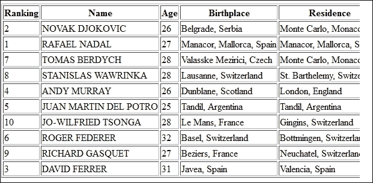

完整示例可在本章的代码包中找到，命名为`ch6_1`。

# JSF 2.2 的 CollectionDataModel 类

直到 JSF 2.2 版本，`<h:dataTable>`标签支持的类型包括`java.util.List`、数组、`java.sql.ResultSet`、`javax.servlet.jsp.jstl.sql.Result`、`javax.faces.model.DataModel`、null（或空列表）以及用作标量值的类型。

### 注意

从 JSF 2.2 版本开始，我们也可以使用`java.util.Collection`。这对于 Hibernate/JPA 用户来说特别有用，因为他们通常使用`Set`集合来处理实体关系。因此，没有什么可以阻止我们使用`HashSet`、`TreeSet`或`LinkedHashSet`集合来为我们的 JSF 表格提供数据。

下一个示例类似于最常用 Java 集合的测试用例。首先，让我们声明一些`Players`集合，如下所示：

+   `java.util.ArrayList`：这个库实现了`java.util.Collection`。`java.util.ArrayList`集合的声明如下：

    ```java
    ArrayList<Players> dataArrayList = new ArrayList<>();
    ```

+   `java.util.LinkedList`：此库实现了 `java.util.Collection`。`java.util.LinkedList` 集合声明如下：

    ```java
    LinkedList<Players> dataLinkedList = new LinkedList<>();
    ```

+   `java.util.HashSet`：此库实现了 `java.util.Collection`。以下为 `java.util.HashSet` 集合的代码：

    ```java
    HashSet<Players> dataHashSet = new HashSet<>(); 
    ```

+   `java.util.TreeSet`：此库实现了 `java.util.Collection`。`java.util.TreeSet` 集合声明如下：

    ```java
    TreeSet<Players> dataTreeSet = new TreeSet<>();
    ```

    ### 注意

    对于 `TreeSet` 集合，你必须使用 `Comparable` 元素，或者提供 `Comparator`。否则，由于不知道如何排序元素，`TreeSet` 集合将无法完成其工作。这意味着 `Players` 类应该实现 `Comparable<Players>`。

+   `java.util.LinkedHashSet`：此库实现了 `java.util.Collection`。`java.util.LinkedHashSet` 集合声明如下：

    ```java
    LinkedHashSet<Players> dataLinkedHashSet = new LinkedHashSet<>();
    ```

+   `java.util.HashMap`：此库没有实现 `java.util.Collection`。`java.util.HashMap` 集合声明如下：

    ```java
    HashMap<String, Players> dataHashMap = new HashMap<>();
    ```

+   `java.util.TreeMap`：此库没有实现 `java.util.Collection`。`java.util.TreeMap` 集合声明如下：

    ```java
    TreeMap<String, Players> dataTreeMap = new TreeMap<>();
    ```

+   `java.util.LinkedHashMap`：此库没有实现 `java.util.Collection`。以下为 `java.util.LinkedHashMap` 集合的代码：

    ```java
    LinkedHashMap<String, Players> dataLinkedHashMap = new LinkedHashMap<>();
    ```

假设这些集合已填充且获取器可用；它们将以以下方式在表中显示其内容：

+   `java.util.ArrayList`：此库实现了 `java.util.Collection`。以下为 `java.util.ArrayList` 集合的代码：

    ```java
    <h:dataTable value="#{playersBean.dataArrayList}" var="t">
      <h:column>
        <f:facet name="header">Ranking</f:facet>
        #{t.ranking}
      </h:column>
    ...
    </h:dataTable>
    ```

    ### 注意

    以同样的方式，我们可以在表中显示 `LinkedList`、`HashSet`、`TreeSet` 和 `LinkedHashSet` 集合类。

+   `java.util.LinkedList`：此库实现了 `java.util.Collection`。以下为 `java.util.LinkedList` 集合的代码：

    ```java
    <h:dataTable value="#{playersBean.dataLinkedList}" var="t">
      <h:column>
        <f:facet name="header">Ranking</f:facet>
        #{t.ranking}
      </h:column>
    ...
    </h:dataTable>
    ```

+   `java.util.HashSet`：此库实现了 `java.util.Collection`。以下为 `java.util.HashSet` 集合的代码：

    ```java
    <h:dataTable value="#{playersBean.dataHashSet}" var="t">
      <h:column>
        <f:facet name="header">Ranking</f:facet>
        #{t.ranking}
      </h:column>
    ...
    </h:dataTable>
    ```

+   `java.util.TreeSet`：此库实现了 `java.util.Collection`。以下为 `java.util.TreeSet` 集合的代码：

    ```java
    <h:dataTable value="#{playersBean.dataTreeSet}" var="t">
      <h:column>
        <f:facet name="header">Ranking</f:facet>
        #{t.ranking}
      </h:column>
    ...
    </h:dataTable>
    ```

+   `java.util.LinkedHashSet`：此库实现了 `java.util.Collection`。以下为 `java.util.LinkedHashSet` 集合的代码：

    ```java
    <h:dataTable value="#{playersBean.dataLinkedHashSet}" var="t">
      <h:column>
        <f:facet name="header">Ranking</f:facet>
        #{t.ranking}
      </h:column>
    ...
    </h:dataTable>
    ```

    ### 注意

    使用以下示例在表中显示一个 `Map` 集合。(`HashMap`, `TreeMap`, 和 `LinkedHashMap` 以相同的方式显示。)

+   `java.util.HashMap`：此库没有实现 `java.util.Collection`。以下为 `java.util.HashMap` 集合的代码：

    ```java
    <h:dataTable value="#{playersBean.dataHashMap.entrySet()}" var="t">
      <h:column>
        <f:facet name="header">Ranking</f:facet>
        #{t.key}             
      </h:column> 
      <h:column>
        <f:facet name="header">Name</f:facet>
        #{t.value.player}
      </h:column>
    ...
    </h:dataTable>
    ```

+   `java.util.TreeMap`：此库没有实现 `java.util.Collection`。以下为 `java.util.TreeMap` 集合的代码：

    ```java
    <h:dataTable value="#{playersBean.dataTreeMap.entrySet()}" var="t">
      <h:column>
        <f:facet name="header">Ranking</f:facet>  
        #{t.key}             
      </h:column> 
      <h:column>
        <f:facet name="header">Name</f:facet>
        #{t.value.player}
      </h:column>
    ...
    </h:dataTable>
    ```

+   `java.util.LinkedHashMap`：此库没有实现 `java.util.Collection`。以下为 `java.util.LinkedHashMap` 集合的代码：

    ```java
    <h:dataTable value="#{playersBean.dataLinkedHashMap.entrySet()}" var="t">
      <h:column>
        <f:facet name="header">Ranking</f:facet>
        #{t.key}             
      </h:column> 
      <h:column>
        <f:facet name="header">Name</f:facet>
        #{t.value.player}
      </h:column>
    ...
    </h:dataTable>
    ```

对于 `Map` 集合，你可以有一个获取方法，如下所示：

```java
HashMap<String, Players> dataHashMap = new HashMap<>(); 

public Collection<Players> getDataHashMap() {
  return dataHashMap.values();
}
```

在这种情况下，表的代码将如下所示：

```java
<h:dataTable value="#{playersBean.dataHashMap}" var="t">
  <h:column>
    <f:facet name="header">Ranking</f:facet>
    #{t.ranking}             
  </h:column>
...
</h:dataTable>
```

### 注意

`CollectionDataModel`类是`DataModel`类的扩展，它包装了一个 Java 对象的`Collection`类。此外，在本章中，你将看到一些示例，这些示例将改变这个新类。

完整的示例可以在本章的代码包中找到，命名为`ch6_2`。

# 排序表格

在前面的示例中，数据是任意显示的。对数据进行排序可以提供在读取和使用信息时的更多清晰度和准确性；例如，请参阅*创建简单的 JSF 表格*部分的截图。你可以尝试在 ATP 排名中视觉定位数字 1，以及数字 2 和数字 3 等，但更有用的是有按**排名**列排序表格的选项。这是一个相对简单的实现任务，尤其是如果你熟悉 Java 的`List`、`Comparator`和`Comparable`功能。本书的范围不涉及这些功能，但你可以通过重写`compare`方法来完成大多数排序任务，该方法的流程简单明了：它比较两个参数的顺序，并返回一个负整数、零或正整数，表示第一个参数小于、等于或大于第二个参数。例如，让我们看看一些常见的排序：

+   对字符串列表进行排序，例如球员的姓名。为此排序，`compare`方法的代码如下：

    ```java
    ...
    String dir="asc"; //or "dsc" for descending sort

    Collections.sort(data, new Comparator<Players>() {
      @Override
      public int compare(Players key_1, Players key_2) {
        if (dir.equals("asc")) {
          return key_1.getPlayer().compareTo(key_2.getPlayer());
        } else {
          return key_2.getPlayer().compareTo(key_1.getPlayer());
        }
      }
    });
    ...
    ```

+   对数字列表进行排序，例如球员排名。为此排序，`compare`方法的代码如下：

    ```java
    ...
    int dir = 1; //1 for ascending, -1 for descending

    Collections.sort(data, new Comparator<Players>() {
      @Override
      public int compare(Players key_1, Players key_2) {
        return dir * (key_1.getRanking() - key_2.getRanking());
      }
    });
    ...
    ```

+   对日期列表进行排序，例如球员的生日（这与字符串的情况相同）。为此排序，`compare`方法的代码如下：

    ```java
    ...
    String dir="asc"; //or "dsc" for descending sort

    Collections.sort(data, new Comparator<Players>() {
      @Override
      public int compare(Players key_1, Players key_2) {
        if (dir.equals("asc")) {
          return key_1.getBorn().compareTo(key_2.getBorn());
        } else {
          return key_2.getBorn().compareTo(key_1.getBorn());
        }
      }
    });
    ...
    ```

### 注意

`data`参数代表`List`集合类型，因为并非所有类型的集合都可以替代这个类型。例如，`List`将完美工作，而`HashSet`则不会。对于不是`List`集合的集合，有不同的解决方案来进行排序。你必须确保为你的情况选择正确的集合。

如果你知道如何为所选集合编写比较器，那么其他一切都很简单。你可以将这些比较器封装在托管 Bean 的方法中，并附加按钮、链接或其他调用这些方法的任何东西。例如，你可以将这些比较器添加到`PlayersBean`后端 Bean 中，如下面的代码所示：

```java
@Named
@ViewScoped
public class PlayersBean implements Serializable{

  List<Players> data = new ArrayList<>();
  final SimpleDateFormat sdf = new SimpleDateFormat("dd.MM.yyyy");

  public PlayersBean() {
    try {
      data.add(new Players(2, "NOVAK DJOKOVIC", (byte) 26, "Belgrade, Serbia", "Monte Carlo, Monaco", (short) 188, (byte) 80, "Boris Becker, Marian Vajda", sdf.parse("22.05.1987")));
...
    } catch (ParseException ex) {
      Logger.getLogger(PlayersBean.class.getName()).log(Level.SEVERE, null, ex);
    }
  }

  public List<Players> getData() {
    return data;
  }

  public void setData(List<Players> data) {
    this.data = data;
  }

 public String sortDataByRanking(final int dir) {

 Collections.sort(data, new Comparator<Players>() {
 @Override
 public int compare(Players key_1, Players key_2) {
 return dir * (key_1.getRanking() - key_2.getRanking());
 }
 });
 return null;
 }

 public String sortDataByName(final String dir) {

 Collections.sort(data, new Comparator<Players>() {
 @Override
 public int compare(Players key_1, Players key_2) {
 if (dir.equals("asc")) {
 return key_1.getPlayer().compareTo(key_2.getPlayer());
 } else {
 return key_2.getPlayer().compareTo(key_1.getPlayer());
 }
 }
 });
 return null;
 }

 public String sortDataByDate(final String dir) {

 Collections.sort(data, new Comparator<Players>() {
 @Override
 public int compare(Players key_1, Players key_2) {
 if (dir.equals("asc")) {
 return key_1.getBorn().compareTo(key_2.getBorn());
 } else {
 return key_2.getBorn().compareTo(key_1.getBorn());
 }
 }
 });
 return null;
 }
...
```

接下来，你可以轻松修改`index.xhtml`页面的代码，以提供访问排序功能，如下所示：

```java
...
<h:dataTable value="#{playersBean.data}" var="t" border="1">
  <h:column>
    <f:facet name="header">
      <h:commandLink action="#{playersBean.sortDataByRanking(1)}">
        Ranking ASC
      </h:commandLink>
   |
      <h:commandLink action="#{playersBean.sortDataByRanking(-1)}">
        Ranking DSC
      </h:commandLink>
    </f:facet>
    #{t.ranking}
  </h:column>
  <h:column>
    <f:facet name="header">
      <h:commandLink action="#{playersBean.sortDataByName('asc')}">
        Name ASC
      </h:commandLink>
      |
      <h:commandLink action="#{playersBean.sortDataByName('dsc')}">
        Name DSC
      </h:commandLink>
    </f:facet>
    #{t.player}
  </h:column>
 ...
  <h:column>
    <f:facet name="header">
      <h:commandLink action="#{playersBean.sortDataByDate('asc')}">
        Born ASC
      </h:commandLink>
      |
      <h:commandLink action="#{playersBean.sortDataByDate('dcs')}">
        Born DSC
      </h:commandLink>
    </f:facet>
    <h:outputText value="#{t.born}">                
      <f:convertDateTime pattern="dd.MM.yyyy" />
    </h:outputText>
  </h:column>
</h:dataTable>
...
```

输出显示在下述屏幕截图中：

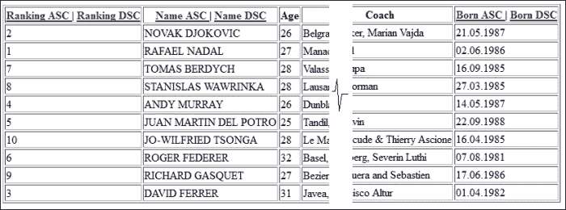

完整的示例可以在本章的代码包中找到，命名为`ch6_3_1`。

如你所见，每个排序都提供了两个链接：一个用于升序，一个用于降序。我们可以通过在我们的视图作用域 Bean 中使用一个额外的属性轻松地将这些链接粘合在一起。例如，我们可以声明一个名为`sortType`的属性，如下所示：

```java
...
private String sortType = "asc";
...
```

添加一个简单的条件，使其在升序和降序排序之间切换，如下面的代码所示：

```java
...
public String sortDataByRanking() {

  Collections.sort(data, new Comparator<Players>() {
    @Override
    public int compare(Players key_1, Players key_2) {
      if(sortType.equals("asc")){                    
        return key_1.getRanking() - key_2.getRanking();
      } else {                    
        return (-1) * (key_1.getRanking() - key_2.getRanking());
      }
    }
  });

  sortType = (sortType.equals("asc")) ? "dsc" : "asc";       
  return null;
}
...
```

现在，`index.xhtml`页面包含每个排序的单个链接，如下面的代码所示：

```java
...
<h:dataTable value="#{playersBean.data}" var="t" border="1">
  <h:column>
    <f:facet name="header">
      <h:commandLink action="#{playersBean.sortDataByRanking()}">
        Ranking
      </h:commandLink> 
    </f:facet>
    #{t.ranking}
  </h:column>
...
```

这个技巧的输出可以在下面的屏幕截图中看到：

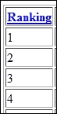

完整的示例可以在本章的代码包中找到，命名为`ch6_3_2`。

## 排序和数据模型 – 集合数据模型

一个更复杂的排序示例涉及一个扩展了`javax.faces.model.DataModel`类的装饰器类。即使我们没有意识到，JSF 也会使用`DataModel`类，因为每个集合（`List`、数组、`HashMap`等等）都被 JSF 包装在一个`DataModel`类中（或者，在子类中，如`ArrayDataModel`、`CollectionDataModel`、`ListDataModel`、`ResultDataModel`、`ResultSetDataModel`或`ScalarDataModel`）。当 JSF 渲染/解码表格数据时，它会调用`DataModel`类的方法。在下面的屏幕截图中，你可以看到`DataModel`类的所有直接已知的子类：

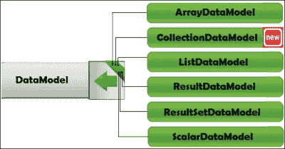

正如你将在本章中看到的，有时你需要了解`DataModel`类，因为你需要改变其默认行为。（建议你快速查看该类官方文档的[`javaserverfaces.java.net/nonav/docs/2.2/javadocs/`](https://javaserverfaces.java.net/nonav/docs/2.2/javadocs/)部分，以获得更好的理解。）最常见的情况涉及渲染行号、排序和改变表格的行数。当你这样做时，你会暴露`DataModel`类而不是底层的集合。

例如，假设我们需要使用一个集合，如`HashSet`。这个集合不保证迭代顺序在时间上保持不变，如果我们想对其进行排序，这可能会成为一个问题。当然，有一些解决方案，比如将其转换为`List`或使用`TreeSet`代替，但我们可以改变包装`HashSet`集合的`DataModel`类，这是新的 JSF 2.2 类`CollectionDataModel`。

我们可以通过以下步骤实现这一点，如下所示：

1.  扩展`CollectionDataModel`类以覆盖其方法的默认行为，如下面的代码所示：

    ```java
    public class SortDataModel<T> extends CollectionDataModel<T> {
    ...
    ```

1.  提供一个构造函数并使用它来传递原始模型（在这种情况下，`CollectionDataModel`）。除了原始模型外，我们还需要一个表示行索引的整数数组（例如，`rows[0]=0`、`rows[1]=1`、... `rows[n]= model.getRowCount()`）。实际上，排序行索引将排序`HashSet`集合，如下面的代码所示：

    ```java
    ...
    CollectionDataModel<T> model;
    private Integer[] rows;

    public SortDataModel(CollectionDataModel<T> model) {
      this.model = model;    
      initRows();
    }

    private void initRows() {
      int rowCount = model.getRowCount();
      if (rowCount != -1) {
        this.rows = new Integer[rowCount];
        for (int i = 0; i < rowCount; ++i) {
          rows[i] = i;
        }
      }
    }
    ...
    ```

1.  接下来，我们需要覆盖`setRowIndex`方法来替换默认的行索引，如下面的代码所示：

    ```java
    @Override
    public void setRowIndex(int rowIndex) {

      if ((0 <= rowIndex) && (rowIndex < rows.length)) {
        model.setRowIndex(rows[rowIndex]);
      } else {
        model.setRowIndex(rowIndex);
      }
    }
    ```

1.  最后，提供以下比较器：

    ```java
    public void sortThis(final Comparator<T> comparator) {
      Comparator<Integer> rowc = new Comparator<Integer>() {
        @Override
        public int compare(Integer key_1, Integer key_2) {
          T key_1_data = getData(key_1);
          T key_2_data = getData(key_2);
          return comparator.compare(key_1_data, key_2_data);
        }
      };
      Arrays.sort(rows, rowc);
    }

    private T getData(int row) {
      int baseRowIndex = model.getRowIndex();
      model.setRowIndex(row);
      T newRowData = model.getRowData();
      model.setRowIndex(baseRowIndex);

      return newRowData;
    }
    ```

1.  现在，我们的具有排序功能的自定义 `CollectionDataModel` 类已经准备好了。我们可以通过声明和填充 `HashSet`，将其包装在原始的 `CollectionDataModel` 类中，并将其传递给自定义的 `SortDataModel` 类来测试它，如下面的代码所示：

    ```java
    private HashSet<Players> dataHashSet = new HashSet<>();
    private SortDataModel<Players> sortDataModel;  
    ...
    public PlayersBean() {
      dataHashSet.add(new Players(2, "NOVAK DJOKOVIC", (byte) 26, "Belgrade, Serbia", "Monte Carlo, Monaco", (short) 188, (byte) 80, "Boris Becker, Marian Vajda", sdf.parse("22.05.1987")));
    ...

      sortDataModel = new SortDataModel<>(new CollectionDataModel<>(dataHashSet));
    }
    ...
    ```

1.  由于我们是调用者，我们需要提供一个比较器。完整的示例可以在本章的代码包中找到，命名为 `ch6_3_3`。

# 删除表格行

删除表格行可以通过执行以下步骤轻松实现：

1.  在管理 Bean 中定义一个方法，该方法接收有关要删除的行的信息，并将其从为表格提供数据的集合中删除。

    例如，对于 `Set` 集合，代码将如下所示 (`HashSet<Players>`):

    ```java
    public void deleteRowHashSet(Players player) {
      dataHashSet.remove(player);       
    }
    ```

    对于 `Map<String, Players>`，代码将如下所示：

    ```java
    public void deleteRowHashMap(Object key) {
      dataHashMap.remove(String.valueOf(key));       
    }
    ```

1.  除了包含数据的列之外，在表格中添加一个名为 **删除** 的新列。每一行都可以是一个指向 `delete`*XXX* 方法的链接。

    例如，我们可以从 `Set` (`HashSet<Players>`) 中删除一个值，如下面的代码所示：

    ```java
    <h:dataTable value="#{playersBean.dataHashSet}" var="t">
    ...
      <h:column>
        <f:facet name="header">Delete</f:facet>
        <h:commandLink value="Delete" action="#{playersBean.deleteRowHashSet(t)}" /> 
      </h:column>
    ...
    </h:dataTable>
    ```

    并且从 `Map<String, Players>`，如下所示：

    ```java
    <h:dataTable value="#{playersBean.dataHashMap.entrySet()}" var="t">
    ...
      <h:column>
        <f:facet name="header">Delete</f:facet>
        <h:commandLink value="Delete" action="#{playersBean.deleteRowHashMap(t.key)}" /> 
      </h:column>
    ...
    </h:dataTable>
    ```

在下面的屏幕截图，你可以看到一个可能的输出：

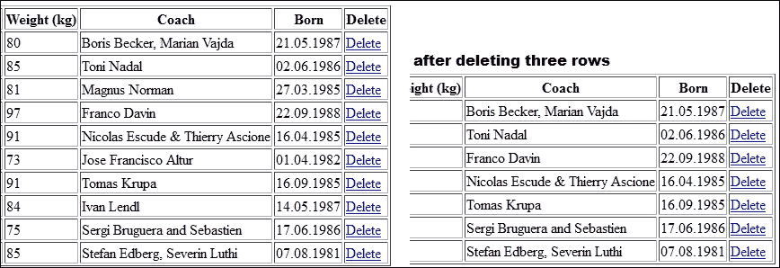

完整的示例可以在本章的代码包中找到，命名为 `ch6_4`。

# 编辑/更新表格行

编辑/更新表格行最方便的方法之一是使用一个特殊属性来跟踪行编辑状态。这个属性可以命名为 `edited`，它应该是 `boolean` 类型（默认 `false`）。在 POJO 类中定义它，如下面的代码所示：

```java
public class Players {
  ...
  private boolean edited;
  ...
  public boolean isEdited() {
    return edited;
  }

  public void setEdited(boolean edited) {
    this.edited = edited;
  }        
}
```

### 注意

如果你的 POJO 类是一个实体类，那么使用 `@Transient` 注解或 `transient` 修饰符将这个新属性定义为 `transient`。这个注解将告诉 JPA 这个属性不参与持久化，并且其值永远不会存储在数据库中。

接下来，将一个 **编辑** 链接分配给每一行。使用 `rendered` 属性，你可以通过简单的 EL 条件轻松显示/隐藏链接；最初，链接对每一行都是可见的。例如，看看以下用例：

+   对于 `Set` 集合，代码如下：

    ```java
    ...
    <h:column>
      <f:facet name="header">Edit</f:facet>
      <h:commandLink value="Edit" action="#{playersBean.editRowHashSet(t)}" rendered="#{not t.edited}" /> 
    </h:column>
    ...
    ```

+   对于 `Map` 集合，代码如下：

    ```java
    ...
    <h:column>
      <f:facet name="header">Edit</f:facet>
      <h:commandLink value="Edit" action="#{playersBean.editRowHashMap(t.value)}" rendered="#{not t.value.edited}"/> 
    </h:column>
    ...
    ```

当链接被点击时，`edited` 属性将从 `false` 切换到 `true`，表格将按如下方式重新渲染：

+   对于 `Set` 集合，`editRowHashSet` 方法的代码如下：

    ```java
    public void editRowHashSet(Players player) {
      player.setEdited(true);
    }
    ```

+   对于 `Map` 集合，`editRowHashSet` 方法的代码如下：

    ```java
    public void editRowHashMap(Players player) {
      player.setEdited(true);
    }
    ```

这意味着链接不再渲染，用户应该能够编辑该表格行。你需要使用 `rendered` 属性在 `<h:outputText>` 标签（用于显示数据，当 `edited` 属性为 `false` 时可见）和 `<h:inputText>` 标签（用于收集数据，当 `edited` 属性为 `true` 时可见）之间切换。再次使用 `rendered` 属性将起到作用，如下所示：

+   对于 `Set` 集合，代码修改如下：

    ```java
    ...
    <h:column>
      <f:facet name="header">Name</f:facet>
      <h:inputText value="#{t.player}" rendered="#{t.edited}" />
      <h:outputText value="#{t.player}" rendered="#{not t.edited}" />
    </h:column>
    ...
    ```

+   对于`Map`集合，代码修改如下：

    ```java
    ...
    <h:column>
      <f:facet name="header">Name</f:facet>
      <h:inputText value="#{t.value.player}" rendered="#{t.value.edited}" />
      <h:outputText value="#{t.value.player}" rendered="#{not t.value.edited}" />
    </h:column>
    ...
    ```

最后，你需要一个按钮来保存更改；此按钮将`edited`属性重置为`false`，为更多编辑准备表格，如下所示：

+   对于`Set`集合，按钮的代码如下：

    ```java
    <h:commandButton value="Save Hash Set Changes" action="#{playersBean.saveHashSet()}" />
    ```

+   对于`Map`集合，按钮的代码如下：

    ```java
    <h:commandButton value="Save Hash Map Changes" action="#{playersBean.saveHashMap()}" />
    ```

这是一个直接的动作，如以下要点所示——输入文本框中插入的值会自动保存到集合中：

+   对于`Set`集合，代码如下：

    ```java
    public void saveHashSet() {
      for (Players player : dataHashSet) {
        player.setEdited(false);
      }
    }
    ```

+   对于`Map`集合，代码如下：

    ```java
    public void saveHashMap() {
      for (Map.Entry pairs : dataHashMap.entrySet()) {
        ((Players) pairs.getValue()).setEdited(false);
      }
    }
    ```

完成！在以下截图中，您可以看到可能的输出：

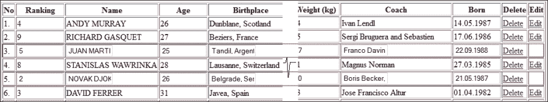

完整的示例可以在本章的代码包中找到，命名为`ch6_5`。

# 添加新行

添加新行也是一个简单的任务。首先，你需要提供一个表行内容的表单，如下面的截图所示：

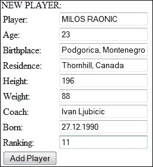

可以使用以下代码轻松实现此表单：

```java
...
<h:inputText value="#{playersBean.player}"/>
<h:inputText value="#{playersBean.age}"/>
<h:inputText value="#{playersBean.birthplace}"/>
<h:inputText value="#{playersBean.residence}"/>
<h:inputText value="#{playersBean.height}"/>
<h:inputText value="#{playersBean.weight}"/>
<h:inputText value="#{playersBean.coach}"/>
<h:inputText value="#{playersBean.born}">
  <f:convertDateTime pattern="dd.MM.yyyy" />
</h:inputText>
<h:inputText value="#{playersBean.ranking}"/>
<h:commandButton value="Add Player" action="#{playersBean.addNewPlayer()}"/>
...
```

标有**添加玩家**的按钮将调用一个托管 Bean 方法，创建一个新的`Players`实例并将其添加到为表格提供数据的集合中，如下面的代码所示：

```java
public void addNewPlayer() {
  Players new_player = new Players(ranking, player, age, birthplace, residence, height, weight, coach, born);
  //adding in a Set
  dataHashSet.add(new_player); 
  //adding in a Map
  dataHashMap.put(String.valueOf(ranking), new_player);
}
```

在以下截图中，您可以看到从前面截图中的数据中添加的新行：

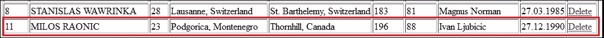

完整的示例可以在本章的代码包中找到，命名为`ch6_6_1`。

一种更优雅的方法是直接在表格中添加行并消除此用户表单。可以通过以下简单步骤轻松实现：

1.  使用链接集合（例如，使用`LinkedHashSet`代替`HashSet`或`LinkedHashMap`代替`HashMap`）。表格通过迭代相应的集合来填充，但某些集合，如`HashSet`或`HashMap`，不提供迭代顺序，这意味着迭代顺序是不可预测的。这很重要，因为我们想在表格末尾添加一行，但使用不可预测的迭代顺序很难实现。但是，链接集合可以解决这个问题，如下面的代码所示：

    ```java
    LinkedHashSet<Players> dataHashSet = new LinkedHashSet<>();
    LinkedHashMap<String, Players> dataHashMap = new LinkedHashMap<>();
    ```

1.  通过在相应的集合中创建新项并使用`Set`和`Map`集合激活可编辑模式来添加新行：

    +   以下是一个链接`Set`集合的代码：

        ```java
        ...
        <h:commandButton value="Add New Row"  action="#{playersBean.addNewRowInSet()}" />
        ...
        public void addNewRowInSet() {
          Players new_player = new Players();
          new_player.setEdited(true);
          dataHashSet.add(new_player);
        }
        ```

    +   以下是一个链接`Map`集合的代码：

        ```java
        ...
        <h:commandButton value="Add New Row" action="#{playersBean.addNewRowInMap()}" />
        ...

        public void addNewRowInMap() {
          Players new_player = new Players();
          new_player.setEdited(true);
          dataHashMap.put(String.valueOf(dataHashMap.size() + 1), new_player);
        }
        ```

查看以下截图以查看可能的输出：

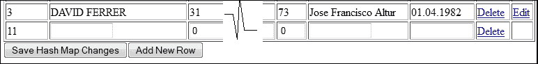

完整的示例可以在本章的代码包中找到，命名为`ch6_6_2`。

# 显示行号

默认情况下，JSF 不提供显示行号的方法。但正如你在*编辑/更新表行*部分的输出截图中所见，有一个名为**No**的列显示行号。你可以通过至少两种方式获得此列。最简单的解决方案是将表绑定到当前视图，如下面的代码所示：

```java
<h:dataTable value="..." binding="#{table}" var="t">
  <h:column>
    <f:facet name="header">No</f:facet> 
    #{table.rowIndex+1}.
  </h:column>
...
```

另一种方法是使用`DataModel`类来获取它，该类具有`getRowIndex`方法来返回当前选中的行号。为了做到这一点，你需要将集合包装在`DataModel`类中。

命名为`ch6_7`的示例包含了这个任务的第一个方法。

# 选择单行

实现此类任务的最简单方法是为表中的每一行提供一个按钮。当按钮被点击时，它可以传递所选行，如下面的代码所示：

```java
<h:dataTable value="#{playersBean.dataHashSet}" var="t" border="1">
  <h:column>
    <f:facet name="header">Select</f:facet>
    <h:commandButton value="#" action="#{playersBean.showSelectedPlayer(t)}"/> 
    </h:column>
...
```

由于`showSelectedPlayer`方法接收所选行，它可以进一步处理它，没有其他要求。完整的示例可在本章的代码包中找到，命名为`ch6_8_1`。

通常来说，从一堆项目中选择一个项目是单选按钮组的工作。在 JSF 表中，项目是行，为每一行添加一个单选按钮将导致如下截图所示的列：

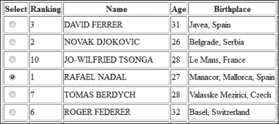

然而，在`<h:column>`标签中使用`<h:selectOneRadio>`标签添加单选按钮并不像预期的那样表现。单选按钮的主要功能不起作用；选择一个单选按钮不会取消选择组中的其他单选按钮。现在它更像是一组复选框。你可以通过实现一个取消选择机制来修复这个问题，通过 JavaScript。此外，在这个阶段，你可以设置一个 JSF 隐藏字段，其值为所选行的值。例如，如果表是通过`Map`填充的，你将使用以下代码：

```java
<script type="text/javascript">
//<![CDATA[
    function deselectRadios(id, val) {

      var f = document.getElementById("hashMapFormId");
      for (var i = 0; i < f.length; i++)
      {
        var e = f.elements[i];
        var eid = e.id;
        if (eid.indexOf("radiosId") !== -1) {
          if (eid.indexOf(id) === -1) {
            e.checked = false;
          } else {
            e.checked = true;
            document.getElementById("hashMapFormId:selectedRowId").value = val;
          }
        }
      }
    }
  //]]>
</script>  
```

首先，你需要通过 ID 找到包含单选按钮的表单。然后，遍历表单的子元素，并通过其 ID 的固定部分识别每个单选按钮。只检查用户选择的单选按钮，并取消选择其余的单选按钮。接下来，使用所选行的值填充一个隐藏字段。所选单选按钮的 ID 和行值作为参数提供，如下（在这种情况下，表是从`Map`中填充的）：

```java
<h:dataTable value="#{playersBean.dataHashMap.entrySet()}" var="t">
  <h:column>
    <f:facet name="header">Select</f:facet>
    <h:selectOneRadio id="radiosId" 
      onclick="deselectRadios(this.id, '#{t.key}');">
      <f:selectItem itemValue="null"/>
    </h:selectOneRadio>
  </h:column>
...
```

除了用于存储所选行信息的隐藏字段外，你还需要一个标签为**显示哈希映射选择**的按钮，如下面的代码所示：

```java
<h:inputHidden id="selectedRowId" value="#{playersBean.selectedPlayerKey}"/>
<h:commandButton value="Show Hash Map Selection" action="#{playersBean.showSelectedPlayer()}" />
```

以下`showSelectedPlayer`方法已准备好处理所选行：

```java
public void showSelectedPlayer() {
  Players player = dataHashMap.get(selectedPlayerKey);

  if (player != null) {
    logger.log(Level.INFO, "Selected player:{0}", player.getPlayer());
  } else {
    logger.log(Level.INFO, "No player selected!");
  }        
}
```

完成！完整的示例可在本章的代码包中找到，命名为`ch6_8_2`。

如果你认为使用隐藏字段不是一个非常优雅的方法，那么你可以通过使用`<h:selectOneRadio>`标签的`valueChangeListener`属性来替换其角色。

在本章的代码包中，你可以找到一个使用名为`ch6_8_3`的`valueChangeListener`属性的示例。

# 选择多行

多选通常通过复选框组来实现。实现多选的最方便方法之一是使用一个特殊属性来跟踪行选择状态。这个属性可以命名为`selected`，它应该是`boolean`类型（默认`false`）。你可以在 POJO 类中如下定义它：

```java
public class Players {
...
  private boolean selected;
  ...
  public boolean isSelected() {
    return selected;
  }

  public void setSelected(boolean selected) {
    this.selected = selected;
}
...
```

### 注意

如果你的 POJO 类是一个实体类，那么请将这个新属性定义为 transient，使用`@Transient`注解或 transient 修饰符。这个注解将告诉 JPA 这个属性不参与持久化，其值永远不会存储在数据库中。

接下来，为每一行分配一个复选框（`<h:selectBooleanCheckbox>`）。使用`value`属性和`selected`属性，你可以轻松跟踪选择状态，如下所示：

```java
<h:dataTable value="#{playersBean.dataHashSet}" var="t">
  <h:column>
    <f:facet name="header">Select</f:facet>
    <h:selectBooleanCheckbox value="#{t.selected}" /> 
  </h:column>
...
```

因此，`<h:selectBooleanCheckbox>`标签将为我们完成艰苦的工作（我们只是利用其自然行为），因此，你所需要的只是一个标记为**显示选中玩家**的按钮，如下所示：

```java
<h:commandButton value="Show Selected Players" action="#{playersBean.showSelectedPlayers()}" />
```

`showSelectedPlayers`方法有一个简单的任务。它可以遍历集合并检查每个项目的`selected`属性状态；这是一个重置选中项的好机会。例如，你可以将选中的项提取到一个单独的列表中，如下所示：

```java
...
HashSet<Players> dataHashSet = new HashSet<>();
List<Players> selectedPlayers  = new ArrayList<>();
...
public void showSelectedPlayers() {
  selectedPlayers.clear();
  for (Players player : dataHashSet) {
    if(player.isSelected()){
      logger.log(Level.INFO, "Selected player: {0}", layer.getPlayer());
      selectedPlayers.add(player);
      player.setSelected(false);
    }
  }   

  //the selected players were extracted in a List ...
}
```

完整的示例包含在本章的代码包中，命名为`ch6_8_4`。

如果你不想使用额外的属性，如`selected`，你可以使用一个`Map <String, Boolean>`映射。代码相当简单；因此，快速查看完整的代码`ch6_8_5`将立即阐明问题。

# 嵌套表格

很可能你不需要在表格内部显示另一个表格，但有时这个解决方案在获得清晰的数据展示方面很有用。例如，嵌套集合可以表示为嵌套表格，如下所示：

```java
HashMap<Players, HashSet<Trophies>> dataHashMap = new HashMap<>();
```

在这里，玩家以`HashMap`作为键存储，每个玩家都有一个奖杯集合（`HashSet`）。每个`HashSet`值是`HashMap`中的一个值。因此，你需要显示玩家的表格；然而，你还需要显示每个玩家的奖杯。这可以通过以下代码实现：

```java
<h:dataTable value="#{playersBean.dataHashMap.entrySet()}" var="t">
  <h:column>
    <f:facet name="header">Ranking</f:facet>
    #{t.key.ranking}
  </h:column>
  <h:column>
    <f:facet name="header">Name</f:facet>
    #{t.key.player}
  </h:column>
    ...
  <h:column>
    <f:facet name="header">Trophies 2013</f:facet>
    <h:dataTable value="#{t.value}" var="q" border="1">
    <h:column> 
      #{q.trophy}
    </h:column>
    </h:dataTable>
  </h:column>
</h:dataTable>
```

上述代码的可能输出可以在以下屏幕截图中看到：

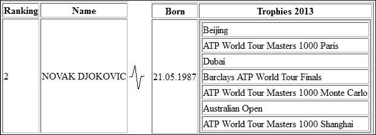

完整的应用程序命名为`ch6_9`，并包含在本章的代码包中。

# 分页表格

当你需要显示大型表格（包含许多行）时，实现分页机制可能很有用。它有许多优点，例如外观精美、数据展示清晰、节省网页空间和延迟加载。

在此类表格的标准版本中，我们应该能够导航到第一页、最后一页、下一页、上一页，在某些表格中，还可以选择每页显示的行数。

当您将表格绑定到其后端 Bean 时，您可以访问三个方便的属性，如下所示：

+   `first`：此属性表示当前表格页面中显示的第一行行号（它从默认值`0`开始）。此属性的值可以使用`<h:dataTable>`标签的`first`属性指定。在 JSF API 中，可以通过`HtmlDataTable.getFirst`和`HtmlDataTable.setFirst`方法访问。

+   `rows`：此属性表示从`first`开始显示的单页中的行数。此属性的值可以使用`<h:dataTable>`标签的`rows`属性指定。在 JSF API 中，可以通过`HtmlDataTable.getRows`和`HtmlDataTable.setRows`方法访问。

+   `rowCount`：此属性表示从所有页面中开始于行 0 的总行数。此属性没有对应的属性。在 JSF API 中，可以通过`HtmlDataTable.getRowCount`方法访问。可以通过数据模型设置行数，如后文所示。默认值由 JSF 确定。

在以下截图中，可以详细看到这些属性：

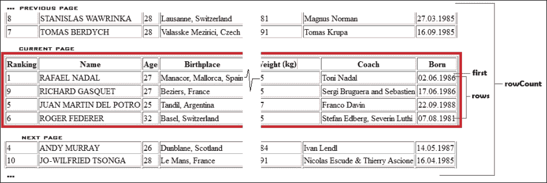

前面的信息对于实现分页机制非常有用。首先，我们绑定表格，并设置第一行行号和每页行数，如下所示：

```java
<h:dataTable value="#{playersBean.dataHashSet}" binding="#{playersBean.table}" rows="#{playersBean.rowsOnPage}" first="0" var="t">
...
```

基于一些算术和 EL 条件支持，我们可以得出以下结论：

+   第一行行号、每页行数和总行数可以通过以下代码访问：

    ```java
    <b>FIRST:</b> #{playersBean.table.first}
    <b>ROWS:</b> #{playersBean.table.rows}
    <b>ROW COUNT:</b> #{playersBean.table.rowCount}                    
    ```

+   使用以下代码导航到第一页：

    ```java
    public void goToFirstPage() {
      table.setFirst(0);
    }
    ```

    可以通过 EL 条件禁用实现此导航的按钮，如下所示：

    ```java
    <h:commandButton value="First Page" action="#{playersBean.goToFirstPage()}" disabled="#{playersBean.table.first eq 0}" />
    ```

+   使用以下代码导航到下一页：

    ```java
    public void goToNextPage() {
      table.setFirst(table.getFirst() + table.getRows());
    }
    ```

    可以通过 EL 条件禁用实现此导航的按钮，如下所示：

    ```java
    <h:commandButton value="Next Page" action="#{playersBean.goToNextPage()}" disabled="#{playersBean.table.first + playersBean.table.rows ge playersBean.table.rowCount}" /> 
    ```

+   使用以下代码导航到上一页：

    ```java
    public void goToPreviousPage() {
      table.setFirst(table.getFirst() - table.getRows());
    }     
    ```

    可以通过 EL 条件禁用实现此导航的按钮，如下所示：

    ```java
    <h:commandButton value="Previous Page" action="#{playersBean.goToPreviousPage()}" disabled="#{playersBean.table.first eq 0}" />
    ```

+   使用以下代码导航到最后页：

    ```java
    public void goToLastPage() {
      int totalRows = table.getRowCount();
      int displayRows = table.getRows();
      int full = totalRows / displayRows;
      int modulo = totalRows % displayRows;

      if (modulo > 0) {
        table.setFirst(full * displayRows);
      } else {
        table.setFirst((full - 1) * displayRows);
      }
    }
    ```

    可以通过 EL 条件禁用实现此导航的按钮，如下所示：

    ```java
    <h:commandButton value="Last Page" action="#{playersBean.goToLastPage()}" disabled="#{playersBean.table.first + playersBean.table.rows ge playersBean.table.rowCount}" />
    ```

+   使用以下代码显示**当前页**和**总页数**的信息：

    ```java
    <h:outputText value="#{(playersBean.table.first div playersBean.table.rows) + 1}">
        <f:converter converterId="javax.faces.Integer"/>
    </h:outputText>
    of   
    <h:outputText value="#{playersBean.table.rowCount mod playersBean.table.rows eq 0 ? (playersBean.table.rowCount div playersBean.table.rows) : ((playersBean.table.rowCount div playersBean.table.rows) + 1)-(((playersBean.table.rowCount div playersBean.table.rows) + 1) mod 1)}">
        <f:converter converterId="javax.faces.Integer"/>
    </h:outputText>
    ```

在示例应用程序（见应用程序`ch6_10_1`）中将所有这些代码块合并，将得到如下截图：

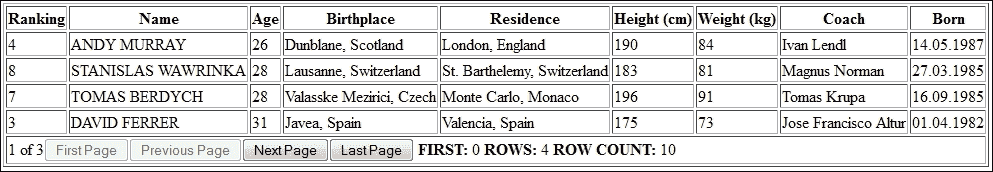

这里最大的问题是，即使数据以分页的形式显示，它们仍然以批量形式加载到内存中。在这种情况下，分页只是集合的*切片*，它只有视觉效果。实际上，分页是**延迟加载**的效果，它代表了一种从数据库中查询部分数据的技术（而不是在内存中切片数据，直接从数据库中切片）。数据库中有许多种查询方式，但在 Java Web/企业应用程序中，EJB/JPA 是最常用的。EJB 和 JPA 是大型技术，这里不能全部涵盖，但通过一些假设，理解即将到来的示例将会非常容易。

### 注意

如果你认为 EJB/JPA 不是好的选择，你应该考虑这样一个事实，即`<h:dataTable>`标签也支持`java.sql.ResultSet`、`javax.servlet.jsp.jstl.Result`和`javax.sql.CachedRowSet`。因此，对于测试，你也可以使用普通的 JDBC。

与此同时，你将使用一个与名为`PLAYERS`的表绑定的`Players` JPA 实体，而不是`Players` POJO 类。这个表包含应在 JSF 表格中显示的数据，它是在 Apache Derby RDBMS 的`APP`数据库中创建的（如果你有 NetBeans 8.0 和 GlassFish 4.0，那么这个 RDBMS 和`APP`数据库是开箱即用的）。想法是查询这个表以获取从`first`到`first` + `rows`的行，这正好是每页显示的行数。这可以通过 JPA 使用查询的`setFirstResult`和`setMaxResults`方法轻松实现（`loadPlayersAction`方法定义在一个名为`PlayersSessionBean`的 EJB 组件中），如下面的代码所示：

```java
public HashSet<Players> loadPlayersAction(int first, int max) {

  Query query = em.createNamedQuery("Players.findAll");
  query.setFirstResult(first);
  query.setMaxResults(max);

  return new HashSet(query.getResultList());
}
```

因此，传递正确的`first`和`max`参数将返回所需的行！

但如果我们知道总行数，分页就会工作，因为没有这个信息，我们无法计算页数，或者最后一页，等等。在 JPA 中，我们可以通过以下代码轻松实现（`countPlayersAction`方法定义在一个名为`PlayersSessionBean`的 EJB 组件中）：

```java
public int countPlayersAction() {
  Query query = em.createNamedQuery("Players.countAll");
  return ((Long)query.getSingleResult()).intValue();
}
```

知道总行数（实际上并没有从数据库中提取数据）是很好的，但我们需要告诉 JSF 那个数字！由于`HtmlDataTable`没有提供`setRowCount`方法，我们必须考虑另一种方法。一个解决方案是扩展`DataModel`类（或其子类之一）并显式提供行数；由于我们使用`HashSet`，我们可以扩展 JSF 2.2 的`CollectionDataModel`类，如下所示：

```java
public class PlayersDataModel extends CollectionDataModel {

  private int rowIndex = -1;
  private int allRowsCount;
  private int pageSize;
  private HashSet hashSet;   

  public PlayersDataModel() {}

  public PlayersDataModel(HashSet hashSet, int allRowsCount, int pageSize)     
  {            
    this.hashSet = hashSet;
    this.allRowsCount = allRowsCount;
    this.pageSize = pageSize;        
  }   

  @Override
  public boolean isRowAvailable() {     
    if (hashSet == null) {
      return false;
    }

    int c_rowIndex = getRowIndex();
    if (c_rowIndex >= 0 && c_rowIndex < hashSet.size()) {
      return true;
    } else {
      return false;
    }
  }

  @Override
  public int getRowCount() {       
    return allRowsCount;
  }

  @Override
  public Object getRowData() {       
    if (hashSet == null) {
      return null;
    } else if (!isRowAvailable()) {
      throw new IllegalArgumentException();
    } else {
      int dataIndex = getRowIndex();
      Object[] arrayView = hashSet.toArray();
      return arrayView[dataIndex];
    }
  }

  @Override
  public int getRowIndex() {      
    return (rowIndex % pageSize);
  }

  @Override
  public void setRowIndex(int rowIndex) {     
    this.rowIndex = rowIndex;
  }

  @Override
  public Object getWrappedData() {       
    return hashSet;
  }

  @Override
  public void setWrappedData(Object hashSet) {      
    this.hashSet = (HashSet) hashSet;
  }
}
```

因此，创建一个`PlayersDataModel`类可以通过以下方式完成：

```java
...
@Inject
private PlayersSessionBean playersSessionBean;
private int rowsOnPage;
private int allRowsCount = 0;
...
@PostConstruct
public void initHashSet() {
  rowsOnPage = 4; //any constant in [1, rowCount]
  allRowsCount = playersSessionBean.countPlayersAction();
  lazyDataLoading(0);
}
...
private void lazyDataLoading(int first) {
  HashSet<Players> dataHashSet = playersSessionBean.loadPlayersAction(first, rowsOnPage);
  playersDataModel = new PlayersDataModel(dataHashSet, allRowsCount, rowsOnPage);
}
```

最后，每次在表格中检测到页面导航时，我们只需要调用以下方法：

```java
lazyDataLoading(table.getFirst());
```

完整的示例可以在本章的代码包中找到，名称为`ch6_10_2`。

# 使用 JSF API 生成表格

JSF 表格也可以程序化生成。JSF API 提供了全面的支持来完成此类任务。首先，你需要*准备*生成表格的位置，如下所示：

```java
<h:body>
  <h:form id="tableForm">     
    <h:panelGrid id="myTable">                
    </h:panelGrid>
    <h:commandButton value="Add Table" action="#{playersBean.addTable()}"/>
  </h:form>        
</h:body> 
```

简单来说：当点击标有**添加表格**的按钮时，生成的表格应该附加到 ID 为`myTable`的`<h:panelGrid>`标签中。

在程序化创建 JSF 表格之前，你需要知道如何创建表格、标题/页脚、列等。以下是一个简要概述——代码是自我解释的，因为 JSF 提供了非常直观的方法：

1.  让我们创建最简单的表格`<h:dataTable value="..." var="t" border="1">`，如下面的代码所示：

    ```java
    public HtmlDataTable createTable(String exp, Class<?> cls) {
      HtmlDataTable table = new HtmlDataTable();
      table.setValueExpression("value", createValueExpression(exp, cls));
      table.setVar("t");
      table.setBorder(1);

      return table;
    }
    ```

1.  现在，我们将创建一个带有标题、页脚和可能的转换器的列，如下所示：

    ```java
    public HtmlColumn createColumn(HtmlDataTable table, String header_name, String footer_name, String exp, Class<?> cls, Class<?> converter) {

      HtmlColumn column = new HtmlColumn();
      table.getChildren().add(column);

      if (header_name != null) {
        HtmlOutputText header = new HtmlOutputText();
        header.setValue(header_name);
        column.setHeader(header);
      }

      if (footer_name != null) {
        HtmlOutputText footer = new HtmlOutputText();
        footer.setValue(footer_name);
        column.setFooter(footer);
      }

      HtmlOutputText output = new HtmlOutputText();
      output.setValueExpression("value", createValueExpression(exp, cls));
      column.getChildren().add(output);

      if (converter != null) {
        if (converter.getGenericInterfaces()[0].equals(Converter.class)) {
          if (converter.equals(DateTimeConverter.class)) {
            DateTimeConverter dateTimeConverter = new DateTimeConverter();
            dateTimeConverter.setPattern("dd.MM.yyyy");
            output.setConverter(dateTimeConverter);
          }
          //more converters ...
        } else {
          //the passed class is not a converter!
        }
      }

      return column;
    }
    ```

1.  现在，使用以下代码将表格附加到 DOM 中（为了做到这一点，你需要找到所需的父组件）：

    ```java
    public void attachTable(HtmlDataTable table, String parent_id) throws NullPointerException {
      UIComponent component = findComponent(parent_id);
      if (component != null) {
        component.getChildren().clear();
        component.getChildren().add(table);
      } else {
        throw new NullPointerException();
      }
    }
    ```

    `findComponent`方法使用 JSF 的`visit`方法，这对于遍历组件树非常有用，如下面的代码所示：

    ```java
    private UIComponent findComponent(final String id) {
      FacesContext context = FacesContext.getCurrentInstance();
      UIViewRoot root = context.getViewRoot();
      final UIComponent[] found = new UIComponent[1];
      root.visitTree(new FullVisitContext(context), new VisitCallback() {

        @Override
        public VisitResult visit(VisitContext context, UIComponent component) {
          if (component.getId().equals(id)) {
            found[0] = component;
            return VisitResult.COMPLETE;
          }
          return VisitResult.ACCEPT;
        }
      });
      return found[0];
    }
    ```

    ### 注意

    在 Mojarra 中，`FullVisitContext`方法来自`com.sun.faces.component.visit`包。在 MyFaces 中，这个类来自`org.apache.myfaces.test.mock.visit`包。这两个实现都扩展了`javax.faces.component.visit.VisitContext`。

1.  然后添加必要的表达式，如下面的代码所示（你曾在第二章中看到另一个例子，*JSF 中的通信*）：

    ```java
    private ValueExpression createValueExpression(String exp, Class<?> cls) {
      FacesContext facesContext = FacesContext.getCurrentInstance();
      ELContext elContext = facesContext.getELContext();
      return facesContext.getApplication().getExpressionFactory().createValueExpression(elContext, exp, cls);
    }
    ```

1.  最后，将这些方法合并到一个辅助类`TableHelper`中。

    记得那个标有**添加表格**的按钮吗？当点击该按钮时，会调用`addTable`方法。此方法利用`TableHelper`类来程序化创建表格，如下面的代码所示：

    ```java
    public void addTable() {

      TableHelper tableHelper = new TableHelper();
      HtmlDataTable tableHashSet = tableHelper.createTable("#{playersBean.dataHashSet}", HashSet.class);
      tableHelper.createColumn(tableHashSet, "Ranking", null, "#{t.ranking}", Integer.class, null);
      tableHelper.createColumn(tableHashSet, "Name", null, "#{t.player}", String.class, null);
      tableHelper.createColumn(tableHashSet, "Age", null, "#{t.age}", Byte.class, null);
      tableHelper.createColumn(tableHashSet, "Birthplace", null, "#{t.birthplace}", String.class, null);
      tableHelper.createColumn(tableHashSet, "Residence", null, "#{t.residence}", String.class, null);
      tableHelper.createColumn(tableHashSet, "Height (cm)", null, "#{t.height}", Short.class, null);
      tableHelper.createColumn(tableHashSet, "Weight (kg)", null, "#{t.weight}", Byte.class, null);
      tableHelper.createColumn(tableHashSet, "Coach", null, "#{t.coach}", String.class, null);
      tableHelper.createColumn(tableHashSet, "Born", null, "#{t.born}", java.util.Date.class, DateTimeConverter.class);
      tableHelper.attachTable(tableHashSet, "myTable");
    }
    ```

完成！完整的应用程序可在本章的代码包中找到，命名为`ch6_11`。

程序化生成的表格非常适合生成具有可变列数或动态列的表格。假设我们有两个 JPA 实体，`Players`和`Trophies`。第一个实体应该生成一个包含九列的表格，而`Trophies`应该生成一个包含三列的表格。此外，列名（标题）不同。这听起来可能很复杂，但实际上比你想象的要简单。

想象一下，每个表格都由一个 JPA 实体映射，这意味着我们可以通过指定实体名称来编写特定的查询。此外，每个实体都可以通过 Java 的反射机制来提取字段名称（我们专注于`private`字段），这为我们提供了列标题。（如果你使用`@Column(name="alias_name")`来更改列名，那么这个过程将稍微复杂一些，需要反射别名。）因此，我们可以使用以下代码（包名是固定的）：

```java
@Inject
//this is the EJB component that queries the database  
private QueryBean queryBean;
HashSet<Object> dataHashSet = new HashSet<>();
...
public void addTable(String selectedTable) {

  try {
    dataHashSet.clear();

    dataHashSet = queryBean.populateData(selectedTable);

    String tableToQuery = "book.ejbs." + selectedTable;

    Class tableClass = Class.forName(tableToQuery);
    Field[] privateFields = tableClass.getDeclaredFields();

    TableHelper tableHelper = new TableHelper();
    HtmlDataTable tableHashSet = tableHelper.createTable("#{playersBean.dataHashSet}", HashSet.class);

    for (int i = 0; i < privateFields.length; i++) {                
      String privateField = privateFields[i].getName();                
      if ((!privateField.startsWith("_")) && (!privateField.equals("serialVersionUID"))) {
        tableHelper.createColumn(tableHashSet, privateField, null, "#{t."+privateField+"}", 
          privateFields[i].getType(), null);
      }
    }

    tableHelper.attachTable(tableHashSet, "myTable");

  } catch (ClassNotFoundException ex) {
    Logger.getLogger(PlayersBean.class.getName()).log(Level.SEVERE, null, ex);
}
```

因此，只要我们将表名（实体名）传递给此方法，它就会返回相应的数据。对于完整的示例，请查看本章代码包中名为`ch6_12`的应用程序。

# 过滤表格

在表格中，过滤数据是一个非常实用的功能。它允许用户只看到符合一定规则（标准）的数据集；最常见的是按列（多列）过滤。例如，用户可能需要查看所有 26 岁以下的所有球员，这是在标记为**年龄**的列中应用的过滤。

基本上，过滤器可以只有视觉效果，而不会修改过滤后的数据（使用一些 CSS、JS 代码，或在单独的集合中复制过滤结果并显示该集合），或者通过移除初始集合中的不必要的项目（当过滤器移除时需要恢复其内容）。

在 JSF 中，我们可以通过玩一些 CSS 代码来编写一个不错的过滤器，这些代码可以用来隐藏/显示表格的行；这并不是在生产环境中推荐的方法，因为所有数据仍然在源页面中可用，但它可能在不需要任何花哨功能时很有用。想法是隐藏所有不符合过滤器标准的表格行，为此，我们可以利用`<h:dataTable>`标签的`rowClasses`属性。此属性的值由逗号分隔的 CSS 类字符串表示；JSF 遍历 CSS 类，并按顺序反复应用于行。

考虑以下两个 CSS 类：

```java
.rowshow
{
  display:visible;
}

.rowhide 
{
  display:none;
}
```

现在，过滤器可以使用`rowshow` CSS 类来显示包含有效数据的行，以及使用`rowhide` CSS 类来隐藏其余的行。例如，遍历一个包含五个元素的集合可以揭示以下字符串形式的 CSS 类：

```java
rowshow, rowhide, rowshow, rowhide, rowhide
```

因此，只有第一行和第三行将是可见的。

让我们看看编写此类过滤器所涉及的步骤：

1.  为每列添加过滤器选择的一个方便方法是使用`<h:selectOneMenu>`标签。例如，我们在**年龄**列中添加一个过滤器选择，如下所示：

    ```java
    ...
    <h:column>
      <f:facet name="header">
        Age<br/>
        <h:selectOneMenu value="#{playersBean.criteria}">
          <f:selectItem itemValue="all" itemLabel="all" />
          <f:selectItem itemValue="&lt;26" itemLabel="&lt;26" />
          <f:selectItem itemValue="&gt;=26" itemLabel="&gt;=26" />                            
        </h:selectOneMenu>
        <h:commandButton value="Go!" action="#{playersBean.addTableFilter()}"/>
      </f:facet>                                      
      <h:outputText value="#{t.age}"/>
    </h:column>
    ...
    ```

1.  当点击标记为**Go!**的按钮时，会调用`addTableFilter`方法。它检查`criteria`属性的值，如果值等于`<26`或`>=26`，则遍历表格行并构建相应的 CSS 类字符串。否则，如果`criteria`属性等于`all`，则移除过滤器，如下面的代码所示：

    ```java
    public void addTableFilter() {

      if (!criteria.equals("all")) {
        String c = "";
        for (int i = 0; i < table.getRowCount(); i++) {
          table.setRowIndex(i);
          Players player = (Players) table.getRowData();
          if (criteria.equals("<26")) {
            if (player.getAge() >= 26) {
              c = c + "rowhide,";
            } else {
              c = c + "rowshow,";
            }
          }
          if (criteria.equals(">=26")) {
            if (player.getAge() < 26) {
              c = c + "rowhide,";
            } else {
              c = c + "rowshow,";
            }
          }
        }

        String css = "rowshow";
        if (!c.isEmpty()) {
          css = c.substring(0, c.length() - 1);
        }

        rowsOnPage = table.getRowCount();
        table.setRowClasses(css);
        table.setFirst(0);
      } else {
        removeTableFilter();
      }
    }
    ```

1.  以下`removeTableFilter`方法将恢复 CSS 类；因此，所有数据将再次可见：

    ```java
    public void removeTableFilter() {
      String css = "rowshow";
      rowsOnPage = 4;  //any constant in [1, rowCount]
      table.setRowClasses(css);
      table.setFirst(0);
    }
    ```

对于完整的示例，请查看本章代码包中名为`ch6_13_1`的应用程序。

重要的是要注意，当应用过滤器时，每页的行数会发生变化。实际上，当过滤器结果显示时，每页的行数等于表行数，而当过滤器被移除时，它们可以取从 1 到行数的任何值。结论是，过滤后的数据在无分页的表格中显示。

在某些情况下，例如按年龄过滤，您可以在生成 CSS 类字符串之前应用排序。这将帮助您显示过滤结果，而不会影响数据，并且可以提供分页。一个完整的示例可以在本章代码包中找到，名称为`ch6_13_2`。

您可以通过从初始集合中移除不符合过滤条件的项目来获得相同的结果。例如，请注意，在应用过滤器之前，您需要恢复集合的初始数据——`initHashSet`方法可以完成这个任务：

```java
public void addTableFilter() {

  initHashSet();

  Iterator<Players> i = dataHashSet.iterator();
  while (i.hasNext()) {
    Players player = i.next();
    if (criteria.equals("<26")) {
      if (player.getAge() >= 26) {
        i.remove();
      }
    }
    if (criteria.equals(">=26")) {
      if (player.getAge() < 26) {
        i.remove();
      }
    }
  }

  table.setFirst(0);
}
```

如果您想应用一系列过滤器，那么在进入链之前恢复数据。一个完整的示例可以在本章代码包中找到，名称为`ch6_13_3`。

由于为表格提供数据的集合通常是从数据库中填充的，因此您可以直接在数据库上应用过滤器。一个常见的例子是具有懒加载机制的表格；由于您在内存中只有数据的一部分，您需要在数据库上应用过滤器，而不是过滤填充表格的集合。这意味着过滤过程是通过 SQL 查询完成的。例如，我们的过滤器可以通过以下步骤通过 SQL 查询建模（此示例基于本章前面介绍的懒加载应用）：

1.  您将过滤条件传递给 EJB 组件（`copy_criteria`充当标志——您不希望在用户使用相同的过滤器通过表格页面导航时每次都计算行数），如下面的代码所示：

    ```java
    @Inject
    private PlayersSessionBean playersSessionBean; 
    private PlayersDataModel playersDataModel;         
    private String criteria = "all";
    private String copy_criteria = "none";
    private int allRowsCount = 0;
    ...
    private void lazyDataLoading(int first) {
      if (!copy_criteria.equals(criteria)) {           
        allRowsCount = playersSessionBean.countPlayersAction(criteria);
        copy_criteria = criteria;
      }

      HashSet<Players> dataHashSet = playersSessionBean.loadPlayersAction(first, rowsOnPage, criteria);
      playersDataModel = new PlayersDataModel(dataHashSet, allRowsCount, rowsOnPage);
    }
    ```

1.  按如下方式计算过滤器返回的行数：

    ```java
    public int countPlayersAction(String criteria) {

      if (criteria.equals("all")) {
        Query query = em.createNamedQuery("Players.countAll");
        return ((Long) query.getSingleResult()).intValue();
      }

      if (criteria.equals("<26")) {
        Query query = em.createQuery("SELECT COUNT(p) FROM Players p WHERE p.age < 26");
        return ((Long) query.getSingleResult()).intValue();
      }

      if (criteria.equals(">=26")) {
        Query query = em.createQuery("SELECT COUNT(p) FROM Players p WHERE p.age >= 26");
        return ((Long) query.getSingleResult()).intValue();
      }

      return 0;
    }
    ```

1.  最后，通过以下方式应用过滤条件：

    ```java
    public HashSet<Players> loadPlayersAction(int first, int max, String criteria) {

      if (criteria.equals("all")) {
        Query query = em.createNamedQuery("Players.findAll");
        query.setFirstResult(first);
        query.setMaxResults(max);
        return new HashSet(query.getResultList());
      }

      if (criteria.equals("<26")) {
        Query query = em.createQuery("SELECT p FROM Players p WHERE p.age < 26");
        query.setFirstResult(first);
        query.setMaxResults(max);
        return new HashSet(query.getResultList());
      }

      if (criteria.equals(">=26")) {
        Query query = em.createQuery("SELECT p FROM Players p WHERE p.age >= 26");
        query.setFirstResult(first);
        query.setMaxResults(max);
        return new HashSet(query.getResultList());
      }

      return null;
    }
    ```

完成！完整的示例可在本章代码包中找到，名称为`ch6_13_4`。

# 表格样式

几乎所有的 JSF UI 组件都支持`style`和`styleClass`属性，用于使用 CSS 创建自定义设计。但是`<h:dataTable>`标签支持如`captionClass`、`captionStyle`、`columnClasses`、`rowClasses`、`headerClass`和`footerClass`等属性。因此，我们应该没有问题为表格的每个部分（标题、页脚、标题等）添加 CSS 样式。显然，可以构建很多示例，但让我们看看三个最令人印象深刻且常用的示例。

## 使用 rowclasses 属性交替行颜色

`rowClasses` 属性用于指示由逗号分隔的 CSS 类字符串。该字符串由 JSF 解析，并将样式依次且重复地应用到行上。例如，你可以用一种颜色为偶数行着色，用另一种颜色为奇数行着色，如下所示：

```java
<h:dataTable value="#{playersBean.data}" rowClasses="even, odd" var="t">
...
```

在这里，`even` 和 `odd` 是以下 CSS 类：

```java
.odd {
  background-color: gray;
}

.even{
  background-color: darkgray;
}
```

以下截图显示了可能的输出：

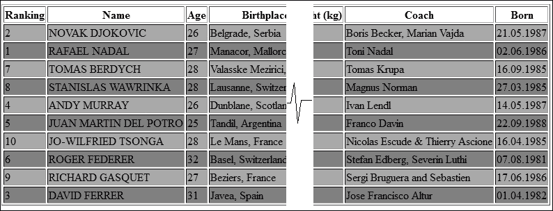

### 注意

你可以通过使用 `columnClasses` 属性而不是 `rowClasses` 属性来获得相同的效果。

完整示例在本书的代码包中命名为 `ch6_14_1`。

## 鼠标悬停时高亮显示行

鼠标悬停时高亮显示行是一个可以通过一小段 JavaScript 实现的不错的效果。思路是设置 `onmouseover` 和 `onmouseout` 属性，如下面的自解释代码所示：

```java
...
<script type="text/javascript">
  //<![CDATA[           
    function onmouseOverOutRows() {
      var rows = document.getElementById('playersTable').getElementsByTagName('tr');
      for (var i = 1; i < rows.length; i++) {
        rows[i].setAttribute("onmouseover", "this.bgColor='#00cc00'");
        rows[i].setAttribute("onmouseout", "this.bgColor='#ffffff'");
      }
    }
  //]]>
</script>
...

<h:body onload="onmouseOverOutRows();">
  <h:dataTable id="playersTable" value="#{playersBean.data}" var="t">
...
```

完整示例在本书的代码包中命名为 `ch6_14_2`。

另一种方法不涉及使用 JavaScript 代码。在这种情况下，你可以尝试使用 CSS 伪类，如下所示：

```java
tbody tr:hover {
  background-color: red;
}
```

完成！完整的应用程序在本书的代码包中命名为 `ch6_14_3`。

## 鼠标点击时高亮显示行

使用鼠标点击来高亮显示行可以通过另一段 JavaScript 代码实现。你必须给每一行添加 `onclick` 属性，并在用户反复点击同一行时控制颜色交替，如下面的代码所示：

```java
<script type="text/javascript">
  //<![CDATA[           
    function onClickRows() {
      var rows = document.getElementById('playersTable').getElementsByTagName('tr');
      for (var i = 1; i < rows.length; i++) {
        rows[i].setAttribute("onclick", "changeColor(this);");
      }
    }

    function changeColor(row) {
      var bgcolor = row.bgColor;
      if (bgcolor === "") {
        row.bgColor = "#00cc00";
      } else if (bgcolor === "#00cc00") {
        row.bgColor = "#ffffff";
      } else if (bgcolor === "#ffffff") {
        row.bgColor = "#00cc00";
      }
    }
   //]]>
</script>
...
<h:body onload="onClickRows();">
  <h:dataTable id="playersTable" value="#{playersBean.data}" var="t">
...
```

完整示例在本书的代码包中命名为 `ch6_14_4`。

# 摘要

表格数据在 Web 应用程序中非常常用，本章是对强大的 JSF DataTable 组件（`<h:dataTable>`）的致敬。JSF 2.2 通过允许开发者渲染比以前更多的集合，通过添加新的 `CollectionDataModel` 类，带来了更多的功能。本章涵盖了表格应完成的常见任务，例如排序、过滤、懒加载和 CSS 支持。请注意，PrimeFaces（[`primefaces.org/`](http://primefaces.org/））在 `<p:dataTable>` 标签（[http://www.primefaces.org/showcase/ui/datatableHome.jsf](http://www.primefaces.org/showcase/ui/datatableHome.jsf)）下提供了一个酷炫且全面的 `<h:dataTable>` 标签扩展。

在下一章中，我们将介绍 JSF 应用程序的 AJAX 技术。
