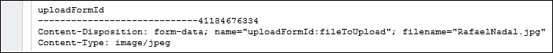
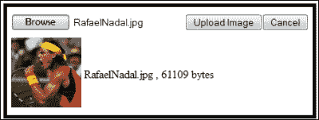
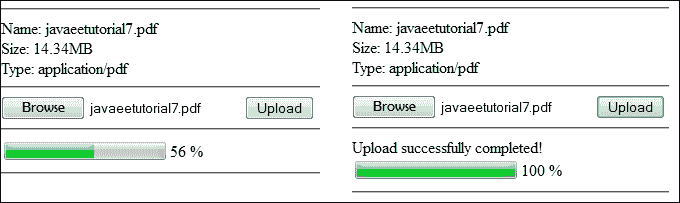

# 第八章. JSF 2.2 – HTML5 和上传

本章可以分为两部分来阅读。第一部分将介绍 JSF 2.2 对 HTML5 的支持，而第二部分将讨论 JSF 2.2 的新**上传**组件。显然，这两部分并不相关，但正如您将看到的，JSF 2.2 的上传组件可以通过 HTML5 特性和新的透传属性来增强，这些新的透传属性对于扩展 JSF 2.2 的上传组件以支持 HTML5 上传组件功能非常有帮助。

# 使用 HTML5 和 JSF 2.2 一起工作

所有参与网络应用开发的人都热衷于探索和使用 HTML5，它带来了一系列新的组件和特性，如`<audio>`、`<video>`、`<keygen>`等。从版本 2.2 开始，JSF 开发者可以使用以下方式与 HTML5 交互：

+   透传属性

+   透传元素（HTML 友好标记）

### 注意

虽然透传元素和透传属性受到 HTML5 的启发，但它们是 JSF 元素，也可以与其他 HTML 版本一起使用。

这些机制是编写自定义渲染套件的替代方案。这是一个很好的解决方案，因为 HTML5 处于发展阶段，这意味着编写和调整渲染套件以适应持续的 HTML5 变化可能是一个真正的挑战。

如果您想在 JSF 2.0 中使用 HTML5，那么您需要编写自定义渲染套件以支持新的组件和属性。

## 透传属性

从 JSF 2.2 开始，我们有在服务器端由 JSF 组件处理的属性和在运行时在客户端处理的**透传属性**。

一个方便的 HTML5 元素，可以用来展示透传属性的是`<input>`元素。在新的支持特性中，我们有`type`属性的新值（例如，`email`、`tel`、`color`和`reset`）以及新的属性`placeholder`（用作空字段提示的文本）。

在纯 HTML5 中，这样的元素可以如下所示：

```java
<input placeholder="Enter player e-mail" type="email">
```

可以通过五种不同的方式使用透传属性获得相同的结果：

+   将透传属性放置在新命名空间`http://xmlns.jcp.org/jsf/passthrough`中（任何 JSF 开发者都熟悉命名空间和前缀元素。使用此命名空间或前缀属性没有技巧）。让我们看看如何使用 JSF 透传属性获取前面的 HTML5 元素，如下所示：

    ```java
    <html 

          >

     ...
     <h:body>
      <h:inputText value="#{playersBean.email}" 
                   f5:type="email" f5:placeholder="Enter player e-mail"/>            
    ...
    ```

    ### 注意

    当这本书被编写时，关于此命名空间的适当前缀仍存在争议。最初选择了`p`，但这个前缀被认为是 PrimeFaces 的前缀；因此，必须使用另一个前缀。所以，当您阅读这本书时，请随意将这里使用的`f5`（此处使用）替换为赢得这场辩论并变得更受欢迎的前缀。

+   使用嵌套在`<h:inputText>`中的`<f:passThroughAttribute>`，如下所示：

    ```java
    <h:inputText value="#{playersBean.email}">
     <f:passThroughAttribute name="placeholder" 
                             value="Enter player e-mail" />
     <f:passThroughAttribute name="type" value="email" />
    </h:inputText>
    ```

+   透传属性也可能来自一个管理 Bean。将它们放在一个 `Map<String, String>` 中，其中映射键是属性名称，映射值是属性值，如下所示：

    ```java
    private Map<String, String> attrs = new HashMap<>();
    ...
    attrs.put("type", "email");
    attrs.put("placeholder", "Enter player e-mail");
    ```

    此外，使用以下代码中的 `<f:passThroughAttributes>` 标签：

    ```java
    <h:inputText value="#{playersBean.email}">
     <f:passThroughAttributes value="#{playersBean.attrs}" />
    </h:inputText>
    ```

+   使用表达式语言 3（Java EE 7 的一部分），也可以直接定义多个属性，如下所示（实际上，您可以通过 EL 3 定义一个 `Map<String, String>`）：

    ```java
    <h:inputText value="#{playersBean.email}">
     <f:passThroughAttributes value='#{{"placeholder":"Enter player e-mail", "type":"email"}}' />
    </h:inputText>
    ```

    完整的示例可以在本章的代码包中找到，名称为 `ch8_1`。

+   透传属性可以通过编程方式添加。例如，您可以生成一个 HTML5 输入元素并将其添加到表单中，如下所示：

    ```java
    <h:body>        
     <h:form id="playerForm">
     ...
     </h:form>
    </h:body>
    ...
    FacesContext facesContext = FacesContext.getCurrentInstance();
    UIComponent formComponent = facesContext.getViewRoot().
                                      findComponent("playerForm");

    HtmlInputText playerInputText = new HtmlInputText();
    Map passThroughAttrs = playerInputText.getPassThroughAttributes();
    passThroughAttrs.put("placeholder", "Enter player email");
    passThroughAttrs.put("type", "email");        

    formComponent.getChildren().add(playerInputText);
    ...
    ```

    完整的示例可以在本章的代码包中找到，名称为 `ch8_1_2`。

## 透传元素

JSF 开发者将 HTML 代码隐藏在 JSF 组件后面。对于网页设计师来说，JSF 代码可能看起来相当奇怪，但生成的 HTML 更熟悉。为了更改生成的 HTML，网页设计师必须修改 JSF 代码，这对他们来说可能很困难。但 JSF 2.2 提供了友好的 HTML5 标记，称为 **透传元素**。使用此功能，网页设计师可以编写纯 HTML 代码，JSF 开发者可以添加/替换必要的属性，并将 HTML 元素链接到服务器端。如果这些属性位于 [`xmlns.jcp.org/jsf`](http://xmlns.jcp.org/jsf) 命名空间中，JSF 会识别这些属性。例如，我们可以编写一个没有任何 JSF 标签的 JSF 页面，如下所示：

```java
<html 
      >

 <head jsf:id="head">
  <title></title>
 </head>

 <body jsf:id="body">
  <form jsf:id="form">
   Name:<input type="text" jsf:value="#{playersBean.playerName}"/>
   Surname:<input type="text" jsf:value="#{playersBean.playerSurname}"/>
   <button jsf:action="#{playersBean.playerAction()}">Show</button>
  </form>
 </body>
</html>
```

### 注意

JSF 会扫描 HTML 元素中命名空间 [`xmlns.jcp.org/jsf`](http://xmlns.jcp.org/jsf) 的属性。对于这样的元素，JSF 将确定元素类型，并将相应的 JSF 组件添加进去（例如，对于 `<head>` 使用 `<h:head>`，对于 `<input>` 使用 `<h:inputText>`）。JSF 将这些组件添加到组件树中，并将它们作为 HTML 代码渲染到客户端。这个 JSF 组件将与特定元素关联，并接收作为“正常”属性或透传属性传递的属性，具体取决于它们的来源。JSF 组件与 HTML 元素之间的对应关系可以在 [`docs.oracle.com/javaee/7/api/javax/faces/view/facelets/TagDecorator.html`](http://docs.oracle.com/javaee/7/api/javax/faces/view/facelets/TagDecorator.html) 找到。对于没有直接对应元素的 HTML 元素（例如 `<div>` 和 `<span>`），JSF 将创建一个特殊的组件，组件家族，如 `javax.faces.Panel`，以及渲染类型 `javax.faces.passthrough.Element`，具体请参阅 [`docs.oracle.com/javaee/7/javaserverfaces/2.2/vdldocs/facelets/jsf/element.html`](http://docs.oracle.com/javaee/7/javaserverfaces/2.2/vdldocs/facelets/jsf/element.html)。

完整的示例可以在本章的代码包中找到，名称为 `ch8_1_3`。

由于 JSF 用 JSF 组件替换了 HTML 元素，我们可以充分利用这些组件，这意味着我们可以像在 JSF 中一样使用它们。例如，我们可以使用验证器、转换器和 `<f:param>`，如下所示：

```java
<html 

      >

 <head jsf:id="head">
  <title></title>
 </head>
 <body jsf:id="body">
  <form jsf:id="form">
   Name:
   <input type="text" jsf:value="#{playersBean.playerName}">                               
    <f:validator validatorId="playerValidator"/>
   </input>    
   <!-- or, like this -->
  <input type="text" jsf:value="#{playersBean.playerName}" 
                     jsf:validator="playerValidator"/>
   Surname:
   <input type="text" jsf:value="#{playersBean.playerSurname}">      
    <f:validator validatorId="playerValidator"/>
   </input>
   <!-- or, like this -->
   <input type="text" jsf:value="#{playersBean.playerSurname}"       
                      jsf:validator="playerValidator"/>
   <button jsf:action="#{playersBean.playerAction()}">Show
    <f:param id="playerNumber" name="playerNumberParam" value="2014"/>                 
   </button>
  </form>
 </body>
</html>
```

完整的示例可在本章的代码包中找到，名称为 `ch8_1_4`。

## JSF 2.2 – HTML5 和 Bean Validation 1.1（Java EE 7）

Bean Validation 1.1（见 [`docs.oracle.com/javaee/7/tutorial/doc/partbeanvalidation.htm`](http://docs.oracle.com/javaee/7/tutorial/doc/partbeanvalidation.htm)）可以是 JSF 2.2/HTML5 应用程序中验证用户输入的完美选择。例如，我们可以在 `PlayersBean` 中验证提交的名字和姓氏，如下所示——我们不接受空值、空值或小于三个字符的值：

```java
@Named
@RequestScoped
public class PlayersBean {

    private static final Logger logger = Logger.getLogger(PlayersBean.class.getName());

    @NotNull(message = "null/empty values not allowed in player name")
    @Size(min = 3,message = "Give at least 3 characters for player name")
    private String playerName;
    @NotNull(message = "null/empty values not allowed in player surname")
    @Size(min = 3,message = "Give at least 3 characters for player surname")
    private String playerSurname;
    ...
```

如果你将以下上下文参数在 `web.xml` 中设置，JSF 可以将提交的空字符串值解释为 `null`：

```java
<context-param>
 <param-name>
  javax.faces.INTERPRET_EMPTY_STRING_SUBMITTED_VALUES_AS_NULL
 </param-name>
 <param-value>true</param-value>
</context-param>
```

因此，在这种情况下，没有必要使用 `<f:validator>` 或 `validator` 属性。查看完整的名为 `ch8_2` 的应用程序。

### 注意

OmniFaces 提供了一个扩展 HTML5 特定属性支持的 HTML5 渲染器。你可能想查看 [`showcase.omnifaces.org/`](http://showcase.omnifaces.org/)。

# JSF 2.2 上传功能

JSF 开发者已经期待了很长时间一个内置的上传组件。直到 JSF 2.2，解决方案包括使用 JSF 扩展，如 PrimeFaces、RichFaces 和第三方库，如 Apache Commons FileUpload。

JSF 2.2 包含一个专门用于上传任务的输入组件（它渲染一个类型为 `file` 的 HTML `input` 元素）。这个组件由 `<h:inputFile>` 标签表示，它可以像任何其他 JSF 组件一样使用。支持的所有属性列表可在 [`docs.oracle.com/javaee/7/javaserverfaces/2.2/vdldocs/facelets/h/inputFile.html`](http://docs.oracle.com/javaee/7/javaserverfaces/2.2/vdldocs/facelets/h/inputFile.html) 找到，但最重要的如下：

+   `value`: 这代表要上传的文件，作为一个 `javax.servlet.http.Part` 对象。

+   `required`: 这是一个布尔值。如果它是 `true`，则用户必须提供一个值才能提交。

+   `validator`: 这表示该组件的验证器。

+   `converter`: 这表示该组件的转换器。

+   `valueChangeListener`: 这表示当组件的值改变时将被调用的方法。

`<h:inputFile>` 组件基于 Servlet 3.0，它是从 Java EE 6 版本开始成为 Java EE 的一部分。Servlet 3.0 提供了一个基于 `javax.servlet.http.Part` 接口和 `@MultipartConfig` 注解的上传机制。一个简单的 Servlet 3.0 上传文件代码如下——请记住这个 servlet，因为我们将在本章的最后部分使用它：

```java
@WebServlet(name = "UploadServlet", urlPatterns = {"/UploadServlet"})
@MultipartConfig(location="/folder", fileSizeThreshold=1024*1024, 
                 maxFileSize=1024*1024*3, maxRequestSize=1024*1024*3*3)
public class UploadServlet extends HttpServlet {

 @Override
 protected void doPost(HttpServletRequest request, 
                       HttpServletResponse response)
  throws ServletException, IOException {

  for (Part part : request.getParts()) {
       String filename = "";
       for (String s: part.getHeader("content-disposition").split(";")) {
            if (s.trim().startsWith("filename")) {
                filename = s.split("=")[1].replaceAll("\"", "");
            }
       }
       part.write(filename);
  }
 }
}
```

### 注意

如果你快速查看 JSF 2.2 `FacesServlet` 的源代码，你会注意到它被特别注解了 `@MultipartConfig`，以处理多部分数据。

如果你不太熟悉使用 Servlet 3.0 上传文件，那么你可以尝试在[`docs.oracle.com/javaee/6/tutorial/doc/glrbb.html`](http://docs.oracle.com/javaee/6/tutorial/doc/glrbb.html)上的教程。

在客户端，你可以使用`<form>`标签和 HTML5 的`file`类型输入：

```java
<form action="UploadServlet" enctype="multipart/form-data" method="POST">
  <input type="file" name="file">
  <input type="Submit" value="Upload File">
</form>
```

基本上，JSF 2.2 上传组件只是这个例子的包装。

## 一个简单的 JSF 2.2 上传示例

在本节中，我们将介绍 JSF 2.2 上传应用程序的基本步骤。即使这是一个简单的例子，你也会看到后续的例子都是基于这个例子。因此，为了使用`<h:inputFile>`组件，你需要关注客户端和服务器端：

在客户端，我们需要执行以下步骤：

1.  首先，`<h:form>`的编码必须设置为`multipart/form-data`，这将帮助浏览器相应地构建`POST`请求，如下面的代码所示：

    ```java
    <h:form id="uploadFormId" enctype="multipart/form-data">
    ```

1.  第二，`<h:inputFile>`必须配置为满足你的需求，在此，我们提供了一个简单的案例，如下所示：

    ```java
    <h:inputFile id="fileToUpload" required="true" 
                  requiredMessage="No file selected ..." 
                  value="#{uploadBean.file}"/>   
    ```

1.  此外，你需要一个按钮（或链接）来启动上传过程，如下所示：

    ```java
    <h:commandButton value="Upload" action="#{uploadBean.upload()}"/>
    ```

可选地，你可以添加一些标签来处理上传消息，如下面的代码所示：

```java
<h:messages globalOnly="true" showDetail="false" 
            showSummary="true" style="color:red"/>
<h:form id="uploadFormId" enctype="multipart/form-data">
 <h:inputFile id="fileToUpload" required="true" 
              requiredMessage="No file selected ..." 
              value="#{uploadBean.file}"/>                       
 <h:commandButton value="Upload" action="#{uploadBean.upload()}"/>             
 <h:message showDetail="false" showSummary="true" 
            for="fileToUpload" style="color:red"/>
</h:form>
```

在服务器端，我们需要执行以下步骤：

1.  通常，`<h:inputFile>`的`value`属性包含一个类型为`#{`*upload_bean.part_object*`}`的 EL 表达式。如果你将*upload_bean*替换为`uploadBean`，将*part_object*替换为`file`，你将获得`#{uploadBean.file}`。`file`对象用于在`UploadBean` bean 中将上传的数据存储为`javax.servlet.http.Part`实例。你所要做的就是以与其他属性相同的方式定义`file`属性，如下面的代码所示：

    ```java
    import javax.servlet.http.Part;
    ...
    private Part file;
    ...
    public Part getFile() {
     return file;
    }

    public void setFile(Part file) {
     this.file = file;
    }
    ...
    ```

    ### 注意

    可以通过`Part`的`getInputStream`方法读取上传的数据。

1.  当点击标记为**上传**的按钮时，会调用`upload`方法。当这个方法被调用时，`file`对象已经填充了上传的字节；因此，你可以将数据作为流（使用`getInputStream`方法）获取并相应地处理它。例如，你可以使用`Scanner` API 将数据提取到`String`中，如下所示：

    ```java
    public void upload() {
     try {
         if (file != null) {
             Scanner scanner = new Scanner(file.getInputStream(), 
                                       "UTF-8").useDelimiter("\\A");
             fileInString = scanner.hasNext() ? scanner.next() : "";

             FacesContext.getCurrentInstance().addMessage(null, 
                     new FacesMessage("Upload successfully ended!"));
             }
         } catch (IOException | NoSuchElementException e) {
           FacesContext.getCurrentInstance().addMessage(null, 
                         new FacesMessage("Upload failed!"));
     }
    }
    ```

完整的应用程序包含在本章的代码包中，命名为`ch8_3`。在这种情况下，上传的数据被转换为字符串并在日志中显示；因此，尝试上传可读的信息，如纯文本文件。

## 使用多个`<h:inputFile>`元素

如果你问自己是否可以在`<h:form>`表单中使用多个`<h:inputFile>`元素，答案是肯定的。为每个`<h:inputFile>`元素指定一个 ID，并将其与一个唯一的`Part`实例关联。为了使用两个`<h:inputFile>`元素，`<h:form>`表单将变为以下代码——你可以轻松地扩展这个例子以适应三个、四个或更多的`<h:inputFile>`元素：

```java
<h:form id="uploadFormId" enctype="multipart/form-data">
 <h:inputFile id="fileToUpload_1" required="true" 
              requiredMessage="No file selected ..." 
              value="#{uploadBean.file1}"/>           
 <h:inputFile id="fileToUpload_2" required="true" 
              requiredMessage="No file selected ..." 
              value="#{uploadBean.file2}"/>
 ...           
 <h:message showDetail="false" showSummary="true" 
            for="fileToUpload_1" style="color:red"/>
 <h:message showDetail="false" showSummary="true" 
            for="fileToUpload_2" style="color:red"/>
 ...
 <h:commandButton value="Upload" action="#{uploadBean.upload()}"/>
</h:form>
```

现在，在服务器端，你需要两个`Part`实例，定义如下：

```java
...
private Part file1;
private Part file2;
...
//getter and setter for both, file1 and file2
...
```

在`upload`方法中，你需要处理两个`Part`实例：

```java
...
if (file1 != null) {
    Scanner scanner1 = new Scanner(file1.getInputStream(), 
                       "UTF-8").useDelimiter("\\A");
    fileInString1 = scanner1.hasNext() ? scanner1.next() : "";
    FacesContext.getCurrentInstance().addMessage(null, new 
          FacesMessage("Upload successfully ended for file 1!"));
}

if (file2 != null) {
    Scanner scanner2 = new Scanner(file2.getInputStream(), 
                       "UTF-8").useDelimiter("\\A");
    fileInString2 = scanner2.hasNext() ? scanner2.next() : "";
    FacesContext.getCurrentInstance().addMessage(null, new 
          FacesMessage("Upload successfully ended for file 2!"));
}
...
```

完成！完整的应用程序包含在本章的代码包中，命名为`ch8_4`。

## 提取要上传的文件信息

文件名、大小和内容类型是在上传文件时最常见的信息类型。在 JSF 中，这些信息在客户端和服务器端都是可用的。让我们考虑以下`<h:inputFile>`元素：

```java
<h:form id="formUploadId" enctype="multipart/form-data">
 <h:inputFile id="fileToUpload" value="#{uploadBean.file}"  
              required="true" requiredMessage="No file selected ...">                                      
 ...
 </h:inputFile>
</h:form>
```

现在你会看到如何提取上传选择的文件的信息。

在客户端，我们需要执行以下步骤之一：

+   在客户端，可以通过 JavaScript 函数提取文件名、大小（以字节为单位）和内容类型，如下所示：

    ```java
    var file = document.getElementById('formUploadId:fileToUpload').files[0];
    ...
    alert(file.name);
    alert(file.size);
    alert(file.type);
    ```

+   另一种方法是使用 JSF 页面中的 EL，如下所示（当然，文件上传后这才会工作）：

    ```java
    // the id of the component, formUploadId:fileToUpload
    #{uploadBean.file.name}

    // the uploaded file name
    #{uploadBean.file.submittedFileName}

    // the uploaded file size
    #{uploadBean.file.size}

    // the uploaded file content type
    #{uploadBean.file.contentType}
    ```

在服务器端，我们需要执行以下步骤之一：

+   在服务器端，可以通过`Part`接口的几个方法提取文件名、大小（以字节为单位）和内容类型，如下所示：

    ```java
    ...
    private Part file;
    ...
    System.out.println("File component id: " + file.getName());
    System.out.println("Content type: " + file.getContentType());
    System.out.println("Submitted file name:" + file.getSubmittedFileName());            
    System.out.println("File size: " + file.getSize());
    ...
    ```

    ### 注意

    如果这个方法返回的字符串代表整个路径而不是文件名，那么你必须将文件名作为这个字符串的子字符串来隔离。

+   文件名也可以通过以下代码从`content-disposition`头中获取：

    ```java
    private String getFileNameFromContentDisposition(Part file) {

     for (String content:file.getHeader("content-disposition").split(";")) {
          if (content.trim().startsWith("filename")) {
              return content.substring(content.indexOf('=') + 
                                         1).trim().replace("\"", "");
          }
     }

     return null;
    }
    ```

    以下截图显示了`content-disposition`头的示例：

    

如果你检查`POST`请求（你可以使用 Firebug 或其他专用工具来做这件事），这将非常容易理解。在上面的截图中，你可以看到`getFileNameFromContentDisposition`方法中描述的相关请求片段。

完整的应用程序包含在本章的代码包中，命名为`ch8_5`。

## 将上传数据写入磁盘

在前面的例子中，上传的数据被转换为`String`并在控制台上显示。通常，当你上传文件时，你希望将其内容保存到磁盘上的特定位置（比如说，`D:\files`文件夹）。为此，你可以使用`FileOutputStream`，如下所示：

```java
   try (InputStream inputStream = file.getInputStream(); 
        FileOutputStream outputStream = new FileOutputStream("D:" +
        File.separator + "files" + File.separator + getSubmittedFileName())) {

     int bytesRead = 0;
     final byte[] chunck = new byte[1024];
     while ((bytesRead = inputStream.read(chunck)) != -1) {
             outputStream.write(chunck, 0, bytesRead);
     }

     FacesContext.getCurrentInstance().addMessage(null, new 
             FacesMessage("Upload successfully ended!"));
     } catch (IOException e) {
              FacesContext.getCurrentInstance().addMessage(null, new 
                                     FacesMessage("Upload failed!"));
     }
```

### 注意

如果你想要缓冲 I/O，那么在你的代码中添加`BufferedInputStream`和`BufferedOutputStream`。

完整的应用程序包含在本章的代码包中，命名为`ch8_6`。如果你更喜欢从`content-disposition`头中获取文件名，那么最好检查应用程序`ch8_7`。

另一种方法是通过使用`Part.write`方法。在这种情况下，你必须通过`<multipart-config>`标签（[`docs.oracle.com/javaee/7/tutorial/doc/servlets011.htm`](http://docs.oracle.com/javaee/7/tutorial/doc/servlets011.htm)）指定文件应该保存的位置。此外，你可以设置最大文件大小、请求大小和文件大小阈值；这些配置应该添加到`web.xml`中，如下所示：

```java
<servlet>
 <servlet-name>Faces Servlet</servlet-name>
 <servlet-class>javax.faces.webapp.FacesServlet</servlet-class>
 <load-on-startup>1</load-on-startup>
 <multipart-config>
  <location>D:\files</location>
  <max-file-size>1310720</max-file-size>
  <max-request-size>20971520</max-request-size>
  <file-size-threshold>50000</file-size-threshold>
 </multipart-config>
</servlet>
```

### 注意

如果你没有指定位置，将使用默认位置。默认位置是""。

上传的文件将被保存在`Part.write`方法传递的名称下指定的位置，如下面的代码所示：

```java
try {
    file.write(file.getSubmittedFileName());
    FacesContext.getCurrentInstance().addMessage(null, new 
                  FacesMessage("Upload successfully ended!"));
    } catch (IOException e) {
      FacesContext.getCurrentInstance().addMessage(null, new 
                  FacesMessage("Upload failed!"));
    }
```

完整的应用程序包含在本章的代码包中，并命名为`ch8_8`。

## 上传验证器

在大多数情况下，你需要根据某些约束来限制用户上传。通常，你会限制文件名长度、文件大小和文件内容类型。例如，你可能想拒绝以下内容：

+   文件名超过 25 个字符的文件

+   不是 PNG 或 JPG 图像的文件

+   大于 1 MB 大小的文件

为了这个，你可以编写一个 JSF 验证器，如下所示：

```java
@FacesValidator
public class UploadValidator implements Validator {

 private static final Logger logger = 
         Logger.getLogger(UploadValidator.class.getName());

 @Override
 public void validate(FacesContext context, UIComponent component, 
                             Object value) throws ValidatorException {

  Part file = (Part) value;

  //VALIDATE FILE NAME LENGTH
  String name = file.getSubmittedFileName();
  logger.log(Level.INFO, "VALIDATING FILE NAME: {0}", name);
  if (name.length() == 0) {
      FacesMessage message = new FacesMessage("Upload Error: Cannot 
                                        determine the file name !");
      throw new ValidatorException(message);
  } else if (name.length() > 25) {
    FacesMessage message = new FacesMessage("Upload Error: 
                                        The file name is to long !");
    throw new ValidatorException(message);
  }

  //VALIDATE FILE CONTENT TYPE
  if ((!"image/png".equals(file.getContentType())) && 
                      (!"image/jpeg".equals(file.getContentType()))) {
       FacesMessage message = new FacesMessage("Upload Error: Only images can be uploaded (PNGs and JPGs) !");
       throw new ValidatorException(message);
  }

  //VALIDATE FILE SIZE (not bigger than 1 MB)
  if (file.getSize() > 1048576) {
      FacesMessage message = new FacesMessage("Upload Error: Cannot 
                                 upload files larger than 1 MB !");
      throw new ValidatorException(message);
  }
 }
}
```

接下来，将验证器添加到`<h:inputFile>`元素中，如下所示：

```java
<h:inputFile id="fileToUpload" required="true" 
             requiredMessage="No file selected ..." 
             value="#{uploadBean.file}">           
 <f:validator validatorId="uploadValidator" />
</h:inputFile>
```

现在，只有符合我们约束条件的文件才会被上传。对于每个被拒绝的文件，你将看到一个信息消息，它会指示文件名或其大小是否过大，或者文件是否是 PNG 或 JPG 图像。

完整的应用程序包含在本章的代码包中，并命名为`ch8_9`。

## AJAX 化上传

JSF 上传可以通过结合`<h:inputFile>`标签与`<f:ajax>`或`<h:commandButton>`标签（上传初始化）与`<f:ajax>`来利用 AJAX 机制。在第一种情况下，一个常见的 AJAX 化上传将类似于以下代码：

```java
<h:form enctype="multipart/form-data">
 <h:inputFile id="fileToUpload" value="#{uploadBean.file}" 
              required="true" requiredMessage="No file selected ...">
  <!-- <f:ajax listener="#{uploadBean.upload()}"
               render="@all"/> use @all in JSF 2.2.0 --> 
  <f:ajax listener="#{uploadBean.upload()}" 
               render="fileToUpload"/> <!-- works in JSF 2.2.5 -->
 </h:inputFile>           
 <h:message showDetail="false" showSummary="true" 
            for="fileToUpload" style="color:red"/>
</h:form>
```

### 注意

渲染属性应该包含上传后需要重新渲染的组件的 ID。在 JSF 2.2.0 中，你需要使用`@all`而不是 ID，因为后续版本中修复了一个相关的错误。例如，在 JSF 2.2.5 中，一切如预期工作。

完整的应用程序包含在本章的代码包中，并命名为`ch8_10`。

在第二种情况下，将`<f:ajax>`放置在`<h:commandButton>`中，如下所示：

```java
<h:form enctype="multipart/form-data">
 <h:inputFile id="fileToUpload" value="#{uploadBean.file}" 
              required="true" requiredMessage="No file selected ..."/>                          
 <h:commandButton value="Upload" action="#{uploadBean.upload()}">
  <!-- <f:ajax execute="fileToUpload"
              render="@all"/> use @all in JSF 2.2.0 --> 
  <f:ajax execute="fileToUpload" 
              render="fileToUpload"/> <!-- works in JSF 2.2.5 -->
 </h:commandButton>
 <h:message showDetail="false" showSummary="true" 
            for="fileToUpload" style="color:red"/>
</h:form>
```

完整的应用程序包含在本章的代码包中，并命名为`ch8_11`。

## 带预览上传图像

上传组件的一个不错特性是它们允许我们在上传之前预览图像。在下面的屏幕截图中，你可以看到我们将要开发的内容：



因此，当用户浏览图像时，你需要进行后台自动 AJAX 上传，这样用户在选择本地机器上的图像后可以立即看到图像预览。由 AJAX 生成的 `POST` 请求将填充服务器端的 `Part` 对象（我们可以称之为 `file`）。当 AJAX 完成时，你需要重新渲染一个能够显示图像的组件，例如 `<h:graphicImage>`。该组件将使用 `GET` 请求调用一个 servlet。负责上传的管理 Bean 应该是会话作用域的；因此，servlet 能够从会话中提取 Bean 实例并使用代表图像的 `file` 对象。现在，servlet 可以直接将图像字节传递给响应输出流，或者创建图像的缩略图并发送少量字节。此外，当用户点击初始化上传的按钮时，你需要将文件对象写入磁盘。

这是主要思想。接下来，你将实现它，并添加一些验证功能、一个取消按钮，以及一些显示在预览旁边的图像信息。

为了实现这一点，你需要执行以下步骤：

1.  根据以下内容编写基于 AJAX 的自动上传：

    ```java
    <h:form enctype="multipart/form-data">                    
     <h:inputFile id="uploadFileId" value="#{uploadBean.file}" 
              required="true" requiredMessage="No file selected ...">
      <f:ajax render=":previewImgId :imgNameId :uploadMessagesId" 
              listener="#{uploadBean.validateFile()}"/>        
     </h:inputFile>                                       
    </h:form>
    ```

1.  AJAX 将调用 `validateFile` 方法。这个服务器端方法能够验证文件名、长度、大小和内容类型。`validateFile` 方法定义如下：

    ```java
    ...
    private Part file;
    ...
    public void validateFile() {

     //VALIDATE FILE NAME LENGTH
     String name = file.getSubmittedFileName();
     if (name.length() == 0) {
         resetFile();

         FacesContext.getCurrentInstance().addMessage(null, new FacesMessage("Upload  
            Error: Cannot determine the file name !"));
     } else if (name.length() > 25) {
       resetFile();
       FacesContext.getCurrentInstance().addMessage(null, new 
       FacesMessage("Upload Error: The file name is to long !"));
     } else //VALIDATE FILE CONTENT TYPE
     if ((!"image/png".equals(file.getContentType())) && 
           (!"image/jpeg".equals(file.getContentType()))) {
          resetFile();
          FacesContext.getCurrentInstance().addMessage(null, new 
          FacesMessage("Upload Error: Only images can be uploaded
               (PNGs and JPGs) !"));
     } else //VALIDATE FILE SIZE (not bigger than 1 MB)        
     if (file.getSize() > 1048576) {
         resetFile();
         FacesContext.getCurrentInstance().addMessage(null, new 
         FacesMessage("Upload Error: Cannot upload files larger than 1 MB !"));
     }
    }
    ```

1.  如果违反了约束，则调用 `resetFile` 方法。这是一个简单的将文件对象重置到其初始状态的方法。此外，它调用 `delete` 方法，该方法删除文件项的底层存储（包括磁盘上的临时文件）。`resetFile` 方法定义如下：

    ```java
    public void resetFile() {
     try {
         if (file != null) {
             file.delete();
         }
     } catch (IOException ex) {
       Logger.getLogger(UploadBean.class.getName()).
                             log(Level.SEVERE, null, ex);
     }
     file = null;
    }
    ```

1.  当 AJAX 请求完成时，它将重新渲染具有以下 ID 的组件：`previewImgId`、`imgNameId` 和 `uploadMessagesId`。以下代码揭示了具有 `previewImgId` 和 `imgNameId` ID 的组件——这里 `uploadMessagesId` ID 对应于一个 `<h:messages>` 组件：

    ```java
    ...
    <h:panelGrid columns="2">
     <h:graphicImage id="previewImgId" 
                     value="/PreviewServlet/#{header['Content-Length']}" 
                     width="#{uploadBean.file.size gt 0 ? 100 : 0}" 
                     height="#{uploadBean.file.size gt 0 ? 100 : 0}"/>
     <h:outputText id="imgNameId" value="#{uploadBean.file.submittedFileName} 
      #{empty uploadBean.file.submittedFileName ? '' : ','} 
      #{uploadBean.file.size} #{uploadBean.file.size gt 0 ? 'bytes' : ''}"/>
    </h:panelGrid>
    ...
    ```

1.  `<h:graphicImage>` 的值访问 `PreviewServlet`。这个 servlet 可以通过响应输出流提供图像以供预览。为了避免缓存机制，你需要提供一个带有随机部分的 URL（请求内容长度可能是一个方便的选择）。这种技术将每次都加载正确的图像，而不是为所有请求加载相同的图像。servlet 的相关部分如下：

    ```java
    protected void processRequest(HttpServletRequest request, 
                                   HttpServletResponse response)
     throws ServletException, IOException {

     //decorate with buffers if you need to
     OutputStream out = response.getOutputStream();

     response.setHeader("Expires", "Sat, 6 May 1995 12:00:00 GMT");
     response.setHeader("Cache-Control","no-store,no-cache,must-revalidate");
     response.addHeader("Cache-Control", "post-check=0, pre-check=0");
     response.setHeader("Pragma", "no-cache");

     int nRead;
     try {
         HttpSession session = request.getSession(false);
         if (session.getAttribute("uploadBean") != null) {
             UploadBean uploadBean = (UploadBean) 
                        session.getAttribute("uploadBean");
             if (uploadBean.getFile() != null) {
                 try (InputStream inStream = 
                              uploadBean.getFile().getInputStream()) {
                      byte[] data = new byte[1024];
                      while ((nRead =inStream.
                              read(data, 0, data.length)) != -1) {
                              out.write(data, 0, nRead);
                      }
                 }
             }
        }
     } finally {
       out.close();
     }
    }
    ```

1.  上述代码将发送上传图像的所有字节到响应输出流。一种常见的技术是将图像缩小以获得包含较少字节的缩略图。在 Java 中，可以通过多种方式缩放图像，但以下代码提供了一个快速的方法：

    ```java
    protected void processRequest(HttpServletRequest request, 
                                   HttpServletResponse response)
     throws ServletException, IOException {

     OutputStream out = response.getOutputStream();

     response.setHeader("Expires", "Sat, 6 May 1995 12:00:00 GMT");
     response.setHeader("Cache-Control","no-store,no-cache,must-revalidate");
     response.addHeader("Cache-Control", "post-check=0, pre-check=0");
     response.setHeader("Pragma", "no-cache");

     try {
         HttpSession session = request.getSession(false);
         if (session.getAttribute("uploadBean") != null) {
             UploadBean uploadBean = (UploadBean) 
                                  session.getAttribute("uploadBean");
             if (uploadBean.getFile() != null) {
                 BufferedImage image = ImageIO.read(uploadBean.getFile().getInputStream());
                 BufferedImage resizedImage = new BufferedImage(100, 100, BufferedImage.TYPE_INT_ARGB);
                 Graphics2D g = resizedImage.createGraphics();
                 g.drawImage(image, 0, 0, 100, 100, null);
                 g.dispose();
                 ImageIO.write(resizedImage, "png", out);
             }
         }
     } finally {
       out.close();
     }
    }
    ```

1.  此外，您还需要添加两个按钮：一个标有**上传**的按钮，另一个标有**取消**的按钮。第一个按钮将初始化上传，第二个按钮将取消上传，如下面的代码所示：

    ```java
    <h:form>
     <h:commandButton value="Upload Image" 
                      action="#{uploadBean.saveFileToDisk()}"/>
     <h:commandButton value="Cancel" action="#{uploadBean.resetFile()}"/> 
    </h:form>
    ```

1.  当点击标有**上传**的按钮时，`saveFileToDisk`方法将保存上传的数据到磁盘，如下面的代码所示：

    ```java
    public void saveFileToDisk() {

     if (file != null) {
         //decorate with buffers if you need too
         try (InputStream inputStream = file.getInputStream(); 
              FileOutputStream outputStream = new FileOutputStream("D:" + File.separator + "files" + File.separator + getSubmittedFileName())) {

              int bytesRead;
              final byte[] chunck = new byte[1024];
              while ((bytesRead = inputStream.read(chunck)) != -1) {
                      outputStream.write(chunck, 0, bytesRead);
              }

              resetFile();

              FacesContext.getCurrentInstance().addMessage(null, new 
                          FacesMessage("Upload successfully ended!"));
         } catch (IOException e) {
                  FacesContext.getCurrentInstance().addMessage(null, new FacesMessage("Upload failed!"));
         }
      }
     }
    ```

完成！完整的应用程序（无缩略图），可在本章的代码包中找到，命名为`ch8_13`。带有缩略图的完整应用程序命名为`ch8_12`。

验证过程可以从服务器端消除，也可以在客户端完成。这样的例子可以在本章的代码包中找到，命名为`ch8_14`。JavaScript 代码相当简单，如下所示：

```java
<script type="text/javascript">
function validateFile() {
 // <![CDATA[
 document.getElementById('formSaveId:uploadHiddenId').value = false;
 document.getElementById('validationId').innerHTML = "";

 var file= document.getElementById('formUploadId:fileToUpload').files[0];               

 document.getElementById('fileNameId').innerHTML = 
                         "<b>File Name:</b> " + file.name;
 if (file.size > 1048576)
     fileSize = (Math.round(file.size * 100 / 
                         (1048576)) / 100).toString() + 'MB';
 else
     fileSize = (Math.round(file.size * 100 
                         / 1024) / 100).toString() + 'KB';

 document.getElementById('fileSizeId').innerHTML = 
                         "<b>File Size:</b> " + fileSize;
 document.getElementById('fileContentTypeId').innerHTML = 
                         "<b>File Type:</b> " + file.type;

 //VALIDATE FILE NAME LENGTH     
 if (file.name.length === 0) {
     clearUploadField();
     document.getElementById('validationId').innerHTML = 
      "<ul><li>Upload Error: Cannot determine the file name !</li></ul>";
     return false;
 }

 if (file.name.length > 25) {
     clearUploadField();
     document.getElementById('validationId').innerHTML = 
          "<ul><li>Upload Error: The file name is to long !</li></ul>";
     return false;
 }

 //VALIDATE FILE CONTENT TYPE
  if (file.type !== "image/png" && file.type !== "image/jpeg") {
     clearUploadField();
     document.getElementById('validationId').innerHTML = 
         "<ul><li>Upload Error: Only images can be uploaded 
                                  (PNGs and JPGs) !</li></ul>";
     return false;
 }

 //VALIDATE FILE SIZE (not bigger than 1 MB)   
 if (file.size > 1048576) {
     clearUploadField();
     document.getElementById('validationId').innerHTML = 
       "<ul><li>Upload Error: Cannot upload files 
                              larger than 1 MB !</li></ul>";
     return false;
 }

 document.getElementById('formSaveId:uploadHiddenId').value = true;
 return true;
 //]]>
}

function clearUploadField() {               

 document.getElementById('previewImgId').removeAttribute("src");
 document.getElementById('imgNameId').innerHTML = "";
 document.getElementById('uploadMessagesId').innerHTML = "";
 var original = document.getElementById("formUploadId:fileToUpload");
 var replacement = document.createElement("input");

 replacement.type = "file";
 replacement.id = original.id;
 replacement.name = original.name;
 replacement.className = original.className;
 replacement.style.cssText = original.style.cssText;
 replacement.onchange = original.onchange;
 // ... more attributes

 original.parentNode.replaceChild(replacement, original);
}

</script>
```

## 上传多个文件

默认情况下，JSF 2.2 不提供上传多个文件的支持，但通过一些调整，我们可以轻松实现这个目标。为了实现多文件上传，您需要关注两个方面，如下列所示：

+   使多文件选择成为可能

+   上传所有选定的文件

关于第一个任务，可以通过使用 HTML5 输入文件属性（`multiple`）和 JSF 2.2 的透传属性功能来激活多重选择。当此属性存在且其值设置为`multiple`时，文件选择器可以选择多个文件。因此，这个任务需要一些最小的调整：

```java
<html 

      >
...
<h:form id="uploadFormId" enctype="multipart/form-data">
 <h:inputFile id="fileToUpload" required="true" f5:multiple="multiple" 
     requiredMessage="No file selected ..." value="#{uploadBean.file}"/>           
 <h:commandButton value="Upload" action="#{uploadBean.upload()}"/>
</h:form>
```

第二个任务有点棘手，因为当选择多个文件时，JSF 会使用上传集中的每个文件覆盖先前的`Part`实例。这是正常的，因为您使用的是`Part`类型的对象，但您需要一个`Part`实例的集合。解决这个问题需要我们关注文件组件的渲染器。这个渲染器被命名为`FileRenderer`（`TextRenderer`的扩展），而`decode`方法的实现是我们问题的关键（粗体代码对我们非常重要），如下面的代码所示：

```java
@Override
public void decode(FacesContext context, UIComponent component) {

 rendererParamsNotNull(context, component);

 if (!shouldDecode(component)) {
     return;
 }

 String clientId = decodeBehaviors(context, component);

 if (clientId == null) {
     clientId = component.getClientId(context);
 }

 assert(clientId != null);
 ExternalContext externalContext = context.getExternalContext();
 Map<String, String> requestMap = 
                     externalContext.getRequestParameterMap();

 if (requestMap.containsKey(clientId)) {
     setSubmittedValue(component, requestMap.get(clientId));
 }

 HttpServletRequest request = (HttpServletRequest) 
                               externalContext.getRequest();
 try {
 Collection<Part> parts = request.getParts();
 for (Part cur : parts) {
 if (clientId.equals(cur.getName())) {
 component.setTransient(true);
 setSubmittedValue(component, cur);
 }
 }
 } catch (IOException ioe) {
          throw new FacesException(ioe);
 } catch (ServletException se) {
          throw new FacesException(se);
 }
}
```

突出的代码会导致覆盖`Part`问题，但您可以轻松地修改它，以提交一个`Part`实例的列表而不是一个`Part`实例，如下所示：

```java
try {
    Collection<Part> parts = request.getParts();
    List<Part> multiple = new ArrayList<>();
    for (Part cur : parts) {
         if (clientId.equals(cur.getName())) {
             component.setTransient(true);
             multiple.add(cur);
         }
    }
    this.setSubmittedValue(component, multiple);
} catch (IOException | ServletException ioe) {
  throw new FacesException(ioe);
}
```

当然，为了修改此代码，您需要创建一个自定义文件渲染器，并在`faces-config.xml`中正确配置它。

之后，您可以使用以下代码在您的 bean 中定义一个`Part`实例的列表：

```java
...
private List<Part> files;

public List<Part> getFile() {
 return files;
}

public void setFile(List<Part> files) {
 this.files = files;
}
...
```

列表中的每个条目都是一个文件；因此，您可以通过以下代码迭代列表来将它们写入磁盘：

```java
...
for (Part file : files) {
 try (InputStream inputStream = file.getInputStream(); FileOutputStream 
      outputStream = new FileOutputStream("D:" + File.separator + "files" + File.separator + getSubmittedFileName())) {

      int bytesRead = 0;
      final byte[] chunck = new byte[1024];
      while ((bytesRead = inputStream.read(chunck)) != -1) {
              outputStream.write(chunck, 0, bytesRead);
      }

      FacesContext.getCurrentInstance().addMessage(null, new 
       FacesMessage("Upload successfully ended: " +  
        file.getSubmittedFileName()));
 } catch (IOException e) {
          FacesContext.getCurrentInstance().addMessage(null, new   
                                  FacesMessage("Upload failed !"));
 }
}
...
```

完整的应用程序可在本章的代码包中找到，命名为`ch8_15`。

## 上传和不确定的进度条

当用户上传小文件时，这个过程发生得相当快；然而，当涉及到大文件时，可能需要几秒钟，甚至几分钟才能完成。在这种情况下，实现一个指示上传状态的进度条是一个好习惯。最简单的进度条被称为不确定进度条，因为它表明过程正在运行，但它不提供估计剩余时间或已处理字节数的信息。

为了实现进度条，您需要开发一个基于 AJAX 的上传。JSF AJAX 机制允许我们确定 AJAX 请求何时开始和何时完成。这可以在客户端实现；因此，可以使用以下代码轻松实现不确定进度条：

```java
<script type="text/javascript">
 function progressBar(data) {
  if (data.status === "begin") {
      document.getElementById("uploadMsgId").innerHTML="";
      document.getElementById("progressBarId").
                setAttribute("src", "./resources/progress_bar.gif");
  }

  if (data.status === "complete") {              
      document.getElementById("progressBarId").removeAttribute("src");
  }
 }
</script>
...
<h:body>       
 <h:messages id="uploadMsgId" globalOnly="true" showDetail="false" 
                             showSummary="true" style="color:red"/>
 <h:form id="uploadFormId" enctype="multipart/form-data">
  <h:inputFile id="fileToUpload" required="true"
      requiredMessage="No file selected ..." value="#{uploadBean.file}"/>           
  <h:message showDetail="false" showSummary="true" 
      for="fileToUpload" style="color:red"/>
  <h:commandButton value="Upload" action="#{uploadBean.upload()}">             
   <f:ajax execute="fileToUpload" onevent="progressBar" 
                         render=":uploadMsgId @form"/>
  </h:commandButton>    
 </h:form>
 <div>            
  
 </div>
</h:body>
```

可能的输出如下：


完整的应用程序包含在本章的代码包中，命名为`ch8_16`。

## 上传和确定进度条

确定进度条要复杂得多。通常，这样的进度条基于一个能够监控传输字节的监听器（如果您使用过 Apache Commons 的`FileUpload`，您肯定有机会实现这样的监听器）。在 JSF 2.2 中，`FacesServlet`被注解为`@MultipartConfig`以处理多部分数据（上传文件），但它没有进度监听器接口。此外，`FacesServlet`被声明为`final`；因此，我们无法扩展它。

好吧，可能的解决方案受到这些方面的限制。为了在服务器端实现进度条，我们需要在单独的类（servlet）中实现上传组件并提供一个监听器。或者，在客户端，我们需要一个自定义的`POST`请求来欺骗`FacesServlet`，使其认为请求是通过`jsf.js`格式化的。

在本节中，您将看到基于 HTML5 XMLHttpRequest Level 2（可以上传/下载`Blob`、`File`和`FormData`流）的解决方案，HTML5 进度事件（对于上传，它返回已传输的总字节数和已上传的字节数），HTML5 进度条，以及自定义 Servlet 3.0。如果您不熟悉这些 HTML5 特性，那么您必须查阅一些专门的文档。

在熟悉了这些 HTML5 特性之后，理解以下客户端代码将会非常容易。首先，我们有以下 JavaScript 代码：

```java
<script type="text/javascript">
 function fileSelected() {
  hideProgressBar();
  updateProgress(0);
  document.getElementById("uploadStatus").innerHTML = "";
  var file = document.getElementById('fileToUploadForm:
                                         fileToUpload').files[0];
  if (file) {
      var fileSize = 0;
      if (file.size > 1048576)
          fileSize = (Math.round(file.size * 100 / (1048576)) / 
                                             100).toString() + 'MB';
      else
          fileSize = (Math.round(file.size * 100 / 1024) / 
                                             100).toString() + 'KB';

      document.getElementById('fileName').innerHTML = 'Name: ' + 
                                                          file.name;
      document.getElementById('fileSize').innerHTML = 'Size: ' + 
                                                           fileSize;
      document.getElementById('fileType').innerHTML = 'Type: ' + 
                                                          file.type;
  }
 }

 function uploadFile() {
  showProgressBar();
  var fd = new FormData();
  fd.append("fileToUpload", document.getElementById('fileToUploadForm:
                                            fileToUpload').files[0]);

  var xhr = new XMLHttpRequest();
  xhr.upload.addEventListener("progress", uploadProgress, false);
  xhr.addEventListener("load", uploadComplete, false);
  xhr.addEventListener("error", uploadFailed, false);
  xhr.addEventListener("abort", uploadCanceled, false);
  xhr.open("POST", "UploadServlet");
  xhr.send(fd);
 }

 function uploadProgress(evt) {
  if (evt.lengthComputable) {
      var percentComplete = Math.round(evt.loaded * 100 / evt.total);
                    updateProgress(percentComplete);
  }
 }

 function uploadComplete(evt) {
  document.getElementById("uploadStatus").innerHTML = "Upload 
                    successfully completed!";
 }

 function uploadFailed(evt) {
  hideProgressBar();
  document.getElementById("uploadStatus").innerHTML = "The upload cannot be complete!";
 }

 function uploadCanceled(evt) {
  hideProgressBar();
  document.getElementById("uploadStatus").innerHTML = "The upload was 
                    canceled!";
 }

 var updateProgress = function(value) {
     var pBar = document.getElementById("progressBar");
     document.getElementById("progressNumber").innerHTML=value+"%";
     pBar.value = value;
 }

 function hideProgressBar() {
  document.getElementById("progressBar").style.visibility = "hidden";
  document.getElementById("progressNumber").style.visibility = "hidden";
 }

 function showProgressBar() {
  document.getElementById("progressBar").style.visibility = "visible";
  document.getElementById("progressNumber").style.visibility = "visible";
 }
</script>
```

此外，我们还有使用前面 JavaScript 代码的上传组件：

```java
<h:body>
 <hr/>
 <div id="fileName"></div>
 <div id="fileSize"></div>
 <div id="fileType"></div>
 <hr/>
 <h:form id="fileToUploadForm" enctype="multipart/form-data">
  <h:inputFile id="fileToUpload" onchange="fileSelected();"/> 
  <h:commandButton type="button" onclick="uploadFile()" value="Upload" />
 </h:form>          
 <hr/> 
 <div id="uploadStatus"></div>
  <table>
   <tr>
    <td>
     <progress id="progressBar" style="visibility: hidden;" 
                                   value="0" max="100"></progress> 
    </td>                   
    <td>                    
     <div id="progressNumber" style="visibility: hidden;">0 %</div>
    </td>
   </tr>   
 </table>
 <hr/>
</h:body>
```

以下截图显示了可能的输出：



此解决方案背后的 servlet 是之前提到的`UploadServlet`。完整的应用程序包含在本章的代码包中，命名为`ch8_17`。

### 注意

对于多个文件上传和进度条，您可以扩展此示例，或者选择内置解决方案，例如 PrimeFaces Upload、RichFaces Upload 或 jQuery Upload 插件。

# 摘要

在本章中，您了解了如何通过 JSF 2.2 使用 pass-through 属性和 pass-through 元素技术来利用 HTML5。此外，在本章的第二部分，您还看到了如何使用新的 JSF 2.2 上传组件（简单上传、多文件上传、上传带预览的图片以及上传的不可确定/确定进度条）。

欢迎您在下一章中继续学习，我们将进一步探讨 JSF 2.2 的一个伟大特性，即无状态视图。
