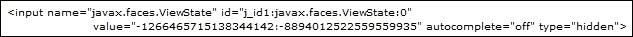
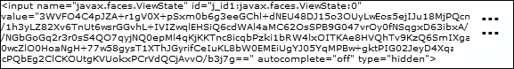
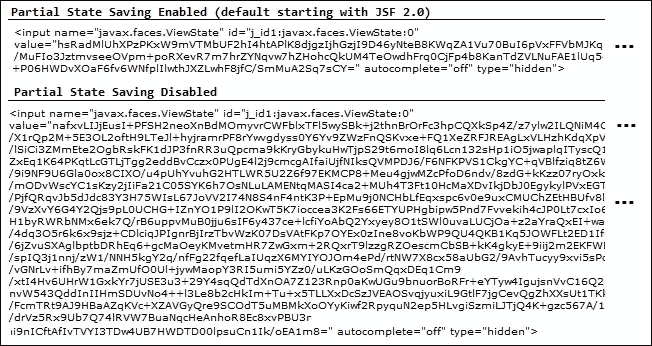
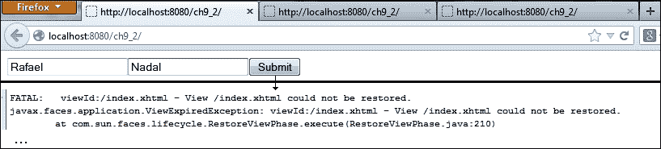
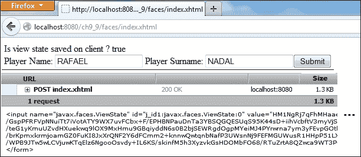
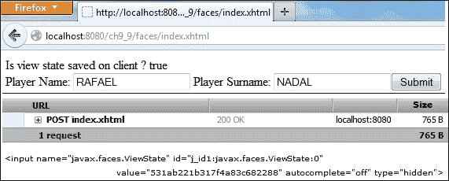
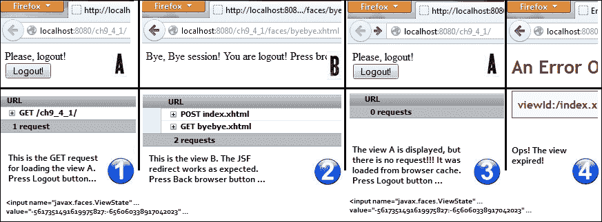
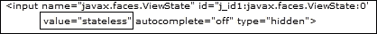
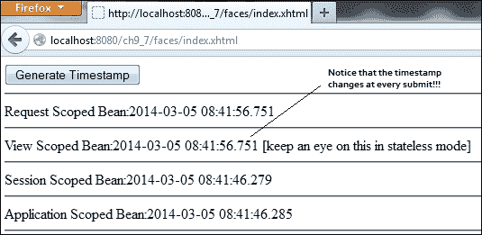

# 第九章. JSF 状态管理

通常，JSF 应用程序的性能与 CPU 内存、序列化/反序列化任务和网络带宽直接相关。当这些变量开始成为头痛的来源，或者出现`ViewExpiredException`或`NotSerializableException`类型的错误时，就是了解 JSF 管理视图状态功能及其如何精细调整以提高性能的时候了。因此，在本章中，我们将讨论 JSF 保存视图状态（JSF 的部分保存视图状态功能、JSF 在服务器/客户端保存视图状态、逻辑视图和物理视图等）以及 JSF 2.2 无状态视图。

# JSF 保存视图状态

首先，你必须知道 JSF 使用`ViewHandler`/`StateManager` API 在请求之间保存和恢复视图状态。JSF 在其生命周期中这样做，视图状态在请求结束时保存在会话中（或在客户端机器上），并在请求开始时恢复。

JSF 使用这种技术是因为它需要在 HTTP 协议上保留视图状态，而 HTTP 协议是无状态的。由于 JSF 是有状态的，它需要保存视图的状态，以便在来自同一用户的多个请求上执行 JSF 生命周期。每个页面都有一个视图状态，它在客户端和服务器之间充当乒乓球。视图基本上是一个组件树，它可能在 HTTP GET 和 POST 请求期间动态更改（修改）。只有当组件树之前已保存并且完全能够提供所需信息时，每个请求才能成功通过 JSF 生命周期，也就是说，Faces Servlet 成功调用所需的视图处理实现来恢复或构建视图。因此，当组件树被程序性地更改（例如，从后端 bean 或静态组件）时，它不能从零开始成功重建（或重新构建）。唯一的解决方案是使用在*渲染响应*阶段保存的现有状态。尝试从头开始重建它将使程序性更改无效，因为它们将不再可用。

### 注意

请记住，组件树只是 UI 组件的层次结构和逻辑关系的手。视图状态维护树结构和组件状态（选中/未选中、启用/禁用等）。因此，组件树只包含通过 EL 表达式引用后端 bean 属性/操作的引用，并不存储模型值。

## JSF 部分保存视图状态

从 JSF 2.0 开始，通过添加部分状态保存功能，管理状态的性能得到了显著提高。基本上，JSF 不会保存整个组件树，而只保存其中的一部分。显然，这将需要更少的内存。换句话说，这意味着现在，在恢复视图的每个请求中，JSF 将从头开始重新创建整个组件树，并从它们的标签属性初始化组件。这样，JSF 将只保存值得保存的东西。这些是容易变化的东西（例如，`<h:form>`），不能从头开始重新创建，或者代表组件的内联细节。这些细节包括：动态（程序性）更改，这些更改会改变组件树；为某些组件确定的不同类型的值（通常在第一次回发时），以及已更改但尚未提交的组件的值（例如，移动滑块或勾选复选框）。另一方面，客户端无法更改的东西将不会被保存。

## 部分状态保存和树遍历

在 JSF 2.0 中，JSF 部分状态保存功能引发了一个问题，类似于 JSF 实现应该如何遍历组件树并询问它们的状态（部分）。JSF 2.1（以及更早的版本）的答案是针对这个特定实现的：Mojarra 使用了树遍历算法，而 MyFaces 使用了所谓的“面 + 子”遍历。但从技术上来说，这两种方法相当不同，因为 Mojarra 提供了一个可插拔的算法，而 MyFaces 则没有。此外，Mojarra 方法是在上下文中（在访问子组件之前，父组件可以选择使用上下文/作用域），而 MyFaces 方法遵循指针设计。此外，Mojarra 算法可以遍历虚拟组件。（这些组件是通过循环组件如 `UIData` 获得的。）另一方面，从保存状态的角度来看，使用上下文/作用域和循环虚拟组件是不理想的，即使影响遍历过程可能是主要和有用的。

为了解决这个问题，JSF 2.1 提供了一些提示，这些提示从 JSF 2.2 开始可能被认为是过时的。从 JSF 2.2 开始，树遍历完全能够实现部分状态保存；归功于 `StateManagementStrategy.saveView` 和 `StateManagementStrategy.restoreView` 方法。这两个方法旨在替换 `StateManager` 类中的对应方法，并且它们的实现现在是使用访问 API 的强制要求。（一个开始学习的好点可能是 `UIComponent.visitTree` 方法。）作为一个 JSF 开发者，你可能永远不会与这个特性交互，但为了完整性，了解它可能是个好主意。

## JSF 在服务器或客户端保存视图状态

视图状态的保存可以在托管应用程序的服务器上完成，也可以在客户端机器上完成。我们可以通过向 `web.xml` 文件中添加名为 `javax.faces.STATE_SAVING_METHOD` 的上下文参数来轻松地在客户端和服务器之间进行选择。此方法的有效值可以是 `server` 或 `client`，如下面的代码所示：

```java
<context-param>
 <param-name>javax.faces.STATE_SAVING_METHOD</param-name>
 <param-value>server</param-value>
</context-param>
```

从 JSF 2.2 开始，此上下文参数的值不区分大小写。

在服务器上保存状态意味着将其保存在一个具有特殊 ID 的会话中，这个 ID 被称为视图状态 ID，它引用存储在服务器内存中的状态。这作为名为 `javax.faces.ViewState` 的隐藏输入字段的值发送到客户端。这可以通过运行 `ch9_1_1` 应用程序来轻松测试，该应用程序产生包含此字段的 HTML 代码，如下面的截图所示：



如果状态保存在客户端，JSF 会将其存储为相同隐藏输入字段的值。这个值是一个表示状态序列化的 base64 加密字符串。运行 `ch9_1_2` 应用程序将产生以下输出：



指定视图状态将保存的位置是一件轻而易举的事情，但选择在客户端或服务器上保存视图状态可能是一个困难的抉择，因为每种方法都有其自身的优缺点。两者都有成本，每个人都希望支付更低的代价。选择客户端会增加网络流量，因为序列化的状态将为 `javax.faces.ViewState` 输入字段生成更大的值。此外，对视图状态进行编码/解码以及可能的越界攻击也是这种方法的重要缺点。另一方面，服务器使用更少的内存，因为会话中没有存储任何内容。此外，在客户端存储视图状态也将是一个防止服务器宕机时丢失状态以及防止会话过期或达到已打开视图的最大数量时发生的 `ViewExpiredException` 的好方法。在服务器上保存状态会产生相反的效果：网络流量更低，服务器使用的内存增加，服务器故障将导致状态丢失和可能的 `ViewExpiredException` 实例。

### 注意

通常，开发者更喜欢降低网络流量并在服务器上使用更多内存，因为内存容易提供给应用程序服务器。但这并不是一条规则；你只需考虑对你来说什么更便宜。一些重型基准测试也可以提供关于在客户端或服务器上存储状态的令人信服的指示。

为了做出正确的选择，不要忘记 JSF 2.0 默认带有部分状态保存，这将在`javax.faces.ViewState`输入字段（客户端保存的状态）的大小减小或所需的内存减少中体现出来。你可以在`web.xml`中添加以下`context`参数来禁用部分状态保存：

```java
<context-param>
 <param-name>javax.faces.PARTIAL_STATE_SAVING</param-name>
 <param-value>false</param-value>
</context-param>
```

对于一个简单的视觉测试，你可以选择在客户端保存状态并运行同一个应用两次（你可以使用名为`ch9_1_2`的应用）：第一次，启用部分状态保存，第二次，禁用它——下面的截图所示的结果不言自明：



此外，在同一个应用中，你可以为某些视图使用部分状态保存，而为其他视图使用完整状态保存。跳过`javax.faces.PARTIAL_STATE_SAVING`上下文参数，并使用`javax.faces.FULL_STATE_SAVING_VIEW_IDS`上下文参数。此上下文参数的值包含一个视图 ID 列表，对于这些视图，将禁用部分状态保存。ID 应以逗号分隔，如下面的代码所示（假设你有三个页面：`index.xhtml`、`done.xhtml`和`error.xhtml`，仅对`index.xhtml`使用部分状态保存）：

```java
<context-param>
 <param-name>javax.faces.FULL_STATE_SAVING_VIEW_IDS</param-name>
 <param-value>/done.xhtml,/error.xhtml</param-value>
</context-param>
```

通过编程方式，你可以如下检查状态是否在客户端保存：

+   在视图/页面中的代码如下：

    ```java
    #{facesContext.application.stateManager.
                               isSavingStateInClient(facesContext)}
    ```

+   在后端 Bean 中，代码如下：

    ```java
    FacesContext facesContext = FacesContext.getCurrentInstance();
    Application application = facesContext.getApplication();
    StateManager stateManager = application.getStateManager();
    logger.log(Level.INFO, "Is view state saved on client ? {0}", 
                    stateManager.isSavingStateInClient(facesContext));
    ```

## JSF 逻辑视图和物理视图

到目前为止，一切顺利！我们知道 JSF 可以在服务器或客户端存储完整或部分视图状态，并具有一些优点和缺点。进一步来说，你必须知道 JSF 区分逻辑视图（特定于 GET 请求）和物理视图（特定于 POST 请求）。每个 GET 请求都会生成一个新的逻辑视图。默认情况下，JSF Mojarra（JSF 的参考实现）管理 15 个逻辑视图，但这个数字可以通过上下文参数`com.sun.faces.numberOfLogicalViews`进行调整，如下面的代码所示：

```java
<context-param>
 <param-name>com.sun.faces.numberOfLogicalViews</param-name>
 <param-value>2</param-value>
</context-param>
```

你可以通过启动浏览器并打开`ch9_2`应用三次，在三个不同的浏览器标签页中轻松进行此设置的测试。之后，回到第一个标签页并尝试提交表单。你会看到一个`ViewExpiredException`异常，因为第一个逻辑视图已被从逻辑视图映射中移除，如下面的截图所示：



如果你在一个或两个标签页中打开应用，这个错误将不会发生。

对于 POST 请求（非 AJAX），还有一个故事，因为在这种情况下，JSF（Mojarra 实现）会存储每个单独的表单，直到达到最大大小。一个 `POST` 请求创建一个新的物理视图（除了重复使用相同物理视图的 AJAX 请求外），JSF Mojarra 可以每个逻辑视图存储 15 个物理视图（`Map<LogicalView, Map<PhysicalView, and ViewState>>`）。显然，一个物理视图可以包含多个表单。

你可以通过名为 `com.sun.faces.numberOfViewsInSession` 的上下文参数来控制物理视图的数量。例如，你可以将其值减少到 `4`，如下面的代码所示：

```java
<context-param>
 <param-name>com.sun.faces.numberOfViewsInSession</param-name>
 <param-value>4</param-value>
</context-param>
```

这个小值允许你进行快速测试。在浏览器中打开名为 `ch9_3` 的应用程序，并提交该表单四次。之后，按四次浏览器的后退按钮，返回到第一个表单并再次尝试提交。你会看到一个异常，因为此物理视图已被从物理视图的映射中移除。如果你提交表单少于四次，这种情况不会发生。

### 注意

如果你需要超过 15 个逻辑/物理视图，你可以增加它们的数量或选择在客户端保存状态。在客户端保存状态是推荐的，因为它将完全消除这个问题。

在页面导航的情况下，JSF 不会为 GET 请求在会话中存储任何内容，但会为 POST 请求保存表单的状态。

## 在数据库中保存状态——一个实验性应用程序

将客户端保存状态和复杂视图结合起来确实会加大网络带宽的压力。这种缺点的根源在于每个请求-响应周期中客户端和服务器之间应该传递的序列化状态的大小。通常，这个字符串会显著增加服务器的响应大小。一个有趣的想法是将视图状态保存在数据库中，只向客户端发送对应记录的标识符。在本节中，你将看到如何使用 MongoDB 数据库和自定义的保存客户端视图状态实现这一任务。该实现与 JSF Mojarra 紧密耦合（存在 `com.sun.faces.*` 特定的依赖项，需要 Mojarra）。因此，由于它没有使用标准 API 方法，这种方法在 MyFaces 中不可行。

### 注意

如果你不太熟悉 MongoDB（或 NoSQL 数据库系统），你可以使用 SQL RDBMS（例如，MySQL）和平凡的 JDBC。

为了将客户端视图状态传递到数据库，你必须了解 JSF 默认如何处理它，并执行相应的调整。保存状态的魔法从 `ViewHandler`/`StateManager` 类对开始，它们指导请求之间保存/恢复视图的任务。它们都使用一个名为 `ResponseStateManager` 的辅助类，该类知道如何确定状态应该保存的位置（基于默认设置或 `web.xml` 明确设置），并将保存/恢复任务委托给两个辅助类之一，即 `ClientSideStateHelper` 和 `ServerSideStateHelper`。

更详细地说，当视图状态应该被保存时，`StateManager.writeState` 方法从 `ViewHandler.renderView` 方法中被调用。在 `StateManager.writeState` 方法中，JSF 将获取一个 `ResponseStateManager` 实例。此对象可以检查每个渲染技术特定的请求，因为它知道使用的渲染技术。`ResponseStateManager` 实例来自 `RenderKit` 类（通过调用名为 `getResponseStateManager` 的 `RenderKit` 方法）并将写入任务委托给 `ResponseStateManager.writeState` 方法。在 `ResponseStateManager` 构造函数中，JSF 将确定视图状态应该保存的位置（在客户端或服务器上），并指示写入任务应该在两个辅助类之一中发生，这两个类负责有效地写入视图状态。

在返回过程中，在恢复视图时，`ViewHandler` 使用 `ResponseStateManager` 类来测试请求是否是初始请求或回发请求。如果是回发请求，JSF 将调用 `ViewHandler.restoreView` 方法。

由于我们关注在客户端保存视图状态，我们将关注定义以下重要方法的 `ClientSideStateHelper` 类：

+   `writeState`: 此方法生成隐藏的输入字段，并使用序列化视图状态加密版本填充其值

+   `getState`: 此方法检查传入的请求参数中是否有标准的状态参数名称，并解密字符串

因此，我们需要编写我们的辅助类，命名为 `CustomClientSideStateHelper`。`writeState` 方法是一个方便的起点。想法是修改默认方法，将加密状态发送到 MongoDB 数据库，而不是发送到客户端。客户端将接收到用于在数据库中存储状态的键。以下代码中的修改被突出显示：

```java
@Override
public void writeState(FacesContext ctx, Object state,
            StringBuilder stateCapture) throws IOException {

   if (stateCapture != null) {
       doWriteState(ctx,state,new StringBuilderWriter(stateCapture));
   } else {
       ResponseWriter writer = ctx.getResponseWriter();

       writer.startElement("input", null);
       writer.writeAttribute("type", "hidden", null);
       writer.writeAttribute("name", 
                         ResponseStateManager.VIEW_STATE_PARAM, null);
       if (webConfig.isOptionEnabled(EnableViewStateIdRendering)) {
           String viewStateId = Util.getViewStateId(ctx);
           writer.writeAttribute("id", viewStateId, null);
       }
       StringBuilder stateBuilder = new StringBuilder();
       doWriteState(ctx,state,new StringBuilderWriter(stateBuilder));

       WriteStateInDB writeStateInDB = new WriteStateInDB();
       String client_id = 
          writeStateInDB.writeStateDB(stateBuilder.toString());

       if (client_id != null) {   
           writer.writeAttribute("value", client_id, null);
       } else {
           writer.writeAttribute("value", 
                                  stateBuilder.toString(), null);
       }
       if (webConfig.isOptionEnabled(AutoCompleteOffOnViewState)) {
           writer.writeAttribute("autocomplete", "off", null);
       }
       writer.endElement("input");

       writeClientWindowField(ctx, writer);
       writeRenderKitIdField(ctx, writer);
   }
 }
```

此外，后续客户端请求将传递主键到默认的 `getState` 方法。因此，你需要编写一个自定义的 `getState` 方法，通过其 ID（主键）从数据库中提取相应的状态：

```java
@Override
public Object getState(FacesContext ctx, String viewId) 
                                            throws IOException {

 String stateString = ClientSideStateHelper.getStateParamValue(ctx);

 if (stateString == null) {
     return null;
 }

 if ("stateless".equals(stateString)) {
     return "stateless";
 } else {
     WriteStateInDB writeStateInDB = new WriteStateInDB();
     stateString = writeStateInDB.readStateDB(stateString);
     if (stateString == null) {
         return null;
     }
 }

 return doGetState(stateString);
}
```

### 编写自定义 `ResponseStateManager` 类

在这一点上，我们可以使用 MongoDB 数据库来保存/恢复客户端视图状态。展望未来，我们需要告诉 JSF 使用我们的`CustomClientSideStateHelper`类而不是默认的`ClientSideStateHelper`类。如果我们编写一个`ResponseStateManager`类的自定义实现，这项任务可以轻松完成。这将几乎与 Mojarra 实现相同，但在构造函数中有一个小的调整（注意我们在这里巧妙地引入了`CustomClientSideStateHelper`类），如下面的代码所示：

```java
public class CustomResponseStateManager extends ResponseStateManager {

 private StateHelper helper;

 public CustomResponseStateManager() {
  WebConfiguration webConfig = WebConfiguration.getInstance();
  String stateMode =
         webConfig.getOptionValue(StateSavingMethod);
  helper = ((StateManager.STATE_SAVING_METHOD_CLIENT.equalsIgnoreCase(stateMode)
 ? new CustomClientSideStateHelper()
     : new ServerSideStateHelper()));
 }
...
```

按照同样的推理，我们需要告诉 JSF 使用我们的自定义`ResponseStateManager`类。记住，JSF 通过默认的`RenderKit`类获取这个类的实例；因此，我们可以轻松地编写我们的自定义`RenderKit`类，并重写`getResponseStateManager`方法，该方法负责创建`ResponseStateManager`类的实例。为了编写一个自定义的`RenderKit`类，我们将扩展包装类`RenderKitWrapper`，它代表`RenderKit`抽象类的一个简单实现，并省去了我们实现所有方法的麻烦，如下面的代码所示：

```java
public class CustomRenderKit extends RenderKitWrapper {

 private RenderKit renderKit;
 private ResponseStateManager responseStateManager = 
                              new CustomResponseStateManager();

 public CustomRenderKit() {}

 public CustomRenderKit(RenderKit renderKit) {
  this.renderKit = renderKit;
 }

 @Override
 public synchronized ResponseStateManager getResponseStateManager() {

  if (responseStateManager == null) {
      responseStateManager = new CustomResponseStateManager();
  }
  return responseStateManager;
 }
```

```java
 @Override
 public RenderKit getWrapped() {
  return renderKit;
 }
}
```

自定义的`RenderKit`类必须在`faces-config.xml`文件中适当配置，如下所示：

```java
<render-kit>
 <render-kit-class>
   book.beans.CustomRenderKit
 </render-kit-class>
</render-kit>
```

完成！现在，默认的`StateManager`类将需要从我们的`RenderKit`类中获取一个`ResponseStateManager`实例，该实例将提供一个`CustomResponseStateManager`类的实例。进一步，`CustomResponseStateManager`类将使用`CustomClientSideStateHelper`来保存/恢复客户端状态。

### 在等式中添加 MongoDB

前一节缺失的部分是`WriteStateInDB`类。这是一个能够使用 MongoDB Java Driver（版本 2.8.0 或更高）从 MongoDB（版本 2.2.2 或更高）数据库中写入/读取数据的类，并在以下代码中列出（对于那些熟悉 MongoDB Java Driver 的人来说，这是一段非常简单的代码）：

```java
public class WriteStateInDB {

 private DBCollection dbCollection;

 public WriteStateInDB() throws UnknownHostException {
  Mongo mongo = new Mongo("127.0.0.1", 27017);
  DB db = mongo.getDB("jsf_db");
  dbCollection = db.getCollection(("jsf"));
 }

 protected String writeStateDB(String state) {

 //TTL Index        
 BasicDBObject index = new BasicDBObject("date", 1);
 BasicDBObject options = new BasicDBObject("expireAfterSeconds", 
                                    TimeUnit.MINUTES.toSeconds(1));
        dbCollection.ensureIndex(index, options);

 BasicDBObject basicDBObject = new BasicDBObject();
 basicDBObject.append("date", new Date());
 basicDBObject.append("state", state);

 dbCollection.insert(basicDBObject);
 ObjectId id = (ObjectId) basicDBObject.get("_id");

 return String.valueOf(id);

 }

 protected String readStateDB(String id) {

  BasicDBObject query = new BasicDBObject("_id", new ObjectId(id));
  DBObject dbObj = dbCollection.findOne(query);
  if (dbObj != null) {
      return dbObj.get("state").toString();
  }
  return null;

  }
}
```

此外，这个类利用了 MongoDB 的一个强大功能，名为 TTL ([`docs.mongodb.org/manual/tutorial/expire-data/`](http://docs.mongodb.org/manual/tutorial/expire-data/))，它能够在指定秒数或特定时钟时间后自动删除数据。这对于清理已过期的会话（孤儿会话）的数据库非常有用。在这个演示中，每个状态将在数据插入数据库后 60 秒被删除，但将时间设置为 30 分钟可能更符合实际情况。当然，即便如此，你仍然面临删除当前活跃状态的风险；因此，需要额外的检查或备选方案。不幸的是，我们无法提供更多有关 MongoDB 的详细信息，因为这超出了本书的范围。因此，你必须进行调研 ([`www.mongodb.org/`](http://www.mongodb.org/))。在下面的屏幕截图，你可以看到一个简单的测试，揭示了默认客户端视图状态保存（1.3 KB）和自定义客户端视图状态之间的页面大小差异。默认方法如下：



自定义方法如下：



当然，这种方法引发了一个主要缺点，即每次保存/恢复状态都需要击中数据库（缓存可以解决这个问题）。

完整的应用程序命名为 `ch9_9`。为了使其工作，你需要安装 MongoDB 2.2.2（或更高版本）。应用程序附带 MongoDB Java 驱动程序版本 2.8.0，但你也可以提供更新版本的驱动程序。

作为本节的最后一点，请记住，可以通过扩展包装类 `StateManagerWrapper` 来编写自定义的 `StateManager` 类，如下面的代码所示（从 JSF 2.0 开始，我们可以使用这个包装类轻松地装饰 `StateManager` 类）：

```java
public class CustomStateManager extends StateManagerWrapper {

 private StateManager stateManager;

 public CustomStateManager() {
 }

 public CustomStateManager(StateManager stateManager) {
  this.stateManager = stateManager;
 }

 @Override
 // ... override here the needed methods

 @Override
 public StateManager getWrapped() {
  return stateManager;
 }   
}
```

自定义状态管理器应在 `faces-config.xml` 文件中按如下方式配置：

```java
<application>
 <state-manager>
   book.beans.CustomStateManager
 </state-manager>
</application>
```

## 处理 `ViewExpiredException`

当用户会话过期（任何原因）时，将发生 `ViewExpiredException`。这个异常背后的场景基于以下步骤：

+   用户视图状态保存在服务器上（`javax.faces.STATE_SAVING_METHOD` 上下文参数的值是 server）。

+   用户将视图状态 ID 作为隐藏输入字段 `javax.faces.ViewState` 的值接收，这指向服务器上保存的视图状态。

+   用户会话过期（例如，超时会话）并且视图状态从服务器会话中删除，但用户仍然拥有视图状态 ID。

+   用户发送 POST 请求，但视图状态 ID 指示不可用的视图状态；因此，发生 `ViewExpiredException`。

为了处理这个异常，你有两个选择：避免它或处理它。假设你正在查看**视图 A**，然后点击**注销**按钮，这将使会话无效并将控制权重定向到视图**B**（当会话无效时，状态会自动从会话中移除）。由于这是一个非 AJAX 的 POST 请求，用户可以按下浏览器后退按钮，这将再次加载视图**A**。现在，他可以再次点击**注销**按钮，但这次，他/她将看到`ViewExpiredException`，因为，很可能是视图**A**没有再次请求服务器，而是从浏览器缓存中加载的。由于是从缓存中加载的，所以`javax.faces.ViewState`视图状态 ID 与第一次注销时相同；因此，相关的状态不再可用。流程如下面的截图所示：



显然，这不是期望的行为。你必须告诉浏览器向服务器发送新的请求，而不是从缓存中加载视图**A**。这可以通过设置正确头部的过滤器来实现，以禁用浏览器缓存。该过滤器将应用于`Faces Servlet`类，如下面的代码所示：

```java
@WebFilter(filterName = "LogoutFilter", servletNames = {"Faces Servlet"})
public class LogoutFilter implements Filter {
...
@Override
public void doFilter(ServletRequest request, ServletResponse response,
             FilterChain chain) throws IOException, ServletException {

 HttpServletRequest requestHTTP = (HttpServletRequest) request;
 HttpServletResponse responseHTTP = (HttpServletResponse) response;
 try {
     String resourceURI = requestHTTP.getContextPath() + 
            requestHTTP.getServletPath() + 
            ResourceHandler.RESOURCE_IDENTIFIER;
     String requestURI = requestHTTP.getRequestURI();

     if (!requestURI.startsWith(resourceURI)) {                   
         responseHTTP.setHeader("Expires", 
                                "Sat, 6 May 1995 12:00:00 GMT");
         responseHTTP.setHeader("Cache-Control", 
                                "no-store,no-cache,must-revalidate");
         responseHTTP.addHeader("Cache-Control", 
                                "post-check=0, pre-check=0");
         responseHTTP.setHeader("Pragma", "no-cache");
     }
     chain.doFilter(request, response);
 } catch (IOException | ServletException t) {
 }
}
```

现在，重复上述场景，注意，这次不是`ViewExpiredException`，视图**A**在`javax.faces.ViewState`中接收一个新的视图状态 ID。

你可以在本章的代码包中看到两个示例。一个是名为`ch9_4_1`，另一个是名为`ch9_4_2`。

前面的解决方案可能对用户来说有点困惑，因为它没有提供任何关于正在发生什么的明确信息。此外，会话可能因许多其他原因而过期；因此，显示一个错误页面给用户，而不是使用过滤器来防止浏览器缓存，会更好。错误页面可以是登录页面，或者只是一个包含登录页面链接的中间页面。这可以通过在`web.xml`文件中添加以下代码来实现：

```java
<error-page>
 <exception-type>
  javax.faces.application.ViewExpiredException
 </exception-type>
 <location>/faces/expired.xhtml</location>
</error-page>
```

一个简单的`expired.xhtml`将如下所示：

```java
<h:body>
 Your session expired ...
 <h:link value="Go to Login Page ..." outcome="index" />         
</h:body>
```

完整的示例名为`ch9_5`，可在本书的代码包中找到。

至少还有另一种来自 JSF 1.2 的方法，在 JSF 2.2 中也可以使用。你可以尝试设置以下`context`参数：

```java
<context-param>
 <param-name>
  com.sun.faces.enableRestoreView11Compatibility
 </param-name>
 <param-value>true</param-value>
</context-param>
```

好吧，这可以解释为：当当前视图过期时，生成一个新的视图，并且不要抛出`ViewExpiredException`。

完整的示例名为`ch9_6`，可在本书的代码包中找到。

更多关于这个异常的详细信息（包括如何在 AJAX 环境中处理它）可以在第五章的*配置视图处理器*和*配置全局异常处理器*部分中找到，*使用 XML 文件和注解配置 JSF – 第二部分*。

## 会话中的服务器状态序列化

在服务器端，状态可以存储为浅拷贝或深拷贝。在浅拷贝中，状态不会在会话中序列化（JSF 在会话中仅存储状态指针，并且只有容器处理序列化相关事宜），这需要更少的内存，并允许你在视图作用域的 Bean 中注入 EJB（请谨慎使用此技术，因为影响一个拷贝中对象的更改将反映在其他拷贝中）。深拷贝表示在会话中完全序列化状态，这需要更多的内存，并且不允许注入 EJB。

### 注意

默认情况下，JSF Mojarra 使用浅拷贝，而 JSF MyFaces 使用深拷贝。无论如何，进行快速测试以确保默认值。

我们可以通过在`web.xml`中显式设置`javax.faces.SERIALIZE_SERVER_STATE`上下文参数来轻松更改默认行为。此上下文参数从 JSF 2.2 开始引入，代表在 Mojarra 和 MyFaces 中设置服务器状态序列化的标准上下文参数。你可以如下指示使用浅拷贝：

```java
<context-param>
 <param-name>javax.faces.SERIALIZE_SERVER_STATE</param-name>
 <param-value>false</param-value>
</context-param>
```

### 注意

为了避免类型异常，例如`java.io.NotSerializableException`（以及类型为`Setting non-serializable attribute value ...`的警告），请记住，在会话中序列化状态意味着需要序列化的后端 Bean。（它们导入`java.io.Serializable`，并且它们的属性是可序列化的。特别关注嵌套 Bean、EJB、流、JPA 实体、连接等。）当你在客户端存储视图状态时也是如此，因为整个状态应该是可序列化的。当一个 Bean 属性不应该（或不能）被序列化时，只需将其声明为`transient`，并且不要忘记在反序列化时它将是`null`。

除了前面的注意之外，一个常见的情况是当状态在客户端保存时，会引发`java.io.NotSerializableException`。但是，当在服务器端切换状态时，这个异常在 Mojarra 中神奇地消失了，而在 MyFaces 中仍然存在。这可能令人困惑，但如果你在使用 Mojarra 实现时，这是完全正常的；在客户端保存状态时，状态应该是完全可序列化的（但实际上并不是，因为发生了这个异常），而在服务器端，Mojarra 默认不会在会话中序列化状态。另一方面，MyFaces 默认序列化状态；因此，异常仍然存在。

### 注意

有时，通过重新设计应用程序状态（包含视图或会话或应用程序后端豆），您可以优化内存使用并节省服务器资源，这包含视图或会话或应用程序后端豆（不要缓存可以从数据库查询的数据，并尝试减少此类豆的数量）。除了管理视图状态外，这也是一个直接反映在性能上的重要方面。当需要更多内存时，容器可能会选择序列化应用程序状态的部分，这意味着您必须付出反序列化的代价。虽然将数据保存在会话中的代价是内存，但序列化/反序列化的代价是时间和微不足道的磁盘空间（至少应该是微不足道的）。

# JSF 2.2 是无状态的

无状态的概念相当令人困惑，因为每个应用程序都必须维护某种状态（例如，用于运行时变量）。一般来说，无状态应用程序将遵循每个请求一个状态的原则，这意味着状态的生命周期与请求-响应生命周期相同。这在 Web 应用程序中是一个重要的问题，因为我们需要使用会话/应用程序作用域，这显然破坏了无状态的概念。

即使如此，JSF 2.2 最受欢迎的功能之一是无状态视图（实际上从版本 2.1.19 开始就可用）。这个概念背后的想法是假设 JSF 不会在请求之间保存/恢复视图状态，而会倾向于在每个请求中从 XHTML 标签中重新创建视图状态。目标是显著提高性能：节省/恢复视图状态所用的时间，更有效地使用服务器内存，更好地支持集群环境，以及防止`ViewExpiredException`。因此，JSF 开发者对无状态功能有一定的要求。

尽管如此，似乎无状态功能对保存/恢复视图状态所用的时间影响不大（这并不昂贵，尤其是当状态保存在服务器会话中且不需要序列化时）以及内存性能。另一方面，当一个应用程序部署在多台计算机上（在集群环境中）时，无状态功能可以真正提供帮助，因为我们不再需要会话复制（指在不同实例间复制会话中存储的数据）和/或粘性会话（指负载均衡器用来提高集群配置中持久会话效率的机制）。对于无状态应用程序，节点不需要共享状态，客户端回发请求可以由不同的节点解决。这是一个巨大的成就，因为为了解决许多请求，我们可以添加新的节点而不用担心共享状态。此外，防止`ViewExpiredException`也是一个很大的优势。

### 注意

无状态视图可以用来推迟会话创建或处理大型（复杂）组件树，这可能导致不舒适的状态。

从 JSF 2.2 开始，开发者可以在同一应用程序中选择保存视图状态或创建无状态视图，这意味着应用程序可以在某些视图中使用动态表单（有状态）并在其他视图中为每个请求创建/重新创建它们（无状态）。对于无状态视图，组件树不能动态生成/更改（例如，在无状态模式下不可用 JSTL 和绑定），并且重新提交表单可能不会按预期工作。此外，一些 JSF 组件是有状态的，这将在无状态视图中导致严重问题。但是，由于它们的行为依赖于环境（上下文），因此很难指定这些组件和问题。一些特定的测试可能会有所帮助。

为了编写一个无状态的 JSF 应用程序，你必须设计一切仅与请求作用域的 bean 协同工作。在某些情况下，我们可以使用不同的技巧来完成这项任务，例如使用隐藏字段和特殊的请求参数来模拟会话。虽然会话和应用程序 bean 会破坏无状态的概念（即使使用它们是可能的），但视图 bean 将充当请求 bean。

从编程的角度来看，将视图定义为无状态是非常简单的：只需向`<f:view>`标签添加名为`transient`的属性并将其值设置为`true`。请注意，为了有一个无状态视图，`<f:view>`标签的存在是强制性的，即使它没有其他用途。应用程序中的每个无状态视图都需要这个设置，因为没有全局设置来指示应在应用程序级别应用无状态效果。

```java
<f:view transient="true">
 ...
</f:view>   
```

当视图是无状态的，`javax.faces.ViewState`的值将是`stateless`，如下面的屏幕截图所示：



## 视图作用域的 bean 和无状态特性

在无状态环境中，视图作用域的 bean 充当请求作用域的 bean。除了你不能动态创建/操作视图的事实之外，这是无状态特性带来的一个重大缺点，因为它将影响通常使用视图作用域 bean 的基于 AJAX 的应用程序。你可以通过一组具有不同作用域的 bean 轻松测试这种行为（整个应用程序命名为`ch9_7`）。视图作用域 bean 可以定义如下：

```java
@Named
@ViewScoped
public class TimestampVSBean implements Serializable{

 private Timestamp timestamp;

 public TimestampVSBean() {
  java.util.Date date = new java.util.Date();
  timestamp = new Timestamp(date.getTime());
 }

 public Timestamp getTimestamp() {
  return timestamp;
 }

 public void setTimestamp(Timestamp timestamp) {
  this.timestamp = timestamp;
 }
}
```

只需将作用域更改为请求、会话和应用程序，就可以获得其他三个 bean。

接下来，我们将编写一个简单的无状态视图，如下所示：

```java
<f:view transient="true">       
 <h:form>            
  <h:commandButton value="Generate Timestamp"/>
 </h:form>
 <hr/>
 Request Scoped Bean:<h:outputText value="#{timestampRSBean.timestamp}"/>
 <hr/>
 View Scoped Bean:<h:outputText value="#{timestampVSBean.timestamp}"/>  
 [keep an eye on this in stateless mode]   
 <hr/>
 Session Scoped Bean:<h:outputText value="#{timestampSSBean.timestamp}"/>
 <hr/>
 Application Scoped Bean:<h:outputText value="#{timestampASBean.timestamp}"/>
 <hr/>
</f:view>
```

之后，只需多次提交此表单（点击**生成时间戳**按钮）并注意，视图作用域 bean 生成的时间戳在每次请求时都会改变，如下面的屏幕截图所示：



请求、会话和应用程序作用域按预期工作！

## 以编程方式检测无状态视图

以编程方式，您可以使用以下选项检测视图是否为无状态：

+   在视图或页面中，输入以下代码：

    ```java
    <f:view transient="true">
      Is Stateless (using transient) ? #{facesContext.viewRoot.transient}  
       ...
    </f:view>
    ```

+   在视图或页面中，输入以下代码。这仅适用于`postback`请求：

    ```java
    Is Stateless (using stateless) ? 
    #{facesContext.postback ? facesContext.renderKit.responseStateManager.
                isStateless(facesContext, null) : 'Not postback yet!'}
    ```

+   在后端 Bean 中，输入以下代码：

    ```java
    FacesContext facesContext = FacesContext.getCurrentInstance();
    UIViewRoot uiViewRoot = facesContext.getViewRoot();
    logger.log(Level.INFO, "Is stateless (using isTransient) ? {0}",
                                            uiViewRoot.isTransient());
    logger.log(Level.INFO, "Is stateless (using isStateless) ? {0}", facesContext.getRenderKit().getResponseStateManager().isStateless(facesContext, null));
    ```

### 注意

注意，`isStateless`方法只能用于`postback`请求。

完整的应用程序命名为`ch9_8`。

# JSF 安全注意事项

关于 JSF 保存状态的论文还暗示了一些关于 JSF 安全性的方面。看起来在客户端保存 JSF 状态比在服务器上保存 JSF 状态更不安全。对于最常见的安全担忧（例如，XSS、CSRF、SQL 注入和钓鱼），JSF 提供了隐式保护。

## 跨站请求伪造（CSRF）

通过在服务器上保存状态，可以防止 CSRF 和钓鱼攻击。JSF 2.0 自带基于`javax.faces.ViewState`隐藏字段的值的隐式保护来防止 CSRF 攻击。从 JSF 2.2 开始，通过为该字段创建一个强大且健壮的值，这种保护得到了严重加强。

## 跨站脚本（XSS）

通过`escape`属性，JSF 隐式防止 XSS 攻击，该属性默认设置为`true`（`<h:outputText/>, <h:outputLabel/>`）。以下是一些示例：

```java
<p>Hi, <h:outputText value="#{loginbean.name}" /></p>
<p>Hi, #{loginbean.name}</p>
```

上述示例都是 XSS 受保护的，因为它们都经过了转义。

但是，如果您编写以下示例，那么 XSS 攻击是可能的：

```java
<p>Hi, <h:outputText value="#{loginbean.name}" escape="false" /></p>
```

为了允许 HTML 标签，您必须关注一个专门的工具，该工具将能够解析 HTML 代码。

### 注意

在无状态模式下，`escape`属性应始终设置为`true`，因为一个 XSS 漏洞可以提供一个方便的 CSRF 攻击方式。

## SQL 注入

SQL 注入通常是一种攻击，它推测基于用户输入/选择创建的 SQL 查询。JSF 本身无法防止这类攻击，因为它不涉及生成和执行 SQL 事务。另一方面，您可以使用 JSF 来过滤/验证用户输入或选择，这可能防止此类攻击。在 JSF 之外，编写参数化查询而不是在语句中嵌入用户输入，并在过滤转义字符和类型处理上格外小心，这是一种很好的防止这些攻击的技术。

# 摘要

希望您认为这是一篇关于 JSF 状态的有趣论文。这是一个长期有争议的主题，从 JSF 2.2 开始，无状态视图给这个争议之火增添了更多的燃料。然而，选择正确管理状态的方式是一个影响应用程序性能的重大决策；因此，明智地选择，并尝试记录有关 JSF 状态的现有基准和解决方案。

欢迎您在下一章中，我们将讨论 JSF 中的自定义和组合组件。
