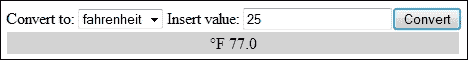
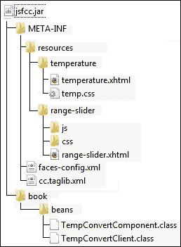

# 第十章 JSF 自定义组件

JSF 是一个基于组件的框架，JSF 自定义组件是支持 JSF 灵活性和可扩展性的主要证据。为了编写自定义组件或扩展现有的组件，JSF 提供了一个强大的 API，允许我们开发两种类型的组件：**自定义组件**，以及从 JSF 2.0 开始，**复合组件**。自定义组件实现负责提供**方面**（对于非 UI 组件，如自定义验证器、转换器和渲染器，是可选的）和**行为**。通常，编写自定义组件的决定和实现它的技能属于高级 JSF 开发者。

在你决定编写自定义组件之前，这可能是一项耗时的工作，你必须概述以下要点（特别是第一个要点）：

+   检查互联网（例如，[`jsfcentral.com/`](http://jsfcentral.com/)) 确保该组件尚未存在。许多 JSF 扩展，如 PrimeFaces、ICEfaces、OmniFaces 和 RichFaces，已经包含数百个自定义组件。

+   确保你需要自定义组件，而不仅仅是 Facelet 模板（参见第十二章，*Facelets 模板*)或对现有组件的一些自定义逻辑。

+   尝试重新设计应用程序目标以使用现有组件（有时你可以组合几个现有组件以获得所需方面和行为）。

+   仔细查看非 JSF 组件，例如 jQueryUI、ComponentJS 和 AmplifyJS（因为你在 JSF 应用程序中并不被迫只能使用 JSF 组件！）。

如果你的应用程序有一些特定的目标，这些目标无法通过前面的任何一项解决，那么是时候开始编写你自己的组件了。

在本章的第一部分，你将看到如何编写非复合自定义组件，在第二部分你将了解复合组件。非复合组件在 JSF 中已经存在很长时间了，编写此类组件的技术基于编写几个 Java 类。与复合组件一起出现的新概念从 JSF 2 开始提供，其背后的想法是用 XHTML 页面替换 Java 类。

# 构建非复合自定义组件

让我们直接跳到有趣的部分，并说在 JSF 2.0 中，通过在 Facelet 标签库（`*taglib.xml`）中进行配置，自定义组件被提供给页面作者。

此外，当组件映射到 JAR 文件中时，需要在`web.xml`中添加一个特殊的条目来指向`*taglib.xml`文件。参见名为`ch10_3`的应用程序。

截至 JSF 2.2，我们不再需要这些文件。一个 JSF 2.2 简单自定义组件包含一个类，它可能看起来像以下代码：

```java
@FacesComponent(value = "components.WelcomeComponent", createTag = true)
public class WelcomeComponent extends UIComponentBase {

    @Override
    public String getFamily() {
        return "welcome.component";
    }

    @Override
    public void encodeBegin(FacesContext context) throws IOException {

        String value = (String) getAttributes().get("value");
        String to = (String) getAttributes().get("to");

        if ((value != null) && (to != null)) {
            ResponseWriter writer = context.getResponseWriter();
            writer.writeAttribute("id", getClientId(context), null);
            writer.write(value + ", " + to);
        }
    }
}
```

大部分工作都是由 `@FacesComponent` 注解（`javax.faces.component.FacesComponent`）完成的。我们所需做的只是将 `createTag` 元素设置为 `true`，JSF 应该会为我们创建标签。此外，我们可以轻松利用我们的自定义组件，如下面的代码所示：

```java
<?xml version='1.0' encoding='UTF-8' ?>
<!DOCTYPE html PUBLIC "-//W3C//DTD XHTML 1.0 Transitional//EN" "http://www.w3.org/TR/xhtml1/DTD/xhtml1-transitional.dtd">
<html 

 >
    <h:head>
        <title></title>
    </h:head>
    <h:body>       
 <t:welcomeComponent value="Welcome" to="Rafael Nadal"/>
    </h:body>
</html>
```

### 注意

注意，组件的默认命名空间是 `http://xmlns.jcp.org/jsf/component`。这对于所有没有显式命名空间的组件都适用。

整个应用程序命名为 `ch10_1`。

JSF 2.2 支持的 `@FacesComponent` 元素完整列表如下：

+   `createTag`：这可以设置为 `true` 或 `false`。当设置为 `true` 时，JSF 将为我们生成标签（更具体地说，JSF 将在运行时创建一个扩展 `ComponentHandler` 的 Facelet 标签处理器）。此元素只能在 JSF 2.2 中使用。

+   `tagName`：这允许我们指定标签名称。当 `createTag` 设置为 `true` 时，JSF 将使用此名称生成标签。此元素只能在 JSF 2.2 中使用。

+   `namespace`：这允许我们指定标签命名空间。当 `createTag` 设置为 `true` 时，JSF 将使用此命名空间生成标签。当未指定命名空间时，JSF 将使用 `http://xmlns.jcp.org/jsf/component` 命名空间。此元素只能在 JSF 2.2 中使用。

+   `value`：此元素来自 JSF 2.0，表示 **组件类型**。组件类型可以用作 `Application.createComponent(java.lang.String)` 方法的参数，以创建 `Component` 类的实例。截至 JSF 2.2，如果 `value` 元素缺失或为 `null`，JSF 将通过在 `@FacesComponent` 附着的类上调用 `getSimpleName` 方法并小写第一个字符来获取它。

通过组件类型，我们理解一小块数据，它针对每个 `UIComponent` 子类，可以与 `Application` 实例结合使用，以编程方式获取这些子类的实例。此外，每个 `UIComponent` 子类属于一个组件家族（例如 `javax.faces.Input`）。当我们编写自定义组件并在某个家族下声明它时，这很重要，因为我们可以利用该家族组件特有的渲染器。在组件家族旁边，我们可以使用 **渲染器类型** 属性从 `RenderKit` 集合中选择一个 `Renderer` 实例（例如，输入字段属于 `javax.faces.Input` 家族和 `javax.faces.Text` 渲染器类型）。

每个自定义组件必须扩展 `UIComponent` 或其子类型之一，例如 `UIComponentBase`，它实际上是 `UIComponent` 所有抽象方法的默认实现。无论如何，有一个例外是 `getFamily` 方法，即使扩展 `UIComponentBase` 也必须重写它。作为常见做法，当自定义组件需要接受最终用户输入时，它将扩展 `UIInput`，而当它需要作为命令执行时，它将扩展 `UICommand`。

此外，让我们修改我们的应用程序如下，以指示自定义命名空间和标签名称：

```java
@FacesComponent(value = "components.WelcomeComponent", createTag = true, namespace = "http://atp.welcome.org/welcome", tagName = "welcome")
public class WelcomeComponent extends UIComponentBase {
...
}
```

接下来，组件将被如下使用：

```java
<html 

      >
...
  <t:welcome value="Welcome" to="Rafael Nadal"/>
```

完整的应用程序命名为 `ch10_2`。此外，此应用程序的 JSF 2.0 版本（包含 `*taglib.xml` 描述符和 `web.xml` 中的特定条目）命名为 `ch10_3`。

## 编写自定义标签处理器

注意，在某些情况下仍然需要 `*taglib.xml`。例如，如果你决定为你组件编写自定义标签处理器，那么你仍然需要此文件来配置处理器类。在这种情况下，你将扩展 `ComponentHandler` 类并覆盖所需的方法。大多数开发者利用 `onComponentCreated` 和 `onComponentPopulated` 方法。第一个方法在组件创建后但尚未用子组件填充之前被调用，第二个方法在组件用子组件填充之后被调用。截至 JSF 2.2，为希望接管 `UIComponent` 实例化任务的开发者添加了一个新方法。此方法名为 `createComponent`。如果它返回 `null`，则此方法将需要通过 `TagHandlerDelegate` 创建组件。由于这是一个相当罕见的情况，我们不坚持这一点，只是提供了一个简单的 `ComponentHandler` 模板：

```java
public class WelcomeComponentHandler extends ComponentHandler {

 private static final Logger logger = 
         Logger.getLogger(WelcomeComponentHandler.class.getName());

 public WelcomeComponentHandler(ComponentConfig config) {
  super(config);
 }

 @Override
 public UIComponent createComponent(FaceletContext ctx) {
  logger.info("Inside 'createComponent' method");
  return null;
 }

 @Override
 public void onComponentCreated(FaceletContext ctx, 
             UIComponent c, UIComponent parent) {
  logger.info("Inside 'onComponentCreated' method");
  super.onComponentCreated(ctx, c, parent);
 }

 @Override
 public void onComponentPopulated(FaceletContext ctx, 
             UIComponent c, UIComponent parent) {
  logger.info("Inside 'onComponentPopulated' method");
  super.onComponentPopulated(ctx, c, parent);
 }
}
```

为了指示我们的类处理器应该被使用，我们需要在 `*taglib.xml` 文件中对其进行配置，如下面的代码所示：

```java
<handler-class>book.beans.WelcomeComponentHandler</handler-class>
```

完整示例命名为 `ch10_24_1`。另一个可以作为起点使用的模板可以在 `ch10_24_2` 中找到。后者定义了自定义 `ComponentHandler`、自定义 `TagHandlerDelegateFactory` 和自定义 `TagHandlerDelegate` 的最小实现。

## 分析自定义组件

到目前为止，你可以看到我们的组件类覆盖了 `encodeBegin` 方法。此方法属于一组四个用于渲染组件的方法，其中每个组件都可以自行渲染（`setRendererType` 方法的参数为 `null`）或将渲染过程委托给 `Renderer` 类（内置或用户定义）。这些方法如下：

+   `decode`：为了解析输入值并将它们保存到组件中，每个请求都会通过 `decode` 方法。通常，当此方法被覆盖时，开发者会从请求映射中（或使用 `UIComponent.getAttributes` 方法从 `Map` 属性中）提取所需值，并通过调用 `setSubmittedValue(`*value*`)` 方法将这些值设置到组件中。

+   `encodeBegin`：此方法开始自定义组件的渲染过程。它通过 `FacesContext.getResponseWriter` 方法获取的响应流写入。当我们需要编码子组件但希望在编码之前向用户输出响应时，会覆盖此方法。

    ### 注意

    `ResponseWriter` 对象（`FacesContext.getResponseWriter`）包含用于生成标记的特殊方法，例如 `startElement`、`writeAttribute`、`writeText` 和 `endElement`。

+   `encodeChildren`：此方法渲染自定义组件的子组件。它很少被重写；然而，如果您想改变编码组件子组件的默认递归过程，那么请继续重写它。

+   `encodeEnd`：这可能是被重写最多的方法。正如其名称所暗示的，此方法在结束时被调用。在这里，我们将自定义标记写入响应流。当自定义组件接受最终用户输入时，`encodeEnd` 比 `encodeBegin` 更受欢迎，因为在 `encodeBegin` 的情况下，输入可能尚未通过潜在的附加转换器传递。

### 注意

我们刚才讨论的四个方法对所有自定义组件和所有渲染器都可用。在两种情况下，它们都有相同的名称，它们之间的区别在于一个参数。当它们在自定义组件类中被重写时，它们获得一个表示 `FacesContext` 的单个参数。另一方面，当它们在自定义渲染器中被重写时，它们获得 `FacesContext` 实例和相应的自定义组件（`UIComponent`）作为参数。

因此，我们可以得出结论，自定义组件是基于 `UIComponent` 的子类，并且它可以自行渲染或委托给一个能够渲染 `UIComponent` 实例并解码获取用户输入的 POST 请求的 `Renderer` 类。

自定义组件的一个重要方面是管理它们的状态。您应该已经熟悉从 第九章 *JSF 状态管理* 中了解的状态概念。因此，我们可以说 JSF 2.0 带来了 `StateHelper` 接口，它基本上允许我们在多个请求（回发）之间存储、读取和删除数据。这意味着我们可以用它来保留组件的状态。

理解如何结合使用 `StateHelper` 方法与自定义组件可能有点棘手，但一个常见的例子可以帮助澄清问题。让我们考虑以下自定义组件的使用示例：

```java
<t:temperature unitto="Celsius" temp="100" />
```

在自定义组件类中，我们可以轻松地将这些属性名称和默认值进行映射，如下面的代码所示：

```java
// Attribute name constant for unitto
private static final String ATTR_UNITTO = "unitto";
// Default value for the unitto attribute
private static final String ATTR_UNITTO_DEFAULT = "Fahrenheit";
// Attribute name constant for temp
private static final String ATTR_TEMP = "temp";
// Default value for the temp attribute
private static final Float ATTR_TEMP_DEFAULT = 0f;
```

接下来，我们希望在常量 `ATTR_UNITTO` 下保留 `unitto` 的值（对于 `temp` 来说，这完全相同）。为此，我们使用 `StateHelper.put` 方法，如下面的代码所示：

```java
public void setUnitto(String unitto) {
 getStateHelper().put(ATTR_UNITTO, unitto);
}
```

这些示例使用 `Object put(Serializable key, Object value)` 方法，但 `StateHelper` 还有一个名为 `Object put(Serializable key, String mapKey, Object value)` 的方法，可以用来存储那些本应存储在 `Map` 实例变量中的值。此外，`StateHelper` 还有一个名为 `void add(Serializable key, Object value)` 的方法，可以用来保留那些本应存储在 `List` 实例变量中的值。

接下来，你可以检索存储在 `ATTR_UNITTO` 常量下的值，如下面的代码所示：

```java
public String getUnitto() {
 return (String) getStateHelper().eval(ATTR_UNITTO, ATTR_UNITTO_DEFAULT);
}
```

`Object eval(Serializable key, Object defaultValue)` 方法将搜索 `ATTR_UNITTO` 常量。如果找不到，则返回默认值（`ATTR_UNITTO_DEFAULT`）。这是一个非常有用的方法，因为它可以避免我们执行 `null` 值检查。除了这个方法之外，`StateHelper` 还具有 `Object eval(Serializable key)` 和 `Object get(Serializable key)` 方法。

为了从 `StateHelper` 中删除条目，我们可以调用 `Object remove(Serializable key)` 或 `Object remove(Serializable key, Object valueOrKey)`。

在这个时候，我们有很多信息可以转化为代码，所以让我们编写一个自定义组件来举例说明上述知识。让我们称它为温度自定义组件。基本上，下一个自定义组件将公开一个作为 JSF 组件的公共网络服务。这个网络服务能够将摄氏度转换为华氏度，反之亦然，我们需要传递温度值和转换单位作为参数。基于这两个参数，我们可以直观地推断出相应的 JSF 标签将类似于以下代码：

```java
<t:temperature unitto="celsius/fahrenheit" temp="*number_of_degrees*" />
```

我们可以先实现一个辅助类来处理通信任务背后的网络服务。这个类的名字是 `TempConvertClient`，可以在名为 `ch10_4` 的完整应用程序中看到。它相关部分是以下方法的声明：

```java
public String callTempConvertService(String unitto, Float temp) {
...
}
```

### 自定义组件实现

现在，我们可以专注于对我们来说重要的部分，即自定义组件实现。为此，我们可以遵循以下步骤：

1.  编写一个带有 `@FacesComponent` 注解的类。

1.  使用 `StateHelper` 在多个请求中保留组件的属性值。

1.  调用 `callTempConvertService` 方法。

1.  渲染结果。

前三个步骤可以编码如下：

```java
@FacesComponent(value = TempConvertComponent.COMPONENT_TYPE, createTag = true, namespace = "http://temp.converter/", tagName = "temperature")
public class TempConvertComponent extends UIComponentBase {

 public TempConvertComponent() {
  setRendererType(TempConvertRenderer.RENDERER_TYPE);
 }

 public static final String COMPONENT_FAMILY = 
                            "components.TempConvertComponent";
 public static final String COMPONENT_TYPE = 
                            "book.beans.TempConvertComponent";
 private static final String ATTR_UNITTO = "unitto";
 private static final String ATTR_UNITTO_DEFAULT = "fahrenheit";
 private static final String ATTR_TEMP = "temp";
 private static final Float ATTR_TEMP_DEFAULT = 0f;
 public String getUnitto() {
  return (String) getStateHelper().
          eval(ATTR_UNITTO, ATTR_UNITTO_DEFAULT);
 }

 public void setUnitto(String unitto) {
  getStateHelper().put(ATTR_UNITTO, unitto);
 }

 public Float getTemp() {
  return (Float) getStateHelper().eval(ATTR_TEMP, ATTR_TEMP_DEFAULT);
 }

 public void setTemp(Float temp) {
  getStateHelper().put(ATTR_TEMP, temp);
 }

 public String getTempConvert() {
  TempConvertClient tempConvertClient = new TempConvertClient();
  return String.format("%.1f", Float.valueOf(tempConvertClient.
               callTempConvertService(getUnitto(), getTemp())));
 }

 @Override
 public String getFamily() {
  return TempConvertComponent.COMPONENT_FAMILY;
 }
}
```

在第四步中，前一段代码中有一个提示。如果你仔细查看类构造函数，你会看到渲染任务被委托给一个外部类（renderer）。这个类将渲染一个包含网络服务响应的简单样式化 HTML `div`，如下所示：

```java
@ResourceDependencies({
 @ResourceDependency(name="css/temp.css",library="default",target="head")
})
@FacesRenderer(componentFamily = TempConvertComponent.COMPONENT_FAMILY, rendererType = TempConvertRenderer.RENDERER_TYPE)
public class TempConvertRenderer extends Renderer {

public static final String RENDERER_TYPE = 
                "book.beans.TempConvertRenderer";

public TempConvertRenderer() {
}

@Override
public void encodeEnd(FacesContext context, UIComponent uicomponent) 
                                                 throws IOException {

 ResponseWriter responseWriter = context.getResponseWriter();
 TempConvertComponent component = (TempConvertComponent) uicomponent;

 String unit = component.getUnitto();

 responseWriter.startElement("div", component);
 responseWriter.writeAttribute("class", "tempClass", null);
 responseWriter.writeAttribute("id", component.getClientId(), "id");
 responseWriter.write("&deg;");
 if (unit.equals("fahrenheit")) {
     responseWriter.write("F ");
 } else {
     responseWriter.write("C ");
 }
 responseWriter.write(component.getTempConvert());
 responseWriter.endElement("div");
 }
}
```

### 注意

`@ResourceDependency` 和 `@ResourceDependencies` 注解用于自定义组件和渲染器中的链接外部资源（例如，JavaScript 和 CSS）。

为了将此类注册为`Renderer`类，您需要使用`@FacesRenderer`注解它或在`faces-config.xml`中进行配置，如下面的代码所示：

```java
<application>
 <render-kit>
  <renderer>                    
   <component-family>
    components.TempConvertComponent
   </component-family>
   <renderer-type>book.beans.TempConvertRenderer</renderer-type>
   <renderer-class>book.beans.TempConvertRenderer</renderer-class>
  </renderer>
 </render-kit>
</application>
```

`Renderer`类的一个重要特性是它必须定义一个无参数的公共构造函数。

注意，`<renderer-type>`标签对应于`renderedType`元素，而`<component-family>`标签对应于`componentFamily`元素。此外，`componentFamily`的值与组件的`getFamily`方法返回的值相同。`RenderKit`可以根据这些信息提供一个`Renderer`实例。

当然，在这个例子中，您也可以在自定义组件类中实现渲染过程，因为没有真正的理由要编写一个单独的类。通常，当您需要支持多个客户端设备并且需要通过`RenderKit`集合注册特殊渲染器时，您会想要编写一个单独的渲染器类。

下面的代码示例展示了如何使用我们的自定义组件（代码本身具有自解释性）：

```java
<html 

      >
...
  <h:form>
   Convert to:
   <h:selectOneMenu value="#{tempBean.unitto}">
    <f:selectItem itemValue="fahrenheit" itemLabel="fahrenheit" />
    <f:selectItem itemValue="celsius" itemLabel="celsius" />
   </h:selectOneMenu>
   Insert value:
   <h:inputText value="#{tempBean.temp}"/>
   <h:commandButton value="Convert">
    <f:ajax execute="@form" render=":tempId" />
   </h:commandButton>
  </h:form>     

 <t:temperature id="tempId" 
 unitto="#{tempBean.unitto}" temp="#{tempBean.temp}" />

```

或者，我们可以将转换单位和温度作为常量提供（如果其中一个或两个属性缺失，则将使用默认值）：

```java
  <t:temperature id="tempId" unitto="celsius" temp="10" />
```

`TempBean`只是一个简单的后端 Bean，如下面的代码所示：

```java
@Named
@SessionScoped
public class TempBean implements Serializable {

 private String unitto = "fahrenheit";
 private Float temp = 0f;
 ...
 //getters and setters
}
```

完整的应用程序位于本章的代码包中，名称为`ch10_4`。在下面的屏幕截图中，您可以看到运行此应用程序的结果：



因此，我们的自定义组件只是渲染一个包含温度转换结果的`div`块。进一步地，我们希望编写一个自定义组件，除了这个`div`之外，它还将渲染用于收集数据（转换单位和温度）的用户界面，并通过 AJAX 提交。换句话说，前面表单的内容将是自定义组件的一部分。

这次我们需要直接在自定义组件中处理用户输入，这意味着我们的自定义组件可以扩展`UIInput`而不是`UIComponentBase`。这个主要变化将给我们带来`UIInput`组件的优势。我们可以在解码过程中使用`setSubmittedValue`方法提交自定义组件的值，并在编码（渲染）过程中使用`getValue`方法获取结果值。

大问题在于我们的自定义组件值由两个值组成：转换单位和温度值。有一些解决方案可以解决这个问题。在这种情况下，我们可以简单地将这些值连接成一个，例如以下示例（*conversion_unit*`/`*temperature*）：

```java
<t:temperature value="celsius/1" />
```

现在我们可以编写自定义组件类，如下面的代码所示：

```java
@FacesComponent(createTag = true, namespace = "http://temp.converter/", tagName = "temperature")
public class TempConvertComponent extends UIInput 
                           implements NamingContainer {

 public TempConvertComponent() {
  setRendererType(TempConvertRenderer.RENDERER_TYPE);
 }    

 public String getTempConvert(String unitto, float temp) {
  TempConvertClient tempConvertClient = new TempConvertClient();
  return String.format("%.1f", 
   tempConvertClient.callTempConvertService(unitto, temp));
  }
}
```

注意，我们不再需要指定组件家族，`getFamily`方法是从`UIInput`类继承的。进一步来说，我们需要编写渲染器类。

### 提示

如果你想要允许组件自行渲染，使用`setRendererType(null)`并覆盖组件类中的相应方法。

我们需要渲染四个 HTML 标签（下拉列表、输入字段、提交按钮和结果`div`）。为此，我们可以覆盖`encodeEnd`方法，如下面的代码所示：

```java
@Override
public void encodeEnd(FacesContext context, UIComponent uicomponent) 
                                                    throws IOException {

 TempConvertComponent component = (TempConvertComponent) uicomponent;

 String clientId = component.getClientId(context);
 char separator = UINamingContainer.getSeparatorChar(context);
 encodeSelectOneMenu(context, 
                   component, clientId + separator + "selectonemenu");
 encodeInput(context, component, clientId + separator + "inputfield");
 encodeButton(context, component, clientId + separator + "button");
 encodeResult(context, component, clientId + separator + "div");
 }
```

每个组件的标识符是从主组件的客户端 ID（使用`getClientId`方法）拼接上命名容器分隔符和一个表示组件类型的字符串获得的。

### 注意

在这个例子中，查询`NamingContainer`接口（由`UINamingContainer`实现）以获取用于分隔客户端 ID 段分隔符，但其主要目的是确保其内部声明的组件的唯一性。

接下来，渲染下拉组件的方法如下：

```java
private void encodeSelectOneMenu(FacesContext context, TempConvertComponent component, String clientId) throws IOException {

 String cv = String.valueOf(component.getValue());
 String unitto = cv.substring(0, cv.indexOf("/"));

 ResponseWriter responseWriter = context.getResponseWriter();
 responseWriter.startElement("span", component);
 responseWriter.write("Convert to:");
 responseWriter.endElement("span");
 responseWriter.startElement("select", component);
 responseWriter.writeAttribute("name", clientId, "clientId");
 responseWriter.writeAttribute("size", 1, "size");
 responseWriter.startElement("option", component);
 responseWriter.writeAttribute("value", "fahrenheit", "value");
 if (unitto.equals("fahrenheit")) {
     responseWriter.writeAttribute("selected", "selected", "selected");
    }
 responseWriter.writeText("fahrenheit", "fahrenheit");
 responseWriter.endElement("option");
 responseWriter.startElement("option", component);
 responseWriter.writeAttribute("value", "celsius", "value");
 if (unitto.equals("celsius")) {
     responseWriter.writeAttribute("selected", "selected", "selected");
 }
 responseWriter.writeText("celsius", "celsius");
 responseWriter.endElement("option");
 responseWriter.endElement("select");
}
```

这段代码的前两行很重要，其中我们提取了组件值中的转换单位部分，并在下拉组件中选择了相应的项。

接下来，我们渲染输入字段，如下面的代码所示：

```java
private void encodeInput(FacesContext context, TempConvertComponent component, String clientId) throws IOException {

 String cv = String.valueOf(component.getValue());
 String temp = cv.substring(cv.indexOf("/") + 1);

 ResponseWriter responseWriter = context.getResponseWriter();
 responseWriter.startElement("span", component);
 responseWriter.write("Insert value:");
 responseWriter.endElement("span");
 responseWriter.startElement("input", component);
 responseWriter.writeAttribute("name", clientId, "clientId");
 responseWriter.writeAttribute("value", temp, "value");
 responseWriter.writeAttribute("type", "text", "type");
 responseWriter.endElement("input");
}
```

现在我们将从组件值中提取温度值。为了完成这个任务，我们渲染了一个标记为**转换**的按钮，该按钮负责通过 AJAX 提交用户输入，如下所示：

```java
private void encodeButton(FacesContext context, TempConvertComponent component, String clientId) throws IOException {

 ResponseWriter responseWriter = context.getResponseWriter();
 responseWriter.startElement("input", component);
 responseWriter.writeAttribute("type", "Submit", null);
 responseWriter.writeAttribute("name", clientId, "clientId");
 responseWriter.writeAttribute("value", "Convert", null);
 responseWriter.writeAttribute("onclick",
   "jsf.ajax.request(this,event,{execute:'" + "@form" + "',"
 + "render:'" + "@form" + "'," + "});"
 + "return false;", null);
 responseWriter.endElement("input");
}
```

在用户输入提交后，我们需要渲染从网络服务获得的结果：

```java
private void encodeResult(FacesContext context, TempConvertComponent component, String clientId) throws IOException {

 String cv = String.valueOf(component.getValue());
 String unitto = cv.substring(0, cv.indexOf("/"));
 String temp = cv.substring(cv.indexOf("/") + 1);
 String result = component.getTempConvert(unitto, Float.valueOf(temp));

 ResponseWriter responseWriter = context.getResponseWriter();
 responseWriter.startElement("div", component);
 responseWriter.writeAttribute("class", "tempClass", null);
 responseWriter.writeAttribute("name", clientId, "clientId");
 responseWriter.write("&deg;");
 if (unitto.equals("fahrenheit")) {
     responseWriter.write("F ");
 } else {
     responseWriter.write("C ");
 }
 responseWriter.write(result);
 responseWriter.endElement("div");
}
```

后端 Bean，`TempBean`，相当简单，如下面的代码所示：

```java
@Named
@SessionScoped
public class TempBean implements Serializable {

 private String value = "celsius/0";

 public String getValue() {
  return value;
 }

 public void setValue(String value) {
  this.value = value;
 }              
}
```

最后一步涉及解码用户输入并将其提交给组件，如下面的代码所示：

```java
@Override
public void decode(FacesContext context, UIComponent uicomponent) {

 TempConvertComponent component = (TempConvertComponent) uicomponent;
 Map requestMap = context.getExternalContext().getRequestParameterMap();
 String clientId = component.getClientId(context);
 char separator = UINamingContainer.getSeparatorChar(context);
 String temp = ((String) 
                requestMap.get(clientId+ separator + "inputfield"));
 String unitto = ((String) 
                requestMap.get(clientId + separator + "selectonemenu"));       
 component.setSubmittedValue(unitto+"/"+temp);       
}
```

完成！现在你可以看到两个测试，如下面的代码所示：

```java
Specified unit and temperature from bean:
<h:form id="tempForm1">            
 <t:temperature id="temp1" value="#{tempBean.value}" /> 
 <h:message for="temp1"/>
</h:form>   
<hr/>
Specified unit and temperature as constants:
<h:form id="tempForm2">           
 <t:temperature id="temp2" value="celsius/1" /> 
 <h:message for="temp2"/>
</h:form>
```

完整的应用程序包含在本章的代码包中，名称为`ch10_5`。

# 构建组合组件

可能组合组件背后的想法源于 JSF 页面作者和 JSF 组件作者对组件的不同看法。虽然 JSF 页面作者将组件视为可以在 XHTML 页面中使用的标签，但 JSF 组件作者将组件视为`UIComponent`、`UIComponentBase`、`NamingContainer`、`Renderer`、`Validator`和`Converter`元素的混合体——这些元素构成了 JSF 组件。基于此，似乎只有 JSF 组件作者才能编写自定义组件，因为他们对这些 JSF 元素和 Java 语言有了解。然而，从 JSF 2 开始，这一事实已经开始改变，组合组件实际上是在 XHTML 页面中使用标记标签编写的自定义组件。这意味着 JSF 页面作者可以开始编写他们的组件，而无需具备与专门的 JSF 组件作者相同水平的知识和技能——至少，简单的组合组件。

例如，JSF 2.2 组合组件的结构如下所示：

```java
<?xml version='1.0' encoding='UTF-8' ?>
<!DOCTYPE html PUBLIC "-//W3C//DTD XHTML 1.0 Transitional//EN" "http://www.w3.org/TR/xhtml1/DTD/xhtml1-transitional.dtd">
<html 
      >

 <!-- INTERFACE -->
 <cc:interface>
 </cc:interface>

 <!-- IMPLEMENTATION -->
 <cc:implementation>
 </cc:implementation>
</html>
```

结构非常简单！正如你所见，有两个主要标签属于`http://xmlns.jcp.org/jsf/composite`库。第一个标签定义了接口部分，表示组件使用合同。在这里，我们可以定义可能被最终用户更改的组件属性（原则上，任何页面作者可以使用的属性）。第二个标签标记了实现部分，其中包含组件本身。这将渲染给最终用户。此外，在这个部分中，我们根据接口部分中定义的属性（使用合同实现）定义组件的行为。

### 注意

复合组件基本上是存储在`resources`文件夹下库中的 XHTML 页面（放置在 Web 应用程序根目录下的顶级文件夹或 JAR 中的`META-INF`文件夹下）。记住，库只是`resources`文件夹的子文件夹。基于此，复合组件路径的类型为`http://xmlns.jcp.org/jsf/composite/`*library_name*。

那么，让我们来做一个快速测试。记住，在本章中首先开发的自定义组件`WelcomeComponent`是从一个带有`@FacesComponent`注解的类构建的。在这个类中，我们重写了`encodeBegin`方法以渲染组件。好的，现在让我们看看同一个组件，但这次是一个复合组件。我们将这个页面存储在`resources/customs/welcome.xhtml`下，如下面的代码所示：

```java
<?xml version='1.0' encoding='UTF-8' ?>
<!DOCTYPE html PUBLIC "-//W3C//DTD XHTML 1.0 Transitional//EN" "http://www.w3.org/TR/xhtml1/DTD/xhtml1-transitional.dtd">
<html 
      >

 <!-- INTERFACE -->
 <cc:interface>
  <cc:attribute name="value"/>
  <cc:attribute name="to"/>
 </cc:interface>

 <!-- IMPLEMENTATION -->
 <cc:implementation>
  <p>#{cc.attrs.value}, #{cc.attrs.to}</p>
 </cc:implementation>
</html>
```

将自定义组件与其复合版本进行类比非常简单。这里重要的是要注意属性是如何使用`<cc:attribute>`标签声明的。除了名称外，属性可以有类型，可以是必需的或非必需的，可以有默认值，可以针对组件，等等（在本章中，你将有机会探索不同类型的属性）。一般来说，JSF 确定属性是`MethodExpression`（或者它有如`actionListener`、`valueChangeListener`、`action`等特殊名称）还是`ValueExpression`。

第一个案例有点棘手；JSF 会尝试根据`targets`属性中定义的 ID 列表（ID 列表由空格分隔，相对于顶级组件）将属性与实现中的组件进行匹配。如果不存在`targets`属性，那么 JSF 将`name`属性的值作为客户端 ID（相对于顶级组件）并尝试在实现部分中找到相应的组件。嗯，在简单的情况下，属性是一个`ValueExpression`，JSF 将只将属性存储在可通过`UIComponent.getAttributes`访问的属性映射中。

在实现部分，通过`#{cc}`隐含对象使用属性。

### 注意

有必要知道，JSF 会隐式地为所有构成复合组件的组件创建一个顶级组件。这个组件是页面中所有组件的父组件，命名为`UINamingContainer`（通过`UIComponent.getNamingContainer`方法可用）。现在，`#{cc}`隐式对象实际上指的是这个顶级组件，可以用来获取各种信息，但它特别用于获取客户端 ID（`#{cc.clientId}`）和访问复合组件属性（`#{cc.attrs}`）。

现在是时候测试我们的复合组件了。这非常简单——只需导入复合命名空间，设置一个前缀，然后开始使用它，如下面的代码所示：

```java
<?xml version='1.0' encoding='UTF-8' ?>
<!DOCTYPE html PUBLIC "-//W3C//DTD XHTML 1.0 Transitional//EN" "http://www.w3.org/TR/xhtml1/DTD/xhtml1-transitional.dtd">
<html 

      >
 <h:head>
  <title></title>
 </h:head>
 <h:body>
 **<t:welcome value="Welcome" to="Rafael Nadal"/>**
 </h:body>
</html>
```

**通过大量实践学习编写复合组件的技术。这就是为什么在接下来的章节中，您将看到几种不同类型的复合组件，它们探索了不同的实现方式。**

**完整的应用程序命名为`ch10_6`。**

## **开发温度复合组件**

**主演：后端组件**

**还记得我们在上一节中实现的温度自定义组件吗？好吧，我们确信您记得。那么，让我们看看如何开发一个看起来和表现相同的复合组件。复合组件页面可以命名为`temperature.xhtml`，我们可以将其存储在`resources`文件夹下的`temperature`文件夹中。首先，让我们在下面的代码中看看它；然后我们可以分析它：**

```java
<?xml version='1.0' encoding='UTF-8' ?>
<!DOCTYPE html PUBLIC "-//W3C//DTD XHTML 1.0 Transitional//EN" "http://www.w3.org/TR/xhtml1/DTD/xhtml1-transitional.dtd">
<html 

      >

 <!-- INTERFACE -->
 <cc:interface componentType="book.beans.TempConvertComponent">
  <cc:attribute name="value" type="java.lang.String" 
                                          default="celsius/0"/>
 </cc:interface>

 <!-- IMPLEMENTATION -->
 <cc:implementation>
  <h:outputStylesheet name="temperature/temp.css" />            
  <div id="#{cc.clientId}">
   <h:outputLabel for="selectonemenu" value="Convert to:"/>
   <h:selectOneMenu id="selectonemenu" binding="#{cc.unittoI}">
    <f:selectItem itemValue="fahrenheit" itemLabel="fahrenheit" />
    <f:selectItem itemValue="celsius" itemLabel="celsius" />
   </h:selectOneMenu>
   <h:outputLabel for="inputfield" value="Insert value:"/>
   <h:inputText id="inputfield" binding="#{cc.temptI}"/>          
   <h:commandButton id="button" value="Convert">
    <f:ajax execute="@form" render="@form"/>
   </h:commandButton>
   <h:panelGroup id="div" layout="block" class="tempClass">
    <h:outputText value="&deg; #{cc.unittoI.value eq 'fahrenheit' ? 'F ': 'C ' } #{cc.getTempConvert()}"/>
   </h:panelGroup>
  </div>
 </cc:implementation>
</html>
```

**在接口部分，我们定义了一个名为`value`的属性，这是针对`UIInput`组件的。进一步地，我们指出接受值为`String`类型，当属性缺失时，默认值为`celsius/0`。通常，`type`属性用于将元素（们）链接到 bean 的属性（对于其值，使用完全限定名，如前述代码所示）。**

**实现部分更有趣，因为在这里我们需要定义我们组件的子组件：下拉菜单、输入字段、提交按钮和结果 div（注意 JSF 从`<h:panelGroup layout="block"/>`生成一个 HTML `<div>`）。当您的复合组件包含多个组件时，将它们放置在 ID 设置为`#{cc.clientId}`的`<div>`或`<span>`标签内是一个好习惯。这个 ID 是复合组件本身的客户端标识符，当页面作者需要通过一个简单的 ID 引用整个复合组件时非常有用。**

**外部资源，如 CSS 和 JS，不需要任何特殊处理。您可以将它们放置在与复合组件相同的库中，或者放置在任何其他库中，并且可以使用`<h:outputScript>`和`<h:outputStylesheet>`来加载它们。**

**快速查看后，一个明显的问题出现了：`getTempConvert`方法的实现和用于根据`binding`属性链接这些组件的后端 bean 属性在哪里？好吧，所有这些都在一个 Java 类中，称为**后端组件**（不要与后端 bean 混淆！）。是的，我知道我之前说过复合组件不需要 Java 代码，但有时它们确实需要，就像在这个案例中，我们需要编写调用 Web 服务的代码！为了编写后端组件，您需要记住以下步骤：**

1.  **使用`@FacesComponent`注解标注后端组件**

1.  **扩展`UINamingContainer`或实现`NamingContainer`并覆盖`getFamily`方法如下：**

    ```java
      @Override
      public String getFamily() {
       return UINamingContainer.COMPONENT_FAMILY;
      }
    ```**

1.  **通过向`<cc:interface>`标签添加`componentType`属性将复合组件与后端组件链接。此属性的值是组件类型（这告诉 JSF 创建此处指示的类的实例）**

    ```java
    @FacesComponent(value = "*component type value*")
    ...
    <cc:interface componentType="*component type value*">
    ```**

### **注意**

**后端组件可以定义 getter 来通过`#{cc}`隐式对象（`#{cc}`可以访问操作方法）公开其属性。另一方面，`<cc:attribute>`属性可以通过`UIComponent.getAttributes`方法在后端组件中访问。**

**考虑到这些，我们的复合组件的后端组件如下：**

```java
@FacesComponent(value = "book.beans.TempConvertComponent", 
                                           createTag = false)
public class TempConvertComponent extends UIInput implements NamingContainer {

 private UIInput unittoI;
 private UIInput temptI;

 public TempConvertComponent() {
 }

 public UIInput getUnittoI() {
  return unittoI;
 }

 public void setUnittoI(UIInput unittoI) {
  this.unittoI = unittoI;
 }

 public UIInput getTemptI() {
  return temptI;
 }

 public void setTemptI(UIInput temptI) {
  this.temptI = temptI;
 }

 public String getTempConvert() {
  TempConvertClient tempConvertClient = new TempConvertClient();
  return String.format("%.1f", 
  tempConvertClient.callTempConvertService(String.valueOf(unittoI.getValue()), Float.valueOf(String.valueOf(temptI.getValue()))));
}

 @Override
 public void decode(FacesContext context) {
  this.setSubmittedValue(temptI.getSubmittedValue() + "/" + 
                                  unittoI.getSubmittedValue());
 }

 /*
  * you can override getSubmittedValue instead of decode
 @Override
 public Object getSubmittedValue() {
  return temptI.getSubmittedValue() + "/" + unittoI.getSubmittedValue();
 }
 */

 @Override
 public void encodeBegin(FacesContext context) throws IOException {

  if (getValue() != null) {
      String cv = String.valueOf(getValue());
      String unitto = cv.substring(0, cv.indexOf("/"));
      String temp = cv.substring(cv.indexOf("/") + 1);
      if (temptI.getValue() == null) {
          temptI.setValue(temp);
      }
      if (unittoI.getValue() == null) {
          unittoI.setValue(unitto);
      }
    }
   super.encodeBegin(context);
  }

 @Override
 public String getFamily() {
  return UINamingContainer.COMPONENT_FAMILY;
 }
}
```

**我们的后端组件的故事相当清晰。在`encodeBegin`方法中，我们确保组件值被解析，并且每个子组件（下拉列表和输入字段）都收到了正确的值部分。当用户提交数据时，我们在`encode`方法中处理它，其中我们获取下拉列表和输入字段的值，并构建一个类型为`conversion_unit``/``temperature`的字符串。这成为提交的值。**

**现在是指出 JSF 如何选择顶级组件的好时机。JSF 试图做以下事情：**

+   **在`<cc:interface>`标签中定位`componentType`属性。如果存在，则后端组件将被实例化并用作顶级组件。这就是温度复合组件的情况。**

+   **定位一个与复合组件页面相同名称和位置的`UIComponent`实现。这可以是一个与复合组件页面同名同地的 Groovy 脚本（当然，带有`.groovy`扩展名）。**

+   **定位一个名为`component_library_name.composite_component_page_name`的 Java 类，并将其实例化为顶级组件。这种方法使我们能够使用`@FacesComponent`。**

+   **生成一个类型为`javax.faces.NamingContainer`的组件。**

**完整的应用程序命名为`ch10_8`。基于通过这个教学示例引入的知识，您可以查看另一个名为时区的示例，如下截图所示。完整的应用程序命名为`ch10_25`。**

****

## **将 jQuery 组件转换为复合组件**

**亮点：JavaScript 闭包**

**jQuery UI 是在 jQuery JavaScript 库之上构建的出色的用户界面交互、效果、小部件和主题集合。在本节中，你将了解如何将 jQuery 组件公开为 JSF 复合组件。更确切地说，我们将转换 jQuery 范围滑块([`jqueryui.com/slider/#range`](https://jqueryui.com/slider/#range))，如下面的截图所示：**

****

**此组件背后的主要代码如下所示：**

```java
<!doctype html>
<html lang="en-US">
 <head>
  <meta charset="utf-8"> 
  <title>Range Slider with jQuery UI</title>  
  <link rel="stylesheet" type="text/css" media="all" 
                                     href="css/styles.css">
  <link rel="stylesheet" type="text/css" media="all" href="https://ajax.googleapis.com/ajax/libs/jqueryui/1.8.16/themes/base/jquery-ui.css">
  <script type="text/javascript" src="img/jquery.min.js"></script>
  <script type="text/javascript" src="img/jquery-ui.min.js"></script>
 </head>

 <body>
  <div id="w">
   <div id="content">     
    <h2>Ranged Slider</h2>
    <div id="rangedval">
     Range Value: <span id="rangeval">90 - 290</span>
    </div>      
    <div id="rangeslider"></div>      
   </div>
  </div>
  <script type="text/javascript">
   $(function(){  
   $('#rangeslider').slider({
     range: true,
     min: 0,
     max: 100,
     values: [ 5, 20 ],
     slide: function( event, ui ) {
      $('#rangeval').html(ui.values[0]+" - "+ui.values[1]);
     }
    });  
   });
  </script>
 </body>
</html>
```

**JSF 复合组件应如下所示（重要部分已突出显示）：**

```java
<h:form id="sliderFormId">
 <h:panelGrid columns="1">
 **<t:range-slider id="sliderId" min="#{sliderBean.min}"** 
 **max="#{sliderBean.max}" leftside="#{sliderBean.leftside}"** 
 **rightside="#{sliderBean.rightside}"/>**
  <h:commandButton value="Send" action="#{sliderBean.sliderListener()}">
   <f:ajax execute="@form" render="@form"/>
  </h:commandButton>
 </h:panelGrid>
</h:form>
```

**我们可以从定义复合组件属性开始。这些属性将允许最终用户设置最小值（`min`属性）、最大值（`max`属性）和初始范围（`leftside`和`rightside`属性）。这些属性将在接口部分声明，如下面的代码所示：**

```java
<!-- INTERFACE -->
<cc:interface>
 <cc:attribute name="min" type="java.lang.Integer" 
                          default="0" required="true"/>
 <cc:attribute name="max" type="java.lang.Integer" 
                          default="1000" required="true"/>
 <cc:attribute name="leftside" type="java.lang.Integer" 
                          default="450" required="true"/>
 <cc:attribute name="rightside" type="java.lang.Integer" 
                          default="550" required="true"/> 
</cc:interface>
```

**实现部分可以分为三个逻辑部分。在第一部分中，我们定义外部资源（CSS 和 JS 文件）。请注意，`<h:outputScript>`和`<h:outputStylesheet>`不能为绝对 URL（`http://...`）加载此类资源，因此你需要将这些资源放在你的本地机器上：**

```java
<!-- IMPLEMENTATION -->
<cc:implementation>
 <h:outputStylesheet name="range-slider/css/styles.css"/>  
 <h:outputStylesheet name="range-slider/css/jquery-ui.css"/>         
 <h:outputScript target="head" name="range-slider/js/jquery.min.js"/>
 <h:outputScript target="head" name="range-slider/js/jquery-ui.min.js"/>         
 ...
```

**在第二部分，我们渲染显示范围滑块的 div。为此，我们遵循原始组件的精确模型，但添加了我们的属性`leftside`和`rightside`，如下面的代码所示：**

```java
<div id="#{cc.clientId}:w" class="w">
  <div id="#{cc.clientId}:content" class="content">
   <div id="#{cc.clientId}:rangedval" class="rangedval">
    Range Value: <span id="#{cc.clientId}:rangeval">
                 #{cc.attrs.leftside} - #{cc.attrs.rightside}</span>
   </div>
   <div id="#{cc.clientId}:slider">
   </div>
  </div>
  <h:inputHidden id="leftsideId" value="#{cc.attrs.leftside}"/>
  <h:inputHidden id="rightsideId" value="#{cc.attrs.rightside}"/>
</div>
```

**虽然`min`和`max`属性可以设置为特定值，但我们特别关注`leftside`和`rightside`属性，它们应被视为最终用户的输入。为此，我们添加了两个隐藏字段（一个用于`leftside`，一个用于`rightside`），可以轻松地将此信息传输到服务器。**

**在第三部分，我们需要调整代表组件引擎的 JavaScript 代码。当在同一页面上添加多个范围滑块时，此代码必须正确生成，因此我们需要按以下方式修改它以适应正确的 ID 和属性值：**

```java
<script type="text/javascript">
 $(function() {
   var rangeval = "${cc.clientId}:rangeval".replace(/:/g, "\\:");
   var slider = "${cc.clientId}:slider".replace(/:/g, "\\:");
   $('#' + slider).slider({
     range: true,
     min: #{cc.attrs.min},
     max: #{cc.attrs.max},
     values: [#{cc.attrs.leftside}, #{cc.attrs.rightside}],
     slide: function(event, ui) {
     $('#' + rangeval).html(ui.values[0] + " - " + ui.values[1]);
     $("#${cc.clientId}:leftsideId".
          replace(/:/g, "\\:")).val(ui.values[0]);
     $("#${cc.clientId}:rightsideId".
          replace(/:/g, "\\:")).val(ui.values[1]);
     }
   });
  });
 </script>
</cc:implementation>
```

### **注意**

**将 JSF 和 jQuery 结合使用时，一个常见问题涉及使用冒号（`:`）。虽然 JSF 将其用作 ID 段分隔符，但 jQuery 选择器有其他用途。为了在 jQuery 中工作，我们需要转义冒号。如果你使用 PrimeFaces 方法，这可以很容易地完成，如下面的代码所示：**

```java
escadpeClientId:function(a){return"#"+a.replace(/:/g,"\\:")}
```

**完成！现在你可以在你的页面上测试复合组件。完整的应用程序命名为`ch10_11`。**

**好吧，如果您在页面中添加多个范围滑块，您将看到前面的 JavaScript 代码每次都会生成并添加。这段代码的大小微不足道，您在同一页面上需要多个范围滑块的可能性很小，所以这不会是一个大问题。但是，当出现这样的问题时，您需要知道有一些解决方案。**

**例如，我们可以将 JavaScript 从复合组件中提取出来并放置到页面中，或者作为一个应该自包含的组件，最好是将代码放置到一个单独的 JavaScript 文件中，并在复合组件中使用 `<h:outputScript>` 引用它。之后，我们使用期望的属性参数化 JavaScript 代码，并从复合组件中调用它。因此，参数化版本可能看起来像以下代码（将此代码放入名为 `slider.js` 的文件中）：**

```java
 var rangeslider = {
  init: function(clientId, min, max, leftside, rightside) {
  var rangeval = (clientId + ":rangeval").replace(/:/g, "\\:");
  var slider = (clientId + ":slider").replace(/:/g, "\\:");
   $('#' + slider).slider({
    range: true,
 **min: min,**
 **max: max,**
 **values: [parseInt(leftside), parseInt(rightside)],**
    slide: function(event, ui) {
     $('#' + rangeval).html(ui.values[0] + " - " + ui.values[1]);
     $("#" + (clientId + ":leftsideId").
              replace(/:/g, "\\:")).val(ui.values[0]);
     $("#" + (clientId + ":rightsideId").
              replace(/:/g, "\\:")).val(ui.values[1]);
    }
   });
  }
 };
```

**进一步，我们调整了复合组件实现部分以调用以下可重用 JavaScript 代码：**

```java
<cc:implementation>
 ...
 <h:outputScript target="head" name="range-slider/js/slider.js"/>
 ...
 <script>
  rangeslider.init('#{cc.clientId}', '#{cc.attrs.min}', 
   '#{cc.attrs.max}', '#{cc.attrs.leftside}', '#{cc.attrs.rightside}');
 </script>
</cc:implementation>
```

**可能您已经看到了 JavaScript 闭包的技术。这个想法是推测 JavaScript 是一种动态语言，它允许我们在运行时修改 DOM。使用 JSF 客户端标识符和这种 JavaScript 功能可以帮助我们解决为多个组件重复代码的问题。有时，一个好的做法是将整个复合组件放在一个 ID 为 JSF 客户端标识符的 `div` 元素中。此外，您可以直接从 JavaScript 中识别和管理每个 `div` 的内容。**

**本例的完整应用程序命名为 `ch10_9`。如果您想直接将 JavaScript 代码放入页面中，请检查名为 `ch10_26` 的应用程序。除了这个应用程序之外，另一个使用 JavaScript 闭包的完整示例应用程序命名为 `ch10_7`。在这个例子中，一个复合组件封装了一个 HTML5 SSE（服务器端事件）示例。对于那些不熟悉 SSE 的人来说，一个好的起点是 [`www.html5rocks.com/en/tutorials/eventsource/basics/`](http://www.html5rocks.com/en/tutorials/eventsource/basics/) 上的教程。**

## **将 HTML5 日期选择器编写为复合组件**

**主演：`<cc:clientBehavior>` 和 `<cc:insertChildren />`**

**在本节中，您将了解如何将 HTML5 日期选择器组件转换为复合组件。有一些属性允许我们自定义原生日期选择器组件。以下是一个包含三个示例的列表：**

+   **最简单情况的代码如下：**

    ```java
    <input id="exId" type="date" value="" />
    ```**

+   **约束日期选择器的代码如下：**

    ```java
    <input id="exId" type="date" value="2015-01-05"
                  min="2015-01-01" max="2015-01-31" />
    ```**

+   **具有数据列表的日期选择器的代码如下：**

    ```java
    <input id="exId" type="date" value="" list="listId" />
    <datalist id="listId">
     <option label="Day 1" value="2015-01-01"/>
     <option label="Day 2" value="2015-01-02" />
     <option label="Day 3" value="2015-01-03" />
    </datalist>
    ```**

**我们的复合组件应该反映这些形式，所以它可能看起来像以下代码：**

```java
Date-time without data-list:
<h:form>             
 <t:datetime value="#{dateTimeBean.date}" 
             min="#{dateTimeBean.min}" max="#{dateTimeBean.max}"> 
  <f:ajax event="change" execute="@form" 
                        listener="#{dateTimeBean.selectedDate()}"/>                
 </t:datetime>            
</h:form>
```

**或者，使用数据列表，如下面的代码所示：**

```java
Date-time with data-list:
<h:form>             
 <t:datetime list="listId" value="#{dateTimeBean.date}"> 
 <f:ajax event="change" execute="@form" 
                 listener="#{dateTimeBean.selectedDate()}"/>     
</t:datetime>
<t:datalist id="listId">
 <t:option label="Day 1" value="2015-01-01"/>
 <t:option label="Day 2" value="2015-01-02"/>
 <t:option label="Day 3" value="2015-01-03"/>
</t:datalist>
```

**那么，让我们专注于接口定义。首先，我们有一组很容易定义的属性，例如`value`、`list`、`step`、`required`和`readonly`：**

```java
<cc:attribute name="value" type="java.util.Date" required="true" />
<cc:attribute name="list" type="java.lang.String" default="" />
<cc:attribute name="step" type="java.lang.String" default="1" /> 
<cc:attribute name="required" type="java.lang.String"
  default="false" />
<cc:attribute name="readonly" type="java.lang.String"
  default="false" />
```

**这很简单！现在我们需要更仔细地看看`min`和`max`属性，它们定义了选择范围。实际上，它们只是一些日期，但不是`java.util.Date`的实例，因为它们的格式是 HTML 5 特有的（y-m-d），而不是 Java。这意味着我们需要一些 Java 代码来完成从 Java 日期格式到 HTML5 日期格式的转换。我们需要一个后端组件来完成这个任务（注意，我们在这里不能使用任何转换器）：**

```java
@FacesComponent(value = "datetime")
public class DateTimeComponent extends UINamingContainer {

 private static final DateTimeFormatter HTML5_FORMAT =  
                DateTimeFormat.forPattern("yyyy-MM-dd");
 private String minHTML5Date = "";
 private String maxHTML5Date = "";

 public String getMinHTML5Date() {
  return minHTML5Date;
 }

 public String getMaxHTML5Date() {
  return maxHTML5Date;
 }

 @Override
 public void encodeBegin(FacesContext context) throws IOException {

  Date min = (Date) getAttributes().get("min");
  if (min != null) {
      DateTime minDateTime = new DateTime(min);
      minHTML5Date = HTML5_FORMAT.print(minDateTime);
  }
  Date max = (Date) getAttributes().get("max");
  if (max != null) {
      DateTime maxDateTime = new DateTime(max);
      maxHTML5Date = HTML5_FORMAT.print(maxDateTime);
  }
 super.encodeBegin(context);
 }
}
```

**当然，我们不会忘记在接口和限制选择属性中指明后端组件，现在这些属性可以声明为`java.util.Date`，如下面的代码所示：**

```java
<cc:interface componentType="datetime">
 <cc:attribute name="min" type="java.util.Date" />
 <cc:attribute name="max" type="java.util.Date" />
...
```

**在接口中我们还需要做一件事。当最终用户选择一个日期时，我们希望它通过 AJAX 提交给后端 bean。为此，我们需要允许他/她附加客户端行为（我们在本书中多次提到了客户端行为，但一个完美的教程可以在 DZone 找到，[`java.dzone.com/articles/jsf-2-client-behaviors`](http://java.dzone.com/articles/jsf-2-client-behaviors))，为此我们需要使用`<cc:clientBehavior>`标签，如下面的代码所示。`name`属性包含将监听的事件名称（例如，这里的`change`）和`targets`属性指示实现中的组件（哪些组件）将通过`event`属性支持声明的 JavaScript 事件（JavaScript 事件不要使用`on`前缀）。**

```java
<cc:clientBehavior name="change" targets="#{cc.id}" event="change" />
```

**到目前为止，接口已经准备好了！进一步来说，我们需要一个实现。这很简单，基于 JSF 2.2 的透传元素，如下面的代码所示：**

```java
<cc:implementation>
 <div id="#{cc.clientId}:dt">
  <input jsf:id="#{cc.id}" type="date" jsf:value="#{cc.attrs.value}" 
         jsf:readonly="#{cc.attrs.readonly != 'false' ? 'true': 'false'}"
         min="#{cc.minHTML5Date}" max="#{cc.maxHTML5Date}" 
         jsf:required="#{cc.attrs.required != 'false' ? 'true': 'false'}" 
         step="#{cc.attrs.step}" list="#{cc.attrs.list}">
  <f:convertDateTime pattern="yyyy-MM-dd" />
  </input>
 </div>
</cc:implementation>
```

### **注意**

**为了方便引用`<datalist>`，我们使用了`#{cc.id}`。如果组件在页面中被多次使用，那么你必须为每次使用指定一个唯一的 ID。不过，如果你需要一个干净的解决方案，避免在渲染的 XHTML 文档中出现非唯一 ID，你可能需要做一些额外的 ID 解析（例如使用 JavaScript 或在后端组件中完成）。**

**在这个时候，我们可以使用我们的复合组件，除了数据列表（参见前面的 HTML5 `<datalist>`）。为此，我们需要编写两个额外的复合组件。正如你所看到的，数据列表只是一组选项（项目），每个选项有两个属性，分别命名为`label`和`value`。因此，我们可以很容易地将一个选项封装在一个复合组件中，如下面的代码所示：**

```java
<!-- INTERFACE -->
<cc:interface>
 <cc:attribute name="label" type="java.lang.String" default="" />
 <cc:attribute name="value" type="java.lang.String" default="" />    
</cc:interface>

<!-- IMPLEMENTATION -->
<cc:implementation>
 <option value="#{cc.attrs.value}" label="#{cc.attrs.label}" />
</cc:implementation>
```

**现在我们需要在 `<datalist>` 中嵌套几个选项，但在这里这不合适，因为选项的数量是不确定的。幸运的是，对于这类情况，JSF 提供了 `<cc:insertChildren>` 标签，它用于在父组件（们）内插入子组件（子组件将由 JSF 自动重新设置父组件）。了解这一点后，我们可以为 `<datalist>` 编写以下复合组件：**

```java
<!-- INTERFACE -->
<cc:interface>  
</cc:interface>

<!-- IMPLEMENTATION -->
<cc:implementation>
 <datalist id="#{cc.id}">
  <cc:insertChildren />
 </datalist>
</cc:implementation>
```

### **注意**

**仅在 `<cc:implementation>` 中使用 `<datalist>` 标签，并小心避免重复 ID 错误。为了避免这种情况，建议您只使用此标签一次。要找出子组件的数量，请使用 `#{cc.childCount}`。**

**完成！现在你可以尝试测试名为 `ch10_12` 的完整应用程序了。**

### **注意**

**为了完整性，你可以处理浏览器不支持 HTML5 的情况，通过回到这个组件的 jQuery UI 版本。这可以通过 Modernizr 库（[`modernizr.com/`](http://modernizr.com/)）来完成，该库能够检测这类问题。从我们的观点来看，这类浏览器在未来将会过时，所以我们认为添加这个检查和回退的工作是不必要的。**

## **使用动作装饰图像**

**主演：`<cc:actionSource>`，Java `enum` 类型**

**复合组件非常神奇，因为它们可以将简单的事物转换成真正的强大组件。例如，在本节中，我们将通过添加动作和动作监听器支持，将一个简单的图像装饰成一个具有 AJAX 和动作能力的复合组件。此外，我们将强制页面作者只使用一定范围内的值来设置某个属性。**

**首先，我们处理接口部分，我们可以从声明一个表示图像位置的属性开始，如下面的代码所示：**

```java
<cc:attribute name="src" required="true"/>
```

**在这短暂的预热之后，我们可以声明 `action` 属性。页面作者将使用此属性来指示后端 Bean 的 `action` 方法。请注意，`action` 方法签名必须在这里声明，如下面的代码所示：**

```java
<cc:attribute name="action" method-signature="void action()"/>
```

**当你编写方法签名时，你需要指明返回类型（在这种情况下为 `void`），方法名和参数类型。例如，一个返回 `String` 并接受两个 `Integer` 参数的 `action` 方法将被声明如下：**

```java
method-signature="java.lang.String
myMethod(java.lang.Integer, java.lang.Integer)" 
```

**此外，我们添加了对 `<f:actionListener>` 标签的支持。为此，我们使用 `<cc:actionSource>` 标签如下：**

```java
<cc:actionSource name="imgActionListener" targets="#{cc.clientId}:imgForm:imgAction"/>
```

**`name` 属性的值将被页面作者用作 `<f:actionListener>` 的 `for` 属性的值。`targets` 属性指向实现部分中的组件（们），这些组件接收这个能力。**

### **注意**

**`<cc:actionSource>` 标签指定了 `ActionSource2` 的实现。**

**接下来，我们使用 `<cc:clientBehavior>` 标签声明一个客户端行为，如下所示：**

```java
<cc:attribute name="item" targets="#{cc.clientId}:
      imgForm:imgAction" required="true"/>
```

**作为最后的润色，我们添加了一个只能接受一系列值的属性，如下面的代码所示：**

```java
<cc:attribute name="item" targets="#{cc.clientId}:
      imgForm:imgAction" required="true"/>
```

**接口部分已经准备好了，让我们专注于实现部分。为了更好地理解，让我们如下查看：**

```java
<cc:implementation>
 <h:outputStylesheet library="default" name="css/styles.css" />            
 <ui:param name="range" value="#{cc.attrs.item}" /> <!-- or c:set -->
 <ui:fragment rendered="#{range == 'item_1' or 
                      range == 'item_2' or range == 'item_3'}">
  <div id="#{cc.clientId}:img">
   <h:form id="imgForm">
    <h:commandLink id="imgAction" immediate="true" 
       action="#{cc.attrs.action}" styleClass="linkopacity">
     <h:inputHidden id="itemId" value="#{cc.attrs.item}"/>
     <h:graphicImage value="#{cc.attrs.src}"/>
    </h:commandLink>
   </h:form>
  </div>
 </ui:fragment>
</cc:implementation>
```

**这里有几个有趣的地方！让我们以下面的几个点从内到外剖析代码：**

+   **首先，图像通过 JSF 经典样式中的`<h:graphicImage>`标签加载。这里没有太多花哨的东西！**

+   **`<h:graphicImage>`标签嵌套在`<h:commandLink>`标签中，该标签支持动作和动作监听器功能。请注意，这个组件是从接口部分定位的。此外，我们在其中嵌套了一个隐藏字段（`<h:inputHidden>`），它与我们的图像关联（持有）一个值。这个值通过`item`属性从一系列允许的值中获取。**

+   **`<h:commandLink>`标签嵌套在`<h:form>`标签中，所有内容都添加到`<div>`标签中。请注意，通常在组合组件中添加`<h:form>`不是一个好习惯，因为页面作者可能希望在他的/她的`<h:form>`中使用组合组件。这将导致嵌套表单，从而导致无效的 HTML 代码。**

+   **为了将属性值限制在一系列值范围内，你可能想到使用 Java 枚举类型。问题是，你无法在接口部分这样做，但你可以在实现部分添加检查。例如，我们选择在`item`属性的值不是`item_1`、`item_2`和`item_3`时，不渲染组合组件。**

**组合组件已经准备好测试。一个完美的例子可以在本章的代码包中看到，名称为`ch10_18`。基于同样的原则，我们编写了另一个名为`ch10_13`的例子。**

## **与组合面交互**

**主演：`<cc:facet>`、`<cc:renderFacet>`和`<cc:insertFacet>`**

**组合组件在接口部分包含面定义。为此，我们需要使用`<cc:facet>`标签，并通过`name`属性指定至少一个面名，如下面的代码所示：**

```java
<cc:facet name="name" />
<cc:facet name="surname" />
```

**一旦在接口部分声明了面，它们可以通过`<cc:renderFacet>`标签在实现部分使用。对于这个标签，我们需要指定要渲染哪个面，通过设置`name`属性的值与接口部分中定义的相应面相一致，如下面的代码所示：**

```java
<cc:renderFacet name="name" required="true"/>
<cc:renderFacet name="surname" required="true"/> 
```

**这就结束了！你可以在本章的代码包中看到完整的示例，名称为`ch10_14`。**

**除了`<cc:renderFacet>`之外，组合组件还支持`<cc:insertFacet>`标签。现在事情变得更有趣了，因为一个常见的问题是，它们之间有什么区别？最好的答案将来自一个例子。让我们看看以下代码中一个简单的使用`<cc:renderFacet>`的组合组件：**

```java
<!-- INTERFACE -->
<cc:interface>
 <cc:facet name="header" />        
</cc:interface>

<!-- IMPLEMENTATION -->
<cc:implementation>              
 <cc:renderFacet name="header"/>
 <!-- this will not render -->
 <!-- <cc:insertFacet name="header"/> -->
</cc:implementation>
```

**以下用法可以正确渲染：**

```java
...

...
<q:renderfacet>
 <f:facet name="header">
  Render Facet
 </f:facet>
</q:renderfacet>
```

**然而，将 `<cc:renderFacet>` 替换为 `<cc:insertFacet>` 也不会起作用。将不会渲染任何内容。**

**现在让我们看看以下使用 `<cc:insertFacet>` 的复合组件：**

```java
<!-- INTERFACE -->
<cc:interface>
 <cc:facet name="header" />        
</cc:interface>

<!-- IMPLEMENTATION -->
<cc:implementation>
 <h:dataTable border="1">
  <cc:insertFacet name="header"/>     
  <!-- this will not render -->
  <!-- <cc:renderFacet name="header"/> -->
 </h:dataTable>  
</cc:implementation>
```

**以下代码片段将渲染所需的结果：**

```java
<t:insertfacet>
 <f:facet name="header">
  Insert Facet
 </f:facet>          
</t:insertfacet>
```

**但是，再次强调，将 `<cc:insertFacet>` 替换为 `<cc:renderFacet>` 不会起作用。将不会渲染任何内容。**

**因此，我们可以得出结论，`<cc:renderFacet>` 对于将方面作为复合组件的子组件进行渲染非常有用。这意味着 `<cc:renderFacet>` 允许我们在父组件不支持方面时渲染方面；方面名称可以是任何接受的字符串。另一方面，`<cc:insertFacet>` 允许我们仅在支持方面的组件中渲染方面。在这里，方面名称必须存在于顶级组件的方面映射中。方面作为嵌套此元素的组件的方面子组件被插入。**

**完整的应用程序命名为 `ch10_17`。**

## **在复合组件内验证/转换输入**

**重点：`<cc:editableValueHolder>`**

**让我们快速查看以下代码中的简单复合组件，特别是突出显示的部分：**

```java
<!-- INTERFACE -->
<cc:interface>
 <cc:attribute name="name" type="java.lang.String" required="true"/>
 <cc:attribute name="surname" type="java.lang.String"
  required="true" />
 **<cc:editableValueHolder name="playerId" targets="nameId surnameId"/>**
 <cc:attribute name="action" 
               method-signature="void action()" required="true" />
</cc:interface>

<!-- IMPLEMENTATION -->
<cc:implementation>
 <h:messages/>
 <h:outputLabel for="**nameId**" value="Player Name:"/>
 <h:inputText id="nameId" value="#{cc.attrs.name}" />          
 <h:outputLabel for="**surnameId**" value="Player Surname:"/>
 <h:inputText id="surnameId" value="#{cc.attrs.surname}" />      
 <h:commandButton id="button" value="Submit" action="#{cc.attrs.action}">
  <f:ajax execute="@form" render="@form"/>
 </h:commandButton>  
</cc:implementation>
```

**现在我们编写一个使用此组件并附加自定义转换器和自定义验证器的页面，如下所示：**

```java
<h:form id="playerFormId">
 <t:player name="#{playerBean.name}" surname="#{playerBean.surname}" 
           action="#{playerBean.playerAction()}">
  <f:converter converterId="playerConverter" **for="playerId"**/>
  <f:validator validatorId="playerValidator" **for="playerId"**/>    
 </t:player>
</h:form>
```

**由于 `<cc:editableValueHolder>` 的存在，一切工作都如预期般进行。在这种情况下，此标签告诉 JSF，任何具有 `for` 属性值等于 `playerId` 的转换器/验证器都应该应用于目标组件，即 `nameId` 和 `surnameId`。一般来说，`< cc:editableValueHolder>` 指示实现 `EditableValueHolder` 的组件，因此任何适合实现 `EditableValueHolder` 的对象都可以附加到复合组件上。**

**完整的应用程序命名为 `ch10_10`。**

**正如你所知，`EditableValueHolder` 是 `ValueHolder` 的扩展。除了 `<cc:editableValueHolder>` 之外，JSF 定义了一个名为 `<cc:valueHolder>` 的标签，它指示实现 `ValueHolder` 的组件。**

## **检查属性的存在**

**有时，只有当作者页面中存在某个属性时，才需要渲染复合组件。例如，以下复合组件检查 `mandatory` 属性的存在：**

```java
<!-- INTERFACE -->
<cc:interface>
 <cc:attribute name="value" required="true"/>
 <cc:attribute name="mandatory" type="java.lang.Boolean"/>
</cc:interface>

<!-- IMPLEMENTATION -->
<cc:implementation>
 <h:panelGroup rendered="#{not empty cc.attrs.mandatory}">
  <h:inputText value="#{cc.attrs.value}" 
               required="#{cc.attrs.mandatory}"/>
 </h:panelGroup>
</cc:implementation>
```

**现在，只有当 `mandatory` 属性存在时，复合组件才会被渲染，如下面的代码所示：**

```java
<t:attrcheck value="*some_text*" mandatory="false"/>
```

**完整的应用程序命名为 `ch10_22`。**

## **复合组件的陷阱**

**在本章的下一部分，我们将讨论复合组件的一些陷阱，例如：复合组件属性中的 `null` 值、复合组件中的隐藏透传属性、复合组件的子组件数量以及 `<h:panelGrid>` 中的渲染顶级组件。**

### **复合组件属性中的 `null` 值**

**截至版本 2.2，JSF 可以在值是`null`的情况下确定组合组件属性的适当类型。这是 2.1 版本中的一个问题。**

**让我们看看以下代码中的简单组合组件：**

```java
<!-- INTERFACE -->
<cc:interface>
 <cc:attribute name="value"/>
 <cc:editableValueHolder name="test"/>
</cc:interface>

<!-- IMPLEMENTATION -->
<cc:implementation>
 <h:inputText id="test" value="#{cc.attrs.value}"/>
</cc:implementation>
```

**此外，一个使用此组合组件的简单页面如下所示：**

```java
<h:form>            
 <t:nullTest value="#{dummyBean.dummy}">
  <f:validator for="test" binding="#{dummyBean.dummyValidator}"/>
 </t:nullTest>
 <h:commandButton value="Send"/>
</h:form>
```

**现在，如果你从这个组件提供一个`null`值，它将在 JSF 2.2 中正确工作，但在 JSF 2.1 中则不会工作。完整的示例命名为`ch10_19`。**

## **在组合组件中隐藏透传属性**

**组合组件可以隐藏透传属性。例如，让我们考虑以下简单的组合组件：**

```java
<!-- INTERFACE -->
<cc:interface componentType="book.beans.PtaComponent">
 <cc:attribute name="value"/>   
</cc:interface>

<!-- IMPLEMENTATION -->
<cc:implementation>       
 <h:inputText value="#{cc.attrs.value}"/>                             
</cc:implementation>
```

**接下来，让我们通过向其中添加两个透传属性，在页面中使用这个组合组件，如下所示：**

```java
<h:form>
 <t:pta value="leoprivacy@yahoo.com">
  <f:passThroughAttribute name="placeholder" 
                          value="Type an e-mail address" />
  <f:passThroughAttribute name="type" value="email" />
 </t:pta>
 <h:commandButton value="Submit"/>
</h:form>
```

**此刻，如果你检查属性列表（使用`UIComponent.getAttributes`方法）和透传属性列表（使用`UIComponent.getPassThroughAttributes`方法），你会注意到`placeholder`和`type`属性在透传属性列表中。我们可以通过将它们封装到组合组件中，轻松地将它们移动到属性列表中，如下面的代码所示：**

```java
<!-- INTERFACE -->
<cc:interface componentType="book.beans.PtaComponent">
 <cc:attribute name="value"/>   
 <cc:attribute name="placeholder"/>
 <cc:attribute name="type"/>
</cc:interface>

<!-- IMPLEMENTATION -->
<cc:implementation>       
 <h:inputText value="#{cc.attrs.value}"> 
  <f:passThroughAttribute name="placeholder" 
                          value="#{cc.attrs.placeholder}" />
  <f:passThroughAttribute name="type" value="#{cc.attrs.type}" />
 </h:inputText>
</cc:implementation>
```

**此外，你可以在页面中使用组合组件，如下所示：**

```java
<h:form>
 <t:pta value="leoprivacy@yahoo.com" 
        placeholder="Type an e-mail address" type="email" />                               
 <h:commandButton value="Submit"/>
</h:form>
```

**完成！现在`placeholder`和`type`属性不再出现在透传属性列表中。它们被添加到了`getAttributes`方法返回的属性列表中。**

**完整的应用程序命名为`ch10_16`。**

### **计算组合组件的子组件数量**

**假设你有一个通过`<cc:insertChildren/>`标签接受子组件的组合组件。有时你可能需要在子组件列表为空时渲染特定的消息，为此你可能考虑编写一个组合组件实现，如下面的代码所示：**

```java
<!-- IMPLEMENTATION -->
<cc:implementation>
 <div id="#{cc.clientId}">
  <ul>           
   <cc:insertChildren/>                
   <h:panelGroup rendered="#{cc.childCount == 0}">
    The list of names is empty!
   </h:panelGroup> 
  </ul>
 </div>
</cc:implementation>
```

**现在，如果组合组件按如下方式使用，你可能认为将渲染消息**“名称列表为空！”**

```java
<t:iccc/>
```

**嗯，你说得对！但是，当组件按如下方式使用时，将渲染与列表内容并排的消息：**

```java
<t:iccc>
 <li>Mike</li> 
 <li>Andrew</li>
</t:iccc>
```

**为了解决这个问题，你可以使用以下代码：**

```java
<cc:implementation>
 <div id="#{cc.clientId}">
  <ul>           
   <cc:insertChildren/>                
 **<c:if test="#{cc.childCount == 0}">**
 **The list of names is empty!**
 **</c:if>**
  </ul>
 </div>
</cc:implementation>
```

**完成！完整的应用程序命名为`ch10_20`。**

### **顶级组件的陷阱**

**记住，我们在这章前面提到，每个组合组件都接收`UINamingContainer`作为顶级组件。当定义组合组件时，这一点很重要，如下面的代码所示：**

```java
<!-- INTERFACE -->
<cc:interface>
 <cc:attribute name="labelvalue"/>
 <cc:attribute name="imgvalue"/>
</cc:interface>

<!-- IMPLEMENTATION -->
<cc:implementation>
 <h:outputLabel for="img" value="#{cc.attrs.labelvalue}"/>
 <h:graphicImage id="img" value="#{cc.attrs.imgvalue}"/>
</cc:implementation>
```

**然后，你尝试使用它，如下面的代码所示：**

```java
<h:panelGrid columns="2" border="1">
 <t:pg labelvalue="SMILEY" 
       imgvalue="#{resource['default/images:smiley.gif']}"/>              
 <t:pg labelvalue="SAD SMILE" 
       imgvalue="#{resource['default/images:sad_smile.gif']}"/>              
</h:panelGrid>
```

**如果你忘记了顶级组件，你可能期望看到如下截图的左侧部分，而实际上，你将看到如下截图的右侧部分：**

****

**这是正常的，因为 `<h:panelGrid>` 将复合组件视为一个整体。定义复合组件的所有组件都是顶级组件的子组件，并且对 `<h:panelGrid>` 不可见。**

**完整的示例命名为 `ch10_15`。**

## **在 JSF 2.2 中将复合组件作为 JAR 分发**

**截至 JSF 2，我们可以在自定义标签库（taglibs）中添加复合组件。在将复合组件工件放置在正确的文件夹后，我们需要编写一个类型为（此文件名应以 `taglib.xml` 结尾）的文件，如下面的代码所示：**

```java
<facelet-taglib version="2.0">
 <namespace>**http://***some***/***namespace*</namespace>
 <composite-library-name>
*library_name*
 </composite-library-name>
</facelet-taglib>
```

**根据此文件的内容，更确切地说，根据 `<composite-library-name>`，JSF 2 检测属于此库的复合组件。这意味着在此 JAR 中映射的复合组件必须仅来自此库。**

**截至 JSF 2.2，这个限制不再存在，我们可以在同一个 JAR 中添加来自不同库的复合组件。**

**让我们看一个例子！假设我们想在同一个 JAR 中添加温度组件（在应用程序 `ch10_8` 中开发）和范围滑块组件（在应用程序 `ch10_11` 中开发）。该 JAR 将命名为 `jsfcc.jar`。完成此操作的步骤如下：**

1.  **创建一个名为 `jsfcc.jar` 的空 JAR。**

1.  **在 `jsfcc.jar` 中创建文件夹 `META-INF/resources`。**

1.  **复制包含复合组件的库到 `META-INF/resources`（从应用程序 `ch10_8` 复制 `resources/temperature` 文件夹，并从应用程序 `ch10_11` 复制 `resources/range-slider`）。**

1.  **对于温度复合组件，将类 `book.beans.TempConvertClient.class` 和 `book.beans.TempConvertComponent.class` 复制到 JAR 根目录下。**

1.  **创建一个空的 `faces-config.xml` 文件并将其放置在 `META-INF` 文件夹下，如下所示：**

    ```java
    <?xml version="1.0"?>
    <faces-config 

           xsi:schemaLocation="http://xmlns.jcp.org/xml/ns/javaee
           http://xmlns.jcp.org/xml/ns/javaee/web-facesconfig_2_2.xsd"
           version="2.2">
    </faces-config>
    ```**

1.  **创建以下 `cc.taglib.xml` 文件并将其放置在 `META-INF` 文件夹下。请注意，我们不需要 `<composite-library-name>` 标签，并且我们已经将两个复合组件配置在同一个命名空间下，[`jsf/cc/packt/taglib`](http://jsf/cc/packt/taglib)。使用此示例，定义更多组件非常容易，如下所示：**

    ```java
    <facelet-taglib version="2.2"

        xsi:schemaLocation="http://xmlns.jcp.org/xml/ns/javaeehttp://xmlns.jcp.org/xml/ns/javaee/web-facelettaglibrary_2_2.xsd"

     <namespace>http://jsf/cc/packt/taglib</namespace>
     <tag>    
      <tag-name>range-slider</tag-name>
       <component>
        <resource-id>
         resources/range-slider/range-slider.xhtml
        </resource-id>      
       </component>
     </tag>  
     <tag>
      <tag-name>temperature</tag-name>
       <component>
        <resource-id>
         resources/temperature/temperature.xhtml
        </resource-id>
       </component>
     </tag>
    </facelet-taglib>
    ```**

1.  **在下面的屏幕截图中，你可以看到 JAR 结构应该如何看起来：**

**特别为测试 `jsfcc.jar`，你可以运行应用程序 `ch10_21`。请注意，即使 NetBeans 不识别复合组件的标签，它们也能正常工作。**

## **以编程方式添加复合组件**

**本章的最后部分讨论了以编程方式添加复合组件。在 JSF 2.2 之前，没有官方 API 通过用户代码将复合组件作为 Java 实例实例化。但是，至少有两种简单的方法可以非官方地完成此操作：**

+   **从 JSF 1.5 版本开始，可以使用 OmniFaces 中可用的`Components.includeCompositeComponent`方法（[`code.google.com/p/omnifaces/`](https://code.google.com/p/omnifaces/)).**

+   **以`Components.includeCompositeComponent`源代码作为编写你自己的实现的灵感。这种实现列在完整的应用程序`ch10_23`中。在那个应用程序中，你可以看到如何通过程序化在页面中添加 Welcome 和 Temperature 组合组件（你需要传递给`addCompositeComponent`方法以下数据：组合组件父级、库名称和路径，以及一个唯一的 ID）。**

**截至 JSF 2.2，我们可以使用显式 API 来程序化实例化组合组件。这个 API 的核心是基于在`ViewDeclarationLanguage`类中添加的新`createComponent`方法。这个方法的签名如下：**

```java
public UIComponent createComponent(FacesContext context, String taglibURI, String tagName, Map<String,Object> attributes)
```

**除了`FacesContext`外，您还需要传递标签库 URI、标签名称和标签的属性，如果没有属性则传递`null`。例如，可以通过此 API 添加 Welcome 组件，如下所示（我们将 Welcome 组件添加到具有`welcomeId` ID 的`<h:panelGroup>`中）：**

```java
public void addWelcomeCompositeComponent() {
 FacesContext context = FacesContext.getCurrentInstance();
 ViewDeclarationLanguage vdl = context.getApplication().getViewHandler().getViewDeclarationLanguage(context,
  context.getViewRoot().getViewId());

 Map<String, Object> attributes = new HashMap<>();
 attributes.put("value", createValueExpression("#{welcomeBean.value}",  
  java.lang.String.class).getExpressionString());
 attributes.put("to", createValueExpression("#{welcomeBean.to}", 
  java.lang.String.class).getExpressionString());

 UINamingContainer welcomeComponent = (UINamingContainer) 
  vdl.createComponent(context, "http://xmlns.jcp.org/jsf/composite/customs", "welcome", attributes);
 UIComponent parent = context.getViewRoot().findComponent("welcomeId");
 welcomeComponent.setId(parent.getClientId(context) + "_" + "welcomeMsgId");
 parent.getChildren().add(welcomeComponent);
}
```

**完整的应用程序命名为`ch10_27_1`。**

**此 API 的一个副作用是它还允许我们添加常规组件。例如，你可以将`UIOutput`组件添加到具有`myPlayerId` ID 的`<h:panelGroup>`中，如下所示：**

```java
public void addComponent() {
 FacesContext context = FacesContext.getCurrentInstance();
 ViewDeclarationLanguage vdl = context.getApplication().getViewHandler().getViewDeclarationLanguage(context,
  context.getViewRoot().getViewId());

 Map<String, Object> attributes = new HashMap<>();       
 attributes.put("value", createValueExpression("#{playersBean.player}", java.lang.String.class).getExpressionString());
 UIOutput outputTextComponent = (UIOutput) vdl.createComponent(context, 
  "http://java.sun.com/jsf/html", "outputText", attributes);

 UIComponent parent = context.getViewRoot().findComponent("myPlayerId");
 outputTextComponent.setId(parent.getClientId(context) + 
  "_" + "nameId_"+ new Date().getTime());
 parent.getChildren().clear();
 parent.getChildren().add(outputTextComponent);
}
```

**完整的应用程序命名为`ch10_27_2`。在第十二章 *Facelets 模板*中，你可以看到使用此 API 添加`<ui:include>`的示例。**

**# 摘要**

在本章中，你看到了 JSF 最伟大的功能之一。自定义和组合组件功能代表了 JSF 对开发者的尊重。编写自定义/组合组件无疑是每个 JSF 开发者必须通过的强制性测试，因为普通组件和非凡组件之间的区别在于其技能。我希望，在许多关于 JSF 自定义/组合组件的书籍和教程中，你也能找到本章关于这个广泛主题的有趣论文。

作为本章的最后一句话，我们必须向所有感到被忽视的 JSP 粉丝道歉。因为我们没有提到任何关于编写与 JSP 兼容的自定义/组合组件的内容。正如你所知，这些组件可以通过标签类（而不是标签处理器）与 JSP 兼容，但自 JSF 2 以来，JSP 已被弃用。我认为这是不涵盖甚至提及 JSP 的合理借口。

欢迎你回到下一章，我们将探索新的 JSF 2.2 主题！**
