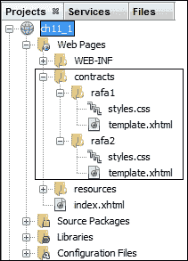
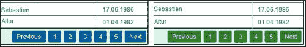
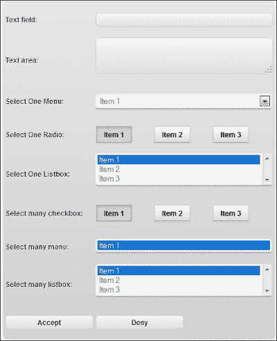
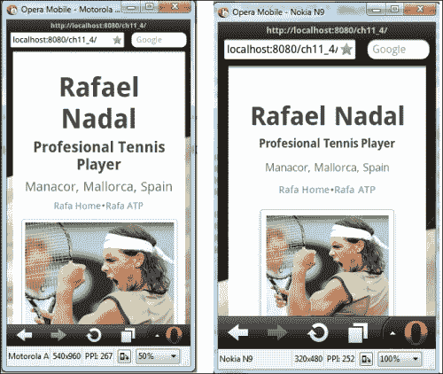
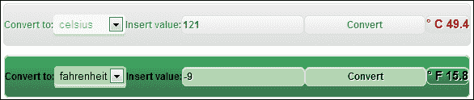
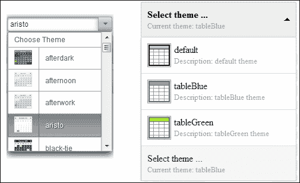
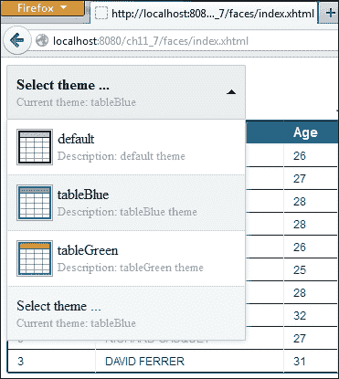
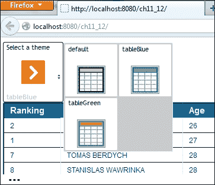
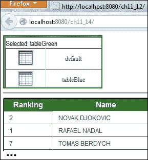
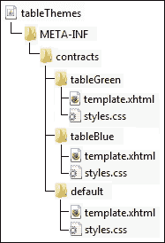

# 第十一章. JSF 2.2 资源库合约 – 主题

从版本 2.0 开始，JSF 开发者利用 Facelets 作为默认的**视图声明语言**（**VDL**）。Facelets 提供了许多优势，但我们特别感兴趣的是使用**Facelet 模板**，它代表了一种 XHTML 和其他资源（如 CSS、JS 和图像）的混合。Facelet 模板充当应用程序页面的基础（或模型）。实际上，它代表了一段可重用的代码，为应用程序页面提供了一致和标准的视觉和感觉。在本书的最后一章中，我们将更深入地探讨 Facelets 和模板的细节，而本章我们将重点介绍新的 JSF 2.2 特性，称为**资源库合约**。

这个新特性通过允许我们以可重用和灵活的方式轻松装饰和使用整个应用程序中的 Facelet 模板，从而加强了并简化了**主题**（如 PrimeFaces 或 RichFaces）的实现。

在本章中，您将看到如何执行以下操作：

+   与合约一起工作

+   使用合约样式 JSF 表格和 UI 组件

+   不同设备间的样式合约

+   为组合组件编写合约

+   编写主题切换器

+   在 XML 中配置合约

+   将合约打包到 JAR 中

### 注意

此外，请注意正确理解当前上下文中的*合约*一词。它可以用来定义诸如`contracts`文件夹、`contracts`属性或`<contracts>`标签等概念。有时，它可能会令人困惑。

# 与合约一起工作

合约由模板和 CSS 文件组成，这些文件组成了`contracts`文件夹。为了定义合约，我们需要在 Web 应用的根目录下遵守一些约定。最重要的约定（例如，名称、结构和内容）涉及参与定义合约的文件夹。所有合约都存储在一个特殊的文件夹中——命名为`contracts`——直接位于应用的 Web 根目录下，或者位于 JAR 文件中的`META-INF`文件夹下。

### 注意

我们可以通过`WEBAPP_CONTRACTS_DIRECTORY_PARAM_NAME`上下文参数来更改此文件夹的位置和名称。尽管这个上下文参数可以包含斜杠（`/`），但它的值不能以斜杠开头。运行时将此值解释为相对于应用 Web 根目录的路径。

通常，在`contracts`文件夹下，我们为每个合约定义一个子文件夹（子文件夹的名称代表合约的名称），其中包含合约的工件，如 CSS、JS、图像和 XHTML 模板（您可以通过将它们添加到代表子文件夹中，将 CSS、JS 和图像等资源与 XHTML 模板分开）。

在下面的屏幕截图中，您可以看到同一应用程序中两个合约（`rafa1`和`rafa2`）的文件夹结构，命名为`ch11_1`：



在我们的示例中，`rafa1/template.xhtml` 和 `rafa2/template.xhtml` 的源代码是相同的（当然，这并非强制要求）；然而，它们只是使用了不同的 CSS 文件。这些 XHTML 文件作为应用页面的模板。以下是 `rafa1/template.xhtml` 的列表：

```java
<?xml version='1.0' encoding='UTF-8' ?>
<!DOCTYPE html PUBLIC "-//W3C//DTD XHTML 1.0 Transitional//EN" "http://www.w3.org/TR/xhtml1/DTD/xhtml1-transitional.dtd">
<html 

  >
  <h:head>
  <title></title>
  </h:head>
  <h:body>
    <h:outputStylesheet name="styles.css"/>
    <div class="header">
      <ui:insert name="header"/>
    </div>
    <div class="content">
      <ui:insert name="content"/>
    </div>
    <div class="footer">
      <ui:insert name="footer"/>
    </div>
  </h:body>
</html>
```

此外，你可以直接在应用网页中使用合约，归功于 `<f:view>` 标签的新 JSF 2.2 属性 `contracts`（这必须放在模板客户端）。此属性的值应该是你想要使用的合约名称。例如，如果你想使用名为 `rafa2` 的合约，你可以在 `index.xhtml` 页面上这样写：

```java
<?xml version='1.0' encoding='UTF-8' ?>
<!DOCTYPE html PUBLIC "-//W3C//DTD XHTML 1.0 Transitional//EN" "http://www.w3.org/TR/xhtml1/DTD/xhtml1-transitional.dtd">
<html 

  >
  <h:head>
    <title></title>
  </h:head>
  <h:body>
    <f:view contracts="rafa2"><!-- switch to rafa1 to see first theme -->
    <ui:composition template="/template.xhtml">
      <ui:define name="header">
        <p>Rafael Nadal photos - header</p>
      </ui:define>
      <ui:define name="content">
        <h:graphicImage
          value="#{resource['default/images:RafaelNadal.jpg']}"/>
      </ui:define>
      <ui:define name="footer">
        <p>Rafael Nadal photos - footer</p>
      </ui:define>
    </ui:composition>
    </f:view>
  </h:body>
</html>
```

为了使用名为 `rafa1` 的合约，你只需将此名称指定为 `contracts` 属性的值。

完整的应用程序名为 `ch11_1`。

# 使用合约来设置表格样式

现在你已经知道了如何编写和使用合约，你可以尝试玩转这个伟大的功能，为你的页面创建不同种类的样式/主题。大多数时候，创建酷炫的主题涉及两个因素：拥有一个酷炫且灵活的模板机制，以及拥有扎实的 CSS 和 JS 知识。

例如，我们可以尝试为 JSF 表格编写两个酷炫的主题。首先，我们将定义两个名为 `tableBlue` 和 `tableGreen` 的合约。在两种情况下，XHTML 模板都将包含以下代码：

```java
<?xml version='1.0' encoding='UTF-8' ?>
<!DOCTYPE html PUBLIC "-//W3C//DTD XHTML 1.0 Transitional//EN" "http://www.w3.org/TR/xhtml1/DTD/xhtml1-transitional.dtd">
<html 

  >
  <h:head>
    <title></title>
  </h:head>
  <h:body>
    <h:outputStylesheet name="styles.css"/>
    <div class="content">
      <ui:insert name="content"/>
    </div>
  </h:body>
</html>
```

现在，你可以使用 `tableBlue` 或 `tableGreen` 合约，如下所示：

```java
...
  <h:body>
    <f:view contracts="tableBlue">
      <ui:composition template="/template.xhtml">
        <ui:define name="content">
          <h:dataTable value="#{playersBean.data}" var="t" border="1">
            <h:column>
              <f:facet name="header">
                Ranking
              </f:facet>
              #{t.ranking}
            </h:column>
            ...
          </h:dataTable>
        </ui:define>
      </ui:composition>
    </f:view>
  </h:body>
...
```

结果将如以下截图所示：


如你所见，没有必要为 `<h:dataTable>` 指定一个类或样式属性。这个想法很简单；JSF 使用 HTML 标签如 `<table>`、`<tr>`、`<td>`、`<tbody>`、`<thead>` 和 `<tfoot>` 来渲染 `<h:dataTable>`。因此，如果我们编写一个自定义这些 HTML 标签外观的 CSS 样式表，那么我们将获得期望的结果。对于 `<h:dataTable>`，基本的 CSS 可能包含以下类（`content` 与 `<ui:define>` 组件的 `name` 属性值匹配）：

```java
.content {}
.content table {}
.content table td,.content table th {}
.content table thead th {}
.content table thead th:first-child {}
.content table tbody td {}
.content table tbody .alt td {}
.content table tbody td:first-child {}
.content table tbody tr:last-child td {}
```

有时，你可能需要给你的表格添加分页。JSF 不提供用于此任务的属性（与 PrimeFaces 中的 `<p:dataTable>` 标签不同）。但是，作为一个例子，如果你编写一个类似于以下代码片段的页脚，你可能可以解决这个问题——当然，`<div>` 内容应该是动态生成并控制的（更多详情请见第六章，*处理表格数据*）：

```java
 ...
  <f:facet name="footer">
    <div id="paging">
      <ul>
        <li>
          <a href="#">
            <span>Previous</span>
          </a>
        </li>
        ...
      </ul>
    </div>
  </f:facet>
</h:dataTable>
```

现在，你需要添加一些 CSS 类来控制分页方面，如下所示：

```java
.content table tfoot td div {}
.content table tfoot td {}
.content table tfoot td ul {}
.content table tfoot li {}
.content table tfoot li a {}
.content table tfoot ul.active,.content table tfoot ul a:hover {}
```

结果如下截图所示：



特别感谢 Eli Geske，他是《学习 DHTMLX Suite UI》一书的作者([`www.packtpub.com/learning-dhtmlx-suite-ui/book`](http://www.packtpub.com/learning-dhtmlx-suite-ui/book))。他的免费在线 CSS3 表格生成器（你可以在 [`tablestyler.com/`](http://tablestyler.com/) 找到 HTML 表格样式生成器）在本节的成果中非常有用。

完整的应用程序命名为 `ch11_3`。

# 使用合约样式化 UI 组件

基于前面的示例，我们可以为所有的 JSF UI 组件编写样式/主题。在本节中，你可以看到一个专注于通常出现在表单中的 JSF UI 组件的示例，例如 `<h:inputText>`、`<h:inputTextarea>`、`<h:selectOneMenu>`、`<h:selectManyCheckbox>` 等。实际上，我们希望得到以下截图（这只是一个示例表单）：



我们首先定义一个新的合约名为 `jsfui`。模板相当简单，如下所示：

```java
<?xml version='1.0' encoding='UTF-8' ?>
<!DOCTYPE html PUBLIC "-//W3C//DTD XHTML 1.0 Transitional//EN" "http://www.w3.org/TR/xhtml1/DTD/xhtml1-transitional.dtd">
<html 

  >
  <h:head>
    <title></title>
  </h:head>
  <h:body>
    <h:outputStylesheet name="styles.css"/>
    <div class="content">
      <ui:insert name="content"/>
    </div>
  </h:body>
</html>
```

现在，我们只需要编写与 JSF 渲染的 HTML 元素对应的 CSS 类，如下所示：

```java
.content input[type=text] {}      /* <h:inputText> */
.content input[type=submit] {}    /* <h:commandButton> */
.content textarea {}              /* <h:inputTextarea> */
.content label {}                 /* <h:outputLabel> */
.content select {}                /* <h:selectOneMenu>, 
                                     <h:selectOneListbox>, 
                                     <h:selectManyMenu>, 
                                     <h:selectManyListbox> */
.content input[type=radio] {}     /* <h:selectOneRadio> */
.content input[type=checkbox] {}  /* <h:selectManyCheckbox> */
```

你可以轻松地为其他 UI 组件添加 CSS 类。此外，你只需指定主题名称作为 `contracts` 属性的值，就可以编写具有自定义主题的 JSF 表单：

```java
...
<f:view contracts="jsfui">
<ui:composition template="/template.xhtml">
<ui:define name="content">
...
```

完整的应用程序命名为 `ch11_2`。

# 在不同设备上样式化合约

在前面的示例中，我们看到了如何编写 JSF 合约以及如何通过在 `<f:view>` 标签的 `contracts` 属性中显式设置它们来使用它们。有时，你可能需要动态设置一个合约（主题）；例如，你可能需要根据应该显示应用程序的设备类型（PC、平板电脑、智能手机、手机等）来选择正确的合约。在这种情况下，你需要从管理 Bean 中提供 `contracts` 属性值。

提供用于检测设备类型、分辨率等的有力代码（或算法）超出了本书的范围。在最小程度地参与移动领域的情况下，我们将尝试编写一个 JSF 应用程序，使其能够根据设备类型选择正确的合约。实际上，我们将定义以下四个合约（不要将以下分辨率与设备之间的关联视为认证或授权的决定）：

+   `contracts/browserpc`：此合约适用于 PC（它将是默认的）

+   `contracts/Device640`：此合约适用于平板电脑（我们假设对于任何类型的平板电脑，640 像素的宽度是一个合理的选择）

+   `contracts/Device480`：此合约适用于智能手机（我们假设对于任何类型的智能手机，480 像素的宽度是一个合理的选择）

+   `contracts/Device320`：此合约适用于普通手机（我们假设对于任何类型的手机，320 像素的宽度是一个合理的选择）

现在，我们将编写一个简单的托管 Bean，它将根据名为`UAgentInfo`的辅助类（访问[`blog.mobileesp.com/`](http://blog.mobileesp.com/)）检测设备类型。基本上，这个类根据 HTTP 请求头部的`User-Agent`和`Accept`检测不同类型的设备。基于这种检测，我们可以设置一个名为正确合约的托管 Bean 属性。托管 Bean 的代码如下：

```java
@Named
@SessionScoped
public class ThemeBean implements Serializable {

  private String theme = "browserpc";

  public String getTheme() {
    return theme;
  }

  public void setTheme(String theme) {
    this.theme = theme;
  }

  publicThemeBean() {
    Map<String, String>getRequestMap = FacesContext.getCurrentInstance().getExternalContext().getRequestHeaderMap();
    String userAgent = getRequestMap.get("User-Agent");
    String httpAccept = getRequestMap.get("Accept");

    UAgentInfo detector = new UAgentInfo(userAgent, httpAccept);

    if (detector.isMobilePhone) {
      if ((detector.detectSmartphone())) {
        System.out.println("SMARTPHONE THEME!");
        theme = "Device480";
      } else {
        System.out.println("SIMPLE MOBILE THEME!");
        theme = "Device320";
      }
    } else {
      if (detector.detectTierTablet()) {
        System.out.println("TABLET THEME!");
        theme = "Device640";
      } else {
        System.out.println("BROWSER THEME!");
        theme = "browserpc";
      }
    }
  }
}
```

每个合约都包含一个 XHTML 模板和一个名为`styles.css`的 CSS 文件。每个 CSS 文件包含用于为分辨率类型设置样式的类。模板对所有合约都是相同的，相当简单，如下所示：

```java
<?xml version='1.0' encoding='UTF-8' ?>
<!DOCTYPE html PUBLIC "-//W3C//DTD XHTML 1.0 Transitional//EN" "http://www.w3.org/TR/xhtml1/DTD/xhtml1-transitional.dtd">
<html 

  >
  <h:head>
    <title></title>
    <meta http-equiv="X-UA-Compatible" content="IE=edge,chrome=1"/>
    <meta name="HandheldFriendly" content="true"/>
    <meta name="viewport" content="width=device-width, initial-scale=1,maximum-scale=1,user-scalable=no"/>
  </h:head>
  <h:body>
    <h:outputStylesheet name="styles.css"/>
    <div class="content">
      <ui:insert name="content"/>
    </div>
  </h:body>
</html>
```

让我们看看以下屏幕截图中的简单页面。（JSF 代码很简单，你可以在名为`ch11_4`的完整应用程序中看到它。）这个视图是为桌面浏览器设计的。


此页面的相关 JSF 代码包括添加正确的合约：

```java
<h:body>
  <f:view contracts="#{themeBean.theme}">
  <ui:composition template="/template.xhtml">
  <ui:define name="content">
...
```

完成！现在，你可以轻松地使用移动模拟器进行一些测试，例如 Opera Mobile Operator。在以下屏幕截图中，你可以看到与三星 Galaxy Tab 上相同的页面，分辨率为 1024x600（PPI：240）：


此外，相同的页面还可以为手机设备渲染：左侧是分辨率为 540x960（PPI：267）的摩托罗拉 Atrix4G，右侧是分辨率为 320x480（PPI：252）的诺基亚 N9 手机：



注意，我们可以通过使用响应式 CSS 将前面的示例简化为一个合约，并且不需要托管 Bean。而不是使用四个合约（`browserpc`、`Device640`、`Device480`和`Device320`），我们可以使用一个单一的合约；让我们称它为`alldevices`。我们在`alldevices`合约下放置两个 CSS 文件：一个通用 CSS 文件（`styles.css`）和一个响应式 CSS 文件（`responsive.css`）。此外，我们修改`template.xhtml`文件，使用以下代码加载这两个 CSS 文件：

```java
<h:body>
  <h:outputStylesheet name="styles.css"/>
  <h:outputStylesheet name="responsive.css"/>
  ...
</h:body>
```

在最后一步，我们在应用程序的 JSF 页面上设置此合约，如下所示：

```java
<f:view contracts="alldevices">
  <ui:composition template="/template.xhtml">
  <ui:define name="content">
...
```

完成！完整的应用程序名为`ch11_5`。

另一种方法包括编写一个自定义的`RenderKitFactory`类、一个自定义的`RenderKit`类以及一组自定义的`Renderers`类——每个设备一个。例如，使用这些工具，名为`ch11_15`的应用程序展示了如何为不同设备渲染在第十章（第十章，*JSF 自定义组件*）中开发的温度自定义组件。

# 编写复合组件的合约

在本节中，你将了解如何编写复合组件的合约。为此，我们将使用在第十章（第十章，*JSF 自定义组件*）中开发的温度复合组件。代码中的实现部分如下所示：

```java
<cc:implementation>
  <div id="#{cc.clientId}:tempconv_main">
    <h:outputLabel id="tempconv_smlabel" for="tempconv_selectonemenu" value="Convert to:"/>
    <h:selectOneMenu id="tempconv_selectonemenu" binding="#{cc.unittoI}">
      <f:selectItem itemValue="fahrenheit" itemLabel="fahrenheit" />
      <f:selectItem itemValue="celsius" itemLabel="celsius" />
    </h:selectOneMenu>
    <h:outputLabel id="tempconv_iflabel" for="tempconv_inputfield" value="Insert value:"/>
    <h:inputText id="tempconv_inputfield" binding="#{cc.temptI}"/>
    <h:commandButton id="tempconv_button" value="Convert">
      <f:ajax execute="@form" render="@form"/>
    </h:commandButton>
    <h:panelGroup id="tempconv_result" layout="block">
      <h:outputText value="&deg; #{cc.unittoI.valueeq 'fahrenheit' ? 'F ':   'C ' } #{cc.getTempConvert()}"/>
    </h:panelGroup>
  </div>
</cc:implementation>
```

子组件的 ID 用于定义用于样式化复合组件的 CSS 文件。因此，我们需要编写以下 CSS 类。注意我们如何利用 CSS 通配符来查找子组件。

```java
.content {}
.content *[id*='tempconv_main'] {}
.content *[id*='tempconv_result'] {}
.content *[id*='tempconv_inputfield'] {}
.content *[id*='tempconv_button'] {}
.content *[id*='tempconv_inputfield']:hover {}
.content *[id*='tempconv_inputfield']:active {}
.content *[id*='tempconv_smlabel'] {}
.content *[id*='tempconv_iflabel'] {}
.content *[id*='tempconv_selectonemenu'] {}
```

此外，我们将此 CSS 文件放置在与以下 XHTML 模板相同的合同下：

```java
<?xml version='1.0' encoding='UTF-8' ?>
<!DOCTYPE html PUBLIC "-//W3C//DTD XHTML 1.0 Transitional//EN" "http://www.w3.org/TR/xhtml1/DTD/xhtml1-transitional.dtd">
<html 

  >
  <h:head>
    <title></title>
  </h:head>
  <h:body>
    <h:outputStylesheet name="styles.css"/>
    <div class="content">
      <ui:insert name="content"/>
    </div>
  </h:body>
</html>
```

最后，如下所示使用复合组件：

```java
...
<f:view contracts="tempStyleGray">
  <ui:composition template="/template.xhtml">
    <ui:define name="content">
      <h3>Composite component with contract:</h3>
      <h:form id="tempForm">
       <t:temperature id="temp" value="#{tempBean.value}" />
      </h:form>
    </ui:define>
  </ui:composition>
</f:view>
...
```

注意我们已经定义了两个合同：`tempStyleGray`（以下截图中的第一个条形图）和 `tempStyleGreen`（以下截图中的第二个条形图）：



完整的应用程序命名为 `ch11_6`。

# 编写主题切换器

如果你是 PrimeFaces 的粉丝，那么我确信你已经看到了 PrimeFaces 主题切换器。基本上，主题切换器由一个包含主题名称和缩略图的下拉菜单表示。最终用户只需从列表中选择即可在应用程序的主题之间切换。

在本节中，您将看到如何使用 JSF 2.2 合同开发主题切换器。目标是获得一个主题切换器，以便：

+   它可以作为 JAR 添加到任何 JSF 2.2 应用程序中

+   它可以自动检测并列出应用程序的主题

+   它可以提供很好的外观和感觉，如下面的截图所示（左侧显示的是 PrimeFaces 主题切换器，右侧显示的是我们的主题切换器）

显然，这种下拉菜单不能使用内置的 `<h:selectOneMenu>` 标签生成。为了自定义包含图像和描述的下拉菜单，我们可以编写一个专门的 `Renderer`，或者尝试使用一个能够像前面截图那样渲染它的 JavaScript 插件。好吧，第二个选项更容易实现，而且不需要我们重新发明轮子。实际上，我们可以使用一个免费且酷的 jQuery 插件 **ddSlick** ([`designwithpc.com/Plugins/ddSlick`](http://designwithpc.com/Plugins/ddSlick))，这是一个免费轻量级的 jQuery 插件，允许您创建一个包含图像和描述的自定义下拉菜单。还有许多其他这样的插件可以做到同样的事情。

基本上，这个插件可以将一个简单的下拉菜单（使用 `<select>` 和 `<option>` 定义）转换成一个包含图像和描述的精美下拉菜单。为此，我们从以下代码片段中的纯 HTML5 `<select>` 标签开始：

```java
<select id="demo-htmlselect">
  <option value="0" data-imagesrc="img/..."
    data-description="Description ...">text</option>
  <option value="1" data-imagesrc="img/..."
    data-description="Description ...">text</option>
  ...
</select>
```

当这个 `<select>` 标签通过 ddSlick 处理时，将生成所需的下拉菜单。基本上，ddSlick 将 `<select>` 标签渲染为 `<ul>` 标签，每个 `<option>` 标签作为 `<li>`。图像和描述使用 `` 和 `<small>` 渲染，而选项文本使用 `<label>` 渲染。此外，将为每个 `<option>` 值生成一个隐藏的输入。HTML5 属性 `data-imagesrc` 和 `data-description` 用于告诉 ddSlick 为每个 `<option>` 使用哪些图像和描述。

理解 ddSlick 的工作原理非常重要，因为我们将将其封装成一个名为`ThemeSwitcher`的复合组件。接口部分非常简单，包含一个名为`theme`的单个属性。这个属性代表所选的主题，如下所示：

```java
<!-- INTERFACE -->
<cc:interfacecomponentType="book.beans.ThemeSwitcherComponent">
<cc:attribute name="theme" default="" type="java.lang.String" required="true"/>
</cc:interface>
```

在实现部分，我们完成了几个任务。首先，我们加载组件所需的 JavaScript 库：

```java
<!-- IMPLEMENTATION -->
<cc:implementation>
  <h:outputScript library="themeswitcher" name="js/jquery.min.js"/>
  <h:outputScript library="themeswitcher" name="js/modernizr-2.0.6-development-only.js"/>
  <h:outputScript library="themeswitcher" name="js/jquery-ui.min.js"/>
  <h:outputScript library="themeswitcher" name="js/prettify.js"/>
  <h:outputScript library="themeswitcher" name="js/ddslick.js"/>
  ...
```

此外，我们定义了 HTML 中的`<select>`组件，它被封装在`<h:form>`中（理想情况下，这个组件不应该与`<h:form>`中的其他组件一起使用；因此，我们不必担心嵌套表单）：

```java
<div id="#{cc.clientId}:themeswitcher">
  <h:form id="themeswitcherForm">
    <!--<h:outputScript name="jsf.js" library="javax.faces" target="head"/> -->
    <select id="#{cc.clientId}:themeswitcherForm:themeswitcher_content">
      <ui:repeat value="#{cc.contracts}" var="t">
        <option value="#{t}" data-imagesrc="img/#{t}.png?con=#{t}" data-description="Description: #{t} theme">#{t}</option>
      </ui:repeat>
      <option selected="true" style="display:none;" data-description="Current theme: #{cc.attrs.theme}">Select theme ...</option>
    </select>
    <h:inputHidden id="selectedTheme" value="#{cc.attrs.theme}"/>
  </h:form>
</div>
```

合约会自动检测并添加为`<option>`，使用`<ui:repeat>`组件。所选的主题（`<option>`）通过隐藏字段`<h:inputHidden>`提交给管理 Bean。提交后（通过 AJAX 或非 AJAX），整个页面将被加载，`contracts`属性（`<f:view>`）将接收并应用所选的主题。为此，我们需要一点 JavaScript 代码。首先，我们调用`ddslick`方法，它将把无聊的下拉菜单变成酷炫的。进一步，我们指示一个 JavaScript 回调方法，当选择主题时将自动调用。在这个方法中，我们刷新隐藏字段的值，并提交表单（通过 AJAX 或非 AJAX）：

```java
<cc:implementation>
...
<script type="text/javascript">
  $(document).ready(function() {

    var themeForm = ("#{cc.clientId}:themeswitcherForm").replace(/:/g, "\\:");
    var themeSelectElem = ("#{cc.clientId}:themeswitcherForm:themeswitcher_content").replace(/:/g, "\\:");
    var themeHiddenElem = ("#{cc.clientId}:themeswitcherForm:selectedTheme").replace(/:/g, "\\:");

    $('#' + themeSelectElem).ddslick({
      onSelected: function(data) {
        if (data.selectedData.text !== "Select theme ...") {
          setTheme(data);
        }
      }
    });

  // callback function
    functionsetTheme(data) {
      $('#' + themeHiddenElem).val(data.selectedData.text);
      //jsf.ajax.request(this, null, {execute: '#{cc.clientId}:themeswitcherForm:selectedTheme', render: "@all"});
      $('#' + themeForm).submit(); // without AJAX
    }
  });

</script>
</cc:implementation>
```

使用这个回调方法提交所选主题非常方便，因为 ddSlick 提供了这个功能。还有许多其他可能性，例如编写值变化监听器、触发自定义事件等。

我相信你已经注意到我们的复合组件指示了存在一个后端组件。这个组件负责检测应用程序的合约并将它们的名称添加到`List`中。这个列表通过`<ui:repeat>`转换为`<option>`。其代码相当简单，如下所示：

```java
@FacesComponent(value = "book.beans.ThemeSwitcherComponent", createTag = false)
public class ThemeSwitcherComponent extends UIComponentBase implements NamingContainer {

    private List<String> contracts = new ArrayList<>();

    public List<String>getContracts() {
      return contracts;
    }

    publicThemeSwitcherComponent() throws IOException {
      FacesContextfacesContext = FacesContext.getCurrentInstance();
      ExternalContextexternalContext = facesContext.getExternalContext();
      Path path = Paths.get(((ServletContext) externalContext.getContext()).getRealPath("/contracts"));
      try (DirectoryStream<Path> ds = Files.newDirectoryStream(path)) {
        for (Path file : ds) {
          if (Files.readAttributes(file, BasicFileAttributes.class).isDirectory()) {
              contracts.add(file.getFileName().toString());
            }
          }
        } catch (IOException e) {
          throw e;
        }
      }

    @Override
    public String getFamily() {
      returnUINamingContainer.COMPONENT_FAMILY;
    }
  }
```

想要使用这个`ThemeSwitcher`组件的开发者必须在每个合约中添加一个与合约同名的 PNG 图像（推荐大小为 40 x 40 像素）。按照惯例，对于每个合约，`ThemeSwitcher`组件将寻找这样的图像，并在主题名称和描述旁边显示它。你可以改进这个后端组件以确保这些图像存在。此外，你可以扩展其功能，以便允许组件用户提供自定义描述。

完成！完整的应用程序命名为`ch11_10`。

`ThemeSwitcher`复合组件被打包成 JAR 文件，并在`ch11_7`应用程序中作为示例使用，如下所示：

```java
<html ...
  >
  ...
  <h:body>
    <f:view contracts="#{themeSwitcherBean.theme}">
    <t:themeswitcher theme="#{themeSwitcherBean.theme}"/>
  ...
```

`ThemeSwitcherBean`的源代码非常简单，如下所示：

```java
@Named
@RequestScoped
public class ThemeSwitcherBean {

  private String theme = "tableBlue";

  public String getTheme() {
    return theme;
  }

  public void setTheme(String theme) {
    this.theme = theme;
  }
}
```

`ch11_7`应用程序的输出在以下屏幕截图中显示：



如果你决定通过编程方式更改 `<f:view>` 的 `contracts` 属性值，你不再需要这个 Bean。此外，如果你认为加载这个 jQuery 插件有缺点，你可以编写纯 JavaScript 代码。或者，如果你想有 JavaScript 代码，自定义渲染器可能是一个不错的选择。

一个基于纯 JavaScript 的 `ThemeSwitcher` 组件示例在名为 `ch11_11` 的应用程序中开发，并在名为 `ch11_12` 的应用程序中以 JAR 文件的形式展示。该示例修改了名为 `iconselect.js` 的免费 JavaScript UI 库（[`bug7a.github.io/iconselect.js/`](http://bug7a.github.io/iconselect.js/））和完全重写的 iScroll 4 库（[http://cubiq.org/iscroll-4](http://cubiq.org/iscroll-4)）。这两个库都是纯 JavaScript；它们不使用如 jQuery 这样的附加库。此外，它们非常小，可以免费复制、修改、分发、改编和商业使用。

包裹这些库的复合组件可以像以下代码所示那样使用。请注意，你可以自定义方面（即网格），并且你可以选择指定要忽略哪些合同（不在主题切换器中列出）。

```java
<t:themeswitcher theme="#{themeSwitcherBean.theme}" ignore="default" columns="1" rows="1"/>
```

输出如下所示：



如果你不想有任何 JavaScript 代码，你可以编写自定义的 `Renderer` 代码或扩展现有的 `MenuRenderer` 代码（Mojarra 或 MyFaces 实现）或编写一个使用 JSF UI 组件创建良好主题切换器的复合组件。编写自定义 `Renderer` 代码（或扩展 `MenuRenderer` 代码）似乎不是一件容易的事情，我不知道它是否值得付出努力。但是，基于 JSF UI 组件编写复合组件相当简单。你可以在名为 `ch11_13` 的应用程序中看到这样的实现，并在名为 `ch11_14` 的应用程序中以 JAR 文件的形式展示。在这个例子中，主题列在 `<h:dataTable>` 组件中，如下截图所示：



# 在 XML 中配置合同

合同可以与 JSF 页面相关联，正如你在前面的章节中看到的。作为替代，我们可以在 `faces-config.xml` 文件中配置合同来完成相同的事情。例如，假设我们有三个合同：`default`、`tableGreen` 和 `tableBlue`。它们与不同页面的关联如下：

+   `default` 合同与 `tables/defaultTablePage.xhtml` 页面相关联

+   `tableGreen` 合同与 `greenTablePage.xhtml` 页面相关联

+   `tableBlue` 合同与 `blueTablePage.xhtml` 页面相关联

在 `faces-config.xml` 中，我们可以使用几个标签来完成这些关联——以下示例代码自说自话：

```java
<application>
  <resource-library-contracts>
    <contract-mapping>
      <url-pattern>/blueTablePage.xhtml</url-pattern>
      <contracts>tableBlue</contracts>
    </contract-mapping>
    <contract-mapping>
      <url-pattern>/greenTablePage.xhtml</url-pattern>
      <contracts>tableGreen</contracts>
    </contract-mapping>
    <contract-mapping>
      <url-pattern>/tables/*</url-pattern>
      <contracts>default</contracts>
    </contract-mapping>
  </resource-library-contracts>
</application>
```

### 注意

作为备注，快速看一下第三个关联。注意您如何可以使用 `*` 通配符将合同与文件夹中的所有 XHTML 页面关联起来。不要尝试在 `<contracts>` 中使用 EL。这是不会工作的！

完整的应用程序命名为 `ch11_8`。

# 将合同打包到 JAR 文件中

为了分发合同，您可以将它们放入一个 JAR 文件中。这是一个非常简单的任务，只需三个步骤即可完成，具体如下：

1.  考虑一个空的 JAR 文件。

1.  在 JAR 中创建一个名为 `META-INF` 的文件夹。

1.  将您的应用程序中的 `contracts` 文件夹复制到 `META-INF`。

例如，一个包含 `default`、`tableGreen` 和 `tableBlue` 合同文件夹的 JAR 文件，其结构如下所示（请参考以下截图）：



使用此 JAR 文件的一个完整示例命名为 `ch11_9`。

# 摘要

希望您喜欢这个倒数第二章。

JSF 2.2 资源库合同是其中一个重要特性。长期以来，JSF 开发者一直要求有一个机制，允许在 JSF 中编写和使用主题，就像在其他系统中一样。正如您刚才看到的，JSF 2.2 合同在这一方向上打开了一扇门，并鼓励开发者编写和使用主题。当然，还有很多其他事情应该添加，例如主题仓库、主题管理控制台、动态切换主题等等。但，这是一个良好的开端！

欢迎大家在最后一章中，我们将讨论关于 Facelets 的内容。
