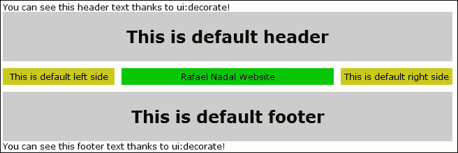

# 第十二章。Facelets 模板化

在本章中，我们将涵盖 Facelets 模板化的几个方面以及一些相关内容。

JSF 被定义为基于组件的应用程序开发框架。当我们提到 Facelets 时，我们指的是友好的页面开发、代码的重用性、模板化、组件组合、自定义逻辑标签、表达式函数、高性能渲染、优化编译时间等。但 Facelets 实际上是什么？嗯，Facelets 代表了一种**VDL**（**视图声明语言**），最初它是作为 JSP 的替代品而创建的。在 JSF 1.1 和 1.2 期间，这个视图处理器只能在单独下载和配置之后使用，而 JSP 是默认的视图处理器。随着 JSF 2.0 的推出，JSF 和 JSP 之间的不匹配使得 Facelets 成为了标准和默认的 VDL，而 JSP 被弃用。从 JSF 2.2 开始，这个概念得到了加强，Facelets 通过新的功能和能力得到了提升。

# Facelets 标签的简要概述

**模板化**是一个基于代码重用性的概念。模板，或称为砖块，代表了可以拼凑在一起以获得 JSF 页面的可重用代码部分。为了实现这一点，我们利用了来自[`xmlns.jcp.org/jsf/facelets`](http://xmlns.jcp.org/jsf/facelets)命名空间的一批标签。

通常，这些标签以`ui`为前缀，列表如下：

+   `<ui:composition>`标签（`TagHandler`）：这个标签定义了一个可以使用模板的页面组合（此标签之外的所有内容都将被忽略）。`template`属性是可选的，用于指示应将封装内容应用于哪个模板。多个组合可以使用相同的模板，从而封装和重用布局。Facelets 会将封装的内容粘贴到组件的层次结构中，通常在`UIViewRoot`之下。《ui:composition>`标签的使用方式如下：

    ```java
    <ui:composition template="*template_path*">
    ```

+   `<ui:define>`标签（`TagHandler`）：这个标签定义了模板插入到页面中的内容。它可能出现在`<ui:composition>`、`<ui:component>`、`<ui:decorate>`和`<ui:fragment>`标签中，并且有一个匹配的`<ui:insert>`标签，可以将定义的内容插入到页面中。最常见的是，它出现在`<ui:composition>`标签中。`<ui:define>`标签的使用方式如下：

    ```java
    <ui:define name="*ui_insert_name*">
    ```

+   `<ui:insert>`标签（`TagHandler`）：这个标签将内容插入到模板中。通常，这个内容是由`<ui:define>`标签在`<ui:composition>`、`<ui:component>`、`<ui:decorate>`或`<ui:fragment>`标签中定义的。这个标签指示了内容将被插入的确切位置。当`name`属性缺失时，Facelets 会将此标签的正文内容添加到视图中。《ui:insert>`标签的使用方式如下：

    ```java
    <ui:insert name="*ui_insert_name*">
    ```

+   `<ui:include>`标签（`TagHandler`）：这个标签用于封装和重用来自多个页面的内容。包含的内容可以是纯 XHTML 和具有`<ui:composition>`标签或`<ui:component>`标签的 XHTML 页面。这个标签可以很容易地与`<ui:param>`结合使用，为包含的页面提供参数，但它也可以与`<ui:fragment>`、`<ui:decorate>`和`<ui:insert>`标签结合使用。这是最常用的标签之一，因为它支持重用模板代码的理念。《ui:include>`标签的使用方式如下：

    ```java
    <ui:include src="img/em>">
    ```

    从 JSF 2.2 版本开始，新增了`UIViewRoot.restoreViewScopeState(FacesContext context, Object state)`方法，允许在构建组件树模板中使用视图作用域的 bean 进行 EL 表达式。这意味着以下代码是有用的：

    ```java
    <ui:include src="img/em>}"/> 
    ```

+   `<ui:param>`标签（`TagHandler`）：这个标签用于将参数传递给包含的文件或模板。它用于`<ui:include>`、`<ui:composition>`或`<ui:decorate>`标签中。参数由一个名称-值对组成——两者都可以是字符串字面量或 EL 表达式。在包含的文件或模板中，参数可以通过 EL 访问。`<ui:param>`标签的使用方式如下：

    ```java
    <ui:param name="*param_name*" value="*param_value*">
    ```

+   `<ui:repeat>`标签（`ComponentHandler`）：这个标签用作循环标签（如`<c:forEach>`和`<h:dataTable>`）的替代品。由于`<ui:repeat>`是一个组件处理器，而`<c:forEach>`是一个标签处理器，所以在选择它们时需要特别注意！`<ui:repeat>`标签的使用方式如下：

    ```java
    <ui:repeat value="*some_collection*" var="*var_name*">
    ```

+   `<ui:debug>`标签（`ComponentHandler`）：这个标签在组件树中定义了一个能够捕获调试信息（如组件树、作用域变量和视图状态）的调试组件。默认情况下，当您按下*Ctrl* + *Shift* + *D*（在 Windows 操作系统上）时，这些信息会显示在调试弹出窗口中。您可以通过使用可选的`hotkey`属性显式设置另一个键盘来更改*D*键。`<ui:debug>`标签的使用方式如下：

    ```java
    <ui:debug hotkey="*key*" />
    ```

+   `<ui:component>`标签（`ComponentHandler`）：这与`<ui:composition>`类似，只是它直接在组件树中定义了一个组件，而没有关联的模板。《ui:component>`标签的使用方式如下：

    ```java
    <ui:component>
    ```

+   `<ui:fragment>` 标签（`ComponentHandler`）：再次强调，这与 `<ui:component>` 标签类似，但不会忽略此标签之外的内容。其主要技能包括 `rendered` 属性，这对于决定封装内容是否显示非常有用。此标签不会产生客户端效果，这使得它成为 `<h:panelGroup>` 的绝佳替代品，后者会产生 `<span>` 或 `<div>` 标签的客户端效果。如果您想在不会产生 `<span>` 或 `<div>` 标签的情况下使用 `<h:panelGroup>`，则无需显式添加 ID。一个 `<h:panelGroup>` 标签如果具有显式 ID，则会产生一个 `<span>` 标签；如果具有显式 ID 并且 `layout` 属性的值设置为 `block`，则会产生一个 `<div>` 标签。《ui:fragment>` 标签的使用方法如下：

    ```java
    <ui:fragment>
    ```

+   `<ui:decorate>` 标签（`TagHandler`）：这与 `<ui:composition>` 标签类似，但不会忽略此标签之外的内容。这是一个很好的特性，因为它允许我们将页面上的任何元素应用于模板。`template` 属性是必需的。《ui:decorate>` 标签的使用方法如下：

    ```java
    <ui:decorate template="*template_path*">
    ```

+   `<ui:remove>` 标签：从页面中删除内容。《ui:remove>` 标签的使用方法如下：

    ```java
    <ui:remove>
    ```

您可以在 [`docs.oracle.com/javaee/7/javaserverfaces/2.2/vdldocs/facelets/ui/tld-summary.html`](http://docs.oracle.com/javaee/7/javaserverfaces/2.2/vdldocs/facelets/ui/tld-summary.html) 了解这些标签的更多详细信息。

# 创建简单模板 – 页面布局

当这十一个标签结合其技能时，我们可以创建令人惊叹的模板。例如，假设我们想从以下图表创建模板，并将其命名为 `PageLayout`：


### 备注

注意，只需几点击，NetBeans 就可以生成 Facelets 几个模板背后的代码，包括前面的抽象化。但这次我们将手动编写它，以便举例说明 Facelets 标签。虽然 NetBeans 提供了一个基于单个 XHTML 页面的紧凑代码，但我们将使用六个 XHTML 页面编写一个扩展方法。这样，你将有两种编写此类模板的方式。

如您所见，有五个独特的部分：**标题**、**页脚**、**左侧**、**中心**和**右侧**。对于这些部分中的每一个，我们将编写一个单独的 XHTML 页面。标题是在 `topDefault.xhtml` 页面生成的，该页面简单地使用 `<ui:composition>` 标签提供以下默认内容：

```java
<?xml version='1.0' encoding='UTF-8' ?> 
<!DOCTYPE html PUBLIC "-//W3C//DTD XHTML 1.0 Transitional//EN" "http://www.w3.org/TR/xhtml1/DTD/xhtml1-transitional.dtd">
<html 

  >

  <h:body>
    <ui:composition>
      <h1>This is default header</h1>
    </ui:composition>
  </h:body>
</html>
```

同样的方法也可以用于剩余的四个部分。只需替换默认的标题文本，并创建以下 XHTML 文件：`bottomDefault.xhtml` 用于页脚，`contentDefault.xhtml` 用于中心，`leftDefault.xhtml` 用于左侧，`rightDefault.xhtml` 用于右侧。

这五个 XHTML 文件就像拼图的五个部分，它们作为模板的默认内容。现在，我们可以通过编写一个使用 `<ui:insert>` 和 `<ui:include>` 标签的 XHTML 页面来组合拼图（这被称为模板文件或简单地称为模板），如下面的代码所示——这是 `layout.xhtml`：

```java
<?xml version='1.0' encoding='UTF-8' ?> 
<!DOCTYPE html PUBLIC "-//W3C//DTD XHTML 1.0 Transitional//EN" "http://www.w3.org/TR/xhtml1/DTD/xhtml1-transitional.dtd">
<html 

  >

  <h:head>
    <meta http-equiv="Content-Type" content="text/html; charset=UTF-8" />
    <h:outputStylesheet name="css/default.css"/>
    <h:outputStylesheet name="css/cssLayout.css"/>
    <title>My Template</title>
  </h:head>

  <h:body>
    <div id="top">
      <ui:insert name="top">
        <ui:include src="img/topDefault.xhtml" />
      </ui:insert>
    </div>
    <div>
      <div id="left">
        <ui:insert name="left">
          <ui:include src="img/leftDefault.xhtml" />
        </ui:insert>
      </div>
      <div id="right">
        <ui:insert name="right">
          <ui:include src="img/rightDefault.xhtml" />
        </ui:insert>
      </div>
      <div id="content">
        <ui:insert name="content">
          <ui:include src="img/contentDefault.xhtml" />
        </ui:insert>
      </div>
  </div>
  <div id="bottom">
    <ui:insert name="bottom">
      <ui:include src="img/bottomDefault.xhtml" />
    </ui:insert>
  </div>
 </h:body>
</html>
```

每个部分都由一个 `<ui:insert>` 标签表示，默认内容是通过 `<ui:include>` 包含的。在主模板文件中，一些 `<div>` 标签和 CSS 被用来排列和样式化拼图的各个部分。

现在，如下面的代码所示，模板已经准备好在 `index.xhtml` 中使用；这被称为 **模板客户端**：

```java
<?xml version='1.0' encoding='UTF-8' ?>
<!DOCTYPE html PUBLIC "-//W3C//DTD XHTML 1.0 Transitional//EN" "http://www.w3.org/TR/xhtml1/DTD/xhtml1-transitional.dtd">
<html 

  >
  <h:head>
    <title></title>
  </h:head>
  <h:body>
    <ui:composition template="template/layout.xhtml" />           
  </h:body>
</html>
```

在此刻，我们可以使用 `<ui:define>` 标签来更改模板的默认内容，例如，如果我们想替换中心部分显示的文本。这是默认内容，包含有 **拉斐尔·纳达尔主页** 文本，如下面的代码所示：

```java
...
<ui:composition template="template/layout.xhtml">  
  <ui:define name="content">
    Rafael Nadal Home Page
  </ui:define>   
</ui:composition>
...
```

同样地，你可以为剩余的四个部分重新定义内容。完整的应用程序被命名为 `ch12_1`。

这是一个相当简单的模板，它可以作为我们展示其他 Facelets 标签的支持。我们将继续使用几个具体的例子来展示 `<ui:param>`、`<ui:decorate>`、`<ui:fragment>`、`<ui:repeat>` 等标签。

# 通过 <ui:param> 传递参数

`<ui:param>` 标签是一个能够向包含文件或模板发送参数的标签处理器。一个简单的例子会让你明白 `<ui:param>` 的工作原理。在下面的代码中，我们处于模板客户端 `index.xhtml`，并向模板文件 `layout.xhtml` 发送一个参数：

```java
<ui:composition template="template/layout.xhtml">  
 <ui:param name="playername" value="Rafael " />
</ui:composition>
```

我们也可以在 `layout.xhtml` 中使用表达式语言（EL）通过其名称访问此参数。我们可以在模板文件的任何地方这样做；例如，我们可以使用此参数来创建一个新的参数，将其发送到包含的文件，在这种情况下，是 `contentDefault.xhtml` 文件，如下面的代码所示：

```java
<div id="content">
  <ui:insert name="content">
    <ui:include src="img/contentDefault.xhtml">
 <ui:param name="playernamesurname" value="#{playername} Nadal" />
    </ui:include>
  </ui:insert>
</div>
```

从同一个模板，我们可以向不同的包含页面发送参数。除了 `playernamesurname` 参数外，让我们使用以下代码向 `topDefault.xhtml` 页面发送一个参数：

```java
<ui:insert name="top">
  <ui:include src="img/topDefault.xhtml">
 <ui:param name="headertext" value="This is default header (passed through ui:param)" />
  </ui:include>
</ui:insert>
```

接下来，使用以下代码向 `bottomDefault.xhtml` 页面发送一个参数：

```java
<ui:insert name="bottom">
  <ui:include src="img/bottomDefault.xhtml">
 <ui:param name="footertext" value="This is default footer (passed through ui:param)" />
  </ui:include>
</ui:insert>
```

现在，`playernamesurname` 参数在 `contentDefault.xhtml` 页面中可通过表达式语言（EL）访问，如下面的代码所示：

```java
<ui:composition>
 #{playernamesurname} (passed through ui:param)
</ui:composition>
```

此外，`headertext` 和 `footertext` 在 `topDefault.xhtml` 和 `bottomDefault.xhtml` 页面中可通过表达式语言（EL）访问。现在，使用 `<ui:param>` 的结果如下面的截图所示：


完整的应用程序被称作 `ch12_11`。

# 通过 <ui:param> 传递属性和动作方法

在前面的例子中，你看到了如何利用 `<ui:param>` 将文本字符串发送到模板或包含页面，但 `<ui:param>` 可以用于更多的情况。假设我们有以下 `TemplatesBean` 的代码：

```java
@Named
@ViewScoped
public class TemplatesBean implements Serializable {

  private String msgTopDefault="";
  private String msgBottomDefault="";
  private String msgCenterDefault="No center content ...press the below button!";

  //getters and setters

  public void topAction(String msg){
    this.msgTopDefault = msg;
  }

  public void bottomAction(String msg){
    this.msgBottomDefault = msg;
  }

  public void centerAction(){
    this.msgCenterDefault="This is default content";
  }    
}
```

此外，我们希望在`contentDefault.xhtml`中显示`msgCenterDefault`属性的值。当然，这使用以下代码行很容易实现：

```java
<h:outputText value=#{templatesBean.msgCenterDefault} />
```

但我们希望通过`<ui:param>`传递 bean 的名称和属性的名称。这可以通过以下代码实现：

```java
<ui:insert name="content">
  <ui:include src="img/contentDefault.xhtml">
 <ui:param name="templatesBeanName" value="#{templatesBean}"/>
 <ui:param name="contentPropertyName" value="msgCenterDefault"/>
  </ui:include>
</ui:insert>
```

接下来，在`contentDefault.xhtml`中，你可以显示`msgCenterDefault`属性的值，如下面的代码行所示：

```java
<h:outputText value="#{templatesBeanName[contentPropertyName]}"/>
```

好吧，这很简单！但是，如何调用修改`msgCenterDefault`属性值的`centerAction`方法呢？为此，我们在方括号内添加方法名，并用一对括号表示没有参数的方法，如下面的代码所示：

```java
<h:form>
  <h:commandButton value="Center Button" action="#{templatesBeanName['centerAction']()}"/>
</h:form>
```

最后，我们希望调用`topAction`（或`bottomAction`）方法。这次，我们希望通过`<ui:param>`传递 bean 名称、action 方法名称和参数值。为此，我们将编写以下代码：

```java
<ui:insert name="top">
  <ui:include src="img/topDefault.xhtml">
 <ui:param name="templatesBeanName" value="#{templatesBean}"/>
 <ui:param name="topActionName" value="topAction"/> 
 <ui:param name="arg" value="Hello from topDefault.xhtml .."/> 
  </ui:include>
</ui:insert>
```

在`topDefault.xhtml`中，我们可以利用通过这三个参数传递的信息，如下面的代码所示：

```java
<h:form>
  <h:commandButton value="Top Button" action="#{templatesBeanNametopActionName}"/>                
</h:form>
```

在下面的屏幕截图中，你可以看到一切按预期工作：


完整的应用程序命名为`ch12_13`。

可以从管理 Bean 中访问`<ui:param>`的值，如下面的代码所示：

```java
FaceletContext faceletContext = (FaceletContext) FacesContext.getCurrentInstance().getAttributes().
    get(FaceletContext.FACELET_CONTEXT_KEY);
String paramValue = (String) faceletContext.getAttribute("param");
```

# 利用<ui:decorate>和<ui:fragment>标签

首先，让我们谈谈`<ui:decorate>`标签。正如其名称所暗示的，这个标签用于装饰页面的一部分。与`<ui:composition>`不同，这个标签不会忽略其外部的内容，这有时可能是一个额外的优势。好吧，一个简单的示例如下面的代码所示（`template`属性是必需的）：

```java
<?xml version='1.0' encoding='UTF-8' ?>
<!DOCTYPE html PUBLIC "-//W3C//DTD XHTML 1.0 Transitional//EN" "http://www.w3.org/TR/xhtml1/DTD/xhtml1-transitional.dtd">
<html 

  >

  <h:head>
    <title></title>
  </h:head>
  <h:body>
    <h:outputText value="You can see this header text thanks to ui:decorate!"/>
 <ui:decorate template="template/layout.xhtml"> 
 <ui:define name="content">
 Rafael Nadal Website
 </ui:define>
 </ui:decorate>
    <h:outputText value="You can see this footer text thanks to ui:decorate!"/>
  </h:body>
</html>
```

前面的代码片段产生了以下屏幕截图：



完整的示例命名为`ch12_10`。基本上，这个示例使用模板装饰了一个页面，并证明了`<ui:decorate>`标签相对于`<ui:composition>`标签的效果。然而，让我们看看装饰页面一部分的更好示例。

在这个示例中，我们将使用`<ul>`列表装饰一个`<div>`元素。列表的`<li>`项来自两个独立的页面，实现这一技术的关键是嵌套的`<ui:decorate>`标签。模板客户端`index.xhtml`使用`<ui:decorate>`装饰`<div>`元素，并包含`<ul>`列表，如下面的代码所示：

```java
<h:body>
  <div style="border:2px solid; border-radius:25px;width:180px;">
 <ui:decorate template="/files/ul.xhtml"/>
  </div>
</h:body>
```

此外，`ul.xhtml`模板提供了`<ul>`列表和部分`<li>`项，还使用`<ui:decorate>`标签装饰`<ul>`列表，以包含剩余的`<li>`项，这些项可通过`li.xhtml`模板获得，如下面的代码所示：

```java
<ul>
  <li style="color: red;">Andy Murray</li> 
 <ui:decorate template="/files/li.xhtml"/>
  <li style="color: red;">Stanislas Wawrinka</li>
</ul>
```

`li.xhtml`模板使用`<ui:fragment>`标签来提供`<li>`列表的其余部分。但由于`<ui:fragment>`不会阻止未关闭的内容，我们也可以将一些`<li>`项目放在它外面，如下面的代码所示：

```java
<li style="color: green;">John Isner</li>
  <ui:fragment>
    <li>Rafael Nadal</li>
    <li>Roger Federer</li>
    <li>Novak Djokovic</li>
  </ui:fragment>
<li style="color: green;">Fabio Fognini</li>
```

完成！我们特别使用了不同的颜色来表示`<li>`项目。这非常有用，因为它确实有助于我们理解页面是如何使用`<ui:decorate>`标签组成的。请参考以下截图：


完整应用程序命名为`ch12_24`。

可以使用不同的方法获得相同的结果。但是，另一种可以作为模板技术使用的方法是将`ul.xhtml`模板中的`<ui:decorate>`标签替换为`<ui:insert>`、`<ui:define>`和`<ui:include>`标签的组合。为了做到这一点，我们使用以下代码更改`ul.xhtml`模板：

```java
<ul>
  <li style="color: red;">Andy Murray</li>
 <ui:insert name="content"/>
  <li style="color: red;">Stanislas Wawrinka</li>
</ul>
```

这将更改模板客户端的代码如下：

```java
<h:body>
  <div style="border:2px solid; border-radius:25px;width:180px;">
    <ui:decorate template="/files/ul.xhtml">
 <ui:define name="content">
 <ui:include src="img/li.xhtml"/>
 </ui:define>
    </ui:decorate>
  </div>
</h:body>
```

完整应用程序命名为`ch12_23`。

# 使用<ui:repeat>进行迭代

`<ui:repeat>`标签是一个能够遍历集合的组件处理器，在每次迭代时，它将子元素的一个副本添加到组件树中。我们可以这样说，`<ui:repeat>`充当一个不渲染 HTML 表的`<h:dataTable>`标签。当然，你可以通过将其机制包裹在`<table>`、`<tr>`和`<td>`套件中来实现这一点（你将在下一节中看到一个示例，*使用 jsfc 属性*）。

它包含一组非常实用的属性，在举例之前值得提一下。除了众所周知的属性外，还有`value`（表示迭代集合的`java.lang.Object`）和`var`（表示迭代器为`java.lang.Object`），我们还有以下可选属性：

+   `step`：此属性允许我们以`int`值的形式指示每次迭代要跳过的项目数。默认情况下，`<ui:repeat>`标签遍历集合中的每个项目，这表示`step`属性等于 1，并指示过程从第一个项目开始。

+   `size`：这是要迭代的集合的大小；它必须评估为`int`值。

+   `offset`：默认情况下，`<ui:repeat>`从集合的第一个项目开始迭代过程。此属性允许我们通过告诉 Facelets 从某个偏移量开始迭代过程来跳过一定数量的项目。此偏移量在迭代过程开始之前确定；它必须评估为`int`值。

+   `varStatus`：此属性通过 POJO 对象揭示当前项的状态。稍后将提供一个使用它的明确示例，但现在让我们看几个迭代不同类型 Java 集合的示例。

迭代`ArrayList`集合的一个简单例子如下代码（相同的方法可以应用于任何`java.util.List`包）：

```java
<ui:repeat value="#{myBean.dataArrayList}" var="t">
  <h:outputText value="#{t}" />
</ui:repeat>
```

然而，`<ui:repeat>` 也可以使用 `toArray` 方法遍历 `HashSet` 集合，如下所示（相同的方法也可以应用于 `TreeSet` 和 `LinkedHashSet`）：

```java
<ui:repeat value="#{myBean.dataHashSet.toArray()}" var="t">
  <h:outputText value="#{t}" />
</ui:repeat>
```

或者，更进一步，`<ui:repeat>` 也可以使用以下方法遍历 `Map` 集合（`HashMap`、`TreeMap` 和 `LinkedHashMap`）：

+   以下为第一种方法的代码：

    ```java
    <ui:repeat value="#{myBean.dataHashMap.entrySet().toArray()}" var="t">
      <h:outputText value="key:#{t.key} value:#{t.value}" />
    </ui:repeat>
    ```

+   以下为第二种方法的代码：

    ```java
    <ui:repeat value="#{myBean.dataHashMap.keySet().toArray()}" var="t">
      <h:outputText value="key:#{t} value:#{myBean.dataHashMap.get(t)}" />
    </ui:repeat>
    ```

+   以下为第三种方法的代码：

    ```java
    <ui:repeat value="#{myBean.dataHashMap.values().toArray()}" var="t">
      <h:outputText value="#{t}" />
    </ui:repeat>
    ```

+   以下为第四种方法的代码：

    ```java
    <ui:repeat value="#{myBean.dataHashMap.entrySet()}" var="t">
      <ui:repeat value="#{t.toArray()}" var="q">
        <h:outputText value="key:#{q.key} value:#{q.value}" />
      </ui:repeat>
    </ui:repeat>
    ```

上述示例遍历了整个集合。但如果你只想遍历偶数位置的项，那么我们可以引入 `step` 属性，如下所示：

```java
<ui:repeat value="#{myBean.dataArrayList}" var="t" step="2">
  <h:outputText value="#{t}"/>
</ui:repeat>
```

对于奇数项，你可能想结合使用 `step` 和 `offset` 属性，以下代码展示了如何操作：

```java
<ui:repeat value="#{myBean.dataArrayList}" var="t" step="2" offset="1">
  <h:outputText value="#{t}"/>     
</ui:repeat>
```

显示偶数/奇数项的另一种常见方法是通过使用 `varStatus` 属性。代表此属性值的 POJO 对象包含几个只读的 JavaBeans 属性。在这些属性之间，我们有偶数和奇数属性，可以很容易地与 `<ui:fragment>` 结合使用，如下所示：

+   对于偶数属性，代码如下所示：

    ```java
    <ui:repeat value="#{myBean.dataArrayList}" var="t" varStatus="vs">
      <ui:fragment rendered="#{vs.even}">
        <h:outputText value="#{vs.index}. #{t.player}"/>
      </ui:fragment>
    </ui:repeat>
    ```

+   对于奇数属性，代码如下所示：

    ```java
    <ui:repeat value="#{myBean.dataArrayList}" var="t" varStatus="vs">
      <ui:fragment rendered="#{vs.odd}">
        <h:outputText value="#{vs.index}. #{t.player}"/>
      </ui:fragment>
    </ui:repeat>
    ```

整套属性在以下代码片段中暴露：

```java
<ui:repeat value="#{myBean.dataArrayList}" var="t" varStatus="vs">
  Index: #{vs.index}
  First: #{vs.first}
  Last: #{vs.last}
  Begin: #{vs.begin}
  End: #{vs.end}
  Step: #{vs.step}
  Current: #{vs.current}
  Even: #{vs.even}   
  Odd: #{vs.odd}
</ui:repeat>
```

所有的先前示例都统一在名为 `ch12_6` 的完整应用程序下。

# 使用 <ui:include> 和 <f:viewParam>

你可能会认为将 `<ui:include>` 与 `<f:viewParam>` 结合使用是一种奇怪的组合，也许确实如此。但是，正如你所知，`<ui:include>` 能够封装和重用来自多个页面的内容，而 `<f:viewParam>` 可以在链接中添加视图参数（使用 GET 查询字符串）很有用。这意味着我们可以通过 `<f:viewParam>` 在 `<ui:include>` 中使用当前页面传递的参数。

例如，在当前页面中，我们可以包含一个随机页面，或者一个名称被硬编码为视图参数值的页面。我们还可以使用 `includeViewParams` 属性告诉其他页面包含与当前页面相同的内容。这三个例子只是更多场景的入门。以下示例不言自明：

```java
<h:head>
  <title></title>
  <f:metadata>
    <f:viewParam name="in" value="#{randomInBean.in}"/>
  </f:metadata>
</h:head>
<h:body>
  <ui:include src="img/#{randomInBean.in}"/>

  <h:button value="Tell mypage.xhtml To Include The Same Page As You Did" outcome="mypage.xhtml" includeViewParams="true"/>
  <h:button value="Random Page" outcome="index.xhtml" 
    includeViewParams="false"/>

  <h:button value="Include in_index_A.xhtml Page" outcome="index.xhtml?in=in_index_A.xhtml"/>
  <h:button value="Include in_index_B.xhtml Page" outcome="index.xhtml?in=in_index_B.xhtml"/>
  <h:button value="Include in_index_C.xhtml Page" outcome="index.xhtml?in=in_index_C.xhtml"/>               
</h:body>
```

`RandomInBean` 的代码如下：

```java
@Named
@RequestScoped
public class RandomInBean {

  private String in = "";

  public RandomInBean() {
    int in_rnd = new Random().nextInt(3);
    if (in_rnd == 0) {
      in = "in_index_A.xhtml";
    } else if (in_rnd == 1) {
      in = "in_index_B.xhtml";
    } else if (in_rnd == 2) {
      in = "in_index_C.xhtml";
    }       
  }

  public String getIn() {        
    return in;
  }

  public void setIn(String in) {
    this.in = in;
  }
}
```

因此，我们有几个按钮来证明 `<ui:include>` 和 `<f:viewParam>` 标签之间的共生关系。首先，我们有三个按钮，分别标记为 **包含 in_index_A.xhtml 页面**、**包含 in_index_B.xhtml 页面** 和 **包含 in_index_C.xhtml 页面**。这三个按钮的作用相同；它们传递一个名为 `in` 的视图参数。视图参数的值是一个字符串字面量，表示应该包含的页面。这将生成以下类型的 URL：

`http://localhost:8080/ch12_12/faces/index.xhtml?in=in_index_B.xhtml`

因此，根据此 URL，`<ui:include>` 标签将包含 `in_index_B.xhtml` 页面。

此外，我们还有一个标签为 **随机页面** 的按钮。此按钮将在三个页面之间随机选择。为了实现这一点，我们需要添加 `includeViewParams="false"`，如下面的代码所示：

```java
<h:button value="Random Page" outcome="index.xhtml" includeViewParams="false"/>
```

最后，我们可以告诉其他页面包含与当前页面相同的内容。当您点击标签为 **告诉 mypage.xhtml 包含与您相同的页面** 的按钮时，`mypage.xhtml` 页面将包含与当前页面相同的内容。为此，我们需要添加 `includeViewParams="true"`。

完整的应用程序命名为 `ch12_12`。

# 使用 <ui:include> 和 <ui:param>

`<ui:include>` 和 `<ui:param>` 标签是两种可以用于完成许多任务的标签处理器；只要我们记住标签处理器只有在视图树构建时才是高效的，我们就可以利用它们来为我们谋福利。例如，我们可以使用它们来生成如下截图所示的树节点结构：


为了完成这个任务，我们将使用一点 JSTL（`<c:if>` 和 `<c:forEach>` 标签处理器）和递归性来增强 `<ui:include>` 和 `<ui:param>` 标签。

首先，我们需要一个代表树节点概念的抽象化类。基本上，树节点表示是一个可以递归遍历的标签分层结构。基于此，我们可以编写一个通用的树节点类，如下面的代码所示：

```java
public class GenericTreeNode {

  private final List<GenericTreeNode> descendants;
  private final String label;

  public GenericTreeNode(String label, GenericTreeNode... descendants) {
    this.label = label;
    this.descendants = Arrays.asList(descendants);
  }

  public boolean isHasDescendants() {
    return !descendants.isEmpty();
  }

  public List<GenericTreeNode> getDescendants() {
    return descendants;
  }

  public String getLabel() {
    return label;
  }
}
```

此类可以作为一个能够定义特定树节点的 bean。如下所示：

```java
@Named
@RequestScoped
public class TreeNodeBean {

  private GenericTreeNode root = new GenericTreeNode("Players",new GenericTreeNode("Rafael Nadal",new GenericTreeNode("2013", new GenericTreeNode("Roland Garros", new GenericTreeNode("Winner")), new GenericTreeNode("Wimbledon", new GenericTreeNode("First round"))),new GenericTreeNode("2014", new GenericTreeNode("..."))),new GenericTreeNode("Roger Federer",new GenericTreeNode("2013"), new GenericTreeNode("...")));

  public GenericTreeNode getRoot() {
    return root;
  }
}
```

有趣的部分是如何将这个结构显示为树节点。HTML 提供了 `<ul>` 和 `<li>` 标签，能够将数据表示为列表。此外，嵌套的 `<ul>` 标签输出一个分层结构，这对于找到自定义表示非常有用。为了反映 `TreeNodeBean` 中定义的树节点，我们编写了一个名为 `node.xhtml` 的页面，该页面能够使用 `<ui:include>` 标签在迭代-递归过程中自动包含，如下所示：

```java
<h:body>
  <ui:composition>  
    <li>#{node.label} 
      <c:if test="#{node.hasDescendants}">
        <ul>
          <c:forEach items="#{node.descendants}" var="node">
            <ui:include src="img/node.xhtml" />
          </c:forEach>
        </ul>
      </c:if>
    </li>
  </ui:composition>
</h:body>
```

`node` 参数通过 `<ui:param>` 从名为 `index.xhtml` 的主页面传递。从主页面，我们传递树节点根。此外，在 `node.xhtml` 中，我们以递归方式遍历根节点的后代，并显示每个节点，如下面的代码所示：

```java
<h:body>
  <ul>
    <ui:include src="img/node.xhtml">
      <ui:param name="node" value="#{treeNodeBean.root}" />
    </ui:include>
  </ul>
</h:body>
```

如果您觉得这个例子没有用，至少要记住 `<ui:include>` 可以用于递归过程。完整的应用程序命名为 `ch12_14`。

# 使用 <ui:debug> 调试

`<ui:debug>` 标签（`ComponentHandler`）在组件树中定义了一个能够捕获调试信息（如组件树、作用域变量和视图状态）的调试组件。例如，您可以使用以下代码将 `<ui:debug>` 标签添加到模板中：

```java
<ui:debug hotkey="q" rendered="true"/>
```

现在，当您按下 *Ctrl* + *Shift* + *Q* 时，您将看到如下截图所示的内容：


完整的应用程序命名为`ch12_9`。`<ui:debug>`标签添加到了`layout.xhtml`中。

# 使用<ui:remove>移除内容

`<ui:remove>`标签用于移除内容。这个标签很少使用，但移除类型为`<!-- -->`的注释是一个完美的例子。你可能想到了以下这样的行：

```java
<!-- <h:outputText value="I am a comment!"/> -->
```

这对渲染的 HTML 代码没有副作用。嗯，这并不完全正确，因为在 HTML 源代码中，你会看到类似以下截图的内容：


但如果我们用`<ui:remove>`将其封装起来，那么前面的客户端效果将不再产生，以下代码就是证明。

```java
<ui:remove>
  <!-- <h:outputText value="I am a comment!"/> -->
</ui:remove>
```

以下代码将产生相同的效果：

```java
<ui:remove>
  <h:outputText value="I am a comment!"/>
</ui:remove>
```

为了从生成的 HTML 代码中移除注释，你需要在`web.xml`中添加`context`参数，如下所示：

```java
<context-param>
  <param-name>javax.faces.FACELETS_SKIP_COMMENTS</param-name>
  <param-value>true</param-value>
</context-param>
```

或者，为了与现有的 Facelets 标签库保持向后兼容性，代码如下所示：

```java
<context-param>
  <param-name>facelets.SKIP_COMMENTS</param-name>
  <param-value>true</param-value>
</context-param>
```

完整的应用程序命名为`ch12_8`。

# 使用 jsfc 属性

Facelets 包含一个名为`jsfc`的属性。其主要目标是将 HTML 元素转换为 JSF 组件（JSF 页面中的 HTML 原型）。例如，在以下代码中，我们将一个 HTML 表单转换成了一个 JSF 表单：

```java
<form jsfc="h:form">
  <input type="text" jsfc="h:inputText" value="#{nameBean.name}" />
  <input type="submit" jsfc="h:commandButton" value="Send"/>
</form>
```

此属性代表快速原型设计，并且易于使用。以下是一个另一个例子——这次`jsfc`属性与`<ui:repeat>`结合用于生成`<table>`标签：

```java
<table>
  <thead>
    <tr>
      <th>Ranking</th>
      <th>Player</th>
      <th>Age</th>
      <th>Coach</th>
    </tr>
  </thead>
  <tbody>
    <tr jsfc="ui:repeat" value="#{playersBean.dataArrayList}" var="t">
      <td>#{t.ranking}</td>
      <td>#{t.player}</td>
      <td>#{t.age}</td>
      <td>#{t.coach}</td>
    </tr>
  </tbody>
</table>
```

第一个例子命名为`ch12_7`，第二个例子命名为`ch12_25`。

# 扩展 PageLayout 模板

记得本章开头开发的`PageLayout`模板吗？嗯，这是一个不错的模板，但让我们扩展它，使其更加现实。通常，一个网页模板除了我们使用的五个部分之外，还包含标题、登录、搜索、标志、页眉、菜单、左侧、中间、右侧和页脚。也很有必要有一个模板，允许我们做以下事情：

+   无副作用且无需手动移除孤儿 CSS 代码地移除部分（通常，你可以通过编写一个空的`<ui:define>`标签来移除一个部分，但这不会移除该部分的相应 CSS 代码）。此外，一个空的`<ui:define>`标签仍然会有副作用，即产生空的`<div>`标签或空的`<span>`或`<td>`标签。这是因为，通常`<ui:define>`被包裹在一个`<div>`、`<span>`或`<td>`标签中。

+   设置模板的宽度，即左侧和右侧面板，而不改变 CSS。这些是常见的调整；因此，我们可以通过`<ui:param>`暴露它们，并允许页面作者在 CSS 文件中滚动。

+   添加一个菜单部分。我们可以通过`<ui:include>`作为一个单独的文件来提供支持，或者有一个约定机制，允许页面作者更容易地添加它。

最后，模板将看起来像以下截图：


没有秘密，大多数网站都是将内容放置在多个列中，这些列是通过`<div>`或`<table>`元素创建的。之后，使用 CSS 将这些元素定位在页面上。基本上，这是大多数模板背后的主要思想，这个也不例外。在下面的图中，你可以看到我们的模板布局，它基于`<div>`元素（在图中，你可以看到每个`<div>`的 ID）：


好吧，由于每个部分都被包裹在一个`<div>`元素中，我们可以轻松地使用`<ui:fragment>`标签及其`rendered`属性来删除它。我们可以将每个部分包裹在一个`<ui:fragment>`标签中，并通过`<ui:param>`标签设置`rendered`属性的值为`false`来删除它。这将删除部分而不会产生任何副作用。当删除部分时，我们需要跳过加载相应的 CSS 代码。为此，我们可以将 CSS 文件分为以下三类：

+   一个包含模板通用样式的 CSS 文件（通常这是一个小文件）

+   一个包含为页面上的每个部分定位样式的 CSS 文件（通常这是一个小文件）

+   每个部分的 CSS 文件，包含针对每个部分特定的样式（这些文件可能相当大）

有这样的结构，我们可以轻松地决定不加载已删除部分的 CSS 代码。这可以通过`<h:outputStylesheet>`标签中的简单条件实现，该条件基于用于删除部分的相同参数。当删除部分时，我们为它加载一个名为`dummy.css`的空 CSS 文件。

因此，模板文件（`layout.xhtml`）可能需要更改为以下内容：

```java
<h:head>
  <meta http-equiv="Content-Type" content="text/html; charset=UTF-8" />
  <h:outputStylesheet name="css/default.css"/>
  <h:outputStylesheet name="css/cssLayout.css"/>    
  <h:outputStylesheet name="#{title eq false ? 'css/dummy.css' : 'css/titleStyle.css'}"/>  
  <h:outputStylesheet name="#{loginsearch eq false ? 'css/dummy.css' : 'css/login_and_searchStyle.css'}"/>
  <h:outputStylesheet name="#{top eq false ? 'css/dummy.css' : 'css/topStyle.css'}"/>
...
</h:head>

<h:body>        
  <div id="wrapper" style="width: #{empty wrapperWidth ? '100%' : wrapperWidth}">
    <ui:fragment rendered="#{empty title ? true : title}">                
      <div id="title">
        <ui:insert name="title">
          <ui:include src="img/titleDefault.xhtml"/>
        </ui:insert>
      </div>     
    </ui:fragment>
 ...
    <ui:fragment rendered="#{empty bottom ? true : bottom}">
      <div id="bottom">
        <ui:insert name="bottom">
          <ui:include src="img/bottomDefault.xhtml"/>
        </ui:insert>
      </div>
    </ui:fragment>
  </div>
</h:body>
```

因此，在模板客户端中，我们可以轻松地删除一个部分（例如，标题部分），使用以下代码行：

```java
<ui:param name="title" value="false"/>
```

在此时刻，在模板客户端中，我们可以轻松地使用`<ui:define>`来提供我们的内容给模板，以及使用`<ui:param>`进行以下设置：

+   删除标题部分：这会将`title`参数设置为`false`

+   删除登录和搜索部分：这会将`loginsearch`参数设置为`false`

+   仅删除登录部分：这会将`login`参数设置为`false`

+   仅删除搜索部分：这会将`search`参数设置为`false`

+   删除标志部分：这会将`logo`参数设置为`false`

+   删除顶部部分：这会将`top`参数设置为`false`

+   删除菜单部分：这会将`menu`参数设置为`false`

+   删除左侧部分：这会将`left`参数设置为`false`

+   删除右侧部分：这会将`right`参数设置为`false`

+   删除底部部分：这会将`bottom`参数设置为`false`

+   设置模板固定宽度：这会将`wrapperWidth`参数设置为*宽度 px*

+   设置左侧面板固定宽度：这会将`leftWidth`参数设置为*宽度 px*（默认 150px）

+   设置右侧固定宽度：这会将`rightWidth`参数设置为*宽度 px*（默认 150px）

现在，让我们专注于添加菜单。模板用户可以在一个单独的文件中定义菜单，只要它遵循以下简单的编写约定：

```java
<h:body>
  <ui:composition>
    <ul>
      <li>
        <h:link value="..." outcome="..."/>
      </li>
      <li>
        <h:link value="..." outcome="..."/>
      </li>
    ...
    </ul>                
  </ui:composition>
</h:body>
```

该文件可以如下包含：

```java
<ui:define name="menu">
  <ui:include src="img/em>.xhtml"/>
</ui:define>
```

另一种方法是通过`<ui:param>`传递菜单项，如下面的代码所示：

```java
<ui:param name="items" value="*item*#*outcome*,*item*#*outcome*,..."/>
```

这将起作用，因为`menuDefault.xhtml`页面提供了一个默认实现，如下面的代码所示：

```java
<ui:composition>
  <c:if test="${not empty items}">
   <ul>                
    <ui:repeat value="${fn:split(items, ',')}" var="t">
      <li>                        
        <h:link value="${fn:substringBefore(t, '#')}" outcome="${fn:substringAfter(t, '#')}"/>
      </li>
     </ui:repeat>
    </ul>            
  </c:if>
</ui:composition>
```

完整的应用程序命名为`ch12_18`。在应用程序`ch12_19`中，你可以看到这个模板的使用示例，它看起来类似于以下截图：


注意，我们已经删除了搜索和右侧面板部分。

# Facelets 的程序化方面

在本章的第二部分，我们将更关注 Facelets 的几个程序化方面。我们将从 JSF 2.2 关于`FaceletFactory`的新特性开始，它产生与底层实现上下文相关的 Facelets。 

## FaceletFactory 的考虑

在 JSF 2.0 中，`FaceletFactory`类不能通过访问工厂的标准 API`FactoryFinder`访问。这意味着以下这样的行不起作用：

```java
FaceletFactory faceletFactory = (FaceletFactory)
FactoryFinder.getFactory(javax.faces.view.facelets.FaceletFactory);
```

但从 JSF 2.2 开始，前面的代码片段应该可以工作。至少这是 JSF 2.2 特性列表所说的。不幸的是，它不起作用，因为规范中没有名为`javax.faces.view.facelets.FaceletFactory`的类。在 Mojarra 2.2.6 实现中，`FaceletFactory`类甚至不存在；有一个名为`com.sun.faces.facelets.impl.DefaultFaceletFactory`的公开类。另一方面，在 MyFaces 2.2.2 中，我们有抽象类`org.apache.myfaces.view.facelets.FaceletFactory`。所以，当你决定使用、装饰或编写一个新的`FaceletFactory`类时，请记住这些方面。

在不久的将来，我们可能能够通过程序创建一个 Facelet 并调用`apply`方法来构建组件树。

## 与 FaceletCache 一起工作

从 JSF 2.1 开始，Facelets 通过`FaceletCache` API 创建和缓存。缓存处理两种不同的 Facelets：**视图 Facelets**和**视图元数据 Facelets**。对于每种类型，`FaceletCache` API 提供了一个基于传递的 URL（`getFacelet`/`getViewMetadataFacelet`）返回/创建缓存实例的方法，以及一个能够确定给定 URL 是否存在缓存 Facelet 实例的方法（`isFaceletCached`/`isViewMetadataFaceletCached`）。

### 注意

**视图元数据 Facelets**是一种特殊的 Facelet，对应于`ViewDeclarationLanguage.getViewMetadata(javax.faces.context.FacesContext, java.lang.String)`。

Facelets 实例是在`getFacelet`/`getViewMetadataFacelet`方法中使用公共静态接口`FaceletCache.MemberFactory`创建的；该接口负责使用名为`newInstance(URL key)`的方法创建 Facelet 或视图元数据 Facelet 实例。`getFacelet`方法通过受保护的方法`getMemberFactory`访问`FaceletCache.MemberFactory`。`getViewMetadataFacelet`方法通过受保护的方法`getMetadataMemberFactory`访问相同的接口。

`FaceletCache` API 的实例是从`FaceletCacheFactory`获得的。这是一个工厂类，它提供了两个方法：`getFaceletCache`和`getWrapped`。第一个返回一个`FaceletCache`实例，后者返回被包装的类的实例。

为了返回一个自定义的`FaceletCache`实例，我们可以从以下代码所示的自定义`FaceletCacheFactory`实现开始：

```java
public class CustomFaceletCacheFactory extends FaceletCacheFactory {

  private FaceletCacheFactory faceletCacheFactory;

  public CustomFaceletCacheFactory() {}

  public CustomFaceletCacheFactory(FaceletCacheFactory faceletCacheFactory) {
    this.faceletCacheFactory = faceletCacheFactory;
  }

  @Override
  public FaceletCache getFaceletCache() {
    return new CustomFaceletCache();
  }

  @Override
  public FaceletCacheFactory getWrapped() {
    return this.faceletCacheFactory;
  }
}
```

此工厂必须使用以下代码在`faces-config.xml`中进行配置：

```java
<factory>
  <facelet-cache-factory>           
    book.beans.CustomFaceletCacheFactory
  </facelet-cache-factory>
</factory>
```

现在，我们的`CustomFaceletCache`类将覆盖`getFacelet`和`getViewMetadataFacelet`方法以禁用缓存机制；我们的实现将不会缓存 Facelets。`CustomFaceletCache`类的代码如下：

```java
public class CustomFaceletCache extends FaceletCache<Facelet> {

  public CustomFaceletCache() {}

  @Override
  public Facelet getFacelet(URL url) throws IOException {
    MemberFactory<Facelet> memberFactory = getMemberFactory();
    Facelet facelet = memberFactory.newInstance(url);

    return facelet;
  }

  @Override
  public boolean isFaceletCached(URL url) {
    return false;
  }

  @Override
  public Facelet getViewMetadataFacelet(URL url) throws IOException {
    MemberFactory<Facelet> metadataMemberFactory = getMetadataMemberFactory();
    Facelet facelet = metadataMemberFactory.newInstance(url);

    return facelet;
  }

  @Override
  public boolean isViewMetadataFaceletCached(URL url) {
    return false;
  }

  public FaceletCache<Facelet> getWrapped() {
    return this;
  }
}
```

完整的应用程序命名为`ch12_15`。

为了更新缓存，JSF 定期检查 Facelets 视图的变化。在开发阶段，你可能需要比在生产环境中更频繁地执行此检查。为此，你可以设置`javax.faces.FACELETS_REFRESH_PERIOD`上下文参数，如下面的示例所示（值表示两次连续检查之间的秒数）：

```java
<context-param>
  <param-name> javax.faces.FACELETS_REFRESH_PERIOD</param-name>
  <param-value>2</param-value>
</context-param>
```

或者，为了与现有的 Facelets 标签库保持向后兼容性，以下代码如下：

```java
<context-param>
  <param-name>facelets.REFRESH_PERIOD</param-name>
  <param-value>2</param-value>
</context-param>
```

如果你想要禁用这些检查，则将`javax.faces.FACELETS_REFRESH_PERIOD`（或`facelets.REFRESH_PERIOD`）参数设置为`-1`。

## 被 ResourceHandler 吞没的 ResourceResolver

JSF 2.0 将`ResourceResolver`类推广为从应用程序 Web 根目录以外的其他位置（如允许我们改变 Facelets 加载模板文件方式的钩子）加载 Facelets 视图的自定义方法。自定义位置代表我们可以编写 URL 的任何位置。

例如，假设我们的`PageLayout`模板的 Facelets 视图存储在本地机器上，在`D:`的`facelets`文件夹中。一个自定义的`ResourceResolver`类可以从此位置加载 Facelets 视图——只需覆盖`resolveUrl`方法，如下面的代码所示：

```java
public class CustomResourceResolver extends ResourceResolver {

  private ResourceResolver resourceResolver;

  public CustomResourceResolver(){}

  public CustomResourceResolver(ResourceResolver resourceResolver){
    this.resourceResolver = resourceResolver;
  }

  @Override
  public URL resolveUrl(String path) {

    URL result = null;
    if (path.startsWith("/template")) {
      try {
        result = new URL("file:///D:/facelets/" + path);
      } catch (MalformedURLException ex) {
        Logger.getLogger(CustomResourceResolver.class.getName()).log(Level.SEVERE, null, ex);
      }
    } else {
      result = resourceResolver.resolveUrl(path);
    }

  return result;
  } 
}
```

如果我们在`web.xml`文件中正确配置，JSF 将识别自定义的`ResourceResolver`类，如下面的代码所示：

```java
<context-param>
  <param-name>javax.faces.FACELETS_RESOURCE_RESOLVER</param-name>
  <param-value>book.beans.CustomResourceResolver</param-value>
</context-param>
```

然而，从 JSF 2.2 开始，我们可以跳过此配置并使用`@FaceletsResourceResolver`注解，如下所示：

```java
@FaceletsResourceResolver
public class CustomResourceResolver extends ResourceResolver {
...
```

使用`web.xml`配置的完整应用程序命名为`ch12_2`。使用`@FaceletsResourceResolver`注解的相同应用程序命名为`ch12_5`。

另一方面，建议使用`ResourceHandler`类向客户端提供不同类型的资源，例如 CSS、JS 和图像；请参阅第五章中的*配置资源处理器*部分，*使用 XML 文件和注解配置 JSF – 第二部分*。默认情况下，`ResourceHandler`的首选位置是`/resources`文件夹（或在`CLASSPATH`上的`META-INF/resources`）。如果我们正确地在`faces-config.xml`文件中配置它，JSF 就能识别自定义的`ResourceHandler`类，如下所示：

```java
<application>
  <resource-handler>*fully_qualified_class_name*</resource-handler>
</application>
```

由于这是一个相当尴尬的方法，JSF 2.2 将这些类统一为一个。更确切地说，`ResourceResolver`类的功能已被合并到`ResourceHandler`类中，并且`ResourceResolver`类本身已被弃用。这一行动的主要结果是`ResourceHandler`类中新增了一个名为`createViewResource`的方法。这个方法的目的就是替换`resolveUrl`方法。因此，我们不再通过`ResourceResolver`从自定义位置加载 Facelets 视图，而是可以使用自定义的`ResourceHandler`类和`createViewResource`方法，如下面的代码所示：

```java
public class CustomResourceHandler extends ResourceHandlerWrapper {

  private ResourceHandler resourceHandler;

  public CustomResourceHandler() {}

  public CustomResourceHandler(ResourceHandler resourceHandler) {
    this.resourceHandler = resourceHandler;
  }

  @Override
  public Resource createResource(String resourceName, String libraryOrContractName) {

    //other kinds of resources, such as scripts and stylesheets
    return getWrapped().createResource(resourceName, libraryOrContractName);
  }

  @Override
  public ViewResource createViewResource(FacesContext context, String resourceName) {
    ViewResource viewResource;
    if (resourceName.startsWith("/template")) {
      viewResource = new CustomViewResource(resourceName);
    } else {
      viewResource = getWrapped().
      createViewResource(context, resourceName);
    }

    return viewResource;
  }

  @Override
  public ResourceHandler getWrapped() {
    return this.resourceHandler;
  }
}
```

当`ResourceResolver`类被弃用时，现有的类型`javax.faces.application.Resource`类已被赋予一个名为`javax.faces.application.ViewResource`的基类。这个类包含一个名为`getURL`的单个方法。因此，当需要从自定义位置加载 Facelets 视图时，我们告诉 JSF 使用我们的`CustomViewResource`类，如下所示：

```java
public class CustomViewResource extends ViewResource {

  private String resourceName;

  public CustomViewResource(String resourceName) {
    this.resourceName = resourceName;
  }

  @Override
  public URL getURL() {
    URL url = null;
    try {
      url = new URL("file:///D:/facelets/" + resourceName);
    } catch (MalformedURLException ex) {
      Logger.getLogger(CustomViewResource.class.getName()).log(Level.SEVERE, null, ex);
    }
  return url;
  }
}
```

### 注意

`createViewResource`方法提供了几个优点，因为它*适用于通用视图资源，并且默认情况下与现有的* `createResource` *方法功能等效*。除了更加一致之外，这意味着现在也可以从 JAR 文件中加载 Facelets，而无需提供自定义解析器*。

完整的应用程序命名为`ch12_3`。

为了保持向后兼容性，JSF 将允许默认解析器调用新的`createViewResource`方法，如下面的代码所示：

```java
public class CustomResourceResolver extends ResourceResolver {
...
  @Override
  public URL resolveUrl(String path) {

    URL result;
    if (path.startsWith("/template")) {
      ViewResource viewResource = new CustomViewResource(path);
      result = viewResource.getURL();
    } else {
      FacesContext facesContext = FacesContext.getCurrentInstance();
      ResourceHandler resourceHandler = facesContext.getApplication().getResourceHandler();
      result = resourceHandler.createViewResource(facesContext, path).getURL();
    }

  return result;
  }
}
```

完整的应用程序命名为`ch12_4`。

## 程序化地包含 Facelets

你已经知道如何使用`<ui:include>`标签包含 Facelets。但有时你可能需要程序化地重现如下代码：

```java
<ui:include src="img/fileA.xhtml">
  <ui:param name="bparam" value="string_literal"/>
</ui:include>
<ui:include src="img/fileB.xhtml">
  <ui:param name="cparam" value="#{managed_bean_property}"/>
</ui:include>
<ui:include src="img/fileC.xhtml"/>
```

从编程的角度讲，如果你知道如何获取对`FaceletContext`的访问权限，如何使用`FaceletContext.includeFacelet`方法，以及如何使用`FaceletContext.setAttribute`设置属性，同样可以达到相同的效果。例如，上述代码片段的编程版本如下：

```java
public void addFaceletAction() throws IOException {

  FacesContext context = FacesContext.getCurrentInstance();
  FaceletContext faceletContext = (FaceletContext) context.getAttributes().get(FaceletContext.FACELET_CONTEXT_KEY);

  faceletContext.includeFacelet(context.getViewRoot(), "/files/fileA.xhtml");
  faceletContext.setAttribute("bparam", "file B - text as ui:param via string literal...");
  faceletContext.includeFacelet(context.getViewRoot(), "/files/fileB.xhtml");
  faceletContext.setAttribute("cparam", cfiletext);
  faceletContext.includeFacelet(context.getViewRoot(), "/files/fileC.xhtml");
}
```

完整的应用程序命名为`ch12_22`。

## 创建 TagHandler 类

您已经知道几个 Facelets 标签是标签处理器，而其他的是组件处理器——在第十章中，您看到了如何为自定义组件编写`ComponentHandler`类。在本节中，您将了解如何编写`TagHandler`类。

### 注意

标签处理器只有在视图树构建时才有效。

为了编写`TagHandler`类，您需要执行以下步骤：

1.  扩展`TagHandler`类并重写`apply`方法；此方法处理特定`UIComponent`类上的更改。通过`getAttribute`和`getRequiredAttribute`方法访问标签属性，这些方法返回一个`TagAttribute`实例，该实例公开属性值、命名空间、本地名称、标签（后者是 JSF 2.2 中的新功能，请参阅`getTag`/`setTag`文档），等等。此外，使用`tag`和`tagId`字段来引用与该`TagHandler`实例对应的`Tag`实例。使用`nextHandler`字段将控制权委托给下一个标签处理器。

1.  编写一个`*taglib.xml`文件以配置标签命名空间、名称和处理程序类。

1.  使用`web.xml`文件中的`javax.faces.FACELETS_LIBRARIES`上下文参数来指示`*taglib.xml`文件的位置。

例如，假设我们需要以下功能：我们提供一个文本片段，指定它应该显示的次数，以及是否可以大写显示。我们可能会将标签考虑如下：

```java
<t:textrepeat text="Vamos Rafa!" repeat="10" uppercase="yes"/> 
```

`TagHandler`类可以满足我们的需求。首先，我们扩展`TagHandler`类，如下面的代码所示：

```java
public class CustomTagHandler extends TagHandler {

  protected final TagAttribute text;
  protected final TagAttribute repeat;
  protected final TagAttribute uppercase;

  public CustomTagHandler(TagConfig config) {
    super(config);
    this.text = this.getRequiredAttribute("text");
    this.repeat = this.getRequiredAttribute("repeat");
    this.uppercase = this.getAttribute("uppercase");
  }

  @Override
  public void apply(FaceletContext ctx, UIComponent parent) throws IOException {
    String s = "";
    UIOutput child = new HtmlOutputText();
    for (int i = 0; i < Integer.valueOf(repeat.getValue()); i++) {
      s = s + text.getValue() + " ";
    }

    if (uppercase != null) {
      if (uppercase.getValue().equals("yes")) {
        s = s.toUpperCase();
      } else {
        s = s.toLowerCase();
      }
    }

    child.setValue(s);
    parent.getChildren().add(child);

    nextHandler.apply(ctx, parent);
  }
}   
```

此外，您还需要编写`*taglib.xml`文件并在`web.xml`文件中配置它。完整的应用程序命名为`ch12_17`。

## 编写自定义 Facelets 标签库函数

当您需要直接在 EL 中评估值时，Facelets 标签库函数（或表达式函数）是一个很好的解决方案。例如，假设我们想要加密/解密文本，并将结果直接放入 EL 表达式中。为了做到这一点，您需要执行以下一般步骤来编写函数：

1.  编写一个`public final` Java 类。

1.  在这个类中，使用`public static`方法实现所需的功能。

1.  编写一个`*taglib.xml`文件以将`public static`方法（函数）与 JSF 页面链接。对于每个`static`方法，您需要指定名称（`<function-name>`）、包含`static`方法的完全限定类名（`<function-class>`）以及`static`方法的声明（`<function-signature>`）。

1.  使用`web.xml`文件中的`javax.faces.FACELETS_LIBRARIES`上下文参数来指示`*taglib.xml`文件的位置。

因此，基于这些步骤，我们可以编写一个包含两个函数的类，一个用于加密，一个用于解密，如下面的代码所示：

```java
public final class DESFunction {

  ...

  public static String encrypt(String str) {
  ...
  }

  public static String decrypt(String str) {
  ...
  }
}
```

`*taglib.xml`文件非常简单，如下面的代码片段所示：

```java
<?xml version="1.0" encoding="UTF-8"?>
<facelet-taglib 

  xsi:schemaLocation="http://java.sun.com/xml/ns/javaee 
  http://java.sun.com/xml/ns/javaee/web-facelettaglibrary_2_0.xsd"version="2.0">

  <namespace>http://packt.com/encrypts</namespace>

  <function>
    <function-name>encrypt</function-name>
    <function-class>book.beans.DESFunction</function-class>
    <function-signature>String encrypt(java.lang.String)
    </function-signature>
  </function>

  <function>
    <function-name>decrypt</function-name>
    <function-class>book.beans.DESFunction</function-class>
    <function-signature>String decrypt(java.lang.String)
    </function-signature>
  </function>
</facelet-taglib>
```

在你配置了 `web.xml` 中的前面 `*taglib.xml` 文件后，你可以尝试调用加密/解密函数，如下所示：

```java
<h:outputText value="#{des:encrypt('Rafael Nadal')}"/>
<h:outputText value="#{des:decrypt('9QnQL04/hGbJj/PqukPb9A==')}"/>
```

完整的应用程序命名为 `ch12_16`。

# Facelets 陷阱

这是一个众所周知的事实，JSF 陷阱不易理解和修复。这主要是因为它们的根源在于：JSF 生命周期、监听器和事件的使用不良习惯、对 EL 处理和评估的误解、标签处理器与组件的冲突组合等等。

在本节中，我们将重点关注三个常见的 Facelets 陷阱。

## AJAX 和 `<ui:repeat>`

使用 AJAX 重新渲染 `<ui:repeat>` 标签的内容是一个常见的场景。编写如下代码是完全直观的：

```java
<h:form>
  <ui:repeat id="playersId" value="#{playersBean.dataArrayList}" var="t">
    <h:outputText value="#{t.player}" />
  </ui:repeat>            
  <h:commandButton value="Half It" action="#{playersBean.halfAction()}">
    <f:ajax execute="@form" render="playersId" />
  </h:commandButton>
</h:form> 
```

因此，最初有一个包含 *n* 个玩家的列表，当我们点击标记为 **Half It** 的按钮时，我们希望删除一半的玩家并重新渲染列表。问题是前面的代码片段不会按预期工作，因为 `<ui:repeat>` 标签不会渲染 HTML 代码；因此，将不会有一个具有 ID `playersId` 的 HTML 元素。而不是看到一个只有五个玩家的列表，我们将得到一个 `malformedXML` 错误。

### 注意

这更多的是使用 JSF AJAX 与未按预期渲染的组件时的一个陷阱。

一个简单的解决方案是将 `<ui:repeat>` 标签包裹在一个 `<div>` 标签内，如下面的代码所示：

```java
<h:form> 
  <h:panelGroup id="playersId" layout="block">
    <ui:repeat value="#{playersBean.dataArrayList}" var="t">
      <h:outputText value="#{t.player}" />
    </ui:repeat>
  </h:panelGroup>
  <h:commandButton value="Half It" action="#{playersBean.halfAction()}">               
    <f:ajax execute="@form" render="playersId" />
  </h:commandButton>
</h:form>  
```

完整的应用程序命名为 `ch12_26`。

## 举例说明 `<c:if>` 与 `<ui:fragment>` 的区别

另一个常见的场景是根据 `<c:if>` 条件渲染表格数据，如下所示：

```java
<h:dataTable value="#{playersBean.dataArrayList}" var="t">
  <h:column>                
    <c:if test="#{t.age gt 26}">
      <h:outputText value="#{t.player}, #{t.age}"/>
    </c:if>
  </h:column>
</h:dataTable>
```

再次，结果将不会如预期。问题是 `<c:if>` 是一个标签处理器；因此，它在树构建时有效地反映了。一个完美的解决方案是将 `<c:if>` 替换为 `<ui:fragment>` 标签，这是一个组件处理器。`<ui:fragment>` 的 `rendered` 属性可以用以下代码成功替换 `<c:if>` 测试：

```java
<h:dataTable value="#{playersBean.dataArrayList}" var="t">
  <h:column>
    <ui:fragment rendered="#{t.age gt 26}">
      <h:outputText value="#{t.player}, #{t.age}"/>
    </ui:fragment>
  </h:column>
</h:dataTable>
```

或者，以更简单的方式，使用 `<h:outputText>` 的 `rendered` 属性；这种方法仅适用于此示例：

```java
<h:dataTable value="#{playersBean.dataArrayList}" var="t">
  <h:column>   
    <h:outputText value="#{t.player}, #{t.age}" rendered="#{t.age gt 26}"/> 
  </h:column>
</h:dataTable>
```

相反，更酷的是，使用 lambda 表达式（EL 3.0），你可以编写以下代码：

```java
<h:dataTable value="#{(playersBean.dataArrayList.stream().filter((p)->p.age gt 26 )).toList()}" var="t">
  <h:column>                               
    <h:outputText value="#{t.player}, #{t.age}"/>
  </h:column>
</h:dataTable>
```

完整的应用程序命名为 `ch12_20`。

## 举例说明 `<c:forEach>` 与 `<ui:repeat>` 的区别

显然，你可能认为 `<ui:repeat>`/`<ui:include>` 对是使用以下代码包含 Facelets 页面列表的完美选择：

```java
<ui:repeat value="#{filesBean.filesList}" var="t">
  <ui:include src="img/#{t}"/>
</ui:repeat>
```

嗯，`<ui:include>` 标签是一个标签处理器；因此，当视图构建时它将可用，而 `<ui:repeat>` 标签是一个在渲染过程中可用的组件处理器。换句话说，当 `<ui:include>` 需要变量 `t` 时，`<ui:repeat>` 不可用。因此，`<ui:repeat>` 应该被替换为一个标签处理器，例如 `<c:forEach>`，如下面的代码所示：

```java
<c:forEach items="#{filesBean.filesList}" var="t">
  <ui:include src="img/#{t}"/>
</c:forEach>
```

完整的应用程序命名为 `ch12_21`。

# 摘要

Facelets 是一个涵盖众多有趣方面的大型主题，这些方面在书的几章中很难全面覆盖。正如你所知，有专门介绍 Facelets 的书籍，但我希望在我写的最后三章中，我成功地涵盖了 JSF 2.2 默认 VDL 的大部分内容。可能，Facelets 最常用的部分是模板化；因此，我尝试介绍了一些编写灵活且酷炫模板的实用技巧。当然，除了技能和技术，编写模板也是对想象力的考验。一旦我们掌握了 Facelets 标签并选择了正确的技巧，我们就可以开始编写模板了。如果我们还选择了一些命名约定，那么我们可以轻松地将我们的模板与 JSF 世界分享，就像 Mamadou Lamine Ba 在[`weblogs.java.net/blog/lamineba/archive/2011/10/03/conventional-ui-design-facelets-and-jsf-22`](https://weblogs.java.net/blog/lamineba/archive/2011/10/03/conventional-ui-design-facelets-and-jsf-22)的 Java.Net 项目中尝试的那样。此外，如果我们用一些 Facelets 编程技巧来丰富我们的模板文件，那么我们真的可以在 JSF 模板的世界中掀起波澜！
