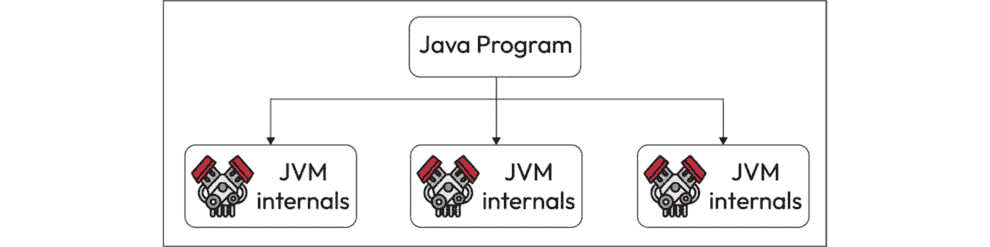

# 第一章：Java 虚拟机简介

在不断扩大的软件开发宇宙中，Java 以其多功能性、跨平台能力和强大性能而闻名。Java 卓越能力的心脏是其**Java 虚拟机**（**JVM**），这是一种复杂的技术，是 Java 生态系统的支柱。在本章中，我们将开始一段启迪人心的旅程，揭开 JVM 内部运作的秘密，深入其内部以揭示其操作的奥秘。

在本章中，我们将更深入地探讨 JVM 的历史演变，了解其架构，并理解其在执行 Java 应用程序中的作用。此外，我们还将涵盖诸如字节码、类加载、内存管理和执行引擎等基本主题，这些主题构成了 JVM 运作的基础。到本章结束时，你将拥有解开 JVM 复杂内部运作所需的基础知识。因此，让我们开始探索这个技术奇迹的旅程，深入 JVM 的核心。

在本章中，我们将探讨更多关于以下主题：

+   Java 简史

+   JVM 简介

+   JVM 是如何工作的

# 技术要求

本章的 GitHub 仓库位于 - [`github.com/PacktPublishing/Mastering-the-Java-Virtual-Machine/tree/main/chapter-01`](https://github.com/PacktPublishing/Mastering-the-Java-Virtual-Machine/tree/main/chapter-01)

# 探索 Java 的演变

Java 编程语言及其强大的平台有着一段充满传奇色彩的历史，其独特和创新的特点是其核心。在这个故事中，JVM 是一个关键组成部分，对 Java 的演变和持久重要性留下了不可磨灭的印记。JVM 在使 Java 成为今天的样子中扮演了至关重要的角色，其对 Java 历史的贡献不容小觑。

JVM 是使 Java 的“一次编写，到处运行”承诺成为现实的基石。这一承诺重新定义了软件开发，直接回应了为网络消费设备（如机顶盒、路由器和其他多媒体设备）创建软件的挑战。按照设计，JVM 允许编译后的 Java 代码在网络中传输，在各种客户端机器上无缝运行，并提供安全保障。JVM 的架构和执行模型确保 Java 程序无论其来源或运行的主机机器如何，都能保持一致的行为。这种从小型网络设备到大规模服务器的演变展示了 Java 的多样性和对软件开发世界的持久影响。

随着万维网的兴起，这种能力变得更加引人注目。在保证安全的同时，能够在网络浏览器中下载和运行 Java 程序，这是一个颠覆性的变化。它提供了前所未有的可扩展性，允许安全地将动态内容添加到网页中。这种由 HotJava 浏览器展示的可扩展性，展示了 JVM 在我们今天所知道的 Web 形成中的作用。

然而，值得注意的是，随着网络的演变，由于安全担忧和更现代网络标准的出现，像 Flash 和 Java 浏览器插件这样的技术逐渐消失。尽管发生了这些变化，JVM 的影响力在各种领域仍然持续存在，从企业服务器应用程序到 Android 移动开发，这突显了它在更广泛的软件景观中的持久重要性。

从本质上讲，JVM 是使 Java 适应性强、安全且平台无关的技术支柱。其对 Java 历史的重要性在于其能够实现 Java 的承诺，使其成为 Web 和软件开发的基础性技术。Java 的持续成功和相关性可以直接归因于 JVM 在其演变中的作用，巩固了其在计算机历史档案中的地位。

我们所经历的 JVM 的历史之旅不仅揭示了 Java 平台发展的丰富织锦，而且强调了 JVM 在塑造平台独特身份中的关键作用。从作为对网络消费设备挑战的回应而诞生，到对基于 Web 的内容的变革性影响及其可扩展性，JVM 成为了 Java 生态系统的基石。这一旅程为探索下一节中介绍的 JVM 的内部工作原理提供了合适的背景。

此外，值得注意的是，JVM 的影响力不仅限于 Java 本身。它是 Kotlin、Scala、Groovy 等多种语言的引擎。了解 JVM 的历史使我们能够欣赏它如何演变以实现 Java 的平台独立性承诺，其适应各种编程语言的能力，以及其在多语言和应用程序软件开发中的持久相关性。

# JVM 概述

JVM 是整个 Java 平台的基础。它是 Java 的默默无闻但无处不在的守护者，促进了 Java 的独特属性。JVM 负责平台的独立于特定硬件和操作系统，编译的 Java 代码的紧凑大小，以及其强大的保护用户免受恶意程序侵害的能力。

从本质上讲，JVM 是一个抽象的计算机，与您桌上的实体计算机并无二致。它拥有指令集，并通过在运行时执行代码来操作各种内存区域。使用虚拟机实现编程语言并非新鲜事，其中最突出的例子是 UCSD Pascal 的 P-Code 机器。这个基础使得 JVM 能够超越物理硬件，为 Java 应用程序提供一个一致的环境。

然而，JVM 的旅程始于 Sun Microsystems, Inc.的一个原型实现，当时它托管在类似当代**个人数字助理**（**PDA**）的手持设备上。如今，Oracle 的实现已经将 JVM 的触角扩展到了移动、桌面和服务器设备。值得注意的是，JVM 并不局限于任何特定的实现技术、宿主硬件或操作系统。它是一个多才多艺的实体，可以通过解释、编译、微码或直接硅实现来实现。

JVM 的独特之处在于它对 Java 编程语言的细节一无所知。相反，它与特定的二进制格式——类文件格式——有着密切的了解。这些类文件封装了 JVM 指令，也称为字节码，以及符号表和补充信息。

为了确保安全性，JVM 对类文件中包含的代码施加了强大的语法和结构约束。然而，这正是 JVM 包容性的体现。任何可以用有效类文件表达功能的编程语言都可以在 JVM 中找到温馨的家园。这种包容性使得各种语言的实现者可以利用 JVM 作为其软件的交付工具，得益于其机器无关的平台。

JVM 在操作系统层运行，作为 Java 应用程序与底层硬件和操作系统之间的关键桥梁。它在执行 Java 代码的同时抽象硬件复杂性，并为 Java 应用程序提供一个安全且一致的环境。

它还充当 Java 字节码的解释器，将高级 Java 代码转换为底层硬件可以理解的低级指令。它管理内存，处理多线程，并提供各种运行时服务，使 Java 应用程序能够在不同的平台和操作系统上无缝运行。

JVM 的运行时实例具有特定且定义良好的生命周期。其任务是明确的——运行单个 Java 应用程序。以下是 JVM 生命周期的分解：

1.  **实例生成**：当 Java 应用程序启动时，会创建一个 JVM 的运行时实例。这个实例负责执行应用程序的字节码并管理其运行时环境。

1.  **执行**：JVM 实例通过调用指定初始类的**main()**方法来启动 Java 应用程序。这个**main()**方法作为应用程序的入口点，必须满足特定标准：它应该是公开的、静态的、返回**void**，并且接受一个字符串数组作为单一参数，即**(String[])**。截至撰写本文时，重要的是要注意，**main()**方法的准则可能会演变，因为 Java 21 的预览版本暗示了可能的简化。因此，开发者应关注最新的语言更新和关于**main()**方法签名的最佳实践的发展。任何具有此类**main()**方法的类都可以作为 Java 应用程序的起点。

1.  **应用程序执行**：JVM 执行 Java 应用程序，根据需要处理其指令，管理内存、线程和其他资源。

1.  **应用程序完成**：一旦 Java 应用程序执行完毕，JVM 实例就不再需要。此时，JVM 实例会终止。

重要的是要注意，JVM 遵循“一个应用程序一个实例”的模式。假设你在同一台计算机上同时启动多个 Java 应用程序，使用相同的 JVM 具体实现。在这种情况下，你将拥有多个 JVM 实例，每个实例都专门用于运行其各自的 Java 应用程序。这些 JVM 实例彼此隔离，确保每个 Java 应用程序的独立性和安全性。

在总结这个全面的 JVM 概述时，我们已穿越了构成 Java 成为多功能和平台无关编程语言的基础元素。JVM，Java 执行环境的关键，协调了不同操作系统和架构下代码的无缝集成。随着我们过渡到下一部分，我们对 JVM 内部工作的理解使我们准备好深入探索 Java 代码生命周期的动态过程。这次探索将揭示 JVM 在执行 Java 应用程序时采取的复杂步骤，揭示幕后发生的魔法。请加入我们，一起揭开 Java 代码在 JVM 中执行细节的旅程。

## JVM 如何执行 Java 代码

JVM（Java 虚拟机）是一项卓越的技术，在执行 Java 应用程序中扮演着核心角色。它被设计成使 Java 平台无关，允许你一次编写，到处运行。然而，理解 JVM 的工作原理不仅涉及 Java，还包括与特定硬件和操作系统的原生代码集成。

JVM 执行用 Java 编程语言编写的 Java 应用程序，这些应用程序被编译成字节码。字节码是 Java 代码的低级表示，它是平台无关的。当 Java 应用程序执行时，JVM 将其解释或编译成宿主系统硬件的机器代码。

为了与宿主系统交互并利用特定平台的功能，JVM 可以使用本地方法。这些本地方法是用 C 或 C++等语言编写的，并且与 JVM 运行的特定平台动态链接。这些方法在平台无关的 Java 代码和宿主系统特定的本地代码之间提供了一个桥梁。

当 Java 应用程序需要从操作系统访问信息或利用纯 Java 代码难以访问的系统资源时，本地方法是有益的。例如，当与文件系统、目录或其他特定平台的功能一起工作时，本地方法可以提供直接访问底层操作系统的接口。

理解这一点至关重要：尽管 Java 编程语言致力于平台无关性，但 JVM 本质上却是平台特定的。这意味着每个不同的平台都存在一个定制的虚拟机实现。这种虚拟机实现是 JVM 的一个特定实例，旨在无缝适应宿主系统硬件架构和操作系统的特殊性。这种平台特定的适应确保了最佳兼容性和性能，强调了 JVM 的动态特性，因为它根据每个底层平台的独特特性定制其执行环境。

在引人入胜的视觉图*图 1**.1*中，我们见证了独特的 Java 程序在三个不同的平台（Windows、macOS 和 Linux）上的无缝执行，这一切都归功于 JVM。每个平台都拥有其专用的 JVM 实例，针对其特定的硬件和操作系统进行了定制。这一场景的美丽之处在于程序的统一性——它保持不变，是对 Java 的“一次编写，到处运行”承诺的证明。正如我们所观察到的，程序的功能在这三个操作系统之间保持一致，强调了 JVM 赋予的平台无关性。这是 JVM 适应性的显著展示，确保相同的 Java 程序能够在 Windows、macOS 和 Linux 的多样化环境中和谐共存，体现了跨平台兼容性的本质。

图 1.1：跨多平台的 JVM

JVM 的作用单一但至关重要：执行 Java 应用程序。其生命周期简单明了，当应用程序开始时，它会孕育一个新的实例，当应用程序完成时，它会优雅地结束其存在。每个应用程序在启动时都会触发其专用 JVM 实例的创建。这意味着在同一台机器上运行相同的代码三次将启动三个独立的 JVM。

虽然 JVM 可能在后台安静地运行，但众多并发进程确保了其持续可用性。这些进程是无名英雄，它们使 JVM 能够无缝运行。具体如下：

+   **计时器**：计时器是 JVM 的时钟，协调定期发生的事件，如中断和重复过程。它们在维持 JVM 操作同步方面发挥着关键作用。

+   **垃圾收集器进程**：垃圾收集器进程管理 JVM 中的内存。它们通过识别和销毁不再使用的对象来执行清理内存的基本任务，确保高效地利用内存。

+   **编译器**：JVM 内部的编译器承担了将字节码（Java 代码的低级表示）转换为宿主系统硬件可以理解的本地代码的转换角色。这个过程称为**即时**（**JIT**）编译，提高了 Java 应用程序的性能。

+   **监听器**：监听器作为 JVM 的警觉耳朵，随时准备接收信号和信息。它们的主要功能是将这些信息传递给 JVM 内部适当的过程，确保关键数据达到预期的目的地。

深入研究 JVM 内部的并行进程或线程，重要的是要认识到 JVM 允许并发执行多个线程。这些线程并行运行，使 Java 应用程序能够同时执行任务。Java 中的这种并发性与原生线程紧密相关，原生线程是操作系统级别的并行执行的基本单元。此外，值得注意的是，截至 Java 21，虚拟线程已成为一项新特性。虚拟线程引入了一种轻量级的并发形式，可以更有效地管理，可能会改变 Java 并行执行的局面。开发者在考虑其应用程序的线程管理策略时应该考虑这一点。

当 Java 中的并行进程或线程诞生时，它将经历一系列初始步骤以准备其执行：

1.  **内存分配**：JVM 为线程分配内存资源，包括为存储其对象和数据而保留的堆的专用部分。每个线程都有自己的内存空间，确保与其他线程隔离。

1.  **对象同步**：线程同步机制，如锁和监视器，被建立以协调对共享资源的访问。同步确保线程不会相互干扰，并有助于防止多线程应用程序中的数据损坏。

1.  **特定寄存器的创建**：线程配备了特定的寄存器，这些寄存器是线程执行上下文的一部分。这些寄存器持有数据和执行状态信息，使线程能够高效地运行。

1.  **原生线程的分配**：由操作系统管理的原生线程被分配以支持 Java 线程的执行。原生线程负责执行 Java 代码并与底层硬件和操作系统交互。

如果在线程执行过程中发生异常，JVM 的本地部分会立即将此信息反馈给 JVM 本身。JVM 负责处理异常，进行必要的调整，并确保线程的安全性和完整性。如果异常无法恢复，JVM 将关闭线程。

当一个线程完成其执行时，它会释放与之相关的所有特定资源。这包括 JVM 的 Java 部分管理的资源，如内存和对象，以及由本地部分分配的资源，包括本地线程。这些资源被有效地回收并返回到 JVM，确保 JVM 保持响应性和资源效率。

从本质上讲，JVM 中的线程管理是一个复杂且高度协调的过程，允许并发执行多个线程，每个线程都有自己的内存空间和特定资源。

在数据领域，JVM 运行时涉及两个基本类别：

+   **原始类型**：原始类型是基本数据类型，包括数值类型、布尔值和返回地址。这些类型在运行时不要求进行广泛的类型检查或验证。它们使用针对各自数据类型定制的特定指令操作。例如，**iadd**、**ladd**、**fadd** 和 **dadd** 指令分别处理整数、长整型、浮点型和双精度值。

+   **引用值**：JVM 支持动态分配类的实例或数组。这些值属于引用类型，其操作类似于 C/C++ 等语言。引用值代表复杂的数据结构，JVM 在运行时执行类型检查和验证，以确保这些数据结构的完整性和兼容性。

在原始类型领域，JVM 包括数值类型，涵盖整数和浮点值。处理简单数据类型和复杂、基于引用的数据结构的能力使 JVM 能够支持各种应用程序和场景。

JVM 能够优雅地处理异常、管理线程的生命周期，并在原始和引用数据类型上操作，这反映了其强大和灵活的本质，使其成为 Java 平台的基础。

JVM 是一个多才多艺且强大的平台，支持各种原始数据类型，每个数据类型在 Java 编程中都扮演着不同的角色。这些原始数据类型是定义变量和处理 JVM 内基本数据操作的基本构建块。从整数和浮点值等数值类型到布尔值和独特的 `returnAddress` 类型，这些数据类型在 Java 程序的精确和高效执行中发挥着关键作用。

*图 1*.*2* 显示了 JVM 类型按原始类型和引用值划分。

图 1.2：JVM 类型

每种类型也有其大小和范围。*表 1.1*提供了 JVM 原始数据类型的全面概述，包括它们的名称、大小、变体、默认值和类型。它为 Java 开发者和爱好者提供了宝贵的参考，以了解 JVM 核心数据类型。

| **类型名称** | **大小（位）** | **变体** | **默认值** | **类型** |
| --- | --- | --- | --- | --- |
| `byte` | 8 | -128 到 127 | 0 | 数值 |
| `short` | 16 | -32,768 到 32,767 | 0 | 数值 |
| `int` | 32 | -2,147,483,648 到 2,147,483,647 | 0 | 数值 |
| `long` | 64 | -9,223,372,036,854,775,808 到 9,223,372,036,854,775,807 | 0 | 数值 |
| `float` | 32 | IEEE 754 单精度 | 0.0 | 数值 |
| `double` | 64 | IEEE 754 双精度 | 0.0 | 数值 |
| `char` | 16 | 0 到 65,535 | ‘\u0000’ | 数值 |
| `boolean` | N/A | N/A | false | 布尔值 |
| `returnAddress` | N/A | N/A | N/A | `returnAddress` |

表 1.1：JVM 的原始数据类型，包括它们的名称、大小、变体、默认值和类型

JVM 中的这些原始类型包括各种数值类型、布尔值以及特定的`returnAddress`类型，每种类型都有其独特的特性和默认值。此表是理解 JVM 内这些原始数据类型的快速参考。

JVM 中的`returnAddress`类型代表了一种在方法调用和返回中至关重要的特定数据类型。此类型是 JVM 内部的，并且 Java 编程语言不能直接访问或使用。以下是关于`returnAddress`类型的重要性和原因的解释：

+   **方法调用和返回**：JVM 使用`returnAddress`类型来高效地管理方法调用和返回。当一个方法被调用时，JVM 需要跟踪执行完成后返回的位置。这对于维护程序的流程控制以及确保方法调用后正确恢复执行上下文至关重要。

+   **调用栈管理**：在 JVM 中，调用栈是一个关键的数据结构，用于跟踪方法调用和返回。它维护一个`returnAddress`值的栈，每个值代表方法完成后应返回的控制地址。这个栈被称为方法调用栈或执行栈。

+   **递归**：`returnAddress`类型在处理递归方法调用中至关重要。当一个方法多次调用自身或另一个方法时，JVM 依赖于`returnAddress`值来确保控制返回到正确的调用点，从而保持递归状态。

`returnAddress` 类型是 JVM 用于在低级别管理方法调用和返回的内部机制。它不是 Java 编程语言规范的一部分，Java 代码不会直接与或访问 `returnAddress` 值。这个设计决策与 Java 提供高级、平台无关和安全语言的目标相一致。

JVM 透明地处理 `returnAddress` 值的管理，确保 Java 代码中的方法调用和返回无缝且可靠。通过将这种低级功能从 Java 语言中抽象出来，Java 程序可以专注于高级逻辑和应用开发，无需管理调用栈和 `returnAddress` 值的复杂性。

`returnAddress` 类型是 JVM 管理方法调用和返回的内部机制的重要组成部分。虽然这对 JVM 的操作很重要，但它对 Java 语言本身来说是隐藏的，因为 JVM 以透明的方式处理它，以确保 Java 程序中方法调用和返回的完整性和可靠性。

在 JVM 中，布尔类型只有有限的本地支持。与其他编程语言中布尔值作为独立的数据类型表示不同，在 JVM 中，布尔值是通过使用 `int` 类型来管理的。这种设计选择简化了 JVM 的实现，并且与字节码指令集的历史原因有关。

下面是 JVM 中处理布尔值的一些关键方面：

+   **布尔值作为整数**：JVM 将布尔值表示为整数，其中 **1** 通常表示 **true**，而 **0** 表示 **false**。这意味着布尔值本质上被视为整数的一个子集。

+   **指令**：在 JVM 字节码指令中，没有专门针对布尔操作的指令。相反，布尔值的操作是通过整数指令来执行的。例如，涉及布尔值的比较或逻辑操作使用整数指令，如 **if_icmpne**（如果整数比较不等），**if_icmpeq**（如果整数比较相等），等等。

+   **布尔数组**：当处理布尔值数组，例如 **boolean[]** 时，JVM 通常将它们视为字节数组。JVM 使用字节（8 位）来表示布尔值，这与 **byte** 数据类型相一致。

+   **效率和简单性**：将布尔值表示为整数的选择简化了 JVM 的设计，并使其更高效。它减少了额外指令和数据类型的需求，这有助于保持 JVM 实现的简单性。

虽然这种方法可能看起来有些不寻常，但它却是 JVM 设计哲学的一部分，旨在在支持 Java 程序中的布尔值的同时，保持效率和简单性。值得注意的是，虽然布尔值在 JVM 字节码中表示为整数，但 Java 开发者可以使用熟悉的`true`和`false`字面量在他们的 Java 源代码中处理布尔值，JVM 在执行期间负责必要的转换。

在 JVM 中，引用值在管理复杂数据结构和对象方面至关重要。这些引用值代表并与三种主要类型交互：类、数组和接口。以下是 JVM 中这些引用类型更详细的介绍：

+   **类**：Java 面向对象编程的基础。它们定义了创建对象、封装数据和行为的蓝图。在 JVM 中，类的引用值用于指向这些类的实例。当你创建一个类的对象时，你创建了这个类的实例，引用值指向这个实例。

+   **数组**：Java 中的数组提供了一种存储相同数据类型元素集合的方法。在 JVM 中，数组的引用值用于引用这些数组。数组可以是原始数据类型或对象，引用值有助于访问和操作数组的元素。

+   **接口**：接口是 Java 中的一个基本概念，允许定义类必须遵守的合同。接口的引用值用于指向实现这些接口的对象。当你在 Java 中使用接口时，你使用引用值与满足接口要求的对象进行交互。

JVM 中引用值的常见特征是其初始状态，该状态始终设置为`null`。`null`状态表示对象或对象引用的缺失。它不是一个定义的类型，而是未初始化引用值的通用指示符。引用值可以转换为`null`，无论它们的特定类型如何。

将引用值设置为`null`在需要释放资源、指示对象不再使用或简单地初始化引用而不指向特定对象时特别有用。处理`null`引用是 Java 编程中用于各种目的的关键方面，包括内存管理和程序逻辑。

JVM 中的引用值对于管理类、数组和接口至关重要。它们提供了在 Java 中处理复杂数据结构和对象的方法。将引用值初始化为`null`允许在处理对象时具有灵活性和精确性，使其成为 Java 引用处理的基本方面。

在 JVM 中，`null`是一个特殊的引用值，表示没有对象或没有对象的引用。它不是一个定义的类型，但表示引用值当前没有指向任何对象。当一个引用被设置为`null`时，它实际上意味着它没有引用内存中的任何有效对象。

在 Java 语言和 JVM 中，`null`的概念具有几个重要的用途：

+   **初始化**：当你声明一个引用变量但没有将其分配给一个对象时，该引用的默认初始值是**null**。这个默认值对于你想要声明一个引用但不想立即将其与对象关联的场景是必要的。这种做法允许你在需要时声明一个引用变量并将其分配给对象，这为你的程序结构提供了灵活性。

+   **值的缺失**：**null**表示与特定引用没有关联的有效对象。在程序中的某个点上需要表示没有有意义的数据或对象可用时，这很有用。

+   **资源释放**：虽然将引用设置为**null**可以帮助 JVM 知道对象不再需要，但重要的是要明确，内存管理和资源清理的主要责任在于 Java 的**垃圾收集器**（**GC**）。GC 自动识别并回收不再可达的对象占用的内存，从而有效管理内存资源。开发者通常不需要显式地将引用设置为**null**以进行内存清理；这是一个由 GC 处理的任务。

虽然`null`在 Java 和 JVM 中是一个有价值的概念，但其使用伴随着权衡和考虑：

+   **NullPointerException**：其中一个主要的权衡是**NullPointerException**的风险。如果你尝试对一个设置为**null**的引用集进行操作，可能会导致运行时异常。因此，正确处理**null**引用至关重要，以避免意外的程序崩溃。

+   **防御性编程**：程序员在使用引用之前需要仔细检查**null**引用，以防止**NullPointerException**。这可能会导致额外的代码用于**null**检查，并使代码更加复杂。

+   **资源管理**：虽然将引用设置为**null**可以帮助释放资源，但这并不是资源管理的保证方法。某些资源可能需要显式的清理或销毁，仅依赖于将引用设置为**null**可能不足以满足需求。

+   **设计考虑**：在设计类和 API 时，提供关于如何使用引用以及它们可以在什么情况下设置为**null**的明确指导很重要。

总结来说，在 JVM 中，`null` 是表示对象不存在和进行资源管理的一个宝贵工具。然而，它需要谨慎处理以避免 `NullPointerException` 并确保程序行为正确。适当的设计和编码实践可以帮助减轻使用 `null` 相关的权衡。

在本篇关于 JVM 的全面概述中，我们探讨了 JVM 的内部工作原理和关键组件，这些组件使得 Java 成为一个强大且多功能的编程平台。JVM 作为 Java 生态系统的骨架，提供了在多种操作系统和硬件架构上运行 Java 应用程序的能力。我们深入研究了其对原始和引用数据类型的支持，对 `null` 问题的处理，以及在管理类、数组和接口中的作用。

通过 JVM，Java 实现了其 *一次编写，到处运行* 的承诺，使开发者能够创建平台无关的应用程序。然而，理解 JVM 的复杂性，包括它如何管理线程、内存和资源，对于优化 Java 应用程序和确保其可靠性至关重要。

JVM 的设计选择，例如将布尔值表示为整数，反映了简单性和效率之间的平衡。我们还提到了 `returnAddress` 在管理方法调用和返回中的重要性。

JVM 是一项卓越且复杂的技术，它赋予 Java 开发者构建健壮、安全和平台无关的软件的能力。凭借其独特的特性和功能，JVM 是 Java 在软件开发中持续成功的基础。

# 总结

在本章中，你全面了解了 JVM，揭示了其在执行 Java 应用程序中的关键作用。我们探讨了 JVM 的平台特定性质，强调尽管 Java 语言具有平台无关性，但每个平台都需要一个独特的虚拟机实现，以实现最佳兼容性和性能。

本章提供的信息具有多重价值。首先，它揭示了 JVM 的底层工作原理，阐明了其在实现 Java 的 *一次编写，到处运行* 承诺中的作用。理解 JVM 的平台特定适应性对于确保 Java 应用程序在各种硬件和操作系统环境中表现最佳的开发者和从业者至关重要。

展望下一章，*JVM 如何执行 Java 代码*，你可以期待更深入地了解当 Java 代码在 JVM 中执行时发生的动态过程。这次探索将提供关于 JVM 在代码执行期间内部工作的实用见解，为你提供适用于实际工作场景的必要知识。随着开发者遇到各种平台环境，本章获得的见解将赋予你导航 JVM 复杂性的能力，优化适用于不同计算环境的 Java 代码，并在现实世界的 Java 开发场景中提高你的问题解决能力。

在我们结束对 JVM 的探索之后，我们现在准备深入 Java 核心的深处，通过下一章深入到*类文件结构*的复杂世界中。理解类文件的结构对于理解 Java 代码如何在 JVM 中组织、编译和执行至关重要。因此，让我们继续前进，探索构成 Java 类文件生命力的构建块，连接我们从 JVM 到 Java 类结构的迷人领域的旅程。

# 问题

回答以下问题以测试你对本章知识的掌握：

1.  JVM 的主要目的是什么？

    1.  编写 Java 代码

    1.  编译 Java 代码

    1.  运行 Java 应用程序

    1.  调试 Java 代码

1.  JVM 如何处理布尔值？

    1.  作为独立的数据类型

    1.  作为字节数组

    1.  作为整数类型

    1.  作为浮点类型

1.  JVM 中引用值的初始状态是什么？

    1.  Undefined

    1.  Zero

    1.  Null

    1.  True

1.  以下哪项不是 JVM 中的引用类型？

    1.  类

    1.  数组

    1.  接口

    1.  基本类型

1.  JVM 中**returnAddress**类型的主要作用是什么？

    1.  表示布尔值

    1.  管理方法调用和返回

    1.  处理异常

    1.  存储引用值

# 答案

这是本章问题的答案：

1.  C. 运行 Java 应用程序

1.  C. 作为整数类型

1.  C. Null

1.  D. 基本类型

1.  B. 管理方法调用和返回
