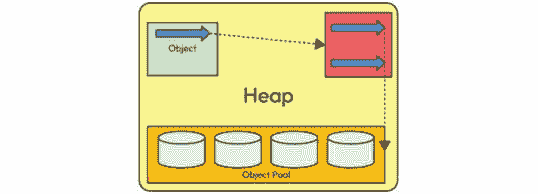

# 第五章：内存管理

本章探讨了 JVM 内部内存管理的复杂领域。理解内存分配和利用的内部机制对于寻求优化应用程序性能和可扩展性的 Java 开发者至关重要。作为任何 Java 程序的心脏，JVM 的内存管理系统处理各种组件，包括堆、栈和垃圾回收机制，每个组件都在 Java 应用程序的高效执行中扮演着关键角色。

在本章中，我们将深入探讨这些组件的复杂性，揭示 JVM 如何动态分配和管理内存资源的奥秘。我们将探讨堆的基础概念，其中对象驻留并由垃圾回收器管理，以及栈，它处理方法调用和局部变量。通过这次内存管理之旅，我们将揭开垃圾回收算法的复杂性，并阐明高效对象内存分配的最佳实践。到本章结束时，你不仅将掌握 JVM 内存管理的根本原则，还将获得实际见解，以优化你的 Java 应用程序以实现最佳内存利用。无论你是经验丰富的 Java 开发者还是 Java 语言的新手，这次探索都将是掌握 Java 生态系统内存管理艺术的门户。

在本章中，我们将探讨以下主题：

+   JVM 中的内存管理

+   程序计数器

+   Java 栈

+   原生方法栈

+   方法区

+   堆

+   代码缓存和 JIT

# 技术要求

对于本章，你需要以下要求：

+   Java 21

+   本章的 GitHub 仓库位于 - [`github.com/PacktPublishing/Mastering-the-Java-Virtual-Machine/tree/main/chapter-05`](https://github.com/PacktPublishing/Mastering-the-Java-Virtual-Machine/tree/main/chapter-05)

# JVM 中的内存管理

在这次对 JVM 内部内存管理的启发式探索中，我们将深入研究内存分配和利用的复杂性，认识到内存在一个 Java 应用程序生命周期中的关键作用。一旦你的 Java 代码被编译成字节码，内存管理的旅程就开始了。随着字节码的执行，它调用 JVM，Java 平台独立性的基石，它向前迈出，从底层系统获取必要的内存以实现程序的高效执行。

在 JVM 丰富的内存景观中，堆和栈等关键组件发挥作用。堆是一个动态区域，用于存储对象，并通过垃圾回收来回收不再使用的对象的内存。栈管理方法调用和局部变量，为程序执行期间处理内存提供了一种结构化和高效的方式。

JVM 的一个独特特性是其能够动态适应不断变化的内存需求。垃圾收集器，作为 JVM 的核心组成部分，识别并回收未引用对象占用的内存。这种动态内存管理确保了资源的最优利用，提高了 Java 程序的整体性能。Java 与 C/C++ 等语言之间最显著的区别之一是，在 Java 中，内存分配和清理由 JVM 自动管理。这减轻了开发者进行显式内存管理任务的负担。然而，尽管您不需要担心内存管理，但理解本章中解释的底层内存结构和 JVM 的管理，对于有效的 Java 开发至关重要。

理解 JVM 如何与系统交互对于获取所需的内存至关重要。我们将深入探讨使 JVM 能够无缝分配和释放内存的通信协议和机制，确保与底层操作系统的和谐集成。掌握这些知识，您将更好地为优化代码以实现内存效率做好准备，从而提高 Java 应用程序的性能和可扩展性。因此，让我们开始这段探索 JVM 内存管理的旅程，在这里，每一个字节都至关重要！

在这次探索中，我们的重点是揭示 JVM 复杂的内存架构，特别关注其关键组件：方法区、堆、Java 栈、**程序计数器**（**PC**）寄存器和本地方法栈。这些元素共同协调 Java 程序的动态执行，每个元素在管理类级信息、对象分配、方法执行、程序流程控制和本地代码集成中扮演着独特的角色。随着我们深入探讨这些内存区域的细微差别，我们的目标是提供一个全面的了解，了解 JVM 如何处理内存，使开发者能够优化代码以实现更好的性能和可扩展性。因此，让我们开始这段穿越 JVM 内存景观的旅程，其中每个内存区域都在塑造 Java 应用程序的运行时行为中扮演着其独特的角色。

方法区是 JVM 内存架构的关键部分。它是类级数据的存储库，包含方法代码、静态变量和常量池。每个加载的类在方法区中都有其专用的空间，使其成为 JVM 中所有线程的共享资源。这个区域对于高效管理类相关信息至关重要。

另一方面，堆是一个动态且共享的内存空间，JVM 在运行时为对象分配内存。所有对象，无论其作用域如何，都驻留在堆中。它在垃圾收集中发挥着关键作用，确保未引用的对象被识别，其内存被回收，以防止资源耗尽。

Java 栈用于 Java 方法的执行。Java 应用程序中的每个线程都拥有自己的栈，包含方法调用栈和局部变量。栈对于管理方法调用，为每个线程提供干净和隔离的执行环境至关重要。

PC 寄存器是线程内存中的一个虽小但重要的区域。它存储当前正在执行的指令的地址，通过指示下一个要执行的指令来维持程序的流程。PC 寄存器对于维护线程内程序执行的顺序至关重要。

此外，本地方法栈是为用 C 或 C++等语言编写的本地方法专设的内存区域。这些栈独立于 Java 栈运行，并处理本地代码的执行，促进 Java 与本地语言的无缝集成。

在 JVM 复杂的架构中，内存的分配和管理由几个不同的区域协同完成。这个视觉表示捕捉了关键内存组件的动态互动，展示了**方法区域**、**堆**、**Java 栈**、**PC 寄存器**和**本地** **方法栈**：


图 5.1：运行中的 JVM 及其内存

在接下来的章节中，我们将深入探讨 JVM 内这些内存区域的复杂性。我们的探索将包括理解方法区域如何管理类级信息，堆的动态特性及其在对象分配中的作用，Java 栈在方法执行中的重要性，PC 寄存器在控制程序流程中的功能，以及本地方法如何通过本地方法栈处理。到本章结束时，您将全面理解 JVM 的内存架构以及这些组件如何协同促进 Java 程序的执行。

随着我们结束对 JVM 内各种内存区域的探索，我们获得了关于方法区域、堆、Java 栈、PC 寄存器和本地方法栈等组件动态互动的有价值见解。理解这些元素对于寻求优化内存使用并提高其 Java 应用程序性能的开发者至关重要。

在下一节中，我们将关注 JVM 内部工作的重要方面——PC。它在指导程序执行流程中扮演着核心角色，存储当前正在执行的指令的地址。请加入我们，在即将到来的章节中，我们将揭示 PC 寄存器的重要性，深入探讨其功能和在 Java 程序无缝执行中的影响。这次对 JVM 复杂层级的探索将加深我们对核心机制的理解，使我们能够编写更高效和健壮的 Java 代码。

# 程序计数器

我们的关注点聚焦于 JVM 内部的 PC（程序计数器），这是一个与执行流程紧密相连的关键组件。对于每个线程来说，PC 都是独一无二的，它充当一个指南针，携带有关当前指令执行的基本信息。请加入我们，深入了解 PC 的微妙之处，揭示其在管理程序流程中的作用，并理解其在本地和非本地方法执行中的重要性。

PC 是 JVM 中为每个线程创建的专用寄存器。它携带关键数据，主要是作为指针和返回地址。这对动态组合是理解线程当前执行状态的关键。指针指导线程执行下一个指令，而返回地址确保在方法完成后无缝返回到之前的执行点。

在理解 PC 的行为时，区分本地和非本地方法至关重要。在非本地方法中，PC 的值明确定义，代表指令地址。然而，在本地方法的情况下，PC 转变为指针，展示了其在适应 JVM 内方法执行多样性的适应性。

以下视觉表示提供了对 JVM 内线程执行复杂舞蹈的洞察，特别关注 PC。该图生动地说明了 PC 如何携带关键信息，如返回地址和指针，引导线程通过其执行路径。在本地方法领域，PC 呈现出一种神秘的性质，由未知值表示，象征着其在导航 Java 代码和本地执行之间的动态角色。


图 5.2：可能包含 returnAddress 或未知值的 PC

PC 在管理线程执行中的作用至关重要。它充当一个哨兵，不断更新以反映当前正在进行的指令。当线程在方法调用之间导航时，PC 确保指令之间的平稳过渡，精确地编排程序流程。

除了在执行控制中的作用外，PC 对代码优化也有影响。虽然 JVM 实现控制 PC，但开发者可以通过理解 PC 的工作方式来影响代码优化。这种理解使开发者能够有策略地优化代码，与 JVM 的执行模型相匹配，以提升性能和效率。尽管对 PC 的直接控制可能有限，但对 PC 行为的洞察使开发者能够编写更适合 JVM 执行的代码，从而最终提高应用程序的性能。

在我们结束对 PC 及其在 JVM 内引导线程执行中的关键作用的探索之后，我们发现自己正站在揭开 JVM 精妙复杂性的另一层的边缘。请加入我们即将到来的会议，我们将深入探讨 Java 栈的动态世界。这个基本组件在管理方法调用中起着核心作用，为每个线程提供调用栈和局部变量的专用空间。对于寻求优化其代码以实现高效执行的开发者来说，理解 Java 栈至关重要。因此，让我们无缝地从探索 PC 转向深入挖掘 Java 栈，每个方法调用都会留下痕迹，塑造 Java 应用程序的强大架构。

# Java 栈

在本节中，我们将深入探讨 Java 栈的复杂性——这是 JVM 内的一个基本组件。与 PC 一样，Java 栈是每个线程专有的私有寄存器，作为方法执行信息的存储库。本节深入探讨了 Java 栈的操作，将其与经典语言如 C 进行比较，并阐明了其在存储局部变量、部分结果、方法调用和结果中的作用。

类似于 C 这样的经典语言，Java 栈通过存储帧来操作，每个帧封装了与方法执行相关的关键信息。这些帧包含参数、局部变量和其他必要数据。Java 栈的功能不仅限于直接修改变量；相反，它优雅地插入和删除帧以适应线程执行的演变状态。

当一个线程调用一个方法时，Java 栈通过插入一个新的帧进行动态转换。这个帧封装了诸如参数和局部变量等详细信息，为方法的执行提供了一个专用空间。当方法正常结束或由于异常而结束时，该帧被丢弃。这种生命周期确保了 Java 栈内一个组织良好且高效的执行环境。

Java 栈的灵活性体现在其大小可以是固定的或动态确定的。这一特性允许根据执行 Java 应用程序的具体需求进行定制资源分配，从而有助于优化内存利用。

Java 栈的基本构建块是帧。这个单元在创建方法时出现，在方法正常完成或由于异常而结束时消失。每个帧封装了关键组件，包括局部变量列表、操作栈以及当前类和方法的引用。这种三分结构将帧分为三个基本部分：

+   **局部变量**：帧内的栈变量部分是局部变量的存储空间。这些变量仅针对当前执行的方法，对于存储中间结果和与方法功能相关的参数至关重要。

+   **操作数栈**：与栈变量协同工作，操作数部分包含操作栈。这个栈在管理方法内的操作流程、执行指令和确保方法执行的结构化方法中起着关键作用。

+   **帧数据**：这一部分封装了关于方法执行上下文的关键信息。它包括对当前类和方法的引用，为 JVM 有效地导航程序结构提供必要上下文信息。

将帧分为局部变量、操作数栈和帧数据的三部分划分对于维护 Java 栈的完整性和功能性至关重要。它确保了系统化的信息组织，允许高效的方法执行和无缝处理 JVM 内存架构中的变量和操作。

Java 栈中的每个帧都包含对当前方法类型的运行时常量池的引用。这一包含支持方法代码的动态链接，这是一个将类文件代码中的符号引用转换为运行时具体引用的过程。符号引用，表示要调用的方法和要访问的变量，在运行时通过动态链接转换为具体引用。这个动态链接过程涉及解析未定义的符号，并在需要时加载类。结果是变量访问被转换为与这些变量运行时位置相关联的存储结构中的精确偏移量。这种后期绑定机制增强了适应性，并减少了在修改方法可能使用的其他类时代码损坏的可能性。

以下视觉表示简要概述了 Java 栈的核心单元：帧。这个基本构建块在方法创建时生成，在方法终止时拆除，封装了三个关键组件：

+   **栈变量**：存储方法特定的局部变量

+   **操作数栈**：管理方法执行的操作栈

+   **帧数据**：包含对当前类和方法的至关重要的引用

这些元素共同定义了帧的结构，并在 JVM 中组织高效和有序的方法执行中发挥着关键作用，如下所示：


图 5.3：Java 栈表示

JVM 中的帧是存储数据、处理部分结果、动态链接、返回方法值和管理异常的基本单元。其生命周期与方法调用紧密绑定，每次方法被调用时创建一个新的帧，在调用完成后（无论是正常结束还是由于未捕获的异常而突然结束）随后被销毁。这些帧从线程的 JVM 栈中分配，具有局部变量、操作数栈和与当前方法关联的类的运行时常量池的引用的独立数组。可以将特定于实现的详细信息（如调试信息）附加到帧上，提供扩展功能。

局部变量数组和操作数栈的大小在编译时预先确定，并伴随方法的代码。因此，帧的大小完全依赖于 JVM 的实现，允许在方法调用期间进行并发内存分配。在给定线程的控制范围内，只有一个帧——执行方法的当前活动帧——被指定为当前帧，对局部变量和操作数栈的操作主要引用此帧。当方法调用另一个方法或完成其执行时，当前帧会演变，将结果返回给上一个帧。重要的是，帧是线程局部的，确保它们对其他线程不可访问。

StackOverflow 错误是在调用栈，一个用于管理程序中方法调用的内存区域，超过其最大限制时发生的异常。在递归编程中，方法会调用自身，为每次调用创建一个新的栈帧。每个栈帧包含有关方法状态的信息，包括局部变量和返回地址。

当方法自身反复调用时，新的栈帧被创建并推入调用栈。如果没有返回而递归太深，它可能会消耗调用栈的所有可用内存，导致 StackOverflow 错误。这个错误作为保护措施，防止程序无限运行并可能崩溃系统。

StackOverflow 错误实际上展示了编程中调用栈的工作方式。每次方法调用都会将一个新的帧推入栈中，当栈变得太深时，就会导致错误。为了避免这种错误，程序员可以优化他们的递归算法以使用更少的栈空间，或者切换到迭代解决方案。

Java 中引入的 StackWalker API（[`openjdk.org/jeps/259`](https://openjdk.org/jeps/259)）提供了一种标准化和高效的方法来遍历执行栈。它允许开发者访问有关栈帧的信息，包括类实例，而无需捕获整个堆栈跟踪。此 API 比`Throwable::getStackTrace`或`Thread::getStackTrace`等方法提供了更多的灵活性和性能。

StackWalker 在必须高效地遍历执行堆栈上的选定帧并访问每个帧的类实例的场景中特别有用。它通过允许延迟访问堆栈帧信息和过滤帧来帮助解决现有 API 的限制，成为以下任务等的有价值工具：

+   确定调用敏感 API 的立即调用者的类

+   在堆栈中过滤特定的实现类

+   寻找保护域和特权帧

+   为可抛出对象生成堆栈跟踪并实现调试功能

当调用栈变得太深时，StackOverflow 错误是递归编程的实用结果。Java 中引入的 StackWalker API 提供了一种高效灵活的方式来遍历和访问执行堆栈的信息，解决了现有堆栈跟踪方法的限制。

在 JVM 错综复杂的织锦中，每个帧都包含一个称为其局部变量的变量数组。这个数组的长度在编译时预先确定，并嵌入到相关类或接口的二进制表示中，与帧内的方法代码一起。单个局部变量可以容纳布尔型、字节型、字符型、短整型、整型、浮点型、引用型或 returnAddress 值，而一对局部变量可以共同持有长或双类型值。

## 局部变量

局部变量通过索引访问，第一个局部变量的索引为零。JVM 的寻址机制允许整数作为局部变量数组的索引，并且只有当整数在零和数组大小减一之间时才有效。重要的是，长或双类型值跨越两个连续的局部变量，这需要使用较小的索引进行寻址。虽然存储在第二个变量中是允许的，但它会破坏第一个变量的内容。

JVM 通过其处理长和双值时能够容纳非偶数索引（n）的能力展示了其非凡的灵活性，这与局部变量数组中传统的 64 位对齐概念相背离。这种适应性使实现者能够决定如何表示这些值，利用两个保留局部变量的分配。这个独特的 JVM 特性使其能够无缝适应各种系统架构，包括 32 位和 64 位系统，根据特定的硬件配置优化内存利用率和性能。

实际上，局部变量在方法调用中扮演着至关重要的角色。对于类方法调用，参数依次占据连续的局部变量位置，从局部变量 0 开始。在实例方法调用的情况下，局部变量 0 作为传递调用对象引用（类似于 Java 中的 `this`）的通道，后续参数从索引 1 开始依次位于连续的局部变量中。这种系统性的局部变量使用确保了在 JVM 中方法执行时参数的有效传递。

以下视觉表示展示了 JVM 中局部变量的动态编排。此图封装了每个帧中的局部变量，描绘了布尔型、字节型、字符型、短整型、整型、浮点型、引用型、返回地址型、长整型和双精度型类型的有序空间。值得注意的是，成对的局部变量无缝地容纳了长或双精度值，挑战了传统的对齐规范，提供了非偶数索引的灵活性。在这里，我们可以看到 JVM 如何在方法调用中高效地使用局部变量，系统地安排参数在连续的局部变量中。这个简洁的视觉图为我们理解 JVM 内存架构中值的微妙互动提供了清晰的路线图：


图 5.4：局部变量表示

在我们探索字节码中局部变量的过程中，我们揭开了方法执行的层层面纱，见证了这些变量如何作为值、参数和引用的动态容器。这种理解为我们下一节奠定了基础：*操作数栈*。随着我们的过渡，期待对操作数栈如何与局部变量接口、指导操作流程以及确保 JVM 繁琐操作中方法无缝执行进行深入探讨。加入我们，一起揭开操作数栈在字节码执行交响曲中的关键作用。

## 操作数栈

在 JVM 的复杂结构中，每个帧都拥有一个称为操作数栈的**后进先出**（**LIFO**）栈。本节将揭开字节码执行层层的面纱，揭示操作数栈在方法执行过程中管理数据的作用。

操作数栈的最大深度是一个编译时决定，它与方法的代码紧密相连。这个深度参数决定了每个帧中操作数栈的行为。

虽然通常简称为操作数栈，但认识到其动态特性至关重要。在帧创建时，操作数栈为常量、局部变量、字段值和方法结果提供了一个动态的存储库。

JVM 提供指令来加载、操作和存储操作数栈上的值。操作范围从加载常量到复杂的计算。例如，`iadd` 指令将两个整型值相加，需要它们作为操作数栈上顶部两个值的存在。

操作数栈强制执行严格的类型约束以保持完整性。每个条目可以持有任何 JVM 类型，包括长整型或双精度浮点型值。适当的类型操作是必要的，例如，防止将两个整型值视为长整型。

任何给定时刻的操作数栈深度反映了其值的累积贡献。特定类型的单元，如长整型或双精度浮点型需要两个单元，塑造了相关的深度。

以下视觉表示揭示了 JVM 中整型领域的操作数栈动态。想象一个以两个值 10 和 20 开始的操作数栈，准备进行加法运算。随着字节码的执行展开，`iadd` 指令协调加法操作，将这些整数相加。见证操作数栈上值的无缝流动，捕捉了 10 和 20 转变为最终结果 **30** 的变化。这个说明性的快照封装了操作数栈操作的本质，展示了在字节码执行复杂舞蹈中值的流动和计算：


图 5.5：整型 a + 整型 b 的操作数栈

此图展示了 JVM 内处理双精度浮点数的操作数栈。想象一个初始化了两个双精度浮点值，10.10 和 20.20，准备进行加法运算的操作数栈。然而，与整数不同，由于它们固有的性质，双精度浮点数在操作数栈中占据更大的空间。随着字节码的执行展开，相关的指令协调加法操作，无缝地处理双精度浮点数更大的大小。见证 10.10 和 20.20 转变为最终结果 30.30，反映了算术操作和操作数栈中对双精度浮点数的细微适应。以下图捕捉了操作数栈动态的复杂性，强调了在 JVM 中处理不同数据类型时必要的尺寸考虑：


图 5.6：双精度浮点数 a + 双精度浮点数 b 的操作数栈

随着我们对操作数堆栈的探索告一段落，我们已经揭开了 JVM 内部值之间错综复杂的舞蹈，见证了它们的动态交换和计算。从整数到双精度浮点数，操作数堆栈是字节码执行的多功能舞台。现在，我们的旅程引领我们进入方法执行的核心——Java 堆栈。在下一节中，我们将深入剖析字节码级别的 Java 堆栈，探讨它是如何协调方法调用流程、管理帧以及导航调用堆栈的复杂性。加入我们，一起深入探索 JVM 的基于堆栈的架构，解锁定义方法调用和执行旅程的层级。

## 字节码中的 Java 堆栈

当我们探索 Java 的内部机制时，我们将焦点转向一个关键方面——字节码级别的 Java 堆栈。我们已经深入探讨了字节码执行的复杂世界，揭示了 Java 指令如何转换为 JVM 内部的低级操作。如果你对字节码的细节感兴趣，我们鼓励你回顾*第三章*。

现在，我们的旅程带我们深入剖析 Java 堆栈，这是 JVM 基于堆栈架构中的基本组件。本节旨在剖析 Java 堆栈在管理方法调用、处理帧和导航调用堆栈中的作用。这是一次深入方法执行核心的旅程，揭示了 JVM 如何组织和执行 Java 代码。

因此，加入我们，在字节码中导航 Java 堆栈，揭示塑造方法调用和执行复杂性的层级。对于那些渴望深入了解 Java 内部工作原理的人，本节探讨了 Java 运行时环境的基于堆栈的基础。

让我们创建一个名为`Math`的 Java 类，它封装了各种算术操作，展示了静态和实例方法。我们的类将包括基本的操作，如加法、乘法、减法和除法，同时使用整数和双精度浮点数数据类型：

```java
public class Math {    int sum(int a, int b) {
        return a + b;
    }
    static int multiply(int a, int b) {
        return a * b;
    }
    double subtract(double a, int b) {
        return a - b;
    }
    static double divide(double a, long b) {
        return a + b;
    }
}
```

一旦完成类定义，我们可以使用`javac`命令编译它。随后，我们可以使用带有`-verbose`标志的`javap`命令检查`Math`类的字节码表示。这种对生成的字节码的深入探索使我们能够深入了解 JVM 解释以执行算术操作的低级指令。加入我们这个动手之旅，揭示静态和实例方法的字节码复杂性，提供对它们在 JVM 中实现的更深入理解。

我们将仔细分析我们 `Math` 类中每个方法生成的字节码。字节码是 JVM 理解的 Java 代码的中间表示，它揭示了每个方法低级操作的见解。让我们仔细剖析我们的算术操作的字节码，深入研究两个方法的栈、局部变量和参数大小。

首先，我们将使用整数来探索总和；正如你所见，参数大小为三个，因为除了参数之外，还有一个实例，一旦它不是一个静态方法：

```java
int sum(int, int);
```

+   **描述符**: **(II)I**

+   **标志**: **(0x0000)**

+   **代码解释**:

    ```java
    stack=2, locals=3, args_size=3   0: iload_1   1: iload_2   2: iadd   3: ireturn
    ```

+   **分析**:

    +   **locals=3** 表示该方法有三个局部变量。在这种情况下，它包括实例和两个参数。

    +   **stack=2** 表示方法执行期间的最大栈大小为 2，容纳推入栈的值。

    +   **args_size=3** 表示该方法传递了三个参数。

此方法是一个声明为静态的乘法操作。在 Java 中，当一个方法是静态的，它属于类本身，而不是类的实例。因此，静态方法没有对类实例的引用，与实例方法不同。

在方法描述符中，`args_size` 指定了方法被调用时期望的总参数数。对于实例方法，其中之一是为实例本身保留的，在 Java 中通常称为 `this`。然而，在静态方法中，这个实例参数不存在，因为静态方法与类的任何特定实例无关。因此，静态方法比实例方法少一个 `args_size`，因为它们不需要实例方法所需的实例参数。

```java
static int multiply(int, int);
```

+   **描述符**: **(II)I**

+   **标志**: **(****0x0008) ACC_STATIC**

+   **代码解释**:

    ```java
    stack=2, locals=2, args_size=2   0: iload_0   1: iload_1   2: imul   3: ireturn
    ```

    +   **分析**:

        +   **locals=2** 表示该方法有两个局部变量，对应于两个参数。

        +   **stack=2** 表示方法执行期间的最大栈大小为 2

        +   **args_size=2** 表示该方法传递了两个参数

通过观察提供的方法的字节码特征，我们可以看到涉及 `double` 和 `long` 数据类型的操作会导致栈大小和局部变量的加倍。这是因为这些数据类型占用两个空间，需要增加内存分配。随着我们进一步探索字节码的复杂性，我们为在 JVM 解释的范围内优化和改进 Java 应用程序奠定了基础。

通过解开每个方法的字节码大小特征，包括栈、局部变量和参数大小，我们理解了这些操作中嵌入的内存管理和执行复杂性。这次探索为我们导航 JVM 字节码解释的深度，优化和改进 Java 应用程序奠定了基础。

在深入研究 Java 栈时，我们揭示了 JVM 中方法执行的复杂性。理解栈作为每个线程的私有寄存器的作用，容纳帧，并促进局部变量和部分结果的存储，对于导航 Java 内存管理领域至关重要。我们探讨了各种方法，并观察了栈如何动态调整以适应方法调用，管理参数、局部变量和方法结果。

这种理解为我们接下来要讨论的内容奠定了基础：本地方法栈。本地方法，它们在 Java 和平台特定功能之间架起桥梁，给 JVM 的内存模型引入了一层复杂性。请加入我们即将到来的会议，我们将剖析本地方法调用的机制，探讨本地方法栈如何有助于 Java 应用程序与底层平台能力的无缝集成。

# 本地方法栈

在 JVM 领域，执行本地方法，即用超出 Java 范围的语言编写的语言，引入了一个独特的内存管理方面：本地方法栈。这些栈通常与“C 栈”同义，是本地方法执行的基础结构，甚至可能被用 C 等语言实现的 JVM 解释器所利用。

采用本地方法栈的 JVM 实现可能会为每个线程分配这些栈，与线程的创建同步。这些栈的灵活性可以表现为固定大小或动态调整以适应计算需求。当固定时，每个本地方法栈的大小可以在创建时独立确定。

为了微调和优化，JVM 实现可能提供对本地方法栈的初始大小、最大大小和最小大小的控制，使程序员或用户能够根据特定要求定制运行时环境。

然而，涉足本地方法栈领域并非没有风险。JVM 对这些栈提出了异常条件。如果线程的计算需求超过了允许的更大的本地方法栈，就会出现 `StackOverflowError`。这个错误也可能影响 Java 栈，而不仅仅是本地内存栈，并且发生在调用栈由于方法调用过多而变得太深时。此外，如果系统在扩展期间或为新的线程创建初始本地方法栈时无法提供所需的内存，动态扩展尝试可能会遇到 `OutOfMemoryError`。这些异常条件突出了 JVM 中高效内存管理的重要性，这影响到本地和 Java 栈。

在解开原生方法栈的复杂性时，我们已经导航了 JVM 内存管理的关键层，这对于执行原生方法和架起 Java 与其他语言之间的桥梁至关重要。随着我们探索这些专用栈的结束，我们的旅程无缝过渡到 JVM 内部工作的核心——方法区。这个关键区域是类和方法信息的存储库，是一个动态空间，其中方法调用及其对应的帧得以实现。请加入我们，在下一节中我们将深入探讨方法区，揭示其作为类和方法信息存储库的角色，并为在 JVM 中无缝执行 Java 应用程序奠定基础。

# 方法区

在 JVM 的复杂架构中，方法区作为一个所有 JVM 线程都可以访问的共享空间，类似于传统语言中编译代码的存储或操作系统进程中的“文本”段。这个基本区域包含每个类的独特结构，包括运行时常量池、字段和方法的数据，以及方法和构造函数的代码。它还容纳了独特的类、接口和实例初始化方法。

在虚拟机创建之初，方法区虽然逻辑上是堆的一部分，但在垃圾收集和压缩策略上可能有所不同。此规范并未指定其实施的具体细节，例如位置和管理策略，为 JVM 实现提供了灵活性。方法区的大小，无论是固定的还是动态的，都可以由程序员或用户控制，为调整运行时环境提供灵活性。然而，如果方法区内的内存分配无法满足请求，`OutOfMemoryError`这种潜在的异常情况就会出现。请加入我们，我们将详细探索方法区，揭示其在类和方法信息存储库中的作用，并为在 JVM 中无缝执行 Java 应用程序做好准备。

被安置在 JVM 错综复杂的架构之中，方法区成为所有 JVM 线程共享的领域，类似于传统语言中的编译代码存储或操作系统进程中的“文本”段。这个至关重要的空间是每个类结构的存储库，包括运行时常量池、字段和方法数据，以及方法和构造函数的代码。与类、接口初始化和实例初始化紧密相连的特殊方法也在此领域内找到其归宿。

方法区在虚拟机诞生时启动，虽然逻辑上属于堆的一部分，但在垃圾收集和压缩策略上可能存在差异。其实现细节，包括位置和管理策略，为 JVM 的实现提供了灵活性。方法区的大小，无论是固定的还是动态的，都可以由程序员或用户进行微调，从而控制运行时环境。然而，如果方法区内的内存分配不足，即将出现`OutOfMemoryError`这一潜在的异常情况。

随着我们层层揭开方法区的面纱，深入探究其在存储类和方法信息方面的作用，我们为在 JVM 内无缝执行 Java 应用程序铺平了道路。加入我们的探索之旅，这不仅揭开了方法区的复杂性，也为我们进入堆的广阔领域奠定了基础——堆是 JVM 动态内存管理编排中的关键组件。

# 堆

JVM 的核心是堆，它是所有 JVM 线程共享的空间，也是负责为所有类实例和数组分配内存的动态运行时数据区。作为虚拟机启动期间创建的基础组件，堆在执行 Java 应用程序中扮演着至关重要的角色。

一个自动存储管理系统，通常称为垃圾收集器，在堆内协调内存管理。值得注意的是，堆中的对象永远不会被显式释放，而是依赖于自动系统来回收存储。JVM 对特定的存储管理技术保持中立，允许其实现在满足不同系统需求时的灵活性。堆的大小可以是固定的或根据计算需求动态调整，根据需要扩展或收缩。这种适应性，结合非连续内存分配，确保了高效的利用。

通过赋予 JVM 实现灵活性，程序员和用户可以控制堆的初始大小、最大大小和最小大小。然而，即将出现的异常情况是`OutOfMemoryError`，当计算需要比自动存储管理系统能提供的堆空间更多时，它会被触发。加入我们对堆的探索之旅，我们将揭示其在动态管理内存和优化 Java 应用程序执行配置中的关键作用。

下图展示了对象的诞生，其诞生标志着引用的创建——指向封装在其中的本质的指针：



图 5.7：堆概述

随着引用影响力的扩展，两个微妙的指针开始发挥作用，划定了通往基本领域的路径：

+   **对象池**：一个详细信息的宝库，对象池承载着赋予对象生命力的复杂性

+   **方法区域**：其中，方法区域内的常量池作为一个类细节的仓库——属性、方法、封装等，提供了一个关于对象起源的全面视角

此图捕捉了实例、引用和堆内存分配复杂网络之间的共生关系。加入我们，解读这个内存交响曲，其中对象找到它们的归宿，线程在集体内存空间中汇聚，描绘出 Java 动态运行环境的生动图景。

当一个实例诞生时，其本质在堆中找到了一个栖息地——一个穿过 JVM 结构的共享内存空间。这个动态领域，由线程共同访问，不仅存储对象信息，还拥有复杂的内存回收机制，巧妙地操纵对象以规避空间碎片化的风险。

引用类型变量在堆中的表示与原始类型不同，类似于 C/C++中的指针机制。这些引用对象缺乏详细的信息，充当指针，指向对象信息的储藏库。本质上，一个引用对象包含两个简洁的指针：

+   一个与对象池对齐，容纳了渴望的细节

+   另一个则延伸至常量池，这是一个充满类洞察力的宝库，包括属性、方法、封装等，优雅地嵌入在方法区域

在这个动态空间中探索向量的表示，它们与引用变量的行为相呼应。然而，向量还装饰了两个额外的字段：

+   **大小**：定义向量维度的指标

+   **参考列表**：精心整理的指针汇编，将这些指针编织成与这个向量中嵌套的对象之间的联系

在我们穿越这个复杂的地形时，想象实例、引用和池之间的共生关系，一个说明性的描绘揭示了堆内存中的记忆之舞——对象找到它们的居所，线程共享一个集体内存空间。

当我们深入研究堆的复杂性时，理解其动态性质和在内存分配中的关键作用，我们的旅程汇聚于方法区域和堆之间的无缝互动。这些基本组件共同构成了 JVM 内存管理的骨架，塑造了 Java 应用程序的运行环境。在下一节中，我们将一起探索这种共生关系，探讨堆和方法区域在 JVM 内部运作领域的互动和协同作用。

随着我们结束对线程间共享内存的心跳——堆的探索，我们准备深入到代码缓存和**即时编译**（**JIT**）的动态领域。在下一节中，我们将揭示代码执行优化的复杂性，其中代码缓存在存储编译代码片段方面发挥着关键作用。请加入我们的旅程，一起探索自适应和高效的运行时性能，解锁提升 Java 应用程序执行速度的机制。欢迎来到代码缓存和 JIT 的领域，这里优化代码的魔法正在展开。

# 代码缓存和 JIT

在本节中，我们将揭示代码缓存和 JIT 编译的动态组合，这两个关键组件将 Java 应用程序的运行时性能提升到新的高度。代码缓存作为一个避风港，容纳着准备优化的编译代码片段。随着 Java 应用程序的运行，JIT 编译引擎将 Java 字节码转换为本地机器代码，动态生成频繁执行方法的优化版本。这些编译代码的瑰宝在代码缓存中找到了它们的归宿，确保后续调用时能够快速访问。

代码缓存，作为运行时优化的动力源泉，在提升 Java 应用程序执行速度方面发挥着关键作用。让我们探索其复杂性，了解它为 Java 编程带来的魔法。

在 Java 运行时优化的动态景观中，代码缓存成为了一个核心主角，指挥着编译精粹的交响乐，以提升应用程序的执行速度。让我们开始一段旅程，揭示代码缓存动态的复杂性，深入了解使其在 JVM 内部成为强大动力的机制：

+   **编译避风港**：随着 Java 应用程序的执行，JIT 编译引擎动态地将 Java 字节码转换为本地机器代码。代表频繁执行方法优化版本的编译代码，即热点，在代码缓存中找到了它们的避风港。

+   **优化代码存储**：代码缓存作为一个编译精粹的仓库，存储这些优化代码片段，以便在后续调用时快速访问。它作为一个动态存储空间，根据应用程序运行时的演变需求进行调整。

+   **热点管理**：代码缓存特别擅长于管理热点——在应用程序运行时频繁执行的代码段。通过关注这些热点，代码缓存确保最关键路径经历高效和定制的优化。

+   **空间利用率**：代码缓存根据执行应用程序的需求动态调整其大小。这种自适应调整大小的机制确保最相关和最频繁使用的代码段在缓存中找到它们的位置。

+   **快速访问和执行**：存储在代码缓存中的优化代码片段能够在后续方法调用时实现快速访问，从而有助于提升 Java 应用程序的整体性能。

了解代码缓存的动态特性揭示了它在即时编译过程中的关键作用，对 Java 应用程序的效率和适应性做出了重大贡献。随着我们深入探讨运行时优化的复杂性，代码缓存成为了一个基石，确保编译出的卓越性能能够迅速应用于应用程序的加速执行。

# 摘要

在本章中，我们深入探讨了在 JVM 中执行 Java 应用程序的复杂机制。从理解内存管理的复杂性，探索 Java 堆栈，揭示原生方法栈的奥秘，到见证即时编译器动态编译的能力以及代码缓存所扮演的关键角色，我们的旅程就是解码正在运行的 Java 应用程序的内部工作原理。

当我们告别代码执行动态领域时，我们的下一个目的地即将到来，我们将探索运行时管理的一个基本方面：垃圾收集器。请加入我们即将到来的章节，我们将揭示内存清理和资源管理的复杂性，这对于维护 Java 应用程序的健康和效率至关重要。垃圾收集器在召唤，承诺揭示 JVM 如何优雅地处理内存解分配并确保 Java 应用程序的持久性。让我们开始下一章，揭开 JVM 动态环境中垃圾收集的秘密。

# 问题

通过回答以下问题来测试你对本章知识的掌握：

1.  代码缓存在 JVM 中的主要作用是什么？

    1.  对象实例的存储

    1.  编译代码的存储库

    1.  内存清理和资源管理

    1.  堆大小的动态调整

1.  JVM 中 Java 堆栈为每个线程存储了什么？

    1.  编译代码片段

    1.  垃圾收集器信息

    1.  帧和局部变量以及操作数栈

    1.  原生方法栈

1.  哪个内存区域在所有 JVM 线程之间共享，并存储运行时常量池、字段和方法数据以及方法代码？

    1.  堆

    1.  方法区

    1.  代码缓存

    1.  原生方法栈

1.  JVM 中哪个内存区域负责存储类实例和数组，其内存由垃圾收集器回收？

    1.  代码缓存

    1.  原生方法栈

    1.  Java 堆栈

    1.  堆

1.  JVM 中 Java 堆栈的主要作用是什么？

    1.  编译代码片段的存储

    1.  对象实例的存储库

    1.  堆大小的动态调整

    1.  用于存储每个线程的帧、局部变量和操作数栈

# 答案

下面是本章问题的答案：

1.  B. 编译代码的存储库

1.  C. 帧和局部变量以及操作数栈

1.  B. 方法区

1.  D. 堆

1.  D. 用于存储每个线程的帧、局部变量和操作数栈
