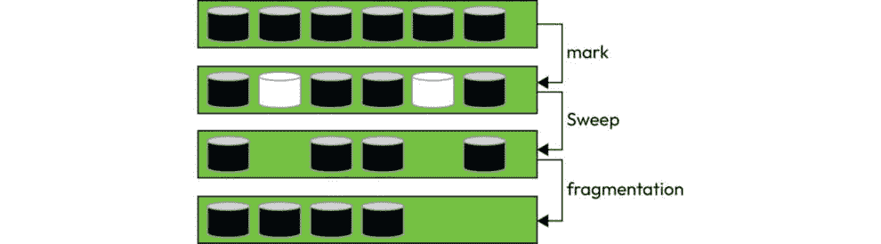
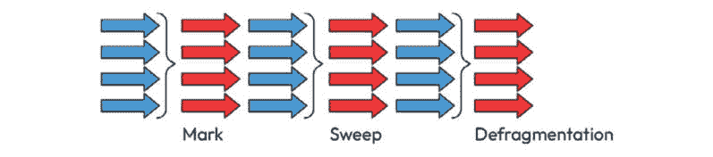
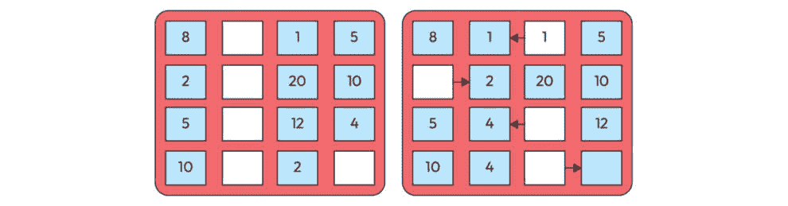
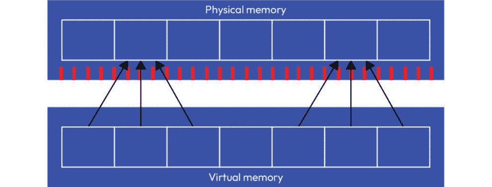

# 第六章：垃圾回收与内存分析

在 Java 虚拟机（JVM）内部的复杂舞蹈中，其中字节码被编译，程序在寄存器内存的范围内执行，一个不可或缺的方面是内存资源的巧妙编排艺术。在穿越字节码编译和程序执行的领域之后，深入 JVM 内存管理的微妙领域变得至关重要。本章将全面探索垃圾收集器（GC），揭示管理 Java 程序生存的复杂织锦。

我们对 JVM 内部运作的旅程达到一个关键转折点，当我们揭开内存分配、堆结构和至关重要的垃圾收集机制的奥秘。通过理解内存管理的微妙之处，包括堆和栈之间的区别，并掌握垃圾收集的复杂性，你将增强对 JVM 内部的理解，并获得精确控制内存使用的技能。加入我们，我们将导航 GC 的复杂地形，解锁优化 Java 应用程序内存效率的钥匙。

在本章中，我们将探讨以下主题：

+   垃圾回收概述

+   JVM 调优与人体工程学

# 垃圾回收概述

在 JVM 内部的复杂景观中，GC 的作用作为一个关键组件，影响着 Java 应用程序的效率和可靠性。我们的探索深入到垃圾收集的基本概念及其在 JVM 内存管理中的关键作用。

GC 的核心目的是自动回收程序不再使用的对象所占据的内存。在像 Java 这样的采用自动内存管理的语言中，开发者免去了显式释放内存的负担，提高了生产效率并减少了内存相关错误的可能性。

想象一下这样一个场景：每个动态分配的对象都必须由程序员手动释放。这不仅引入了相当大的认知负担，而且还为内存泄漏和低效打开了大门。在没有 GC 的情况下，内存管理的责任完全落在开发者的肩上，增加了出现错误的可能性并阻碍了开发过程。

Java 以其“一次编写，到处运行”的哲学，利用垃圾回收提供无缝且健壮的内存管理系统。JVM 的 GC 识别并回收不可达的对象，防止内存泄漏并确保最佳资源利用。Java 的方法允许开发者专注于应用程序逻辑，而不是微观管理内存，这有助于该语言在企业级应用中的普及。

虽然 Java 通过其 GC 推崇自动内存管理，但其他编程语言已经采用了各种内存管理策略。例如，C 和 C++等语言通常依赖于手动内存管理，这赋予开发者显式控制权，但也使他们容易受到潜在陷阱的影响。相反，Python 和 C#等语言实现了自己的垃圾回收机制，每个机制都精心设计以解决各自语言独特的需求。

即使在具有垃圾回收机制的语言中，实现方式也可能存在显著差异。Java 的 GC 以其代际方法而闻名，将堆分为不同的代（年轻代和旧代）并对每一代应用不同的收集算法。在 JVM 内部，存在多个 GC，每个都有其策略和权衡。这与例如 Python 的引用计数机制或 Go 或 C#等语言中使用的 GC 形成对比。

内存泄漏通常源于编程错误，例如未能释放动态分配的内存或无意中维持对象在其有用生命周期之后的引用。常见场景包括在需要手动内存管理的语言（如 C 或 C++）中忘记释放内存，或在具有自动内存管理的语言（如 Java）中无意创建循环引用。

GC 在减轻采用自动内存管理语言中的内存泄漏风险方面发挥着关键作用。其主要功能是识别并回收程序不再可达或使用的对象占用的内存。通过自动化内存释放过程，GC 显著降低了内存泄漏的可能性。

在自动内存管理中，GC 充当一名警觉的防御者，关键地减轻了内存泄漏的风险。在 Java 等语言中自动化识别和回收未使用内存简化了开发过程并增强了系统稳定性。通过代际方法快速处理短生命周期对象和智能内存管理适应动态应用程序，GC 成为加强软件完整性对抗内存泄漏微妙威胁的关键章节：

+   **自动内存管理**：在 Java 等自动内存管理至关重要的语言中，GC 定期扫描堆以识别没有可达引用的对象。一旦识别，这些无引用对象就会被标记为收集并释放，为新分配腾出内存。

+   **代际方法**：Java 的 GC 通常采用代际方法，根据对象的年龄将对象分类到不同的代。年轻对象，它们很快就会变得不可达，被收集得更频繁，而旧对象则经历较少、更全面的垃圾回收。这有助于快速识别和收集短生命周期对象，减少内存泄漏的可能性。

+   **智能内存管理**：现代 GC 被设计成智能和自适应的。它们利用算法和启发式方法根据应用程序的行为优化内存管理。这种适应性确保了高效的垃圾回收，并最小化了内存泄漏的风险，即使在复杂和动态的应用程序中也是如此。

在 JVM 内部的复杂结构中，*标记-清除*垃圾回收（GC）算法成为管理内存效率的基石。这个基本过程分为两个关键阶段：标记阶段，其中 GC 确定内存的使用状态，将对象标记为可达或不可达，以及随后的清除阶段，其中收集器通过回收被标记为不可达的对象所占用的内存来释放堆空间。这种方法的优势是深远的，提供了自动内存管理，减轻了悬垂指针问题，并且对内存泄漏管理做出了重大贡献，如下面的图所示：

图 6.1：GC 的标记-清除步骤

当我们深入研究标记-清除的细微差别时，我们探讨了这种自动内存管理范式固有的优势和挑战。虽然它使开发者免于手动内存处理的复杂性，但它引入了诸如增加 CPU 功耗和放弃对象清理调度控制等考虑因素。加入我们探索 JVM 内部的精髓，在那里，标记-清除算法在塑造 Java 应用程序的可靠性和效率方面发挥着关键作用。

在我们的探索中，我们发现了标记-清除的自动过程：它能够轻松处理内存分配和释放，它在减轻悬垂指针方面的作用，以及它在管理内存泄漏方面的重大贡献。

然而，没有哪个建筑奇迹是不需要权衡的。在标记-清除（Mark and Sweep）的情况下，一个突出的考虑因素以内存碎片化的形式出现。当我们揭开这个方面时，我们深入探讨了算法在回收内存方面的熟练程度，但同时也可能在内存空间中留下碎片化的区域。这些碎片，就像散落的拼图碎片一样，给连续内存块的高效分配带来了挑战，从而影响了应用程序的整体效率。

到目前为止，我们的叙述已经阐明了自动内存管理的优势与潜在缺点之间的微妙平衡，强调了需要一种细致入微的方法。无缝自动化与碎片化幽灵之间的权衡促使开发者权衡其应用程序的效率要求与好处。

在 JVM 内部错综复杂的领域中，GC 的选择可以深刻影响 Java 应用程序的性能。**Serial GC**，一个简单且单线程的收集器，适合对内存要求适中的应用程序，提供了一种直接的垃圾回收方法。相反，**Parallel GC** 在吞吐量优先的场景中发挥作用，利用多个线程加速垃圾回收任务，提高整体系统效率。自 Java 9 版本以来，Java 的默认收集器 **Garbage-First (G1) GC** 在低延迟和高吞吐量之间取得平衡，成为各种应用程序的多功能选择。Java 11 中引入的新范式 **Z GC**（**ZGC**）承诺最小暂停时间并增强可伸缩性，满足现代资源密集型应用程序的需求。随着我们踏上探索每个收集器复杂性的旅程，细微的理解将赋予开发者做出明智决策的能力，优化垃圾回收策略以符合他们 Java 项目的特定需求。

## Serial GC

在 JVM 内部的织锦中，Serial GC 是垃圾收集策略中的基本参与者。我们将剖析 Serial GC 的本质，这是一个以其简单性和单线程内存管理方法而区别的收集器。随着我们深入其操作的复杂性，我们将探讨为什么这种简单的设计是必要的，以及 Serial GC 发光的应用场景。揭示其优势和局限性，我们将在理解这种最小化收集器成为 Java 开发者战略选择的最佳场景中导航。我们将探索 Serial GC，其中对简单性的追求与 JVM 内部内存编排中的效率交织在一起。

Serial GC 以其顺序的、**停止世界的**垃圾回收方法为特征。在收集过程中，它暂停应用程序的执行，确保没有并行线程干扰识别和回收不可达对象。这种简单性使得 Serial GC 能够简化内存管理，无需并发操作的复杂性。

Serial GC 的优雅之处伴随着权衡，尤其是在吞吐量和响应性方面。鉴于其单线程特性，对于大堆或需要低暂停时间的应用程序，可能存在更有效的选择。虽然停止世界的暂停时间很短，但可能会影响用户体验，使得 Serial GC 更适合这些暂停可接受的场景。

Serial GC 与标记和清除算法无缝集成。在标记阶段，它识别可达和不可达对象，并相应地进行标记。在随后的清除阶段，它清除不可达对象占用的内存。Serial GC 的顺序性质确保了这些阶段的直接执行，简化了标记和清除之间的协调，如下面的图示所示：

图 6.2：Serial GC 工作原理

Serial GC 的简单性在内存占用适中且应用程序性能对短暂暂停不敏感的场景中表现得尤为出色。它非常适合客户端应用程序或资源有限的环境，其中直接的停止世界方法与系统的需求无缝对接。

在我们沉浸在 JVM 内存配置中时，Serial GC 的配置选项展现了一个关键方面。以下表格展示了一系列和谐的命令，每个命令都拥有影响和优化 Serial GC 行为的力量。从启用或禁用 Serial GC 的使用到微调比例、大小和阈值，这些命令提供了一根指挥棒，以塑造内存管理交响乐。加入我们，解读每个命令的意义，为开发人员和管理员提供调整 Serial GC 工作参数的方法，从而通过调整参数来优化 Java 应用程序的性能：

| **命令** | **描述** |
| --- | --- |
| `-``XX:+UseSerialGC` | 启用 Serial GC。 |
| `-``XX:-UseSerialGC` | 禁用 Serial GC（服务器级机器的默认设置）。 |
| `-``XX:NewRatio=<value>` | 设置年轻代与旧代的比例。 |
| `-``XX:NewSize=<size>` | 设置年轻代的初始大小。 |
| `-``XX:MaxNewSize=<size>` | 设置年轻代的最大大小。 |
| `-``XX:SurvivorRatio=<value>` | 设置 Eden 空间与幸存空间的比例。 |
| `-``XX:MaxTenuringThreshold=<value>` | 设置年轻代对象的最大存活阈值。 |
| `-``XX:TargetSurvivorRatio=<value>` | 设置期望的幸存空间大小为年轻代大小的百分比。 |
| `-``XX:PretenureSizeThreshold=<size>` | 设置旧生代对象分配的阈值。大于此大小的对象将直接进入旧生代。 |
| `-``XX:MaxHeapSize=<size>` | 设置最大堆大小。 |

表 6.1：Serial GC 命令

这些选项允许开发人员和管理员配置 Serial GC 的各个方面，如年轻代的大小、幸存空间的比例以及整体堆大小。调整这些参数可以针对特定应用程序的要求和硬件特性进行内存管理的微调。

Serial GC 协调内存管理的和谐配合，揭示了其优势、权衡以及 Serial GC 独特方法在特定场景中表现卓越的战略。随着我们过渡到下一节，我们将深入探讨 Parallel GC，并行线程的演变承诺了对规模效率和吞吐量提升的探索。

## 并行 GC

随着我们开始探索 JVM 内部的下一部分，聚光灯现在转向了并行 GC。在本节中，我们深入到并行性的世界，其中内存管理的效率成为焦点。并行 GC 凭借其多线程能力，编排了一场垃圾回收的交响乐，为 Java 应用程序提供了增强的吞吐量和优化的性能。通过细微的视角，我们揭示了并行 GC 的复杂性——其特征、优点以及其并行线程如何与大规模、数据密集型环境的需求无缝协调的场景。加入我们，在本节中，我们将穿越 JVM 内部的并行节奏，揭示推动内存管理达到新高度的并行线程。

并行垃圾回收（Parallel GC）的标志是其多线程方法，这使得它在处理更大的堆和与单线程版本相比实现更高的吞吐量方面特别擅长。它将堆划分为部分，使用并行线程同时执行垃圾回收任务，从而实现更快的执行速度和减少的暂停时间。

并行 GC 在 JVM 内部协调了一场高效的同步舞蹈，无缝地与标记和清除算法集成。在复杂的垃圾回收过程中，并行 GC 利用多线程的力量同时执行标记和清除的关键步骤。在标记阶段，每个线程遍历指定的堆部分，识别并标记对象为可达或不可达。这种跨线程的同步标记确保了对内存空间的快速并行评估。当标记阶段结束时，线程的集体努力在清除阶段和谐地统一，此时并行 GC 通过丢弃在标记阶段识别出的不可达对象来有效地回收内存。在并行 GC 下的标记和清除过程中的并行性优化了吞吐量。它展示了多个线程协同工作以编排一场在内存管理中优雅平衡响应性和效率的性能的同步智慧，如下面的图所示：

图 6.3：并行 GC 工作原理

虽然并行 GC 在吞吐量方面表现出色，但其对并行性的依赖引入了权衡，特别是在响应性方面。虽然停止世界的暂停时间已经最小化，但仍可能影响应用程序的响应性，使其在低延迟至关重要的场景中不太适用。此外，由于并行性导致的 CPU 使用增加，在资源受限的环境中可能需要考虑。

并行垃圾回收在大型堆和数据密集型应用是常态的场景中最为出色。它非常适合批处理、科学计算以及最大化吞吐量至关重要的场景。然而，它的权衡使其成为可以承受短暂暂停以换取优化整体性能的应用的战略选择。

随着我们揭开并行垃圾回收的复杂性，我们探索了其并行线程如何编排平衡大规模内存管理需求的表现。加入我们在这个部分，我们将导航并行垃圾回收的景观，了解何时其并行能力成为优化 JVM 内部内存编排的战略选择。

在我们探索 JVM 内部细节中的并行垃圾回收时，精细调整其行为变得至关重要。下表提供了一个全面的命令集合，每个命令都是解锁并行垃圾回收效率和吞吐量潜力的关键。从开启或关闭其使用，到配置线程数，设置暂停时间目标，以及采用自适应大小策略，这些选项使开发人员和管理员能够塑造 JVM 内部的内存管理编排。随着我们深入到每个命令的细微差别，这个集合成为了一位指挥家的指南，使我们能够打造出针对 Java 应用独特需求进行优化的性能。加入我们，解读这些命令的重要性，为塑造与 JVM 环境多样化的景观无缝融合的并行垃圾回收提供可能性：

| **命令** | **描述** |
| --- | --- |
| `-``XX:+UseParallelGC` | 启用并行垃圾回收的使用。 |
| `-``XX:-UseParallelGC` | 禁用并行垃圾回收。 |
| `-``XX:ParallelGCThreads=<value>` | 设置垃圾回收的线程数。 |
| `-``XX:MaxGCPauseMillis=<value>` | 设置垃圾回收的最大期望暂停时间目标。 |
| `-``XX:GCTimeRatio=<value>` | 设置垃圾回收时间与应用时间的目标比率。 |
| `-``XX:UseAdaptiveSizePolicy` | 启用堆和幸存空间的自适应大小策略。 |
| `-``XX:AdaptiveSizeThroughPutPolicy` | 配置面向吞吐量的垃圾回收的自适应大小策略。 |
| `-``XX:AdaptiveSizePolicyOutputInterval=<n>` | 设置自适应大小策略输出的间隔，以收集次数计。 |
| `-``XX:ParallelGCVerbose` | 启用并行垃圾回收的详细输出。 |

表 6.2：并行垃圾回收命令

这些选项提供了一种配置和微调并行垃圾回收行为的方法，使开发人员和管理员能够针对特定的应用需求和硬件特性优化垃圾回收。 

随着我们对并行 GC 世界的探索告一段落，我们发现自己在并行线程如何协调 JVM 内部的和谐性能方面获得了丰富的见解。并行 GC 的多线程效率，通过其配置选项展示出来，为寻求在多种 JVM 环境中优化内存管理的开发人员和管理员提供了一个强大的工具包。我们穿越并行节奏的旅程为下一幕——G1 GC 做好了准备。在接下来的部分，我们将深入探讨 G1 的细微之处，揭示其特性、优势和复杂性，使其成为 JVM 内部垃圾收集策略交响乐中的关键角色。加入我们，一起探索垃圾收集策略的演变，剖析支撑 G1 的原则，并揭示它为 JVM 内部动态景观带来的交响效率。

## G1

随着我们继续探索 JVM 内部，我们的焦点现在转向 G1 GC。作为其前辈的现代继承者，G1 在垃圾收集策略上引入了一种范式转变。在本节中，我们深入探讨 G1 的复杂性，揭示其特性、操作细微差别以及它为内存管理带来的创新方法。G1 对实现低延迟、可预测的暂停时间和高效堆利用的细致关注，使其成为 JVM 内部垃圾收集交响乐中的关键参与者。加入我们，在本节中我们将探索垃圾收集策略的演变，剖析支撑 G1 的原则，并揭示它为 JVM 内部动态景观带来的交响效率。

G1 GC 设计用来解决传统垃圾收集策略带来的挑战。它引入了一种基于区域的方法，将 Java 堆划分为更小、均匀大小的区域。这种对单一堆结构的偏离使得 G1 能够更灵活、更精确地管理内存。

G1 将堆划分为区域，并将它们分为三种主要类型：伊甸园（Eden）、幸存者（survivor）和旧（old）。这些区域的大小和配置是动态的，允许 G1 适应应用程序的内存需求。

活动空间的概念是 G1 效率的核心。活动空间包括包含活动对象的区域——这些对象仍然被应用程序积极引用。G1 识别并优先处理活数据最少的区域进行垃圾收集。这种战略方法通过针对可回收内存最集中的区域来优化收集过程，减少了垃圾收集暂停的频率和持续时间，如下面的图示所示：

图 6.4：G1 过程和活动空间工作原理

G1 的主要目标是实现低延迟和可预测的暂停时间。通过优先处理活数据最少的区域，G1 最小化了其对应用程序响应性的影响。这使得 G1 特别适合那些需要保持一致且低暂停时间的场景，例如交互式和实时应用程序。

G1 采用自适应收集策略，根据应用程序的动态行为调整其方法。它可以动态调整区域大小，改变垃圾回收频率，并适应应用程序不断变化的需求。

从本质上讲，G1 GC 对存活空间的利用，以及其基于区域的方法，使其成为现代 Java 应用程序内存管理的复杂和高效解决方案。对可预测性和适应性的关注使 G1 在 JVM 内垃圾回收策略的领域中变得有价值。

在我们穿越 JVM 内存编排之旅中，以下表格展开为 G1 的指挥家指南。这个组合中的每个命令都提供了一把开启 G1 垃圾回收器精确性和效率之门的钥匙。从开启或关闭 G1 到微调堆区域大小、暂停时间目标和自适应策略等参数，这些选项赋予了开发人员和管理员塑造 JVM 内部内存管理交响乐的能力。随着我们深入到每个命令的重要性，我们探索定义 G1 性能的复杂性，在可预测性和适应性之间寻求平衡。加入我们，解读这个配置交响乐，其中每个音符都与 G1 引入 JVM 内部动态景观的细微精确性产生共鸣：

| **命令** | **描述** |
| --- | --- |
| `-``XX:+UseG1GC` | 启用 G1 垃圾回收器的使用。 |
| `-``XX:-UseG1GC` | 禁用 G1 垃圾回收器。 |
| `-``XX:G1HeapRegionSize=<value>` | 设置 G1 垃圾回收区域的大小。 |
| `-``XX:MaxGCPauseMillis=<value>` | 设置 G1 垃圾回收的最大期望暂停时间目标。 |
| `-``XX:InitiatingHeapOccupancyPercent=<value>` | 设置启动 G1 垃圾回收周期时的堆占用百分比。 |
| `-``XX:G1NewSizePercent=<value>` | 设置 G1 中年轻代的最小堆大小百分比。 |
| `-``XX:G1MaxNewSizePercent=<value>` | 设置 G1 中年轻代的最大堆大小百分比。 |
| `-``XX:ParallelGCThreads=<value>` | 设置 G1 的并行垃圾回收线程数。 |
| `-``XX:ConcGCThreads=<value>` | 设置 G1 并行阶段的并行垃圾回收线程数。 |
| `-``XX:G1ReservePercent=<value>` | 设置为未来垃圾回收周期预留的堆目标百分比。 |
| `-``XX:G1TargetSurvivorOccupancy=<value>` | 设置每个 G1 区域中幸存空间的占用目标。 |
| `-``XX:G1HeapWastePercent=<value>` | 设置在区域被视为回收之前，G1 区域内浪费空间的目标百分比。 |

表 6.3：G1 命令

这些选项提供了一种配置和微调 G1 GC 行为的方法，允许开发人员和管理员针对特定的应用需求和硬件特性优化垃圾回收。

在我们探索 G1 GC 的复杂性时，我们获得了关于其精确性和适应性的洞察，这些特性定义了其在 JVM 内存管理中的交响乐。我们指南中提供的细致配置选项提供了一根指挥棒，塑造 G1 的性能，使其与 Java 应用的多样化需求无缝对接。当我们着眼于下一节时，舞台已经准备好，我们将揭示 ZGC 的创新细微差别。

## ZGC

在我们持续探索 JVM 内部结构的过程中，我们的焦点转向了创新的前沿，通过引入 ZGC。作为垃圾回收策略中的变革者，ZGC 成为效率与低延迟性能的灯塔。本节作为我们进入 ZGC 世界的门户，揭示其尖端特性、自适应技术和最小化暂停时间的承诺。以响应性为核心，ZGC 重新定义了垃圾回收的动态，为现代动态应用提供定制解决方案。请与本节一起深入探讨 ZGC 为 JVM 带来的革命性进步，标志着垃圾回收策略演变中的关键里程碑。

ZGC 位于现代垃圾回收策略的前沿，引入了开创性的特性，重新定义了 JVM 内存管理中的动态。在其核心，ZGC 优先考虑低延迟和响应性，旨在最小化对性能要求严格的应用的暂停时间。ZGC 的关键创新之一是其并发垃圾回收方法。与传统在特定阶段停止应用的垃圾回收器不同，ZGC 与应用线程并发执行主要的垃圾回收任务，确保暂停时间保持在最低。这种并发模型对于响应性至关重要的应用特别有利，例如实时系统、交互式应用或必须最小化停机时间的服务。

在计算机内存中，多映射是指一种技术，其中虚拟内存空间中的特定地址指向物理内存中的相同地址。这意味着多个虚拟地址对应于相同的物理位置。应用通过虚拟内存与数据交互，并且对底层的多映射机制一无所知。这种抽象对于应用至关重要，它允许它们在不了解将虚拟映射到物理内存的复杂性情况下访问数据，如下面的图所示：

图 6.5：ZGC 进程映射

动态内存分配是编程中的常见做法，随着时间的推移会导致内存碎片。当对象被分配和释放时，内存布局中可能会出现空闲空间间隙。随着时间的推移，这些间隙会积累，导致**碎片化**，内存看起来像棋盘，交替出现空闲和使用的区域。为了解决这个问题，主要有两种策略。

一种方法是在内存中扫描足够大的空闲空间以容纳所需的对象。虽然这种方法是可行的，但资源消耗较大，尤其是如果频繁执行。此外，它并不能完全消除碎片，因为找到所需空间大小的精确匹配可能具有挑战性，这会在对象之间留下间隙。

另一种策略是定期将对象从碎片化的内存区域重新定位到更紧凑的空闲空间中。这涉及到将内存空间划分为块，并同时重新定位整个对象块。通过这样做，内存分配变得更快，因为已知的空块是可用的。这种策略有助于更有效地管理内存碎片，平衡动态分配的需求和对更连续、更有序的内存布局的渴望。

任何垃圾回收策略都存在权衡，ZGC 也不例外。虽然它在减少暂停时间方面表现出色，但它可能无法达到那些以牺牲延迟为代价优化吞吐量的收集器的相同吞吐量。此外，ZGC 可能不是具有极大规模堆的应用程序的最佳选择，因为其并发方法可能会引入一些开销。然而，在低延迟至关重要且应用程序的响应性比最大吞吐量更重要的场景中，ZGC 成为一个强大的解决方案。

ZGC 的另一个显著特点是它能够动态调整堆的大小。ZGC 会根据应用程序的需求调整堆的大小，使其能够高效地响应不断变化的工作负载。这种适应性在负载变化的环境中尤其有益，提供了一个灵活且响应迅速的内存管理解决方案。

从本质上讲，ZGC 代表了垃圾回收领域的一次范式转变，为需要低延迟和响应性的应用程序提供了一个复杂的解决方案，而不会牺牲内存管理效率。其创新特性和并发设计使其成为在动态和资源密集型场景下运行的现代 Java 应用程序的一个有吸引力的选择。

在 JVM 内部动态领域，ZGC 作为一项前沿解决方案，占据中心舞台，优先考虑低延迟性能和响应性。此表作为导航 ZGC 配置景观的指南，为开发人员和管理员提供了一系列精心挑选的命令，以塑造其行为。从开启或关闭 ZGC 到微调暂停时间、线程数和内存释放策略等参数，这些选项赋予用户根据其 Java 应用程序的具体需求定制 ZGC 的能力。随着我们深入探讨每个命令的重要性，本指南成为优化 ZGC 性能的必备资源，确保在效率与适应性之间达到和谐平衡。加入我们，一起发掘 ZGC 的潜力，每个命令都成为定义 JVM 内垃圾收集策略未来的精确交响乐中的音符：

| **命令** | **描述** |
| --- | --- |
| `-``XX:+UseZGC` | 启用 ZGC 的使用。 |
| `-``XX:-UseZGC` | 禁用 ZGC。 |
| `-``XX:MaxGCPauseMillis=<value>` | 设置 ZGC 垃圾收集的最大期望暂停时间目标。 |
| `-``XX:GCPauseIntervalMillis=<value>` | 设置 ZGC 暂停之间的最大间隔。 |
| `-``XX:ConcGCThreads=<value>` | 设置 ZGC 的并行垃圾回收线程数。 |
| `-``XX:ParallelGCThreads=<value>` | 设置 ZGC 并行阶段的并行垃圾回收线程数。 |
| `-``XX:ConcGCThreads=<value>` | 设置 ZGC 并发阶段的并行垃圾回收线程数。 |
| `-``XX:ZUncommitDelay=<value>` | 设置在区域不再需要后释放内存的延迟。 |
| `-``XX:ZUncommitDelayMax=<value>` | 设置在区域不再需要后释放内存的最大延迟。 |
| `-``XX:ZUncommitDelayPolicy=<adaptive\&#124;fixed>` | 设置 ZGC 的释放延迟策略。选项包括**自适应**和**固定**。 |
| `-``XX:SoftMaxHeap=<value>` | 设置 ZGC 的软最大堆大小。 |
| `-``XX:ZHeapSize=<value>` | 设置 ZGC 堆大小。 |

表 6.4：ZGC 命令

这些选项提供了一种配置和微调 ZGC 行为的方法，允许开发人员和管理员针对特定的应用程序需求和硬件特性优化垃圾收集。 |

在我们结束对 ZGC 复杂性的探索时，我们发现自己沉浸在精确性能和低延迟响应性的世界中。这里提供的 ZGC 命令表作为指南，解锁了用户微调和优化 ZGC 以适应其 Java 应用程序的潜力。本节为理解 ZGC 如何重塑垃圾收集策略的格局奠定了基础。

我们的旅程并未在此结束，而是优雅地过渡到下一幕——人体工程学和调优。在接下来的章节中，我们将深入探讨优化 Java 应用程序的艺术，探讨调整 JVM 性能的策略，以满足不同工作负载的细微需求。随着我们探索 JVM 调优的领域，每一次调整都成为构建最佳 Java 应用程序性能画布上的笔触。

# JVM 调优和人体工程学

在 Java 应用程序开发的动态环境中，人体工程学和剖析成为实现最佳性能的关键要素。本节标志着我们进入 Java 应用程序微调的旅程，探讨人体工程学的原则，以自动适应不同的工作负载。同时，我们深入研究剖析，这是一种强大的工具，可以深入了解应用程序的运行时行为。随着我们探索优化 Java 性能的细微差别，人体工程学和剖析成为我们的指南，提供策略来塑造应用程序以实现响应性和效率。在本节中，随着我们揭示自适应调优和洞察力剖析之间的协同作用，我们将解锁提升 Java 应用程序性能和响应能力的新潜力。

在 Java 的背景下，人体工程学指的是 JVM 内嵌的自适应调优能力，可以根据底层硬件和应用行为自动调整其配置。人体工程学的主要目标是提高 Java 应用程序的性能和响应性，而无需开发者的手动干预。通过动态调整垃圾收集算法、堆大小和线程计数等参数，人体工程学旨在为给定的运行时环境实现最佳平衡。

然而，人体工程学设定的默认配置通常被认为是一种过早优化。这是因为默认设置是在 JVM 启动时确定的，依赖于启发式和环境假设。虽然这些默认设置可能对广泛的应用程序和硬件来说表现良好，但它们可能不是特定用例中最有效的配置。过早优化发生在 JVM 在没有足够运行时信息的情况下对应用程序行为做出假设时，可能导致性能不佳。

人体工程学可以根据系统的能力在串行 GC 和 G1 之间进行选择。串行 GC 通常是默认选择，尤其是在单处理器系统或内存有限的情况下。另一方面，当有超过两个处理器且可用内存足够（1792 MB 或更多）时，可能会选择 G1。

此外，人体工程学根据可用内存调整默认的最大堆大小。默认最大堆大小可以设置为可用内存的 50%、25%或 1/64，提供灵活性以适应不同的应用程序需求和系统限制。本质上，人体工程学充当一个智能指挥家，动态调整 JVM 配置以编排与每个运行时环境独特特性相一致的性能交响曲。

建议始终设置 GC 配置并避免使用人体工程学，源于手动配置 GC 参数可以给开发者提供对 JVM 行为的更多控制和可预测性。虽然人体工程学设置旨在根据启发式方法和运行时特性调整 JVM 配置，但这种自动化的方法可能并不总是为特定用例产生最优化性能。

当开发者手动配置 GC 时，他们可以根据应用程序的独特需求、工作负载特性和底层基础设施来定制 JVM 设置。这种手动调优允许对堆大小、线程数和垃圾回收算法等参数进行更细致的控制。

避免使用人体工程学设置在应用程序具有特定性能目标、严格的延迟要求，或者人体工程学调优生成的默认配置可能不符合应用程序最佳需求时变得尤为重要。手动调优允许开发者对 JVM 参数进行实验、分析和调整，以实现期望的性能结果。

然而，需要注意的是，虽然手动调优提供了更大的控制权，但它也要求对应用程序的行为、垃圾回收算法和 JVM 内部有深入的了解。开发者必须仔细评估其配置的影响，并定期监控应用程序的性能，以确保所选设置与不断变化的应用需求相一致。

总结来说，建议手动设置 GC 配置并避免仅依赖人体工程学设置，反映了希望对 JVM 行为有更精确控制的愿望，尤其是在对应用程序成功至关重要的定制性能优化场景中。

在布鲁诺·博尔热斯的深刻见解性演讲《在 Kubernetes 上性能调优 Java 的秘诀》中，他分享了针对在 Kubernetes 上运行的 Java 应用程序进行优化的宝贵建议。博尔热斯讨论了与不同垃圾回收算法相关的性能影响，包括串行、并行、G1 和 Z，考虑到关键因素如核心数、多线程环境、Java 堆大小、暂停时间、开销和尾延迟效应。每种垃圾回收策略都在其适用于特定场景的背景下进行了剖析。无论是应用程序从串行的简单性、并行的并行处理、G1 的适应性还是 Z 的低延迟焦点中受益，博尔热斯都提供了对选择最有效的垃圾回收方法的细微洞察。博尔热斯提出的建议为在 Kubernetes 环境中导航性能调优复杂性的 Java 开发者提供了一个全面的指南，揭示了应用程序需求与垃圾回收策略之间错综复杂的舞蹈：

|  | **串行** | **并行** | **G1** | **Z** |
| --- | --- | --- | --- | --- |
| 核心数 | 1 | +2 | +2 | +2 |
| 多线程 | 否 | 是 | 是 | 是 |
| Java 堆大小 | > 4 GB | < 4 GB | > 4 GB | > 4 GB |
| 暂停 | 是 | 是 | 是 | 是 (> 1 ms) |
| 开销 | 最小 | 最小 | 中等 | 中等 |
| 尾延迟效应 | 高 | 高 | 高 | 低 |
| 最佳适用 | 单核小型堆 | 多核小型堆。任何堆大小的批处理作业 | 中等至大型堆的响应性（请求-响应/数据库交互） | 中等至大型堆的响应性（请求-响应 |

表 6.5：比较所有垃圾回收器的各个方面

在我们探索 JVM 调优的过程中，我们深入研究了人体工程学、性能分析和自动化适应与手动精确之间的微妙平衡。人体工程学动态调整 JVM 配置以适应不同的工作负载，但建议手动配置 GC 以获得更大的控制权。随着我们接近结论，一个提炼的总结在等待着我们，它将我们在导航 JVM 调优复杂性中获得的智慧结晶化。

# 摘要

当我们结束对复杂垃圾回收世界的探索时，我们已经导航了多种策略、细微差别和配置，这些策略塑造了 JVM 内存管理领域的格局。从人体工程学的适应性到串行、并行、G1 和 ZGC 垃圾回收器的精确性，我们的旅程是一曲选择交响曲，每个选择都调校以根据不同的应用程序需求编排最佳性能。

然而，我们对 JVM 内部的探险并未就此停止。下一章在等待着，邀请我们进入 GraalVM 的前沿领域。在传统 Java 的界限之外，GraalVM 作为一个革命性的平台出现，模糊了语言之间的界限，释放了性能、多语言能力和高效执行的新可能性。随着我们深入探讨 GraalVM 的范式转变景观，加入我们，在语言交响乐和谐汇聚的地方，标志着 JVM 技术不断演变的动态进化。

# 问题

回答以下问题以测试你对本章知识的了解：

1.  JVM 调优中人体工程学的首要目标是什么？

    1.  最小化代码编译时间

    1.  根据运行时特性自动调整 JVM 配置

    1.  为所有应用程序最大化堆大小

    1.  禁用垃圾回收以增强性能

1.  哪种 GC 通常被人体工程学选为单处理器系统或内存有限时的默认选项？

    1.  序列 GC

    1.  并行 GC

    1.  G1 GC

    1.  ZGC

1.  在垃圾回收的背景下，“多映射”指的是什么？

    1.  虚拟内存地址到物理内存的多次映射

    1.  同时使用多种垃圾回收算法

    1.  垃圾回收期间的线程

    1.  同时在多个区域分配内存

1.  为什么开发者可能更喜欢手动 GC 配置而不是人体工程学？

    1.  手动调整更经济高效

    1.  人体工程学与现代 JVM 版本不兼容

    1.  开发者对性能参数有更好的控制

    1.  手动配置减少了垃圾回收的需求

1.  哪种 GC 以其对低延迟和响应性的关注而闻名，使其适合实时系统？

    1.  序列 GC

    1.  并行 GC

    1.  G1 GC

    1.  ZGC

# 答案

下面是本章问题的答案：

1.  B. 根据运行时特性自动调整 JVM 配置

1.  A. 序列 GC

1.  A. 虚拟内存地址到物理内存的多次映射

1.  C. 开发者对性能参数有更好的控制

1.  D. ZGC
