# 第二章：设置开发环境

本章重点介绍开发环境的设置和配置。如果你熟悉工具和库，可以跳过本章，继续阅读第三章，*领域驱动设计*，在那里你可以探索**领域驱动设计**（**DDD**）。

本章将涵盖以下主题：

+   NetBeans IDE 的安装和设置

+   Spring Boot 配置

+   使用 Java 9 模块的示例 REST 程序

+   构建设置

+   使用 Chrome 的 Postman 扩展进行 REST API 测试

本书将只使用开源工具和框架作为示例和代码。本书还将使用 Java 9 作为编程语言，应用程序框架将基于 Spring 框架。本书利用 Spring Boot 来开发微服务。

NetBeans 的**集成开发环境**（**IDE**）为 Java 和 JavaScript 提供最先进的支持，足以满足我们的需求。它多年来已经发生了很大的变化，并内置了对本书中使用的大多数技术的支持，如 Maven、Spring Boot 等。因此，我建议你使用 NetBeans IDE。不过，你也可以自由选择任何 IDE。

我们将使用 Spring Boot 来开发 REST 服务和微服务。在本书中选择 Spring 框架中最受欢迎的 Spring Boot 或其子集 Spring Cloud 是一个明智的选择。因此，我们不需要从零开始编写应用程序，它为大多数云应用程序中使用的技术提供了默认配置。Spring Boot 的概述在 Spring Boot 的配置部分提供。如果你是 Spring Boot 的新手，这绝对会帮助你。

我们将使用 Maven 作为我们的构建工具。与 IDE 一样，你可以使用任何你想要的构建工具，例如 Gradle 或带有 Ivy 的 Ant。我们将使用内嵌的 Jetty 作为我们的 Web 服务器，但另一个选择是使用内嵌的 Tomcat Web 服务器。我们还将使用 Chrome 的 Postman 扩展来测试我们的 REST 服务。

我们将从 Spring Boot 配置开始。如果你是 NetBeans 的新手或者在设置环境时遇到问题，可以参考以下部分。

# NetBeans IDE 的安装和设置

NetBeans IDE 是免费且开源的，拥有庞大的用户社区。您可以从它的官方网站[`netbeans.org/downloads/`](https://netbeans.org/downloads/)下载 NetBeans IDE。

在撰写本书时，NetBeans for Java 9 只能作为夜间构建版本提供（可从[`bits.netbeans.org/download/trunk/nightly/latest/`](http://bits.netbeans.org/download/trunk/nightly/latest/)下载）。如下图所示，下载所有受支持的 NetBeans 捆绑包，因为我们将使用 JavaScript：

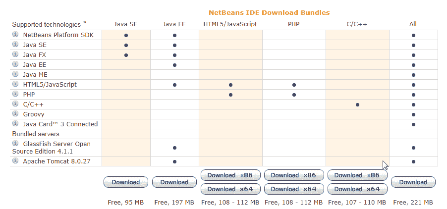

NetBeans 捆绑包

GlassFish 服务器和 Apache Tomcat 是可选的。必需的包和运行时环境标记为已安装（因为 NetBeans 已经在我的系统上安装了）：

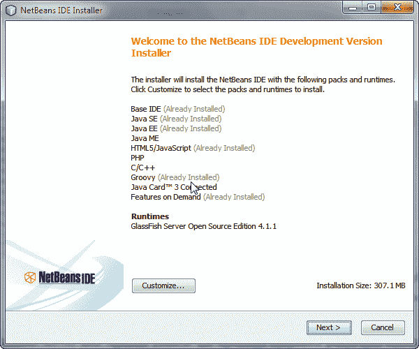

NetBeans 包装和运行时

下载安装程序后，执行安装文件。如下截图所示，接受许可协议，并按照其余步骤安装 NetBeans IDE：

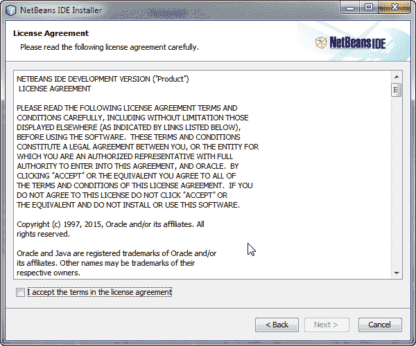

NetBeans 许可对话框

安装和运行所有 NetBeans 捆绑包需要 JDK 8 或更高版本。本书使用 Java 9，因此我们将使用 JDK 9。您可以从 [`www.oracle.com/technetwork/java/javase/downloads/index.html`](http://www.oracle.com/technetwork/java/javase/downloads/index.html) 下载独立的 JDK 9。我不得不使用 JDK 9 的早期访问构建，因为 JDK 9 写作本书时还没有发布。它可以在 [`jdk.java.net/9/`](http://jdk.java.net/9/) 找到。

安装 NetBeans IDE 后，启动 NetBeans IDE。NetBeans IDE 应该如下所示：

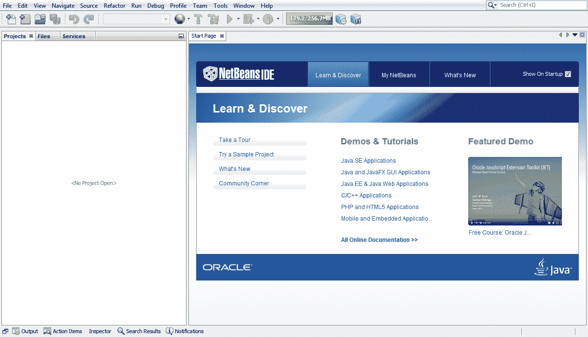

NetBeans 开始页面

Maven 和 Gradle 都是 Java 构建工具。它们为您的项目添加依赖库，编译您的代码，设置属性，构建归档，并执行许多其他相关活动。Spring Boot 或 Spring Cloud 支持 Maven 和 Gradle 构建工具。然而，在本书中，我们将使用 Maven 构建工具。如果您喜欢，请随意使用 Gradle。

Maven 已经在 NetBeans IDE 中可用。现在，我们可以开始一个新的 Maven 项目来构建我们的第一个 REST 应用程序。

创建新空 Maven 项目的步骤如下：

1.  点击文件菜单下的“新建项目”（*Ctrl* + *Shift* + *N*），它会打开新建项目向导。

1.  从“类别”列表中选择 `Maven`。然后，从“项目”列表中选择 POM 项目，如下截图所示。然后，点击下一步按钮。

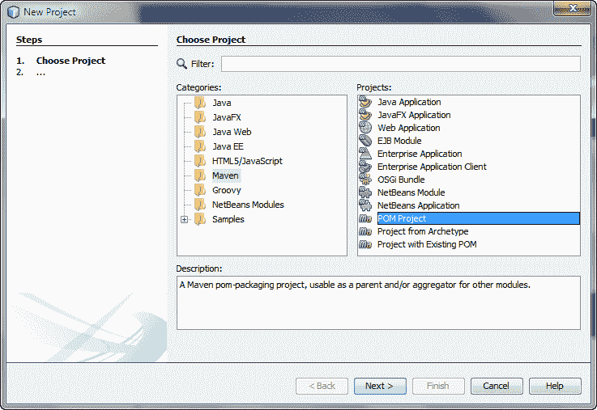

新项目向导

1.  现在，输入项目名称为 `6392_chapter2`。此外，还应输入如下截图中显示的其他属性。填写完所有必填字段后，点击“完成”：

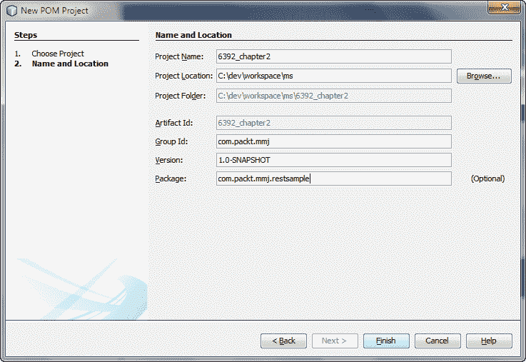

NetBeans Maven 项目属性

Aggelos Karalias 为 NetBeans IDE 开发了一个有用的插件，提供对 Spring Boot 配置属性的自动完成支持，该插件可在 [`github.com/keevosh/nb-springboot-configuration-support`](https://github.com/keevosh/nb-springboot-configuration-support) 找到。您可以从他在 [`keevosh.github.io/nb-springboot-configuration-support/`](http://keevosh.github.io/nb-springboot-configuration-support/) 的项目页面下载它。您还可以使用 Pivotal 的 Spring Tool Suite IDE ([`spring.io/tools`](https://spring.io/tools)) 代替 NetBeans IDE。它是一个定制的集成所有功能的基于 Eclipse 的分发版，使应用开发变得简单。

完成所有前面的步骤后，NetBeans 将显示一个新创建的 Maven 项目。你将使用这个项目来创建一个使用 Spring Boot 的示例 rest 应用程序。

1.  要使用 Java 9 作为源，将源/二进制格式设置为 9，如下面的屏幕截图所示：

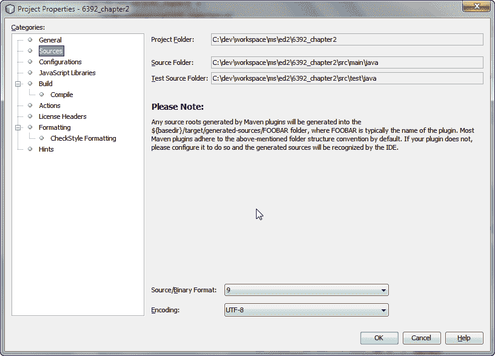

NetBeans Maven 项目属性 - 源代码

1.  前往构建 | 编译，并确保将 Java 平台设置为 JDK 9（默认）如下：

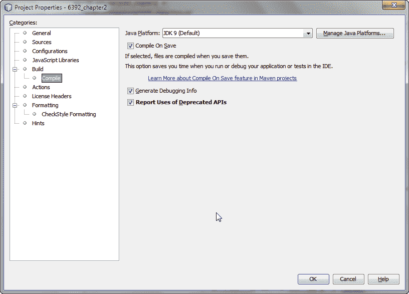

NetBeans Maven 项目属性 - 编译

1.  同样地，你可以在`Modules`文件夹中通过打开右键菜单，然后选择创建新模块的选项，添加两个名为`lib`和`rest`的新模块。这次你应该在新项目对话框框中从类别列表中选择`Maven`，并从项目列表中选择 Java 应用程序。

# Spring Boot 配置

Spring Boot 是开发特定于 Spring 的生产级别先进应用程序的明显选择。其网站（[`projects.spring.io/spring-boot/`](https://projects.spring.io/spring-boot/)）也阐述了它的真正优势：

采用了一种有见解的观点来构建生产级别的 Spring 应用程序。Spring Boot 优先考虑约定优于配置，并旨在让你尽快运行起来。

# Spring Boot 概览

**Pivotal**创建的 Spring Boot 是一个令人惊叹的 Spring 工具，并于 2014 年 4 月（GA）发布。它是基于 SPR-9888（[`jira.spring.io/browse/SPR-9888`](https://jira.spring.io/browse/SPR-9888)）的请求创建的，标题为*改进对“无容器”的 web 应用程序架构的支持*。

你可能会想知道，为什么是无容器呢？因为，今天的云环境或 PaaS 提供了基于容器 web 架构的大部分功能，如可靠性、管理或扩展。因此，Spring Boot 专注于将自己打造成一个超轻量级的容器。

Spring Boot 预先配置好了，可以非常容易地制作出生产级别的 web 应用程序。**Spring Initializr**（[`start.spring.io`](http://start.spring.io)）是一个页面，你可以选择构建工具，如 Maven 或 Gradle，以及项目元数据，如组、工件和依赖关系。一旦输入了所需字段，你只需点击生成项目按钮，就会得到你可用于生产应用程序的 Spring Boot 项目。

在这个页面上，默认的打包选项是 JAR。我们也将为我们的微服务开发使用 JAR 打包。原因非常简单：它使微服务开发更容易。想想管理并创建一个每个微服务在其自己的服务器实例上运行的基础设施有多困难。

在 Spring IOs 的一次演讲中，Josh Long 分享道：

“最好是制作 JAR，而不是 WAR。”

稍后，我们将使用 Spring Cloud，它是建立在 Spring Boot 之上的一个包装器。

我们将开发一个示例 REST 应用程序，该应用程序将使用 Java 9 模块功能。我们将创建两个模块——`lib`和`rest`。`lib`模块将为`rest`模块提供模型或任何支持类。`rest`模块将包括开发 REST 应用程序所需的所有类，并且还将消耗在`lib`模块中定义的模型类。

`lib`和`rest`模块都是`maven`模块，它们的`parent`模块是我们的主项目`6392_chapter2`。

`module-info.java`文件是一个重要的类，它管理着对其类的访问。我们将利用`requires`、`opens`和`exports`来使用`spring`模块，并在我们 REST 应用程序的`lib`和`rest`模块之间建立提供者-消费者关系。

# 将 Spring Boot 添加到我们的主项目中

我们将使用 Java 9 来开发微服务。因此，我们将使用最新的 Spring 框架和 Spring Boot 项目。在撰写本文时，Spring Boot 2.0.0 构建快照版本是可用的。

你可以使用最新发布的版本。Spring Boot 2.0.0 构建快照使用 Spring 5（5.0.0 构建快照版本）。

让我们来看看以下步骤，了解如何将 Spring Boot 添加到我们的主项目中。

1.  打开`pom.xml`文件（在`6392_chapter2` | 项目文件中可用），以将 Spring Boot 添加到您的示例项目中：

```java
<?xml version="1.0" encoding="UTF-8"?> 
<project  

         xsi:schemaLocation="http://maven.apache.org/POM/4.0.0 http://maven.apache.org/xsd/maven-4.0.0.xsd"> 
    <modelVersion>4.0.0</modelVersion> 

    <groupId>com.packtpub.mmj</groupId> 
    <artifactId>6392_chapter2</artifactId> 
    <version>1.0-SNAPSHOT</version> 
    <packaging>pom</packaging> 

    <modules> 
        <module>lib</module> 
        <module>rest</module> 
    </modules> 

    <properties> 
        <project.build.sourceEncoding>UTF-8</project.build.sourceEncoding> 
        <spring-boot-version>2.0.0.BUILD-SNAPSHOT</spring-boot-version> 
        <spring-version>5.0.0.BUILD-SNAPSHOT</spring-version> 
        <maven.compiler.source>9</maven.compiler.source> 
        <maven.compiler.target>9</maven.compiler.target> 
        <start-class>com.packtpub.mmj.rest.RestSampleApp</start-class> 
    </properties> 
    <parent> 
        <groupId>org.springframework.boot</groupId> 
        <artifactId>spring-boot-starter-parent</artifactId> 
        <version>2.0.0.BUILD-SNAPSHOT</version> 
    </parent> 
    <dependencyManagement> 
        <dependencies> 
            <dependency> 
                <groupId>com.packtpub.mmj</groupId> 
                <artifactId>rest</artifactId> 
                <version>${project.version}</version> 
            </dependency> 
            <dependency> 
                <groupId>com.packtpub.mmj</groupId> 
                <artifactId>lib</artifactId> 
                <version>${project.version}</version> 
            </dependency> 
        </dependencies> 
    </dependencyManagement> 

    <build> 
        <plugins> 
            <plugin> 
                <groupId>org.springframework.boot</groupId> 
                <artifactId>spring-boot-maven-plugin</artifactId> 
                <version>2.0.0.BUILD-SNAPSHOT</version> 
                <executions> 
                    <execution> 
                        <goals> 
                            <goal>repackage</goal> 
                        </goals> 
                        <configuration> 
                            <classifier>exec</classifier> 
                            <mainClass>${start-class}</mainClass> 
                        </configuration> 
                    </execution> 
                </executions> 
            </plugin> 
            <plugin> 
                <groupId>org.apache.maven.plugins</groupId> 
                <artifactId>maven-compiler-plugin</artifactId> 
                <version>3.6.1</version> 
                <configuration> 
                    <source>1.9</source> 
                    <target>1.9</target> 
                    <showDeprecation>true</showDeprecation> 
                    <showWarnings>true</showWarnings> 
                </configuration> 
            </plugin> 
        </plugins> 
    </build> 
    <repositories> 
        <repository> 
            <id>spring-snapshots</id> 
            <name>Spring Snapshots</name> 
            <url>https://repo.spring.io/snapshot</url> 
            <snapshots> 
                <enabled>true</enabled> 
            </snapshots> 
        </repository> 
        <repository> 
            <id>spring-milestones</id> 
            <name>Spring Milestones</name> 
            <url>https://repo.spring.io/milestone</url> 
            <snapshots> 
                <enabled>false</enabled> 
            </snapshots> 
        </repository> 
    </repositories> 

    <pluginRepositories> 
        <pluginRepository> 
            <id>spring-snapshots</id> 
            <name>Spring Snapshots</name> 
            <url>https://repo.spring.io/snapshot</url> 
            <snapshots> 
                <enabled>true</enabled> 
            </snapshots> 
        </pluginRepository> 
        <pluginRepository> 
            <id>spring-milestones</id> 
            <name>Spring Milestones</name> 
            <url>https://repo.spring.io/milestone</url> 
            <snapshots> 
                <enabled>false</enabled> 
            </snapshots> 
        </pluginRepository> 
    </pluginRepositories> 
</project> 
```

你可以观察到，我们在父项目`pom.xml`中定义了我们的两个模块`lib`和`rest`。

1.  如果你第一次添加这些依赖项，你需要通过在项目窗格中`6392_chapter2`项目的`Dependencies`文件夹下右键点击，下载依赖关系，如下面的屏幕截图所示：

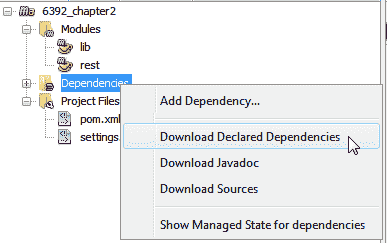

在 NetBeans 中下载 Maven 依赖项

1.  同样，为了解决项目问题，右键点击 NetBeans 项目`6392_chapter2`，选择“解决项目问题...”。它将打开如下所示的对话框。点击“解决...”按钮来解决这些问题：

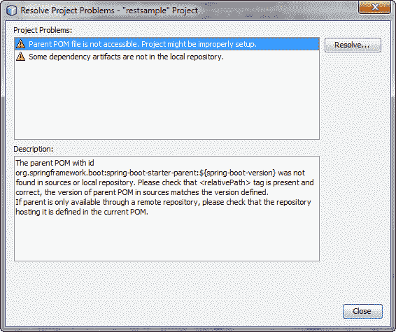

解决项目问题对话框

1.  如果你在代理后面使用 Maven，那么需要更新 Maven 主目录中的`settings.xml`中的`proxies`。如果你使用的是与 NetBeans 捆绑的 Maven，则使用`<NetBeans 安装目录>\java\maven\conf\settings.xml`。你可能需要重新启动 NetBeans IDE。

上述步骤将从远程 Maven 仓库下载所有必需的依赖项，如果声明的依赖项和传递依赖项在本地 Maven 仓库中不可用。如果你是第一次下载依赖项，那么它可能需要一些时间，这取决于你的互联网速度。

# 示例 REST 程序

我们将采用一种简单的构建独立应用程序的方法。它将所有内容打包成一个可执行的 JAR 文件，由一个`main()`方法驱动。在这个过程中，您使用 Spring 支持将 Jetty Servlet 容器作为 HTTP 运行时嵌入，而不是将其部署到外部实例。因此，我们将创建代替需要部署在外部 Web 服务器上的 war 的可执行 JAR 文件，这是`rest`模块的一部分。我们将在`lib`模块中定义领域模型和`rest`模块中相关的 API 类。

以下是`lib`和`rest`模块的`pom.xml`文件。

`lib`模块的`pom.xml`文件：

```java
<?xml version="1.0" encoding="UTF-8"?> 
<project   xsi:schemaLocation="http://maven.apache.org/POM/4.0.0 http://maven.apache.org/xsd/maven-4.0.0.xsd"> 
    <modelVersion>4.0.0</modelVersion> 
    <parent> 
        <groupId>com.packtpub.mmj</groupId> 
        <artifactId>6392_chapter2</artifactId> 
        <version>1.0-SNAPSHOT</version> 
    </parent> 
    <artifactId>lib</artifactId> 
</project> 
```

`rest`模块的`pom.xml`文件：

```java
    <modelVersion>4.0.0</modelVersion> 
    <parent> 
        <groupId>com.packtpub.mmj</groupId> 
        <artifactId>6392_chapter2</artifactId> 
        <version>1.0-SNAPSHOT</version> 
    </parent> 
    <artifactId>rest</artifactId> 
  <dependencies> 
        <dependency> 
            <groupId>com.packtpub.mmj</groupId> 
            <artifactId>lib</artifactId> 
        </dependency> 
        <dependency> 
            <groupId>org.springframework.boot</groupId> 
            <artifactId>spring-boot-starter-web</artifactId> 
    ... 
    ...  
```

在这里，`spring-boot-starter-web`依赖项用于开发独立的可执行 REST 服务。

我们将在`lib`和`rest`模块的默认包中分别添加以下`module-info.java`类。

`lib`模块的`module-info.java`文件：

```java
module com.packtpub.mmj.lib { 
    exports com.packtpub.mmj.lib.model to com.packtpub.mmj.rest; 
    opens com.packtpub.mmj.lib.model; 
} 
```

在这里，我们导出了`com.packtpub.mmj.lib.model`包到`com.packtpub.mmj.rest`，这允许`lib`模型类对`rest`模块类进行访问。

`lib`模块的`module-info.java`文件：

```java
module com.packtpub.mmj.rest { 

    requires spring.core; 
    requires spring.beans; 
    requires spring.context; 
    requires spring.aop; 
    requires spring.web; 
    requires spring.expression; 

    requires spring.boot; 
    requires spring.boot.autoconfigure; 

    requires com.packtpub.mmj.lib; 

    exports com.packtpub.mmj.rest; 
    exports com.packtpub.mmj.rest.resources; 

    opens com.packtpub.mmj.rest; 
    opens com.packtpub.mmj.rest.resources; 
} 
```

在这里，我们使用`requires`语句添加了所有必需的`spring`和`lib`包，这使得`rest`模块的类能够使用在`spring`和`lib`模块中定义的类。同时，我们导出了`com.packt.mmj.rest`和`com.packt.mmj.rest.resources`包。

现在，既然您已经准备好使用 NetBeans IDE 的 Spring Boot，您可以创建一个示例 Web 服务。您将创建一个执行简单计算并生成 JSON 结果的数学 API。

让我们讨论如何调用 REST 服务并获取响应。

该服务将处理`/calculation/sqrt`或`/calculation/power`等`GET`请求。`GET`请求应返回一个带有表示给定数字平方根的 JSON 体的`200 OK`响应。它看起来像这样：

```java
{ 
  "function": "sqrt", 
  "input": [ 
    "144" 
  ], 
  "output": [ 
    "12.0" 
  ] 
} 
```

`input`字段是平方根函数的输入参数，内容是结果的文本表示。

您可以创建一个资源表示类，使用**普通老式 Java 对象**（**POJO**）建模表示，并为输入、输出和功能数据使用字段、构造函数、设置器和获取器。由于它是一个模型，我们将在`lib`模块中创建它：

```java
package com.packtpub.mmj.lib.model; 

import java.util.List; 

public class Calculation { 

    String function; 
    private List<String> input; 
    private List<String> output; 

    public Calculation(List<String> input, List<String> output, String function) { 
        this.function = function; 
        this.input = input; 
        this.output = output; 
    } 

    public List<String> getInput() { 
        return input; 
    } 

    public void setInput(List<String> input) { 
        this.input = input; 
    } 

    public List<String> getOutput() { 
        return output; 
    } 

    public void setOutput(List<String> output) { 
        this.output = output; 
    } 

    public String getFunction() { 
        return function; 
    } 

    public void setFunction(String function) { 
        this.function = function; 
    } 

} 
```

# 编写 REST 控制器类

罗伊·菲尔丁在他的博士论文中定义并引入了**代表性状态传输**（**REST**）这个术语。REST 是一种软件架构风格，用于分布式超媒体系统，如 WWW。遵循 REST 架构属性的系统称为 RESTful。

现在，您将创建一个 REST 控制器来处理`Calculation`资源。控制器在 Spring RESTful Web 服务实现中处理 HTTP 请求。

# @RestController 注解

`@RestController`是用于在 Spring 4 中引入的`resource`类的类级别注解。它是`@Controller`和`@ResponseBody`的组合，因此，一个类返回领域对象而不是视图。

在下面的代码中，你可以看到`CalculationController`类通过返回`calculation`类的新实例处理`GET`请求`/calculation`。

我们将为`Calculation`资源实现两个 URI——平方根（`Math.sqrt()`函数）作为`/calculations/sqrt` URI，幂（`Math.pow()`函数）作为`/calculation/power` URI。

# `@RequestMapping`注解

`@RequestMapping`注解用于类级别以将`/calculation` URI 映射到`CalculationController`类，即，它确保对`/calculation`的 HTTP 请求映射到`CalculationController`类。基于使用`@RequestMapping`注解定义的路径的 URI（例如，`/calculation/sqrt/144`的后缀），它将映射到相应的函数。在这里，请求映射`/calculation/sqrt`被映射到`sqrt()`方法，`/calculation/power`被映射到`pow()`方法。

您可能还注意到我们没有定义这些方法将使用什么请求方法（`GET`/`POST`/`PUT`等）。`@RequestMapping`注解默认映射所有 HTTP 请求方法。您可以使用`RequestMapping`的 method 属性来指定方法。例如，您可以像下面这样使用`POST`方法写一个`@RequestMethod`注解：

```java
@RequestMapping(value = "/power", method = POST) 
```

为了在途中传递参数，示例展示了使用`@RequestParam`和`@PathVariable`注解的请求参数和路径参数。

# `@RequestParam`注解

`@RequestParam`负责将查询参数绑定到控制器的方法的参数。例如，`QueryParam`基底和指数分别绑定到`CalculationController`的`pow()`方法的参数`b`和`e`。由于我们没有为这两个查询参数使用任何默认值，所以`pow()`方法的这两个查询参数都是必需的。查询参数的默认值可以通过`@RequestParam`的`defaultValue`属性设置，例如，`@RequestParam(value="base", defaultValue="2")`。在这里，如果用户没有传递查询参数 base，那么默认值`2`将用于基数。

如果没有定义`defaultValue`，并且用户没有提供请求参数，那么`RestController`将返回 HTTP`status`代码`400`以及消息`Required String parameter 'base' is not present`。如果多个请求参数缺失，它总是使用第一个必需参数的引用：

```java
{ 
  "timestamp": 1464678493402, 
  "status": 400, 
  "error": "Bad Request", 
  "exception": "org.springframework.web.bind.MissingServletRequestParameterException", 
  "message": "Required String parameter 'base' is not present", 
  "path": "/calculation/power/" 
} 
```

# `@PathVariable`注解

`@PathVariable`帮助你创建动态 URI。`@PathVariable`注解允许你将 Java 参数映射到路径参数。它与`@RequestMapping`一起工作，在 URI 中创建占位符，然后使用相同的名字作为`PathVariable`或方法参数，正如你在`CalculationController`类的`sqrt()`方法中看到的。在这里，值占位符在`@RequestMapping`内部创建，相同的值分配给`@PathVariable`的值。

`sqrt()`方法在 URI 中以请求参数的形式接收参数，例如`http://localhost:8080/calculation/sqrt/144`。在这里，`144`值作为路径参数传递，这个 URL 应该返回`144`的平方根，即`12`。

为了使用基本的检查，我们使用正则表达式`"^-?+\\d+\\.?+\\d*$"`来只允许参数中的有效数字。如果传递了非数字值，相应的方法会在 JSON 的输出键中添加错误消息：

`CalculationController`还使用正则表达式`.+`在`path`变量（`path`参数）中允许数字值中的小数点（`.`）：`/path/{variable:.+}`。Spring 忽略最后一个点之后的所有内容。Spring 的默认行为将其视为文件扩展名。

还有其他选择，例如在末尾添加一个斜杠（`/path/{variable}/`），或者通过设置`useRegisteredSuffixPatternMatch`为`true`来覆盖`WebMvcConfigurerAdapter`的`configurePathMatch()`方法，使用`PathMatchConfigurer`（在 Spring 4.0.1+中可用）。

`CalculationController`资源的代码，我们实现了两个 REST 端点：

```java
package com.packtpub.mmj.rest.resources; 

import com.packtpub.mmj.lib.model.Calculation; 
import java.util.ArrayList; 
import java.util.List; 
import org.springframework.web.bind.annotation.PathVariable; 
import org.springframework.web.bind.annotation.RequestMapping; 
import static org.springframework.web.bind.annotation.RequestMethod.GET; 
import org.springframework.web.bind.annotation.RequestParam; 
import org.springframework.web.bind.annotation.RestController; 

/** 
 * 
 * @author sousharm 
 */ 
@RestController 
@RequestMapping("calculation") 
public class CalculationController { 

    private static final String PATTERN = "^-?+\\d+\\.?+\\d*$"; 

    /** 
     * 
     * @param b 
     * @param e 
     * @return 
     */ 
    @RequestMapping("/power") 
    public Calculation pow(@RequestParam(value = "base") String b, @RequestParam(value = "exponent") String e) { 
        List<String> input = new ArrayList(); 
        input.add(b); 
        input.add(e); 
        List<String> output = new ArrayList(); 
        String powValue; 
        if (b != null && e != null && b.matches(PATTERN) && e.matches(PATTERN)) { 
            powValue = String.valueOf(Math.pow(Double.valueOf(b), Double.valueOf(e))); 
        } else { 
            powValue = "Base or/and Exponent is/are not set to numeric value."; 
        } 
        output.add(powValue); 
        return new Calculation(input, output, "power"); 
    } 

    /** 
     * 
     * @param aValue 
     * @return 
     */ 
    @RequestMapping(value = "/sqrt/{value:.+}", method = GET) 
    public Calculation sqrt(@PathVariable(value = "value") String aValue) { 
        List<String> input = new ArrayList(); 
        input.add(aValue); 
        List<String> output = new ArrayList(); 
        String sqrtValue; 
        if (aValue != null && aValue.matches(PATTERN)) { 
            sqrtValue = String.valueOf(Math.sqrt(Double.valueOf(aValue))); 
        } else { 
            sqrtValue = "Input value is not set to numeric value."; 
        } 
        output.add(sqrtValue); 
        return new Calculation(input, output, "sqrt"); 
    } 
} 
```

在这里，我们只通过 URI `/calculation/power` 和 `/calculation/sqrt` 暴露了`Calculation`资源的`power`和`sqrt`函数。

在这里，我们使用`sqrt`和`power`作为 URI 的一部分，这仅是为了演示目的。理想情况下，这些应该作为`function`请求参数的值传递，或根据端点设计形成类似的内容。

这里有趣的一点是，由于 Spring 的 HTTP 消息转换器支持，`Calculation`对象会自动转换为 JSON。您不需要手动进行这种转换。如果 Jackson 2 在类路径上，Spring 的`MappingJackson2HttpMessageConverter`会将`Calculation`对象转换为 JSON。

# 制作一个可执行的示例 REST 应用程序

创建一个带有`SpringBootApplication`注解的`RestSampleApp`类。`main()`方法使用 Spring Boot 的`SpringApplication.run()`方法来启动一个应用程序。

我们将用`@SpringBootApplication`注解标记`RestSampleApp`类，这个注解隐式地添加了以下所有标签：

+   `@Configuration`注解将类标记为应用程序上下文 bean 定义的来源。

+   `@EnableAutoConfiguration`注解表明 Spring Boot 将根据类路径设置、其他 bean 和各种属性设置来添加 bean。

+   如果 Spring Boot 在类路径中找到`spring-webmvc`，则会添加`@EnableWebMvc`注解。它将应用程序视为网络应用程序并激活诸如设置`DispatcherServlet`等关键行为。

+   `@ComponentScan`注解告诉 Spring 在给定包中寻找其他组件、配置和服务：

```java
package com.packtpub.mmj.rest; 

import org.springframework.boot.SpringApplication; 
import org.springframework.boot.autoconfigure.SpringBootApplication; 

@SpringBootApplication 
public class RestSampleApp { 

    public static void main(String[] args) { 
        SpringApplication.run(RestSampleApp.class, args); 
    } 
} 
```

这个网络应用程序是 100%的纯 Java，您不必处理使用 XML 配置任何管道或基础设施的问题；相反，它使用了由 Spring Boot 简化的 Java 注解。因此，除了`pom.xml`用于 Maven 之外，没有一行 XML。甚至没有`web.xml`文件。

# 添加 Jetty 内嵌服务器

Spring Boot 默认提供 Apache Tomcat 作为内嵌应用程序容器。本书将使用 Jetty 内嵌应用程序容器代替 Apache Tomcat。因此，我们需要添加一个支持 Jetty 网络服务器的 Jetty 应用程序容器依赖项。

Jetty 还允许您使用类路径读取密钥或信任存储，也就是说，您不需要将这些存储保存在 JAR 文件之外。如果您使用带有 SSL 的 Tomcat，那么您需要直接从文件系统访问密钥库或信任库，但是您不能使用类路径来实现。结果是，您不能在 JAR 文件内读取密钥库或信任库，因为 Tomcat 要求密钥库（如果您使用的话）信任库）直接可访问文件系统。这本书完成后可能会发生变化。

这个限制不适用于 Jetty，它允许在 JAR 文件内读取密钥或信任存储。下面是模块`rest`的`pom.xml`相对部分：

```java
<dependencies> 
<dependency> 
       <groupId>org.springframework.boot</groupId> 
           <artifactId>spring-boot-starter-web</artifactId> 
           <exclusions> 
             <exclusion> 
<groupId>org.springframework.boot</groupId> 
<artifactId>spring-boot-starter-tomcat</artifactId> 
                </exclusion> 
            </exclusions> 
</dependency> 
<dependency> 
<groupId>org.springframework.boot</groupId> 
<artifactId>spring-boot-starter-jetty</artifactId> 
</dependency> 
</dependencies>
```

# 设置应用程序构建

无论`pom.xml`文件是什么，我们到目前为止使用的东西已经足够执行我们的示例 REST 服务。这个服务会把代码打包成一个 JAR 文件。为了使这个 JAR 文件可执行，我们需要选择以下选项：

+   运行 Maven 工具

+   使用 Java 命令执行

以下部分将详细介绍它们。

# 运行 Maven 工具

这个方法可能不起作用，因为 Java 9、Spring Boot 2 和 Spring Framework 5 都处于早期或快照版本。如果它不起作用，请使用使用 Java 命令的项目。

在这里，我们使用 Maven 工具执行生成的 JAR 文件，具体步骤如下：

1.  右键点击`pom.xml`文件。

1.  从弹出菜单中选择“运行 Maven | 目标...”。它会打开对话框。在目标字段中输入`spring-boot:run`。我们在代码中使用了 Spring Boot 的发布版本。然而，如果您使用快照版本，您可以勾选“更新快照”复选框。为了将来使用，在“记住为”字段中输入`spring-boot-run`。

1.  下次，您可以直接点击“运行 Maven | 目标 | `spring-boot-run`”来执行项目：

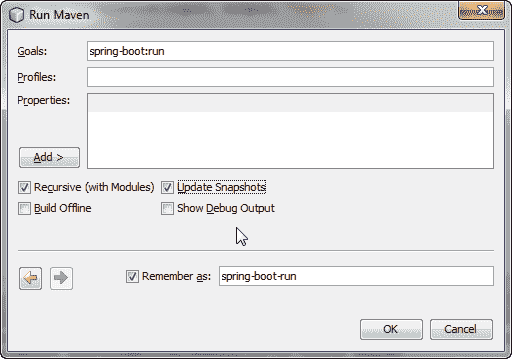

运行 Maven 对话框

1.  点击确定以执行项目。

# 使用 Java 命令执行

请确保在执行以下命令之前，Java 和`JAVA_HOME`已设置为 Java 9。

请查看以下步骤：

1.  要构建 JAR 文件，请从父项目根目录（`6392_chapter2`）的命令提示符中执行`mvn clean package`命令。在这里，`clean`和`package`是 Maven 目标：

```java
mvn clean package
```

1.  它将在相应的目标目录中创建 JAR 文件。我们将执行在`6392_chapter2\rest\target`目录中生成的 JAR 文件。可以使用以下命令执行 JAR 文件：

```java
java -jar rest\target\rest-1.0-SNAPSHOT-exec.jar
```

请确保您执行具有后缀`exec`的 JAR 文件，如前一个命令所示。

# 使用 Postman Chrome 扩展进行 REST API 测试

本书使用 Postman - REST Client Chrome 扩展来测试我们的 REST 服务。我使用的是 Postman 5.0.1 版本。您可以使用 Postman Chrome 应用程序或其他 REST 客户端来测试您的示例 REST 应用程序，如下面的屏幕截图所示：

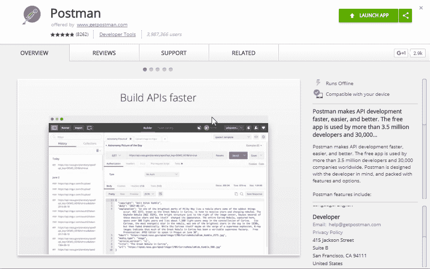

Postman - Rest Client Chrome 扩展

一旦您安装了 Postman - REST Client，让我们测试我们的第一个 REST 资源。我们从开始菜单或从快捷方式中启动 Postman - REST Client。

默认情况下，嵌入式 Web 服务器在端口`8080`上启动。因此，我们需要使用`http://localhost:8080/<资源>`URL 来访问示例 REST 应用程序。例如：`http://localhost:8080/calculation/sqrt/144`。

一旦启动，您可以在路径参数中输入`Calculation` REST URL 的`sqrt`值和`144`。您可以在以下屏幕截图中看到。此 URL 在 Postman 扩展的 URL（在此处输入请求 URL）输入字段中输入。默认情况下，请求方法是`GET`。由于我们还编写了 RESTful 服务以提供`GET`方法的请求，因此我们使用默认的请求方法。

一旦您准备好前面提到的输入数据，您就可以提交

通过点击发送按钮发送请求。您可以在以下屏幕截图中看到

响应代码`200`由您的示例 REST 服务返回。您可以在以下屏幕截图中的状态标签中找到 200 OK 代码。成功的请求

还返回了`Calculation`资源的 JSON 数据，在美化标签中显示

在屏幕截图中。返回的 JSON 显示了函数键的`sqrt`方法值。

它还显示了输入和输出列表分别为`144`和`12.0`：

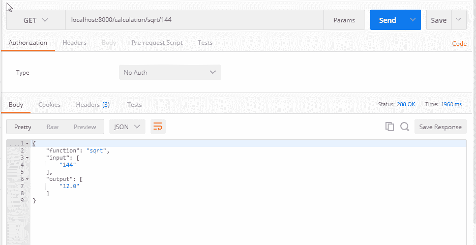

使用 Postman 测试 Calculation（sqrt）资源

同样，我们还测试了用于计算`power`函数的示例 REST 服务。在 Postman 扩展中输入以下数据：

+   **URL**: [`localhost:8080/calculation/power?base=2&exponent=4`](http://localhost:8080/calculation/power?base=2&exponent=4)

+   **请求方法**: `GET`

在这里，我们传递了请求参数`base`和`exponent`，分别值为`2`和`4`。它返回以下 JSON：

```java
{ 
    "function": "power", 
    "input": [ 
        "2", 
        "4" 
    ], 
    "output": [ 
        "16.0" 
    ] 
} 
```

它返回前面 JSON 响应状态为 200，如下所示：

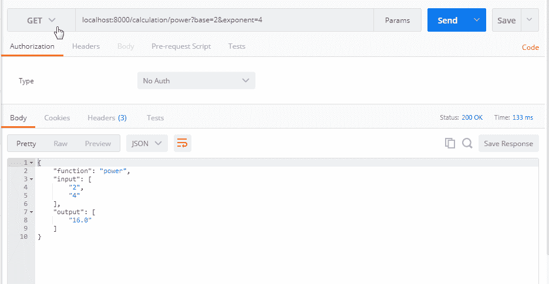

计算（`power`）资源测试使用 Postman

# 一些更多正测试场景

以下表格中的所有 URL 均以`http://localhost:8080`开头：

| URL | 输出 JSON |
| --- | --- |
| `/calculation/sqrt/12344.234` |

```java
{   
    "function":   "sqrt",   
    "input":   [   
        "12344.234"   
    ],   
    "output":   [   
        "111.1046083652699"   
    ]   
}   
```

|

| `/calculation/sqrt/-9344.34`的`Math.sqrt`函数的特殊场景：如果参数是`NaN`或小于零，则结果是`NaN` |
| --- |

```java
{   
    "function":   "sqrt",   
    "input":   [   
        "-9344.34"   
    ],   
    "output":   [   
        "NaN"   
    ]   
}   
```

|

| `/calculation/power?base=2.09&exponent=4.5` |
| --- |

```java
{   
    "function":   "power",   
    "input":   [   
        "2.09",   
        "4.5"   
    ],   
    "output":   [   
        "27.58406626826615"   
    ]   
}   
```

|

| `/calculation/power?base=-92.9&exponent=-4` |
| --- |

```java
{   
    "function":   "power",   
    "input":   [   
        "-92.9",   
        "-4"   
    ],   
    "output":   [   
        "1.3425706351762353E-8"   
    ]   
}   
```

|

# 负测试场景

同样，您也可以执行一些负场景，如下表所示。在此表中，所有 URL 均以`http://localhost:8080`开头：

| URL | 输出 JSON |
| --- | --- |
| `/calculation/power?base=2a&exponent=4` |

```java
{   
    "function":   "power",   
    "input":   [   
        "2a",   
        "4"   
    ],   
    "output":   [   
        "Base   or/and Exponent is/are not set to numeric value."   
    ]   
}   
```

|

| `/calculation/power?base=2&exponent=4b` |
| --- |

```java
{   
    "function":   "power",   
    "input":   [   
        "2",   
        "4b"   
    ],   
    "output":   [   
        "Base   or/and Exponent is/are not set to numeric value."   
    ]   
}   
```

|

| `/calculation/power?base=2.0a&exponent=a4` |
| --- |

```java
{   
    "function":   "power",   
    "input":   [   
        "2.0a",   
        "a4"   
    ],   
    "output":   [   
        "Base   or/and Exponent is/are not set to numeric value."   
    ]   
}   
```

|

| `/calculation/sqrt/144a` |
| --- |

```java
{   
    "function":   "sqrt",   
    "input":   [   
        "144a"   
    ],   
    "output":   [   
        "Input   value is not set to numeric value."   
    ]   
}   
```

|

| `/calculation/sqrt/144.33$` |
| --- |

```java
{   
    "function":   "sqrt",   
    "input":   [   
        "144.33$"   
    ],   
    "output":   [   
        "Input   value is not set to numeric value."   
    ]   
}   
```

|

# 总结

在本章中，您已经探索了设置开发环境、Maven 配置、Spring Boot 配置等方面的各种方面。

您还学习了如何使用 Spring Boot 开发一个示例 REST 服务应用程序。我们了解到 Spring Boot 有多强大——它极大地简化了开发，以至于你只需要担心实际代码，而不需要担心编写 boilerplate 代码或配置。我们还把我们代码打包成一个带有内嵌应用容器 Jetty 的 JAR 文件。它允许它运行并访问 Web 应用程序，而无需担心部署。

在下一章中，您将学习**领域驱动设计**（**DDD**）。我们使用一个可以用于其他章节的示例项目来了解 DDD。我们将使用名为**在线餐桌预订系统**（**OTRS**）的示例项目来经历微服务开发的各个阶段并了解 DDD。在完成第三章，《领域驱动设计》之后，您将了解 DDD 的基础知识。

你将理解如何实际使用 DDD 设计示例服务。你还将学习如何在它之上设计领域模型和 REST 服务。以下是一些你可以查看以了解更多关于我们在此处使用的工具的链接：

+   **Spring** **Boot**：[`projects.spring.io/spring-boot/`](http://projects.spring.io/spring-boot/)

+   **下载** **NetBeans**：[`netbeans.org/downloads`](https://netbeans.org/downloads)

+   **表示状态传输**（**REST**）：Roy Thomas Fielding 博士学位论文《架构风格与基于网络的软件体系结构设计》的第五章（[`www.ics.uci.edu/~fielding/pubs/dissertation/top.htm`](https://www.ics.uci.edu/~fielding/pubs/dissertation/top.htm)）

+   **REST**: [`en.wikipedia.org/wiki/Representational_state_transfer`](https://en.wikipedia.org/wiki/Representational_state_transfer)

+   **Maven**: [`maven.apache.org/`](https://maven.apache.org/)

+   **Gradle**: [`gradle.org/`](http://gradle.org/)
