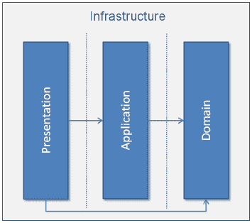
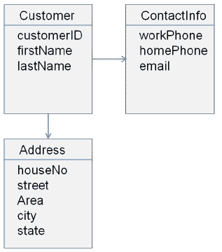
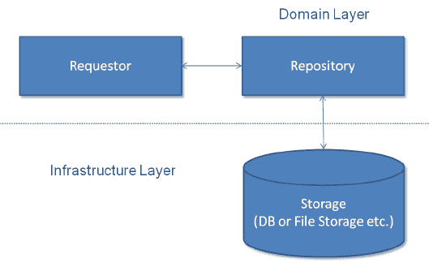
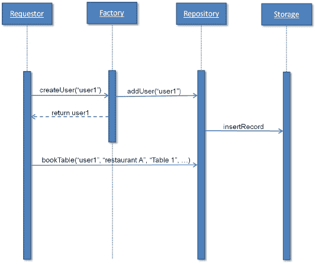
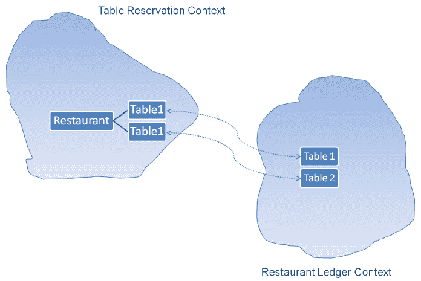
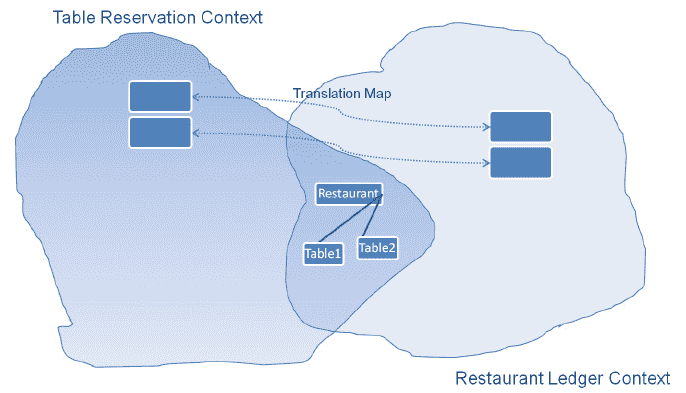

# 第三章：领域驱动设计

本章通过参考一个样本项目来为接下来的章节定调。样本项目将被用来解释不同微服务概念。本章将通过这个样本项目来驱动不同的功能和领域服务或应用程序的组合，以解释 **领域驱动设计**（**DDD**）。它将帮助你了解 DDD 的基础知识及实际应用。你还将学习使用 REST 服务设计领域模型的概念。

本章涵盖以下主题：

+   DDD 的基础知识

+   如何使用 DDD 设计应用程序

+   领域模型

+   基于 DDD 的样本领域模型设计

一个良好的软件设计对于产品或服务的成功同样重要。它与产品的功能一样重要。例如，`Amazon.com` 提供购物平台，但其架构设计使其与其他类似站点有所不同，并促成了它的成功。这显示了软件或架构设计对产品/服务成功的重要性。DDD 是软件设计实践之一，我们将通过各种理论和实际示例来探讨它。

DDD 是一个关键的设计实践，有助于设计正在开发的产品的微服务。因此，在深入微服务开发之前，我们将首先探讨 DDD。在学习本章之后，你将了解 DDD 对于微服务开发的重要性。

# 领域驱动设计基础知识

企业或云应用程序解决业务问题和其他现实世界的问题。如果没有对领域的了解，这些问题是无法解决的。例如，如果你不了解股票交易所及其运作方式，就无法为在线股票交易等金融系统提供软件解决方案。因此，具备领域知识对于解决问题是必不可少的。现在，如果你想通过软件或应用程序提供解决方案，就需要借助领域知识进行设计。当我们将领域和软件设计结合起来时，就会提供一种被称为 DDD 的软件设计方法论。

当我们开发软件来实现真实世界的场景，提供领域的功能时，我们就会创建一个领域的模型。一个**模型**是对领域的抽象或蓝图。

埃里克·埃文斯在他于 2004 年出版的书《领域驱动设计：攻克软件内在的复杂性》中创造了 DDD 这个词汇。

设计这个模型并不是火箭科学，但它确实需要大量的努力、精炼和领域专家的投入。这是软件设计师、领域专家和开发人员共同的工作。他们组织信息，将其分成更小的部分，逻辑上进行分组，并创建模块。每个模块可以单独处理，可以使用类似的方法进行划分。这个过程可以一直持续到达到单元级别，或者无法再进行划分为止。一个复杂的项目可能会有更多的此类迭代；同样，一个简单的项目可能只会有此类迭代的单个实例。

一旦模型被定义并且文档齐全，它就可以进入下一阶段——代码设计。所以，我们这里有一个**软件设计**——领域模型和代码设计，以及领域模型的代码实现。领域模型提供了一个解决方案（软件/应用程序）的高级架构，而代码实现使领域模型成为一个活生生的模型。

领域驱动设计使设计和开发工作相结合。它提供了一种连续开发软件的能力，同时根据从开发过程中收到的反馈来更新设计。它解决了敏捷和瀑布方法论所提供的限制之一，使软件可维护，包括设计和代码，并保持应用程序的最小可行性。

以设计为驱动的开发方式让开发者从项目初期就参与其中，所有软件设计师与领域专家在建模过程中讨论领域的会议都会涉及到。这种方式为开发者提供了一个理解领域的正确平台，并且提供了分享领域模型实现早期反馈的机会。它消除了在后期阶段，当各方等待可交付成果时出现的瓶颈问题。

# 领域驱动设计的基础知识

为了理解领域驱动设计，我们可以将这些三个概念广泛地归类为：

+   通用语言和统一建模语言（UML）

+   多层架构

+   工件（组件）

接下来的部分将解释通用语言和多层架构的使用和重要性。还将解释在模型驱动设计中要使用的不同工件（组件）。

# 通用语言

**通用语言**是在项目中进行沟通的共同语言。正如我们所见，设计模型是软件设计师、领域专家和开发人员的共同努力；因此，它需要一种共同的语言来进行沟通。领域驱动设计使得使用通用语言成为必要。领域模型在其图表、描述、演示、演讲和会议中使用通用语言。它消除了他们之间的误解、误解释和沟通障碍。因此，它必须包括所有图表、描述、演示、会议等——简而言之，包括所有内容。

**统一建模语言**（**UML**）在创建模型时被广泛使用并且非常受欢迎。它也存在一些局限性；例如，当你从一张纸上画出成千上万的类时，很难表示类之间的关系，同时在理解它们的抽象并从中获取意义。此外，UML 图并不能表示模型的概念以及对象应该做什么。因此，UML 总是应该与其他文档、代码或其他参考资料一起使用，以便有效沟通。

传达领域模型的其他方式包括使用文档、代码等。

# 多层架构

多层架构是 DDD 的常见解决方案。它包含四个层次：

1.  展示层或**用户界面**（**UI**）。

1.  应用层。

1.  领域层。

1.  基础设施层。



分层架构

从这里可以看出，只有**领域**层负责领域模型，其他层与 UI、应用逻辑等组件有关。这种分层架构非常重要。它将领域相关代码与其他层分开。

在这种多层架构中，每一层都包含相应的代码，它有助于实现松耦合，并避免不同层代码的混合。它还有助于产品/服务的长期可维护性和易于增强，因为如果改变仅针对相应层，则一层代码的变化不会影响其他组件。在多层架构中，每一层都可以容易地与其他实现交换。

# 展示层

这一层代表了用户界面（UI），并为交互和信息展示提供用户界面。这一层可能是一个网络应用、移动应用，或者是消耗你服务的第三方应用。

# 应用层

这一层负责应用逻辑。它维护和协调产品/服务的整体流程。它不包含业务逻辑或 UI。它可能持有应用对象的状态，如进行中的任务。例如，你的产品**REST 服务**将是这一应用层的一部分。

# 领域层

领域层是一个非常重要的层，因为它包含领域信息和业务逻辑。它持有业务对象的状态。它持久化业务对象的状态，并将这些持久化的状态传达给基础设施层。

# 基础设施层

这一层为其他所有层提供支持，负责层与层之间的通信。它包含了其他层使用的支持库。它还实现了业务对象的持久化。

为了理解不同层次之间的交互，让我们以餐厅订桌为例。最终用户通过用户界面（UI）提交订桌请求。UI 将请求传递给应用层。应用层从领域层获取餐厅、餐桌、日期等域对象。领域层从基础设施层获取这些已持久化的对象，并调用相关方法进行订桌并将其持久化回基础设施层。一旦领域对象被持久化，应用层就会向最终用户显示预订确认信息。

# 领域驱动设计工件（Artifacts of domain-driven design）

领域驱动设计中有七个不同的工具有助于表达、创建和检索领域模型：

+   实体（Entities）

+   值对象（Value objects）

+   服务（Services）

+   聚合（Aggregates）

+   仓库（Repository）

+   工厂（Factory）

+   模块（Module）

# 实体（Entities）

实体（Entities）是能够被识别并在产品/服务状态变化中保持不变的一类对象。这些对象不是通过属性来识别，而是通过其身份和持续性线索来识别。这类对象被称为**实体**。

听起来很简单，但它包含了复杂性。我们需要理解我们如何定义实体。让我们以一个订桌系统为例，其中有一个`restaurant`类，具有餐厅名称、地址、电话号码、成立日期等属性。我们可以取`restaurant`类的两个实例，它们不能通过餐厅名称来识别，因为可能有其他拥有相同名称的餐厅。同样，如果我们根据任何其他单一属性来识别，我们也找不到可以单独识别唯一餐厅的属性。如果两个餐厅具有所有相同的属性值，它们因此相同，并且可以相互替换。然而，它们并不是相同的实体，因为两者具有不同的引用（内存地址）。

相反，让我们考虑一组美国公民。每个公民都有自己的社会安全号码。这个号码不仅是唯一的，而且在其公民的一生中保持不变，并确保连续性。这个`citizen`对象将存在于内存中，将被序列化，并将从内存中移除并存储在数据库中。即使人死后，它仍然存在。只要系统存在，它就会在系统中保持。公民的社会安全号码与其表示形式无关，保持不变。

因此，在产品中创建实体意味着创建一个**身份**。现在给前例中的任何餐厅一个身份，然后使用诸如餐厅名称、成立日期和街道等属性的组合来识别它，或者添加一个标识符如`restaurant_id`来识别它。基本规则是两个标识符不能相同。因此，当我们为实体引入一个标识符时，我们需要确切知道它。

为对象创建唯一身份有多种方法，如下所述：

+   使用表中的**主键**。

+   使用领域模块生成的**自动生成 ID**。领域程序生成标识符并将其分配给在不同层次之间被持久化的对象。

+   有些现实生活中的对象本身携带**用户定义的标识符**。例如，每个国家都有它自己的国际直拨电话代码。

+   **复合键**。这是可以用于创建标识符的一组属性，正如前面所述的`restaurant`对象。

实体对于领域模型非常重要，因此，它们应该从建模过程的初始阶段开始定义。

当一个对象可以通过其标识符而不是属性来识别时，代表这些对象的类应该有一个简单的定义，并且要小心生命周期连续性和身份。务必识别具有相同属性值的此类对象。定义良好的系统应对每个对象查询返回唯一结果。设计师应确保模型定义什么是同一事物。

# 值对象

**值对象（VOs）**简化了设计。实体具有诸如身份、生命周期连续性以及不定义其身份的属性等特征。与实体相反，值对象只有属性，没有概念上的身份。最佳实践是将值对象保持为不可变对象。如果可能，实体对象也应该保持不可变。

实体概念可能会让你倾向于将所有对象都当作实体来处理，即在内存或数据库中具有生命周期连续性和唯一可识别性的对象，但每个对象必须有一个实例。现在，假设你在创建客户实体对象。每个客户对象将代表餐厅的客人，这不能用于为其他客人预订订单。如果系统中有百万客户，可能会在内存中创建数百万客户实体对象。系统中不仅存在数百万个唯一可识别的对象，而且每个对象都在被跟踪。跟踪以及创建身份都是复杂的。需要一个高度可信的系统来创建和跟踪这些对象，这不仅非常复杂，而且资源消耗大。这可能会导致系统性能下降。因此，使用值对象而不是实体对象是很重要的。接下来的几段将解释原因。

应用程序并不总是需要可追踪和可识别的客户对象。有时只需某些或所有领域元素的属性。在这些情况下，应用程序可以使用值对象。这使事情变得简单并提高了性能。

由于价值对象没有身份，所以可以很容易地创建和销毁，这简化了设计——如果没有任何其他对象引用它们，价值对象就可以被垃圾回收。

让我们讨论一下价值对象的不可变性。应该设计并编写价值对象为不可变的。一旦它们被创建，在其生命周期内不应该被修改。如果你需要不同价值的 VO，或其任何对象，那么简单地创建一个新的价值对象，但不要修改原来的价值对象。在这里，不可变性继承了**面向对象编程**（**OOP**）的所有重要性。如果一个价值对象是不可变的，那么它可以在不破坏其完整性的情况下被共享和使用。

# 常见问题解答 (FAQs)

+   价值对象可以包含另一个价值对象吗？

    是的，可以 (Yes, it can)

+   价值对象可以引用另一个价值对象或实体吗？

    是的，可以 (Yes, it can)

+   我可以用不同价值对象或实体的属性创建一个价值对象吗？

    是的，你可以 (Yes, you can)

# 服务 (Services)

在创建领域模型的过程中，你可能会遇到各种情况，其中行为可能与任何特定对象无关。这些行为可以容纳在**服务对象**中。

服务对象是领域层的一部分，没有内部状态。服务对象的唯一目的是向领域提供不属于单一实体或价值对象的行为。

通用语言能帮助你在领域建模的过程中识别不同的对象、身份或价值对象，以及它们不同的属性和行为。在创建领域模型的过程中，你可能会发现不同的行为或方法不属于任何一个特定的对象。这些行为很重要，因此不能忽视。你也不能把它们添加到实体或价值对象中。给一个对象添加不属于它的行为会破坏这个对象。要记住，这种行为可能会影响各种对象。面向对象编程的使用使得能够将行为附加到一些对象上，这被称为**服务**。

技术框架中常见服务。在 DDD 中，它们也用于领域层。服务对象没有内部状态；它的唯一目的是向领域提供行为。服务对象提供的行为不能与特定的实体或价值对象相关联。服务对象可能为一个或多个相关实体或价值对象提供一种或多种行为。在领域模型中明确定义服务是一种实践。

在创建服务时，你需要勾选以下所有要点：

+   服务对象的行为对实体和价值对象进行操作，但不属于实体或价值对象。

+   服务对象的行为状态不被维护，因此它们是无状态的 (Stateless)

+   服务是领域模型的一部分

服务也可能存在于其他层中。保持领域层服务的隔离非常重要。它消除了复杂性，并使设计解耦。

让我们来看一个例子，餐厅老板想要查看他每月的餐桌预订报告。在这种情况下，他需要以管理员身份登录，在提供必要的输入字段（如持续时间）后点击**显示报告**按钮。

应用层将请求传递给拥有报告和模板对象的领域层，传递一些参数，如报告 ID 等。使用模板创建报告，并从数据库或其他来源获取数据。然后应用层将所有参数（包括报告 ID）传递给业务层。在这里，需要从数据库或另一个来源获取模板来根据 ID 生成报告。这个操作不属于报告对象或模板对象。因此，使用一个服务对象来执行这个操作，从数据库中获取所需的模板。

# 聚合

聚合领域模式与对象的生命周期相关，定义了所有权和边界。

当您通过应用程序在线预订您最喜欢的餐厅的餐桌时，您不需要担心内部系统发生的预订过程，包括搜索可用的餐厅，然后在给定日期、时间和等等上查找可用的餐桌。因此，您可以说预订应用程序是多个其他对象的**聚合**，并为餐桌预订系统中的所有其他对象充当**根**。

这个根实体应该是一个将对象集合绑在一起的实体，也称为**聚合根**。这个根对象不向外部世界传递内部对象的任何引用，并保护内部对象执行的更改。

我们需要理解为什么需要聚合器。领域模型可能包含大量的领域对象。应用程序的功能和大小越大，设计越复杂，存在的对象数量就越多。这些对象之间存在关系。一些可能具有多对多关系，一些可能具有单对多关系，其他可能具有单对一关系。这些关系在代码中的模型实现或数据库中得到强制执行，确保对象之间的关系保持不变。这些关系不仅仅是单向的，也可能是双向的。它们还可以变得更加复杂。

设计者的任务是简化模型中的这些关系。一些关系在现实领域中可能存在，但在领域模型中可能不需要。设计师需要确保领域模型中不存在此类关系。同样，通过这些约束可以减少多义性。一个约束可以完成许多对象满足关系的工作。也可能将双向关系转换为单向关系。

无论你输入多少简化，你最终可能还是会得到模型中的关系。这些关系需要在代码中维护。当一个对象被移除时，代码应该从其他地方删除对这个对象的所有引用。例如，从一个表中删除记录需要在它以外键等形式被引用的地方进行处理，以保持数据一致性并维护其完整性。另外，在数据变化时，需要强制执行不变量（规则）。

关系、约束和不变量带来了复杂性，需要在代码中有效地处理。我们通过使用由单一实体表示的聚合**根**来找到解决方案，这个实体与一组保持数据变化一致性的对象相关联。

这个根元素是唯一可以从外部访问的对象，因此它充当了一个边界门，将内部对象与外部世界隔开。根可以引用一个或多个内部对象，而这些内部对象又可以引用其他可能有或没有与根的关系的内部对象。然而，外部对象也可以引用根，但不会引用任何内部对象。

聚合确保数据完整性并强制执行不变量。外部对象不能对内部对象做任何更改；他们只能更改根。然而，他们可以通过调用公开操作，使用根对对象内部进行更改。如果需要，根应该将内部对象的值传递给外部对象。

如果聚合对象存储在数据库中，那么查询应该只返回聚合对象。遍历关联应该在聚合根内部链接时返回对象。这些内部对象也可能引用其他聚合。

聚合根实体保持其全局身份，并在其实体内部保持局部身份。

在表预订系统中，聚合的一个简单示例是客户。客户可以暴露给外部对象，而它们的根对象包含它们的内部对象地址和联系信息。

当请求时，内部对象的价值对象，如地址，可以传递给外部对象：



客户作为聚合根

# 仓库

在领域模型中，在给定的时间点，可能存在许多领域对象。每个对象可能都有自己的生命周期，从对象的创建到它们的移除或持久化。每当领域操作需要一个领域对象时，它应该有效地检索所需对象的引用。如果你没有维护所有可用的领域对象，那将会非常困难。一个中心对象携带所有对象的引用，并负责返回请求的对象引用。这个中心对象被称为**仓库**。

仓库是与数据库或文件系统等基础架构交互的点。仓库对象是领域模型中与存储（如数据库）、外部源等交互以检索持久化对象的部分。当仓库收到对对象引用的请求时，它返回现有对象的引用。如果请求的对象在仓库中不存在，那么它从存储中检索该对象。例如，如果您需要一个客户，您会查询仓库对象以提供具有 ID `31`的客户。如果对象在仓库中已经存在，仓库将提供请求的客户对象，如果不存在，它将查询持久化存储，如数据库，获取它，并提供其引用。

使用仓库的主要优点是有一种一致的方法来检索对象，其中请求者不需要直接与存储（如数据库）交互。

仓库可能查询来自各种存储类型的对象，如一个或多个数据库、文件系统或工厂仓库等。在这种情况下，仓库可能有指向不同来源的不同对象类型或类别的策略：



仓库对象流程

如图所示，仓库对象流程图与基础架构层**交互**，并且这一接口属于**领域层**。**请求者**可能属于领域层，或者应用层。仓库帮助系统管理领域对象的**生命周期**。

# 工厂

**工厂**在简单构造函数不足以创建对象时是必需的。它帮助创建复杂对象，或者涉及创建其他相关对象的聚合。

工厂也是领域对象生命周期的组成部分，因为它是负责创建它们的部分。工厂和仓库在某种程度上是相关的，因为两者都指的是领域对象。工厂指的是新创建的对象，而仓库从内存或外部存储中返回已经存在的对象。

让我们通过使用一个用户创建过程应用程序来查看控制是如何流动的。假设一个用户使用用户名`user1`进行注册。这个用户创建首先与工厂交互，创建了名字`user1`，然后使用仓库在领域中缓存它，该仓库还将其存储在用于持久化的存储中。

当同一用户再次登录时，调用会移动到仓库进行引用。这使用存储来加载引用并将其传递给请求者。

请求者然后可以使用这个`user1`对象在指定餐厅和指定时间预订桌子。这些值作为参数传递，并使用仓库在存储中创建了桌子预订记录：



仓库对象流程

工厂可能会使用面向对象编程模式中的一种，例如工厂或抽象工厂模式，用于对象创建。

# 模块

**模块**是将相关业务对象分离的最佳方式。这对于大型项目来说非常合适，其中领域对象的规模更大。对于最终用户来说，将领域模型划分为模块并设置这些模块之间的关系是有意义的。一旦你理解了模块及其关系，你开始看到领域模型的更大图景，因此更容易深入理解模型。

模块还有助于高度凝聚的代码，或者保持低耦合的代码。通用语言可以用来为这些模块命名。对于预订表格系统，我们可以有不同的模块，比如用户管理、餐厅和桌子、分析和报告、评论等。

# 战略设计和原则

企业模型通常非常大且复杂。它可能分布在组织中的不同部门。每个部门可能有一个单独的领导团队，因此共同工作和设计可能会产生困难和协调问题。在这种情况下，维护领域模型的完整性并不是一件容易的事。

在这种情况下，统一模型并不是解决方案，大型企业模型需要划分为不同的子模型。这些子模型包含了预定义的准确关系和合同，并且非常详细。每个子模型都必须无例外地维持定义的合同。

有多种原则可以遵循以维护领域模型的完整性，这些原则如下：

+   边界上下文

+   持续集成

+   上下文映射

    +   共享核心

    +   客户-供应商

    +   顺从者

    +   防腐层

    +   分道扬镳

    +   开放主机服务

    +   提炼

# 边界上下文

当你有不同的子模型时，当所有子模型组合在一起时，很难维护代码。你需要一个小模型，可以分配给一个单一团队。你可能需要收集相关元素并将它们分组。上下文通过应用这组条件来保持和维护为其相应子模型定义的领域术语的意义。

这些领域术语定义了创建上下文边界的模型的范围。

边界上下文似乎与前面章节中你学到的模块非常相似。实际上，模块是定义子模型发生和发展的逻辑框架的一部分。而模块负责组织领域模型的元素，并在设计文档和代码中可见。

现在，作为一名设计师，你必须确保每个子模型都有明确的定义并且保持一致。这样，你就可以独立地重构每个模型，而不会影响到其他的子模型。这使得软件设计师能够在任何时候精细和改进模型。

现在，让我们来分析我们一直在使用的表格预订示例。当您开始设计系统时，您会发现客人会访问应用程序，并在选定的餐厅、日期和时间请求表格预订。然后，后端系统会通知餐厅预订信息，同样，餐厅也会更新他们的系统关于表格预订的信息，因为餐厅也可以自己预订表格。所以，当您关注系统的细微之处时，可以看到两个领域模型：

+   在线预订表格系统

+   离线餐厅管理系统

它们都有自己的边界上下文，您需要确保它们之间的接口运行良好。

# 持续集成

当您在开发时，代码分布在许多团队和各种技术中。这些代码可能被组织成不同的模块，并为各自的子模型提供了适用的边界上下文。

这种开发方式可能会带来一定级别的复杂性，例如代码重复、代码断裂或破坏性边界上下文。这不仅是因为代码量大和领域模型大，还因为其他因素，如团队成员变化、新成员加入，或者没有完善的文档模型等。

当使用 DDD 和敏捷方法论设计和开发系统时，在编码开始之前并不会完全设计领域模型，领域模型及其元素会在一段时间内随着持续的改进和细化而发展。

因此，集成继续进行，这是当今开发的关键原因之一，因此它扮演着非常重要的角色。在**持续集成**中，代码频繁合并，以避免任何断裂和领域模型问题。合并的代码不仅被部署，而且它还定期进行测试。市场上有很多可用的持续集成工具，它们在预定时间合并、构建和部署代码。如今，组织更加重视持续集成的自动化。Hudson、TeamCity 和 Jenkins CI 是市场上一些流行的持续集成工具。Hudson 和 Jenkins CI 是开源工具，而 TeamCity 是商业工具。

拥有一个与每个构建关联的测试套件可以确认模型的连贯性和完整性。测试套件从物理角度定义模型，而 UML 则是从逻辑角度。它会告知您任何错误或意外结果，这需要更改代码。它还有助于尽早识别领域模型中的错误和异常。

# 上下文映射

上下文图帮助你理解大型企业应用程序的整体情况。它显示了企业模型中有多少个边界上下文，以及它们是如何相互关联的。因此，我们可以说任何解释边界上下文及其之间关系的图表或文档都称为**上下文** **图**。

上下文图帮助所有团队成员，无论他们是在同一个团队还是不同的团队，都以各种部分（边界上下文或子模型）和关系的形式理解高层次的企业模型。

这使得个人对自己执行的任务有了更清晰的了解，并可能允许他或她就模型的完整性提出任何担忧/问题：



上下文地图示例

上下文地图例图是上下文图的一个样本。在这里，**Table1**和**Table2**都出现在**Table Reservation Context**和**Restaurant Ledger Context**中。有趣的是，**Table1**和**Table2**在各自的边界上下文中都有各自的概念。在这里，通用语言用于将边界上下文命名为**table reservation**和**restaurant ledger**。

在下一节中，我们将探讨几个可以用以来定义上下文图中不同上下文之间通信的模式。

# 共享核心

正如其名，边界上下文的一部分与其他的边界上下文共享。正如下面的图表所示，**Restaurant**实体在**Table Reservation Context**和**Restaurant Ledger Context**之间共享：



共享核心

# 客户-供应商

客户-供应商模式代表了两个边界上下文之间的关系，当一个边界上下文的输出需要被另一个边界上下文使用时。也就是说，一方向另一方（称为客户）提供信息。

在一个现实世界的例子中，汽车经销商在汽车制造商交付汽车之前是无法销售汽车的。因此，在这个领域模型中，汽车制造商是供应商，经销商是客户。这种关系建立了一个客户-供应商关系，因为一个边界上下文（汽车制造商）的输出（汽车）被另一个边界上下文（经销商）所需要。

在这里，客户和供应商团队应定期会面，以建立合同并形成适当的协议来相互沟通。

# 遵从者

这种模式与客户和供应商的模式相似，其中一方需要提供合同和信息，而另一方需要使用它们。在这里，涉及实际的团队在具有上下游关系的过程中，而不是边界上下文。

此外，上游团队由于缺乏动力，没有为下游团队提供所需的支持。因此，下游团队可能需要计划和处理永远无法获得的项目。为了解决这种情况，如果供应商提供的不够有价值的信息，客户团队可以开发自己的模型。如果供应商提供真正有价值或部分有价值的信息，那么客户可以使用接口或翻译器来消耗供应商提供信息与客户自己的模型。

# 反向腐蚀层

**反向腐蚀层**仍然是领域的一部分，当系统需要从外部系统或自己的遗留系统获取数据时使用。在这里，反向腐蚀层是与外部系统交互并使用外部系统数据在领域模型中，而不会影响领域模型的完整性和原始性。

在大多数情况下，服务可以作为反向腐蚀层使用，该层可能会使用外观模式与适配器和翻译器一起消耗内部模型外的外部领域数据。因此，您的系统总是使用服务来获取数据。服务层可以使用外观模式进行设计。这将确保它与领域模型协同工作，以提供给定格式的所需数据。服务还可以使用适配器和翻译器模式，以确保无论数据以何种格式和层次结构从外部来源发送，服务都能以所需的格式提供数据，并使用适配器和翻译器来处理层次结构。

# 分手

当你有一个大型企业应用程序和一个领域时，其中不同的领域没有共同元素，并且它由可以独立工作的较大子模型组成，这仍然可以作为一个单一应用程序为最终用户工作。

在这种情况下，设计师可以创建没有关系的独立模型，并在其上开发小型应用程序。当这些小型应用程序合并在一起时，它们成为一个单一的应用程序。

提供各种小型应用程序的雇主内部应用程序，例如与人力资源相关的小应用程序、问题跟踪器、交通或公司内部社交网络，是设计师可以使用**分手**模式的一种应用程序。

集成使用不同模型开发的应用程序将非常具有挑战性和复杂。因此，在实施此模式之前应该小心。

# 打开主机服务

当两个子模型相互交互时，使用翻译层。当你将模型与外部系统集成时，使用此翻译层。当你有一个子模型使用这个外部系统时，这种方式工作得很好。当这个外部系统被许多子模型使用时，需要去除额外的和重复的代码，因此需要为每个子模型的外部系统编写一个翻译层。

开放主机服务通过封装所有子模型来提供外部系统的服务。

# 蒸馏

正如你所知，**蒸馏**是净化液体的过程。同样，在 DDD 中，蒸馏是过滤掉不必要的信息，只保留有意义信息的过程。它帮助你识别核心领域和业务领域的关键概念。它帮助你过滤掉通用概念，直到获得核心领域概念。

核心领域应该由开发人员和设计师高度关注细节地进行设计、开发和实现，因为这对于整个系统的成功至关重要。

在我们的表格预订系统示例中，这是一个不大或复杂的领域应用程序，识别核心领域并不困难。这里的核心领域存在是为了共享餐厅的实时准确空闲桌子信息，并允许用户以无麻烦的过程进行预订。

# 示例域名服务

让我们基于我们的表格预订系统创建一个示例域名服务。正如本章所讨论的，高效的领域层是成功产品或服务的关键。基于领域层开发的项目更易于维护，高度凝聚，且松耦合。它们在业务需求变化方面提供高度可扩展性，对其他层的设计影响较低。

领域驱动开发基于领域，因此不建议使用自上而下的方法，其中首先开发 UI，然后是其他层，最后是持久化层。也不建议使用自下而上的方法，其中首先设计持久化层（如数据库），然后是其他层，最后是 UI。

首先开发一个领域模型，使用本书中描述的模式，可以在功能上为所有团队成员提供清晰度，并使软件设计师具有构建灵活、可维护且一致的系统的优势，这有助于组织以更低的维护成本推出世界级的产品。

在这里，你将创建一个餐厅服务，提供添加和检索餐厅的功能。根据实现情况，你可以添加其他功能，例如根据菜系或评分查找餐厅。

从实体开始。在这里，餐厅是我们的实体，因为每个餐厅都是独一无二的，并且有一个标识符。你可以使用一个接口，或一系列接口，来实现在我们的表格预订系统中的实体。理想情况下，如果你遵循接口分离原则，你会使用一系列接口而不是一个单一的接口。

**接口分离原则**（**ISP**）指出，客户不应该被强制依赖于他们不使用的接口。

# 实体实现

对于第一个接口，你可以有一个抽象类或接口，该接口被所有实体所必需。例如，如果我们考虑 ID 和名称，属性对所有实体来说都是共通的。

因此，你可以使用抽象类`Entity`作为领域层中实体的抽象：

```java
public abstract class Entity<T> { 

    T id; 
    String name; 
    ... (getter/setter and other relevant code)} 
```

基于这个，你还可以有一个继承自`Entity`的另一个`abstract`类，一个抽象类：

```java
public abstract class BaseEntity<T> extends Entity<T> { 

    private final boolean isModified;    
    public BaseEntity(T id, String name) { 
        super.id = id; 
        super.name = name; 
        isModified = false; 
    } 
    ... (getter/setter and other relevant code) 
} 
```

基于前面的抽象，我们可以为餐厅管理创建`Restaurant`实体。

现在，由于我们正在开发表格预订系统，`Table`在领域模型中是另一个重要的实体。所以，如果我们遵循聚合模式，`Restaurant`将作为根工作，而`Table`实体将位于`Restaurant`实体内部。因此，`Table`实体总是通过`Restaurant`实体来访问。

你可以使用以下实现创建`Table`实体，并且可以添加你想要的属性。仅为了演示，使用了基本属性：

```java
public class Table extends BaseEntity<BigInteger> { 

    private int capacity; 

    public Table(String name, BigInteger id, int capacity) { 
        super(id, name); 
        this.capacity = capacity; 
    } 

    public void setCapacity(int capacity) { 
        this.capacity = capacity; 
    } 

    public int getCapacity() { 
        return capacity; 
    } 
} 
```

现在，我们可以实现聚合器`Restaurant`类，如下所示。在这里，只使用了基本属性。你可以添加尽可能多的属性，也可以添加其他功能：

```java
public class Restaurant extends BaseEntity<String> { 

    private List<Table> tables = new ArrayList<>(); 
    public Restaurant(String name, String id, List<Table> tables) { 
        super(id, name); 
        this.tables = tables; 
    } 

    public void setTables(List<Table> tables) { 
        this.tables = tables; 
    } 

    public List<Table> getTables() { 
        return tables; 
    } 

    @Override 
    public String toString() { 
        return new StringBuilder("{id: ").append(id).append(", name: ") 
                .append(name).append(", tables: ").append(tables).append("}").toString(); 
    } 
} 
```

# 仓库实现

现在我们可以实现仓库模式，正如本章所学习的那样。首先，你将创建两个接口`Repository`和`ReadOnlyRepository`。`ReadOnlyRepository`接口将用于提供只读操作的抽象，而`Repository`抽象将用于执行所有类型的操作：

```java
public interface ReadOnlyRepository<TE, T> { 

    boolean contains(T id); 

    Entity get(T id); 

    Collection<TE> getAll(); 
} 
```

基于这个接口，我们可以创建`Repository`的抽象，执行诸如添加、删除和更新的额外操作：

```java
public interface Repository<TE, T> extends ReadOnlyRepository<TE, T> { 

    void add(TE entity); 

    void remove(T id); 

    void update(TE entity); 
} 
```

前面定义的`Repository`抽象，可以按照适合你的方式来实现，以持久化你的对象。基础设施层中的持久化代码的变化不会影响到领域层代码，因为合同和抽象是由领域层定义的。领域层使用移除直接具体类的抽象类和接口，提供松耦合。为了演示目的，我们完全可以使用留在内存中的映射来持久化对象：

```java
public interface RestaurantRepository<Restaurant, String> extends Repository<Restaurant, String> { 

    boolean ContainsName(String name); 
} 

public class InMemRestaurantRepository implements RestaurantRepository<Restaurant, String> { 

    private Map<String, Restaurant> entities; 

    public InMemRestaurantRepository() { 
        entities = new HashMap(); 
    } 

    @Override 
    public boolean ContainsName(String name) { 
        return entities.containsKey(name); 
    } 

    @Override 
    public void add(Restaurant entity) { 
        entities.put(entity.getName(), entity); 
    } 

    @Override 
    public void remove(String id) { 
        if (entities.containsKey(id)) { 
            entities.remove(id); 
        } 
    } 

    @Override 
    public void update(Restaurant entity) { 
        if (entities.containsKey(entity.getName())) { 
            entities.put(entity.getName(), entity); 
        } 
    } 

    @Override 
    public boolean contains(String id) { 
        throw new UnsupportedOperationException("Not supported yet."); 
     //To change body of generated methods, choose Tools | Templates. 
    } 

    @Override 
    public Entity get(String id) { 
        throw new UnsupportedOperationException("Not supported yet."); 
     //To change body of generated methods, choose Tools | Templates. 
    } 

    @Override 
    public Collection<Restaurant> getAll() { 
        return entities.values(); 
    } 

} 
```

# 服务实现

与前一种方法相同，你可以将领域服务的抽象分为两部分——主要服务抽象和只读服务抽象：

```java
public abstract class ReadOnlyBaseService<TE, T> { 

    private final Repository<TE, T> repository; 

    ReadOnlyBaseService(ReadOnlyRepository<TE, T> repository) { 
        this.repository = repository; 
    } 
    ... 
} 
```

现在，我们可以使用这个`ReadOnlyBaseService`来创建`BaseService`。在这里，我们通过构造函数使用依赖注入模式将具体对象与抽象对象映射：

```java
public abstract class BaseService<TE, T> extends ReadOnlyBaseService<TE, T> { 
    private final Repository<TE, T> _repository; 

    BaseService(Repository<TE, T> repository) { 
        super(repository); 
        _repository = repository; 
    } 

    public void add(TE entity) throws Exception { 
        _repository.add(entity); 
    } 

    public Collection<TE> getAll() { 
        return _repository.getAll(); 
    } 
} 
```

现在，在定义了服务抽象之后，我们可以像下面这样实现`RestaurantService`：

```java
public class RestaurantService extends BaseService<Restaurant, BigInteger> { 

    private final RestaurantRepository<Restaurant, String> restaurantRepository; 

    public RestaurantService(RestaurantRepository repository) { 
        super(repository); 
        restaurantRepository = repository; 
    } 

    public void add(Restaurant restaurant) throws Exception { 
        if (restaurantRepository.ContainsName(restaurant.getName())) { 
            throw new Exception(String.format("There is already a product with the name - %s", restaurant.getName())); 
        } 

        if (restaurant.getName() == null || "".equals(restaurant.getName())) { 
            throw new Exception("Restaurant name cannot be null or empty string."); 
        } 
        super.add(restaurant); 
    } 
    @Override 
    public Collection<Restaurant> getAll() { 
        return super.getAll(); 
    } 
} 
```

同样，你可以为其他实体编写实现。这段代码是一个基本实现，你可能会在生产代码中添加各种实现和行为。

我们可以编写一个应用类，用来执行和测试我们刚刚编写的示例领域模型代码。

`RestaurantApp.java`文件看起来可能像这样：

```java
public class RestaurantApp { 

    public static void main(String[] args) { 
        try { 
            // Initialize the RestaurantService 
            RestaurantService restaurantService = new RestaurantService(new InMemRestaurantRepository()); 

            // Data Creation for Restaurants 
            Table table1 = new Table("Table 1", BigInteger.ONE, 6); 
            Table table2 = new Table("Table 2", BigInteger.valueOf(2), 4); 
            Table table3 = new Table("Table 3", BigInteger.valueOf(3), 2); 
            List<Table> tableList = new ArrayList(); 
            tableList.add(table1); 
            tableList.add(table2); 
            tableList.add(table3); 
            Restaurant restaurant1 = new Restaurant("Big-O Restaurant", "1", tableList); 

            // Adding the created restaurant using Service 
            restaurantService.add(restaurant1); 

            // Note: To raise an exception give Same restaurant name to one of the below restaurant 
            Restaurant restaurant2 = new Restaurant("Pizza Shops", "2", null); 
            restaurantService.add(restaurant2); 

            Restaurant restaurant3 = new Restaurant("La Pasta", "3", null); 
            restaurantService.add(restaurant3); 

            // Retrieving all restaurants using Service 
            Collection<Restaurant> restaurants = restaurantService.getAll(); 

            // Print the retrieved restaurants on console 
            System.out.println("Restaurants List:"); 
            restaurants.stream().forEach((restaurant) -> { 
                System.out.println(String.format("Restaurant: %s", restaurant)); 
            }); 
        } catch (Exception ex) { 
            System.out.println(String.format("Exception: %s", ex.getMessage())); 
            // Exception Handling Code 
        } 
    } 
} 

```

要执行此程序，可以直接从 IDE 执行，或使用 Maven 运行。它会打印出以下输出：

```java
Scanning for projects... 

------------------------------------------------------------------------ 
Building 6392_chapter3 1.0-SNAPSHOT 
------------------------------------------------------------------------ 

--- exec-maven-plugin:1.5.0:java (default-cli) @ 6392_chapter3 --- 
Restaurants List: 
Restaurant: {id: 3, name: La Pasta, tables: null} 
Restaurant: {id: 2, name: Pizza Shops, tables: null} 
Restaurant: {id: 1, name: Big-O Restaurant, tables: [{id: 1, name: Table 1, capacity: 6}, {id: 2, name: Table 2, capacity: 4}, {id: 3, name: Table 3, capacity: 2}]} 
------------------------------------------------------------------------ 
BUILD SUCCESS 
------------------------------------------------------------------------ 
```

# 总结

在本章中，你已经学习了 DDD 的基础知识。你也探索了多层架构和不同的模式，这些模式可以用 DDD 来开发软件。到这个时候，你应该已经意识到领域模型设计对软件成功的非常重要。总之，我们通过餐厅桌位预订系统演示了一个领域服务实现。

在下一章中，你将学习如何使用设计来实现示例项目。这个示例项目的说明来源于上一章，将使用 DDD 来构建微服务。这一章不仅涵盖了编码，还包括微服务的不同方面，比如构建、单元测试和打包。到下一章结束时，示例微服务项目将准备好部署和使用。
