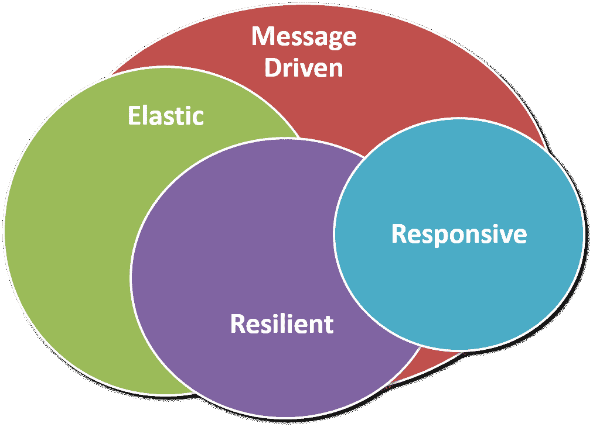

# 第六章：响应式微服务

在本章中，我们将使用 Spring Boot、Spring Stream、Apache Kafka 和 Apache Avro 来实现响应式微服务。我们将利用现有的 Booking 微服务来实现消息生产者，或者说，生成事件。我们还将创建一个新的微服务（Billing），用于消费由更新的 Booking 微服务产生的消息，或者说，用于消费由 Booking 微服务生成的事件。我们还将讨论 REST-based 微服务和事件-based 微服务之间的权衡。

在本章中，我们将涵盖以下主题：

+   响应式微服务架构概述

+   生成事件

+   消费事件

# 响应式微服务架构概述

到目前为止，我们所开发的微服务是基于 REST 的。我们使用 REST 进行内部（微服务之间的通信，其中一个微服务与同一系统中的另一个微服务进行通信）和外部（通过公共 API）通信。目前，REST 最适合公共 API。对于微服务之间的通信，还有其他选择吗？实现 REST 用于微服务之间通信的最佳方法是什么？我们将在本节中讨论所有这些问题。

你可以构建完全是异步的微服务。你可以构建基于微服务的系统，这种系统将基于事件进行通信。REST 和基于事件 的微服务之间有一个权衡。REST 提供同步通信，而响应式微服务则基于异步通信（异步消息传递）。

我们可以为微服务之间的通信使用异步通信。根据需求和功能，我们可以选择 REST 或异步消息传递。考虑一个用户下订单的示例案例，这对于实现响应式微服务来说是一个非常好的案例。在成功下单后，库存服务将重新计算可用商品；账户服务将维护交易；通信服务将向所有涉及的用户（如客户和供应商）发送消息（短信、电子邮件等）。在这种情况下，一个微服务可能会根据另一个微服务执行的操作（下单）执行不同的操作（库存、账户、消息传递等）。现在，想想如果所有的这些通信都是同步的。相反，通过异步消息传递实现的响应式通信，提供了硬件资源的高效利用、非阻塞、低延迟和高吞吐量操作。

我们可以将微服务实现主要分为两组——REST-based 微服务和事件-based/消息驱动的微服务。响应式微服务是基于事件的。



响应式宣言

- 响应式微服务基于响应式宣言（[`www.reactivemanifesto.org/`](https://www.reactivemanifesto.org/)）。响应式宣言包括四个原则，我们现在将讨论这些原则。

# - 响应性

- 响应性是及时服务请求的特征。它由延迟来衡量。生产者应及时提供响应，消费者应及时接收响应。对于请求执行的操作链中的故障，不应导致响应延迟或失败。因此，这对于服务的可用性非常重要。

# - 弹性

- 一个有弹性的系统也是一个健壮的系统。弹性原则与响应性原则相一致。微服务在遇到故障时，仍应提供响应，如果微服务的某个实例宕机，请求应由同一微服务的另一个节点处理。一个有弹性的微服务系统能够处理各种故障。所有服务都应受到监控，以检测故障，并且所有故障都应得到处理。我们在上一章使用了服务发现 Eureka 进行监控和 Hystrix 实现断路器模式。

# - 弹性

- 一个反应式的系统如果通过利用硬件和其他资源来对负载做出反应，那么它是弹性的。如果需求增加，它可以实例化微服务或微服务的新实例，反之亦然。在特别的销售日，如黑色星期五、圣诞节、排灯节等，反应式的购物应用会实例化更多的微服务节点，以分担增加请求的负载。在正常日子，购物应用可能不需要比平均更多的资源，因此它可以减少节点的数量。因此，为了有效地使用硬件，反应式系统应该是弹性的。

# - 消息驱动

- 如果反应式系统没有事情可做，它就会闲置；如果它本无任务，它就不会无用地使用资源。一个事件或消息可以使反应式微服务变得活跃，并开始处理（反应）接收到的该事件/消息（请求）。理想情况下，通信应该是异步和非阻塞的。反应式系统通过消息进行通信——异步消息传递。在本章中，我们将使用 Apache Kafka 进行消息传递。

理想情况下，反应式编程语言是实现反应式微服务的最佳方式。反应式编程语言提供异步和非阻塞调用。Java 也可以利用 Java 流功能来开发反应式微服务。Kafka 将使用 Kafka 的 Java 库和插件进行消息传递。我们已经实现了服务发现和注册服务（Eureka Server-监控），利用 Eureka 实现弹性代理服务器（Zuul），以及利用 Eureka 和 Hystrix 实现断路器（弹性响应）。在下一节中，我们将实现基于消息的微服务。

# 实现反应式微服务

反应式微服务响应事件执行操作。我们将修改我们的代码以产生和消费我们示例实现的事件。虽然我们将创建一个单一事件，但微服务可以有多个生产者或消费者事件。此外，微服务可以同时具有生产者和消费者事件。我们将利用 Booking 微服务中现有的功能来创建新预订（`POST /v1/booking`）。这将作为我们的事件源，并使用 Apache Kafka 发送此事件。其他微服务可以通过监听此事件来消费该事件。在成功预订调用后，Booking 微服务将产生 Kafka 主题（事件）`amp.bookingOrdered`。我们将创建一个与创建其他微服务（如 Booking）相同方式的新微服务 Billing，用于消费此事件（`amp.bookingOrdered`）。

# 产生事件

一旦产生事件，对象就会被发送到 Kafka。同样，Kafka 会将这个产生的对象发送给所有监听器（微服务）。简而言之，产生的对象通过网络传输。因此，我们需要为这些对象提供序列化支持。我们将使用 Apache Avro 进行数据序列化。它定义了以 JSON 格式表示的数据结构（架构），并为 Maven 和 Gradle 提供了一个插件，使用 JSON 架构生成 Java 类。Avro 与 Kafka 配合很好，因为 Avro 和 Kafka 都是 Apache 产品，彼此之间集成非常紧密。

让我们先定义一个代表创建新预订时通过网络发送的对象的架构。正如之前提到的用于产生事件的 Booking 微服务，我们将在 Booking 微服务的`src/main/resources/avro`目录中创建 Avro 架构文件`bookingOrder.avro`。

`bookingOrder.avro`文件看起来像这样：

```java
{"namespace": "com.packtpub.mmj.booking.domain.valueobject.avro", 
 "type": "record", 
 "name": "BookingOrder", 
 "fields": [ 
     {"name": "id", "type": "string"}, 
     {"name": "name", "type": "string", "default": ""}, 
     {"name": "userId", "type": "string", "default": ""}, 
     {"name": "restaurantId", "type": "string", "default": ""}, 
     {"name": "tableId", "type": "string", "default": ""}, 
     {"name": "date", "type": ["null", "string"], "default": null}, 
     {"name": "time", "type": ["null", "string"], "default": null} 
 ] 
}  
```

在这里，`namespace`代表包`type`，`record`代表类，`name`代表类名，而`fields`代表类的属性。当我们使用此架构生成 Java 类时，它将在`com.packtpub.mmj.booking.domain.valueobject.avro`包中创建新的 Java 类`BookingOrder.java`，`fields`中定义的所有属性都将包含在这个类中。

在`fields`中，也有`name`和`type`，它们表示属性的名称和类型。对于所有字段，我们都使用了输入`type`作为`string`。您还可以使用其他基本类型，如`boolean`、`int`和`double`。此外，您可以使用复杂类型，如`record`（在上面的代码片段中使用）、`enum`、`array`和`map`。`default`类型表示属性的默认值。

前面的模式将用于生成 Java 代码。我们将使用`avro-maven-plugin`从前面的 Avro 模式生成 Java 源文件。我们将在此插件的子`pom`文件（服务的`pom.xml`）的插件部分添加此插件：

```java
<plugin> 
    <groupId>org.apache.avro</groupId> 
    <artifactId>avro-maven-plugin</artifactId> 
    <version>1.8.2</version> 
    <executions> 
        <execution> 
            <phase>generate-sources</phase> 
            <goals> 
                <goal>schema</goal> 
            </goals> 
            <configuration> 
               <sourceDirectory>${project.basedir}/src/main/resources/avro/</sourceDirectory> 
               <outputDirectory>${project.basedir}/src/main/java/</outputDirectory> 
            </configuration> 
        </execution> 
    </executions> 
</plugin> 
```

您可以看到，在`configuration`部分，已经配置了`sourceDirectory`和`outputDirectory`。因此，当我们运行`mvn package`时，它将在配置的`outputDirectory`内部的`com.packtpub.mmj.booking.domain.valueobject.avro`包中创建`BookingOrder.java`文件。

现在既然我们的 Avro 模式和生成的 Java 源代码已经可用，我们将添加生成事件所需的 Maven 依赖项。

在 Booking 微服务`pom.xml`文件中添加依赖项：

```java
... 
<dependency> 
    <groupId>org.apache.avro</groupId> 
    <artifactId>avro</artifactId> 
    <version>1.8.2</version> 
</dependency> 
<dependency> 
    <groupId>org.springframework.cloud</groupId> 
    <artifactId>spring-cloud-stream</artifactId> 
    <version>2.0.0.M1</version> 
</dependency> 
<dependency> 
    <groupId>org.springframework.cloud</groupId> 
    <artifactId>spring-cloud-starter-stream-kafka</artifactId> 
</dependency> 
<dependency> 
    <groupId>org.apache.kafka</groupId> 
    <artifactId>kafka-clients</artifactId> 
    <version>0.11.0.1</version> 
</dependency> 
<dependency> 
    <groupId>org.springframework.cloud</groupId> 
    <artifactId>spring-cloud-stream-schema</artifactId> 
</dependency> 
... 
```

在这里，我们添加了三个主要依赖项：`avro`、`spring-cloud-stream`和`kafka-clients`。此外，我们还添加了与 Kafka 的流集成（`spring-cloud-starter-stream-kafka`）和流支持模式（`spring-cloud-stream-schema`）。

现在，既然我们的依赖项已经就位，我们可以开始编写生产者实现。Booking 微服务将发送`amp.bookingOrdered`事件到 Kafka 流。我们将声明为此目的的消息通道。可以通过使用`Source.OUTPUT`与`@InboundChannelAdapter`注解，或者通过声明 Java 接口来完成。我们将使用接口方法，因为这更容易理解且有关联。

我们将在`com.packtpub.mmj.booking.domain.service.message`包中创建`BookingMessageChannels.java`消息通道。在这里，我们可以添加所有必需的消息通道。由于我们使用单事件样本实现，我们只需声明`bookingOrderOutput`。

`BookingMessageChannels.java`文件将看起来像这样：

```java
package com.packtpub.mmj.booking.domain.message; 

import org.springframework.cloud.stream.annotation.Output; 
import org.springframework.messaging.MessageChannel; 

public interface BookingMessageChannels { 

    public final static String BOOKING_ORDER_OUTPUT = "bookingOrderOutput"; 

    @Output(BOOKING_ORDER_OUTPUT) 
    MessageChannel bookingOrderOutput(); 
} 
```

在这里，我们只是使用`@Output`注解定义了消息通道的名称，`bookingOrderOutput`。我们还需要在`application.yaml`中配置此消息通道。我们将在`application.yaml`文件中使用此名称定义 Kafka 主题：

```java
spring: 
  cloud: 
    stream: 
        bindings: 
            bookingOrderOutput: 
                destination: amp.bookingOrdered 
```

在这里，给出了 Kafka 主题名称`amp.bookingOrdered`，它与`bookingOrderOutput`消息通道绑定。（Kafka 主题名称可以是任何字符串。我们添加`amp`前缀以表示异步消息传递；您可以使用带或不带前缀的 Kafka 主题名称。）

我们还需要一个消息转换器，用于将`BookingOrder`对象发送到 Kafka。为此，我们将在 Booking 服务的主类中创建一个`@Bean`注解，以返回 Spring 的`MessageConverter`。

`BookingApp.class`文件中的`@Bean`注解看起来像这样：

```java
... 
@Bean 
public MessageConverter bookingOrderMessageConverter() throws IOException { 
    LOG.info("avro message converter bean initialized."); 
    AvroSchemaMessageConverter avroSchemaMessageConverter = new AvroSchemaMessageConverter(MimeType.valueOf("application/bookingOrder.v1+avro")); 
    avroSchemaMessageConverter.setSchemaLocation(new ClassPathResource("avro/bookingOrder.avsc")); 
    return avroSchemaMessageConverter; 
} 
... 
```

您可以根据所需的模式添加更多的豆子。我们还没有在`application.yaml`中配置 Kafka 服务器，默认为`localhost`。让我们来做这件事。

在`application.yaml`文件中配置 Kafka 服务器：

```java
spring: 
  cloud: 
    stream: 
        kafka: 
            binder: 
                zkNodes: localhost 
            binder: 
                brokers: localhost 
```

在这里，我们为`zkNodes`和`brokers`都配置了`localhost`；您可以将其更改为托管 Kafka 的主机。

我们已经准备好将`amp.bookingOrdered` Kafka 主题发送到 Kafka 服务器。为了简单起见，我们将在`BookingServiceImpl.java`类中直接添加一个`produceBookingOrderEvent`方法，该方法接受`Booking`类作为参数（您需要在`BookingService.java`中添加相同的签名方法）。让我们先看看代码。

`BookingServiceImpl.java`文件如下：

```java
... 
@EnableBinding(BookingMessageChannels.class) 
public class BookingServiceImpl extends BaseService<Booking, String> 
        implements BookingService { 
... 
... 
private BookingMessageChannels bookingMessageChannels; 

@Autowired 
public void setBookingMessageChannels(BookingMessageChannels bookingMessageChannels) { 
    this.bookingMessageChannels = bookingMessageChannels; 
} 

@Override 
public void add(Booking booking) throws Exception { 
    ... 
    ... 
    super.add(booking); 
    produceBookingOrderEvent(booking); 
} 
... 
...     
@Override 
public void produceBookingOrderEvent(Booking booking) throws Exception { 
    final BookingOrder.Builder boBuilder = BookingOrder.newBuilder(); 
    boBuilder.setId(booking.getId()); 
    boBuilder.setName(booking.getName()); 
    boBuilder.setRestaurantId(booking.getRestaurantId()); 
    boBuilder.setTableId(booking.getTableId()); 
    boBuilder.setUserId(booking.getUserId()); 
    boBuilder.setDate(booking.getDate().toString()); 
    boBuilder.setTime(booking.getTime().toString()); 
    BookingOrder bo = boBuilder.build(); 
    final Message<BookingOrder> message = MessageBuilder.withPayload(bo).build(); 
    bookingMessageChannels.bookingOrderOutput().send(message); 
    LOG.info("sending bookingOrder: {}", booking); 
} 
... 
```

在这里，我们声明了`bookingMessageChannel`对象，该对象通过`setter`方法进行自动注入。Spring Cloud Stream 注解`@EnableBinding`将`bookingOrderOutput`消息通道绑定在`BookingMessageChannels`类中声明的`bookingOrderOutput`消息通道。

添加了`produceBookingOrderEvent`方法，该方法接受`booking`对象。在`produceBookingOrderEvent`方法内部，使用`booking`对象设置`BookingOrder`对象属性。然后使用`bookingOrder`对象构建消息。最后，通过`bookingMessageChannels`将消息发送到 Kafka。

`produceBookingOrderEvent`方法在预约成功保存在数据库后调用。

为了测试这个功能，您可以使用以下命令运行 Booking 微服务：

```java
java -jar booking-service/target/booking-service.jar
```

确保 Kafka 和 Zookeeper 应用程序在`application.yaml`文件中定义的主机和端口上正确运行，以进行成功的测试。

然后，通过任何 REST 客户端向`http://<host>:<port>/v1/booking`发送一个预约的 POST 请求，并带有以下载荷：

```java
{ 
                "id": "999999999999",  
                "name": "Test Booking 888",  
                "userId": "3",  
                "restaurantId": "1",  
                "tableId": "1",  
                "date": "2017-10-02",  
                "time": "20:20:20.963543300" 
} 

```

它将产生`amp.bookingOrdered` Kafka 主题（事件），如下所示，在 Booking 微服务控制台上发布日志：

```java
2017-10-02 20:22:17.538  INFO 4940 --- [nio-7052-exec-1] c.p.m.b.d.service.BookingServiceImpl     : sending bookingOrder: {id: 999999999999, name: Test Booking 888, userId: 3, restaurantId: 1, tableId: 1, date: 2017-10-02, time: 20:20:20.963543300} 
```

同样，Kafka 控制台将显示以下消息，确认消息已成功由 Kafka 接收：

```java
[2017-10-02 20:22:17,646] INFO Updated PartitionLeaderEpoch. New: {epoch:0, offset:0}, Current: {epoch:-1, offset-1} for Partition: amp.bookingOrdered-0\. Cache now contains 0 entries. (kafka.server.epoch.LeaderEpochFileCache) 

```

现在，我们可以移动到编写之前生成的事件的消费者代码。

# 消费事件

首先，我们将在父级`pom.xml`文件中添加新模块`billing-service`，并以与其他微服务相同的方式创建 Billing 微服务第五章，*部署和测试*。我们为 Booking 微服务编写的几乎所有反应式代码都将被 Billing 微服务重用，例如 Avro 模式和`pom.xml`条目。

我们将在账单微服务中以与预订微服务相同的方式添加 Avro 模式。由于账单微服务的模式命名空间（包名）将是相同的`booking`包，我们需要在`@SpringBootApplication`注解的`scanBasePackages`属性中添加值`com.packtpub.mmj.booking`。这将允许 spring 上下文也扫描预订包。

我们将在账单微服务的`pom.xml`中添加以下依赖项，这与我们在预订微服务中添加的依赖项相同。

账单微服务的`pom.xml`文件如下：

```java
... 
... 
<dependency> 
    <groupId>org.apache.avro</groupId> 
    <artifactId>avro</artifactId> 
    <version>1.8.2</version> 
</dependency> 
<dependency> 
    <groupId>org.springframework.cloud</groupId> 
    <artifactId>spring-cloud-stream</artifactId> 
    <version>2.0.0.M1</version> 
</dependency> 
<dependency> 
    <groupId>org.springframework.cloud</groupId> 
    <artifactId>spring-cloud-starter-stream-kafka</artifactId> 
</dependency> 
<dependency> 
    <groupId>org.apache.kafka</groupId> 
    <artifactId>kafka-clients</artifactId> 
    <version>0.11.0.1</version> 
</dependency> 
<dependency> 
    <groupId>org.springframework.cloud</groupId> 
    <artifactId>spring-cloud-stream-schema</artifactId> 
</dependency> 
... 
... 
```

您可以参考预订服务依赖段落，了解添加这些依赖的原因。

接下来，我们将向账单微服务中添加消息通道，如下所示：

```java
package com.packtpub.mmj.billing.domain.message; 

import org.springframework.cloud.stream.annotation.Input; 
import org.springframework.messaging.MessageChannel; 

public interface BillingMessageChannels { 

    public final static String BOOKING_ORDER_INPUT = "bookingOrderInput"; 

    @Input(BOOKING_ORDER_INPUT) 
    MessageChannel bookingOrderInput(); 
} 
```

这里，我们正在为预订服务中的输出消息通道添加一个输入消息通道的对端。请注意`bookingOrderInput`是一个带有`@input`注解的输入消息通道。

接下来，我们想要将`bookingOrderInput`通道配置为 Kafka 主题`amp.BookingOrdered`。为此，我们将修改`application.yaml`：

```java
 spring: 
  ... 
  ... 
  cloud: 
    stream: 
        bindings: 
            bookingOrderInput: 
                destination: amp.bookingOrdered 
                consumer: 
                    resetOffsets: true 
                group: 
                    ${bookingConsumerGroup} 
bookingConsumerGroup: "booking-service" 
```

这里，通过目标属性将 Kafka 主题添加到`bookingOrderInput`通道。我们还将按照在预订微服务中配置的方式在账单微服务（`application.yaml`）中配置 Kafka：

```java
        kafka: 
            binder:                
                zkNodes: localhost 
            binder: 
                brokers: localhost 
```

现在，我们将添加一个事件监听器，该监听器将监听与`bookingOrderInput`消息通道绑定的流，使用 Spring Cloud Steam 库中可用的`@StreamListener`注解。

`EventListener.java`文件如下：

```java
package com.packtpub.mmj.billing.domain.message; 

import com.packtpub.mmj.billing.domain.service.TweetMapper; 
import com.packtpub.mmj.billing.domain.service.TweetReceiver; 
import com.packtpub.mmj.billing.domain.service.WebSocketTweetReceiver; 
import com.packtpub.mmj.billing.domain.valueobject.TweetInput; 
import com.packtpub.mmj.booking.domain.valueobject.avro.BookingOrder; 
import com.packtpub.mmj.booking.domain.valueobject.avro.TweetDto; 
import org.slf4j.Logger; 
import org.slf4j.LoggerFactory; 
import org.springframework.beans.factory.annotation.Autowired; 
import org.springframework.cloud.stream.annotation.StreamListener; 

public class EventListener { 

    private static final Logger LOG = LoggerFactory.getLogger(WebSocketTweetReceiver.class); 

    @StreamListener(BillingMessageChannels.BOOKING_ORDER_INPUT) 
    public void consumeBookingOrder(BookingOrder bookingOrder) { 
        LOG.info("Received BookingOrder: {}", bookingOrder); 
    } 
} 
```

这里，您还可以添加其他事件监听器。例如，我们只需记录接收到的对象。根据需求，您可以添加一个额外的功能；如果需要，您甚至可以再次产生一个新事件以进行进一步处理。例如，您可以将事件产生到一家餐厅，该餐厅有一个新的预订请求，等等，通过一个管理餐厅通信的服务。

最后，我们可以使用 Spring Cloud Stream 库的`@EnableBinding`注解启用`bookingOrderInput`消息通道与流的绑定，并在`BillingApp.java`（`billing-service`模块的主类）中创建`EventListener`类的 bean，如下所示：

`BillingApp.java`可能看起来像这样：

```java
@SpringBootApplication(scanBasePackages = {"com.packtpub.mmj.billing", "com.packtpub.mmj.booking"}) 
@EnableBinding({BillingMessageChannels.class}) 
public class BillingApp { 

    public static void main(String[] args) { 
        SpringApplication.run(BillingApp.class, args); 
    } 

    @Bean 
    public EventListener eventListener() { 
        return new EventListener(); 
    } 
} 
```

现在，您可以启动账单微服务并发起一个新的`POST/v1/booking` REST 调用。您可以在账单微服务的日志中找到接收到的对象，如下所示：

```java
2017-10-02 20:22:17.728  INFO 6748 --- [           -C-1] c.p.m.b.d.s.WebSocketTweetReceiver       : Received BookingOrder: {"id": "999999999999", "name": "Test Booking 888", "userId": "3", "restaurantId": "1", "tableId": "1", "date": "2017-10-02", "time": "20:20:20.963543300"} 

```

# 参考文献

以下链接将为您提供更多信息：

+   **Apache Kafka**: [`kafka.apache.org/`](https://kafka.apache.org/)

+   **Apache Avro**: [`avro.apache.org/`](https://avro.apache.org/)

+   **Avro 规范**: [`avro.apache.org/docs/current/spec.html`](https://avro.apache.org/docs/current/spec.html)

+   **Spring Cloud Stream**: [`cloud.spring.io/spring-cloud-stream/`](https://cloud.spring.io/spring-cloud-stream/)

# 总结

在本章中，你学习了关于响应式微服务或基于事件的微服务。这些服务基于消息/事件工作，而不是基于 HTTP 的 REST 调用。它们提供了服务之间的异步通信，这种通信是非阻塞的，并且允许更好地利用资源和处理失败。

我们使用了 Apache Avro 和 Apache Kafka 与 Spring Cloud Stream 库来实现响应式微服务。我们在现有的`booking-service`模块中添加了代码，用于在 Kafka 主题下生产`amp.bookingOrdered`消息，并添加了新的模块`billing-service`来消费同一个事件。

你可能想要为生产者和消费者添加一个新事件。你可以为一个事件添加多个消费者，或者创建一个事件链作为练习。

在下一章中，你将学习如何根据认证和授权来保护微服务。我们还将探讨微服务安全的其他方面。
