# 第七章：保护微服务

正如您所知，微服务是我们部署在本地或云基础设施上的组件。微服务可能提供 API 或网络应用程序。我们的示例应用程序 OTRS 提供 API。本章将重点介绍如何使用 Spring Security 和 Spring OAuth2 保护这些 API。我们还将重点介绍 OAuth 2.0 基本原理，使用 OAuth 2.0 保护 OTRS API。要了解更多关于保护 REST API 的信息，您可以参考*RESTful Java Web Services Security,* *Packt Publishing* 书籍。您还可以参考*Spring Security*, *Packt Publishing*视频以获取有关 Spring Security 的更多信息。我们还将学习跨源请求站点过滤器和跨站脚本阻止器。

在本章中，我们将涵盖以下主题：

+   启用安全套接层（SSL）

+   身份验证和授权

+   OAuth 2.0

# 启用安全套接层

到目前为止，我们一直使用**超文本传输协议**（**HTTP**）。HTTP 以明文形式传输数据，但在互联网上以明文形式传输数据是一个非常糟糕的主意。这使得黑客的工作变得容易，允许他们使用数据包嗅探器轻松获取您的私人信息，例如您的用户 ID、密码和信用卡详细信息。

我们绝对不希望妥协用户数据，因此我们将提供访问我们网络应用的最安全方式。因此，我们需要加密终端用户与应用之间交换的信息。我们将使用**安全套接层**（**SSL**）或**传输安全层**（**TSL**）来加密数据。

安全套接层（SSL）是一种旨在为网络通信提供安全（加密）的协议。HTTP 与 SSL 关联，以提供安全实现 HTTP，称为**安全超文本传输协议**，或**通过 SSL 的 HTTP**（**HTTPS**）。HTTPS 确保交换数据的隐私和完整性得到保护。它还确保访问的网站的真实性。这种安全性围绕在托管应用程序的服务器、终端用户的机器和第三方信任存储服务器之间分发签名的数字证书。让我们看看这个过程是如何进行的：

1.  终端用户使用网络浏览器向网络应用发送请求，例如[`twitter.com`](http://twitter.com)

1.  在接收到请求后，服务器使用 HTTP 代码 302 将浏览器重定向到[`twitter.com`](https://twitter.com)

1.  终端用户的浏览器连接到[`twitter.com`](https://twitter.com)，作为回应，服务器向终端用户的浏览器提供包含数字签名的证书

1.  终端用户的浏览器接收到这个证书，并将其与可信的**证书授权机构**（**CA**）列表进行比对以进行验证

1.  一旦证书验证到根 CA，终端用户的浏览器与应用托管服务器之间就建立了加密通信：

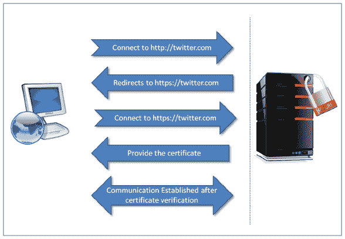

安全的 HTTP 通信

尽管 SSL 在加密和 Web 应用真实性方面确保了安全，但它并不能防止钓鱼和其他攻击。专业的黑客可以解密通过 HTTPS 发送的信息。

现在，在了解了 SSL 的基本知识之后，让我们为我们的示例 OTRS 项目实现它。我们不需要为所有微服务实现 SSL。所有微服务都将通过我们的代理或 Edge 服务器访问；Zuul-Server 由外部环境访问，除了我们将在本章中介绍的新微服务 security-service，用于认证和授权。

首先，我们将在一个 Edge 服务器上设置 SSL。我们需要一个用于在嵌入式 Tomcat 中启用 SSL 的 keystore。我们将使用自签名证书进行演示。我们将使用 Java keytool 生成 keystore，使用以下命令。您也可以使用其他任何工具：

```java
keytool -genkey -keyalg RSA -alias selfsigned -keystore keystore.jks -ext san=dns:localhost -storepass password -validity 365 -keysize 2048 
```

它要求提供诸如姓名、地址详情、组织等信息（见下面的屏幕截图）：

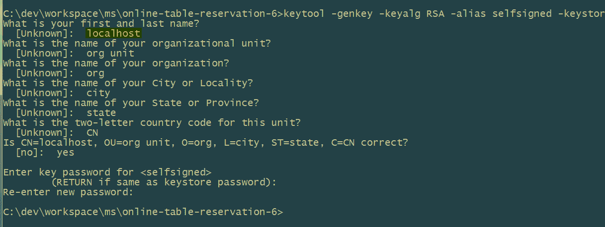

keytool 生成密钥

为确保自签名证书的正常工作，请注意以下几点：

+   使用`-ext`定义**主题备用名称**（**SANs**）。您还可以使用 IP（例如，`san=ip:190.19.0.11`）。以前，通常使用应用程序部署机器的主机名作为最常见的名称（**CN**）。它防止了`java.security.cert.CertificateException`返回`No name matching localhost found`。

+   您可以使用浏览器或 OpenSSL 下载证书。使用`keytool -importcert`命令，将新生成的证书添加到位于活动`JDK/JRE`主目录内的`jre/lib/security/cacerts`的`cacerts` keystore 中。注意`changeit`是`cacerts` keystore 的默认密码。运行以下命令：

```java
keytool -importcert -file path/to/.crt -alias <cert alias> -  keystore <JRE/JAVA_HOME>/jre/lib/security/cacerts -storepass changeit 
```

自签名证书只能用于开发和测试目的。在生产环境中使用这些证书并不能提供所需的安全性。在生产环境中总是使用由可信签名机构提供和签名的证书。妥善保管您的私钥。

现在，在将生成的`keystore.jks`放入 OTRS 项目的`src/main/resources`目录中，与`application.yml`一起，我们可以像以下这样更新 Edge 服务器的`application.yml`信息：

```java
server: 
    ssl: 
        key-store: classpath:keystore.jks 
        key-store-password: password 
        key-password: password 
    port: 8765 
```

重建 Zuul-Server JAR 以使用 HTTPS。

在 Tomcat 7.0.66+和 8.0.28+版本中，可以将 keystore 文件存储在之前的类路径中。对于旧版本，您可以使用 keystore 文件的路径作为`server:ssl:key-store`的值。

同样，您可以为其他微服务配置 SSL。

# 认证和授权

提供认证和授权是网络应用程序的默认行为。我们将在本节讨论认证和授权。过去几年发展起来的新范例是 OAuth。我们将学习和使用 OAuth 2.0 进行实现。OAuth 是一个开放授权机制，在每一个主要网络应用程序中都有实现。通过实现 OAuth 标准，网络应用程序可以访问彼此的数据。它已经成为各种网络应用程序认证自己的最流行方式。例如，在[`www.quora.com/`](https://www.quora.com/)上，你可以使用你的 Google 或 Twitter 登录 ID 进行注册和登录。这也更用户友好，因为客户端应用程序（例如[`www.quora.com/`](https://www.quora.com/)）不需要存储用户的密码。最终用户不需要记住另一个用户 ID 和密码。

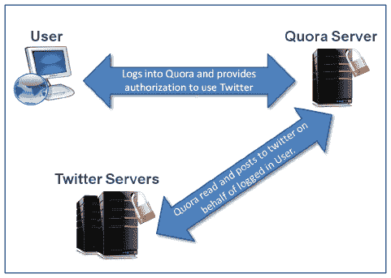

OAuth 2.0 示例使用

# OAuth 2.0

**互联网工程任务组**（**IETF**）管理 OAuth 的标准和规格。OAuth 1.0a 是在 OAuth 2.0 之前的最新版本，它解决了 OAuth 1.0 中的会话固定安全漏洞。OAuth 1.0 和 1.0a 与 OAuth 2.0 非常不同。OAuth 1.0 依赖于安全证书和通道绑定，而 OAuth 2.0 不支持安全证书和通道绑定。它完全基于**传输层安全**（**TLS**）。因此，OAuth 2.0 不提供向后兼容性。

# 使用 OAuth

OAuth 的各种用途如下：

+   正如讨论的那样，它可以用于身份验证。你可能在各种应用程序中看到过它，比如显示“使用 Facebook 登录”或“使用 Twitter 登录”的消息。

+   应用程序可以利用它来读取其他应用程序的数据，例如通过在应用程序中集成 Facebook 小部件，或者在博客上拥有 Twitter 源。

+   或者，与前面一点相反的情况也是正确的：你允许其他应用程序访问最终用户的数据。

# OAuth 2.0 规格说明 - 简洁的细节

我们将尝试以简洁的方式讨论和理解 OAuth 2.0 规格说明。首先让我们看看使用 Twitter 登录是如何工作的。

请注意，这里提到的过程是在写作时使用的，未来可能会有所变化。然而，这个过程正确地描述了 OAuth 2.0 的其中一个过程：

1.  用户访问 Quora 主页，上面显示各种登录选项。我们将探讨点击“继续使用 Twitter”链接的过程。

1.  当用户点击“继续使用 Twitter”链接时，Quora 在一个新窗口（在 Chrome 中）中打开，该窗口将用户重定向到[www.twitter.com](http://www.twitter.com)应用程序。在这个过程中，一些网络应用程序将用户重定向到同一个已打开的标签/窗口。

1.  在这个新窗口/标签中，用户使用他们的凭据登录[www.twitter.com](http://www.twitter.com)。

1.  如果用户尚未授权 Quora 应用使用他们的数据，Twitter 会请求用户授权 Quora 访问用户的信息。如果用户已经授权 Quora，则跳过此步骤。

1.  经过适当的认证后，Twitter 会将用户重定向到 Quora 的重定向 URI，并附带一个认证码。

1.  当在浏览器中输入 Quora 的重定向 URI 时，Quora 发送客户端 ID、客户端密钥令牌和认证码（由 Twitter 在第五步发送）。

1.  在验证这些参数后，Twitter 将访问令牌发送给 Quora。

1.  用户在成功获取访问令牌后登录到 Quora。

1.  Quora 可能使用此访问令牌从 Twitter 检索用户信息。

你可能想知道 Twitter 是如何获得 Quora 的重定向 URI、客户端 ID 和密钥令牌的。Quora 作为客户端应用程序，Twitter 作为授权服务器。Quora 作为客户端，在注册时使用 Twitter 的 OAuth 实现来使用资源所有者（最终用户）的信息。Quora 在注册时提供一个重定向 URI。Twitter 向 Quora 提供客户端 ID 和密钥令牌。在 OAuth 2.0 中，用户信息被称为用户资源。Twitter 提供一个资源服务器和一个授权服务器。我们将在接下来的章节中讨论更多关于这些 OAuth 术语的内容。

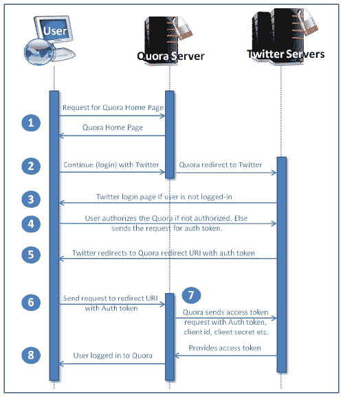

使用 Twitter 登录的 OAuth 2.0 示例过程

# OAuth 2.0 角色

OAuth 2.0 规范中定义了四个角色：

+   资源所有者

+   资源服务器

+   客户端

+   授权服务器

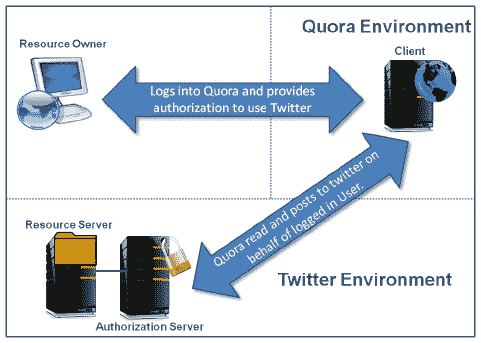

OAuth 2.0 角色

# 资源所有者

以 Quora 使用 Twitter 登录为例，Twitter 用户是资源所有者。资源所有者是拥有要共享的受保护资源（例如，用户处理、推文等）的实体。这个实体可以是应用程序或个人。我们称这个实体为资源所有者，因为它只能授予对其资源的访问权限。规范还定义，当资源所有者是个人时，它们被称为最终用户。

# 资源服务器

资源服务器托管受保护的资源。它应该能够使用访问令牌服务于这些资源。以 Quora 使用 Twitter 登录为例，Twitter 是资源服务器。

# 客户端

以 Quora 使用 Twitter 登录为例，Quora 是客户端。客户端是代表资源所有者向资源服务器请求受保护资源的应用程序。

# 授权服务器

授权服务器在资源所有者身份验证后，才向客户端应用程序提供不同的令牌，例如访问令牌或刷新令牌。

OAuth 2.0 没有为资源服务器与授权服务器之间的交互提供任何规范。因此，授权服务器和资源服务器可以在同一服务器上，也可以在不同的服务器上。

一个授权服务器也可以用于为多个资源服务器颁发访问令牌。

# OAuth 2.0 客户端注册

客户端与授权服务器通信以获取资源访问密钥时，应首先向授权服务器注册。OAuth 2.0 规范没有指定客户端如何向授权服务器注册的方式。注册不需要客户端与授权服务器之间直接通信。注册可以使用自发行或第三方发行的断言完成。授权服务器使用其中一个断言获取所需的客户端属性。让我们看看客户端属性是什么：

+   客户端类型（在下一节中讨论）。

+   客户端重定向 URI，正如我们在使用 Twitter 登录 Quora 的示例中讨论的那样。这是用于 OAuth 2.0 的端点之一。我们将在*端点*部分讨论其他端点。

+   授权服务器可能需要的任何其他信息，例如客户端名称、描述、标志图像、联系详情、接受法律条款和条件等。

# 客户端类型

规范中描述了两种客户端类型，根据它们保持客户端凭据保密的能力：保密和公共。客户端凭据是由授权服务器颁发给客户端的秘密令牌，以便与它们通信。客户端类型如下所述：

+   **保密客户端类型：** 这是一个保持密码和其他凭据安全或保密的客户端应用程序。在使用 Twitter 登录 Quora 的示例中，Quora 应用服务器是安全的，并且实现了受限的访问。因此，它属于保密客户端类型。只有 Quora 应用管理员才能访问客户端凭据。

+   **公共客户端类型：** 这些客户端应用程序不*保持*密码和其他凭据的安全或保密。任何移动或桌面上的本地应用，或者在浏览器上运行的应用，都是公共客户端类型的完美示例，因为这些应用中嵌入了客户端凭据。黑客可以破解这些应用，从而暴露客户端凭据。

客户端可以是分布式组件基础应用程序，例如，它可能同时具有网络浏览器组件和服务器端组件。在这种情况下，两个组件将具有不同的客户端类型和安全上下文。如果授权服务器不支持此类客户端，则此类客户端应将每个组件注册为单独的客户端。

# 客户端配置文件

根据 OAuth 2.0 客户端类型，客户端可以有以下配置文件：

+   **网络应用：** 在 Quora 使用 Twitter 登录的示例中使用的 Quora 网络应用是 OAuth 2.0 网络应用客户端配置文件的完美示例。Quora 是一个运行在网络服务器上的机密客户端。资源所有者（最终用户）通过他们设备上的 HTML 用户界面在浏览器（用户代理）上访问 Quora 应用（OAuth 2.0 客户端）。资源所有者无法访问客户端（Quora OAuth 2.0 客户端）凭据和访问令牌，因为这些是存储在网络服务器上的。您可以在 OAuth 2.0 示例流程图中看到此行为，具体在以下步骤六到八中：

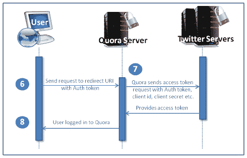

OAuth 2.0 客户端网络应用配置文件

+   **基于用户代理的应用：** 基于用户代理的应用是公共客户端类型。在这种情况下，应用位于网络服务器上，但资源所有者将其下载到用户代理（例如，网络浏览器）上，然后在该设备上执行。在这里，下载并驻留在资源所有者设备上的用户代理中的应用与授权服务器通信。资源所有者可以访问客户端凭据和访问令牌。游戏应用是此类应用配置的一个很好的例子。用户代理应用流程如下所示：

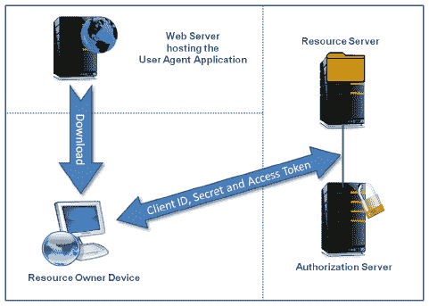

OAuth 2.0 客户端基于用户代理的应用配置文件

+   **原生应用：** 原生应用与基于用户代理的应用类似，不同之处在于这些应用是安装在资源所有者的设备上并原生执行的，而不是从网络服务器下载并在用户代理中执行。您在手机上下载的许多原生应用都属于原生应用类型。在这里，平台确保设备上的其他应用不能访问其他应用的凭据和访问令牌。此外，原生应用不应与与原生应用通信的服务器共享客户端凭据和 OAuth 令牌，如下面的图所示：

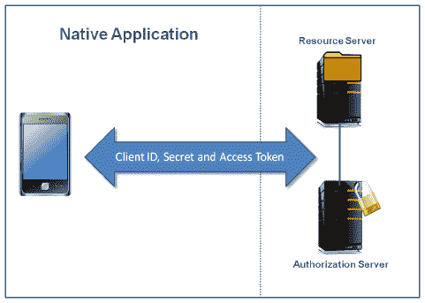

OAuth 2.0 客户端原生应用配置文件

# 客户端标识符

授权服务器的责任是向注册客户端提供一个唯一标识符。此客户端标识符是注册客户端提供的信息的字符串表示。授权服务器需要确保此标识符是唯一的，并且授权服务器本身不应使用它进行身份验证。

OAuth 2.0 规范没有指定客户端标识符的大小。授权服务器可以设置客户端标识符的大小，并且应该文档化其发行的大小。

# 客户端认证

授权服务器应根据客户端类型验证客户端。授权服务器应确定适合并满足安全要求的认证方法。它应在每个请求中只使用一种认证方法。

通常，授权服务器使用一组客户端凭据，例如客户端密码和一些密钥令牌，来认证保密客户端。

授权服务器可能与公共客户端建立客户端认证方法。然而，出于安全原因，它不能依赖这种认证方法来识别客户端。

拥有客户端密码的客户端可以使用基本 HTTP 认证。OAuth 2.0 建议不要在请求体中发送客户端凭据，但建议在需要身份验证的端点上使用 TLS 和暴力攻击保护。

# OAuth 2.0 协议端点

端点不过是我们在 REST 或网络组件中使用的 URI，例如 Servlet 或 JSP。OAuth 2.0 定义了三种端点类型。其中两个是授权服务器端点，一个是客户端端点：

+   授权端点（授权服务器端点）

+   令牌端点（授权服务器端点）

+   重定向端点（客户端端点）

# 授权端点

这个端点负责验证资源所有者的身份，并在验证后获取授权许可。我们在下一节讨论授权许可。

授权服务器要求对授权端点使用 TLS。端点 URI 必须不包含片段组件。授权端点必须支持 HTTP `GET`方法。

规范没有指定以下内容：

+   授权服务器认证客户端的方式。

+   客户端如何接收授权端点的 URI。通常，文档包含授权端点的 URI，或者在注册时客户端获取它。

# 令牌端点

客户端调用令牌端点，通过发送授权许可或刷新令牌来接收访问令牌。除了隐式授权外，所有授权许可都使用令牌端点。

像授权端点一样，令牌端点也需要 TLS。客户端必须使用 HTTP `POST`方法对令牌端点提出请求。

像授权端点一样，规范没有指定客户端如何接收令牌端点的 URI。

# 重定向端点

授权服务器使用重定向端点将资源所有者的用户代理（例如，网络浏览器）回退到客户端，一旦资源所有者和授权服务器之间的授权端点的交互完成。客户端在注册时提供重定向端点。重定向端点必须是绝对 URI，并且不包含片段组件。OAuth 2.0 端点如下：

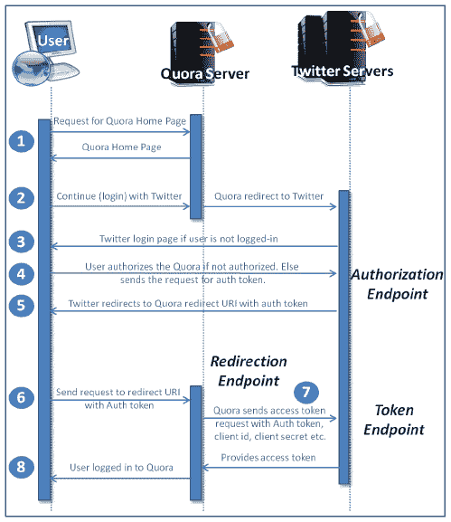

OAuth 2.0 端点

# OAuth 2.0 授权类型

客户端基于从资源所有者获得的授权，请求授权服务器授予访问令牌。资源所有者以授权授予的形式给予授权。OAuth 2.0 定义了四种授权授予类型：

+   授权码授予

+   隐式授予

+   资源所有者密码凭证授予

+   客户端凭据授予

OAuth 2.0 还提供了一种扩展机制来定义其他授予类型。你可以在官方 OAuth 2.0 规范中探索这一点。

# 授权码授予

我们在 OAuth 2.0 登录 Twitter 的示例流程中讨论的第一个样本流程显示了一个授权码授予。我们会在完整的流程中添加一些更多步骤。正如你所知，在第 8 步之后，最终用户登录到 Quora 应用。假设用户第一次登录到 Quora 并请求他们的 Quora 资料页面：

1.  登录后，Quora 用户点击他们的 Quora 资料页面。

1.  OAuth 客户端 Quora 请求 Twitter 资源服务器中 Quora 用户（资源所有者）的资源（例如，Twitter 资料照片等），并发送在上一步中收到的访问令牌。

1.  Twitter 资源服务器使用 Twitter 授权服务器来验证访问令牌。

1.  在成功验证访问令牌后，Twitter 资源服务器向 Quora（OAuth 客户端）提供所请求的资源。

1.  Quora 使用这些资源并显示最终用户的 Quora 资料页面。

**授权码请求和响应**

如果你查看全部的 13 个步骤（如下图中所示）的授权码授予流程，你可以看到客户端总共向授权服务器发起了两请求，授权服务器提供两个响应：一个用于认证令牌的请求-响应和一个用于访问令牌的请求-响应。

让我们讨论一下这些请求和响应中使用的参数：

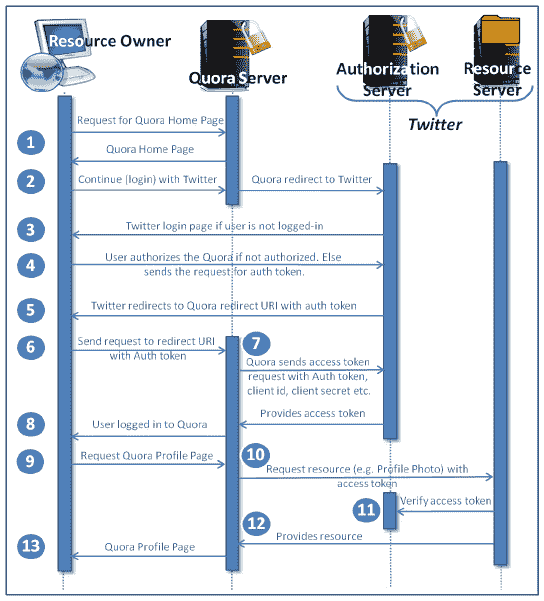

OAuth 2.0 授权码授予流程

授权请求（第四步）到授权端点 URI：

| **参数** | **必需**/**可选** | **描述** |
| --- | --- | --- |
| `response_type` | 必需 | 代码（必须使用此值）。 |
| `client_id` | 必需 | 它代表授权服务器在注册时颁发的客户端 ID。 |
| `redirect_uri` | 可选 | 它代表客户端在注册时提供的重定向 URI。 |
| `scope` | 可选 | 请求的范围。如果没有提供，则授权服务器根据定义的策略提供范围。 |
| `state` | 推荐 | 客户端使用此参数在请求和回调（从授权服务器）之间保持客户端状态。规范推荐此参数以防止跨站请求伪造攻击。 |

授权响应（第五步）：

| `Parameter` | 必填/可选 | 描述 |
| --- | --- | --- |
| `code` | 必填 | 授权服务器生成的授权码。授权码应在生成后过期；最大推荐生存期为 10 分钟。客户端不得使用代码超过一次。如果客户端使用它超过一次，则必须拒绝请求，并撤销基于代码发行的所有先前令牌。代码与客户端 ID 和重定向 URI 绑定。 |
| `state` | 必填 | 代表授权服务器在注册时颁发给客户端的 ID。 |

令牌请求（第七步）至令牌端点 URI： |

| `Parameter` | 必填/可选 | 描述 |
| --- | --- | --- |
| `---` | --- | --- |
| `grant_type` | 必填 | 授权码（此值必须使用）。 |
| `code` | 必填 | 从授权服务器接收的授权码。 |
| `redirect_uri` | 必填 | 如果包含在授权码请求中，则必须匹配。 |
| `client_id` | 必填 | 代表授权服务器在注册时颁发给客户端的 ID。 |

令牌响应（第八步）： |

| `Parameter` | 必填/可选 | 描述 |
| --- | --- | --- |
| `access_token` | 必填 | 授权服务器颁发的访问令牌。 |
| `token_type` | 必填 | 授权服务器定义的令牌类型。根据此，客户端可以使用访问令牌。例如，Bearer 或 Mac。 |
| `refresh_token` | 可选 | 客户端可以使用此令牌使用相同的授权授予获取新的访问令牌。 |
| `expires_in` | 推荐 | 表示访问令牌的生存期，以秒为单位。600 的值表示访问令牌的 10 分钟生存期。如果此参数未包含在响应中，则文档应突出显示访问令牌的生存期。 |
| `scope` | 可选/必填 | 如果与客户端请求的 scope 相同，则为可选。如果访问令牌的 scope 与客户端在其请求中提供的 scope 不同，则为必填，以通知客户端实际授予的访问令牌的 scope。如果客户端在请求访问令牌时未提供 scope，则授权服务器应提供默认 scope，或拒绝请求，指示无效 scope。 |

错误响应： |

| `Parameter` | 必填/可选 | 描述 |
| --- | --- | --- |
| `error` | 必填 | 指定中的错误代码之一，例如 `unauthorized_client` 或 `invalid_scope`。 |
| `error_description` | 可选 | 错误简短描述。 |
| `error_uri` | 可选 | 描述错误的页面 URI。 |

如果客户端授权请求中传递了状态，则在错误响应中也发送一个附加的错误参数状态。 |

# 隐式授权 |

隐式许可流中不涉及授权码步骤。它提供隐式授权码。如果你比较隐式许可流与授权码许可流，除了授权码步骤，一切都是一样的。因此，它被称为隐式许可。让我们找出它的流程：

1.  客户端应用程序（例如，Quora）将访问令牌请求发送给资源服务器（例如，Facebook、Twitter 等），附带客户端 ID、重定向 URI 等。

1.  如果用户尚未认证，可能需要进行认证。在成功认证和其他输入验证后，资源服务器发送访问令牌。

1.  OAuth 客户端请求用户（资源所有者）的资源（例如，Twitter 个人资料照片等）从资源服务器，并发送在上一步收到的访问令牌。

1.  资源服务器使用授权服务器来验证访问令牌。

1.  在成功验证访问令牌后，资源服务器将请求的资源提供给客户端应用程序（OAuth 客户端）。

1.  客户端应用程序使用这些资源。

**隐式许可请求和响应**

如果你查看了隐式许可流的所有步骤（总共六个），你可以看到客户端向授权服务器发出了总共两个请求，授权服务器提供两个响应：一个用于访问令牌的请求-响应和一个用于访问令牌验证的请求-响应。

让我们讨论这些请求和响应中使用的参数。

向授权端点 URI 的授权请求：

| `**参数**` | `**必需**/**可选**` | `**描述**` |
| --- | --- | --- |
| `response_type` | 必需 | 令牌（必须使用此值）。 |
| `client_id` | 必需 | 它代表授权服务器在注册时发给客户端的 ID。 |
| `redirect_uri` | 可选 | 它代表客户端在注册时提供的重定向 URI。 |
| `scope` | 可选 | 请求的范围。如果没有提供，则授权服务器根据定义的策略提供范围。 |
| `state` | 推荐 | 客户端使用此参数在请求和回调（从授权服务器）之间维护客户端状态。规范建议使用它以防止跨站请求伪造攻击。 |

访问令牌响应：

| `**参数**` | `**必需**/**可选**` | `**描述**` |
| --- | --- | --- |
| `---` | `---` | `---` |
| `access_token` | 必需 | 授权服务器发行的访问令牌。 |
| `token_type` | 必需 | 授权服务器定义的令牌类型。根据此类型，客户端可以利用访问令牌。例如，Bearer 或 Mac。 |
| `refresh_token` | 可选 | 客户端可以使用该令牌来使用相同的授权许可获取新的访问令牌。 |
| `expires_in` | 推荐 | 表示访问令牌的生存期，以秒为单位。600 的值表示访问令牌的 10 分钟生存期。如果这个参数在响应中没有提供，那么文档应该强调访问令牌的生存期。 |
| `scope` | 可选/必填 | 如果与客户端请求的 scope 相同，则为可选。如果授予的访问令牌 scope 与客户端在请求中提供的 scope 不同，则为必填，以通知客户端授予的访问令牌的实际 scope。如果客户端在请求访问令牌时没有提供 scope，则授权服务器应提供默认 scope，或拒绝请求，指示无效 scope。 |
| `state` | 可选/必填 | 如果客户端授权请求中传递了状态，则为必填。 |

错误响应：

| **参数** | **必填**/**可选** | **描述** |
| --- | --- | --- |
| `error` | 必填 | 定义在规范中的错误代码之一，例如 `unauthorized_client` 或 `invalid_scope`。 |
| `error_description` | 可选 | 错误的精简描述。 |
| `error_uri` | 可选 | 描述错误的错误页面的 URI。 |

在错误响应中还发送了一个额外的状态参数，如果客户端授权请求中传递了状态。

# 资源所有者密码凭证授权

这种流程通常用于移动或桌面应用程序。在这个授权流程中，只发起两个请求：一个用于请求访问令牌，另一个用于访问令牌验证，类似于隐式授权流程。唯一的区别是访问令牌请求中附带了资源所有者的用户名和密码。（在隐式授权中，通常在浏览器中，将用户重定向到认证页面。）让我们来看看它的流程：

1.  客户端应用程序（例如，Quora）将访问令牌请求发送到资源服务器（例如，Facebook、Twitter 等），其中包括客户端 ID、资源所有者的用户名和密码等。在成功验证参数后，资源服务器发送访问令牌。

1.  OAuth 客户端请求资源服务器上的用户（资源所有者）的资源（例如，Twitter 个人资料照片等），并发送在上一步收到的访问令牌。

1.  资源服务器使用授权服务器验证访问令牌。

1.  在成功验证访问令牌后，资源服务器向客户端应用程序（OAuth 客户端）提供所请求的资源。

1.  客户端应用程序使用这些资源。

资源所有者的密码凭证用于授权请求和响应。

如前所述，在资源所有者密码凭据授予流程的所有步骤（共五个步骤）中，您可以看到客户端向授权服务器发出了两个请求，并且授权服务器提供了两个响应：一个用于访问令牌的请求-响应，一个用于资源所有者资源的请求-响应。

让我们讨论每个请求和响应中使用的参数。

访问令牌请求到令牌端点 URI：

| **参数** | **必需**/**可选** | **描述** |
| --- | --- | --- |
| `grant_type` | 必需 | 密码（必须使用此值）。 |
| `username` | 必需 | 资源所有者的用户名。 |
| `password` | 必需 | 资源所有者的密码。 |
| `scope` | 可选 | 请求的范围。如果未提供，则授权服务器根据定义的策略提供范围。 |

访问令牌响应（第一步）：

| **参数** | **必需**/**可选** | **描述** |
| --- | --- | --- |
| `access_token` | 必需 | 授权服务器颁发的访问令牌。 |
| `token_type` | 必需 | 授权服务器定义的令牌类型。基于此，客户端可以利用访问令牌。例如，Bearer 或 Mac。 |
| `refresh_token` | 可选 | 客户端可以使用此令牌使用相同的授权授予获取新的访问令牌。 |
| `expires_in` | 建议 | 以秒为单位表示访问令牌的生命周期。600 的值表示访问令牌的生命周期为 10 分钟。如果响应中未提供此参数，则文档应突出显示访问令牌的生命周期。 |
| 可选参数 | 可选 | 额外参数。 |

# 客户端凭据授予

正如其名称所示，在这里，使用客户端凭据而不是用户（资源所有者）的凭据。除了客户端凭据，它与资源所有者密码凭据授予流程非常相似：

1.  客户端应用程序（例如 Quora）使用授予类型和范围将访问令牌请求发送到资源服务器（例如 Facebook、Twitter 等）。客户端 ID 和密码添加到授权标头。验证成功后，资源服务器发送访问令牌。

1.  OAuth 客户端从资源服务器请求用户（资源所有者）的资源（例如 Twitter 个人资料照片等），并发送上一步收到的访问令牌。

1.  资源服务器使用授权服务器验证访问令牌。

1.  验证访问令牌成功后，资源服务器将所请求的资源提供给客户端应用程序（OAuth 客户端）。

1.  客户端应用程序使用这些资源。

客户端凭据授予请求和响应。

如果您查看了客户端凭据授予流程的所有步骤（共五个步骤），您可以

可以看到客户端总共向授权服务器发出了两个请求，授权服务器提供了两个响应：一个请求-响应用于访问令牌和一个请求-响应用于涉及访问令牌验证的资源。

让我们讨论一下每个这些请求和响应中使用的参数。

访问令牌请求到令牌端点的 URI：

| `Parameter` | `Required`/**optional** | `Description` |
| --- | --- | --- |
| `grant_type` | 必需 | `client_credentials`（必须使用此值）。 |
| `scope` | 可选 | 请求的范围。如果没有提供，则授权服务器根据定义的策略提供范围。 |

访问令牌响应：

| `Parameter` | `Required`/**optional** | `Description` |
| --- | --- | --- |
| `access_token` | 必需 | 授权服务器颁发的访问令牌。 |
| `token_type` | 必需 | 授权服务器定义的令牌类型。根据此，客户端可以利用访问令牌。例如，Bearer 或 Mac。 |
| `expires_in` | 推荐 | 表示访问令牌的生存期，以秒为单位。600 的值表示访问令牌的 10 分钟生存期。如果没有在响应中提供此参数，则文档应突出显示访问令牌的生存期。 |

# OAuth 使用 Spring Security 实现

OAuth 2.0 是一种保护 API 的方法。Spring Security 提供了 Spring Cloud Security 和 Spring Cloud OAuth2 组件来实现我们之前讨论的授权流。

我们将再创建一个服务，一个安全服务，它将控制认证和授权。

创建一个新的 Maven 项目，并按照以下步骤操作：

1.  在`pom.xml`中添加 Spring Security 和 Spring Security OAuth 2 依赖项：

```java
 <dependency> 
   <groupId>org.springframework.cloud</groupId> 
   <artifactId>spring-cloud-starter-security</artifactId> 
</dependency> 
<dependency> 
   <groupId>org.springframework.cloud</groupId> 
   <artifactId>spring-cloud-starter-oauth2</artifactId> 
</dependency> 
```

1.  在您的应用程序类中使用`@EnableResourceServer`注解。这将允许此应用程序作为资源服务器运行。`@EnableAuthorizationServer`注解是我们将使用以根据 OAuth 2.0 规范启用授权服务器的另一个注解：

```java
@SpringBootApplication 
@RestController 
@EnableResourceServer 
public class SecurityApp { 

    @RequestMapping("/user") 
    public Principal user(Principal user) { 
        return user; 
    } 

    public static void main(String[] args) { 
        SpringApplication.run(SecurityApp.class, args); 
    } 

    @Configuration 
    @EnableAuthorizationServer 
    protected static class OAuth2Config extends AuthorizationServerConfigurerAdapter { 

        @Autowired 
        private AuthenticationManager authenticationManager; 

        @Override 
        public void configure(AuthorizationServerEndpointsConfigurer endpointsConfigurer) throws Exception { 
            endpointsConfigurer.authenticationManager(authenticationManager); 
        } 

        @Override 
        public void configure(ClientDetailsServiceConfigurer clientDetailsServiceConfigurer) throws Exception { 
  // Using hardcoded inmemory mechanism because it is just an example 
            clientDetailsServiceConfigurer.inMemory() 
             .withClient("acme") 
             .secret("acmesecret") 
             .authorizedGrantTypes("authorization_code", "refresh_token", "implicit", "password", "client_credentials") 
             .scopes("webshop"); 
        } 
    } 
}
```

1.  更新`application.yml`中的安全服务配置，如下代码所示：

+   `server.contextPath`：这表示上下文路径

+   `security.user.password`: 本示例将使用硬编码的密码。您可以为其真实应用重新配置：

```java
application.yml 
info: 
    component: 
        Security Server 

server: 
    port: 9001 
    ssl: 
        key-store: classpath:keystore.jks 
        key-store-password: password 
        key-password: password 
    contextPath: /auth 

security: 
    user: 
        password: password 

logging: 
    level: 
        org.springframework.security: DEBUG 
```

现在我们已经有了我们的安全服务器，我们将使用新的`api-service`微服务暴露我们的 API，该服务将用于与外部应用程序和 UI 通信。

我们将修改 Zuul-Server 模块，使其也成为资源服务器。这可以通过以下步骤完成：

1.  添加 Spring Security 和 Spring Security OAuth 2 依赖项：

    到`pom.xml`。在此，最后两个依赖项是启用 Zuul-Server 作为资源服务器所需的：

```java
<dependency> 
    <groupId>org.springframework.cloud</groupId> 
    <artifactId>spring-cloud-starter-zuul</artifactId> 
</dependency> 
<dependency> 
    <groupId>org.springframework.cloud</groupId> 
    <artifactId>spring-cloud-starter-eureka</artifactId> 
</dependency> 
<dependency> 
    <groupId>org.springframework.cloud</groupId> 
    <artifactId>spring-cloud-starter-feign</artifactId> 
</dependency> 
<dependency> 
    <groupId>org.springframework.cloud</groupId> 
    <artifactId>spring-cloud-netflix-hystrix-stream</artifactId> 
</dependency> 
<dependency> 
    <groupId>org.springframework.cloud</groupId> 
    <artifactId>spring-cloud-starter-bus-amqp</artifactId> 
</dependency> 
<dependency> 
    <groupId>org.springframework.cloud</groupId> 
    <artifactId>spring-cloud-starter-stream-rabbit</artifactId> 
</dependency> 
<dependency> 
    <groupId>org.springframework.boot</groupId> 
    <artifactId>spring-boot-starter-web</artifactId> 
</dependency> 
<dependency> 
    <groupId>org.springframework.cloud</groupId> 
    <artifactId>spring-cloud-starter-security</artifactId> 
</dependency> 
<dependency> 
    <groupId>org.springframework.cloud</groupId> 
    <artifactId>spring-cloud-starter-oauth2</artifactId>         </dependency>
```

1.  在您的应用程序类中使用`@EnableResourceServer`注解。这将允许此应用程序作为资源服务器运行：

```java
@SpringBootApplication 
@EnableZuulProxy 
@EnableEurekaClient 
@EnableCircuitBreaker 
@Configuration 
@EnableFeignClients 
@EnableResourceServer 
public class EdgeApp { 

    private static final Logger LOG = LoggerFactory.getLogger(EdgeApp.class); 

    static { 
        // for localhost testing only 
        LOG.warn("Will now disable hostname check in SSL, only to be used during development"); 
        HttpsURLConnection.setDefaultHostnameVerifier((hostname, sslSession) -> true); 
    } 

    @Value("${app.rabbitmq.host:localhost}") 
    String rabbitMqHost; 

    @Bean 
    public ConnectionFactory connectionFactory() { 
        LOG.info("Create RabbitMqCF for host: {}", rabbitMqHost); 
        CachingConnectionFactory connectionFactory = new CachingConnectionFactory(rabbitMqHost); 
        return connectionFactory; 
    } 

    public static void main(String[] args) { 
        SpringApplication.run(EdgeApp.class, args); 
    } 
} 
```

1.  更新`Zuul-Server`配置文件中的`application.yml`，如下所示的代码。`application.yml`文件看起来可能会像这样：

```java
info: 
    component: Zuul Server 

spring: 
  application: 
     name: zuul-server  # Service registers under this name 
  # Added to fix -  java.lang.IllegalArgumentException: error at ::0 can't find referenced pointcut hystrixCommandAnnotationPointcut 
  aop: 
      auto: false 

zuul: 
    ignoredServices: "*" 
    routes: 
        restaurantapi: 
            path: /api/** 
            serviceId: api-service 
            stripPrefix: true 

server: 
    ssl: 
        key-store: classpath:keystore.jks 
        key-store-password: password 
        key-password: password 
    port: 8765 
    compression: 
        enabled: true 

security: 
  oauth2: 
    resource: 
     userInfoUri: https://localhost:9001/auth/user 

management: 
  security: 
    enabled: false 
## Other properties like Eureka, Logging and so on 
```

这里，`security.oauth2.resource.userInfoUri`属性表示安全服务用户 URI。API 通过指向 API 服务的路由配置暴露给外部世界。

现在我们已经有了安全服务器，我们通过`api-service`微服务暴露我们的 API，该服务将用于与外部应用程序和 UI 通信。

现在，让我们测试并探索不同 OAuth 2.0 授予类型的运作方式。

我们将使用 Postman 浏览器扩展来测试不同的流程。

# 授权码授予

我们将在浏览器中输入以下 URL。请求授权码如下：

```java
https://localhost:9001/auth/oauth/authorize?response_type=code&client_id=client&redirect_uri=http://localhost:7771/1&scope=apiAccess&state=1234
```

在这里，我们提供客户端 ID（默认情况下，我们在安全服务中注册了硬编码的客户端）、重定向 URI、范围（在安全服务中硬编码的`apiAccess`值）和状态。您可能会想知道`state`参数。它包含了一个我们在响应中重新验证的随机数，以防止跨站请求伪造。

如果资源所有者（用户）尚未经过身份验证，它会要求输入用户名和密码。输入用户名`username`和密码`password`；我们在安全服务中硬编码了这些值。

登录成功后，它会要求您提供您的（资源所有者）批准：

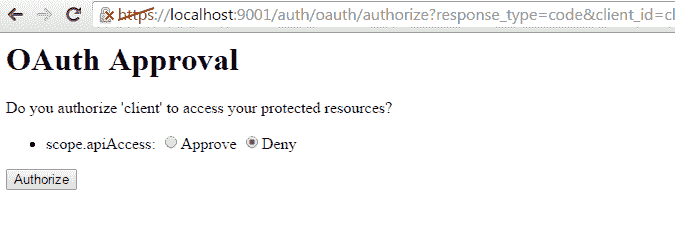

OAuth 2.0 授权码授予 - 资源授予批准

选择批准并点击授权。这个操作会将应用程序重定向到`http://localhost:7771/1?code=o8t4fi&state=1234`。

正如你所看到的，它返回了授权代码和状态。

现在，我们将使用这个代码来检索访问代码，使用 Postman Chrome 扩展。首先，我们将使用用户名作为客户端，密码作为`clientsecret`来添加授权头，如下所示的屏幕截图：

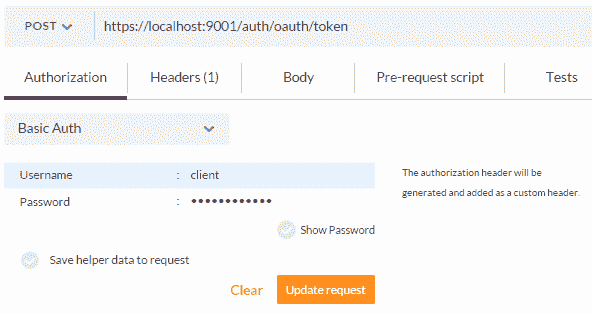

OAuth 2.0 授权码授予 - 访问令牌请求 - 添加身份验证

这会将`Authorization`头添加到请求中，值为`Basic Y2xpZW50OmNsaWVudHNlY3JldA==`，这是'client client-secret'的 base-64 编码。

现在，我们将向请求中添加几个其他参数，如下的屏幕截图，然后提交请求：

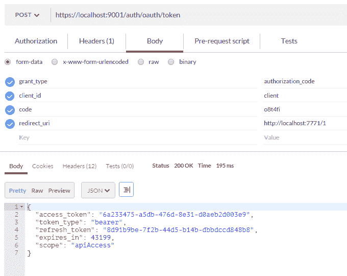

OAuth 2.0 授权码授予 - 访问令牌请求和响应

根据 OAuth 2.0 规范，这会返回以下响应：

```java
{
  "access_token": "6a233475-a5db-476d-8e31-d0aeb2d003e9",
  "token_type": "bearer", 
  "refresh_token": "8d91b9be-7f2b-44d5-b14b-dbbdccd848b8", 
  "expires_in": 43199, 
  "scope": "apiAccess" 
} 
```

现在，我们可以使用这些信息来访问资源拥有者的资源。例如，如果`https://localhost:8765/api/restaurant/1`代表 ID 为`1`的餐厅，那么它应该返回相应的餐厅详情。

没有访问令牌，如果我们输入 URL，它会返回错误`Unauthorized`，消息为`Full authentication is required to access this resource`。

现在，让我们使用访问令牌访问这个网址，如下面的截图所示：

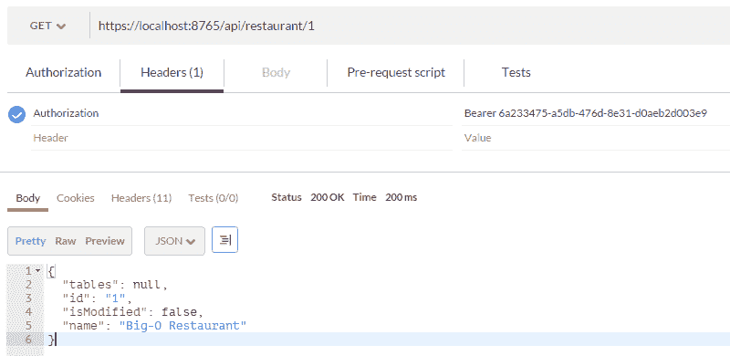

OAuth 2.0 授权码授权 - 使用访问令牌访问 API

正如您所看到的，我们添加了带有访问令牌的授权头。

现在，我们将探讨隐式授权实现的实现。

# 隐式授权

隐式授权与授权码授权非常相似，除了授权码步骤之外。如果您移除授权码授权的第一个步骤（客户端应用程序从授权服务器接收授权令牌的步骤），其余步骤都相同。让我们来查看一下。

在浏览器中输入以下 URL 和参数并按 Enter。同时，请确保如果需要，添加基本认证，将客户端作为`username`，将密码作为`password`：

```java
https://localhost:9001/auth/oauth/authorize?response_type=token&redirect_uri=https://localhost:8765&scope=apiAccess&state=553344&client_id=client
```

在这里，我们使用以下请求参数调用授权端点：响应类型、客户端 ID、重定向 URI、范围和状态。

当请求成功时，浏览器将被重定向到以下 URL，带有新的请求参数和值：

```java
https://localhost:8765/#access_token=6a233475-a5db-476d-8e31-d0aeb2d003e9&token_type=bearer&state=553344&expires_in=19592
```

在这里，我们接收到`access_token`、`token_type`、状态和令牌的过期持续时间。现在，我们可以利用这个访问令牌来访问 API，就像在授权码授权中使用一样。

# 资源所有者密码凭据授权

在这个授权中，我们请求访问令牌时提供`username`和`password`作为参数，以及`grant_type`、`client`和`scope`参数。我们还需要使用客户端 ID 和密钥来验证请求。这些授权流程使用客户端应用程序代替浏览器，通常用于移动和桌面应用程序。

在下面的 Postman 工具截图中，已使用`client_id`和`password`进行基本认证，并添加了授权头：

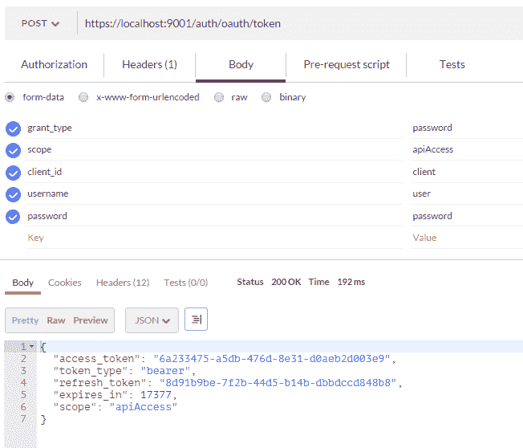

OAuth 2.0 资源所有者密码凭据授权 - 访问令牌请求和响应

一旦客户端接收到访问令牌，它可以用类似的方式使用，就像在授权码授权中使用一样。

# 客户端凭据授权

在这个流程中，客户端提供自己的凭据以获取访问令牌。它不使用资源所有者的凭据和权限。

正如您在下面的截图中看到的，我们直接输入只有两个参数的令牌端点：`grant_type`和`scope`。授权头使用`client_id`和`client secret`添加：

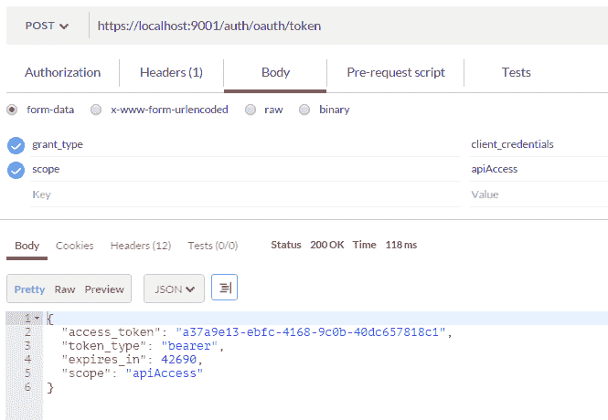

OAuth 2.0 客户端凭据授权 - 访问令牌请求和响应

您可以像授权码授权中解释的那样使用访问令牌。

# 参考文献

更多信息，您可以参考以下链接：

+   《RESTful Java Web Services Security》，*René Enríquez, Andrés Salazar C*，*Packt Publishing*: [`www.packtpub.com/application-development/restful-java-web-services-security`](https://www.packtpub.com/application-development/restful-java-web-services-security)

+   《Spring Security [Video]》，*Packt Publishing*: [`www.packtpub.com/application-development/spring-security-video`](https://www.packtpub.com/application-development/spring-security-video)

+   OAuth 2.0 授权框架：[`tools.ietf.org/html/rfc6749`](https://tools.ietf.org/html/rfc6749)

+   春安全: [`projects.spring.io/spring-security`](http://projects.spring.io/spring-security)

+   春 auth2: [`projects.spring.io/spring-security-oauth/`](http://projects.spring.io/spring-security-oauth/)

# 摘要

在本章中，我们了解到拥有 TLS 层或 HTTPS 对所有网络流量的重要性。我们已经向示例应用程序添加了自签名的证书。我想再次强调，对于生产应用程序，您必须使用证书授权机构提供的证书。我们还探讨了 OAuth 2.0 的基本原理和各种 OAuth 2.0 授权流。不同的 OAuth 2.0 授权流是使用 Spring Security 和 OAuth 2.0 实现的。在下一章中，我们将实现示例 OTRS 项目的 UI，并探讨所有组件是如何一起工作的。
