# 第八章：使用微服务网络应用程序消费服务

现在，在开发了微服务之后，将很有趣地看看在线表格预订系统（OTRS）提供的服务如何被网络或移动应用程序消费。我们将使用 AngularJS/Bootstrap 开发网络应用程序（UI）的原型。这个示例应用程序将显示这个示例项目的数据和流程——一个小型实用程序项目。这个网络应用程序也将是一个示例项目，并可以独立运行。以前，网络应用程序是在单个网络归档（具有 `.war` 扩展名的文件）中开发的，其中包含 UI 和服务器端代码。这样做的原因相当简单，因为 UI 也是使用 Java、JSP、servlet、JSF 等开发的。现在，UI 是独立使用 JavaScript 开发的。因此，这些 UI 应用程序也作为单个微服务部署。在本章中，我们将探讨这些独立 UI 应用程序是如何开发的。我们将开发并实现没有登录和授权流的 OTRS 示例应用程序。我们将部署一个功能非常有限的应用程序，并涵盖高级 AngularJS 概念。有关 AngularJS 的更多信息，请参考《AngularJS 示例》、《Chandermani》、《Packt Publishing》。

在本章中，我们将涵盖以下主题：

+   AngularJS 框架概述

+   OTRS 功能的开发

+   设置网络应用程序（UI）

# AngularJS 框架概述

现在，既然我们已经完成了 HTML5 网络应用程序的设置，我们可以了解 AngularJS 的基础知识。这将帮助我们理解 AngularJS 代码。本节描述了你可以利用的高级理解水平，以理解示例应用程序并进一步使用 AngularJS 文档或参考其他 Packt Publishing 资源。

AngularJS 是一个客户端 JavaScript 框架。它足够灵活，可以作为**模型-视图-控制器**（**MVC**）或**模型-视图-视图模型**（**MVVM**）使用。它还提供内置服务，如使用依赖注入模式的 `$http` 或 `$log`。

# MVC

模型-视图-控制器（MVC）是一种众所周知的设计模式。Struts 和 Spring MVC 是流行的例子。让我们看看它们如何适用于 JavaScript 世界：

+   **模型**：模型是包含应用程序数据的 JavaScript 对象。它们还表示应用程序的状态。

+   **视图**：视图是由 HTML 文件组成的表示层。在这里，你可以显示来自模型的数据并提供用户交互界面。

+   **控制器**：你可以在 JavaScript 中定义控制器，其中包含应用程序逻辑。

# MVVM

MVVM 是一种针对 UI 开发的设计模式。MVVM 旨在使双向数据绑定变得更容易。双向数据绑定提供了模型和视图之间的同步。当模型（数据）发生变化时，它立即反映在视图上。类似地，当用户在视图上更改数据时，它也会反映在模型上：

+   **模型**：这与 MVC 非常相似，包含业务逻辑和数据。

+   **视图**：与 MVC 类似，它包含呈现逻辑或用户界面。

+   **视图模型**：视图模型包含视图和模型之间的数据绑定。因此，它是视图和模型之间的接口。

# 模块

模块是我们为任何 AngularJS 应用程序定义的第一个东西。模块是一个包含应用程序不同部分的容器，如控制器、服务、过滤器等。AngularJS 应用程序可以写在一个单一的模块中，也可以写在多个模块中。AngularJS 模块也可以包含其他模块。

许多其他 JavaScript 框架使用`main`方法来实例化和连接应用程序的不同部分。AngularJS 没有`main`方法。它由于以下原因使用模块作为入口点：

+   **模块化**：你可以根据应用程序功能或可重用组件来划分和创建应用程序。

+   **简洁性**：你可能遇到过复杂且庞大的应用程序代码，这使得维护和升级成为头疼的事。不再如此：AngularJS 使代码变得简单、可读且易于理解。

+   **测试**：它使单元测试和端到端测试变得容易，因为你可以覆盖配置并只加载所需的模块。

每个 AngularJS 应用程序需要有一个单一的模块来启动 AngularJS 应用程序。启动我们的应用程序需要以下三个部分：

+   **应用程序模块**：一个包含 AngularJS 模块的 JavaScript 文件（`app.js`），如下所示：

```java
var otrsApp = AngularJS.module('otrsApp', [ ]) 
// [] contains the reference to other modules 
```

+   **加载 Angular 库和应用程序模块**：一个包含对其他 AngularJS 库的 JavaScript 文件的引用和一个`index.html`文件：

```java
<script type="text/javascript" src="img/angular.min.js"></script> 
<script type="text/javascript" src="img/app.js"></script>
```

+   **应用程序 DOM 配置**：这告诉 AngularJS 应用程序的 DOM 元素的启动位置。它可以以两种方式之一完成：

1.  一个`index.html`文件，其中还包含一个 HTML 元素（通常是`<html>`）和一个具有在`app.js`中给出的值的`ng-app`（AngularJS 指令）属性：`<html lang="zh" ng-app="otrsApp" class="no-js">`。AngularJS 指令前缀为`ng`（AngularJS）：`<html lang="en" ng-app="otrsApp" class="no-js">`。

1.  或者，如果你是以异步方式加载 JavaScript 文件的话，请使用这个命令：`AngularJS.bootstrap(document.documentElement, ['otrsApp']);`。

一个 AngularJS 模块有两个重要的部分，`config()`和`run()`，除了控制器、服务、过滤器等其他组件：

+   `config()`用于注册和配置模块，并只处理使用`$injector`的提供者和常量。`$injector`是 AngularJS 服务。我们在下一节介绍提供者和`$injector`。在这里不能使用实例。它防止在完全配置之前使用服务。

+   `run()`方法用于在通过前面的`config()`方法创建`$injector`之后执行代码。它只处理实例和常量。在这里不能使用提供商，以避免在运行时进行配置。

# 提供商和服务

让我们看一下以下的代码：

```java
.controller('otrsAppCtrl', function ($injector) { 
var log = $injector.get('$log'); 
```

`$log`是一个内置的 AngularJS 服务，提供了日志 API。在这里，我们使用了另一个内置服务——`$injector`，它允许我们使用`$log`服务。`$injector`是控制器的一个参数。AngularJS 使用函数定义和正则表达式为调用者（即控制器）提供`$injector`服务，这正是 AngularJS 有效使用依赖注入模式的示例。

AngularJS 大量使用依赖注入模式，使用注入器服务（`$injector`）来实例化和连接我们用在 AngularJS 应用程序中的大多数对象。这个注入器创建了两种类型的对象——服务和特殊对象。

为了简化，你可以认为我们（开发者）定义服务。相反，特殊对象是 AngularJS 项目，如控制器、过滤器、指令等。

AngularJS 提供了五种告诉注入器如何创建服务对象的食谱类型——**提供商**、**值**、**工厂**、**服务**和**常量**。

+   提供商是核心且最复杂的食谱类型。其他的食谱都是建立在其上的合成糖。我们通常避免使用提供商，除非我们需要创建需要全局配置的可重用代码。

+   值和常量食谱类型正如其名称所暗示的那样工作。它们都不能有依赖关系。此外，它们之间的区别在于它们的用法。在配置阶段你不能使用值服务对象。

+   工厂和服务是最常用的服务类型。它们属于相似的类型。当我们想要生产 JavaScript 原始值和函数时，我们使用工厂食谱。另一方面，当我们要生产自定义定义的类型时，我们使用服务。

由于我们现在对服务有一定的了解，我们可以认为服务有两个常见的用途——组织代码和跨应用程序共享代码。服务是单例对象，由 AngularJS 服务工厂延迟实例化。我们已经看到了一些内置的 AngularJS 服务，比如`$injector`、`$log`等。AngularJS 服务前缀为`$`符号。

# 作用域

在 AngularJS 应用程序中，广泛使用了两种作用域——`$rootScope`和`$scope`：

+   `$rootScope` 是作用域层次结构中最顶层的对象，与全局作用域相关联。这意味着您附加上它的任何变量都将无处不在可用，因此，使用 `$rootScope` 应该是一个经过深思熟虑的决定。

+   控制器在回调函数中有一个 `$scope` 作为参数。它用于将控制器中的数据绑定到视图。其作用域仅限于与它关联的控制器使用。

# 控制器

控制器通过 JavaScript 的 `constructor` 函数定义，拥有 `$scope` 作为参数。控制器的主要目的是将数据绑定到视图。控制器函数也用于编写业务逻辑——设置 `$scope` 对象的初始状态和向 `$scope` 添加行为。控制器签名如下：

```java
RestModule.controller('RestaurantsCtrl', function ($scope, restaurantService) { 
```

在这里，控制器是 `RestModule` 的一部分，控制器的名称是 `RestaurantCtrl`，`$scope` 和 `restaurantService` 被作为参数传递。

# 过滤器

过滤器的目的是格式化给定表达式的值。在以下代码中，我们定义了 `datetime1` 过滤器，它接受日期作为参数并将其值更改为 `dd MMM yyyy HH:mm` 格式，例如 `04 Apr 2016 04:13 PM`：

```java
.filter('datetime1', function ($filter) { 
    return function (argDateTime) { 
        if (argDateTime) { 
            return $filter('date')(new Date(argDateTime), 'dd MMM yyyy HH:mm a'); 
        } 
        return ""; 
    }; 
});
```

# 指令

正如我们在*模块*部分所看到的，AngularJS 指令是带有 `ng` 前缀的 HTML 属性。一些常用的指令包括：

+   `ng-app`：这个指令定义了 AngularJS 应用程序

+   `ng-model`：这个指令将 HTML 表单输入绑定到数据

+   `ng-bind`：这个指令将数据绑定到 HTML 视图

+   `ng-submit`：这个指令提交 HTML 表单

+   `ng-repeat`：这个指令遍历集合：

```java
<div ng-app=""> 
    <p>Search: <input type="text" ng-model="searchValue"></p> 
    <p ng-bind="searchedTerm"></p> 
</div>
```

# UI-Router

在**单页应用程序**（**SPA**）中，页面只加载一次，用户通过不同的链接进行导航，而无需刷新页面。这都是因为路由。路由是一种使 SPA 导航感觉像正常网站的方法。因此，路由对 SPA 非常重要。

AngularUI 团队开发了 UI-Router，这是一个 AngularJS 的路由框架。UI-Router 并不是 AngularJS 核心的一部分。当用户在 SPA 中点击任何链接时，UI-Router 不仅会改变路由 URL，还会改变应用程序的状态。由于 UI-Router 也可以进行状态更改，因此您可以在不改变 URL 的情况下更改页面的视图。这是因为在 UI-Router 的管理下实现了应用程序状态管理。

如果我们把 SPA 看作是一个状态机，那么状态就是应用程序的当前状态。当我们创建路由链接时，我们会在 HTML 链接标签中使用 `ui-sref` 属性。链接中的 `href` 属性由此生成，并指向在 `app.js` 中创建的应用程序的某些状态。

我们使用 HTML `div` 中的 `ui-view` 属性来使用 UI-Router。例如，

`<div ui-view></div>`。

# 开发 OTRS 功能

正如您所知，我们正在开发 SPA。因此，一旦应用程序加载，您可以在不刷新页面的情况下执行所有操作。所有与服务器的交互都是通过 AJAX 调用完成的。现在，我们将利用我们在第一部分中介绍的 AngularJS 概念。我们将涵盖以下场景：

+   一个将显示餐厅列表的页面。这也将是我们的主页。

+   搜索餐厅。

+   带有预订选项的餐厅详情。

+   登录（不是从服务器上，而是用于显示流程）。

+   预订确认。

对于主页，我们将创建一个`index.html`文件和一个模板，该模板将包含中间部分（或内容区域）的餐厅列表。

# 主页/餐厅列表页

主页是任何网络应用程序的主要页面。为了设计主页，我们将使用 Angular-UI Bootstrap，而不是实际的 Bootstrap。Angular-UI 是 Bootstrap 的 Angular 版本。主页将分为三个部分：

+   头部部分将包含应用程序名称、搜索餐厅表单以及顶部右角的用户名。

+   内容或中间部分将包含餐厅列表，这些列表将使用餐厅名称作为链接。此链接将指向餐厅详情和预订页面。

+   页脚部分将包含带有版权标志的应用程序名称。

您可能对在设计或实现之前查看主页感兴趣。因此，让我们首先看看一旦我们的内容准备就绪，它将看起来如何：

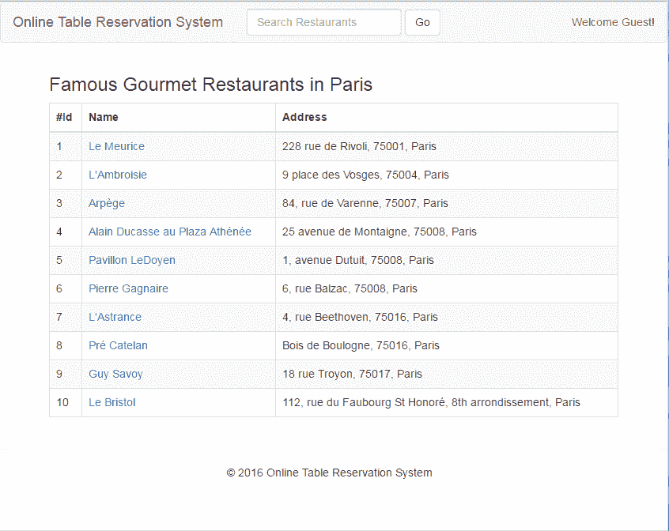

OTRS 主页带有餐厅列表

现在，为了设计我们的主页，我们需要添加以下四个文件：

+   `index.html`：我们的主 HTML 文件

+   `app.js`：我们的主 AngularJS 模块

+   `restaurants.js`：包含餐厅 Angular 服务的餐厅模块

+   `restaurants.html`：将显示列表的 HTML 模板

    餐厅

# `index.html`

首先，我们将`./app/index.html`添加到我们的项目工作区。`index.html`文件的内容将从这里开始解释。

我在代码之间添加了注释，以使代码更具可读性，更容易理解。

`index.html`文件分为许多部分。在这里我们将讨论一些关键部分。首先，我们将了解如何解决旧版本的 Internet Explorer。如果您想针对大于八版的 Internet Explorer 浏览器或 IE 九版及以后的版本，那么我们需要添加以下代码块，这将阻止 JavaScript 渲染并给最终用户输出`no-js`：

```java
<!--[if lt IE 7]>      <html lang="en" ng-app="otrsApp" class="no-js lt-ie9 lt-ie8 lt-ie7"> <![endif]--> 
<!--[if IE 7]>         <html lang="en" ng-app="otrsApp" class="no-js lt-ie9 lt-ie8"> <![endif]--> 
<!--[if IE 8]>         <html lang="en" ng-app="otrsApp" class="no-js lt-ie9"> <![endif]--> 
<!--[if gt IE 8]><!--> <html lang="en" ng-app="otrsApp" class="no-js"> <!--<![endif]--> 
```

然后，在添加几个`meta`标签和应用程序的标题之后，我们还将定义重要的`meta`标签`viewport`。`viewport`用于响应式 UI 设计。

在内容属性中定义的`width`属性控制`viewport`的大小。它可以设置为特定的像素值，例如`width = 600`，或者设置为特殊的`device-width`值，该值在 100%的缩放比例下是屏幕的宽度。

`initial-scale`属性控制页面首次加载时的缩放级别。`max-scale`、`min-scale`和`user-scalable`属性控制用户如何允许缩放页面：

```java
<meta name="viewport" content="width=device-width, initial-scale=1"> 
```

在接下来的几行中，我们将定义我们应用程序的样式表。我们从 HTML5 模板代码中添加了`normalize.css`和`main.css`。我们还添加了我们应用程序的自定义 CSS`app.css`。最后，我们添加了 Bootstrap 3 的 CSS。除了自定义的`app.css`之外，其他 CSS 都在其中引用。这些 CSS 文件没有变化：

```java
<link rel="stylesheet" href="bower_components/html5-boilerplate/dist/css/normalize.css"> 
<link rel="stylesheet" href="bower_components/html5-boilerplate/dist/css/main.css"> 
<link rel="stylesheet" href="public/css/app.css"> 
<link data-require="bootstrap-css@*" data-server="3.0.0" rel="stylesheet" href="//netdna.bootstrapcdn.com/bootstrap/3.0.0/css/bootstrap.min.css" /> 
```

然后，我们将使用`script`标签定义脚本。我们添加了现代 izer、Angular、Angular-route 和`app.js`，我们自己的开发的定制 JavaScript 文件。

我们已经讨论了 Angular 和 Angular-UI。`app.js`将在

下一节。

现代 izer 允许网络开发者在维持对不支持它们的浏览器的精细控制的同时使用新的 CSS3 和 HTML5 功能。基本上，现代 izer 在页面在浏览器中加载时执行下一代特性检测（检查这些特性的可用性）并报告结果。根据这些结果，您可以检测到浏览器中最新可用的特性，根据这些特性，您可以为最终用户提供一个界面。如果浏览器不支持一些特性，那么将向最终用户提供替代流程或 UI。

我们还将添加 Bootstrap 模板，这些模板是用 JavaScript 编写的，使用`ui-bootstrap-tpls javascript`文件：

```java
<script src="img/modernizr-2.8.3.min.js"></script> 
<script src="img/angular.min.js"></script> 
<script src="img/angular-route.min.js"></script> 
<script src="img/app.js"></script> 
<script data-require="ui-bootstrap@0.5.0" data-semver="0.5.0" src="img/ui-bootstrap-tpls-0.6.0.js"></script> 
```

我们还可以向`head`标签添加样式，如下面的代码所示。这些样式允许下拉菜单正常工作：

```java
<style> 
    div.navbar-collapse.collapse { 
      display: block; 
      overflow: hidden; 
      max-height: 0px; 
      -webkit-transition: max-height .3s ease; 
      -moz-transition: max-height .3s ease; 
      -o-transition: max-height .3s ease; 
      transition: max-height .3s ease; 
      } 
    div.navbar-collapse.collapse.in { 
      max-height: 2000px; 
      } 
</style> 
```

在`body`标签中，我们使用

`ng-controller`属性。在页面加载时，它告诉控制器将应用程序名称告诉 Angular，如下所示：

```java
<body ng-controller="otrsAppCtrl"> 
```

然后，我们定义主页的`header`部分。在`header`部分，我们将定义应用程序标题`在线餐桌预订系统`。此外，我们还将定义搜索餐厅的搜索表单：

```java
<!-- BEGIN HEADER --> 
        <nav class="navbar navbar-default" role="navigation"> 

            <div class="navbar-header"> 
                <a class="navbar-brand" href="#"> 
                    Online Table Reservation System 
                </a> 
            </div> 
            <div class="collapse navbar-collapse" ng-class="!navCollapsed && 'in'" ng-click="navCollapsed = true"> 
                <form class="navbar-form navbar-left" role="search" ng-submit="search()"> 
                    <div class="form-group"> 
                        <input type="text" id="searchedValue" ng-model="searchedValue" class="form-control" placeholder="Search Restaurants"> 
                    </div> 
                    <button type="submit" class="btn btn-default" ng-click="">Go</button> 
                </form> 
        <!-- END HEADER --> 
```

然后，下一节，中间部分，包括我们实际绑定了不同的视图，用实际的内容注释标记。`div`中的`ui-view`属性动态地从 Angular 获取其内容，例如餐厅详情、餐厅列表等。我们还为中间部分添加了警告对话框和加载动画，根据需要显示：

```java
<div class="clearfix"></div> 
    <!-- BEGIN CONTAINER --> 
    <div class="page-container container"> 
        <!-- BEGIN CONTENT --> 
        <div class="page-content-wrapper"> 
            <div class="page-content"> 
                <!-- BEGIN ACTUAL CONTENT --> 
                <div ui-view class="fade-in-up"></div> 
                <!-- END ACTUAL CONTENT --> 
            </div> 
        </div> 
        <!-- END CONTENT --> 
    </div> 
    <!-- loading spinner --> 
    <div id="loadingSpinnerId" ng-show="isSpinnerShown()" style="top:0; left:45%; position:absolute; z-index:999"> 
        <script type="text/ng-template" id="alert.html"> 
            <div class="alert alert-warning" role="alert"> 
            <div ng-transclude></div> 
            </div> 
        </script> 
        <uib-alert type="warning" template-url="alert.html"><b>Loading...</b></uib-alert> 
    </div> 
        <!-- END CONTAINER --> 
```

`index.html`的最后一部分是页脚。在这里，我们只是添加了静态内容和版权文本。您可以在這裡添加任何您想要的内容：

```java
        <!-- BEGIN FOOTER --> 
        <div class="page-footer"> 
            <hr/><div style="padding: 0 39%">&copy; 2016 Online Table Reservation System</div> 
        </div> 
        <!-- END FOOTER --> 
    </body> 
</html> 
```

# app.js

`app.js`是我们的主应用程序文件。因为我们已经在`index.html`中定义了它，

它在我们的`index.html`被调用时就已经加载。

我们需要注意不要将路由（URI）与 REST 端点混合。路由代表了 SPA 的状态/视图。

由于我们使用边缘服务器（代理服务器），一切都可以通过它访问，包括我们的 REST 端点。外部应用程序（包括 UI）将使用边缘服务器的宿主来访问应用程序。您可以在全局常量文件中配置它，然后在需要的地方使用它。这将允许您在单一位置配置 REST 主机并在其他地方使用它：

```java
'use strict'; 
/* 
This call initializes our application and registers all the modules, which are passed as an array in the second argument. 
*/ 
var otrsApp = angular.module('otrsApp', [ 
    'ui.router', 
    'templates', 
    'ui.bootstrap', 
    'ngStorage', 
    'otrsApp.httperror', 
    'otrsApp.login', 
    'otrsApp.restaurants' 
]) 
/* 
  Then we have defined the default route /restaurants 
*/ 
        .config([ 
            '$stateProvider', '$urlRouterProvider', 
            function ($stateProvider, $urlRouterProvider) { 
                $urlRouterProvider.otherwise('/restaurants'); 
            }]) 
/* 
   This functions controls the flow of the application and handles the events. 
*/ 
        .controller('otrsAppCtrl', function ($scope, $injector, restaurantService) { 
            var controller = this; 

            var AjaxHandler = $injector.get('AjaxHandler'); 
            var $rootScope = $injector.get('$rootScope'); 
            var log = $injector.get('$log'); 
            var sessionStorage = $injector.get('$sessionStorage'); 
            $scope.showSpinner = false; 
/* 
   This function gets called when the user searches any restaurant. It uses the Angular restaurant service that we'll define in the next section to search the given search string. 
*/ 
            $scope.search = function () { 
                $scope.restaurantService = restaurantService; 
                restaurantService.async().then(function () { 
                    $scope.restaurants = restaurantService.search($scope.searchedValue); 
                }); 
            } 
/* 
   When the state is changed, the new controller controls the flows based on the view and configuration and the existing controller is destroyed. This function gets a call on the destroy event. 
*/ 
            $scope.$on('$destroy', function destroyed() { 
                log.debug('otrsAppCtrl destroyed'); 
                controller = null; 
                $scope = null; 
            }); 

            $rootScope.fromState; 
            $rootScope.fromStateParams; 
            $rootScope.$on('$stateChangeSuccess', function (event, toState, toParams, fromState, fromStateParams) { 
                $rootScope.fromState = fromState; 
                $rootScope.fromStateParams = fromStateParams; 
            }); 

            // utility method 
            $scope.isLoggedIn = function () { 
                if (sessionStorage.session) { 
                    return true; 
                } else { 
                    return false; 
                } 
            }; 

            /* spinner status */ 
            $scope.isSpinnerShown = function () { 
                return AjaxHandler.getSpinnerStatus(); 
            }; 

        }) 
/* 
   This function gets executed when this object loads. Here we are setting the user object which is defined for the root scope. 
*/ 
        .run(['$rootScope', '$injector', '$state', function ($rootScope, $injector, $state) { 
                $rootScope.restaurants = null; 
                // self reference 
                var controller = this; 
                // inject external references 
                var log = $injector.get('$log'); 
                var $sessionStorage = $injector.get('$sessionStorage'); 
                var AjaxHandler = $injector.get('AjaxHandler'); 

                if (sessionStorage.currentUser) { 
                    $rootScope.currentUser = $sessionStorage.currentUser; 
                } else { 
                    $rootScope.currentUser = "Guest"; 
                    $sessionStorage.currentUser = "" 
                } 
            }]) 
```

# restaurants.js

`restaurants.js`代表了我们应用程序中一个用于餐厅的 Angular 服务，我们将在搜索、列表、详情等不同模块间使用它。我们知道服务的两个常见用途是组织代码和跨应用程序共享代码。因此，我们创建了一个餐厅服务，它将在不同的模块（如搜索、列表、详情等）间使用。

服务是单例对象，由 AngularJS 服务工厂延迟实例化。

以下部分初始化了餐厅服务模块并加载了所需的依赖项：

```java
angular.module('otrsApp.restaurants', [ 
    'ui.router', 
    'ui.bootstrap', 
    'ngStorage', 
    'ngResource' 
]) 
```

在配置中，我们使用 UI-Router 定义了`otrsApp.restaurants`模块的路线和状态：

首先，我们通过传递包含指向路由 URI 的 URL、指向显示`restaurants`状态的 HTML 模板的 URL 以及将处理`restaurants`视图上事件的路由器来定义`restaurants`状态。

在`restaurants`视图（`route - /restaurants`）之上，还定义了一个嵌套的`restaurants.profile`状态，它将代表特定的餐厅。例如，`/restaurant/1`会打开并显示代表`Id 1`的餐厅的概要（详情）页面。当在`restaurants`模板中点击链接时，这个状态会被调用。在这个`ui-sref="restaurants.profile({id: rest.id})"`中，`rest`代表了从`restaurants`视图中检索到的`restaurant`对象。

请注意，状态名是`'restaurants.profile'`，这告诉 AngularJS UI-Router `restaurants`状态的概要是一个嵌套状态：

```java
        .config([ 
            '$stateProvider', '$urlRouterProvider', 
            function ($stateProvider, $urlRouterProvider) { 
                $stateProvider.state('restaurants', { 
                    url: '/restaurants', 
                    templateUrl: 'restaurants/restaurants.html', 
                    controller: 'RestaurantsCtrl' 
                }) 
                        // Restaurant show page 
                        .state('restaurants.profile', { 
                            url: '/:id', 
                            views: { 
                                '@': { 
                                    templateUrl: 'restaurants/restaurant.html', 
                                    controller: 'RestaurantCtrl' 
                                } 
                            } 
                        }); 
            }]) 
```

在下一个代码部分，我们使用 Angular 工厂服务类型定义了餐厅服务。这个餐厅服务在加载时通过 REST 调用从服务器获取餐厅列表。它提供了餐厅操作的列表和搜索餐厅数据：

```java
        .factory('restaurantService', function ($injector, $q) { 
            var log = $injector.get('$log'); 
            var ajaxHandler = $injector.get('AjaxHandler'); 
            var deffered = $q.defer(); 
            var restaurantService = {}; 
            restaurantService.restaurants = []; 
            restaurantService.orignalRestaurants = []; 
            restaurantService.async = function () { 
                ajaxHandler.startSpinner(); 
                if (restaurantService.restaurants.length === 0) { 
                    ajaxHandler.get('/api/restaurant') 
                            .success(function (data, status, headers, config) { 
                                log.debug('Getting restaurants'); 
                                sessionStorage.apiActive = true; 
                                log.debug("if Restaurants --> " + restaurantService.restaurants.length); 
                                restaurantService.restaurants = data; 
                                ajaxHandler.stopSpinner(); 
                                deffered.resolve(); 
                            }) 
                            .error(function (error, status, headers, config) { 
                                restaurantService.restaurants = mockdata; 
                                ajaxHandler.stopSpinner(); 
                                deffered.resolve(); 
                            }); 
                    return deffered.promise; 
                } else { 
                    deffered.resolve(); 
                    ajaxHandler.stopSpinner(); 
                    return deffered.promise; 
                } 
            }; 
            restaurantService.list = function () { 
                return restaurantService.restaurants; 
            }; 
            restaurantService.add = function () { 
                console.log("called add"); 
                restaurantService.restaurants.push( 
                        { 
                            id: 103, 
                            name: 'Chi Cha\'s Noodles', 
                            address: '13 W. St., Eastern Park, New County, Paris', 
                        }); 
            }; 
            restaurantService.search = function (searchedValue) { 
                ajaxHandler.startSpinner(); 
                if (!searchedValue) { 
                    if (restaurantService.orignalRestaurants.length > 0) { 
                        restaurantService.restaurants = restaurantService.orignalRestaurants; 
                    } 
                    deffered.resolve(); 
                    ajaxHandler.stopSpinner(); 
                    return deffered.promise; 
                } else { 
                    ajaxHandler.get('/api/restaurant?name=' + searchedValue) 
                            .success(function (data, status, headers, config) { 
                                log.debug('Getting restaurants'); 
                                sessionStorage.apiActive = true; 
                                log.debug("if Restaurants --> " + restaurantService.restaurants.length); 
                                if (restaurantService.orignalRestaurants.length < 1) { 
                                    restaurantService.orignalRestaurants = restaurantService.restaurants; 
                                } 
                                restaurantService.restaurants = data; 
                                ajaxHandler.stopSpinner(); 
                                deffered.resolve(); 
                            }) 
                            .error(function (error, status, headers, config) { 
                                if (restaurantService.orignalRestaurants.length < 1) { 
                                    restaurantService.orignalRestaurants = restaurantService.restaurants; 
                                } 
                                restaurantService.restaurants = []; 
                                restaurantService.restaurants.push( 
                                        { 
                                            id: 104, 
                                            name: 'Gibsons - Chicago Rush St.', 
                                            address: '1028 N. Rush St., Rush & Division, Cook County, Paris' 
                                        }); 
                                restaurantService.restaurants.push( 
                                        { 
                                            id: 105, 
                                            name: 'Harry Caray\'s Italian Steakhouse', 
                                            address: '33 W. Kinzie St., River North, Cook County, Paris', 
                                        }); 
                                ajaxHandler.stopSpinner(); 
                                deffered.resolve(); 
                            }); 
                    return deffered.promise; 
                } 
            }; 
            return restaurantService; 
        }) 
```

在`restaurants.js`模块的下一部分，我们将添加两个控制器，我们在路由配置中为`restaurants`和`restaurants.profile`状态定义了这两个控制器。这两个控制器分别是`RestaurantsCtrl`和`RestaurantCtrl`，它们分别处理`restaurants`状态和`restaurants.profiles`状态。

`RestaurantsCtrl`控制器相当简单，它使用餐厅服务列表方法加载餐厅数据：

```java
        .controller('RestaurantsCtrl', function ($scope, restaurantService) { 
            $scope.restaurantService = restaurantService; 
            restaurantService.async().then(function () { 
                $scope.restaurants = restaurantService.list(); 
            }); 
        }) 
```

`RestaurantCtrl`控制器负责显示给定 ID 的餐厅详情。这也负责对显示的餐厅执行预订操作。当设计带有预订选项的餐厅详情页面时，将使用这个控制器：

```java
        .controller('RestaurantCtrl', function ($scope, $state, $stateParams, $injector, restaurantService) { 
            var $sessionStorage = $injector.get('$sessionStorage'); 
            $scope.format = 'dd MMMM yyyy'; 
            $scope.today = $scope.dt = new Date(); 
            $scope.dateOptions = { 
                formatYear: 'yy', 
                maxDate: new Date().setDate($scope.today.getDate() + 180), 
                minDate: $scope.today.getDate(), 
                startingDay: 1 
            }; 

            $scope.popup1 = { 
                opened: false 
            }; 
            $scope.altInputFormats = ['M!/d!/yyyy']; 
            $scope.open1 = function () { 
                $scope.popup1.opened = true; 
            }; 
            $scope.hstep = 1; 
            $scope.mstep = 30; 

            if ($sessionStorage.reservationData) { 
                $scope.restaurant = $sessionStorage.reservationData.restaurant; 
                $scope.dt = new Date($sessionStorage.reservationData.tm); 
                $scope.tm = $scope.dt; 
            } else { 
                $scope.dt.setDate($scope.today.getDate() + 1); 
                $scope.tm = $scope.dt; 
                $scope.tm.setHours(19); 
                $scope.tm.setMinutes(30); 
                restaurantService.async().then(function () { 
                    angular.forEach(restaurantService.list(), function (value, key) { 
                        if (value.id === parseInt($stateParams.id)) { 
                            $scope.restaurant = value; 
                        } 
                    }); 
                }); 
            } 
            $scope.book = function () { 
                var tempHour = $scope.tm.getHours(); 
                var tempMinute = $scope.tm.getMinutes(); 
                $scope.tm = $scope.dt; 
                $scope.tm.setHours(tempHour); 
                $scope.tm.setMinutes(tempMinute); 
                if ($sessionStorage.currentUser) { 
                    console.log("$scope.tm --> " + $scope.tm); 
                    alert("Booking Confirmed!!!"); 
                    $sessionStorage.reservationData = null; 
                    $state.go("restaurants"); 
                } else { 
                    $sessionStorage.reservationData = {}; 
                    $sessionStorage.reservationData.restaurant = $scope.restaurant; 
                    $sessionStorage.reservationData.tm = $scope.tm; 
                    $state.go("login"); 
                } 
            } 
        }) 
```

我们还在`restaurants.js`模块中添加了几个筛选器来格式化日期和时间。这些筛选器对输入数据执行以下格式化：

+   `date1`：返回输入日期，格式为`dd MMM yyyy`，例如，`13-Apr-2016`

+   `time1`：返回输入时间，格式为 HH:mm:ss，例如，`11:55:04`

+   `dateTime1`：返回输入日期和时间，格式为`dd MMM yyyy HH:mm:ss`，例如，`13-Apr-2016 11:55:04`

在下面的代码片段中，我们应用了这三个筛选器：

```java
        .filter('date1', function ($filter) { 
            return function (argDate) { 
                if (argDate) { 
                    var d = $filter('date')(new Date(argDate), 'dd MMM yyyy'); 
                    return d.toString(); 
                } 
                return ""; 
            }; 
        }) 
        .filter('time1', function ($filter) { 
            return function (argTime) { 
                if (argTime) { 
                    return $filter('date')(new Date(argTime), 'HH:mm:ss'); 
                } 
                return ""; 
            }; 
        }) 
        .filter('datetime1', function ($filter) { 
            return function (argDateTime) { 
                if (argDateTime) { 
                    return $filter('date')(new Date(argDateTime), 'dd MMM yyyy HH:mm a'); 
                } 
                return ""; 
            }; 
        }); 
```

# restaurants.html

我们需要添加为`restaurants.profile`状态定义的模板。正如你所见，在模板中，我们使用`ng-repeat`指令来遍历由`restaurantService.restaurants`返回的对象列表。`restaurantService`作用域变量在控制器中定义。`'RestaurantsCtrl'`与这个模板在`restaurants`状态中相关联：

```java
<h3>Famous Gourmet Restaurants in Paris</h3> 
<div class="row"> 
    <div class="col-md-12"> 
        <table class="table table-bordered table-striped"> 
            <thead> 
                <tr> 
                    <th>#Id</th> 
                    <th>Name</th> 
                    <th>Address</th> 
                </tr> 
            </thead> 
            <tbody> 
                <tr ng-repeat="rest in restaurantService.restaurants"> 
                    <td>{{rest.id}}</td> 
                    <td><a ui-sref="restaurants.profile({id: rest.id})">{{rest.name}}</a></td> 
                    <td>{{rest.address}}</td> 
                </tr> 
            </tbody> 
        </table> 
    </div> 
</div> 
```

# 搜索餐厅

在主页`index.html`中，我们在`header`部分添加了搜索表单，用于搜索餐厅。搜索餐厅功能将使用前面描述的相同文件。它使用`app.js`（搜索表单处理程序）、`restaurants.js`（餐厅服务）和`restaurants.html`来显示搜索到的记录：

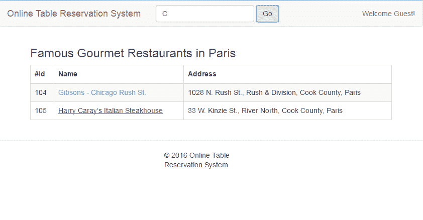

OTRS 主页带餐厅列表

# 带有预订选项的餐厅详情

带有预订选项的餐厅详情将作为内容区域（页面中间部分）的一部分。这部分将包含一个顶部面包屑，带有餐厅链接至餐厅列表页面，随后是餐厅的名称和地址。最后部分将包含预订部分，包含日期和时间选择框和一个预订按钮。

此页面将如下所示：

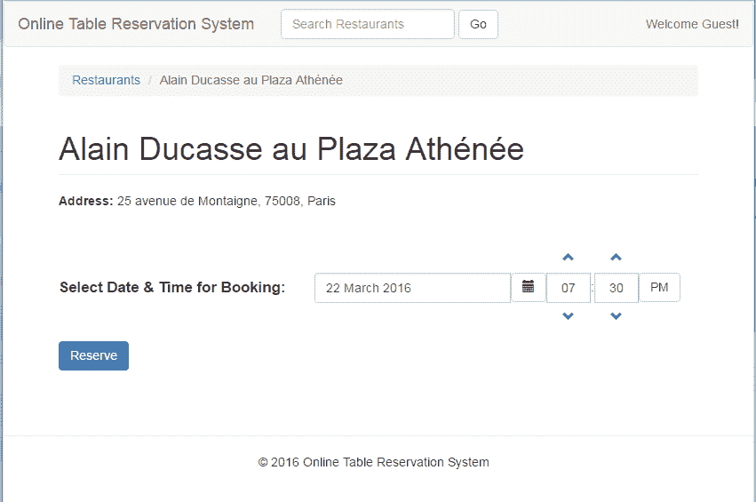

餐厅详情页面带预订选项

在这里，我们将使用在`restaurants.js`中声明的相同的餐厅服务。

唯一的变化将是模板，正如为`restaurants.profile`状态描述的那样。这个模板将使用`restaurant.html`定义。

# restaurant.html

正如你所见，面包屑正在使用`restaurants`路由，这是使用`ui-sref`属性定义的。在这个模板中设计的预订表单在表单提交时使用`ng-submit`指令调用控制器`RestaurantCtrl`中的`book()`函数：

```java
<div class="row"> 
<div class="row"> 
    <div class="col-md-12"> 
        <ol class="breadcrumb"> 
            <li><a ui-sref="restaurants">Restaurants</a></li> 
            <li class="active">{{restaurant.name}}</li> 
        </ol> 
        <div class="bs-docs-section"> 
            <h1 class="page-header">{{restaurant.name}}</h1> 
            <div> 
                <strong>Address:</strong> {{restaurant.address}} 
            </div> 
            </br></br> 
            <form ng-submit="book()"> 
                <div class="input-append date form_datetime"> 
                    <div class="row"> 
                        <div class="col-md-7"> 
                            <p class="input-group"> 
                                <span style="display: table-cell; vertical-align: middle; font-weight: bolder; font-size: 1.2em">Select Date & Time for Booking:</span> 
                                <span style="display: table-cell; vertical-align: middle"> 
                                    <input type="text" size=20 class="form-control" uib-datepicker-popup="{{format}}" ng-model="dt" is-open="popup1.opened" datepicker-options="dateOptions" ng-required="true" close-text="Close" alt-input-formats="altInputFormats" /> 
                                </span> 
                                <span class="input-group-btn"> 
                                    <button type="button" class="btn btn-default" ng-click="open1()"><i class="glyphicon glyphicon-calendar"></i></button> 
                                </span> 
                            <uib-timepicker ng-model="tm" ng-change="changed()" hour-step="hstep" minute-step="mstep"></uib-timepicker> 
                            </p> 
                        </div> 
                    </div></div> 
                <div class="form-group"> 
                    <button class="btn btn-primary" type="submit">Reserve</button> 
                </div> 
            </form></br></br> 
        </div> 
    </div> 
</div> 
```

# 登录页面

当用户在选择预订日期和时间后点击餐厅详情页面上的“预订”按钮时，餐厅详情页面会检查用户是否已经登录。如果用户没有登录，那么将显示登录页面。它的样子如下截图所示：

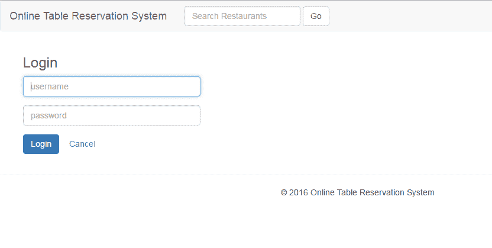

登录页面

我们不是从服务器上验证用户。相反，我们只是将用户名填充到会话存储和根作用域中，以实现流程。

一旦用户登录，他们将被重定向回带有持久状态的同一预订页面。然后，用户可以继续预订。登录页面基本上使用两个文件：`login.html`和`login.js`。

# 登录.html

`login.html`模板只包含两个输入字段，分别是用户名和密码，以及登录按钮和取消链接。取消链接重置表单，登录按钮提交登录表单。

在这里，我们使用`LoginCtrl`与`ng-controller`指令。登录表单使用`ng-submit`指令提交，该指令调用`LoginCtrl`的`submit`函数。首先使用`ng-model`指令收集输入值，然后使用它们的相应属性 - `_email`和`_password`提交：

```java
<div ng-controller="LoginCtrl as loginC" style="max-width: 300px"> 
    <h3>Login</h3> 
    <div class="form-container"> 
        <form ng-submit="loginC.submit(_email, _password)"> 
            <div class="form-group"> 
                <label for="username" class="sr-only">Username</label> 
                <input type="text" id="username" class="form-control" placeholder="username" ng-model="_email" required autofocus /> 
            </div> 
            <div class="form-group"> 
                <label for="password" class="sr-only">Password</label> 
                <input type="password" id="password" class="form-control" placeholder="password" ng-model="_password" /> 
            </div> 
            <div class="form-group"> 
                <button class="btn btn-primary" type="submit">Login</button> 
                <button class="btn btn-link" ng-click="loginC.cancel()">Cancel</button> 
            </div> 
        </form> 
    </div> 
</div> 
```

# 登录.js

登录模块定义在`login.js`文件中，该文件使用`module`函数包含和加载依赖项。使用`config`函数定义登录状态，该函数接收包含`url`、`控制器`和`templateUrl`属性的 JSON 对象。

在`controller`内部，我们定义了`取消`和`提交`操作，这些操作是从`login.html`模板中调用的：

```java
angular.module('otrsApp.login', [ 
    'ui.router', 
    'ngStorage' 
]) 
        .config(function config($stateProvider) { 
            $stateProvider.state('login', { 
                url: '/login', 
                controller: 'LoginCtrl', 
                templateUrl: 'login/login.html' 
            }); 
        }) 
        .controller('LoginCtrl', function ($state, $scope, $rootScope, $injector) { 
            var $sessionStorage = $injector.get('$sessionStorage'); 
            if ($sessionStorage.currentUser) { 
                $state.go($rootScope.fromState.name, $rootScope.fromStateParams); 
            } 
            var controller = this; 
            var log = $injector.get('$log'); 
            var http = $injector.get('$http'); 

            $scope.$on('$destroy', function destroyed() { 
                log.debug('LoginCtrl destroyed'); 
                controller = null; 
                $scope = null; 
            }); 
            this.cancel = function () { 
                $scope.$dismiss; 
                $state.go('restaurants'); 
            } 
            console.log("Current --> " + $state.current); 
            this.submit = function (username, password) { 
                $rootScope.currentUser = username; 
                $sessionStorage.currentUser = username; 
                if ($rootScope.fromState.name) { 
                    $state.go($rootScope.fromState.name, $rootScope.fromStateParams); 
                } else { 
                    $state.go("restaurants"); 
                } 
            }; 
        });
```

# 预订确认

一旦用户登录并点击了预订按钮，餐厅控制器将显示带有确认信息的弹窗，如下面的截图所示：

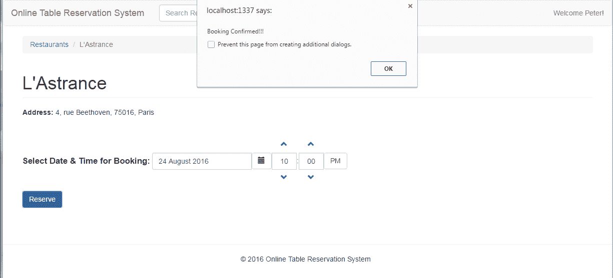

餐厅详情页面带预订确认

# 设置网络应用程序

因为我们计划使用最新的技术堆栈来开发我们的 UI 应用程序，我们将使用 Node.js 和**npm**（**Node.js 包管理器**），它们为开发服务器端 JavaScript 网络应用程序提供了开源运行环境。

我建议您浏览这一部分。它将向您介绍 JavaScript 构建工具和堆栈。然而，如果您已经了解 JavaScript 构建工具，或者不想探索它们，您可以跳过这一部分。

Node.js 基于 Chrome 的 V8 JavaScript 引擎，并使用事件驱动、非阻塞 I/O，使其轻量级且高效。Node.js 的默认包管理器 npm 是最大的开源库生态系统。它允许安装 Node.js 程序，并使指定和链接依赖项变得更容易：

1.  首先，如果尚未安装，我们需要安装 npm。这是一个先决条件。你可以通过访问链接来安装 npm：[`docs.npmjs.com/getting-started/installing-node`](https://docs.npmjs.com/getting-started/installing-node)。

1.  要检查 npm 是否正确设置，请在命令行界面（CLI）上执行`npm -v`命令。它应该在输出中返回已安装的 npm 版本。我们可以切换到 NetBeans 来创建一个新的 AngularJS JS HTML5 项目。在本章撰写之时，我使用的是 NetBeans 8.1。

1.  导航到文件|新建项目。一个新项目对话框应该会出现。选择“HTML5/JavaScript”在类别列表中，以及“HTML5/JS 应用程序”在项目选项中，如下图所示：

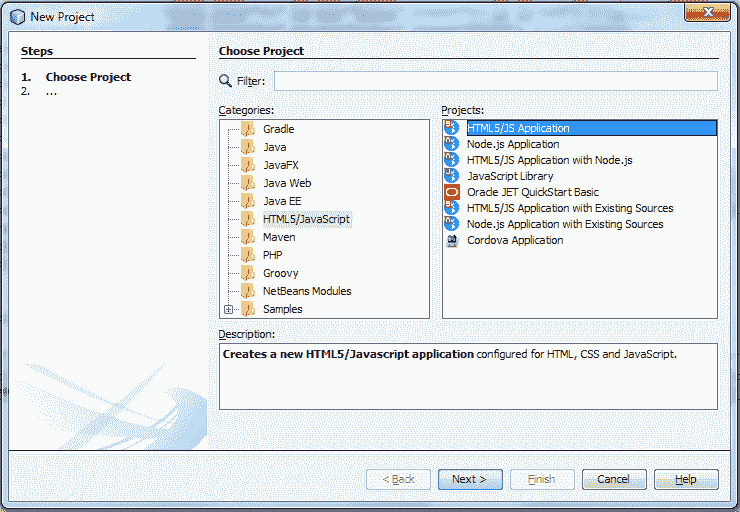

NetBeans - 新 HTML5/JavaScript 项目

1.  点击“下一步”按钮。然后，在“名称和位置”对话框中输入项目名称、项目位置、

    和在项目文件夹中点击

    下一步按钮：

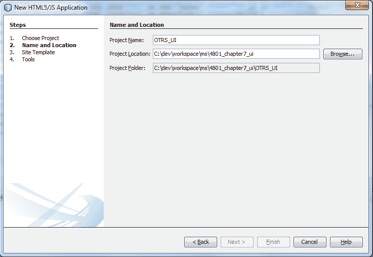

NetBeans 新项目 - 名称和位置

1.  在“网站模板”对话框中，选择“下载在线模板”选项下的 AngularJS Seed 项目，然后点击“下一步”按钮。AngularJS Seed 项目可在以下网址找到：[`github.com/angular/angular-seed`](https://github.com/angular/angular-seed)：

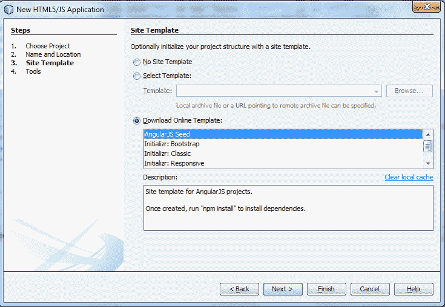

NetBeans 新项目 - 网站模板

1.  在“工具”对话框中，选择创建`package.json`、创建`bower.json`和创建`gulpfile.js`。我们将使用 gulp 作为我们的构建工具。Gulp 和 Grunt 是 JS 最流行的构建框架之二。作为一个 Java 程序员，你可以将这些工具与 Ant 相关联。两者都有自己的优点。如果你愿意，你也可以使用`Gruntfile.js`作为构建工具：

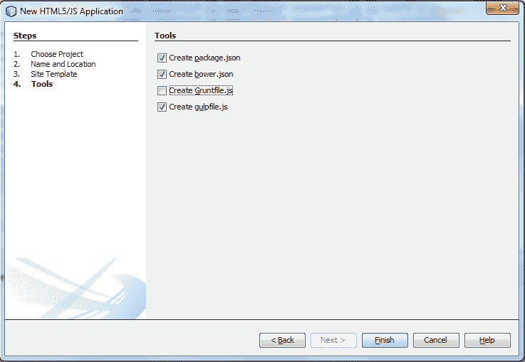

Netbeans 新项目 - 工具

1.  现在，一旦你点击完成，你就可以看到 HTML5/JS 应用程序目录和文件。目录结构将如下所示：

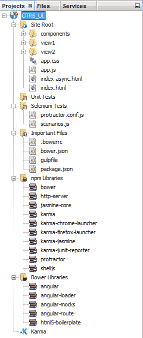

AngularJS 种子目录结构

1.  如果你的项目中所有必需的依赖项都没有正确配置，你还会看到一个感叹号。你可以通过右键点击项目，然后选择“解决项目问题”选项来解决项目问题：

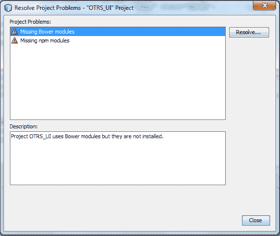

解决项目问题对话框

1.  理想情况下，NetBeans 会在你点击“解决...”按钮时解决项目问题。

1.  你还可以通过为一些 JS 模块（如 Bower、gulp 和 Node）提供正确的路径来解决几个问题：

+   **Bower**：用于管理 OTRS 应用程序的 JavaScript 库

+   **Gulp**：任务运行器，用于构建我们的项目，如 ANT

+   **Node**：用于执行我们的服务器端 OTRS 应用程序

Bower 是一个依赖管理工具，它像 npm 一样工作。npm 用于安装 Node.js 模块，而 Bower 用于管理您的网络应用程序的库/组件。

1.  点击工具菜单并选择选项。现在，设置 Bower、gulp 和 Node.js 的路径，如以下屏幕截图所示。要设置 Bower 路径，请点击 Bower 标签，如下面的屏幕截图所示，并更新路径：

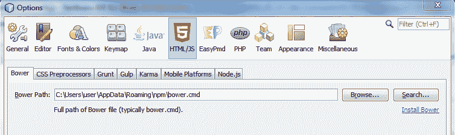

设置 Bower 路径

1.  要设置 Gulp 路径，请点击 Gulp 标签，如下面的屏幕截图所示，并更新路径：

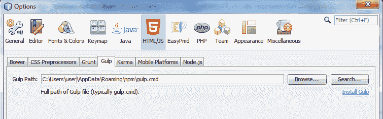

设置 Gulp 路径

1.  设置 Node 路径，请点击 Node.js 标签，如以下屏幕截图所示，并更新路径：

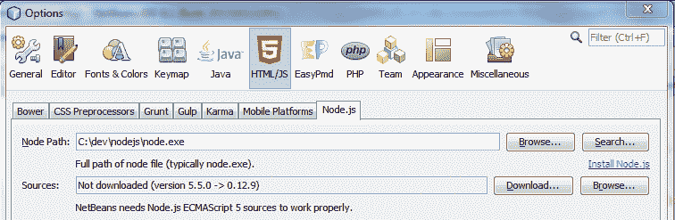

设置 Node 路径

1.  完成后，package.json 将如下所示。我们对一些条目的值进行了修改，如名称、描述、依赖项等：

```java
{ 
  "name": "otrs-ui", 
  "private": true, 
  "version": "1.0.0", 
  "description": "Online Table Reservation System", 
  "main": "index.js", 
  "license": "MIT", 
  "dependencies": { 
    "coffee-script": "¹.10.0", 
    "del": "¹.1.1", 
    "gulp-angular-templatecache": "¹.9.1", 
    "gulp-clean": "⁰.3.2", 
    "gulp-connect": "³.2.3", 
    "gulp-file-include": "⁰.13.7", 
    "gulp-sass": "².3.2", 
    "gulp-util": "³.0.8", 
    "run-sequence": "¹.2.2" 
  }, 
  "devDependencies": { 
    "coffee-script": "*", 
    "gulp-sass": "*", 
    "bower": "¹.3.1", 
    "http-server": "⁰.6.1", 
    "jasmine-core": "².3.4", 
    "karma": "~0.12", 
    "karma-chrome-launcher": "⁰.1.12", 
    "karma-firefox-launcher": "⁰.1.6", 
    "karma-jasmine": "⁰.3.5", 
    "karma-junit-reporter": "⁰.2.2", 
    "protractor": "².1.0", 
    "shelljs": "⁰.2.6" 
  }, 
  "scripts": { 
    "postinstall": "bower install", 
    "prestart": "npm install", 
    "start": "http-server -a localhost -p 8000 -c-1", 
    "pretest": "npm install", 
    "test": "karma start karma.conf.js", 
    "test-single-run": "karma start karma.conf.js  --single-run", 
    "preupdate-webdriver": "npm install", 
    "update-webdriver": "webdriver-manager update", 
    "preprotractor": "npm run update-webdriver", 
    "protractor": "protractor e2e-tests/protractor.conf.js", 
    "update-index-async": "node -e \"require('shelljs/global'); sed('-i', /\\/\\/@@NG_LOADER_START@@[\\s\\S]*\\/\\/@@NG_LOADER_END@@/, '//@@NG_LOADER_START@@\\n' + sed(/sourceMappingURL=angular-loader.min.js.map/,'sourceMappingURL=bower_components/angular-loader/angular-loader.min.js.map','app/bower_components/angular-loader/angular-loader.min.js') + '\\n//@@NG_LOADER_END@@', 'app/index-async.html');\"" 
  } 

}
```

1.  然后，我们将更新`bower.json`，如下面的代码片段所示：

```java
{ 
    "name": "OTRS-UI", 
    "description": "OTRS-UI", 
    "version": "0.0.1", 
    "license": "MIT", 
    "private": true, 
    "dependencies": { 
        "AngularJS": "~1.5.0", 
        "AngularJS-ui-router": "~0.2.18", 
        "AngularJS-mocks": "~1.5.0", 
        "AngularJS-bootstrap": "~1.2.1", 
        "AngularJS-touch": "~1.5.0", 
        "bootstrap-sass-official": "~3.3.6", 
        "AngularJS-route": "~1.5.0", 
        "AngularJS-loader": "~1.5.0", 
        "ngstorage": "⁰.3.10", 
        "AngularJS-resource": "¹.5.0", 
        "html5-boilerplate": "~5.2.0" 
    } 
} 
```

1.  接下来，我们将修改`.bowerrc`文件，如下面的代码所示，以指定 Bower 将在其中存储`bower.json`中定义的组件的目录。我们将 Bower 组件存储在应用程序目录下：

```java
{ 
  "directory": "app/bower_components" 
} 
```

1.  接下来，我们将设置`gulpfile.js`。我们将使用`CoffeeScript`定义`gulp`任务。因此，我们只需在`gulpfile.js`中定义`CoffeeScript`，实际的任务将在`gulpfile.coffee`文件中定义。让我们看看`gulpfile.js`文件的内容：

```java
require('coffee-script/register'); 
require('./gulpfile.coffee'); 
```

1.  在此步骤中，我们将定义`gulp`配置。我们使用`CoffeeScript`定义`gulp`文件。用`CoffeeScript`编写的`gulp`文件的名称是`gulpfile.coffee`。默认任务定义为`default_sequence`：

```java
default_sequence = ['connect', 'build', 'watch']
```

让我们了解`default_sequence`任务执行的内容：

+   根据定义的`default_sequence`任务，首先它会连接到服务器，然后构建网络应用程序，并监视更改。监视将帮助我们在代码中做出更改并在 UI 上立即显示。

+   此脚本中最重要的任务是`connect`和`watch`。其他任务不言自明。所以，让我们深入了解一下它们。

+   `gulp-connect`：这是一个`gulp`插件，用于运行网络服务器。它还支持实时重新加载。

+   `gulp-watch`：这是一个文件监视器，使用 chokidar，并发出 vinyl 对象（描述文件的路径和内容的对象）。简而言之，我们可以说`gulp-watch`监视文件更改并触发任务。

`gulpfile.coffee`可能看起来像这样：

```java
gulp          = require('gulp') 
gutil         = require('gulp-util') 
del           = require('del'); 
clean         = require('gulp-clean') 
connect       = require('gulp-connect') 
fileinclude   = require('gulp-file-include') 
runSequence   = require('run-sequence') 
templateCache = require('gulp-AngularJS-templatecache') 
sass          = require('gulp-sass') 

paths = 
  scripts: 
    src: ['app/src/scripts/**/*.js'] 
    dest: 'public/scripts' 
  scripts2: 
    src: ['app/src/views/**/*.js'] 
    dest: 'public/scripts' 
  styles: 
    src: ['app/src/styles/**/*.scss'] 
    dest: 'public/styles' 
  fonts: 
    src: ['app/src/fonts/**/*'] 
    dest: 'public/fonts' 
  images: 
    src: ['app/src/images/**/*'] 
    dest: 'public/images' 
  templates: 
    src: ['app/src/views/**/*.html'] 
    dest: 'public/scripts' 
  html: 
    src: ['app/src/*.html'] 
    dest: 'public' 
  bower: 
    src: ['app/bower_components/**/*'] 
    dest: 'public/bower_components' 

#copy bower modules to public directory 
gulp.task 'bower', -> 
  gulp.src(paths.bower.src) 
  .pipe gulp.dest(paths.bower.dest) 
  .pipe connect.reload() 

#copy scripts to public directory 
gulp.task 'scripts', -> 
  gulp.src(paths.scripts.src) 
  .pipe gulp.dest(paths.scripts.dest) 
  .pipe connect.reload() 

#copy scripts2 to public directory 
gulp.task 'scripts2', -> 
  gulp.src(paths.scripts2.src) 
  .pipe gulp.dest(paths.scripts2.dest) 
  .pipe connect.reload() 

#copy styles to public directory 
gulp.task 'styles', -> 
  gulp.src(paths.styles.src) 
  .pipe sass() 
  .pipe gulp.dest(paths.styles.dest) 
  .pipe connect.reload() 

#copy images to public directory 
gulp.task 'images', -> 
  gulp.src(paths.images.src) 
  .pipe gulp.dest(paths.images.dest) 
  .pipe connect.reload() 

#copy fonts to public directory 
gulp.task 'fonts', -> 
  gulp.src(paths.fonts.src) 
  .pipe gulp.dest(paths.fonts.dest) 
  .pipe connect.reload() 

#copy html to public directory 
gulp.task 'html', -> 
  gulp.src(paths.html.src) 
  .pipe gulp.dest(paths.html.dest) 
  .pipe connect.reload() 

#compile AngularJS template in a single js file 
gulp.task 'templates', -> 
  gulp.src(paths.templates.src) 
  .pipe(templateCache({standalone: true})) 
  .pipe(gulp.dest(paths.templates.dest)) 

#delete contents from public directory 
gulp.task 'clean', (callback) -> 
  del ['./public/**/*'], callback; 

#Gulp Connect task, deploys the public directory 
gulp.task 'connect', -> 
  connect.server 
    root: ['./public'] 
    port: 1337 
    livereload: true 

gulp.task 'watch', -> 
  gulp.watch paths.scripts.src, ['scripts'] 
  gulp.watch paths.scripts2.src, ['scripts2'] 
  gulp.watch paths.styles.src, ['styles'] 
  gulp.watch paths.fonts.src, ['fonts'] 
  gulp.watch paths.html.src, ['html'] 
  gulp.watch paths.images.src, ['images'] 
  gulp.watch paths.templates.src, ['templates'] 

gulp.task 'build', ['bower', 'scripts', 'scripts2', 'styles', 'fonts', 'images', 'templates', 'html'] 

default_sequence = ['connect', 'build', 'watch'] 

gulp.task 'default', default_sequence 

gutil.log 'Server started and waiting for changes' 
```

1.  一旦我们准备好前面的更改，我们将使用以下命令安装`gulp`：

```java
npm install --no-optional gulp
```

要在 Windows 环境中安装 Windows 构建工具，请运行以下命令：

```java
npm install --global --production windows-build-tools 
```

1.  此外，我们将使用以下命令安装其他`gulp`库，如`gulp-clean`、`gulp-connect`等：

```java
npm install --save --no-optional gulp-util gulp-clean gulp-connect gulp-file-include run-sequence gulp-angular-templatecache gulp-sass del coffee-script
```

1.  - 现在，我们可以使用以下命令安装`bower.json`文件中定义的 Bower 依赖项：

```java
bower install --s
```

- 如果尚未安装 Bower，请使用以下命令安装：

```java
npm install -g bower
```

- 前一条命令的输出将如下所示：

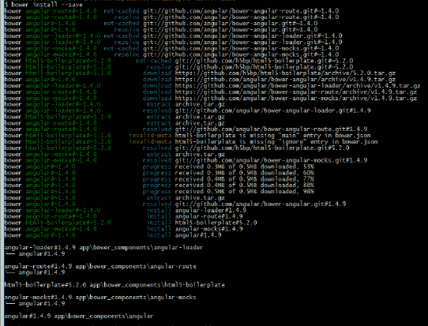

- 示例输出 - bower install --s

1.  - 这里是设置的最后一步。在这里，我们将确认目录结构应如下所示。我们将把`src`和`published`构件（在`./public`目录中）作为独立的目录保存。因此，下面的目录结构与默认的 AngularJS 种子项目不同：

```java
+---app 
|   +---bower_components 
|   |   +---AngularJS 
|   |   +---AngularJS-bootstrap 
|   |   +---AngularJS-loader 
|   |   +---AngularJS-mocks 
|   |   +---AngularJS-resource 
|   |   +---AngularJS-route 
|   |   +---AngularJS-touch 
|   |   +---AngularJS-ui-router 
|   |   +---bootstrap-sass-official 
|   |   +---html5-boilerplate 
|   |   +---jquery 
|   |   \---ngstorage 
|   +---components 
|   |   \---version 
|   +---node_modules 
|   +---public 
|   |   \---css 
|   \---src 
|       +---scripts 
|       +---styles 
|       +---views 
+---e2e-tests 
+---nbproject 
|   \---private 
+---node_modules 
+---public 
|   +---bower_components 
|   +---scripts 
|   +---styles 
\---test
```

# - 参考资料

- 以下是一些推荐阅读的参考资料：

+   - 《AngularJS by Example》，Packt Publishing: [`www.packtpub.com/web-development/angularjs-example`](https://www.packtpub.com/web-development/angularjs-example)

+   - Angular Seed Project: [`github.com/angular/angular-seed`](https://github.com/angular/angular-seed)

+   - Angular UI: [`angular-ui.github.io/bootstrap/`](https://angular-ui.github.io/bootstrap/)

+   - Gulp: [`gulpjs.com/`](http://gulpjs.com/)

# - 摘要

- 在本章中，我们了解到了新的动态网络应用开发。

- 多年来，它已经发生了彻底的变化。网络应用的前端完全使用纯 HTML 和 JavaScript 开发，而不是使用任何服务器端技术，如 JSP、servlets、ASP 等。使用 JavaScript 开发的 UI 应用程序现在有其自己的开发环境，如 npm、Bower 等。我们探讨了 AngularJS 框架来开发我们的网络应用程序。它通过提供内置特性和对 Bootstrap 以及处理 AJAX 调用的`$http`服务的支持，使事情变得更容易。

- 我希望您已经掌握了 UI 开发的概述以及现代应用程序是如何与服务器端微服务集成开发的。在下一章中，我们将学习微服务设计的最优实践和常见原则。本章将提供有关使用行业实践和示例进行微服务开发的详细信息。它还将包含微服务实施出错的示例以及如何避免这些问题。
