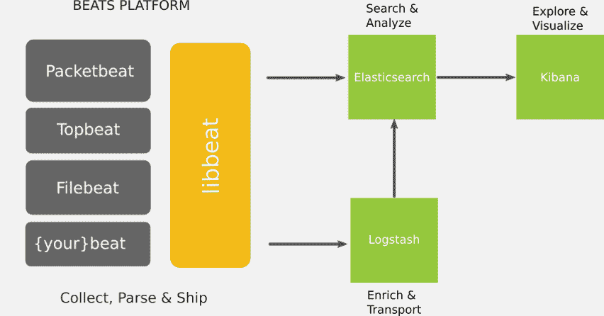
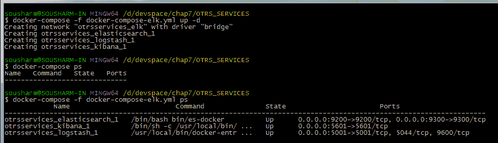
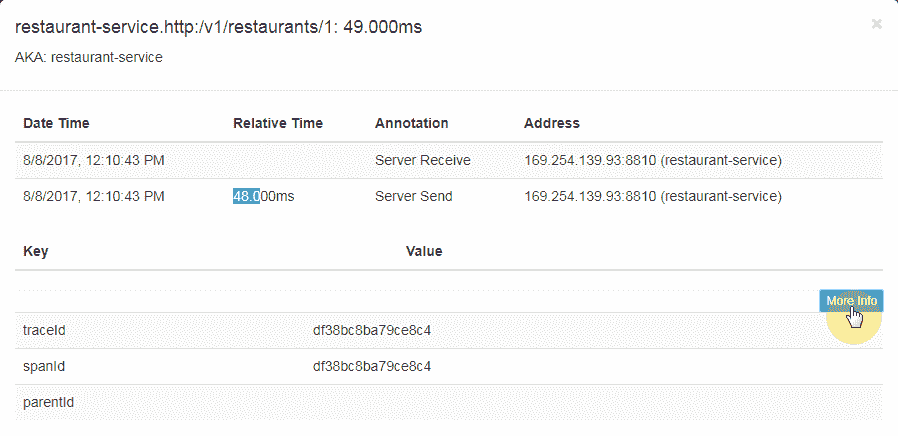
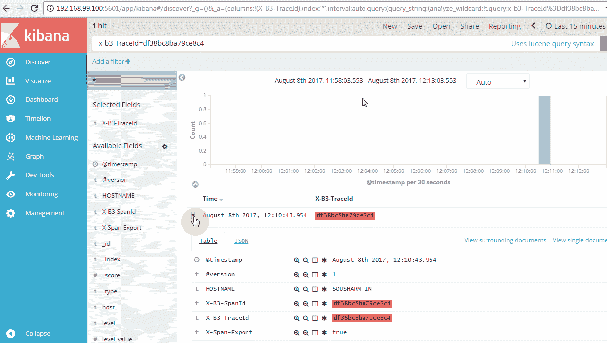

# 第十章：故障排除指南

我们已经走了这么远，我相信您享受这段具有挑战性和快乐的学习旅程中的每一个时刻。我不会说这本书在此章节后结束，而是您正在完成第一个里程碑。这个里程碑为基于微服务设计的云学习和新范式实施打开了大门。我想再次确认集成测试是测试微服务和 API 之间交互的重要方法。在您处理在线表格预订系统（OTRS）的示例应用程序时，我相信您遇到了许多挑战，尤其是在调试应用程序时。在这里，我们将介绍一些可以帮助您排除部署应用程序、Docker 容器和宿主机的故障的最佳实践和工具。

本章涵盖以下三个主题：

+   日志记录和 ELK 栈

+   使用 Zipkin 和 Sleuth 进行服务调用时使用相关 ID

+   依赖关系和版本

# 日志记录和 ELK 栈

您能想象在生产系统上不查看日志的情况下调试任何问题吗？简单地说，不能，因为回到过去将会很困难。因此，我们需要日志记录。日志还为我们提供了关于系统的警告信号，如果它们是这样设计和编码的话。日志记录和日志分析是排除任何问题的重要步骤，也是提高吞吐量、扩展能力和监控系统健康状况的重要步骤。因此，拥有一个非常好的日志平台和策略将使调试变得有效。日志是软件开发初期最重要的关键组成部分之一。

微服务通常使用如 Docker 之类的图像容器进行部署，这些容器提供有助于您读取部署在容器内的服务日志的命令。Docker 和 Docker Compose 提供命令以分别流式传输容器内运行服务和所有容器的日志输出。请参阅以下 Docker 和 Docker Compose 的`logs`命令：

**Docker 日志命令：** **用法：** `docker logs [OPTIONS] <CONTAINER NAME>`  **获取容器的日志：**

`**-f, --follow 跟随日志输出**`

`**--help 打印用法**`

`**--since="" 自时间戳以来显示日志**`

`**-t, --timestamps 显示时间戳**`

`**--tail="all" 显示日志末尾的行数**`

**Docker Compose 日志命令：** `**用法：docker-compose logs [options] [SERVICE...]**`

**选项：**

`**--no-color 产生单色输出**`

`**-f, --follow 跟随日志输出**`

`**-t, --timestamps 显示时间戳**`

`**--tail 显示每个容器日志末尾的行数**

**[SERVICES...] 代表容器的服务 - 你可以指定多个**`

这些命令帮助你探索运行在容器中的微服务和其它进程的日志。正如你所看到的，当你有很多服务时，使用上述命令将是一个挑战性的任务。例如，如果你有数十个或数百个微服务，跟踪每个微服务的日志将非常困难。同样，你可以想象，即使没有容器，单独监控日志也会非常困难。因此，你可以想象探索和关联数十到数百个容器的日志有多么困难。这是耗时的，并且几乎没有任何价值。

因此，像 ELK 堆栈这样的日志聚合和可视化工具就派上用场了。它将用于集中日志。我们将在下一节中探讨这一点。

# 简要概述

**Elasticsearch、Logstash、Kibana**（**ELK**）堆栈是一系列执行日志聚合、分析、可视化和监控的工具。ELK 堆栈提供了一个完整的日志平台，允许你分析、可视化和监控所有日志，包括各种产品日志和系统日志。如果你已经了解 ELK 堆栈，请跳到下一节。在这里，我们将简要介绍 ELK 堆栈中的每个工具：



ELK 概览（来源：elastic.co）

# Elasticsearch

Elasticsearch 是最受欢迎的企业级全文搜索引擎之一。它是开源软件。它是可分发的，并支持多租户。单个 Elasticsearch 服务器存储多个索引（每个索引代表一个数据库），单个查询可以搜索多个索引的数据。它是一个分布式搜索引擎，并支持集群。

它易于扩展，可以提供接近实时的搜索，延迟仅为 1 秒。它使用 Java 编写，依赖于 Apache Lucene。Apache Lucene 也是免费和开源的，它为 Elasticsearch 提供了核心，也被称为信息检索软件库。

Elasticsearch API 广泛且详尽。Elasticsearch 提供基于 JSON 的架构，占用更少的存储，并以 JSON 的形式表示数据模型。Elasticsearch API 使用 JSON 文档进行 HTTP 请求和响应。

# Logstash

Logstash 是一个具有实时流水线功能的开源数据收集引擎。简单来说，它收集、解析、处理和存储数据。由于 Logstash 具有数据流水线功能，它帮助你处理来自各种系统的各种事件数据，如日志。Logstash 作为一个代理运行，收集数据、解析数据、过滤数据，并将输出发送到指定应用，如 Elasticsearch，或简单的控制台标准输出。

它还拥有一个非常好的插件生态系统（图片来源于[www.elastic.co](http://www.elastic.co)：


Logstash 生态系统

# Kibana

Kibana 是一个开源的分析与可视化网页应用程序。它被设计用来与 Elasticsearch 协同工作。你使用 Kibana 来搜索、查看与交互存储在 Elasticsearch 索引中的数据。

这是一个基于浏览器的网络应用程序，让你执行高级数据分析并在各种图表、表格和地图中可视化你的数据。此外，它是一个零配置应用程序。因此，安装后既不需要编写任何代码，也不需要额外的基础设施。

# ELK 栈设置

通常，这些工具是单独安装，然后配置成相互通信。这些组件的安装相当直接。从指定位置下载可安装的工件，并按照下一节中的安装步骤进行操作。

下面提供的安装步骤是基本设置的一部分，这是你想要运行的 ELK 栈所必需的。由于这个安装是在我的本地主机上完成的，所以我使用了主机 localhost。它可以很容易地用你想要的任何相应的主机名来替换。

# 安装 Elasticsearch

要安装 Elasticsearch，我们可以使用 Elasticsearch 的 Docker 镜像：

```java
docker pull docker.elastic.co/elasticsearch/elasticsearch:5.5.1 
```

我们也可以按照以下步骤安装 Elasticsearch：

1.  从[`www.elastic.co/downloads/elasticsearch`](https://www.elastic.co/downloads/elasticsearch)下载最新的 Elasticsearch 分发版。

1.  将它解压到系统中的所需位置。

1.  确保安装了最新版本的 Java，并且`JAVA_HOME`环境变量已设置。

1.  前往 Elasticsearch 的主页并运行`bin/elasticsearch`，在基于 Unix 的系统上，以及在 Windows 上运行`bin/elasticsearch.bat`。

1.  打开任何浏览器并输入`http://localhost:9200/`。成功安装后，它应该会为你提供一个类似于以下的 JSON 对象：

```java
{ 
  "name" : "Leech", 
  "cluster_name" : "elasticsearch", 
  "version" : { 
    "number" : "2.3.1", 
    "build_hash" : "bd980929010aef404e7cb0843e61d0665269fc39", 
    "build_timestamp" : "2016-04-04T12:25:05Z", 
    "build_snapshot" : false, 
    "lucene_version" : "5.5.0" 
  }, 
  "tagline" : "You Know, for Search" 
}
```

默认情况下，GUI 并没有安装。你可以通过从`bin`目录执行以下命令来安装，确保系统连接到互联网：

```java
  plugin -install mobz/elasticsearch-head

```

1.  如果你正在使用 Elasticsearch 镜像，那么就运行 Docker 镜像（稍后，我们将使用`docker-compose`一起运行 ELK 栈）。

1.  现在，你可以通过 URL`http://localhost:9200/_plugin/head/`访问 GUI 界面。你可以将`localhost`和`9200`替换为你的主机名和端口号。

# 安装 Logstash

要安装 Logstash，我们可以使用 Logstash 的 Docker 镜像：

```java
docker pull docker.elastic.co/logstash/logstash:5.5.1 
```

我们也可以通过执行以下步骤来安装 Logstash：

1.  从[`www.elastic.co/downloads/logstash`](https://www.elastic.co/downloads/logstash)下载最新的 Logstash 分发版。

1.  将它解压到系统中的所需位置。

    准备一个配置文件，如下所示。它指示 Logstash 从给定文件中读取输入并将其传递给 Elasticsearch（请参阅下面的`config`文件；Elasticsearch 由 localhost 和`9200`端口表示）。这是最简单的配置文件。要添加过滤器并了解更多关于 Logstash 的信息，你可以探索可用的 Logstash 参考文档[`www.elastic.co/guide/en/logstash/current/index.html`](https://www.elastic.co/guide/en/logstash/current/index.html)。

正如你所看到的，OTRS 的`service`日志和`edge-server`日志作为输入添加了。同样地，你也可以添加其他微服务的日志文件。

```java
input { 
  ### OTRS ### 
  file { 
    path => "\logs\otrs-service.log" 
    type => "otrs-api" 
    codec => "json" 
    start_position => "beginning" 
  } 

  ### edge ### 
  file { 
    path => "/logs/edge-server.log" 
    type => "edge-server" 
    codec => "json" 
  } 
} 

output { 
  stdout { 
    codec => rubydebug 
  } 
  elasticsearch { 
    hosts => "localhost:9200" 
  } 
} 
```

1.  在 Unix-based 系统上，前往 Logstash 主目录并运行`bin/logstash agent -f logstash.conf`，在 Windows 上，运行`bin/logstash.bat agent -f logstash.conf`。在这里，Logstash 使用`agent`命令执行。Logstash 代理从配置文件中提供的输入字段中的源收集数据，并将输出发送到 Elasticsearch。在这里，我们没有使用过滤器，因为否则它可能会在将数据提供给 Elasticsearch 之前处理输入数据。

同样地，你可以使用下载的 Docker 镜像来运行 Logstash（稍后，我们将使用`docker-compose`来一起运行 ELK 栈）。

# 安装 Kibana

要安装 Kibana，我们可以使用 Kibana 的 Docker 镜像：

```java
docker pull docker.elastic.co/kibana/kibana:5.5.1 
```

我们还可以通过执行以下步骤来安装 Kibana 网页应用程序：

1.  从[`www.elastic.co/downloads/kibana`](https://www.elastic.co/downloads/kibana)下载最新的 Kibana 分发版。

1.  将其解压到系统中的所需位置。

1.  打开 Kibana 主目录下的配置文件`config/kibana.yml`，并将`elasticsearch.url`指向之前配置的 Elasticsearch 实例。

```java
   elasticsearch.url: "http://localhost:9200"
```

1.  在 Unix-based 系统上，前往 Kibana 主目录并运行`bin/kibana agent -f logstash.conf`，在 Windows 上，运行`bin/kibana.bat agent -f logstash.conf`。

1.  如果你使用的是 Kibana 的 Docker 镜像，那么你可以运行 Docker 镜像（稍后，我们将使用 docker-compose 来一起运行 ELK 栈）。

1.  现在，你可以通过 URL`http://localhost:5601/`从你的浏览器访问 Kibana 应用。

    要了解更多关于 Kibana 的信息，请探索 Kibana 参考文档[`www.elastic.co/guide/en/kibana/current/getting-started.html`](https://www.elastic.co/guide/en/kibana/current/getting-started.html)。

正如我们遵循前面的步骤，你可能已经注意到它需要一些努力。如果你想要避免手动设置，你可以 Docker 化它。如果你不想花精力创建 ELK 栈的 Docker 容器，你可以在 Docker Hub 上选择一个。在 Docker Hub 上，有许多现成的 ELK 栈 Docker 镜像。你可以尝试不同的 ELK 容器，选择最适合你的那个。`willdurand/elk`是最受欢迎的容器，启动简单，与 Docker Compose 配合良好。

# 使用 Docker Compose 运行 ELK 栈

截至撰写本节时，elastic.co 自己的 Docker 仓库中可用的 ELK 镜像默认启用了 XPack 包。将来，这可能成为可选的。根据 ELK 镜像中 XPack 的可用性，您可以修改`docker-compose-elk.yml` `docker-compose`文件：

```java
version: '2' 

services: 
  elasticsearch: 
    image: docker.elastic.co/elasticsearch/elasticsearch:5.5.1 
    ports: 
      - "9200:9200" 
      - "9300:9300" 
    environment: 
      ES_JAVA_OPTS: "-Xmx256m -Xms256m" 
      xpack.security.enabled: "false" 
      xpack.monitoring.enabled: "false" 
      # below is required for running in dev mode. For prod mode remove them and vm_max_map_count kernel setting needs to be set to at least 262144 
      http.host: "0.0.0.0" 
      transport.host: "127.0.0.1" 
    networks: 
      - elk 

  logstash: 
    image: docker.elastic.co/logstash/logstash:5.5.1 
    #volumes: 
    #  - ~/pipeline:/usr/share/logstash/pipeline 
    #  windows manually copy to docker cp pipleline/logstash.conf 305321857e9f:/usr/share/logstash/pipeline. restart container after that 
    ports: 
      - "5001:5001" 
    environment: 
      LS_JAVA_OPTS: "-Xmx256m -Xms256m" 
      xpack.monitoring.enabled: "false" 
      xpack.monitoring.elasticsearch.url: "http://192.168.99.100:9200" 
      command: logstash -e 'input { tcp { port => 5001 codec => "json" } } output { elasticsearch { hosts => "192.168.99.100" index => "mmj" } }' 
    networks: 
      - elk 
    depends_on: 
      - elasticsearch 

  kibana: 
    image: docker.elastic.co/kibana/kibana:5.5.1 
    ports: 
      - "5601:5601" 
    environment: 
      xpack.security.enabled: "false" 
      xpack.reporting.enabled: "false" 
      xpack.monitoring.enabled: "false" 
    networks: 
      - elk 
    depends_on: 
      - elasticsearch 

networks: 
  elk: 
    driver: bridge 

```

一旦保存了 ELK Docker Compose 文件，您可以使用以下命令运行 ELK 堆栈（该命令从包含 Docker Compose 文件的目录运行）：

```java
docker-compose -f docker-compose-elk.yml up -d 
```

前一条命令的输出如以下截图所示：



使用 Docker Compose 运行 ELK 堆栈

如果不使用卷，环境管道将无法工作。对于像 Windows 7 这样的 Windows 环境，通常很难配置卷，您可以将管道 CONF 文件复制到容器内并重新启动 Logstash 容器：

```java
docker cp pipleline/logstash.conf <logstash container id>:/usr/share/logstash/pipeline 
```

在复制`pipeline/logstash.conf`管道 CONF 文件后，请重新启动 Logstash 容器：

```java
input { 
  tcp { 
    port => 5001 
    codec => "json" 
  } 
} 

output { 
  elasticsearch { 
    hosts => "elasticsearch:9200" 
  } 
} 
```

# 将日志推送到 ELK 堆栈

我们已经完成了使 ELK 堆栈可供消费的工作。现在，Logstash 只需要一个可以被 Elasticsearch 索引的日志流。一旦创建了日志的 Elasticsearch 索引，就可以在 Kibana 仪表板上访问和处理日志。

为了将日志推送到 Logstash，我们需要在我们的服务代码中进行以下更改。我们需要在 OTRS 服务中添加 logback 和 logstash-logback 编码器依赖项。

在`pom.xml`文件中添加以下依赖项：

```java
... 
<dependency> 
    <groupId>net.logstash.logback</groupId> 
    <artifactId>logstash-logback-encoder</artifactId> 
    <version>4.6</version> 
</dependency> 
<dependency> 
    <groupId>ch.qos.logback</groupId> 
    <artifactId>logback-core</artifactId> 
    <version>1.1.9</version> 
</dependency> 
... 
```

我们还需要通过向`src/main/resources`添加`logback.xml`来配置 logback。

`logback.xml`文件将看起来像这样：

```java
<?xml version="1.0" encoding="UTF-8"?> 
<configuration debug="true"> 
    <appender name="stash" class="net.logstash.logback.appender.LogstashTcpSocketAppender"> 
        <destination>192.168.99.100:5001</destination> 
        <!-- encoder is required --> 
        <encoder class="net.logstash.logback.encoder.LogstashEncoder" /> 
        <keepAliveDuration>5 minutes</keepAliveDuration> 
    </appender> 
    <appender name="stdout" class="ch.qos.logback.core.ConsoleAppender"> 
        <encoder> 
            <pattern>%d{HH:mm:ss.SSS} [%thread, %X{X-B3-TraceId:-},%X{X-B3-SpanId:-}] %-5level %logger{36} - %msg%n</pattern> 
        </encoder> 
    </appender> 

    <property name="spring.application.name" value="nameOfService" scope="context"/> 

    <root level="INFO"> 
        <appender-ref ref="stash" /> 
        <appender-ref ref="stdout" /> 
    </root> 

    <shutdownHook class="ch.qos.logback.core.hook.DelayingShutdownHook"/> 
</configuration>
```

这里，目标是在`192.168.99.100:5001`上，那里托管 Logstash；根据您的配置，您可以进行更改。对于编码器，使用了`net.logstash.logback.encoder.LogstashEncoder`类。`spring.application.name`属性的值应设置为配置的服务。同样，添加了一个关闭钩子，以便在服务停止时，应释放和清理所有资源。

您希望在 ELK 堆栈可用后启动服务，以便服务可以将日志推送到 Logstash。

一旦 ELK 堆栈和服务启动，您可以检查 ELK 堆栈以查看日志。您希望在启动 ELK 堆栈后等待几分钟，然后访问以下 URL（根据您的配置替换 IP）。

为了检查 Elasticsearch 是否启动，请访问以下 URL：

```java
http://192.168.99.100:9200/  
```

为了检查是否已创建索引，请访问以下任一 URL：

```java
http://192.168.99.100:9200/_cat/indices?v 
http://192.168.99.100:9200/_aliases?pretty 
```

一旦完成了 Logstash 索引（您可能有一些服务端点来生成一些日志），请访问 Kibana：

```java
http://192.168.99.100:5601/ 
```

# ELK 堆栈实现的技巧

以下是一些实施 ELK 堆栈的有用技巧：

+   为了避免任何数据丢失并处理输入负载的突然激增，建议在 Logstash 和 Elasticsearch 之间使用如 Redis 或 RabbitMQ 之类的代理。

+   如果你使用集群，为 Elasticsearch 使用奇数个节点，以防止分脑问题。

+   在 Elasticsearch 中，总是为给定数据使用适当的字段类型。这将允许您执行不同的检查；例如，`int`字段类型将允许您执行`("http_status:<400")`或`("http_status:=200")`。同样，其他字段类型也允许您执行类似的检查。

# 为服务调用使用关联 ID

当你调用任何 REST 端点时，如果出现任何问题，很难追踪问题和其根本原因，因为每个调用都是对服务器的调用，这个调用可能调用另一个，依此类推。这使得很难弄清楚特定请求是如何转换的以及它调用了什么。通常，由一个服务引起的问题可能会在其他服务上产生连锁反应，或者可能导致其他服务操作失败。这很难追踪，可能需要巨大的努力。如果是单体结构，你知道你在正确的方向上，但是微服务使得难以理解问题的来源以及你应该获取数据的位置。

# 让我们看看我们如何解决这个问题

通过在所有调用中传递关联 ID，它允许您轻松跟踪每个请求和跟踪路由。每个请求都将有其唯一的关联 ID。因此，当我们调试任何问题时，关联 ID 是我们的起点。我们可以跟随它，在这个过程中，我们可以找出哪里出了问题。

关联 ID 需要一些额外的开发工作，但这是值得的努力，因为它在长远中帮助很大。当请求在不同微服务之间传递时，你将能够看到所有交互以及哪个服务存在问题。

这不是为微服务发明的新东西。这个模式已经被许多流行产品使用，例如微软 SharePoint。

# 使用 Zipkin 和 Sleuth 进行跟踪

对于 OTRS 应用程序，我们将利用 Zipkin 和 Sleuth 进行跟踪。它提供了跟踪 ID 和跨度 ID 以及一个漂亮的 UI 来跟踪请求。更重要的是，您可以在 Zipkin 中找到每个请求所花费的时间，并允许您深入挖掘以找出响应请求耗时最长的请求。

在下面的截图中，你可以看到餐厅`findById` API 调用所花费的时间以及同一请求的跟踪 ID。它还显示了跨度 ID：



餐厅`findById` API 调用的总时间和跟踪 ID

我们将遵循以下步骤来配置 OTRS 服务中的 Zipkin 和 Sleuth。

你只需要向跟踪和请求跟踪中添加 Sleuth 和 Sleuth-Zipkin 依赖项：

```java
<dependency> 
    <groupId>org.springframework.cloud</groupId> 
    <artifactId>spring-cloud-starter-sleuth</artifactId> 
</dependency> 
<dependency> 
    <groupId>org.springframework.cloud</groupId> 
    <artifactId>spring-cloud-sleuth-zipkin</artifactId> 
</dependency> 
```

访问 Zipkin 仪表板，找出不同请求所花费的时间。如果默认端口已更改，请替换端口。请确保在使用 Zipkin 之前服务已经启动：

```java
http://<zipkin host name>:9411/zipkin/ 
```

现在，如果 ELK 栈已经配置并运行，那么你可以使用这个跟踪 ID 在 Kibana 中找到相应的日志，如下面的屏幕截图所示。Kibana 中有一个 X-B3-TraceId 字段，用于根据跟踪 ID 过滤日志：

Kibana 仪表板 - 根据请求跟踪 ID 搜索

# 依赖关系和版本

在产品开发中，我们面临的两个常见问题是循环依赖和 API 版本。我们将讨论它们在微服务架构中的情况。

# 循环依赖及其影响

通常，单体架构有一个典型的层次模型，而微服务携带图模型。因此，微服务可能会有循环依赖。

因此，对微服务关系进行依赖检查是必要的。

让我们来看看以下两个案例：

+   如果你在你的微服务之间有一个依赖循环，当某个事务可能卡在循环中时，你的分布式栈可能会遇到溢出错误。例如，当一个人在预订餐厅的桌子时。在这种情况下，餐厅需要知道这个人（`findBookedUser`），而这个人需要知道在某个时间点的餐厅（`findBookedRestaurant`）。如果设计不当，这些服务可能会相互调用形成循环。结果可能是由 JVM 产生的栈溢出。

+   如果两个服务共享一个依赖项，而你以可能影响它们的方式更新那个其他服务的 API，你需要一次性更新所有三个。这会引发一些问题，比如你应该先更新哪一个？此外，你如何使这个过渡变得安全？

# 在设计系统时分析依赖关系

因此，在设计微服务时，确立不同服务之间的适当关系以避免任何循环依赖是非常重要的。

这是一个设计问题，必须加以解决，即使这需要对代码进行重构。

# 维护不同版本

当你拥有更多服务时，这意味着每个服务都有不同的发布周期，这通过引入不同版本的服务增加了这种复杂性，因为同样的 REST 服务会有不同的版本。当解决方案在一个版本中消失，在更高版本中回归时，重现问题将变得非常困难。

# 让我们进一步探索

API 的版本化很重要，因为随着时间的推移，API 会发生变化。你的知识和经验会随着时间而提高，这会导致 API 的变化。改变 API 可能会破坏现有的客户端集成。

因此，有许多方法可以管理 API 版本。其中一种方法是使用我们在本书中使用的路径版本；还有一些人使用 HTTP 头。HTTP 头可能是一个自定义请求头，或者您可以使用`Accept Header`来表示调用 API 的版本。有关如何使用 HTTP 头处理版本的信息，请参阅 Bhakti Mehta 著，Packt 出版社出版的*RESTful Java Patterns and Best Practices*： [`www.packtpub.com/application-development/restful-java-patterns-and-best-practices`](https://www.packtpub.com/application-development/restful-java-patterns-and-best-practices)。

在排查任何问题时，让微服务在日志中产生版本号非常重要。此外，理想情况下，您应该避免任何微服务版本过多的实例。

# 参考文献

以下链接将提供更多信息：

+   Elasticsearch: [`www.elastic.co/products/elasticsearch`](https://www.elastic.co/products/elasticsearch)

+   Logstash: [`www.elastic.co/products/logstash`](https://www.elastic.co/products/logstash)

+   Kibana: [`www.elastic.co/products/kibana`](https://www.elastic.co/products/kibana)

+   `willdurand/elk`：ELK Docker 镜像

+   *精通 Elasticsearch - 第二版*: [`www.packtpub.com/web-development/mastering-elasticsearch-second-edition`](https://www.packtpub.com/web-development/mastering-elasticsearch-second-edition)

# 总结

在本章中，我们探讨了 ELK 堆栈的概述和安装。在 ELK 堆栈中，Elasticsearch 用于存储来自 Kibana 的日志和服务查询。Logstash 是运行在您希望收集日志的每个服务器上的代理。Logstash 读取日志，过滤/转换它们，并将它们提供给 Elasticsearch。Kibana 从 Elasticsearch 中读取/查询数据，并以表格或图形可视化的形式呈现它们。

我们也非常理解在排查问题时拥有关联 ID 的实用性。在本章末尾，我们也发现了某些微服务设计的一些不足。由于在本书中涵盖所有与微服务相关的主题具有挑战性，因此我尽可能地包含尽可能多的相关信息，并配有精确的章节和参考文献，这使您能够进一步探索。现在，我希望让您开始在您的工作场所或个人项目中实施本章学到的概念。这不仅能为您提供实践经验，还可能使您掌握微服务。此外，您还将能够参加当地的技术聚会和会议。
