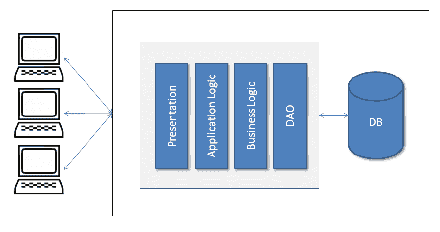
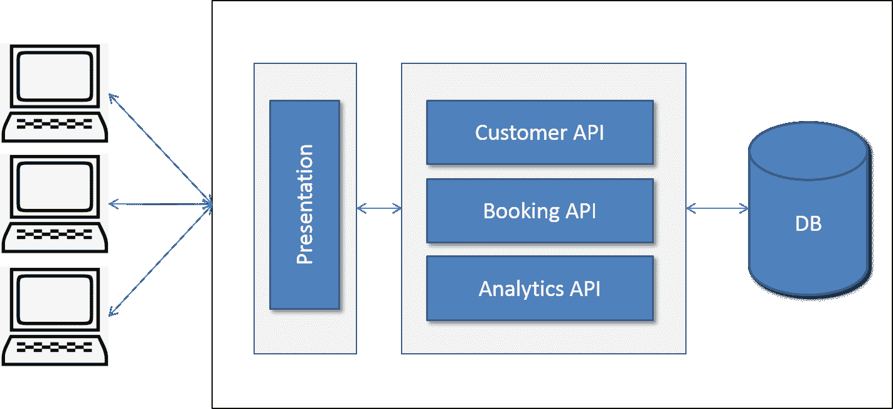
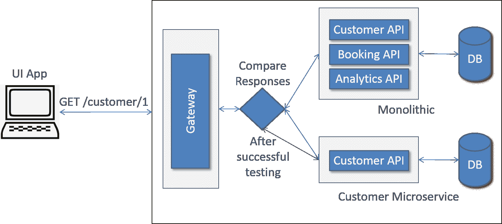
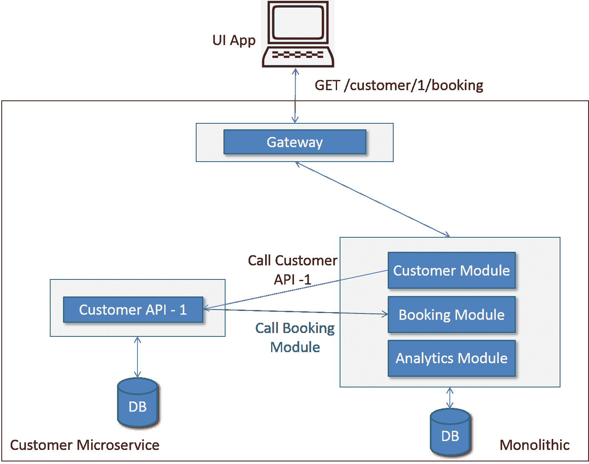

# 第十一章：将单体应用迁移到基于微服务的应用

我们已经到了这本书的最后一章，我希望你已经享受并掌握了完整的微服务（除了数据库）开发。我试图涵盖所有必要的主题，为你提供一个微服务为基础的生产应用程序的全面视角，并允许你进行更多的探索。既然你已经了解了微服务架构和设计，你就可以很容易地区分单体应用和微服务应用，并识别出将单体应用迁移到微服务应用需要做的工作。

在本章中，我们将讨论将单体应用重构为基于微服务的应用。我假设一个现有的单体应用已经被部署并正在被客户使用。在本章结束时，你将了解可以将单体迁移到微服务的不同方法和策略。

本章涵盖以下主题：

+   你需要迁移吗？

+   成功迁移的方法和关键

# 你需要迁移吗？

这是你应该为你的迁移设定基调的第一个问题。你真的需要将现有的应用程序迁移到基于微服务的架构吗？它带来了哪些好处？后果是什么？我们如何支持现有的本地客户？现有客户是否支持并承担迁移到微服务的成本？我需要从头开始写代码吗？数据将如何迁移到新的基于微服务的系统？迁移的时间表是什么？现有团队是否有能力快速带来这种变化？我们是否可以接受在迁移期间的新功能变化？我们的流程是否能够适应迁移？等等。我相信你们脑海中会有很多类似的问题。我希望，从所有之前的章节中，你可能已经获得了关于微服务系统所需工作的良好知识。

在所有利弊之后，你的团队将决定迁移。如果答案是肯定的，本章将帮助你了解迁移的下一步。

# 云服务与本地部署，还是两者都提供？

你的现有产品是对云解决方案、本地解决方案，还是提供云和本地解决方案，或者你想开始提供云解决方案与本地解决方案。你的方法将基于你提供的解决方案类型。

# 仅限云解决方案

如果你提供云服务，那么你的迁移任务比其他两种解决方案要容易。话说回来，这并不意味着它会一帆风顺。你将完全控制迁移。你有权不考虑迁移对客户的直接影响。云客户只需使用解决方案，而不关心它是如何实现或托管的。我假设没有 API 或 SDK 的更改，显然，迁移不应涉及任何功能更改。仅在云上进行微服务迁移具有使用平稳渐进迁移的优势。这意味着你首先转换 UI 应用程序，然后是一个 API/服务，然后是下一个，依此类推。请注意，你掌控着局面。

# 仅本地服务解决方案

本地解决方案部署在客户的基础设施上。除此之外，你可能有许多客户在其基础设施上部署了不同版本的产品。你无法完全控制这些部署。你需要与客户合作，需要团队共同努力才能实现成功的迁移。

此外，在接触客户之前，你应该准备好一个完整的迁移解决方案。如果你的产品有不同版本，这会变得尤为困难。我建议只提供最新版本的迁移，而在你开发迁移时，只允许客户进行安全性和修补操作。是的，你不应该提供任何新功能。

# 云服务和本地服务

如果你的应用程序同时提供云服务和本地服务，那么将本地解决方案迁移到微服务可以与云服务同步进行，反之亦然。这意味着如果你在迁移一个方面付出了努力，你可以在另一个方面复制同样的成果。因此，除了之前提到的云或本地迁移挑战外，还需要在其他环境中进行复制。另外，有时本地客户可能有自己的定制化需求。在迁移时也需要考虑到这些需求。在这里，你应该首先将自有的云解决方案迁移到微服务，之后再复制到本地环境。

将生产/解决方案仅基于本地部署，但你想开始云部署；这是最具挑战性的。你预计要按照我的微服务设计迁移现有代码，同时确保它也支持现有的本地部署。有时，这可能是遗留技术堆栈，或者现有代码甚至可能是使用某些自有专有技术（如协议）编写的。现有设计可能不够灵活，无法拆分为微服务。这种迁移最具挑战性。应该逐步将本地解决方案迁移到微服务，首先分离 UI 应用程序并提供与 UI 应用程序交互的外部 API。如果 API 已经存在，或者你的应用程序已经分为独立的 UI 应用程序，相信我，这为迁移减轻了大量的负担。然后，你可以专注于迁移服务器端代码，包括为 UI 应用程序开发的 API。你可能会问为什么我们不能一起迁移所有 UI 应用程序、API 和服务器代码。是的，你可以这样做。但是，逐步迁移会给你带来确定性、信心和快速的失败/学习。毕竟，敏捷开发就是关于逐步开发。

如果你的现有代码不是模块化的，或者包含大量的遗留代码，那么我建议你首先重构它并使其模块化。这将使你的任务变得容易。说到这里，应该逐个模块进行。在将代码迁移到纯微服务之前，尽可能多地分解和重构代码。

我们将讨论一些方法，这些方法可能有助于你将大型复杂的单体应用程序重构为微服务。

# 成功迁移的方法和关键

软件现代化已经进行了很多年。为了成功进行软件现代化（迁移），已经做了大量工作。你会发现研究所有成功软件现代化的最佳实践和原则很有用。在本章中，我们将具体讨论微服务架构的软件现代化。

# 逐步迁移

你应该以渐进的方式将单体应用转换为微服务。你不应该一次性开始整个代码的全功能迁移。这会纠缠风险-回报比率并增加失败的可能性。它还增加了过渡时间（因此是成本）的可能性。你可能想将你的代码分成不同的模块，然后逐一开始转换每个模块。很可能你可能会想从头重新编写一些模块，如果现有代码紧密耦合且过于复杂难以重构，这就应该做。但是，从头开始编写完整的解决方案是大忌。你应该避免这样做。它增加了成本、迁移的时间以及失败的可能性。

# 过程自动化和工具设置

敏捷方法与微服务紧密合作。您可以使用任何敏捷过程，如 Scrum 和 Kanban，以及现代开发过程，如测试驱动开发或同行编程，进行增量开发。对于基于微服务的环境，流程自动化是必不可少的。您应该实施自动化的持续集成/持续部署和测试自动化。如果交付物的容器化还没有在 CI/CD 管道中完成，那么您应该去做。它使新开发的微服务能够与现有系统或其他新微服务成功集成。

在开始您的第一个微服务转型之前，您可能需要同时或先设置服务发现、服务网关、配置服务器或任何基于事件的系统。

# 试点项目

我在微服务迁移中观察到的另一个问题是，从一开始就完全不同模块的开发。理想情况下，一个小团队应该进行试点项目，将现有模块中的任何一个转换为微服务。一旦成功，相同的方法可以复制到其他模块。如果您同时开始各种模块的迁移，那么您可能在所有微服务中重复同样的错误。这增加了失败的风险和转型的持续时间。

成功迁移的团队提供了成功开发模块及其与现有单体应用程序集成的途径。如果您成功地一个接一个地将每个模块转换为微服务，那么在某个时候，您将拥有一个基于微服务的应用程序，而不是一个单体应用程序。

# 独立的用户界面应用程序

如果您已经有了消耗 API 的独立用户界面应用程序，那么您距离成功的迁移已经不远了。如果不是这样，这应该是第一步，将用户界面与服务器代码分离。UI 应用程序将消耗 API。如果现有应用程序没有应该被 UI 应用程序消耗的 API，那么您应该在现有代码之上编写包装 API。

请查看以下图表，反映 UI 应用程序迁移之前的呈现层：

在 UI 应用程序迁移之前

以下图表反映了 UI 应用程序迁移后的呈现层：

UI 应用程序迁移后

您可以看到，以前，UI 被包含在单体应用程序中，与业务逻辑和 DAO 一起。迁移后，UI 应用程序从单体应用程序中分离出来，并使用 API 与服务器代码通信。REST 是实现 API 的标准，可以在现有代码之上编写。

# 将模块迁移到微服务

现在，你有一个服务器端的单体应用程序和一个或多个 UI 应用程序。这为你提供了另一个优势，即在分离模块的同时消费 API，从而分离现有的单体应用程序。例如，在分离 UI 应用程序后，你可能将其中一个模块转换为微服务。一旦 UI 应用程序成功测试，与该模块相关的 API 调用可以路由到新转换的模块，而不是现有的单体 API。如图所示，当调用 API `GET/customer/1` 时，网络`网关`可以将请求路由到`客户微服务`，而不是`单体`应用程序。

你还可以通过比较单体和微服务模块的响应，在将基于微服务的 API 上线之前，在生产环境中进行测试。一旦我们得到一致的匹配响应，我们可以确信转换已经成功完成，并且 API 调用可以迁移到重构模块的 API。如图所示，当调用客户 API 时，部署了一个组件，该组件会调用一个新的客户微服务。然后，它比较了两次调用的响应并存储结果。这些结果可以进行分析，并对任何不一致性进行修复。当新转换的微服务的响应与现有的单体响应相匹配时，你可以停止将调用路由到现有的单体应用程序，并用新的微服务替换它。

采用这种方法，你可以将模块一个接一个地迁移到微服务，并在某个时刻，你可以将所有的单体模块迁移到微服务。

API 路由、比较和迁移

# 如何在迁移过程中容纳新功能

在迁移的理想场景中应避免添加新功能。只允许重要的修复和安全更改。然而，如果迫切需要实现一个新功能，那么它应该在一个单独的微服务中开发，或者以现有的单体代码模块化的方式开发，使其与现有代码的分离更容易。

例如，如果你确实需要在`客户`模块中添加一个新功能，而这个功能不依赖于其他模块，你只需创建一个新的客户微服务，并将其用于特定的 API 调用，无论是对外部世界还是通过其他模块。是否使用 REST 调用或事件进行进程间通信，由你自己决定。

同样，如果您需要一个具有依赖关系的新功能（例如，一个新客户功能依赖于预订功能）并且它没有被暴露为 UI 或服务 API 的 API，那么它仍然可以作为独立的微服务开发，如下面的图表所示。`customer`模块调用一个新开发的微服务，然后它调用`booking`模块进行请求处理，并将响应返回到`customer`模块。在这里，用于进程间通信的可以是 REST 或事件。

实现一个新模块作为微服务，调用另一个模块

# 参考文献

阅读以下书籍以获取有关代码重构和领域驱动设计的更多信息：

+   《重构：改善现有代码的设计》马丁·福勒

+   《领域驱动设计》埃里克·J·埃文斯

# 总结

软件现代化是前进的道路，在当前环境中，因为一切都被迁移到云，以及资源力量和容量的增加方式，基于设计的微服务比其他任何东西都更合适。我们讨论了云和本地解决方案的组合以及将这些转换为微服务的挑战。

我们还讨论了为什么渐进式开发方法在单体应用迁移到微服务方面是首选。我们谈论了成功迁移到微服务所需的各种方法和实践。
