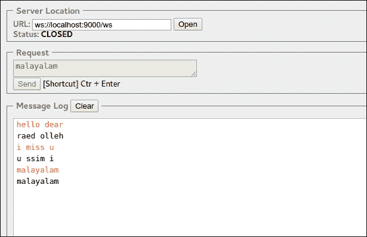

# 第八章. WebSocket 和 Actor

在本章中，我们将涵盖以下主题：

+   WebSocket 简介

+   Actor 模型和 Akka Actor

+   Play 中的 WebSocket：使用 Iteratee 和 Actor

+   FrameFormatters

# WebSocket 简介

想象一下：

一个电影爱好者正在尝试在线购买电影票。他或她已经选定了座位，输入了付款详情，并提交了。他或她收到一个错误消息，说他们试图预订的票已经售罄。

考虑一个应用程序，它提供了有关股市的详细信息，并允许购买/出售股票。当有人输入付款详情并提交这些详情时，他们会收到一个错误消息，说购买已被拒绝，因为股票价格已经改变。

在最初需要通过 HTTP 获取实时数据的应用程序中，开发者意识到他们需要在客户端和服务器端之间实现双向通信。这通常是通过以下方法之一实现的：

+   **轮询**：客户端以固定和规律的时间间隔发送请求。服务器在短时间内（不到 1 秒或如此）对每个请求做出响应。

+   **长轮询**：当发送请求时，服务器在指定时间间隔内状态没有变化时不会响应结果。在从服务器收到响应后，才会触发请求。因此，客户端会根据需要重复请求，直到收到前一个请求的响应。

+   **流式传输**：向服务器发送请求会导致一个打开的响应，该响应会持续更新并无限期保持打开状态。

虽然这些方法有效，但使用它们导致了一些问题：

+   这导致了每个客户端 TCP 连接数量的增加

+   在客户端将响应映射到其对应请求时，HTTP 头部开销很大

2011 年，一个使用单个 TCP 连接进行双向通信的协议 WebSocket（RFC6455）被互联网工程任务组（**IETF**）标准化。到 2012 年 9 月 20 日，**万维网联盟**（**W3C**）提出了 WebSocket API 的规范。

与 HTTP 不同，WebSocket 中没有请求-响应周期。一旦连接，客户端和服务器就可以互相发送消息。通信可以是服务器到客户端，也可以是客户端到服务器，即双向全双工通信。

根据 WebSocket API：

+   可以通过调用构造函数来建立 WebSocket 连接，例如`WebSocket(url, protocols)`

+   可以通过`send(data)`方法通过连接将数据发送到服务器

+   调用`close()`将导致关闭连接

+   以下事件处理程序可以在客户端定义：

    +   `onopen`

    +   `onmessage`

    +   `onerror`

    +   `onclose`

下面是一个使用 JavaScript 的示例：

```java
var webSocket = new WebSocket('ws://localhost:9000');
webSocket.onopen = function () {
  webSocket.send("hello");
};
webSocket.onmessage = function (event) {
  console.log(event.data);
};
webSocket.onclose = function () {
  alert("oops!! Disconnected")
}
```

# Play 中的 WebSocket

**WebSockets** 不能使用 Action 定义，因为它们应该是双向的。Play 提供了一个辅助工具来帮助处理 WebSockets，该工具的文档位于 [`www.playframework.com/documentation/2.3.x/api/scala/index.html#play.api.mvc.WebSocket$`](https://www.playframework.com/documentation/2.3.x/api/scala/index.html#play.api.mvc.WebSocket$)。

### 注意

使用辅助工具定义的 WebSockets 使用 Play 服务器底层的 TCP 端口。

WebSockets 可以在 Play 应用程序中以类似于 Actions 的方式定义。从 Play 2.3 开始，WebSocket 辅助工具找到了使用 Actor 定义 WebSocket 交互的方法。然而，在我们了解更多关于辅助工具提供的方法之前，让我们稍微偏离一下，先熟悉一下 **Actor Model** 和 **Akka Actors**。

# Actor Model

编程中的并发可以通过使用*线程*来实现，这可能会包括丢失更新或死锁的风险。通过利用异步通信，Actor 模型促进了并发。

根据 Actor 模型，actor 是计算的基本单元。它不能独立存在，也就是说，它总是特定 actor 系统的一部分。如果一个 actor 知道另一个 actor 的地址，它可以向其 actor 系统中的一个或多个 actor 发送消息。它也可以向自己发送消息。由于通信是异步的，因此无法保证消息发送或接收的顺序。

当 actor 收到一条消息时，它可以执行以下操作：

+   将其转发给另一个已知地址的 actor

+   创建更多 actors

+   指定它将为下一条消息采取的操作

### 注意

Actor Model 首次在 1973 年 8 月由 Carl Hewitt、Peter Bishop 和 Richard Steiger 在国际人工智能联合会议（IJCAI'73）论文 *A Universal Modular ACTOR Formalism for Artificial Intelligence* 中描述，该论文是会议的一部分。

# 介绍 Akka Actors

**Akka** 是 Typesafe Reactive Platform 的一部分，与 Play 框架类似。根据他们的网站：

> *Akka* 是一个用于在 JVM 上构建高度并发、分布式和容错的事件驱动应用的工具包和运行时。

Akka 实现了 Actor Model 的一种版本，通常称为 Akka Actors，并且对 Java 和 Scala 都可用。根据 Akka 文档，Actors 给你：

+   简单且高级的并发和并行抽象

+   异步、非阻塞且高性能的事件驱动编程模型

+   非常轻量级的事件驱动进程（每 GB 堆内存中有数百万个 actors）

Akka Actors 可以作为一个库使用，可以通过将它们添加到项目的依赖项中来在项目中使用：

```java
libraryDependencies ++= Seq(
  "com.typesafe.akka" %% "akka-actor" % "2.3.4"
)
```

### 注意

在 Play 项目中，不需要在 Akka 中显式添加依赖项，因为 Play 内部使用 Akka。

我们可以定义一个 actor，通过扩展 Actor trait 并在`receive`方法中定义行为来实现。让我们构建一个 actor，它反转接收到的任何字符串消息：

```java
class Reverser extends Actor {

  def receive = {
    case s:String => println( s.reverse)
    case _ => println("Sorry, didn't quite understand that. I can only process a String.")
  }
}

object Reverser {
  def props = Props(classOf[Reverser])
}
```

要使用 actor，我们首先需要初始化`ActorSystem`：

```java
val system = ActorSystem("demoSystem")
```

现在我们可以通过使用`actorOf`方法来获取 actor 的引用：

```java
val demoActor = system.actorOf(Reverser.props, name = "demoActor")
```

这个引用可以用来发送消息：

```java
demoActor ! "Hello, How do u do?"
demoActor ! "Been Long since we spoke"
demoActor ! 12345
```

现在，让我们运行应用程序并看看 actor 做了什么：

```java
> run
[info] Compiling 1 Scala source to /AkkaActorDemo/target/scala-2.10/classes...
[info] Running com.demo.Main
?od u od woH ,olleH
ekops ew ecnis gnoL neeB
Sorry, didn't quite understand that I can only process a String.

```

假设我们想要定义一个接受`minLength`和`MaxLength`作为参数的 Actor，我们需要修改`Reverser`类及其伴随类如下：

```java
class ReverserWithLimit(min:Int,max:Int) extends Actor {

  def receive = {
    case s:String if (s.length> min & s.length<max)=> println( s.reverse)
    case _ => println(s"Sorry, didn't quite understand that. I can only process a String of length $min-$max.")  }
}

object ReverserWithLimit {
  def props(min:Int,max:Int) = Props(classOf[Reverser],min,max)
}
```

更多关于 Akka actor 的详细信息，请参阅[`akka.io/docs/`](http://akka.io/docs/)。

# 使用 Iteratee 的 WebSocket

让我们定义一个 WebSocket 连接，它接受字符串并通过**Iteratee**发送字符串的逆序：

```java
 def websocketBroadcast = WebSocket.using[String] {
    request =>
      val (out, channel) = Concurrent.broadcast[String]
      val in = Iteratee.foreach[String] {
        word => channel.push(word.reverse)
      }
      (in, out)
  }
```

`WebSocket.using`方法使用一个 Iteratee（输入通道）及其对应的枚举器（输出通道）创建一个特定类型的 WebSocket。在前面的代码片段中，我们返回一个包含 Iteratee 输入和枚举器输出的元组。

`Concurrent`对象也是一个辅助工具，它提供了使用 Iteratee、枚举器和枚举器的并发实用工具。`broadcast[E]`方法创建一个枚举器和通道，并返回一个`(Enumerator[E], Channel[E])`元组。因此获得的枚举器和通道可以用来向多个 Iteratee 广播数据。

在此之后，我们需要将其绑定到路由文件中的路径，这与我们对 Action 所做的操作类似：

```java
GET        /ws                  controllers.Application.websocketBroadcast
```

现在，使用一个浏览器插件，例如 Chrome 的简单 WebSocket 客户端（请参阅[`chrome.google.com/webstore/detail/simple-websocket-client/pfdhoblngboilpfeibdedpjgfnlcodoo`](https://chrome.google.com/webstore/detail/simple-websocket-client/pfdhoblngboilpfeibdedpjgfnlcodoo)），我们可以在应用程序运行时通过 WebSocket 发送消息，如图所示：



由于我们的应用程序中没有使用多个 Iteratee，我们可以使用`Concurrent.unicast`。这将需要我们稍微修改我们的代码：

```java
 def websocketUnicast = WebSocket.using[String] {
    request =>
      var channel: Concurrent.Channel[String] = null
      val out = Concurrent.unicast[String] {
        ch =>
          channel = ch
      }
      val in = Iteratee.foreach[String] {
        word => channel.push(word.reverse)
      }
      (in, out)
  }
```

注意，与`broadcast`方法不同，`unicast`方法不返回一个枚举器和通道的元组，而是只提供一个枚举器。我们必须声明一个通道变量并将其初始化为 null，以便在 Iteratee 中可以访问它。当调用`unicast`方法时，它被设置为`unicast`方法内部生成的通道。

### 注意

`unicast`方法还允许我们定义`onComplete`和`onError`方法，但它们并不了解 Iteratee，也就是说，我们无法在这些方法中引用 Iteratee。

这个例子过于简单，并没有突出定义和使用 Iteratee 所涉及的复杂性。让我们尝试一个更具挑战性的用例。现在，我们可能需要构建一个允许用户通过 WebSocket 连接到他们的数据库并加载/查看数据的 Web 应用程序。在这种情况下，前端发送 JSON 消息。

现在 WebSocket 可以接收以下任何消息：

+   **连接请求**：这是一个显示连接到数据库所需信息的消息（例如主机、端口、用户 ID 和密码）

+   **查询字符串**：这是要在数据库中执行的查询

+   **断开连接请求**：这是一个关闭与数据库连接的消息

在此之后，消息被翻译并发送到**DBActor**，它发送回状态消息或带有行数据的查询结果，然后通过 WebSocket 将其翻译为 JSON 并发送回。

从 DBActor 收到的响应可以是以下之一：

+   成功连接

+   连接失败

+   查询结果

+   无效查询

+   已断开连接

    ```java
    def dbWebsocket = WebSocket.using[JsValue] {
        request =>
          WebSocketChannel.init
      }
    ```

我们可以以下方式定义一个 WebSocket 处理器来处理此场景：

在这里，`WebSocketChannel`是一个 actor，它与 DBActor 及其伴随对象通信，并定义如下：

```java
object WebSocketChannel {
  def props(channel: Concurrent.Channel[JsValue]): Props =
    Props(classOf[WebSocketChannel], channel)

  def init: (Iteratee[JsValue, _], Enumerator[JsValue]) = {

    var actor: ActorRef = null
    val out = Concurrent.unicast[JsValue] {
      channel =>
        actor = Akka.system.actorOf(WebSocketChannel.props(channel))
    }

    val in = Iteratee.foreach[JsValue] {
      jsReq => actor ! jsReq
    }
    (in, out)
  }
}
```

`WebSocketChannel`定义如下：

```java
class WebSocketChannel(wsChannel: Concurrent.Channel[JsValue])
  extends Actor with ActorLogging {

  val backend = Akka.system.actorOf(Props(classOf[DBActor]))

  def receive: Actor.Receive = {
    case jsRequest: JsValue =>
      backend ! convertJson(jsRequest)
    case x: DBResponse =>
      wsChannel.push(x.toJson)
  }
}
```

在前面的代码中，`convertJson`将`JsValue`转换为 DBActor 可以理解的格式。

在下一节中，我们将使用 Play 2.3.x 版本中可用的新 WebSocket 方法实现相同的应用程序。

# 使用 Actors 而不使用 Iterates 的 WebSocket

Play WebSocket API 允许使用 Actors 来定义行为。让我们构建一个 WebSocket 应用程序，一旦连接，就回复给定字符串的反转。我们可以通过稍微修改我们的 Reverser Actor，使其具有一个参数作为可以/必须发送消息的 Actor 的引用来实现，如下所示：

```java
class Reverser(outChannel: ActorRef) extends Actor {

    def receive = {
      case s: String => outChannel ! s.reverse
    }
  }

object Reverser {
  def props(outChannel: ActorRef) = Props(classOf[Reverser], outChannel)
}
```

`websocket`可以在控制器中如下定义：

```java
def websocket = WebSocket.acceptWithActor[String, String] {
  request => out =>
    Reverser.props(out)
}
```

最后，我们在路由文件中添加一个条目：

```java
GET        /wsActor                  controllers.Application.websocket
```

现在当应用程序运行时，我们可以通过浏览器插件通过 WebSocket 发送消息。

现在，让我们尝试使用这种方法实现`dbWebSocket`：

```java
 def dbCommunicator = WebSocket.acceptWithActor[JsValue, JsValue] {
    request => out =>
      WebSocketChannel.props(out)
  }
```

这里，`WebSocketChannel`定义如下：

```java
class WebSocketChannel(out: ActorRef)
  extends Actor with ActorLogging {

  val backend = Akka.system.actorOf(DBActor.props)
  def receive: Actor.Receive = {
    case jsRequest: JsValue =>
      backend ! convertJsonToMsg(jsRequest)
    case x:DBResponse =>
      out ! x.toJson
  }
}

object WebSocketChannel {
  def props(out: ActorRef): Props =
    Props(classOf[WebSocketChannel], out)
}
```

`convertJsonToMsg`方法负责将 JSON 转换为 DBActor 可以接受的格式。

# 关闭 WebSocket

当 WebSocket 关闭时，Play 会自动停止与其绑定的 actor。这种绑定以两种方式工作：当底层 actor 被杀死时，WebSocket 连接会关闭。如果需要在连接关闭后释放任何资源，我们可以通过覆盖 actor 的`postStop`方法来实现。在我们的例子中，我们在`WebSocketChannel`中初始化了一个 DBActor。我们需要确保在 WebSocket 关闭时将其杀死，因为每个 WebSocket 连接都会导致 DBActor 的初始化。我们可以通过发送一个毒药丸来实现，如下所示：

```java
override def postStop() = {
  backend ! PoisonPill
}
```

## 使用 FrameFormatter

假设一个传入的 JSON 在每次请求中都有相同的字段，而不是每次都解析它；我们可以以这种方式定义一个等效的类：

```java
case class WebsocketRequest(reqType:String, message:String)
```

现在，我们可以定义我们的 WebSocket，以自动将 JSON 消息转换为`WebSocketRequest`。这是通过指定`acceptWithActor`方法的数据类型来实现的：

```java
def websocketFormatted = WebSocket.acceptWithActor[WebsocketRequest, JsValue]{
  request => out =>
  SomeActor.props(out)
}
```

然而，为了按预期工作，我们需要两个隐式值。第一个是将传入的帧转换为`WebsocketRequest`，这需要一个`JsValue`到`WebSocketRequest`格式化器的转换：

```java
implicit val requestFormat = Json.format[WebsocketRequest]
implicit val requestFrameFormatter = FrameFormatter.jsonFrame[WebsocketRequest]
```

类似地，我们也可以指定输出消息的类型：

`FrameFormatter`是一个辅助工具，可以将`org.jboss.netty.handler.codec.http.websocketx.WebSocketFrame`转换为`play.core.server.websocket.Frames`。

### 注意

WebSocket 方法不会像 Action 解析器那样自动验证接收到的数据的格式。如果需要，我们将需要额外进行此操作。

# 故障排除

+   在`GlobalSettings`中，`WebSockets`中断`Actions`的等效操作是什么？如果我们想拒绝缺少某些头部的 WebSocket 连接怎么办？以下代码片段没有按预期工作：

    ```java
    override def onRouteRequest(request: RequestHeader): Option[Handler] = {
        if(request.path.startsWith("/ws")){
          Option(controllers.Default.error)
        } else
          super.onRouteRequest(request)
      }
    ```

    从全局对象中断 WebSocket 的方式与中断 Action 的方式不同。然而，还有其他方法可以实现这一点：通过使用`tryAccept`和`tryAcceptWithActor`方法。WebSocket 定义可以用以下代码替换：

    ```java
    def wsWithHeader = WebSocket.tryAccept[String] {
        rh =>
          Future.successful(rh.headers.get("token") match {
            case Some(x) =>
              var channel: Concurrent.Channel[String] = null
              val out = Concurrent.unicast[String] {
                ch =>
                  channel = ch
              }
              val in = Iteratee.foreach[String] {
                word => channel.push(word.reverse)
              }
              Right(in, out)
            case _ => Left(Forbidden)
          })
      }
    ```

    当使用 Actor 时，使用`tryAcceptWithActor`方法定义 WebSocket：

    ```java
    def wsheaders = WebSocket.tryAcceptWithActor[String, String] {
        request =>
          Future.successful(request.headers.get("token") match {
            case Some(x) => Right(out => Reverser.props(out))
            case _ => Left(Forbidden)
          })
      }
    ```

    在前面的例子中，我们只是检查是否存在令牌头部，但这可以更新为任何其他标准。

+   Play 支持 wss 吗？

    截至 2.3.x 版本，没有内置对 wss 的支持。然而，可以使用代理，如 Nginx 或 HAProxy 作为安全的 WebSocket（wss）端点，并将请求转发到具有不安全 WebSocket 端点的内部 Play 应用程序。

# 摘要

在本章中，我们学到了一些东西。本章简要介绍了 Actor 模型以及在应用程序中使用 Akka Actor 的方法。此外，我们使用两种不同的方法在 Play 应用程序中定义了具有各种约束和要求的 WebSocket 连接：第一种方法是我们使用 Iteratees 和 Enumerators，第二种方法是我们使用 Akka Actors。

在下一章中，我们将看到我们可以使用**Specs2**和**ScalaTest**测试 Play 应用程序的不同方法。
