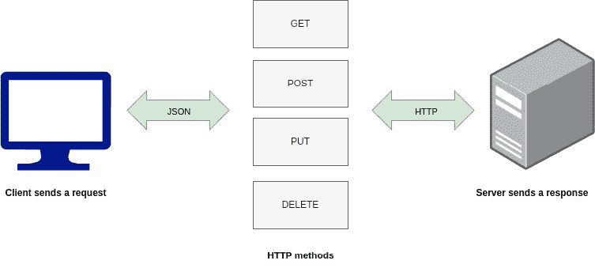
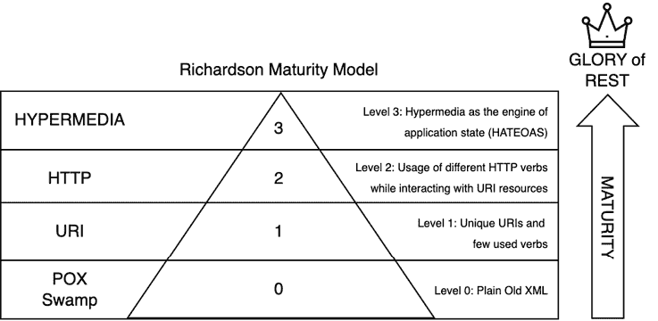

# 第一章：理解 RESTful 核心概念

Web 服务的历史是一段迷人的旅程，它记录了系统构建、分发和扩展方式的演变。

最初，将所有内容开发在单个应用程序和机器中的单体方法，多年来一直是许多人的标准架构方法。然而，将软件划分为具有单独责任的不同组件的需求，已经改变了我们设计和实现系统的方式。

自从计算机的早期阶段以来，就需要将运行在不同机器上的软件组成的分布式系统进行集成，其重要性正在增加，因为我们开发软件的方式正从单体架构转向更分布式的架构。

互联网的全球普及，尤其是万维网的兴起，推动了通信协议的标准化，例如**互联网协议（IP**），**传输控制协议（TCP**）和**超文本传输协议（HTTP**）。万维网的成功及其在不同设备、操作系统和应用程序上的支持，使得人们开始认为网络基础设施可以被用于连接各种应用程序。这就是采用**Web 服务**这一术语来使用 Web 技术创建 API 的时候。

在本书中，您将获得开发并精通创建 RESTful Web 服务所需的知识，从概念到完整实现，遵循市场上的最佳实践。

本章将为您在本书的剩余旅程中做好准备，帮助您理解**表征状态转移（REST**）架构和 RESTful API 服务是什么，这些术语之间的区别，原则、成熟度水平和指南，以及您将在本章中创建的项目，以实现这些知识。

本章将涵盖以下主题：

+   为什么选择 REST？

+   REST 架构原则

+   RESTful API 的层级

+   使用**JavaScript 对象表示法（JSON**）表示数据

+   开发 REST API 的指南的重要性

+   常见的 REST API 用例

+   架构对 REST API 设计的影响

+   REST 的替代方案

# 为什么选择 REST？

要理解为什么 REST 是大多数 Web 服务的占主导地位的架构风格，我们需要了解 REST 兴起之前可用的技术，以及使这种变化在分布式服务构建方式上变得如此重要的挑战。

## REST 之前的时代

在 REST 之前，Web 服务领域主要由**简单对象访问协议（SOAP**）和**可扩展标记语言-远程过程调用（XML-RPC**）等协议主导。这些协议功能强大但复杂，允许客户端和服务器之间进行详细的通信。然而，由于它们的冗长性质和对开发者严格的约束，它们通常被认为很繁琐。

例如，SOAP 需要开发者编写大量的 XML 文档，包含特定的调用和响应。它因其复杂性以及调试困难而臭名昭著。同样，XML-RPC 虽然比 SOAP 简单，但对于简单的请求和响应仍然涉及显著的开销（例如，冗长和复杂的 XML 格式化、序列化和反序列化、基于文本的协议以及解析复杂性）。SOAP 和 XML-RPC 只使用 HTTP 协议作为 *传输*，并以各自的方式重复了协议提供的某些功能和现有网络基础设施所支持的功能。

为了克服这些挑战并改善系统之间通信的方式，REST 被创造出来，并且自其诞生以来已被广泛实施。

## 理解 REST

**REST** 在 2000 年由 Roy Fielding 博士在其博士论文《*架构风格和网络软件架构设计*》中提出。

这种架构风格被提出作为一种更高效、更灵活、更可扩展的替代方案，以替代当时现有的标准，如 SOAP 和 XML-RPC。

Fielding 博士的论文旨在简化创建和消费网络服务的方式，利用 HTTP 协议的现有功能。

REST 的关键原则 – **无状态**、**可缓存性**、**统一接口**和**客户端-服务器架构** – 被设计成使网络服务更直观，并与网络本身的设计保持一致。

我们将在 *REST 架构原则* 部分详细讨论这些原则中的每一个。

当我们将 REST 架构应用于网络服务，并应用所有这些关键原则时，我们可以说我们有一个 RESTful API。让我们在下一节中更好地理解这种差异。

## 解构 RESTful

RESTful API 代表了一种设计网络服务的方法，它遵循 REST 原则，因此它们并不相同。

虽然 REST 为构建可扩展和互操作的系统提供了理论框架，但 RESTful API 将这些原则付诸实践，使开发者能够创建易于理解、维护和扩展的强大且灵活的 API。

RESTful API 的引入标志着网络服务的一个重大转变，因为开发者由于 REST 的简单性和它促进可扩展和性能良好的网络应用开发的方式而迅速采用 REST。RESTful API 成为网络通信的骨干，为从社交媒体平台到电子商务网站的一切提供动力。

现在，我们已经清楚地理解了 REST 和 RESTful，让我们深入探讨 REST 架构的原则。这将使我们对其关键原则和如何实现它们有更清晰的理解。

# REST 架构原则

到目前为止，我们只提到了 REST 的关键原则。让我们进一步深入，更详细地了解这些原则。

## 统一接口

**统一接口**是任何 REST 设计的基石，它促进了与一组给定资源交互的标准化方式。这一原则包括四个关键约束：

+   **资源识别**：每个资源，无论是文档、图像还是服务，都使用唯一的**统一资源标识符**（**URI**）进行识别。

+   **通过表示形式操作资源**：当客户端拥有资源的表示形式以及任何附加的元数据时，如果它拥有必要的权限，它可以修改或删除服务器上的资源。

+   **自描述性消息**：每条消息都包含足够的信息来描述如何处理它，这可能包括表示格式和期望的状态转换。

+   **超媒体作为应用程序状态引擎（HATEOAS）**：客户端完全通过由应用程序服务器动态提供的超媒体与 RESTful 服务交互，这一概念被称为 HATEOAS。

**示例**：想象一个图书馆系统，其中每本书都是一个*资源*，通过 ISBN 号码（URI）进行标识。当你想借一本书时，你会得到一个*表示形式*（一张包含书籍详细信息的卡片），你用它来借阅书籍。图书馆的借阅系统会告诉你如何进行（使用*自描述性*消息），目录会引导你找到相关的资源（*HATEOAS*），例如作者的其它书籍。

## 客户端-服务器分离

这一原则通过将用户界面关注点与数据存储关注点分离，强制执行关注点分离。这种分离允许客户端和服务器组件独立发展，从而实现更灵活和可扩展的应用程序架构。



图 1.1 – 客户端-服务器图

**示例**：用户在网站上提交一个包含其数据的表单以完成借阅（客户端发送请求）；这将使用`POST` HTTP 动词发送 JSON 格式，并由服务器接收。服务器将接收数据，创建包含客户数据的这个新资源，存储客户数据，放置新的订单，并向用户返回适当的响应。

## 无状态

在 RESTful 服务中，客户端向服务器发出的每个请求都必须包含服务器完成请求所需的所有信息。服务器不存储任何关于客户端的会话状态，这意味着每个请求都是独立和隔离的。

**示例**：每次你在咖啡馆点咖啡时，你都会提供你完整的订单详情。咖啡师不需要记住你之前的订单；他们只需根据当前的订单制作咖啡。

## 缓存性

响应必须隐式或显式地定义自己为可缓存的或不可缓存的。这有助于通过减少频繁请求的资源与客户端-服务器交互来提高网络的效率。

注意，缓存可能会带来风险，即客户端可能看到资源的过时版本，尤其是如果资源频繁更改。然而，我们通常为了更好的性能而接受这种风险。

**示例**：每天请求数千次资源有资格进行缓存，因为这将大大减少**数据库**（**DB**）资源的使用并提高响应时间。

## 分层系统

RESTful 架构可能由分层层次结构组成，这可能包括负载均衡器、缓存或身份验证网关。这种分层系统确保客户端通常无法判断它是直接连接到端服务器还是连接到途中的中介。分层系统是 RESTful 架构的关键约束之一，并提供了几个好处：

+   **模块化**：分层系统允许你将应用程序组织成逻辑层，每个层都有特定的角色和责任。这使得系统更容易理解、开发和维护。

+   **关注点分离**：每一层可以专注于自己的任务。例如，一个身份验证层可以处理所有身份验证方面，而无需处理其他任何事情。这种关注点分离导致代码更清晰、更易于维护。

+   **可互换性**：如果一个层以模块化的方式设计和实现，它可以被替换或升级而不会影响其他层。这在你想更新或改进系统的特定部分时特别有用。

+   **可伸缩性**：你可以根据各自的负载和性能要求独立地扩展不同的层。例如，如果你的应用层正在经历高负载，你可以向该层添加更多服务器，而无需扩展你的数据库层。

+   **安全性**：通过将系统分层，你可以对每一层应用适当的控制措施。例如，你可以在层之间放置防火墙来控制流量并保护敏感层免受潜在攻击。

**示例**：当你发送一封信时，它会在到达目的地之前通过各个邮政局（层）。同样，一个 RESTful 请求可能会在客户端不知情的情况下通过安全检查和负载均衡器。

## 需求代码

服务器可以通过传输可执行代码来扩展客户端功能。这是一个可选功能，在 API 的上下文中很少使用，因为它难以可靠和安全地实现。

**示例**：一个 Web 应用程序可以要求浏览器下载并执行日历小部件。这个小部件是一段可执行代码，它扩展了浏览器的功能。

既然你已经了解了 REST 架构的原则，让我们学习如何通过 Richardson 成熟度模型解释的级别来实现 RESTful API 的辉煌。

# RESTful API 的级别

理解 RESTful 概念的一种方式是通过**Richardson 成熟度模型**，它概述了 API 设计中遵循 REST 原则的各个级别。

该模型以 Leonard Richardson 的名字命名，他在 2008 年引入了它，该模型由四个级别组成，每个级别代表着向更 RESTful 设计的进步：



图 1.2 – Richardson 成熟度模型图

## 第 0 级 – 纯旧 XML (POX) 的泥潭

在这一级别，API 的特点是所有操作使用单个 URI，通常使用 HTTP `POST`请求。有效载荷通常是基于 XML 的，并且没有区分不同的资源类型或 HTTP 方法。这一级别缺乏 REST 的基本原则，如资源标识和关注点分离。

## 第 1 级 – 资源

在这一级别，引入了资源的概念，其中系统中的每个实体都表示为一个唯一的 URI。然而，HTTP 方法并没有得到充分利用，操作通常是通过 HTTP `POST`和`GET`请求的组合来执行的。

虽然资源得到了标识，但 API 缺乏与 RESTful 设计相关的统一接口和可预测性。

## 第 2 级 – HTTP 动词

在这一级别，API 开始利用 HTTP 方法 – `GET`、`POST`、`PUT`、`DELETE` – 来对资源执行**CRUD**（**创建、读取、更新、删除**）操作。

每个 HTTP 方法对应一个特定的动作，为与 API 交互提供了一个更直观和标准化的接口。然而，超媒体链接仍然缺失，限制了 API 的可发现性和灵活性。

## 第 3 级 – 超媒体控件（HATEOAS）

最高级别的 RESTful，**第 3 级**引入了 HATEOAS。除了利用 HTTP 方法外，这一级别的 RESTful API 在响应中包括超媒体链接，允许客户端动态地导航 API。通过提供相关资源及其操作的链接，HATEOAS 减少了客户端和服务器之间的耦合，增强了灵活性和可扩展性。

Richardson 成熟度模型的每一级都代表着向更 RESTful 设计的进步，其中**第 3 级**是理想的终点，在这一级 API 完全拥抱 REST 原则，包括资源标识、统一接口和超媒体驱动的导航。

大多数现实生活中的 API 没有达到**第 3 级**，但当他们尽可能遵循较低级别的 REST 原则时，他们从标准化中受益匪浅，并利用了 HTTP 协议的功能。

许多 API，而不是实现超媒体控件，使用 OpenAPI 标准发布其支持的操作的机器可读（但静态）规范。

现在，让我们来考察 REST 服务最显著的特征之一：请求和响应是如何表示的（通常在 JSON 中），以及为什么 JSON 比 XML 更受欢迎。

# 使用 JSON 表示数据

**JSON**是一种简单的数据格式，它旨在使人类易于阅读和编写，同时也便于机器处理和创建。一个人类用户可能不会注意到的一个小特点是，JSON 不支持注释。

它基于 JavaScript 编程语言的一个子集，并且完全与语言无关，每种编程语言都有可用的解析器。

一个 JSON 文档由两种结构组成：

+   **一组键值对**：在不同的语言中，这通常实现为一个对象、记录、结构、字典、哈希表、键列表或关联数组

+   **值的有序列表**：在大多数语言中，这通常实现为一个数组、向量、列表或序列

下面是一个简单的 JSON 文档示例，用于`book`对象：

```java
{
  "book": {
    "title": "Mastering RESTful JSON Essentials",
    "author": "Multiple Authors",
    "published": true,
    "edition": 1,
    "tags": ["programming", "web", "json"]
  }
} 
```

`"book"`字段的值是一个包含键值对的对象结构。`"tags"`字段的值是一个有序的无名值列表。

那么，为什么 JSON 被首选用于 RESTful API？

JSON 和 XML 都是用于数据交换的格式，但它们具有不同的特性，这可以使一个格式比另一个更适合某些应用，尤其是 RESTful API。以下是为什么 JSON 通常比 XML 更适合 RESTful 服务的一个简要概述：

+   **性能**：JSON 轻量级的特性意味着它比 XML 解析得更快，这对于 RESTful API 的性能至关重要

+   **简洁性**：JSON 的简单语法使其更容易阅读和编写，也更容易程序化解析和生成

+   **网络友好**：鉴于其与 JavaScript 的兼容性以及现代 Web 开发对 JavaScript 的依赖性，JSON 与 Web 技术非常契合

虽然 JSON 和 XML 都有自己的应用场景，但 JSON 的效率、简洁性和网络友好性使其成为许多开发者在开发 RESTful API 时的首选选择。此外，还有一些二进制结构化数据交换格式，如 ProtoBuf，它们比 JSON 提供了更好的性能，因为它们消除了文本解析的需要，但这些二进制格式并不像 JSON 那样广泛和普遍地得到支持。

如前所述，在 RESTful 服务中，JSON 作为数据交换的媒介发挥着至关重要的作用。REST 没有规定用于表示资源数据的特定语言。然而，得益于其易用性和普遍支持，JSON 成为大多数 RESTful API 的自然选择。当客户端向服务器发送请求时，它们可以在请求体中发送 JSON。然后服务器处理这个 JSON，执行所需的操作，也可以在响应体中发送 JSON。这种一致的格式允许进行清晰和结构化的数据交换。

JSON 在 REST 服务中的功能包括以下内容：

+   **序列化**：将对象转换为 JSON 字符串以便通过网络发送。例如，请参见以下内容：

    ```java
    String serializedJson = objectMapper.writeValueAsString(
        bookDetails); 
    ```

+   **反序列化**：将通过网络接收到的 JSON 字符串转换为对象。例如，请参阅以下内容：

    ```java
    BookDetails bookDetails = objectMapper.readValue(
      json, BookDetails.class); 
    ```

+   **数据交换**：作为客户端和服务器之间交换数据的媒介。

这些示例展示了 Jackson 库中`ObjectMapper`的使用，用于在前面本节中提到的 JSON 书籍示例中序列化和反序列化 JSON。这个库已经包含在 Spring Web 框架中，但在需要的情况下也可以单独导入。

我们已经看到了 JSON 的重要性以及与之前使用的 XML 相比带来的变化。现在，你将学习掌握开发优秀 REST API 的关键步骤之一，那就是遵循经过验证的指南，如下一节所述。

# 指南在 REST API 中的重要性

**指南**为开发者提供路线图，概述了在 API 开发过程中应遵循的最佳实践和标准。它们是一套旨在防止常见陷阱并促进 API 设计卓越的规则。以下是遵循既定指南的一些最重要的方面：

+   **一致性和可预测性**：开发者确保了一致性水平，使 API 可预测且易于理解。这种统一性对于创建 API 的开发者和使用 API 的用户都是必不可少的。

+   **互操作性**：指南通常强调使用标准协议和数据格式，这促进了不同平台和技术之间的互操作性。在 API 作为连接各种软件组件的桥梁的多样化生态系统中，这一点尤为重要。

+   **可扩展性**：遵循指南精心设计的 API 更有可能具有可扩展性，能够处理增加的负载并适应增长，而无需进行重大重新设计或重构。

+   **安全性**：这是 API 开发的基本要求，指南提供了策略来保护 API 免受常见威胁，确保敏感数据和服务的保护。

## 遵循指南的市场相关性

遵循指南对市场有直接影响。遵循指南精心设计的 API 可能导致以下结果：

+   **增加采用率**：易于理解和集成的 API 可以迅速在开发者中受到欢迎，导致广泛采用和更大的用户基础。

+   **增强互操作性**：在医疗保健等数据共享至关重要的市场中，指南确保不同的系统可以有效地进行通信，从而提高患者护理和运营效率。

+   **合规性**：特别是在受监管的行业中，遵循指南有助于组织遵守法律标准，避免处罚并增强利益相关者之间的信任。

## 指南驱动的成功案例

这里有一些你可以作为参考的最成功的指南：

+   微软 Azure REST API 指南，请访问[`github.com/microsoft/api-guidelines/blob/vNext/azure/Guidelines.md`](https://github.com/microsoft/api-guidelines/blob/vNext/azure/Guidelines.md)。

+   [`fhir.org/`](https://fhir.org/)上的 HL7 FHIR 医疗保健系统指南

+   [`aep.dev/`](https://aep.dev/)上的社区驱动的 API 增强提案

更多设计指南可在 API 风格手册设计指南页面找到，例如 PayPal、Adidas、Heroku 等公司，请访问[`apistylebook.com/design/guidelines/`](https://apistylebook.com/design/guidelines/)。

在本书中，我们将遵循微软 Azure REST API 指南。

接下来，我们将探讨一些最常见的使用 REST API 的用例和实现，以示例说明其实际应用。

# 常见的 REST API 用例

在这里，我们将探讨一些常见的 REST API 用例，并通过示例说明其实际应用。

+   **与第三方服务的集成**：在不同平台之间同步数据，例如**客户关系管理**（**CRM**）和**企业资源计划**（**ERP**）系统

+   **社交媒体服务**：在各个平台上启用社交互动和内容共享

+   **电子商务交易**：管理产品列表、订单和支付

+   **物联网（IoT）**：远程连接和控制智能设备

+   **健康和健身跟踪**：从各种健康和健身设备汇总数据

在下一节中，我们将讨论 REST API 的架构设计对完整系统和其客户端的影响。

# 架构对 REST API 设计的影响

需要设计和实现 API 的情况可能出现在许多不同的环境中。我们希望通过 API 实现的目标以及它在开发的应用程序或系统架构中的作用会影响本书各章节中描述的各种 API 方面的相对重要性。独特的架构方面组合也会影响选择实现 API 的方法和技术。

以下部分将介绍最常见的模式。

## 跨组织公共 API

跨组织边界使用的 API 最接近原始的 Web 技术应用。

控制所有 API 客户端是不切实际的。具有众多独立消费者的公共 API 通常优先考虑向后兼容性，而不是其他设计目标。引入不兼容的变更会带来支持多个 API 版本的同时产生的重大成本。

最后，公共 API 相比内部 API 需要更高的安全标准。

## 由单一团队开发的客户端到服务端 API

大多数当代应用程序由一个在终端用户设备（网页浏览器或移动应用程序）上运行的前端组件和一个通常部署在云或其他服务器基础设施上的后端组件组成。

在许多情况下，后端及其相应的客户端都是在同一个敏捷开发团队内开发的。在这种情况下，API 变更可以迅速地在两端进行镜像，向后兼容性的重要性可能较低。

尽管如此，即使在这种情况之下，也可能存在团队无法控制的客户端使用较旧的 API 版本，例如，缺乏最近更新的移动应用程序。

前端到后端的 API 也是公共 API，因为客户端超出了我们的控制，从安全角度出发，需要将其视为此类处理。

## 连接微服务的 API

微服务开发团队应保持自主权以快速进步。他们需要关注其 API 的文档和向后兼容性，以避免干扰与之连接的其他服务。与公共 API 不同，在组织内部，可以跟踪内部微服务 API 及其版本的使用情况。

管理组织内部使用的各种 API 的正式规范，称为 **模式注册表**，可以帮助平衡开发速度和整体业务解决方案的稳定性。

在一个组织内，多个服务实现多个 API 的情况下，将一些 API 责任委托给基础设施组件，如服务网格，通常是有益的。

在下一节中，你将了解在某些情况下可能比 REST 更可取的 API 风格。记住，如果你在不适当的地方使用 RESTful API，即使你实现了很好的 RESTful API，也没有意义。

# REST 的替代方案

本节介绍了市场上现有的替代 REST API 的解决方案及其比较。了解 REST 并非在所有情况下都是最佳选择，能够区分现有选项是明智的。以下是一些例子：

## 远程过程调用 (RPC)

RPC 是一种隐藏 API 存在的 API 风格，使其在特定编程语言中类似于标准过程调用（或面向对象语言中的方法）。这种风格包括 SOAP 网络服务和 XML-RPC。

其他值得注意的代表包括 CORBA（由企业 JavaBeans 使用）和 gRPC（一个支持多种编程语言的新协议）。gRPC 通过使用高效的二进制消息编码提供了性能优势。

RPC API 适用于客户端数量有限且 API 提供商可以控制它们的集成。

它们的缺点如下：

+   客户端与服务器之间的高耦合

+   不同 API 版本之间有限或没有兼容性

+   客户端被迫使用较少见且更复杂的技术

+   无法利用对知名 HTTP 协议的熟悉来理解操作的语义

## GraphQL

与 SQL 类似，**GraphQL** 定义了一种数据查询和突变语言，使客户端能够指定服务器应返回哪些图结构数据源的性质和节点。

与 SOAP 类似，GraphQL 专门使用 HTTP `POST` 方法来隧道所有请求。GraphQL 允许客户端使用数据元素的不同组合来执行操作，这可能导致客户端逻辑过多，因为通常一个服务器会有多个客户端。

如果需要为不同的客户端提供不同结构和详细程度的数据，使用 REST API，可以通过以下方式解决这个问题：

+   在请求中包含参数（例如，查询参数）

+   通过使用称为 **前后端分离**（**BFF**）的架构，在服务器端创建多个针对客户端类型的 API

## 消息（事件）API

与 Web API 的同步请求-响应风格相比，通过消息平台（如 Kafka 或 **Java 消息系统**（**JMS**））进行异步通信，通常用于连接组织内的应用程序和服务，并与 REST API 一起使用。

虽然异步通信提供了诸如松散耦合、低延迟等好处，但它也更复杂和间接。

事件接口，如 Web API，需要良好的文档，并且面临 API 进化和兼容性的挑战。AsyncAPI，用于异步 API 的规范标准，受到了更成熟的 OpenAPI 的启发，并在本书的后续部分进行讨论。

在下一节中，我们将介绍我们将在这本书中创建的项目，以深入应用这些 REST 概念。

# 关于项目

在这本书中，我们将开发一个项目，以应用本章中提到的概念，进行实践和经验积累。我们将构建两个将相互通信的 API。

第一个 API 将是产品 API，它将在 *第二章* 中介绍。这个 API，正如其名称所暗示的，专注于产品操作，例如读取产品数据和添加新产品。

第二个 API 将是订单管理 API。它将在 *第四章* 中介绍，并将包含存储在第一个 API 中的产品订单，因此它们将相互通信。

在整个章节中，您将能够实现这些 API，应用本章中提到的大多数最佳实践，进化这些实践，进行文档编制、测试和版本控制，以确保向后兼容性，实现跟踪工具，并将它们部署到云端。

# 摘要

在本章中，您学习了 REST 和 RESTful 之间的区别，以及为什么与之前使用的方法相比，REST 方法是构建 API Web 服务的首选方法。

我们已经研究了 REST 架构的原则、使用 Richardson 成熟度模型的级别以及现有的 REST 替代方案。

然后，我们探讨了 JSON 在 REST 服务中的作用以及遵循经过众多项目验证的良好定义指南在开发 REST 网络服务中的重要性。

最后，我们在以下章节中调查了 REST API 设计对架构的影响以及本书中将要构建的项目。

本章为您提供了基础知识，以便您开始学习本书将要呈现和构建的内容。

在下一章中，我们将探讨使用 Spring Boot 设计和实现 RESTful API 的实践。
