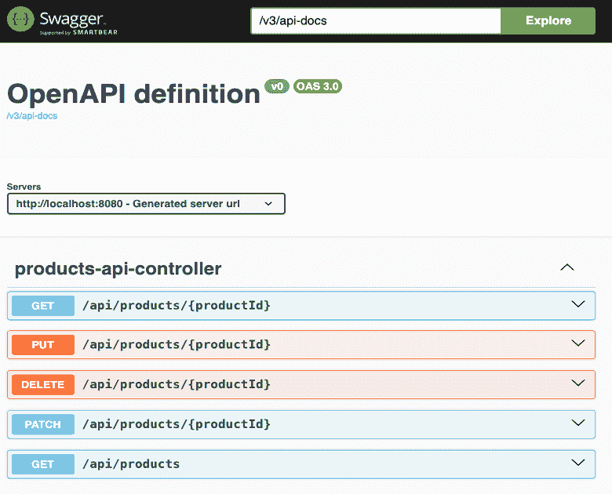
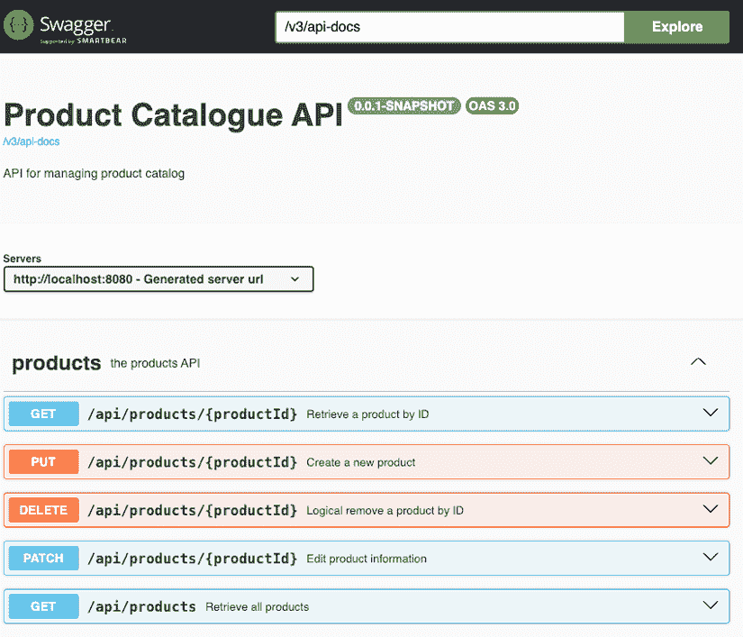
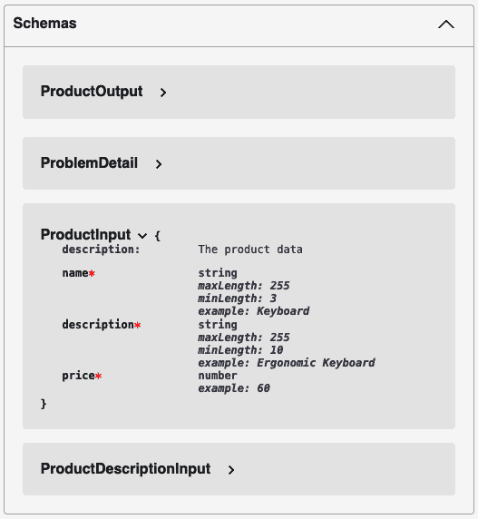
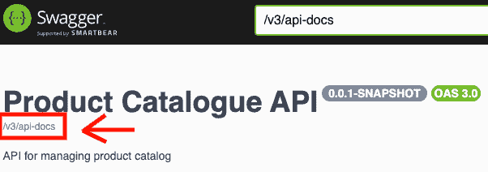
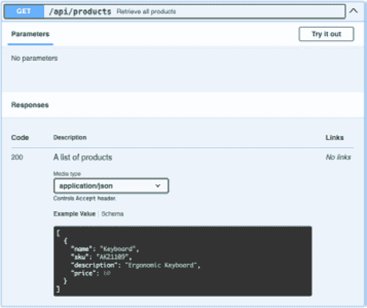
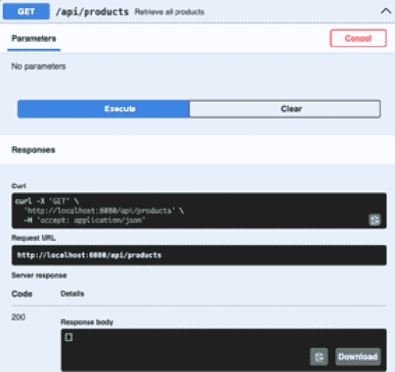

# 第三章：高效地记录您的 API

完整的 **文档** 对于确保客户能够有效使用您的 API 至关重要。在本章中，我们将探讨使用 **Swagger** 注解和最佳实践来记录 REST API 的过程。我们将深入研究几个关键主题，以提供全面的理解。

首先，我们将通过检查 **OpenAPI 规范** 和 **JSON Schema** 来讨论 API 规范的重要性，这些是定义 API 文档结构和格式的关键标准。

我们还将探讨 API 开发中 **先编码** 和 **先规范** 方法之间的辩论，讨论它们各自的优缺点和考虑因素。在此之后，我们将记录产品 API，展示如何有效地使用 Swagger 注解来描述端点、参数、响应和其他关键细节。

最后，我们将展示 Swagger **用户界面**（**UI**）的实用价值，这是一个用于可视化并交互 API 文档的强大工具，它能够提升开发者的体验并促进 API 的无缝使用。通过这些讨论和示例，您将深入了解创建良好文档、标准化的 REST API，这些 API 能够促进互操作性和易用性。

在本章中，我们将涵盖以下主题：

+   API 规范的重要性

+   介绍 OpenAPI 和 JSON Schema

+   在规范优先和编码优先之间进行选择

+   记录产品 API

+   使用 Swagger UI

# 技术要求

在本章中，我们将实现产品 API 的文档。为了能够跟随并使用本书中打印的代码示例，您应该拥有上一章中创建的产品 API 代码。您可以在 GitHub 上访问本章的代码：[`github.com/PacktPublishing/Mastering-RESTful-Web-Services-with-Java/tree/main/chapter3`](https://github.com/PacktPublishing/Mastering-RESTful-Web-Services-with-Java/tree/main/chapter3)。本章添加的代码不会改变 API 的实际功能；它只会提供元数据以生成 API 的文档。

# API 规范的重要性

让我们先讨论 API 规范是什么以及为什么它们很重要。

从 Java 我们了解到面向对象编程的原则。其中之一是 **封装**，它涉及尽可能多地使类的成员私有。只有那些明确打算对外部访问的成员（通常是方法）应该被公开。这些公共成员的集合构成了类的 API。与公共成员伴随的 Javadoc 可以确保其使用清晰，无需查看实现类的代码。通过限制公共 API 的大小，我们保留了对更改或删除类外部的（私有）成员的自由，而不会破坏类外部的代码。

在定义公共方法的签名时，我们也应该谨慎。通过参数或返回值传递不必要的数据可能导致不必要的耦合，增加处理数据的代码（例如，验证或确保不可变性）的复杂性，并限制性能优化的可能性。

一个设计不良的 API，其结构更多地由技术实现的便利性驱动，而不是业务需求，可能会暴露应该隐藏的元素。一旦这样的 API 开始使用，就很难更改，因为可能存在我们无法控制的客户端依赖于它。

如果这对于单个 Java 程序中的 API 是正确的，那么对于跨越单个程序边界的 REST API 来说，具有清晰分离的接口和详尽的文档就更加关键。

虽然可能需要使用散文提供一些额外的信息给 API 用户，但我们可以通过尽可能多地使用正式和机器可读的规范语言来描述我们的 API 来大大受益。对于 REST API，最广泛使用和最先进的标准是 **OpenAPI** 。

# 介绍 OpenAPI 和 JSON Schema

由 OpenAPI 倡议（[`www.openapis.org/`](https://www.openapis.org/)）支持的 **OpenAPI 规范** 定义了一种人类和计算机都能阅读的正式语言，以了解服务的功能，而无需以下：

+   访问服务实现代码

+   使用另一种格式（语言）的单独文档

+   分析网络流量

OpenAPI 规范最初基于 Swagger 规范。OpenAPI 可以使用 HTTP 协议描述任何 API，包括任何成熟度的 RESTful API。

OpenAPI 规范文档可以用 JSON 和 YAML 格式编写。YAML 语法（[`yaml.org/`](https://yaml.org/)）用缩进来代替了大量的 JSON 标点符号；因此，YAML 对于许多人来说更简洁，更容易阅读。在这本书中，我们将使用 YAML 格式来编写所有手动编写的 OpenAPI 规范（不是由工具生成的）。

典型 OpenAPI 规范的两个最重要的（通常也是最长的）部分如下：

+   **Paths** : 这些描述了 API 支持的操作，由资源、HTTP 方法、URI 参数等指定。

+   **Schemas** : 这些描述了请求和响应体（有效载荷）的复杂数据结构

我们的产品 API 使用两条路径：

+   `/api/products/{productId}` : 这支持 `GET`、`PUT`、`DELETE` 和 `PATCH` 方法

+   `/api/products` : 这只支持 `GET` 方法

以下是用到的模式：

+   `ProductInput` : 这用于请求中的完整产品数据

+   `ProductDescriptionInput` : 这用于仅更新产品描述

+   `ProductOutput` : 这用于响应中的产品数据

+   `ProblemDetail` : 这用于错误响应

我们通过 API 传输复杂数据使用的格式是 JSON，这就是为什么 OpenAPI 规范的架构部分使用 JSON Schema 语言的方言。

**JSON Schema** 是一个独立的标准，可以用于在 OpenAPI 规范范围之外验证 JSON 文档。OpenAPI 规范每个版本的架构部分都是基于 JSON Schema 标准的一个版本，并添加了一些 OpenAPI 特定的修改。这就是为什么它被称为 JSON Schema 的 **方言**。使用我们想要使用的 OpenAPI 规范版本的架构部分支持的功能是很重要的。

让我们看看我们的产品 API 的 OpenAPI 规范会是什么样子。我们将使用 YAML 语法。在以下子节中，为了简洁起见，省略了一些 API 规范的属性。您可以在附带的 GitHub 仓库中看到完整的规范：[`github.com/PacktPublishing/Mastering-RESTful-Web-Services-with-Java/blob/main/chapter3/product-api/src/main/resources/Product_Catalogue_API.yml`](https://github.com/PacktPublishing/Mastering-RESTful-Web-Services-with-Java/blob/main/chapter3/product-api/src/main/resources/Product_Catalogue_API.yml) 。

## 常见 API 元数据

除了前面提到的规范的两个主要部分之外，还有提供有关 API 和其规范的元数据的头部部分。它们定义了 OpenAPI 标准的版本、我们 API 的版本、API 的基本 URL 以及一些可读性强的名称和描述：

```java
openapi: 3.0.1
info:
  title: Product Catalogue API
  description: API for managing product catalog
  version: 0.0.1
servers:
  - url: http://localhost:8080
    description: Generated server url
tags:
  - name: products
    description: the products API 
```

## 产品 API 路径

产品 API 规范的以下部分是路径，从 `/api/products/{productId}` 的 `GET` 方法开始。使用 `$ref` 符号来引用架构。对于 `200`、`400` 和 `404` HTTP 响应码有单独的响应规范。我们还可以看到必需的 `productId` URI 参数的规范：

```java
paths:
  /api/products/{productId}:
    get:
      parameters:
        - name: productId
          in: path
          required: true
          schema:
            type: string
          example: AK21109
      responses:
        '200':
          content:
            application/json:
              schema:
                $ref: '#/components/schemas/ProductOutput'
        '400':
          content:
            '*/*':
              schema:
                $ref: '#/components/schemas/ProblemDetail'
        '404':c
          content:
            '*/*':
              schema:
                $ref: '#/components/schemas/ProblemDetail' 
```

相同的路径继续使用需要请求体的 `PUT` 方法的规范：

```java
 put:
      parameters:
        - name: productId
          in: path
          required: true
          schema:
            type: string
      requestBody:
        content:
          application/json:
            schema:
              $ref: '#/components/schemas/ProductInput'
        required: true
      responses:
        '200':
          content:
            application/json:
              schema:
                $ref: '#/components/schemas/ProductOutput'
        '201': 
```

（省略了其他状态码的响应体。）

让我们再看看一个操作：返回产品列表（由 JSON 数组表示）的操作：

```java
 /api/products:
    get:
      tags:
        - products
      summary: Retrieve all products
      operationId: getProducts
      responses:
        '200':
          description: A list of products
          content:
            application/json:
              schema:
                type: array
                items:
                  $ref:
    '#/components/schemas/ProductOutput' 
```

## 产品 API 架构

将命名架构放在规范的一个独立部分，让我们可以在多个操作中重用它们，例如，`ProductOutput` 架构。

使用 `example` 属性，我们可以提供有关数据元素的信息，这些信息既可以由人类使用，也可以由自动化工具（测试客户端或模拟服务器生成器）使用。如果没有 `example` 属性，任何想要测试我们 API 的人将不得不仅根据它们的类型猜测有意义的值。生成随机字符串会导致不切实际的示例：

```java
components:
  schemas:
    ProductOutput:
      type: object
      properties:
        name:
          type: string
          example: Keyboard
        productId:
          type: string
          description: ID of the product to delete
          example: AK21109
        description:
          type: string
          example: Ergonomic Keyboard
        price:
          type: number
          example: 60 
```

用于错误响应的`ProblemDetail`架构非常通用，我们可能会希望在不同 API（微服务）之间重用它。OpenAPI 规范可以分成多个文件。我们还可以在 Web 服务器上托管可重用的架构，并使用 HTTP URL 引用它们。

然而，我们应该记住，它会在不同的 API 之间引入耦合，因此这种重用应该仅用于很少改变的架构（`ProblemDetail`架构满足这一标准）。

我们已经介绍了 OpenAPI 规范的基本结构和最重要的属性。我们将在下一章中介绍更高级的 OpenAPI 功能。

在下一节中，你将了解你必须做出的一个重要决定：这是否想要从一个明确的抽象规范文档开始，例如前面展示的，或者从 Java 代码中推导出来。

# 在规范优先和代码优先之间进行选择

我们明确指出，为了我们 API 的成功，我们需要一个具体的实现和一个接口的抽象规范。在创建 API 时，有两种基本方法：**规范优先**（也称为*设计优先*或*API 优先*）和**代码优先**。

## 规范优先

从规范开始迫使 API 开发者提前决定 API 公共部分需要包含什么。有意隐藏消费者不需要知道的具体细节使 API 尽可能小，因此更容易维护和演进。

这里是规范优先的优点：

+   独立的规范通常较小，因为它们只定义了满足业务需求的 API 元素；由单独的规范文档定义的 API 更容易维护，规范变更也更可控。

+   规范优先确保 API 规范不对任何实现语言有偏见，支持用多种语言编写的 API 提供者和消费者。

+   你可以并行开发 API 提供者和消费者。连接各方之间的接口可以在不深入了解实现细节的情况下协商。

+   在 API 实现之前可以创建测试。

+   手写（非生成）的规范更容易被人阅读。

这里是采用规范优先的缺点：

+   开发团队需要掌握 API 规范语言，除了实现编程语言。

+   为了保持规范和代码之间的一致性，我们需要工具从规范中生成代码占位符。可用的代码生成器可能不支持规范和实现语言的所有功能。

## 代码优先

**代码优先** 优先考虑实现的速度，而不是干净的接口设计。API 规范实际上是反向工程自实现代码的。代码元素的注释和额外的元数据被手动添加，以帮助生成规范的工具。

以下是代码优先的优点：

+   跳过规范步骤可以更快地得到一个可工作的 API；这对于快速原型设计或影响较小的 API（其客户端受我们控制）是有意义的。

+   实现和接口都使用一种语言编写（通常需要一些注释或元数据的帮助）

+   可用实现代码可能有助于在 API 规范中包含性能或其他非功能性考虑因素。

以下是代码优先的缺点：

+   需要明确防止不希望的实施细节泄漏到生成的规范中。

+   需要掌握针对每种实现语言具有特定注释的规范生成工具，而不是使用标准的实现无关规范语言。

+   生成精致且易于阅读的规范很困难，尤其是对于更复杂的 API。

+   没有经过有意识的 API 设计步骤开发的 API 结构可能更多地反映了（首次）技术实现，而不是业务领域。这就是为什么它们往往难以维护和演进。

在本章中，我们将演示 Product API 的代码优先方法，因为我们已经从前一章获得了其实现代码。

下一章将展示规范优先的方法。

# 记录 Product API

为了记录我们的 API，我们需要添加一些来自 Swagger 的依赖项。在 Spring 框架的情况下，我们有 `springdoc-openapi-starter-webmvc-ui` 依赖项，它涵盖了记录 Spring 应用程序 API 所需的一切：

```java
<dependency>
    <groupId>org.springdoc</groupId>
    <artifactId>springdoc-openapi-starter-webmvc-ui</artifactId>
    <version>2.5.0</version>
</dependency> 
```

在 `pom.xml` 中添加此依赖项允许我们使用 Swagger 注释和 Swagger UI。在访问 `http://localhost:8080/swagger-ui/index.html` 后，我们可以看到在 *图 3.1* 中表示的 Swagger UI。



图 3.1 – Swagger UI

Swagger UI 是基于 `RestController` 和我们的端点生成的。为了使我们的 API 对客户端更加友好和易于理解，我们应该使用 Swagger 注释来增强它。这些注释位于 `io.swagger.v3.oas.annotations` 包中。让我们探索一些它们，并看看它们如何应用于改进我们的 API 文档。

## Swagger 注释

**Swagger 注释** 是由用于生成交互式 API 文档的 Swagger 库提供的一组注释。当这些注释添加到您的代码中时，有助于定义和描述您的 API 端点、请求和响应模型以及整体 API 元数据的结构和行为。

### @Tag

`@Tag`注解用于将一组操作分组；我们可以在我们的 API 类中使用它来告知每个方法都应该属于这个标签：

```java
@Tag(name = "products", description = "the products API")
public interface ProductsApi {
....
} 
```

### @Operation

`@Operation`注解用于方法声明中命名 API 端点。这个注解可以与其他注解结合使用，以提供端点的全面描述，包括可能的输出和 HTTP 状态码：

```java
@Operation(
    operationId = "deleteProduct",
    summary = "Logical remove a product by ID",
    responses = {
        @ApiResponse(responseCode = "204",
            description = "Product removed successfully"),
    }
)
ResponseEntity<Void> deleteProduct(
    @Parameter(name = "productId",
        description = "ID of the product to delete", required = true,
        in = ParameterIn.PATH, example = "AK21109") @ValidSku
        String productId
); 
```

在前面的代码中，我们使用`@Operation`注解来定义`delete`端点的描述。`@ApiResponse`注解用于添加可能的响应状态，在这种情况下，`204`表示产品已成功删除。

### @Parameter

在我们之前的例子中，我们使用了`@Parameter`注解。这个注解专门设计用于应用于方法参数，允许定义清晰的描述、示例和有关每个参数的附加信息。这些细节对于 API 消费者非常有用，因为它们提供了清晰的示例和必要的信息，增强了 API 的可用性。

### @ApiResponse

在我们之前的例子中，我们应用了`@ApiResponse`注解。这个注解用于指定 API 端点的潜在响应，详细说明 HTTP 状态和响应类型，并在适用的情况下提供示例。在我们之前的案例中，没有返回体，因为它是`204`；让我们看看`GET`操作的示例：

```java
@Operation(
    operationId = "getProductById",
    summary = "Retrieve a product by ID",
    responses = {
        @ApiResponse(responseCode = "200", description = "Product found",
            content = {
                @Content(mediaType = "application/json",
                schema = @Schema(implementation = ProductOutput.class))}),
        @ApiResponse(responseCode = "404",
            description = "Product not found",content = @Content(
                schema = @Schema(implementation = ProblemDetail.class),
                examples = {
                    @ExampleObject(name = "Validation Error",
                        summary = "Example of validation error",
                        value = """
                        {"type":"about:blank",
                         "title": "Not Found",
                         "status": 404,
                         "detail": "Product not found with id AK21102",
                         "instance": "/api/products/AK21102"
                         }
""")}))})
ResponseEntity<ProductOutput> getProductById(
    @Parameter(name = "productId",
        description = "ID of the product to delete", required = true,
        in = ParameterIn.PATH, example = "AK21109")
    @ValidSku String productId
); 
```

在我们的例子中，我们有两个`@ApiResponse`实例，第一个是成功响应，状态码为`200`。在这种情况下，我们使用`@Schema`注解来引用实现类，特别是`ProductOutput.class`。

第二个实例涉及一个`404`错误，使用的是我们领域之外的架构，即 Spring 中的`ProblemDetail.class`。在这种情况下，我们使用 Swagger 的另一个注解`@ExampleObject`注解，通过 Java 的文本块功能来增强可读性，创建预期的错误响应的结构化 JSON 表示。

### @Schema

在我们之前的例子中，我们使用了`@Schema`注解来标识 API 响应的内容。这个注解也用于描述请求和响应模型的字段。让我们通过使用`ProductInput`来查看一个例子：

```java
public record ProductInput(
        @NotBlank
        @Size(min = 3, max = 255)
        **@****Schema****(name =** **"name"****,**
 **requiredMode =** **Schema****.RequiredMode.REQUIRED,**
 **example =** **"Keyboard"****)**
        @JsonProperty("name")
        String name,
        @NotBlank
        @Size(min = 10, max = 255)
        **@Schema****(name =** **"description"****,**
 **requiredMode =** **Schema****.RequiredMode.REQUIRED,**
 **example =** **"Ergonomic Keyboard")**
        @JsonProperty("description")
        String description,
        @NotNull
        @Positive
        **@Schema****(name =** **"price",**
 **requiredMode =** **Schema****.RequiredMode.REQUIRED,**
 **example =** **"60.0"****)**
        @JsonProperty("price")
        BigDecimal price) {
} 
```

在这个例子中，我们使用`@Schema`来定义每个字段的名称，指示字段是否必需，并提供示例值。示例值对于新 API 用户特别有用，因为它提供了关于预期输入和输出的清晰信息。

通过结合 bean 验证，我们增强了我们的 API，提供了有关字段的其他信息。`ProductInput`生成的代码将类似于以下内容：

```java
 "ProductInput": {
        "required": [
            "description",
            "name",
            "price"
        ],
        "type": "object",
        "properties": {
            "name": {
            "maxLength": 255,
            "minLength": 3,
            "type": "string",
            "example": "Keyboard"
            },
            "description": {
                "maxLength": 255,
                "minLength": 10,
                "type": "string",
                "example": "Ergonomic Keyboard"
            },
            "price": {
                "type": "number",
                "example": 60
            }
        }
    } 
```

通过在整个 API 中应用这些注解，我们实现了清晰且定义良好的文档。现在，我们可以重新访问 Swagger UI 来审查和探索更新的文档。


注意

许多模拟服务器使用 Swagger 实现来生成模拟；对于输入和输出的清晰定义和示例对于生成更好的模拟至关重要。

# 使用 Swagger UI

**Swagger UI**是一个基于 Web 的界面，它为 API 提供交互式文档。它允许开发者可视化并执行 API 端点，使其更容易理解和实验 API。

在访问 Swagger UI 之前，让我们添加一个来自 Swagger 的额外注解：`OpenAPI`注解。这个注解包含了我们 API 的一些元数据。我们可以在 Spring 中通过定义`OpenAPI` bean 来实现这一点：

```java
@Configuration
public class SpringDocConfiguration {
  @Bean
  OpenAPI apiInfo(
    @Value("${application.version}") String version) {
    return new OpenAPI().info(
      new Info()
        .title("Product Catalogue API")
        .description("API for managing product catalog")
        .version(version));
  }
} 
```

在此代码中，我们使用 Swagger 的`OpenAPI` bean 来定义元数据信息。具体来说，我们设置了 API 的标题、描述和版本。版本信息是从应用程序属性中检索的，这使得我们可以将其与`pom.xml`中指定的版本同步。

这个注解支持以下元数据项：

+   `openapi`：OpenAPI 规范的版本。

+   `info`：这提供了关于 API 的元数据：

+   `title`：API 的标题

+   `version`：API 的版本

+   `description`：API 的简要描述

+   `termsOfService`：API 服务条款的 URL

+   `contact`：API 的联系方式

+   `license`：API 的许可信息

+   `servers`：这指定了 API 可以访问的服务器：

+   `url`：服务器的 URL

+   `description`：服务器的描述

+   `paths`：API 的可用端点；这通常是从之前显示的注解生成的。

+   `components`：组件是可以重复使用的模式或其他对象，可以在 API 规范中的多个地方引用。这也是基于之前显示的注解生成的。

+   `security`：这定义了 API 的安全机制。它也是从`@SecurityRequirement`注解生成的。

+   `tags`：这提供了由规范使用的标签列表以及附加的元数据。它也是从`@Tag`注解生成的。

+   `externalDocs`：这提供了关于 API 的外部文档：

+   `description`：外部文档的简短描述

+   `url`：外部文档的 URL

所有的前述注解和配置参数都可以用来丰富 API 文档。现在我们的 API 已经在 Java 代码中进行了文档化，我们可以通过访问`http://localhost:8080/swagger-ui/index.html`的 Swagger UI 来查看结果，如图 3.2 所示：



图 3.2 – Swagger UI

如前图所示，我们的 API 具有更多细节。它包含了每个端点的描述以及`OpenAPI` bean 中提供的所有元数据。

此外，我们还有提供关于我们的数据模型详细信息的模式。这些模式包括每个字段的详细信息，指示字段是否必需，以及示例值，如图 3.3 所示。



图 3.3 – Swagger 架构

通过这些信息，API 用户可以更好地理解 API，简化创建客户端的过程。在第四章中，我们将探讨如何使用生成的文档来帮助生成 HTTP 客户端。

生成文档文件很简单。在 Swagger UI 中，有一个链接可以打开 JSON 格式的 OpenAPI 规范，如图 3.4 所示：



图 3.4 – 文档文件链接

此规范文件可供任何希望集成我们 API 的人使用。许多工具，如 Postman、IntelliJ IDEA 等，与 OpenAPI 标准无缝集成，提供了众多好处。

OpenAPI 规范的广泛用途是我们应该优先分享良好的 OpenAPI 规范而不是以库（JAR 文件）形式提供的现成 Java 客户端的原因。即使我们希望仅限于 Java 实现的客户端，现成的库也可能引起问题：

+   使用第三方库或其版本的不兼容性

+   代码风格与客户端应用程序的其他部分不匹配（例如，响应式编程与命令式编程）

+   缺少或不兼容的注释

Swagger UI 还提供了一种方便的方式与 API 进行交互并查看结果。如图 3.5 所示，这一功能特别有用，因为它允许开发者轻松测试端点并直接在界面中观察响应。



图 3.5 – 尝试使用 – Swagger UI

在前面的图中，我们可以看到一个“尝试使用”按钮，它允许用户直接从文档中与 API 进行交互。这一功能使得开发者能够发送真实请求并在实时查看响应，如图 3.6 所示。这是一种无需编写外部脚本或工具即可验证 API 行为的简单方法。



图 3.6 – 执行 Swagger UI

Swagger UI 提供的这些功能通过简化测试、理解和集成 API 的过程，大大提升了开发者的体验。交互式文档允许开发者探索 API 的功能，确保他们可以快速掌握其工作原理，并有效地将其集成到自己的应用程序中。

# 摘要

在本章中，你学习了 OpenAPI 规范以及如何利用 Swagger 注释生成文档。在下一章中，我们将探讨如何使用此文档来开发客户端，并深入探讨规范优先的方法。
