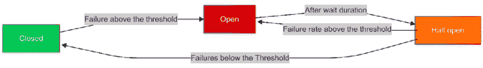

# 第六章：高级 API 概念和实现

创建健壮且高性能的 RESTful API 不仅仅是设置端点和处理 CRUD 操作。随着应用程序的增长和用户需求的增加，在 API 中融入先进的策略，以保持 API 在各种条件下的效率、可靠性和弹性变得至关重要。本章探讨了这些策略，重点关注数据处理技术，如分页、过滤和文件的上传和下载，以及对于现代 API 开发至关重要的弹性机制。

在数据管理方面，我们将检查分页、过滤以及通过 REST API 高效上传和下载文件等关键实践。这些方法旨在提高 API 的响应性和可伸缩性，确保它们能够无缝地管理更高的负载和更复杂的数据交互。其中一些主题与性能相关，但我们将更详细地介绍性能优化在*第十章*。

本章将探讨关键的弹性机制，包括超时、重试策略、速率限制、节流、幂等键、断路器和防波堤。这些方法有助于保护您的 API 免受故障的影响，有效管理流量，并在不可预测或不利条件下保持稳定性。

从开发者的角度来看，预测系统在实际场景中的行为可能具有挑战性。在开发过程中，我们通常在理想的环境下操作：在本地运行 API、作为唯一用户，以及使用可能导致失败的变量最少的测试。这种受控环境可能会掩盖生产中出现的复杂性和潜在问题，在那里 API 必须支持多个用户、处理不同的负载并响应意外事件。通过结合本章讨论的先进概念和实现，您将更好地装备自己，以构建在任何环境中都能可靠且高效运行的 API。

我们将涵盖以下主题：

+   数据处理

+   弹性

# 技术要求

在本章中，您将找到几种不同的方法，这些方法将帮助您根据您的需求改进您的 API。对于本章，我们建议您复习上一章的代码；本章的一些小改进可在以下链接找到：[`github.com/PacktPublishing/Mastering-RESTful-Web-Services-with-Java/tree/main/chapter6`](https://github.com/PacktPublishing/Mastering-RESTful-Web-Services-with-Java/tree/main/chapter6)。我们使用`curl`命令行工具作为客户端来测试 API。

# 数据处理

**数据处理**是构建健壮且用户友好的 API 的基石。在本节中，我们将探讨高级数据处理技术，这些技术针对现实世界 API 开发中面临的常见挑战。

确保 API 提供可靠的性能对于多个相互关联的原因至关重要，包括提升用户体验、实现系统可扩展性、优化资源效率以及影响 API 开发背后业务的成功。

一个高性能的 API 必须快速响应并与客户端进行清晰的沟通。这意味着返回适当的 HTTP 状态码（例如，200 表示成功或 404 表示未找到）以及描述性消息，说明发生了什么。低延迟至关重要，因为用户期望快速响应，而缓慢的 API 可能会创建系统瓶颈，让用户感到沮丧。

当 API 响应时间过长时，会导致整个应用程序出现延迟。现代系统通常需要实时数据更新，因此 API 必须高效地处理频繁的请求，同时保持一致的响应时间。清晰的沟通同样重要——当出现错误时，客户端需要提供解释问题的信息性消息并建议解决方案。

有效的 API 在速度和清晰度之间取得平衡。它们快速处理请求，同时通过适当的状态码和有用的消息提供有意义的反馈。这种方法确保了最终用户和开发者都能有效地使用 API，减少了困惑和调试时间。

优化响应速度和消息质量有助于 API 在不降低性能或增加运营成本的情况下处理增加的流量。这些改进既支持用户满意度，也支持业务增长。

在接下来的章节中，我们将探讨提高 API 性能的数据处理技术。我们将从管理大数据集的分页开始，然后介绍通过 REST API 进行过滤和高效的文件操作。

## 分页

从一个或多个数据库表中检索大量记录并将它们转换为与您的语言/框架兼容的数据结构，例如在 Java 中使用 Spring Boot，会消耗资源，包括内存和 CPU 处理能力。这个过程会一直持续到数据被转换为标准格式，如 JSON，用于通信并准备好发送给客户端。此外，即使在数据准备完毕后，仍然会使用资源通过网络将其传输到客户端。

通常，没有必要将资源表示的所有数据在一个大型的单一负载中发送给客户端。这样做会消耗更多资源，降低系统性能，并导致糟糕的用户体验。这可能会伴随着与云计算相关的增加成本，这些成本基于使用量来计费。处理和传输大量数据也需要更多时间。相反，可以将数据分成更小的块，这需要更少的时间和资源，从而使 API 更可靠且维护成本效益更高。这种方法被称为**分页**，它提高了 API 的响应速度并节省了资源。

考虑以下示例：我们的 API 包含 100,000 个产品，我们有一个**单页应用程序**（**SPA**），它消费此 API 以在**产品**页面上显示产品数据表。想象一下，每次用户打开这个页面时，API 都会被调用以访问数据库，将这些记录加载到内存中，将它们转换为 JSON，然后在用户每次访问页面时通过互联网请求传输大量数据。现在，想象一下，这个系统每天被众多用户使用。如果没有分页，每个用户操作都会触发资源密集型过程，导致成本增加、响应时间变慢，以及用户体验下降。通过实现分页，API 可以提供更小、更易于管理的数据集，从而提高性能和可扩展性，同时降低运营成本。所有这些都可以在不限制应用程序用户界面视图的情况下完成，因为用户永远不会同时看到所有产品。

### 不同的分页方法

以下是一些常见的 REST API 分页方法：

+   基于偏移量的分页

+   基于页面的分页

+   基于游标的分页

+   关键集分页

让我们逐一看看它们

#### 基于偏移量的分页

**基于偏移量的分页**是一种简单且广泛采用的技术。它通过定义一个偏移量（起始位置）和一个限制（每页要检索的记录数）来在数据集中导航。这种做法可以在多个不同公司的 API 中找到，例如 OpenWeatherMap、Stripe、Adidas 和 Mailchimp。

以下是基于偏移量分页的优点：

+   **简单性**：该方法易于实现和理解

+   **灵活性**：通过调整偏移量，您可以直接跳转到您可能想要的位置

以下是基于偏移量分页的缺点：

+   **性能问题**：随着偏移量的增加，查询性能会下降，因为数据库必须扫描并跳过越来越多的记录。

+   **数据一致性**：请求之间的数据更改，如插入或删除，可能导致结果不一致，导致页面之间出现重复或缺失的记录。

客户可以操作业务逻辑，但这并不能保证所有客户都能获得相同的体验。然而，如果 API 旨在非常灵活，这也可以被视为一种优势。

很可能，这将被传递到数据库查询，如 SQL，如果没有适当的输入清理和参数化，可能会导致 SQL 注入。

以下是一个 API 调用的示例：

```java
GET /api/products?offset=50&limit=25
GET https://<dc>.api.mailchimp.com/3.0/lists/{list_id}/members?count=100&offset=200 
```

#### 基于页面的分页

**基于页面的分页**将数据集分为页面，允许客户通过指定页码来导航数据。这种方法很简单，因此被 API 市场的公司广泛采用，例如 Salesforce 和 Microsoft。

要使用它，您需要指定要检索的页面（`page`）和每页的记录数（`page_size`）。

以下是基于页面分页的优点：

+   **用户友好性**：用户可以直观地导航到特定页面

+   **简单性**：易于实现和理解

以下是基于页面分页的缺点：

+   **性能问题**：与基于偏移量的分页类似，大页码可能导致性能下降。

+   **灵活性较低**：返回的记录列表必须从页面边界开始。这可能不适合使用滚动条而不是传统分页的用户界面。

以下是一个 API 调用的示例：

```java
GET https://api.github.com/repos/{owner}/{repo}/issues?page=2&per_page=30
GET https://yoursubdomain.zendesk.com/api/v2/tickets.json?page=5&per_page=100 
```

在演示 API 演变时，实现了示例产品 API 的`GET /products`端点的基于页面的分页，见*第五章*。

#### 基于光标分页

**基于光标分页**使用一个指针（光标）来跟踪数据集中的当前位置。客户端不是指定偏移量，而是使用光标请求下一组记录，并指定一个表示我们希望每块数据返回的记录数的限制。这正是 X（前身为 Twitter）API 实现分页数据的方法，包括推文、关注者和其他资源。

以下是基于光标分页的优点：

+   **性能效率**：由于不需要跳过记录，因此无论数据集大小如何，都能保持可靠的性能

+   **数据一致性**：相较于请求之间的数据不一致性，这种分页方式能确保更可靠的结果

以下是基于光标分页的缺点：

+   **复杂性**：与基于偏移量的分页相比，实现更为复杂

+   **灵活性较低**：适用于顺序导航，如果需要跳转到任意页面可能不是最佳选择

以下是一个 API 调用的示例：

```java
GET /api/products?cursor=eyJpZCI6NzUsIm5hbWUiOiJQcm9kdWN0IDc1In0=&limit=25
GET https://api.twitter.com/2/tweets?pagination_token=XYZ123&max_results=20 
```

#### 键集分页

**键集分页**是基于光标分页的一种变体；它利用一个唯一键——通常是时间戳或**通用唯一标识符**（**UUID**）——来导航记录。与依赖于数值偏移量（在数据集较大时可能越来越低效）的基于偏移量的分页不同，键集分页使用唯一键来标记数据集中的位置。这种方法确保了更快的查询性能和更一致的响应时间，特别适合需要实时数据访问和可扩展性的应用。

以下是基于键集分页的优点：

+   **性能**：键集分页通过消除数据库计数或跳过大量记录的需求（这在基于偏移量的分页中是必要的），为大数据集提供了更好的性能

+   **可扩展性**：随着数据集的增长，键集分页能保持一致的响应时间，使其成为高流量应用的可扩展解决方案

+   **可靠性**：通过依赖唯一的键进行导航，键集分页降低了遇到缺失或重复记录的风险，确保分页结果中的数据完整性

以下是一些键集分页的缺点：

+   **仅顺序导航**：键集分页需要顺序数据访问。与基于偏移量的分页不同，后者允许用户通过指定偏移量直接跳转到任何页面，键集分页需要按线性顺序遍历记录。这种限制对于需要访问非顺序页面或在数据集中进行随机访问的应用程序可能具有约束性。

+   **书签依赖**：要访问特定页面，客户端必须保留前几页的唯一键（游标）。这种依赖关系可能会使客户端逻辑复杂化，尤其是在用户可能希望重新访问或共享特定页面而不维护游标历史的情况下。

以下是一个 API 调用的示例：

```java
GET https://www.reddit.com/r/{subreddit}/comments.json?limit=25&after=t3_abcdef
GET https://api.linkedin.com/v2/connections?q=cursor&start=0&count=25&cursor=urn:li:person:123456789 Authorization: Bearer YOUR_ACCESS_TOKEN 
```

在为所有端点和 API 选择要应用的分页策略后，我们还应该返回有关分页的信息。提供有关总项数、页数和当前页的信息可以帮助客户端更好地导航大型数据集。

### 返回分页信息的不同方法

有许多方法可以将分页信息返回给客户端。最常见的方法如下：

+   使用响应头

+   在响应体中包含分页信息

+   使用超媒体（HATEOAS）

#### 使用响应头

这种策略涉及将分页信息直接嵌入到 HTTP 头中，例如关于总页数、当前页和其他相关信息。这种方法通常不单独使用，而是经常与其他策略结合使用以增强 API 功能。例如，GitLab 就采用这种方法与超媒体策略结合，以提供更全面的用户体验。我们可以将过滤与分页结合使用，以检索特定数据，通过将数据分成分页部分来管理大型数据集：

```java
HTTP/2 200 OK
status: 200 OK
X-Total-Count: 150
X-Total-Pages: 15
X-Current-Page: 3
X-Page-Size: 10 
```

在前面的示例中，我们可以看到四个自定义头，用于告知客户端如何有效地导航 API。

#### 在响应体中包含分页信息

在这种方法中，API 将分页数据与相关的分页元数据（如总页数和当前页）一起包含在响应体中。例如，Stripe API 通过返回数据和`has_more`标志（指示是否有更多结果可用）来采用这种策略。这种方法通过直接将分页细节与响应集成，使客户端能够理解其数据上下文。

一些 API 将响应数据与元数据分开，这也可以是有效的。以下是一个示例结构：

```java
{
  "data": [
    {
      "id": 1,
      "name": "Item 1"
    },
    {
      "id": 2,
      "name": "Item 2"
    }
  ],
  "pagination": {
    "totalItems": 150,
    "totalPages": 15,
    "currentPage": 3,
    "pageSize": 10
  }
} 
```

在这种结构中，`data`字段包含 API 的实际结果，而`pagination`部分提供了关于分页响应的必要元数据。这种方法通过清晰地组织数据和相关的分页信息来提高可用性，使客户端更容易导航和处理结果。

#### 使用超媒体（HATEOAS）

HATEOAS 通过嵌入导航链接增强了 API 响应，引导客户端根据服务器的响应进行导航和执行操作。正如我们在*第一章*中讨论的那样，HATEOAS 代表了 REST 架构的第四个成熟度级别，有助于将客户端与服务器解耦。我们将在本章后面的*HATEOAS*子节中深入探讨这个主题。

这种策略使客户端能够动态地与 API 交互，无需事先了解结构或额外的文档。例如，GitHub 等 API 通过采用 HATEOAS 使导航资源，如分页数据，变得简单直观。在下面的代码块中，我们可以看到使用这种策略帮助客户端通过数据的示例：

```java
{
  "_links": {
    "self": { "href": "/orders?offset=200&limit=20" },
    "prev": { "href": "/orders?offset=180&limit=20" },
    "next": { "href": "/orders?offset=220&limit=20" },
    "first": { "href": "/orders?limit=20" },
    "last": { "href": "/orders?offset=1000&limit=20" }
  },
  "totalCount": 1020,
  "_embedded": {
    "orders": [
      { ... },
      { ... },
      ... 
    ]
  }
} 
```

如前述代码所示，`_links`属性提供了关键的导航细节，包括关于当前请求的信息以及到上一页和下一页的链接，以及第一页和最后一页的链接。有了这些综合链接，客户端可以轻松地导航 API，无需手动构造额外的请求。

这种结构简化了客户端与数据的交互，将必要的导航信息嵌入到每个响应中。通过提供这些链接，API 使开发者能够创建更直观和无缝的用户体验。

在 API 开发中，高效的数据处理和强大的分页策略不仅仅是辅助功能——它们是支撑应用程序效能、可扩展性和整体用户体验的基本要点。我们已经概述了一些不同的分页方法及其细节，以确保您的 API 提供可靠且高性能的服务。无论您选择哪种方法，关键在于在整个端点之间保持一致性。确保每个 API 遵循相同的分页标准有助于简化客户端的集成，并促进更一致的用户体验。

在下一节中，我们将探讨如何通过应用一些允许我们结合分页和过滤的策略来过滤 API 返回的数据。

虽然分页本身可以通过将数据分成可管理的页面来管理大量数据集，但它可能无法完全满足客户端在需要特定数据子集时的需求。为了进一步提高数据处理能力，我们可以引入过滤功能，这将允许客户端在每一页中仅检索他们所需的数据。通过结合分页和过滤，我们提供了一种更灵活和高效的数据检索方法。

## 过滤

**过滤**允许 API 客户端通知我们的 API 我们需要在该资源上的一些特定数据子集，这意味着它将不会浪费资源处理我们此时不感兴趣的数据；我们可以专注于我们所需的数据。我们可以将过滤与分页结合使用来检索特定数据，从而通过将数据集分成分页部分来管理大量数据。

以下是一些过滤原则：

+   **无状态**：REST API 应该是无状态的，这意味着客户端的每个请求都必须包含所有必要的信息，以便服务器能够满足请求。过滤是通过在请求 URL 的查询字符串中包含过滤参数来实现的，无需在 API 服务器端保存此状态。

+   **一致性和可预测性**：过滤语法应在所有 API 端点保持一致。这确保了不同端点之间的可预测性，并使得客户端通过查看请求就能轻松理解过滤操作。例如，如果我们在一个端点通过`?firstName=Peter`参数进行按名字过滤，那么在其他相关端点进行此类过滤时，其操作应类似。

+   **粒度和灵活性**：有效的过滤机制允许客户端精确定义他们的需求，同时足够灵活以应对不同场景。例如，过滤器应适应不同的数据类型（如字符串、数字和日期）以及一系列运算符（如等于、不等于、大于、小于、在等）。

### 不同的过滤方法

过滤可以通过多种不同的方法实现。它可以采用以下方式实现：

+   **基本字段过滤**：这是最直接的方法，您可以传递字段名称和您想要过滤的值到资源中，这通常通过在 URL 上传递这些值作为查询参数来完成：

    ```java
    GET /customers?firstName=Peter or GET /products?category=electronics 
    ```

+   **多字段过滤**：这与上一个例子相同，唯一的区别是我们将传递多个字段过滤器及其相应的值来过滤数据。为了分隔`field=value`集合，我们将使用`'&'`字符：

    ```java
    GET /customer?firstName=Peter&age=30 
    ```

通过一系列值进行过滤是可能的，通过将`min`和`max`前缀与相同的字段名称结合，如下所示：

```java
GET /customer?minAge=35&maxAge=45 
```

+   **使用比较运算符进行过滤**：一些 API 还提供了处理比较运算符的能力；这为构建比简单的字段等于值更复杂的过滤组合提供了机会：

    ```java
    GET /products?price[gte]=100&price[lte]=500 
    ```

+   **列表过滤（包含/排除）**：使用这种方法，我们可以在列表上使用`in`或`nin`（不在）运算符：

    ```java
    GET /users?role[in]=admin,supervisor,user
    GET /products?category[nin]=books,phones 
    ```

到现在为止，你应该已经意识到，分页和过滤是你在 API 实现中不能错过的两个概念。此外，它们需要结合起来，以充分利用我们 API 端点的优势，这些端点是返回数据列表的候选者。以下是一些最佳实践：

+   使用显著、清晰、直观的参数名称，以引导用户避免错误

+   验证和清理输入以避免攻击和错误

+   验证并实施默认限制，以避免用户请求大值，使服务器不得不传递大量数据

+   在整个系统中保持一致的命名、响应元数据和方法，以提供良好的用户/开发者体验，使结构和参数化标准化且易于消费

过滤是稳健 API 设计的关键方面，它使客户端能够获取所需数据，而不会过度负担服务器或网络。通过实施结构良好的过滤机制，API 可以实现更高的性能、可扩展性和用户满意度。

采用各种过滤方法——从基本的字段过滤器到高级的比较运算符和基于列表的标准——使 API 能够满足多样化的客户端需求和复杂的查询需求。此外，将过滤与分页集成不仅增强了数据管理，还确保了即使在处理大量数据集时，响应也能保持快速且易于管理。

让我们探索一个基于我们分页端点的实际例子。在这里，我们添加了过滤功能，允许客户端指定如类别或价格范围等标准。结合分页和过滤不仅增强了数据管理，而且是一种最佳实践，为客户端提供流畅的体验，即使在数据集增长的情况下，也能保持响应快速且相关。

考虑一个电子商务 API 端点，该端点返回产品列表。此端点允许客户端请求特定页面的数据并应用过滤器，仅检索他们需要的商品，从而减少客户端和服务器上的数据负载。

以下是一个使用分页和过滤的 API 调用示例：

```java
GET /api/v1/products?page=2&limit=10&category=electronics&price_min=100&price_max=500&sort=price_asc 
```

它应该返回如下内容：

```java
{
  "data": [
    {
      "id": 101,
      "name": "Smartphone Model X",
      "category": "electronics",
      "price": 250.00,
      "available": true
    },
    {
      "id": 102,
      "name": "Wireless Earbuds",
      "category": "electronics",
      "price": 120.00,
      "available": true
    }
    // Additional products...
  ],
  "pagination": {
    "totalItems": 42,
    "totalPages": 5,
    "currentPage": 2,
    "pageSize": 10
  }
} 
```

### 分页和过滤的最佳实践

让我们来看看在分页和过滤时应该遵循的一些最佳实践：

+   **使用清晰直观的参数名称**：参数名称，如`page`、`limit`、`category`、`priceMin`和`priceMax`，应该是简单、一目了然且符合常见的 API 设计惯例，使端点易于使用和理解。

+   **应用输入验证和清理**：API 验证所有参数以确保它们格式正确。例如，`page`和`limit`必须是整数，而`priceMin`和`priceMax`必须是十进制数。此外，`sort`参数仅接受特定值，防止注入攻击和错误。

+   **应用默认限制和约束**：在我们的示例中，每页默认限制为 10 项，且`limit`参数不能超过`100`。这些措施可以保护服务器免受处理过大请求的影响，提高性能并防止滥用。

+   **采用一致的命名和元数据**：响应包括元数据——`page`、`limit`、`totalPages` 和 `totalItems`——这些元数据向客户端提供有关分页状态的必要信息，确保标准化和可预测的体验。

+   **结合分页和过滤**：本例演示了分页和过滤如何协同工作。客户端可以同时指定页码和过滤器，允许他们检索所需的确切数据，而不会过载服务器或客户端，避免提供不必要的信息。

通过应用这些最佳实践，API 实现了灵活性、性能和用户友好性的平衡，确保客户端可以高效地访问数据，同时保持强大、可扩展的 API 设计。

通过分页和过滤，我们已经看到如何通过选择性检索信息来有效地管理大量数据。然而，在许多应用程序中，处理数据并不仅限于管理结构化信息。通常，API 需要支持上传和下载文件，允许客户端以图像、文档和报告等格式传输数据。

在下一节中，我们将深入探讨通过 REST API 处理文件上传和下载的最佳实践和技术。这些策略将有助于确保安全、可靠的文件传输，并与 API 的其余部分顺利集成。

## 通过 REST API 上传和下载文件

Web 应用通常需要支持文件上传和下载。此功能通常伴随着额外的要求，例如验证文件类型、名称和最大大小，确定最佳存储解决方案，提供有意义的响应，以及通过流式传输有效地处理大文件。在本节中，我们将详细讨论这些常见主题。

当设计用于处理文件上传的控制器时，确保使用 Spring Web 接口定义上传文件的参数至关重要，即表示多部分请求中上传文件的 Spring Boot 接口——`org.springframework.web.multipart.MultipartFile`。此外，请求必须将其`Content-Type`设置为`multipart/form-data`，这是网络浏览器用于上传文件的常用格式，因此使用`MultipartFile`的 API 服务也期望这种格式。

我们可以通过向我们的示例产品 API 添加一个子资源 `/products/{productId}/photo` 来演示上传和下载功能，这将代表产品的照片图像。

以下是一个上传单个文件的示例 HTTP 请求和方法：

```java
curl -X PUT -F "file=@C:/path/of/your/file.jpeg" http://localhost:8080/api/products/AK12345/photo
// Single file upload Controller Method
@PutMapping("/{productId}/photo")
public ResponseEntity<String> uploadProductPhoto(
@PathVariable("productId") @ValidSku String productId,
@RequestParam("file") MultipartFile file) {

// Implementation logic 
} 
```

`multipart/form-data` 格式表示一个可以包含多个字段的表单。它也可以用于在单个请求中上传多个文件。这就是为什么在先前的示例中，`"file"`参数名称对于识别代码想要处理的文件非常重要。

以下是一个示例 HTTP 请求：

```java
curl -X POST -F "file=@C:/path/of/your/file1.txt" -F "file=@C:/path/of/your/file2.txt" http://localhost:8080/uploads 
```

以下是多文件上传的方法：

```java
// Multiple files upload Controller Method
@PostMapping("/uploads")
public ResponseEntity<String> uploadFiles(@RequestParam("files") MultipartFile[] files) {

// Implementation logic 
} 
```

我们的示例代码为了简单起见，将上传的文件内容作为关系数据库中的**大型对象**（**LOB**）存储。关系数据库没有针对这类数据进行优化，所以在大规模系统中，通常使用其他类型的存储。

文件可以保存在外部存储提供者，如 AWS S3。这种基于云的存储解决方案有效地管理文件，提供访问存储内容的链接。这种方法在行业中越来越受欢迎，因为它优化了资源管理并利用了云基础设施的可扩展性。

通过在云数据存储中保存文件并通过 API 仅暴露链接，开发者可以避免直接加载大量资源。这不仅提高了性能，还改善了客户端的响应时间，使他们能够按需检索文件，而不会过载 API。

在先前的示例中，API 在响应中返回一个字符串，因此返回的字符串可以用来传递云存储 URL。

建议验证上传的文件以确保安全性、数据完整性和性能。以下部分描述了一些可能的验证。

### 验证上传的文件

验证步骤对于 RESTful API 至关重要，对于您可能正在开发的任何系统也是如此，以维护应用程序的完整性和安全性。您接收到的输入可以使应用程序容易受到多种不同类型的攻击。让我们看看在上传文件时需要执行的一些重要验证示例。

#### 验证文件内容类型

仅接受特定类型的文件是一个很好的措施，可以避免接收恶意文件或不符合您需要存储的数据的数据。在以下示例中，您确保只会收到 PNG 和 JPEG 文件：

```java
private static final List<String> ALLOWED_CONTENT_TYPES = List.of("image/png", "image/jpeg");
String contentType = file.getContentType();
if (!ALLOWED_CONTENT_TYPES.contains(contentType)) {
    // report error using the 415 HTTP status code (Unsupported Media Type)
} 
```

请注意，整个 HTTP 请求体的内容类型将是 `multipart/form-data`，但其中包含的每个文件也有其自己的内容类型。这就是为什么我们需要使用我们即将处理的特定 `MultipartFile` 对象的 `getContentType` 方法来检查内容类型。

除了文件内容之外，我们的示例 Product API 还存储上传文件的 MIME 类型。当文件被下载时，`GET`端点返回相同的 MIME 类型。如果没有正确的`Content-Type`头，在网页浏览器中打开 URL 将显示乱码，因为浏览器不知道如何解释下载的文件字节。

#### 验证文件大小

验证文件大小是一种避免处理比预期更大的文件的措施，无论上传是否有意为之，这都可能因为系统因过大的文件而超载导致内存耗尽，从而造成服务拒绝。

我们可以使用`MultipartFile`类的相应方法程序化地检查文件大小：

```java
private static final long MAX_FILE_SIZE = 10 * 1024 * 1024; // 10 MB
if (file.getSize() > MAX_FILE_SIZE) { 
  throw new FileSizeLimitExceededException(
    "File size exceeds the allowable limit of 10 MB."); 
} 
```

文件上传也受到 Spring 配置属性的限制，这些属性指定了可接受的最大多部分请求大小和请求中单个文件的最大大小。您可以在`application.yml`或`application.properties`文件中设置这些属性：

```java
spring.servlet.multipart.max-file-size=10MB 
spring.servlet.multipart.max-request-size=10MB 
```

#### 验证文件名

为了提高服务器上的文件上传安全性，验证文件名对于防止诸如路径遍历等攻击至关重要。例如，攻击者可能会使用如`../../etc/passwd`这样的文件名来尝试访问上传目录之外的敏感文件。

在文件上传中，路径遍历攻击尤其危险。通过操纵文件路径，攻击者可能利用薄弱的验证在服务器上保存文件到非预期位置，这可能导致敏感数据的泄露或甚至覆盖关键文件。例如，如果服务器直接将用户提供的文件名附加到上传路径上，攻击者可以使用`../`序列在目录结构中向上导航，从而允许他们访问或修改受限文件。这就是为什么在处理文件路径时，尤其是在上传场景中，验证至关重要。

虽然有几种方法可以防止路径遍历攻击，以下是一些有效的策略：

+   **仔细设置用户和文件权限**：限制权限，仅允许必要的用户和目录访问。

+   **单独存储文件**：考虑将上传的文件存储在不同的服务器或安全的存储服务中，例如 AWS S3。通过将文件从主服务器上移除，可以降低对系统文件结构的未授权访问风险。

+   **验证文件路径**：确保文件路径指向预期发送文件的特定文件夹。

+   **使用安全的文件上传解析器**：在 Spring 中，如`CommonsMultipartResolver`和`StandardServletMultipartResolver`之类的类作为解析器，负责解析或解释请求中的多部分数据，并帮助安全地管理文件上传。它们将文件部分与其他表单数据分开，并在 Spring 的请求处理框架中将它们作为`MultipartFile`对象提供。这两个类都负责解析常见的多部分文件请求，这些请求通常用于文件上传。它们将文件数据与用户输入分开处理，这有助于防止注入攻击：

+   **CommonsMultipartResolver**：这个类是 Apache Commons `FileUpload`库的一部分，允许您配置文件大小限制和临时存储目录。它为需要严格控制文件存储和性能的应用程序提供了灵活性。通过通过`CommonsMultipartResolver`设置限制和约束，您可以减轻过度文件上传或未经授权访问临时存储等风险。

+   **StandardServletMultipartResolver**：这是一个 Spring 框架中的解析器，它利用 Servlet 3.0 提供的内置多部分支持，使其成为处理 Spring 应用程序中文件上传的可靠且高效的选项。通过依赖 Servlet 容器本地的多部分处理，这个解析器避免了需要额外的库，简化了设置和维护。

这些解析器不仅简化了文件处理，而且通过以标准化的方式处理多部分文件请求，有助于减轻潜在的安全漏洞。这确保了文件将根据预定义的规则进行处理，从而降低了路径遍历和其他注入攻击的风险。

当处理存储在应用程序服务器上的文件时，请记住不要仅依赖`StringUtils.cleanPath`等方法。尽管这些方法被广泛使用，但它们不应是唯一的安全措施，因为它们不能完全防止路径遍历。正如 Spring 文档（v6.1.12）中所述，“`cleanPath` *不应在安全环境中依赖*。”

为了增强文件名的消毒，您可以使用 Apache Commons IO 库中的`FilenameUtils`类。这个实用工具类提供了安全地操作和消毒文件名的各种方法。

以下是一些有助于覆盖一些文件上传验证的代码示例：

```java
// Extract the base name of the file, removing any path information
String sanitizedFilename = FilenameUtils.getName(originalFilename);

// Enforce character restrictions
if (!sanitizedFilename.matches("^[a-zA-Z0-9._-]+$")) {
    throw new SecurityException("Invalid characters in file name.");
}

// Limit file name length
if (sanitizedFilename.length() > 100) {
    throw new SecurityException("File name too long.");
}

// Check allowed extensions
List<String> allowedExtensions = Arrays.asList("jpg", "png", "pdf");
String extension = FilenameUtils.getExtension(sanitizedFilename);
if (!allowedExtensions.contains(extension.toLowerCase())) {
    throw new SecurityException("File type not allowed.");
}

// Avoid leading dots and double extensions
if (sanitizedFilename.startsWith(".") || sanitizedFilename.contains("..")) {
    throw new SecurityException("Invalid file name format.");
}

// Ensure path is within the intended directory
Path targetPath = Paths.get("/uploads/")
.resolve(sanitizedFilename)
.normalize();
if (!targetPath.startsWith("/uploads/")) {
    throw new SecurityException("Invalid file path.");
}

// Optionally, add a unique prefix to avoid conflicts
String uniqueFileName = UUID.randomUUID().toString() + "_" + sanitizedFilename; 
```

这种方法提供了对文件名的彻底消毒和验证，确保它们执行以下操作：

+   符合预期的字符和格式

+   具有合理的长度限制

+   限制在允许的文件类型范围内

+   仅存储在预期的目录中

+   可选地分配一个唯一名称以防止冲突

通过结合这些安全措施并利用`FilenameUtils`进行安全的文件名操作，您可以确保文件上传保持安全。这减少了路径遍历攻击的机会，并保护您的应用程序免受未经授权的访问。即使您的应用程序在 AWS S3 等服务上存储文件，验证文件名也有助于保持一致、安全且用户友好的体验。

使用 AWS S3 等存储服务可以通过将某些安全关注点从您的应用程序服务器卸载来简化文件上传处理。由于 S3 和类似服务在与管理您的服务器文件系统分离的管理环境中存储文件，它们减少了路径遍历攻击的风险，攻击者可能会尝试在未经授权的位置保存或访问文件。通过隔离存储，这些服务保护了您的核心基础设施免受与上传文件的直接交互，减少了不正确验证的文件路径或名称可能带来的潜在影响。

此外，AWS S3 自动为上传的文件生成唯一的 URL 或标识符，这最大限度地减少了名称冲突解决和额外文件名验证的需求。S3 强制执行安全的命名约定，并确保上传的文件安全存储，不影响应用程序的其他区域。这意味着您的应用程序可以专注于验证基本属性，如文件类型或大小，而不必过多担心路径遍历或目录限制，从而简化文件上传过程并增强整体安全性。

在实施彻底的验证以确保文件名安全并减轻如路径遍历攻击等风险之后，考虑我们的 API 如何传达文件上传过程的结果至关重要。提供清晰、有意义的响应确保客户了解其上传尝试的状态，无论成功与否。有效的响应不仅承认成功——当发生错误时，它们还指导用户了解出了什么问题以及如何纠正它。通过返回特定的 HTTP 状态码和相关的元数据，我们可以使文件上传过程更加透明、可靠和用户友好。

### 在我们的 API 服务上提供文件上传的有意义响应

通过使用适当的 HTTP 状态码，向客户端提供有关上传结果的明确反馈：

+   `201 Created`：当文件成功上传时

+   `415 Unsupported Media Type`：对于无效的文件类型

+   `413 Payload Too Large`：如果文件大小超过允许的限制

+   `400 Bad Request`：对于其他验证错误

在响应中包含元数据，例如文件 URL 或标识符，以便将来下载。

在涵盖这些基本但至关重要的细节并强调处理 API 中文件的具体预防措施之后，很明显，即使是看似微小的实现也可能导致潜在的安全漏洞。这些弱点可能成为关键故障点，可能破坏整个 API 的稳定性。例如，单个格式错误的文件可能会干扰 API 操作，或者利用文件命名约定的攻击可能为恶意行为者提供入口点。介绍这个主题的目的是引起您对在处理 API 中的文件时可能遇到的这些场景的注意。

在本章早期，我们在讨论分页时介绍了 HATEOAS，以展示超媒体链接如何增强对大型数据集的导航。现在，我们将更详细地探讨 HATEOAS，因为它代表了一个更广泛的架构模式，它超越了分页，提供了一种更复杂的 API 交互和资源发现方法。

## HATEOAS

如同在*分页*章节中提到的，HATEOAS 是 RESTful API 的关键原则之一，它通过在响应中包含导航链接来改善客户端的交互。这些超链接指导客户端如何访问相关资源，而无需事先了解 API 结构。正如我们之前所看到的，在分页响应中，HATEOAS 可以提供到下一页和上一页的链接，从而在不要求硬编码逻辑的情况下，实现数据的平滑导航。

通过使用 HATEOAS，API 变得更加自解释且易于适应变化。客户端可以直接从响应中根据提供的链接发现可用的操作，如编辑或删除。这简化了 API 的使用，并确保了灵活性，因为客户端不需要依赖外部文档来理解 API 的行为，从而在更新发生时减少了出错的机会。

让我们来看一个使用 HATEOAS 来展示资源上可用操作的例子：

```java
{
  "id": 123,
  "name": "John Doe",
  "email": "johndoe@example.com",
  "links": [
    {
      "rel": "self",
      "href": "/users/123",
      "method": "GET"
    },
    {
      "rel": "edit",
      "href": "/users/123",
      "method": "PUT"
    },
    {
      "rel": "delete",
      "href": "/users/123",
      "method": "DELETE"
    }
  ]
} 
```

在前面的例子中，响应的`links`部分包含三个元素。第一个元素，`"rel": "self"`，表示指向当前资源的链接。这允许客户端使用`GET`方法在`href`（代表超媒体引用）属性中提供的 URL 检索或与特定用户交互。第二个元素，`"rel": "edit"`，提供了一个使用`PUT`方法更新用户详情的链接。最后，`"rel": "delete"`元素允许客户端使用`DELETE`方法删除用户。每个链接都指导客户端与资源进行交互，使 API 自解释且易于使用。

HATEOAS，如 RFC 8288 所述，正式化了在 API 中使用 Web 链接，确保了这些链接的结构和解释的一致性和清晰性。此 RFC 定义了关键组件，如`rel`属性，它指定了链接的关系类型（例如，`"self"`或`"edit"`），以及`href`，它定义了交互的目标 URL。通过遵循此标准，API 变得更加健壮，客户端能够导航资源并执行操作，而无需硬编码端点路径或参考外部文档。这种方法增强了灵活性并确保 API 交互的未来兼容性，因为服务器可以进化，同时仍然与现有客户端保持兼容性。

我们之前看到的相同示例也可以有不同的响应，其中某些操作（如删除元素）不可用。例如，在以下示例中，对用户`"Jane Smith"`的响应在`links`部分不包括`"delete"`链接：

```java
{
  "id": 456,
  "name": "Jane Smith",
  "email": "janesmith@example.com",
  "links": [
    {
      "rel": "self",
      "href": "/users/456",
      "method": "GET"
    },
    {
      "rel": "edit",
      "href": "/users/456",
      "method": "PUT"
    }
  ]
} 
```

在这种情况下，`delete`链接的缺失表明由于权限限制或业务规则，此资源不支持`delete`操作。HATEOAS 有助于向客户端清晰地展示这些限制，确保客户端不会尝试执行不支持的操作。这允许 API 动态控制哪些操作是允许的，防止滥用并根据资源当前状态引导客户端的行为。

为了简化 HATEOAS 的实现，现代 API 框架提供了内置工具来支持此模式。例如，在 Spring Boot 中，你可以利用`spring-boot-starter-hateoas`依赖项轻松地将 HATEOAS 集成到你的 API 中：

```java
<dependency>
    <groupId>org.springframework.boot</groupId>
    <artifactId>spring-boot-starter-hateoas</artifactId>
</dependency> 
```

HATEOAS 增强了 API 的动态性，通过结合我们之前提到的所有好处，将 API 提升到一个更高的成熟水平。然而，评估此资源是否适用于你的用例是很重要的，因为 HATEOAS 不是每个 API 的强制组件。它需要另一个依赖项、额外的开发和维护，并且需要关注是否值得拥有它。

我们已经通过采用高效的数据处理技术，介绍了构建可靠且用户友好的 API 的基本实践。现在，随着我们转向弹性模式，我们将探讨帮助 API 在面临意外挑战时保持稳定和健壮性的策略。弹性对于确保 API 在各种不利条件下继续可靠地运行至关重要，从网络问题到系统过载。在接下来的部分中，我们将深入研究使 API 能够优雅地处理此类场景的模式，从而增强其可靠性和用户体验。

# 弹性

在讨论如何使 API 具有弹性之前，让我们看看牛津高阶英文字典对弹性的定义：“（指人或动物）能够承受或迅速从困难条件下恢复过来。”如果我们尝试将同样的定义应用到我们的 RESTful API 或系统上，我们可以说，一个弹性的 API 是能够承受故障和中断，同时保持其功能性和性能，并从可能导致其关闭或性能下降的情况中恢复的 API。

为了确保 API 作为更大、更健壮系统的一个可靠组件，它必须有效地处理过载、依赖服务的性能下降和基础设施故障。为此，我们需要关注 API 设计的一些方面，我们将探讨实现这些功能的方法和技术，确保您的 API 能够提供一致的价值。

关于 API 设计，我们需要遵循的关键原则如下：

+   **冗余**：拥有我们组件/服务的多个实例，以避免单点故障。

+   **解耦**：在设计中最小化依赖性，旨在限制系统任何部分失败时的影响。

+   通过减少系统组件之间的互连，最小化系统设计中的直接依赖，这有助于限制单个组件失败的影响。当一个 API 与其他服务或组件紧密耦合时，一个部分的故障可能会在整个系统中级联，导致广泛的故障或性能下降。相比之下，解耦的系统允许组件更独立地运行，隔离故障并防止它们影响其他部分。

+   **故障隔离**：使用诸如桅杆和保险丝等技术将故障限制在系统的隔离部分，防止错误状态在整个系统中传播，就像“毒丸”一样。

+   **优雅降级**：即使在系统部分失败或性能不佳的情况下，也要保持有限的功能。这种方式优先考虑主要功能，防止整个系统停止。

让我们列出一些我们将讨论的概念和模式，以及每个概念可以帮助我们解决的问题：

+   超时

+   重试机制

+   速率限制和节流

+   幂等性键

+   保险丝

+   桅杆

## 超时

在设计 API 时建立适当超时设置至关重要，以确保系统弹性。API 交互通常涉及服务之间的同步远程调用，无论它们位于同一网络还是不同网络。这种同步通信意味着客户端无法了解服务器的处理状态，保持网络连接，并等待调用成功或失败。如果没有明确定义的超时，客户端可能会经历长时间的等待响应，这可能会降低用户体验，引入安全漏洞，并导致系统不稳定或停机。

超时可以从两个角度进行设置：

+   客户端配置

+   服务器配置

### 客户端配置

在客户端配置超时对于防止客户端无限期等待服务器响应至关重要。通过设置特定的超时持续时间，客户端确保它不会因为延迟的服务器回复而变得无响应。当服务器在指定的超时期间未能响应时，客户端应执行以下操作：

+   **提醒用户**：通知用户关于延迟的情况，以保持透明度并管理预期

+   **记录事件**：将超时发生记录在日志中，用于监控和故障排除

+   **启动重试机制**：根据应用程序的要求，客户端可能会尝试重新发送请求以从暂时性问题中恢复

让我们使用 Spring Boot 的`RestClient`实现 API 客户端的超时。在我们的示例中，我们将配置一个六秒的超时，在允许正常操作足够的时间和防止过度等待之间取得平衡。以下是配置`RestClient`以适当的超时设置的步骤：

```java
@Configuration
public class ProductsApiConfiguration {
    @Bean
    public ProductsApi getProductsApi(ApiClient apiClient)
    {     
        return new ProductsApi(apiClient);
    }

    @Bean
    public ApiClient getApiClient(RestClient restClient) {
        return new ApiClient(restClient);
    }

    @Bean
    public RestClient getRestClient() {
        return RestClient.builder()

       .requestFactory(customClientHttpRequestFactory())
            .build();
    }

    private ClientHttpRequestFactory customClientHttpRequestFactory() {
        Duration duration = Duration.ofSeconds(6);
        ClientHttpRequestFactorySettings settings = 
            ClientHttpRequestFactorySettings.DEFAULTS
            .withConnectTimeout(duration)
            .withReadTimeout(duration);

        return ClientHttpRequestFactories.get(settings);
    }
} 
```

本例演示了如何配置`RestClient`以适当的超时设置来建立连接并接收数据。让我们设置这些超时，以确保我们的客户端不会等待服务器响应过长时间。

### 服务器配置

当服务器收到请求时，它开始处理必要的信息，这可能涉及与其他服务器的交互、执行数据库查询和执行各种计算任务。如果这些操作超过了预定义的超时阈值，服务器应执行以下操作：

+   **终止处理**：停止与请求相关的任何正在进行的操作，以释放资源

+   **释放已分配的资源**：确保内存、线程和数据库连接等资源得到适当释放，以防止泄漏和瓶颈

+   **通知客户端**：使用适当的 HTTP 错误代码`408 Request Timeout`通知客户端已发生超时，允许客户端适当地处理这种情况（例如，通过重试请求或通知用户）

在设置超时之前，观察你服务的典型响应和网络条件非常重要；这将帮助你有一个正确的概念，即什么是“正常”的预期响应时间，因为设置非常短的超时可能导致不必要的失败，而非常长的超时可能导致用户体验不佳。最佳的应用实践需要持续监控超时指标并调整客户端和服务器配置，以保持健康、有弹性和可持续的 API。

为了说明 Spring Boot 应用程序中的客户端超时设置，你可以在`ClientHttpRequestFactorySettings`中配置连接超时和读取超时。这个类负责使用特定的超时参数设置 HTTP 请求工厂。这些设置随后用于创建一个`RestClient`实例，这是一个用于向其他服务执行 HTTP 请求的组件。有关此配置的更详细信息，请参阅书籍源代码仓库中`chapter6`文件夹中的`ProductsApiConfiguration`类。

虽然最后一个示例侧重于客户端配置，但值得注意的是，Spring Boot 中的服务器端超时配置通常涉及在`application.properties`或`application.yml`文件中设置属性。

以下是一个示例：

```java
server:
  tomcat:
    connection-timeout: 5000 
```

这将服务器的连接超时设置为五秒。具体的属性及其效果可能因所使用的服务器（例如，Tomcat 或 Jetty）而异。

之前的示例展示了基本的客户端和服务器端超时配置。然而，在更复杂的应用中，你可能需要更高级的超时管理。本书中的示例故意设计得简单，以便专注于关键概念。对于现实世界中的应用，特别是那些涉及复杂数据库操作或微服务的应用，你可能发现更复杂的库，如 Resilience4j，非常有用。

Resilience4j 提供了一个`TimeLimiter`模块，它提供了对超时的详细控制，并且与 Spring Boot 应用程序配合良好。虽然这种复杂程度对于我们的基本示例不是必需的，但随着你的应用程序变得更加复杂，理解这些高级技术可能非常有价值。以下是一个使用 Resilience4j 版本 2.2.0 在更复杂场景中管理超时的示例：

1.  将 Resilience4j 依赖项添加到你的项目中：

    ```java
    <dependency>
        <groupId>io.github.resilience4j</groupId>
        <artifactId>resilience4j-spring-boot3</artifactId>
        <version>2.2.0</version>
    </dependency> 
    ```

1.  在你的`application.yml`中配置`TimeLimiter`：

    ```java
    resilience4j:
      timelimiter:
        instances:
          productServiceGetById:
            timeout-duration: 5s
            cancel-running-future: true 
    ```

1.  使用`TimeLimiter`实现服务：

    ```java
    @Service
    public class ProductsQueryUseCaseImpl implements ProductsQueryUseCase {
        private final ProductsRepository productsRepository;
        private final PhotoProductsRepository photoProductsRepository;
        private final TimeLimiter timeLimiter;

        public ProductsQueryUseCaseImpl(
            ProductsRepository productsRepository,   
            PhotoProductsRepository photoProductsRepository,   
            TimeLimiterRegistry timeLimiterRegistry) {
            this.productsRepository = productsRepository;
            this.photoProductsRepository = photoProductsRepository;
            this.timeLimiter = timeLimiterRegistry.timeLimiter(
                "productServiceGetById");
        }
        @Override
        public CompletableFuture<
            Product> getProductByIdAsync(String productId) {
                return timeLimiter.executeCompletionStage(
                    Executors.newSingleThreadScheduledExecutor(), 
                    () -> CompletableFuture.supplyAsync(() ->     
                        getProductById(productId)))
                        .toCompletableFuture();
        } 
    ```

1.  在控制器中使用该服务：

    ```java
    @RestController
    @RequestMapping("/api/products")
    @Validated
    public class ProductsApiController implements ProductsApi {
        @GetMapping(value = "/{productId}")
        @Override
        public ResponseEntity<ProductOutput> getProductById(
            @PathVariable("productId") @ValidSku String productId) {
            try {
                final var product = productsQueryUseCase
                    .getProductByIdAsync(productId).get();
                return ResponseEntity.status(HttpStatus.OK)
                    .body(productMapper.toProductOutput(product));
            } catch (ExecutionException ex) {
                if (ex.getCause() instanceof TimeoutException) {
                    throw new ResponseStatusException(
                        HttpStatus.REQUEST_TIMEOUT, 
                        "Timeout to access the product id: 
                         [%s]".formatted(productId), ex);
                }
                throw new UnexpectedServerError(
                    "Error to access the product.", ex);
            } catch (Exception ex) {
                throw new UnexpectedServerError(
                    "Error to access the product.", ex);
            }
        }
    } 
    ```

在此示例中，请注意以下内容：

+   我们有一个由名为`TimeLimiterRegistry`的命名实例构建的`TimeLimiter`，它有一个五秒超时的配置。

+   `ProductsQueryUseCaseImpl.getProductById()`方法使用`timeLimiter.executeCompetionStage()`方法，该方法将仓库调用包装在`CompletableFuture`中以实现异步。

+   在实际场景中，如果复杂的数据库查询或高服务器负载导致延迟，它将通过这个`timeLimiter`调用被检测到，抛出一个异常。

这将由控制器的`try/catch`检测到，并返回超时 HTTP 代码。

这个例子展示了如何将超时应用于特定的服务方法，例如涉及数据库操作的方法。尽管它比书中的主要示例更复杂，但它演示了随着应用程序需求增长，你如何改进超时策略。

在实践中，你会根据你的具体要求选择适当的超时管理级别。你可能从更简单的方法开始，然后转向更高级的解决方案，如 Resilience4j，随着你的系统变得更加复杂。

虽然超时对于保持系统响应性至关重要，但它们通常与另一个重要的弹性模式：重试机制协同工作。当发生超时时，可能是因为可以迅速解决的暂时性问题。在这种情况下，自动重试操作可以帮助在不干预用户的情况下保持服务连续性。让我们探讨重试机制如何补充超时策略并增强整体系统弹性。

## 重试机制

实施重试机制是防止系统组件暂时不可用而中断整个依赖过程链的有效策略。虽然重试可以减轻暂时性故障，但过度或不适当的重试可能会加剧问题，导致资源耗尽和性能下降。我们将在这里介绍如何正确处理这种情况。

一个 API 可能无法完成一个过程周期，影响请求内的各种任务的原因不计其数。以下是一些你可以通过重试来处理的案例：

+   超时

+   5xx 服务器错误（例如，`500 内部服务器错误`或`503 服务不可用`）

+   速率限制（例如，`429 请求过多`）

考虑一个电子商务平台，验证产品的库存数量是完成销售的关键步骤。假设产品库存验证 API 通常在 2 到 5 秒内响应。如果这个 API 出现暂时性延迟或故障，实施重试机制以确保交易仍然可以继续，而无需不必要的放弃。以下是一个例子：

+   **初始请求**：系统请求库存数量

+   **首次失败**：API 在预期时间内没有响应

+   **重试尝试**：系统在短暂延迟后重试请求

+   **成功响应**：在第二次尝试中，API 成功响应，允许销售继续进行

这种方法最小化了由于临时 API 不可用而丢失交易的风险。然而，如果产品库存 API 出现故障且恢复时间较长，重试可能会变得有问题。在没有与其他参与交易的系统通信的情况下不断重试可能会导致糟糕的客户体验，并给公司造成重大损失。

为了避免陷入我们提到的陷阱，在实现重试策略时，你需要考虑一些最佳实践：

+   设置最大重试限制

+   使用带抖动的指数退避

+   保持请求幂等

+   实现超时机制

+   记录重试尝试

### 设置最大重试限制

没有最大重试限制，你的系统可能会陷入尝试重发失败请求的无尽循环。想象一下服务器长时间宕机的情况。如果没有重试限制，系统将永远尝试重新发送请求，浪费资源并可能引起其他问题。

### 使用带抖动的指数退避

指数退避是在失败后管理重试尝试时间的方法。不是试图在固定间隔内重新发送消息，而是在每次尝试重新发送失败时等待更长的时间。等待时间呈指数增长，这意味着增长很快。

让我们看看一个例子：

1.  **第一次尝试**：如果发送消息失败，在再次尝试之前等待一段时间（例如，一秒）。

1.  **第二次尝试**：如果再次失败，等待时间加倍（例如，两秒）。

1.  **第三次尝试**：将等待时间加倍，即四秒。

1.  **继续依赖于尝试次数的限制**：在每次新的重试中，等待时间加倍（8 秒、16 秒等）。

这种方法有助于防止系统过于频繁地尝试发送消息，这可能会引起更多问题，例如服务器或网络过载。

#### 抖动

**抖动**是用于重试失败请求的时间间隔的随机时间。我们不是让重试机制在固定时间或指数增长的情况下进行所有调用，而是为每次新的重试提供一个随机时间。例如，不是精确等待两秒，它可能在 1 到 3 秒之间等待。

### 结合指数退避和抖动

仅使用指数退避仍然可能引起问题。如果许多设备或系统试图同时重新发送消息，它们可能会等待相同的时间然后一起重试，从而产生突然的交通高峰。这可能会使网络或服务器更加不堪重负，这就是为什么将指数退避和抖动结合起来是最佳实践的原因。

添加抖动有助于分散重试尝试。每个设备等待的时间略有不同，减少了它们同时发送请求的可能性。这使得系统更加稳定，并增加了成功发送消息的机会。

### 保持请求幂等

在重试 API 调用时拥有幂等请求对于构建弹性和可靠的系统至关重要。它确保多次尝试执行相同操作不会导致意外的后果，例如重复操作或不一致的数据。

### 实现超时机制

您已经了解从上一个主题中超时的重要性。重试涉及向服务发送新的请求，而在采取下一步行动之前管理我们等待的时间是至关重要的。

### 记录重试尝试

记录重试尝试中的每次失败将帮助我们了解重复出现的模式或导致重试的频繁问题，并将简化系统故障排除。

一个良好的重试机制通过优雅地处理瞬态故障，显著增强了 API 的弹性。通过遵循最佳实践——例如限制重试尝试、采用指数退避、保证幂等重试和区分错误类型——开发者可以确保重试有助于系统稳定性，而不会引入新的漏洞。周到的重试策略有助于提升用户体验、提高系统可靠性和持续的操作效率。

尽管重试机制有助于处理暂时性故障，但无限制的重试可能会压倒您的系统。这引出了另一个关键的弹性模式：速率限制。通过控制请求的频率和数量，速率限制有助于在高负载情况下保持系统稳定性。

## 速率限制

速率限制是用于保护 API 免受滥用和过度资源访问的关键策略。通过限制 API 在指定时间段内从用户（用户、IP、应用、令牌等）处可以处理的请求数量，确保 API 系统的稳定性、可靠性和安全性。这种方法有助于防止**拒绝服务**（**DoS**）攻击，并确保服务在客户端之间公平分配，防止资源耗尽。

我们可以在不同的上下文级别上应用速率限制；它可以基于以下内容：

+   **全局级别**：在此上下文中，我们可以通过时间段限制 API 可以处理的总请求数量

+   **IP 级别**：通过 IP 地址，我们根据客户端的 IP 地址限制请求数量

+   **用户级别**：基于单个用户或客户端限制请求

+   **应用级别**：基于特定应用使用 API 的限制

在以下章节中，我们将探讨实现速率限制的一些方面，例如配额管理、时间窗口和速率限制头。

### 速率限制关键方面

为了有效地管理速率限制，了解其核心组件及其如何对整体 API 弹性做出贡献是至关重要的。速率限制不仅仅是限制请求；它关乎公平、透明和可扩展地控制访问，确保所有用户都能获得稳定的体验，同时保护资源。

在本节中，我们将探讨速率限制的三个关键方面：

+   **配额管理**：定义了在给定时间段内每个客户端允许的最大请求数量（例如，每小时 1,500 个请求）。

+   **时间窗口**：请求计数测量的时间段。常见的间隔包括每秒、每分钟、每小时或每天。

+   **速率限制头**：API 通常在响应中包含头信息，以告知客户端其当前的使用情况和剩余配额。以下是一些示例：

    +   `X-Rate-Limit-Limit`：允许的最大请求数量

    +   `X-Rate-Limit-Remaining`：当前窗口中剩余的请求数量

    +   `X-Rate-Limit-Reset`：速率限制重置的时间

+   **当达到速率限制时提供适当的 HTTP 响应代码**：根据 RFC 6585 的建议，建议返回`429 Too Many Requests`错误。

现在您已经了解了这些方面及其含义，让我们来谈谈在您的 API 上实现速率限制的不同方法。

### 速率限制实现策略

实施速率限制需要仔细考虑各种策略，每种策略都有其优势和权衡：

+   **固定窗口**：这种策略将时间分割成固定的时间间隔（窗口），例如一分钟。每个新窗口的开始重置请求数量。这是最简单的实现方式，尽管它可能容易在窗口边界发生突发（例如，客户端可能在短时间内发送双倍允许的请求，并有多条请求被拒绝）。根据应用的不同，可能可以采用这种简单的策略来实现，并偶尔出现故障。

+   **滑动窗口**：与固定窗口不同，滑动窗口持续移动。对于每个请求，系统都会检查过去定义时间段内的请求数量，以重新调整自身。这将导致允许的请求数量在时间上的分布更加平滑，减少过载时段和没有任何请求时段的可能性。它具有更复杂的实现方式，但能精确控制请求速率。

+   **令牌桶**：一个桶包含代表允许请求数量的令牌。根据配置时间内的允许请求数量，令牌被添加，以填充桶。每个请求消耗一个令牌。如果没有可用的令牌，则拒绝请求。它具有稍微复杂一些的逻辑，但将支持需要处理偶尔峰值而不影响整体速率限制的 API。

+   **漏桶**：这种策略类似于令牌桶，但以固定速率处理请求，在桶限制达到标记时确定是否接受新请求。如果队列/桶已满，额外的请求将被拒绝。每次从队列中处理请求时，它都会为新到达的请求腾出空间。这可能导致由于排队而增加延迟。然而，它将确保稳定的处理速率。这对于需要保持一致处理速率的系统来说是有利的。

速率限制实现将保护 API 免受恶意行为者通过压倒 API 而滥用，支持资源管理，确保资源在客户端之间公平分配，并通过控制流量来保持 API 的响应性。

虽然速率限制侧重于限制请求总数，但与之相关但不同的概念是节流。理解这两种方法之间的区别对于实施有效的请求管理策略至关重要。

#### 网关级速率限制

虽然在单个 API 服务内部实施速率限制提供了良好的保护，但在网关级别实施速率限制为经验丰富的开发者提供了重要的好处，这些好处应考虑用于生产系统。

#### 单点控制

API 网关是所有客户端请求的主要入口点。这使得它们成为设置速率限制规则的完美位置。您无需单独为每个服务添加速率限制代码，而可以从一个中央位置管理所有策略。这种方法减少了复杂性，并使整个系统的维护变得更加容易。

#### 提前停止请求

网关级速率限制在请求到达您的应用程序服务之前阻止过多的请求。当客户端发送过多的请求时，网关立即返回 429 错误代码，而不使用任何后端资源，例如数据库连接或服务器处理能力。这种早期阻止在流量高峰期间保护了您的系统，并节省了计算资源。

#### 系统级速率限制

在客户端使用多个服务的复杂系统中，网关速率限制允许您在整个 API 上设置限制。例如，您可以将用户的请求限制在每小时 5,000 次，而不仅仅是单个服务。这防止了客户端通过在不同端点分散请求来规避限制。

#### 实现选项

流行网关工具，如 Kong、AWS API Gateway 和 Nginx，提供内置的速率限制功能。这些工具支持不同的策略，如令牌桶和滑动窗口方法。当使用多个网关服务器时，请考虑使用如 Redis 之类的共享存储来准确跟踪所有服务器上的请求计数。

网关级别的速率限制在结合服务级别的速率限制时效果最佳。使用网关进行一般限制和整体系统保护，同时将特定业务规则和详细限制保留在各个服务中。

## 节流

**节流**，另一方面，管理处理请求的速率。不是限制总请求数量，节流确保请求以稳定的速度处理。这通常通过排队或延迟请求来保持系统稳定。

对于实时数据，API 限制每个用户可以请求的频率，以防止服务器过载。在这种情况下，每个用户每秒只能发送一个请求。如果用户发送请求的速度超过这个速度，节流将减慢他们的请求，但不会完全阻止。

这就是它的工作原理：

1.  用户 X 在一秒内发送了三个请求。

1.  API 立即处理第一个请求。

1.  API 延迟第二次和第三次请求，确保每个请求间隔一秒。

节流控制请求的节奏，允许服务器处理高频请求而不会超负荷。

那么，速率限制和节流之间的区别是什么？

+   **速率限制**：控制一段时间内的总请求数量（例如，每小时 500 个请求）

+   **节流**：控制请求的速度，如果请求来得太快（例如，每秒一个请求）就会减慢。

结合使用两者确保 API 在高需求下仍然保持响应和公平。

### 节流实现策略

以下是一些节流实现策略：

+   **动态节流**：根据实时系统性能和负载调整限制。这种实现方式对变化条件反应更灵敏，尽管它需要复杂的监控和调整机制。

+   **基于优先级的节流**：为不同类型的请求或客户端分配优先级。这样，它确保关键操作可以访问必要的资源；然而，这种方法管理起来比较复杂。

+   **优雅降级**：在高负载下以受控方式减少功能或性能。在高峰使用期间，此策略保持一定水平的服务。这种策略可能以牺牲一些不良用户体验为代价。

+   **断路器模式**：暂时停止某些特定路由的请求流动，以防止系统过载并允许恢复。它将保护系统免受级联故障的影响。作为副作用，可能需要仔细配置以避免不必要的关闭。

节流有助于确保 API 的可靠性，在变化条件下保持稳定性。它根据当前需求高效分配资源，防止减速和中断，并保持服务的连续性。

许多大型 API 提供者都采用这种策略，例如微软的 GitHub API，它有一个基于不同级别的详细速率限制系统。级别由你同时发出的请求数量决定。

为了简化问题，让我们假设我们处于最基本级别。在这种情况下，速率限制取决于我们的身份验证。例如，未经身份验证的请求可以访问公共数据，有它们特定的限制。另一方面，经过身份验证的请求有不同的速率限制（更大），这取决于身份验证的类型，例如使用令牌或 OAuth。

这并不意味着你需要实现如此复杂的东西。这是一个如何根据实现级别帮助管理 API 需求的示例。这完全取决于你的需求和创造力。

一个相当简单的例子，你可以在 API 提供者的市场上广泛看到速率限制的使用，就是限制免费用户计划的用量，例如，你可以在不同的 Google API 上看到。

速率限制和节流是 API 管理的基本机制，有助于维护服务的完整性和可靠性。速率限制侧重于控制特定时间内每个客户端的请求数量，而节流则采用策略来管理整体流量和系统性能。

对于 API 提供者来说，实施有效的速率限制和节流可以确保公平使用，防止滥用，并保持最佳性能。对于 API 消费者来说，理解这些机制可以设计出具有弹性的应用程序，这些应用程序可以与 API 顺畅交互，优雅地处理限制，并提供无缝的用户体验。

通过节流管理请求流非常重要，但确保请求一致性同样关键。这正是幂等性发挥作用的地方，尤其是在处理重试请求时，这些请求可能已经成功但未能传达其成功信息。

## 幂等性键

要理解为什么幂等性键是必要的，首先理解幂等性的概念是至关重要的。如果你不记得第二章中的内容，现在是一个回顾该部分的好时机。简单来说，幂等性意味着使用相同的参数多次调用 API，同时确保状态保持不变，并且不会发生意外的副作用。

根据幂等性键 RFC（目前尚未定义一个具体的数字）关于幂等性键头的内容，“HTTP 幂等性键请求头字段可以用来携带幂等性键，以便使非幂等 HTTP 方法，如`POST`或`PATCH`具有容错性。”

想象以下场景：我们有一个前端向我们的管理订单 API 发送订单，这发生在用户点击**保存订单**按钮时；这将触发代码，执行带有创建新订单所需所有数据的 `POST` 调用。让我们假设由于网络不稳定，用户没有像往常一样快速地在屏幕上看到结果，而是多次点击这个按钮。这意味着我们将接收到包含相同数据的多个 `POST` 调用。作为一个不希望出现的副作用，我们会重复相同的订单，这会导致我们系统的不一致性。

如果我们的前端在每次调用时都添加一个头信息 `"Idempotency-Key"`，一个满足其值只有在且仅当它来自同一请求（订单）时才相同的业务要求的键，它将防止这种不希望出现的副作用，即多个错误记录存储在管理 API 上，因为 `"Idempotency-Key"` 将作为唯一键来避免这些重复。

这里是一个需要使用幂等性键的 API 调用的示例：

```java
curl https://api.service.com/v1/orders \
  -u Ao24N7La2PDTkdtegf553lJI: \
  -H "Idempotency-Key: AF1GvyNVeriLWuDU" \
  -d description="My Order Test" 
```

在前面的例子中，我们有 `"Idempotency-Key"` 头信息，并且这个头信息是由请求客户端发送的。Stripe 文档建议使用 V4 UUIDs 或其他具有足够熵的随机字符串来生成键，以避免冲突。通过这样做，我们可以保证即使对于非幂等方法，也能保证幂等性。

总结来说，使用幂等性键对于维护 API 的可靠性和一致性至关重要，尤其是在处理非幂等请求，如 `POST` 或 `PATCH` 时。通过为每个请求分配一个唯一键，开发者可以防止重复操作，例如无意中创建多个订单。这种方法确保即使由于网络问题或重复点击，用户多次发送相同的请求，系统仍然保持稳定和准确。实现幂等性键不仅保护了数据的完整性，还通过避免错误和不一致性来提升用户体验。遵循最佳实践，如生成唯一且安全的键，进一步增强了 API 的弹性和容错能力。


**UUID V4**

UUID V4 是一个用于在计算机系统中唯一标识信息的 128 位值。它是随机生成的，并遵循特定的格式以确保唯一性。与其他版本不同，V4 UUID 依赖于随机数，这使得生成重复的可能性非常低。这种类型的标识符通常在需要唯一引用时使用，例如在数据库条目或 API 请求中，以确保数据一致性和防止冲突。

当幂等性确保请求一致性时，它并没有解决处理失败的下游服务的更广泛挑战。断路器模式通过防止分布式系统中的级联故障提供了一个解决方案。

## 断路器

受电气断路器的启发，电气断路器可以保护电气系统免受过载或短路造成的损坏，软件中的断路器模式工作原理类似。它通过停止重复尝试失败的操作直到系统恢复，帮助防止系统故障。就像在电气电路中一样，当开关关闭时，能量通过，但打开开关会中断流动。

当检测到一定数量或百分比的失败时，该模式会打开故障电路或组件，并将所有请求重定向到回退例程。经过一段时间后，它再次尝试，如果并非所有请求都成功，那么它假定半开状态。然后，根据后续请求的稳定性，它可以打开或关闭，依此类推。

一些框架也允许你忽略某些类型的失败（Java 异常）并只计算特定的失败，这提供了更多控制系统如何响应以避免问题的能力。根据你选择的库或框架，断路器配置可以有一系列广泛的参数来定制断路器需要如何表现。在下图中，我们展示了工作流程和 Resilience4j 断路器配置的示例。



图 6.1 – 断路器流程

下面的示例展示了使用 Resilience4j 的实现：

```java
CircuitBreakerRegistry circuitBreakerRegistry = CircuitBreakerRegistry.ofDefaults();

// Configure the CircuitBreaker
CircuitBreakerConfig circuitBreakerConfig = CircuitBreakerConfig.ofDefaults()
        .failureRateThreshold(50) // 50% failure rate
        .waitDurationInOpenState(Duration.ofSeconds(10))
        .slowCallDurationThreshold(Duration.ofSeconds(5));

// Create a CircuitBreaker instance
CircuitBreaker circuitBreaker = circuitBreakerRegistry.circuitBreaker(
    "circuitService", circuitBreakerConfig);

// Use the CircuitBreaker to protect a downstream service call
try {
    circuitBreaker.decorateSupplier(() -> downstreamService.call()).get();
} catch (CircuitBreakerOpenException e) {
    // Fallback or other suitable action
} 
```

此代码设置了一个 Resilience4j 断路器来监控下游服务调用。它执行以下操作：

+   在服务失败超过 50%时打开

+   在允许测试请求之前保持开启状态 10 秒

+   将超过五秒的调用视为失败

通过使用断路器模式，API 变得更加健壮，因为它限制了重复调用失败的服务，并在服务稳定后恢复。

在前面的例子中，我们看到了断路器如何帮助管理下游服务的故障，通过隔离和处理服务中断来保护 API。然而，在 API 服务的每个服务中实现断路器可能导致代码重复和维护挑战，尤其是在具有多个服务的较大系统中。

让我们进一步探讨这一点，通过了解在系统网关级别实现断路器的不同方式。

### 在网关中实现的断路器

网关作为管理不同服务或系统之间通信的中心控制点。这使得它成为实现断路器、速率限制和文件上传验证等模式的理想位置。通过在网关级别整合这些机制，操作问题与业务逻辑分离，允许隔离并促进系统配置的标准化，所有这些都通过网关进行管理。

在网关上实现断路器的以下是一些好处：

+   **集中控制**：一个单独的断路器可以保护多个下游服务，简化管理和监控

+   **提高弹性**：通过隔离失败的服务，断路器可以防止级联故障并保持整体系统稳定性

+   **降低延迟**：当一个服务被认为不健康时，断路器可以快速返回回退响应，减少客户端的延迟

+   **增强可靠性**：断路器可以帮助确保即使在临时故障的情况下，关键服务仍然可用

断路器模式是构建可靠和稳定 API 的关键工具，特别是那些依赖于多个服务或外部 API 的 API。你应该考虑在几个关键情况下使用此模式来增强弹性和稳定性。

首先，在构建分布式系统或微服务时，应用程序的不同部分通过 API 相互通信。在这种配置中，如果一个服务变得缓慢或失败，它可能会对整个系统产生负面影响。通过实现断路器，你可以监控这些 API 调用，并暂时停止与失败服务的通信尝试。这防止了一个服务的问题导致多米诺效应，确保系统的其他部分继续平稳运行。

另一个重要场景是当你的应用程序依赖于外部服务时。许多应用程序依赖于第三方 API，例如支付网关、社交媒体平台或数据提供商。这些外部服务有时可能会因为维护或高流量等原因出现停机或缓慢响应。断路器通过早期检测这些故障并避免等待可能永远不会到来的响应，从而提供帮助。相反，你的应用程序可以提供回退选项，如默认消息或替代操作，即使在外部服务不可靠的情况下也能保持良好的用户体验。

为了防止事务失败，系统通常会缓存频繁计算的价值，如配送税费，这可能依赖于外部服务。在需要快速响应的情况下，缓存值可以作为回退选项，避免丢失交易。断路器模式可以有效地用于管理这些场景。在电路打开的部分恢复正常状态之前，推广回退解决方案。

断路器通过停止重复尝试失败操作来帮助预防系统故障。然而，有时我们需要隔离系统的不同部分以防止资源耗尽。这就是舱壁模式变得有价值的地方。

## 舱壁

想象一下，你有一个系统，其中一个小部分失败了，但你不想因为这个原因而让整个系统崩溃。这就是舱壁模式发挥作用的地方。让我们探讨一下这个模式如何帮助提高容错能力并保持系统平稳运行。

舱壁模式灵感来源于船只。船只上有舱壁，这些舱壁将船分成几个独立的区域。如果一个区域进水，舱壁可以阻止水蔓延到船的其他部分。这可以防止船只完全沉没。

在软件中，舱壁模式通过将应用程序划分为独立操作的不同部分或服务而以类似的方式工作。如果一个部分失败或变慢，其他部分将继续无问题地运行。这种隔离确保了一个区域的问题不会影响整个系统。

如前所述，舱壁模式是一种结构设计模式，用于将系统划分为隔离的单元或模块。每个模块可以独立处理其自身的负载和故障，确保一个模块的问题不会级联到其他模块。这种隔离可以在多个层面上应用，例如以下所述：

+   **服务级别**：在架构中分离不同的微服务

+   **资源级别**：为不同的组件分配独立的线程池、内存或数据库连接

+   **功能级别**：在服务内划分功能，以防止一个失败的功能影响其他功能

该模式的关键特性包括以下内容：

+   **隔离**：确保一个隔间中的故障不会影响其他隔间

+   **资源分配**：为每个隔间分配单独的资源，以防止资源耗尽影响整个系统

+   **容错性**：增强系统处理部分故障的优雅性

使用舱壁模式的一个常见例子是管理系统中的“热点路径”。热点路径是系统接收比其他部分更多流量的部分。如果一个热点路径接收过多的请求，它可能会超载该系统部分，导致其变慢或崩溃。这可能会使整个系统无响应，影响未使用热点路径的用户。

为了理解舱壁模式如何增强弹性，我们将深入研究这种方法可以有效地应用的不同领域。通过隔离组件，我们可以防止系统一个部分中的故障影响整个应用程序。这种灵活性使我们能够在服务、资源和功能等多个层面上应用舱壁模式，使其成为容错性的多功能解决方案。

让我们探讨一些在不同系统架构和不同层面上实现舱壁的实际方法，从单体系统到微服务，以及通过数据库和队列管理。

### 在不同架构中实现舱壁

无论您是使用单体架构还是微服务，都可以应用舱壁模式：

+   **单体系统**：即使您的系统是一个单一的应用程序，您也可以通过将大量流量引导到特定实例来创建隔离。例如，您可以有一些实例处理热点路径，而其他实例管理系统的不同部分。这样，如果热点路径过载，系统的其他部分就不会受到影响。

+   **微服务**：在微服务架构中，每个服务都可以作为一个独立的隔离舱。如果一个服务失败，其他服务可以继续正常运作。

### 通过数据库隔离实现隔离舱模式

实现隔离舱模式的另一种方式是通过隔离数据库。您不必使用处理所有请求的单个数据库，可以为系统的一部分创建单独的数据库实例。例如，高流量功能可以有自己的数据库，防止它压倒主数据库并影响其他功能。

### 通过队列管理实现隔离舱模式

您还可以通过创建具有不同优先级的不同队列来对消息队列应用隔离。高优先级队列可以独立监控和扩展，以确保它们快速处理消息，而标准队列则正常运作。这可以防止一个队列的激增影响其他队列。

### 外部服务和节流

当您的系统调用外部服务时，延迟和超时可能会引起问题。通过使用隔离舱模式，您可以限制外部请求的数量，确保第三方服务的缓慢响应不会压倒您的系统。在您的代码中实现节流可以帮助有效地管理这些请求的流动。

使用隔离舱模式可以提高您系统的弹性和可用性。通过隔离不同的部分，它使系统更容易管理。然而，添加隔离舱也引入了一些复杂性。您需要仔细设计系统，以确保增加的复杂性是由改进的容错能力所证明的。

隔离舱弹性模式是构建健壮和可靠系统的一种强大技术。通过在您的架构的不同部分之间创建隔离，您可以防止小故障级联并影响整个系统。无论您是在处理单体应用还是微服务，隔离舱模式都可以增强您系统的稳定性和性能。

隔离舱模式是一种强大的架构方法，用于设计和构建 API。它有助于使系统更具弹性、可扩展性，并能够处理故障。将系统的不同部分分离出来可以限制故障的范围，高效使用资源，并确保即使某些部分出现故障，系统也能保持强大。然而，权衡这些好处与它可能带来的额外复杂性和资源使用量是很重要的。周密的规划、合理管理资源以及持续监控是成功在 API 设计中使用隔离舱模式的关键。

# 摘要

本章涵盖了构建强大的 RESTful API 的两个重要领域：数据处理和弹性。

*数据处理*部分专注于高效管理大量数据。关键技术包括分页，它将数据分成更小的页面以提高性能，以及过滤，允许客户端仅请求他们需要的数据。本章还解释了如何安全地处理文件上传和下载，确保 API 能够管理大文件而不会减慢速度。此外，我们介绍了 HATEOAS，它向 API 响应中添加导航链接，使客户端与 API 交互更加容易。

*弹性*部分展示了我们如何在各种条件下保持 API 的稳定性和可靠性。重要的策略包括设置超时以避免长时间等待，使用重试机制来处理暂时性故障，以及实施速率限制以防止滥用并管理流量。节流有助于控制请求流，而幂等性键确保重复请求不会导致错误。高级模式，如断路器，停止失败的请求以保护系统，而隔离舱将 API 的不同部分隔离开来，以防止故障扩散。通过应用这些弹性技术，API 即使在意外挑战下也能保持高性能和可靠性。

总的来说，通过关注有效的数据处理和强大的弹性策略，开发者可以创建既高效又可靠的 API，能够支持不断增长的应用程序并提供一致的用户体验。

现在你已经掌握了高级 API 概念和实现，接下来的旅程将专注于在生产环境中确保、测试和部署你的 API。*第七章*将指导你如何保护你的 RESTful API 免受常见漏洞和攻击，教你实现 HTTPS 加密、适当的身份验证和授权机制、JWT 令牌，以及防止 OWASP 漏洞和 CORS 问题。*第八章*将重点转向全面的测试策略，涵盖从 Spring MVC 单元测试到集成测试、GenAI 辅助测试创建以及合同测试，以确保 API 的可靠性。

这些即将到来的章节将把你的 API 从功能原型转变为安全、经过充分测试的服务，为生产部署做好准备。到*第二部分*结束时，你将具备构建不仅性能良好而且能够保护用户数据并在各种条件下保持可靠性的 API 的知识，为你准备本书的最后一部分，该部分涵盖部署和性能优化。
