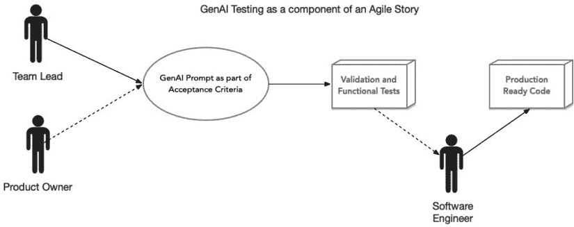
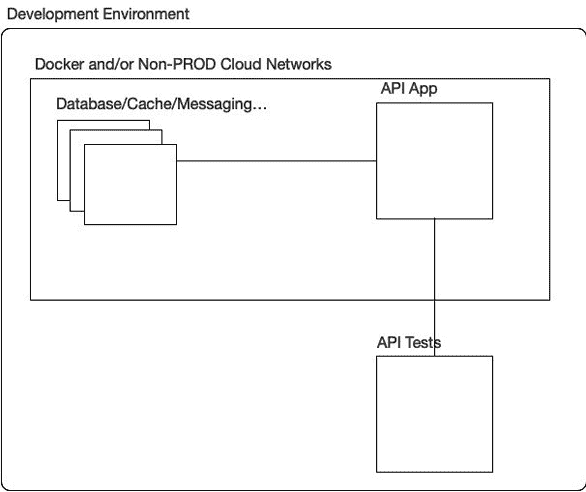

# 第八章：适用于健壮 API 的测试策略

在研究和撰写本章时，我们心中有一个完全不同的愿景。最初的计划是写一篇关于测试 API 的传统文章，这是一篇结构化、系统性的对既定实践的探索。重点是那些多年来一直是**API 测试**支柱的工具和技术，如 Postman、Bruno 和各种模拟框架。这些工具在帮助工程师确保 API 可靠性方面至关重要，并且仍然被广泛使用，尤其是在具有遗留系统的项目中。

然而，随着我们对这个话题的思考越来越多，我们越来越清楚地意识到，软件测试的格局已经发生了显著的变化。**生成式 AI**和**大型语言模型**（**LLMs**）——如 ChatGPT、Gemini 和类似工具——的出现，从根本上改变了我们对待软件开发（包括测试）的方式。曾经是缓慢且经常重复的过程，现在已经演变成一个动态的、AI 增强的工作流程。生成式 AI 不仅使编写测试更快，而且使整个过程更加引人入胜、高效和有效。

这种转变不仅仅关乎便利性。将生成式 AI 集成到 API 测试中，对软件开发生命周期中所有相关人员都有深远的好处。工程师现在可以专注于更高层次的解决问题，而不是被繁琐的测试创建所困扰。产品经理和所有者对 API 的质量更有信心，因为他们知道测试已经变得更加全面和适应性。结果是更有意义的，确保 API 满足现实世界的需求，同时保持最高的质量标准。

因此，本章并非最初计划要写的。我们已经完全转变了焦点，以反映这一新现实。在这里，我们将探讨生成式 AI 如何彻底改变我们编写 API 测试的方式，提供见解和技术，帮助您利用这一颠覆性技术。通过拥抱这些进步，我们可以创建更好的 API，促进协作，并交付超出预期的软件。

在本章中，我们将涵盖以下主题：

+   测试类型

+   测试格式和工具

+   测试的提示工程

+   准备开发环境

+   运行和演进代码

# 技术要求

专注于这些新的集成和回归测试想法的优势之一在于工具和安装。如果你能在本地机器上运行 JavaJUnit 测试，你已经拥有了运行测试所需的一切。

我们还将利用 Docker 在本地部署我们的应用程序和依赖项。

你还需要访问一个 LLM。任何免费可用的 LLM 都应该工作得很好（ChatGPT、Gemini、Claude 等）。

# 测试类型

通过几分钟的在线搜索，人们可以识别出行业内经常引用的 19 种不同类型的测试，我相信还有更多：

+   **功能测试**：通过检查其行为是否符合特定要求来验证 API 按预期工作

+   **集成测试**：确保 API 与其他软件组件、系统或 API 正确交互

+   **单元测试**：在隔离状态下测试 API 的各个单元或组件

+   **性能测试**：评估 API 在不同条件下的响应性、可扩展性和稳定性

+   **负载测试**：检查 API 如何处理预期的用户流量

+   **压力测试**：将 API 推向极限以找到破坏点

+   **峰值测试**：评估 API 对突然流量激增的反应

+   ** soak 测试**：在持续负载下监控 API 的长时间性能

+   **安全测试**：确保 API 免受漏洞和未经授权的访问

+   **验证测试**：验证 API 作为一个整体满足预期的系统和企业需求

+   **可用性测试**：确保 API 易于开发者理解和使用

+   **回归测试**：确保 API 的新更改或更新不会破坏现有功能

+   **合规性测试**：验证 API 符合特定的法律、法规或行业标准

+   **探索性测试**：通过与非脚本化的 API 交互来发现意外问题

+   **互操作性测试**：验证 API 与不同平台、语言和环境正确工作

+   **模糊测试**：通过向 API 发送随机、格式错误或意外的数据来识别漏洞

+   **端到端测试**：验证涉及 API 的整个工作流程或用户场景

+   **数据测试**：确保 API 处理或存储的数据的完整性和正确性

+   **模拟和沙箱测试**：在隔离状态下测试 API 功能或模拟不影响实时系统的环境

显然，对所有这些测试类型的全面讨论需要一本书或更多。因此，在本章中，我们将重点关注几种特定的测试类型：功能测试、回归测试和验证测试。

为什么选择这些特定的测试类型？正如之前所述，主要目标是帮助软件工程师创建更好的 API。在各种类型的测试中，功能测试、回归测试和验证测试在实现这一目标方面提供了最大的价值。它们的主要好处是它们在做出更改时提供的信心。软件工程师面临的最大挑战之一是修改代码可能带来的不可预测的后果。为了解决一个问题而需要的更改可能会无意中破坏其他东西。这个问题既普遍又令人瘫痪。我们如何确保我们的更改不会破坏现有的功能？通过优先考虑功能测试和回归测试，我们可以直接应对这一担忧，确保 API 继续满足其要求，同时保护不受新更改引入的不预期的后果。这正是始于 2000 年代初的**测试驱动开发**（**TDD**）方法的核心。

然而，创建和维护全面的测试集是一个资源密集型的过程，无论是从时间还是成本上讲。编写有效的测试需要深入理解系统、周密的规划和细致的实施。一旦编写完成，这些测试必须定期更新和调整，以反映系统中的变化，这增加了持续维护的工作量。这种程度的投资可能对组织来说很难证明其合理性，尤其是在快节奏的环境中，那里通常有严格的截止日期和预算限制。因此，许多项目历史上都降低了测试的优先级，这往往阻碍了开发团队投入所需的时间和资源来构建健壮的测试套件。这种短视的方法可能在短期内节省了精力，但往往会导致后期出现缺陷时成本更高，影响系统的可靠性和客户满意度。坦白说——编写测试可能很无聊，这在业界是许多人的共同感受。

然后，在 2022 年 11 月，生成式 AI 的引入彻底改变了软件测试的创建。生成式 AI 在编写测试方面已成为一个难以置信的宝贵资产。虽然关于其对开发实际业务逻辑的影响的争论仍在进行中——这是一个留待以后讨论的话题——但对于测试目的而言，它是一个非凡的工具。我们将广泛利用生成式 AI 来编写我们的测试并协助其开发。这一创新不仅增强了功能测试和回归测试对软件工程师的价值，而且使这些测试的编写变得更加容易和便宜。

# 测试格式和工具

当涉及到测试 API 时，我们有各种工具和格式可供选择，每个都满足不同的需求和专业知识水平。例如，Postman 和 Bruno 等工具提供了用户友好的界面，用于构建、管理和运行 API 测试。这些工具特别适用于需要视觉表示和非技术协作的环境。然而，当我们关注于自动化、可扩展和管道就绪的测试时，JUnit 等直接集成到开发生态系统的工具提供了显著的优势。

例如，Postman 等工具允许用户以最少的编码设计 API 测试，使它们对更广泛的受众可访问。这些工具通常包括共享测试集合、生成测试文档和提供实时可视化结果等功能。尽管这些功能强大，但它们在集成到复杂的 CI/CD 管道时存在不足。从 Postman 或 Bruno 导出和运行测试通常需要额外的工具或手动步骤，并且它们缺乏与代码测试框架提供的源代码控制系统（如 Git）的无缝兼容性。

相比之下，JUnit 是一个广泛使用的 Java 测试框架，它采用代码优先的方法来测试 API。通过使用 JUnit 直接在 Java 中编写 API 测试，开发者可以确保他们的测试被视为源代码的一部分。这种方法带来了几个优点：

+   **集成到部署管道中**：JUnit 测试与 CI/CD 工具（如 Jenkins、GitHub Actions 和 GitLab CI）具有内在的兼容性。这使得 API 测试可以在构建或部署期间自动运行，确保没有经过彻底测试的更改被发布。

+   **利用源代码基础设施**：由于 JUnit 测试是用纯代码编写的，因此它们受益于与应用程序代码本身相同的工具和工作流程——版本控制、同行评审、静态分析等等。这种一致性降低了复杂性，并确保测试始终与应用程序保持同步。

+   **可扩展性和可维护性**：基于代码的测试更容易维护，因为它们随着应用程序的演变而演变。重构工具、IDE 功能和代码检查器帮助开发者快速适应 API 的变化，最大限度地减少过时或损坏测试的风险。

+   **可重用性和定制性**：JUnit 允许开发者编写可重用的测试辅助工具和实用程序，为复杂测试场景提供更大的灵活性。它还支持诸如参数化测试、模拟环境和依赖注入等高级功能。

此外，JUnit 能够直接调用真实 API——无论是本地部署还是在测试环境中——确保测试模仿真实世界的使用。这有助于捕捉到在抽象环境（如 Postman 或 Bruno）中可能被忽略的问题，例如不正确的请求格式、意外的响应或性能瓶颈。

虽然 Postman 和 Bruno 适用于快速的单次测试或与非开发者协作，但对于旨在实现稳健、自动化和管道集成测试的团队来说，JUnit（以及类似的代码优先工具）是更优的选择。通过将 API 测试视为代码库中的第一类公民，开发者可以最大化效率、可扩展性和对 API 的信心。

充分利用自动化测试的优势至关重要，然而人工智能正在开始完全重新定义测试，并出现了一种新的测试方法。

软件开发实践的演变始终围绕着提高效率、质量和协作。最近的一项进步是将生成式人工智能集成到敏捷软件开发中，特别是在 SCRUM 框架内（见 [`www.scrum.org/resources/what-scrum-module`](https://www.scrum.org/resources/what-scrum-module)）。一些团队已经在尝试一种新的实践，即 AI 驱动测试的提示成为开发过程的一个组成部分，从而改变团队定义、实施和验证新功能的方式。

在这个更新的工作流程中，技术负责人与产品负责人合作，在塑造开发和测试生命周期中扮演关键角色。当定义一个新的故事，引入 API 的功能或增强时，技术负责人会为生成式人工智能工具制定详细的提示。这些提示作为测试故事验收标准的蓝图。通过利用技术负责人和产品负责人的领域专业知识，这些提示不仅封装了技术要求，还包括了业务背景和功能的预期结果。



图 8.1 – 将人工智能驱动的提示集成到敏捷 SCRUM 工作流程中

例如，如果正在添加一个新的 API 端点以返回客户的交易历史，提示可能指定确切的输入参数、预期的 JSON 响应结构以及测试边缘情况，例如处理无效输入或空数据集。这些提示不仅仅是指令——它们是连接技术和业务视角的共享工件，确保了对齐和清晰。

将生成式人工智能集成到敏捷工作流程中提供了几个显著的优势：

+   **一致性**：标准化的提示确保了在故事之间测试方法的一致性，减少了可变性并提高了可靠性

+   **效率**：通过自动化测试用例的生成，开发者可以专注于编写功能本身的代码，减少重复性任务，并为创新腾出时间

+   **协作**：技术负责人和产品负责人共同创建提示，促进了技术团队和业务团队之间更好的沟通和对齐

+   **质量保证**：提示鼓励团队从一开始就批判性地思考边缘情况、错误处理和预期结果，从而减少后续的缺陷和返工。

## 将提示存储在代码库中

为了巩固这些提示的重要性，它们被存储在项目的 Git 仓库中，与源代码一起。这种集成将提示提升到开发生命周期中的第一公民地位，将它们与代码本身一样严格对待。将提示存储在 Git 中提供了几个关键好处：

+   **版本控制**：提示会随着功能的成熟或需求的变化而演变。将它们存储在 Git 中确保了修改的完整历史记录，使团队能够随着时间的推移追踪变化。

+   **协作**：开发者在代码审查过程中可以审查和细化提示，确保在实施开始之前它们的准确性和相关性。

+   **可追溯性**：将提示与特定的故事、提交和分支链接，创建了一个透明且可审计的过程，将测试直接与开发工作联系起来。

+   **可重用性**：随着时间的推移，类似功能或场景的提示可以被重新利用，减少冗余并加速未来的开发周期。

## AI 生成的代码作为验收标准

一旦提示被最终确定并存储，它们就成为故事验收标准的一个组成部分。指定的软件工程师使用提示通过生成式 AI 工具生成测试用例或其他相关代码。这些生成的代码作为验证新特性的基准。关键要求是生成的代码必须成功通过——必须是*绿色*——故事才能被标记为完成。

这种方法为 SCRUM 中“完成”的定义引入了新的严谨性层次。它确保测试不是事后考虑的事情，而是一个与特性开发并行发展的过程。此外，通过 AI 自动化测试过程的大部分，团队可以更快地交付高质量的软件，减少手动测试瓶颈。

将 AI 驱动的测试集成到敏捷实践中不仅需要工具，还需要文化转变。

## 采用新的敏捷心态

这种实践代表了敏捷团队心态的转变。定义提示的行为将测试考虑提前到开发过程的早期，与 TDD 的原则相一致。它强调了测试不仅作为验证步骤的重要性，而且作为一个协作、迭代的流程，可以增强软件的整体质量。

通过将 AI 驱动的测试提示嵌入到敏捷工作流程中，团队不仅拥抱了生成式 AI 的力量，还将他们的开发实践提升到了新的精度和效率水平。这种方法完美地符合敏捷的目标：更快地交付价值、有效地适应变化，并在整个开发生命周期中保持高质量标准。

## API 测试环境的结构

API 测试环境的目标是在本地复制应用程序的所有关键组件，以便对代码进行全面和现实的测试。以下图展示了此类环境的典型设置，强调了一个适合开发和测试的自包含系统。



图 8.2 – 使用 Docker 和云网络构建的本地 API 测试环境的典型结构

在此图中，**API App**代表你正在测试的主要应用程序。此应用程序直接连接到关键的后端组件，如数据库、缓存服务或消息队列，所有这些都在容器化（Docker）或基于云的非生产网络环境中部署。**API Tests**组件直接与**API App**交互，模拟真实世界场景，确保 API 功能的全面覆盖和验证。

这里的“本地”一词是灵活的：它可以指一个软件工程师的机器，通常使用 Docker 容器，或者任何为开发目的提供的非生产云环境。确保每个团队成员都能访问这种标准化的、隔离的环境至关重要，这允许在不同工作站之间进行一致和可重复的测试，并减少测试结果的变化性。

创建此本地或开发环境需要前期投入。然而，在开发生命周期早期进行这种投资可以显著提高效率，降低集成问题的风险，并加速整体开发。

# “提示”LLMs

**提示工程**是设计和完善提供给生成式 AI 模型的提示，以产生精确、准确和相关的输出的实践。它涉及仔细措辞和迭代调整，以有效地实现期望的响应。现在让我们看看创建有效的测试生成提示所需的一些机制。

如前所述，使用生成式 AI 进行软件测试是这项技术的完美应用。具体来说，测试在知识产权和所有权方面的敏感性较低。测试主要是验证工具，确保你的主要代码按预期运行。由于测试的重点是功能、边缘情况和覆盖率，生成式 AI 可以快速生成各种测试用例，节省开发者的时间和精力。此外，测试通常是重复性和细节导向的——这是 AI 擅长的任务。在这里使用生成式 AI 可以让开发者专注于工作中更具创造性和复杂性的方面，而 AI 则负责处理繁琐的工作。这意味着更高的生产力、更快的迭代和更全面的测试覆盖率，同时手动工作量最小化。

相比之下，当使用生成式 AI 编写主要的生产代码时，情况变得稍微复杂一些。一个主要的问题是生成代码的所有权。根据 AI 服务的条款，你使用的代码可能仍然部分归 AI 提供商所有或受其影响。这可能会在知识产权是关键资产的行业中产生法律或合规问题。此外，还有担心你的代码——或者从它中提取的模式——可能被用来训练未来的 AI 模型。这可能会无意中将专有算法、业务逻辑或敏感方法暴露给外部实体。虽然这可能不是测试（通常更通用且不太机密）的主要问题，但它对生产代码来说可能是一个重大风险，因为组织的知识产权和安全受到威胁。在撰写本文时，已有几个法律判决确立，AI 生成的内容不能获得版权*[3][4]*。现在，我们将为我们的测试创建实际的提示。

## 测试 Products API

我们在这本书中使用的 Products API 是这种新测试策略的一个非常好的用例。让我们看看为该 API 生成测试的提示。

让我们先创建一个测试来验证使用 `PUT` 方法创建新产品：

```java
Assuming the role of a Senior Software Engineer in charge of implementing a set of APIs to support the Products resource
Generate a JUnit 5 test case for the "Create or Update Product" API endpoint in a Spring Boot application.
The endpoint uses the HTTP PUT method at the path /api/products/{productId}, where {productId} is a path variable validated with the format AA99999.
The request body is a ProductInput object, and the response is a ProductOutput object.
The test should cover two scenarios:
1 - Creating a New Product: When a new productId is provided, the API should create a new product and return HTTP status 201 Created. Verify that the response body contains the expected ProductOutput.
2 - Updating an Existing Product: When an existing productId is provided, the API should update the product and return HTTP status 200 OK. Verify that the response body contains the updated ProductOutput.
Assume a running instance of this API running on http:8080
Include at least assertions for:
- HTTP status codes (201 Created and 200 OK)
- Response headers (if applicable)
- Response body content
- Validation that the productId follows the format AA99999
Structure the test methods clearly, using descriptive names for each scenario.
Product is defined by the following classes - assume the expected Get and Set methods are present.
public class Product {
  private String name;
  private String sku;
  private String description;
  private BigDecimal price;
  public Product() {
    super();
  }
  public Product(String name, String sku, String description,
                 BigDecimal price) {
    this.name = name;
    this.sku = sku;
    this.description = description;
    this.price = price;
  }
}
public record ProductDescriptionInput(@NotBlank
                                      @Size(min = 10, max = 255)
                                      String description) {
}
public record ProductInput(
        @NotBlank
        @Size(min = 3, max = 255)
        @JsonProperty("name")
        String name,
        @NotBlank
        @Size(min = 10, max = 255)
        @JsonProperty("description")
        String description,
        @NotNull
        @Positive
        @JsonProperty("price")
        BigDecimal price) {
    public Product toProduct(String productId) {
        return new Product(name(),
                productId,
                description(),
                price());
    }
}
public record ProductOutput(String name, String sku, String description, 
                            BigDecimal price) {
} 
```

让我们更详细地看看这个提示的每个部分：

首先，我们定义 LLM 的视角。这有助于确定 LLM 应扮演的角色，并且它确实会影响答案。有时，当你告诉 LLM 以资深或初级专业人士的身份行事时，这种影响在生成的代码中是明显的：

```java
"Assuming the role of a Senior Software Engineer in charge of implementing a set of APIs to support the Products resource" 
```

然后，给出一个清晰的请求：

```java
"Generate a JUnit 5 test case for the "Create or Update Product" API endpoint in a Spring Boot application."
"The test should cover two scenarios:… " 
```

LLM 的输出受到你想要的结果的强烈影响。

接下来，尽可能清晰地解释 API 的行为。这很重要，因为如果底层行为不清楚，LLM 就会尝试填补空白，有时会基于无效的假设。你添加的细节越多，创建的测试用例就越好：

```java
"The endpoint uses the HTTP PUT method at the path /api/products/{productId}, …." 
```

这些细节的一部分是定义被测试数据的代码。要么展示使用的数据结构，要么展示预期的 HTTP 响应，但必须以某种形式提供明确的定义。

最后，添加任何我们希望测试验证的具体断言：

```java
"Include at least assertions for:
- HTTP status codes (201 Created and 200 OK)
- Response headers (if applicable) …" 
```

这个提示的结果是以下代码和 `pom.xml` 依赖元素：

```java
<dependency>
    <groupId>org.springframework.boot</groupId>
    <artifactId>spring-boot-starter-test</artifactId>
    <scope>test</scope>
</dependency>
<dependency>
    <groupId>io.projectreactor</groupId>
    <artifactId>reactor-test</artifactId>
    <scope>test</scope>
</dependency>
import org.junit.jupiter.api.Test;
import org.springframework.beans.factory.annotation.Autowired;
import org.springframework.boot.test.context.SpringBootTest;
import org.springframework.http.HttpStatus;
import org.springframework.test.web.reactive.server.WebTestClient;
import java.math.BigDecimal;
@SpringBootTest(webEnvironment = SpringBootTest.WebEnvironment.RANDOM_PORT)
public class ProductsApiControllerTest {
    @Autowired
    private WebTestClient webTestClient;
    @Test
    void shouldCreateNewProduct_whenValidInputProvided() {
        // Arrange
        String productId = "AA12345";
        ProductInput productInput = new ProductInput(
                "Test Product",
                "A detailed description for the product",
                BigDecimal.valueOf(99.99)
        );
        // Act & Assert
        webTestClient.put()
                .uri("/api/products/{productId}", productId)
                .bodyValue(productInput)
                .exchange()
                .expectStatus().isCreated()
                .expectHeader().exists("Location") // Optional: Check if Location header exists
                .expectBody(ProductOutput.class)
                .value(response -> {
                    // Assert response body content
                    assert response.name().equals(productInput.name());
                    assert response.sku().equals(productId);
                    assert response.description().equals(
                      productInput.description());
                    assert response.price().compareTo(
                      productInput.price()) == 0;
                });
    }
    @Test
    void shouldUpdateExistingProduct_whenValidInputProvided() {
        // Arrange
        String productId = "AA67890"; // Assume this product already exists in the system
        ProductInput productInput = new ProductInput(
                "Updated Product",
                "An updated description for the product",
                BigDecimal.valueOf(149.99)
        );
        // Act & Assert
        webTestClient.put()
                .uri("/api/products/{productId}", productId)
                .bodyValue(productInput)
                .exchange()
                .expectStatus().isOk()
                .expectBody(ProductOutput.class)
                .value(response -> {
                    // Assert response body content
                    assert response.name().equals(productInput.name());
                    assert response.sku().equals(productId);
                    assert response.description().equals(
                      productInput.description());
                    assert response.price().compareTo(
                      productInput.price()) == 0;
                });
    }
    @Test
    void shouldRejectInvalidProductIdFormat() {
        // Arrange
        String invalidProductId = "INVALID123";
        ProductInput productInput = new ProductInput(
                "Invalid Product",
                "An invalid description",
                BigDecimal.valueOf(49.99)
        );
        // Act & Assert
        webTestClient.put()
                .uri("/api/products/{productId}", invalidProductId)
                .bodyValue(productInput)
                .exchange()
                .expectStatus().isBadRequest(); // Assuming the API enforces validation on productId
    }
} 
```

这段代码本身并不复杂或难以编写，但它很耗时，大多数软件工程师都不太喜欢编写它。此外，使用 LLM 创建测试为这个过程增加了许多灵活性。例如，如果你想以不同的语言创建这个测试——例如，在 Go 中——我们只需要更改预期的结果来获得一个新版本。

```java
"Generate a Go test case for the "Create or Update Product" API endpoint in a Spring Boot application." 
```

尝试玩转代码生成选项。

在某些项目中，甚至有要求自动测试使用与原始代码不同的语言编写。可能没有真正的技术原因要求这样做，因为 HTTP 客户端与另一个完全一样，但它为项目中的非技术人员提供了额外的心理安慰，即有这一额外的隔离层。

## 一个更复杂的 API 进行测试

在之前的练习中，我们查看了一个 API 的测试，我们对其源代码有完全的访问权限，并且是从头开始开发该 API 的。此外，示例 API 故意很简单。但是，许多软件工程师面临另一个常见的情况：一个已经投入生产的 API，可用的自动化测试不多，更复杂，并返回复杂的响应。让我们看看这样一个场景。

对于本节，我们将使用 HAPI FHIR API 并为其编写一些测试。

HAPI FHIR 是 HL7 FHIR 标准在医疗保健互操作性方面的完整 Java 实现。我们选择这个例子是因为 API 很复杂，有可用的公共测试实现，并且在医疗保健市场中得到了广泛的应用。这个实现被全球许多组织使用，包括大型医院综合体、医疗保健组织和政府卫生机构。但从测试的角度来看，对我们来说有趣的是这些 API 的复杂性。在搜索的响应中收到数千行 JSON 并不罕见，这使我们能够创建更细致的提示和相应的测试。


要了解更多关于 HAPI FHIR 和 HL7 FHIR 的信息，请参阅以下链接：

[`hapifhir.io/`](https://hapifhir.io/)

[`hl7.org/fhir/`](https://hl7.org/fhir/)

由于医疗保健需求通常对每个组织都是独特的，并且依赖于许多地方性法规，因此任何 HAPI FHIR 实现都需要高度定制。在特定实现中找到数千行自定义代码并不罕见。在定制如此复杂的 API 时，有一套强大的测试至关重要。你不想破坏任何 HAPI FHIR 合约。

此外，HAPI FHIR 作为我们的测试示例的一个巨大优势是公共测试服务器的可用性：[`hapi.fhir.org/baseR4`](https://hapi.fhir.org/baseR4)

在阅读本节之前，不需要事先了解 HAPI FHIR API。我们只关注查看 API 的行为，并准备测试以验证这种行为不会改变。以下是我们将使用的几个 HAPI FHIR 概念：

+   **耐心**：HAPI FHIR 是一个医疗保健系统；因此，PATIENT 是其中的一个一等元素。我们将编写一些测试来验证搜索患者时返回的元素是我们想要的。

+   **资源类型 – BUNDLE**：在 HAPI FHIR 中，所有搜索结果都是捆绑包。这只是用来定义一组数据的名称，但我们将验证此行为作为我们测试的一部分。

考虑到这一点，让我们假设您是一家大型医院 HAPI FHIR 支持团队的软件工程师，您刚刚接到了定制 HAPI FHIR API 的任务，以向`Patient`记录添加一个新元素。这个新元素仅用于这家医院的系统。假设没有针对 Patient API 的测试用例。您能做什么？

好吧，您可以从查看源代码开始，尝试找到所有相关的类，但这是一项耗时的工作，会延迟测试的生成。可能需要更实际的解决方案。

因此，首先查看 API 响应并准备测试，以确保您的更改不会破坏当前合约。

这里是一个返回系统中所有患者的`GET`请求，一次一个。所有数据都是合成的，与任何真实个人无关：

```java
https://hapi.fhir.org/baseR4/Patient?_format=json&_count=1 
```

让我们详细检查我们收到的响应（您在运行此示例时将不会得到相同的数据，但格式和结构将是相同的）：

```java
{  "resourceType": "Bundle",
  "id": "241fc9a1-3d08-4c1c-95a9-6ac315d178a8",
  "meta": {
    "lastUpdated": "2024-11-18T13:05:22.536+00:00"
  },
  "type": "searchset",
  "link": [
    {
      "relation": "self",
      "url": "https://hapi.fhir.org/baseR4/Patient?_count=1&_format=json"
    },
    {
      "relation": "next",
      "url": "https://hapi.fhir.org/baseR4?_getpages=241fc9a1-3d08-4c1c-95a9-6ac315d178a8&_getpagesoffset=1&_count=1&_format=json&_pretty=true&_bundletype=searchset"
    }
  ],
  "entry": [
    {
      "fullUrl": "https://hapi.fhir.org/baseR4/Patient/596484",
      "resource": {
        "resourceType": "Patient",
        "id": "596484",
        "meta": {
          "versionId": "1",
          "lastUpdated": "2020-02-01T17:42:02.000+00:00",
          "source": "#McyYCIRVGrcmfKSf"
        },
        "text": {
          "status": "generated",
          "div": "<div xmlns…div>"
        },
        "name": [
          {
            "family": "DelGrosso",
            "given": [
              "Joe"
            ]
          }
        ],
        "telecom": [
          {
            "system": "phone",
            "value": "1(555)123-4567",
            "use": "home"
          }
        ],
        "gender": "male",
        "birthDate": "1985-09-11",
        "address": [
          {
            "use": "home",
            "line": [
              "155 Quick Rd"
            ],
            "city": "Fun City",
            "state": "NY",
            "postalCode": "10101",
            "country": "US"
          }
        ]
      },
      "search": {
        "mode": "match"
      }
    }
  ]
} 
```

这个结果已经超过 70 行，是我们 API 分析和设计测试的好起点。

让我们看看结果。我们可以看到`GET`函数的结果有一个`resourceType`，在这种情况下是`Bundle`。`Type`是`searchset`。

有一个链接数组（“链接”）和一个条目数组（“条目”），包含实际患者的数据。

好的，这是一个开始。

## 准备测试提示

记住，您的目标是修改代码，而不破坏当前状态，因此首先明确您想通过测试验证的内容——例如，“测试所有`GET`搜索将返回有效的分页 JSON。”现在，让我们编写一个提示来生成我们的第一个测试。以下是 ChatGPT 4 的结果：

```java
Assuming the role of a Senior Software Engineer working on a HAPI FHIR customization project.
Prepare a test case that will make a call to the following URL: https://hapi.fhir.org/baseR4/Patient?_format=json&_count=1
Make sure to validate that the response is in a JSON format and contains:
- a single 'resourceType' of 'Bundle'
- a single 'type' of 'searchset'
- a single 'id' in the format of an UUID
Use JAVA Junit 5
Here is a sample result set. The actual values of each element will vary from each call.
{
  "resourceType": "Bundle",
  "id": "241fc9a1-3d08-4c1c-95a9-6ac315d178a8",
  "meta": {
    "lastUpdated": "2024-11-18T13:05:22.536+00:00"
…. 
```

将整个 JSON 示例与提示粘贴。

结果是以下测试和`pom.xml`更改：

```java
import static org.junit.jupiter.api.Assertions.*;
import org.junit.jupiter.api.Test;
import org.springframework.http.ResponseEntity;
import org.springframework.web.client.RestTemplate;
import com.fasterxml.jackson.databind.JsonNode;
import com.fasterxml.jackson.databind.ObjectMapper;
import java.util.UUID;
class HapiFhirTest {
    private static final String HAPI_FHIR_URL =
      "https://hapi.fhir.org/baseR4/Patient?_format=json&_count=1";
    @Test
    void testHapiFhirResponse() {
        // Set up RestTemplate for HTTP call
        RestTemplate restTemplate = new RestTemplate();
        // Make the HTTP GET call
        ResponseEntity<String> response = restTemplate.getForEntity(
          HAPI_FHIR_URL, String.class);
        // Assert the response is not null and has a 200 status code
        assertNotNull(response);
        assertEquals(200, response.getStatusCodeValue());
        // Assert the response body is not null
        String responseBody = response.getBody();
        assertNotNull(responseBody);
        try {
            // Parse the response body as JSON
            ObjectMapper objectMapper = new ObjectMapper();
            JsonNode jsonNode = objectMapper.readTree(responseBody);
            // Assert 'resourceType' is present and equals 'Bundle'
            assertTrue(jsonNode.has("resourceType"));
            assertEquals("Bundle", jsonNode.get("resourceType").asText());
            // Assert 'type' is present and equals 'searchset'
            assertTrue(jsonNode.has("type"));
            assertEquals("searchset", jsonNode.get("type").asText());
            // Assert 'id' is present and is a valid UUID
            assertTrue(jsonNode.has("id"));
            String id = jsonNode.get("id").asText();
            assertTrue(isValidUUID(id));
        } catch (Exception e) {
            fail("Exception occurred while processing the response: " +
                  e.getMessage());
        }
    }
    /**
     * Utility method to validate if a string is a valid UUID.
     *
     * @param uuid the string to validate
     * @return true if valid UUID, false otherwise
     */
    private boolean isValidUUID(String uuid) {
        try {
            UUID.fromString(uuid);
            return true;
        } catch (IllegalArgumentException e) {
            return false;
        }
    }
}
With the accompanying dependencies in pom.xml
<dependency>
    <groupId>org.springframework</groupId>
    <artifactId>spring-web</artifactId>
    <version>5.3.30</version>
</dependency>
<dependency>
    <groupId>com.fasterxml.jackson.core</groupId>
    <artifactId>jackson-databind</artifactId>
    <version>2.15.2</version>
</dependency>
<dependency>
    <groupId>org.junit.jupiter</groupId>
    <artifactId>junit-jupiter</artifactId>
    <version>5.10.0</version>
</dependency> 
```

此代码立即运行，无需任何修改。这与前一代 LLM 的情况不同。如果您使用的是较旧的模型，例如 ChatGPT 3.5，例如，您可能需要手动调整代码。

整个测试由 LLM 在不到一分钟内完成，实际上快速编写和查看结果非常有趣——与手动编写测试完全不同的体验。当然，测试可以改进。例如，它可以改为从列表或属性文件中获取要测试的 URL，以增加灵活性，但代码的核心是现成的，可以立即使用。

现在，让我们继续进行更复杂的测试类型，看看我们的验证能走多远。

## 验证更复杂的行为

查看 API 的响应，我们可以看到“链接”数组在第一页上有两个条目：“`self`”和“`next`”。

```java
 "link": [
    {
      "relation": "self",
      "url": "https://hapi.fhir.org/baseR4/Patient?_count=1&_format=json"
    },
    {
      "relation": "next",
      "url": "https://hapi.fhir.org/..."
    }
  ], 
```

一个好的测试是验证响应始终包含`self`链接。让我们扩展提示以包括这一点。

这里是新的提示：

```java
Assuming the role of a Senior Software Engineer working on a HAPI FHIR customization project.
Prepare a test case that will make a call to the following URL: https://hapi.fhir.org/baseR4/Patient?_format=json&_count=1
Make sure to validate that the response is in a JSON format and contains:
- a single 'resourceType' of 'Bundle'
- a single 'type' of 'searchset'
- a single 'id' in the format of an UUID
Validate that array "link" is present and that there is one element with "relation = self"
Use JAVA Junit 5
… 
```

这将为我们的测试添加以下代码：

```java
// Validate link array
assertTrue(jsonNode.has("link"), "Response does not contain 'link'");
JsonNode links = jsonNode.get("link");
assertTrue(links.isArray(), "link is not an array");
boolean hasSelfLink = false;
for (JsonNode link : links) {
    if (link.has("relation") && "self".equals(
        link.get("relation").asText())) {
        hasSelfLink = true;
        break;
    }
}
assertTrue(hasSelfLink, "No link with 'relation' = 'self'"); 
```

再次强调，代码并不复杂，但它已经显示出难度增加的迹象。手动编写这个代码并不难，但需要一些时间和注意力。LLM 可以在 30 秒或更短的时间内完成它。

现在，让我们增加更多的复杂性。这是一个分页练习，所以让我们要求代码跟随几页的`next`链接并验证该页面。然后，验证结果中的每个条目是否唯一，使用`entry`数组中的`fullUrl`作为候选键。

```java
Assuming the role of a Senior Software Engineer working on a HAPI FHIR customization project.
Prepare a test case that will make a call to the following URL: https://hapi.fhir.org/baseR4/Patient?_format=json&_count=1
Make sure to validate that the response is in a JSON format and contains:
- a single 'resourceType' of 'Bundle'
- a single 'type' of 'searchset'
- an single 'id' in the format of an UUID
Validate that array "link" is present and that there is one element with "relation = self"
Now, follow the "next" link for at most 5 pages or until the last page. Validate each page.
In each "entry" there is a "fullUrl" attribute. Threat it as a key and validate that it is present in every "entry".
Also, make sure that the entries are unique and there is no repetition.
Use JAVA Junit 5 
```

结果开始看起来更加复杂和有趣。

```java
public class HapiFhirPaginationTest {
    @Test
    void testHapiFhirPatientPagination() throws Exception {
        String baseUrl =
          "https://hapi.fhir.org/baseR4/Patient?_format=json&_count=1";
        ObjectMapper mapper = new ObjectMapper();
        String nextUrl = baseUrl;
        int pageCount = 0;
        Set<String> uniqueFullUrls = new HashSet<>();
        while (nextUrl != null && pageCount < 5) {
            HttpURLConnection connection = createConnection(nextUrl);
            int responseCode = connection.getResponseCode();
            assertEquals(200, responseCode,
                         "Expected HTTP status code 200");
            InputStream responseStream = connection.getInputStream();
            JsonNode response = mapper.readTree(responseStream);
            validatePage(response, uniqueFullUrls);
            nextUrl = getNextLink(response);
            pageCount++;
            connection.disconnect();
        }
    }
    private HttpURLConnection createConnection(String urlString) throws Exception {
        URL url = new URL(urlString);
        HttpURLConnection connection = (HttpURLConnection)
                                         url.openConnection();
        connection.setRequestMethod("GET");
        connection.setRequestProperty("Accept", "application/json");
        return connection;
    }
    private void validatePage(JsonNode response,
                              Set<String> uniqueFullUrls) {
        // Validate resourceType
        assertTrue(response.has("resourceType"),
                   "Response does not contain 'resourceType'");
        assertEquals("Bundle", response.get("resourceType").asText(), 
                     "resourceType is not 'Bundle'");
        // Validate id is in UUID format
        assertTrue(response.has("id"), "Response does not contain 'id'");
        String id = response.get("id").asText();
        assertTrue(isValidUUID(id), "id is not a valid UUID");
        // Validate type
        assertTrue(response.has("type"),
                   "Response does not contain 'type'");
        assertEquals("searchset", response.get("type").asText(),
                     "type is not 'searchset'");
        // Validate link array
        assertTrue(response.has("link"),
                   "Response does not contain 'link'");
        JsonNode links = response.get("link");
        assertTrue(links.isArray(), "link is not an array");
        boolean hasSelfLink = false;
        for (JsonNode link : links) {
            if (link.has("relation") && "self".equals(link.get(
                                        "relation").asText())) {
                hasSelfLink = true;
                break;
            }
        }
        assertTrue(hasSelfLink, "No link with 'relation' = 'self'");
        // Validate entries
        if (response.has("entry")) {
            JsonNode entries = response.get("entry");
            for (JsonNode entry : entries) {
                assertTrue(entry.has("fullUrl"),
                           "Entry does not contain 'fullUrl'");
                String fullUrl = entry.get("fullUrl").asText();
                // Ensure fullUrl is unique
                assertTrue(uniqueFullUrls.add(fullUrl),
                           "Duplicate fullUrl detected: " + fullUrl);
            }
        }
    }
    private String getNextLink(JsonNode response) {
        JsonNode links = response.get("link");
        for (JsonNode link : links) {
            if (link.has("relation") && "next".equals(link.get(
                                        "relation").asText())) {
                return link.get("url").asText();
            }
        }
        return null;
    }
    private boolean isValidUUID(String id) {
        try {
            UUID.fromString(id);
            return true;
        } catch (IllegalArgumentException e) {
            return false;
        }
    }
} 
```

测试现在变得更加复杂。看看一些辅助函数是如何创建的（`isValidUUID()`，`createConnection()`）。编写这个测试会花费更长的时间和更高的维护成本。但是，使用 LLM，整个测试只需几分钟就可以运行。

我希望您现在已经看到了这个模式。随着 API 变得更加复杂，测试也在不断发展。LLM 提示本身现在存储在 Git 仓库中，并且是代码库的组成部分，到了可以将其视为软件文档的一部分的程度。

# 摘要

生成式 AI 的引入具有重塑软件开发领域，特别是在测试领域的潜力。通过自动化测试创建、简化复杂流程和增强适应性，生成式 AI 有望将测试转变为开发生命周期中更高效、更易于访问和成本效益更高的部分。

通过本章讨论的策略和示例，我们希望您已经获得了探索和扩展 API 测试的技能和灵感。

测试是在我们 API 的开发和维护过程中验证行为的一种工具，但对于一个真正健壮的服务，我们需要在生产中监控这些行为。这就是我们在下一章将要探讨的内容。

# 进一步阅读

+   *测试驱动开发* : [`en.wikipedia.org/wiki/Test-driven_development`](https://en.wikipedia.org/wiki/Test-driven_development )

+   *提示工程* : [`en.wikipedia.org/wiki/Prompt_engineering`](https://en.wikipedia.org/wiki/Prompt_engineering )

+   *法律裁决：AI 生成艺术与版权* : [`www.reuters.com/legal/ai-generated-art-cannot-receive-copyrights-us-court-says-2023-08-21/`](https://www.reuters.com/legal/ai-generated-art-cannot-receive-copyrights-us-court-says-2023-08-21/ )

+   *美国版权局对 AI 提示的看法* : [`www.theverge.com/news/602096/copyright-office-says-ai-prompting-doesnt-deserve-copyright-protection`](https://www.theverge.com/news/602096/copyright-office-says-ai-prompting-doesnt-deserve-copyright-protection )

+   *HAPI FHIR：HL7 FHIR 的开源实现* : [`hapifhir.io/`](https://hapifhir.io/ )

+   *HL7 FHIR 官方规范* [`hl7.org/fhir/`](https://hl7.org/fhir/)
