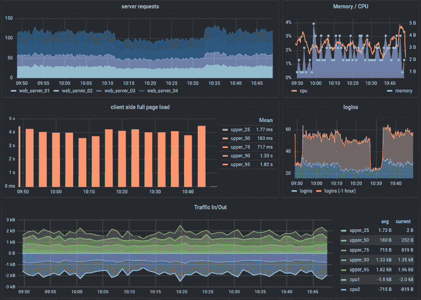
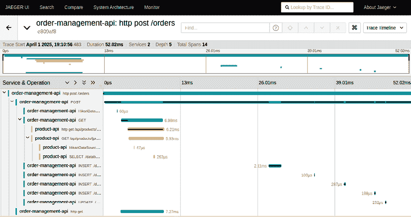
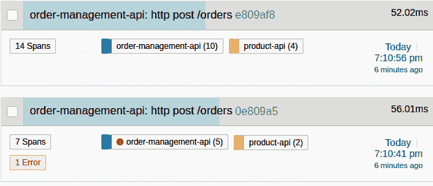

# 第九章：监控和可观察性

**监控**和**可观察性**对于确保 RESTful 服务可靠、高效和安全地运行至关重要。在分布式系统中，请求通常需要通过多个服务和组件，因此实施适当的可观察性实践是至关重要的。没有这些实践，诊断性能瓶颈、识别错误的根本原因以及优化服务行为将变得极其困难。

在本章中，我们将指导你了解实现 RESTful 服务有效可观察性的基本实践和工具。我们将从讨论**日志记录**最佳实践开始，解释结构化日志和关联 ID 如何简化故障排除。然后我们将深入探讨分布式追踪，展示`traceId`、`spanId`和`parentSpanId`等追踪信息如何帮助映射请求在多个服务间流动的生命周期。

我们将介绍**Micrometer 追踪**，这是一个强大的可观察性框架，集成在 Spring Boot 3.x 中，它能够自动对应用程序进行仪器化以捕获追踪数据。此外，我们还将探索 OpenTelemetry，这是一个供应商中立的框架，通过收集和关联日志、指标和追踪来扩展可观察性，以获得分布式系统的整体视图。到本章结束时，你将了解如何有效地实现日志记录和追踪，配置 Spring Boot 应用程序以实现可观察性，并在 Zipkin 和 Jaeger 等工具中可视化你的数据。

本章提供了实际示例、逐步指导和最佳实践，以确保你可以成功监控和调试你的 RESTful 服务。

在本章中，我们将涵盖以下主题：

+   在 REST API 中日志记录的重要性

+   API 故障排除的日志记录最佳实践

+   使用 SLF4J 的日志记录基础

+   实现中央日志过滤器

+   在分布式系统中实现服务追踪

+   使用 Micrometer 实现追踪

+   追踪数据的指标

+   OpenTelemetry 用于监控和可观察性

+   端到端可观察性的最佳实践

# 技术要求

在本章中，我们将增强现有的 API——产品 API 和订单管理 API，以便能够追踪它们之间的请求。为了能够跟随书中的示例代码进行操作，你应该具备以下条件：

+   对 Java 语言和平台有中级了解

+   至少对 Spring Boot 或类似框架有基本了解

+   安装了 Java 21 和 Maven 3.9.0

+   安装了 Docker 27.3.1 或更高版本

你可以在 GitHub 上访问本章的代码：[`github.com/PacktPublishing/Mastering-RESTful-Web-Services-with-Java/tree/main/chapter9`](https://github.com/PacktPublishing/Mastering-RESTful-Web-Services-with-Java/tree/main/chapter9)。

# 在 REST API 中日志记录的重要性

日志是任何系统中可观察性的基础元素。日志基本上是记录应用程序运行期间发生的事件的记录。它们是在任何环境中尝试解决任何问题时信息的第一来源，尤其是在生产环境中。

日志充当系统的记忆，提供有关发生错误或某些过程如何行为的见解。对于 REST API，日志可以显示每个请求的路径，这对于理解失败或缓慢的性能至关重要。

例如，假设您的 API 向用户返回了一个`500` `Internal Server Error`。没有日志，您将无法知道错误的原因。然而，有了日志，您可以看到数据库查询失败是因为服务器连接耗尽，这有助于您解决问题。

在接下来的章节中，我们将介绍一种有效的日志设计，当需要故障排除时，这将显著增强我们的应用程序。

## 常见日志陷阱

尽管日志的重要性不言而喻，但许多开发者在使用日志方面都感到困难。常见的错误包括：

+   **过度记录日志**：记录过多的信息可能会使得找到关键细节变得困难。

+   **记录日志不足**：日志记录不足可能会遗漏故障排除所需的关键数据。

+   **记录敏感信息**：错误地记录诸如用户密码或信用卡号码等信息，这些信息由于安全和合规性考虑（例如，GDPR 或 PCI DSS）绝不应该发生。

在记录足够的信息以进行故障排除和不过度占用系统的不必要数据之间需要找到平衡。

## 有效的日志设计

正确设计日志对于它们的有用性至关重要。每个日志条目都应该包含相关的元数据：

+   **时间戳**：日志条目创建的时间。

+   **日志级别**：日志的严重性（`INFO`，`DEBUG`，`ERROR`）。

+   **服务名称**：生成日志的服务名称。

+   **关联 ID**：一个唯一的 ID，允许您跟踪通过多个服务（下面将详细介绍）的请求。

例如，一个结构良好的 JSON 日志条目可能看起来像这样：

```java
{
  "timestamp": "2024-10-23T10:20:30Z",
  "level": "ERROR",
  "service": "user-service",
  "correlationId": "abc123",
  "message": "Database connection timed out"
} 
```


关联 ID

在微服务中，一个请求可能会通过多个服务。为了跟踪整个请求路径，将关联 ID 附加到每个请求是必不可少的。关联 ID 是一个唯一标识符，它在请求通过系统时保持不变。这允许您关联来自不同服务的日志，以查看单个请求是如何从头到尾处理的。例如，用户请求检索个人资料信息可能通过 API 网关，然后击中身份验证服务，最后查询用户数据库。使用关联 ID，您可以跟踪所有涉及服务中的每个步骤。Spring 使生成和传播关联 ID 变得简单。您可以在请求开始时生成关联 ID，并通过 HTTP 头在服务之间传递它。这将帮助您诊断服务链中出现问题的位置。

接下来，我们将学习最佳日志记录实践，了解不同的日志级别及其结构，以及应该和不应该记录的内容，以避免安全问题。

# API 故障排除的日志最佳实践

有效的日志记录对于故障排除至关重要，尤其是在与分布式系统或云原生架构一起工作时。以下是一些最佳实践，以确保您的日志策略稳健。

## 选择合适的日志级别

应在适当的日志级别写入日志，这表示事件的严重性：

+   `TRACE`：用于非常细粒度的细节，主要用于调试低级操作，如记录循环的内部状态、方法入口/出口点或组件之间的详细交互。由于在此级别生成的日志量巨大，因此在生产环境中应关闭。

+   `DEBUG`：用于帮助调试问题的低级信息，例如 HTTP 请求的详细信息。日志提供详细的信息，有助于开发或调试期间，专注于特定于应用程序的逻辑或操作。此外，由于在此级别生成的日志量巨大，因此应在生产环境中关闭此级别。

+   `INFO`：用于通用应用程序流程信息，例如当服务启动或关闭时。这些日志比`DEBUG`或`TRACE`更简洁，通常在生产环境中启用。

+   `WARN`：表示某些不一定是错误的不寻常情况。例如，服务可能会暂时耗尽资源但恢复。这些日志是对潜在未来问题的警告。例如：

+   `ERROR`：用于出现问题时，如抛出异常或数据库连接中的关键故障。这些日志通常表明系统需要关注或干预。

+   `FATAL`：表示导致应用程序或服务崩溃或变得不可用的关键错误。这些日志非常罕见，表明需要立即关注的严重问题。请注意，此级别并非在所有库（如 SLF4J 或 Logback）中都存在，通常由`ERROR`级别表示；然而，它在 Log4J 和 Log4J2 日志库中存在，本章节不会涉及。

在 REST API 中，由于凭据错误而失败的登录尝试可能会记录在`WARN`级别：

```java
{
  "timestamp": "2024-10-23T11:15:30Z",
  "level": "WARN",
  "service": "auth-service",
  "message": "Failed login attempt for user john.doe@example.com",
  "error": "AuthenticationException"
} 
```

同时，由于数据库故障导致整个服务失败的情况应该记录在`ERROR`级别，如果可用则记录为`FATAL`：

```java
{
  "timestamp": "2024-10-23T11:20:30Z",
  "level": "ERROR",
  "service": "user-service",
  "message": "Failed to connect to database",
  "error": "TimeoutException" } 
```

选择合适的级别可以确保你在故障排除时能够快速过滤掉非关键日志。

## 结构化日志

结构化日志是指以一致、机器可读的格式进行日志记录，例如 JSON。这使得日志可以轻松地被日志工具（如 ELK Stack 或 Splunk）解析和查询，使得过滤、聚合和分析日志变得更加容易。

而不是记录这样的简单消息：

```java
User john.doe@example.com failed to log in 
```

你应该以结构化格式记录事件：

```java
{
  "timestamp": "2024-10-23T12:00:00Z",
  "level": "WARN",
  "service": "auth-service",
  "user": "john.doe@example.com",
  "event": "login-failure",
  "reason": "incorrect-password"
} 
```

现在，你可以轻松地搜索所有登录失败或按`user`字段分组。

# 避免在日志中包含敏感数据

像密码、信用卡号码或个人标识符这样的敏感信息绝不应该被记录。如果这些数据意外地在日志中暴露，可能会导致严重的安全漏洞。

例如，如果登录尝试失败，记录用户名是可以的，但绝不能记录密码。这样的日志消息：

```java
{
  "timestamp": "2024-10-23T12:05:00Z",
  "level": "ERROR",
  "message": "Login failed for user john.doe@example.com with password 'secretpassword'"
} 
```

是危险的。相反，记录类似以下内容：

```java
{
  "timestamp": "2024-10-23T12:05:00Z",
  "level": "ERROR",
  "message": "Login failed for user john.doe@example.com"
} 
```

你可以使用 Jackson 的`@JsonIgnore`或`@JsonProperty(access = Access.WRITE_ONLY)`注解来防止敏感数据被序列化到日志中。

Jackson 是一个广泛使用的 Java 库，用于处理 JSON 数据。它提供了将 Java 对象序列化为 JSON 和将 JSON 反序列化为 Java 对象的功能，使其在数据通常以 JSON 格式交换的 RESTful Web 服务中成为一项关键工具。

在 Spring Boot 应用程序中，Jackson 是默认的 JSON 处理器，通常用于自动转换请求和响应负载，使 API 交互无缝。

它允许开发者使用`@JsonIgnore`、`@JsonProperty`和`@JsonInclude`等注解自定义 JSON 输出，确保只暴露必要的字段，同时排除敏感或不必要的数据。

这在记录请求或响应对象时尤其有用，因为它确保敏感信息（如密码或信用卡详情）不会在日志条目中暴露。

何时使用每个注解？

+   `@JsonIgnore`：当你想防止字段永远包含在序列化输出中，例如响应和日志，以及从请求中反序列化的输入时使用。

+   `@JsonProperty(access = Access.WRITE_ONLY)` 注解：当需要接受字段作为输入但希望将其排除在所有序列化输出之外时使用，这使得它适用于在日志记录或 API 响应中应保持私有的字段（例如密码）。

让我们通过一个示例来演示如何在 RESTful 服务中使用这些注解。

假设你有一个 `User` 类，包含 `username`、`email` 和 `password` 等字段。当记录这个 `User` 对象时，我们希望确保密码字段不包含在序列化输出中。

## 完全排除字段在序列化和反序列化过程中。

`@JsonIgnore` 注解完全排除一个字段在反序列化和序列化过程中，这意味着它将完全不会包含在输入或输出 JSON 中。

当你在字段上使用 `@JsonIgnore` 注解时，Jackson 在序列化（将对象转换为 JSON）和反序列化（将 JSON 转换为对象）过程中都会完全忽略该字段。这意味着如果你用 `@JsonIgnore` 标记了一个字段，Jackson 将不会将其包含在输出 JSON 中，也不会允许它在 JSON 请求体中作为输入。

当你想确保敏感信息（例如密码或令牌）在任何序列化输出中都不会暴露时，这很有用，包括日志。

```java
import com.fasterxml.jackson.annotation.JsonIgnore;
public class User {
         private String username;
    private String email;
         @JsonIgnore  // This will prevent the password from being
                     //serialized or deserialized into JSON
    private String password;
    // Constructors, getters, setters omitted for brevity
} 
```

使用这种设置，如果你使用 Jackson 对 User 对象进行序列化记录，密码字段将被省略：

```java
import com.fasterxml.jackson.databind.ObjectMapper;
import org.slf4j.Logger;
import org.slf4j.LoggerFactory;
public class UserService {
    private static final Logger logger = LoggerFactory.getLogger(
        UserService.class);
    private static final ObjectMapper objectMapper = new ObjectMapper();
    public void logUserDetails(User user) {
        try {
            String userJson = objectMapper.writeValueAsString(user);
            logger.info("User details: {}", userJson);
        } catch (Exception e) {
            logger.error("Error serializing user details", e);
        }
    }
} 
```

**输出日志（密码被排除）** :

```java
{  "username": "john.doe",
  "email": "john.doe@example.com" } 
```

在这个例子中，由于使用了 `@JsonIgnore` 注解，`password` 字段完全被省略在日志输出之外。

现在你已经知道了如何排除字段在序列化和反序列化过程中的情况，让我们看看如何允许一个字段从 JSON 输入中反序列化，但排除在序列化之外，例如在日志或 API 响应中。

## 允许数据输入反序列化，但排除输出序列化。

当你想一个字段被反序列化（例如，当从用户接收输入时）但不想被序列化（例如，当记录或发送数据作为响应时）时，`@JsonProperty(access = Access.WRITE_ONLY)` 注解非常有用。这在用户注册表单中的密码字段等字段中很常见：

```java
import com.fasterxml.jackson.annotation.JsonProperty;
import com.fasterxml.jackson.annotation.JsonProperty.Access;
public class User {
    private String username;
    private String email;
         @JsonProperty(access = Access.WRITE_ONLY)  // Allows input but   
                                       //prevents serialization into JSON
    private String password;
    // Constructors, getters, setters omitted for brevity
} 
```

使用 `@JsonProperty(access = Access.WRITE_ONLY)` 注解，你仍然可以接受入站 JSON 请求中的 `password` 字段，但它将被排除在任何序列化输出之外，包括日志。

**示例用法** :

```java
import com.fasterxml.jackson.databind.ObjectMapper;
import org.slf4j.Logger;
import org.slf4j.LoggerFactory;
import org.springframework.web.bind.annotation.*;
@RestController
@RequestMapping("/users")
public class UserController {
    private static final Logger logger = LoggerFactory.getLogger(
        UserController.class);
    private static final ObjectMapper objectMapper = new ObjectMapper();
    @PostMapping("/register")
    public String registerUser(@RequestBody User user) {
        // Log user details without exposing password
        try {
            String userJson = objectMapper.writeValueAsString(user);
            logger.info("Received user registration request: {}",
                         userJson);
        } catch (Exception e) {
            logger.error("Error serializing user details", e);
        }
                 // Proceed with user registration logic
        return "User registered successfully!";
    }
} 
```

当收到新的用户注册请求时，`password` 字段将可用于处理，但不会被记录。

**入站请求** :

```java
{
  "username": "john.doe",
  "email": "john.doe@example.com",
  "password": "mysecretpassword"
} 
```

**输出日志（密码被排除）** :

```java
{
  "username": "john.doe",
  "email": "john.doe@example.com"
} 
```

使用 `@JsonProperty(access = Access.WRITE_ONLY)` 注解，密码会被应用程序接收，但会从日志或其他序列化的 JSON 输出中排除，从而确保敏感数据得到保护。

通过有策略地使用这些注解，你可以控制日志中的敏感数据暴露，这是 RESTful API 安全最佳实践的重要组成部分。

现在，让我们回到日志记录的最佳实践。

## 捕获上下文信息

要使日志更有用，请包括每个请求的上下文信息，例如：

+   HTTP 方法（`GET`，`POST`等）

+   端点（例如，`/api/v1/users/123`）

+   响应状态（`200`，`404`，`500`等）

+   请求头和有效负载（但请注意排除敏感数据）

这些信息将帮助您更好地了解 API 请求期间发生的情况。

例如，一个请求日志可能看起来像这样：

```java
{   "timestamp": "2024-10-23T12:10:00Z",
  "level": "INFO",   "service": "user-service",
  "method": "GET",
  "endpoint": "/api/v1/users/123",
  "status": 200 } 
```

通过捕获此类详细信息，您可以关联特定请求的问题，并快速确定问题出在哪里。

接下来，我们将深入了解市场上最著名的日志库之一，SLF4J，以及如何从我们的应用程序中创建日志。

# 使用 SLF4J 进行日志记录基础

本节介绍了如何使用 SLF4J 将日志记录点添加到自己的 Java 代码中。这对于您在整个应用程序中添加记录器以生成日志至关重要，这些日志可以帮助您在部署时调试它，尤其是在生产环境中。

在 Spring Boot 中，SLF4J（Java 简单日志门面）通常用作可以与不同日志框架（如 Logback、Log4j2 等）一起工作的日志 API。Spring Boot 默认使用 SLF4J 并将其无缝集成，因此我们所需做的就是注入记录器并开始记录消息。

此外，如果您不使用 Spring Boot，您只需将 SLF4J 依赖项添加到您的 Maven POM 依赖项文件或 Gradle 依赖项文件中，以便在使用框架时如果尚未包含它，就可以使用它。

让我们从如何使用 SLF4J 记录 Spring Boot 应用程序的简单示例开始。以下是一个使用 SLF4J 在不同日志级别（`INFO`，`WARN`，`ERROR`）记录消息的用户创建服务：

```java
@Service
public class UserService {
    // Initialize the logger
    private static final Logger logger = LoggerFactory.getLogger(
        UserService.class);
    public void createUser(String username) {
        logger.info("Creating a new user with username: {}", username);
        try {
            // Simulate some business logic
            if (username == null) {
                throw new IllegalArgumentException(
                    "Username cannot be null");
            }
            // Simulate a successful operation
            logger.info("User {} created successfully", username);
        } catch (Exception e) {
            // Log the exception as an error
            logger.error("Error creating user: {}", e.getMessage(), e);
        }
    }
} 
```

在此示例中：

+   我们使用`logger.info()`记录信息消息。

+   我们使用`logger.error()`记录错误，包括异常堆栈跟踪。

+   `LoggerFactory.getLogger(UserService.class)`为`UserService`类创建一个特定的记录器。

对于成功的用户创建，日志输出将如下所示：

```java
2024-10-23T12:00:00.123 INFO  [UserService] Creating a new user with username: john_doe
2024-10-23T12:00:00.456 INFO  [UserService] User john_doe created successfully 
```

或者，对于失败的用户创建，例如尝试创建一个 null 用户，输出将是：

```java
2024-10-23T12:01:00.123 INFO  [UserService] Creating a new user with username: null
2024-10-23T12:01:00.125 ERROR [UserService] Error creating user: Username cannot be null
java.lang.IllegalArgumentException: Username cannot be null
    at com.example.service.UserService.createUser(UserService.java:12)... 
```

使用不同日志级别的 SLF4J 有助于组织和过滤日志消息，使其更容易调试和调试。

在下一节中，让我们看看如何通过实现中央日志过滤器来自动化应用程序中的一些日志记录，以减少在代码中到处都有大量日志的负担。

# 实现中央日志过滤器

为了提高 RESTful 应用程序的可观察性，我们可以实现一个中央日志组件，记录所有传入的 HTTP 请求和响应。过滤器是一个有效的选择，因为它允许您在请求到达控制器层之前拦截请求，使您能够在一个地方记录关键请求和响应细节。

在此示例中，我们将实现一个`RequestLoggingFilter`，该过滤器记录传入的请求，遵循最佳实践，如结构化日志记录、添加关联 ID 和避免敏感信息。此过滤器将以结构化的 JSON 格式记录必要请求元数据，例如 HTTP 方法、URL、状态码和处理时间：

```java
@Component
public class RequestLoggingFilter extends OncePerRequestFilter {
    private static final Logger logger = LoggerFactory.getLogger(
        RequestLoggingFilter.class);
    public static final String X_CORRELATION_ID_HEADER =
        "X-Correlation-Id";
    @Override
    protected void doFilterInternal(HttpServletRequest request,
        HttpServletResponse response, FilterChain filterChain)
            throws ServletException, IOException {
        // Generate or retrieve a unique correlation ID
        String correlationId = request.getHeader(X_CORRELATION_ID_HEADER);
        if (correlationId == null) {
            correlationId = UUID.randomUUID().toString();
        }
        MDC.put("correlationId", correlationId);
        // Capture the request start time
        long startTime = System.currentTimeMillis();
        try {
            // Proceed with the request
            filterChain.doFilter(request, response);
        } finally {
            // Capture the request end time
            long duration = System.currentTimeMillis() - startTime;
            // Log the structured request information
            logRequestDetails(request, response, duration);
            // Clean up MDC after the request
            MDC.clear();
        }
    }
    private void logRequestDetails(HttpServletRequest request,
        HttpServletResponse response, long duration) {
        // Extracting useful metadata for structured logging
        String httpMethod = request.getMethod();
        String requestUri = request.getRequestURI();
        String queryString = request.getQueryString() !=
            null ? "?" + request.getQueryString() : "";
        String correlationId = MDC.get("correlationId");
        int statusCode = response.getStatus();
        // Structured JSON log example
        try {
            String logEntryJson = new ObjectMapper().writeValueAsString(
                    createLogEntry(correlationId, httpMethod,
                    requestUri + queryString, statusCode, duration)
            );
            logger.info(logEntryJson);
        } catch (JsonProcessingException e) {
            logger.error("Failed to convert log entry to JSON", e);
        }
    }
    private Map<String, Object> createLogEntry(
        String correlationId, String method, String url, int status,
        long duration) {
        Map<String, Object> logEntry = new HashMap<>();
        logEntry.put("timestamp", Instant.now().toString());
        logEntry.put("level", "INFO");
        logEntry.put("correlationId", correlationId);
        logEntry.put("method", method);
        logEntry.put("url", url);
        logEntry.put("status", status);
        logEntry.put("duration", duration + "ms");
        return logEntry;
    }
} 
```

那么，这个过滤器到底在做什么呢？

+   **选择合适的日志级别**：过滤器以`INFO`级别记录完整的请求，这对于一般应用程序流程信息是合适的。如果请求遇到错误，它可以在其他组件（如异常处理器）中以`ERROR`级别记录。

+   **结构化日志记录**：过滤器使用结构化日志记录以 JSON 格式记录信息，包括`correlationId`、`method`、`url`、`status`和`duration`等字段。结构化日志记录使得在集中式日志工具中进行解析、搜索和聚合变得更加容易。

+   **避免敏感数据**：过滤器避免直接记录请求体，因为请求体可能包含敏感信息，如密码。如果需要，进一步的过滤可以排除或屏蔽头或查询参数中的敏感数据。

+   **捕获上下文信息**：过滤器捕获每个请求的相关元数据，包括 HTTP 方法、URL、状态码和持续时间。这为调试和性能分析提供了有价值的上下文。

+   **使用关联 ID**：过滤器生成一个关联 ID（如果尚未存在）并将其存储在**映射诊断上下文（MDC）**中。这确保了关联 ID 被添加到请求生命周期内的所有后续日志中，从而实现了跨服务的端到端跟踪。


映射诊断上下文（MDC）

**映射诊断上下文（MDC）**是 SLF4J（与 Logback）和 Log4j 等日志框架中的功能，允许开发者按线程存储和检索上下文信息。此上下文信息自动包含在日志消息中，使得跟踪应用程序不同部分的关联日志变得更加容易。

在此日志过滤器设置到位后，以下是一个日志条目可能的样子：

```java
{
    "duration": "157ms",
    "method": "POST",
    "level": "INFO",
    "correlationId": "71ef4140-f3a6-488f-ba30-b2a31ac507df",
    "url": "/orders",
    "timestamp": "2024-12-09T18:08:00.719019511Z",
    "status": 201
} 
```

但为了将`correlationId`传播到其他服务并启用跨多个服务的请求跟踪功能，我们需要在发送请求之前更新头信息，添加从`correlationId`生成的新值。我们将使用`BeanPostProcessor`来完成这项工作：

```java
@Component
public class ProductsApiBeanPostProcessor implements BeanPostProcessor {
    @Override
    public Object postProcessBeforeInitialization(Object bean,
        String beanName) throws BeansException {
        if (bean instanceof ProductsApi) {
            ProductsApi productsApi = (ProductsApi) bean;
            ApiClient apiClient = productsApi.getApiClient();
            String correlationId = MDC.get("correlationId");
            if (correlationId != null) {
                apiClient.addDefaultHeader("X-Correlation-Id",
                    correlationId);
            }
            productsApi.setApiClient(apiClient);
        }
        return bean;
    }
} 
```

例如，在订单管理 API 中，在调用`productsApi`到`ProductsQueryUseCaseImpl`实现之前，我们将调用`beanPostProcessor`以将请求头中设置的`correlationId`更新到`ApiClient` bean 中。

`ApiClient`是由 OpenAPI 插件使用产品 API 规范生成的 REST 客户端，并将用于从订单管理 API 对产品 API 的每次调用。以下是该类的更新版本：

```java
@Service
public class ProductsQueryUseCaseImpl implements ProductsQueryUseCase {
    Logger logger = LoggerFactory.getLogger(
        ProductsQueryUseCaseImpl.class);
    private final ProductsApi productsApi;
    private final ProductsApiBeanPostProcessor beanPostProcessor;
    public ProductsQueryUseCaseImpl(ProductsApi productsApi,
        ProductsApiBeanPostProcessor beanPostProcessor) {
        this.productsApi = productsApi;
        this.beanPostProcessor = beanPostProcessor;
    }
    @Override
    public ProductDetails getProductById(String productId) {
        try {
            beanPostProcessor.postProcessBeforeInitialization(productsApi,
                "productsApi");
            ProductOutputDto product = productsApi.getProductById(
                productId);
            return new ProductDetails(product.getSku(),
                product.getPrice());
        } catch (Exception ex) {
            logger.error("Error getting product with id {}", productId,
                          ex);
            throw new EntityNotFoundException(
                "Product not found with id " + productId);
        }
    }
} 
```

这确保了`correlationId`与每个服务请求一起传播。被调用服务的过滤器将读取`correlationId`并将其包含在日志中，使您能够跨服务唯一跟踪请求。

可以向过滤器添加更多功能，以捕获更详细的日志信息：

+   **记录特定头信息**：捕获像`User-Agent`或`Authorization`这样的头信息，但排除或屏蔽敏感细节。

+   **条件日志记录错误响应**：修改过滤器以在`WARN`或`ERROR`级别记录`4xx`和`5xx`响应，以便更容易地进行错误跟踪。

+   **错误处理**：将此过滤器与全局异常处理器结合使用，以捕获和记录未处理的异常，利用关联 ID 将错误日志与其原始请求关联起来。

此日志过滤器实现了最佳实践，并在整个应用程序中创建了一致的、结构化的日志，这使得监控、故障排除和分析传入的 API 请求变得更加容易。

而要有效地跨多个服务跟踪请求，实现追踪是必不可少的。它有助于保持清晰的追踪并简化分布式系统中的故障排除。在下一节中，我们将探讨如何实现这一点。

# 在分布式系统中实现服务追踪

在分布式系统中，一个请求可能跨越多个服务，**分布式追踪**提供了对请求如何通过各种组件的可见性。

让我们先了解我们所说的分布式追踪是什么意思。

## 什么是分布式追踪？

分布式追踪允许您跟踪请求的生命周期，从一项服务流向另一项服务。这有助于您看到延迟或错误发生的位置。在追踪术语中，请求旅程中的每一步称为一个跨度，而追踪是与请求相关联的所有跨度的集合。

例如，想象一个请求进入您的系统以创建新用户。这个请求可能会影响到以下服务：

1.  API 网关

1.  认证服务

1.  用户服务（用于在数据库中创建用户）

1.  通知服务（用于发送欢迎邮件）

每个步骤都是一个跨度，所有跨度共同构成一个追踪。

分布式追踪工具，如 Zipkin 或 Jaeger，可以可视化追踪并突出显示导致延迟的服务或步骤。

接下来，我们将通过为每个请求添加一个追踪 ID 来了解每个追踪是如何唯一标识的。

## 使用追踪 ID 进行端到端请求跟踪

就像关联 ID 有助于日志一样，追踪 ID 是附加到每个请求的唯一标识符，允许进行端到端请求跟踪，您可以在多个服务中跟踪该请求。不同之处在于，追踪 ID 由追踪系统自动管理，并包括时间信息。

在 Spring 中，Micrometer Tracing 库为每个请求自动生成跟踪 ID，并在服务边界之间传播它们。这些 ID 包含在日志和跟踪系统中，允许您关联日志和跟踪，以便进行详细的故障排除。

在 Spring Boot 应用程序中，Micrometer Tracing 生成以下日志消息：

```java
{
  "timestamp": "2024-10-23T13:00:00Z",
  "traceId": "b8e3fbe5cd34fbe5",
  "spanId": "af18fbe5cd34ab23",
  "level": "INFO",
  "service": "user-service",
  "message": "Created new user with ID 123"
} 
```

`traceId`帮助您将此事件与其他服务中的相关事件关联起来。

现在，让我们学习如何使用 Micrometer 实现跟踪功能。

# 使用 Micrometer 实现跟踪

随着 Spring Boot 3.x 的发布，Spring Cloud Sleuth 已被 Micrometer 跟踪替换以提供跟踪支持。Micrometer 跟踪与 Spring Boot 3.x 完全兼容，并为在应用程序中实现分布式跟踪提供了一种更现代、更灵活的方法。

在本节中，我们将介绍如何使用 Micrometer 跟踪在 Spring Boot 应用程序中实现分布式跟踪，使您能够跟踪跨服务请求，并深入了解其性能。

## 在 Spring Boot 中设置 Micrometer 跟踪

要使用 Micrometer 跟踪在 Spring Boot 应用程序中实现跟踪，请按照以下步骤操作：

1.  **添加微米级跟踪依赖** :

Micrometer 跟踪是 Micrometer 生态系统的一部分，并且与 Spring Boot 3.x 集成轻松。要在项目中启用 Micrometer 跟踪，请将必要的依赖项添加到您的`pom.xml`中（如果使用 Maven）：

```java
<dependency>
    <groupId>io.micrometer</groupId>
    <artifactId>micrometer-observation</artifactId>
</dependency>
<dependency>
    <groupId>io.micrometer</groupId>
    <artifactId>micrometer-tracing-bridge-brave</artifactId>
</dependency>
<dependency>
    <groupId>org.springframework.boot</groupId>
    <artifactId>spring-boot-starter-actuator</artifactId>
</dependency> 
```

这些依赖项的用途如下：

+   `micrometer-observation` : 提供核心 Observation API，作为指标、日志和跟踪的代理。它允许您一次性仪表化代码，并获得多个可观察性好处，专注于您想要观察的内容，而不是如何实现它。

+   `micrometer-tracing-bridge-brave` : 将 Micrometer Observation API 桥接到 Brave，启用分布式跟踪功能。此依赖项负责在服务边界之间创建和传播跟踪和跨度 ID，这就是将跟踪上下文添加到您的日志中的原因。

+   `spring-boot-starter-actuator` : 提供了生产就绪功能，有助于监控和管理您的应用程序。它包括健康检查、指标和其他操作数据的端点。此启动器在结合 Micrometer 依赖项时自动配置可观察性基础设施。

这些依赖项共同作用，在 Spring Boot 微服务架构中实现了全面的可观察性，包括指标、跟踪和健康监控。

1.  **配置 Micrometer 跟踪** :

添加这些依赖项后，Micrometer Tracing 将在 Spring Boot 中自动配置。默认情况下，Micrometer 将对您的 HTTP 请求进行仪表化，为每个传入请求生成跟踪 ID 和跨度 ID。这些 ID 将在服务边界之间传播。

要完全启用跟踪，您可能需要配置跟踪的导出方式。例如，要将跟踪导出到 Zipkin，请将以下配置添加到您的`application.yml`中：

```java
management:
  tracing:
    enabled: true
    sampling:
      probability: 1.0 # Enables 100% sampling of traces
    zipkin:
      enabled: true
      endpoint: http://localhost:9411/api/v2/spans
logging:
  pattern:
    level: '%5p [${spring.application.name:},%X{traceId:-},%X{spanId:-}]' 
```

在此配置中，我们有以下参数：

+   `management.tracing.enabled=true` : 启用应用程序的跟踪功能。

+   `management.tracing.sampling.probability=1.0` : 确保所有请求都被跟踪（对于生产环境，您可能需要根据性能原因调整此设置）。

+   `management.tracing.zipkin.enabled=true` : 启用将跟踪导出到 Zipkin。

+   `management.tracing.zipkin.endpoint` : 指定用于跟踪收集的 Zipkin 服务器的 URL。

+   `logging.pattern.level` : 指定每个日志条目将展示的格式。在此，我们将其设置为以下日志格式：应用程序名称、traceId、spanId。请注意，获取跟踪 ID 和 span Id 的日志值格式可能因库而异。

1.  **配置 RestClient 以进行跟踪**

为了保证生成的跟踪在调用服务中传播，您需要配置您的 HTTP 客户端以传播跟踪上下文。这是通过配置 `RestClient` 使用由 Spring 创建的实例来完成的，使用步骤 1 和 2 中完成的依赖项和配置。

由于我们在本书中使用 `OpenAPI` 生成从订单管理 API 查询产品 API 的客户端，因此您需要用 Spring 实例化的 `RestClient` 覆盖 OpenAPI 生成的 `RestClient`。

要做到这一点，您需要在配置中正确设置 Bean。在订单管理 API 中，这些配置是在 `ProductsApiConfiguration` 类的 `adapter.outbound.rest` 包下完成的：

```java
@Configuration
public class ProductsApiConfiguration {
    @Bean
    public ProductsApi getProductsApi(ApiClient apiClient) {
        return new ProductsApi(apiClient);
    }
    @Bean
    public ApiClient getApiClient(RestClient restClient) {
        return new ApiClient(restClient);
    }
    @Bean
    public RestClient getRestClient(
        ObservationRegistry observationRegistry,   
        RestClientBuilderConfigurer configurer) {
        return configurer.configure(RestClient.builder())
                .requestFactory(customClientHttpRequestFactory())
                .observationRegistry(observationRegistry)
                .build();
    }
    private ClientHttpRequestFactory customClientHttpRequestFactory() {
        Duration duration = Duration.ofSeconds(6);
        ClientHttpRequestFactorySettings settings = ClientHttpRequestFactorySettings.DEFAULTS
                .withConnectTimeout(duration)
                .withReadTimeout(duration);
        return ClientHttpRequestFactories.get(settings);
    }
    @Bean
    public SpanHandler logSpanHandler(){
        return new LogSpanHandler();
    }
    static final class LogSpanHandler extends SpanHandler {
        final Logger logger = Logger.getLogger(
            ProductsApiConfiguration.class.getName());
        LogSpanHandler() {
        }
        public boolean end(TraceContext context, MutableSpan span,
            SpanHandler.Cause cause) {
            if (!this.logger.isLoggable(Level.INFO)) {
                return false;
            } else {
                this.logger.info(span.toString());
                return true;
            }
        }
        public String toString() {
            return "LogSpanHandler{name=" + this.logger.getName() + "}";
        }
    }
} 
```

此代码配置了 `RestClient` 实例使用自定义的 `ClientHttpRequestFactory` 和来自导入的 `micrometer-observation` 依赖项的 `ObservationRegistry`。

然后，它将配置的 `RestClient` 实例添加到 `ApiClient` 实例中，接着将配置的 `ApiClient` 实例添加到 `ProductsApi` 实例中。我们使用 `ProductsApi` 实例从订单管理 API 调用外部产品 API。

这就是确保 `traceId` 和 `spanId` 值被生成，并且 `traceId` 正确传播到我们从订单管理 API 调用的所有服务中的方法。

此外，之后我们还配置了一个自定义的 `SpanHandler` 与 `LogSpanHandler` 。它用于将跟踪上下文中的有用信息记录到应用程序日志中。例如持续时间、请求来源、时间戳和 `traceId` 等信息为我们提供了各种数据，用于监控和在生产环境中调试应用程序。在下一节中，您将看到由此 `SpanHandler` 记录的真实示例。


什么是 Bean？

在 Spring 中，bean 是由 Spring **IoC（控制反转）** 容器创建、管理和配置的简单 Java 对象。把它们想象成您应用程序的构建块。当您将一个类定义为 bean 时，您是在告诉 Spring 负责实例化它、处理其依赖关系以及管理其生命周期。您可以使用 `@Component`、`@Service` 或 `@Bean` 等注解定义 bean，或通过 XML 配置。一旦注册，这些 bean 可以自动“连接”在一起，这意味着 Spring 将在它们之间注入依赖关系，而无需您手动创建和连接对象。这种方法使您的代码更加模块化，更容易测试，并且耦合度更低。

## 查看跟踪数据

一旦您的应用程序使用 Micrometer Tracing 进行了配置，您就可以在分布式跟踪工具（如 Zipkin 或 Jaeger）中查看跟踪数据。这些工具允许您可视化跟踪和跨度，帮助您诊断跨服务的性能瓶颈或故障。

仅为了理解跟踪和跨度的区别：

+   跟踪将包括多个跨度，代表请求中涉及的各个服务和操作。

+   每个跨度都包含时间数据，使您能够识别慢速服务或问题操作。

当 Micrometer Tracing 在 Spring Boot 应用程序中实现时，日志将包括额外的字段，如 `traceId` 和 `spanId`。这些字段有助于您在分布式系统中关联跨服务的日志。`traceId` 在跨不同服务的整个请求生命周期中保持不变，而每个服务或服务内的操作都获得自己的 `spanId`。

这里是一个示例，展示了启用并正确配置 Micrometer Tracing 后的日志外观，从订单管理 API 调用产品 API。它遵循我们在 `applications.yml` 文件中定义的日志模式：

```java
2025-03-19T16:45:39.207-03:00  INFO [order-management-api,67db1edfd85f42d21368a69936519fd1,1368a69936519fd1] 24477 --- [order-management-api] [nio-8090-exec-1] [67db1edfd85f42d21368a69936519fd1-1368a69936519fd1] c.p.o.a.o.rest.ProductsQueryUseCaseImpl  : Getting product with id AA00001 
```

这条日志中包含以下元素：

+   `2025-03-19T16:45:39.207-03:00` : **时间戳** – 此日志条目创建的时间

+   `INFO` : **日志级别** – 表示信息性消息（非错误）

+   `[order-management-api,67db1edfd85f42d21368a69936519fd1,1368a69936519fd1]` : 定义了模式日志，包含：

    +   **服务名称** – 识别哪个微服务生成了日志

    +   **Trace Id** – 跨所有服务跟踪请求的唯一标识符

    +   **Span Id** – 识别在跟踪中此特定操作

+   `24477` : **进程 ID** – 操作系统为此应用程序实例的标识符

+   `---` : **分隔符** – 日志格式中的视觉分隔线

+   `[order-management-api]` : **应用程序名称** – 为了可读性重复服务名称

+   `[nio-8090-exec-1]` : **线程名称** – 处理此请求的特定执行线程

+   `[67db1edfd85f42d21368a69936519fd1-1368a69936519fd1]` : **关联 ID** – 简化请求跟踪的 `traceId-spanId` 组合

+   `c.p.o.a.o.rest.ProductsQueryUseCaseImpl`：**记录器名称** – 生成此日志的类（已缩短）

+   `获取 ID 为 AA00001 的产品`：**日志消息** – 对正在执行的操作的简单文本描述，显示请求的产品 ID

这就是 Micrometer Tracing 如何使应用程序中的日志能够跟踪应用程序之间的请求。

但如果你想在日志中获取更多详细信息，你将可以从我们配置的`LogSpanHandler`以及配置部分中的 bean 中获取。

让我们看看由`LogSpanHandler`生成的特定日志：

```java
2025-03-19T16:33:01.897-03:00  INFO [order-management-api,67db1beb2f77ede88c04d7187d10b32c,8c04d7187d10b32c] 22620 --- [order-management-api] [nio-8090-exec-1] [67db1beb2f77ede88c04d7187d10b32c-8c04d7187d10b32c] c.p.o.a.o.rest.ProductsApiConfiguration  :
{
    "traceId": "67db1beb2f77ede88c04d7187d10b32c",
    "parentId": "8c04d7187d10b32c",
    "id": "b362a6315dcb8bd9",
    "kind": "CLIENT",
    "name": "http get",
    "timestamp": 1742412781886860,
    "duration": 9204,
    "localEndpoint": {
        "serviceName": "order-management-api",
        "ipv4": "192.168.96.1"
    },
    "tags": {
        "application": "order-management-api",
        "client.name": "localhost",
        "exception": "none",
        "http.url": "http://localhost:8080/api/products/AA00001",
        "method": "GET",
        "outcome": "SUCCESS",
        "status": "200",
        "uri": "/api/products/{productId}"
    }
} 
```

这条特定的日志是由`LogSpanHandler`配置生成的，它添加了来自跟踪上下文的所有信息。

这条日志的开头遵循之前显示的日志模式中定义的相同结构，但这里不同的是其体中的信息，它是以 JSON 格式表示的。

让我们了解由`LogSpanHandler`生成的 JSON 体中的每个元素以及它们如何帮助我们观察应用程序：

+   `traceId`：**分布式跟踪标识符** – 将此请求的所有跨服务 span 链接起来

+   `parentId`：**父 span ID** – 此字段标识了当前 span 起源的父 span。如果当前服务或操作是由其他服务触发的，则父 span ID 有助于追踪服务之间的调用层次结构。

+   `id`：**Span ID** – 此特定操作的唯一标识符

+   `kind`：**Span 类型** – `"CLIENT"`表示对另一个服务的出站请求

+   `name`：**操作名称** – 描述执行了什么动作

+   `timestamp`：**开始时间** – 此操作开始的时间（以微秒为单位）

+   `duration`：**执行时间** – 操作花费的时间（6.246ms）

+   `localEndpoint`：**服务信息** – 关于起源服务的详细信息

+   `tags`：包含上下文元数据的

    +   **应用程序名称** – 服务标识符

    +   **客户端名称** – 目标服务器主机名

    +   **异常** – 错误状态（无表示成功）

    +   **HTTP URL** – 被调用的完整 URL

    +   **方法** – 使用的 HTTP 动词（`GET`）

    +   **结果** – 结果类别（`SUCCESS`）

    +   **状态** – HTTP 响应代码（`200 = OK`）

    +   **URI** – 带有路径变量的请求路径模式

如果你注意到了，我们在本例中提到了`parentSpanId`。让我们更好地了解它与`spanId`之间的关系以及它在监控分布式系统性能中的有用性。

### 理解 parentSpanId 和 spanId

在分布式跟踪中，每个请求都会生成一个跟踪，该跟踪由多个 span 组成。span 代表单个工作单元，例如服务调用、数据库查询或服务内部的具体业务流程。每个 span 都包含一个唯一的标识符，称为`spanId`，以及一个`parentSpanId`，它将其链接到其起源的 span。这种父子关系有助于可视化请求如何在分布式系统中的不同服务之间传播。

总的来说，`spanId`是当前操作或服务的唯一标识符，而`parentSpanId`是调用操作或服务的`spanId`。此字段将 span 连接起来，显示哪个服务调用了另一个服务。

使用这些 ID，像 Zipkin 或 Jaeger 这样的跟踪工具可以显示跟踪的完整时间线，揭示每个请求在服务之间的结构和时间。

为了可视化`spanId`和`parentSpanId`之间的关系，让我们通过一个电子商务应用中用户注册请求的示例跟踪来进行分析，其中每个参与跟踪的服务都有自己的`spanId`，如果适用，还有一个`parentSpanId`。

1.  API 网关接收初始请求并生成`traceId`和`spanId`。

    +   `用户`服务处理用户注册，其 span 与 API 网关的`spanId`链接作为其`parentSpanId`。

1.  `通知`服务向用户发送欢迎邮件。此服务的 span 的`spanId`是`用户`服务的`parentSpanId`。

下面是这种跟踪在 Jaeger 等工具中可能呈现的简化可视化：

| **Span 名称** | **服务** | **spanId** | **parentSpanId** | **开始时间** | **持续时间** |
| --- | --- | --- | --- | --- | --- |
| `register_user` | API 网关 | `span1` | - | 0ms | 15ms |
| `create_user_record` | 用户 | `span2` | `span1` | 5ms | 40ms |
| `send_email` | 通知 | `span3` | `span2` | 25ms | 30ms |

在这个可视化中：

+   `register_user` span 来自 API 网关是跟踪的根。它没有`parentSpanId`，因为它启动了跟踪。

+   `用户服务`span（`create_user_record`）是`API 网关`span 的子 span，因此它引用`span1`作为其`parentSpanId`。

+   `通知`服务 span（`send_email`）是`用户服务`span 的子 span，其`parentSpanId`为`span2`，表示它是由用户创建过程触发的。

跟踪工具将父子层级显示为时间线，以可视化请求的传播。下面是匹配这一层级的图表，显示每个服务在时间上的关系：

```java
0ms        15ms         40ms           70ms
|-----------|------------|--------------|
| API       | User       | Notification |
| Gateway   | Service    | Service      |
| register_ | create_    | send_        |
| user      | user       | email        | 
```

在跟踪可视化工具中：

+   `API 网关`的 span（`span1`）启动请求。

+   `用户服务`（`span2`）在`API 网关`之后不久开始，由于执行数据库插入等操作，它花费了更多时间。

+   `通知服务`（`span3`）在`用户服务`完成用户创建后开始。每个 span 的持续时间表示每个操作花费了多长时间。

### 父子层级洞察

这种跟踪层次结构对于：

+   **识别瓶颈**：如果`用户服务`运行时间异常长，它会在时间线上显示为一个更长的条形，从而引发调查。

+   **追踪错误**：如果在`通知服务`中发生错误，你可以在跟踪中看到它，并快速将其追踪回来自`用户服务`的原始请求。

+   **理解依赖关系**：通过查看父子结构，你可以看到每个服务如何依赖于其他服务以及操作的顺序。

这种可视化和`spanId`与`parentSpanId`的关系允许软件工程师、架构师和系统分析师理解多个服务之间每个请求的流程和时间线，有助于优化性能、调试问题和深入了解系统的行为。

## 多个服务之间的日志

当请求在分布式系统中的多个服务之间流动时，每个服务都会独立地记录其请求的一部分。通过使用唯一的标识符，如`traceId`和`spanId`，我们可以将跨服务的单个日志关联起来，形成一个完整的请求旅程图。这种端到端的可见性对于理解服务之间的交互、识别瓶颈和调试错误至关重要。

在这个例子中，用户注册请求通过了三个服务：

1.  **API 网关**：接收初始请求并将其路由到适当的后端服务。

1.  **用户服务**：通过在数据库中创建用户记录来处理注册。

1.  **通知服务**：在成功注册后向用户发送欢迎邮件。

每个服务使用相同的`traceId`来关联其请求的一部分日志。`spanId`在每个服务内是唯一的，而`parentSpanId`将其链接回调用服务。

下面的图表显示了请求如何通过每个服务，相应的日志通过编号标识，这些编号与下面的示例日志相关联：

```java
 +------------------------+
           |     API Gateway        |
           | traceId: A, spanId: 1  |
           +------------------------+
                      |
                      | parentSpanId: -
                      |
           +----------v-------------+
           |      User Service      |
           | traceId: A, spanId: 2  |
           | parentSpanId: 1        |
           +------------------------+
                      |
                      | parentSpanId: 2
                      |
           +----------v-------------+
           | Notification Service   |
           | traceId: A, spanId: 3  |
           | parentSpanId: 2        |
           +------------------------+ 
```

下面显示的每个日志条目都标有与上图步骤相对应的编号。通过跟踪`traceId`、`spanId`和`parentSpanId`，我们可以看到每个服务在跟踪中的连接方式，使我们能够重建请求的旅程。

接下来，让我们看看这个跟踪正在通过每个服务的日志示例。

### API 网关日志

当 API 网关接收到请求时，它会生成一个新的`traceId`（A）和它自己的`spanId`（1）。

```java
{
  "timestamp": "2024-10-23T10:00:00Z",
  "level": "INFO",
  "service": "API Gateway",
  "traceId": "A",
  "spanId": "1",
  "parentSpanId": null,
  "message": "Received request for user registration"
} 
```

### 用户服务日志

用户服务通过使用`traceId (A)`将其与原始请求连接起来来处理注册。`用户服务`的日志条目有一个唯一的`spanId (2)`，并将其作为`parentSpanId`引用 API 网关的`spanId (1)`。

```java
{
  "timestamp": "2024-10-23T10:00:05Z",
  "level": "INFO",
  "service": "User Service",
  "traceId": "A",
  "spanId": "2",
  "parentSpanId": "1",
  "message": "Processing user registration"
} 
```

### 通知服务日志

在用户服务完成用户创建后，它会触发通知服务发送欢迎邮件。`通知服务`的日志条目包括`traceId`（A）以保持连续性，生成它自己的`spanId`（3），并使用用户服务的`spanId`（2）作为其`parentSpanId`。

```java
{
  "timestamp": "2024-10-23T10:00:10Z",
  "level": "INFO",
  "service": "Notification Service",
  "traceId": "A",
  "spanId": "3",
  "parentSpanId": "2",
  "message": "Sending welcome email"
} 
```

在这个示例中，`traceId`（A）在所有服务中保持不变，将日志链接在一起，以表示整个请求流程。每个日志的 `spanId` 和 `parentSpanId` 建立了父子关系，显示了每个服务在序列中的连接方式。以下是这些日志如何协同工作：

+   **日志 1（API 网关）**：使用 `traceId`（A）和 `spanId`（1）启动请求。

+   **日志 2（用户服务）**：继续请求，通过其 `parentSpanId` 引用 API 网关的 `spanId`（1），并为自身创建一个新的 `spanId`（2）。

+   **日志 3（通知服务）**：通过链接回用户服务的 `spanId`（2）并创建自己的 `spanId`（3）来完成流程。

通过使用 `traceId`、`spanId` 和 `parentSpanId` 的组合，我们可以跟踪用户注册请求的生命周期，随着它从服务到服务的移动，提供请求旅程的清晰和结构化视图。

日志在以下方面很有用：

+   **端到端可追溯性**：通过搜索具有相同 `traceId` 的日志，您可以在不同的服务（API 网关、用户服务和通知服务）之间跟踪请求，并查看每个步骤如何处理请求。

+   **服务依赖**：`parentSpanId` 帮助您理解服务之间的连接方式。在上面的示例中，通知服务被用户服务调用，而用户服务是由 API 网关触发的。日志显示了调用层次结构。

+   **性能洞察**：比较跨度之间的时间戳可以为您提供性能瓶颈的见解。例如，您可以通过比较时间戳来衡量每个服务处理请求所需的时间。

Micrometer 跟踪通过添加必要的跟踪和跨度数据丰富您的日志，这些数据允许您跟踪分布式系统中的请求。这种可追溯性简化了故障排除，并帮助您可视化请求流程，使其更容易检测性能问题或服务故障。通过将此数据与 Zipkin 或 Jaeger 等工具集成，您还可以实时可视化跟踪，进一步增强您的可观察性策略。

## 使用 Zipkin 可视化跟踪

要在您的机器上运行本地 Zipkin 实例，创建以下 `docker-compose.yml` 文件，该文件将自动下载并配置您的本地 Zipkin 实例，内容如下：

```java
services:
  zipkin:
    image: ghcr.io/openzipkin/zipkin-slim:${TAG:-latest}
    container_name: zipkin
    environment:
      - STORAGE_TYPE=mem
      - MYSQL_HOST=mysql
    ports:
      - 9411:9411 
```

此文件定义了我们从哪里获取 Docker 镜像及其版本，即最新可用的版本。我们还将使用默认端口 `9411` 在内存中运行此实例。

要运行此容器，您需要在系统上安装 Docker。安装后，在保存此文件的同一目录中打开控制台，并运行以下命令：

```java
docker compose up 
```

应用程序运行后，前往您本地运行的 Zipkin 的 UI（`http://localhost:9411`）以查看跟踪信息。您应该看到一个跟踪的图形表示，显示 `traceId`、`spanId` 以及服务之间的父子关系。


图 9.1 – 使用 Micrometer 在 Zipkin 仪表板中完成完整的追踪旅程

添加自定义跨度

除了自动追踪 HTTP 请求外，您可能还想创建自定义跨度来追踪服务内的特定操作。例如，您可以追踪重要的业务逻辑或数据库查询。

要创建自定义跨度，将`Tracer`注入到您的服务中，并使用它手动创建和管理跨度：

```java
import io.micrometer.tracing.Tracer;
import io.micrometer.tracing.Span;
import org.springframework.beans.factory.annotation.Autowired;
import org.springframework.stereotype.Service;
@Service
public class UserService {
    @Autowired
    private Tracer tracer;
    public void createUser(String userId) {
        Span newUserSpan = tracer.nextSpan().name("createUser").start();
        try (Tracer.SpanInScope ws = tracer.withSpan(newUserSpan.start())) {
            // Business logic for creating a user
            // Simulate a process that takes time, e.g., a database call
            Thread.sleep(1000);
            System.out.println("User created with ID: " + userId);
        } catch (Exception e) {
            newUserSpan.error(e);
        } finally {
            newUserSpan.end();
        }
    }
} 
```

在此示例中，我们使用`Tracer`创建一个名为`createUser`的自定义跨度，该跨度跟踪用户创建过程的执行。跨度通过调用`start()`手动启动，并通过调用`end()`完成。我们还通过调用`newUserSpan.error(e)`确保任何异常都被捕获在跨度中。

接下来，让我们了解如何从追踪数据中提取指标以及这如何帮助我们监控整个应用程序环境的行为。

# 追踪数据的指标

对于 RESTful 网络服务，指标对于评估和优化这些服务的性能至关重要。这些指标提供了关于 API 如何高效处理请求、处理数据和提供响应的见解。

这有助于确保 RESTful 网络服务平稳运行，提供更好的用户体验并满足业务目标。

在 Micrometer 追踪到位后，您可以从追踪数据中提取有意义的指标。指标为您提供了 API 性能和健康状况的定量洞察。

指标如延迟、吞吐量和错误率是理解您的 REST API 在负载下表现的关键。这些指标有助于检测缓慢的服务、过载的端点或需要解决的频繁错误。

## 要监控的指标类型

在 REST API 中跟踪的一些常见指标包括：

+   **请求持续时间**：API 响应需要多长时间？

+   **请求计数**：在一定时期内服务的请求数量。

+   **成功/失败率**：成功请求与失败请求的百分比。

+   **HTTP 错误代码**：`4xx`和`5xx`响应的计数。

您可以配置 Micrometer 自动跟踪这些指标。例如，要跟踪请求持续时间，请添加以下配置：

```java
management.metrics.web.server.request.autotime.enabled=true 
```

**指标示例**：

+   **延迟**：请求完成所需平均时间（例如，200ms）。

+   **吞吐量**：高峰时段系统平均每秒处理 150 个请求。

+   **错误率**：失败请求的百分比（例如，5%的请求返回 500 错误）。

指标有助于识别性能瓶颈。例如，如果您的 API 端点之一始终比其他端点具有更高的延迟，这可能表明需要优化数据库查询、改进缓存或重构代码。

例如，如果`/api/v1/users`端点显示平均响应时间为 500ms，而其他端点响应时间在 100ms 以下，您可以使用追踪数据找出延迟发生的位置（例如，在数据库查询或第三方 API 调用中）。

## 使用 Micrometer 查看指标

Micrometer 与 Prometheus 和 Grafana 集成，以实时仪表板可视化您的指标。这允许您根据 API 的性能创建自定义视图和警报。

例如，在 Grafana 中，您可以使用时间序列图创建一个仪表板，以可视化 API 端点随时间变化的延迟。这些图表有助于您发现趋势并通过突出显示延迟增加的时期来优化性能，这可能会表明瓶颈或资源限制。例如，您可以使用折线图显示特定端点的平均响应时间随时间的变化，从而更容易识别模式或异常。

此外，Grafana 还支持各种其他可视化，可用于显示指标，如请求数量、成功/失败率和 HTTP 错误代码。例如，您可以使用柱状图比较给定期间成功请求与失败请求的数量，或使用饼图显示 API 返回的不同 HTTP 状态代码的分布。



图 9.2 – 在 Grafana 仪表板中显示的指标

现在我们已经掌握了 Micrometer，让我们来看看另一个用于监控和可观察性的选项，它也是开源的，并在市场上广泛使用，那就是 OpenTelemetry。

# OpenTelemetry 用于监控和可观察性

OpenTelemetry 是一个开源、供应商中立的可观察性框架，它为您的应用程序提供收集遥测数据（日志、指标和跟踪）的工具。这是一个全面的标准化设计，旨在为分布式系统提供深入洞察，并且跨语言和平台得到广泛支持。

OpenTelemetry 将日志、指标和跟踪统一到一个框架中，提供了一个标准化的方式来对你的服务进行仪表化。它与各种后端（如 Prometheus、Jaeger、Zipkin 和 Grafana）协同工作，并支持跨微服务的分布式跟踪。

OpenTelemetry 帮助您跟踪请求在其通过多个服务移动时的完整生命周期，提供了关于服务性能、延迟和瓶颈的宝贵见解。

OpenTelemetry 由以下组件组成：

+   **跟踪**：监控请求在多个服务之间的旅程。

+   **指标**：收集关于服务性能的定量数据，如响应时间和错误率。

+   **日志**：记录系统中的离散事件，例如错误或警告。

## 在 Spring Boot 中使用 OpenTelemetry

OpenTelemetry 提供了一个标准化的方式来收集、处理和导出应用程序的遥测数据（日志、指标和跟踪）。在 Spring Boot 应用程序中，OpenTelemetry 可以集成以自动捕获服务之间的跟踪数据。一旦集成，这些数据就可以导出到如 Jaeger、Zipkin 或 Grafana 等可观察性工具，以实时可视化并监控请求的流动。

在本节中，我们将介绍在 Spring Boot 应用程序中设置 OpenTelemetry 的步骤，验证跟踪是否正常工作，并查看实现 OpenTelemetry 后的示例日志输出。

1.  **添加 OpenTelemetry 依赖项**：要将 OpenTelemetry 与 Spring Boot 集成，您需要 OpenTelemetry SDK 以及针对 Spring 和 HTTP 客户端的特定仪表依赖项。请将以下依赖项添加到您的`pom.xml`中：

在依赖项管理标签下：

```java
<dependencyManagement>
    <dependencies>
        <dependency>
            <groupId>io.opentelemetry.instrumentation</groupId>
            <artifactId>opentelemetry-instrumentation-bom</artifactId>
            <version>2.14.0</version>
            <type>pom</type>
            <scope>import</scope>
        </dependency>
    </dependencies>
</dependencyManagement> 
```

然后，在依赖项标签下继续添加以下依赖项：

```java
<dependency>
    <groupId>io.micrometer</groupId>
    <artifactId>micrometer-tracing-bridge-otel</artifactId>
</dependency>
<dependency>
    <groupId>org.springframework.boot</groupId>
    <artifactId>spring-boot-starter-actuator</artifactId>
</dependency>
<dependency>
    <groupId>io.opentelemetry.instrumentation</groupId>
    <artifactId>opentelemetry-spring-boot-starter</artifactId>
</dependency>
<dependency>
    <groupId>io.opentelemetry</groupId>
    <artifactId>opentelemetry-exporter-otlp</artifactId>
</dependency> 
```

让我们了解每个这些依赖项的用途：

+   `opentelemetry-instrumentation-bom`：

    +   一个物料清单（BOM），确保所有 OpenTelemetry 依赖项的版本一致性。

    +   帮助管理 OpenTelemetry 组件及其传递依赖项之间的兼容版本。

    +   在使用 Maven（如我们在这里所做的那样）时，必须在其他 BOM（如 spring-boot-dependencies）之前导入。

+   `micrometer-tracing-bridge-otel`：

    +   将 Micrometer 的 Observation API 桥接到 OpenTelemetry 的跟踪系统中。

    +   促进 Micrometer 和 OpenTelemetry 之间跟踪上下文和跨度之间的传播。

    +   在 Spring Boot 应用程序中启用分布式跟踪的 OpenTelemetry 的必要组件。

+   `opentelemetry-spring-boot-starter`：

    +   为 Spring Boot 应用程序提供 OpenTelemetry 的自动配置。

    +   包含许多 Spring Boot 功能的内置仪表

    +   简化了使用最少配置对 Spring Boot 应用程序进行仪表化的过程。

    +   特别适用于 Spring Boot 原生图像应用程序或与 Java 代理方法相比寻求减少启动开销的情况。

+   `opentelemetry-exporter-otlp`：

    +   实现 OpenTelemetry 协议（OTLP）导出器以发送遥测数据。

    +   允许应用程序将收集的跟踪数据导出到 OpenTelemetry 收集器或其他后端。

    +   支持标准化遥测数据在可观察性工具之间的交付。

    +   可以配置为使用 HTTP 或 gRPC 传输协议。

+   `spring-boot-starter-actuator`：

    +   为 Spring Boot 应用程序添加生产级监控和管理功能。

    +   为 Micrometer（指标和跟踪）提供依赖项管理和自动配置。

    +   Spring Boot 中指标和跟踪能力的必要基础。这对于任何跟踪都是强制性的，无论是仅使用 Micrometer 还是与 OpenTelemetry 一起使用。

+   提供应用程序健康、指标和其他操作数据的端点。

1.  **将 OpenTelemetry 配置到应用程序中**：让我们在`application.yml`中设置以下属性。

    +   首先，我们将定义 OpenTelemetry 将发送跟踪的 URL，在这种情况下，这是我们将在您接下来定义的`docker-compose`文件中运行的 Jaeger 的路径和暴露的端口。

        ```java
        tracing:
          url: http://localhost:4318/v1/traces 
        ```

    +   在`otel`标签下，我们将 OpenTelemetry 设置为不导出日志或指标，只导出跟踪。在没有这些配置的情况下它也将正常工作，但会在应用程序日志中抛出多个异常，因为 Jaeger 只读取跟踪，不读取日志或指标。

    +   如果您打算使用像 Grafana 这样的其他后端工具来消费日志和指标，而不是将其设置为 none，您应添加您将要使用的后端的正确配置。

    +   由于 OpenTelemetry 与多种后端兼容，您应参考文档了解如何配置它以适应您将要使用的日志和指标后端。

        ```java
        otel:
          logs:
            exporter: none
          metrics:
            exporter: none 
        ```

    +   接下来，在管理标签下，您有与 Micrometer 部分相同的配置。配置需要包含启用跟踪和采样概率为 1.0，以便为我们的测试目的生成尽可能多的跟踪。在生产环境中，您应配置一个较小的值以避免不必要的跟踪。

        ```java
        management:
          endpoints:
            web:
              exposure:
                exclude: "*"
          tracing:
            enabled: true
            sampling:
              probability: 1.0 
        ```

    +   最后，请注意，使用 OpenTelemetry 的日志模式会发生变化。在“使用 Micrometer 实现跟踪”部分所示，使用 Brave 与纯 Micrometer 一起注册跟踪和跨度为 MDC（映射诊断上下文）中的`traceId`和`spanId`，即模式从中获取值的地方。但 OpenTelemetry 将它们注册为`trace_id`和`span_id`。这是一个细微的变化，但如果您不考虑这一点，您将无法在应用程序日志中看到跟踪。

        ```java
        logging:
          pattern:
            level: '%5p [${spring.application.name:},%X{trace_id:-},%X{span_id:-}]' 
        ```

1.  **配置 OpenTelemetry 导出器**：在您的 Spring Boot 应用程序中创建一个 OpenTelemetry 配置类，以将跟踪导出到定义的跟踪 URL。当使用`opentelemetry-spring-boot-starter`时，此设置通常会被自动处理，但您可以在 Spring 中将其初始化为一个 bean，就像我们在这里所做的那样。

这将直接导出跟踪以便由后端收集，在我们的例子中这次将是 Jaeger。为了实现这一点，我们将使用之前导入的 OpenTelemetry 库中的`OtlpHttpSpanExporter`类：

```java
import io.opentelemetry.exporter.otlp.http.trace.OtlpHttpSpanExporter;
import org.springframework.beans.factory.annotation.Value;
import org.springframework.context.annotation.Bean;
import org.springframework.context.annotation.Configuration;
@Configuration
public class OtlpConfiguration {
    @Bean
    OtlpHttpSpanExporter otlpHttpSpanExporter(@Value(
        "${tracing.url}") String url) {
        return OtlpHttpSpanExporter.builder()
            .setEndpoint(url)
            .build();
    }
} 
```

使用此配置，`OtlpHttpSpanExporter`将直接从`applications.yml`将跟踪导出到定义的跟踪 URL，因此 Jaeger 可以直接读取我们的跟踪。默认情况下，OpenTelemetry 将自动检测 HTTP 和 Spring MVC 请求。

1.  **验证应用程序中的跟踪**：为了验证 OpenTelemetry 跟踪是否正常工作，我们可以：

    +   检查导出工具中的跟踪：启动您的 Spring Boot 应用程序，并使用 Jaeger（或选择的后端）查看跟踪。每个传入请求都应在跟踪工具中作为一个具有唯一`traceId`的新跟踪出现。

    +   观察带有跟踪和跨度 ID 的日志：在设置 OpenTelemetry 之后，日志应包含`traceId`和`spanId`，这允许您在服务之间关联日志条目。

1.  **验证日志和跟踪可视化**：实施 OpenTelemetry 后，您应该看到带有 traceId 和 spanId 的增强日志，每个请求都有一个。此外，跟踪后端（在本例中为 Zipkin）将提供跟踪的可视表示。

## 带有 OpenTelemetry 跟踪的日志

下面是实施 OpenTelemetry 后，`order-management-api` 调用 `product-api` 的示例日志输出。注意每个日志条目中添加的 `traceId` 和 `spanId`，它们遵循定义的日志模式写入 `application.yml` 文件：

```java
2025-04-01T19:10:56.485-03:00  INFO [order-management-api,e809af87a330f1ab03ccfa395e5d5864,d01a9ecf8f4e570b] 10441 --- [order-management-api] [io-8090-exec-10] [                                                 ] c.p.o.a.o.rest.ProductsQueryUseCaseImpl  : Getting product with id AA00001 
```

它遵循在“查看跟踪数据”部分中描述的相同结构，但在这里这些跟踪和跨度是由 OpenTelemetry 生成的。

我们还可以在 `product-api` 端查看日志，该端从 `order-management-api` 接收 `traceId` 并生成自己的 `spanId`：

```java
2025-04-01T19:10:56.488-03:00  INFO [product-api,e809af87a330f1ab03ccfa395e5d5864,38cb8ed93e944e69] 10609 --- [product-api] [io-8080-exec-10] [                                                 ] c.p.p.a.o.d.ProductsQueryUseCaseImpl     : Getting product by id: AA00001 
```

使用这些 ID，每个日志条目都可以关联到特定的请求及其跨多个服务的旅程。

接下来，我们将学习如何运行本地 Jaeger 实例以查看整个跟踪的实际操作。

## 使用 Jaeger 的可视化示例

要在您的机器上运行本地 Jaeger 实例，创建以下 `docker-compose.yml` 文件，它将自动下载并配置您的本地 Jaeger 实例，内容如下：

```java
services:
  jaeger:
    image: jaegertracing/jaeger:${JAEGER_VERSION:-latest}
    container_name: jaeger
    environment:
      - COLLECTOR_OTLP_ENABLED=true
    ports:
      - 4318:4318
      - 16686:16686 
```

此文件定义了获取 Jaeger 的最新 Docker 镜像。此外，在这里我们为跟踪分配端口 `4318`，为 Jaeger UI 界面分配端口 `16686`。

在 Jaeger v2 中，属性 `COLLECTOR_OTLP_ENABLED=true` 是可选的，因为其默认值始终为 true，而在 Jaeger v1 中则是强制性的。在撰写本文时，您应该在运行此 `docker-compose.yml` 文件时获取上述 v2 版本。

要运行此容器，您需要在您的系统上安装 Docker。一旦安装，请在此文件保存的同一目录中打开一个控制台，并运行以下命令：

```java
docker compose up 
```

一旦应用程序运行，请访问您本地运行的 Jaeger 的 UI（`http://localhost:16686`）以查看跟踪。您应该看到一个跟踪的图形表示，显示 `traceId`、`spanId` 以及跨服务之间的父子关系，甚至显示更详细的数据库 `INSERT` 和持续时间，从而提供一个广泛的跟踪视图。



图 9.3 – 使用 OpenTelemetry 在 Jaeger 仪表板中的完整跟踪旅程

在任何错误的情况下，它将突出显示发生的事情以及发生的位置：



图 9.4 – Jaeger 仪表板中的成功和错误跟踪

您可以随时参考本章的代码库以获取工作代码版本，并在您的本地机器上复制相同的行为。

通过检查应用程序中的日志和在 Jaeger 中的跟踪可视化，你可以验证 OpenTelemetry 是否成功捕获了跟踪，将日志与跟踪数据相关联，并提供了请求通过你的分布式系统的完整视图。这种设置不仅有助于解决问题，还能提供优化服务性能的见解，以监控分布式服务为目标。

让我们看看如何使用 OpenTelemetry 创建自定义跨度。

## 创建自定义跨度

虽然 OpenTelemetry 自动对 HTTP 请求进行仪表化，但你也可以创建自定义跨度来监控特定操作。以下是一个手动为用户注册过程创建跨度的示例：

```java
import io.opentelemetry.api.trace.Span;
import io.opentelemetry.api.trace.Tracer;
import org.springframework.beans.factory.annotation.Autowired;
import org.springframework.stereotype.Service;
@Service
public class UserService {
    @Autowired
    private Tracer tracer;
    public void registerUser(String username) {
        Span span = tracer.spanBuilder("UserService.registerUser")
                .setAttribute("username", username)
                .startSpan();
        try {
            // Simulate registration logic
            Thread.sleep(100);
            System.out.println("User registered: " + username);
        } catch (InterruptedException e) {
            span.recordException(e);
        } finally {
            span.end();
        }
    }
} 
```

在这个示例中，创建了一个名为“ `UserService.registerUser` "的自定义跨度，并添加了一个用户名属性。跨度通过`.startSpan()`开始，通过`.end()`结束。

现在你已经掌握了 OpenTelemetry 的使用，让我们来关注一些你应该知道的关于可观测性的最佳实践。

# 端到端可观测性的最佳实践

可观测性是一个持续的过程，涉及日志、指标和跟踪共同工作，以提供对 REST API 性能和行为的全面可见性。

准备你的环境以完全由可观测性和监控覆盖不是一件容易的事情，你必须考虑以下主题：

## 日志、指标和跟踪的结合

日志、指标和跟踪相互补充，为你提供应用程序的整体视图：

+   **日志**：提供关于特定事件的详细信息。

+   **指标**：提供随时间推移的性能定量总结。

+   **跟踪**：显示单个请求在服务之间的生命周期。

通过使用这些工具一起，你可以快速诊断问题并优化性能。例如，你可能使用跟踪来找到慢请求，使用日志来确定为什么它慢，以及使用指标来跟踪问题发生的频率。

## 警报和通知

在部署了可观测性工具之后，你可以设置警报，当出现问题时通知你的团队。例如，你可以配置 Prometheus 在错误率超过某个阈值或响应时间激增时发送警报。

在 RESTful 微服务的情况下，AWS CloudWatch 提供了全面的监控能力，将原始操作数据转换为可读的、近实时的指标，并存储长达 15 个月。

例如，当将 API 网关作为你的微服务架构的前门时，CloudWatch 可以监控关键性能指标，如 IntegrationLatency 来衡量后端响应速度，整体延迟来评估 API 调用效率，以及缓存性能指标来优化资源利用率。API 网关日志，它输入到 CloudWatch 日志中，提供了对消费者访问行为的宝贵可见性，使团队能够了解常见客户位置，分析可能影响数据库分区的请求模式，识别可能表明安全问题的异常行为，并通过跟踪错误、延迟和缓存性能来优化配置。这个监控框架创建了一个安全、易于维护的环境，随着业务需求的增长而扩展，同时提供可操作的智能，以持续改进服务交付。

## 持续改进

可观测性是一个持续的过程。随着你的系统不断发展，定期审查和优化你的日志记录、跟踪和指标收集，以确保你捕获到最有用的数据。使用 Prometheus、Grafana、Zipkin 和 OpenTelemetry 等工具持续监控和改进你系统的性能。

# 摘要

在本章中，我们探讨了实现 RESTful 服务有效监控和观测性的核心组件和最佳实践。从日志记录开始，我们讨论了结构化日志对于 API 故障排除的重要性，日志级别以指示严重性，以及关联 ID 以在服务之间链接请求。通过在 Spring Boot 中使用过滤器等中央实施这些日志记录实践，我们确保了应用程序中日志记录的一致性和安全性。

我们随后介绍了分布式跟踪，解释了`traceId`、`spanId`和`parentSpanId`如何在服务之间创建父子关系，使开发者能够跟踪请求在系统中的旅程。

Micrometer Tracing 在 Spring Boot 3.x 中被作为启用和管理分布式跟踪的关键工具进行了介绍。它自动为 Spring Boot 应用程序进行仪器化，捕获每个请求的跟踪和跨度信息。

Micrometer Tracing 与多个导出器集成，包括 Prometheus、Zipkin 和 Jaeger，将跟踪数据发送到外部观测性平台。通过其可配置的采样和标记，Micrometer Tracing 为每个服务提供了细粒度的可见性，使高效的故障排除和性能优化成为可能。

在跟踪的基础上，我们探讨了 OpenTelemetry 作为一个供应商中立的观测性框架，它收集和关联分布式系统中的跟踪、指标和日志。

OpenTelemetry 与 Spring Boot 无缝集成，为 HTTP 和 Spring MVC 请求提供开箱即用的跟踪，并增加了创建自定义跨度的灵活性。我们介绍了如何配置 OpenTelemetry，通过在 Zipkin 等工具中的日志记录和可视化来验证其功能，并观察跨服务端到端的跟踪。

通过结合日志记录、跟踪和 OpenTelemetry，以及使用 Zipkin 或 Jaeger 等工具进行可视化，我们可以获得对每个服务间请求的全面视图。

本章提供了实施稳健可观测性的基础策略，允许进行有效的监控、快速的问题排查，以及优化复杂、分布式环境中 RESTful API 性能的见解。

在下一章中，你将学习关于扩展和性能优化技术，以便能够充分利用你的应用程序。
