# 第二章：使用 Spring JMS 进行消息传递

**Java 消息服务**（**JMS**）是用于在应用程序组件之间或应用程序之间进行通信的 API。消息可以在应用程序和组件之间发送和接收。消息代理就像中间人一样创建、接收、读取和发送消息。消息消费者不需要始终可用以接收消息。消息代理存储消息，可以在需要时读取。

架构师会选择 JMS 来实现松耦合的设计。消息是异步的，它们一到达就被传递，不需要为消息发送请求。它还可以防止冗余，并确保特定消息只传递一次。

# 消息类型

根据需求，有两种选择消息域：

+   点对点消息传递：

+   每条消息只有一个消费者

+   没有时间依赖性

+   发布-订阅消息传递：

+   每条消息有许多消费者

+   消息具有时间依赖性-当应用程序向消息代理发送消息时，消费者需要订阅并保持活动状态以接收消息

## 消息消费者

这些是 JMS API 提供的消息消费方式：

+   消息监听器

+   它们提供了异步消息模型

+   监听器就像事件观察者/监听器；每当有消息可用时，监听器确保它到达目的地

+   监听器将调用`onMessage()`方法

+   `receive()`方法

+   它提供同步消息`model()`

+   消息通过显式调用连接工厂的`receive()`方法来消费

## 消息结构

消息由三部分组成：

+   **头部**：包含有关目的地和时间戳的信息，并且有`messageID`，由`send()`或`publish()`方法设置。

+   **属性**：可以为消息设置一些属性。

+   **主体**：消息主体可以是以下五种类型之一：

+   `TextMessage`：用于发送字符串对象作为消息

+   `ObjectMessage`：用于将可序列化对象作为消息发送

+   `MapMessage`：用于发送具有键值对的映射

+   `BytesMessage`：用于在消息中发送字节

+   `StreamMessage`：用于在消息中发送 I/O 流

## 基于消息的 POJO 和监听器

众所周知，**企业 JavaBean**（**EJB**）提供了一个消息驱动的 bean 来与 EJB 容器进行通信。与此类似，Spring 也提供了消息驱动的 Pojo，它使用消息监听器容器与消息中间件进行通信。

消息监听器容器在消息驱动的 Pojo 和消息提供者之间进行通信。它注册消息，并通过获取和释放消息资源来帮助处理事务和异常处理。

以下是 Spring JMS 包提供的消息监听器容器列表：

+   **简单消息监听器容器**：提供固定数量的 JMS 会话，并且不参与外部管理的事务。

+   **默认消息监听器容器**：参与外部管理的事务，并提供良好的性能。这个监听器容器被广泛使用。

+   **服务器消息监听器容器**：提供基于提供程序的运行时调优，并提供消息会话池并参与事务。

## 开源消息工具

以下是一些可在开源许可下使用的开源消息中间件：

+   Glassfish OpenMQ

+   Apache ActiveMQ

+   JORAM

+   Presumo

# Apache ActiveMQ

Apache ActiveMQ 具有许多功能，使其成为消息传递的选择。最新版本是 5.10。使用 ActiveMQ 的优势如下：

+   它支持 REST API

+   它支持 CXF Web 服务

+   它支持 AJAX 实现

+   它完全支持 Spring 框架

+   它可以与所有主要应用服务器一起使用，如 JBoss、Tomcat、Weblogic 和 Glassfish 服务器

## 设置 ApacheMQ 以进行点对点消息传递

设置 ApacheMQ 的步骤如下：

1.  从[`activemq.apache.org/download.html`](http://activemq.apache.org/download.html)下载最新的`Apache ActiveMQ.zip`。

1.  将 ZIP 文件解压缩到`E:\apachemq\`。

1.  在命令提示符中，转到位置`E:\apachemq\apache-activemq-5.10-SNAPSHOT\bin\win32`，然后单击`apachemq.bat`启动 Apache ActiveMQ。

1.  Apache ActiveMQ 将在 Jetty 服务器上运行，因此可以通过 URL 访问。

1.  点击链接`http://localhost:8161/admin/index.jsp`。

1.  第一次这样做时，会要求您输入凭据；输入`admin/admin`。

1.  在控制台中，您将看到**欢迎**部分和**代理**部分。

1.  **代理**部分提供了有关 Apache 消息代理的以下信息：

+   名称：`localhost`或服务器的名称

+   版本 5.10 快照

+   ID：`ID:BLRLANJANA-55074-1397199950394-0:1`

+   正常运行时间：1 小时 24 分钟

+   存储百分比使用：0

+   内存百分比使用：0

+   临时百分比使用：0

1.  单击**队列**。

1.  在**队列名称**字段中输入`orderQueue`，然后单击**创建**。

## 使用 Spring JmsTemplate 的 ApacheMq 用例

在上一章中，我们演示了使用 MongoDB 进行订单管理。假设从一个应用程序下的订单需要被读取到不同的应用程序并存储在不同的数据库中。

**订单管理消息代理**的设计如下：

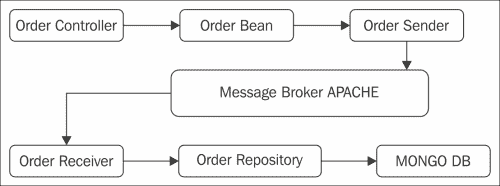

让我们使用**消息代理**的相同用例。请求从控制器流出，当用户输入订单详细信息并单击**保存**时，订单 bean 设置在控制器中，控制器将请求发送到 JMS 发送器，即订单发送器。

订单发送者以 map 的形式将消息发送到队列。接收者读取消息并将消息保存到 MongoDB 数据库中。接收者也可以是不同的应用程序；所有应用程序只需要知道队列名称，以防应用程序中配置了多个队列。

## Spring 依赖

使用与第一章相同的源代码，*Spring Mongo Integration*，以及`pom.xml`文件。使用 Spring JMS 依赖项更新`pom.xml`文件。对于本章，我们有 Spring 4.0.3 版本可用，这是迄今为止最新的版本。以下是`Pom.xml`文件的代码：

```java
<project  
  xsi:schemaLocation="http://maven.apache.org/POM/4.0.0 http://maven.apache.org/maven-v4_0_0.xsd">
  <modelVersion>4.0.0</modelVersion>
  <groupId>com.packt.web</groupId>
  <artifactId>Spring4JMS_Chapter2</artifactId>
  <packaging>war</packaging>
  <version>0.0.1-SNAPSHOT</version>
  <name>Spring4JMS_Chapter2</name>
  <url>http://maven.apache.org</url>
  <properties>
  <spring.version>4.0.3.RELEASE</spring.version>
  </properties>

  <dependencies>

  <!-- Spring JMS dependencies -->
    <dependency>
    <groupId>org.springframework</groupId>
    <artifactId>spring-jms</artifactId>
    <version>${spring.version}</version>
    <scope>runtime</scope>
    </dependency>

    <dependency>
    <groupId>org.apache.activemq</groupId>
    <artifactId>activemq-core</artifactId>
    <version>5.3.1</version>
    <scope>runtime</scope>
    </dependency>
    <dependency>
    <groupId>org.apache.xbean</groupId>
    <artifactId>xbean-spring</artifactId>
    <version>3.5</version>
    <scope>runtime</scope>
    </dependency>
    <dependency>
    <groupId>org.apache.geronimo.specs</groupId>
    <artifactId>geronimo-jms_1.1_spec</artifactId>
    <version>1.1.1</version>
    <scope>runtime</scope>
    </dependency> 
  </dependencies>
  <build>
    <finalName>Spring4JMS_Chapter2</finalName>
  </build>
</project>
```

# 使用 SpringJMS 和 ActiveMQ 实现订单管理消息系统

在前面关于 Apache ActiveMQ 的部分中，我们讨论了创建消息队列所需的步骤，并创建了一个订单队列。现在，让我们从应用程序向队列发送消息。

以下表格描述了集成了 JMS 的应用程序的组件。

请求从 JSP 流向 Spring 控制器，该控制器设置订单 bean 对象并将其发送给`orderSender`（这是一个 JMS 消息发送器类）。该类将订单对象放入队列。

JMS 接收器是从队列中读取消息的类。读取的对象被发送到`OrderRepository`类，这是一个 Mongo Repository 类，并将消息发布到 MongoDB 数据库。

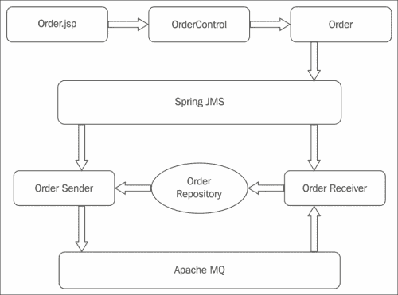

以下表格为我们提供了一个关于在 Spring MVC 应用程序中使用 JMS 进行通信的类的概述：

| JSP | 控制器 | Bean | JMS 发送器 | JMS 接收器 | MongoRepository |
| --- | --- | --- | --- | --- | --- |
| `order.jsp``allorders.jsp` | `Order Controller.java` | `Order.java` | `OrderSender` | `OrderReceiver` | `OrderRepository` |

## 配置 dispatcherservlet.xml 以使用 JMS

您可以看到我们在 XML 文件中配置了以下内容：

+   `connectionFactory`：它创建一个`jmsconnection`对象。这个`jmsconnection`对象连接到**消息导向中间件**（**MOM**），即 Apache ActiveMQ。`jmsconnection`对象提供了一个 JMS 会话对象，应用程序使用该对象与 Apache ActiveMQ 交互。代理 URL 提供了有关消息代理接口正在侦听的主机和端口的信息。

+   `destination`：这是应用程序需要通信的队列的名称。

```java
<bean id="destination" class="org.apache.activemq.command.ActiveMQQueue">
  <constructor-arg value="orderQueue"/>
</bean>
```

+   `jmstemplate`：它以目的地和`connectionFactory` bean 作为参数。

```java
  <bean id="jmsTemplate" class="org.springframework.jms.core.JmsTemplate">
    <property name="connectionFactory" ref="connectionFactory" />
    <property name="defaultDestination" ref="destination" />
  </bean>
```

+   `orderSender`：这是使用`jms`模板向队列发送消息的类。

```java
<bean id="orderSender" class="com.packt.jms.OrderSender" />
```

+   `orderReceiver`：这个类从队列中读取消息。它有`connectionFactory`，以便可以连接到 JMS 提供程序来读取消息。

```java
<bean id="orderReceiver" class="com.packt.jms.OrderReceiver" />

<jms:listener-container  connection-factory="connectionFactory">
<jms:listener destination="orderQueue" ref="orderReceiver" method="orderReceived" />
</jms:listener-container>
```

以下是`dispacherservlet.xml`的完整配置。我们将观察到配置文件已更新为`activemq`配置。

**dispatcherservlet.xml**

```java
<?xml version="1.0" encoding="UTF-8"?>
<beans 

  xsi:schemaLocation="http://www.springframework.org/schema/beans 
  http://www.springframework.org/schema/beans/spring-beans-3.2.xsd 
  http://www.springframework.org/schema/data/mongo
  http://www.springframework.org/schema/data/mongo/spring-mongo-1.0.xsd

  http://www.springframework.org/schema/context 
  http://www.springframework.org/schema/context/spring-context-3.2.xsd 
  http://www.springframework.org/schema/jms 
  http://www.springframework.org/schema/jms/spring-jms.xsd
  http://activemq.apache.org/schema/core 
  http://activemq.apache.org/schema/core/activemq-core.xsd">
  <context:component-scan base-package="com.packt" />
    <!-- JMS Active MQQueue configuration -->
    <bean id="connectionFactory" class="org.apache.activemq.ActiveMQConnectionFactory">
    <property name="brokerURL">
      <value>tcp://localhost:61616</value>
    </property>
    </bean>

    <bean id="destination" class="org.apache.activemq.command.ActiveMQQueue">
    <constructor-arg value="orderQueue"/>
    </bean>

    <bean id="jmsTemplate" class="org.springframework.jms.core.JmsTemplate">
    <property name="connectionFactory" ref="connectionFactory" />
    <property name="defaultDestination" ref="destination" />
    </bean>
  <bean id="orderSender" class="com.packt.jms.OrderSender" />
  <bean id="orderReceiver" class="com.packt.jms.OrderReceiver" />
  <jms:listener-container  connection-factory="connectionFactory">
  <jms:listener destination="orderQueue" ref="orderReceiver" method="orderReceived" />
  </jms:listener-container>

  <!-- Factory bean that creates the Mongo instance -->
  <bean id="mongo" class="org.springframework.data.mongodb.core.MongoFactoryBean">
    <property name="host" value="localhost" />
  </bean>
  <mongo:mongo host="127.0.0.1" port="27017" />
  <mongo:db-factory dbname="eshopdb" />

  <bean id="mongoTemplate" class="org.springframework.data.mongodb.core.MongoTemplate">
    <constructor-arg name="mongoDbFactory" ref="mongoDbFactory" />
  </bean>
  <!-- Use this post processor to translate any MongoExceptions thrown in @Repository annotated classes -->
  <bean class="org.springframework.dao.annotation.PersistenceExceptionTranslationPostProcessor" />

    <bean id="jspViewResolver" class="org.springframework.web.servlet.view.InternalResourceViewResolver"
      p:prefix="/WEB-INF/myviews/"
      p:suffix=".jsp" /> 
</beans>
```

**Order.java**

```java
package com.packt.bean;
import org.springframework.data.annotation.Id;
import org.springframework.data.mongodb.core.mapping.Document;

@Document
public class Order {
  private String order_id;
  private Customer customer;
  private Product product;
  private String date;
  private String order_status;
  private int quantity;

  public Order() {
    super();
    // TODO Auto-generated constructor stub
  }

  @Id
  public String getOrder_id() {
    return order_id;
  }
  public void setOrder_id(String order_id) {
    this.order_id = order_id;
  }

  public String getDate() {
    return date;
  }
  public void setDate(String date) {
    this.date = date;
  }
  public int getQuantity() {
    return quantity;
  }
  public void setQuantity(int quantity) {
    this.quantity = quantity;
  }
  public String getOrder_status() {
    return order_status;
  }
  public void setOrder_status(String order_status) {
    this.order_status = order_status;
  }

  public Customer getCustomer() {
    return customer;
  }
  public void setCustomer(Customer customer) {
    this.customer = customer;
  }
  public Product getProduct() {
    return product;
  }
  public void setProduct(Product product) {
    this.product = product;
  }
}
```

`OrderController`类调用发送器将订单发送到消息代理队列。控制器使用 MongoDB 执行一些基本的 CRUD 操作。以下代码仅演示了`Create`操作。

当调用`/order/save`时，控制器将订单对象发送到`orderSender`，后者将订单详细信息保存在队列中。

OrderCOntroller.java

```java
Order details is saved with JMS.The Order Object is passed to orderSender, which will store the order details in the queue.
@RequestMapping(value = "/order/save", method = RequestMethod.POST)
  // request insert order recordhrecord
  public String addorder(@ModelAttribute("Order") Order order,Map<String, Object> model) {
    orderSender.sendOrder(order);
    model.put("customerList", customerList);
    model.put("productList", productList);
    return "order";
  }
```

让我们来看看 JMS 发送器和接收器类。这两个类都使用 Spring JMS 模板来接收和发送消息。`org.springframework.jms.core.MessageCreator`类创建要放入队列中的消息。

以下是`orderSender`的代码，它获取需要传递到队列的对象。`JMSTemplate`准备消息格式，以便它可以被队列接受。

**OrderSender**

```java
package com.packt.jms;

import javax.jms.JMSException;
import javax.jms.MapMessage;
import javax.jms.Message;
import javax.jms.Session;
import org.springframework.beans.factory.annotation.Autowired;
import org.springframework.jms.core.JmsTemplate;
import org.springframework.jms.core.MessageCreator;
import com.packt.bean.Order;

public class OrderSender {

  @Autowired
  private JmsTemplate jmsTemplate;
  public void sendOrder(final Order order){
    jmsTemplate.send(
    new MessageCreator() {
      public Message createMessage(Session session) throws JMSException {
        MapMessage mapMessage = session.createMapMessage();
        mapMessage.setInt("quantity", order.getQuantity());
        mapMessage.setString("customerId", order.getCustomer().getCust_id());
        mapMessage.setString("productId", order.getProduct().getProdid());
        return mapMessage;

      }
    }
    );
    System.out.println("Order: "+ order);
  }
}
```

以下是在添加订单案例时的屏幕截图：

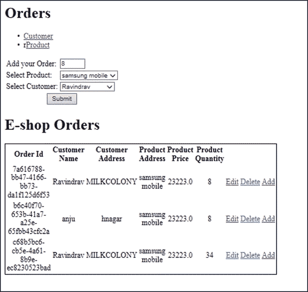

# 在 ApacheMQ 中使用多个队列

在前面的部分中，我们演示了使用 Map Message 将消息发送到 Order Queue。现在，我们可以看看如何在 ApacheMQ 中使用多个队列：

1.  启动 Apache ActiveMQ 服务器，在控制台上点击**Queues**并创建两个队列。

1.  让我们创建两个队列，并将队列命名如下：

+   `PacktTestQueue1`

+   `PacktTestQueue2`

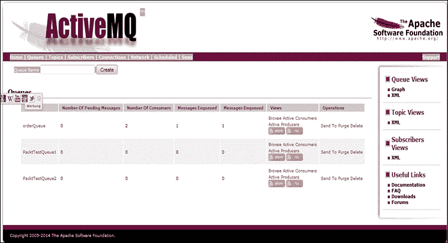

1.  使用与本章第一个示例相同的依赖项创建一个新的 Spring 项目。

1.  创建一个`PacktMessageListener`类，实现`MessageListener`接口。该类覆盖`onMessage(Message message)`方法。

1.  Spring 的`DefaultMessageListener`从队列中消费消息并调用`onMessage(Message message)`方法。

```java
PacktMessageListener:
package com.packt.jms;

import javax.jms.JMSException;
import javax.jms.Message;
import javax.jms.MessageListener;
import javax.jms.TextMessage;

public class  PacktMessageListener implements MessageListener{
  private PacktMessageSender packtmessagesender;
  public void onMessage(Message message){
    if (message instanceof TextMessage){
      try{
        String msgText = ((TextMessage) message).getText();
        packtmessagesender.sendMessage(msgText);
      }
      catch (JMSException jmsexception){
        System.out.println(jmsexception.getMessage());
      }
    }
    else{
      throw new RuntimeException("exception runtime");  
    }
  }

  public void setTestMessageSender(PacktMessageSender packtmessagesender){
    this.packtmessagesender = packtmessagesender;
  }
}
```

1.  现在让我们来看看消息发送器类，它使用`JmsTemplate`将文本消息发送到队列。

在这里，我们为`JmsTemplate`对象和`queue`对象提供了 setter，并定义了一个发送消息的方法。该类已在 XML 文件中进行了配置。

**PacktMessageSender**

```java
package com.packt.jms;
import javax.jms.MessageListener;
import javax.jms.Queue;
import org.springframework.jms.core.JmsTemplate;

public class PacktMessageSender {
  private JmsTemplate jmsTemplate;
  private Queue queue;
  public void setJmsTemplate(JmsTemplate jmsTemplate){
    this.jmsTemplate = jmsTemplate;
  }
  public void setQueue(Queue queue) {
    this.queue = queue;
  }
  public void sendMessage(String msgText) {
  jmsTemplate.convertAndSend(queue, msgText);
  }
}
```

1.  让我们首先在`meta-inf`文件夹下的`context.xml`文件中创建资源引用。这是我们将为 JMS 配置**Java 命名和目录接口**（**JNDI**）的地方。

```java
<?xml version="1.0" encoding="UTF-8"?>
<Context>
<!—connection factory details-->
<Resource name="jms/mqConnectionFactory" auth="Container" type="org.apache.activemq.ActiveMQConnectionFactory" description="JMS Connection Factory" factory="org.apache.activemq.jndi.JNDIReferenceFactory" brokerURL="tcp://localhost:61616" />

<!—queue details-->

<Resource name="jms/PacktTestQueue1" auth="Container" type="org.apache.activemq.command.ActiveMQQueue" factory="org.apache.activemq.jndi.JNDIReferenceFactory" physicalName="PacktTestQueue1"/>

<!—queue details-->

<Resource name="jms/PacktTestQueue2" auth="Container" type="org.apache.activemq.command.ActiveMQQueue" factory="org.apache.activemq.jndi.JNDIReferenceFactory" physicalName="PacktTestQueue2"/>
</Context>
```

1.  以下是在`spring-configuration.xml`文件中需要进行的配置更改，以配置多个队列：

+   使用 Spring JNDI 查找`queueNames`和 JMS`connectionFactory`

+   将`ConnectionFactory`引用传递给`JmsTemplate`

+   配置`MessageSender`和`MessageListener`类

+   `MessageSender`类将具有`JmsTemplate`和`queue`对象作为属性

+   `MessageListener`将具有`MessageSender`作为属性

+   配置`DefaultMessageListenerContainer`类，该类从队列中消费消息

1.  以下是配置文件的代码：

**Spring-configuration.xml**

```java
<?xml version="1.0" encoding="UTF-8"?>
<beans 

  xsi:schemaLocation="http://www.springframework.org/schema/beans
  http://www.springframework.org/schema/beans/spring-beans-4.0.xsd
  http://www.springframework.org/schema/context
  http://www.springframework.org/schema/context/spring-context-4.0.xsd
  http://www.springframework.org/schema/beans
  http://www.springframework.org/schema/beans/spring-beans-4.0.xsd
  http://www.springframework.org/schema/jee
  http://www.springframework.org/schema/jee/spring-jee-4.0.xsd">

  <jee:jndi-lookup id="apachemqConnectionFactory" jndi-name="java:comp/env/jms/mqConnectionFactory" />
  <jee:jndi-lookup id="PacktTestQueue1" jndi-name="java:comp/env/jms/PacktTestQueue1" />
  <jee:jndi-lookup id="PacktTestQueue2" jndi-name="java:comp/env/jms/PacktTestQueue2" />

  <bean id="packtMessageListener" class="com.packt.jms.PacktMessageListener">
    <property name="packtMessageSender" ref ="packtMessageSender" />
  </bean>

  <bean id="defaultMessageListenerContainer" class="org.springframework.jms.listener.DefaultMessageListenerContainer">
    <property name="connectionFactory" ref ="apachemqConnectionFactory" />
    <property name="destination" ref ="PacktTestQueue1"/>
    <property name="messageListener" ref ="packtMessageListener"/>
    <property name="concurrentConsumers" value="2" />
  </bean>

  <bean id="packtMessageSender" class="com.packt.jms.PacktMessageSender">
    <property name="jmsTemplate" ref="jmsTemplate"/>
    <property name="queue" ref="PacktTestQueue2"/>
  </bean>

  <bean id="jmsTemplate" class="org.springframework.jms.core.JmsTemplate">
    <property name="connectionFactory" ref="apachemqConnectionFactory" />
  </bean>

</beans>
```

1.  以下代码将配置`web.xml`文件。在`web.xml`中，我们实际上提供了关于`spring-configuration.xml`文件位置的信息，以便 Web 容器可以加载它。

```java
<?xml version="1.0" encoding="UTF-8"?>
<web-app 

  xsi:schemaLocation="http://java.sun.com/xml/ns/javaee
  http://java.sun.com/xml/ns/javaee/web-app_2_5.xsd"
  id="WebApp_ID"
  version="2.5">
  <context-param>
    <param-name>contextConfigLocation</param-name>
    <param-value>
      /WEB-INF/configuration/spring-configuration.xml
    </param-value>
  </context-param>
  <listener>
    <listener-class>org.springframework.web.context.ContextLoaderListener</listener-class>
  </listener>
</web-app>
```

1.  如果您使用 Maven 作为构建工具，请确保编译源代码并在 Tomcat 或其他您选择的服务器上运行应用程序。同时保持 Apache ActiveMQ 服务器控制台处于运行状态。

1.  在 ActiveMQ 控制台中，点击**队列**。

1.  点击**发送**按钮以链接到`PacktTestQueue1`行。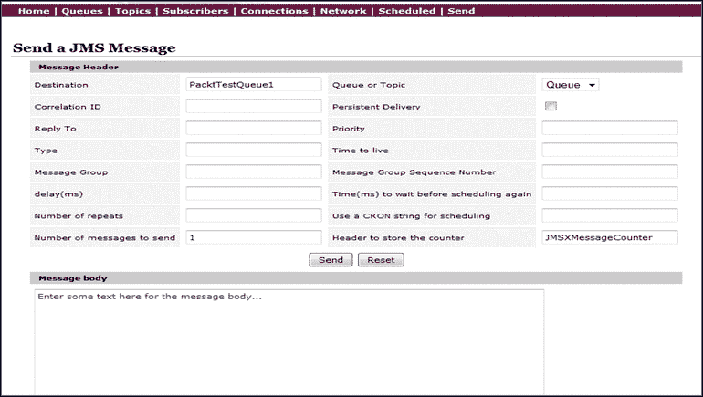

1.  输入一些消息文本，然后点击**发送**按钮。

1.  在控制台中，您会看到从队列 1 发送了一条消息到队列 2。我们的应用程序从`PacktTestQueue1`消费消息并将其推送到`PacktTestQueue2`。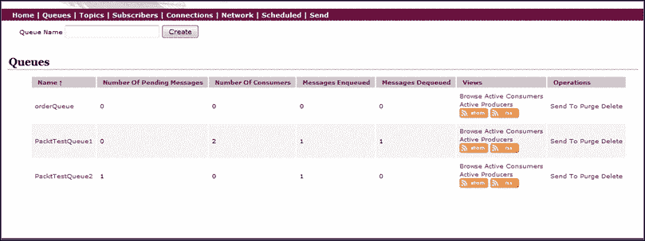

1.  现在，让我们增加要发送的消息数量，看看它的行为。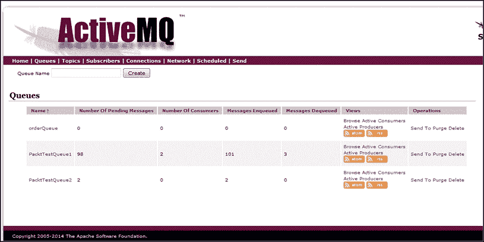

1.  点击**PacktTestQueue2**，您将看到所有消息都被推送到`PacktTestQueue2`。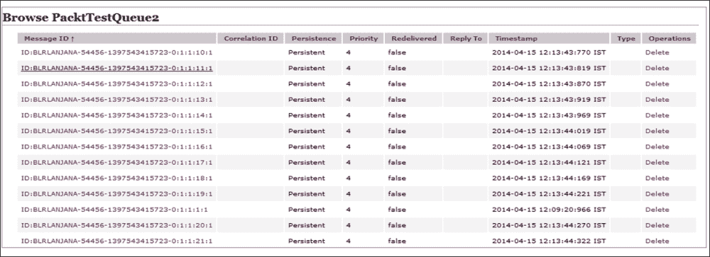

## 配置 JMS 事务

当我们使用事务时，我们可以更好地处理前面的情景。消息将在事务中处理，在监听器中出现异常的情况下，将为完整的源代码回滚。参考`repository-Spring4JMS_TransactionChapter2`中的源代码。

包括事务在消息传递中需要以下步骤：

1.  将以下属性添加到 ActiveMQ 连接工厂 bean 配置中：

```java
<property name="redeliveryPolicy">
  <bean class="org.apache.activemq.RedeliveryPolicy">
<property name="maximumRedeliveries" value="3"/>
  </bean>
</property>
```

1.  更新监听器定义如下：

```java
<jms:listener-container connection-factory="connectionFactory" acknowledge="transacted">
  <jms:listener destination="orderQueue" ref="orderReceiver" method="orderReceived" />
</jms:listener-container>
```

让我们重新审视情景，了解在`jmsTemplate`中添加事务后发生了什么：

+   **场景 1**：成功场景

+   **场景 2**：消息生产者向队列发送信息，消费者读取并将其处理到数据库中；然后出现错误。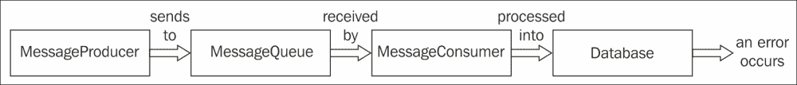

添加事务后，代理将三次发送消息。在第四次尝试时，它将发送到新队列，以便消息不会丢失。

+   **场景 3**：消息生产者向队列发送信息，消费者读取并将其处理到数据库中；然后出现错误。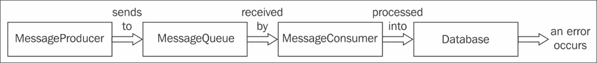

添加事务后，如果在完成处理之前监听器执行失败，消息代理将重新发送信息。

## 配置多个 JMS 监听器和适配器

我们可能会遇到需要有更多 JMS 监听器和适配器的情况。当我们需要使用 Spring 模板轻松处理多个队列时，我们可以配置多个监听器。为了处理多个监听器，我们还需要适配器，它将委托给不同的监听器。

```java
<bean id="jmsMessageAdapter" class="org.springframework.jms.listener.adapter.MessageListenerAdapter">
<property name="delegate" ref="jmsMessageReceiverDelegate" />
<property name="defaultListenerMethod" value="processMessage" />
</bean>

<jms:listener-container container-type="default"
  connection-factory="connectionFactory" acknowledge="auto"> 
<jms:listener destination="queue1"
  ref="jmsMessageReceiverDelegate" method="processMessage" /> 
<jms:listener destination="queue2"
  ref="jmsMessageReceiverDelegate" method="processMessage" /> 
</jms:listener-container>
```

# JMS 事务

在本节中，让我们看看如何在消息传递中包含事务。我们将首先演示不使用事务的消息传递，使用几种情景。我们将首先描述情景并编写一个测试用例。然后，我们将围绕它开发一个应用程序。我们将演示使用`convertandsendmessage()`方法发送消息。

+   **场景 1**：这是一个正面的用例，在之前的部分中我们也看到了。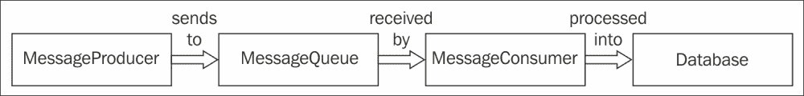

```java
@Test
public void testCorrectMessage() throws InterruptedException {
  Order order = new Order(0, "notification to deliver correctly");
  ordersender.convertAndSendMessage(QUEUE_INCOMING, order);

  Thread.sleep(6000);
  printResults();

  assertEquals(1, getSavedOrders());
  assertEquals(0, getMessagesInQueue(QUEUE_INCOMING));
  assertEquals(0, getMessagesInQueue(QUEUE_DLQ));
}
```

+   **场景 2**：在这里，让我们使用一个负面情景。消息生产者向队列发送信息，消费者读取，但在到达数据库之前发生异常。

```java
@Test
public void testFailedAfterReceiveMessage() throws InterruptedException {
  Order order = new Order(1, "ordernotification to fail after receiving");
  ordersender.convertAndSendMessage(QUEUE_INCOMING, order);
  Thread.sleep(6000);
  printResults();
  assertEquals(0, getSavedOrders());
  assertEquals(0, getMessagesInQueue(QUEUE_INCOMING));
  assertEquals(1, getMessagesInQueue(QUEUE_DLQ));
  //Empty the dead letter queue
  jmsTemplate.receive(QUEUE_DLQ);
}
```

在这种情况下，我们丢失了消息。

+   **场景 3**：在这里，让我们使用另一个负面情景。消息生产者向队列发送信息，消费者读取并将其处理到数据库中；然后出现错误。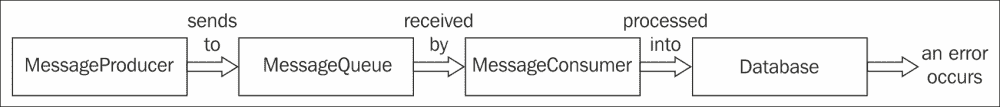

```java
@Test
public void testFailedAfterProcessingMessage() throws InterruptedException {
  Order order = new Order(2, "ordernotification to fail after processing");
  ordersender.convertAndSendMessage(QUEUE_INCOMING, order);
  Thread.sleep(6000);
  printResults();
  assertEquals(2, getSavedOrders());
  assertEquals(0, getMessagesInQueue(QUEUE_INCOMING));
  assertEquals(0, getMessagesInQueue(QUEUE_DLQ));
}
```

消息在失败之前被传递并存储在数据库中。

# 摘要

在本章中，我们学习了安装 Apache ActiveMQ 和不同类型的消息传递所需的步骤。我们演示了如何将 Spring 的`jms`模板与应用程序集成。我们还通过截图演示了如何创建多个队列以及如何使用 Spring 模板与队列进行通信。在下一章中，我们将研究 Spring JAVA 邮件 API。
