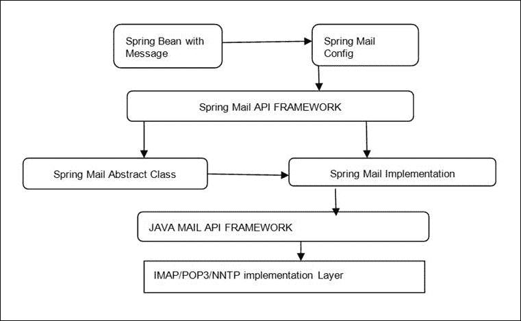
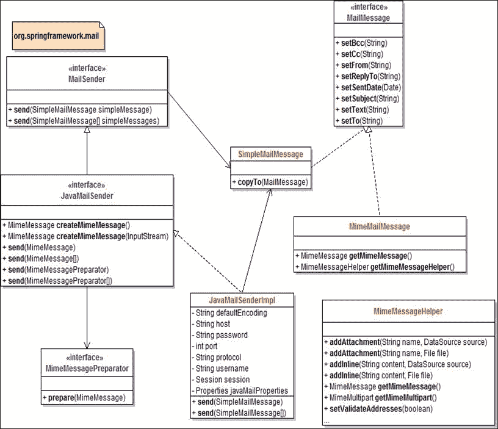
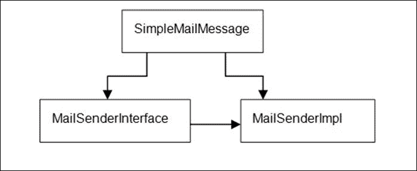
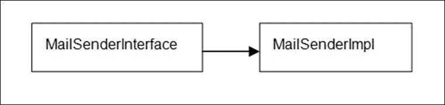

# 第三章：使用 Spring 邮件发送邮件

邮件 API 是所有现代 Web 应用的一部分。最终用户更喜欢通过邮件收到有关与应用程序执行的交易的详细信息。

Spring 已经让为任何 Java 应用程序提供邮件功能变得更加容易。在本章中，我们将看到如何使用 Spring 邮件模板向电子邮件接收者发送电子邮件。在上一章中，我们使用消息作为中间件将消息存储在队列中，现在在本章中，我们将演示使用不同场景下的 Spring 邮件模板配置。

# Spring 邮件消息处理流程

以下图表描述了 Spring 邮件消息处理的流程。通过这个图表，我们可以清楚地了解使用 Spring 邮件模板发送邮件的过程。

创建并发送消息到与互联网协议交互的传输协议，然后消息被接收者接收。



Spring 邮件框架需要邮件配置或 SMTP 配置作为输入，以及需要发送的消息。邮件 API 与互联网协议交互以发送消息。在下一节中，我们将看一下 Spring 邮件框架中的类和接口。

# 使用 Spring 发送邮件的接口和类

`org.springframework.mail`包用于 Spring 应用程序中的邮件配置。



以下是用于发送邮件的三个主要接口：

+   `MailSender`：这个接口用于发送简单的邮件消息。

+   `JavaMailSender`：这个接口是`MailSender`接口的子接口，支持发送邮件消息。

+   `MimeMessagePreparator`：这个接口是一个回调接口，支持`JavaMailSender`接口准备邮件消息。

以下类用于使用 Spring 发送邮件：

+   `SimpleMailMessage`：这是一个类，具有`to`、`from`、`cc`、`bcc`、`sentDate`等属性。`SimpleMailMessage`接口使用`MailSenderImp`类发送邮件。

+   `JavaMailSenderImpl`：这个类是`JavaMailSender`接口的实现类。

+   `MimeMessageHelper`：这个类帮助准备 MIME 消息。

# 使用@Configuration 注解发送邮件

我们将在这里演示如何使用 Spring 邮件 API 发送邮件。

1.  首先，我们在`.properties`文件中提供所有 SMTP 详细信息，并使用`@Configuration`注解将其读取到类文件中。类的名称是`MailConfiguration`。

`mail.properties`文件内容如下：

```java
mail.protocol=smtp
mail.host=localhost
mail.port=25
mail.smtp.auth=false
mail.smtp.starttls.enable=false
mail.from=me@localhost
mail.username=
mail.password=

@Configuration
@PropertySource("classpath:mail.properties")
public class MailConfiguration {
  @Value("${mail.protocol}")
  private String protocol;
  @Value("${mail.host}")
  private String host;
  @Value("${mail.port}")
  private int port;
  @Value("${mail.smtp.auth}")
  private boolean auth;
  @Value("${mail.smtp.starttls.enable}")
  private boolean starttls;
  @Value("${mail.from}")
  private String from;
  @Value("${mail.username}")
  private String username;
  @Value("${mail.password}")
  private String password;

  @Bean
  public JavaMailSender javaMailSender() {
    JavaMailSenderImpl mailSender = new JavaMailSenderImpl();
    Properties mailProperties = new Properties();
    mailProperties.put("mail.smtp.auth", auth);
    mailProperties.put("mail.smtp.starttls.enable", starttls);
    mailSender.setJavaMailProperties(mailProperties);
    mailSender.setHost(host);
    mailSender.setPort(port);
    mailSender.setProtocol(protocol);
    mailSender.setUsername(username);
    mailSender.setPassword(password);
    return mailSender;
  }
}
```

1.  下一步是创建一个 REST 控制器来发送邮件；为此，请单击**提交**。我们将使用`SimpleMailMessage`接口，因为我们没有任何附件。

```java
@RestController
class MailSendingController {
  private final JavaMailSender javaMailSender;
  @Autowired
  MailSubmissionController(JavaMailSender javaMailSender) {
    this.javaMailSender = javaMailSender;
  }
  @RequestMapping("/mail")
  @ResponseStatus(HttpStatus.CREATED)
  SimpleMailMessage send() { 
    SimpleMailMessage mailMessage = new SimpleMailMessage();
    mailMessage.setTo("packt@localhost");
    mailMessage.setReplyTo("anjana@localhost");
    mailMessage.setFrom("Sonali@localhost");
    mailMessage.setSubject("Vani veena Pani");
    mailMessage.setText("MuthuLakshmi how are you?Call Me Please [...]");
    javaMailSender.send(mailMessage);
    return mailMessage;
  }
}
```

# 使用 MailSender 和 SimpleMailMessage 以及 XML 配置发送邮件

“简单邮件消息”意味着发送的电子邮件只是基于文本，没有 HTML 格式，没有图像，也没有附件。在本节中，考虑一个场景，即在用户在应用程序中下订单后，我们会向用户发送欢迎邮件。在这种情况下，邮件将在数据库插入操作成功后发送。

为邮件服务创建一个名为`com.packt.mailService`的单独文件夹。以下是使用`MailSender`接口和`SimpleMailMessage`类发送邮件的步骤。

1.  创建一个名为`Spring4MongoDB_MailChapter3`的新 Maven Web 项目。

1.  本例中使用了第一章中创建的 MongoDB 数据库，*Spring Mongo Integration*。我们还在 MongoDB 的 Eshop db 数据库上使用了相同的 CRUD 操作`Customer`、`Order`和`Product`。我们还使用了相同的`mvc`配置和源文件。

1.  使用与第二章中使用的相同的依赖项，*Spring JMS 消息*。

1.  我们需要在`pom.xml`文件中添加依赖项：

```java
<dependency>
  <groupId>org.springframework.integration</groupId>
  <artifactId>spring-integration-mail</artifactId>
  <version>3.0.2.RELEASE</version>
  <scope>runtime</scope>
</dependency>
<dependency>
  <groupId>javax.activation</groupId>
  <artifactId>activation</artifactId>
  <version>1.1-rev-1</version>
  <scope>runtime</scope>
</dependency>
<dependency>
  <groupId>javax.mail</groupId>
  <artifactId>mail</artifactId>
  <version>1.4.3</version>
</dependency>

```

1.  编译 Maven 项目。为邮件服务创建一个名为`com.packt.mailService`的单独文件夹。

1.  创建一个名为`MailSenderService`的简单类，并自动装配`MailSender`和`SimpleMailMessage`类。基本框架如下所示：

```java
public class MailSenderService {
  @Autowired
  private MailSender mailSender;
  @AutoWired 
  private SimpleMailMessage simplemailmessage;
  public void sendmail(String from, String to, String subject, String body){
    /*Code */
  }

}
```

1.  接下来，创建一个`SimpleMailMessage`对象，并设置邮件属性，如`from`、`to`和`subject`。

```java
public void sendmail(String from, String to, String subject, String body){
  SimpleMailMessage message=new SimpleMailMessage();
  message.setFrom(from);
  message.setSubject(subject);
  message.setText(body);
  mailSender.send(message);
}
```

1.  我们需要配置 SMTP 详细信息。Spring 邮件支持提供了在 XML 文件中配置 SMTP 详细信息的灵活性。

```java
<bean id="mailSender" class="org.springframework.mail.javamail.JavaMailSenderImpl">
  <property name="host" value="smtp.gmail.com" />
  <property name="port" value="587" />
  <property name="username" value="username" />
  <property name="password" value="password" />

  <property name="javaMailProperties">
  <props>
    <prop key="mail.smtp.auth">true</prop>
    <prop key="mail.smtp.starttls.enable">true</prop>
  </props>
</property>
</bean>

<bean id="mailSenderService" class=" com.packt.mailserviceMailSenderService ">
  <property name="mailSender" ref="mailSender" />
</bean>

</beans>
```

在订单成功在 MongoDB 数据库中放置后，我们需要向客户发送邮件。更新`addorder()`方法如下：

```java
@RequestMapping(value = "/order/save", method = RequestMethod.POST)
  // request insert order recordh
  public String addorder(@ModelAttribute("Order") Order order,Map<String, Object> model) {
    Customer cust=new Customer();
    cust=customer_respository.getObject(order.getCustomer().getCust_id());

    order.setCustomer(cust);
    order.setProduct(product_respository.getObject(order.getProduct().getProdid()));
    respository.saveObject(order);
    mailSenderService.sendmail("anjana.mprasad@gmail.com",cust.getEmail(),
      "Dear"+cust.getName()+"Your order details",order.getProduct().getName()+"-price-"+order.getProduct().getPrice());
    model.put("customerList", customerList);
    model.put("productList", productList);
    return "order";
  }
```

## 向多个收件人发送邮件

如果您想通知用户应用程序中的最新产品或促销活动，可以创建一个邮件发送组，并使用 Spring 邮件发送支持向多个收件人发送邮件。

我们在同一个类`MailSenderService`中创建了一个重载方法，它将接受字符串数组。类中的代码片段将如下所示：

```java
public class MailSenderService {
  @Autowired
  private MailSender mailSender;
  @AutoWired 
  private SimpleMailMessage simplemailmessage;
  public void sendmail(String from, String to, String subject, String body){
    /*Code */
  }

  public void sendmail(String from, String []to, String subject, String body){
    /*Code */
  }

}
```

以下是从 MongoDB 中列出已订阅促销邮件的用户集合的代码片段：

```java
  public List<Customer> getAllObjectsby_emailsubscription(String status) {
    return mongoTemplate.find(query(where("email_subscribe").is("yes")), Customer.class);
  }
```

# 发送 MIME 消息

**多用途互联网邮件扩展**（**MIME**）允许在互联网上发送附件。如果您不发送任何附件，使用 MIME 消息发送器类型类是不可取的。在下一节中，我们将详细了解如何发送带附件的邮件。

使用 MIME 消息准备程序并重写准备`method()`以设置邮件属性来更新`MailSenderService`类。

```java
public class MailSenderService {
  @Autowired
  private MailSender mailSender;
  @AutoWired 
  private SimpleMailMessage simplemailmessage;

  public void sendmail(String from, String to, String subject, String body){
    /*Code */
  }
  public void sendmail(String from, String []to, String subject, String body){
    /*Code */
  }
  public void sendmime_mail(final String from, final String to, final String subject, final String body) throws MailException{
    MimeMessagePreparator message = new MimeMessagePreparator() {
      public void prepare(MimeMessage mimeMessage) throws Exception {
        mimeMessage.setRecipient(Message.RecipientType.TO,new InternetAddress(to));
        mimeMessage.setFrom(new InternetAddress(from));
        mimeMessage.setSubject(subject);
        mimeMessage.setText(msg);
    }
  };
  mailSender.send(message);
}
```

# 发送邮件附件

我们还可以在邮件中附加各种类型的文件。这个功能由`MimeMessageHelper`类支持。如果您只想发送一个没有附件的 MIME 消息，可以选择`MimeMesagePreparator`。如果要求附件与邮件一起发送，我们可以选择带有文件 API 的`MimeMessageHelper`类。

Spring 提供了一个名为`org.springframework.core.io.FileSystemResource`的文件类，它具有一个接受文件对象的参数化构造函数。

```java
public class SendMailwithAttachment {
  public static void main(String[] args) throws MessagingException {
    AnnotationConfigApplicationContext ctx = new AnnotationConfigApplicationContext();
    ctx.register(AppConfig.class);
    ctx.refresh();
    JavaMailSenderImpl mailSender = ctx.getBean(JavaMailSenderImpl.class);
    MimeMessage mimeMessage = mailSender.createMimeMessage();
    //Pass true flag for multipart message
    MimeMessageHelper mailMsg = new MimeMessageHelper(mimeMessage, true);
    mailMsg.setFrom("ANJUANJU02@gmail.com");
    mailMsg.setTo("RAGHY03@gmail.com");
    mailMsg.setSubject("Test mail with Attachment");
    mailMsg.setText("Please find Attachment.");
    //FileSystemResource object for Attachment
    FileSystemResource file = new FileSystemResource(new File("D:/cp/ GODGOD. jpg"));
    mailMsg.addAttachment("GODGOD.jpg", file);
    mailSender.send(mimeMessage);
    System.out.println("---Done---");
  }

}
```

# 发送预配置的邮件

在这个例子中，我们将提供一条要发送的邮件，并在 XML 文件中进行配置。有时在 Web 应用程序中，您可能需要在维护时发送消息。想象一下邮件内容发生变化，但发件人和收件人是预先配置的情况。在这种情况下，您可以向`MailSender`类添加另一个重载方法。

我们已经固定了邮件的主题，内容可以由用户发送。可以将其视为“一个应用程序，每当构建失败时向用户发送邮件”。

```java
<?xml version="1.0" encoding="UTF-8"?>
<beans    xsi:schemaLocation="http://www.springframework.org/schema/beans
http://www.springframework.org/schema/beans/spring-beans-3.0.xsd
http://www.springframework.org/schema/context
http://www.springframework.org/schema/context/spring-context-3.0.xsd">
<context:component-scan base-package="com.packt" />
<!-- SET default mail properties -->
<bean id="mailSender" class="org.springframework.mail.javamail.JavaMailSenderImpl">
  <property name="host" value="smtp.gmail.com"/>
  <property name="port" value="25"/>
  <property name="username" value="anju@gmail.com"/>
  <property name="password" value="password"/>
  <property name="javaMailProperties">
  <props>
    <prop key="mail.transport.protocol">smtp</prop>
    <prop key="mail.smtp.auth">true</prop>
    <prop key="mail.smtp.starttls.enable">true</prop>
    <prop key="mail.debug">true</prop>
  </props>
  </property>
</bean>

<!-- You can have some pre-configured messagess also which are ready to send -->
<bean id="preConfiguredMessage" class="org.springframework.mail.SimpleMailMessage">
  <property name="to" value="packt@gmail.com"></property>
  <property name="from" value="anju@gmail.com"></property>
  <property name="subject" value="FATAL ERROR- APPLICATION AUTO MAINTENANCE STARTED-BUILD FAILED!!"/>
</bean>
</beans>
```

现在我们将为主题发送两个不同的正文。

```java
public class MyMailer {
  public static void main(String[] args){
    try{
      //Create the application context
      ApplicationContext context = new FileSystemXmlApplicationContext("application-context.xml");
        //Get the mailer instance
      ApplicationMailer mailer = (ApplicationMailer) context.getBean("mailService");
      //Send a composed mail
      mailer.sendMail("nikhil@gmail.com", "Test Subject", "Testing body");
    }catch(Exception e){
      //Send a pre-configured mail
      mailer.sendPreConfiguredMail("build failed exception occured check console or logs"+e.getMessage());
    }
  }
}
```

# 使用 Spring 模板和 Velocity 发送 HTML 邮件

Velocity 是 Apache 提供的模板语言。它可以很容易地集成到 Spring 视图层中。本书中使用的最新 Velocity 版本是 1.7。在前一节中，我们演示了如何使用`@Bean`和`@Configuration`注解来使用 Velocity 发送电子邮件。在本节中，我们将看到如何配置 Velocity 以使用 XML 配置发送邮件。

需要做的就是将以下 bean 定义添加到`.xml`文件中。在`mvc`的情况下，可以将其添加到`dispatcher-servlet.xml`文件中。

```java
<bean id="velocityEngine" class="org.springframework.ui.velocity.VelocityEngineFactoryBean">
  <property name="velocityProperties">
  <value>
    resource.loader=class    class.resource.loader.class=org.apache.velocity.runtime.resource.loader.ClasspathResourceLoader
  </value>
  </property>
</bean>
```

1.  创建一个名为`Spring4MongoDB_Mail_VelocityChapter3`的新的 Maven web 项目。

1.  创建一个名为`com.packt.velocity.templates`的包。

1.  创建一个名为`orderconfirmation.vm`的文件。

```java
<html>
<body>
<h3> Dear Customer,<h3>
<p>${customer.firstName} ${customer.lastName}</p>
<p>We have dispatched your order at address.</p>
${Customer.address}
</body>
</html>
```

1.  使用我们在前几节中添加的所有依赖项。

1.  向现有的 Maven 项目中添加此依赖项：

```java
<dependency>
  <groupId>org.apache.velocity</groupId>
  <artifactId>velocity</artifactId>
  <version>1.7</version>
</dependency>
```

1.  为了确保 Velocity 在应用程序启动时被加载，我们将创建一个类。让我们把这个类命名为`VelocityConfiguration.java`。我们已经在这个类中使用了注解`@Configuration`和`@Bean`。

```java
import java.io.IOException;
import java.util.Properties;

import org.apache.velocity.app.VelocityEngine;
import org.apache.velocity.exception.VelocityException;
import org.springframework.context.annotation.Bean;
import org.springframework.context.annotation.Configuration;
import org.springframework.ui.velocity.VelocityEngineFactory;
@Configuration
public class VelocityConfiguration {
  @Bean
  public VelocityEngine getVelocityEngine() 
  throws VelocityException, IOException{
    VelocityEngineFactory velocityEngineFactory = new VelocityEngineFactory();
    Properties props = new Properties();
    props.put("resource.loader", "class");
    props.put("class.resource.loader.class", "org.apache.velocity.runtime.resource.loader." + "ClasspathResourceLoader");
    velocityEngineFactory.setVelocityProperties(props);
    return factory.createVelocityEngine();
  }
}
```

1.  使用相同的`MailSenderService`类，并在类中添加另一个重载的`sendMail()`方法。

```java
public void sendmail(final Customer customer){
  MimeMessagePreparator preparator = new MimeMessagePreparator() {
    public void prepare(MimeMessage mimeMessage) 
    throws Exception {
      MimeMessageHelper message = new MimeMessageHelper(mimeMessage);
      message.setTo(user.getEmailAddress());
      message.setFrom("webmaster@packt.com"); // could be parameterized
      Map model = new HashMap();
      model.put("customer", customer);
      String text = VelocityEngineUtils.mergeTemplateIntoString(velocityEngine, "com/packt/velocity/templates/orderconfirmation.vm", model);
      message.setText(text, true);
    }
  };
  this.mailSender.send(preparator);
}
```

1.  更新控制器类以使用 Velocity 模板发送邮件。

```java
@RequestMapping(value = "/order/save", method = RequestMethod.POST)
// request insert order recordh
public String addorder(@ModelAttribute("Order") Order order,Map<String, Object> model) {
  Customer cust=new Customer();
  cust=customer_respository.getObject(order.getCustomer().getCust_id());

  order.setCustomer(cust);
  order.setProduct(product_respository.getObject(order.getProduct().getProdid()));
  respository.saveObject(order);
  // to send mail using velocity template.
  mailSenderService.sendmail(cust);

  return "order";
}
```

# 通过不同的线程发送 Spring 邮件

还有其他异步发送 Spring 邮件的选项。一种方法是为邮件发送工作创建一个单独的线程。Spring 带有`taskExecutor`包，它为我们提供了线程池功能。

1.  创建一个名为`MailSenderAsyncService`的类，该类实现`MailSender`接口。

1.  导入`org.springframework.core.task.TaskExecutor`包。

1.  创建一个名为`MailRunnable`的私有类。以下是`MailSenderAsyncService`的完整代码：

```java
public class MailSenderAsyncService implements MailSender{
  @Resource(name = "mailSender")
  private MailSender mailSender;

  private TaskExecutor taskExecutor;

  @Autowired
  public MailSenderAsyncService(TaskExecutor taskExecutor){
    this.taskExecutor = taskExecutor;
  }
  public void send(SimpleMailMessage simpleMessage) throws MailException {
    taskExecutor.execute(new MailRunnable(simpleMessage));
  }

  public void send(SimpleMailMessage[] simpleMessages) throws MailException {
    for (SimpleMailMessage message : simpleMessages) {
      send(message);
    }
  }

  private class SimpleMailMessageRunnable implements Runnable {
    private SimpleMailMessage simpleMailMessage;
    private SimpleMailMessageRunnable(SimpleMailMessage simpleMailMessage) {
      this.simpleMailMessage = simpleMailMessage;
    }

    public void run() {
    mailSender.send(simpleMailMessage);
    }
  }
  private class SimpleMailMessagesRunnable implements Runnable {
    private SimpleMailMessage[] simpleMessages;
    private SimpleMailMessagesRunnable(SimpleMailMessage[] simpleMessages) {
      this.simpleMessages = simpleMessages;
    }

    public void run() {
      mailSender.send(simpleMessages);
    }
  }
}
```

1.  在`.xml`文件中配置`ThreadPool`执行器。

```java
<bean id="taskExecutor" class="org.springframework.scheduling.concurrent.ThreadPoolTaskExecutor" p:corePoolSize="5"
  p:maxPoolSize="10" p:queueCapacity="100" p:waitForTasksToCompleteOnShutdown="true"/>
```

1.  测试源代码。

```java
import javax.annotation.Resource;

import org.springframework.mail.MailSender;
import org.springframework.mail.SimpleMailMessage;
import org.springframework.test.context.ContextConfiguration;

@ContextConfiguration
public class MailSenderAsyncService {
  @Resource(name = " mailSender ")
  private MailSender mailSender;
  public void testSendMails() throws Exception {
    SimpleMailMessage[] mailMessages = new SimpleMailMessage[5];

    for (int i = 0; i < mailMessages.length; i++) {
      SimpleMailMessage message = new SimpleMailMessage();
      message.setSubject(String.valueOf(i));
      mailMessages[i] = message;
    }
    mailSender.send(mailMessages);
  }
  public static void main (String args[]){
    MailSenderAsyncService asyncservice=new MailSenderAsyncService();
    Asyncservice. testSendMails();
  }
}
```

# 使用 AOP 发送 Spring 邮件

我们还可以通过将邮件功能与**面向切面编程**（**AOP**）集成来发送邮件。这可以用于在用户注册应用程序后发送邮件。想象一下用户在注册后收到激活邮件的情景。这也可以用于发送关于应用程序上下订单的信息。使用以下步骤使用 AOP 创建一个`MailAdvice`类：

1.  创建一个名为`com.packt.aop`的包。

1.  创建一个名为`MailAdvice`的类。

```java
public class MailAdvice {
  public void advice (final ProceedingJoinPoint proceedingJoinPoint) {
    new Thread(new Runnable() {
    public void run() {
      System.out.println("proceedingJoinPoint:"+proceedingJoinPoint);
      try {
        proceedingJoinPoint.proceed();
      } catch (Throwable t) {
        // All we can do is log the error.
        System.out.println(t);
      }
    }
  }).start();
  }
}
```

这个类创建一个新的线程并启动它。在`run`方法中，调用了`proceedingJoinPoint.proceed()`方法。`ProceddingJoinPoint`是`AspectJ.jar`中可用的一个类。

1.  使用`aop`配置更新`dispatcher-servlet.xml`文件。使用以下代码更新`xlmns`命名空间：

```java
xmlns:aop=http://www.springframework.org/schema/aop
```

1.  还要更新`xsi:schemalocation`，如下所示：

```java
xsi:schemaLocation="http://www.springframework.org/
  schema/aop http://www.springframework.org/
  schema/aop/spring-aop-2.5.xsd

```

1.  更新`.xml`文件中的 bean 配置：

```java
<aop:config>
  <aop:aspect ref="advice">
  <aop:around method="fork" pointcut="execution(* org.springframework.mail.javamail.JavaMailSenderImpl.send(..))"/>
  </aop:aspect>
</aop:config>
```

# 总结

在本章中，我们演示了如何使用 Spring API 创建邮件服务并进行配置。我们还演示了如何使用 MIME 消息发送带附件的邮件。我们还演示了如何使用`ExecutorService`为发送邮件创建一个专用线程。我们看到了一个示例，可以将邮件发送给多个收件人，并看到了使用 Velocity 引擎创建模板并将邮件发送给收件人的实现。在最后一节中，我们演示了 Spring 框架支持如何使用 Spring AOP 和线程发送邮件。

在下一章中，我们将介绍 Spring Batch 框架。
