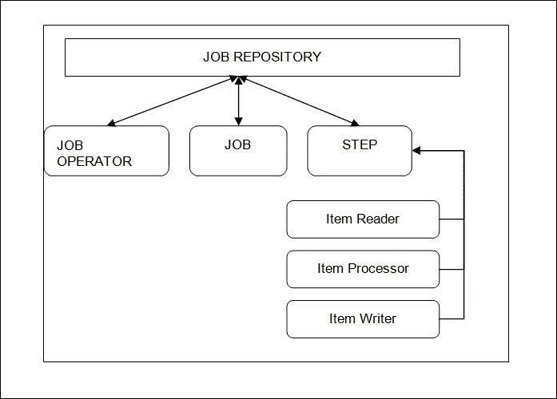

# 第四章：使用 Spring Batch 的作业

企业应用程序通常需要通过应用复杂的业务规则来处理大量信息。一些应用程序需要自动运行作业并提供大量数据作为进一步处理的输入。这些功能总是基于时间的作业，不需要任何用户干预。批处理广泛应用于银行和保险领域，在那里大量数据在预定时间进行处理。一个**作业**是一个过程，而**批处理作业**意味着一组进程，它们在预定时间运行以执行任务。

# Spring Batch 简介

Spring Batch 本身是一个用于开发批处理作业的批处理框架。它支持批处理优化和作业分区，并且具有高度可扩展性，这促使我们在批处理应用程序的开发中考虑它。

## 使用 Spring Batch 的用例

让我们列举一些可以在应用程序中使用 Spring 批处理的用例：

+   在预定时间向用户发送批量邮件

+   从队列中读取消息

+   在给定时间更新交易

+   在给定时间处理用户接收到的所有文件

## 批处理处理的目标

批处理的主要目标是按顺序完成以下一系列步骤以完成批处理作业：

1.  查找作业。

1.  识别输入。

1.  调度作业。

1.  启动作业。

1.  处理作业。

1.  转到第 2 步（获取新输入）。

# 批处理作业的架构

让我们描述一下批处理处理器的基本架构；我们还可以看到批处理处理中涉及的组件。从下图中，您可以找出 Spring Batch 的主要组件：



现在让我们逐个查看组件。

+   `JobRepository`：这个容器是我们需要注册作业或进程的地方。

+   `JobOperator`：这是触发已注册作业的对象。它还提供了访问注册的 API。这是一个接口。

+   `Job`：它是`jobRepository`中的一个进程或任务。这包括一个以上的步骤。

+   `Step`：实际上包含需要执行的逻辑。每个步骤包括一个`ItemReader`，`ItemProcessor`和`ItemWriter`接口。首先，`ItemReader`接口一次读取一个步骤的作业并将其传递给`ItemProcessor`进行处理。例如，它可能收集一些所需的数据。然后，`ItemWriter`接口将数据写入数据库，或者执行事务或记录消息。有两种类型的步骤：

+   `ChunkStyle`：`ChunkStyle`步骤具有一个`ItemReader`，一个`ItemProcessor`和一个`ItemWriter`。

+   `BatchLet`：在 Spring 中，`BatchLet`被称为`TaskLetStep`。`BatchLet`是一个自定义步骤，可用于发送批量邮件或短信。

现在我们知道了批处理的基础知识，在下一节中我们将看到如何实现或使用批处理。

## 使用企业批处理

我们有以下两种实现批处理的选项：

+   使用 JVM 并为每个作业运行启动 JVM

+   在 J2EE 容器中部署批处理作业管理应用程序

JSR-352 是可用于实现批处理的标准规范。Spring 框架在很大程度上支持这个规范。大多数 JEE 容器，如**Glassfish**，**Jboss- JMX**和 Web Sphere 都支持 JSR-352 规范。作为开发人员，我们可以选择 Spring 框架并在 J2EE 容器上部署批处理。

您还可以使用 restful API 将数据池化到批处理应用程序中并从中取出。在下一节中，让我们使用 Spring Batch 框架创建一个作业。我们首先来看一下依赖关系。

# Spring Batch 的依赖项

要开始使用 Spring Batch，我们需要查看依赖关系。假设用户熟悉 Maven 应用程序，我们可以查看需要添加到`pom.xml`文件中以使用 Spring Batch 的以下依赖项：

```java
<dependency>
  <groupId>org.springframework.batch</groupId>
  <artifactId>spring-batch-core</artifactId>
  <version>3.0.0.RELEASE</version>
</dependency>
<dependency>
  <groupId>org.springframework</groupId>
  <artifactId>spring-core</artifactId>
  <version>${spring.version}</version>
</dependency>

<dependency>
  <groupId>org.springframework</groupId>
  <artifactId>spring-context</artifactId>
  <version>${spring.version}</version>
</dependency>
```

## Spring Batch 的关键组件

你可以看到，Spring Batch 的关键组件与 Java 中的批处理的 JSR 规范非常相似。

+   `JobRepository`：这又是一个作业的存储库。但是，在 Spring Batch 框架中，核心 API 有`JobRepository`。它为`JobLauncher`、`JobReader`、`ItemProcessor`和`ItemWriter`提供`create`、`update`、`read`和`delete`方法。在 Spring 框架中负责`JobRepository`的类是`SimpleJobRepository`。有两种存储作业的方式：一种是在数据库中，另一种是在内存中（这将不得不使用`HashMaps`）。

`SimpleJobRepositoryConstructor`看起来像这样：

```java
public SimpleJobRepository(JobInstanceDao jobInstanceDao,
  JobExecutionDao jobExecutionDao,
  StepExecutionDao stepExecutionDao,
  ExecutionContextDao ecDao) 
```

+   `JobLauncher`：`JobLauncher`只是一个用于启动作业的简单接口。作业在`jobRepository`中注册。

```java
public interface JobLauncher {
  public JobExecution run(Job job, JobParameters jobParameters)
  throws JobExecutionAlreadyRunningException, JobRestartException;
}
```

`SimpleJobLauncher`类实现了`JobLauncher`接口。这个类有一个`setJobRepository`方法。

```java
public void setJobRepository(JobRepository jobRepository)
```

+   `ItemReader`：它是`org.springframework.batch.item`包中的一个接口。ItemReader 用于提供数据。数据可以来自数据库、XML 或平面文件。

实现类预计是有状态的，并且将在每个批次中被多次调用，每次调用`read()`都会返回一个不同的值，最终在所有输入数据耗尽时返回 null。实现类不需要是线程安全的，`ItemReader`接口的客户端需要意识到这一点。

```java
public interface ItemReader<T> {
  T read() throws Exception, UnexpectedInputException, ParseException;
}
```

+   `ItemProcessor`：这是一个用于处理数据并进行中间处理的接口。在交给`ItemWriter`之前，`ItemProcessor`可以用于实现某些业务逻辑。

```java
public interface ItemProcessor<I, O> {
  O process(I item) throws Exception;
}
public class ProductBean {}

public class RelatedProductsBean {
  public RelatedProductsBean(ProductBean productBean) {}
}
public class ProductBeanProcessor implements ItemProcessor<ProductBean, RelatedProductsBean >{
  public RelatedProductsBean process(ProductBean productBean) throws Exception {
    //Perform simple transformation, convert a ProductBean to a RelatedProductsBean
    return new RelatedProductsBean(productBean);
  }
}
public class ProductBeanWriter implements ItemWriter<ProductBean>{
  public void write(List<? extends ProductBean> productBeans) throws Exception {
    //write productBeans
  }
}
```

假设`ItemReader`接口提供了一个类型为`ProductBean`的类，这个类需要在写出之前转换为类型`RelatedProductsBean`。可以编写一个`ItemProcessor`来执行转换。在这个非常简单的例子中，有一个`ProductBean`类，一个`RelatedProductsBean`类，以及一个符合`ItemProcessor`接口的`ProductBeanProcessor`类。转换很简单，但任何类型的转换都可以在这里完成。`RelatedProductsBean`写入程序将用于写出`RelatedProductsBean`对象，如果提供了任何其他类型的对象，则会抛出异常。同样，如果提供的不是`ProductBean`，`ProductBeanProcessor`也会抛出异常。

`ProductBeanProcessor`然后可以被注入到一个步骤中：

```java
<job id="ioSampleJob">
  <step name="step1">
  <tasklet>
  <chunk reader="ProductReader" processor="ProductProcessor" writer="RelatedProductsWriter" commit-interval="2"/>
  </tasklet>
  </step>
</job>
```

+   `Item Writer`：这是一个接口，这里是它经常使用的实现类。

`write`方法定义了`ItemWriter`接口的最基本契约。只要它是打开的，它将尝试写出传入的项目列表。由于预期项目将被批处理到一起形成一个块，然后给出输出，接口接受项目列表而不是单独的项目。一旦项目被写出，可以在从`write`方法返回之前执行任何必要的刷新。例如，如果写入到 Hibernate DAO，可以进行多次对`write`的调用，每次对应一个项目。

然后写入程序可以在返回之前关闭 hibernate 会话。

这是`ItemWriter`的一个经常使用的实现：

+   `FlatFileItemWriter`：这将数据写入文件或流。它使用缓冲写入程序来提高性能。

```java
StaxEventItemWriter: This is an implementation of ItemWriter that uses StAX and Marshaller for serializing objects to XML.
```

# 开发一个样本批处理应用

现在我们已经介绍了批处理的基础知识和 Spring Batch 的组件，让我们开发一个简单的例子，在这个例子中，以`$$`开头的名称被识别为非素食食品，以`##`开头的名称被识别为素食食品。不以这两个字符开头的名称需要被忽略。我们的作业必须生成一个 HTML 字符串，对于非素食食谱使用红色字体颜色，对于素食食谱使用绿色字体颜色。

您需要创建一个名为`recipeMarker`的 Maven 项目，并添加先前提到的依赖项。还要添加所有 Spring Framework 核心依赖项。我们将在`context.xml`文件上工作。我们需要配置作业存储库和作业启动器。

看看`applicationContext.xml`文件：

```java
<?xml version="1.0" encoding="UTF-8"?>
<beans 

  xsi:schemaLocation="http://www.springframework.org/schema/beans http://www.springframework.org/schema/beans/spring-beans-2.5.xsd
  http://www.springframework.org/schema/context http://www.springframework.org/schema/context/spring-context-2.5.xsd">
  <bean id="transactionManager" class="org.springframework.batch.support.transaction.ResourcelessTransactionManager"/>
  <bean id="jobLauncher" class="org.springframework.batch.core.launch.support.SimpleJobLauncher">
    <property name="jobRepository" ref="jobRepository"/>
  </bean>
  <bean id="jobRepository" class="org.springframework.batch.core.repository.support.MapJobRepositoryFactoryBean">
    <property name="transactionManager" ref="transactionManager"/>
  </bean>
  <bean id="simpleJob" class="org.springframework.batch.core.job.SimpleJob" abstract="true">
    <property name="jobRepository" ref="jobRepository" />
  </bean>
</beans>
```

您可以看到我们使用`MapJobRepositoryFactoryBean`来创建作业存储库。它是一个`FactoryBean`，可以使用非持久性的内存中的**数据访问对象**（**DAO**）实现自动创建`SimpleJobRepository`。该存储库实际上仅用于测试和快速原型设计。在这种设置中，您可能会发现`ResourcelessTransactionManager`很有用（只要您的业务逻辑不使用关系数据库）。它不适用于具有拆分的多线程作业，尽管在多线程步骤中使用应该是安全的。

接下来，我们将使用`ItemReader`和`ItemWriter`接口创建实现类。

1.  以下是`ItemReader`实现类。它在重写的`read()`方法中读取数据，该方法返回一个对象。

```java
package com.packt.batchjob;
import java.util.List;
import org.springframework.batch.item.ItemReader;
import org.springframework.batch.item.ParseException;
import org.springframework.batch.item.UnexpectedInputException;
public class CustomItemReader implements ItemReader {
  private int index = 0;
  private List<String> itemList;
  public Object read() throws Exception, UnexpectedInputException,
    ParseException {
    if (index < itemList.size()) {
      String str = itemList.get(index++);
      System.out.println("Read[ " + index + " ] = " + str);
      return str;
    } else {return null;}
  }
  public List<String> getItemList() {
    return itemList;
  }
  public void setItemList(List<String> itemList) {
    this.itemList = itemList;}
}
```

1.  在这里我们有`ItemProcessor`。它应用了将食谱列表标记为红色和绿色的逻辑。

```java
package com.packt.batchjob;
import org.springframework.batch.item.ItemProcessor;
public class CustomItemProcessor implements ItemProcessor {
  public Object process(Object arg0) throws Exception {
    String input = (String) arg0;
    if (input.contains("$$")) {
      input = input.substring(3, input.length());
      input = "<font colour="red">(.Non-Veg)</font> " + input;
    } else if (input.contains("##")) {
    input = input.substring(3, input.length());
    input = "<font colour="green">(.Veg)</font> " + input;
    } else
    return null;
    System.out.println("Process : " + input);
    return input;
  }
}
```

1.  最后，让我们编写实现类，从`ItemProcessor`中读取修改后的数据并写入。

```java
import java.util.List;
import org.springframework.batch.item.ItemWriter;
public class CustomItemWriter implements ItemWriter {
  public void write(List arg0) throws Exception {
    System.out.println("Write   : " + arg0 + "\n");
  }
}
```

在下一步中，我们将`ItemReader`，`ItemProcessor`和`ItemWriter`组合成一个作业。

让我们创建一个`itemreaderprocessorwriter.xml`文件。我们将在 XML 文件中传递食谱列表。我们已经包含了`applicationContext.xml`文件。已定义提交间隔，以表示写入两个元素后写入器应该提交。您还可以观察到步骤包括`reader`，`writer`和`jobRepository`。

```java
<?xml version="1.0" encoding="UTF-8"?>
<beans 

  xsi:schemaLocation="http://www.springframework.org/schema/beans
  http://www.springframework.org/schema/beans/spring-beans-2.5.xsd
  http://www.springframework.org/schema/context
  http://www.springframework.org/schema/context/spring-context-2.5.xsd">
  <import resource="applicationContext.xml"/>
  <bean id="customReader" class="com.packt.batchjob.CustomItemReader" >
    <property name="itemList" >
    <list>
    <value>$$Chicken65</value>
    <value>$$ChickenTikkaMasala</value>
    <value>$$GingerChicken</value>
    <value>$$GarlicChicken</value>
    <value>##Dal Makani</value>
    <value>##Stuffed Capsicum</value>
    <value>##Bendi Fry</value>
    <value>##Alo Bartha</value>
    </list>
    </property>
  </bean>
  <bean id="customProcessor" class="com.packt.batchjob.CustomItemProcessor" />
  <bean id="customWriter" class="com.packt.batchjob.CustomItemWriter" />    
  <bean id="simpleStep" class="org.springframework.batch.core.step.item.SimpleStepFactoryBean">
    <property name="transactionManager" ref="transactionManager" />
    <property name="jobRepository" ref="jobRepository" />
    <property name="itemReader" ref="customReader"/>
    <property name="itemProcessor" ref="customProcessor"/>
    <property name="itemWriter" ref="customWriter"/>
    <property name="commitInterval" value="2" />
  </bean>
  <bean id="readerWriterJob" parent="simpleJob">
    <property name="steps">
    <list>
    <ref bean="simpleStep"/>
    </list>
    </property>
  </bean>
</beans>
```

下一步是使用 Spring Batch 框架提供的命令行界面启动作业。

```java
D:\SpringBatch\receipeMarker>java -classpath "lib\*;src"
org.springframework.batch.core.launch.support.CommandLineJobRunner
  itemReaderWriter.xml readerWriterJob
```

让我们创建一个名为`itemreaderprocessorwriter.xml`的文件。我们将在 XML 文件中传递食谱列表。我们已经包含了`applicationContext.xml`文件。已定义提交间隔，以表示写入两个元素后写入器应该提交。您还可以观察到步骤包括`reader`，`writer`和`jobRepository`。

```java
OUTPUT:
Read[ 1 ] = $$Chicken65
Read[ 2 ] = $$ChickenTikkaMasala
Process : "<font colour="red">(.Non-Veg)</font> $$Chicken65
Process : "<font colour="red">(.Non-Veg)</font>$$ChickenTikkaMasala
Write   : [<font colour="red">(.Non-Veg)</font>$$Chicken65 , <font colour="red">(.Non-Veg)</font> $$ChickenTikkaMasala
Read[ 3 ] = $$GingerChicken
Read[ 4 ] = $$GarlicChicken
Process : "<font colour="red">(.Non-Veg)</font> $$GingerChicken
Process : "<font colour="red">(.Non-Veg)</font>$$GarlicChicken
Write   : [<font colour="red">(.Non-Veg)</font>$$GingerChicken , <font colour="red">(.Non-Veg)</font> $$GarlicChicken
Read[ 5 ] = ##Dal Makani
Read[ 6 ] = ##Stuffed Capsicum
Process : "<font colour="green">(. Veg)</font> ##Dal Makani
Process : "<font colour=" green ">(.Non-Veg)</font>##Stuffed Capsicum
Write   : [<font colour=" green ">(.Veg)</font>##Dal Makani , <font colour=" green ">(. Veg)</font> ##Stuffed Capsicum
Read[ 7 ] = ##Bendi Fry
Read[ 8 ] = ##Alo Bartha
Process : "<font colour=" green ">(. Veg)</font> ##Bendi Fry
Process : "<font colour=" green ">(. Veg)</font>##Alo Bartha
Write   : <font colour=" green ">(. Veg)</font>##Bendi Fry , <font colour="red">(.Non-Veg)</font> ##Alo Bartha
```

## 使用 Tasklet 接口创建示例批处理应用程序

让我们创建另一个在命令行上运行的批处理应用程序。该批处理应用程序打印消息。我们已经在本章开头讨论了 Tasklet。作业由步骤组成，步骤可以是两种类型之一：块样式步骤和 Tasklet。

在本示例中，我们使用`Tasklet`接口。在 Spring Batch 中，`Tasklet`是一个接口，用于执行单个任务，例如在步骤执行之前或之后清理或设置资源。该接口带有一个名为`executeStatus`的方法，应该由实现它的类重写。

```java
RepeatStatus execute(StepContribution contribution,
                     ChunkContext chunkContext)
              throws java.lang.Exception
RepeatStatus: CONTINUABLE and FINISHED
```

在以下示例中，`TaskLetImpl`实现了`Tasklet`接口。我们还在配置文件中使用了`TaskLetStep`类来配置`JobRepository`。公共类`TaskletStep`扩展了`AbstractStep`。

`TaskletStep`是执行步骤的`Tasklet`的简单实现，可能是重复的，并且每次调用都被事务包围。因此，结构是一个循环，循环内有事务边界。循环由步骤操作（`setStepOperations(RepeatOperations)`）控制。

客户端可以在步骤操作中使用拦截器来拦截或监听步骤范围的迭代，例如在步骤完成时获取回调。那些希望在单个任务级别获得回调的人可以为块操作指定拦截器。

让我们通过以下图表了解流程：

![使用 Tasklet 接口创建示例批处理应用程序

让我们创建一个名为`Chapter4-SpringBatchCommandLine`的简单 Java 批处理应用程序项目

1.  为`Chapter4-SpringBatchCommandLine`创建一个 Maven 文件夹结构，如下所示：

+   `src`/`main`/`java`

+   `src`/`main`/`resources`

+   `src`/`pom.xml`

1.  创建一个名为`com.packt.example`的包。

1.  创建一个名为`TaskletImpl`的类。这个类实现了`Tasklet`接口并重写了`execute()`方法。

```java
import org.springframework.batch.core.step.tasklet.Tasklet;
import org.springframework.batch.repeat.ExitStatus;
public class TaskletImpl implements Tasklet{
  private String message;
  public void setMessage(String message) {
    this.message = message;
  }
  public ExitStatus execute() throws Exception {
    System.out.print(message);
    return ExitStatus.FINISHED;
  }
}
```

1.  配置`simpleJob.xml`文件。

1.  将此文件放入`resources`文件夹中。

1.  您可以看到我们创建了`TaskletImpl`类的三个实例：`object1`，`object2`和`object3`。

1.  在每个实例中，我们设置了消息属性。我们将对象实例传递给`TaskletStep`。

```java
<?xml version="1.0" encoding="UTF-8"?>
<beans 

  xsi:schemaLocation="http://www.springframework.org/schema/beans
  http://www.springframework.org/schema/beans/spring-beans-4.0.xsd">
  <import resource="applicationContext.xml"/>

  <bean id="object1" class="com.packt.example.TaskletImpl">
    <property name="message" value="Dad not well"/>
  </bean>

  <bean id="object2" class="com.packt.example.TaskletImpl">
    <property name="message" value="Call the doctor"/>
  </bean>

  <bean id="object3" class="com.packt.example.TaskletImpl">
    <property name="message" value="He is sweating"/>
  </bean>

  <bean id="taskletStep" abstract="true" class="org.springframework.batch.core.step.tasklet.TaskletStep">
    <property name="jobRepository" ref="jobRepository"/>
  </bean>

  <bean id="simpleJob" class="org.springframework.batch.core.job.SimpleJob">
    <property name="name" value="simpleJob" />
    <property name="steps">
    <list>
    <bean parent="taskletStep">
    <property name="tasklet" ref="object1"/>
    </bean>
    <bean parent="taskletStep">
    <property name="tasklet" ref="object2"/>
    </bean>
    <bean parent="taskletStep">
    <property name="tasklet" ref="object3"/>
    </bean>
    </list>
    </property>
    <property name="jobRepository" ref="jobRepository"/>
  </bean>
</beans>
```

1.  配置`jobLauncher`和`JobRepository`。

```java
  <bean id="jobLauncher" class="org.springframework.batch.core.launch.support.SimpleJobLauncher">
    <property name="jobRepository" ref="jobRepository"/>
  </bean>
  <bean id="jobRepository" class="org.springframework.batch.core.repository.support.SimpleJobRepository">
    <constructor-arg>
      <bean class="org.springframework.batch.core.repository.dao.MapJobInstanceDao"/>
    </constructor-arg>
    <constructor-arg>
      <bean class="org.springframework.batch.core.repository.dao.MapJobExecutionDao" />
    </constructor-arg>
    <constructor-arg>
      <bean class="org.springframework.batch.core.repository.dao.MapStepExecutionDao"/>
    </constructor-arg>
  </bean>
```

1.  您可以使用 MVN Compile 运行项目，如下所示：

```java
mvn clean compile exec:java -Dexec.mainClass=org.springframework.batch.core.launch.support.CommandLineJobRunner -Dexec.args="simpleJob.xml simpleJob"
OUTPUT:
Dad not well
Call the Doctor
He is sweating

```

## 使用 Spring Batch 读取 CSV 文件

让我们创建另一个批处理应用程序，从目录中读取 CSV 文件，并使用`commandlinerunner`运行作业。输出再次是一个 CSV 文件，将在`output`文件夹中可用。

这个例子是关于展示 Spring Batch 框架中可用的`ItemWriter`和`ItemReader`实现的各种选项。我们在这里使用了 Spring Framework 中可用的`flatFileItemReader`和`flatFileItemWriter`实现。

我们将从应用程序开发开始，看看这些`ItemReader`实现类是如何使用的。

1.  使用 Maven 创建一个名为`SpringBatchCommandLine-Chapter4Example2`的 Spring Java 应用程序。

1.  创建一个领域类`Employee`，具有两个实例变量`empId`和`name`，以及 getter 和 setter：

```java
package com.packt;
public class Employee {

  int empId;
  String name;
  public int getEmpId() {
    return empId;
  }
  public void setEmpId(int empId) {
    this.empId = empId;
  }
  public String getName() {
    return name;
  }
  public void setName(String name) {
    this.name = name;
  }
}
```

1.  使用`ItemWriter`接口并实现一个`CustomeItemWriter`类。这个类重写了`ItemWriter`接口中定义的`write`方法。

1.  您将观察到`write`方法接受`List`作为输入。在`write`方法中，我们只是解析列表并将列表索引值强制转换为`Employee`对象并打印它。

```java
package com.packt;
import java.util.List;
import org.springframework.batch.item.ItemWriter;
public class CustomItemWriter<T> implements ItemWriter<T> {
  @Override
  public void write(List<? extends T> items) throws Exception {
    for (int i = 0; items.size() > i; i++) {
      Employee obj = (Employee) items.get(i);
      System.out.println(obj.getEmpId() + ":" + obj.getName());
    }

  }

}
```

1.  创建一个带有`public static void main()`和`jobrun()`方法的`Main`类：

```java
public class Main {
  public static void main(String[] args) {
    Main obj = new Main();
    obj.run();
  }

  private void run() {
    /*config files are present in the resource folder*/
    String[] springConfig = { "spring/batch/config/context.xml", "spring/batch/jobs/job-read-files.xml" };

    ApplicationContext context = new ClassPathXmlApplicationContext(springConfig);

    JobLauncher jobLauncher = (JobLauncher) context.getBean("jobLauncher");
    Job job = (Job) context.getBean("readMultiFileJob");
    try {
      JobExecution execution = jobLauncher.run(job, new JobParameters());
      System.out.println("Exit Status : " + execution.getStatus());
      System.out.println("Exit Status : " + execution.getAllFailureExceptions());

    } catch (Exception e) {
      e.printStackTrace();

    }

    System.out.println("COMPLETED");

  }
}
/*config files are present in the resource folder*/
```

1.  让我们在`context.xml`文件中将`bean id`设置为`JobRepository`：

```java
<bean id="jobRepository" class="org.springframework.batch.core.repository.support.MapJobRepositoryFactoryBean">
  <property name="transactionManager" ref="transactionManager" />
</bean>

<bean id="transactionManager" class="org.springframework.batch.support.transaction.ResourcelessTransactionManager" />

<bean id="jobLauncher" class="org.springframework.batch.core.launch.support.SimpleJobLauncher">
<property name="jobRepository" ref="jobRepository" />
</bean>

/*
```

`Job Read files.xml`文件位于资源文件夹`*/Job Read files.xml`中。

我们使用了`flatfileItemReader`和`FlatFileItemWriter`。这些类读取输入并在`output`文件夹中重新创建文件。

让我们看一下`FlatFileItemReader`的原型，并了解它在应用程序中的作用：

```java
public class FlatFileItemReader<T> extends AbstractItemCountingItemStreamItemReader<T>
implements ResourceAwareItemReaderItemStream<T>, org.springframework.beans.factory.InitializingBean
```

可重新启动的`ItemReader`从输入`setResource(Resource)`中读取行。一行由`setRecordSeparatorPolicy(RecordSeparatorPolicy)`定义，并使用`setLineMapper(LineMapper)`映射到一个项目。

如果在行映射期间抛出异常，则将其作为`FlatFileParseException`重新抛出，并添加有关有问题的行及其行号的信息。

```java
public class FlatFileItemWriter<T>
extends AbstractItemStreamItemWriter<T>
implements ResourceAwareItemWriterItemStream<T>, org.springframework.beans.factory.InitializingBean
```

这个类是一个将数据写入文件或流的项目写入器。写入器还提供了重新启动。输出文件的位置由资源定义，并且必须表示可写文件，并使用缓冲写入器以提高性能。该实现不是线程安全的。

在文件中，我们做了以下事情：

+   我们已经配置了名为`readMultiFileJob`的作业

+   我们必须观察到`tasklet`有一个步骤，该步骤配置了`ItemReader`和`ItemWriter`类

+   我们再次使用了`tasklet`，但我们使用了步骤作为一个接受`MultiResourceReader`的`chunk`读取器

为了理解`MultiResourceReader`，我们将看一下原型：

```java
public class MultiResourceItemReader<T>extends AbstractItemStreamItemReader<T>
```

`MultiResourceReader`从多个资源中顺序读取项目。资源列表由`setResources(Resource[])`给出，实际读取委托给`setDelegate(ResourceAwareItemReaderItemStream)`。输入资源使用`setComparator(Comparator)`进行排序，以确保在重新启动场景中作业运行之间保留资源排序。

现在，让我们看看`chunk`类型的步骤是什么。在一个`chunk`中，读取器和写入器是必需的！但是，`ItemProcessor`是可选的。

```java
<import resource="../config/context.xml"/>
  <bean id="employee" class="com.packt.Employee" />
  <job id="readMultiFileJob" >

    <step id="step1">
    <tasklet>
    <chunk reader="multiResourceReader" writer="flatFileItemWriter" commit-interval="1" />
    </tasklet>
    </step>

  </job>
<! --create folder structure in the project root csv/inputsand add the csv files-->
  <bean id="multiResourceReader"class=" org.springframework.batch.item.file.MultiResourceItemReader">
    <property name="resources" value="file:csv/inputs/employee-*.csv" /> 
    <property name="delegate" ref="flatFileItemReader" />
  </bean>

  <bean id="flatFileItemReader" class="org.springframework.batch.item.file.FlatFileItemReader">

    <property name="lineMapper">
    <bean class="org.springframework.batch.item.file.mapping.DefaultLineMapper">

      <property name="lineTokenizer">
      <bean class="org.springframework.batch.item.file.transform.DelimitedLineTokenizer">
        <property name="names" value="id, name" />
      </bean>
      </property>
      <property name="fieldSetMapper">
      <bean class="org.springframework.batch.item.file.mapping.BeanWrapperFieldSetMapper">
        <property name="prototypeBeanName" value="domain" />
      </bean>
      </property>
    </bean>
    </property>

  </bean>

  <bean id="flatFileItemWriter" class="org.springframework.batch.item.file.FlatFileItemWriter" >
    <!--create folder structure in the project root csv/outputs -->

    <property name="resource" value="file:csv/outputs/employee.all.csv" /> 
    <property name="appendAllowed" value="true" />
    <property name="lineAggregator">
    <bean class="org.springframework.batch.item.file.transform.DelimitedLineAggregator">
      <property name="delimiter" value="," />
      <property name="fieldExtractor">
      <bean class="org.springframework.batch.item.file.transform.BeanWrapperFieldExtractor">
        <property name="names" value="id, domain" />
      </bean>
      </property>
    </bean>
    </property>

  </bean> 
```

创建几个名为`employee*.csv`的 CSV 文件，用不同的数字替换`*`。每个文件将有两个值：`employeeId`和`name`。

CSV 文件中的分隔符也可以在 XML 中进行配置，如下所示：

```java
<bean class="org.springframework.batch.item.file.transform.DelimitedLineAggregator">
  <property name="delimiter" value="," />
  <property name="fieldExtractor">
  <bean class="org.springframework.batch.item.file.transform.BeanWrapperFieldExtractor">
    <property name="names" value="id, domain" />
  </bean>
  </property>
```

这些值将与**普通的 Java 对象**（**Pojo**）`Employee.java`进行映射，并且输出将被处理。文件位置作为输入传递给`MultiResourceItemReader`类。

在下一节中，我们将看到如何在 Spring 中安排批处理作业。

## 使用 Spring 调度程序的 Spring Batch

在本节中，让我们看看如何在 Spring Batch 框架中安排批处理。我们将看到如何配置调度程序。这是一个示例的`jobproduct.xml`文件，需要在类路径中可用。如果您正在使用 Maven 项目，请将其放在资源文件夹中。您需要使用间隔和方法名`run()`来注入`joblauncher`以在预定时间运行作业。

要使用调度程序，我们需要配置`job-product.xml`文件。该文件也用于在下一节中配置外部调度程序的调度程序详细信息。

安排每 600 秒间隔运行任务：

```java
<task:scheduled-tasks>
  <task:scheduled ref="MyJobScheduler" method="run" cron="*/600 * * * * *" />
</task:scheduled-tasks>
```

让我们在`MyJobScheduler.class`中使用`@Component`和`@Autowired`注解。

```java
@Component
public class MyJobScheduler {
  @Autowired
  private JobLauncher jobLauncher;
  @Autowired
  private Job job;
  public void run() {
    try {
      String dateParam = new Date().toString();
      JobParameters param = new JobParametersBuilder().addString("date", dateParam).toJobParameters();
      JobExecution execution = jobLauncher.run(job, param);
      System.out.println("Exit Status  of the Job: " + execution.getStatus());

    } catch (Exception e) {
    e.printStackTrace();
    }

  }
}
```

## 使用 Quartz 调度程序配置 Spring Batch

Spring Batch 框架提供了将外部调度程序配置到应用程序中的选项。

让我们将 Quartz 调度程序集成到 Spring Batch 应用程序中。Quartz 是一个开源的基于 Java 的调度程序。我们将使该应用程序读取一个文件，但我们将集成 Quartz 调度程序来进行调度。

1.  创建一个名为`SpringBatchQuartzExample`的简单 Maven 应用程序。

1.  使用与之前应用程序相同的`pom.xml`文件。

1.  在`pom.xml`文件的依赖项中添加 Quartz JAR 文件。

1.  添加这些属性：

```java
<quartz.version>1.8.6</quartz.version>
```

1.  然后，添加这些依赖项：

```java
<dependency>
  <groupId>org.quartz-scheduler</groupId>
  <artifactId>quartz</artifactId>
  <version>${quartz.version}</version>
</dependency>
```

让我们创建一个名为`quartz-job.xml`的文件。这应该存在于 Maven 项目的资源文件夹中。要配置批处理每分钟运行一次，使用以下代码中的配置：

```java
<bean class="org.springframework.scheduling.quartz.SchedulerFactoryBean">
  <property name="triggers">
  <bean id="cronTrigger" class="org.springframework.scheduling.quartz.CronTriggerBean">
  <property name="jobDetail" ref="jobDetail" />
  <property name="cronExpression" value="*/60 * * * * ?" />
  </bean>
  </property>
</bean>
```

要将 Spring Batch 与 Quartz 调度程序集成，使用以下代码：

```java
<bean id="jobDetailBean" class="org.springframework.scheduling.quartz.JobDetailBean">
  <property name=" jobQuartzLauncherDetails " value="com.packt.quartz.JobQuartzLauncherDetails" />
  <property name="group" value="quartz-batch" />
  <property name="jobDataAsMap">
  <map>
    <entry key="jobName" value="reportJob" />
    <entry key="jobLocator" value-ref="jobRegistry" />
    <entry key="jobLauncher" value-ref="jobLauncher" />
    <entry key="param1" value="anjana" />
    <entry key="param2" value="raghu" />
  </map>
  </property>
</bean>
```

`JobQuartzLauncherDetails`是一个扩展`QuartzJobBean`的 bean。

### 提示

`QuartzJobBean`位于`org.springframework.scheduling.quartz.QuartzJobBean`包中。

该类具有`JobLauncher`和`JobLocator`的 setter：

```java
public class JobQuartzLauncherDetails extends QuartzJobBean {
  static final String JOB_NAME = "jobName";
  private JobLocator jobLocator;
  private JobLauncher jobLauncher;
  public void setJobLocator(JobLocator jobLocator) {
    this.jobLocator = jobLocator;
  }
  public void setJobLauncher(JobLauncher jobLauncher) {
    this.jobLauncher = jobLauncher;
  }
```

为了从配置中读取`JobMapDetails`，我们创建了另一个方法，如下所示。我们可以看到，基于从地图中读取的值，这里处理了不同的数据类型，并创建了`JobParametersBuilder`。

```java
private JobParameters getJobParametersFromJobMap(Map<String, Object> jobDataMap) {
  JobParametersBuilder builder = new JobParametersBuilder();
  for (Entry<String, Object> entry : jobDataMap.entrySet()) {
    String key = entry.getKey();
    Object value = entry.getValue();
    if (value instanceof String && !key.equals(JOB_NAME)) {
      builder.addString(key, (String) value);
    } else if (value instanceof Float || value instanceof Double){
      builder.addDouble(key, ((Number) value).doubleValue());
    } else if (value instanceof Integer || value instanceof Long){
      builder.addLong(key, ((Number) value).longValue());
    } else if (value instanceof Date) {
      builder.addDate(key, (Date) value);
    } else {

    }
  }

  builder.addDate("run date", new Date());
  return builder.toJobParameters();
}
```

正如我们所知，`JobName`和`JobParamters`是`JobLauncher`运行作业所需的输入。在前面的代码片段中，我们已经得到了`JobParameters`。接下来，我们将使用以下代码片段使用`JobExecutionContext`获取`JobName`：

```java
protected void executeInternal(JobExecutionContext context) {
  Map<String, Object> jobDataMap = context.getMergedJobDataMap();
  String jobName = (String) jobDataMap.get(JOB_NAME);
  JobParameters jobParameters = getJobParametersFromJobMap(jobDataMap);

  try {
    jobLauncher.run(jobLocator.getJob(jobName), jobParameters);
  } catch (JobExecutionException e) {
    e.printStackTrace();
  }
}
```

`Product.java`是一个领域类，将其映射到`.csv`文件中的值。

```java
public class Product {
  private int id;
  private String name;
  public int getId() {
    return id;
  }
  public void setId(int id) {
    this.id = id;
  }
  public String getName() {
    return name;
  }
  public void setName(String name) {
    name = name;
  }
  @Override
  public String toString() {
    return "Product [id=" + id + ", name=" + name + "]";
  }
}
```

`CustomeItemWriter`的代码如下，用于写入产品 Pojo 对象的值。

```java
public class CustomItemWriter implements ItemWriter<Product> {
  @Override
  public void write(List<? extends Product> items) throws Exception {
    System.out.println("writer..." + items.size());
    for(Product item : items){
      System.out.println(item);
    }
  }
}
```

接下来，让我们创建`Main`类来加载`job-quartz.xml`文件，并且每 60 秒运行一次批处理作业，以使用`CustomItemWriter`读取 CSV 文件并写入。

```java
import org.springframework.context.ApplicationContext;
import org.springframework.context.support.ClassPathXmlApplicationContext;
public class Main {
  public static void main(String[] args) {
    String springConfig = "spring/batch/jobs/job-quartz.xml";
    ApplicationContext context = new ClassPathXmlApplicationContext(springConfig);
  }
}
```

Spring Batch 框架使用 Quartz 调度程序来运行批处理作业，读取文件，将 CSV 值映射到产品 Pojo，并使用`CustomeItemWriter`进行写入。

在下一节中，让我们创建一个批处理作业，读取一个文件并更新数据库。

## 使用 Spring Batch 读取文件并更新 MongoDB 数据库

在这一部分，让我们创建一个批处理作业，读取一个 XML 文件并将其写入 MongoDB 数据库。想象一种情况，我们不断从一个来源获取一个 XML 文件，并且需要将该文件读取并更新到数据库中。

1.  XML 文件结构如下所示：

```java
<?xml version="1.0" encoding="UTF-8" ?>
<Products>
  <product id="1">
    <categoryId>3</categoryId>
    <brandId>1</brandId>
    <name>computer</name>
    <price>15000</price>
  </product>
  <product id="2">
  <categoryId>4</categoryId>
  <brandId>1</brandId>
  <name>mouse</name>
  <price>250</price>
  </record>
  </ product>
  < product id="3">
    <categoryId>5</categoryId>
    <brandId>1</brandId>
    <name>mouse</name>
    <price>23000</price>
  </ product>
</Products>
```

1.  创建一个基于 Maven 的 Java 项目。在`com.packt.model`包中，添加相应的产品 Pojo。

```java
public class Product {
  private int id;
  private int categoryId;
  private int brandId;
  private String name;
  private int price;
  public int getId() {
    return id;
  }
  public void setId(int id) {
    this.id = id;
  }
  public int getCategoryId() {
    return categoryId;
  }
  public void setCategoryId(int categoryId) {
    this.categoryId = categoryId;
  }
  public int getBrandId() {
    return brandId;
  }
  public void setBrandId(int brandId) {
    this.brandId = brandId;
  }
  public String getName() {
    return name;
  }
  public void setName(String name) {
    this.name = name;
  }
  public int getPrice() {
    return price;
  }
  public void setPrice(int price) {
    this.price = price;
  }

}
```

1.  添加与上一节中显示的相同的依赖项。

1.  更新`pom.xml`文件。

1.  添加 ORM 和 MongoDB 数据库依赖项：

```java
<dependency>
  <groupId>org.springframework</groupId>
  <artifactId>spring-oxm</artifactId>
  <version>${spring.version}</version>
</dependency>
<dependency>
  <groupId>org.mongodb</groupId>
  <artifactId>mongo-java-driver</artifactId>
  <version>${mongodb.driver.version}</version>
</dependency>

  <!-- Spring data mongodb -->
<dependency>
  <groupId>org.springframework.data</groupId>
  <artifactId>spring-data-mongodb</artifactId>
  <version>${spring.data.version}</version>
</dependency>
```

1.  创建一个名为`mongodatabase.xml`的文件，并向其中添加以下配置：

```java
  <mongo:mongo host="127.0.0.1" port="27017" />
  <mongo:db-factory dbname="eshopdb" />

  <bean id="mongoTemplate" class="org.springframework.data.mongodb.core.MongoTemplate">
  <constructor-arg name="mongoDbFactory" ref="mongoDbFactory" />
  </bean>
```

1.  将以下配置添加到`job-product.xml`文件中。

+   `StaxEventItemReader`：这是一个读取`products.xml`文件的类。我们需要为这个类提供`rootElemenent`名称。

+   `fragmentRootElementName`：此属性接受提供的 XML 文件中的根元素的字符串参数。

我们还需要将 XML 文件名作为值提供给资源属性。需要传递的第三个属性是`unmarshaller`引用。这个类在 Spring OXM 框架中可用于对 XML 文件进行编组和取消编组。

```java
<bean id="xmlItemReader" class="org.springframework.batch.item.xml.StaxEventItemReader">
  <property name="fragmentRootElementName" value="product" />
  <property name="resource" value="classpath:xml/product.xml" />
  <property name="unmarshaller" ref="productUnmarshaller" />
</bean>
```

`XstreamMarshaller`接受三个属性来执行取消编组过程。它接受一个带有条目键和产品 Pojo 作为值的映射，以便在 XML 中，每个产品记录都被转换为`Product`对象并存储在映射中。第二个属性再次是一个创建的 bean，用于将 XML 转换为 POJO。这个名字叫`ProductXMLConverter`。

```java
<bean id="productUnmarshaller" class="org.springframework.oxm.xstream.XStreamMarshaller">

  <property name="aliases">
  <util:map id="aliases">
  <entry key="product" value="com.packt.model.Product" />
  </util:map>
  </property>
  <property name="converters">
  <array>
  <ref bean="productXMLConverter" />
  </array>
  </property>
</bean>

<bean id="productXMLConverter" class="com.packt.converter. ProductXMLConverter>	
```

让我们看看`ProductXMLConverter`类。这个类实现了`converter`接口，该接口位于`com.thoughtworks.xstream.converters.converter`包中。该类覆盖了接口中定义的三个方法：

+   `public boolean canConvert(Class type)`

+   `public void marshal(Object source, HierarchicalStreamWriter writer, MarshallingContext context)`

+   `public Object unmarshal(HierarchicalStreamReader reader, UnmarshallingContext context)`

1.  由于我们将在这里执行取消编组，因此我们将清楚地实现`unmarshall`方法。

```java
@Override
public Object unmarshal(HierarchicalStreamReader reader, UnmarshallingContext context) {
  Product obj = new Product();
  obj.setId(Integer.valueOf(reader.getAttribute("id")));
  reader.moveDown(); //get id
  obj.setCategoryId(Integer.valueOf(reader.getAttribute("categoryId")));
  reader.moveDown(); //get categoryId
  obj.setBrandId(Integer.valueOf(reader.getAttribute("brandId")));
  reader.moveDown(); //get brandId
  obj.setName(String.valueOf(reader.getAttribute("name")));
  reader.moveDown(); //get name
  obj.setPrice(Integer.valueOf(reader.getAttribute("price")));
  reader.moveDown(); //get name
  return obj;
}
```

1.  在`job-product.xml`中配置`MongoDBItemWriter`以将 Pojo 对象写入 MongoDB 数据库：

```java
<bean id="mongodbItemWriter" class="org.springframework.batch.item.data.MongoItemWriter">
  <property name="template" ref="mongoTemplate" />
  <property name="collection" value="product" />
</bean>
```

1.  在`job-product.xml`文件中配置批处理作业：

```java
<batch:job id="productJob">
  <batch:step id="step1">
  <batch:tasklet>
  <batch:chunk reader="xmlItemReader" writer="mongodbItemWriter" commit-interval="1">
  </batch:chunk>
  </batch:tasklet>
  </batch:step>
</batch:job>
```

1.  编写`Main`类来运行批处理作业。

1.  在`Main`类中加载所有配置文件：

```java
public class Main {
  public static void main(String[] args) {
    String[] springConfig  = {"spring/batch/config/mongodatabase.xml", "spring/batch/config/context.xml", "spring/batch/jobs/job-product.xml" 
  };

  ApplicationContext context = new ClassPathXmlApplicationContext(springConfig);

  JobLauncher jobLauncher = (JobLauncher) context.getBean("jobLauncher");
  Job job = (Job) context.getBean("productJob");

  try {

    JobExecution execution = jobLauncher.run(job, new JobParameters());
    System.out.println("Exit Status of the ProductJOB: " + execution.getStatus());

    } catch (Exception e) {
      e.printStackTrace();
    }

    System.out.println("YES COMPLETED");

  }
}
```

因此，当我们运行`Main`类时，作业将被实例化，并且每 60 秒运行一次。作业将读取 XML 并将其转换为 Pojo `product.java`，然后将其插入到 MongoDB 数据库中。配置在 MongoDB 数据库 XML 文件中给出。

在下一节中，我们将看到如何创建一个多线程环境来处理多个作业。

## 使用 Spring Batch 和线程来分区作业

在 Spring 批处理过程中，一个线程按顺序处理请求。如果我们想要并行执行批处理作业，我们可以选择多线程环境。

想象一种情景，我们正在处理与`Employee` Pojo 映射的员工表中的 1000 条记录。我们需要一次读取 1000 条记录并写入 CSV 文件。

作业实际上被分成多个子作业，并且分配了一个单独的线程来处理每个子作业。因此，如果您有 1000 条记录需要读取，使用单个线程会花费更多时间。当我们将 1000 条记录分成 100 个子记录时，我们可以使用同时运行的 10 个不同线程来处理它们。

我们可以通过实现`Partitioner`接口来创建一个简单的分区器类。这个分区器将 1000 个作业分成 100 个子作业。您将观察到我们在分区范围中提供了`start_range`和`end_range`变量。

```java
public class MyJobPartioner implements Partitioner {
  @Override
  public Map<String, ExecutionContext> partition(int gridSize) {
    Map<String, ExecutionContext> result = new HashMap<String, ExecutionContext>();
    int range = 100;
    int start_range = 1;
    int end_range = range;
    for (int i = 1; i <= gridSize; i++) {
      ExecutionContext execution_context = new ExecutionContext();
      System.out.println("\Name: Thread" + i+"start_range : " + start_range+"end_range", end_range);
      execution_context.putInt("start_range", start_range);
      execution_context.putInt("end_range", end_range);
      execution_context.putString("name", "Thread" + i);
      result.put("partition" + i, execution_context);
      start_range = end_range + 1;
      end_range += range;
    }
    return result;
  }

}
```

在`Partitioner`类中使用的`ExecutionContext`对象与`ItemStream`一起工作，并充当映射的包装器。在 Spring Batch 中，我们可以获得两种类型的执行上下文对象。一个执行对象在作业级别工作，另一个在步骤级别工作。作业级别执行上下文用于在步骤之间共享数据或信息。

让我们实现一个处理分区记录的`ItemProcess`类。还要注意，我们在下面的代码中使用了步骤执行上下文。该类覆盖了`process`方法。

1.  这个类用于分块处理数据。

```java
@Component("itemProcessor")
@Scope(value = "step")
public class EmployeeProcessor implements ItemProcessor<Employee, Employee> {
  @Value("#{stepExecutionContext[name]}")
  private String threadName;
  @Override
  public Employee process(Employee emp) throws Exception {
    System.out.println(threadName + " processing : " + emp.getId() + " : " + emp.getName());
    return emp;
  }
  public String getThreadName() {
    return threadName;
  }
  public void setThreadName(String threadName) {
    this.threadName = threadName;
  }

}
```

1.  让我们配置`job-partioner.xml`文件。

```java
<job id="partitionJob" >
  <step id="masterStep">
  <partition step="slave" partitioner="myJobPartioner">
  <handler grid-size="100" task-executor="taskExecutor" />
  </partition>
  </step>

</job>
<step id="slave" >
  <tasklet>
  <chunk reader="pagingItemReader" writer="flatFileItemWriter"
  processor="itemProcessor" commit-interval="1" />
  </tasklet>
</step>

<!—below is the configuration of MyJobPartioner bean-->

<bean id="myJobPartioner" class="com.packt.partition.MyJobPartioner" />
<bean id="taskExecutor" class="org.springframework.core.task.SimpleAsyncTaskExecutor" />

<!—below is the configuration of EmployeeProcesser bean-->

<bean id="itemProcessor" class="com.packt.processor.EmployeeProcessor" scope="step">
  <property name="threadName" value="#{stepExecutionContext[name]}" />
</bean>
```

接下来，让我们配置`pagingItemReader`，它的作用与分页相同。它每页获取 100 条记录；它还使用提供的 JDBC 信息连接到数据源，并执行查询以获取指定范围的记录。它还将根据`emp_id`列对数据进行排序。

```java
<bean id="pagingItemReader" class="org.springframework.batch.item.database.JdbcPagingItemReader"scope="step">
  <property name="dataSource" ref="dataSource" />
  <property name="queryProvider">
  <bean class="org.springframework.batch.item.database.support.SqlPagingQueryProviderFactoryBean">
    <property name="dataSource" ref="dataSource" />
    <property name="selectClause" value="select emp_id, emp_name, emp_pass, emp_salary" />
    <property name="fromClause" value="from users" />
    <property name="whereClause" value="where emp_id &gt;= :fromId and id &lt;= :toId" />
    <property name="sortKey" value="emp_id" />
  </bean>
  </property>
 <!-- Inject via the ExecutionContext in MyJobPartioner -->
  <property name="parameterValues">
  <map>
    <entry key="fromId" value="#{stepExecutionContext[start_range]}" />
    <entry key="toId" value="#{stepExecutionContext[end_range]}" />
  </map>
  </property>
  <property name="pageSize" value="100" />
  <property name="rowMapper">
  <bean class="com.packt.EmployeeRowMapper" />
  </property>
  </bean>

<!--After reading it writes to  csv file using FlatfileItemwriter class-->

  <bean id="flatFileItemWriter" class="org.springframework.batch.item.file.FlatFileItemWriter" scope="step" >
    <property name="resource"
    value="file:csv/outputs/employee.processed#{stepExecutionContext[fromId]}-#{stepExecutionContext[toId]}.csv" />
    <property name="appendAllowed" value="false" />
    <property name="lineAggregator">
    <bean class="org.springframework.batch.item.file.transform.DelimitedLineAggregator">
      <property name="delimiter" value="," />
      <property name="fieldExtractor">
      <bean class="org.springframework.batch.item.file.transform.BeanWrapperFieldExtractor">
        <property name="names" value="emp_id, emp_name, emp_pass, emp_salary" />
      </bean>
      </property>
    </bean>
    </property>
  </bean>
<!--Configuring FlatfileItemwriter class- ends-->
```

1.  让我们编写`Main`类，它将加载配置文件，然后运行作业。

```java
public class Main {
  public static void main(String[] args) {
    Main obj = new Main();
    obj.run();
  }
  private void run() {
    String[] springConfig = { "spring/batch/jobs/job-partitioner.xml" };
    ApplicationContext context = new ClassPathXmlApplicationContext(springConfig);
    JobLauncher jobLauncher = (JobLauncher) context.getBean("jobLauncher");
    Job job = (Job) context.getBean("partitionJob");
    try {
      JobExecution execution = jobLauncher.run(job, new JobParameters());
      System.out.println("Exit Status : " + execution.getStatus());
      System.out.println("Exit Status : " + execution.getAllFailureExceptions());
    } catch (Exception e) {
      e.printStackTrace();
    }
    System.out.println("COMPLETED");
  }

}
```

因此，通过前面的配置和类，将创建多个线程来处理每个线程的 100 条记录。记录从数据库中读取并写入 CSV 文件。

在下一节中，我们将使用 Spring Batch 的事件监听器。

# 使用监听器拦截 Spring Batch 作业

Spring Batch 带有监听器。它们拦截作业执行以执行某些任务。`StepListener`是以下提到的监听器的`super`类：

+   `SkipListener`：`SkipListener`最常见的用例之一是记录跳过的项目，以便可以使用另一个批处理过程或甚至人工过程来评估和修复导致跳过的问题。因为有许多情况下原始事务可能被回滚，Spring Batch 提供了两个保证：

+   适当的`skip`方法（取决于错误发生的时间）每个项目只会被调用一次。

+   `SkipListener`将在事务提交之前始终被调用。这是为了确保监听器调用的任何事务资源不会因`ItemWriter`内部的失败而被回滚。

+   `ChunkListener`：这些监听器可以配置一个步骤，如果步骤是分块式步骤类型，它将同时具有`ItemReader`和`ItemWriter`。当`ItemReader`完成其读取任务时，监听器将通知`ItemWriter`。

```java
public interface ChunkListener extends StepListener {
  void beforeChunk();
  void afterChunk();
}
<step id="step1">
  <tasklet>
  <chunk reader="reader" writer="writer" commit-interval="10"/>
  <listeners>
    <listener ref="chunkListener"/>
  </listeners>
  </tasklet>
</step>
```

+   `ItemWriterListener`

+   `ItemReaderListener`

+   `ItemProcessListener`

+   `StepExecutionListener`：它代表步骤执行的最通用的监听器。它允许在步骤开始之前和结束之后通知，无论它是正常结束还是失败结束。

您将注意到为`ItemReader`、`ItemWriter`、`ItemProcess`和`StepExecution`接口和类配置了监听器。

现在我们可以看看如何在 spring `batch.xml`文件中配置监听器。请看：

1.  创建实现监听器并覆盖其方法的类。

```java
<bean id="packtStepListener" class="com.packt.listeners.PacktStepListener" />
<bean id="packtItemReaderListener" class="com.packt.listeners.PacktItemReaderListener" />
<bean id="packtItemWriterListener" class="com.packt.listeners.PacktItemWriterListener" />

<job id="readFileJob" >
  <step id="step1">
  <tasklet>
  <chunk reader="multiResourceReader" writer="flatFileItemWriter" commit-interval="1" />
  <listeners>
    <listener ref="packtStepListener" />
    <listener ref="packtItemReaderListener" />
    <listener ref="packtItemWriterListener" />
  </listeners>
  </tasklet>
  </step>
</job>
```

1.  让我们看看`PacktItemReaderListener`和`PacktItemWriterListner`监听器。`IteamReadListener`接口带有三个要实现的方法：

+   `beforeRead()`

+   `afterRead()`

+   `onReadError()`

```java
public class PacktItemReaderListener implements ItemReadListener<Product> {

  @Override
  public void beforeRead() {
    System.out.println("ItemReadListener - beforeRead");
  }

  @Override
  public void afterRead(Product product) {
    System.out.println("ItemReadListener - afterRead");
  }

  @Override
  public void onReadError(Exception ex) {
    System.out.println("ItemReadListener - onReadError");
  }

}
```

1.  接下来让我们看看`PackItemWriterListener`。`ItemWriter`接口带有三个`abstract`方法：

+   `beforeWrite`

+   `afterWrite`

+   `onWriteError`

```java
public class PacktItemWriterListener implements ItemWriteListener<Product> {
  @Override
  public void beforeWrite(List<? extends Product> products) {
    System.out.println("ItemWriteListener - beforeWrite");
  }
  @Override
  public void afterWrite(List<? extends Product> products) {
    System.out.println("ItemWriteListener - afterWrite");
  }
  @Override
  public void onWriteError(Exception exception, List<? extends Product> products) {
    System.out.println("ItemWriteListener - onWriteError");
  }
}
```

到目前为止，我们已经看到了如何在`spring-job`文件中创建自定义监听器和监听器配置。

现在，让我们尝试将其与读取目录中的多个文件并删除文件的情景集成。

1.  我们将再次考虑产品 Pojo，带有`id`和`name`作为实例变量，并带有 getter 和 setter。

```java
public class Product {
  int id;
  String name;
  public int getId() {
    return id;
  }
  public void setId(int id) {
    this.id = id;
  }
  public String getName() {
    return name;
  }
  public void setName(String Name) {
    this.name = name;
  }
}
```

1.  我们需要在 XML 中将 Pojo 定义为一个 bean。

```java
  <bean id="product" class="com.packt.Product" />
```

1.  接下来是文件删除任务类文件。在读取文件后，需要从目录中删除它们。

```java
<bean id="fileDeletingTasklet" class="com.packt.tasklet.FileDeletingTasklet" >
  <property name="directory" value="file:csv/inputs/" />
</bean>
```

1.  让我们来看一下`FileDeletingTasklet`类。这个类实现了`TaskLet`接口。这将根据指定的目录删除文件。

```java
public class FileDeletingTasklet implements Tasklet, InitializingBean {
  private Resource directory;
  @Override
  public void afterPropertiesSet() throws Exception {
    Assert.notNull(directory, "directory must be set");
  }

  @Override
  public RepeatStatus execute(StepContribution contribution, ChunkContext chunkContext) throws Exception {
    File dir = directory.getFile();
    Assert.state(dir.isDirectory());
    File[] files = dir.listFiles();
    for (int i = 0; i < files.length; i++) {
      boolean deleted = files[i].delete();
      if (!deleted) {
        throw new UnexpectedJobExecutionException("Could not delete file " + files[i].getPath());
      } else {
        System.out.println(files[i].getPath() + " is deleted!");
      }
    }
    return RepeatStatus.FINISHED;
  }
  public Resource getDirectory() {
    return directory;
  }
  public void setDirectory(Resource directory) {
    this.directory = directory;
  }
}
```

1.  需要在创建的作业配置文件中设置 bean 属性。

```java
<bean id="fileDeletingTasklet" class="com.packt.tasklet.FileDeletingTasklet" >
  <property name="directory" value="file:csv/inputs/" />
</bean>
```

下一个任务将是读取目录中可用的多个文件。由于有多个需要读取的资源，我们将在 bean 中使用`MultiResourceReader`配置。

```java
<bean id="multiResourceReader" class=" org.springframework.batch.item.file.MultiResourceItemReader">
  <property name="resources" value="file:csv/inputs/product-*.csv" />
  <property name="delegate" ref="flatFileItemReader" />
</bean>
```

`flatfileItemReader`将 CSV 值映射到产品 Pojo。因此，请在`jobs.xml`文件中提供以下配置：

```java
<bean id="flatFileItemReader" class="org.springframework.batch.item.file.FlatFileItemReader">
  <property name="lineMapper">
  <bean class="org.springframework.batch.item.file.mapping.DefaultLineMapper">
    <property name="lineTokenizer">
    <bean class="org.springframework.batch.item.file.transform.DelimitedLineTokenizer">
      <property name="names" value="id, name" />
    </bean>
    </property>
    <property name="fieldSetMapper">
    <bean class="org.springframework.batch.item.file.mapping.BeanWrapperFieldSetMapper">
      <property name="prototypeBeanName" value="product" />
    </bean>
    </property>
  </bean>
  </property>

</bean>
```

然后，在读取 CSV 值并将它们从不同的 CSV 文件映射到 Pojo 之后，如果需要合并到单个 CSV 文件，我们可以添加`writterListener`。

```java
<bean id="flatFileItemWriter" class="org.springframework.batch.item.file.FlatFileItemWriter">
  <property name="resource" value="file:csv/outputs/product.all.csv" />
  <property name="appendAllowed" value="true" />
  <property name="lineAggregator">
  <bean class="org.springframework.batch.item.file.transform.DelimitedLineAggregator">
    <property name="delimiter" value="," />
    <property name="fieldExtractor">
    <bean class="org.springframework.batch.item.file.transform.BeanWrapperFieldExtractor">
      <property name="names" value="id, name" />
    </bean>
    </property>
  </bean>
  </property>

</bean>
```

运行 `Main` 类时，XML 文件中配置的所有 bean 都会被实例化，以便批处理作业运行。作业在这里的 `Main` 类的配置中执行了块执行，使用了 `ItemReader` 和 `Writer`。

```java
public class Main {
  public static void main(String[] args) {
    Main obj = new Main();
    obj.run();

  }

  private void run() {
    String[] springConfig = { "spring/batch/jobs/job-read-files.xml" };
    ApplicationContext context = new ClassPathXmlApplicationContext(springConfig);
    JobLauncher jobLauncher = (JobLauncher) context.getBean("jobLauncher");
    Job job = (Job) context.getBean("readMultiFileJob");

    try {
      JobExecution execution = jobLauncher.run(job, new JobParameters());
      System.out.println("Exit Status : " + execution.getStatus());
      System.out.println("Exit Status : " + execution.getAllFailureExceptions());
    } catch (Exception e) {
      e.printStackTrace();
    }
    System.out.println("COMPLTED CHECK THE OUTPUT DIRECTORY");
  }
}
```

在本节中，我们学习了有关监听器的知识，并配置了监听器与作业。

在下一节中，我们将看到如何对 Spring Batch 应用程序进行一些单元测试。

# Spring Batch 应用程序的单元测试

让我们演示为 Spring Batch 应用程序编写测试用例：

```java
<dependency>
  <groupId>org.springframework.batch</groupId>
  <artifactId>spring-batch-test</artifactId>
  <version>2.2.0.RELEASE</version>
</dependency>

<!-- Junit -->
<dependency>
  <groupId>junit</groupId>
  <artifactId>junit</artifactId>
  <version>4.11</version>
  <scope>test</scope>
</dependency>
```

让我们创建一个名为 `Test` 类的简单的 `Test` 类，称为 `mport static org.junit.Assert.assertEquals`：

```java
import org.junit.Test;
import org.junit.runner.RunWith;
import org.springframework.batch.core.BatchStatus;
import org.springframework.batch.core.JobExecution;
import org.springframework.batch.test.JobLauncherTestUtils;
import org.springframework.beans.factory.annotation.Autowired;
import org.springframework.test.context.ContextConfiguration;
import org.springframework.test.context.junit4.SpringJUnit4ClassRunner;
@RunWith(SpringJUnit4ClassRunner.class)
@ContextConfiguration(locations = {
  "classpath:spring/batch/jobs/job-report.xml",
  "classpath:spring/batch/config/context.xml",
  "classpath:spring/batch/config/database.xml",
  "classpath:spring/batch/config/test-context.xml"})
public class MainTest {
  @Autowired
  private JobLauncherTestUtils jobLauncherTestUtils;

  @Test
  public void launchJob() throws Exception {
    JobExecution jobExecution = jobLauncherTestUtils.launchStep("step1");

    assertEquals(BatchStatus.COMPLETED, jobExecution.getStatus());

  }
}
```

我们必须创建一个名为 `text-context.xml` 的文件，以便在批处理中可用，并配置 `JobLauncher` 以便在 XML 文件和测试包中可用。在 `Test` 类中，使用 `@Test 注释` 方法并调用 `JobLauncher` 执行一个步骤。我们需要使用 `assertEquals` 来检查批处理作业的状态与 `jobExecution` 状态是否一致。

# 总结

在本章中，我们学习了如何创建基于 Spring 的批处理应用程序来读取 CSV 文件。我们还阐明了 Spring Batch 如何用于读取 XML 文件。最高级的主题是将作业分区并将作业运行到单独的线程中。我们还将 Spring Batch 与 Quartz Scheduler 集成。

我们已经演示了使用 Spring Batch 编写简单测试用例。我们还使用监听器拦截了一个定义的作业来执行某些操作，并演示了某些配置。
