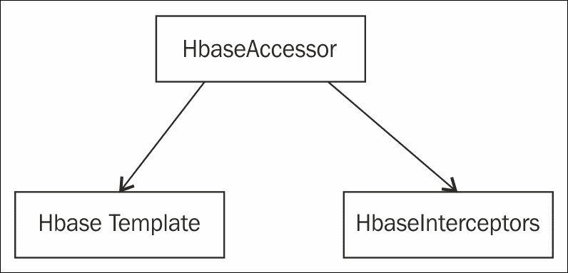

# 第七章：与 Hadoop 一起使用 Spring

在构建现代 Web 应用程序的架构中，处理大量数据一直是一个主要挑战。 Hadoop 是 Apache 的开源框架，提供了处理和存储大量数据的库。它提供了一种可扩展、成本效益和容错的解决方案，用于存储和处理大量数据。在本章中，让我们演示 Spring 框架如何支持 Hadoop。 Map 和 Reduce、Hive 和 HDFS 是与基于云的技术一起使用的一些 Hadoop 关键术语。除了 Apache Hadoop 之外，Google 还推出了自己的 Map 和 Reduce 以及分布式文件系统框架。

# Apache Hadoop 模块

Apache Hadoop 由以下模块组成：

+   **Hadoop Common**：这是 Hadoop 的其他模块使用的通用模块。它类似于一个实用程序包。

+   **Hadoop 分布式文件系统**：当我们需要在各种机器或机器集群上存储大量数据时，可以考虑使用 Hadoop 分布式文件系统。

+   **Hadoop Yarn**：想象一种情景，我们在云上有许多需要在特定时间通过发送电子邮件通知租户重新启动或重启的服务器。 Hadoop Yarn 可用于在计算机或集群之间调度资源。

+   **Hadoop Map 和 Reduce**：如果我们需要处理大量数据集，可以将其分解为小集群并将它们作为单元进行处理，然后稍后合并它们。这可以通过 Apache map 和 reduce 提供的库来实现。

## Hadoop 的 Spring 命名空间

以下是需要用来将 Hadoop 框架与 Spring 集成的命名空间。[`www.springframework.org/schema/hadoop/spring-hadoop.xsd`](http://www.springframework.org/schema/hadoop/spring-hadoop.xsd)定义了 Spring-Hadoop 的 XSD，通常在`application-context.xml`文件中使用。 XSD 详细说明了如何使用 Spring 框架配置 Hadoop 作业。

```java
<?xml version="1.0" encoding="UTF-8"?>
<beans 

   xsi:schemaLocation="
    http://www.springframework.org/schema/beans http://www.springframework.org/schema/beans/spring-beans.xsd
    http://www.springframework.org/schema/hadoop http://www.springframework.org/schema/hadoop/spring-hadoop.xsd">

   <bean id ... >

   4<hdp:configuration ...>
</beans>
```

## Hadoop 分布式文件系统

**Hadoop 分布式文件系统**（**HDFS**）用于在分布式文件系统上存储大量数据。 HDFS 将元数据和应用程序数据分别存储在不同的服务器上。用于存储元数据的服务器称为`NameNode`服务器。用于存储应用程序数据的服务器称为`DataNode`服务器。`NameNode`和`DataNodes`以主从架构运行。通常，一个`NameNode`会有许多`DataNodes`。`NameNodes`存储文件的命名空间，并将文件分割成许多小块存储在`DataNodes`上。`DataNodes`通常根据`NameNode`的指令执行功能，如块创建、复制和删除。因此，与 Hadoop 的主要任务将涉及与文件系统的交互。这可能包括创建文件、解析文件进行处理或删除文件。

可以通过多种方式访问 Hadoop 文件系统。我们在这里列出了一些：

+   `hdfs`：它使用 RPC 进行通信，使用的协议是`hdfs://`。客户端、服务器和集群需要具有相同的版本，否则将发生序列化错误。

+   `hftp`和`hsftp`：这些是基于 HTTP 的、与版本无关的协议，前缀为`hftp://`。

+   `webhdfs`：这是基于 REST API 的 HTTP，并且也是版本无关的。

抽象类`org.apache.hadoop.fs.FileSystem`的行为类似于 Hadoop 文件系统实现的入口点。Spring 框架通过子类`SimplerFileSystem`扩展了这个类。这个子类包含了所有的文件操作方法，比如从一个位置复制到另一个位置。

Spring 框架提供了一个处理 Hadoop 分布式文件系统的包。包`org.springframework.data.hadoop.fs`中有处理文件资源的类。

`HdfsResourceLoader`是 Spring 的 Hadoop 文件系统包中的一个类，用于加载 Hadoop 文件系统中的资源。它有以配置对象作为输入的构造函数。`HdfsResourceLoader`的构造函数如下所示。它还有从指定路径获取资源和在使用后关闭文件流的方法。

```java
HdfsResourceLoader(Configuration config)
HdfsResourceLoader(Configuration config) 
HdfsResourceLoader(Configuration config, URI uri) 
HdfsResourceLoader(Configuration config, URI uri, String user) HdfsResourceLoader(FileSystem fs)
```

使用以下命令配置 Spring 使用`webhdfs`：

```java
<hdp:configuration>
  fs.default.name=webhdfs://localhost
  ...
</hdp:configuration>
```

要手动配置 URI 和文件系统 ID，可以给出以下配置：

```java
<!-- manually creates the default SHDP file-system named 'hadoopFs' -->
<hdp:file-system uri="webhdfs://localhost"/>

<!-- creates a different FileSystem instance --> 
<hdp:file-system id="old-cluster" uri="hftp://old-cluster/"/>
```

诸如**Rhino**和**Groovy**之类的语言提供了 Java 脚本或使用 Python 来进行 HDFS 配置。以下是一个示例。可以配置脚本在启动时或有条件的启动时运行。可以用于此配置的两个脚本变量是`run-at-start-up`和`evaluate`。脚本也可以配置为作为任务启动（这意味着作为批处理作业启动）。

```java
<beans  ...> 
<hdp:configuration .../>

<hdp:script id="inlined-js" language="javascript" run-at-startup="true">
  importPackage(java.util);
  name = UUID.randomUUID().toString()
  scriptName = "src/test/resources/test.properties"
  // fs - FileSystem instance based on 'hadoopConfiguration' bean
  // call FileSystem#copyFromLocal(Path, Path)  
  fs.copyFromLocalFile(scriptName, name)
  // return the file length 
  fs.getLength(name)
</hdp:script>

</beans>
```

这里显示了一些与隐式变量和与隐式变量相关的类：

+   `hdfsRL-org.springframework.data.hadoop.io.HdfsResourceLoader`：一个 HDFS 资源加载器（依赖于`hadoop-resource-loader`或单例类型匹配，根据'`cfg`'自动创建）。

+   `distcp-org.springframework.data.hadoop.fs.DistributedCopyUtil`：对`DistCp`进行编程访问。

+   `fs-org.apache.hadoop.fs.FileSystem`：一个 Hadoop 文件系统（依赖于'`hadoop-fs`' bean 或单例类型匹配，根据'cfg'创建）。

+   `fsh-org.springframework.data.hadoop.fs.FsShell`：一个文件系统 shell，将 hadoop `fs`命令作为 API 暴露出来。

## HBase

Apache HBase 主要是 Hadoop 的键值存储。它实际上是一个易于扩展的数据库，可以容纳数百万行和列。它可以跨硬件进行扩展，类似于 NoSQL 数据库。它与 Map 和 Reduce 集成，并且最适合使用 RESTFUL API。HBase 源自 Google 的 bigdata。它已经被 Netflix、Yahoo 和 Facebook 使用。它也是内存密集型的，因为它旨在处理大量数据并且必须针对硬件进行扩展。

让我们使用 Eclipse 和 Hadoop HBase 创建一个简单的员工表。在 Eclipse 中，只需添加以下 JAR 文件，或者如果您使用 Maven，请确保在 Maven 的`pom.xml`文件中更新以下 JAR 文件：

+   `hbase-0.94.8.jar`

+   `commons-logging-1.1.1.jar`

+   `log4j-1.2.16.jar`

+   `zookeeper-3.4.5.jar`

+   `hadoop-core-1.1.2.jar`

+   `commons-configuration-1.6.jar`

+   `common-lang-2.5.jar`

+   `protobuf-java-2.4.0a.jar`

+   `slf4j-api-1.4.3.jar`

+   `slf4j-log4j12-1.4.3.jar`

创建一个`Main`类，并使用以下代码。这个类将使用`HbaseAdmin`类创建一个包含 ID 和 Name 两列的员工表。这个类有用于在 Hadoop 中创建、修改和删除表的方法。

```java
import org.apache.hadoop.conf.Configuration;

import org.apache.hadoop.hbase.HBaseConfiguration;

import org.apache.hadoop.hbase.HColumnDescriptor;

import org.apache.hadoop.hbase.HTableDescriptor;

import org.apache.hadoop.hbase.client.HBaseAdmin;

public class HbaseTableCreation
{
  public static void main(String[] args) throws IOException {
    HBaseConfiguration hc = new HBaseConfiguration(new Configuration());

    HTableDescriptor ht = new HTableDescriptor("EmployeeTable"); 

    ht.addFamily( new HColumnDescriptor("Id"));

    ht.addFamily( new HColumnDescriptor("Name"));

    System.out.println( "connecting" );

    HBaseAdmin hba = new HBaseAdmin( hc );

    System.out.println( "Creating Table EmployeeTable" );

    hba.createTable( ht );

    System.out.println("Done....EmployeeTable..");
  }
}
```

HBase 得到了 Spring Framework 的支持，并且 Spring Hadoop 包中还创建了一个`factoryBean`来支持它。`HbaseConfigurationFactoryBean` bean 位于`org.springframework.data.hadoop.hbase`包中。`HBaseAccessor`类是一个抽象类，并且已经被两个子类`HbaseTemplate`和`HbaseInterceptors`扩展。



Spring 提供了一个名为`HBaseTemplate`的核心类。当 HBase 被实现时，这个类是应用程序的第一个接触点。这个类有访问表的所有方法，比如`execute`、`find`、`find all`等等。

这个类有以下构造函数：

```java
HbaseTemplate() 
HbaseTemplate(Configuration configuration)
```

这是可以在应用程序的`context.xml`或`Hbasecontext.xml`文件中使用的 HBase 模板配置：

```java
// default HBase configuration
<hdp:hbase-configuration/>

// wire hbase configuration (using default name 'hbaseConfiguration') into the template 
<bean id="htemplate" class="org.springframework.data.hadoop.hbase.HbaseTemplate" p:configuration-ref="hbaseConfiguration"/>
```

让我们也看看如何使用`HBaseTemplate`来检索表信息，以下是一个示例代码片段：

```java
// writing to 'EmployeeTable'
template.execute("EmployeeTable", new TableCallback<Object>() {
  @Override
  public Object doInTable(HTable table) throws Throwable {
    Put p = new Put(Bytes.toBytes("Name"));
    p.add(Bytes.toBytes("Name"), Bytes.toBytes("SomeQualifier"), Bytes.toBytes("Anjana"));
    table.put(p);
    return null;
  }
});

// read each row from 'EmployeeTable'
List<String> rows = template.find("EmployeeTable", "Name", new RowMapper<String>() {
  @Override
  public String mapRow(Result result, int rowNum) throws Exception {
    return result.toString();
  }
}));
```

Spring 还支持 AOP 与 Hadoop HBase 的集成，并有一个包来处理所有 AOP 事件，使用`HBaseInterceptors`。这个类实现了以下接口：

+   `org.aopalliance.aop.Advice`

+   `org.aopalliance.intercept.Interceptor`

+   `org.aopalliance.intercept.MethodInterceptor`

+   `InitializingBean`

`HBaseInterceptors`与`HBaseSynchronizationManager`可用于在方法调用之前将 HBase 表绑定到线程，或在方法调用之后将其分离。

+   这是 Spring 的 Hadoop HBase 配置，用于创建一个 HBase 配置对象来管理 HBase 配置连接：

```java
<!-- default bean id is 'hbaseConfiguration' that uses the existing 'hadoopCconfiguration' object ->
<hdp:hbase-configuration configuration-ref="hadoopCconfiguration" />
```

+   这是 Spring 的 Hadoop HBase 配置，用于在应用程序上下文为空或由于某种原因不可用时管理代理和连接：

```java
<!-- delete associated connections but do not stop the proxies -->
<hdp:hbase-configuration stop-proxy="false" delete-connection="true">
  toooo=baaaa
  property=value
</hdp:hbase-configuration>
```

+   这是一个名为`ZooKeeper`的高性能协调服务器的配置，它用于 Hadoop 分布式系统：

```java
<!-- specify ZooKeeper host/port -->
<hdp:hbase-configuration zk-quorum="${hbase.host}" zk-port="${hbase.port}">
```

我们还可以从文件中加载属性，如下所示：

```java
<hdp:hbase-configuration properties-ref="some-props-bean" properties-location="classpath:/conf/testing/hbase.properties"/>
```

## Map 和 Reduce

**Map 和 Reduce**是一种允许大规模扩展的编程方法。术语“Map 和 Reduce”意味着我们将使用映射来处理数据。我们可以看到这里有两个步骤。第一个是创建映射（创建具有键值对的映射），第二个是减少，它读取第一步创建的映射，并将其分解成许多较小的映射。

让我们想象一个与 Map 和 Reduce 相关的场景——假设我们需要获取印度老虎的数量，并做一些工作来改善它们的生存条件，以免它们灭绝。我们可能有老虎数量的平均数字。假设我们派遣人员到不同的邦，他们收集到的信息如下：卡纳塔克邦（100），泰米尔纳德邦（150），等等。然后我们将这些数字合并成一个数字，以得到老虎的总数量。人口的映射可以被看作是一个并行过程（映射作业），而合并结果可以被看作是一个减少作业。

## 为 Map 和 Reduce 在 Spring 中创建一个配置对象

配置对象保存有关 Map 和 Reduce 作业的信息。配置对象本身是一个映射到类`ConfigurationFactoryBean`的 bean 定义，具有默认名称`hadoopConfiguration`。

配置对象可以简单地配置如下：

```java
<hdp:configuration />
```

这是配置对象的另一种变化：

```java
<hdp:configuration resources="classpath:/custom-site.xml, classpath:/hq-site.xml">
```

另一种变化是直接在`configuration`标记中使用`java.properties`直接配置 Hadoop 资源，如下所示：

```java
<hdp:configuration>
        fs.default.name=hdfs://localhost:9000
        hadoop.tmp.dir=/tmp/hadoop
        electric=sea
     </hdp:configuration>
```

您还可以使用 Spring 的属性占位符来外部化属性，如下所示：

```java
<hdp:configuration>
        fs.default.name=${hd.fs}
        hadoop.tmp.dir=file://${java.io.tmpdir}
        hangar=${number:18}
     </hdp:configuration>
          <context:property-placeholder location="classpath:hadoop.properties" />
```

### 使用 Spring 创建 Map 和 Reduce 作业

可以使用 Spring Framework 将 Map 和 Reduce 安排为作业。Spring Framework 带有`spring-data-hadoop`包，支持 Map 和 Reduce。为此，我们需要确保我们有 Apache Hadoop 核心包。

让我们实现一个简单的场景，统计输入文件中每个单词的出现次数。创建一个简单的 Maven Java 项目，具有以下所述的依赖关系。

#### Maven 项目的依赖关系

我们需要在`pom.xml`文件中添加这些依赖项：

```java
< !-- Spring Data Apache Hadoop -- >
< dependency >
    < groupId > org.springframework.data </ groupId >
    < artifactId  > spring-data-hadoop </ artifactId >
    < version > 1.0.0.RELEASE </ version >
< /dependency >
< !-- Apache Hadoop Core –- >
< dependency >
    < groupId > org.apache.hadoop </ groupId >
    < artifactId > hadoop-core </ artifactId >
    < version > 1.0.3 </version >
</dependency>
```

Apache Hadoop Map 和 Reduce 带有一个映射器类，可用于创建映射，以解决读取内容并存储单词出现次数的问题，使用键值对。文件中的每一行将被分解为要存储在映射中的单词。

我们可以通过扩展`ApacheMapper`类并覆盖 map 方法来创建自定义映射器，如下所示：

```java
public class CustomWordMapper extends Mapper<LongWritable, Text, Text, IntWritable> {
  private Text myword = new Text();

  @Override
  protected void map(LongWritable key, Text value, Context context) throws IOException, InterruptedException {
    String line = value.toString();
    StringTokenizer lineTokenz = new StringTokenizer(line);
    while (lineTokenz.hasMoreTokens()) {
      String cleaned_data = removeNonLettersNonNumbers(lineTokenz.nextToken());
        myword.set(cleaned_data);
        context.write(myword, new IntWritable(1));
    }
  }

  /**
  * Replace all Unicode characters that are neither numbers nor letters with an empty string.
  * @param original, It is the original string
  * @return a string object that contains only letters and numbers
  */
  private String removeNonLettersNonNumbers (String original) {
    return original.replaceAll("[^\\p{L}\\p{N}]", "");
  }
}
```

`CustomWordMapper`类执行以下操作：

1.  创建`Text()`类的`myword`实例。

1.  覆盖超类`Mapper`的`map`方法，并实现以下步骤：

1.  文本对象转换为字符串，并赋值给字符串`line`。

1.  Line 是一个传递给字符串标记器的字符串对象。

1.  使用`while`循环遍历字符串标记器，并调用`removeNonLettersNonNumbers`方法。返回的字符串赋值给`myword`文本实例。

1.  调用`context.write(myword,newIntwritable(1))`方法。

1.  有一个方法可以删除非字母和非数字，使用`string.replaceAll()`方法。最后返回一个只包含数字和字母的字符串对象。

接下来我们将创建一个 reducer 组件。reducer 组件将执行以下任务：

1.  扩展`reducer`类。

1.  为 reducer 类创建一个字符串属性，该属性接受需要搜索的字符串及其需要找到的出现次数。

1.  覆盖`reduce`方法。

1.  删除不需要的键值对。

1.  保留所需的键值对。

1.  检查输入键是否已经存在。如果存在，它将获取出现次数，并将最新值存储。

```java
import org.apache.hadoop.io.IntWritable;
import org.apache.hadoop.io.Text;
import org.apache.hadoop.mapreduce.Reducer;

public class CustomWordReducer extends Reducer<Text, IntWritable, Text, IntWritable> {
    protected static final String MY_TARGET_TEXT = "SPRING";

@Override
 protected void reduce(Text keyTxt, Iterable<IntWritable> values, Context context) throws IOException, InterruptedException {
        if (containsTargetWord(keyTxt)) {
            int wCount = 0;
            for (IntWritable value: values) {
               wCount += value.get();
            }
            context.write(key, new IntWritable(wCount));
        }
    }
    private boolean containsTargetWord(Text keyTxt) {
        return keyTxt.toString().equals(MY_TARGET_TEXT);
    }
}
```

1.  使用 HDFS 端口和输入输出文件路径配置`application.properties`文件。

1.  这是示例`application.properties`文件：

```java
fs.default.name=hdfs://localhost:9000
mapred.job.tracker=localhost:9001
input.path=/path/to/input/file/
output.path=/path/to/output/file

```

一旦属性被配置，它应该在 Spring 上下文中可用。因此，在 Spring 的`application-context.xml`文件中使用`property-placeholder`配置属性文件。这是需要在`application-conext.xml`文件中添加的配置片段。

```java
<context:property-placeholder location="classpath:application.properties" />
```

您可以直接在`application-context.xml`文件中配置 Apache Hadoop，也可以使用属性文件并从属性文件中读取键值对。由于我们使用了属性文件，我们将从属性文件中读取值。以下代码片段显示`${mapred.job.tracker}`是属性文件中的一个键。您可以看到默认名称也是使用键`${fs.default.name}`从属性文件中配置的。在`application-context.xml`文件中配置 Apache Hadoop 如下：

```java
<hdp:configuration>
  fs.default.name=${fs.default.name}
  mapred.job.tracker=${mapred.job.tracker}
</hdp:configuration>
```

1.  接下来，我们需要在 Spring 中配置 Hadoop 作业：

1.  提供作业 ID。

1.  指定输入路径；它将从属性文件中读取。

1.  指定输出路径；它将从属性文件中读取。

1.  按类进行 Jar。

1.  Mapper 类引用自定义 mapper 类。

1.  Reducer 类引用自定义 reducer 类。

1.  这是需要在`application-xccontext.xml`文件中可用的配置片段。在`application-context.xml`文件中配置 Hadoop 作业如下：

```java
<hdp:job id="wordCountJobId"
input-path="${input.path}"
output-path="${output.path}"
jar-by-class="net.qs.spring.data.apachehadoop.Main"
mapper="com.packt.spring.data.apachehadoop.CustomWordMapper"
reducer="com.packt.spring.data.apachehadoop.CustomWordReducer"/>
```

1.  最后，我们需要在`application-context.xml`文件中配置作业运行器。作业运行器配置告诉 Spring 框架何时启动作业。在这里，我们已经配置了作业运行器在启动时启动`wordcountjob`。

1.  这是作业运行器的配置片段。配置`application-context.xml`文件以运行 Hadoop 作业。

```java
<hdp:job-runner id="wordCountJobRunner" job-ref="wordCountJobId" run-at-startup="true"/>
```

由于这是一个独立的 Spring 应用程序，我们没有一个将调用应用程序上下文的 web 模块。上下文需要在一个类文件中加载。因此，让我们创建一个带有`static`方法的`Main`类来加载`application-context.xml`文件。

我们可以创建一个在启动时加载`application-context.xml`文件的类，如下所示：

```java
import org.springframework.context.ApplicationContext;
importorg.springframework.context.support.ClassPathXmlApplicationContext;

public class Main {
  public static void main(String[] arguments) {
    ApplicationContext ctx = new ClassPathXmlApplicationContext("application-context.xml");
  }
}
```

让我们创建一个名为`myinput.txt`的文件，内容如下：

```java
SPRING IS A SEASON. SPRING IS A FRAMEWORK IN JAVA. ITS SPRING IN INDIA. SPRING IS GREEEN. SPRING SPRING EVERY WHERE
```

接下来，我们需要通过执行此命令向 HDFS 提供输入文件：

```java
hadoop dfs -put myinput.txt /input/myinput.txt
hadoop dfs -ls /input

```

运行`Main`类以查看输出。

## 使用 Hadoop 流和 Spring DataApache Hadoop 进行 Map 和 Reduce 作业

在本节中，我们将演示使用 Unix shell 命令进行 Map 和 Reduce 数据流。由于这与 Hadoop 流相关，我们将在 Unix 系统上设置一个 Hadoop 实例。Hadoop 实例始终在 Unix 机器上以生产模式运行，而在开发中，将使用 Windows Hadoop 实例。

1.  这些是设置要求的要求：

+   JAVA 1.7.x

+   必须安装 SSH

1.  下载最新的 Apache Hadoop 分发二进制包。

1.  解压并将包提取到一个文件夹中。

1.  设置以下环境变量：

+   `JAVA_HOME`

+   `HADOOP_HOME`

+   `HADOOP_LOG_DIR`

+   `PATH`

我们还需要配置 Hadoop 安装目录的`conf`文件夹中存在的文件：

+   `Core-site.xml`

+   `Hdfs-site.xml`

+   `Mapred-site.xml`

我们需要设置一个默认的 Hadoop 文件系统。

1.  要配置默认的 Hadoop 文件系统，请在`core-site.xml`文件中提供设置信息。

```java
<configuration>
  <property>
  <name>fs.default.name</name>
  <value>hdfs://localhost:9000</value>
  </property>
</configuration>
```

1.  还要配置复制因子。复制因子配置确保文件的副本存储在 Hadoop 文件系统中。在`hdfs-site.xml`文件中设置属性`dfs.replication`及其值。

```java
<configuration>
  <property>
    <name>dfs.replication</name>
    <value>1</value>
  </property>
</configuration>
```

1.  最后，配置作业跟踪器；此配置在`mapred-site.xml`文件中完成。

```java
<configuration>
  <property>
    <name>mapred.job.tracker</name>
    <value>localhost:9001</value>
  </property>
</configuration>
```

1.  要在伪分布式模式下运行 Hadoop，我们只需要格式；在`bin`文件夹中，有`start`和`stop` Hadoop 实例命令。

接下来，我们将演示如何将 Python 与 Apache Hadoop 数据集成。

我们将使用 Maven 创建一个简单的项目。这些是依赖关系：

```java
<!-- Spring Data Apache Hadoop -->
<dependency>
  <groupId>org.springframework.data</groupId>
  <artifactId>spring-data-hadoop</artifactId>
  <version>1.0.0.RC2</version>
</dependency>
<!-- Apache Hadoop Core -->
<dependency>
  <groupId>org.apache.hadoop</groupId>
  <artifactId>hadoop-core</artifactId>
  <version>1.0.3</version>
</dependency>
<!-- Apache Hadoop Streaming -->
<dependency>
  <groupId>org.apache.hadoop</groupId>
  <artifactId>hadoop-streaming</artifactId>
  <version>1.0.3</version>
</dependency>
```

我们需要一个 mapper 和 reducer Python 脚本。Python 中的 mapper 脚本应该实现以下功能：

+   脚本应该从标准输入流中读取，一次读取一行输入，并将其转换为 UTF-8

+   行中的单词必须分割成单词

+   行中的特殊字符需要替换为空字符，然后得到一个键值对作为制表符；它们被限定到标准输出

这是 Python 中的 mapper 脚本：

```java
#!/usr/bin/python
# -*- coding: utf-8 -*-
import sys
import unicodedata

# Removes punctuation characters from the string
def strip_punctuation(word):
 return ''.join(x for x in word if unicodedata.category(x) != 'Po')

#Process input one line at the time
for line in sys.stdin:
 #Converts the line to Unicode
 line = unicode(line, "utf-8")
 #Splits the line to individual words
 words = line.split()
 #Processes each word one by one
 for word in words:
 #Removes punctuation characters
 word = strip_punctuation(word)
 #Prints the output
 print ("%s\t%s" % (word, 1)).encode("utf-8")

```

Python 中的 Reducer 脚本应该实现以下功能：

1.  脚本应该读取从`mapper`类生成的键值对输出。然后，计算关键字的出现次数。

```java
#!/usr/bin/python
# -*- coding: utf-8 -*-s
import sys
wordCount = 0
#Process input one line at the time
for line in sys.stdin:
 #Converts the line to Unicode
 line = unicode(line, "utf-8")
 #Gets key and value from the current line
 (key, value) = line.split("\t")
 if key == "Amily":
 #Increase word count by one
 wordCount = int(wordCount + 1);
#Prints the output
print ("Watson\t%s" % wordCount).encode("utf-8")

```

1.  一旦 Python 脚本准备就绪，我们需要在属性文件中提供 mapper 和 reducer 类名和配置。这是`.properties`文件：

```java
#Configures the default file system of Apache Hadoop
fs.default.name=hdfs://localhost:9000

#The path to the directory that contains our input files
input.path=/input/

#The path to the directory in which the output is written
output.path=/output/

#Configure the path of the mapper script
mapper.script.path=pythonmapper.py

#Configure the path of the reducer script
reducer.script.path=pythonreducer.py

```

1.  我们还需要在`context.xml`文件中配置`property-placeholder`和 Apache Hadoop。这是配置：

```java
<context:property-placeholder location="classpath:application.properties" />
<hdp:configuration>
  fs.default.name=${fs.default.name}
</hdp:configuration>
```

1.  最后，我们需要配置 Hadoop 作业并将作业分配给作业运行器，该运行器将初始化作业。

```java
<hdp:configuration>
  fs.default.name=${fs.default.name}
</hdp:configuration>
<hdp:streaming id="streamingJob"
  input-path="${input.path}"
  output-path="${output.path}"
  mapper="${mapper.script.path}"
  reducer="${reducer.script.path}"/>
<hdp:job-runner id="streamingJobRunner" job-ref="streamingJob" run-at-startup="true"/>
```

1.  现在，我们需要使用应用程序上下文来调用配置，以便应用程序上下文加载 Spring 框架中的所有配置。

```java
import org.springframework.context.ApplicationContext;
import org.springframework.context.support.ClassPathXmlApplicationContext;

public class Main {
  public static void main(String[] arguments) {
    ApplicationContext ctx = new ClassPathXmlApplicationContext("applicationContext.xml");
  }
}
```

1.  在命令提示符中运行以下命令以提供输入文件。让文件放在名为`input`的文件夹中：

```java
hadoop dfs -put MILLSANDBOON.txt /input/ MILLSANDBOON.txt

```

1.  输出可以在输出目录中使用以下命令读取。

```java
hadoop dfs -rmr /output
hadoop dfs -cat /output/part-00000

```

您应该看到一个输出，显示提供的文本中单词“Amily”的出现次数。

# 摘要

到目前为止，我们已经看到了 Spring 如何与 Apache Hadoop 集成，并提供了搜索和计数数据的 Map 和 Reduce 过程。我们还讨论了 Python 与 Apache Hadoop 的集成。我们已经演示了如何在 Spring 框架中配置 Hadoop 作业，并且还看到了 HDFS 配置。

Hadoop 是一个庞大的概念。有关更多信息，请参阅[`docs.spring.io/spring-hadoop/docs/current/reference/html/`](http://docs.spring.io/spring-hadoop/docs/current/reference/html/)和[`github.com/spring-projects/spring-hadoop-samples`](https://github.com/spring-projects/spring-hadoop-samples)。

我们已经演示了如何在 Unix 机器上安装 Hadoop 实例。在下一章中，我们将看到如何在 OSGI 中使用 Spring 动态模块。
