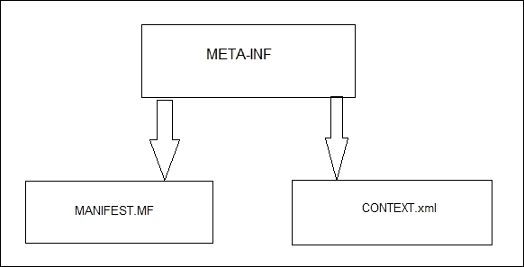
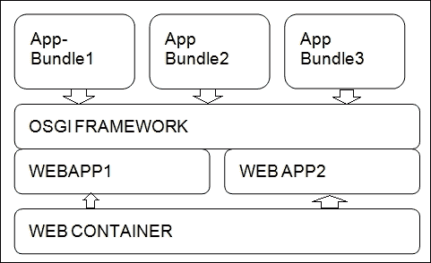

# 第八章：Spring 与 OSGI

**OSGI**是**Open Service Gateway Intiative**的缩写。这是一个规范，包括用于动态部署模块的模块化系统和服务平台。根据规范，应用程序可以分解为模块并独立部署。当我们考虑开发 OSGI 应用程序时，这意味着我们需要使用可用的 OSGI API 来开发应用程序。第二步是将其部署到 OSGI 容器中。因此，在 OSGI 中开发应用程序时，我们可以将应用程序分解为模块并独立部署它们，然后卸载；我们还可以并行运行应用程序的各个版本。在本章中，我们将看到 Spring 如何支持 OSGI 捆绑开发及其应用程序的部署。我们将首先从 OSGI 开始，然后逐渐转向 Spring 的支持。

# OSGI 容器

OSGI 容器必须实现一组服务，并且 OSGI 容器与应用程序之间建立了一项合同。以下提到的所有 OSGI 容器都是开源的：

+   **KnoplerFish**：Knopler 框架可以很容易地安装，并且更容易地将模块捆绑和部署到容器中。捆绑应用程序需要一个`.manifest`文件和构建`.xml`文件。必须拥有该框架。 JAR 文件应该在 Java 构建路径中可用。需要在 KnoplerFish 容器中部署的捆绑包将具有一个实现`BundleActivator`接口的类。该接口带有需要实现的`start()`和`stop()`方法。通常还会创建一个线程类，并且在`BundleActivator`接口实现类的 start 方法中启动该线程，并在 stop 方法中停止。您还可以通过创建一个接口和实现类来创建一个 OSGI 服务。该服务可以在`BundleActivator`类的`start()`方法中注册。这是实现`BundleActivator`接口的类。有`ServiceListeners`和`ServiceTrackers`来监视容器中的 OSGI 服务。

+   **Equinox**：这是核心 OSGI 框架的实现。它提供各种可选的 OSGI 服务。Eclipse 提供了一个 OSGI 插件来开发 OSGI 捆绑应用程序。Eclipse 提供了一个 JAR 文件，可以使用 Eclipse 的安装启动、停止命令轻松安装。

+   **Apache Felix**：Apache Felix 是 Apache 项目的另一个 OSGI 容器。Felix 有各种子项目可以插入。它还支持与 Knoplerfish 下的应用程序开发类似的方式。它还有一个 Maven 捆绑插件。

## OSGI 使用

让我们列出 OSGI 框架的关键用途：

+   该框架提供了应用程序的模块化

+   该框架实现了基于捆绑包的架构

+   可以并行运行同一项目的多个版本

+   我们还可以将 OSGI 应用程序和 OSGI 捆绑包集成到 Web 容器中

+   使其与 Web 应用程序的前端配合工作也存在一些挑战

+   有很多框架，至少有四个框架，可用于在 OSGI 规范之上开发 POJO 应用程序

+   OSGI 捆绑包的大小相对较小

# Spring 与 OSGI 的集成

Spring 为 OSGI 开发提供了完整的支持。OSGI 模块支持被称为 Spring OSGI，目前已更新为一组新的库和版本，称为 Spring Dynamic Modules。Spring 动态模块允许您在 OSGI 框架之上编写 Spring 应用程序。其挑战之一是使简单的 POJO 能够与 OSGI 框架无缝配合，并将 Spring Beans 集成为 OSGI 服务。Spring Beans 可以导出为 OSGI 服务

```java
<bean name="authorService" 
 class="com.packt.osgi.authorservice.impl.AuthorServiceImpl"/> 
<osgi:service id="auhtorServiceOsgi" 
 ref="authorService" 
 interface="com.packt.osgi.authorservice.AuthorService"/>
```

Spring 动态编程模型提供了 API 编程，Spring Beans 在捆绑中可见。Spring 动态模型为我们提供了跨捆绑的依赖注入，并且通过 Spring 动态服务提供了对 OSGI 的所有支持，处理变得更加容易。

每个捆绑理想上都应该有一个单独的应用上下文。应用上下文随着捆绑的启动和停止而创建和销毁。这些上下文文件位于 META-INF 下。

典型的捆绑结构如下图所示：



下图展示了 OSGI 模块如何成为 Web 应用程序的一部分，以及每个捆绑如何与 OSGI 框架交互。您还可以看到 Web 容器上有许多 Web 应用程序，它们使用 OSGI 框架作为服务访问应用程序捆绑。



# Spring 动态模块和 OSGI

让我们看看 Spring 动态模块是如何工作的。Spring 带有其 OSGI 集成框架，其中有一个名为`extender`的类。这个类检查所有现有的捆绑，并标记由 Spring 提供支持的捆绑。只有具有 Spring 上下文清单标头或`META-INF`/`spring`文件夹中的 XML 文件的捆绑才会被标记为 Spring 兼容。所有前面的步骤都是在启动时触发的，`extender`包在`org.springframeork.osgi.bundle.extender`中可用。现在，我们必须知道为什么 Spring 动态模块会标记 Spring 支持的捆绑。具有 Spring 配置文件的捆绑会进一步转换为应用上下文对象。`extender`不仅标记 Spring 支持的捆绑以创建应用上下文对象，还会检查捆绑是否导入任何 OSGI 服务。如果发现任何导出外部服务的捆绑，则这些 bean 将移动到 OSGI 共享服务注册表中。`extender`使用监听器和事件注册导出 OSGI 服务的捆绑。OSGI 还与 Equinox、Felix 和 KnoplerFish 进行了测试。

在 Eclipse IDE 中设置 Spring DM 时，需要遵循以下步骤：

1.  下载 Spring DM；寻找最新的 Spring OSGI DM。

1.  将 ZIP 文件提取到本地目录中；将其命名为`c:\OSGI-SPRING`。

1.  在启动 Eclipse 时创建一个新的工作空间。

1.  通过选择**插件开发**选项或 Java 中的**安装插件**选项导入所有必要的 JAR 文件和所有 Spring DM JAR 文件。确保在 Eclipse 环境中拥有以下提到的所有插件。

+   `org.springframeork.osgi.bundle.core`

+   `org.springframeork.osgi.bundle.extender`

+   `org.springframeork.osgi.bundle.io`

+   `org.springframeork.bundle.spring.aop`

+   `org.springframeork.bundle.spring.beans`

+   `org.springframeork.bundle.spring.context`

+   `org.springframeork.bundle.spring.core`

+   `org.springframeork.bundle.spring.jdbc`

+   `org.springframeork.bundle.spring.tx`

+   `org.springframeork.osgi.aopalliance.osgi`

## 简单的 OSGI 应用程序

在本节中，让我们首先开发一个简单的 OSGI 应用程序。我们将创建两个捆绑——一个提供打印字符串的服务，另一个捆绑会以相等的时间间隔消费该服务。

1.  以下是第一个捆绑：

```java
package com.packt.osgi.provider.able;

public interface MySimpleOSGIService {
  void mysimplemethod();
}
package com.packt.osgi.provider.impl;

import com.bw.osgi.provider.able.MySimpleOSGIService;

public class MySimpleOSGIServiceImpl implements MySimpleOSGIService {
  @Override
  void mysimplemethod(){
    System.out.println("this my simple method which is the implementation class");
  }
}
```

1.  使用激活器导出服务：

```java
package com.packt.osgi.provider;
import org.osgi.framework.BundleActivator;
import org.osgi.framework.BundleContext;
import org.osgi.framework.ServiceRegistration;
import com.bw.osgi.provider.able.MySimpleOSGIService;
import com.bw.osgi.provider.impl.MySimpleOSGIServiceImpl;

public class MyProviderActivator implements BundleActivator {
  private ServiceRegistration registration;

  @Override
  public void start(BundleContext bundleContext) throws Exception {
    registration = bundleContext.registerService(
      MySimpleOSGIService.class.getName(),
      new MySimpleOSGIServiceImpl(),
      null);
  }

  @Override
  public void stop(BundleContext bundleContext) throws Exception {
    registration.unregister();
  }
}
```

1.  现在，我们已经准备好第一个捆绑，我们将使用 Maven 来构建它。我们还需要 Maven 捆绑插件来构建 XML 文件。

```java
?xml version="1.0" encoding="UTF-8"?>

<project   xsi:schemaLocation="http://maven.apache.org/POM/4.0.0 http://maven.apache.org/xsd/maven-4.0.0.xsd">
  <modelVersion>4.0.0</modelVersion>

  <groupId>OSGiDmMySimpleProvider</groupId>
  <artifactId>OSGiDmMySimpleProvider</artifactId>
  <version>1.0</version>

  <dependencies>
    <dependency>
    <groupId>org.apache.felix</groupId>
    <artifactId>org.osgi.core</artifactId>
    <version>1.4.0</version>
    </dependency>
  </dependencies>

  <build>
    <plugins>
      <plugin>
      <groupId>org.apache.maven.plugins</groupId>
      <artifactId>maven-compiler-plugin</artifactId>
      <version>2.0.2</version>
      <configuration>
        <source>1.6</source>
        <target>1.6</target>
      </configuration>
      </plugin>

      <plugin>
        <groupId>org.apache.felix</groupId>
        <artifactId>maven-bundle-plugin</artifactId>
        <extensions>true</extensions>
        <configuration>
          <instructions>
          <Bundle-SymbolicName>OSGiDmMySimpleProvider</Bundle-SymbolicName>
          <Export-Package>com.packt.osgi.provider.able</Export-Package>
          <Bundle-Activator>com.packt.osgi.provider.MyProviderActivator</Bundle-Activator>
          <Bundle-Vendor>PACKT</Bundle-Vendor>
          </instructions>
          </configuration>
        </plugin>
      </plugins>
  </build> 
</project>
```

1.  要构建它，只需简单的`mvn install`命令即可。

1.  接下来，让我们尝试消费服务：

```java
package com.packt.osgi.consumer;
import javax.swing.Timer;
import java.awt.event.ActionEvent;
import java.awt.event.ActionListener;
import com.packt.osgi.provider.able.MySimpleOSGIService;
public class MySimpleOSGIConsumer implements ActionListener {
  private final MySimpleOSGIService service;
  private final Timer timer;
  public MySimpleOSGIConsumer(MySimpleOSGIService service) {
    super();
    this.service = service;
    timer = new Timer(1000, this);
  }

  public void startTimer(){
    timer.start();
  }

  public void stopTimer() {
    timer.stop();
  }

  @Override
  public void actionPerformed(ActionEvent e) {
    service.mysimplemethod();
  }
}
```

1.  现在，我们必须再次为消费者创建一个激活器：

```java
package com.packt.osgi.consumer;

import org.osgi.framework.BundleActivator;
import org.osgi.framework.BundleContext;
import org.osgi.framework.ServiceReference;
import com.packt.osgi.provider.able.MySimpleOSGIService;

public class MySimpleOSGIActivator implements BundleActivator {
  private MySimpleOSGIConsumer consumer;

  @Override
  public void start(BundleContext bundleContext) throws Exception {
    ServiceReference reference = bundleContext.getServiceReference(MySimpleOSGIService.class.getName());

    consumer = new MySimpleOSGIConsumer((MySimpleOSGIService) bundleContext.getService(reference));
    consumer.startTimer();
  }

  @Override
  public void stop(BundleContext bundleContext) throws Exception {
    consumer.stopTimer();
  }
}
```

# 将 Spring 动态模块与 OSGI 集成

在本节中，让我们演示如何将 Spring 动态模块集成到 OSGI 应用程序中。Spring 动态模块（Spring DM）使得基于 OSGI 的应用程序的开发变得更加容易。我们可以像任何其他 Spring bean 一样轻松地注入服务。

我们将看一下集成 Spring 动态模块所需的以下依赖项：

+   OSGI 服务

+   `BundleActivator`类

+   `Context.xml`文件配置以注入服务

以下是需要在应用程序类路径中提供的依赖项列表：

+   `com.springsource.net.sf.cglib-2.1.3.jar`

+   `com.springsource.org.aopalliance-1.0.0.jar`

+   `log4j.osgi-1.2.15-SNAPSHOT.jar`

+   `com.springsource.slf4j.api-1.5.0.jar`

+   `com.springsource.slf4j.log4j-1.5.0.jar`

+   `com.springsource.slf4j.org.apache.commons.logging-1.5.0.jar`

+   `org.springframework.aop-3.x.jar`

+   `org.springframework.beans-3.x.jar`

+   `org.springframework.context-3.x.jar`

+   `org.springframework.core-3.x.jar`

+   `spring-osgi-core-1.2.1.jar`

+   `spring-osgi-extender-1.2.1.jar`

+   `spring-osgi-io-1.2.1.jar`

所以，让我们创建一个简单的`HelloWorldService`接口类：

```java
package com.packt.osgi.provider.able;
public interface HelloWorldService {
  void hello();
}
```

接下来，我们将实现`service`类。这是一个简单的类

```java
package com.packt.osgi.provider.impl;
import com.packt.osgi.provider.able.HelloWorldService;
public class HelloWorldServiceImpl implements HelloWorldService {
  @Override
  public void hello(){
    System.out.println("Hello World !");
  }
}
```

我们将编写一个激活器类，需要激活服务`BundleActivator`。我们需要调用的`ProviderActivator`类是`HelloWorldService`。实际上，我们正在注册服务。但是，使用 Spring DM 集成使我们的配置变得简单。我们不需要这个集成类。

```java
package com.packt.osgi.provider;
import org.osgi.framework.BundleActivator;
import org.osgi.framework.BundleContext;
import org.osgi.framework.ServiceRegistration;
import com. packt.osgi.provider.able.HelloWorldService;
import com. packt.osgi.provider.impl.HelloWorldServiceImpl;

public class ProviderActivator implements BundleActivator {
  private ServiceRegistration registration;

  @Override
  public void start(BundleContext bundleContext) throws Exception {
    registration = bundleContext.registerService(
                   HelloWorldService.class.getName(),
                   new HelloWorldServiceImpl(),null);
  }

  @Override
  public void stop(BundleContext bundleContext) throws Exception {
    registration.unregister();
  }
}
```

我们只需要在`META-INF`/`spring`文件夹中创建一个`provider-context.xml`文件。这是一个简单的 XML 文件上下文，但我们使用一个新的命名空间来注册服务 - [`www.springframework.org/schema/osgi`](http://www.springframework.org/schema/osgi)。所以，让我们开始：

```java
<?xml version="1.0" encoding="UTF-8"?>
<beans 

  xsi:schemaLocation="http://www.springframework.org/schema/beans http://www.springframework.org/schema/beans/spring-beans-3.0.xsd http://www.springframework.org/schema/osgi http://www.springframework.org/schema/osgi/spring-osgi.xsd">
  <bean id="helloWorldService" class="com.packt.osgi.provider.impl.HelloWorldServiceImpl"/>
  <osgi:service ref="helloWorldService" interface="com.packt.osgi.provider.able.HelloWorldService"/>
</beans>
```

唯一与 OSGI 相关的是`osgi:service`声明。这一行表示我们需要将`HelloWorldService`注册为 OSGI 服务，使用`HelloWorldService`接口作为服务的名称。

如果您将上下文文件放在`META-INF`/`spring`文件夹中，它将被 Spring Extender 自动检测，并创建一个应用程序上下文。

1.  现在我们可以转到消费者 bundle。在第一阶段，我们创建了那个消费者：

```java
package com.packt.osgi.consumer;
import javax.swing.Timer;
import java.awt.event.ActionEvent;
import java.awt.event.ActionListener;
import com.bw.osgi.provider.able.HelloWorldService;
public class HelloWorldConsumer implements ActionListener {
  private final HelloWorldService service;
  private final Timer timer;
  public HelloWorldConsumer(HelloWorldService service) {
    super();
    this.service = service;
    timer = new Timer(1000, this);
  }
  public void startTimer(){
    timer.start();
  }
  public void stopTimer() {
    timer.stop();
  }
  @Override
  public void actionPerformed(ActionEvent e) {
    service.hello();
  }
}
```

1.  接下来，让我们编写`BundleActivator`类：

```java
package com.packt.osgi.consumer;
import org.osgi.framework.BundleActivator;
import org.osgi.framework.BundleContext;
import org.osgi.framework.ServiceReference;
import com. packt.osgi.provider.able.HelloWorldService;
public class HelloWorldActivator implements BundleActivator {
  private HelloWorldConsumer consumer;
  @Override
  public void start(BundleContext bundleContext) throws Exception {
    ServiceReference reference = bundleContext.getServiceReference(HelloWorldService.class.getName());
    consumer = new HelloWorldConsumer((HelloWorldService) bundleContext.getService(reference));
    consumer.startTimer();
  }
  @Override
  public void stop(BundleContext bundleContext) throws Exception {
    consumer.stopTimer();
  }
}
```

注入不再是必要的。我们可以在这里保留计时器的启动，但是，再次，我们可以使用框架的功能来启动和停止计时器。

1.  所以，让我们删除激活器并创建一个应用程序上下文来创建消费者并自动启动它，并将其放在`META-INF`/`spring`文件夹中：

```java
<?xml version="1.0" encoding="UTF-8"?>
<beans 

  xsi:schemaLocation="http://www.springframework.org/schema/beans http://www.springframework.org/schema/beans/spring-beans-3.0.xsd http://www.springframework.org/schema/osgi 
  http://www.springframework.org/schema/osgi/spring-osgi.xsd">

  <bean id="consumer" class="com.packt.osgi.consumer.HelloWorldConsumer" init-method="startTimer" destroy-method="stopTimer" lazy-init="false" >
    <constructor-arg ref="eventService"/>
  </bean>

  <osgi:reference id="eventService" interface="com.packt.osgi.provider.able.HelloWorldService"/>
</beans>
```

我们使用`init`方法和`destroy`方法属性来启动和停止与框架的时间，并使用`constructor-arg`来将引用注入到服务中。使用`osgi:reference`字段和使用接口作为服务的键来获取对服务的引用。

这就是我们需要做的所有事情。比第一个版本简单多了，不是吗？除了简化之外，您还可以看到源代码既不依赖于 OSGI 也不依赖于 Spring Framework；这就是纯 Java，这是一个很大的优势。

Maven POM 文件与第一阶段相同，只是我们可以削减对 OSGI 的依赖。

提供者：

```java
<?xml version="1.0" encoding="UTF-8"?>

<project 

  xsi:schemaLocation="http://maven.apache.org/POM/4.0.0 http://maven.apache.org/xsd/maven-4.0.0.xsd">
  <modelVersion>4.0.0</modelVersion>
  <groupId>OSGiDmHelloWorldProvider</groupId>
  <artifactId>OSGiDmHelloWorldProvider</artifactId>
  <version>1.0</version>
  <packaging>bundle</packaging>

  <build>
    <plugins>
      <plugin>
        <groupId>org.apache.maven.plugins</groupId>
        <artifactId>maven-compiler-plugin</artifactId>
        <version>2.0.2</version>
        <configuration>
          <source>1.6</source>
          <target>1.6</target>
         </configuration>
      </plugin>

      <plugin>
        <groupId>org.apache.felix</groupId>
        <artifactId>maven-bundle-plugin</artifactId>
        <extensions>true</extensions>
        <configuration>
          <instructions>
            <Bundle-SymbolicName>OSGiDmHelloWorldProvider</Bundle-SymbolicName>
            <Export-Package>com.bw.osgi.provider.able</Export-Package>
            <Bundle-Vendor>Baptiste Wicht</Bundle-Vendor>
          </instructions>
        </configuration>
      </plugin>
    </plugins>
  </build> 
</project>
```

消费者：

```java
<?xml version="1.0" encoding="UTF-8"?>

<project 

  xsi:schemaLocation="http://maven.apache.org/POM/4.0.0 http://maven.apache.org/xsd/maven-4.0.0.xsd">
  <modelVersion>4.0.0</modelVersion>
  <groupId>OSGiDmHelloWorldConsumer</groupId>
  <artifactId>OSGiDmHelloWorldConsumer</artifactId>
  <version>1.0</version>
  <packaging>bundle</packaging>

  <dependencies>
    <dependency>
      <groupId>OSGiDmHelloWorldProvider</groupId>
      <artifactId>OSGiDmHelloWorldProvider</artifactId>
      <version>1.0</version>
    </dependency>
  </dependencies>

  <build>
    <plugins>
      <plugin>
        <groupId>org.apache.maven.plugins</groupId>
        <artifactId>maven-compiler-plugin</artifactId>
        <version>2.0.2</version>
        <configuration>
          <source>1.6</source>
          <target>1.6</target>
        </configuration>
      </plugin>

      <plugin>
        <groupId>org.apache.felix</groupId>
        <artifactId>maven-bundle-plugin</artifactId>
        <extensions>true</extensions>
        <configuration>
          <instructions>
            <Bundle-SymbolicName>OSGiDmHelloWorldConsumer</Bundle-SymbolicName>
            <Bundle-Vendor>Baptiste Wicht</Bundle-Vendor>
          </instructions>
        </configuration>
      </plugin>
    </plugins>
  </build>
</project>
```

我们可以使用 Maven install 构建这两个 bundle。所以，让我们在 Felix 中测试一下我们的东西：

```java
Welcome to Apache Felix Gogo
g! install file:../com.springsource.slf4j.org.apache.commons.logging-1.5.0.jar
Bundle ID: 5
g! install file:../com.springsource.slf4j.log4j-1.5.0.jar
Bundle ID: 6
g! install file:../com.springsource.slf4j.api-1.5.0.jar
Bundle ID: 7
g! install file:../log4j.osgi-1.2.15-SNAPSHOT.jar
Bundle ID: 8
g! install file:../com.springsource.net.sf.cglib-2.1.3.jar
Bundle ID: 9
g! install file:../com.springsource.org.aopalliance-1.0.0.jar
Bundle ID: 10
g! install file:../org.springframework.core-2.5.6.SEC01.jar
Bundle ID: 11
g! install file:../org.springframework.context-2.5.6.SEC01.jar
Bundle ID: 12
g! install file:../org.springframework.beans-2.5.6.SEC01.jar
Bundle ID: 13
g! install file:../org.springframework.aop-2.5.6.SEC01.jar
Bundle ID: 14
g! install file:../spring-osgi-extender-1.2.1.jar
Bundle ID: 15
g! install file:../spring-osgi-core-1.2.1.jar
Bundle ID: 16
g! install file:../spring-osgi-io-1.2.1.jar
Bundle ID: 17
g! start 5 7 8 9 10 11 12 13 14 15 16 17
log4j:WARN No appenders could be found for logger (org.springframework.osgi.extender.internal.activator.ContextLoaderListener).
log4j:WARN Please initialize the log4j system properly.
g! install file:../OSGiDmHelloWorldProvider-1.0.jar
Bundle ID: 18
g! install file:../OSGiDmHelloWorldConsumer-1.0.jar
Bundle ID: 19
g! start 18
g! start 19
g! Hello World !
Hello World !
Hello World !
Hello World !
Hello World !
Hello World !
Hello World !
Hello World !
stop 19
g!
```

总之，Spring DM 确实使与 OSGI 的开发变得更加容易。使用 Spring DM，您还可以启动 bundle。它还允许您创建 Web bundle 并轻松使用 OSGI compendium 的服务。

# 摘要

在本章中，我们开发了一个简单的 OSGI 应用程序。我们还演示了 Spring DM 如何支持 OSGI 开发，减少文件的创建，并通过配置使事情变得更容易。
