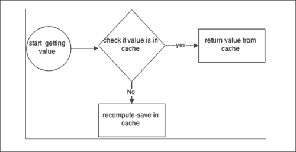

# 第十章：Spring 缓存

自 Spring 3.1 版本以来，Spring 缓存已经开始起作用。Spring 还添加了注释来支持缓存机制。缓存抽象层提供了很多支持来使用不同的缓存解决方案。在本章中，我们将探讨 Spring 缓存。我们将看到如何设置 Spring 缓存。您可以理想地将您的缓存代码与业务逻辑绑定在一起。

缓存避免重新计算。理想情况下，您不必再次重复相同的过程来获取相同的值。缓存将值存储在内存中。您可以随时选择您想要缓存和不想要缓存的内容。这是架构设计的一部分。一旦数据被缓存，它将从缓存的内存中检索，从而节省计算时间。

# 用于缓存的 Spring 注释

Spring 提出了两个主要的用于缓存的注释；我们将在整个章节中使用这些。以下是这两个注释：

+   `@Cacheable`：这可以用于标记将存储在缓存中的方法和返回值。这可以应用于方法或类型级别。

+   当应用于方法级别时，被注释方法的返回值将被缓存

+   当应用于类型级别时，每个方法的返回值都被缓存

+   `@CacheEvict`：用于释放缓存内存中的对象。

## @Cacheable 用法

让我们看一下在类型级别应用`@Cacheable`注解的小实现。我们考虑一个简单的 DAO 类，有两个不同名称的方法。我们使用了`@Cacheable`注解，它接受三个参数：

+   值

+   键

+   条件

现在我们可以实现它：

```java
@Cacheable(value = "product")
public class ProductDAO {

  public Product findProduct(String Name, int price) {

    return new Product(Name,price);
  }
  public Product findAnotherProduct(String Name, int price) {

     return new Product(Name,price);
  }
}
```

在上述代码中，Spring 缓存默认会分配一个缓存键，带有注释的签名。

我们还可以提供自定义键。使用 SpEL 表达式，以下是提供自定义缓存键的演示：

```java
public class ProductDAO {

  public Product findProduct(String productName, int price) {

    return new Product(productName,price);
  }

@Cacheable(value = "product" ,key="#productName")
  public Product findAnotherProduct(String productName, int price) {

     return new Product(productName,price);
  }
}
```

我们也可以执行条件缓存。让我们对价格大于 1000 的产品进行条件缓存：

```java
@Cacheable(value = "product", condition = "#price>1000")
  public Product findProductByPrice(String productName, int price) {

    return new Product(String productName, int price);
  }
```

## @CacheEvict 用法

让我们看一下如何使用`@CacheEvict`来刷新缓存中的单个对象和多个对象。每次用户添加评分时，`productId`都将有新的缓存值。以前的评分将被清除：

```java
@Transactional
@CacheEvict(value="products", key="#rating.producttId")
public ItemRatingResponse addRatingForproduct(Rating rating, Integer currentNumberOfRatings, Float currentRating) {
  return addRatingForItem(rating, currentNumberOfRatings, currentRating);
}
```

以下是用于刷新所有缓存对象的`@CacheEvict`用法。您可以看到一次刷新多个对象。

```java
@Caching(evict = {
    @CacheEvict(value="referenceData", allEntries=true),
    @CacheEvict(value="product", allEntries=true),
    @CacheEvict(value="searchResults", allEntries=true),
    @CacheEvict(value="newestAndRecommendedproducts", allEntries=true),
    @CacheEvict(value="randomAndTopRatedproducts", allEntries=true)	    
  })
public void flushAllCaches() {
  LOG.warn("All caches have been completely flushed");
}
```

# Spring 缓存存储库

缓存存储库是实际对象保存的地方。Spring 支持两种类型的存储库：

使用`ConcurrentMap`也是在应用程序中实现缓存的选项。存储库对代码几乎没有（如果有的话）影响，并且在不同存储库之间切换应该非常容易。我们的对象将被缓存在 ConcurrentMap 中。

我们可以根据以下代码配置 ConcurrentMap：

```java
  <bean id="cacheManager" class="org.springframework.cache.support.SimpleCacheManager">
    <property name="caches">
     <set>
       <bean class="org.springframework.cache.concurrent.ConcurrentMapCacheFactoryBean" p:name="task" />
     </set>
    </property>
       </bean>
```

## Ehcache 流行的库

这个缓存被许多流行的框架用来处理应用程序中的缓存。ehcache 被 hibernate 框架用来处理应用程序的 DAO（数据访问）层中的缓存。

我们可以有多个存储库。请注意，此存储库的名称必须与注释中使用的名称相同。

# Spring CacheManager

让我们看一下在 Spring 缓存框架中用于配置缓存的核心接口和实现类。Spring CacheManager 实际上是 Spring 缓存框架中的一个接口。以下是实现 CacheManager 接口的类的列表：

+   `AbstractCacheManager`：这个抽象类实现了`CacheManager`接口。它对于静态环境很有用，其中后备缓存不会改变。

+   `CompositeCacheManager`：这是复合`CacheManager`实现，它遍历给定的`CacheManager`实例集合。它允许自动将`NoOpCacheManager`添加到列表中，以处理没有后备存储的缓存声明。

+   `ConcurrentMapCacheManager`：这是`CacheManager`的实现，它会为每个`getCache(java.lang.String)`请求懒惰地构建`ConcurrentMapCache`实例。它还支持一个静态模式，其中缓存名称集合是通过`setCacheNames(java.util.Collection)`预定义的，不会在运行时动态创建更多的缓存区域。

+   `ehCacheCacheManager`：由 EhCache `CacheManager`支持的`CacheManager`。

+   `NoOpCacheManager`：适用于禁用缓存的基本的无操作 CacheManager 实现，通常用于支持缓存声明而没有实际的后备存储。它将简单地接受任何项目到缓存中，而不实际存储它们。

+   `SimpleCacheManager`：Simple CacheManager 针对给定的缓存集合工作。这对于测试或简单的缓存声明很有用。

# Spring 的 Maven 依赖与缓存

如果您正在使用 Maven 作为构建工具，请确保在`pom.xml`文件中添加 ehcache 依赖项。以下是在 Spring 的缓存框架中使用缓存的 Maven 依赖项：

```java
  <groupId>net.sf.ehcache</groupId>
  <artifactId>ehcache</artifactId>
  <version>2.7.4</version>
</dependency>
```

## ehcache 的声明式配置

在下一节中，我们可以看到如何以声明方式配置缓存存储。`ecache.xml`文件如下：

```java
<ehcache 
  xsi:noNamespaceSchemaLocation="ehcache.xsd" 
  updateCheck="true" 
  monitoring="autodetect" 
  dynamicConfig="true"
  maxBytesLocalHeap="150M"
  >
  <diskStore path="java.io.tmpdir"/>

  <cache name="searchResults"
        maxBytesLocalHeap="100M"
        eternal="false"
        timeToIdleSeconds="300"
        overflowToDisk="true"
        maxElementsOnDisk="1000"      
        memoryStoreEvictionPolicy="LRU"/>      

  <cache name="Products"
        maxBytesLocalHeap="40M"
        eternal="false"
        timeToIdleSeconds="300"
        overflowToDisk="true"
        maxEntriesLocalDisk="1000"
        diskPersistent="false"
        diskExpiryThreadIntervalSeconds="120"
        memoryStoreEvictionPolicy="LRU"/>       

  <cache name="referenceData"
        maxBytesLocalHeap="5M"
        eternal="true"
        memoryStoreEvictionPolicy="LRU">
        <pinning store="localMemory"/>
  </cache>

  <cache name="newestAndRecommendedProducts"
              maxBytesLocalHeap="3M"
        eternal="true"
        memoryStoreEvictionPolicy="LRU">
        <pinning store="localMemory"/>
  </cache>

  <cache name="randomAndTopRatedProducts"
              maxBytesLocalHeap="1M"
        timeToLiveSeconds="300"
        memoryStoreEvictionPolicy="LRU">      
   </cache> 

</ehcache>
```

让我们也看看`echace.xml`中使用的以下属性的含义，以便在正确使用它们时有所帮助：

+   `maxBytesLocalHeap`：这定义了缓存可以从 VM 堆中使用多少字节。如果已定义了 CacheManager `maxBytesLocalHeap`，则此缓存的指定数量将从 CacheManager 中减去。其他缓存将共享余额。此属性的值以`<number>k|K|m|M|g|G`表示，用于千字节（k|K）、兆字节（m|M）和千兆字节（g|G）。例如，`maxBytesLocalHeap="2g"`分配了 2 千兆字节的堆内存。如果指定了`maxBytesLocalHeap`，则不能使用`maxEntriesLocalHeap`属性。如果设置了 CacheManager `maxBytesLocalHeap`，则不能使用`maxEntriesLocalHeap`。

### 注意

在最高级别设置，此属性定义了为所有定义的缓存分配的内存。之后您必须将其与各个缓存分开。

+   `eternal`：这设置了元素是否是永恒的。如果是永恒的，超时将被忽略，元素永远不会过期。

+   `timeToIdleSeconds`：这设置了元素在过期之前的空闲时间。也就是说，元素在过期之前的访问之间的最长时间。只有在元素不是永久的情况下才会使用。可选属性。值为`0`表示元素可以无限期地空闲。默认值为`0`。

+   `timeToLiveSeconds`：这设置了元素在过期之前的生存时间，即创建时间和元素过期时间之间的最长时间。只有在元素不是永久的情况下才会使用。可选属性。值为`0`表示元素可以永久存活。默认值为 0。

+   `memoryStoreEvictionPolicy`：在达到`maxEntriesLocalHeap`限制时将执行该策略。默认策略为**最近最少使用**（**LRU**）。

### 注意

如果您想从数据库中卸载一些负载，还可以使用`localTempSwap`持久性策略，在这种情况下，您可以在缓存或 CacheManager 级别使用`maxEntriesLocalDisk`或`maxBytesLocalDisk`来控制磁盘层的大小。

已配置的两个缓存，参考数据和`newestAndRecommendedPodcasts`都固定在本地内存中（`<pinning store="localMemory"/>`），这意味着数据将始终保留在缓存中。要从缓存中取消固定数据，您必须清除缓存。

# 带缓存的 Spring MVC

在本节中，让我们开发一个简单的 MVC 应用程序来演示简单的 Spring 缓存。让我们从配置开始。

要启用缓存，我们需要将以下配置添加到应用程序`context.xml`文件中：

```java
<beans  

xsi:schemaLocation="http://www.springframework.org/schema/beans http://www.springframework.org/schema/beans/spring-beans.xsd
http://www.springframework.org/schema/cache http://www.springframework.org/schema/cache/spring-cache.xsd">
<cache:annotation-driven />
//your beans
</beans>
```

`<cache:annotation-driven />`将识别 spring 缓存注释`@Cacheable`和`@CacheEvict`。

让我们演示一个带有简单缓存配置的应用程序`context.xml`文件：

```java
<?xml version="1.0" encoding="UTF-8"?>
<beans 

xsi:schemaLocation="
 http://www.springframework.org/schema/beans
 http://www.springframework.org/schema/beans/spring-beans.xsd
http://www.springframework.org/schema/cache
http://www.springframework.org/schema/cache/spring-cache.xsd
http://www.springframework.org/schema/context
http://www.springframework.org/schema/context/spring-context.xsd">
<!-- Scans within the base package of the application for @Components to configure as beans -->
<context:component-scan base-package="com" />
<!-- Process cache annotations -->
<cache:annotation-driven />

<!-- Configuration for using Ehcache as the cache manager-->
<bean id="cacheManager" p:cache-manager-ref="ehcache"/>
<bean id="ehcache" p:config-location="classpath:ehcache.xml"/>
<bean id="author" class="com.packt.model.Author"/>
</beans>
```

接下来让我们演示`ehchace.xml`文件：

```java
<ehcache>
<diskStore path="java.io.tmpdir"/>
<cache name="authorCache"
maxElementsInMemory="10000"
eternal="false"
timeToIdleSeconds="120"
timeToLiveSeconds="120"
overflowToDisk="true"
maxElementsOnDisk="10000000"
diskPersistent="false"
diskExpiryThreadIntervalSeconds="120"
memoryStoreEvictionPolicy="LRU"/>
</ehcache>
```

接下来，我们将看到一个简单的 POJO 类`Author.java`：

```java
package com.packt.model;
import org.slf4j.Logger;
import org.slf4j.LoggerFactory;
import org.springframework.cache.annotation.Cacheable;

public class Author {
 Logger logger = LoggerFactory.getLogger(getClass());
 @Cacheable(value="authorCache", key = "#id")
public String getAuthor(Integer id){
logger.info("get author called");
return "author"+id;
}
}
```

接下来，我们将编写一个带有注入的 Author pojo 的简单控制器：

```java
package com.packt.web;
import java.util.HashMap;
import org.springframework.beans.factory.annotation.Autowired;
import org.springframework.stereotype.Controller;
import org.springframework.web.bind.annotation.RequestMapping;
import org.springframework.web.bind.annotation.RequestParam;
import com.packt.model.Author;
@Controller
public class WebController {

@Autowired
Author author;
@RequestMapping("/index.htm")
public String authorPage(@RequestParam(required= false) Integer id, HashMap<String, String> map){
map.put("message", author.getAuthor(id));
return "index";
}
}
```

最后，我们将编写一个`.jsp`文件：

```java
<%@ page language="java" contentType="text/html; charset=ISO-8859-1"
pageEncoding="ISO-8859-1"%>

<%@taglib prefix="c" uri="http://java.sun.com/jsp/jstl/core" %>
<!DOCTYPE html PUBLIC "-//W3C//DTD HTML 4.01 Transitional//EN" "http://www.w3.org/TR/html4/loose.dtd">
<html>
<head>
<meta http-equiv="Content-Type" content="text/html; charset=ISO-8859-1">
<title>Cache Example</title>
</head>
<body>
<h1>This is ${message }</h1>
</body>
</html>
```

当我们使用`http://localhost:8080/springcachedemo/index.htm?id=1`运行应用程序时，数据被缓存，第二次访问 URL 时，您将能够观察到该值是从缓存中检索出来的。

现在在 URL 中更新 ID `id=2.访问 http://localhost:8080/springcachedemo/index.htm?id=2`，数据不是从缓存中检索出来的，但它被缓存了。

# 实现自己的缓存算法

在这一部分，让我们首先实现一个简单的缓存算法，看看它的缺点，然后展示 spring 缓存如何解决这些问题。

让我们绘制一个简单的流程图来看看缓存场景：



让我们看看如何以简单的方式实现缓存。想象一下生成一个斐波那契数。斐波那契数是通过将其前两个斐波那契数相加而生成的。因此，我们可以在 java 中计算一个简单的类，并看看我们如何在这里使用缓存。

让我们创建一个用于缓存对象的映射：

```java
import java.util.HashMap;
import java.util.Map;
public class FibonacciCache {
  private Map<Long, Long> cachemap = new HashMap<>();
  public FibonacciCache() {
    // The base case for the Fibonacci Sequence
    cachemap.put(0L, 1L);
    cachemap.put(1L, 1L);
  }
  public Long getNumber(long index) {
    // Check if value is in cache
    if (cachemap.containsKey(index)) {
     return cachemap.get(index);
    }

    // Compute value and save it in cache
    long value = getNumber(index - 1) + getNumber(index - 2);
    cachemap.put(index, value);
    return value;
  }
}
```

这种方法不是线程安全的，同样的值会被计算多次。当两个线程运行在这个类上时，它们最终会缓存相同的值。

我们可以通过实现并发哈希映射来克服这一问题。上述代码可以重写如下：

```java
import java.util.HashMap;
import java.util.Map;

public class FibonacciConncurentCache {
  private Map<Long, Long> concurrent_cachemap = new ConcurrentHashMap<>();
  public FibonacciCache() {
    // The base case for the Fibonacci Sequence
   concurrent_cachemap.put(0L, 1L);
    concurrent_cachemap.put(1L, 1L);
  }
  public Long getNumber(long index) {
    // Check if value is in cache
    if (concurrent_cachemap.containsKey(index)) {
      return concurrent_cachemap.get(index);
    }
    // Compute value and save it in concurrent_cachemap
    long value = getNumber(index - 1) + getNumber(index - 2);
    concurrent_cachemap.put(index, value);
    return value; }}
```

上述代码将使算法线程安全，防止相同值的重新计算。但这种设计不能用于其他算法。如果我们要找出下一个斐波那契数是奇数还是质数，这是不支持的。

让我们使用 Future、Callable ExecutorService 和 Concurrent HashMap 来解决这个问题。我们还将看到 Future callable 和 executor Service 的含义。

**ExecutorService**提供了创建线程池的选项。ExecutorService 是并发包中的一个接口。`ThreadPoolExecutor`和`ScheduledThreadPoolExecutor`是实现`ExecutorService`的两个类。

有几种不同的方法可以将任务委托给`ExecutorService`进行执行：

+   execute (Runnable)

+   submit (Runnable)

+   submit (Callable)

+   invokeAny (...)

+   invokeAll (...)

**Callable**是类似于 Runnable 的接口。它是一个返回结果并可能抛出异常的任务。实现者定义了一个没有参数的方法叫做`call`。

Callable 接口类似于 Runnable，两者都设计用于其实例可能由另一个线程执行的类。然而，Runnable 不返回结果，也不能抛出已检查的异常。

Executors 类包含了将其他常见形式转换为 Callable 类的实用方法。

让我们创建一个通用类；`MyCache`，这个类实例接受键和值对。它使用并发`HashMap`。

1.  让我们在条件上调用`getter`和`setter`方法；如果值已经在缓存中，那么只需获取该值，并且只有在不存在时才设置它。

```java
import java.util.concurrent.Callable;
import java.util.concurrent.ConcurrentHashMap;
import java.util.concurrent.ConcurrentMap;
import java.util.concurrent.ExecutionException;
import java.util.concurrent.Future;
import java.util.concurrent.FutureTask;

public class MyCache<K, V> {

  private final ConcurrentMap<K, Future<V>> cache = new ConcurrentHashMap<>();

  private Future<V> createFutureIfAbsent(final K key, final Callable<V> callable) {
    Future<V> future = cache.get(key);
    if (future == null) {
      final FutureTask<V> futureTask = new FutureTask<V>(callable);
      future = cache.putIfAbsent(key, futureTask);
      if (future == null) {
        future = futureTask;
        futureTask.run();
      }
    }
    return future;
  }

  public V getValue(final K key, final Callable<V> callable) throws InterruptedException, ExecutionException {
    try {
      final Future<V> future = createFutureIfAbsent(key, callable);
      return future.get();
    } catch (final InterruptedException e) {
      cache.remove(key);
      throw e;
    } catch (final ExecutionException e) {
      cache.remove(key);
      throw e;
    } catch (final RuntimeException e) {
      cache.remove(key);
      throw e;
    }
  }
  public void setValueIfAbsent(final K key, final V value) {
    createFutureIfAbsent(key, new Callable<V>() {
      @Override
      public V call() throws Exception {
        return value;
      } }); 
}}
```

1.  接下来的步骤是在我们的斐波那契数列代码中使用缓存算法：

```java
import java.util.concurrent.Callable;
import org.slf4j.Logger;
import org.slf4j.LoggerFactory;

public class MyFibonacci {

  private static final Logger LOGGER = LoggerFactory.getLogger(MyFibonacci.class);

  public static void main(final String[] args) throws Exception {
    final long index = 12;
    final MyFibonacci myfibi = new MyFibonacci();
    final long fn = myfibi.getNumber(index);
    MyFibonacci.LOGGER.debug("The {}th Fibonacci number is: {}", index, fn);
  }

  private final MyCache<Long, Long> cache = new MyCache<>();

  public MyFibonacci() {
    cache.setValueIfAbsent(0L, 1L);
    cache.setValueIfAbsent(1L, 1L);
  }

  public long getNumber(final long index) throws Exception {
    return cache.getValue(index, new Callable<Long>() {
      @Override
      public Long call() throws Exception {
        MyFibonacci.LOGGER.debug("Computing the {} MyFibonacci number", index);
        return getNumber(index - 1) + getNumber(index - 2);
      }
    });
  }
}
```

正如您在前面的示例中所看到的，所需的修改非常少。所有缓存代码都封装在缓存算法中，我们的代码只是与之交互。缓存算法是线程安全的，由于所有状态都由缓存算法保存，我们的类本质上是线程安全的。使用这种新方法，我们可以让这个类（`MyFibonacci`）专注于其业务逻辑，即计算斐波那契数列。每个斐波那契数只计算一次。所有其他时间，这些都是从缓存中检索的。在下面的示例中，我们将看到如何在另一个上下文中使用相同的缓存算法。想象一个需要使用缓存的长时间学习任务。我们将使用`org.spring.framework.util.StopWatch`包中的 Spring Stop Watch 类。该类有两个构造函数：

+   `StopWatch()`: 这构造一个新的秒表

+   `StopWatch(String id)`: 这构造一个带有给定 ID 的新秒表

简单的秒表允许计时多个任务，公开总运行时间，并为每个命名任务提供运行时间。它隐藏了`System.currentTimeMillis()`的使用，提高了应用程序代码的可读性，并减少了计算错误的可能性。

### 注意

请注意，这个对象不是设计为线程安全的，并且不使用同步或线程。因此，可以从 EJB 中调用它是安全的。

这个类通常用于验证概念证明和开发中的性能，而不是作为生产应用程序的一部分。

让我们看看代码：

```java
import java.util.concurrent.Callable;
import org.slf4j.Logger;
import org.slf4j.LoggerFactory;
import org.springframework.util.StopWatch;

public class LongRunningTaskExample {

  private static final Logger LOGGER = 
  public static void main(final String[] args) throws Exception {
    final LongRunningTaskExample task = new LongRunningTaskExample();

    final StopWatch stopWatch = new StopWatch(" Long Running Task");
    stopWatch.start("First Run");
    task.computeLongTask("a");
    stopWatch.stop();

    stopWatch.start("Other Runs");
    for (int i = 0; i < 100; i++) {
      task.computeLongTask("a");
    }
    stopWatch.stop();

    LongRunningTaskExample.LOGGER.debug("{}", stopWatch);
  }

  private final MyCache<String, Long> cache = new MyCache<>();

  public long computeLongTask(final String key) throws Exception {
    return cache.getValue(key, new Callable<Long>() {
      @Override
      public Long call() throws Exception {
        FictitiousLongRunningTask.LOGGER.debug("Computing  Long Running Task: {}", key);
        Thread.sleep(10000); // 10 seconds
        return System.currentTimeMillis();
      }
    });
  }
}
```

前面代码的输出：

```java
[main] DEBUG LongRunningTask.java:36 - Computing  Long Running Task: a
[main] DEBUG LongRunningTask.java:27 - StopWatch ' Long Running Task': running time (millis) = 10006; [First Run] took 10005 = 100%; [Other Runs] took 1 = 0%

```

对缓存算法没有进行任何更改，并且实现起来非常容易。前面的代码将产生类似于以下代码的结果。如前面的输出所示，一旦第一个值被计算并保存在缓存中，所有其他检索都会立即发生，而不会引入任何明显的延迟。

让我们进一步实现前面的长时间运行任务，并使用 spring 缓存缓存计算值。

我们将创建两个简单的类：`Worker`和`Main`。`Worker`类有两个方法，这些方法从`main`类中调用：

```java
Import org.springframework.context.support.ClassPathXmlApplicationContext;
public class Main {
  public static void main(final String[] args) {
    final String xmlFile = "META-INF/spring/app-context.xml";
    try (ClassPathXmlApplicationContext context = new ClassPathXmlApplicationContext(xmlFile)) {
      final Worker worker = context.getBean(Worker.class);
      worker.longTask(1);
      worker.longTask(1);
      worker.longTask(1);
      worker.longTask(2);
      worker.longTask(2);
    }
  }

import org.springframework.stereotype.Component;
@Component
public class Worker {
  public String longTask(final long id) {
    System.out.printf("Running long task for id: %d...%n", id);
    return "Long task for id " + id + " is done";
  }
  public String shortTask(final long id) {
    System.out.printf("Running short task for id: %d...%n", id);
    return "Short task for id " + id + " is done";
  }
}
```

您可以观察到 Longtask 已经传递了相同的值进行重新计算。我们可以使用`@Cacheable`注解来解决这个问题。前面的代码可以重写如下。这将防止对相同值的 Longtask 进行重新编译。

```java
import org.springframework.stereotype.Component;
@Component
public class Worker {
@Cacheable("task")
  public String longTask(final long id) {
    System.out.printf("Running long task for id: %d...%n", id);
    return "Long task for id " + id + " is done";
  }
  public String shortTask(final long id) {
    System.out.printf("Running short task for id: %d...%n", id);
    return "Short task for id " + id + " is done";
  }
}
```

# 总结

在本章中，我们看到了如何实现自己的缓存算法以及如何制作一个通用算法。我们研究了 Spring 对缓存的支持，以及 Spring 缓存框架中不同类型的缓存存储库。我们演示了如何在 Spring MVC 应用程序中使用注解来使用缓存。我们还讨论了移除缓存的场景以及何时最适合选择缓存。最后，我们还讨论了在 Spring 框架中支持缓存机制的类和接口。

在接下来的章节中，我们将研究 Spring 与 thymeleaf 框架集成和 Spring Webservices。
