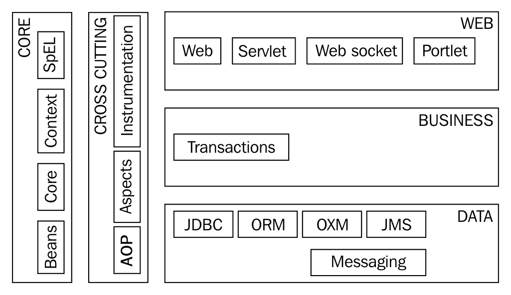

# 第一章：Spring Framework 5.0 的演变

Spring Framework 1.0 的第一个版本于 2004 年 3 月发布。在十五年多的时间里，Spring Framework 一直是构建 Java 应用程序的首选框架。

在 Java 框架相对年轻和动态的世界中，十年是很长的时间。

在本章中，我们将从理解 Spring Framework 的核心特性开始。我们将看看 Spring Framework 为什么变得受欢迎以及它如何适应以保持首选框架。在快速了解 Spring Framework 中的重要模块之后，我们将进入 Spring 项目的世界。我们将通过查看 Spring Framework 5.0 中的新功能来结束本章。

本章将回答以下问题：

+   Spring Framework 为什么受欢迎？

+   Spring Framework 如何适应应用程序架构的演变？

+   Spring Framework 中的重要模块是什么？

+   Spring Framework 在 Spring 项目的伞下适用于哪些方面？

+   Spring Framework 5.0 中的新功能是什么？

# Spring Framework

Spring 网站（[`projects.spring.io/spring-framework/`](https://projects.spring.io/spring-framework/)）对 Spring Framework 的定义如下：*Spring Framework 为现代基于 Java 的企业应用程序提供了全面的编程和配置模型*。

Spring Framework 用于连接企业 Java 应用程序。Spring Framework 的主要目标是处理连接应用程序不同部分所需的所有技术细节。这使程序员可以专注于他们的工作核心--编写业务逻辑。

# EJB 的问题

Spring Framework 于 2004 年 3 月发布。在 Spring Framework 的第一个版本发布时，开发企业应用程序的流行方式是使用 EJB 2.1。

开发和部署 EJB 是一个繁琐的过程。虽然 EJB 使组件的分发变得更容易，但开发、单元测试和部署它们并不容易。EJB 的初始版本（1.0、2.0、2.1）具有复杂的应用程序接口（API），导致人们（在大多数应用程序中是真的）认为引入的复杂性远远超过了好处：

+   难以进行单元测试。实际上，在 EJB 容器之外进行测试也很困难。

+   需要实现多个接口，具有许多不必要的方法。

+   繁琐和乏味的异常处理。

+   不方便的部署描述符。

Spring Framework 最初是作为一个旨在简化开发 Java EE 应用程序的轻量级框架而推出的。

# Spring Framework 为什么受欢迎？

Spring Framework 的第一个版本于 2004 年 3 月发布。在随后的十五年中，Spring Framework 的使用和受欢迎程度只增不减。

Spring Framework 受欢迎的重要原因如下：

+   简化单元测试--因为依赖注入

+   减少样板代码

+   架构灵活性

+   跟上时代的变化

让我们详细讨论每一个。

# 简化单元测试

早期版本的 EJB 非常难以进行单元测试。事实上，很难在容器之外运行 EJB（截至 2.1 版本）。测试它们的唯一方法是将它们部署在容器中。

Spring Framework 引入了“依赖注入”的概念。我们将在第二章“依赖注入”中详细讨论依赖注入。

依赖注入使得单元测试变得容易，可以通过将依赖项替换为它们的模拟来进行单元测试。我们不需要部署整个应用程序来进行单元测试。

简化单元测试有多重好处：

+   程序员更加高效

+   缺陷可以更早地发现，因此修复成本更低

+   应用程序具有自动化的单元测试，可以在持续集成构建中运行，以防止未来的缺陷

# 减少样板代码

在 Spring Framework 之前，典型的 J2EE（或现在称为 Java EE）应用程序包含大量的管道代码。例如：获取数据库连接、异常处理代码、事务管理代码、日志记录代码等等。

让我们看一个使用预编译语句执行查询的简单例子：

```java
    PreparedStatement st = null;
    try {
          st = conn.prepareStatement(INSERT_TODO_QUERY);
          st.setString(1, bean.getDescription());
          st.setBoolean(2, bean.isDone());
          st.execute();
        } 
    catch (SQLException e) {
          logger.error("Failed : " + INSERT_TODO_QUERY, e);
     } finally {
                if (st != null) {
           try {
           st.close();
          } catch (SQLException e) {
           // Ignore - nothing to do..
          }
       }
     }
```

在前面的例子中，有四行业务逻辑和超过 10 行管道代码。

使用 Spring Framework，相同的逻辑可以应用在几行代码中：

```java
    jdbcTemplate.update(INSERT_TODO_QUERY, 
    bean.getDescription(), bean.isDone());
```

# Spring Framework 是如何做到这一点的？

在前面的例子中，Spring JDBC（以及 Spring 总体）将大多数已检查异常转换为未检查异常。通常，当查询失败时，我们无法做太多事情 - 除了关闭语句并使事务失败。我们可以在每个方法中实现异常处理，也可以使用 Spring **面向方面的编程**（**AOP**）进行集中式异常处理并将其注入。

Spring JDBC 消除了创建所有涉及获取连接、创建预编译语句等管道代码的需要。`jdbcTemplate`类可以在 Spring 上下文中创建，并在需要时注入到**数据访问对象**（**DAO**）类中。

与前面的例子类似，Spring JMS、Spring AOP 和其他 Spring 模块有助于减少大量的管道代码。

Spring Framework 让程序员专注于程序员的主要工作 - 编写业务逻辑。

避免所有管道代码还有另一个很大的好处 - 减少代码重复。由于所有事务管理、异常处理等代码（通常是所有横切关注点）都在一个地方实现，因此更容易维护。

# 架构灵活性

Spring Framework 是模块化的。它是建立在核心 Spring 模块之上的一组独立模块。大多数 Spring 模块都是独立的 - 您可以使用其中一个而无需使用其他模块。

让我们看几个例子：

+   在 Web 层，Spring 提供了自己的框架 - Spring MVC。但是，Spring 对 Struts、Vaadin、JSF 或您选择的任何 Web 框架都有很好的支持。

+   Spring Beans 可以为您的业务逻辑提供轻量级实现。但是，Spring 也可以与 EJB 集成。

+   在数据层，Spring 通过其 Spring JDBC 模块简化了 JDBC。但是，Spring 对您喜欢的任何首选数据层框架（JPA、Hibernate（带或不带 JPA）或 iBatis）都有很好的支持。

+   您可以选择使用 Spring AOP 来实现横切关注点（日志记录、事务管理、安全等），或者可以集成一个完整的 AOP 实现，比如 AspectJ。

Spring Framework 不希望成为万能工具。在专注于减少应用程序不同部分之间的耦合并使它们可测试的核心工作的同时，Spring 与您选择的框架集成得很好。这意味着您在架构上有灵活性 - 如果您不想使用特定框架，可以轻松地用另一个替换它。

# 跟上时代的变化

Spring Framework 的第一个版本专注于使应用程序可测试。然而，随着时间的推移，出现了新的挑战。Spring Framework 设法演变并保持领先地位，提供了灵活性和模块。以下列举了一些例子：

+   注解是在 Java 5 中引入的。Spring Framework（2.5 版 - 2007 年 11 月）在引入基于注解的 Spring MVC 控制器模型方面领先于 Java EE。使用 Java EE 的开发人员必须等到 Java EE 6（2009 年 12 月 - 2 年后）才能获得类似的功能。

+   Spring 框架在 Java EE 之前引入了许多抽象概念，以使应用程序与特定实现解耦。缓存 API 就是一个例子。Spring 在 Spring 3.1 中提供了透明的缓存支持。Java EE 在 2014 年提出了*JSR-107*用于 JCache——Spring 4.1 提供了对其的支持。

Spring 带来的另一个重要的东西是 Spring 项目的总称。Spring 框架只是 Spring 项目下的众多项目之一。我们将在单独的部分讨论不同的 Spring 项目。以下示例说明了 Spring 如何通过新的 Spring 项目保持领先地位：

+   **Spring Batch**定义了构建 Java 批处理应用程序的新方法。直到 Java EE 7（2013 年 6 月）我们才有了 Java EE 中可比较的批处理应用程序规范。

+   随着架构向云和微服务发展，Spring 推出了新的面向云的 Spring 项目。Spring Cloud 有助于简化微服务的开发和部署。Spring Cloud Data Flow 提供了对微服务应用程序的编排。

# Spring 模块

Spring 框架的模块化是其广泛使用的最重要原因之一。Spring 框架非常模块化，有 20 多个不同的模块，具有明确定义的边界。

下图显示了不同的 Spring 模块——按照它们通常在应用程序中使用的层进行组织：



我们将从讨论 Spring 核心容器开始，然后再讨论其他按照它们通常在应用程序层中使用的模块分组的模块。

# Spring 核心容器

Spring 核心容器提供了 Spring 框架的核心功能——依赖注入、**IoC**（控制反转）容器和应用程序上下文。我们将在第二章“依赖注入”中更多地了解 DI 和 IoC 容器。

重要的核心 Spring 模块列在下表中：

| **模块/构件** | **用途** |
| --- | --- |
| spring-core | 其他 Spring 模块使用的实用工具。 |
| spring-beans | 支持 Spring beans。与 spring-core 结合使用，提供了 Spring 框架的核心功能——依赖注入。包括 BeanFactory 的实现。 |
| spring-context | 实现了 ApplicationContext，它扩展了 BeanFactory 并提供了加载资源和国际化等支持。 |
| spring-expression | 扩展了**EL**（来自 JSP 的表达式语言）并提供了一种用于访问和操作 bean 属性（包括数组和集合）的语言。 |

# 横切关注点

横切关注点适用于所有应用程序层——包括日志记录和安全性等。**AOP**通常用于实现横切关注点。

单元测试和集成测试属于这一类，因为它们适用于所有层。

与横切关注点相关的重要 Spring 模块如下所示：

| **模块/构件** | **用途** |
| --- | --- |
| spring-aop | 提供面向切面编程的基本支持——包括方法拦截器和切入点。 |
| spring-aspects | 提供与最流行和功能齐全的 AOP 框架 AspectJ 的集成。 |
| spring-instrument | 提供基本的仪器支持。 |
| spring-test | 提供对单元测试和集成测试的基本支持。 |

# Web

Spring 提供了自己的 MVC 框架，Spring MVC，除了与流行的 Web 框架（如 Struts）进行良好的集成。

重要的构件/模块如下所示：

+   **spring-web**：提供基本的 Web 功能，如多部分文件上传。提供与其他 Web 框架（如 Struts）的集成支持。

+   **spring-webmvc**：提供了一个功能齐全的 Web MVC 框架——Spring MVC，其中包括实现 REST 服务的功能。

我们将在第三章*使用 Spring MVC 构建 Web 应用程序*和第五章*使用 Spring Boot 构建微服务*中详细介绍 Spring MVC 并开发 Web 应用程序和 REST 服务。

# 业务

业务层专注于执行应用程序的业务逻辑。在 Spring 中，业务逻辑通常是在**普通的旧 Java 对象**（**POJO**）中实现的。

**Spring 事务**（**spring-tx**）为 POJO 和其他类提供声明式事务管理。

# 数据

应用程序中的数据层通常与数据库和/或外部接口进行通信。

以下表格列出了与数据层相关的一些重要的 Spring 模块：

| **模块/组件** | **用途** |
| --- | --- |
| spring-jdbc | 提供对 JDBC 的抽象，避免样板代码。 |
| spring-orm | 与 ORM 框架和规范集成--包括 JPA 和 Hibernate 等。 |
| spring-oxm | 提供对象到 XML 映射集成。支持 JAXB、Castor 等框架。 |
| spring-jms | 提供对 JMS 的抽象，避免样板代码。 |

# Spring 项目

虽然 Spring 框架为企业应用程序的核心功能（DI、Web、数据）提供了基础，但其他 Spring 项目探索了企业领域中的集成和解决方案--部署、云、大数据、批处理和安全等。

以下列出了一些重要的 Spring 项目：

+   Spring Boot

+   Spring Cloud

+   Spring Data

+   Spring Batch

+   Spring 安全

+   Spring HATEOAS

# Spring Boot

在开发微服务和 Web 应用程序时遇到的一些挑战如下：

+   制定框架选择和决定兼容的框架版本

+   提供外部化配置的机制--可以从一个环境更改为另一个环境的属性

+   健康检查和监控--如果应用程序的特定部分宕机，则提供警报

+   决定部署环境并为其配置应用程序

Spring Boot 通过采取*主观的观点*来解决所有这些问题。

我们将在两章中深入研究 Spring Boot--第五章*使用 Spring Boot 构建微服务*和第七章*高级 Spring Boot 功能*。

# Spring Cloud

可以毫不夸张地说*世界正在向云端迁移*。

云原生微服务和应用程序是当今的趋势。我们将在第四章*向微服务和云原生应用的演进*中详细讨论这一点。

Spring 正在迅速迈向使应用程序在云中开发变得更简单的方向，Spring Cloud 正在朝着这个方向迈进。

Spring Cloud 为分布式系统中的常见模式提供解决方案。Spring Cloud 使开发人员能够快速创建实现常见模式的应用程序。Spring Cloud 中实现的一些常见模式如下所示：

+   配置管理

+   服务发现

+   断路器

+   智能路由

我们将在第九章中更详细地讨论 Spring Cloud 及其各种功能，*Spring Cloud*。

# Spring Data

当今世界存在多个数据源--SQL（关系型）和各种 NOSQL 数据库。Spring Data 试图为所有这些不同类型的数据库提供一致的数据访问方法。

Spring Data 提供与各种规范和/或数据存储的集成：

+   JPA

+   MongoDB

+   Redis

+   Solr

+   宝石缓存

+   Apache Cassandra

以下列出了一些重要的特性：

+   通过从方法名称确定查询，提供关于存储库和对象映射的抽象

+   简单的 Spring 集成

+   与 Spring MVC 控制器的集成

+   高级自动审计功能--创建者、创建日期、最后更改者和最后更改日期

我们将在第八章中更详细地讨论 Spring Data，*Spring Data*。

# Spring Batch

今天的企业应用程序使用批处理程序处理大量数据。这些应用程序的需求非常相似。Spring Batch 提供了解决高性能要求的高容量批处理程序的解决方案。

Spring Batch 中的重要功能如下：

+   启动、停止和重新启动作业的能力--包括从失败点重新启动失败的作业的能力

+   处理数据块的能力

+   重试步骤或在失败时跳过步骤的能力

+   基于 Web 的管理界面

# Spring Security

**认证**是识别用户的过程。**授权**是确保用户有权访问资源执行已识别操作的过程。

认证和授权是企业应用程序的关键部分，包括 Web 应用程序和 Web 服务。Spring Security 为基于 Java 的应用程序提供声明性认证和授权。

Spring Security 中的重要功能如下：

+   简化的认证和授权

+   与 Spring MVC 和 Servlet API 的良好集成

+   防止常见安全攻击的支持--**跨站请求伪造**（**CSRF**）和会话固定

+   可用于与 SAML 和 LDAP 集成的模块

我们将在第三章中讨论如何使用 Spring Security 保护 Web 应用程序，*使用 Spring MVC 构建 Web 应用程序*。

我们将在第六章中讨论如何使用 Spring Security 保护基本的和 OAuth 身份验证机制的 REST 服务，*扩展微服务*。

# Spring HATEOAS

**HATEOAS**代表**超媒体作为应用程序状态的引擎**。尽管听起来复杂，但它是一个非常简单的概念。它的主要目的是解耦服务器（服务提供者）和客户端（服务消费者）。

服务提供者向服务消费者提供有关资源上可以执行的其他操作的信息。

Spring HATEOAS 提供了 HATEOAS 实现--特别是针对使用 Spring MVC 实现的 REST 服务。

Spring HATEOAS 中的重要功能如下：

+   简化了指向服务方法的链接的定义，使链接更加稳固

+   支持 JAXB（基于 XML）和 JSON 集成

+   支持服务消费者（客户端）

我们将在第六章中讨论如何在*扩展微服务*中使用 HATEOAS。

# Spring Framework 5.0 中的新功能

Spring Framework 5.0 是 Spring Framework 的首次重大升级，距离 Spring Framework 4.0 差不多四年。在这段时间内，Spring Boot 项目的主要发展之一就是演变。我们将在下一节讨论 Spring Boot 2.0 的新功能。

Spring Framework 5.0 最大的特点之一是**响应式编程**。Spring Framework 5.0 提供了核心响应式编程功能和对响应式端点的支持。重要变化的列表包括以下内容：

+   基线升级

+   JDK 9 运行时兼容性

+   在 Spring Framework 代码中使用 JDK 8 功能的能力

+   响应式编程支持

+   功能性 Web 框架

+   Jigsaw 的 Java 模块化

+   Kotlin 支持

+   删除的功能

# 基线升级

Spring Framework 5.0 具有 JDK 8 和 Java EE 7 基线。基本上，这意味着不再支持以前的 JDK 和 Java EE 版本。

Spring Framework 5.0 的重要基线 Java EE 7 规范如下：

+   Servlet 3.1

+   JMS 2.0

+   JPA 2.1

+   JAX-RS 2.0

+   Bean Validation 1.1

多个 Java 框架的最低支持版本发生了许多变化。以下列表包含一些知名框架的最低支持版本：

+   Hibernate 5

+   Jackson 2.6

+   EhCache 2.10

+   JUnit 5

+   Tiles 3

以下列表显示了支持的服务器版本：

+   Tomcat 8.5+

+   Jetty 9.4+

+   WildFly 10+

+   Netty 4.1+（用于 Spring Web Flux 的 Web 响应式编程）

+   Undertow 1.4+（用于使用 Spring Web Flux 进行 Web 响应式编程）

使用之前版本的任何规范/框架的应用程序在使用 Spring Framework 5.0 之前，至少需要升级到前面列出的版本。

# JDK 9 运行时兼容性

预计 JDK 9 将于 2017 年中期发布。Spring Framework 5.0 预计将与 JDK 9 具有运行时兼容性。

# 在 Spring Framework 代码中使用 JDK 8 特性

Spring Framework 4.x 的基线版本是 Java SE 6。这意味着它支持 Java 6、7 和 8。必须支持 Java SE 6 和 7 对 Spring Framework 代码施加了限制。框架代码无法使用 Java 8 的任何新特性。因此，虽然世界其他地方已经升级到 Java 8，Spring Framework 中的代码（至少是主要部分）仍受限于使用较早版本的 Java。

Spring Framework 5.0 的基线版本是 Java 8。Spring Framework 代码现在已升级以使用 Java 8 的新特性。这将导致更可读和更高性能的框架代码。使用的一些 Java 8 特性如下：

+   核心 Spring 接口中的 Java 8 默认方法

+   基于 Java 8 反射增强的内部代码改进

+   在框架代码中使用函数式编程--lambda 和流

# 响应式编程支持

响应式编程是 Spring Framework 5.0 最重要的特性之一。

微服务架构通常是围绕基于事件的通信构建的。应用程序被构建为对事件（或消息）做出反应。

响应式编程提供了一种专注于构建对事件做出反应的应用程序的替代编程风格。

虽然 Java 8 没有内置对响应式编程的支持，但有许多框架提供了对响应式编程的支持：

+   **响应式流**：语言中立的尝试定义响应式 API。

+   **Reactor**：由 Spring Pivotal 团队提供的 Reactive Streams 的 Java 实现。

+   **Spring WebFlux**：基于响应式编程开发 Web 应用程序的框架。提供类似于 Spring MVC 的编程模型。

我们将在《响应式编程》的第十一章中讨论响应式编程以及如何在 Spring Web Flux 中实现它。

# 功能性 Web 框架

在响应式特性的基础上，Spring 5 还提供了一个功能性 Web 框架。

功能性 Web 框架提供了使用函数式编程风格定义端点的功能。这里展示了一个简单的 hello world 示例：

```java
    RouterFunction<String> route =
    route(GET("/hello-world"),
    request -> Response.ok().body(fromObject("Hello World")));
```

功能性 Web 框架还可以用于定义更复杂的路由，如下例所示：

```java
    RouterFunction<?> route = route(GET("/todos/{id}"),
    request -> {
       Mono<Todo> todo = Mono.justOrEmpty(request.pathVariable("id"))
       .map(Integer::valueOf)
       .then(repository::getTodo);
       return Response.ok().body(fromPublisher(todo, Todo.class));
      })
     .and(route(GET("/todos"),
     request -> {
       Flux<Todo> people = repository.allTodos();
       return Response.ok().body(fromPublisher(people, Todo.class));
     }))
    .and(route(POST("/todos"),
    request -> {
      Mono<Todo> todo = request.body(toMono(Todo.class));
      return Response.ok().build(repository.saveTodo(todo));
    }));
```

需要注意的一些重要事项如下：

+   `RouterFunction`评估匹配条件以将请求路由到适当的处理程序函数

+   我们正在定义三个端点，两个 GET 和一个 POST，并将它们映射到不同的处理程序函数

我们将在《响应式编程》的第十一章中更详细地讨论 Mono 和 Flux。

# 使用 Jigsaw 的 Java 模块化

直到 Java 8 之前，Java 平台并不是模块化的。由此产生了一些重要问题：

+   **平台膨胀**：在过去的几十年中，Java 模块化并不是一个令人担忧的问题。然而，随着**物联网**（**IOT**）和新的轻量级平台如 Node.js 的出现，迫切需要解决 Java 平台的膨胀问题。（JDK 的初始版本小于 10MB。最近的 JDK 版本需要超过 200MB。）

+   **JAR Hell**：另一个重要问题是 JAR Hell 的问题。当 Java ClassLoader 找到一个类时，它不会查看是否有其他可用于该类的定义。它会立即加载找到的第一个类。如果应用程序的两个不同部分需要来自不同 JAR 的相同类，它们无法指定必须从哪个 JAR 加载该类。

**开放系统网关倡议**（**OSGi**）是 1999 年开始的倡议之一，旨在将模块化引入 Java 应用程序。

每个模块（称为捆绑包）定义如下：

+   **imports**: 模块使用的其他捆绑包

+   **exports**: 此捆绑包导出的包

每个模块都可以有自己的生命周期。它可以独立安装、启动和停止。

Jigsaw 是**Java 社区进程**（**JCP**）下的一个倡议，从 Java 7 开始，旨在将模块化引入 Java。它有两个主要目标：

+   为 JDK 定义和实现模块化结构

+   为构建在 Java 平台上的应用程序定义模块系统

预计 Jigsaw 将成为 Java 9 的一部分，Spring Framework 5.0 预计将包括对 Jigsaw 模块的基本支持。

# Kotlin 支持

Kotlin 是一种静态类型的 JVM 语言，可以编写富有表现力、简短和可读的代码。Spring Framework 5.0 对 Kotlin 有很好的支持。

考虑一个简单的 Kotlin 程序，演示如下所示的数据类：

```java
    import java.util.*
    data class Todo(var description: String, var name: String, var  
    targetDate : Date)
    fun main(args: Array<String>) {
      var todo = Todo("Learn Spring Boot", "Jack", Date())
      println(todo)
        //Todo(description=Learn Spring Boot, name=Jack, 
        //targetDate=Mon May 22 04:26:22 UTC 2017)
      var todo2 = todo.copy(name = "Jill")
      println(todo2)
         //Todo(description=Learn Spring Boot, name=Jill, 
         //targetDate=Mon May 22 04:26:22 UTC 2017)
      var todo3 = todo.copy()
      println(todo3.equals(todo)) //true
    }  
```

在不到 10 行的代码中，我们创建并测试了一个具有三个属性和以下功能的数据 bean：

+   `equals()`

+   `hashCode()`

+   `toString()`

+   `copy()`

Kotlin 是强类型的。但是不需要显式指定每个变量的类型：

```java
    val arrayList = arrayListOf("Item1", "Item2", "Item3") 
    // Type is ArrayList
```

命名参数允许您在调用方法时指定参数的名称，从而使代码更易读：

```java
    var todo = Todo(description = "Learn Spring Boot", 
    name = "Jack", targetDate = Date())
```

Kotlin 通过提供默认变量（`it`）和诸如`take`、`drop`等方法来简化函数式编程：

```java
    var first3TodosOfJack = students.filter { it.name == "Jack"   
     }.take(3)
```

您还可以在 Kotlin 中为参数指定默认值：

```java
    import java.util.*
    data class Todo(var description: String, var name: String, var
    targetDate : Date = Date())
    fun main(args: Array<String>) {
      var todo = Todo(description = "Learn Spring Boot", name = "Jack")
    }
```

凭借其使代码简洁和表达力的所有功能，我们期望 Kotlin 成为要学习的语言。

我们将在第十三章“在 Spring 中使用 Kotlin”中更多地讨论 Kotlin。

# 已删除的功能

Spring Framework 5 是一个主要的 Spring 版本，基线版本大幅增加。随着 Java、Java EE 和其他一些框架的基线版本的增加，Spring Framework 5 取消了对一些框架的支持：

+   Portlet

+   Velocity

+   JasperReports

+   XMLBeans

+   JDO

+   Guava

如果您使用了上述任何框架，建议您计划迁移并继续使用直到 2019 年支持的 Spring Framework 4.3。

# Spring Boot 2.0 的新功能

Spring Boot 的第一个版本于 2014 年发布。以下是预计在 Spring Boot 2.0 中的一些重要更新：

+   基线 JDK 版本是 Java 8

+   Spring Framework 5.0 的基线版本是 Spring Framework 5.0

+   Spring Boot 2.0 支持使用 WebFlux 进行响应式 Web 编程

一些重要框架的最低支持版本如下所示：

+   Jetty 9.4

+   Tomcat 8.5

+   Hibernate 5.2

+   Gradle 3.4

我们将在第五章“使用 Spring Boot 构建微服务”和第七章“高级 Spring Boot 功能”中广泛讨论 Spring Boot。

# 摘要

在过去的十五年中，Spring Framework 显着改善了开发 Java 企业应用程序的体验。Spring Framework 5.0 带来了许多功能，同时显着增加了基线。

在随后的章节中，我们将介绍依赖注入，并了解如何使用 Spring MVC 开发 Web 应用程序。之后，我们将进入微服务的世界。在第五章“使用 Spring Boot 构建微服务”、第六章“扩展微服务”和第七章“高级 Spring Boot 功能”中，我们将介绍 Spring Boot 如何简化微服务的创建。然后，我们将把注意力转向使用 Spring Cloud 和 Spring Cloud Data Flow 在云中构建应用程序。
