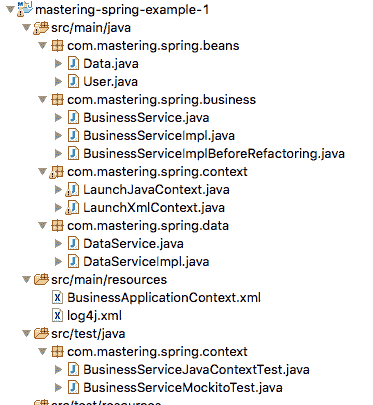
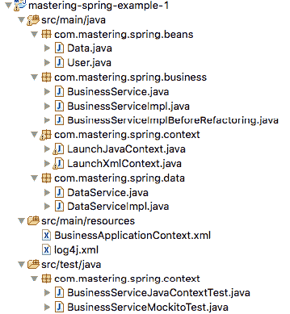

# 第二章：依赖注入

我们编写的任何 Java 类都依赖于其他类。类依赖的其他类是其依赖项。如果一个类直接创建依赖项的实例，它们之间建立了紧耦合。使用 Spring，创建和连接对象的责任被一个称为**IoC 容器**的新组件接管。类定义依赖关系，Spring 的**控制反转**（**IoC**）容器创建对象并将依赖项连接在一起。这个革命性的概念，即创建和连接依赖项的控制被容器接管，被称为 IoC 或**依赖注入**（**DI**）。

在本章中，我们首先探讨了 DI 的需求。我们使用一个简单的例子来说明 DI 的用法。我们将了解 DI 的重要优势--更容易维护，耦合度更低和改进的可测试性。我们将探索 Spring 中的 DI 选项。我们将结束本章，看一下 Java 的标准 DI 规范**上下文和依赖注入**（**CDI**）以及 Spring 如何支持它。

本章将回答以下问题：

+   什么是依赖注入？

+   依赖注入的正确使用如何使应用程序可测试？

+   Spring 如何使用注解实现 DI？

+   什么是组件扫描？

+   Java 和 XML 应用上下文之间有什么区别？

+   如何为 Spring 上下文创建单元测试？

+   模拟如何使单元测试更简单？

+   不同的 bean 作用域是什么？

+   什么是 CDI 以及 Spring 如何支持 CDI？

# 理解依赖注入

我们将看一个例子来理解依赖注入。我们将编写一个简单的业务服务，与一个数据服务交互。我们将使代码可测试，并看到正确使用 DI 如何使代码可测试。

以下是我们将遵循的步骤顺序：

1.  编写一个业务服务与数据服务交互的简单示例。当业务服务直接创建数据服务的实例时，它们之间是紧密耦合的。单元测试将会很困难。

1.  通过将创建数据服务的责任移出业务服务，使代码松耦合。

1.  引入 Spring IoC 容器来实例化 bean 并将它们连接在一起。

1.  探索 Spring 提供的 XML 和 Java 配置选项。

1.  探索 Spring 单元测试选项。

1.  使用模拟编写真正的单元测试。

# 理解依赖关系

我们将从编写一个简单的例子开始；一个业务服务与另一个数据服务交互。大多数 Java 类依赖于其他类。这些被称为该类的**依赖项**。

看一个示例类`BusinessServiceImpl`，如下所示：

```java
    public class BusinessServiceImpl { 
      public long calculateSum(User user) { 
        DataServiceImpl dataService = new DataServiceImpl(); 
        long sum = 0; 
        for (Data data : dataService.retrieveData(user)) { 
          sum += data.getValue(); 
        } 
        return sum; 
      }
    }
```

通常，所有设计良好的应用程序都有多个层。每个层都有明确定义的责任。业务层包含业务逻辑。数据层与外部接口和/或数据库交互以获取数据。在前面的例子中，`DataServiceImpl`类从数据库中获取与用户相关的一些数据。`BusinessServiceImpl`类是一个典型的业务服务，与数据服务`DataServiceImpl`交互获取数据，并在其上添加业务逻辑（在本例中，业务逻辑非常简单：计算数据服务返回的数据的总和）。

`BusinessServiceImpl`依赖于`DataServiceImpl`。因此，`DataServiceImpl`是`BusinessServiceImpl`的一个依赖项。

关注`BusinessServiceImpl`如何创建`DataServiceImpl`的实例。

```java
    DataServiceImpl dataService = new DataServiceImpl();
```

`BusinessServiceImpl`自己创建一个实例。这是紧耦合。

想一想单元测试；如何在不涉及（或实例化）`DataServiceImpl`类的情况下对`BusinessServiceImpl`类进行单元测试？这很困难。人们可能需要做复杂的事情，比如使用反射来编写单元测试。因此，前面的代码是不可测试的。

当您可以轻松地为代码编写简单的单元测试时，代码（方法、一组方法或类）就是可测试的。单元测试中使用的方法之一是模拟依赖关系。我们将稍后更详细地讨论模拟。

这是一个需要思考的问题：我们如何使前面的代码可测试？我们如何减少`BusinessServiceImpl`和`DataServiceImpl`之间的紧耦合？

我们可以做的第一件事是为`DataServiceImpl`创建一个接口。我们可以在`BusinessServiceImpl`中使用`DataServiceImpl`的新创建接口，而不是直接使用该类。

以下代码显示了如何创建一个接口：

```java
    public interface DataService { 
     List<Data> retrieveData(User user); 
    }
```

让我们更新`BusinessServiceImpl`中的代码以使用接口：

```java
    DataService dataService = new DataServiceImpl();
```

使用接口有助于创建松散耦合的代码。我们可以将任何接口实现替换为一个明确定义的依赖关系。

例如，考虑一个需要进行一些排序的业务服务。

第一个选项是直接在代码中使用排序算法，例如冒泡排序。第二个选项是为排序算法创建一个接口并使用该接口。具体的算法可以稍后连接。在第一个选项中，当我们需要更改算法时，我们需要更改代码。在第二个选项中，我们只需要更改连接。

我们现在使用`DataService`接口，但`BusinessServiceImpl`仍然紧密耦合，因为它创建了`DataServiceImpl`的实例。我们如何解决这个问题？

`BusinessServiceImpl`不自己创建`DataServiceImpl`的实例怎么样？我们可以在其他地方创建`DataServiceImpl`的实例（稍后我们将讨论谁将创建实例）并将其提供给`BusinessServiceImpl`吗？

为了实现这一点，我们将更新`BusinessServiceImpl`中的代码，为`DataService`添加一个 setter。`calculateSum`方法也更新为使用此引用。更新后的代码如下：

```java
    public class BusinessServiceImpl { 
      private DataService dataService; 
      public long calculateSum(User user) { 
        long sum = 0; 
        for (Data data : dataService.retrieveData(user)) { 
          sum += data.getValue(); 
         } 
        return sum; 
       } 
      public void setDataService(DataService dataService) { 
        this.dataService = dataService; 
       } 
    }
```

除了为数据服务创建一个 setter 之外，我们还可以创建一个接受数据服务作为参数的`BusinessServiceImpl`构造函数。这称为**构造函数注入**。

您可以看到`BusinessServiceImpl`现在可以与`DataService`的任何实现一起工作。它与特定实现`DataServiceImpl`没有紧密耦合。

为了使代码更加松散耦合（在开始编写测试时），让我们为`BusinessService`创建一个接口，并更新`BusinessServiceImpl`以实现该接口：

```java
    public interface BusinessService { 
      long calculateSum(User user); 
    } 
    public class BusinessServiceImpl implements BusinessService { 
      //.... Rest of code.. 
    }
```

现在我们已经减少了耦合，但仍然有一个问题；谁负责创建`DataServiceImpl`类的实例并将其连接到`BusinessServiceImpl`类？

这正是 Spring IoC 容器发挥作用的地方。

# Spring IoC 容器

Spring IoC 容器根据应用程序开发人员创建的配置设置创建 bean 并将它们连接在一起。

需要回答以下问题：

+   问题 1：Spring IoC 容器如何知道要创建哪些 bean？具体来说，Spring IoC 容器如何知道要为`BusinessServiceImpl`和`DataServiceImpl`类创建 bean？

+   问题 2：Spring IoC 容器如何知道如何将 bean 连接在一起？具体来说，Spring IoC 容器如何知道将`DataServiceImpl`类的实例注入`BusinessServiceImpl`类？

+   问题 3：Spring IoC 容器如何知道在哪里搜索 bean？在类路径中搜索所有包并不高效。

在我们专注于创建容器之前，让我们先专注于问题 1 和 2；如何定义需要创建哪些 bean 以及如何将它们连接在一起。

# 定义 bean 和装配

让我们先解决第一个问题；Spring IoC 容器如何知道要创建哪些 bean？

我们需要告诉 Spring IoC 容器要创建哪些 bean。这可以通过在需要创建 bean 的类上使用`@Repository`或`@Component`或`@Service`注解来完成。所有这些注解告诉 Spring 框架在定义这些注解的特定类中创建 bean。

`@Component`注解是定义 Spring bean 的最通用方式。其他注解具有更具体的上下文。`@Service`注解用于业务服务组件。`@Repository`注解用于**数据访问对象**（**DAO**）组件。

我们在`DataServiceImpl`上使用`@Repository`注解，因为它与从数据库获取数据有关。我们在`BusinessServiceImpl`类上使用`@Service`注解，因为它是一个业务服务：

```java
    @Repository 
    public class DataServiceImpl implements DataService 
    @Service 
    public class BusinessServiceImpl implements BusinessService
```

现在让我们把注意力转移到第二个问题上--Spring IoC 容器如何知道如何将 bean 装配在一起？`DataServiceImpl`类的 bean 需要注入到`BusinessServiceImpl`类的 bean 中。

我们可以通过在`BusinessServiceImpl`类中的`DataService`接口的实例变量上指定一个`@Autowired`注解来实现这一点：

```java
    public class BusinessServiceImpl { 
      @Autowired 
      private DataService dataService;
```

现在我们已经定义了 bean 和它们的装配，为了测试这一点，我们需要一个`DataService`的实现。我们将创建一个简单的、硬编码的实现。`DataServiceImpl`返回一些数据：

```java
    @Repository 
    public class DataServiceImpl implements DataService { 
      public List<Data> retrieveData(User user) { 
        return Arrays.asList(new Data(10), new Data(20)); 
      } 
    }
```

现在我们已经定义了我们的 bean 和依赖关系，让我们专注于如何创建和运行 Spring IoC 容器。

# 创建 Spring IoC 容器

创建 Spring IoC 容器有两种方式：

+   Bean 工厂

+   应用程序上下文

Bean 工厂是所有 Spring IoC 功能的基础--bean 的生命周期和装配。应用程序上下文基本上是 Bean 工厂的超集，具有在企业环境中通常需要的附加功能。Spring 建议在所有情况下使用应用程序上下文，除非应用程序上下文消耗的额外几 KB 内存是关键的。

让我们使用应用程序上下文来创建一个 Spring IoC 容器。我们可以使用 Java 配置或 XML 配置来创建应用程序上下文。让我们首先使用 Java 应用程序配置。

# 应用程序上下文的 Java 配置

以下示例显示了如何创建一个简单的 Java 上下文配置：

```java
    @Configuration 
    class SpringContext { 
    }
```

关键是`@Configuration`注解。这就是定义这个为 Spring 配置的地方。

还有一个问题；Spring IoC 容器如何知道在哪里搜索 bean？

我们需要告诉 Spring IoC 容器要搜索的包，通过定义一个组件扫描。让我们在之前的 Java 配置定义中添加一个组件扫描：

```java
    @Configuration 
    @ComponentScan(basePackages = { "com.mastering.spring" }) 
     class SpringContext { 
     }
```

我们已经为`com.mastering.spring`包定义了一个组件扫描。它展示了我们到目前为止讨论的所有类是如何组织的。到目前为止，我们定义的所有类都按如下方式存在于这个包中：



# 快速回顾

让我们花一点时间回顾一下我们到目前为止所做的一切，以使这个例子工作起来：

+   我们已经定义了一个 Spring 配置类`SpringContext`，带有`@Configuration`注解和一个对`com.mastering.spring`包的组件扫描

+   我们有一些文件（在前面的包中）：

+   `BusinessServiceImpl`带有`@Service`注解

+   `DataServiceImpl`带有`@Repository`注解

+   `BusinessServiceImpl`在`DataService`的实例上有`@Autowired`注解

当我们启动一个 Spring 上下文时，将会发生以下事情：

+   它将扫描`com.mastering.spring`包，并找到`BusinessServiceImpl`和`DataServiceImpl`的 bean。

+   `DataServiceImpl`没有任何依赖。因此，将创建`DataServiceImpl`的 bean。

+   `BusinessServiceImpl`依赖于`DataService`。`DataServiceImpl`是`DataService`接口的实现。因此，它符合自动装配的条件。因此，为`BusinessServiceImpl`创建了一个 bean，并且为`DataServiceImpl`创建的 bean 通过 setter 自动装配到它。

# 使用 Java 配置启动应用程序上下文

以下程序显示了如何启动 Java 上下文；我们使用主方法使用`AnnotationConfigApplicationContext`启动应用程序上下文：

```java
    public class LaunchJavaContext { 
      private static final User DUMMY_USER = new User("dummy"); 
      public static Logger logger =  
      Logger.getLogger(LaunchJavaContext.class); 
      public static void main(String[] args) { 
        ApplicationContext context = new 
        AnnotationConfigApplicationContext( 
        SpringContext.class); 
        BusinessService service = 
        context.getBean(BusinessService.class); 
        logger.debug(service.calculateSum(DUMMY_USER)); 
      } 
     }
```

以下代码行创建应用程序上下文。我们希望基于 Java 配置创建应用程序上下文。因此，我们使用`AnnotationConfigApplicationContext`：

```java
    ApplicationContext context = new 
    AnnotationConfigApplicationContext( 
      SpringContext.class);
```

一旦上下文启动，我们将需要获取业务服务 bean。我们使用`getBean`方法，传递 bean 的类型（`BusinessService.class`）作为参数：

```java
    BusinessService service = context.getBean(BusinessService.class );
```

我们已准备好通过运行`LaunchJavaContext`程序来启动应用程序上下文。

# 控制台日志

以下是使用`LaunchJavaContext`启动上下文后日志中的一些重要语句。让我们快速查看日志，以深入了解 Spring 正在做什么：

前几行显示了组件扫描的操作：

```java
Looking for matching resources in directory tree [/target/classes/com/mastering/spring]

Identified candidate component class: file [/in28Minutes/Workspaces/SpringTutorial/mastering-spring-example-1/target/classes/com/mastering/spring/business/BusinessServiceImpl.class]

Identified candidate component class: file [/in28Minutes/Workspaces/SpringTutorial/mastering-spring-example-1/target/classes/com/mastering/spring/data/DataServiceImpl.class]

defining beans [******OTHERS*****,businessServiceImpl,dataServiceImpl];
```

Spring 现在开始创建 bean。它从`businessServiceImpl`开始，但它有一个自动装配的依赖项：

```java
Creating instance of bean 'businessServiceImpl'Registered injected element on class [com.mastering.spring.business.BusinessServiceImpl]: AutowiredFieldElement for private com.mastering.spring.data.DataService com.mastering.spring.business.BusinessServiceImpl.dataService 

Processing injected element of bean 'businessServiceImpl': AutowiredFieldElement for private com.mastering.spring.data.DataService com.mastering.spring.business.BusinessServiceImpl.dataService
```

Spring 继续移动到`dataServiceImpl`并为其创建一个实例：

```java
Creating instance of bean 'dataServiceImpl'
Finished creating instance of bean 'dataServiceImpl'
```

Spring 将`dataServiceImpl`自动装配到`businessServiceImpl`：

```java
Autowiring by type from bean name 'businessServiceImpl' to bean named 'dataServiceImpl'
Finished creating instance of bean 'businessServiceImpl'
```

# 应用程序上下文的 XML 配置

在上一个示例中，我们使用了 Spring Java 配置来启动应用程序上下文。Spring 也支持 XML 配置。

以下示例显示了如何使用 XML 配置启动应用程序上下文。这将有两个步骤：

+   定义 XML Spring 配置

+   使用 XML 配置启动应用程序上下文

# 定义 XML Spring 配置

以下示例显示了典型的 XML Spring 配置。此配置文件在`src/main/resources`目录中创建，名称为`BusinessApplicationContext.xml`：

```java
    <?xml version="1.0" encoding="UTF-8" standalone="no"?> 
    <beans>  <!-Namespace definitions removed--> 
      <context:component-scan base-package ="com.mastering.spring"/> 
    </beans>
```

使用`context:component-scan`定义组件扫描。

# 使用 XML 配置启动应用程序上下文

以下程序显示了如何使用 XML 配置启动应用程序上下文。我们使用主方法使用`ClassPathXmlApplicationContext`启动应用程序上下文：

```java
    public class LaunchXmlContext { 
      private static final User DUMMY_USER = new User("dummy"); 
      public static Logger logger = 
      Logger.getLogger(LaunchJavaContext.class); 
      public static void main(String[] args) { 
         ApplicationContext context = new
         ClassPathXmlApplicationContext( 
         "BusinessApplicationContext.xml"); 
         BusinessService service =
         context.getBean(BusinessService.class); 
         logger.debug(service.calculateSum(DUMMY_USER)); 
        } 
     }
```

以下代码行创建应用程序上下文。我们希望基于 XML 配置创建应用程序上下文。因此，我们使用`ClassPathXmlApplicationContext`创建应用程序上下文：`AnnotationConfigApplicationContext`。

```java
    ApplicationContext context = new 
    ClassPathXmlApplicationContext (SpringContext.class);
```

一旦上下文启动，我们将需要获取对业务服务 bean 的引用。这与我们使用 Java 配置所做的非常相似。我们使用`getBean`方法，传递 bean 的类型（`BusinessService.class`）作为参数。

我们可以继续运行`LaunchXmlContext`类。您会注意到，我们得到的输出与使用 Java 配置运行上下文时非常相似。

# 使用 Spring 上下文编写 JUnit

在前面的部分中，我们看了如何从主方法启动 Spring 上下文。现在让我们将注意力转向从单元测试中启动 Spring 上下文。

我们可以使用`SpringJUnit4ClassRunner.class`作为运行器来启动 Spring 上下文：

```java
    @RunWith(SpringJUnit4ClassRunner.class)
```

我们需要提供上下文配置的位置。我们将使用之前创建的 XML 配置。以下是您可以声明的方式：

```java
    @ContextConfiguration(locations = {  
    "/BusinessApplicationContext.xml" })
```

我们可以使用`@Autowired`注解将上下文中的 bean 自动装配到测试中。BusinessService 是按类型自动装配的：

```java
    @Autowired 
    private BusinessService service;
```

目前，已经自动装配的`DataServiceImpl`返回`Arrays.asList(new Data(10)`，`new Data(20))`。`BusinessServiceImpl`计算和返回`10`+`20`的和`30`。我们将使用`assertEquals`在测试方法中断言`30`：

```java
    long sum = service.calculateSum(DUMMY_USER); 
    assertEquals(30, sum);
```

为什么我们在书中这么早介绍单元测试？

实际上，我们认为我们已经迟了。理想情况下，我们会喜欢使用**测试驱动开发**（**TDD**）并在编写代码之前编写测试。根据我的经验，进行 TDD 会导致简单、可维护和可测试的代码。

单元测试有许多优点：

+   对未来缺陷的安全网

+   早期发现缺陷

+   遵循 TDD 会导致更好的设计

+   良好编写的测试充当代码和功能的文档--特别是使用 BDD Given-When-Then 风格编写的测试

我们将编写的第一个测试实际上并不是一个单元测试。我们将在这个测试中加载所有的 bean。下一个使用模拟编写的测试将是一个真正的单元测试，其中被单元测试的功能是正在编写的特定代码单元。

测试的完整列表如下；它有一个测试方法：

```java
    @RunWith(SpringJUnit4ClassRunner.class) 
    @ContextConfiguration(locations = {
      "/BusinessApplicationContext.xml" }) 
       public class BusinessServiceJavaContextTest { 
       private static final User DUMMY_USER = new User("dummy"); 
       @Autowired 
       private BusinessService service; 

       @Test 
       public void testCalculateSum() { 
         long sum = service.calculateSum(DUMMY_USER); 
         assertEquals(30, sum); 
        } 
     }
```

我们编写的**JUnit**存在一个问题。它不是一个真正的单元测试。这个测试使用了`DataServiceImpl`的真实（几乎）实现进行 JUnit 测试。因此，我们实际上正在测试`BusinessServiceImpl`和`DataServiceImpl`的功能。这不是单元测试。

现在的问题是；如何在不使用`DataService`的真实实现的情况下对`BusinessServiceImpl`进行单元测试？

有两个选项：

+   创建数据服务的存根实现，在`src\test\java`文件夹中提供一些虚拟数据。使用单独的测试上下文配置来自动装配存根实现，而不是真正的`DataServiceImpl`类。

+   创建一个`DataService`的模拟并将其自动装配到`BusinessServiceImpl`中。

创建存根实现意味着创建一个额外的类和一个额外的上下文。存根变得更难维护，因为我们需要更多的数据变化来进行单元测试。

在下一节中，我们将探讨使用模拟进行单元测试的第二个选项。随着模拟框架（特别是 Mockito）在过去几年中的进步，您将看到我们甚至不需要启动 Spring 上下文来执行单元测试。

# 使用模拟进行单元测试

让我们从理解模拟开始。模拟是创建模拟真实对象行为的对象。在前面的例子中，在单元测试中，我们希望模拟`DataService`的行为。

与存根不同，模拟可以在运行时动态创建。我们将使用最流行的模拟框架 Mockito。要了解有关 Mockito 的更多信息，我们建议查看[`github.com/mockito/mockito/wiki/FAQ`](https://github.com/mockito/mockito/wiki/FAQ)上的 Mockito 常见问题解答。

我们将创建一个`DataService`的模拟。使用 Mockito 创建模拟有多种方法。让我们使用其中最简单的方法--注解。我们使用`@Mock`注解来创建`DataService`的模拟：

```java
    @Mock 
    private DataService dataService;
```

创建模拟后，我们需要将其注入到被测试的类`BusinessServiceImpl`中。我们使用`@InjectMocks`注解来实现：

```java
    @InjectMocks 
    private BusinessService service = 
    new BusinessServiceImpl();
```

在测试方法中，我们将需要存根模拟服务以提供我们想要提供的数据。有多种方法。我们将使用 Mockito 提供的 BDD 风格方法来模拟`retrieveData`方法：

```java
    BDDMockito.given(dataService.retrieveData(
      Matchers.any(User.class))) 
      .willReturn(Arrays.asList(new Data(10),  
      new Data(15), new Data(25)));
```

在前面的代码中我们定义的是所谓的存根。与 Mockito 的任何东西一样，这是非常易读的。当在`dataService`模拟上调用`retrieveData`方法并传入任何`User`类型的对象时，它将返回一个具有指定值的三个项目的列表。

当我们使用 Mockito 注解时，我们需要使用特定的 JUnit 运行器，即`MockitoJunitRunner`。`MockitoJunitRunner`有助于保持测试代码的清晰，并在测试失败时提供清晰的调试信息。`MockitoJunitRunner`在执行每个测试方法后初始化带有`@Mock`注解的 bean，并验证框架的使用。

```java
    @RunWith(MockitoJUnitRunner.class)
```

测试的完整列表如下。它有一个测试方法：

```java
    @RunWith(MockitoJUnitRunner.class) 
    public class BusinessServiceMockitoTest { 
      private static final User DUMMY_USER = new User("dummy");
       @Mock 
      private DataService dataService; 
      @InjectMocks 
      private BusinessService service =  
      new BusinessServiceImpl(); 
      @Test 
      public void testCalculateSum() { 
        BDDMockito.given(dataService.retrieveData( 
        Matchers.any(User.class))) 
        .willReturn( 
           Arrays.asList(new Data(10),  
           new Data(15), new Data(25))); 
           long sum = service.calculateSum(DUMMY_USER); 
           assertEquals(10 + 15 + 25, sum); 
       } 
     }
```

# 容器管理的 bean

与其类自己创建其依赖项，我们之前的示例中看到了 Spring IoC 容器如何接管管理 bean 及其依赖项的责任。由容器管理的 bean 称为**容器管理的 bean**。



将 bean 的创建和管理委托给容器有许多优点。其中一些列举如下：

+   由于类不负责创建依赖项，它们之间松耦合且易于测试。这导致了良好的设计和较少的缺陷。

+   由于容器管理 bean，可以以更通用的方式引入围绕 bean 的一些钩子。诸如日志记录、缓存、事务管理和异常处理等横切关注点可以使用**面向方面的编程**（**AOP**）围绕这些 bean 进行编织。这导致了更易于维护的代码。

# 依赖注入类型

在前面的示例中，我们使用了 setter 方法来注入依赖项。经常使用的两种依赖注入类型是：

+   setter 注入

+   构造函数注入

# setter 注入

setter 注入用于通过 setter 方法注入依赖项。在以下示例中，`DataService`的实例使用了 setter 注入：

```java
    public class BusinessServiceImpl { 
      private DataService dataService; 
      @Autowired 
      public void setDataService(DataService dataService) { 
        this.dataService = dataService; 
      } 
    }
```

实际上，为了使用 setter 注入，甚至不需要声明 setter 方法。如果在变量上指定了`@Autowired`，Spring 会自动使用 setter 注入。因此，以下代码就是您为`DataService`进行 setter 注入所需要的全部内容：

```java
    public class BusinessServiceImpl { 
      @Autowired 
      private DataService dataService; 
    }
```

# 构造函数注入

构造函数注入，另一方面，使用构造函数来注入依赖项。以下代码显示了如何在`DataService`中使用构造函数进行注入：

```java
    public class BusinessServiceImpl { 
      private DataService dataService; 
      @Autowired 
      public BusinessServiceImpl(DataService dataService) { 
        super(); 
        this.dataService = dataService; 
      } 
    }
```

当您运行具有前面`BusinessServiceImpl`实现的代码时，您将在日志中看到此语句，断言使用构造函数进行了自动装配：

```java
    Autowiring by type from bean name 'businessServiceImpl' via 
    constructor to bean named 'dataServiceImpl'
```

# 构造函数与 setter 注入

最初，在基于 XML 的应用程序上下文中，我们使用构造函数注入来处理强制依赖项，使用 setter 注入来处理非强制依赖项。

然而，需要注意的一点是，当我们在字段或方法上使用`@Autowired`时，默认情况下依赖项是必需的。如果没有可用于`@Autowired`字段的候选项，自动装配将失败并抛出异常。因此，在 Java 应用程序上下文中，选择并不那么明显。

使用 setter 注入会导致对象在创建过程中状态发生变化。对于不可变对象的粉丝来说，构造函数注入可能是更好的选择。有时使用 setter 注入可能会隐藏一个类具有大量依赖项的事实。使用构造函数注入会使这一点显而易见，因为构造函数的大小会增加。

# Spring bean 作用域

Spring bean 可以创建多种作用域。默认作用域是单例模式。

由于单例 bean 只有一个实例，因此不能包含特定于请求的任何数据。

可以在任何 Spring bean 上使用`@Scope`注解来提供作用域：

```java
    @Service 
    @Scope("singleton") 
    public class BusinessServiceImpl implements BusinessService
```

以下表格显示了可用于 bean 的不同作用域类型：

| **作用域** | **用途** |
| --- | --- |
| `Singleton` | 默认情况下，所有 bean 都是单例作用域。每个 Spring IoC 容器实例只使用一次这样的 bean 实例。即使有多个对 bean 的引用，它也只在容器中创建一次。单个实例被缓存并用于使用此 bean 的所有后续请求。重要的是要指出，Spring 单例作用域是一个 Spring 容器中的一个对象。如果在单个 JVM 中有多个 Spring 容器，则可以有多个相同 bean 的实例。因此，Spring 单例作用域与典型的单例定义有些不同。 |
| `Prototype` | 每次从 Spring 容器请求 bean 时都会创建一个新实例。如果 bean 包含状态，建议您为其使用原型范围。 |
| `request` | 仅在 Spring Web 上下文中可用。为每个 HTTP 请求创建一个 bean 的新实例。一旦请求处理完成，bean 就会被丢弃。适用于保存特定于单个请求的数据的 bean。 |
| `session` | 仅在 Spring Web 上下文中可用。为每个 HTTP 会话创建一个 bean 的新实例。适用于特定于单个用户的数据，例如 Web 应用程序中的用户权限。 |
| `application` | 仅在 Spring Web 上下文中可用。每个 Web 应用程序一个 bean 实例。适用于特定环境的应用程序配置等内容。 |

# Java 与 XML 配置

随着 Java 5 中注解的出现，基于 Java 的配置在基于 Spring 的应用程序中得到了广泛使用。如果必须在基于 Java 的配置和基于 XML 的配置之间进行选择，应该做出什么样的选择？

Spring 对基于 Java 和基于 XML 的配置提供了同样良好的支持。因此，选择权在于程序员及其团队。无论做出何种选择，都很重要的是在团队和项目之间保持一致。在做出选择时，可能需要考虑以下一些事项：

+   注解导致 bean 定义更短、更简单。

+   注解比基于 XML 的配置更接近其适用的代码。

+   使用注解的类不再是简单的 POJO，因为它们使用了特定于框架的注解。

+   使用注解时出现自动装配问题可能很难解决，因为连线不再是集中的，也没有明确声明。

+   如果它被打包在应用程序包装之外--WAR 或 EAR，使用 Spring 上下文 XML 可能会有更灵活的连线优势。这将使我们能够为集成测试设置不同的设置，例如。

# 深入了解@Autowired 注解

当在依赖项上使用`@Autowired`时，应用程序上下文会搜索匹配的依赖项。默认情况下，所有自动装配的依赖项都是必需的。

可能的结果如下：

+   **找到一个匹配项**：这就是你要找的依赖项

+   **找到多个匹配项**：自动装配失败

+   **找不到匹配项**：自动装配失败

可以通过两种方式解决找到多个候选项的情况：

+   使用`@Primary`注解标记其中一个候选项作为要使用的候选项

+   使用`@Qualifier`进一步限定自动装配

# @Primary 注解

当在 bean 上使用`@Primary`注解时，它将成为在自动装配特定依赖项时可用的多个候选项中的主要候选项。

在以下示例中，有两种排序算法可用：`QuickSort`和`MergeSort`。如果组件扫描找到它们两个，`QuickSort`将用于在`SortingAlgorithm`上连线任何依赖项，因为有`@Primary`注解：

```java
    interface SortingAlgorithm { 
    } 
    @Component 
    class MergeSort implements SortingAlgorithm { 
      // Class code here 
    } 
   @Component 
   @Primary 
   class QuickSort implements SortingAlgorithm { 
     // Class code here 
   }
```

# @Qualifier 注解

`@Qualifier`注解可用于给出对 Spring bean 的引用。该引用可用于限定需要自动装配的依赖项。

在以下示例中，有两种排序算法可用：`QuickSort`和`MergeSort`。但由于`SomeService`类中使用了`@Qualifier("mergesort")`，因此`MergeSort`成为了自动装配选定的候选依赖项，因为它也在其上定义了`mergesort`限定符。

```java
    @Component 
    @Qualifier("mergesort") 
    class MergeSort implements SortingAlgorithm { 
      // Class code here 
    } 
    @Component 
    class QuickSort implements SortingAlgorithm { 
     // Class code here 
    } 
    @Component 
    class SomeService { 
      @Autowired 
      @Qualifier("mergesort") 
      SortingAlgorithm algorithm; 
    }
```

# 其他重要的 Spring 注解

Spring 在定义 bean 和管理 bean 的生命周期方面提供了很大的灵活性。还有一些其他重要的 Spring 注解，我们将在下表中讨论。

| **注解** | **用途** |
| --- | --- |
| `@ScopedProxy` | 有时，我们需要将一个请求或会话作用域的 bean 注入到单例作用域的 bean 中。在这种情况下，`@ScopedProxy`注解提供了一个智能代理，可以注入到单例作用域的 bean 中。 |

`@Component`、`@Service`、`@Controller`、`@Repository` | `@Component`是定义 Spring bean 的最通用方式。其他注解与它们关联的上下文更具体。

+   `@Service` 用于业务服务层

+   `@Repository` 用于**数据访问对象**（**DAO**）

+   `@Controller` 用于表示组件

|

| `@PostConstruct` | 在任何 Spring bean 上，可以使用`@PostConstruct`注解提供一个 post construct 方法。这个方法在 bean 完全初始化了依赖项后被调用。这将在 bean 生命周期中只被调用一次。 |
| --- | --- |
| `@PreDestroy` | 在任何 Spring bean 上，可以使用`@PreDestroy`注解提供一个 predestroy 方法。这个方法在 bean 从容器中移除之前被调用。这可以用来释放 bean 持有的任何资源。 |

# 探索上下文和依赖注入

CDI 是 Java EE 将 DI 引入到 Java EE 的尝试。虽然不像 Spring 那样功能齐全，但 CDI 旨在标准化 DI 的基本方式。Spring 支持*JSR-330*中定义的标准注解。在大多数情况下，这些注解与 Spring 注解的处理方式相同。

在我们使用 CDI 之前，我们需要确保已经包含了 CDI jar 的依赖项。以下是代码片段：

```java
    <dependency> 
      <groupId>javax.inject</groupId> 
      <artifactId>javax.inject</artifactId> 
      <version>1</version> 
    </dependency>
```

在这个表中，让我们比较一下 CDI 注解和 Spring Framework 提供的注解。应该注意的是，`@Value`、`@Required`和`@Lazy` Spring 注解没有等价的 CDI 注解。

| **CDI 注解** | **与 Spring 注解的比较** |
| --- | --- |
| `@Inject` | 类似于`@Autowired`。一个微不足道的区别是`@Inject`上没有 required 属性。 |
| `@Named` | `@Named`类似于`@Component`。用于标识命名组件。此外，`@Named`也可以用于类似于`@Qualifier` Spring 注解的 bean 限定。在一个依赖项的自动装配中有多个候选项可用时，这是很有用的。 |
| `@Singleton` | 类似于 Spring 注解`@Scope`("singleton")。 |
| `@Qualifier` | 与 Spring 中同名的注解类似--`@Qualifier` |

# CDI 的一个例子

当我们使用 CDI 时，不同类上的注解看起来是这样的。在如何创建和启动 Spring 应用上下文方面没有变化。

CDI 对`@Repository`、`@Controller`、`@Service`和`@Component`没有区别。我们使用`@Named`代替所有前面的注解。

在示例中，我们对`DataServiceImpl`和`BusinessServiceImpl`使用了`@Named`。我们使用`@Inject`将`dataService`注入到`BusinessServiceImpl`中（而不是使用`@Autowired`）：

```java
    @Named //Instead of @Repository 
    public class DataServiceImpl implements DataService 
    @Named //Instead of @Service 
    public class BusinessServiceImpl { 
       @Inject //Instead of @Autowired 
       private DataService dataService;
```

# 总结

依赖注入（或 IoC）是 Spring 的关键特性。它使代码松散耦合且可测试。理解 DI 是充分利用 Spring Framework 的关键。

在本章中，我们深入研究了 DI 和 Spring Framework 提供的选项。我们还看了编写可测试代码的示例，并编写了一些单元测试。

在下一章中，我们将把注意力转向 Spring MVC，这是最流行的 Java Web MVC 框架。我们将探讨 Spring MVC 如何使 Web 应用程序的开发更加简单。
