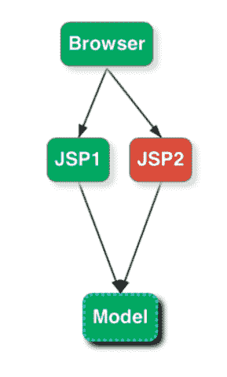
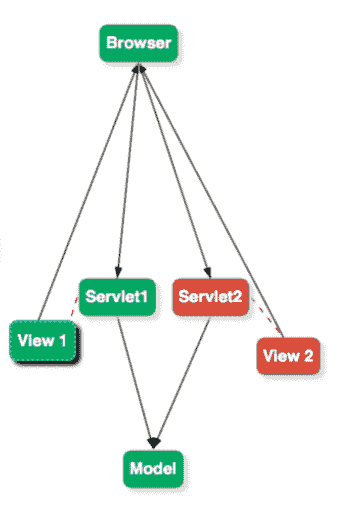
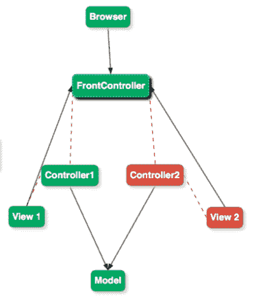
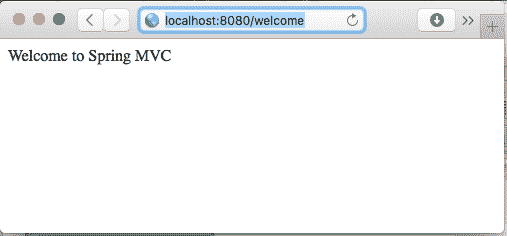
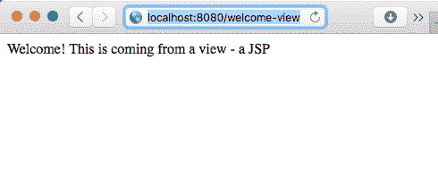
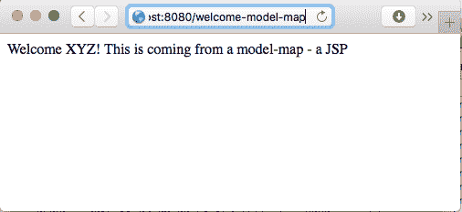
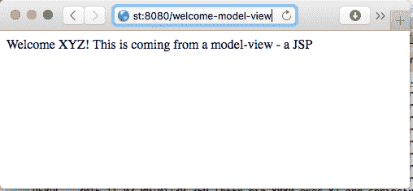
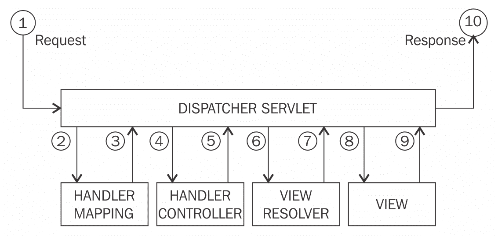

# 第三章：使用 Spring MVC 构建 Web 应用程序

Spring MVC 是用于开发 Java Web 应用程序的最流行的 Web 框架。Spring MVC 的优势在于其清晰的、松散耦合的架构。通过对控制器、处理程序映射、视图解析器和**普通的 Java 对象**（**POJO**）命令 bean 的角色进行清晰定义，Spring MVC 利用了所有核心 Spring 功能--如依赖注入和自动装配--使得创建 Web 应用程序变得简单。它支持多种视图技术，也具有可扩展性。

虽然 Spring MVC 可以用于创建 REST 服务，但我们将在第五章中讨论*使用 Spring Boot 构建微服务*。

在本章中，我们将重点介绍 Spring MVC 的基础知识，并提供简单的示例。

在本章中，我们将涵盖以下主题：

+   Spring MVC 架构

+   DispatcherServlet、视图解析器、处理程序映射和控制器所扮演的角色

+   模型属性和会话属性

+   表单绑定和验证

+   与 Bootstrap 集成

+   Spring 安全的基础知识

+   为控制器编写简单的单元测试

# Java Web 应用程序架构

在过去的几十年里，我们开发 Java Web 应用程序的方式已经发生了变化。我们将讨论开发 Java Web 应用程序的不同架构方法，并看看 Spring MVC 适用于哪些方面：

+   模型 1 架构

+   模型 2 或 MVC 架构

+   带有前端控制器的模型 2

# 模型 1 架构

模型 1 架构是用于开发基于 Java 的 Web 应用程序的初始架构风格之一。一些重要的细节如下：

+   JSP 页面直接处理来自浏览器的请求

+   JSP 页面使用包含简单 Java bean 的模型

+   在这种架构风格的一些应用中，甚至 JSP 执行了对数据库的查询

+   JSP 还处理流程逻辑：下一个要显示的页面

以下图片代表典型的模型 1 架构：



这种方法存在许多缺点，导致快速搁置和其他架构的演变。以下是一些重要的缺点：

+   **几乎没有关注点分离**：JSP 负责检索数据，显示数据，决定下一个要显示的页面（流程），有时甚至包括业务逻辑

+   **复杂的 JSP**：因为 JSP 处理了很多逻辑，它们很庞大且难以维护

# 模型 2 架构

模型 2 架构出现是为了解决处理多个责任的复杂 JSP 所涉及的复杂性。这构成了 MVC 架构风格的基础。以下图片代表典型的模型 2 架构：



模型 2 架构在模型、视图和控制器之间有明确的角色分离。这导致了更易维护的应用程序。一些重要的细节如下：

+   **模型**：表示用于生成视图的数据。

+   **视图**：使用模型来呈现屏幕。

+   **控制器**：控制流程。从浏览器获取请求，填充模型并重定向到视图。示例是前面图中的**Servlet1**和**Servlet2**。

# 模型 2 前端控制器架构

在模型 2 架构的基本版本中，浏览器的请求直接由不同的 servlet（或控制器）处理。在许多业务场景中，我们希望在处理请求之前在 servlet 中执行一些常见的操作。例如，确保已登录的用户有权执行请求。这是一个常见的功能，您不希望在每个 servlet 中实现。

在模型 2**前端控制器**架构中，所有请求都流入一个称为前端控制器的单个控制器。

下面的图片代表典型的模型 2 前端控制器架构：



以下是典型前端控制器的一些职责： 

+   它决定了哪个控制器执行请求

+   它决定了要渲染哪个视图

+   它提供了添加更多常见功能的规定

+   Spring MVC 使用带有 Front Controller 的 MVC 模式。前端控制器称为**DispatcherServlet**。我们稍后将讨论 DispatcherServlet。

# 基本流程

Spring MVC 使用了修改版的 Model 2 Front Controller 架构。在我们深入了解 Spring MVC 的工作原理之前，我们将专注于使用 Spring MVC 创建一些简单的 Web 流程。在本节中，我们将使用 Spring MVC 创建六种典型的 Web 应用程序流程。流程如下所示：

+   **流程 1**：没有视图的控制器；自己提供内容

+   **流程 2**：带有视图（JSP）的控制器

+   **流程 3**：带有视图并使用 ModelMap 的控制器

+   **流程 4**：带有视图并使用 ModelAndView 的控制器

+   **流程 5**：简单表单的控制器

+   **流程 6**：带有验证的简单表单的控制器

在每个流程结束时，我们将讨论如何对控制器进行单元测试。

# 基本设置

在我们开始第一个流程之前，我们需要设置应用程序以使用 Spring MVC。在下一节中，我们将开始了解如何在 Web 应用程序中设置 Spring MVC。

我们使用 Maven 来管理我们的依赖关系。设置一个简单的 Web 应用程序涉及以下步骤：

1.  添加 Spring MVC 的依赖。

1.  将 DispatcherServlet 添加到`web.xml`中。

1.  创建一个 Spring 应用上下文。

# 添加 Spring MVC 的依赖

让我们从在`pom.xml`中添加 Spring MVC 依赖开始。以下代码显示了要添加的依赖项。由于我们使用 Spring BOM，我们不需要指定 artifact 版本：

```java
    <dependency> 
      <groupId>org.springframework</groupId> 
      <artifactId>spring-webmvc</artifactId> 
    </dependency>
```

DispatcherServlet 是 Front Controller 模式的一种实现。Spring MVC 的任何请求都将由前端控制器 DispatcherServlet 处理。

# 将 DispatcherServlet 添加到 web.xml

为了实现这一点，我们需要将 DispatcherServlet 添加到`web.xml`中。让我们看看如何做到这一点：

```java
    <servlet> 
      <servlet-name>spring-mvc-dispatcher-servlet</servlet-name>    
      <servlet-class> 
        org.springframework.web.servlet.DispatcherServlet 
      </servlet-class> 
      <init-param> 
        <param-name>contextConfigLocation</param-name> 
        <param-value>/WEB-INF/user-web-context.xml</param-value> 
      </init-param> 
        <load-on-startup>1</load-on-startup> 
    </servlet> 
    <servlet-mapping> 
      <servlet-name>spring-mvc-dispatcher-servlet</servlet-name> 
      <url-pattern>/</url-pattern> 
    </servlet-mapping>
```

第一部分是定义一个 servlet。我们还定义了一个上下文配置位置，`/WEB-INF/user-web-context.xml`。我们将在下一步中定义一个 Spring 上下文。在第二部分中，我们正在定义一个 servlet 映射。我们正在将 URL `/`映射到 DispatcherServlet。因此，所有请求都将由 DispatcherServlet 处理。

# 创建 Spring 上下文

现在我们在`web.xml`中定义了 DispatcherServlet，我们可以继续创建我们的 Spring 上下文。最初，我们将创建一个非常简单的上下文，而不是真正定义任何具体内容：

```java
    <beans > <!-Schema Definition removed --> 
       <context:component-scan  
       base-package="com.mastering.spring.springmvc"  /> 
       <mvc:annotation-driven /> 
    </beans>
```

我们正在为`com.mastering.spring.springmvc`包定义一个组件扫描，以便在此包中创建和自动装配所有的 bean 和控制器。

使用`<mvc:annotation-driven/>`初始化了 Spring MVC 支持的许多功能，例如：

+   请求映射

+   异常处理

+   数据绑定和验证

+   当使用`@RequestBody`注解时，自动转换（例如 JSON）

这就是我们需要设置 Spring MVC 应用程序的所有设置。我们已经准备好开始第一个流程了。

# 流程 1 - 没有视图的简单控制器流程

让我们从一个简单的流程开始，通过在屏幕上显示一些简单的文本来输出 Spring MVC 控制器的内容。

# 创建一个 Spring MVC 控制器

让我们创建一个简单的 Spring MVC 控制器，如下所示：

```java
    @Controller 
    public class BasicController { 
      @RequestMapping(value = "/welcome") 
      @ResponseBody 
    public String welcome() { 
      return "Welcome to Spring MVC"; 
     } 
   }
```

这里需要注意的一些重要事项如下：

+   `@Controller`：这定义了一个 Spring MVC 控制器，可以包含请求映射--将 URL 映射到控制器方法。

+   `@RequestMapping(value = "/welcome")`：这定义了 URL `/welcome`到`welcome`方法的映射。当浏览器发送请求到`/welcome`时，Spring MVC 会执行`welcome`方法。

+   `@ResponseBody`：在这个特定的上下文中，`welcome`方法返回的文本被发送到浏览器作为响应内容。`@ResponseBody`做了很多魔术--特别是在 REST 服务的上下文中。我们将在第五章中讨论这个问题，*使用 Spring Boot 构建微服务*。

# 运行 Web 应用程序

我们使用 Maven 和 Tomcat 7 来运行这个 Web 应用程序。

Tomcat 7 服务器默认在 8080 端口启动。

我们可以通过调用`mvn tomcat7:run`命令来运行服务器。

当在浏览器上访问`http://localhost:8080/welcome`URL 时，屏幕上的显示如下截图所示：



# 单元测试

单元测试是开发可维护应用程序的一个非常重要的部分。我们将使用 Spring MVC Mock 框架来对本章中编写的控制器进行单元测试。我们将添加 Spring 测试框架的依赖来使用 Spring MVC Mock 框架：

```java
    <dependency> 
      <groupId>org.springframework</groupId> 
      <artifactId>spring-test</artifactId> 
      <scope>test</scope> 
    </dependency>
```

我们将采取以下方法：

1.  设置要测试的控制器。

1.  编写测试方法。

# 设置要测试的控制器

我们要测试的控制器是`BasicController`。创建单元测试的约定是类名后缀为`Test`。我们将创建一个名为`BasicControllerTest`的测试类。

基本设置如下所示：

```java
    public class BasicControllerTest { 
      private MockMvc mockMvc; 
      @Before 
      public void setup() { 
        this.mockMvc = MockMvcBuilders.standaloneSetup( 
        new BasicController()) 
        .build(); 
      } 
     }
```

需要注意的一些重要事项如下：

+   `mockMvc`：这个变量可以在不同的测试中使用。因此，我们定义了`MockMvc`类的一个实例变量。

+   `@Before setup`：这个方法在每个测试之前运行，以初始化`MockMvc`。

+   `MockMvcBuilders.standaloneSetup(new BasicController()).build()`：这行代码构建了一个`MockMvc`实例。它初始化 DispatcherServlet 来为配置的控制器（在这个例子中是`BasicController`）提供请求服务。

# 编写测试方法

完整的`Test`方法如下所示：

```java
    @Test 
    public void basicTest() throws Exception { 
      this.mockMvc 
      .perform( 
      get("/welcome") 
      .accept(MediaType.parseMediaType 
      ("application/html;charset=UTF-8"))) 
      .andExpect(status().isOk()) 
      .andExpect( content().contentType 
      ("application/html;charset=UTF-8")) 
      .andExpect(content(). 
       string("Welcome to Spring MVC")); 
    }
```

需要注意的一些重要事项如下：

+   `MockMvc` `mockMvc.perform`：这个方法执行请求并返回一个 ResultActions 的实例，允许链式调用。在这个例子中，我们正在链接 andExpect 调用来检查期望。

+   `get("/welcome").accept(MediaType.parseMediaType("application/html;charset=UTF-8"))`：这创建了一个接受`application/html`媒体类型响应的 HTTP get 请求。

+   `andExpect`：这个方法用于检查期望。如果期望没有被满足，这个方法将使测试失败。

+   `status().isOk()`：这使用 ResultMatcher 来检查响应状态是否是成功请求的状态-200。

+   `content().contentType("application/html;charset=UTF-8"))`：这使用 ResultMatcher 来检查响应的内容类型是否与指定的内容类型相匹配。

+   `content().string("Welcome to Spring MVC")`：这使用 ResultMatcher 来检查响应内容是否包含指定的字符串。

# 流程 2 - 带有视图的简单控制器流程

在前面的流程中，要在浏览器上显示的文本是在控制器中硬编码的。这不是一个好的做法。在浏览器上显示的内容通常是从视图生成的。最常用的选项是 JSP。

在这个流程中，让我们从控制器重定向到一个视图。

# Spring MVC 控制器

与前面的例子类似，让我们创建一个简单的控制器。考虑一个控制器的例子：

```java
    @Controller 
    public class BasicViewController { 
      @RequestMapping(value = "/welcome-view") 
      public String welcome() { 
        return "welcome"; 
       } 
    }
```

需要注意的一些重要事项如下：

+   `@RequestMapping(value = "/welcome-view")`：我们正在映射一个 URL`/welcome-view`。

+   `public String welcome()`：这个方法上没有`@RequestBody`注解。所以，Spring MVC 尝试将返回的字符串`welcome`与一个视图匹配。

# 创建一个视图-JSP

让我们在`src/main/webapp/WEB-INF/views/welcome.jsp`文件夹中创建`welcome.jsp`，内容如下：

```java
    <html> 
      <head> 
        <title>Welcome</title> 
      </head> 
      <body> 
        <p>Welcome! This is coming from a view - a JSP</p> 
      </body> 
    </html>
```

这是一个简单的 HTML，包含头部、主体和主体中的一些文本。

Spring MVC 必须将从`welcome`方法返回的字符串映射到`/WEB-INF/views/welcome.jsp`的实际 JSP。这个魔术是如何发生的呢？

# 视图解析器

视图解析器将视图名称解析为实际的 JSP 页面。

此示例中的视图名称为`welcome`，我们希望它解析为`/WEB-INF/views/welcome.jsp`。

可以在 spring 上下文`/WEB-INF/user-web-context.xml`中配置视图解析器。以下是代码片段：

```java
    <bean class="org.springframework.web.
    servlet.view.InternalResourceViewResolver"> 
     <property name="prefix"> 
       <value>/WEB-INF/views/</value> 
     </property> 
     <property name="suffix"> 
       <value>.jsp</value> 
     </property> 
    </bean>
```

需要注意的几个重要点：

+   `org.springframework.web.servlet.view.InternalResourceViewResolver`：支持 JSP 的视图解析器。通常使用`JstlView`。它还支持使用`TilesView`的 tiles。

+   `<property name="prefix"> <value>/WEB-INF/views/</value> </property><property name="suffix"> <value>.jsp</value> </property>`：将前缀和后缀映射到视图解析器使用的值。视图解析器从控制器方法中获取字符串并解析为视图：`prefix` + viewname + `suffix`。因此，视图名称 welcome 解析为`/WEB-INF/views/welcome.jsp`。

以下是当 URL 被访问时屏幕上的截图：



# 单元测试

MockMvc 框架的独立设置创建了 DispatcherServlet 所需的最低基础设施。如果提供了视图解析器，它可以执行视图解析。但是，它不会执行视图。因此，在独立设置的单元测试中，我们无法验证视图的内容。但是，我们可以检查是否传递了正确的视图。

在这个单元测试中，我们想要设置`BasicViewController`，执行一个对`/welcome-view`的 get 请求，并检查返回的视图名称是否为`welcome`。在以后的部分中，我们将讨论如何执行集成测试，包括视图的渲染。就这个测试而言，我们将限制我们的范围以验证视图名称。

# 设置要测试的控制器

这一步与之前的流程非常相似。我们想要测试`BasicViewController`。我们使用`BasicViewController`实例化 MockMvc。我们还配置了一个简单的视图解析器：

```java
    public class BasicViewControllerTest { 
      private MockMvc mockMvc; 
      @Before 
      public void setup() { 
        this.mockMvc = MockMvcBuilders.standaloneSetup 
        (new BasicViewController()) 
        .setViewResolvers(viewResolver()).build(); 
       } 
      private ViewResolver viewResolver() { 
        InternalResourceViewResolver viewResolver =  
        new InternalResourceViewResolver(); 
        viewResolver.setViewClass(JstlView.class); 
        viewResolver.setPrefix("/WEB-INF/jsp/"); 
        viewResolver.setSuffix(".jsp"); 
       return viewResolver; 
      } 
    }
```

# 编写测试方法

完整的测试方法如下所示：

```java
    @Test 
    public void testWelcomeView() throws Exception { 
      this.mockMvc 
      .perform(get("/welcome-view") 
      .accept(MediaType.parseMediaType( 
      "application/html;charset=UTF-8"))) 
      .andExpect(view().name("welcome")); 
    }
```

需要注意的几个重要事项如下：

+   `get("/welcome-model-view")`：执行对指定 URL 的 get 请求

+   `view().name("welcome")`：使用 Result Matcher 来检查返回的视图名称是否与指定的相同

# 流程 3 - 控制器重定向到具有模型的视图

通常，为了生成视图，我们需要向其传递一些数据。在 Spring MVC 中，可以使用模型将数据传递给视图。在这个流程中，我们将使用一个简单的属性设置模型，并在视图中使用该属性。

# Spring MVC 控制器

让我们创建一个简单的控制器。考虑以下示例控制器：

```java
    @Controller 
    public class BasicModelMapController { 
      @RequestMapping(value = "/welcome-model-map") 
      public String welcome(ModelMap model) { 
        model.put("name", "XYZ"); 
      return "welcome-model-map"; 
     } 
   }
```

需要注意的几个重要事项如下：

+   `@RequestMapping(value = "/welcome-model-map")`：映射的 URI 为`/welcome-model-map`。

+   `public String welcome(ModelMap model)`：添加的新参数是`ModelMap model`。Spring MVC 将实例化一个模型，并使其对此方法可用。放入模型中的属性将可以在视图中使用。

+   `model.put("name", "XYZ")`：向模型中添加一个名为`name`值为`XYZ`的属性。

# 创建一个视图

让我们使用在控制器中设置的模型属性`name`创建一个视图。让我们在`WEB-INF/views/welcome-model-map.jsp`路径下创建一个简单的 JSP：

```java
    Welcome ${name}! This is coming from a model-map - a JSP
```

需要注意的一件事是：

+   `${name}`：使用**表达式语言**（**EL**）语法来访问模型中的属性。

以下是当 URL 被访问时屏幕上的截图：



# 单元测试

在这个单元测试中，我们想要设置`BasicModelMapController`，执行一个对`/welcome-model-map`的 get 请求，并检查模型是否具有预期的属性，以及返回的视图名称是否符合预期。

# 设置要测试的控制器

这一步与上一个流程非常相似。我们使用`BasicModelMapController`实例化 Mock MVC：

```java
    this.mockMvc = MockMvcBuilders.standaloneSetup 
      (new BasicModelMapController()) 
      .setViewResolvers(viewResolver()).build();
```

# 编写测试方法

完整的测试方法如下所示：

```java
    @Test 
    public void basicTest() throws Exception { 
      this.mockMvc 
      .perform( 
      get("/welcome-model-map") 
      .accept(MediaType.parseMediaType 
      ("application/html;charset=UTF-8"))) 
      .andExpect(model().attribute("name", "XYZ")) 
      .andExpect(view().name("welcome-model-map")); 
    }
```

需要注意的几个重要事项：

+   `get("/welcome-model-map")`：执行对指定 URL 的`get`请求

+   `model().attribute("name", "XYZ")`：结果匹配器，用于检查模型是否包含指定属性**name**和指定值**XYZ**

+   `view().name("welcome-model-map")`：结果匹配器，用于检查返回的视图名称是否与指定的相同

# 流程 4 - 控制器重定向到带有 ModelAndView 的视图

在上一个流程中，我们返回了一个视图名称，并在模型中填充了要在视图中使用的属性。Spring MVC 提供了一种使用`ModelAndView`的替代方法。控制器方法可以返回一个带有视图名称和模型中适当属性的`ModelAndView`对象。在这个流程中，我们将探讨这种替代方法。

# Spring MVC 控制器

看一下下面的控制器：

```java
    @Controller 
    public class BasicModelViewController { 
     @RequestMapping(value = "/welcome-model-view") 
      public ModelAndView welcome(ModelMap model) { 
        model.put("name", "XYZ"); 
        return new ModelAndView("welcome-model-view", model); 
      } 
   }
```

需要注意的几个重要事项如下：

+   `@RequestMapping(value = "/welcome-model-view")`：映射的 URI 是`/welcome-model-view`。

+   `public ModelAndView welcome(ModelMap model)`：请注意，返回值不再是 String。它是`ModelAndView`。

+   `return new ModelAndView("welcome-model-view", model)`：使用适当的视图名称和模型创建`ModelAndView`对象。

# 创建一个视图

让我们使用在控制器中设置的模型属性`name`创建一个视图。在`/WEB-INF/views/welcome-model-view.jsp`路径下创建一个简单的 JSP：

```java
    Welcome ${name}! This is coming from a model-view - a JSP
```

当 URL 被访问时，屏幕上会显示如下截图：



# 单元测试

对于这个流程的单元测试与上一个流程类似。我们需要检查是否返回了预期的视图名称。

# 流程 5 - 控制器重定向到带有表单的视图

现在让我们把注意力转移到创建一个简单的表单，以从用户那里获取输入。

需要以下步骤：

+   创建一个简单的 POJO。我们想创建一个用户。我们将创建一个 POJO 用户。

+   创建一对控制器方法——一个用于显示表单，另一个用于捕获表单中输入的详细信息。

+   创建一个带有表单的简单视图。

# 创建一个命令或表单备份对象

POJO 代表普通的旧 Java 对象。通常用于表示遵循典型 JavaBean 约定的 bean。通常，它包含具有 getter 和 setter 的私有成员变量和一个无参数构造函数。

我们将创建一个简单的 POJO 作为命令对象。类的重要部分列在下面：

```java
    public class User { 
      private String guid; 
      private String name; 
      private String userId; 
      private String password; 
      private String password2; 
      //Constructor 
      //Getters and Setters   
      //toString 
    }
```

需要注意的几个重要事项如下：

+   这个类没有任何注释或与 Spring 相关的映射。任何 bean 都可以充当表单备份对象。

+   我们将在表单中捕获`name`、`用户 ID`和`密码`。我们有一个密码确认字段`password2`和唯一标识符字段 guid。

+   为简洁起见，构造函数、getter、setter 和 toString 方法未显示。

# 显示表单的控制器方法

让我们从创建一个带有记录器的简单控制器开始：

```java
    @Controller 
    public class UserController { 
      private Log logger = LogFactory.getLog 
      (UserController.class); 
     }
```

让我们在控制器中添加以下方法：

```java
    @RequestMapping(value = "/create-user",  
    method = RequestMethod.GET) 
    public String showCreateUserPage(ModelMap model) { 
      model.addAttribute("user", new User()); 
      return "user"; 
   }
```

需要注意的重要事项如下：

+   `@RequestMapping(value = "/create-user", method = RequestMethod.GET)`：我们正在映射一个`/create-user` URI。这是第一次使用 method 属性指定`Request`方法。此方法仅在 HTTP Get 请求时调用。HTTP `Get`请求通常用于显示表单。这不会被其他类型的 HTTP 请求调用，比如 Post。

+   `public String showCreateUserPage(ModelMap model)`：这是一个典型的控制方法。

+   `model.addAttribute("user", new User())`：这用于使用空表单备份对象设置模型。

# 创建带有表单的视图

Java Server Pages 是 Spring Framework 支持的视图技术之一。Spring Framework 通过提供标签库，使得使用 JSP 轻松创建视图变得容易。这包括各种表单元素、绑定、验证、设置主题和国际化消息的标签。在本例中，我们将使用 Spring MVC 标签库以及标准的 JSTL 标签库来创建我们的视图。

让我们从创建`/WEB-INF/views/user.jsp`文件开始。

首先，让我们添加要使用的标签库的引用：

```java
    <%@ taglib uri="http://java.sun.com/jsp/jstl/core" prefix="c"%> 
    <%@ taglib uri="http://java.sun.com/jsp/jstl/fmt" prefix="fmt"%> 
    <%@ taglib uri="http://www.springframework.org/tags/form"  
      prefix="form"%> 
    <%@ taglib uri="http://www.springframework.org/tags"
      prefix="spring"%>
```

前两个条目是 JSTL 核心和格式化标签库。我们将广泛使用 Spring 表单标签。我们提供一个`prefix`作为引用标签的快捷方式。

让我们先创建一个只有一个字段的表单：

```java
    <form:form method="post" modelAttribute="user"> 
     <fieldset> 
       <form:label path="name">Name</form:label> 
       <form:input path="name"  
       type="text" required="required" /> 
     </fieldset> 
   </form:form>
```

需要注意的重要事项如下：

+   `<form:form method="post" modelAttribute="user">`：这是 Spring 表单标签库中的`form`标签。指定了两个属性。表单中的数据使用 post 方法发送。第二个属性`modelAttribute`指定了模型中充当表单后备对象的属性。在模型中，我们添加了一个名为 user 的属性。我们使用该属性作为`modelAttribute`。

+   `<fieldset>`：这是 HTML 元素，用于对一组相关控件（标签、表单字段和验证消息）进行分组。

+   `<form:label path="name">Name</form:label>`：这是 Spring 表单标签，用于显示标签。path 属性指定了该标签应用于的字段名称（来自 bean）。

+   `<form:input path="name" type="text" required="required" />`：这是 Spring 表单标签，用于创建文本输入字段。`path`属性指定了该输入字段要映射到的 bean 中的字段名称。required 属性表示这是一个`required`字段。

当我们使用 Spring 表单标签时，表单后备对象（`modelAttribute="user"`）中的值会自动绑定到表单上，并且在提交表单时，表单中的值会自动绑定到表单后备对象上。

包括名称和用户 ID 字段在内的更完整的表单标签列表如下：

```java
    <form:form method="post" modelAttribute="user"> 
    <form:hidden path="guid" /> 
    <fieldset> 
      <form:label path="name">Name</form:label> 
      <form:input path="name"  
       type="text" required="required" /> 
    </fieldset> 
    <fieldset> 
      <form:label path="userId">User Id</form:label> 
      <form:input path="userId"  
       type="text" required="required" /> 
    </fieldset> 
    <!-password and password2 fields not shown for brewity--> 
    <input class="btn btn-success" type="submit" value="Submit" /> 
    </form:form>
```

# 控制器获取方法来处理表单提交

当用户提交表单时，浏览器会发送一个 HTTP **POST**请求。现在让我们创建一个方法来处理这个请求。为了保持简单，我们将记录表单对象的内容。该方法的完整列表如下：

```java
    @RequestMapping(value = "/create-user", method = 
    RequestMethod.POST) 
    public String addTodo(User user) { 
      logger.info("user details " + user); 
      return "redirect:list-users"; 
    }
```

一些重要的细节如下：

+   `@RequestMapping(value = "/create-user", method = RequestMethod.POST)`：由于我们要处理表单提交，我们使用`RequestMethod.POST`方法。

+   `public String addTodo(User user)`：我们使用表单后备对象作为参数。Spring MVC 将自动将表单中的值绑定到表单后备对象。

+   `logger.info("user details " + user)`：记录用户的详细信息。

+   返回`redirect:list-users`：通常，在提交表单后，我们会将数据库的详细信息保存并将用户重定向到不同的页面。在这里，我们将用户重定向到`/list-users`。当我们使用`redirect`时，Spring MVC 会发送一个带有状态`302`的 HTTP 响应；也就是说，`REDIRECT`到新的 URL。浏览器在处理`302`响应时，会将用户重定向到新的 URL。虽然`POST`/`REDIRECT`/`GET`模式并不是解决重复表单提交问题的完美方法，但它确实减少了发生的次数，特别是在视图渲染后发生的次数。

列出用户的代码非常简单，如下所示：

```java
    @RequestMapping(value = "/list-users",  
    method = RequestMethod.GET) 
    public String showAllUsers() { 
      return "list-users"; 
    }
```

# 单元测试

当我们在下一个流程中添加验证时，我们将讨论单元测试。

# 流程 6 - 在上一个流程中添加验证

在上一个流程中，我们添加了一个表单。但是，我们没有验证表单中的值。虽然我们可以编写 JavaScript 来验证表单内容，但在服务器上进行验证总是更安全的。在本流程中，让我们使用 Spring MVC 在服务器端对我们之前创建的表单添加验证。

Spring MVC 与 Bean Validation API 提供了很好的集成。 *JSR 303*和*JSR 349*分别定义了 Bean Validation API 的规范（版本 1.0 和 1.1），而 Hibernate Validator 是参考实现。

# Hibernate Validator 依赖

让我们从将 Hibernate Validator 添加到我们的项目`pom.xml`开始：

```java
    <dependency> 
      <groupId>org.hibernate</groupId> 
      <artifactId>hibernate-validator</artifactId> 
      <version>5.0.2.Final</version> 
    </dependency>
```

# Bean 上的简单验证

Bean Validation API 指定了可以在 bean 的属性上指定的一些验证。看一下以下列表：

```java
   @Size(min = 6, message = "Enter at least 6 characters") 
   private String name; 
   @Size(min = 6, message = "Enter at least 6 characters") 
   private String userId; 
   @Size(min = 8, message = "Enter at least 8 characters") 
   private String password; 
   @Size(min = 8, message = "Enter at least 8 characters") 
   private String password2;
```

需要注意的一件重要的事情如下：

+   `@Size(min = 6, message = "Enter at least 6 characters")`：指定字段至少应有六个字符。如果验证未通过，则使用消息属性中的文本作为验证错误消息。

使用 Bean Validation 可以执行的其他验证如下：

+   `@NotNull`：它不应为 null

+   `@Size(min =5, max = 50)`：最大 50 个字符，最小 5 个字符。

+   `@Past`：应该是过去的日期

+   `@Future`：应该是未来的日期

+   `@Pattern`：应该匹配提供的正则表达式

+   `@Max`：字段的最大值

+   `@Min`：字段的最小值

现在让我们专注于使控制器方法在提交时验证表单。完整的方法列表如下：

```java
    @RequestMapping(value = "/create-user-with-validation",  
    method = RequestMethod.POST) 
    public String addTodo(@Valid User user, BindingResult result) { 
      if (result.hasErrors()) { 
        return "user"; 
       } 
      logger.info("user details " + user); 
      return "redirect:list-users"; 
    }
```

以下是一些重要的事项：

+   `public String addTodo(@Valid User user, BindingResult result)`：当使用`@Valid`注释时，Spring MVC 验证 bean。验证的结果在`BindingResult`实例 result 中可用。

+   `if (result.hasErrors())`：检查是否有任何验证错误。

+   `return "user"`：如果有验证错误，我们将用户发送回用户页面。

我们需要增强`user.jsp`以在验证错误时显示验证消息。其中一个字段的完整列表如下所示。其他字段也必须类似地更新：

```java
    <fieldset> 
      <form:label path="name">Name</form:label> 
      <form:input path="name" type="text" required="required" /> 
      <form:errors path="name" cssClass="text-warning"/> 
    </fieldset>
```

`<form:errors path="name" cssClass="text-warning"/>`：这是 Spring 表单标签，用于显示与指定路径中的字段名称相关的错误。我们还可以分配用于显示验证错误的 CSS 类。

# 自定义验证

可以使用`@AssertTrue`注释实现更复杂的自定义验证。以下是添加到`User`类的示例方法列表：

```java
    @AssertTrue(message = "Password fields don't match") 
    private boolean isValid() { 
      return this.password.equals(this.password2); 
    }
```

`@AssertTrue(message = "Password fields don't match")`是在验证失败时要显示的消息。

可以在这些方法中实现具有多个字段的复杂验证逻辑。

# 单元测试

此部分的单元测试重点是检查验证错误。我们将为一个空表单编写一个测试，触发四个验证错误。

# 控制器设置

控制器设置非常简单：

```java
    this.mockMvc = MockMvcBuilders.standaloneSetup( 
    new UserValidationController()).build();
```

# 测试方法

完整的`Test`方法如下所示：

```java
    @Test 
    public void basicTest_WithAllValidationErrors() throws Exception { 
      this.mockMvc 
        .perform( 
           post("/create-user-with-validation") 
           .accept(MediaType.parseMediaType( 
           "application/html;charset=UTF-8"))) 
           .andExpect(status().isOk()) 
           .andExpect(model().errorCount(4)) 
           .andExpect(model().attributeHasFieldErrorCode 
           ("user", "name", "Size")); 
    }
```

这里需要注意的一些要点如下：

+   `post("/create-user-with-validation")`：创建到指定 URI 的 HTTP `POST`请求。由于我们没有传递任何请求参数，所有属性都为 null。这将触发验证错误。

+   `model().errorCount(4)`：检查模型上是否有四个验证错误。

+   `model().attributeHasFieldErrorCode("user", "name", "Size")`：检查`user`属性是否具有名为`Size`的验证错误的`name`字段。

# Spring MVC 概述

现在我们已经看了 Spring MVC 的一些基本流程，我们将把注意力转向理解这些流程是如何工作的。Spring MVC 是如何实现魔术的？

# 重要特性

在处理不同的流程时，我们看了 Spring MVC 框架的一些重要特性。这些包括以下内容：

+   具有明确定义的独立角色的松散耦合架构。

+   高度灵活的控制器方法定义。控制器方法可以具有各种参数和返回值。这使程序员可以灵活选择满足其需求的定义。

+   允许重用域对象作为表单后备对象。减少了需要单独的表单对象。

+   带有本地化支持的内置标签库（Spring，spring-form）。

+   Model 使用具有键值对的 HashMap。允许与多个视图技术集成。

+   灵活的绑定。绑定时的类型不匹配可以作为验证错误而不是运行时错误来处理。

+   模拟 MVC 框架以对控制器进行单元测试。

# 它是如何工作的

Spring MVC 架构中的关键组件如下图所示：



让我们看一个示例流程，并了解执行流程涉及的不同步骤。我们将采取流程**4**，返回`ModelAndView`作为具体示例。流程**4**的 URL 是`http://localhost:8080/welcome-model-view`。不同的步骤详细说明如下：

1.  浏览器向特定 URL 发出请求。DispatcherServlet 是前端控制器，处理所有请求。因此，它接收请求。

1.  Dispatcher Servlet 查看 URI（在示例中为`/welcome-model-view`），并需要确定正确的控制器来处理它。为了帮助找到正确的控制器，它与处理程序映射进行通信。

1.  处理程序映射返回处理请求的特定处理程序方法（在示例中，`BasicModelViewController`中的`welcome`方法）。

1.  DispatcherServlet 调用特定的处理程序方法（`public ModelAndView welcome(ModelMap model)`）。

1.  处理程序方法返回模型和视图。在这个例子中，返回了 ModelAndView 对象。

1.  DispatcherServlet 具有逻辑视图名称（来自 ModelAndView；在这个例子中是`welcome-model-view`）。它需要找出如何确定物理视图名称。它检查是否有任何可用的视图解析器。它找到了配置的视图解析器（`org.springframework.web.servlet.view.InternalResourceViewResolver`）。它调用视图解析器，将逻辑视图名称（在这个例子中是`welcome-model-view`）作为输入。

1.  View 解析器执行逻辑以将逻辑视图名称映射到物理视图名称。在这个例子中，`welcome-model-view`被翻译为`/WEB-INF/views/welcome-model-view.jsp`。

1.  DispatcherServlet 执行 View。它还使 Model 可用于 View。

1.  View 将返回要发送回 DispatcherServlet 的内容。

1.  DispatcherServlet 将响应发送回浏览器。

# Spring MVC 背后的重要概念

现在我们已经完成了一个 Spring MVC 示例，我们准备理解 Spring MVC 背后的重要概念。

# RequestMapping

正如我们在之前的示例中讨论的，`RequestMapping`用于将 URI 映射到 Controller 或 Controller 方法。它可以在类和/或方法级别完成。可选的方法参数允许我们将方法映射到特定的请求方法（`GET`，`POST`等）。

# 请求映射的示例

即将出现的几个示例将说明各种变化。

# 示例 1

在以下示例中，`showPage`方法中只有一个`RequestMapping`。`showPage`方法将映射到`GET`，`POST`和 URI`/show-page`的任何其他请求类型：

```java
    @Controller 
    public class UserController { 
      @RequestMapping(value = "/show-page") 
      public String showPage() { 
        /* Some code */ 
       } 
    }
```

# 示例 2

在以下示例中，定义了一个`RequestMapping`--`RequestMethod.GET`的方法。`showPage`方法将仅映射到 URI`/show-page`的`GET`请求。所有其他请求方法类型都会抛出“方法不受支持异常”：

```java
    @Controller 
    public class UserController { 
      @RequestMapping(value = "/show-page" , method = 
      RequestMethod.GET) 
      public String showPage() { 
        /* Some code */ 
       } 
    }
```

# 示例 3

在以下示例中，有两个`RequestMapping`方法--一个在类中，另一个在方法中。使用两种`RequestMapping`方法的组合来确定 URI。`showPage`方法将仅映射到 URI`/user/show-page`的`GET`请求：

```java
    @Controller 
    @RequestMapping("/user") 
    public class UserController { 
      @RequestMapping(value = "/show-page" , method =   
       RequestMethod.GET) 
       public String showPage() { 
         /* Some code */ 
       } 
    }
```

# 请求映射方法-支持的方法参数

以下是在具有 RequestMapping 的 Controller 方法中支持的一些参数类型：

| **参数类型/注释** | **用途** |
| --- | --- |
| `java.util.Map` / `org.springframework.ui.Model` / `org.springframework.ui.ModelMap` | 作为模型（MVC），用于容纳暴露给视图的值。 |
| 命令或表单对象 | 用于将请求参数绑定到 bean。还支持验证。 |
| `org.springframework.validation.Errors` / `org.springframework.validation.BindingResult` | 验证命令或表单对象的结果（表单对象应该是前一个方法参数）。 |
| `@PreDestroy` | 在任何 Spring bean 上，可以使用`@PreDestroy`注解提供预销毁方法。该方法在 bean 从容器中移除之前调用。它可以用于释放 bean 持有的任何资源。 |
| `@RequestParam` | 访问特定 HTTP 请求参数的注解。 |
| `@RequestHeader` | 访问特定 HTTP 请求头的注解。 |
| `@SessionAttribute` | 访问 HTTP 会话中的属性的注解。 |
| `@RequestAttribute` | 访问特定 HTTP 请求属性的注解。 |
| `@PathVariable` | 允许从 URI 模板中访问变量的注解。`/owner/{ownerId}`。当我们讨论微服务时，我们将深入研究这个问题。 |

# RequestMapping 方法-支持的返回类型

`RequestMapping`方法支持各种返回类型。从概念上讲，请求映射方法应该回答两个问题：

+   视图是什么？

+   视图需要什么模型？

然而，使用 Spring MVC 时，视图和模型不一定需要始终明确声明：

+   如果视图没有明确定义为返回类型的一部分，则它是隐式定义的。

+   同样，任何模型对象始终按照以下规则进行丰富。

Spring MVC 使用简单的规则来确定确切的视图和模型。以下列出了一些重要的规则：

+   **模型的隐式丰富**：如果模型是返回类型的一部分，则它将与命令对象（包括命令对象验证的结果）一起丰富。此外，带有`@ModelAttribute`注解的方法的结果也会添加到模型中。

+   **视图的隐式确定**：如果返回类型中没有视图名称，则使用`DefaultRequestToViewNameTranslator`确定。默认情况下，`DefaultRequestToViewNameTranslator`会从 URI 中删除前导和尾随斜杠以及文件扩展名；例如，`display.html`变成了 display。

以下是在带有请求映射的控制器方法上支持的一些返回类型：

| **返回类型** | **发生了什么？** |
| --- | --- |
| ModelAndView | 该对象包括对模型和视图名称的引用。 |
| 模型 | 只返回模型。视图名称使用`DefaultRequestToViewNameTranslator`确定。 |
| Map | 一个简单的映射来暴露模型。 |
| 视图 | 隐式定义模型的视图。 |
| String | 视图名称的引用。 |

# 视图解析

Spring MVC 提供非常灵活的视图解析。它提供多个视图选项：

+   与 JSP、Freemarker 集成。

+   多种视图解析策略。以下列出了其中一些：

+   `XmlViewResolver`：基于外部 XML 配置的视图解析

+   `ResourceBundleViewResolver`：基于属性文件的视图解析

+   `UrlBasedViewResolver`：将逻辑视图名称直接映射到 URL

+   `ContentNegotiatingViewResolver`：根据接受请求头委托给其他视图解析器

+   支持显式定义首选顺序的视图解析器的链接。

+   使用内容协商直接生成 XML、JSON 和 Atom。

# 配置 JSP 视图解析器

以下示例显示了配置 JSP 视图解析器使用`InternalResourceViewResolver`的常用方法。使用`JstlView`，通过配置的前缀和后缀确定逻辑视图名称的物理视图名称：

```java
    <bean id="jspViewResolver" class=  
      "org.springframework.web.servlet.view.
      InternalResourceViewResolver"> 
      <property name="viewClass"  
        value="org.springframework.web.servlet.view.JstlView"/> 
      <property name="prefix" value="/WEB-INF/jsp/"/> 
      <property name="suffix" value=".jsp"/> 
    </bean>
```

还有其他使用属性和 XML 文件进行映射的方法。

# 配置 Freemarker

以下示例显示了配置 Freemarker 视图解析器的典型方法。

首先，`freemarkerConfig` bean 用于加载 Freemarker 模板：

```java
    <bean id="freemarkerConfig"
      class="org.springframework.web.servlet.view.
      freemarker.FreeMarkerConfigurer"> 
      <property name="templateLoaderPath" value="/WEB-
      INF/freemarker/"/> 
    </bean>
```

以下是如何配置 Freemarker 视图解析器的 bean 定义：

```java
    <bean id="freemarkerViewResolver"  
     class="org.springframework.web.servlet.view.
     freemarker.FreeMarkerViewResolver"> 
       <property name="cache" value="true"/> 
       <property name="prefix" value=""/> 
       <property name="suffix" value=".ftl"/> 
    </bean>
```

与 JSP 一样，视图解析可以使用属性或 XML 文件来定义。

# 处理程序映射和拦截器

在 Spring 2.5 之前的版本（在支持注解之前），URL 和控制器（也称为处理程序）之间的映射是使用称为处理程序映射的东西来表达的。今天几乎是一个历史事实。注解的使用消除了对显式处理程序映射的需求。

HandlerInterceptors 可用于拦截对处理程序（或**控制器**）的请求。有时，您希望在请求之前和之后进行一些处理。您可能希望记录请求和响应的内容，或者您可能想找出特定请求花费了多少时间。

创建 HandlerInterceptor 有两个步骤：

1.  定义 HandlerInterceptor。

1.  将 HandlerInterceptor 映射到要拦截的特定处理程序。

# 定义 HandlerInterceptor

以下是您可以在`HandlerInterceptorAdapter`中重写的方法：

+   `public boolean preHandle(HttpServletRequest request, HttpServletResponse response, Object handler)`: 在调用处理程序方法之前调用

+   `public void postHandle(HttpServletRequest request, HttpServletResponse response, Object handler, ModelAndView modelAndView)`: 在调用处理程序方法后调用

+   `public void afterCompletion(HttpServletRequest request, HttpServletResponse response, Object handler, Exception ex)`: 在请求处理完成后调用

以下示例实现显示了如何创建 HandlerInterceptor。让我们从创建一个扩展`HandlerInterceptorAdapter`的新类开始：

```java
    public class HandlerTimeLoggingInterceptor extends 
    HandlerInterceptorAdapter {
```

`preHandle`方法在调用处理程序之前被调用。让我们在请求上放置一个属性，指示处理程序调用的开始时间：

```java
    @Override 
    public boolean preHandle(HttpServletRequest request, 
      HttpServletResponse response, Object handler) throws Exception { 
      request.setAttribute( 
      "startTime", System.currentTimeMillis()); 
      return true; 
    }
```

`postHandle`方法在调用处理程序后被调用。让我们在请求上放置一个属性，指示处理程序调用的结束时间：

```java
    @Override 
    public void postHandle(HttpServletRequest request, 
    HttpServletResponse response, Object handler, 
    ModelAndView modelAndView) throws Exception { 
       request.setAttribute( 
       "endTime", System.currentTimeMillis()); 
     }
```

`afterCompletion`方法在请求处理完成后被调用。我们将使用我们之前设置到请求中的属性来识别处理程序中花费的时间：

```java
    @Override 
    public void afterCompletion(HttpServletRequest request, 
    HttpServletResponse response, Object handler, Exception ex) 
    throws Exception { 
      long startTime = (Long) request.getAttribute("startTime"); 
      long endTime = (Long) request.getAttribute("endTime"); 
      logger.info("Time Spent in Handler in ms : "  
      + (endTime - startTime)); 
    }
```

# 将 HandlerInterceptor 映射到处理程序

HandlerInterceptors 可以映射到您希望拦截的特定 URL。以下示例显示了一个示例 XML 上下文配置。默认情况下，拦截器将拦截所有处理程序（**控制器**）：

```java
    <mvc:interceptors> 
      <bean class="com.mastering.spring.springmvc.
      controller.interceptor.HandlerTimeLoggingInterceptor" /> 
    </mvc:interceptors>
```

我们可以配置精确的 URI 进行拦截。在下面的示例中，除了以`/secure/`开头的 URI 映射的处理程序之外，所有处理程序都会被拦截：

```java
    <mvc:interceptors> 
      <mapping path="/**"/> 
      <exclude-mapping path="/secure/**"/> 
      <bean class="com.mastering.spring.springmvc.
       controller.interceptor.HandlerTimeLoggingInterceptor" /> 
    </mvc:interceptors>
```

# 模型属性

常见的 Web 表单包含许多下拉值--州的列表，国家的列表等等。这些值列表需要在模型中可用，以便视图可以显示列表。这些常见的东西通常使用标有`@ModelAttribute`注解的方法填充到模型中。

有两种可能的变体。在下面的示例中，该方法返回需要放入模型中的对象：

```java
    @ModelAttribute 
    public List<State> populateStateList() { 
      return stateService.findStates(); 
     }
```

这个示例中的方法用于向模型添加多个属性：

```java
    @ModelAttribute 
    public void populateStateAndCountryList() { 
      model.addAttribute(stateService.findStates()); 
      model.addAttribute(countryService.findCountries()); 
     }
```

需要注意的重要事项是，可以标记为`@ModelAttribute`注解的方法数量没有限制。

使用 Controller Advice 可以使模型属性在多个控制器中变得通用。我们将在本节后面讨论 Controller Advice。

# 会话属性

到目前为止，我们讨论的所有属性和值都是在单个请求中使用的。但是，可能存在值（例如特定的 Web 用户配置）在请求之间不会发生变化。这些类型的值通常将存储在 HTTP 会话中。Spring MVC 提供了一个简单的类型级别（类级别）注释`@SessionAttributes`，用于指定要存储在会话中的属性。

看一下以下示例：

```java
    @Controller 
    @SessionAttributes("exampleSessionAttribute") 
    public class LoginController {
```

# 将属性放入会话中

一旦我们在`@SessionAttributes`注释中定义了一个属性，如果将相同的属性添加到模型中，它将自动添加到会话中。

在前面的示例中，如果我们将一个名为`exampleSessionAttribute`的属性放入模型中，它将自动存储到会话对话状态中：

```java
    model.put("exampleSessionAttribute", sessionValue);
```

# 从会话中读取属性

首先在类型级别指定`@SessionAttributes`注释，然后可以在其他控制器中访问此值：

```java
    @Controller 
    @SessionAttributes("exampleSessionAttribute") 
    public class SomeOtherController {
```

会话属性的值将直接提供给所有模型对象。因此，可以从模型中访问：

```java
   Value sessionValue =(Value)model.get("exampleSessionAttribute");
```

# 从会话中删除属性

当不再需要会话中的值时，将其从会话中删除非常重要。我们可以通过两种方式从会话对话状态中删除值。第一种方式在以下代码片段中进行了演示。它使用`WebRequest`类中可用的`removeAttribute`方法：

```java
    @RequestMapping(value="/some-method",method = RequestMethod.GET) 
    public String someMethod(/*Other Parameters*/  
    WebRequest request, SessionStatus status) { 
      status.setComplete(); 
      request.removeAttribute("exampleSessionAttribute",
      WebRequest.SCOPE_SESSION); 
       //Other Logic
    }
```

此示例显示了使用`SessionAttributeStore`中的`cleanUpAttribute`方法的第二种方法：

```java
    @RequestMapping(value = "/some-other-method",  
    method = RequestMethod.GET) 
    public String someOtherMethod(/*Other Parameters*/ 
    SessionAttributeStore store, SessionStatus status) { 
      status.setComplete(); 
      store.cleanupAttribute(request, "exampleSessionAttribute"); 
      //Other Logic 
    }
```

# InitBinders

典型的 Web 表单包含日期、货币和金额。表单中的值需要绑定到表单后端对象。可以使用`@InitBinder`注释引入绑定发生的自定义。

可以使用 Handler Advice 在特定控制器或一组控制器中进行自定义。此示例显示了如何设置用于表单绑定的默认日期格式：

```java
    @InitBinder 
    protected void initBinder(WebDataBinder binder) { 
      SimpleDateFormat dateFormat = new SimpleDateFormat("dd/MM/yyyy"); 
      binder.registerCustomEditor(Date.class, new CustomDateEditor( 
      dateFormat, false)); 
    }
```

# @ControllerAdvice 注释

我们在控制器级别定义的一些功能可能在整个应用程序中是通用的。例如，我们可能希望在整个应用程序中使用相同的日期格式。因此，我们之前定义的`@InitBinder`可以适用于整个应用程序。我们如何实现？`@ControllerAdvice`可以帮助我们使功能在默认情况下在所有请求映射中通用。

例如，考虑此处列出的 Controller 建议示例。我们在类上使用`@ControllerAdvice`注释，并在此类中使用`@InitBinder`定义方法。默认情况下，此方法中定义的绑定适用于所有请求映射：

```java
    @ControllerAdvice 
    public class DateBindingControllerAdvice { 
      @InitBinder 
      protected void initBinder(WebDataBinder binder) { 
        SimpleDateFormat dateFormat = new  
        SimpleDateFormat("dd/MM/yyyy"); 
        binder.registerCustomEditor(Date.class,  
        new CustomDateEditor( 
          dateFormat, false)); 
        } 
     }
```

Controller 建议还可以用于定义公共模型属性（`@ModelAttribute`）和公共异常处理（`@ExceptionHandler`）。您只需要创建带有适当注释的方法。我们将在下一节讨论异常处理。

# Spring MVC - 高级功能

在本节中，我们将讨论与 Spring MVC 相关的高级功能，包括以下内容：

+   如何为 Web 应用程序实现通用异常处理？

+   如何国际化消息？

+   如何编写集成测试？

+   如何公开静态内容并与前端框架（如 Bootstrap）集成？

+   如何使用 Spring Security 保护我们的 Web 应用程序？

# 异常处理

异常处理是任何应用程序的关键部分之一。在整个应用程序中拥有一致的异常处理策略非常重要。一个流行的误解是，只有糟糕的应用程序才需要异常处理。事实并非如此。即使设计良好、编写良好的应用程序也需要良好的异常处理。

在 Spring Framework 出现之前，由于受检异常的广泛使用，需要在应用程序代码中处理异常处理代码。例如，大多数 JDBC 方法抛出受检异常，需要在每个方法中使用 try catch 来处理异常（除非您希望声明该方法抛出 JDBC 异常）。使用 Spring Framework，大多数异常都变成了未经检查的异常。这确保除非需要特定的异常处理，否则可以在整个应用程序中通用地处理异常。

在本节中，我们将看一下异常处理的几个示例实现：

+   所有控制器中的通用异常处理

+   控制器的特定异常处理

# 跨控制器的通用异常处理

Controller Advice 也可以用于实现跨控制器的通用异常处理。

看一下以下代码：

```java
    @ControllerAdvice 
    public class ExceptionController { 
      private Log logger =  
      LogFactory.getLog(ExceptionController.class); 
      @ExceptionHandler(value = Exception.class) 
      public ModelAndView handleException 
      (HttpServletRequest request, Exception ex) { 
         logger.error("Request " + request.getRequestURL() 
         + " Threw an Exception", ex); 
         ModelAndView mav = new ModelAndView(); 
         mav.addObject("exception", ex); 
         mav.addObject("url", request.getRequestURL()); 
         mav.setViewName("common/spring-mvc-error"); 
         return mav; 
        } 
     }
```

以下是一些需要注意的事项：

+   `@ControllerAdvice`：Controller Advice，默认情况下适用于所有控制器。

+   `@ExceptionHandler(value = Exception.class)`：当控制器中抛出指定类型（`Exception.class`）或子类型的异常时，将调用带有此注解的任何方法。

+   `public ModelAndView handleException (HttpServletRequest request, Exception ex)`：抛出的异常被注入到 Exception 变量中。该方法声明为 ModelAndView 返回类型，以便能够返回一个带有异常详细信息和异常视图的模型。

+   `mav.addObject("exception", ex)`：将异常添加到模型中，以便在视图中显示异常详细信息。

+   `mav.setViewName("common/spring-mvc-error")`：异常视图。

# 错误视图

每当发生异常时，`ExceptionController`在填充模型的异常详细信息后将用户重定向到`ExceptionController`的 spring-mvc-error 视图。以下代码片段显示了完整的 jsp`/WEB-INF/views/common/spring-mvc-error.jsp`：

```java
    <%@ taglib prefix="c" uri="http://java.sun.com/jsp/jstl/core"%> 
    <%@page isErrorPage="true"%> 
    <h1>Error Page</h1> 
     URL: ${url} 
    <BR /> 
    Exception: ${exception.message} 
   <c:forEach items="${exception.stackTrace}"  
      var="exceptionStackTrace">     
      ${exceptionStackTrace}  
   </c:forEach>
```

重要注意事项如下：

+   `URL: ${url}`：显示模型中的 URL。

+   `Exception: ${exception.message}`：显示异常消息。异常是从`ExceptionController`中填充到模型中的。

+   `forEach around ${exceptionStackTrace}`：显示特定于`ExceptionController`的异常处理的堆栈跟踪。

# 控制器中的特定异常处理

在某些情况下，控制器需要特定的异常处理。可以通过实现一个带有`@ExceptionHandler(value = Exception.class)`注解的方法来轻松处理这种情况。

如果只需要针对特定异常进行特定异常处理，则可以将特定异常类提供为注解的 value 属性的值。

# 国际化

当我们开发应用程序时，希望它们能够在多个区域设置中使用。您希望根据用户的位置和语言定制向用户显示的文本。这称为**国际化**。国际化，`i18n`，也称为**本地化**。

可以使用两种方法实现：

+   `SessionLocaleResolver`

+   `CookieLocaleResolver`

在`SessionLocaleResolver`的情况下，用户选择的区域设置存储在用户会话中，因此仅对用户会话有效。但是，在`CookieLocaleResolver`的情况下，选择的区域设置存储为 cookie。

# 消息包设置

首先，让我们设置一个消息绑定器。来自 spring 上下文的代码片段如下：

```java
    <bean id="messageSource"  class=  
      "org.springframework.context.support.
      ReloadableResourceBundleMessageSource"> 
      <property name="basename" value="classpath:messages" /> 
      <property name="defaultEncoding" value="UTF-8" /> 
    </bean>
```

重要注意事项如下：

+   `class="org.springframework.context.support.ReloadableResourceBundleMessageSource"`：我们正在配置一个可重新加载的资源包。通过 cacheSeconds 设置支持重新加载属性。

+   `<property name="basename" value="classpath:messages" />`：配置从`messages.properties`和`messages_{locale}.properties`文件中加载属性。我们将很快讨论语言环境。

让我们配置一些属性文件，并使它们在`src/main/resources`文件夹中可用：

```java
    message_en.properties 
    welcome.caption=Welcome in English 
    message_fr.properties 
    welcome.caption=Bienvenue - Welcome in French
```

我们可以使用`spring:message`标签在视图中显示来自消息包的消息：

```java
    <spring:message code="welcome.caption" />
```

# 配置 SessionLocaleResolver

配置`SessionLocaleResolver`有两个部分。第一个是配置`localeResolver`。第二个是配置拦截器来处理语言环境的更改：

```java
    <bean id="springMVCLocaleResolver" 
      class="org.springframework.web.servlet.i18n.
      SessionLocaleResolver"> 
      <property name="defaultLocale" value="en" /> 
    </bean> 
    <mvc:interceptors> 
      <bean id="springMVCLocaleChangeInterceptor" 
      class="org.springframework.web.servlet.
      i18n.LocaleChangeInterceptor"> 
        <property name="paramName" value="language" /> 
      </bean> 
    </mvc:interceptors>
```

需要注意的重要事项如下：

+   `<property name="defaultLocale" value="en" />`：默认情况下使用`en`语言环境。

+   `<mvc:interceptors>`：`LocaleChangeInterceptor`被配置为 HandlerInterceptor。它将拦截所有处理程序请求并检查语言环境。

+   `<property name="paramName" value="language" />`：`LocaleChangeInterceptor`被配置为使用名为 language 的请求参数来指示语言环境。因此，任何`http://server/uri?language={locale}`格式的 URL 都会触发语言环境的更改。

+   如果您在任何 URL 后附加`language=en`，则会在会话期间使用`en`语言环境。如果您在任何 URL 后附加`language=fr`，则会使用法语语言环境。

# 配置 CookieLocaleResolver

在以下示例中，我们使用`CookieLocaleResolver`：

```java
    <bean id="localeResolver" 
     class="org.springframework.web.servlet.
     i18n.CookieLocaleResolver"> 
       <property name="defaultLocale" value="en" /> 
       <property name="cookieName" value="userLocaleCookie"/> 
       <property name="cookieMaxAge" value="7200"/> 
    </bean>
```

需要注意的重要事项如下：

+   `<property name="cookieName" value="userLocaleCookie"/>`：存储在浏览器中的 cookie 的名称将是`userLocaleCookie`。

+   `<property name="cookieMaxAge" value="7200"/>`：cookie 的生存期为 2 小时（`7200`秒）。

+   由于我们在前一个示例中使用了`LocaleChangeInterceptor`，如果您在任何 URL 后附加`language=en`，则会在 2 小时内（或直到语言环境更改）使用`en`语言环境。如果您在任何 URL 后附加`language=fr`，则会在 2 小时内（或直到语言环境更改）使用法语语言环境。

# 集成测试 Spring 控制器

在我们讨论的流程中，我们考虑使用真正的单元测试--只加载正在测试的特定控制器。

另一种可能性是加载整个 Spring 上下文。但是，这将更多地是一个集成测试，因为我们将加载整个上下文。以下代码向您展示了如何启动 Spring 上下文，启动所有控制器：

```java
    @RunWith(SpringRunner.class) 
    @WebAppConfiguration 
    @ContextConfiguration("file:src/main/webapp/
    WEB-INF/user-web-context.xml") 
    public class BasicControllerSpringConfigurationIT { 
      private MockMvc mockMvc; 
      @Autowired 
      private WebApplicationContext wac; 
      @Before 
      public void setup() { 
        this.mockMvc =  
        MockMvcBuilders.webAppContextSetup 
        (this.wac).build(); 
      } 
       @Test 
       public void basicTest() throws Exception { 
        this.mockMvc 
        .perform( 
           get("/welcome") 
          .accept(MediaType.parseMediaType 
          ("application/html;charset=UTF-8"))) 
          .andExpect(status().isOk()) 
          .andExpect(content().string 
          ("Welcome to Spring MVC")); 
        } 
      }
```

需要注意的一些事项如下：

+   `@RunWith(SpringRunner.class)`：`SpringRunner`帮助我们启动 Spring 上下文。

+   `@WebAppConfiguration`：用于使用 Spring MVC 启动 Web 应用程序上下文

+   `@ContextConfiguration("file:src/main/webapp/WEB-INF/user-web-context.xml")`：指定 spring 上下文 XML 的位置。

+   `this.mockMvc = MockMvcBuilders.webAppContextSetup(this.wac).build()`：在之前的示例中，我们使用了独立设置。但是，在这个示例中，我们想要启动整个 Web 应用程序。因此，我们使用`webAppContextSetup`。

+   测试的执行与我们之前的测试非常相似。

# 提供静态资源

如今，大多数团队都有专门的团队提供前端和后端内容。前端使用现代的 JavaScript 框架开发，如 AngularJs，Backbone 等。后端是通过基于 Spring MVC 等框架构建的 Web 应用程序或 REST 服务。

随着前端框架的发展，找到正确的解决方案来版本化和交付前端静态内容非常重要。

以下是 Spring MVC 框架提供的一些重要功能：

+   他们从 Web 应用程序根目录中的文件夹中公开静态内容

+   它们启用了缓存

+   他们启用了静态内容的 GZip 压缩

# 公开静态内容

Web 应用程序通常具有大量静态内容。Spring MVC 提供了从 Web 应用程序根目录中的文件夹或类路径上的位置公开静态内容的选项。以下代码片段显示了 war 中的内容可以公开为静态内容：

```java
    <mvc:resources  
    mapping="/resources/**"  
    location="/static-resources/"/>
```

需要注意的事项如下：

+   `location="/static-resources/"`：位置指定 war 或类路径中要公开为静态内容的文件夹。在此示例中，我们希望将根目录中`static-resources`文件夹中的所有内容公开为静态内容。我们可以指定多个逗号分隔的值以在相同的外部 URI 下公开多个文件夹。

+   `mapping="/resources/**"`：映射指定外部 URI 路径。因此，静态资源文件夹中名为`app.css`的 CSS 文件可以使用`/resources/app.css` URI 进行访问。

相同配置的完整 Java 配置在此处显示：

```java
    @Configuration 
    @EnableWebMvc 
    public class WebConfig extends WebMvcConfigurerAdapter { 
      @Override 
      public void addResourceHandlers 
     (ResourceHandlerRegistry registry) { 
        registry 
       .addResourceHandler("/static-resources/**") 
       .addResourceLocations("/static-resources/"); 
      } 
    }
```

# 缓存静态内容

可以启用静态资源的缓存以提高性能。浏览器将缓存为指定时间段提供的资源。可以使用`cache-period`属性或`setCachePeriod`方法来指定基于使用的配置类型的缓存间隔（以秒为单位）。以下代码片段显示了详细信息：

这是 Java 配置：

```java
    registry 
   .addResourceHandler("/resources/**") 
   .addResourceLocations("/static-resources/") 
   .setCachePeriod(365 * 24 * 60 * 60);
```

这是 XML 配置：

```java
    <mvc:resources  
     mapping="/resources/**"  
     location="/static-resources/"  
     cache-period="365 * 24 * 60 * 60"/>
```

将发送`Cache-Control: max-age={specified-max-age}`响应头到浏览器。

# 启用静态内容的 GZip 压缩

压缩响应是使 Web 应用程序更快的一种简单方法。所有现代浏览器都支持 GZip 压缩。可以发送压缩文件作为响应，而不是发送完整的静态内容文件。浏览器将解压并使用静态内容。

浏览器可以指定它可以接受压缩内容的请求头。如果服务器支持，它可以传递压缩内容-再次标记为响应头。

浏览器发送的请求头如下：

```java
Accept-Encoding: gzip, deflate
```

来自 Web 应用程序的响应头如下：

```java
Content-Encoding: gzip
```

以下代码片段显示了如何添加 Gzip 解析器以提供压缩的静态内容：

```java
    registry 
      .addResourceHandler("/resources/**") 
      .addResourceLocations("/static-resources/") 
      .setCachePeriod(365 * 24 * 60 * 60) 
      .resourceChain(true) 
      .addResolver(new GzipResourceResolver()) 
      .addResolver(new PathResourceResolver()); 
```

需要注意的事项如下：

+   `resourceChain(true)`：我们希望启用 Gzip 压缩，但希望在请求完整文件时返回完整文件。因此，我们使用资源链（资源解析器的链接）。

+   `addResolver(new PathResourceResolver()): PathResourceResolver`：这是默认解析器。它根据配置的资源处理程序和位置进行解析。

+   `addResolver(new GzipResourceResolver()): GzipResourceResolver`：当请求时启用 Gzip 压缩。

# 将 Spring MVC 与 Bootstrap 集成

在 Web 应用程序中使用 Bootstrap 的一种方法是下载 JavaScript 和 CSS 文件，并将它们放在各自的文件夹中。但是，这意味着每次有新版本的 Bootstrap 时，我们都需要下载并将其作为源代码的一部分提供。问题是这样的-是否有办法可以通过 Maven 等依赖管理引入 Bootstrap 或任何其他静态（JS 或 CSS）库？

答案是 WebJars。WebJars 是打包成 JAR 文件的客户端 JS 或 CSS 库。我们可以使用 Java 构建工具（Maven 或 Gradle）来下载并使它们可用于应用程序。最大的优势是 WebJars 可以解析传递依赖关系。

现在让我们使用 Bootstrap WebJar 并将其包含在我们的 Web 应用程序中。涉及的步骤如下：

+   将 Bootstrap WebJars 作为 Maven 依赖项添加

+   配置 Spring MVC 资源处理程序以从 WebJar 提供静态内容

+   在 JSP 中使用 Bootstrap 资源（CSS 和 JS）

# Bootstrap WebJar 作为 Maven 依赖项

让我们将其添加到`pom.xml`文件中：

```java
    <dependency> 
      <groupId>org.webjars</groupId> 
      <artifactId>bootstrap</artifactId> 
      <version>3.3.6</version> 
    </dependency>
```

# 配置 Spring MVC 资源处理程序以提供 WebJar 静态内容

这很简单。我们需要将以下映射添加到 spring 上下文中：

```java
    <mvc:resources mapping="/webjars/**" location="/webjars/"/>
```

通过此配置，`ResourceHttpRequestHandler`使来自 WebJars 的内容可用作静态内容。

如静态内容部分所讨论的，如果我们想要缓存内容，我们可以特别缓存一段时间。

# 在 JSP 中使用引导资源

我们可以像 JSP 中的其他静态资源一样添加引导资源：

```java
    <script src= 
     "webjars/bootstrap/3.3.6/js/bootstrap.min.js"> 
    </script> 
   <link  
    href="webjars/bootstrap/3.3.6/css/bootstrap.min.css" 
    rel="stylesheet">
```

# Spring Security

Web 应用程序的关键部分是身份验证和授权。身份验证是建立用户身份的过程，验证用户是否是他/她声称的人。授权是检查用户是否有权执行特定操作。授权指定用户的访问权限。用户能否查看页面？用户能否编辑页面？用户能否删除页面？

最佳实践是在应用程序的每个页面上强制进行身份验证和授权。在执行对 Web 应用程序的任何请求之前，应验证用户凭据和授权。

Spring Security 为 Java EE 企业应用程序提供了全面的安全解决方案。虽然为基于 Spring（和基于 Spring MVC 的）应用程序提供了很好的支持，但它也可以与其他框架集成。

以下列表突出显示了 Spring Security 支持的广泛范围的身份验证机制中的一些：

+   **基于表单的身份验证**：基本应用程序的简单集成

+   **LDAP**：通常在大多数企业应用程序中使用

+   **Java 身份验证和授权服务（JAAS）**：身份验证和授权标准；Java EE 标准规范的一部分

+   容器管理的身份验证

+   自定义身份验证系统

让我们考虑一个简单的示例，在简单的 Web 应用程序上启用 Spring Security。我们将使用内存配置。

涉及的步骤如下：

1.  添加 Spring Security 依赖。

1.  配置拦截所有请求。

1.  配置 Spring Security。

1.  添加注销功能。

# 添加 Spring Security 依赖

我们将从向`pom.xml`添加 Spring Security 依赖开始：

```java
    <dependency> 
      <groupId>org.springframework.security</groupId> 
      <artifactId>spring-security-web</artifactId> 
    </dependency> 
    <dependency> 
      <groupId>org.springframework.security</groupId> 
      <artifactId>spring-security-config</artifactId> 
    </dependency>
```

添加的依赖是`spring-security-web`和`spring-security-config`。

# 配置过滤器以拦截所有请求

在实施安全性时的最佳实践是验证所有传入请求。我们希望我们的安全框架查看传入请求，对用户进行身份验证，并仅在用户有权执行操作时才允许执行操作。我们将使用过滤器拦截和验证请求。以下示例显示了更多细节。

我们希望配置 Spring Security 拦截对 Web 应用程序的所有请求。我们将使用一个过滤器`DelegatingFilterProxy`，它委托给一个 Spring 管理的 bean`FilterChainProxy`：

```java
    <filter> 
      <filter-name>springSecurityFilterChain</filter-name> 
      <filter-class> 
        org.springframework.web.filter.DelegatingFilterProxy 
      </filter-class> 
    </filter> 
    <filter-mapping> 
      <filter-name>springSecurityFilterChain</filter-name> 
      <url-pattern>/*</url-pattern> 
    </filter-mapping>
```

现在，所有对我们 Web 应用程序的请求都将通过过滤器。但是，我们尚未配置与安全相关的任何内容。让我们使用一个简单的 Java 配置示例：

```java
    @Configuration 
    @EnableWebSecurity 
    public class SecurityConfiguration extends  
    WebSecurityConfigurerAdapter { 
      @Autowired 
      public void configureGlobalSecurity 
      (AuthenticationManagerBuilder auth) throws Exception { 
      auth 
      .inMemoryAuthentication() 
      .withUser("firstuser").password("password1") 
      .roles("USER", "ADMIN"); 
     } 
     @Override 
     protected void configure(HttpSecurity http)  
     throws Exception { 
       http 
      .authorizeRequests() 
      .antMatchers("/login").permitAll() 
      .antMatchers("/*secure*/**") 
      .access("hasRole('USER')") 
      .and().formLogin(); 
      } 
    }
```

需要注意的事项如下：

+   `@EnableWebSecurity`：此注解使任何配置类能够包含 Spring 配置的定义。在这种特定情况下，我们重写了一些方法，以提供我们特定的 Spring MVC 配置。

+   `WebSecurityConfigurerAdapter`：此类提供了创建 Spring 配置（`WebSecurityConfigurer`）的基类。

+   `protected void configure(HttpSecurity http)`: 此方法为不同 URL 提供安全需求。

+   `antMatchers("/*secure*/**").access("hasRole('USER')"`: 您需要具有用户角色才能访问包含子字符串`secure`的任何 URL。

+   `antMatchers("/login").permitAll()`: 允许所有用户访问登录页面。

+   `public void configureGlobalSecurity(AuthenticationManagerBuilder auth)`: 在此示例中，我们使用内存身份验证。这可以用于连接到数据库（`auth.jdbcAuthentication()`），或 LDAP（`auth.ldapAuthentication()`），或自定义身份验证提供程序（扩展`AuthenticationProvider`创建）。

+   `withUser("firstuser").password("password1")`: 配置内存中有效的用户 ID 和密码组合。

+   `.roles("USER", "ADMIN")`: 为用户分配角色。

当我们尝试访问任何安全的 URL 时，我们将被重定向到登录页面。Spring Security 提供了自定义逻辑页面以及重定向的方式。只有具有正确角色的经过认证的用户才能访问受保护的应用程序页面。

# 注销

Spring Security 提供了功能，使用户能够注销并被重定向到指定页面。`LogoutController`的 URI 通常映射到 UI 中的注销链接。`LogoutController`的完整列表如下：

```java
    @Controller 
    public class LogoutController { 
      @RequestMapping(value = "/secure/logout",  
      method = RequestMethod.GET) 
      public String logout(HttpServletRequest request, 
      HttpServletResponse response) { 
        Authentication auth =  
        SecurityContextHolder.getContext() 
        .getAuthentication(); 
        if (auth != null) { 
            new SecurityContextLogoutHandler() 
           .logout(request, response, auth); 
            request.getSession().invalidate(); 
          } 
        return "redirect:/secure/welcome"; 
       } 
     }
```

需要注意的是：

+   `if (auth != null)`: 如果有有效的认证，那么结束会话

+   `new SecurityContextLogoutHandler().logout(request, response, auth)`: `SecurityContextLogoutHandler`通过从`SecurityContextHolder`中删除认证信息来执行注销

+   `return "redirect:/secure/welcome"`: 重定向到安全的欢迎页面

# 总结

在本章中，我们讨论了使用 Spring MVC 开发 Web 应用程序的基础知识。我们还讨论了实现异常处理、国际化以及使用 Spring Security 保护我们的应用程序。

Spring MVC 也可以用来构建 REST 服务。我们将在接下来的章节中讨论与 REST 服务相关的内容。

在下一章中，我们将把注意力转向微服务。我们将尝试理解为什么世界对微服务如此关注。我们还将探讨应用程序成为云原生的重要性。
