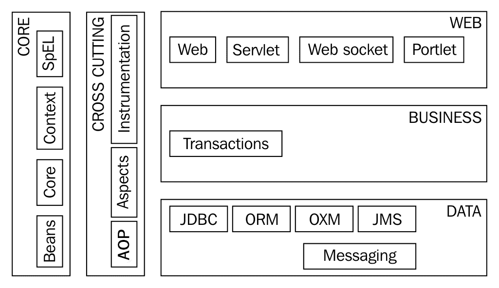

# 第四章：向微服务和云原生应用的演进

在过去的十年中，Spring 框架已经发展成为开发 Java 企业应用程序的最流行框架。Spring 框架使开发松耦合、可测试的应用程序变得容易。它简化了横切关注点的实现。

然而，今天的世界与十年前大不相同。随着时间的推移，应用程序变得庞大而难以管理。由于这些问题，新的架构开始演变。最近的热词是 RESTful 服务、微服务和云原生应用程序。

在本章中，我们将从回顾 Spring 框架在过去十年中解决的问题开始。我们将了解**单片应用程序**的问题，并介绍更小、独立部署的组件的世界。

我们将探讨为什么世界正在向微服务和云原生应用程序发展。我们将结束本章，看看 Spring 框架和 Spring 项目如何发展以解决当今的问题。

本章将涵盖以下主题：

+   基于 Spring 的典型应用程序架构

+   Spring 框架在过去十年中解决的问题

+   我们开发应用程序时的目标是什么？

+   单片应用程序存在哪些挑战？

+   什么是微服务？

+   微服务的优势是什么？

+   微服务存在哪些挑战？

+   有哪些好的实践可以帮助将微服务部署到云中？

+   有哪些 Spring 项目可以帮助我们开发微服务和云原生应用程序？

# 具有 Spring 的典型 Web 应用程序架构

在过去的十五年中，Spring 一直是连接 Java 企业应用程序的首选框架。应用程序使用分层架构，所有横切关注点都使用面向方面的编程进行管理。以下图表显示了使用 Spring 开发的 Web 应用程序的典型架构：


这样的应用程序中的典型层在这里列出。我们将把横切关注点列为一个单独的层，尽管在现实中，它们适用于所有层：

+   **Web 层**：通常负责控制 Web 应用程序流程（控制器和/或前端控制器）并呈现视图。

+   **业务层**：这是您的所有业务逻辑所在。大多数应用程序从业务层开始进行事务管理。

+   **数据层**：它还负责与数据库通信。这负责将 Java 对象中的数据持久化/检索到数据库中的表中。

+   **集成层**：应用程序与其他应用程序通信，可以通过队列或调用 Web 服务来实现。集成层与其他应用程序建立这样的连接。

+   **横切关注点**：这些是跨不同层的关注点--日志记录、安全性、事务管理等。由于 Spring IoC 容器管理 bean，它可以通过**面向方面的编程**（**AOP**）在 bean 周围编织这些关注点。

让我们更详细地讨论每个层和使用的框架。 

# Web 层

Web 层取决于您希望如何向最终用户公开业务逻辑。它是 Web 应用程序吗？还是您正在公开 RESTful Web 服务？

# Web 应用程序-呈现 HTML 视图

这些 Web 应用程序使用 Web MVC 框架，如 Spring MVC 或 Struts。视图可以使用 JSP、JSF 或基于模板的框架（如 Freemarker）进行呈现。

# RESTful 服务

用于开发 RESTful Web 服务的两种典型方法：

+   **JAX-RS**：用于 REST 服务的 Java API。这是 Java EE 规范的标准。Jersey 是参考实现。

+   **Spring MVC 或 Spring REST**：Restful 服务也可以使用 Spring MVC 开发。

Spring MVC 没有实现 JAX-RS，因此选择比较棘手。JAX-RS 是一个 Java EE 标准。但是 Spring MVC 更具创新性，更有可能帮助您更快地构建新功能。

# 业务层

业务层通常包含应用程序中的所有业务逻辑。在这一层中，使用 Spring 框架来连接 bean。

这也是事务管理边界开始的地方。事务管理可以使用 Spring AOP 或 AspectJ 来实现。十年前，**企业 Java Bean**（**EJB**）是实现业务层的最流行方法。由于其轻量级特性，Spring 现在是业务层的首选框架。

EJB3 比 EJB2 简单得多。然而，EJB3 发现很难赶上 Spring 失去的地位。

# 数据层

大多数应用程序与数据库通信。数据层负责将 Java 对象的数据存储到数据库中，反之亦然。以下是构建数据层的最流行方法：

+   **JPA**：**Java 持久化 API**帮助您将 Java 对象（POJOs）映射到数据库表。Hibernate 是 JPA 最流行的实现。JPA 通常适用于所有事务性应用程序。JPA 不是批处理和报告应用程序的最佳选择。

+   **MyBatis**：MyBatis（以前是 iBatis）是一个简单的数据映射框架。正如其网站（[`www.mybatis.org/mybatis-3/`](http://www.mybatis.org/mybatis-3/)）所说，*MyBatis 是一个支持自定义 SQL、存储过程和高级映射的一流持久化框架。MyBatis 几乎消除了所有的 JDBC 代码和手动设置参数以及检索结果*。MyBatis 可以考虑用于更常用 SQL 和存储过程的批处理和报告应用程序。

+   **Spring JDBC**：JDBC 和 Spring JDBC 不再那么常用。

我们将在《第八章》*Spring Data*中详细讨论 JDBC、Spring JDBC、MyBatis 和 JPA 的优缺点。

# 集成层

集成层通常是我们与其他应用程序交流的地方。可能有其他应用程序通过 HTTP（Web）或 MQ 公开 SOAP 或 RESTful 服务。

+   Spring JMS 通常用于在队列或服务总线上发送或接收消息。

+   Spring MVC RestTemplate 可用于调用 RESTful 服务。

+   Spring WS 可用于调用基于 SOAP 的 Web 服务。

+   Spring Integration 提供了一个更高级的抽象层，用于构建企业集成解决方案。它通过清晰地分离应用程序和集成代码的关注点，实现了可测试性。它支持所有流行的企业集成模式。我们将在《第十章》*Spring Cloud Data Flow*中更多地讨论 Spring Integration。

# 横切关注点

横切关注点是通常适用于应用程序的多个层的关注点--日志记录、安全性和事务管理等。让我们快速讨论其中一些：

+   **日志记录**：可以使用面向方面的编程（Spring AOP 或 AspectJ）在多个层实现审计日志记录。

+   **安全性**：通常使用 Spring Security 框架来实现安全性。正如前一章所讨论的，Spring Security 使安全性的实现变得非常简单。

+   **事务管理**：Spring 框架为事务管理提供了一致的抽象。更重要的是，Spring 框架为声明式事务管理提供了很好的支持。以下是 Spring 框架支持的一些事务 API：

+   **Java 事务 API**（**JTA**）是事务管理的标准。它是 Java EE 规范的一部分。

+   JDBC。

+   JPA（包括 Hibernate）。

+   错误处理：Spring 提供的大多数抽象使用未检查的异常，因此除非业务逻辑需要，否则在暴露给客户（用户或其他应用程序）的层中实现错误处理就足够了。Spring MVC 提供了 Controller Advice 来实现整个应用程序中一致的错误处理。

Spring 框架在应用程序架构中扮演着重要角色。Spring IoC 用于将不同层中的 bean 连接在一起。Spring AOP 用于在 bean 周围编织交叉关注点。除此之外，Spring 还与不同层的框架提供了很好的集成。

在接下来的部分中，我们将快速回顾 Spring 在过去十年左右解决的一些重要问题。

# Spring 解决的问题

Spring 是连接企业 Java 应用程序的首选框架。它解决了自 EJB2 以来企业 Java 应用程序面临的许多问题。以下是其中的一些：

+   松耦合和可测试性

+   管道代码

+   轻量级架构

+   架构灵活性

+   简化交叉关注点的实现

+   最佳的免费设计模式

# 松耦合和可测试性

通过依赖注入，Spring 实现了类之间的松耦合。虽然松耦合对于长期应用的可维护性是有益的，但首先实现的好处是它带来的可测试性。

在 Spring 之前，Java EE（或当时称为 J2EE）并不擅长可测试性。测试 EJB2 应用程序的唯一方法是在容器中运行它们。对它们进行单元测试非常困难。

这正是 Spring 框架要解决的问题。正如我们在前面的章节中看到的，如果使用 Spring 来连接对象，编写单元测试会变得更容易。我们可以轻松地存根或模拟依赖项并将它们连接到对象中。

# 管道代码

20 世纪 90 年代末和 21 世纪初到中期的开发人员会熟悉必须编写大量管道代码来执行通过 JDBC 进行简单查询并将结果填充到 Java 对象中的情况。你必须执行 Java 命名和目录接口（JNDI）查找，获取连接并填充结果。这导致了重复的代码。通常，问题在每个方法中都会重复出现异常处理代码。而且这个问题并不仅限于 JDBC。

Spring 框架解决的问题之一是通过消除所有管道代码。通过 Spring JDBC、Spring JMS 和其他抽象，开发人员可以专注于编写业务逻辑。Spring 框架处理了繁琐的细节。

# 轻量级架构

使用 EJB 使应用程序变得复杂，并非所有应用程序都需要那种复杂性。Spring 提供了一种简化、轻量级的应用程序开发方式。如果需要分发，可以随后添加。

# 架构灵活性

Spring 框架用于在不同层中连接应用程序中的对象。尽管它一直存在，但 Spring 框架并没有限制应用架构师和开发人员的灵活性或选择框架的选择。以下是一些示例：

+   Spring 框架在 Web 层提供了很大的灵活性。如果你想使用 Struts 或 Struts 2 而不是 Spring MVC，是可以配置的。你可以选择与更广泛的视图和模板框架集成。

+   另一个很好的例子是数据层，你可以通过 JPA、JDBC 和映射框架（如 MyBatis）来连接。

# 简化交叉关注点的实现

当 Spring 框架用于管理 bean 时，Spring IoC 容器管理 bean 的生命周期——创建、使用、自动连接和销毁。这使得更容易在 bean 周围编织额外的功能，比如交叉关注点。

# 免费的设计模式

Spring Framework 默认鼓励使用许多设计模式。一些例子如下：

+   **依赖注入或控制反转**：这是 Spring Framework 建立的基本设计模式。它实现了松散耦合和可测试性。

+   **单例**：所有 Spring bean 默认都是单例。

+   **工厂模式**：使用 bean 工厂来实例化 bean 是工厂模式的一个很好的例子。

+   **前端控制器**：Spring MVC 使用 DispatcherServlet 作为前端控制器。因此，当我们使用 Spring MVC 开发应用程序时，我们使用前端控制器模式。

+   **模板方法**：帮助我们避免样板代码。许多基于 Spring 的类--JdbcTemplate 和 JmsTemplate--都是这种模式的实现。

# 应用程序开发目标

在我们转向 REST 服务、微服务和云原生应用程序的概念之前，让我们花些时间了解我们开发应用程序时的共同目标。了解这些目标将有助于我们理解为什么应用程序正在向微服务架构转变。

首先，我们应该记住，软件行业仍然是一个相对年轻的行业。在我十五年的软件开发、设计和架构经验中，一直有一件事是不变的，那就是事物的变化。今天的需求不是明天的需求。今天的技术不是明天我们将使用的技术。虽然我们可以尝试预测未来会发生什么，但我们经常是错误的。

在软件开发的最初几十年中，我们做的一件事是为未来构建软件系统。设计和架构被复杂化，以应对未来的需求。

在过去的十年中，随着**敏捷**和**极限编程**，重点转向了**精益**和构建足够好的系统，遵循基本的设计原则。重点转向了演进式设计。思考过程是这样的：**如果一个系统对今天的需求有良好的设计，并且不断发展并且有良好的测试，它可以很容易地重构以满足明天的需求**。

虽然我们不知道我们的方向，但我们知道在开发应用程序时的大部分目标并没有改变。

对于大量应用程序的软件开发的关键目标可以用“规模上的速度和安全”来描述。

我们将在下一节中讨论这些元素。

# 速度

交付新需求和创新的速度越来越成为一个关键的区分因素。快速开发（编码和测试）已经不够了。快速交付（到生产环境）变得很重要。现在已经普遍认识到，世界上最好的软件组织每天多次将软件交付到生产环境。

技术和商业环境是不断变化和不断发展的。关键问题是“一个应用程序能够多快地适应这些变化？”。这里强调了技术和商业环境中的一些重要变化：

+   新的编程语言

+   Go

+   Scala

+   闭包

+   新的编程范式

+   函数式编程

+   响应式编程

+   新框架

+   新工具

+   开发

+   代码质量

+   自动化测试

+   部署

+   容器化

+   新的流程和实践

+   敏捷

+   测试驱动开发

+   行为驱动开发

+   持续集成

+   持续交付

+   DevOps

+   新设备和机会

+   移动

+   云

# 安全

速度没有安全有什么用？谁会想要乘坐一辆可以以每小时 300 英里的速度行驶但没有适当安全功能的汽车呢？

让我们考虑一个安全应用程序的几个特点：

# 可靠性

可靠性是系统功能的准确度的度量。

要问的关键问题如下：

+   系统是否满足其功能要求？

+   在不同的发布阶段泄漏了多少缺陷？

# 可用性

大多数外部面向客户的应用程序都希望全天候可用。可用性是衡量应用程序对最终用户可用的时间百分比。

# 安全性

应用程序和数据的安全对组织的成功至关重要。应该有明确的程序进行身份验证（你是你声称的那个人吗？）、授权（用户有什么访问权限？）和数据保护（接收或发送的数据是否准确？数据是否安全，不会被意外用户拦截？）。

我们将在《第六章》中更多地讨论如何使用 Spring Security 实现安全性，*扩展微服务*。

# 性能

如果一个 Web 应用程序在几秒内没有响应，你的应用程序的用户很有可能会感到失望。性能通常指的是系统在为定义数量的用户提供约定的响应时间的能力。

# 高弹性

随着应用程序变得分布式，故障的概率增加。应用程序在出现局部故障或中断的情况下会如何反应？它能否在完全崩溃的情况下提供基本操作？

应用程序在出现意外故障时提供最低限度的服务水平的行为被称为弹性。

随着越来越多的应用程序向云迁移，应用程序的弹性变得重要。

我们将在《第九章》中讨论如何使用*Spring Cloud 和 Spring Data Flow*构建高度弹性的微服务，*Spring Cloud*和《第十章》*Spring Cloud Data Flow*。

# 可伸缩性

可伸缩性是衡量应用在其可用资源被扩展时的反应能力。如果一个应用程序在给定基础设施支持 10,000 用户，它能否在双倍基础设施的情况下支持至少 20,000 用户？

如果一个 Web 应用程序在几秒内没有响应，你的应用程序的用户很有可能会感到失望。性能通常指的是系统在为定义数量的用户提供约定的响应时间的能力。

在云的世界中，应用程序的可伸缩性变得更加重要。很难猜测一个创业公司可能会有多成功。Twitter 或 Facebook 在孵化时可能没有预料到这样的成功。他们的成功在很大程度上取决于他们如何能够适应用户基数的多倍增长而不影响性能。

我们将在《第九章》中讨论如何使用 Spring Cloud 和 Spring Data Flow 构建高度可伸缩的微服务，*Spring Cloud*和《第十章》*Spring Cloud Data Flow*。

# 单体应用的挑战

在过去的几年里，除了与几个小应用程序一起工作，我还有机会在不同领域的四个不同的单体应用程序上工作--保险、银行和医疗保健。所有这些应用程序都面临着非常相似的挑战。在本节中，我们将首先看一下单体应用的特征，然后再看看它们带来的挑战。

首先：什么是单体应用？一个有很多代码的应用--可能超过 10 万行代码？是的。

对我来说，单体应用是那些在将发布推向生产环境时面临巨大挑战的应用。属于这一类别的应用有许多用户需求是迫切需要的，但这些应用可能每隔几个月才能发布新功能。有些应用甚至每季度发布一次功能，有时甚至少至一年两次。

通常，所有的单体应用都具有这些特征：

+   **体积庞大**：大多数这些单片应用有超过 10 万行的代码。有些代码库超过 100 万行代码。

+   **团队庞大**：团队规模可能从 20 到 300 不等。

+   **多种做同一件事的方式**：由于团队庞大，存在沟通障碍。这导致应用程序不同部分对同一问题有多种解决方案。

+   **缺乏自动化测试**：大多数这些应用几乎没有单元测试，也完全缺乏集成测试。这些应用高度依赖手动测试。

由于这些特点，这些单片应用面临许多挑战。

# 发布周期长

在单片的一个部分进行代码更改可能会影响单片的其他部分。大多数代码更改都需要完整的回归周期。这导致发布周期很长。

由于缺乏自动化测试，这些应用依赖手动测试来发现缺陷。将功能上线是一个重大挑战。

# 难以扩展

通常，大多数单片应用不是云原生的，这意味着它们不容易部署在云上。它们依赖手动安装和手动配置。通常在将新应用实例添加到集群之前，运维团队需要投入大量工作。这使得扩展规模成为一个重大挑战。

另一个重要的挑战是大型数据库。通常，单片应用的数据库容量达到**TB**级别。当扩展规模时，数据库成为瓶颈。

# 调整新技术

大多数单片应用使用旧技术。将新技术添加到单片中只会使其更难以维护。架构师和开发人员不愿引入任何新技术。

# 调整新方法

敏捷等新方法需要小型（四至七人的团队）。单片的重要问题是：我们如何防止团队互相干扰？我们如何创建能够使团队独立工作的岛屿？这是一个难以解决的挑战。

# 现代开发实践的调整

现代开发实践，如**测试驱动开发**（**TDD**）、**行为驱动开发**（**BDD**）需要松耦合、可测试的架构。如果单片应用具有紧密耦合的层和框架，很难进行单元测试。这使得调整现代开发实践具有挑战性。

# 了解微服务

单片应用的挑战导致组织寻找解决方案。我们如何能够更频繁地上线更多功能？

许多组织尝试了不同的架构和实践来寻找解决方案。

在过去几年中，所有成功做到这一点的组织中出现了一个共同模式。从中产生了一种被称为**微服务架构**的架构风格。

正如 Sam Newman 在《构建微服务》一书中所说：许多组织发现，通过拥抱细粒度、微服务架构，他们可以更快地交付软件并采用更新的技术。

# 什么是微服务？

我在软件中喜欢的一个原则是*保持小型*。无论你在谈论什么，这个原则都适用——变量的范围、方法、类、包或组件的大小。你希望所有这些都尽可能小。

微服务是这一原则的简单延伸。它是一种专注于构建小型基于能力的独立可部署服务的架构风格。

没有一个单一的微服务定义。我们将看一些流行的定义：

“微服务是小型、自治的服务，彼此协同工作”

- Sam Newman，Thoughtworks

“松耦合的面向服务的架构与有界上下文”

- Adrian Cockcroft, Battery Ventures

“微服务是有界范围内的独立部署组件，通过基于消息的通信支持互操作性。微服务架构是一种由能力对齐的微服务组成的高度自动化、可演进的软件系统的工程风格”在《微服务架构》一书中

- Irakli Nadareishvili, ‎Ronnie Mitra, ‎Matt McLarty

虽然没有公认的定义，但所有微服务定义中通常具有一些特征。在我们看微服务的特征之前，我们将尝试了解整体情况-我们将看看没有微服务的架构与使用微服务的架构相比如何。

# 微服务架构

单体应用程序-即使是模块化的-也有一个可部署的单元。下图显示了一个具有三个模块的单体应用程序的示例，模块 1、2 和 3。这些模块可以是单体应用程序的一部分的业务能力。在购物应用程序中，其中一个模块可能是产品推荐。


以下图显示了使用微服务架构开发的前一个单体应用程序的样子：


需要注意的一些重要事项如下：

+   模块是基于业务能力进行识别的。模块提供了什么功能？

+   每个模块都可以独立部署。在下面的示例中，模块 1、2 和 3 是单独的可部署单元。如果模块 3 的业务功能发生变化，我们可以单独构建和部署模块 3。

# 微服务特征

在前一节中，我们看了一个微服务架构的例子。对于成功适应微服务架构风格的组织的经验评估表明，团队和架构共享了一些特征。让我们看看其中一些：


# 小型和轻量级微服务

良好的微服务提供了业务能力。理想情况下，微服务应遵循“单一责任原则”。因此，微服务通常规模较小。通常，我使用的一个经验法则是应该能够在 5 分钟内构建和部署一个微服务。如果构建和部署需要更长时间，很可能正在构建一个比推荐的微服务更大的服务。

一些小型和轻量级微服务的例子如下：

+   产品推荐服务

+   电子邮件通知服务

+   购物车服务

# 基于消息的通信的互操作性

微服务的关键重点是互操作性-使用不同技术之间的系统通信。实现互操作性的最佳方式是使用基于消息的通信。

# 能力对齐的微服务

微服务必须有清晰的边界是至关重要的。通常，每个微服务都有一个单一的业务能力，它能够很好地提供。团队发现成功地采用了 Eric J Evans 在《领域驱动设计》一书中提出的“有界上下文”概念。

基本上，对于大型系统来说，创建一个领域模型非常困难。Evans 谈到了将系统拆分为不同的有界上下文。确定正确的有界上下文是微服务架构成功的关键。

# 独立部署单元

每个微服务都可以单独构建和部署。在前面讨论的示例中，模块 1、2 和 3 可以分别构建和部署。

# 无状态

理想的微服务没有状态。它不在请求之间存储任何信息。创建响应所需的所有信息都包含在请求中。

# 自动化构建和发布过程

微服务具有自动化的构建和发布流程。看一下下面的图。它展示了微服务的简单构建和发布流程：


当一个微服务被构建和发布时，微服务的一个版本被存储在仓库中。部署工具有能力从仓库中选择正确的微服务版本，将其与特定环境所需的配置（来自配置仓库）匹配，并将微服务部署到特定环境中。

一些团队进一步将微服务包与运行微服务所需的基础设施结合起来。部署工具将复制此映像，并将其与特定环境的配置匹配以创建环境。

# 事件驱动架构

微服务通常采用事件驱动架构构建。让我们考虑一个简单的例子。每当有新客户注册时，需要执行三件事：

+   将客户信息存储到数据库中

+   发送欢迎套件

+   发送电子邮件通知

让我们看看设计这个的两种不同方法。

# 方法 1 - 顺序方法

让我们考虑三个服务--`CustomerInformationService`、`MailService`和`EmailService`，它们可以提供前面列出的功能。我们可以使用以下步骤创建`NewCustomerService`：

1.  调用`CustomerInformationService`将客户信息保存到数据库中。

1.  调用`MailService`发送欢迎套件。

1.  调用`EmailService`发送电子邮件通知。

`NewCustomerService`成为所有业务逻辑的中心。想象一下，如果我们在创建新客户时需要做更多的事情。所有这些逻辑将开始累积并使`NewCustomerService`变得臃肿。

# 方法 2 - 事件驱动方法

在这种方法中，我们使用消息代理。`NewCustomerService`将创建一个新事件并将其发布到消息代理。下图显示了一个高层表示：


三个服务--`CustomerInformationService`、`MailService`和`EmailService`--将在消息代理上监听新事件。当它们看到新的客户事件时，它们会处理它并执行该特定服务的功能。

事件驱动方法的关键优势在于没有所有业务逻辑的集中磁铁。添加新功能更容易。我们可以创建一个新服务来监听消息代理上的事件。还有一点需要注意的是，我们不需要对任何现有服务进行更改。

# 独立团队

开发微服务的团队通常是独立的。它包含了开发、测试和部署微服务所需的所有技能。它还负责在生产中支持微服务。

# 微服务优势

微服务有几个优势。它们有助于跟上技术并更快地为您的客户提供解决方案。

# 更快的上市时间

更快的上市时间是确定组织成功的关键因素之一。

微服务架构涉及创建小型、独立部署的组件。微服务的增强更容易，更不脆弱，因为每个微服务都专注于单一的业务能力。流程中的所有步骤--构建、发布、部署、测试、配置管理和监控--都是自动化的。由于微服务的责任是有界的，因此可以编写出色的自动化单元和集成测试。

所有这些因素导致应用程序能够更快地对客户需求做出反应。

# 技术演进

每天都有新的语言、框架、实践和自动化可能性出现。应用程序架构必须具备灵活性，以适应新的可能性。以下图显示了不同服务是如何使用不同技术开发的：


微服务架构涉及创建小型服务。在某些边界内，大多数组织都允许个体团队做出一些技术决策。这使团队能够尝试新技术并更快地创新。这有助于应用程序适应并与技术的演进保持一致。

# 可用性和扩展性

应用程序的不同部分的负载通常非常不同。例如，在航班预订应用程序的情况下，顾客通常在决定是否预订航班之前进行多次搜索。搜索模块的负载通常会比预订模块的负载多很多倍。微服务架构提供了设置多个搜索服务实例和少量预订服务实例的灵活性。

以下图显示了如何根据负载扩展特定微服务：


微服务**2**和**3**共享一个盒子（部署环境）。负载更大的微服务**1**被部署到多个盒子中。

另一个例子是初创公司的需求。当初创公司开始运营时，他们通常不知道自己可能会增长到何种程度。如果应用程序的需求增长得非常快会发生什么？如果他们采用微服务架构，它可以使他们在需要时更好地扩展。

# 团队动态

敏捷等开发方法倡导小型、独立的团队。由于微服务很小，围绕它们建立小团队是可能的。团队是跨职能的，对特定微服务拥有端到端的所有权。

微服务架构非常适合敏捷和其他现代开发方法。

# 微服务挑战

微服务架构具有显著的优势。但是，也存在显著的挑战。确定微服务的边界是一个具有挑战性但重要的决定。由于微服务很小，在大型企业中可能会有数百个微服务，因此具有良好的自动化和可见性至关重要。

# 自动化需求增加

使用微服务架构，你将一个大型应用程序拆分成多个微服务，因此构建、发布和部署的数量会成倍增加。对于这些步骤采用手动流程将非常低效。

测试自动化对于实现更快的上市时间至关重要。团队应该专注于识别可能出现的自动化可能性。

# 定义子系统的边界

微服务应该是智能的。它们不是弱的 CRUD 服务。它们应该模拟系统的业务能力。它们在一个有界上下文中拥有所有的业务逻辑。话虽如此，微服务不应该很大。决定微服务的边界是一个挑战。第一次确定正确的边界可能会很困难。团队对业务上下文的了解越多，知识就会流入架构中，并确定新的边界。通常，找到微服务的正确边界是一个演进的过程。

以下是需要注意的几个重要点：

+   松耦合和高内聚对于任何编程和架构决策都是基本的。当系统松耦合时，对一个部分的更改不应该需要其他部分的更改。

+   有界上下文代表着具体业务能力的自治业务模块。

正如 Sam Newman 在书中所说的“构建微服务--”：“通过明确的边界强制执行特定的责任”。始终思考，“我们为域的其他部分提供了哪些能力？”。

# 可见性和监控

使用微服务，一个应用程序被拆分成多个微服务。为了征服与多个微服务和异步基于事件的协作相关的复杂性，具有良好的可见性是很重要的。

确保高可用性意味着每个微服务都应该受到监控。自动化的微服务健康管理变得很重要。

调试问题需要洞察多个微服务背后发生的情况。通常使用集中日志记录，从不同微服务中聚合日志和指标。需要使用诸如关联 ID 之类的机制来隔离和调试问题。

# 容错性

假设我们正在构建一个购物应用程序。如果推荐微服务宕机会发生什么？应用程序如何反应？会完全崩溃吗？还是会让顾客继续购物？随着我们适应微服务架构，这种情况会更加频繁发生。

随着我们将服务变得更小，服务宕机的可能性增加。应用程序如何应对这些情况成为一个重要问题。在前面的例子中，一个容错应用程序会显示一些默认的推荐，同时让顾客继续购物。

随着我们进入微服务架构，应用程序应该更具有容错性。应用程序应该能够在服务宕机时提供降级行为。

# 最终一致性

在组织中，微服务之间的一定程度的一致性是很重要的。微服务之间的一致性使得整个组织能够在开发、测试、发布、部署和运营过程中实现类似的流程。这使得不同的开发人员和测试人员在跨团队移动时能够保持高效。在一定程度上保持灵活性，而不是过于死板，以避免扼杀创新，这是很重要的。

# 共享能力（企业级）

让我们看看在企业级必须标准化的一些能力。

+   **硬件**：我们使用什么硬件？我们使用云吗？

+   **代码管理**：我们使用什么版本控制系统？我们在分支和提交代码方面的做法是什么？

+   **构建和部署**：我们如何构建？我们使用什么工具来自动化部署？

+   **数据存储**：我们使用什么类型的数据存储？

+   **服务编排**：我们如何编排服务？我们使用什么样的消息代理？

+   **安全和身份**：我们如何对用户和服务进行身份验证和授权？

+   **系统可见性和监控**：我们如何监控我们的服务？我们如何在整个系统中提供故障隔离？

# 运维团队需求增加

随着我们进入微服务世界，运维团队的责任发生了明显的转变。责任转移到识别自动化机会，而不是手动操作，比如执行发布和部署。

随着多个微服务和系统不同部分之间通信的增加，运维团队变得至关重要。重要的是在初始阶段就将运维团队纳入团队，以便他们能够找到简化运维的解决方案。

# 云原生应用

云正在改变世界。出现了以前从未可能的许多可能性。组织能够按需提供计算、网络和存储设备。这在许多行业中有很高的潜力来降低成本。

考虑零售行业，在某些时段需求很高（黑色星期五，假日季等）。为什么他们要在整年都支付硬件费用，而不是按需提供呢？

虽然我们希望从云的可能性中受益，但这些可能性受到架构和应用程序性质的限制。

我们如何构建可以轻松部署到云上的应用程序？这就是云原生应用程序的作用。

云原生应用程序是那些可以轻松部署到云上的应用程序。这些应用程序共享一些共同的特征。我们将首先看一下 Twelve-Factor 应用程序--云原生应用程序中常见模式的组合。

# Twelve-Factor 应用程序

Twelve-Factor 应用程序是由 Heroku 的工程师的经验演变而来的。这是一份在云原生应用程序架构中使用的模式列表。

重要的是要注意，这里的应用程序是指一个单独的可部署单元。基本上，每个微服务都是一个应用程序（因为每个微服务都可以独立部署）。

# 维护一个代码库

每个应用程序在修订控制中有一个代码库。可以部署应用程序的多个环境。但是，所有这些环境都使用来自单个代码库的代码。一个反模式的例子是从多个代码库构建可部署的应用程序。

# 依赖项

所有依赖项必须明确声明和隔离。典型的 Java 应用程序使用构建管理工具，如 Maven 和 Gradle 来隔离和跟踪依赖项。

下图显示了典型的 Java 应用程序使用 Maven 管理依赖项：


下图显示了 `pom.xml`，其中管理了 Java 应用程序的依赖项：


# 配置

所有应用程序的配置在不同环境之间都有所不同。配置可以在多个位置找到；应用程序代码、属性文件、数据库、环境变量、JNDI 和系统变量都是一些例子。

Twelve-Factor 应用程序

应用程序应在环境中存储配置。虽然在 Twelve-Factor 应用程序中建议使用环境变量来管理配置，但对于更复杂的系统，应考虑其他替代方案，例如为应用程序配置建立一个集中存储库。

无论使用何种机制，我们建议您执行以下操作：

在应用程序代码之外管理配置（独立于应用程序的可部署单元）

使用标准化的配置方式

# 后备服务

应用程序依赖于其他可用的服务--数据存储和外部服务等。Twelve-Factor 应用程序将后备服务视为附加资源。后备服务通常通过外部配置声明。

与后备服务的松耦合具有许多优势，包括能够优雅地处理后备服务的中断。

# 构建、发布、运行

构建、发布和运行阶段的描述如下。我们应该在这三个阶段之间保持清晰的分离：

+   **构建**：从代码创建可执行包（EAR、WAR 或 JAR），以及可以部署到多个环境的依赖项

+   **发布**：将可执行包与特定环境配置结合起来，在环境中部署

+   **运行**：使用特定发布在执行环境中运行应用程序

以下截图突出显示了构建和发布阶段：


一个反模式是构建针对每个环境特定的单独可执行包。

# 无状态

Twelve-Factor 应用程序没有状态。它需要的所有数据都存储在持久存储中。

粘性会话是一种反模式。

# 端口绑定

Twelve-Factor 应用程序通过端口绑定公开所有服务。虽然可能有其他机制来公开服务，但这些机制是依赖于实现的。端口绑定可以完全控制接收和处理消息，无论应用程序部署在何处。

# 并发

十二要素应用通过水平扩展实现更多的并发。垂直扩展有其限制。水平扩展提供了无限扩展的机会。

# 可处置性

十二要素应用应该促进弹性扩展。因此，它们应该是可处置的。它们可以在需要时启动和停止。

十二要素应用应该做到以下几点：

+   具有最小的启动时间。长时间的启动意味着应用程序在能够接受请求之前有很长的延迟。

+   优雅地关闭。

+   优雅地处理硬件故障。

# 环境一致性

所有环境——开发、测试、暂存和生产——应该是相似的。它们应该使用相同的流程和工具。通过持续部署，它们应该非常频繁地具有相似的代码。这使得查找和修复问题更容易。

# 日志作为事件流

对于十二要素应用来说，可见性至关重要。由于应用部署在云上并且自动扩展，重要的是你能够集中查看应用程序不同实例中发生的情况。

将所有日志视为流使得可以将日志流路由到不同的目的地以进行查看和存档。这个流可以用于调试问题、执行分析，并基于错误模式创建警报系统。

# 没有管理流程的区别

十二要素应用将管理任务（迁移、脚本）视为正常应用程序流程的一部分。

# Spring 项目

随着世界朝着云原生应用和微服务迈进，Spring 项目也紧随其后。有许多新的 Spring 项目——Spring Boot、Spring Cloud 等，解决了新兴世界的问题。

# Spring Boot

在单体架构时代，我们有时间为应用程序设置框架的奢侈。然而，在微服务时代，我们希望更快地创建单独的组件。Spring Boot 项目旨在解决这个问题。

正如官方网站强调的那样，Spring Boot 使得创建独立的、生产级别的基于 Spring 的应用程序变得容易，你可以*直接运行*。我们对 Spring 平台和第三方库采取了一种有主见的观点，这样你就可以尽量少地开始。

Spring Boot 旨在采取一种有主见的观点——基本上为我们做出许多决定——以开发基于 Spring 的项目。

在接下来的几章中，我们将看看 Spring Boot 以及不同的功能，使我们能够更快地创建适用于生产的应用程序。

# Spring Cloud

Spring Cloud 旨在为在云上构建系统时遇到的一些常见模式提供解决方案：

+   **配置管理**：正如我们在十二要素应用部分讨论的那样，管理配置是开发云原生应用的重要部分。Spring Cloud 为微服务提供了一个名为 Spring Cloud Config 的集中式配置管理解决方案。

+   **服务发现**：服务发现促进了服务之间的松耦合。Spring Cloud 与流行的服务发现选项（如 Eureka、ZooKeeper 和 Consul）集成。

+   **断路器**：云原生应用必须具有容错能力。它们应该能够优雅地处理后端服务的故障。断路器在故障时提供默认的最小服务起着关键作用。Spring Cloud 与 Netflix Hystrix 容错库集成。

+   **API 网关**：API 网关提供集中的聚合、路由和缓存服务。Spring Cloud 与 API 网关库 Netflix Zuul 集成。

# 总结

在本章中，我们看到了世界是如何向微服务和云原生应用发展的。我们了解到 Spring 框架和项目如何发展以满足当今世界的需求，例如 Spring Boot、Spring Cloud 和 Spring Data 等项目。

在下一章中，我们将开始关注 Spring Boot。我们将看看 Spring Boot 如何简化微服务的开发。

Spring 框架 1.0 的第一个版本于 2004 年 3 月发布。十五年多来，Spring 框架一直是构建 Java 应用程序的首选框架。

在相对年轻和充满活力的 Java 框架世界中，十年是很长的时间。

在本章中，我们将开始了解 Spring 框架的核心特性。我们将看看 Spring 框架为何变得受欢迎以及如何适应保持首选框架。在快速了解 Spring 框架的重要模块后，我们将进入 Spring 项目的世界。最后，我们将看看 Spring 框架 5.0 中的新功能。

本章将回答以下问题：

+   Spring 框架为何受欢迎？

+   Spring 框架如何适应应用架构的演变？

+   Spring 框架中的重要模块是什么？

+   Spring 框架在 Spring 项目的伞下适用于哪里？

+   Spring 框架 5.0 中的新功能是什么？

# Spring 框架

Spring 网站（[`projects.spring.io/spring-framework/`](https://projects.spring.io/spring-framework/)）将 Spring 框架定义如下：*Spring 框架为现代基于 Java 的企业应用程序提供了全面的编程和配置模型*。

Spring 框架用于连接企业 Java 应用程序。Spring 框架的主要目的是处理连接应用程序不同部分所需的所有技术细节。这使程序员能够专注于他们的工作核心--编写业务逻辑。

# EJB 的问题

Spring 框架于 2004 年 3 月发布。当 Spring 框架的第一个版本发布时，开发企业应用程序的流行方式是使用 EJB 2.1。

开发和部署 EJB 是一个繁琐的过程。虽然 EJB 使组件的分发变得更容易，但开发、单元测试和部署它们并不容易。EJB 的初始版本（1.0、2.0、2.1）具有复杂的应用程序接口（API），导致人们认为（在大多数应用程序中是真的）引入的复杂性远远超过了好处：

+   难以进行单元测试。实际上，在 EJB 容器外进行测试很困难。

+   需要实现多个接口，其中包含许多不必要的方法。

+   繁琐和乏味的异常处理。

+   不方便的部署描述符。

Spring 框架被引入作为一个轻量级框架，旨在简化开发 Java EE 应用程序。

# Spring 框架为什么受欢迎？

Spring 框架的第一个版本于 2004 年 3 月发布。在随后的十五年中，Spring 框架的使用和受欢迎程度不断增长。

Spring 框架受欢迎的重要原因如下：

+   简化单元测试--由于依赖注入

+   减少了管道代码

+   架构灵活性

+   跟上时代的变化

让我们详细讨论每一个。

# 简化单元测试

早期版本的 EJB 非常难以进行单元测试。事实上，很难在容器外运行 EJB（截至 2.1 版本）。测试它们的唯一方法是在容器中部署它们。

Spring 框架引入了依赖注入的概念。我们将在第二章“依赖注入”中详细讨论依赖注入。

依赖注入通过轻松替换依赖项为其模拟使单元测试变得容易。我们不需要部署整个应用程序来进行单元测试。

简化单元测试具有多重好处：

+   程序员更加高效

+   缺陷被更早地发现，因此修复成本更低

+   应用程序具有自动化单元测试，可以在持续集成构建中运行，以防止未来的缺陷

# 减少管道代码

在 Spring Framework 之前，典型的 J2EE（或现在称为 Java EE）应用程序包含大量的管道代码。例如：获取数据库连接、异常处理代码、事务管理代码、日志记录代码等等。

让我们看一个使用准备语句执行查询的简单例子：

```java
    PreparedStatement st = null;
    try {
          st = conn.prepareStatement(INSERT_TODO_QUERY);
          st.setString(1, bean.getDescription());
          st.setBoolean(2, bean.isDone());
          st.execute();
        } 
    catch (SQLException e) {
          logger.error("Failed : " + INSERT_TODO_QUERY, e);
     } finally {
                if (st != null) {
           try {
           st.close();
          } catch (SQLException e) {
           // Ignore - nothing to do..
          }
       }
     }
```

在前面的例子中，有四行业务逻辑和超过 10 行的管道代码。

使用 Spring Framework，相同的逻辑可以应用在几行代码中：

```java
    jdbcTemplate.update(INSERT_TODO_QUERY, 
    bean.getDescription(), bean.isDone());
```

# Spring Framework 是如何做到这一点的呢？

在前面的例子中，Spring JDBC（以及 Spring 总体）将大多数已检查异常转换为未检查异常。通常，当查询失败时，我们除了关闭语句并使事务失败之外，没有太多可以做的事情。我们可以集中处理异常并使用 Spring **面向切面编程**（**AOP**）进行注入，而不是在每个方法中实现异常处理。

Spring JDBC 消除了创建所有涉及获取连接、创建准备语句等管道代码的需要。`jdbcTemplate`类可以在 Spring 上下文中创建，并在需要时注入到**数据访问对象**（**DAO**）类中。

与前面的例子类似，Spring JMS、Spring AOP 和其他 Spring 模块有助于减少大量的管道代码。

Spring Framework 让程序员专注于程序员的主要工作--编写业务逻辑。

避免所有管道代码还有另一个很大的好处--减少代码重复。由于所有事务管理、异常处理等代码（通常是所有横切关注点）都在一个地方实现，因此更容易维护。

# 架构灵活性

Spring Framework 是模块化的。它是建立在核心 Spring 模块之上的一组独立模块。大多数 Spring 模块都是独立的--您可以使用其中一个而不必使用其他模块。

让我们看几个例子：

+   在 Web 层，Spring 提供了自己的框架--Spring MVC。但是，Spring 对 Struts、Vaadin、JSF 或您选择的任何 Web 框架都有很好的支持。

+   Spring Beans 可以为您的业务逻辑提供轻量级实现。但是，Spring 也可以与 EJB 集成。

+   在数据层，Spring 通过其 Spring JDBC 模块简化了 JDBC。但是，Spring 对您喜欢的任何数据层框架--JPA、Hibernate（带有或不带有 JPA）或 iBatis 都有很好的支持。

+   您可以选择使用 Spring AOP 实现横切关注点（日志记录、事务管理、安全等）。或者，您可以集成一个完整的 AOP 实现，比如 AspectJ。

Spring Framework 不想成为万能工具。在专注于减少应用程序不同部分之间的耦合并使它们可测试的核心工作的同时，Spring 与您选择的框架进行了很好的集成。这意味着您在架构上有灵活性--如果您不想使用特定的框架，可以轻松地用另一个替换它。

# 跟上时代的变化

Spring Framework 的第一个版本专注于使应用程序可测试。然而，随着时间的推移，出现了新的挑战。Spring Framework 设法通过提供的灵活性和模块来不断发展并保持领先地位。以下列举了一些例子：

+   注解是在 Java 5 中引入的。Spring Framework（版本 2.5 - 2007 年 11 月）在引入基于注解的 Spring MVC 控制器模型方面领先于 Java EE。使用 Java EE 的开发人员必须等到 Java EE 6（2009 年 12 月 - 2 年后）才能获得可比较的功能。

+   Spring Framework 在 Java EE 之前引入了许多抽象概念，以使应用程序与特定实现解耦。 缓存 API 就是一个例子。 Spring 在 Spring 3.1 中提供了透明的缓存支持。 Java EE 推出了*JSR-107*用于 JCache（2014 年）--Spring 4.1 提供了对其的支持。

Spring 带来的另一个重要事项是 Spring 项目的总称。 Spring Framework 只是 Spring 项目下的众多项目之一。 我们将在单独的部分讨论不同的 Spring 项目。 以下示例说明了 Spring 如何通过新的 Spring 项目保持领先地位：

+   **Spring Batch**定义了构建 Java 批处理应用程序的新方法。 我们不得不等到 Java EE 7（2013 年 6 月）才有了 Java EE 中可比的批处理应用程序规范。

+   随着架构向云和微服务发展，Spring 推出了新的面向云的 Spring 项目。 Spring Cloud 有助于简化微服务的开发和部署。 Spring Cloud Data Flow 提供了围绕微服务应用程序的编排。

# Spring 模块

Spring Framework 的模块化是其广泛使用的最重要原因之一。 Spring Framework 非常模块化，有 20 多个不同的模块--具有明确定义的边界。

下图显示了不同的 Spring 模块--按照它们通常在应用程序中使用的层进行组织：



我们将从讨论 Spring 核心容器开始，然后再讨论其他模块，这些模块按照它们通常在应用程序层中使用的方式进行分组。

# Spring 核心容器

Spring Core Container 提供了 Spring Framework 的核心功能--依赖注入，**IoC**（控制反转）容器和应用程序上下文。 我们将在第二章“依赖注入”中更多地了解 DI 和 IoC 容器。

重要的核心 Spring 模块列在以下表中：

| **模块/构件** | **用途** |
| --- | --- |
| spring-core | 其他 Spring 模块使用的实用程序。 |
| spring-beans | 支持 Spring beans。 与 spring-core 结合使用，提供了 Spring Framework 的核心功能--依赖注入。 包括 BeanFactory 的实现。 |
| spring-context | 实现了 ApplicationContext，它扩展了 BeanFactory，并提供了加载资源和国际化等支持。 |
| spring-expression | 扩展了 JSP 的**EL**（表达式语言）并提供了一种用于访问和操作 bean 属性（包括数组和集合）的语言。 |

# 横切关注点

横切关注点适用于所有应用程序层--包括日志记录和安全性等。 **AOP**通常用于实现横切关注点。

单元测试和集成测试属于这个类别，因为它们适用于所有层。

与横切关注点相关的重要 Spring 模块列在以下表中：

| **模块/构件** | **用途** |
| --- | --- |
| spring-aop | 提供面向方面的编程的基本支持--具有方法拦截器和切入点。 |
| spring-aspects | 提供与最受欢迎和功能齐全的 AOP 框架 AspectJ 的集成。 |
| spring-instrument | 提供基本的仪器支持。 |
| spring-test | 提供基本的单元测试和集成测试支持。 |

# Web

Spring 除了与流行的 Web 框架（如 Struts）提供良好的集成外，还提供了自己的 MVC 框架 Spring MVC。

重要的构件/模块列在以下表中：

+   **spring-web**: 提供基本的网络功能，如多部分文件上传。 提供与其他 Web 框架（如 Struts）集成的支持。

+   **spring-webmvc**: 提供了一个功能齐全的 Web MVC 框架--Spring MVC，其中包括实现 REST 服务的功能。

我们将在第三章*使用 Spring MVC 构建 Web 应用程序*和第五章*使用 Spring Boot 构建微服务*中介绍 Spring MVC 并开发 Web 应用程序和 REST 服务。

# 业务

业务层专注于执行应用程序的业务逻辑。使用 Spring，业务逻辑通常在**普通的旧 Java 对象**（**POJO**）中实现。

**Spring Transactions** (**spring-tx**)为 POJO 和其他类提供声明式事务管理。

# 数据

应用程序中的数据层通常与数据库和/或外部接口通信。

以下是与数据层相关的一些重要的 Spring 模块：

| **模块/构件** | **用途** |
| --- | --- |
| spring-jdbc | 提供对 JDBC 的抽象，避免样板代码。 |
| spring-orm | 与 ORM 框架和规范集成--包括 JPA 和 Hibernate 等。 |
| spring-oxm | 提供对象到 XML 映射集成。支持诸如 JAXB、Castor 等框架。 |
| spring-jms | 提供对 JMS 的抽象，避免样板代码。 |

# Spring 项目

虽然 Spring 框架为企业应用程序的核心功能（DI、Web、数据）提供了基础，但其他 Spring 项目探索了企业领域的集成和解决其他问题的解决方案--部署、云端、大数据、批处理和安全等。

以下是一些重要的 Spring 项目：

+   Spring Boot

+   Spring Cloud

+   Spring Data

+   Spring Batch

+   Spring Security

+   Spring HATEOAS

# Spring Boot

在开发微服务和 Web 应用程序时遇到的一些挑战如下：

+   做框架选择和决定兼容的框架版本

+   提供外部化配置的机制--可以从一个环境更改为另一个环境的属性

+   健康检查和监控--如果应用程序的特定部分宕机，则提供警报

+   决定部署环境并为其配置应用程序

Spring Boot 通过采取*主观的观点*来解决所有这些问题。

我们将在两章中深入研究 Spring Boot--第五章，*使用 Spring Boot 构建微服务*和第七章，*高级 Spring Boot 功能*。

# Spring Cloud

可以毫不夸张地说*世界正在向云端迁移*。

云原生微服务和应用程序是当今的趋势。我们将在第四章*向微服务和云原生应用程序的演变*中详细讨论这一点。

Spring 正在快速迈向使云端应用程序开发更简单的方向。

Spring Cloud 为分布式系统中的常见模式提供解决方案。Spring Cloud 使开发人员能够快速创建实现常见模式的应用程序。Spring Cloud 中实现的一些常见模式如下所示：

+   配置管理

+   服务发现

+   断路器

+   智能路由

我们将在第九章中更详细地讨论 Spring Cloud 及其各种功能，*Spring Cloud*。

# Spring Data

当今世界有多个数据来源--SQL（关系型）和各种 NOSQL 数据库。Spring Data 试图为所有这些不同类型的数据库提供一致的数据访问方法。

Spring Data 提供与各种规范和/或数据存储的集成：

+   JPA

+   MongoDB

+   Redis

+   Solr

+   Gemfire

+   Apache Cassandra

以下是一些重要特性：

+   通过从方法名称确定查询来提供对存储库和对象映射的抽象

+   简单的 Spring 集成

+   与 Spring MVC 控制器集成

+   高级自动审计功能--创建者、创建日期、最后更改者和最后更改日期

我们将在第八章中更详细地讨论 Spring Data，*Spring Data*。

# Spring Batch

今天的企业应用程序使用批处理程序处理大量数据。这些应用程序的需求非常相似。Spring Batch 为具有高性能要求的高容量批处理程序提供解决方案。

Spring Batch 中的重要功能如下：

+   启动、停止和重新启动作业的能力，包括重新启动失败的作业从失败的地方重新开始

+   处理数据的能力

+   重试步骤或在失败时跳过步骤的能力

+   基于 Web 的管理界面

# Spring Security

**身份验证**是识别用户的过程。**授权**是确保用户有权访问资源执行已识别的操作的过程。

身份验证和授权是企业应用程序的关键部分，包括 Web 应用程序和 Web 服务。Spring Security 为基于 Java 的应用程序提供声明性身份验证和授权。

Spring Security 中的重要功能如下：

+   简化的身份验证和授权

+   与 Spring MVC 和 Servlet API 的良好集成

+   支持防止常见的安全攻击--**跨站请求伪造**（**CSRF**）和会话固定

+   可用于与 SAML 和 LDAP 集成的模块

我们将在第三章中讨论如何使用 Spring Security 保护 Web 应用程序，*使用 Spring MVC 构建 Web 应用程序*。

我们将在《第六章》中讨论如何使用 Spring Security 来保护基本和 OAuth 身份验证机制的 REST 服务，*扩展微服务*。

# Spring HATEOAS

**HATEOAS**代表**超媒体作为应用程序状态的引擎**。尽管听起来很复杂，但它是一个非常简单的概念。它的主要目的是将服务器（服务提供者）与客户端（服务消费者）解耦。

服务提供者向服务消费者提供有关资源上可以执行的其他操作的信息。

Spring HATEOAS 提供了 HATEOAS 实现，特别是针对使用 Spring MVC 实现的 REST 服务。

Spring HATEOAS 中的重要功能如下：

+   简化指向服务方法的链接的定义，使链接更加稳固

+   支持 JAXB（基于 XML）和 JSON 集成

+   对服务消费者（客户端）的支持

我们将在《第六章》中讨论如何使用 HATEOAS，*扩展微服务*。

# Spring Framework 5.0 中的新功能

Spring Framework 5.0 是 Spring Framework 的首次重大升级，距离 Spring Framework 4.0 已经有将近四年的时间。在这段时间内，Spring Boot 项目的主要发展之一就是 Spring Boot 项目的发展。我们将在下一节中讨论 Spring Boot 2.0 中的新功能。

Spring Framework 5.0 最大的特性之一是**响应式编程**。Spring Framework 5.0 具有核心响应式编程功能，并且支持响应式端点。重要变化的列表包括以下内容：

+   基线升级

+   JDK 9 运行时兼容性

+   在 Spring Framework 代码中使用 JDK 8 功能

+   响应式编程支持

+   功能性的 Web 框架

+   Jigsaw 中的 Java 模块化

+   Kotlin 支持

+   删除的功能

# 基线升级

Spring Framework 5.0 具有 JDK 8 和 Java EE 7 基线。基本上，这意味着不再支持以前的 JDK 和 Java EE 版本。

Spring Framework 5.0 的一些重要基线 Java EE 7 规范如下所示：

+   Servlet 3.1

+   JMS 2.0

+   JPA 2.1

+   JAX-RS 2.0

+   Bean Validation 1.1

许多 Java 框架的最低支持版本发生了许多变化。以下列表包含一些知名框架的最低支持版本：

+   Hibernate 5

+   Jackson 2.6

+   EhCache 2.10

+   JUnit 5

+   Tiles 3

以下列表显示了支持的服务器版本：

+   Tomcat 8.5+

+   Jetty 9.4+

+   WildFly 10+

+   Netty 4.1+（用于使用 Spring Web Flux 进行 Web 响应式编程）

+   Undertow 1.4+（用于使用 Spring Web Flux 进行 Web 响应式编程）

使用之前版本的任何上述规范/框架的应用程序在使用 Spring Framework 5.0 之前，至少需要升级到前面列出的版本。

# JDK 9 运行时兼容性

预计 JDK 9 将于 2017 年中期发布。Spring Framework 5.0 预计将与 JDK 9 具有运行时兼容性。

# 在 Spring Framework 代码中使用 JDK 8 的特性

Spring Framework 4.x 的基线版本是 Java SE 6。这意味着它支持 Java 6、7 和 8。必须支持 Java SE 6 和 7 会对 Spring Framework 代码造成限制。框架代码不能使用 Java 8 的任何新功能。因此，尽管世界其他地方升级到了 Java 8，Spring Framework 中的代码（至少是主要部分）仍受限于使用较早版本的 Java。

在 Spring Framework 5.0 中，基线版本是 Java 8。Spring Framework 代码现在已升级以使用 Java 8 的新功能。这将导致更易读和更高性能的框架代码。其中使用的一些 Java 8 特性如下：

+   核心 Spring 接口中的 Java 8 默认方法

+   基于 Java 8 反射增强的内部代码改进

+   在框架代码中使用函数式编程--lambda 和 streams

# 响应式编程支持

响应式编程是 Spring Framework 5.0 最重要的特性之一。

微服务架构通常建立在基于事件的通信之上。应用程序被构建为对事件（或消息）做出反应。

响应式编程提供了一种专注于构建对事件做出反应的应用程序的替代编程风格。

虽然 Java 8 没有内置对响应式编程的支持，但有许多框架提供了对响应式编程的支持：

+   **Reactive Streams**：语言中立的尝试定义响应式 API。

+   **Reactor**：由 Spring Pivotal 团队提供的 Reactive Streams 的 Java 实现。

+   **Spring WebFlux**：支持基于响应式编程的 Web 应用程序开发。提供类似于 Spring MVC 的编程模型。

我们将在第十一章中讨论响应式编程以及如何在 Spring Web Flux 中实现它，*响应式编程*。

# 功能性 Web 框架

基于响应式特性，Spring 5 还提供了一个功能性的 Web 框架。

功能性 Web 框架提供了使用函数式编程风格定义端点的功能。下面是一个简单的 hello world 示例：

```java
    RouterFunction<String> route =
    route(GET("/hello-world"),
    request -> Response.ok().body(fromObject("Hello World")));
```

功能性 Web 框架还可以用于定义更复杂的路由，如下面的示例所示：

```java
    RouterFunction<?> route = route(GET("/todos/{id}"),
    request -> {
       Mono<Todo> todo = Mono.justOrEmpty(request.pathVariable("id"))
       .map(Integer::valueOf)
       .then(repository::getTodo);
       return Response.ok().body(fromPublisher(todo, Todo.class));
      })
     .and(route(GET("/todos"),
     request -> {
       Flux<Todo> people = repository.allTodos();
       return Response.ok().body(fromPublisher(people, Todo.class));
     }))
    .and(route(POST("/todos"),
    request -> {
      Mono<Todo> todo = request.body(toMono(Todo.class));
      return Response.ok().build(repository.saveTodo(todo));
    }));
```

需要注意的一些重要事项如下：

+   `RouterFunction`评估匹配条件以将请求路由到适当的处理程序函数

+   我们正在定义三个端点，两个 GET 和一个 POST，并将它们映射到不同的处理程序函数

我们将在第十一章中更详细地讨论 Mono 和 Flux，*响应式编程*。

# 使用 Jigsaw 的 Java 模块化

直到 Java 8，Java 平台并不是模块化的。由此产生了一些重要问题：

+   **平台膨胀**：在过去的几十年里，Java 模块化并不是一个令人担忧的问题。然而，随着**物联网**（**IOT**）和新的轻量级平台如 Node.js 的出现，迫切需要解决 Java 平台的膨胀问题。（JDK 的初始版本小于 10MB。最近的 JDK 版本需要超过 200MB。）

+   **JAR 地狱**：另一个重要问题是 JAR 地狱的问题。当 Java ClassLoader 找到一个类时，它不会查看是否有其他可用的类定义。它会立即加载找到的第一个类。如果应用程序的两个不同部分需要来自不同 JAR 的相同类，它们无法指定要从哪个 JAR 加载类。

**开放系统网关倡议**（OSGi）是 1999 年开始的倡议之一，旨在为 Java 应用程序带来模块化。

每个模块（称为捆绑包）定义如下：

+   **导入**：模块使用的其他捆绑包

+   **导出**：此捆绑包导出的包

每个模块都可以有自己的生命周期。它可以独立安装、启动和停止。

Jigsaw 是 Java 社区进程（JCP）的一个倡议，从 Java 7 开始，旨在为 Java 带来模块化。它有两个主要目标：

+   为 JDK 定义和实现模块化结构

+   为构建在 Java 平台上的应用程序定义模块系统

Jigsaw 预计将成为 Java 9 的一部分，Spring Framework 5.0 预计将包括对 Jigsaw 模块的基本支持。

# Kotlin 支持

Kotlin 是一种静态类型的 JVM 语言，可以编写富有表现力、简短和可读的代码。Spring Framework 5.0 对 Kotlin 有很好的支持。

考虑一个简单的 Kotlin 程序，演示一个数据类，如下所示：

```java
    import java.util.*
    data class Todo(var description: String, var name: String, var  
    targetDate : Date)
    fun main(args: Array<String>) {
      var todo = Todo("Learn Spring Boot", "Jack", Date())
      println(todo)
        //Todo(description=Learn Spring Boot, name=Jack, 
        //targetDate=Mon May 22 04:26:22 UTC 2017)
      var todo2 = todo.copy(name = "Jill")
      println(todo2)
         //Todo(description=Learn Spring Boot, name=Jill, 
         //targetDate=Mon May 22 04:26:22 UTC 2017)
      var todo3 = todo.copy()
      println(todo3.equals(todo)) //true
    }  
```

在不到 10 行代码的情况下，我们创建并测试了一个具有三个属性和以下函数的数据 bean：

+   `equals()`

+   `hashCode()`

+   `toString()`

+   `copy()`

Kotlin 是强类型的。但是不需要明确指定每个变量的类型：

```java
    val arrayList = arrayListOf("Item1", "Item2", "Item3") 
    // Type is ArrayList
```

命名参数允许您在调用方法时指定参数的名称，从而使代码更易读：

```java
    var todo = Todo(description = "Learn Spring Boot", 
    name = "Jack", targetDate = Date())
```

Kotlin 通过提供默认变量（`it`）和诸如 `take`、`drop` 等方法，使函数式编程更简单：

```java
    var first3TodosOfJack = students.filter { it.name == "Jack"   
     }.take(3)
```

您还可以在 Kotlin 中为参数指定默认值：

```java
    import java.util.*
    data class Todo(var description: String, var name: String, var
    targetDate : Date = Date())
    fun main(args: Array<String>) {
      var todo = Todo(description = "Learn Spring Boot", name = "Jack")
    }
```

凭借其简洁和表达力的特点，我们期望 Kotlin 成为一个需要学习的语言。

我们将在第十三章《在 Spring 中使用 Kotlin》中更多地讨论 Kotlin。

# 已删除的功能

Spring Framework 5 是一个重要的 Spring 发布版本，基线版本大幅增加。随着 Java、Java EE 和其他一些框架的基线版本增加，Spring Framework 5 移除了对一些框架的支持：

+   Portlet

+   Velocity

+   JasperReports

+   XMLBeans

+   JDO

+   Guava

如果您使用了上述任何框架，建议您计划迁移并继续使用支持到 2019 年的 Spring Framework 4.3。

# Spring Boot 2.0 新功能

Spring Boot 的第一个版本于 2014 年发布。以下是 Spring Boot 2.0 中预期的一些重要更新：

+   基线 JDK 版本是 Java 8

+   基线 Spring 版本是 Spring Framework 5.0

+   Spring Boot 2.0 具有对 WebFlux 的响应式 Web 编程的支持

一些重要框架的最低支持版本如下所列：

+   Jetty 9.4

+   Tomcat 8.5

+   Hibernate 5.2

+   Gradle 3.4

我们将在第五章《使用 Spring Boot 构建微服务》和第七章《高级 Spring Boot 功能》中广泛讨论 Spring Boot。

# 摘要

在过去的十五年中，Spring Framework 显著改善了开发 Java 企业应用程序的体验。Spring Framework 5.0 带来了许多功能，同时显著提高了基线。

在接下来的章节中，我们将介绍依赖注入，并了解如何使用 Spring MVC 开发 Web 应用程序。之后，我们将进入微服务的世界。在第五章《使用 Spring Boot 构建微服务》、第六章《扩展微服务》和第七章《高级 Spring Boot 功能》中，我们将介绍 Spring Boot 如何简化微服务的创建。然后我们将把注意力转向使用 Spring Cloud 和 Spring Cloud Data Flow 在云中构建应用程序。
