# 第五章：使用 Spring Boot 构建微服务

正如我们在上一章中讨论的，我们正在朝着具有更小、可以独立部署的微服务的架构发展。这意味着将会开发大量更小的微服务。

一个重要的结果是，我们需要能够快速上手并运行新组件。

Spring Boot 旨在解决快速启动新组件的问题。在本章中，我们将开始了解 Spring Boot 带来的能力。我们将回答以下问题：

+   为什么选择 Spring Boot？

+   Spring Boot 提供了哪些功能？

+   什么是自动配置？

+   Spring Boot 不是什么？

+   当您使用 Spring Boot 时，后台会发生什么？

+   如何使用 Spring Initializr 创建新的 Spring Boot 项目？

+   如何使用 Spring Boot 创建基本的 RESTful 服务？

# 什么是 Spring Boot？

首先，让我们开始澄清关于 Spring Boot 的一些误解：

+   Spring Boot 不是一个代码生成框架。它不会生成任何代码。

+   Spring Boot 既不是应用服务器，也不是 Web 服务器。它与不同范围的应用程序和 Web 服务器集成良好。

+   Spring Boot 不实现任何特定的框架或规范。

这些问题仍然存在：

+   什么是 Spring Boot？

+   为什么在过去几年中变得如此流行？

为了回答这些问题，让我们构建一个快速的示例。让我们考虑一个您想要快速原型的示例应用程序。

# 为微服务快速创建原型

假设我们想要使用 Spring MVC 构建一个微服务，并使用 JPA（使用 Hibernate 作为实现）来连接数据库。

让我们考虑设置这样一个应用程序的步骤：

1.  决定使用哪个版本的 Spring MVC、JPA 和 Hibernate。

1.  设置 Spring 上下文以将所有不同的层连接在一起。

1.  使用 Spring MVC 设置 Web 层（包括 Spring MVC 配置）：

+   为 DispatcherServlet、处理程序、解析器、视图解析器等配置 bean

1.  在数据层设置 Hibernate：

+   为 SessionFactory、数据源等配置 bean

1.  决定并实现如何存储应用程序配置，这在不同环境之间会有所不同。

1.  决定您希望如何进行单元测试。

1.  决定并实现您的事务管理策略。

1.  决定并实现如何实现安全性。

1.  设置您的日志框架。

1.  决定并实现您希望如何在生产中监视应用程序。

1.  决定并实现一个度量管理系统，以提供有关应用程序的统计信息。

1.  决定并实现如何将应用程序部署到 Web 或应用程序服务器。

至少有几个提到的步骤必须在我们开始构建业务逻辑之前完成。这可能需要至少几周的时间。

当我们构建微服务时，我们希望能够快速启动。所有前面的步骤都不会使开发微服务变得容易。这就是 Spring Boot 旨在解决的问题。

以下引用是从 Spring Boot 网站中提取的（[`docs.spring.io/spring-boot/docs/current-SNAPSHOT/reference/htmlsingle/#boot-documentation`](http://docs.spring.io/spring-boot/docs/current-SNAPSHOT/reference/htmlsingle/#boot-documentation)）：

Spring Boot 使得创建独立的、生产级别的基于 Spring 的应用程序变得容易，您可以“只需运行”。我们对 Spring 平台和第三方库持有一种看法，因此您可以尽量少地开始。大多数 Spring Boot 应用程序几乎不需要 Spring 配置。

Spring Boot 使开发人员能够专注于微服务背后的业务逻辑。它旨在处理开发微服务涉及的所有琐碎技术细节。

# 主要目标

Spring Boot 的主要目标如下：

+   快速启动基于 Spring 的项目。

+   持有观点。根据常见用法进行默认假设。提供配置选项以处理与默认值不同的偏差。

+   提供了各种非功能特性。

+   不要使用代码生成，避免使用大量的 XML 配置。

# 非功能特性

Spring Boot 提供的一些非功能特性如下：

+   默认处理各种框架、服务器和规范的版本控制和配置

+   应用程序安全的默认选项

+   默认应用程序指标，并有扩展的可能性

+   使用健康检查进行基本应用程序监控

+   多种外部化配置选项

# Spring Boot Hello World

我们将从本章开始构建我们的第一个 Spring Boot 应用程序。我们将使用 Maven 来管理依赖项。

启动 Spring Boot 应用程序涉及以下步骤：

1.  在您的`pom.xml`文件中配置`spring-boot-starter-parent`。

1.  使用所需的起始项目配置`pom.xml`文件。

1.  配置`spring-boot-maven-plugin`以便能够运行应用程序。

1.  创建您的第一个 Spring Boot 启动类。

让我们从第 1 步开始：配置起始项目。

# 配置 spring-boot-starter-parent

让我们从一个简单的带有`spring-boot-starter-parent`的`pom.xml`文件开始：

```java
    <project 

     xsi:schemaLocation="http://maven.apache.org/POM/4.0.0 
     http://maven.apache.org/xsd/maven-4.0.0.xsd">   
    <modelVersion>4.0.0</modelVersion> 
    <groupId>com.mastering.spring</groupId> 
    <artifactId>springboot-example</artifactId> 
    <version>0.0.1-SNAPSHOT</version> 
    <name>First Spring Boot Example</name> 
    <packaging>war</packaging>
    <parent> 
      <groupId>org.springframework.boot</groupId> 
      <artifactId>spring-boot-starter-parent</artifactId>  
      <version>2.0.0.M1</version>
    </parent>
    <properties> 
      <java.version>1.8</java.version> 
    </properties>

   <repositories>
    <repository>
      <id>spring-milestones</id>
      <name>Spring Milestones</name>
      <url>https://repo.spring.io/milestone</url>
      <snapshots>
        <enabled>false</enabled>
      </snapshots>
    </repository>
   </repositories>

   <pluginRepositories>
    <pluginRepository>
      <id>spring-milestones</id>
      <name>Spring Milestones</name>
      <url>https://repo.spring.io/milestone</url>
        <snapshots>
          <enabled>false</enabled>
        </snapshots>
     </pluginRepository>
    </pluginRepositories>

</project>
```

第一个问题是：为什么我们需要`spring-boot-starter-parent`？

`spring-boot-starter-parent`依赖项包含要使用的 Java 的默认版本，Spring Boot 使用的依赖项的默认版本以及 Maven 插件的默认配置。

`spring-boot-starter-parent`依赖是为基于 Spring Boot 的应用程序提供依赖项和插件管理的父 POM。

让我们看一下`spring-boot-starter-parent`内部的一些代码，以更深入地了解`spring-boot-starter-parent`。

# spring-boot-starter-parent

`spring-boot-starter-parent`依赖项继承自顶部 POM 中定义的`spring-boot-dependencies`。以下代码片段显示了从`spring-boot-starter-parent`中提取的内容：

```java
    <parent>
      <groupId>org.springframework.boot</groupId>
      <artifactId>spring-boot-dependencies</artifactId>
      <version>2.0.0.M1</version>
      <relativePath>../../spring-boot-dependencies</relativePath>
   </parent>
```

`spring-boot-dependencies`为 Spring Boot 使用的所有依赖项提供了默认的依赖项管理。以下代码显示了在`spring-boot-dependencies`中配置的各种依赖项的不同版本：

```java
<activemq.version>5.13.4</activemq.version>
<aspectj.version>1.8.9</aspectj.version>
<ehcache.version>2.10.2.2.21</ehcache.version>
<elasticsearch.version>2.3.4</elasticsearch.version>
<gson.version>2.7</gson.version>
<h2.version>1.4.192</h2.version>
<hazelcast.version>3.6.4</hazelcast.version>
<hibernate.version>5.0.9.Final</hibernate.version>
<hibernate-validator.version>5.2.4.Final</hibernate
  validator.version>
<hsqldb.version>2.3.3</hsqldb.version>
<htmlunit.version>2.21</htmlunit.version>
<jackson.version>2.8.1</jackson.version>
<jersey.version>2.23.1</jersey.version>
<jetty.version>9.3.11.v20160721</jetty.version>
<junit.version>4.12</junit.version>
<mockito.version>1.10.19</mockito.version>
<selenium.version>2.53.1</selenium.version>
<servlet-api.version>3.1.0</servlet-api.version>
<spring.version>4.3.2.RELEASE</spring.version>
<spring-amqp.version>1.6.1.RELEASE</spring-amqp.version>
<spring-batch.version>3.0.7.RELEASE</spring-batch.version>
<spring-data-releasetrain.version>Hopper-SR2</spring-
  data-releasetrain.version>
<spring-hateoas.version>0.20.0.RELEASE</spring-hateoas.version>
<spring-restdocs.version>1.1.1.RELEASE</spring-restdocs.version>
<spring-security.version>4.1.1.RELEASE</spring-security.version>
<spring-session.version>1.2.1.RELEASE</spring-session.version>
<spring-ws.version>2.3.0.RELEASE</spring-ws.version>
<thymeleaf.version>2.1.5.RELEASE</thymeleaf.version>
<tomcat.version>8.5.4</tomcat.version>
<xml-apis.version>1.4.01</xml-apis.version>
```

如果我们想要覆盖特定依赖项的版本，可以通过在我们应用程序的`pom.xml`文件中提供正确名称的属性来实现。以下代码片段显示了配置我们的应用程序以使用 Mockito 的 1.10.20 版本的示例：

```java
    <properties>
     <mockito.version>1.10.20</mockito.version>
    </properties>
```

以下是`spring-boot-starter-parent`中定义的一些其他内容：

+   默认的 Java 版本为`<java.version>1.8</java.version>`

+   Maven 插件的默认配置：

+   `maven-failsafe-plugin`

+   `maven-surefire-plugin`

+   `git-commit-id-plugin`

不同版本框架之间的兼容性是开发人员面临的主要问题之一。我如何找到与特定版本 Spring 兼容的最新 Spring Session 版本？通常的答案是阅读文档。但是，如果我们使用 Spring Boot，这就变得简单了，因为有了`spring-boot-starter-parent`。如果我们想升级到更新的 Spring 版本，我们只需要找到该 Spring 版本的`spring-boot-starter-parent`依赖项。一旦我们升级我们的应用程序以使用该特定版本的`spring-boot-starter-parent`，我们将所有其他依赖项升级到与新 Spring 版本兼容的版本。开发人员少了一个问题要处理。总是让我很开心。

# 使用所需的起始项目配置 pom.xml

每当我们想要在 Spring Boot 中构建应用程序时，我们需要开始寻找起始项目。让我们专注于理解什么是起始项目。

# 理解起始项目

启动器是为不同目的定制的简化的依赖描述符。例如，`spring-boot-starter-web`是用于构建 Web 应用程序（包括使用 Spring MVC 的 RESTful）的启动器。它使用 Tomcat 作为默认的嵌入式容器。如果我想使用 Spring MVC 开发 Web 应用程序，我们只需要在依赖项中包含`spring-boot-starter-web`，就会自动预配置如下内容：

+   Spring MVC

+   兼容的 jackson-databind 版本（用于绑定）和 hibernate-validator 版本（用于表单验证）

+   `spring-boot-starter-tomcat`（Tomcat 的启动项目）

以下代码片段显示了在`spring-boot-starter-web`中配置的一些依赖项：

```java
    <dependencies>
        <dependency>
          <groupId>org.springframework.boot</groupId>
          <artifactId>spring-boot-starter</artifactId>
        </dependency>
        <dependency>
          <groupId>org.springframework.boot</groupId>
          <artifactId>spring-boot-starter-tomcat</artifactId>
        </dependency>
        <dependency>
          <groupId>org.hibernate</groupId>
          <artifactId>hibernate-validator</artifactId>
        </dependency>
        <dependency>
          <groupId>com.fasterxml.jackson.core</groupId>
          <artifactId>jackson-databind</artifactId>
        </dependency>
        <dependency>
          <groupId>org.springframework</groupId>
          <artifactId>spring-web</artifactId>
        </dependency>
        <dependency>
          <groupId>org.springframework</groupId>
          <artifactId>spring-webmvc</artifactId>
       </dependency>
    </dependencies>
```

正如我们在前面的代码片段中所看到的

`spring-boot-starter-web`，我们得到了许多自动配置的框架。

对于我们想要构建的 Web 应用程序，我们还希望进行一些良好的单元测试并将其部署在 Tomcat 上。以下代码片段显示了我们需要的不同启动器依赖项。我们需要将其添加到我们的`pom.xml`文件中：

```java
    <dependencies>
      <dependency>
        <groupId>org.springframework.boot</groupId>
        <artifactId>spring-boot-starter-web</artifactId>
     </dependency>
     <dependency>
       <groupId>org.springframework.boot</groupId>
       <artifactId>spring-boot-starter-test</artifactId>
       <scope>test</scope>
     </dependency>
     <dependency>
       <groupId>org.springframework.boot</groupId>
       <artifactId>spring-boot-starter-tomcat</artifactId>
       <scope>provided</scope>
     </dependency>
    </dependencies>
```

我们添加了三个启动项目：

+   我们已经讨论了`spring-boot-starter-web`。它为我们提供了构建使用 Spring MVC 的 Web 应用程序所需的框架。

+   `spring-boot-starter-test`依赖项提供了所需的单元测试框架：

+   **JUnit**：基本的单元测试框架

+   **Mockito**：用于模拟

+   **Hamcrest**，**AssertJ**：用于可读的断言

+   **Spring Test**：用于基于 spring-context 的应用程序的单元测试框架

+   `spring-boot-starter-tomcat`依赖是运行 Web 应用程序的默认值。我们为了清晰起见包含它。`spring-boot-starter-tomcat`是使用 Tomcat 作为嵌入式 servlet 容器的启动器。

我们现在已经配置了我们的`pom.xml`文件，其中包含了启动器父级和所需的启动器项目。现在让我们添加`spring-boot-maven-plugin`，这将使我们能够运行 Spring Boot 应用程序。

# 配置 spring-boot-maven-plugin

当我们使用 Spring Boot 构建应用程序时，可能会出现几种情况：

+   我们希望在原地运行应用程序，而不需要构建 JAR 或 WAR

+   我们希望为以后部署构建一个 JAR 和一个 WAR

`spring-boot-maven-plugin`依赖项为上述两种情况提供了功能。以下代码片段显示了如何在应用程序中配置`spring-boot-maven-plugin`：

```java
    <build>
     <plugins>
      <plugin>
        <groupId>org.springframework.boot</groupId>
        <artifactId>spring-boot-maven-plugin</artifactId>
      </plugin>
     </plugins>
    </build>
```

`spring-boot-maven-plugin`依赖项为 Spring Boot 应用程序提供了几个目标。最受欢迎的目标是 run（可以在项目的根文件夹中的命令提示符上执行`mvn spring-boot:run`）。

# 创建您的第一个 Spring Boot 启动类

以下类说明了如何创建一个简单的 Spring Boot 启动类。它使用`SpringApplication`类的静态 run 方法，如下面的代码片段所示：

```java
    package com.mastering.spring.springboot; 
    import org.springframework.boot.SpringApplication; 
    import org.springframework.boot.
    autoconfigure.SpringBootApplication; 
    import org.springframework.context.ApplicationContext; 
    @SpringBootApplication public class Application {
       public static void main(String[] args)
        { 
         ApplicationContext ctx = SpringApplication.run 
         (Application.class,args); 
        }
     }
```

前面的代码是一个简单的 Java `main`方法，执行`SpringApplication`类上的静态`run`方法。

# SpringApplication 类

`SpringApplication`类可用于从 Java `main`方法引导和启动 Spring 应用程序。

以下是 Spring Boot 应用程序引导时通常执行的步骤：

1.  创建 Spring 的`ApplicationContext`实例。

1.  启用接受命令行参数并将它们公开为 Spring 属性的功能。

1.  根据配置加载所有 Spring bean。

# `@SpringBootApplication`注解

`@SpringBootApplication`注解是三个注解的快捷方式：

+   `@Configuration`：指示这是一个 Spring 应用程序上下文配置文件。

+   `@EnableAutoConfiguration`：启用自动配置，这是 Spring Boot 的一个重要特性。我们将在后面的单独部分讨论自动配置。

+   `@ComponentScan`：启用在此类的包和所有子包中扫描 Spring bean。

# 运行我们的 Hello World 应用程序

我们可以以多种方式运行 Hello World 应用程序。让我们从最简单的选项开始运行--作为 Java 应用程序运行。在您的 IDE 中，右键单击应用程序类，并将其作为 Java 应用程序运行。以下截图显示了运行我们的`Hello World`应用程序的一些日志：

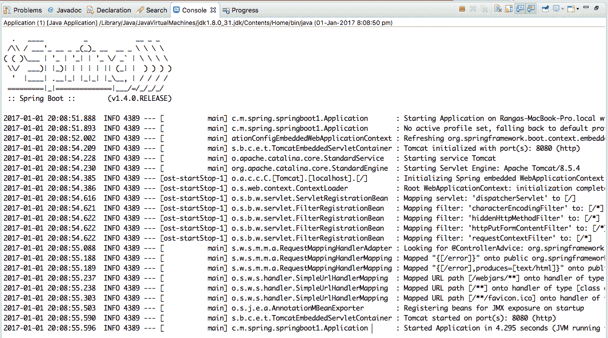

以下是需要注意的关键事项：

+   Tomcat 服务器在端口 8080 上启动--`Tomcat started on port(s): 8080 (http)`。

+   DispatcherServlet 已配置。这意味着 Spring MVC 框架已准备好接受请求--`Mapping servlet: 'dispatcherServlet' to [/]`。

+   默认启用四个过滤器--`characterEncodingFilter`，`hiddenHttpMethodFilter`，`httpPutFormContentFilter`和`requestContextFilter`

+   已配置默认错误页面--`Mapped "{[/error]}" onto public org.springframework.http.ResponseEntity<java.util.Map<java.lang.String, java.lang.Object>> org.springframework.boot.autoconfigure.web.BasicErrorController.error(javax.servlet.http.HttpServletRequest)`

+   WebJars 已自动配置。正如我们在第三章*使用 Spring MVC 构建 Web 应用程序*中讨论的那样，WebJars 可以为静态依赖项（如 Bootstrap 和 query）提供依赖项管理--`Mapped URL path [/webjars/**] onto handler of type [class org.springframework.web.servlet.resource.ResourceHttpRequestHandler]`

以下截图显示了当前应用程序布局。我们只有两个文件，`pom.xml`和`Application.java`：

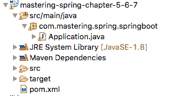

通过一个简单的`pom.xml`文件和一个 Java 类，我们能够启动 Spring MVC 应用程序，并具有前述所有功能。关于 Spring Boot 最重要的是要了解后台发生了什么。理解前述启动日志是第一步。让我们看一下 Maven 依赖项，以获得更深入的了解。

以下截图显示了在我们创建的`pom.xml`文件中配置的基本配置的一些依赖项：

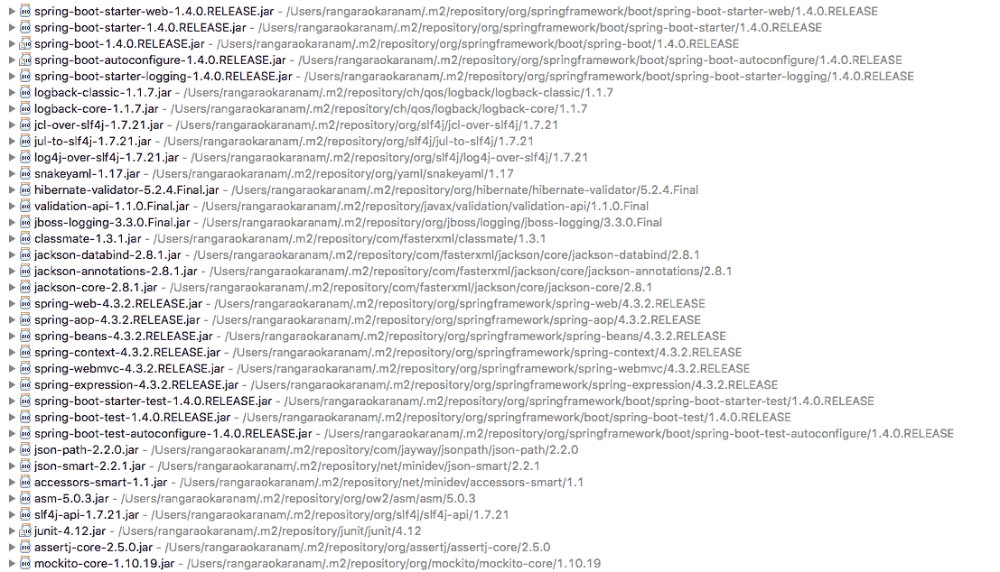

Spring Boot 做了很多魔术。一旦您配置并运行了应用程序，我建议您尝试玩耍，以获得更深入的理解，这在您调试问题时将会很有用。

正如蜘蛛侠所说，<q>伴随着强大的力量，也伴随着巨大的责任</q>。这在 Spring Boot 的情况下绝对是真实的。在未来的时间里，最好的 Spring Boot 开发人员将是那些了解后台发生情况的人--依赖项和自动配置。

# 自动配置

为了让我们更好地理解自动配置，让我们扩展我们的应用程序类，包括更多的代码行：

```java
    ApplicationContext ctx = SpringApplication.run(Application.class, 
     args);
    String[] beanNames = ctx.getBeanDefinitionNames();
    Arrays.sort(beanNames);

   for (String beanName : beanNames) {
     System.out.println(beanName);
    }
```

我们获取在 Spring 应用程序上下文中定义的所有 bean，并打印它们的名称。当`Application.java`作为 Java 程序运行时，它会打印出 bean 的列表，如下面的输出所示：

```java
application
basicErrorController
beanNameHandlerMapping
beanNameViewResolver
characterEncodingFilter
conventionErrorViewResolver
defaultServletHandlerMapping
defaultViewResolver
dispatcherServlet
dispatcherServletRegistration
duplicateServerPropertiesDetector
embeddedServletContainerCustomizerBeanPostProcessor
error
errorAttributes
errorPageCustomizer
errorPageRegistrarBeanPostProcessor
faviconHandlerMapping
faviconRequestHandler
handlerExceptionResolver
hiddenHttpMethodFilter
httpPutFormContentFilter
httpRequestHandlerAdapter
jacksonObjectMapper
jacksonObjectMapperBuilder
jsonComponentModule
localeCharsetMappingsCustomizer
mappingJackson2HttpMessageConverter
mbeanExporter
mbeanServer
messageConverters
multipartConfigElement
multipartResolver
mvcContentNegotiationManager
mvcConversionService
mvcPathMatcher
mvcResourceUrlProvider
mvcUriComponentsContributor
mvcUrlPathHelper
mvcValidator
mvcViewResolver
objectNamingStrategy
autoconfigure.AutoConfigurationPackages
autoconfigure.PropertyPlaceholderAutoConfiguration
autoconfigure.condition.BeanTypeRegistry
autoconfigure.context.ConfigurationPropertiesAutoConfiguration
autoconfigure.info.ProjectInfoAutoConfiguration
autoconfigure.internalCachingMetadataReaderFactory
autoconfigure.jackson.JacksonAutoConfiguration
autoconfigure.jackson.JacksonAutoConfiguration$Jackson2ObjectMapperBuilderCustomizerConfiguration
autoconfigure.jackson.JacksonAutoConfiguration$JacksonObjectMapperBuilderConfiguration
autoconfigure.jackson.JacksonAutoConfiguration$JacksonObjectMapperConfiguration
autoconfigure.jmx.JmxAutoConfiguration
autoconfigure.web.DispatcherServletAutoConfiguration
autoconfigure.web.DispatcherServletAutoConfiguration$DispatcherServletConfiguration
autoconfigure.web.DispatcherServletAutoConfiguration$DispatcherServletRegistrationConfiguration
autoconfigure.web.EmbeddedServletContainerAutoConfiguration
autoconfigure.web.EmbeddedServletContainerAutoConfiguration$EmbeddedTomcat
autoconfigure.web.ErrorMvcAutoConfiguration
autoconfigure.web.ErrorMvcAutoConfiguration$WhitelabelErrorViewConfiguration
autoconfigure.web.HttpEncodingAutoConfiguration
autoconfigure.web.HttpMessageConvertersAutoConfiguration
autoconfigure.web.HttpMessageConvertersAutoConfiguration$StringHttpMessageConverterConfiguration
autoconfigure.web.JacksonHttpMessageConvertersConfiguration
autoconfigure.web.JacksonHttpMessageConvertersConfiguration$MappingJackson2HttpMessageConverterConfiguration
autoconfigure.web.MultipartAutoConfiguration
autoconfigure.web.ServerPropertiesAutoConfiguration
autoconfigure.web.WebClientAutoConfiguration
autoconfigure.web.WebClientAutoConfiguration$RestTemplateConfiguration
autoconfigure.web.WebMvcAutoConfiguration
autoconfigure.web.WebMvcAutoConfiguration$EnableWebMvcConfiguration
autoconfigure.web.WebMvcAutoConfiguration$WebMvcAutoConfigurationAdapter
autoconfigure.web.WebMvcAutoConfiguration$WebMvcAutoConfigurationAdapter$FaviconConfiguration
autoconfigure.websocket.WebSocketAutoConfiguration
autoconfigure.websocket.WebSocketAutoConfiguration$TomcatWebSocketConfiguration
context.properties.ConfigurationPropertiesBindingPostProcessor
context.properties.ConfigurationPropertiesBindingPostProcessor.store
annotation.ConfigurationClassPostProcessor.enhancedConfigurationProcessor
annotation.ConfigurationClassPostProcessor.importAwareProcessor
annotation.internalAutowiredAnnotationProcessor
annotation.internalCommonAnnotationProcessor
annotation.internalConfigurationAnnotationProcessor
annotation.internalRequiredAnnotationProcessor
event.internalEventListenerFactory
event.internalEventListenerProcessor
preserveErrorControllerTargetClassPostProcessor
propertySourcesPlaceholderConfigurer
requestContextFilter
requestMappingHandlerAdapter
requestMappingHandlerMapping
resourceHandlerMapping
restTemplateBuilder
serverProperties
simpleControllerHandlerAdapter
spring.http.encoding-autoconfigure.web.HttpEncodingProperties
spring.http.multipart-autoconfigure.web.MultipartProperties
spring.info-autoconfigure.info.ProjectInfoProperties
spring.jackson-autoconfigure.jackson.JacksonProperties
spring.mvc-autoconfigure.web.WebMvcProperties
spring.resources-autoconfigure.web.ResourceProperties
standardJacksonObjectMapperBuilderCustomizer
stringHttpMessageConverter
tomcatEmbeddedServletContainerFactory
viewControllerHandlerMapping
viewResolver
websocketContainerCustomizer
```

需要考虑的重要事项如下：

+   这些 bean 在哪里定义？

+   这些 bean 是如何创建的？

这就是 Spring 自动配置的魔力。

每当我们向 Spring Boot 项目添加新的依赖项时，Spring Boot 自动配置会自动尝试根据依赖项配置 bean。

例如，当我们在`spring-boot-starter-web`中添加依赖项时，将自动配置以下 bean：

+   `basicErrorController`，`handlerExceptionResolver`：基本异常处理。当异常发生时，显示默认错误页面。

+   `beanNameHandlerMapping`：用于解析到处理程序（控制器）的路径。

+   `characterEncodingFilter`：提供默认的字符编码 UTF-8。

+   `dispatcherServlet`：DispatcherServlet 是 Spring MVC 应用程序的前端控制器。

+   `jacksonObjectMapper`：在 REST 服务中将对象转换为 JSON 和 JSON 转换为对象。

+   `messageConverters`：默认消息转换器，用于将对象转换为 XML 或 JSON，反之亦然。

+   `multipartResolver`：提供了在 Web 应用程序中上传文件的支持。

+   `mvcValidator`：支持对 HTTP 请求进行验证。

+   `viewResolver`：将逻辑视图名称解析为物理视图。

+   `propertySourcesPlaceholderConfigurer`：支持应用配置的外部化。

+   `requestContextFilter`：为请求默认过滤器。

+   `restTemplateBuilder`：用于调用 REST 服务。

+   `tomcatEmbeddedServletContainerFactory`：Tomcat 是 Spring Boot 基于 Web 应用程序的默认嵌入式 Servlet 容器。

在下一节中，让我们看一些起始项目和它们提供的自动配置。

# Starter 项目

以下表格显示了 Spring Boot 提供的一些重要的起始项目：

| **Starter** | **描述** |
| --- | --- |
| `spring-boot-starter-web-services` | 这是一个用于开发基于 XML 的 Web 服务的起始项目。 |
| `spring-boot-starter-web` | 这是一个用于构建基于 Spring MVC 的 Web 应用程序或 RESTful 应用程序的起始项目。它使用 Tomcat 作为默认的嵌入式 Servlet 容器。 |
| `spring-boot-starter-activemq` | 这支持在 ActiveMQ 上使用 JMS 进行基于消息的通信。 |
| `spring-boot-starter-integration` | 这支持 Spring Integration Framework，提供了企业集成模式的实现。 |
| `spring-boot-starter-test` | 这提供了对各种单元测试框架的支持，如 JUnit、Mockito 和 Hamcrest matchers。 |
| `spring-boot-starter-jdbc` | 这提供了使用 Spring JDBC 的支持。它默认配置了 Tomcat JDBC 连接池。 |
| `spring-boot-starter-validation` | 这提供了对 Java Bean 验证 API 的支持。它的默认实现是 hibernate-validator。 |
| `spring-boot-starter-hateoas` | HATEOAS 代表超媒体作为应用程序状态的引擎。使用 HATEOAS 的 RESTful 服务返回与当前上下文相关的附加资源的链接。 |
| `spring-boot-starter-jersey` | JAX-RS 是开发 REST API 的 Java EE 标准。Jersey 是默认实现。这个起始项目提供了构建基于 JAX-RS 的 REST API 的支持。 |
| `spring-boot-starter-websocket` | HTTP 是无状态的。WebSockets 允许您在服务器和浏览器之间保持连接。这个起始项目提供了对 Spring WebSockets 的支持。 |
| `spring-boot-starter-aop` | 这提供了面向切面编程的支持。它还提供了对高级面向切面编程的 AspectJ 的支持。 |
| `spring-boot-starter-amqp` | 以 RabbitMQ 为默认，这个起始项目提供了使用 AMQP 进行消息传递的支持。 |
| `spring-boot-starter-security` | 这个起始项目启用了 Spring Security 的自动配置。 |
| `spring-boot-starter-data-jpa` | 这提供了对 Spring Data JPA 的支持。其默认实现是 Hibernate。 |
| `spring-boot-starter` | 这是 Spring Boot 应用程序的基本起始项目。它提供了自动配置和日志记录的支持。 |
| `spring-boot-starter-batch` | 这提供了使用 Spring Batch 开发批处理应用程序的支持。 |
| `spring-boot-starter-cache` | 这是使用 Spring Framework 进行缓存的基本支持。 |
| `spring-boot-starter-data-rest` | 这是使用 Spring Data REST 公开 REST 服务的支持。 |

到目前为止，我们已经建立了一个基本的 Web 应用程序，并了解了与 Spring Boot 相关的一些重要概念：

+   自动配置

+   Starter 项目

+   `spring-boot-maven-plugin`

+   `spring-boot-starter-parent`

+   注解`@SpringBootApplication`

现在让我们把重点转移到理解 REST 是什么，并构建一个 REST 服务。

# REST 是什么？

**表述状态转移**（**REST**）基本上是 Web 的一种架构风格。REST 指定了一组约束。这些约束确保客户端（服务消费者和浏览器）可以以灵活的方式与服务器交互。

让我们首先了解一些常见的术语：

+   **服务器**：服务提供者。提供可以被客户端消费的服务。

+   **客户端**：服务的消费者。可以是浏览器或其他系统。

+   **资源**：任何信息都可以是资源：一个人，一张图片，一个视频，或者你想要销售的产品。

+   **表示**：资源可以以特定的方式表示。例如，产品资源可以使用 JSON、XML 或 HTML 表示。不同的客户端可能会请求资源的不同表示。

以下列出了一些重要的 REST 约束：

+   **客户端-服务器**：应该有一个服务器（服务提供者）和一个客户端（服务消费者）。这使得服务器和客户端可以独立地发展，从而实现松耦合。

+   **无状态**：每个服务应该是无状态的。后续的请求不应依赖于从先前请求中临时存储的某些数据。消息应该是自描述的。

+   **统一接口**：每个资源都有一个资源标识符。在 Web 服务的情况下，我们使用这个 URI 示例：`/users/Jack/todos/1`。在这个 URI 中，Jack 是用户的名字。`1`是我们想要检索的待办事项的 ID。

+   **可缓存**：服务响应应该是可缓存的。每个响应都应指示它是否可缓存。

+   **分层系统**：服务的消费者不应假定与服务提供者直接连接。由于请求可以被缓存，客户端可能会从中间层获取缓存的响应。

+   **通过表示来操作资源**：一个资源可以有多种表示。应该可以通过任何这些表示的消息来修改资源。

+   **超媒体作为应用状态的引擎**（**HATEOAS**）：RESTful 应用的消费者应该只知道一个固定的服务 URL。所有后续的资源都应该可以从资源表示中包含的链接中发现。

以下是带有 HATEOAS 链接的示例响应。这是对检索所有待办事项的请求的响应：

```java
    {  
    "_embedded":{ 
    "todos":[  
            {  
               "user":"Jill",
               "desc":"Learn Hibernate",
               "done":false,
               "_links":{  
                 "self":{  
                        "href":"http://localhost:8080/todos/1"
                  },
                    "todo":{  
                        "href":"http://localhost:8080/todos/1"
                    }
                }
           }
        ]
     },
    "_links":{  
        "self":{  
            "href":"http://localhost:8080/todos"
        },
        "profile":{  
            "href":"http://localhost:8080/profile/todos"
        },
        "search":{  
            "href":"http://localhost:8080/todos/search"
        }
      }
    }
```

前面的响应包括以下链接：

+   特定的待办事项（`http://localhost:8080/todos/1`）

+   搜索资源（`http://localhost:8080/todos/search`）

如果服务的消费者想要进行搜索，它可以从响应中获取搜索 URL 并将搜索请求发送到该 URL。这将减少服务提供者和服务消费者之间的耦合。

我们开发的初始服务不会遵循所有这些约束。随着我们进入下一章，我们将向您介绍这些约束的细节，并将它们添加到服务中，使其更具有 RESTful 特性。

# 第一个 REST 服务

让我们从创建一个简单的 REST 服务返回欢迎消息开始。我们将创建一个简单的 POJO `WelcomeBean`类，其中包含一个名为 message 的成员字段和一个参数构造函数，如下面的代码片段所示：

```java
    package com.mastering.spring.springboot.bean;

    public class WelcomeBean {
      private String message;

       public WelcomeBean(String message) {
         super();
         this.message = message;
       }

      public String getMessage() {
        return message;
      }
    }
```

# 返回字符串的简单方法

让我们从创建一个简单的 REST 控制器方法返回一个字符串开始：

```java
    @RestController
    public class BasicController {
      @GetMapping("/welcome")
      public String welcome() {
        return "Hello World";
      }
    }
```

以下是一些需要注意的重要事项：

+   `@RestController`：`@RestController`注解提供了`@ResponseBody`和`@Controller`注解的组合。这通常用于创建 REST 控制器。

+   `@GetMapping("welcome")`：`@GetMapping`是`@RequestMapping(method = RequestMethod.GET)`的快捷方式。这个注解是一个可读性更好的替代方法。带有这个注解的方法将处理对`welcome` URI 的 Get 请求。

如果我们将`Application.java`作为 Java 应用程序运行，它将启动嵌入式的 Tomcat 容器。我们可以在浏览器中打开 URL，如下面的屏幕截图所示：


# 单元测试

让我们快速编写一个单元测试来测试前面的`controller`方法：

```java
    @RunWith(SpringRunner.class)
    @WebMvcTest(BasicController.class)
    public class BasicControllerTest {

      @Autowired
      private MockMvc mvc;

      @Test
      public void welcome() throws Exception {
        mvc.perform(
        MockMvcRequestBuilders.get("/welcome")
       .accept(MediaType.APPLICATION_JSON))
       .andExpect(status().isOk())
       .andExpect(content().string(
       equalTo("Hello World")));
      }
    }
```

在前面的单元测试中，我们将使用`BasicController`启动一个 Mock MVC 实例。以下是一些需要注意的事项：

+   `@RunWith(SpringRunner.class)`: SpringRunner 是`SpringJUnit4ClassRunner`注解的快捷方式。这为单元测试启动了一个简单的 Spring 上下文。

+   `@WebMvcTest(BasicController.class)`: 这个注解可以与 SpringRunner 一起使用，用于编写 Spring MVC 控制器的简单测试。这将只加载使用 Spring-MVC 相关注解注释的 bean。在这个例子中，我们正在启动一个 Web MVC 测试上下文，测试的类是 BasicController。

+   `@Autowired private MockMvc mvc`: 自动装配可以用于发出请求的 MockMvc bean。

+   `mvc.perform(MockMvcRequestBuilders.get("/welcome").accept(MediaType.APPLICATION_JSON))`: 使用`Accept`头值`application/json`执行对`/welcome`的请求。

+   `andExpect(status().isOk())`: 期望响应的状态为 200（成功）。

+   `andExpect(content().string(equalTo("Hello World")))`: 期望响应的内容等于"Hello World"。

# 集成测试

当我们进行集成测试时，我们希望启动嵌入式服务器，并加载所有配置的控制器和 bean。这段代码片段展示了我们如何创建一个简单的集成测试：

```java
    @RunWith(SpringRunner.class)
    @SpringBootTest(classes = Application.class, 
    webEnvironment = SpringBootTest.WebEnvironment.RANDOM_PORT)
    public class BasicControllerIT {

      private static final String LOCAL_HOST = 
      "http://localhost:";

      @LocalServerPort
      private int port;

      private TestRestTemplate template = new TestRestTemplate();

      @Test
      public void welcome() throws Exception {
        ResponseEntity<String> response = template
       .getForEntity(createURL("/welcome"), String.class);
        assertThat(response.getBody(), equalTo("Hello World"));
       }

      private String createURL(String uri) {
        return LOCAL_HOST + port + uri;
      }
    }
```

需要注意的一些重要事项如下：

+   `@SpringBootTest(classes = Application.class, webEnvironment = SpringBootTest.WebEnvironment.RANDOM_PORT)`: 提供了在 Spring TestContext 之上的额外功能。提供支持以配置端口来完全运行容器和 TestRestTemplate（执行请求）。

+   `@LocalServerPort private int port`: `SpringBootTest`会确保容器运行的端口被自动装配到端口变量中。

+   `private String createURL(String uri)`: 用于将本地主机 URL 和端口附加到 URI 以创建完整 URL 的方法。

+   `private TestRestTemplate template = new TestRestTemplate()`: `TestRestTemplate`通常用于集成测试。它提供了在 RestTemplate 之上的额外功能，在集成测试环境中特别有用。它不会遵循重定向，这样我们就可以断言响应位置。

+   `template.getForEntity(createURL("/welcome"), String.class)`: 执行对给定 URI 的 get 请求。

+   `assertThat(response.getBody(), equalTo("Hello World"))`: 断言响应主体内容为"Hello World"。

# 返回对象的简单 REST 方法

在前面的方法中，我们返回了一个字符串。让我们创建一个返回正确的 JSON 响应的方法。看一下下面的方法：

```java
    @GetMapping("/welcome-with-object")
    public WelcomeBean welcomeWithObject() {
      return new WelcomeBean("Hello World");
    }
```

这个先前的方法返回一个简单的`WelcomeBean`，它初始化了一个消息："Hello World"。

# 执行请求

让我们发送一个测试请求，看看我们得到什么响应。下面的截图显示了输出：


`http://localhost:8080/welcome-with-object` URL 的响应如下所示：

```java
    {"message":"Hello World"}
```

需要回答的问题是：我们返回的`WelcomeBean`对象是如何转换为 JSON 的？

再次，这是 Spring Boot 自动配置的魔力。如果 Jackson 在应用程序的类路径上，Spring Boot 会自动配置默认的对象到 JSON（反之亦然）转换器的实例。

# 单元测试

让我们快速编写一个单元测试，检查 JSON 响应。让我们将测试添加到`BasicControllerTest`中：

```java
    @Test
    public void welcomeWithObject() throws Exception {
      mvc.perform(
       MockMvcRequestBuilders.get("/welcome-with-object")
      .accept(MediaType.APPLICATION_JSON))
      .andExpect(status().isOk())
      .andExpect(content().string(containsString("Hello World")));
    }
```

这个测试与之前的单元测试非常相似，只是我们使用`containsString`来检查内容是否包含子字符串"Hello World"。稍后我们将学习如何编写正确的 JSON 测试。

# 集成测试

让我们把注意力转移到编写一个集成测试。让我们向`BasicControllerIT`中添加一个方法，如下面的代码片段所示：

```java
    @Test
    public void welcomeWithObject() throws Exception {
      ResponseEntity<String> response = 
      template.getForEntity(createURL("/welcome-with-object"), 
      String.class);
      assertThat(response.getBody(), 
      containsString("Hello World"));
    }
```

这个方法与之前的集成测试类似，只是我们使用`String`方法来断言子字符串。

# 带有路径变量的 Get 方法

让我们把注意力转移到路径变量上。路径变量用于将 URI 中的值绑定到控制器方法上的变量。在以下示例中，我们希望对名称进行参数化，以便我们可以使用名称定制欢迎消息：

```java
    private static final String helloWorldTemplate = "Hello World, 
    %s!";

   @GetMapping("/welcome-with-parameter/name/{name}")
   public WelcomeBean welcomeWithParameter(@PathVariable String name) 
    {
       return new WelcomeBean(String.format(helloWorldTemplate, name));
    }
```

需要注意的几个重要事项如下：

+   `@GetMapping("/welcome-with-parameter/name/{name}")`：`{name}`表示这个值将是变量。我们可以在 URI 中有多个变量模板。

+   `welcomeWithParameter(@PathVariable String name)`：`@PathVariable`确保从 URI 中的变量值绑定到变量名称。

+   `String.format(helloWorldTemplate, name)`：一个简单的字符串格式，用名称替换模板中的`%s`。

# 执行请求

让我们发送一个测试请求，看看我们得到什么响应。以下截图显示了响应：


`http://localhost:8080/welcome-with-parameter/name/Buddy` URL 的响应如下：

```java
    {"message":"Hello World, Buddy!"}
```

如预期，URI 中的名称用于形成响应中的消息。

# 单元测试

让我们快速为前面的方法编写一个单元测试。我们希望将名称作为 URI 的一部分传递，并检查响应是否包含名称。以下代码显示了我们如何做到这一点：

```java
    @Test
    public void welcomeWithParameter() throws Exception {
      mvc.perform(
      MockMvcRequestBuilders.get("/welcome-with-parameter/name/Buddy")
     .accept(MediaType.APPLICATION_JSON))
     .andExpect(status().isOk())
     .andExpect(
     content().string(containsString("Hello World, Buddy")));
    }
```

需要注意的几个重要事项如下：

+   `MockMvcRequestBuilders.get("/welcome-with-parameter/name/Buddy")`：这与 URI 中的变量模板匹配。我们传入名称`Buddy`。

+   `.andExpect(content().string(containsString("Hello World, Buddy”)))`：我们期望响应包含带有名称的消息。

# 集成测试

前面方法的集成测试非常简单。看一下以下测试方法：

```java
    @Test
    public void welcomeWithParameter() throws Exception {
      ResponseEntity<String> response = 
      template.getForEntity(
      createURL("/welcome-with-parameter/name/Buddy"), String.class);
      assertThat(response.getBody(), 
      containsString("Hello World, Buddy"));
    }
```

需要注意的几个重要事项如下：

+   `createURL("/welcome-with-parameter/name/Buddy")`：这与 URI 中的变量模板匹配。我们传入名称 Buddy。

+   `assertThat(response.getBody(), containsString("Hello World, Buddy”))`：我们期望响应包含带有名称的消息。

在本节中，我们看了使用 Spring Boot 创建简单 REST 服务的基础知识。我们还确保我们有良好的单元测试和集成测试。虽然这些都非常基础，但它们为我们在下一节中构建更复杂的 REST 服务奠定了基础。

我们实施的单元测试和集成测试可以使用 JSON 比较而不是简单的子字符串比较来进行更好的断言。我们将在下一节中为我们创建的 REST 服务编写的测试中专注于这一点。

# 创建待办事项资源

我们将专注于为基本待办事项管理系统创建 REST 服务。我们将为以下内容创建服务：

+   检索给定用户的待办事项列表

+   检索特定待办事项的详细信息

+   为用户创建待办事项

# 请求方法、操作和 URI

REST 服务的最佳实践之一是根据我们执行的操作使用适当的 HTTP 请求方法。在我们暴露的服务中，我们使用了`GET`方法，因为我们专注于读取数据的服务。

以下表格显示了基于我们执行的操作的适当 HTTP 请求方法：

| **HTTP 请求方法** | **操作** |
| --- | --- |
| `GET` | 读取--检索资源的详细信息 |
| `POST` | 创建--创建新项目或资源 |
| `PUT` | 更新/替换 |
| `PATCH` | 更新/修改资源的一部分 |
| `DELETE` | 删除 |

让我们快速将我们要创建的服务映射到适当的请求方法：

+   **检索给定用户的待办事项列表**：这是`读取`。我们将使用`GET`。我们将使用 URI：`/users/{name}/todos`。另一个良好的实践是在 URI 中对静态内容使用复数形式：users，todo 等。这会导致更可读的 URI。

+   **检索特定待办事项的详细信息**：同样，我们将使用`GET`。我们将使用 URI `/users/{name}/todos/{id}`。您可以看到这与我们之前为待办事项列表决定的 URI 是一致的。

+   **为用户创建待办事项**：对于创建操作，建议的 HTTP 请求方法是`POST`。要创建一个新的待办事项，我们将发布到`URI /users/{name}/todos`。

# Beans and services

为了能够检索和存储待办事项的详细信息，我们需要一个 Todo bean 和一个用于检索和存储详细信息的服务。

让我们创建一个 Todo Bean：

```java
    public class Todo {
      private int id;
      private String user;

      private String desc;

      private Date targetDate;
      private boolean isDone;

      public Todo() {}

      public Todo(int id, String user, String desc, 
      Date targetDate, boolean isDone) { 
        super();
        this.id = id;
        this.user = user;
        this.desc = desc;
        this.targetDate = targetDate;
        this.isDone = isDone;
      }

       //ALL Getters
    }
```

我们创建了一个简单的 Todo bean，其中包含 ID、用户名称、待办事项描述、待办事项目标日期和完成状态指示器。我们为所有字段添加了构造函数和 getter。

现在让我们添加`TodoService`：

```java
   @Service
   public class TodoService {
     private static List<Todo> todos = new ArrayList<Todo>();
     private static int todoCount = 3;

     static {
       todos.add(new Todo(1, "Jack", "Learn Spring MVC", 
       new Date(), false));
       todos.add(new Todo(2, "Jack", "Learn Struts", new Date(), 
       false));
       todos.add(new Todo(3, "Jill", "Learn Hibernate", new Date(), 
       false));
      }

     public List<Todo> retrieveTodos(String user) {
       List<Todo> filteredTodos = new ArrayList<Todo>();
       for (Todo todo : todos) {
         if (todo.getUser().equals(user))
         filteredTodos.add(todo);
        }
      return filteredTodos;
     }

    public Todo addTodo(String name, String desc, 
    Date targetDate, boolean isDone) {
      Todo todo = new Todo(++todoCount, name, desc, targetDate, 
      isDone);
      todos.add(todo);
      return todo;
    }

    public Todo retrieveTodo(int id) {
      for (Todo todo : todos) {
      if (todo.getId() == id)
        return todo;
      }
      return null;
     }
   }
```

需要注意的快速事项如下：

+   为了保持简单，该服务不与数据库通信。它维护一个待办事项的内存数组列表。该列表使用静态初始化程序进行初始化。

+   我们公开了一些简单的检索方法和一个添加待办事项的方法。

现在我们的服务和 bean 已经准备好了，我们可以创建我们的第一个服务来为用户检索待办事项列表。

# 检索待办事项列表

我们将创建一个名为`TodoController`的新`RestController`注解。检索待办事项方法的代码如下所示：

```java
    @RestController
    public class TodoController {
     @Autowired
     private TodoService todoService;

     @GetMapping("/users/{name}/todos")
     public List<Todo> retrieveTodos(@PathVariable String name) {
       return todoService.retrieveTodos(name);
     }
    }
```

需要注意的一些事项如下：

+   我们使用`@Autowired`注解自动装配了待办事项服务

+   我们使用`@GetMapping`注解将`"/users/{name}/todos"` URI 的 Get 请求映射到`retrieveTodos`方法

# 执行服务

让我们发送一个测试请求，看看我们将得到什么响应。下图显示了输出：

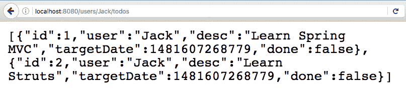

`http://localhost:8080/users/Jack/todos`的响应如下：

```java
   [
    {"id":1,"user":"Jack","desc":"Learn Spring    
     MVC","targetDate":1481607268779,"done":false},  
    {"id":2,"user":"Jack","desc":"Learn 
    Struts","targetDate":1481607268779, "done":false}
   ]
```

# 单元测试

用于单元测试`TodoController`类的代码如下所示：

```java
   @RunWith(SpringRunner.class)
   @WebMvcTest(TodoController.class)
   public class TodoControllerTest {

    @Autowired
    private MockMvc mvc;

    @MockBean
    private TodoService service;

    @Test
    public void retrieveTodos() throws Exception {
     List<Todo> mockList = Arrays.asList(new Todo(1, "Jack",
     "Learn Spring MVC", new Date(), false), new Todo(2, "Jack",
     "Learn Struts", new Date(), false));

     when(service.retrieveTodos(anyString())).thenReturn(mockList);

     MvcResult result = mvc
    .perform(MockMvcRequestBuilders.get("/users
    /Jack/todos").accept(MediaType.APPLICATION_JSON))
    .andExpect(status().isOk()).andReturn();

    String expected = "["
     + "{id:1,user:Jack,desc:\"Learn Spring MVC\",done:false}" +","
     + "{id:2,user:Jack,desc:\"Learn Struts\",done:false}" + "]";

     JSONAssert.assertEquals(expected, result.getResponse()
      .getContentAsString(), false);
     }
    }
```

一些重要的事情需要注意：

+   我们正在编写一个单元测试。因此，我们只想测试`TodoController`类中的逻辑。因此，我们使用`@WebMvcTest(TodoController.class)`初始化一个仅包含`TodoController`类的 Mock MVC 框架。

+   `@MockBean private TodoService service`：我们使用`@MockBean`注解模拟了 TodoService。在使用 SpringRunner 运行的测试类中，使用`@MockBean`定义的 bean 将被使用 Mockito 框架创建的模拟对象替换。

+   `when(service.retrieveTodos(anyString())).thenReturn(mockList)`：我们模拟了 retrieveTodos 服务方法以返回模拟列表。

+   `MvcResult result = ..`：我们将请求的结果接受到一个 MvcResult 变量中，以便我们可以对响应执行断言。

+   `JSONAssert.assertEquals(expected, result.getResponse().getContentAsString(), false)`: JSONAssert 是一个非常有用的框架，用于对 JSON 执行断言。它将响应文本与期望值进行比较。JSONAssert 足够智能，可以忽略未指定的值。另一个优点是在断言失败时提供清晰的失败消息。最后一个参数 false 表示使用非严格模式。如果将其更改为 true，则期望值应与结果完全匹配。

# 集成测试

用于对`TodoController`类执行集成测试的代码如下所示。它启动了整个 Spring 上下文，其中定义了所有控制器和 bean：

```java
   @RunWith(SpringJUnit4ClassRunner.class)
   @SpringBootTest(classes = Application.class, webEnvironment =     
   SpringBootTest.WebEnvironment.RANDOM_PORT)
   public class TodoControllerIT {

    @LocalServerPort
    private int port;

    private TestRestTemplate template = new TestRestTemplate();

    @Test
    public void retrieveTodos() throws Exception {
     String expected = "["
     + "{id:1,user:Jack,desc:\"Learn Spring MVC\",done:false}" + ","
     + "{id:2,user:Jack,desc:\"Learn Struts\",done:false}" + "]";

     String uri = "/users/Jack/todos";

     ResponseEntity<String> response =
     template.getForEntity(createUrl(uri), String.class);

     JSONAssert.assertEquals(expected, response.getBody(), false);
    }

     private String createUrl(String uri) {
     return "http://localhost:" + port + uri;
    }
  }
```

这个测试与`BasicController`的集成测试非常相似，只是我们使用`JSONAssert`来断言响应。

# 检索特定待办事项的详细信息

现在我们将添加检索特定待办事项的方法：

```java
    @GetMapping(path = "/users/{name}/todos/{id}")
    public Todo retrieveTodo(@PathVariable String name, @PathVariable 
    int id) {
      return todoService.retrieveTodo(id);
    }
```

需要注意的一些事项如下：

+   映射的 URI 是`/users/{name}/todos/{id}`

+   我们为`name`和`id`定义了两个路径变量

# 执行服务

让我们发送一个测试请求，看看我们将得到什么响应，如下图所示：

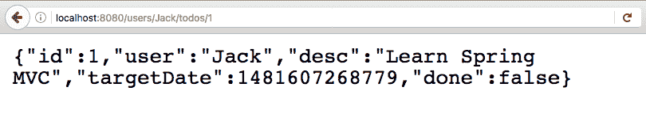

`http://localhost:8080/users/Jack/todos/1`的响应如下所示：

```java
    {"id":1,"user":"Jack","desc":"Learn Spring MVC", 
    "targetDate":1481607268779,"done":false}
```

# 单元测试

对`retrieveTodo`进行单元测试的代码如下：

```java
     @Test
     public void retrieveTodo() throws Exception {
       Todo mockTodo = new Todo(1, "Jack", "Learn Spring MVC", 
       new Date(), false);

       when(service.retrieveTodo(anyInt())).thenReturn(mockTodo);

       MvcResult result = mvc.perform(
       MockMvcRequestBuilders.get("/users/Jack/todos/1")
       .accept(MediaType.APPLICATION_JSON))
       .andExpect(status().isOk()).andReturn();

       String expected = "{id:1,user:Jack,desc:\"Learn Spring
       MVC\",done:false}";

      JSONAssert.assertEquals(expected, 
       result.getResponse().getContentAsString(), false);

     }
```

需要注意的几个重要事项如下：

+   `when(service.retrieveTodo(anyInt())).thenReturn(mockTodo)`：我们正在模拟 retrieveTodo 服务方法返回模拟的待办事项。

+   `MvcResult result = ..`：我们将请求的结果接受到 MvcResult 变量中，以便我们对响应执行断言。

+   `JSONAssert.assertEquals(expected, result.getResponse().getContentAsString(), false)`：断言结果是否符合预期。

# 集成测试

在以下代码片段中显示了对`TodoController`中的`retrieveTodos`进行集成测试的代码。这将添加到`TodoControllerIT`类中：

```java
     @Test
     public void retrieveTodo() throws Exception {
       String expected = "{id:1,user:Jack,desc:\"Learn Spring   
       MVC\",done:false}";
       ResponseEntity<String> response = template.getForEntity(
       createUrl("/users/Jack/todos/1"), String.class);
       JSONAssert.assertEquals(expected, response.getBody(), false);
     }
```

# 添加待办事项

现在我们将添加创建新待办事项的方法。用于创建的 HTTP 方法是`Post`。我们将发布到`"/users/{name}/todos"` URI：

```java
    @PostMapping("/users/{name}/todos")
    ResponseEntity<?> add(@PathVariable String name,
    @RequestBody Todo todo) { 
      Todo createdTodo = todoService.addTodo(name, todo.getDesc(),
      todo.getTargetDate(), todo.isDone());
      if (createdTodo == null) {
         return ResponseEntity.noContent().build();
      }

     URI location = ServletUriComponentsBuilder.fromCurrentRequest()

    .path("/{id}").buildAndExpand(createdTodo.getId()).toUri();
    return ResponseEntity.created(location).build();
   }
```

需要注意的几件事如下：

+   `@PostMapping("/users/{name}/todos")`：`@PostMapping`注解将`add()`方法映射到具有`POST`方法的 HTTP 请求。

+   `ResponseEntity<?> add(@PathVariable String name, @RequestBody Todo todo)`：HTTP POST 请求应该理想地返回创建资源的 URI。我们使用`ResourceEntity`来实现这一点。`@RequestBody`将请求的正文直接绑定到 bean。

+   `ResponseEntity.noContent().build()`：用于返回资源创建失败的情况。

+   `ServletUriComponentsBuilder.fromCurrentRequest().path("/{id}").buildAndExpand(createdTodo.getId()).toUri()`：形成可以在响应中返回的已创建资源的 URI。

+   `ResponseEntity.created(location).build()`：返回`201(CREATED)`状态，并附带资源的链接。

# Postman

如果您使用的是 Mac，您可能还想尝试 Paw 应用程序。

让我们发送一个测试请求，看看我们得到什么响应。以下截图显示了响应：

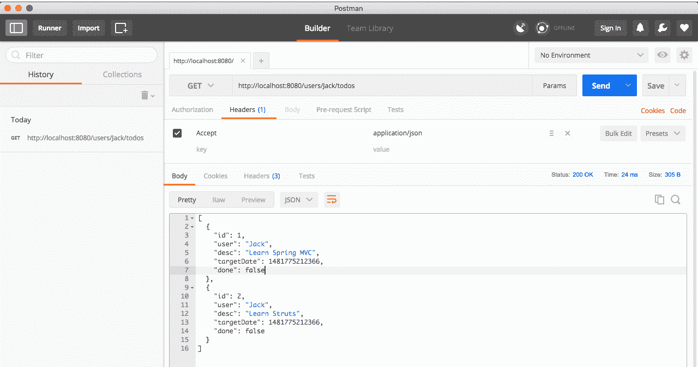

我们将使用 Postman 应用程序与 REST 服务进行交互。您可以从网站[`www.getpostman.com/`](https://www.getpostman.com/)安装它。它适用于 Windows 和 Mac。还提供 Google Chrome 插件。

# 执行 POST 服务

使用`POST`创建新的待办事项，我们需要在请求的正文中包含待办事项的 JSON。以下截图显示了我们如何使用 Postman 应用程序创建请求以及执行请求后的响应：

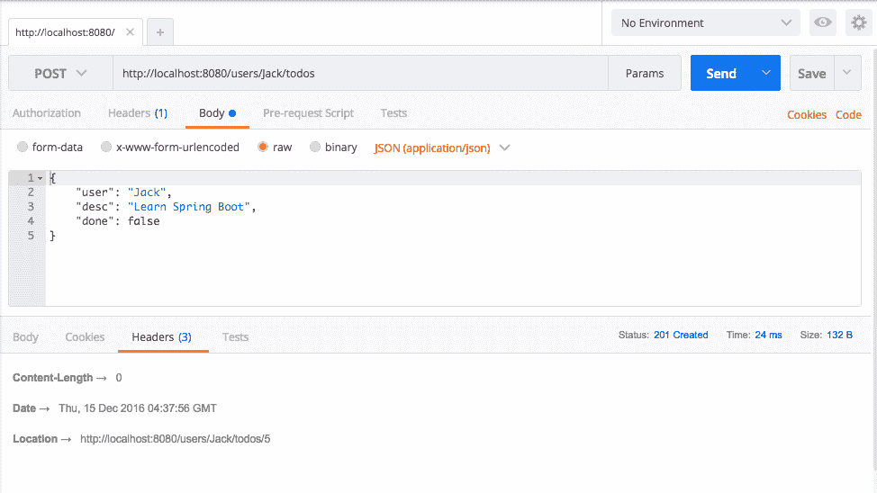

需要注意的几个重要事项如下：

+   我们正在发送 POST 请求。因此，我们从左上角的下拉菜单中选择 POST。

+   要将 Todo JSON 作为请求正文的一部分发送，我们在 Body 选项卡中选择原始选项（用蓝点标出）。我们选择 JSON（`application/json`）作为内容类型。

+   一旦请求成功执行，您可以在屏幕中间的栏中看到请求的状态：状态：201 已创建。

+   位置是`http://localhost:8080/users/Jack/todos/5`。这是在响应中收到的新创建的待办事项的 URI。

`http://localhost:8080/users/Jack/todos`的请求的完整细节如下所示：

```java
    Header
    Content-Type:application/json

   Body
    {
      "user": "Jack",
      "desc": "Learn Spring Boot",
       "done": false
     }
```

# 单元测试

对创建的待办事项进行单元测试的代码如下所示：

```java
    @Test
    public void createTodo() throws Exception {
     Todo mockTodo = new Todo(CREATED_TODO_ID, "Jack", 
     "Learn Spring MVC", new Date(), false);
     String todo = "{"user":"Jack","desc":"Learn Spring MVC",     
     "done":false}";

    when(service.addTodo(anyString(), anyString(),   
    isNull(),anyBoolean()))
    .thenReturn(mockTodo);

   mvc
    .perform(MockMvcRequestBuilders.post("/users/Jack/todos")
    .content(todo)
    .contentType(MediaType.APPLICATION_JSON)
    )
    .andExpect(status().isCreated())
    .andExpect(
      header().string("location",containsString("/users/Jack/todos/"
     + CREATED_TODO_ID)));
   }
```

需要注意的几个重要事项如下：

+   `String todo = "{"user":"Jack","desc":"Learn Spring MVC","done":false}"`：要发布到创建待办事项服务的 Todo 内容。

+   `when(service.addTodo(anyString(), anyString(), isNull(), anyBoolean())).thenReturn(mockTodo)`：模拟服务返回一个虚拟的待办事项。

+   `MockMvcRequestBuilders.post("/users/Jack/todos").content(todo).contentType(MediaType.APPLICATION_JSON))`：使用给定的内容类型创建给定 URI 的 POST。

+   `andExpect(status().isCreated())`：期望状态为已创建。

+   `andExpect(header().string("location",containsString("/users/Jack/todos/" + CREATED_TODO_ID)))`: 期望标头包含创建资源的 URI 的`location`。

# 集成测试

在`TodoController`中执行对创建的 todo 的集成测试的代码如下所示。这将添加到`TodoControllerIT`类中，如下所示：

```java
    @Test
    public void addTodo() throws Exception {
      Todo todo = new Todo(-1, "Jill", "Learn Hibernate", new Date(),  
      false);
      URI location = template
     .postForLocation(createUrl("/users/Jill/todos"),todo);
      assertThat(location.getPath(), 
      containsString("/users/Jill/todos/4"));
    }
```

还有一些重要的事项需要注意：

+   `URI location = template.postForLocation(createUrl("/users/Jill/todos"), todo)`: `postForLocation`是一个实用方法，特别适用于测试，用于创建新资源。我们正在将 todo 发布到给定的 URI，并从标头中获取位置。

+   `assertThat(location.getPath(), containsString("/users/Jill/todos/4"))`: 断言位置包含到新创建资源的路径。

# Spring Initializr

您想要自动生成 Spring Boot 项目吗？您想要快速开始开发您的应用程序吗？Spring Initializr 就是答案。

Spring Initializr 托管在[`start.spring.io`](http://start.spring.io)。以下截图显示了网站的外观：

***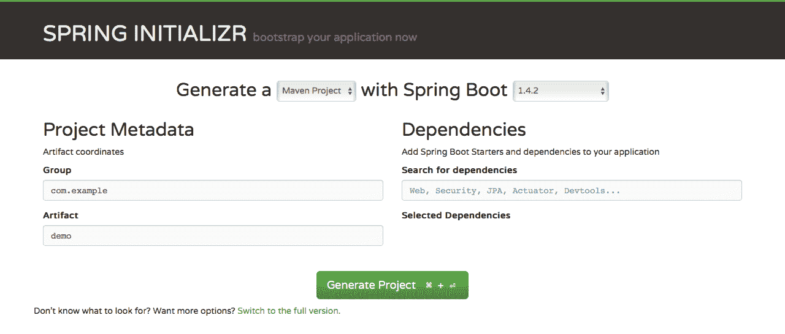***

Spring Initializr 在创建项目时提供了很大的灵活性。您可以选择以下选项：

+   选择您的构建工具：Maven 或 Gradle。

+   选择您要使用的 Spring Boot 版本。

+   为您的组件配置 Group ID 和 Artifact ID。

+   选择您的项目所需的启动器（依赖项）。您可以单击屏幕底部的链接“切换到完整版本”来查看您可以选择的所有启动器项目。

+   选择如何打包您的组件：JAR 或 WAR。

+   选择您要使用的 Java 版本。

+   选择要使用的 JVM 语言。

当您展开（单击链接）到完整版本时，Spring Initializr 提供的一些选项如下截图所示：

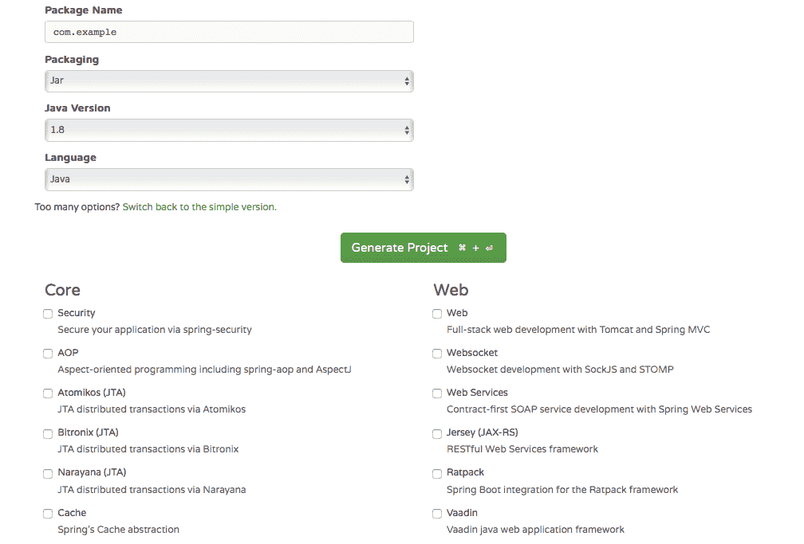

# 创建您的第一个 Spring Initializr 项目

我们将使用完整版本并输入值，如下所示：

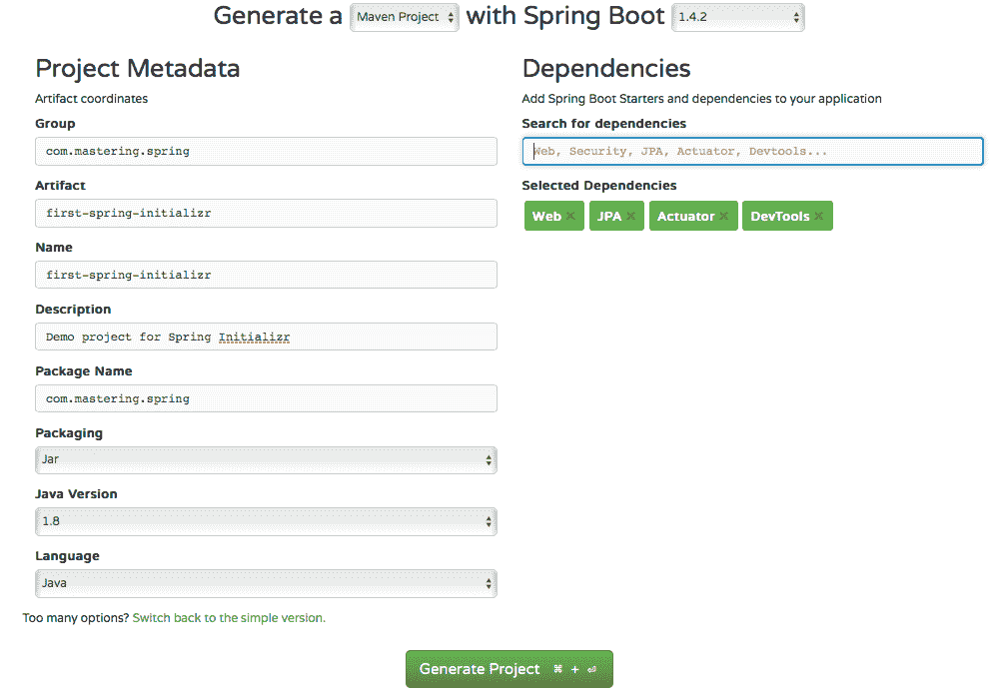

需要注意的事项如下：

+   构建工具：`Maven`

+   Spring Boot 版本：选择最新可用的版本

+   Group：`com.mastering.spring`

+   Artifact: `first-spring-initializr`

+   选择的依赖项：选择`Web, JPA, Actuator and Dev Tools`。在文本框中输入每个依赖项，然后按*Enter*选择它们。我们将在下一节中了解有关 Actuator 和 Dev Tools 的更多信息

+   Java 版本：`1.8`

继续并单击生成项目按钮。这将创建一个`.zip`文件，您可以将其下载到您的计算机上。

以下截图显示了创建的项目的结构：

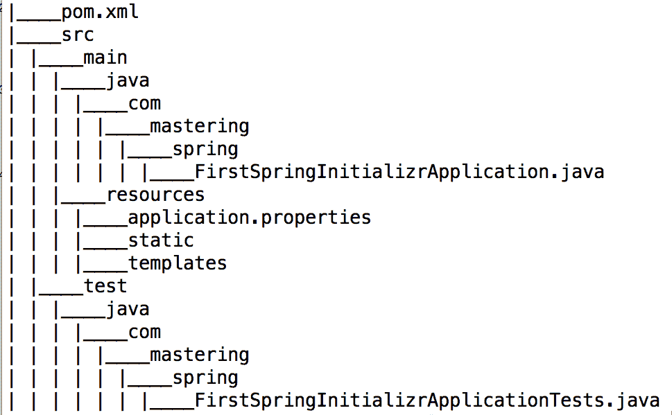

现在我们将此项目导入到您的 IDE 中。在 Eclipse 中，您可以执行以下步骤：

1.  启动 Eclipse。

1.  导航到文件|导入。

1.  选择现有的 Maven 项目。

1.  浏览并选择 Maven 项目的根目录（包含`pom.xml`文件的目录）。

1.  继续使用默认值，然后单击完成。

这将把项目导入到 Eclipse 中。以下截图显示了 Eclipse 中项目的结构：

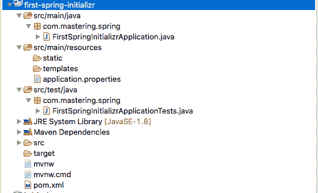

让我们来看一下生成项目中的一些重要文件。

# pom.xml

以下代码片段显示了声明的依赖项：

```java
<dependencies> <dependency> <groupId>org.springframework.boot</groupId> <artifactId>spring-boot-starter-web</artifactId> </dependency> <dependency> <groupId>org.springframework.boot</groupId> <artifactId>spring-boot-starter-data-jpa</artifactId> </dependency> <dependency> <groupId>org.springframework.boot</groupId> <artifactId>spring-boot-starter-actuator</artifactId> </dependency> <dependency> <groupId>org.springframework.boot</groupId> <artifactId>spring-boot-devtools</artifactId> <scope>runtime</scope> </dependency> <dependency> <groupId>org.springframework.boot</groupId> <artifactId>spring-boot-starter-test</artifactId> <scope>test</scope> </dependency> </dependencies>
```

还有一些其他重要的观察结果如下：

+   此组件的打包为`.jar`

+   `org.springframework.boot:spring-boot-starter-parent`被声明为父 POM

+   `<java.version>1.8</java.version>`: Java 版本为 1.8

+   Spring Boot Maven 插件(`org.springframework.boot:spring-boot-maven-plugin`)被配置为插件

# FirstSpringInitializrApplication.java 类

`FirstSpringInitializrApplication.java`是 Spring Boot 的启动器：

```java
    package com.mastering.spring;
    import org.springframework.boot.SpringApplication;
    import org.springframework.boot.autoconfigure
    .SpringBootApplication;

    @SpringBootApplication
    public class FirstSpringInitializrApplication {
       public static void main(String[] args) {
        SpringApplication.run(FirstSpringInitializrApplication.class,   
        args);
      }
    }
```

# FirstSpringInitializrApplicationTests 类

`FirstSpringInitializrApplicationTests`包含了可以用来开始编写测试的基本上下文，当我们开始开发应用程序时：

```java
    package com.mastering.spring;
    import org.junit.Test;
    import org.junit.runner.RunWith;
    import org.springframework.boot.test.context.SpringBootTest;
    import org.springframework.test.context.junit4.SpringRunner;

    @RunWith(SpringRunner.class)
    @SpringBootTest
    public class FirstSpringInitializrApplicationTests {

      @Test
      public void contextLoads() {
      }
   }
```

# 快速了解自动配置

自动配置是 Spring Boot 最重要的功能之一。在本节中，我们将快速了解 Spring Boot 自动配置的工作原理。

大部分 Spring Boot 自动配置的魔力来自于`spring-boot-autoconfigure-{version}.jar`。当我们启动任何 Spring Boot 应用程序时，会自动配置许多 bean。这是如何发生的？

以下截图显示了来自`spring-boot-autoconfigure-{version}.jar`的`spring.factories`的摘录。出于空间的考虑，我们已经过滤掉了一些配置：

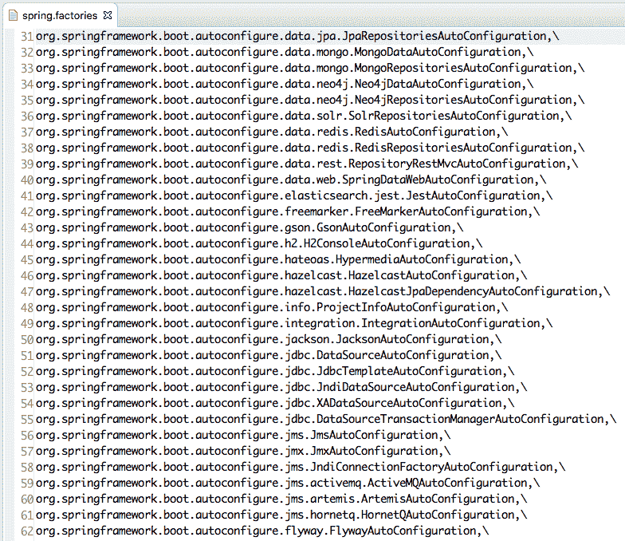

每当启动 Spring Boot 应用程序时，上述自动配置类的列表都会运行。让我们快速看一下其中一个：

`org.springframework.boot.autoconfigure.web.WebMvcAutoConfiguration`。

这是一个小片段：

```java
@Configuration
@ConditionalOnWebApplication
@ConditionalOnClass({ Servlet.class, DispatcherServlet.class,
WebMvcConfigurerAdapter.class })
@ConditionalOnMissingBean(WebMvcConfigurationSupport.class)
@AutoConfigureOrder(Ordered.HIGHEST_PRECEDENCE + 10)
@AutoConfigureAfter(DispatcherServletAutoConfiguration.class)
public class WebMvcAutoConfiguration {
```

一些重要的要点如下：

+   `@ConditionalOnClass({ Servlet.class, DispatcherServlet.class, WebMvcConfigurerAdapter.class })`：如果类路径中有提到的任何类，则启用此自动配置。当我们添加 web 启动器项目时，会带入所有这些类的依赖项。因此，此自动配置将被启用。

+   `@ConditionalOnMissingBean(WebMvcConfigurationSupport.class)`: 只有在应用程序没有明确声明`WebMvcConfigurationSupport.class`类的 bean 时，才启用此自动配置。

+   `@AutoConfigureOrder(Ordered.HIGHEST_PRECEDENCE + 10)`: 这指定了这个特定自动配置的优先级。

让我们看另一个小片段，显示了同一类中的一个方法：

```java
    @Bean
    @ConditionalOnBean(ViewResolver.class)
    @ConditionalOnMissingBean(name = "viewResolver", 
    value = ContentNegotiatingViewResolver.class)
    public ContentNegotiatingViewResolver 
    viewResolver(BeanFactory beanFactory) {
      ContentNegotiatingViewResolver resolver = new 
      ContentNegotiatingViewResolver();
      resolver.setContentNegotiationManager
      (beanFactory.getBean(ContentNegotiationManager.class));
      resolver.setOrder(Ordered.HIGHEST_PRECEDENCE);
      return resolver;
     }
```

视图解析器是由`WebMvcAutoConfiguration`类配置的 bean 之一。上述片段确保如果应用程序没有提供视图解析器，则 Spring Boot 会自动配置默认的视图解析器。以下是一些重要要点：

+   `@ConditionalOnBean(ViewResolver.class)`: 如果`ViewResolver.class`在类路径上，则创建此 bean

+   `@ConditionalOnMissingBean(name = "viewResolver", value = ContentNegotiatingViewResolver.class)`: 如果没有明确声明名称为`viewResolver`且类型为`ContentNegotiatingViewResolver.class`的 bean，则创建此 bean。

+   方法的其余部分在视图解析器中配置

总之，所有自动配置逻辑都在 Spring Boot 应用程序启动时执行。如果类路径上有特定依赖项或启动器项目的特定类可用，则会执行自动配置类。这些自动配置类查看已经配置的 bean。根据现有的 bean，它们启用默认 bean 的创建。

# 总结

Spring Boot 使得开发基于 Spring 的应用程序变得容易。它使我们能够从项目的第一天起创建生产就绪的应用程序。

在本章中，我们介绍了 Spring Boot 和 REST 服务的基础知识。我们讨论了 Spring Boot 的不同特性，并创建了一些带有很好测试的 REST 服务。我们通过深入了解自动配置来了解后台发生了什么。

在下一章中，我们将把注意力转向为 REST 服务添加更多功能。
