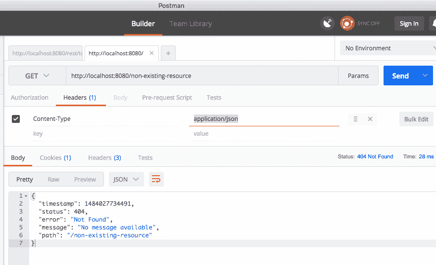
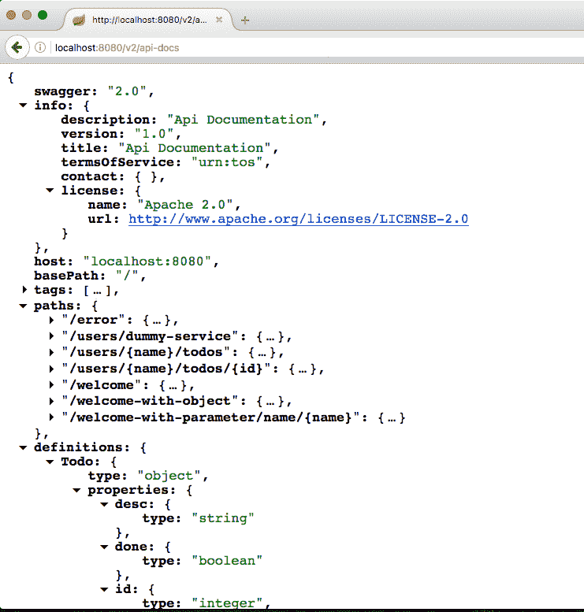
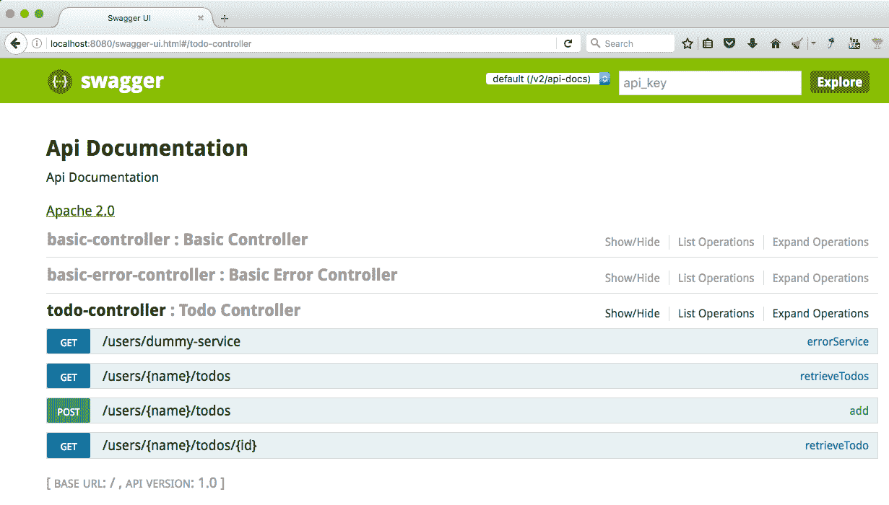
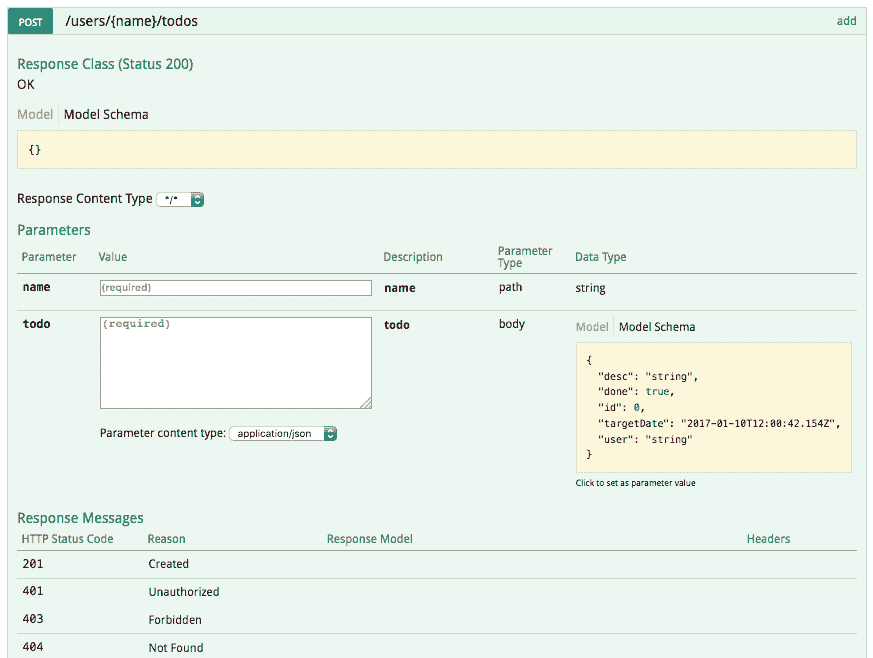
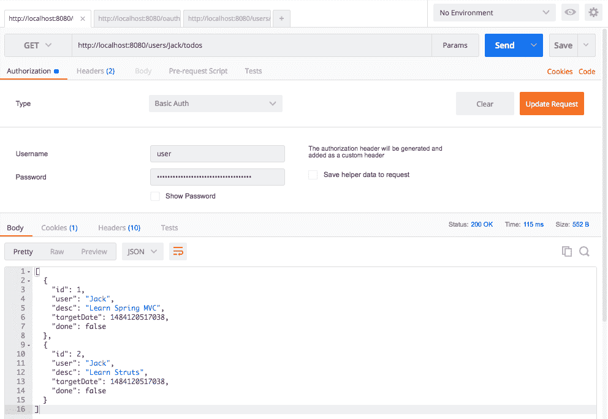
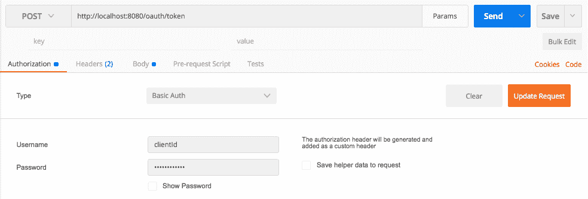
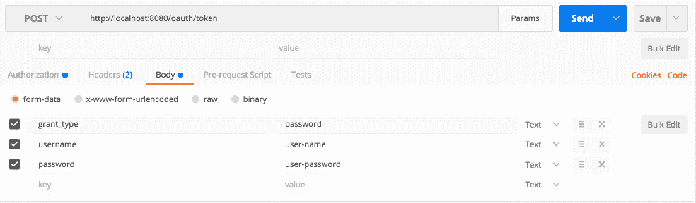
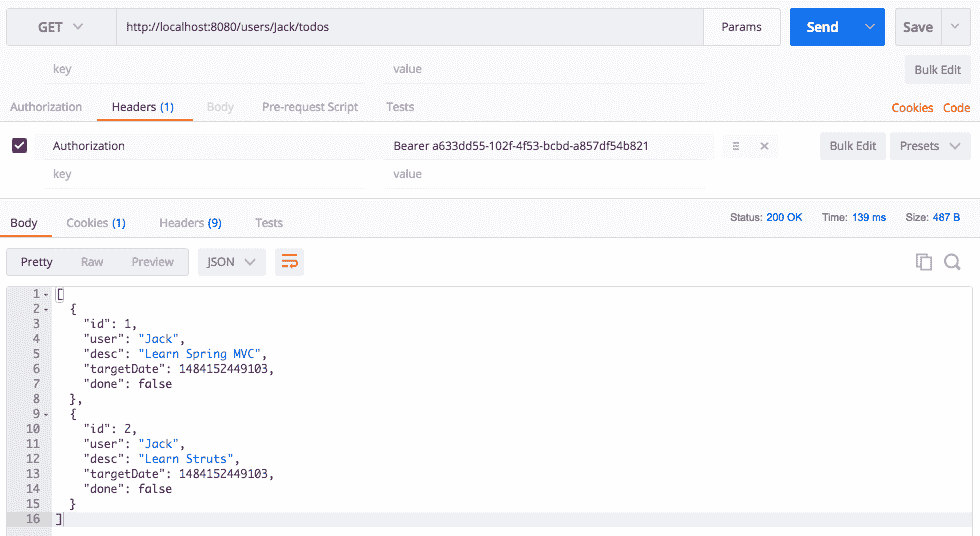
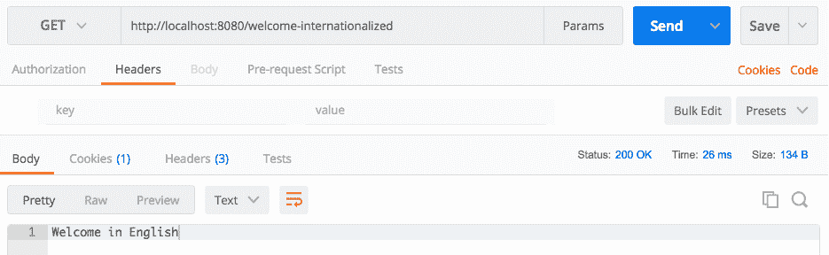
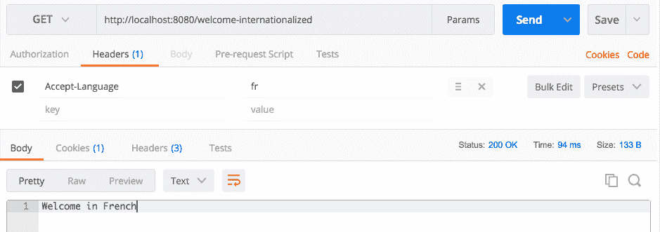

# 第六章：扩展微服务

在第五章《使用 Spring Boot 构建微服务》中，我们构建了一个基本组件，提供了一些服务。在本章中，我们将重点放在添加更多功能，使我们的微服务能够投入生产。

我们将讨论如何将这些功能添加到我们的微服务中：

+   异常处理

+   HATEOAS

+   缓存

+   国际化

我们还将讨论如何使用 Swagger 文档化我们的微服务。我们将了解使用 Spring Security 保护微服务的基础知识。

# 异常处理

异常处理是开发 Web 服务的重要部分之一。当出现问题时，我们希望向服务使用者返回有关出现问题的良好描述。您不希望服务在不返回任何有用信息给服务使用者的情况下崩溃。

Spring Boot 提供了良好的默认异常处理。我们将从查看 Spring Boot 提供的默认异常处理功能开始，然后再进行自定义。

# Spring Boot 默认异常处理

为了了解 Spring Boot 提供的默认异常处理，让我们从向不存在的 URL 发送请求开始。

# 不存在的资源

让我们使用一个头部（Content-Type:application/json）向`http://localhost:8080/non-existing-resource`发送一个`GET`请求。

当我们执行请求时，下面的截图显示了响应：



响应如下代码片段所示：

```java
    {
      "timestamp": 1484027734491,
      "status": 404,
      "error": "Not Found",
      "message": "No message available",
      "path": "/non-existing-resource"
    }
```

一些重要的事情需要注意：

+   响应头具有 HTTP 状态码`404 - 资源未找到`

+   Spring Boot 返回一个有效的 JSON；响应，其中说明资源未找到

# 资源抛出异常

让我们创建一个抛出异常的资源，并向其发送一个`GET`请求，以了解应用程序对运行时异常的反应。

让我们创建一个抛出异常的虚拟服务。下面的代码片段显示了一个简单的服务：

```java
    @GetMapping(path = "/users/dummy-service")
    public Todo errorService() {
      throw new RuntimeException("Some Exception Occured");
    }
```

一些重要的事情需要注意：

+   我们正在创建一个带有 URI `/users/dummy-service`的`GET`服务。

+   该服务抛出`RuntimeException`。我们选择了`RuntimeException`以便能够轻松创建异常。如果需要，我们可以轻松替换为自定义异常。

让我们使用 Postman 向前述服务发送一个`GET`请求，网址为`http://localhost:8080/users/dummy-service`。响应如下所示的代码：

```java
    {
      "timestamp": 1484028119553,
      "status": 500,
      "error": "Internal Server Error",
      "exception": "java.lang.RuntimeException",
      "message": "Some Exception Occured",
      "path": "/users/dummy-service"
   }
```

一些重要的事情需要注意：

+   响应头具有 HTTP 状态码`500`；`内部服务器错误`

+   Spring Boot 还返回抛出异常的消息

正如我们在前面的两个例子中所看到的，Spring Boot 提供了良好的默认异常处理。在下一节中，我们将重点关注应用程序对自定义异常的反应。

# 抛出自定义异常

让我们创建一个自定义异常，并从服务中抛出它。看一下下面的代码：

```java
    public class TodoNotFoundException extends RuntimeException {
      public TodoNotFoundException(String msg) {
        super(msg);
      }
    }
```

这是一个非常简单的代码片段，定义了`TodoNotFoundException`。

现在让我们增强我们的`TodoController`类，当找不到具有给定 ID 的`todo`时抛出`TodoNotFoundException`：

```java
    @GetMapping(path = "/users/{name}/todos/{id}")
    public Todo retrieveTodo(@PathVariable String name, 
    @PathVariable int id) {
      Todo todo = todoService.retrieveTodo(id);
      if (todo == null) {
        throw new TodoNotFoundException("Todo Not Found");
       }

     return todo;
    }
```

如果`todoService`返回一个空的`todo`，我们抛出`TodoNotFoundException`。

当我们向一个不存在的`todo`（`http://localhost:8080/users/Jack/todos/222`）发送一个`GET`请求时，我们得到了下面代码片段中显示的响应：

```java
    {
      "timestamp": 1484029048788,
      "status": 500,
      "error": "Internal Server Error",
      "exception":    
      "com.mastering.spring.springboot.bean.TodoNotFoundException",
      "message": "Todo Not Found",
      "path": "/users/Jack/todos/222"
    }
```

正如我们所看到的，清晰的异常响应被发送回服务使用者。然而，还有一件事情可以进一步改进——响应状态。当找不到资源时，建议返回`404 - 资源未找到`状态。我们将在下一个示例中看看如何自定义响应状态。

# 自定义异常消息

让我们看看如何自定义前面的异常并返回带有自定义消息的适当响应状态。

让我们创建一个 bean 来定义我们自定义异常消息的结构：

```java
    public class ExceptionResponse {
      private Date timestamp = new Date();
      private String message;
      private String details;

      public ExceptionResponse(String message, String details) {
        super();
        this.message = message;
        this.details = details;
       }

      public Date getTimestamp() {
        return timestamp;
      }

      public String getMessage() {
        return message;
      }

      public String getDetails() {
        return details;
      }
     }
```

我们已经创建了一个简单的异常响应 bean，其中包含自动填充的时间戳和一些额外属性，即消息和详细信息。

当抛出`TodoNotFoundException`时，我们希望使用`ExceptionResponse` bean 返回响应。以下代码显示了如何为`TodoNotFoundException.class`创建全局异常处理：

```java
    @ControllerAdvice
    @RestController
    public class RestResponseEntityExceptionHandler 
      extends  ResponseEntityExceptionHandler 
      {
        @ExceptionHandler(TodoNotFoundException.class)
        public final ResponseEntity<ExceptionResponse> 
        todoNotFound(TodoNotFoundException ex) {
           ExceptionResponse exceptionResponse = 
           new ExceptionResponse(  ex.getMessage(), 
           "Any details you would want to add");
           return new ResponseEntity<ExceptionResponse>
           (exceptionResponse, new HttpHeaders(), 
           HttpStatus.NOT_FOUND);
         }
     }
```

需要注意的一些重要事项如下：

+   `RestResponseEntityExceptionHandler 扩展 ResponseEntityExceptionHandler`：我们正在扩展`ResponseEntityExceptionHandler`，这是 Spring MVC 为中心化异常处理`ControllerAdvice`类提供的基类。

+   `@ExceptionHandler(TodoNotFoundException.class)`: 这定义了接下来要处理特定异常`TodoNotFoundException.class`的方法。任何其他未定义自定义异常处理的异常将遵循 Spring Boot 提供的默认异常处理。

+   `ExceptionResponse exceptionResponse = new ExceptionResponse(ex.getMessage(), "您想要添加的任何细节")`：这创建了一个自定义异常响应。

+   `new ResponseEntity<ExceptionResponse>(exceptionResponse,new HttpHeaders(), HttpStatus.NOT_FOUND)`: 这是返回`404 资源未找到`响应的定义，其中包括先前定义的自定义异常。

当我们使用`GET`请求执行服务到一个不存在的`todo`（`http://localhost:8080/users/Jack/todos/222`）时，我们会得到以下响应：

```java
    {
      "timestamp": 1484030343311,
      "message": "Todo Not Found",
      "details": "Any details you would want to add"
    }
```

如果要为所有异常创建通用异常消息，我们可以向`RestResponseEntityExceptionHandler`添加一个带有`@ExceptionHandler(Exception.class)`注解的方法。

以下代码片段显示了我们如何做到这一点：

```java
    @ExceptionHandler(Exception.class)
    public final ResponseEntity<ExceptionResponse> todoNotFound(
    Exception ex) {
       //Customize and return the response
    }
```

任何未定义自定义异常处理程序的异常将由前面的方法处理。

# 响应状态

在 REST 服务中要关注的重要事情之一是错误响应的响应状态。以下表格显示了要使用的场景和错误响应状态：

| **情况** | **响应状态** |
| --- | --- |
| 请求体不符合 API 规范。它没有足够的细节或包含验证错误。 | ;400 错误请求 |
| 认证或授权失败。 | 401 未经授权 |
| 用户由于各种因素无法执行操作，例如超出限制。 | 403 禁止 |
| 资源不存在。 | 404 未找到 |
| 不支持的操作，例如，在只允许`GET`的资源上尝试 POST。; | 405 方法不允许 |
| 服务器上的错误。理想情况下，这不应该发生。消费者将无法修复这个问题。; | 500 内部服务器错误 |

在这一部分，我们看了 Spring Boot 提供的默认异常处理以及我们如何进一步定制以满足我们的需求。

# HATEOAS

**HATEOAS**（**超媒体作为应用状态的引擎**）是 REST 应用程序架构的约束之一。

让我们考虑一种情况，即服务消费者从服务提供者那里消费大量服务。开发这种类型的系统的最简单方法是让服务消费者存储他们从服务提供者那里需要的每个资源的资源 URI。然而，这将在服务提供者和服务消费者之间创建紧密耦合。每当服务提供者上的任何资源 URI 发生变化时，服务消费者都需要进行更新。

考虑一个典型的 Web 应用程序。假设我导航到我的银行账户详情页面。几乎所有银行网站都会在屏幕上显示我在银行账户上可以进行的所有交易的链接，以便我可以通过链接轻松导航。

如果我们可以将类似的概念引入 RESTful 服务，使得服务不仅返回有关请求资源的数据，还提供其他相关资源的详细信息，会怎么样？

HATEOAS 将这个概念引入了 RESTful 服务中，即为给定的资源显示相关链接。当我们返回特定资源的详细信息时，我们还返回可以对该资源执行的操作的链接，以及相关资源的链接。如果服务消费者可以使用响应中的链接执行事务，那么它就不需要硬编码所有链接。

Roy Fielding（[`roy.gbiv.com/untangled/2008/rest-apis-must-be-hypertext-driven`](http://roy.gbiv.com/untangled/2008/rest-apis-must-be-hypertext-driven)）提出的与 HATEOAS 相关的约束摘录如下：

<q>REST API 不得定义固定的资源名称或层次结构（客户端和服务器的明显耦合）。服务器必须有自由控制自己的命名空间。相反，允许服务器指示客户端如何构造适当的 URI，例如在 HTML 表单和 URI 模板中所做的那样，通过在媒体类型和链接关系中定义这些指令。</q> REST API 应该在没有先前知识的情况下进入（书签）和一组适用于预期受众的标准化媒体类型（即，预计任何可能使用 API 的客户端都能理解）。从那时起，所有应用程序状态转换必须由客户端选择接收到的表示中存在的服务器提供的选择来驱动，或者由用户对这些表示的操作所暗示。转换可以由客户端对媒体类型和资源通信机制的知识确定（或受限于），这两者都可以即时改进（例如，按需代码）。

这里显示了一个带有 HATEOAS 链接的示例响应。这是对`/todos`请求的响应，以便检索所有 todos：

```java
    {
      "_embedded" : {
        "todos" : [ {
          "user" : "Jill",
          "desc" : "Learn Hibernate",
          "done" : false,
         "_links" : {
          "self" : {
                 "href" : "http://localhost:8080/todos/1"
                 },
          "todo" : {
                 "href" : "http://localhost:8080/todos/1"
                  }
            }
     } ]
    },
     "_links" : {
     "self" : {
              "href" : "http://localhost:8080/todos"
              },
     "profile" : {
              "href" : "http://localhost:8080/profile/todos"
              },
     "search" : {
              "href" : "http://localhost:8080/todos/search"
              }
       },
     }
```

上述响应包括以下链接：

+   特定的`todos`(`http://localhost:8080/todos/1`)

+   搜索资源(`http://localhost:8080/todos/search`)

如果服务消费者想要进行搜索，它可以选择从响应中获取搜索 URL 并将搜索请求发送到该 URL。这将减少服务提供者和服务消费者之间的耦合。

# 在响应中发送 HATEOAS 链接

现在我们了解了 HATEOAS 是什么，让我们看看如何在响应中发送与资源相关的链接。

# Spring Boot starter HATEOAS

Spring Boot 有一个专门的 HATEOAS 启动器，称为`spring-boot-starter-hateoas`。我们需要将其添加到`pom.xml`文件中。

以下代码片段显示了依赖块：

```java
    <dependency>
      <groupId>org.springframework.boot</groupId>
      <artifactId>spring-boot-starter-hateoas</artifactId>
    </dependency>
```

`spring-boot-starter-hateoas`的一个重要依赖是`spring-hateoas`，它提供了 HATEOAS 功能：

```java
    <dependency>
      <groupId>org.springframework.hateoas</groupId>
      <artifactId>spring-hateoas</artifactId>
    </dependency>
```

让我们增强`retrieveTodo`资源(`/users/{name}/todos/{id}`)以在响应中返回检索所有`todos`(`/users/{name}/todos`)的链接：

```java
    @GetMapping(path = "/users/{name}/todos/{id}")
    public Resource<Todo> retrieveTodo(
    @PathVariable String name, @PathVariable int id) {
    Todo todo = todoService.retrieveTodo(id);
      if (todo == null) {
           throw new TodoNotFoundException("Todo Not Found");
        }

     Resource<Todo> todoResource = new Resource<Todo>(todo);
     ControllerLinkBuilder linkTo = 
     linkTo(methodOn(this.getClass()).retrieveTodos(name));
     todoResource.add(linkTo.withRel("parent"));

     return todoResource;
    }
```

需要注意的一些重要点如下：

+   `ControllerLinkBuilder linkTo = linkTo(methodOn(this.getClass()).retrieveTodos(name))`：我们想要获取当前类中`retrieveTodos`方法的链接

+   `linkTo.withRel("parent")`：当前资源的关系是 parent

以下片段显示了向`http://localhost:8080/users/Jack/todos/1`发送`GET`请求时的响应：

```java
   {
     "id": 1,
     "user": "Jack",
     "desc": "Learn Spring MVC",
     "targetDate": 1484038262110,
     "done": false,
     "_links": {
               "parent": {
               "href": "http://localhost:8080/users/Jack/todos"
               }
        }
   }
```

`_links`部分将包含所有链接。目前，我们有一个带有关系 parent 和`href`为`http://localhost:8080/users/Jack/todos`的链接。

如果您在执行上述请求时遇到问题，请尝试使用 Accept 标头--`application/json`。

HATEOAS 并不是今天大多数资源中常用的东西。然而，它有潜力在服务提供者和消费者之间减少耦合。

# 验证

一个好的服务在处理数据之前总是验证数据。在本节中，我们将研究 Bean Validation API，并使用其参考实现来在我们的服务中实现验证。

Bean Validation API 提供了许多注释，可用于验证 bean。*JSR 349*规范定义了 Bean Validation API 1.1。Hibernate-validator 是参考实现。两者已经在`spring-boot-web-starter`项目中定义为依赖项：

+   `hibernate-validator-5.2.4.Final.jar`

+   `validation-api-1.1.0.Final.jar`

我们将为 createTodo 服务方法创建一个简单的验证。

创建验证包括两个步骤：

1.  在控制器方法上启用验证。

1.  在 bean 上添加验证。

# 在控制器方法上启用验证

在控制器方法上启用验证非常简单。以下代码片段显示了一个示例：

```java
    @RequestMapping(method = RequestMethod.POST, 
    path = "/users/{name}/todos")
    ResponseEntity<?> add(@PathVariable String name
    @Valid @RequestBody Todo todo) {
```

`@Valid（包 javax.validation）`注释用于标记要验证的参数。在执行`add`方法之前，将执行`Todo` bean 中定义的任何验证。

# 在 bean 上定义验证

让我们在`Todo` bean 上定义一些验证：

```java
   public class Todo {
     private int id; 

     @NotNull
     private String user;

     @Size(min = 9, message = "Enter atleast 10 Characters.")
     private String desc;
```

需要注意的一些重要点如下：

+   `@NotNull`：验证用户字段不为空

+   `@Size(min = 9, message = "Enter atleast 10 Characters.")`：检查`desc`字段是否至少有九个字符。

还有许多其他注释可用于验证 bean。以下是一些 Bean Validation 注释：

+   `@AssertFalse`，`@AssertTrue`：对于布尔元素。检查被注释的元素。

+   `@AssertFalse`：检查是否为 false。`@Assert`检查是否为 true。

+   `@Future`：被注释的元素必须是将来的日期。

+   `@Past`：被注释的元素必须是过去的日期。

+   `@Max`：被注释的元素必须是一个数字，其值必须小于或等于指定的最大值。

+   `@Min`：被注释的元素必须是一个数字，其值必须大于或等于指定的最小值。

+   `@NotNull`：被注释的元素不能为空。

+   `@Pattern`：被注释的`{@code CharSequence}`元素必须与指定的正则表达式匹配。正则表达式遵循 Java 正则表达式约定。

+   `@Size`：被注释的元素大小必须在指定的边界内。

# 单元测试验证

以下示例显示了如何对我们添加的验证进行单元测试：

```java
     @Test
     public void createTodo_withValidationError() throws Exception {
       Todo mockTodo = new Todo(CREATED_TODO_ID, "Jack", 
       "Learn Spring MVC", new Date(), false);

       String todo = "{"user":"Jack","desc":"Learn","done":false}";

       when( service.addTodo(
         anyString(), anyString(), isNull(), anyBoolean()))
        .thenReturn(mockTodo);

         MvcResult result = mvc.perform(
         MockMvcRequestBuilders.post("/users/Jack/todos")
        .content(todo)
        .contentType(MediaType.APPLICATION_JSON))
        .andExpect(
           status().is4xxClientError()).andReturn();
     }
```

需要注意的一些重要点如下：

+   `"desc":"Learn"`：我们使用长度为`5`的 desc 值。这将导致`@Size(min = 9, message = "Enter atleast 10 Characters.")`检查失败。

+   `.andExpect(status().is4xxClientError())`：检查验证错误状态。

# REST 服务文档

在服务提供者可以使用服务之前，他们需要一个服务合同。服务合同定义了有关服务的所有细节：

+   我如何调用服务？服务的 URI 是什么？

+   请求格式应该是什么？

+   我应该期望什么样的响应？

有多种选项可用于为 RESTful 服务定义服务合同。在过去几年中最受欢迎的是**Swagger**。Swagger 在过去几年中得到了很多支持，得到了主要供应商的支持。在本节中，我们将为我们的服务生成 Swagger 文档。

来自 Swagger 网站（[`swagger.io`](http://swagger.io)）的以下引用定义了 Swagger 规范的目的：

Swagger 规范为您的 API 创建 RESTful 合同，详细说明了所有资源和操作，以人类和机器可读的格式进行易于开发、发现和集成。

# 生成 Swagger 规范

RESTful 服务开发在过去几年中的一个有趣发展是工具的演变，可以从代码生成服务文档（规范）。这确保了代码和文档始终保持同步。

**Springfox Swagger**可以用来从 RESTful 服务代码生成 Swagger 文档。此外，还有一个名为**Swagger UI**的精彩工具，当集成到应用程序中时，提供人类可读的文档。

以下代码片段显示了如何将这两个工具添加到`pom.xml`文件中：

```java
    <dependency>
     <groupId>io.springfox</groupId>
     <artifactId>springfox-swagger2</artifactId>
     <version>2.4.0</version>
    </dependency>

    <dependency>
     <groupId>io.springfox</groupId>
     <artifactId>springfox-swagger-ui</artifactId>
     <version>2.4.0</version>
    </dependency>
```

下一步是添加配置类以启用和生成 Swagger 文档。以下代码片段显示了如何做到这一点：

```java
    @Configuration
    @EnableSwagger2
    public class SwaggerConfig {
      @Bean
      public Docket api() {
        return new Docket(DocumentationType.SWAGGER_2)
        .select()
        .apis(RequestHandlerSelectors.any())
        .paths(PathSelectors.any()).build();
      }
    }
```

需要注意的一些重要点如下：

+   `@Configuration`：定义一个 Spring 配置文件

+   `@EnableSwagger2`：启用 Swagger 支持的注解

+   `Docket`：一个简单的构建器类，用于使用 Swagger Spring MVC 框架配置 Swagger 文档的生成

+   `new Docket(DocumentationType.SWAGGER_2)`：配置 Swagger 2 作为要使用的 Swagger 版本

+   `.apis(RequestHandlerSelectors.any()).paths(PathSelectors.any())`：包括文档中的所有 API 和路径

当我们启动服务器时，我们可以启动 API 文档 URL（`http://localhost:8080/v2/api-docs`）。以下截图显示了一些生成的文档：



让我们来看一些生成的文档。这里列出了检索`todos`服务的文档：

```java
    "/users/{name}/todos": {
      "get": {
      "tags": [
             "todo-controller"
             ],
      "summary": "retrieveTodos",
      "operationId": "retrieveTodosUsingGET",
      "consumes": [
               "application/json"
               ],
      "produces": [
               "*/*"
               ],
      "parameters": [
              {
                "name": "name",
                "in": "path",
                "description": "name",
                "required": true,
                "type": "string"
              }
             ],
       "responses": {
       "200": {
              "description": "OK",
              "schema": {
                      "type": "array",
                      items": {
                          "$ref": "#/definitions/Todo"
                        }
                       }
               },
       "401": {
                "description": "Unauthorized"
               },
       "403": {
                "description": "Forbidden"
              },
       "404": {
                "description": "Not Found"
              } 
        }
     }
```

服务定义清楚地定义了服务的请求和响应。还定义了服务在不同情况下可以返回的不同响应状态。

以下代码片段显示了`Todo` bean 的定义：

```java
    "Resource«Todo»": {
      "type": "object",
      "properties": {
      "desc": {
               "type": "string"
             },
     "done": {
               "type": "boolean"
             },
     "id": {
              "type": "integer",
              "format": "int32"
           },
     "links": {
              "type": "array",
              "items": {
                         "$ref": "#/definitions/Link"
                       }
              },
     "targetDate": {
                    "type": "string",
                    "format": "date-time"
                },
     "user": {
              "type": "string"
            }
        }
      }
```

它定义了`Todo` bean 中的所有元素，以及它们的格式。

# Swagger UI

Swagger UI（`http://localhost:8080/swagger-ui.html`）也可以用来查看文档。Swagger UI 是通过在上一步中添加到我们的`pom.xml`中的依赖项（`io.springfox:springfox-swagger-ui`）启用的。

Swagger UI（[`petstore.swagger.io`](http://petstore.swagger.io)）也可以在线使用。我们可以使用 Swagger UI 可视化任何 Swagger 文档（swagger JSON）。

以下截图显示了公开控制器服务的列表。当我们点击任何控制器时，它会展开显示每个控制器支持的请求方法和 URI 列表：



以下截图显示了在 Swagger UI 中为创建用户的`todo`服务的 POST 服务的详细信息：



需要注意的一些重要事项如下：

+   参数显示了所有重要的参数，包括请求体

+   参数类型 body（对于`todo`参数）显示了请求体的预期结构

+   响应消息部分显示了服务返回的不同 HTTP 状态代码

Swagger UI 提供了一种出色的方式来在不需要太多额外工作的情况下公开 API 的服务定义。

# 使用注解自定义 Swagger 文档

Swagger UI 还提供了注解来进一步自定义您的文档。

这里列出了检索`todos`服务的一些文档：

```java
    "/users/{name}/todos": {
      "get": {
      "tags": [
             "todo-controller"
             ],
      "summary": "retrieveTodos",
      "operationId": "retrieveTodosUsingGET",
      "consumes": [
               "application/json"
               ],
      "produces": [
                "*/*"
               ],
```

如您所见，生成的文档非常原始。我们可以在文档中改进许多内容，以更好地描述服务。以下是一些示例：

+   提供更好的摘要

+   添加 application/JSON 到 produces

Swagger 提供了我们可以添加到我们的 RESTful 服务中的注解，以自定义文档。让我们在控制器中添加一些注解以改进文档：

```java
    @ApiOperation(
      value = "Retrieve all todos for a user by passing in his name", 
      notes = "A list of matching todos is returned. Current pagination   
      is not supported.",
      response = Todo.class, 
      responseContainer = "List", 
      produces = "application/json")
      @GetMapping("/users/{name}/todos")
      public List<Todo> retrieveTodos(@PathVariable String name) {
        return todoService.retrieveTodos(name);
     }
```

需要注意的几个重要点如下：

+   `@ApiOperation(value = "Retrieve all todos for a user by passing in his name")`：在文档中作为服务摘要生成

+   `notes = "A list of matching todos is returned. Current pagination is not supported."`：在文档中生成作为服务描述的说明

+   `produces = "application/json”`：自定义服务文档的`produces`部分

以下是更新后的文档摘录：

```java
    get": {
         "tags": [
                   "todo-controller"
                 ],
         "summary": "Retrieve all todos for a user by passing in his 
          name",
         "description": "A list of matching todos is returned. Current 
          pagination is not supported.",
         "operationId": "retrieveTodosUsingGET",
         "consumes": [
                     "application/json"
                   ],
         "produces": [
                     "application/json",
                     "*/*"
                   ],
```

Swagger 提供了许多其他注解来自定义文档。以下列出了一些重要的注解：

+   `@Api`：将类标记为 Swagger 资源

+   `@ApiModel`：提供有关 Swagger 模型的附加信息

+   `@ApiModelProperty`：添加和操作模型属性的数据

+   `@ApiOperation`：描述针对特定路径的操作或 HTTP 方法

+   `@ApiParam`：为操作参数添加附加元数据

+   `@ApiResponse`：描述操作的示例响应

+   `@ApiResponses`：允许多个`ApiResponse`对象的列表包装器。

+   `@Authorization`：声明要在资源或操作上使用的授权方案

+   `@AuthorizationScope`：描述 OAuth 2 授权范围

+   `@ResponseHeader`：表示可以作为响应的一部分提供的标头

Swagger 提供了一些 Swagger 定义注解，可以用来自定义有关一组服务的高级信息--联系人、许可和其他一般信息。以下是一些重要的注解：

+   `@SwaggerDefinition`：要添加到生成的 Swagger 定义的定义级属性

+   `@Info`：Swagger 定义的一般元数据

+   `@Contact`：用于描述 Swagger 定义的联系人的属性

+   `@License`：用于描述 Swagger 定义的许可证的属性

# 使用 Spring Security 保护 REST 服务

到目前为止，我们创建的所有服务都是不安全的。消费者不需要提供任何凭据即可访问这些服务。然而，在现实世界中，所有服务通常都是受保护的。

在本节中，我们将讨论验证 REST 服务的两种方式：

+   基本身份验证

+   OAuth 2.0 身份验证

我们将使用 Spring Security 实现这两种类型的身份验证。

Spring Boot 提供了一个用于 Spring Security 的启动器；`spring-boot-starter-security`。我们将从向我们的`pom.xml`文件中添加 Spring Security 启动器开始。

# 添加 Spring Security 启动器

将以下依赖项添加到您的文件`pom.xml`中：

```java
    <dependency>
      <groupId>org.springframework.boot</groupId>
      <artifactId>spring-boot-starter-security</artifactId>
    </dependency>
```

`Spring-boot-starter-security`依赖项；引入了三个重要的 Spring Security 依赖项：

+   `spring-security-config`

+   `spring-security-core`

+   `spring-security-web`

# 基本身份验证

`Spring-boot-starter-security`依赖项；还默认为所有服务自动配置基本身份验证。

如果我们现在尝试访问任何服务，我们将收到`"拒绝访问"`的消息。

当我们发送请求到`http://localhost:8080/users/Jack/todos`时的响应如下代码片段中所示：

```java
    {
      "timestamp": 1484120815039,
      "status": 401,
      "error": "Unauthorized",
      "message": "Full authentication is required to access this 
       resource",
       "path": "/users/Jack/todos"
    }
```

响应状态为`401 - 未经授权`。

当资源受基本身份验证保护时，我们需要发送用户 ID 和密码来验证我们的请求。由于我们没有配置用户 ID 和密码，Spring Boot 会自动配置默认的用户 ID 和密码。默认用户 ID 是`user`。默认密码通常会打印在日志中。

以下代码片段中显示了一个示例：

```java
2017-01-11 13:11:58.696 INFO 3888 --- [ restartedMain] b.a.s.AuthenticationManagerConfiguration :

Using default security password: 3fb5564a-ce53-4138-9911-8ade17b2f478

2017-01-11 13:11:58.771 INFO 3888 --- [ restartedMain] o.s.s.web.DefaultSecurityFilterChain : Creating filter chain: Ant [pattern='/css/**'], []
```

在上述代码片段中划线的是日志中打印的默认安全密码。

我们可以使用 Postman 发送带有基本身份验证的请求。以下截图显示了如何在请求中发送基本身份验证详细信息：



正如你所看到的，身份验证成功，我们得到了一个适当的响应。

我们可以在`application.properties`中配置我们选择的用户 ID 和密码，如下所示：

```java
   security.user.name=user-name
   security.user.password=user-password
```

Spring Security 还提供了使用 LDAP 或 JDBC 或任何其他数据源进行用户凭据身份验证的选项。

# 集成测试

我们之前为服务编写的集成测试将因为无效的凭据而开始失败。我们现在将更新集成测试以提供基本身份验证凭据：

```java
    private TestRestTemplate template = new TestRestTemplate();
    HttpHeaders headers = createHeaders("user-name", "user-password");

    HttpHeaders createHeaders(String username, String password) {
      return new HttpHeaders() {
       {
         String auth = username + ":" + password;
         byte[] encodedAuth = Base64.getEncoder().encode
         (auth.getBytes(Charset.forName("US-ASCII")));
         String authHeader = "Basic " + new String(encodedAuth);
         set("Authorization", authHeader);
        }
      };
     }

    @Test
    public void retrieveTodos() throws Exception {
      String expected = "["
      + "{id:1,user:Jack,desc:\"Learn Spring MVC\",done:false}" + ","
      + "{id:2,user:Jack,desc:\"Learn Struts\",done:false}" + "]";
      ResponseEntity<String> response = template.exchange(
      createUrl("/users/Jack/todos"), HttpMethod.GET,
      new HttpEntity<String>(null, headers),
      String.class);
      JSONAssert.assertEquals(expected, response.getBody(), false);
    }
```

需要注意的一些重要事项如下：

+   `createHeaders("user-name", "user-password")`：此方法创建`Base64\. getEncoder().encode`基本身份验证标头

+   `ResponseEntity<String> response = template.exchange(createUrl("/users/Jack/todos"), ;HttpMethod.GET,new HttpEntity<String>(null, headers), String.class)`: 关键变化是使用`HttpEntity`来提供我们之前创建的标头给 REST 模板

# 单元测试

我们不希望在单元测试中使用安全性。以下代码片段显示了如何在单元测试中禁用安全性：

```java
   @RunWith(SpringRunner.class)
   @WebMvcTest(value = TodoController.class, secure = false)
   public class TodoControllerTest {
```

关键部分是`WebMvcTest`注解上的`secure = false`参数。这将禁用单元测试的 Spring Security。

# OAuth 2 认证

OAuth 是一种协议，提供了一系列流程，用于在各种网络应用程序和服务之间交换授权和认证信息。它使第三方应用程序能够从服务中获取对用户信息的受限访问权限，例如 Facebook、Twitter 或 GitHub。

在深入细节之前，回顾一下通常与 OAuth 2 认证相关的术语将会很有用。

让我们考虑一个例子。假设我们想要将 Todo API 暴露给互联网上的第三方应用程序。

以下是典型 OAuth 2 交换中的重要参与者：

+   **资源所有者**：这是第三方应用程序的用户，希望使用我们的 Todo API。它决定我们的 API 中的信息可以向第三方应用程序提供多少。

+   **资源服务器**：托管 Todo API，我们想要保护的资源。

+   **客户端**：这是希望使用我们的 API 的第三方应用程序。

+   **授权服务器**：提供 OAuth 服务的服务器。

# 高级流程

以下步骤展示了典型 OAuth 认证的高级流程：

1.  应用程序请求用户授权访问 API 资源。

1.  当用户提供访问权限时，应用程序会收到授权授予。

1.  应用程序提供用户授权授予和自己的客户端凭据给授权服务器。

1.  如果认证成功，授权服务器将以访问令牌回复。

1.  应用程序调用提供认证访问令牌的 API（资源服务器）。

1.  如果访问令牌有效，资源服务器返回资源的详细信息。

# 为我们的服务实现 OAuth 2 认证

Spring Security 的 OAuth 2（`spring-security-oauth2`）是为 Spring Security 提供 OAuth 2 支持的模块。我们将在`pom.xml`文件中将其添加为依赖项：

```java
    <dependency>
      <groupId>org.springframework.security.oauth</groupId>
      <artifactId>spring-security-oauth2</artifactId>
    </dependency>
```

# 设置授权和资源服务器

spring-security-oauth2 截至 2017 年 6 月尚未更新以适应 Spring Framework 5.x 和 Spring Boot 2.x 的变化。我们将使用 Spring Boot 1.5.x 来举例说明 OAuth 2 认证。代码示例在 GitHub 存储库中；[`github.com/PacktPublishing/Mastering-Spring-5.0`](https://github.com/PacktPublishing/Mastering-Spring-5.0)。

通常，授权服务器会是一个不同的服务器，而不是 API 暴露的应用程序。为了简化，我们将使当前的 API 服务器同时充当资源服务器和授权服务器。

以下代码片段显示了如何使我们的应用程序充当资源和授权服务器：

```java
   @EnableResourceServer
   @EnableAuthorizationServer
   @SpringBootApplication
   public class Application {
```

以下是一些重要的事项：

+   `@EnableResourceServer`：OAuth 2 资源服务器的便利注解，启用 Spring Security 过滤器，通过传入的 OAuth 2 令牌对请求进行身份验证

+   `@EnableAuthorizationServer`：一个便利注解，用于在当前应用程序上下文中启用授权服务器，必须是`DispatcherServlet`上下文，包括`AuthorizationEndpoint`和`TokenEndpoint`

现在我们可以在`application.properties`中配置访问详情，如下所示：

```java
    security.user.name=user-name
    security.user.password=user-password
    security.oauth2.client.clientId: clientId
    security.oauth2.client.clientSecret: clientSecret
    security.oauth2.client.authorized-grant-types:     
    authorization_code,refresh_token,password
    security.oauth2.client.scope: openid
```

一些重要的细节如下：

+   `security.user.name`和`security.user.password`是资源所有者的身份验证详细信息，是第三方应用程序的最终用户

+   `security.oauth2.client.clientId`和`security.oauth2.client.clientSecret`是客户端的身份验证详细信息，是第三方应用程序（服务消费者）

# 执行 OAuth 请求

我们需要一个两步骤的过程来访问 API：

1.  获取访问令牌。

1.  使用访问令牌执行请求。

# 获取访问令牌

要获取访问令牌，我们调用授权服务器（`http://localhost:8080/oauth/token`），在基本身份验证模式下提供客户端身份验证详细信息和用户凭据作为表单数据的一部分。以下截图显示了我们如何在基本身份验证中配置客户端身份验证详细信息：



以下截图显示了如何将用户身份验证详细信息配置为 POST 参数的一部分：



我们使用`grant_type`作为密码，表示我们正在发送用户身份验证详细信息以获取访问令牌。当我们执行请求时，我们会得到类似以下代码片段所示的响应：

```java
    {
      "access_token": "a633dd55-102f-4f53-bcbd-a857df54b821",
      "token_type": "bearer",
      "refresh_token": "d68d89ec-0a13-4224-a29b-e9056768c7f0",
      "expires_in": 43199,
      "scope": "openid"
    }
```

以下是一些重要细节：

+   `access_token`: 客户端应用程序可以使用访问令牌来进行进一步的 API 调用身份验证。然而，访问令牌将在通常非常短的时间内过期。

+   `refresh_token`: 客户端应用程序可以使用`refresh_token`向认证服务器提交新请求，以获取新的`access_token`。

# 使用访问令牌执行请求

一旦我们有了`access_token`，我们可以使用`access_token`执行请求，如下截图所示：



正如您在前面的截图中所看到的，我们在请求标头中提供了访问令牌，称为 Authorization。我们使用格式的值`"Bearer {access_token}"`。身份验证成功，我们得到了预期的资源详细信息。

# 集成测试

现在我们将更新我们的集成测试以提供 OAuth 2 凭据。以下测试突出了重要细节：

```java
    @Test
    public void retrieveTodos() throws Exception {
      String expected = "["
      + "{id:1,user:Jack,desc:\"Learn Spring MVC\",done:false}" + ","
      +"{id:2,user:Jack,desc:\"Learn Struts\",done:false}" + "]";
      String uri = "/users/Jack/todos";
      ResourceOwnerPasswordResourceDetails resource = 
      new ResourceOwnerPasswordResourceDetails();
      resource.setUsername("user-name");
      resource.setPassword("user-password");
      resource.setAccessTokenUri(createUrl("/oauth/token"));
      resource.setClientId("clientId");
      resource.setClientSecret("clientSecret");
      resource.setGrantType("password");
      OAuth2RestTemplate oauthTemplate = new 
      OAuth2RestTemplate(resource,new 
      DefaultOAuth2ClientContext());
      ResponseEntity<String> response = 
      oauthTemplate.getForEntity(createUrl(uri), String.class);
     JSONAssert.assertEquals(expected, response.getBody(), false);
    }
```

一些重要的事项如下：

+   `ResourceOwnerPasswordResourceDetails resource = new ResourceOwnerPasswordResourceDetails()`: 我们使用用户凭据和客户端凭据设置了`ResourceOwnerPasswordResourceDetails`

+   `resource.setAccessTokenUri(createUrl("/oauth/token"))`: 配置认证服务器的 URL

+   `OAuth2RestTemplate oauthTemplate = new OAuth2RestTemplate(resource,new DefaultOAuth2ClientContext())`: `OAuth2RestTemplate`是`RestTemplate`的扩展，支持 OAuth 2 协议

在本节中，我们看了如何在资源中启用 OAuth 2 身份验证。

# 国际化

**国际化**（**i18n**）是开发应用程序和服务的过程，使它们可以为世界各地的不同语言和文化进行定制。它也被称为**本地化**。国际化或本地化的目标是构建可以以多种语言和格式提供内容的应用程序。

Spring Boot 内置支持国际化。

让我们构建一个简单的服务，以了解如何在我们的 API 中构建国际化。

我们需要向我们的 Spring Boot 应用程序添加`LocaleResolver`和消息源。以下代码片段应包含在`Application.java`中：

```java
    @Bean
    public LocaleResolver localeResolver() {
      SessionLocaleResolver sessionLocaleResolver = 
      new SessionLocaleResolver();
      sessionLocaleResolver.setDefaultLocale(Locale.US);
      return sessionLocaleResolver;
    }

   @Bean
   public ResourceBundleMessageSource messageSource() {
     ResourceBundleMessageSource messageSource = 
     new ResourceBundleMessageSource();
     messageSource.setBasenames("messages");
     messageSource.setUseCodeAsDefaultMessage(true);
    return messageSource;
   }
```

一些重要的事项如下：

+   `sessionLocaleResolver.setDefaultLocale(Locale.US)`: 我们设置了`Locale.US`的默认区域设置。

+   `messageSource.setBasenames("messages")`: 我们将消息源的基本名称设置为`messages`。如果我们处于 fr 区域设置（法国），我们将使用`message_fr.properties`中的消息。如果在`message_fr.properties`中找不到消息，则将在默认的`message.properties`中搜索。

+   `messageSource.setUseCodeAsDefaultMessage(true)`: 如果未找到消息，则将代码作为默认消息返回。

让我们配置各自文件中的消息。让我们从`messages`属性开始。该文件中的消息将作为默认消息：

```java
    welcome.message=Welcome in English
```

让我们也配置`messages_fr.properties`。该文件中的消息将用于区域设置。如果此处不存在消息，则将使用`messages.properties`中的默认消息：

```java
   welcome.message=Welcome in French
```

让我们创建一个服务，根据`"Accept-Language"`头中指定的区域设置返回特定消息：

```java
    @GetMapping("/welcome-internationalized")
    public String msg(@RequestHeader(value = "Accept-Language", 
    required = false) Locale locale) {
      return messageSource.getMessage("welcome.message", null, 
      locale);
    }
```

以下是需要注意的几点：

+   `@RequestHeader(value = "Accept-Language", required = false) Locale locale`：区域设置从请求头`Accept-Language`中获取。不是必需的。如果未指定区域设置，则使用默认区域设置。

+   `messageSource.getMessage("welcome.message", null, locale)`: `messageSource`被自动装配到控制器中。我们根据给定的区域设置获取欢迎消息。

以下屏幕截图显示了在不指定默认`Accept-Language`时调用前面的服务时的响应：



从`messages.properties`返回默认消息。

以下屏幕截图显示了在使用`Accept-Language fr`调用前面的服务时的响应：



从`messages_fr.properties`返回本地化消息。

在前面的示例中，我们定制了服务，根据请求中的区域设置返回本地化消息。类似的方法可以用于国际化组件中的所有服务。

# 缓存

从服务中缓存数据在提高应用程序性能和可扩展性方面起着至关重要的作用。在本节中，我们将看一下 Spring Boot 提供的实现选项。

Spring 提供了基于注解的缓存抽象。我们将首先使用 Spring 缓存注解。稍后，我们将介绍*JSR-107*缓存注解，并将它们与 Spring 抽象进行比较。

# Spring-boot-starter-cache

Spring Boot 为缓存提供了一个启动器项目`spring-boot-starter-cache`。将其添加到应用程序中会引入所有依赖项，以启用*JSR-107*和 Spring 缓存注解。以下代码片段显示了`spring-boot-starter-cache`的依赖项详细信息。让我们将其添加到我们的文件`pom.xml`中：

```java
    <dependency>
      <groupId>org.springframework.boot</groupId>
      <artifactId>spring-boot-starter-cache</artifactId>
    </dependency>
```

# 启用缓存

在我们开始使用缓存之前，我们需要在应用程序上启用缓存。以下代码片段显示了如何启用缓存：

```java
    @EnableCaching
    @SpringBootApplication
    public class Application {
```

`@EnableCaching`将在 Spring Boot 应用程序中启用缓存。

Spring Boot 会自动配置适当的 CacheManager 框架，作为相关缓存的提供者。稍后我们将详细了解 Spring Boot 如何决定 CacheManager。

# 缓存数据

现在我们已经启用了缓存，我们可以在希望缓存数据的方法上添加`@Cacheable`注解。以下代码片段显示了如何在`retrieveTodos`上启用缓存：

```java
    @Cacheable("todos")
    public List<Todo> retrieveTodos(String user) {
```

在前面的示例中，特定用户的`todos`被缓存。对于特定用户的方法的第一次调用，`todos`将从服务中检索。对于相同用户的后续调用，数据将从缓存中返回。

Spring 还提供了有条件的缓存。在以下代码片段中，仅当满足指定条件时才启用缓存：

```java
    @Cacheable(cacheNames="todos", condition="#user.length < 10”)
    public List<Todo> retrieveTodos(String user) {
```

Spring 还提供了额外的注解来从缓存中清除数据并向缓存中添加一些自定义数据。一些重要的注解如下所示：

+   `@CachePut`：用于显式向缓存中添加数据

+   `@CacheEvict`：用于从缓存中删除过期数据

+   `@Caching`：允许在同一个方法上使用多个嵌套的`@Cacheable`、`@CachePut`和`@CacheEvict`注解

# JSR-107 缓存注解

*JSR-107*旨在标准化缓存注解。以下是一些重要的*JSR-107*注解：

+   `@CacheResult`：类似于`@Cacheable`

+   `@CacheRemove`：类似于`@CacheEvict`；如果发生异常，`@CacheRemove`支持有条件的驱逐

+   `@CacheRemoveAll`：类似于`@CacheEvict(allEntries=true)`；用于从缓存中移除所有条目

*JSR-107*和 Spring 的缓存注解在提供的功能方面非常相似。它们中的任何一个都是一个不错的选择。我们稍微倾向于*JSR-107*，因为它是一个标准。但是，请确保在同一个项目中不要同时使用两者。

# 自动检测顺序

启用缓存时，Spring Boot 自动配置开始寻找缓存提供程序。以下列表显示了 Spring Boot 搜索缓存提供程序的顺序。列表按优先级递减的顺序排列：

+   JCache（*JSR-107*）（EhCache 3、Hazelcast、Infinispan 等）

+   EhCache 2.x

+   Hazelcast

+   Infinispan

+   Couchbase

+   Redis

+   Caffeine

+   Guava

+   Simple

# 摘要

Spring Boot 使得开发基于 Spring 的应用变得简单。它使我们能够非常快速地创建生产就绪的应用程序。

在本章中，我们介绍了如何向我们的应用程序添加异常处理、缓存和国际化等功能。我们讨论了使用 Swagger 记录 REST 服务的最佳实践。我们了解了如何使用 Spring Security 保护我们的微服务的基础知识。

在下一章中，我们将把注意力转向 Spring Boot 中的高级功能。我们将学习如何在我们的 REST 服务之上提供监控，学习如何将微服务部署到云上，并了解如何在使用 Spring Boot 开发应用程序时变得更加高效。
